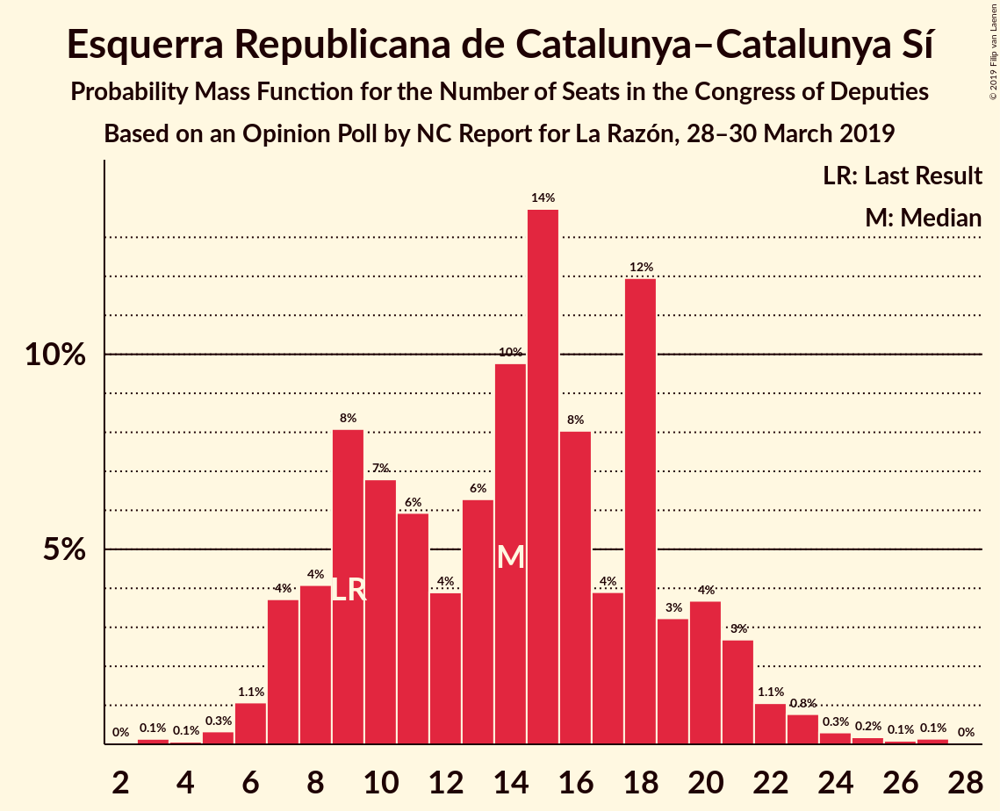
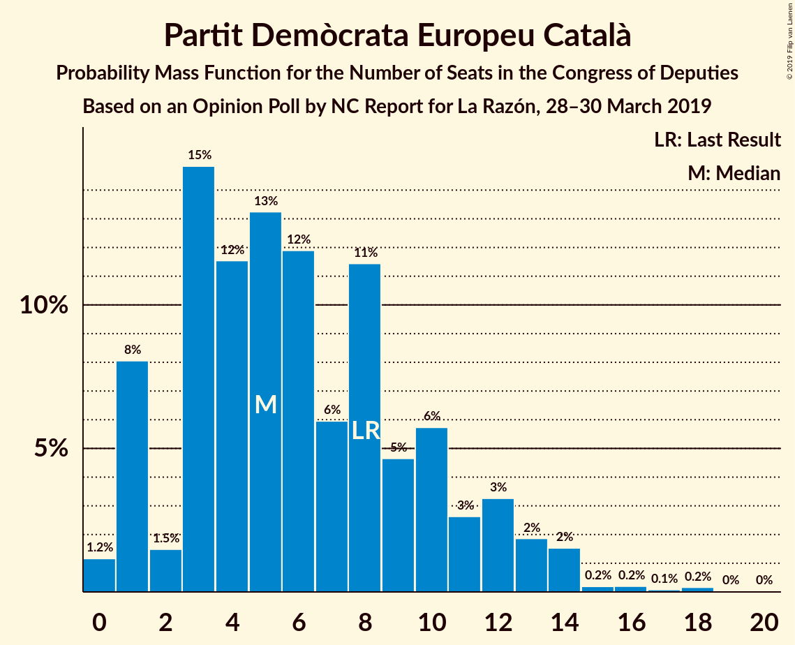
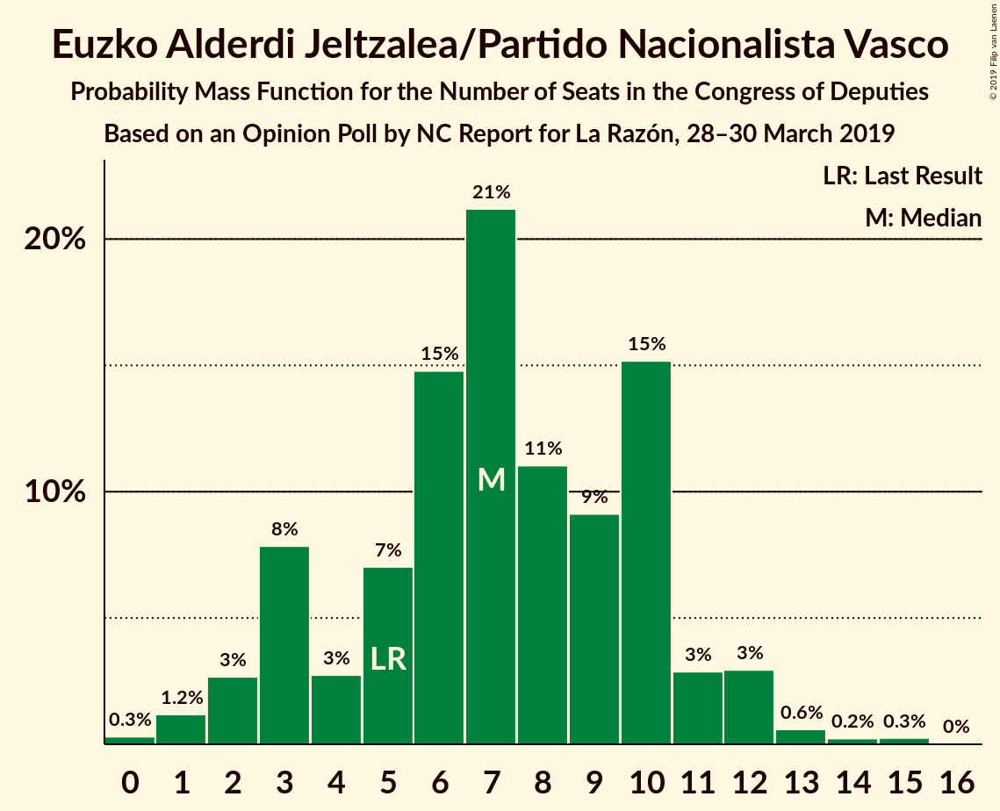
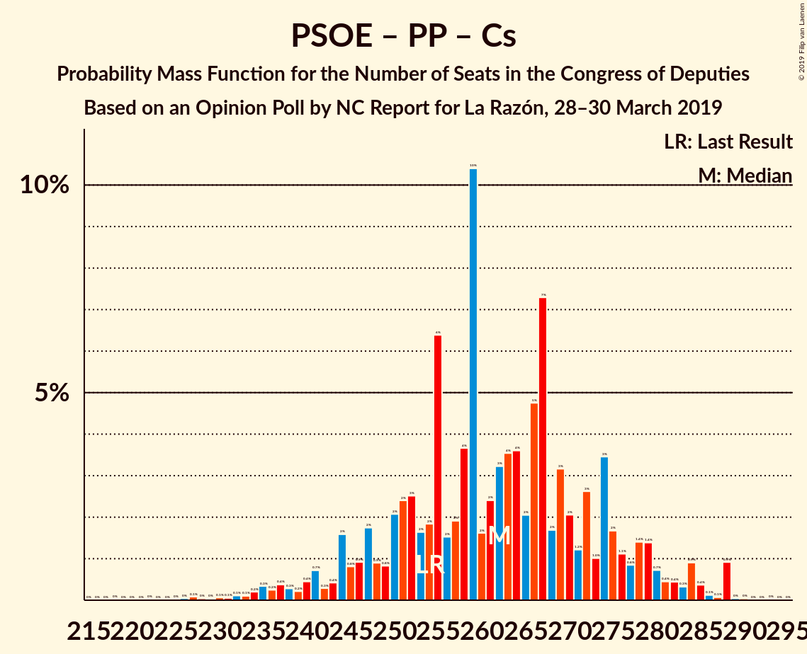

# Opinion Poll by NC Report for La Razón, 28–30 March 2019

<a href="#voting-intentions">Voting Intentions</a> | <a href="#seats">Seats</a> | <a href="#coalitions">Coalitions</a> | <a href="#technical-information">Technical Information</a>

## Voting Intentions

### Confidence Intervals

| Party | Last Result | Poll Result | 80% Confidence Interval | 90% Confidence Interval | 95% Confidence Interval | 99% Confidence Interval |
|:-----:|:-----------:|:-----------:|:-----------------------:|:-----------------------:|:-----------------------:|:-----------------------:|
| Partido Socialista Obrero Español | 22.6% | 26.7% | 23.6–30.1% |22.7–31.1% |22.0–32.0% |20.6–33.7% |
| Partido Popular | 33.0% | 23.0% | 20.1–26.3% |19.3–27.3% |18.6–28.1% |17.3–29.8% |
| Ciudadanos–Partido de la Ciudadanía | 13.1% | 16.7% | 14.2–19.7% |13.5–20.6% |12.9–21.3% |11.8–22.8% |
| Unidos Podemos | 21.2% | 12.0% | 9.9–14.7% |9.3–15.5% |8.8–16.2% |7.9–17.6% |
| Vox | 0.2% | 10.3% | 8.4–12.9% |7.8–13.7% |7.4–14.3% |6.5–15.6% |
| Esquerra Republicana de Catalunya–Catalunya Sí | 2.7% | 3.0% | 2.1–4.7% |1.8–5.2% |1.6–5.6% |1.2–6.5% |
| Partit Demòcrata Europeu Català | 2.0% | 1.3% | 0.8–2.7% |0.7–3.0% |0.5–3.4% |0.4–4.1% |
| Euzko Alderdi Jeltzalea/Partido Nacionalista Vasco | 1.2% | 1.3% | 0.8–2.7% |0.7–3.0% |0.5–3.4% |0.4–4.1% |
| Euskal Herria Bildu | 0.8% | 0.7% | 0.4–1.8% |0.3–2.1% |0.2–2.4% |0.1–3.0% |

*Note:* The poll result column reflects the actual value used in the calculations. Published results may vary slightly, and in addition be rounded to fewer digits.

## Seats

### Confidence Intervals

| Party | Last Result | Median | 80% Confidence Interval | 90% Confidence Interval | 95% Confidence Interval | 99% Confidence Interval |
|:-----:|:-----------:|:------:|:-----------------------:|:-----------------------:|:-----------------------:|:-----------------------:|
| <a href="#partido-socialista-obrero-español">Partido Socialista Obrero Español</a> | 85 | 110 | 95–129 |90–134 |87–137 |81–144 |
| <a href="#partido-popular">Partido Popular</a> | 137 | 96 | 80–113 |75–116 |72–120 |65–127 |
| <a href="#ciudadanos–partido-de-la-ciudadanía">Ciudadanos–Partido de la Ciudadanía</a> | 32 | 54 | 44–67 |37–72 |34–74 |28–83 |
| <a href="#unidos-podemos">Unidos Podemos</a> | 71 | 30 | 22–40 |21–44 |19–46 |15–56 |
| <a href="#vox">Vox</a> | 0 | 25 | 15–34 |14–39 |13–42 |11–50 |
| <a href="#esquerra-republicana-de-catalunya–catalunya-sí">Esquerra Republicana de Catalunya–Catalunya Sí</a> | 9 | 14 | 9–19 |7–21 |7–22 |5–24 |
| <a href="#partit-demòcrata-europeu-català">Partit Demòcrata Europeu Català</a> | 8 | 5 | 2–10 |1–12 |1–13 |0–16 |
| <a href="#euzko-alderdi-jeltzalea/partido-nacionalista-vasco">Euzko Alderdi Jeltzalea/Partido Nacionalista Vasco</a> | 5 | 7 | 3–10 |3–11 |2–12 |1–14 |
| <a href="#euskal-herria-bildu">Euskal Herria Bildu</a> | 2 | 4 | 1–7 |0–9 |0–9 |0–12 |

### Partido Socialista Obrero Español

*For a full overview of the results for this party, see the [Partido Socialista Obrero Español](party-partidosocialistaobreroespañol.html) page.*

| Number of Seats | Probability | Accumulated | Special Marks |
|:---------------:|:-----------:|:-----------:|:-------------:|
| 74 | 0% | 100% |  |
| 75 | 0% | 99.9% |  |
| 76 | 0% | 99.9% |  |
| 77 | 0% | 99.9% |  |
| 78 | 0.1% | 99.9% |  |
| 79 | 0.1% | 99.8% |  |
| 80 | 0.1% | 99.7% |  |
| 81 | 0.1% | 99.6% |  |
| 82 | 0.2% | 99.5% |  |
| 83 | 0.6% | 99.3% |  |
| 84 | 0.3% | 98.7% |  |
| 85 | 0.3% | 98% | Last Result |
| 86 | 0.6% | 98% |  |
| 87 | 0.5% | 98% |  |
| 88 | 0.3% | 97% |  |
| 89 | 0.9% | 97% |  |
| 90 | 1.1% | 96% |  |
| 91 | 0.5% | 95% |  |
| 92 | 0.9% | 94% |  |
| 93 | 1.1% | 93% |  |
| 94 | 1.5% | 92% |  |
| 95 | 1.2% | 91% |  |
| 96 | 0.6% | 90% |  |
| 97 | 1.4% | 89% |  |
| 98 | 0.9% | 88% |  |
| 99 | 0.9% | 87% |  |
| 100 | 3% | 86% |  |
| 101 | 3% | 83% |  |
| 102 | 3% | 80% |  |
| 103 | 7% | 77% |  |
| 104 | 10% | 71% |  |
| 105 | 2% | 61% |  |
| 106 | 2% | 59% |  |
| 107 | 2% | 57% |  |
| 108 | 1.1% | 54% |  |
| 109 | 3% | 53% |  |
| 110 | 4% | 50% | Median |
| 111 | 1.3% | 46% |  |
| 112 | 2% | 45% |  |
| 113 | 1.2% | 42% |  |
| 114 | 0.8% | 41% |  |
| 115 | 1.3% | 40% |  |
| 116 | 2% | 39% |  |
| 117 | 2% | 37% |  |
| 118 | 1.2% | 35% |  |
| 119 | 2% | 34% |  |
| 120 | 3% | 32% |  |
| 121 | 7% | 29% |  |
| 122 | 1.0% | 22% |  |
| 123 | 1.3% | 21% |  |
| 124 | 2% | 20% |  |
| 125 | 4% | 18% |  |
| 126 | 1.2% | 14% |  |
| 127 | 1.2% | 13% |  |
| 128 | 0.5% | 12% |  |
| 129 | 2% | 11% |  |
| 130 | 1.0% | 9% |  |
| 131 | 2% | 8% |  |
| 132 | 0.3% | 6% |  |
| 133 | 0.8% | 6% |  |
| 134 | 1.2% | 5% |  |
| 135 | 0.6% | 4% |  |
| 136 | 0.7% | 3% |  |
| 137 | 0.3% | 3% |  |
| 138 | 0.3% | 2% |  |
| 139 | 0.2% | 2% |  |
| 140 | 0.2% | 2% |  |
| 141 | 0.3% | 2% |  |
| 142 | 0.6% | 1.4% |  |
| 143 | 0.3% | 0.9% |  |
| 144 | 0.2% | 0.6% |  |
| 145 | 0% | 0.5% |  |
| 146 | 0.1% | 0.4% |  |
| 147 | 0.1% | 0.3% |  |
| 148 | 0% | 0.3% |  |
| 149 | 0.1% | 0.3% |  |
| 150 | 0% | 0.2% |  |
| 151 | 0% | 0.1% |  |
| 152 | 0.1% | 0.1% |  |
| 153 | 0% | 0.1% |  |
| 154 | 0% | 0.1% |  |
| 155 | 0% | 0.1% |  |
| 156 | 0% | 0% |  |

### Partido Popular

*For a full overview of the results for this party, see the [Partido Popular](party-partidopopular.html) page.*

| Number of Seats | Probability | Accumulated | Special Marks |
|:---------------:|:-----------:|:-----------:|:-------------:|
| 58 | 0% | 100% |  |
| 59 | 0% | 99.9% |  |
| 60 | 0.1% | 99.9% |  |
| 61 | 0% | 99.8% |  |
| 62 | 0.1% | 99.8% |  |
| 63 | 0.1% | 99.7% |  |
| 64 | 0.1% | 99.6% |  |
| 65 | 0% | 99.5% |  |
| 66 | 0.1% | 99.5% |  |
| 67 | 0.1% | 99.3% |  |
| 68 | 0.2% | 99.3% |  |
| 69 | 0.3% | 99.0% |  |
| 70 | 0.3% | 98.8% |  |
| 71 | 0.9% | 98% |  |
| 72 | 0.4% | 98% |  |
| 73 | 0.4% | 97% |  |
| 74 | 1.4% | 97% |  |
| 75 | 1.3% | 95% |  |
| 76 | 1.2% | 94% |  |
| 77 | 0.6% | 93% |  |
| 78 | 1.0% | 92% |  |
| 79 | 1.0% | 91% |  |
| 80 | 2% | 90% |  |
| 81 | 2% | 89% |  |
| 82 | 4% | 86% |  |
| 83 | 1.1% | 82% |  |
| 84 | 5% | 81% |  |
| 85 | 4% | 76% |  |
| 86 | 1.4% | 72% |  |
| 87 | 2% | 70% |  |
| 88 | 2% | 68% |  |
| 89 | 3% | 66% |  |
| 90 | 2% | 63% |  |
| 91 | 3% | 61% |  |
| 92 | 2% | 58% |  |
| 93 | 2% | 56% |  |
| 94 | 1.0% | 54% |  |
| 95 | 1.3% | 53% |  |
| 96 | 5% | 51% | Median |
| 97 | 4% | 47% |  |
| 98 | 2% | 43% |  |
| 99 | 0.8% | 41% |  |
| 100 | 2% | 40% |  |
| 101 | 1.4% | 38% |  |
| 102 | 10% | 36% |  |
| 103 | 2% | 26% |  |
| 104 | 0.8% | 24% |  |
| 105 | 2% | 24% |  |
| 106 | 2% | 21% |  |
| 107 | 2% | 19% |  |
| 108 | 1.1% | 17% |  |
| 109 | 2% | 16% |  |
| 110 | 0.9% | 14% |  |
| 111 | 1.4% | 13% |  |
| 112 | 1.1% | 12% |  |
| 113 | 1.3% | 11% |  |
| 114 | 2% | 9% |  |
| 115 | 1.2% | 7% |  |
| 116 | 1.3% | 6% |  |
| 117 | 0.7% | 5% |  |
| 118 | 0.7% | 4% |  |
| 119 | 0.6% | 3% |  |
| 120 | 0.6% | 3% |  |
| 121 | 0.3% | 2% |  |
| 122 | 0.3% | 2% |  |
| 123 | 0.3% | 2% |  |
| 124 | 0.4% | 1.2% |  |
| 125 | 0.2% | 0.8% |  |
| 126 | 0.1% | 0.7% |  |
| 127 | 0.1% | 0.6% |  |
| 128 | 0.1% | 0.5% |  |
| 129 | 0.1% | 0.4% |  |
| 130 | 0% | 0.3% |  |
| 131 | 0% | 0.3% |  |
| 132 | 0% | 0.2% |  |
| 133 | 0.1% | 0.2% |  |
| 134 | 0% | 0.1% |  |
| 135 | 0% | 0.1% |  |
| 136 | 0% | 0.1% |  |
| 137 | 0% | 0.1% | Last Result |
| 138 | 0% | 0.1% |  |
| 139 | 0% | 0% |  |

### Ciudadanos–Partido de la Ciudadanía

*For a full overview of the results for this party, see the [Ciudadanos–Partido de la Ciudadanía](party-ciudadanos–partidodelaciudadanía.html) page.*

| Number of Seats | Probability | Accumulated | Special Marks |
|:---------------:|:-----------:|:-----------:|:-------------:|
| 21 | 0% | 100% |  |
| 22 | 0% | 99.9% |  |
| 23 | 0% | 99.9% |  |
| 24 | 0.1% | 99.9% |  |
| 25 | 0.1% | 99.8% |  |
| 26 | 0% | 99.7% |  |
| 27 | 0.2% | 99.7% |  |
| 28 | 0.1% | 99.5% |  |
| 29 | 0.1% | 99.4% |  |
| 30 | 0.3% | 99.3% |  |
| 31 | 0.3% | 99.0% |  |
| 32 | 0.4% | 98.8% | Last Result |
| 33 | 0.7% | 98% |  |
| 34 | 0.2% | 98% |  |
| 35 | 0.9% | 97% |  |
| 36 | 1.2% | 97% |  |
| 37 | 0.5% | 95% |  |
| 38 | 0.3% | 95% |  |
| 39 | 1.0% | 95% |  |
| 40 | 0.6% | 94% |  |
| 41 | 0.5% | 93% |  |
| 42 | 0.7% | 93% |  |
| 43 | 0.9% | 92% |  |
| 44 | 3% | 91% |  |
| 45 | 3% | 88% |  |
| 46 | 2% | 85% |  |
| 47 | 0.9% | 83% |  |
| 48 | 3% | 82% |  |
| 49 | 3% | 79% |  |
| 50 | 5% | 76% |  |
| 51 | 3% | 71% |  |
| 52 | 2% | 68% |  |
| 53 | 15% | 66% |  |
| 54 | 4% | 51% | Median |
| 55 | 3% | 47% |  |
| 56 | 2% | 43% |  |
| 57 | 3% | 42% |  |
| 58 | 5% | 39% |  |
| 59 | 2% | 34% |  |
| 60 | 3% | 32% |  |
| 61 | 2% | 29% |  |
| 62 | 2% | 27% |  |
| 63 | 2% | 25% |  |
| 64 | 5% | 23% |  |
| 65 | 4% | 17% |  |
| 66 | 3% | 14% |  |
| 67 | 1.2% | 11% |  |
| 68 | 1.0% | 10% |  |
| 69 | 1.0% | 9% |  |
| 70 | 2% | 7% |  |
| 71 | 0.7% | 6% |  |
| 72 | 0.6% | 5% |  |
| 73 | 2% | 5% |  |
| 74 | 0.3% | 3% |  |
| 75 | 0.5% | 2% |  |
| 76 | 0.1% | 2% |  |
| 77 | 0.2% | 2% |  |
| 78 | 0.4% | 1.4% |  |
| 79 | 0.1% | 1.1% |  |
| 80 | 0.1% | 1.0% |  |
| 81 | 0.1% | 0.9% |  |
| 82 | 0.1% | 0.8% |  |
| 83 | 0.3% | 0.7% |  |
| 84 | 0.2% | 0.4% |  |
| 85 | 0% | 0.3% |  |
| 86 | 0.1% | 0.2% |  |
| 87 | 0% | 0.2% |  |
| 88 | 0% | 0.1% |  |
| 89 | 0% | 0.1% |  |
| 90 | 0% | 0.1% |  |
| 91 | 0% | 0.1% |  |
| 92 | 0% | 0.1% |  |
| 93 | 0% | 0.1% |  |
| 94 | 0% | 0% |  |

### Unidos Podemos

*For a full overview of the results for this party, see the [Unidos Podemos](party-unidospodemos.html) page.*

| Number of Seats | Probability | Accumulated | Special Marks |
|:---------------:|:-----------:|:-----------:|:-------------:|
| 9 | 0% | 100% |  |
| 10 | 0% | 99.9% |  |
| 11 | 0.1% | 99.9% |  |
| 12 | 0.1% | 99.8% |  |
| 13 | 0.2% | 99.8% |  |
| 14 | 0.1% | 99.6% |  |
| 15 | 0.2% | 99.5% |  |
| 16 | 0.2% | 99.3% |  |
| 17 | 0.2% | 99.1% |  |
| 18 | 1.0% | 98.9% |  |
| 19 | 0.7% | 98% |  |
| 20 | 2% | 97% |  |
| 21 | 2% | 95% |  |
| 22 | 4% | 93% |  |
| 23 | 6% | 89% |  |
| 24 | 5% | 83% |  |
| 25 | 4% | 78% |  |
| 26 | 4% | 74% |  |
| 27 | 1.5% | 70% |  |
| 28 | 5% | 68% |  |
| 29 | 10% | 63% |  |
| 30 | 6% | 53% | Median |
| 31 | 3% | 48% |  |
| 32 | 5% | 45% |  |
| 33 | 3% | 40% |  |
| 34 | 2% | 36% |  |
| 35 | 6% | 34% |  |
| 36 | 5% | 28% |  |
| 37 | 5% | 24% |  |
| 38 | 2% | 19% |  |
| 39 | 6% | 16% |  |
| 40 | 1.2% | 10% |  |
| 41 | 2% | 9% |  |
| 42 | 0.7% | 7% |  |
| 43 | 0.9% | 6% |  |
| 44 | 2% | 5% |  |
| 45 | 0.8% | 3% |  |
| 46 | 0.3% | 3% |  |
| 47 | 0.4% | 2% |  |
| 48 | 0.1% | 2% |  |
| 49 | 0.5% | 2% |  |
| 50 | 0.1% | 1.4% |  |
| 51 | 0.2% | 1.4% |  |
| 52 | 0.1% | 1.2% |  |
| 53 | 0.2% | 1.0% |  |
| 54 | 0.2% | 0.8% |  |
| 55 | 0.1% | 0.6% |  |
| 56 | 0% | 0.5% |  |
| 57 | 0.1% | 0.5% |  |
| 58 | 0% | 0.4% |  |
| 59 | 0.1% | 0.3% |  |
| 60 | 0% | 0.3% |  |
| 61 | 0% | 0.2% |  |
| 62 | 0% | 0.2% |  |
| 63 | 0.1% | 0.2% |  |
| 64 | 0.1% | 0.1% |  |
| 65 | 0% | 0% |  |
| 66 | 0% | 0% |  |
| 67 | 0% | 0% |  |
| 68 | 0% | 0% |  |
| 69 | 0% | 0% |  |
| 70 | 0% | 0% |  |
| 71 | 0% | 0% | Last Result |

### Vox

*For a full overview of the results for this party, see the [Vox](party-vox.html) page.*

| Number of Seats | Probability | Accumulated | Special Marks |
|:---------------:|:-----------:|:-----------:|:-------------:|
| 0 | 0% | 100% | Last Result |
| 1 | 0% | 100% |  |
| 2 | 0% | 100% |  |
| 3 | 0% | 100% |  |
| 4 | 0% | 100% |  |
| 5 | 0% | 100% |  |
| 6 | 0% | 100% |  |
| 7 | 0% | 100% |  |
| 8 | 0.1% | 99.9% |  |
| 9 | 0.2% | 99.8% |  |
| 10 | 0.1% | 99.7% |  |
| 11 | 0.3% | 99.5% |  |
| 12 | 1.3% | 99.2% |  |
| 13 | 2% | 98% |  |
| 14 | 4% | 96% |  |
| 15 | 5% | 92% |  |
| 16 | 1.3% | 87% |  |
| 17 | 2% | 86% |  |
| 18 | 4% | 84% |  |
| 19 | 5% | 80% |  |
| 20 | 5% | 75% |  |
| 21 | 4% | 70% |  |
| 22 | 4% | 66% |  |
| 23 | 6% | 63% |  |
| 24 | 3% | 56% |  |
| 25 | 5% | 54% | Median |
| 26 | 5% | 49% |  |
| 27 | 5% | 44% |  |
| 28 | 6% | 39% |  |
| 29 | 9% | 33% |  |
| 30 | 5% | 24% |  |
| 31 | 2% | 19% |  |
| 32 | 2% | 17% |  |
| 33 | 4% | 15% |  |
| 34 | 2% | 11% |  |
| 35 | 1.3% | 9% |  |
| 36 | 2% | 8% |  |
| 37 | 0.6% | 6% |  |
| 38 | 0.3% | 6% |  |
| 39 | 1.1% | 5% |  |
| 40 | 0.6% | 4% |  |
| 41 | 0.3% | 4% |  |
| 42 | 0.9% | 3% |  |
| 43 | 0.6% | 2% |  |
| 44 | 0.2% | 2% |  |
| 45 | 0.3% | 2% |  |
| 46 | 0.2% | 1.4% |  |
| 47 | 0.1% | 1.1% |  |
| 48 | 0.1% | 1.0% |  |
| 49 | 0.1% | 0.9% |  |
| 50 | 0.4% | 0.8% |  |
| 51 | 0.1% | 0.4% |  |
| 52 | 0.2% | 0.3% |  |
| 53 | 0.1% | 0.2% |  |
| 54 | 0% | 0.1% |  |
| 55 | 0% | 0.1% |  |
| 56 | 0% | 0.1% |  |
| 57 | 0% | 0% |  |

### Esquerra Republicana de Catalunya–Catalunya Sí

*For a full overview of the results for this party, see the [Esquerra Republicana de Catalunya–Catalunya Sí](party-esquerrarepublicanadecatalunya–catalunyasí.html) page.*

| Number of Seats | Probability | Accumulated | Special Marks |
|:---------------:|:-----------:|:-----------:|:-------------:|
| 3 | 0.1% | 100% |  |
| 4 | 0.1% | 99.8% |  |
| 5 | 0.3% | 99.8% |  |
| 6 | 1.1% | 99.4% |  |
| 7 | 4% | 98% |  |
| 8 | 4% | 95% |  |
| 9 | 8% | 91% | Last Result |
| 10 | 7% | 82% |  |
| 11 | 6% | 76% |  |
| 12 | 4% | 70% |  |
| 13 | 6% | 66% |  |
| 14 | 10% | 60% | Median |
| 15 | 14% | 50% |  |
| 16 | 8% | 36% |  |
| 17 | 4% | 28% |  |
| 18 | 12% | 24% |  |
| 19 | 3% | 12% |  |
| 20 | 4% | 9% |  |
| 21 | 3% | 5% |  |
| 22 | 1.1% | 3% |  |
| 23 | 0.8% | 2% |  |
| 24 | 0.3% | 0.7% |  |
| 25 | 0.2% | 0.4% |  |
| 26 | 0.1% | 0.3% |  |
| 27 | 0.1% | 0.2% |  |
| 28 | 0% | 0% |  |

### Partit Demòcrata Europeu Català

*For a full overview of the results for this party, see the [Partit Demòcrata Europeu Català](party-partitdemòcrataeuropeucatalà.html) page.*

| Number of Seats | Probability | Accumulated | Special Marks |
|:---------------:|:-----------:|:-----------:|:-------------:|
| 0 | 1.2% | 100% |  |
| 1 | 8% | 98.8% |  |
| 2 | 1.5% | 91% |  |
| 3 | 15% | 89% |  |
| 4 | 12% | 74% |  |
| 5 | 13% | 63% | Median |
| 6 | 12% | 50% |  |
| 7 | 6% | 38% |  |
| 8 | 11% | 32% | Last Result |
| 9 | 5% | 20% |  |
| 10 | 6% | 16% |  |
| 11 | 3% | 10% |  |
| 12 | 3% | 7% |  |
| 13 | 2% | 4% |  |
| 14 | 2% | 2% |  |
| 15 | 0.2% | 0.7% |  |
| 16 | 0.2% | 0.5% |  |
| 17 | 0.1% | 0.3% |  |
| 18 | 0.2% | 0.2% |  |
| 19 | 0% | 0.1% |  |
| 20 | 0% | 0% |  |

### Euzko Alderdi Jeltzalea/Partido Nacionalista Vasco

*For a full overview of the results for this party, see the [Euzko Alderdi Jeltzalea/Partido Nacionalista Vasco](party-euzkoalderdijeltzaleapartidonacionalistavasco.html) page.*

| Number of Seats | Probability | Accumulated | Special Marks |
|:---------------:|:-----------:|:-----------:|:-------------:|
| 0 | 0.3% | 100% |  |
| 1 | 1.2% | 99.7% |  |
| 2 | 3% | 98.5% |  |
| 3 | 8% | 96% |  |
| 4 | 3% | 88% |  |
| 5 | 7% | 85% | Last Result |
| 6 | 15% | 78% |  |
| 7 | 21% | 63% | Median |
| 8 | 11% | 42% |  |
| 9 | 9% | 31% |  |
| 10 | 15% | 22% |  |
| 11 | 3% | 7% |  |
| 12 | 3% | 4% |  |
| 13 | 0.6% | 1.1% |  |
| 14 | 0.2% | 0.5% |  |
| 15 | 0.3% | 0.3% |  |
| 16 | 0% | 0% |  |

### Euskal Herria Bildu

*For a full overview of the results for this party, see the [Euskal Herria Bildu](party-euskalherriabildu.html) page.*

| Number of Seats | Probability | Accumulated | Special Marks |
|:---------------:|:-----------:|:-----------:|:-------------:|
| 0 | 9% | 100% |  |
| 1 | 9% | 91% |  |
| 2 | 13% | 82% | Last Result |
| 3 | 17% | 68% |  |
| 4 | 23% | 52% | Median |
| 5 | 6% | 29% |  |
| 6 | 7% | 23% |  |
| 7 | 7% | 17% |  |
| 8 | 3% | 10% |  |
| 9 | 4% | 7% |  |
| 10 | 1.0% | 2% |  |
| 11 | 0.8% | 1.4% |  |
| 12 | 0.4% | 0.6% |  |
| 13 | 0.1% | 0.2% |  |
| 14 | 0.1% | 0.1% |  |
| 15 | 0% | 0% |  |

## Coalitions

### Confidence Intervals

| Coalition | Last Result | Median | Majority? | 80% Confidence Interval | 90% Confidence Interval | 95% Confidence Interval | 99% Confidence Interval |
|:---------:|:-----------:|:------:|:---------:|:-----------------------:|:-----------------------:|:-----------------------:|:-----------------------:|
| Partido Socialista Obrero Español – Partido Popular – Ciudadanos–Partido de la Ciudadanía | 254 | 262 | 100% | 248–275 | 244–279 | 240–284 | 232–288 |
| Partido Socialista Obrero Español – Partido Popular | 222 | 206 | 99.2% | 190–222 | 186–228 | 181–234 | 173–243 |
| Partido Socialista Obrero Español – Ciudadanos–Partido de la Ciudadanía – Unidos Podemos | 188 | 198 | 93% | 179–218 | 172–221 | 170–225 | 161–233 |
| Partido Popular – Ciudadanos–Partido de la Ciudadanía – Vox | 169 | 177 | 53% | 157–192 | 155–196 | 151–200 | 141–208 |
| Partido Socialista Obrero Español – Unidos Podemos – Esquerra Republicana de Catalunya–Catalunya Sí – Euzko Alderdi Jeltzalea/Partido Nacionalista Vasco – Partit Demòcrata Europeu Català – Euskal Herria Bildu | 180 | 172 | 44% | 157–192 | 153–194 | 149–198 | 141–208 |
| Partido Socialista Obrero Español – Ciudadanos–Partido de la Ciudadanía | 117 | 167 | 29% | 148–185 | 143–189 | 140–194 | 131–201 |
| Partido Socialista Obrero Español – Unidos Podemos – Esquerra Republicana de Catalunya–Catalunya Sí – Partit Demòcrata Europeu Català | 173 | 161 | 17% | 146–181 | 142–184 | 138–187 | 129–197 |
| Partido Socialista Obrero Español – Unidos Podemos – Esquerra Republicana de Catalunya–Catalunya Sí – Euskal Herria Bildu | 167 | 159 | 17% | 143–178 | 139–182 | 133–185 | 125–195 |
| Partido Popular – Ciudadanos–Partido de la Ciudadanía – Euzko Alderdi Jeltzalea/Partido Nacionalista Vasco | 174 | 158 | 8% | 140–175 | 136–180 | 129–185 | 121–192 |
| Partido Socialista Obrero Español – Unidos Podemos – Euzko Alderdi Jeltzalea/Partido Nacionalista Vasco – Euskal Herria Bildu | 163 | 153 | 5% | 136–171 | 132–175 | 129–179 | 121–188 |
| Partido Popular – Ciudadanos–Partido de la Ciudadanía | 169 | 150 | 4% | 134–166 | 129–173 | 123–177 | 115–184 |
| Partido Socialista Obrero Español – Unidos Podemos – Euzko Alderdi Jeltzalea/Partido Nacionalista Vasco | 161 | 149 | 2% | 132–168 | 127–172 | 124–175 | 116–186 |
| Partido Socialista Obrero Español – Unidos Podemos | 156 | 142 | 0.9% | 125–160 | 121–164 | 117–170 | 109–178 |
| Partido Popular – Vox | 137 | 121 | 0% | 102–139 | 98–144 | 96–146 | 88–155 |
| Partido Socialista Obrero Español | 85 | 110 | 0% | 95–129 | 90–134 | 87–137 | 81–144 |
| Partido Popular | 137 | 96 | 0% | 80–113 | 75–116 | 72–120 | 65–127 |

### Partido Socialista Obrero Español – Partido Popular – Ciudadanos–Partido de la Ciudadanía

| Number of Seats | Probability | Accumulated | Special Marks |
|:---------------:|:-----------:|:-----------:|:-------------:|
| 218 | 0% | 100% |  |
| 219 | 0% | 99.9% |  |
| 220 | 0% | 99.9% |  |
| 221 | 0% | 99.9% |  |
| 222 | 0% | 99.9% |  |
| 223 | 0% | 99.9% |  |
| 224 | 0% | 99.9% |  |
| 225 | 0% | 99.9% |  |
| 226 | 0% | 99.8% |  |
| 227 | 0.1% | 99.8% |  |
| 228 | 0% | 99.7% |  |
| 229 | 0% | 99.7% |  |
| 230 | 0.1% | 99.6% |  |
| 231 | 0.1% | 99.6% |  |
| 232 | 0.1% | 99.5% |  |
| 233 | 0.1% | 99.4% |  |
| 234 | 0.2% | 99.3% |  |
| 235 | 0.3% | 99.1% |  |
| 236 | 0.2% | 98.8% |  |
| 237 | 0.4% | 98.5% |  |
| 238 | 0.3% | 98% |  |
| 239 | 0.2% | 98% |  |
| 240 | 0.4% | 98% |  |
| 241 | 0.7% | 97% |  |
| 242 | 0.3% | 96% |  |
| 243 | 0.4% | 96% |  |
| 244 | 2% | 96% |  |
| 245 | 0.8% | 94% |  |
| 246 | 0.9% | 93% |  |
| 247 | 2% | 92% |  |
| 248 | 0.9% | 91% |  |
| 249 | 0.8% | 90% |  |
| 250 | 2% | 89% |  |
| 251 | 2% | 87% |  |
| 252 | 3% | 84% |  |
| 253 | 2% | 82% |  |
| 254 | 2% | 80% | Last Result |
| 255 | 6% | 79% |  |
| 256 | 2% | 72% |  |
| 257 | 2% | 71% |  |
| 258 | 4% | 69% |  |
| 259 | 10% | 65% |  |
| 260 | 2% | 55% | Median |
| 261 | 2% | 53% |  |
| 262 | 3% | 51% |  |
| 263 | 4% | 47% |  |
| 264 | 4% | 44% |  |
| 265 | 2% | 40% |  |
| 266 | 5% | 38% |  |
| 267 | 7% | 33% |  |
| 268 | 2% | 26% |  |
| 269 | 3% | 24% |  |
| 270 | 2% | 21% |  |
| 271 | 1.2% | 19% |  |
| 272 | 3% | 18% |  |
| 273 | 1.0% | 15% |  |
| 274 | 3% | 14% |  |
| 275 | 2% | 11% |  |
| 276 | 1.1% | 9% |  |
| 277 | 0.8% | 8% |  |
| 278 | 1.4% | 7% |  |
| 279 | 1.4% | 6% |  |
| 280 | 0.7% | 4% |  |
| 281 | 0.4% | 4% |  |
| 282 | 0.4% | 3% |  |
| 283 | 0.3% | 3% |  |
| 284 | 0.9% | 3% |  |
| 285 | 0.4% | 2% |  |
| 286 | 0.1% | 1.3% |  |
| 287 | 0.1% | 1.1% |  |
| 288 | 0.9% | 1.1% |  |
| 289 | 0% | 0.1% |  |
| 290 | 0% | 0.1% |  |
| 291 | 0% | 0.1% |  |
| 292 | 0% | 0.1% |  |
| 293 | 0% | 0% |  |

### Partido Socialista Obrero Español – Partido Popular

| Number of Seats | Probability | Accumulated | Special Marks |
|:---------------:|:-----------:|:-----------:|:-------------:|
| 162 | 0% | 100% |  |
| 163 | 0% | 99.9% |  |
| 164 | 0% | 99.9% |  |
| 165 | 0% | 99.9% |  |
| 166 | 0.1% | 99.9% |  |
| 167 | 0% | 99.8% |  |
| 168 | 0% | 99.8% |  |
| 169 | 0.1% | 99.8% |  |
| 170 | 0% | 99.7% |  |
| 171 | 0.1% | 99.7% |  |
| 172 | 0% | 99.6% |  |
| 173 | 0.1% | 99.6% |  |
| 174 | 0.1% | 99.4% |  |
| 175 | 0.1% | 99.3% |  |
| 176 | 0.1% | 99.2% | Majority |
| 177 | 0.1% | 99.1% |  |
| 178 | 0.5% | 99.0% |  |
| 179 | 0.4% | 98% |  |
| 180 | 0.2% | 98% |  |
| 181 | 0.3% | 98% |  |
| 182 | 0.2% | 97% |  |
| 183 | 0.7% | 97% |  |
| 184 | 0.5% | 97% |  |
| 185 | 0.9% | 96% |  |
| 186 | 0.6% | 95% |  |
| 187 | 0.9% | 95% |  |
| 188 | 1.2% | 94% |  |
| 189 | 1.5% | 93% |  |
| 190 | 1.2% | 91% |  |
| 191 | 3% | 90% |  |
| 192 | 2% | 87% |  |
| 193 | 1.0% | 85% |  |
| 194 | 0.8% | 84% |  |
| 195 | 1.3% | 83% |  |
| 196 | 0.9% | 82% |  |
| 197 | 1.2% | 81% |  |
| 198 | 1.3% | 80% |  |
| 199 | 2% | 78% |  |
| 200 | 6% | 77% |  |
| 201 | 5% | 71% |  |
| 202 | 2% | 66% |  |
| 203 | 5% | 64% |  |
| 204 | 2% | 59% |  |
| 205 | 4% | 57% |  |
| 206 | 9% | 53% | Median |
| 207 | 2% | 44% |  |
| 208 | 1.5% | 42% |  |
| 209 | 3% | 40% |  |
| 210 | 3% | 37% |  |
| 211 | 2% | 35% |  |
| 212 | 2% | 32% |  |
| 213 | 2% | 30% |  |
| 214 | 2% | 28% |  |
| 215 | 3% | 27% |  |
| 216 | 2% | 23% |  |
| 217 | 2% | 21% |  |
| 218 | 3% | 18% |  |
| 219 | 1.1% | 16% |  |
| 220 | 0.4% | 15% |  |
| 221 | 4% | 14% |  |
| 222 | 0.7% | 10% | Last Result |
| 223 | 1.2% | 10% |  |
| 224 | 0.7% | 8% |  |
| 225 | 0.5% | 8% |  |
| 226 | 1.5% | 7% |  |
| 227 | 0.2% | 6% |  |
| 228 | 0.5% | 5% |  |
| 229 | 0.1% | 5% |  |
| 230 | 0.4% | 5% |  |
| 231 | 0.3% | 4% |  |
| 232 | 0.4% | 4% |  |
| 233 | 0.5% | 4% |  |
| 234 | 1.1% | 3% |  |
| 235 | 0.4% | 2% |  |
| 236 | 0.3% | 2% |  |
| 237 | 0.2% | 1.4% |  |
| 238 | 0% | 1.2% |  |
| 239 | 0% | 1.2% |  |
| 240 | 0.5% | 1.2% |  |
| 241 | 0% | 0.6% |  |
| 242 | 0% | 0.6% |  |
| 243 | 0.1% | 0.6% |  |
| 244 | 0% | 0.5% |  |
| 245 | 0.1% | 0.5% |  |
| 246 | 0.1% | 0.3% |  |
| 247 | 0.2% | 0.2% |  |
| 248 | 0% | 0.1% |  |
| 249 | 0% | 0% |  |

### Partido Socialista Obrero Español – Ciudadanos–Partido de la Ciudadanía – Unidos Podemos

| Number of Seats | Probability | Accumulated | Special Marks |
|:---------------:|:-----------:|:-----------:|:-------------:|
| 152 | 0% | 100% |  |
| 153 | 0% | 99.9% |  |
| 154 | 0% | 99.9% |  |
| 155 | 0.1% | 99.9% |  |
| 156 | 0.1% | 99.8% |  |
| 157 | 0% | 99.7% |  |
| 158 | 0.1% | 99.7% |  |
| 159 | 0.1% | 99.6% |  |
| 160 | 0.1% | 99.6% |  |
| 161 | 0% | 99.5% |  |
| 162 | 0.1% | 99.5% |  |
| 163 | 0.1% | 99.3% |  |
| 164 | 0.2% | 99.2% |  |
| 165 | 0.2% | 99.1% |  |
| 166 | 0.2% | 98.9% |  |
| 167 | 0.5% | 98.7% |  |
| 168 | 0.3% | 98% |  |
| 169 | 0.2% | 98% |  |
| 170 | 0.3% | 98% |  |
| 171 | 2% | 97% |  |
| 172 | 0.6% | 95% |  |
| 173 | 0.4% | 95% |  |
| 174 | 0.8% | 94% |  |
| 175 | 0.4% | 94% |  |
| 176 | 0.9% | 93% | Majority |
| 177 | 0.6% | 92% |  |
| 178 | 1.2% | 92% |  |
| 179 | 1.4% | 91% |  |
| 180 | 2% | 89% |  |
| 181 | 2% | 88% |  |
| 182 | 1.4% | 86% |  |
| 183 | 1.1% | 85% |  |
| 184 | 0.7% | 84% |  |
| 185 | 1.2% | 83% |  |
| 186 | 10% | 82% |  |
| 187 | 2% | 72% |  |
| 188 | 1.0% | 70% | Last Result |
| 189 | 1.2% | 69% |  |
| 190 | 2% | 68% |  |
| 191 | 3% | 66% |  |
| 192 | 2% | 63% |  |
| 193 | 2% | 61% |  |
| 194 | 2% | 59% | Median |
| 195 | 3% | 57% |  |
| 196 | 2% | 53% |  |
| 197 | 2% | 52% |  |
| 198 | 2% | 50% |  |
| 199 | 2% | 48% |  |
| 200 | 2% | 46% |  |
| 201 | 2% | 44% |  |
| 202 | 2% | 42% |  |
| 203 | 4% | 40% |  |
| 204 | 2% | 37% |  |
| 205 | 2% | 35% |  |
| 206 | 2% | 33% |  |
| 207 | 1.3% | 32% |  |
| 208 | 4% | 30% |  |
| 209 | 3% | 26% |  |
| 210 | 4% | 23% |  |
| 211 | 2% | 19% |  |
| 212 | 2% | 17% |  |
| 213 | 1.2% | 16% |  |
| 214 | 2% | 15% |  |
| 215 | 0.8% | 13% |  |
| 216 | 1.2% | 12% |  |
| 217 | 0.3% | 11% |  |
| 218 | 0.7% | 10% |  |
| 219 | 0.1% | 10% |  |
| 220 | 4% | 10% |  |
| 221 | 2% | 6% |  |
| 222 | 0.5% | 4% |  |
| 223 | 0.3% | 3% |  |
| 224 | 0.3% | 3% |  |
| 225 | 0.2% | 3% |  |
| 226 | 0.6% | 2% |  |
| 227 | 0.6% | 2% |  |
| 228 | 0.1% | 1.3% |  |
| 229 | 0.2% | 1.2% |  |
| 230 | 0.2% | 0.9% |  |
| 231 | 0.1% | 0.7% |  |
| 232 | 0% | 0.6% |  |
| 233 | 0.2% | 0.6% |  |
| 234 | 0.1% | 0.4% |  |
| 235 | 0.1% | 0.2% |  |
| 236 | 0% | 0.2% |  |
| 237 | 0.1% | 0.2% |  |
| 238 | 0% | 0.1% |  |
| 239 | 0% | 0.1% |  |
| 240 | 0% | 0.1% |  |
| 241 | 0% | 0.1% |  |
| 242 | 0% | 0% |  |

### Partido Popular – Ciudadanos–Partido de la Ciudadanía – Vox

| Number of Seats | Probability | Accumulated | Special Marks |
|:---------------:|:-----------:|:-----------:|:-------------:|
| 130 | 0% | 100% |  |
| 131 | 0% | 99.9% |  |
| 132 | 0% | 99.9% |  |
| 133 | 0% | 99.9% |  |
| 134 | 0% | 99.9% |  |
| 135 | 0% | 99.9% |  |
| 136 | 0% | 99.9% |  |
| 137 | 0% | 99.8% |  |
| 138 | 0% | 99.8% |  |
| 139 | 0% | 99.8% |  |
| 140 | 0.1% | 99.7% |  |
| 141 | 0.2% | 99.7% |  |
| 142 | 0.1% | 99.5% |  |
| 143 | 0% | 99.4% |  |
| 144 | 0.1% | 99.4% |  |
| 145 | 0.4% | 99.3% |  |
| 146 | 0.1% | 98.9% |  |
| 147 | 0.1% | 98.8% |  |
| 148 | 0.3% | 98.7% |  |
| 149 | 0.5% | 98% |  |
| 150 | 0.3% | 98% |  |
| 151 | 0.3% | 98% |  |
| 152 | 0.4% | 97% |  |
| 153 | 0.4% | 97% |  |
| 154 | 1.0% | 97% |  |
| 155 | 1.4% | 96% |  |
| 156 | 1.0% | 94% |  |
| 157 | 4% | 93% |  |
| 158 | 0.7% | 89% |  |
| 159 | 0.3% | 88% |  |
| 160 | 0.5% | 88% |  |
| 161 | 1.1% | 88% |  |
| 162 | 1.3% | 87% |  |
| 163 | 2% | 85% |  |
| 164 | 6% | 83% |  |
| 165 | 2% | 77% |  |
| 166 | 4% | 75% |  |
| 167 | 2% | 70% |  |
| 168 | 2% | 69% |  |
| 169 | 2% | 67% | Last Result |
| 170 | 3% | 65% |  |
| 171 | 2% | 62% |  |
| 172 | 1.2% | 60% |  |
| 173 | 2% | 59% |  |
| 174 | 2% | 56% |  |
| 175 | 1.2% | 54% | Median |
| 176 | 2% | 53% | Majority |
| 177 | 3% | 51% |  |
| 178 | 5% | 48% |  |
| 179 | 4% | 43% |  |
| 180 | 0.8% | 39% |  |
| 181 | 2% | 38% |  |
| 182 | 1.2% | 36% |  |
| 183 | 2% | 35% |  |
| 184 | 7% | 32% |  |
| 185 | 2% | 25% |  |
| 186 | 1.2% | 23% |  |
| 187 | 3% | 22% |  |
| 188 | 2% | 18% |  |
| 189 | 4% | 16% |  |
| 190 | 0.5% | 12% |  |
| 191 | 1.3% | 12% |  |
| 192 | 0.6% | 10% |  |
| 193 | 2% | 10% |  |
| 194 | 0.7% | 8% |  |
| 195 | 2% | 8% |  |
| 196 | 0.9% | 6% |  |
| 197 | 0.8% | 5% |  |
| 198 | 0.7% | 4% |  |
| 199 | 0.5% | 3% |  |
| 200 | 0.5% | 3% |  |
| 201 | 0.5% | 2% |  |
| 202 | 0.4% | 2% |  |
| 203 | 0.3% | 1.4% |  |
| 204 | 0.3% | 1.2% |  |
| 205 | 0.1% | 0.9% |  |
| 206 | 0.1% | 0.8% |  |
| 207 | 0.1% | 0.7% |  |
| 208 | 0.1% | 0.6% |  |
| 209 | 0% | 0.5% |  |
| 210 | 0.1% | 0.5% |  |
| 211 | 0.1% | 0.3% |  |
| 212 | 0.1% | 0.3% |  |
| 213 | 0% | 0.1% |  |
| 214 | 0% | 0.1% |  |
| 215 | 0% | 0.1% |  |
| 216 | 0% | 0% |  |

### Partido Socialista Obrero Español – Unidos Podemos – Esquerra Republicana de Catalunya–Catalunya Sí – Euzko Alderdi Jeltzalea/Partido Nacionalista Vasco – Partit Demòcrata Europeu Català – Euskal Herria Bildu

| Number of Seats | Probability | Accumulated | Special Marks |
|:---------------:|:-----------:|:-----------:|:-------------:|
| 134 | 0% | 100% |  |
| 135 | 0% | 99.9% |  |
| 136 | 0% | 99.9% |  |
| 137 | 0.1% | 99.9% |  |
| 138 | 0.1% | 99.7% |  |
| 139 | 0.1% | 99.7% |  |
| 140 | 0% | 99.5% |  |
| 141 | 0.1% | 99.5% |  |
| 142 | 0.1% | 99.4% |  |
| 143 | 0.1% | 99.3% |  |
| 144 | 0.1% | 99.2% |  |
| 145 | 0.3% | 99.1% |  |
| 146 | 0.3% | 98.8% |  |
| 147 | 0.4% | 98.6% |  |
| 148 | 0.5% | 98% |  |
| 149 | 0.5% | 98% |  |
| 150 | 0.5% | 97% |  |
| 151 | 0.7% | 97% |  |
| 152 | 0.8% | 96% |  |
| 153 | 0.9% | 95% |  |
| 154 | 2% | 94% |  |
| 155 | 0.7% | 92% |  |
| 156 | 2% | 92% |  |
| 157 | 0.6% | 90% |  |
| 158 | 1.3% | 90% |  |
| 159 | 0.5% | 88% |  |
| 160 | 4% | 88% |  |
| 161 | 2% | 84% |  |
| 162 | 3% | 82% |  |
| 163 | 1.2% | 78% |  |
| 164 | 2% | 77% |  |
| 165 | 7% | 75% |  |
| 166 | 2% | 68% |  |
| 167 | 1.2% | 65% |  |
| 168 | 2% | 64% |  |
| 169 | 0.8% | 62% |  |
| 170 | 4% | 61% | Median |
| 171 | 5% | 57% |  |
| 172 | 3% | 52% |  |
| 173 | 2% | 49% |  |
| 174 | 1.2% | 47% |  |
| 175 | 2% | 46% |  |
| 176 | 2% | 44% | Majority |
| 177 | 1.2% | 41% |  |
| 178 | 2% | 40% |  |
| 179 | 3% | 38% |  |
| 180 | 2% | 35% | Last Result |
| 181 | 2% | 33% |  |
| 182 | 2% | 31% |  |
| 183 | 4% | 30% |  |
| 184 | 2% | 25% |  |
| 185 | 6% | 23% |  |
| 186 | 2% | 17% |  |
| 187 | 1.3% | 15% |  |
| 188 | 1.1% | 13% |  |
| 189 | 0.5% | 12% |  |
| 190 | 0.3% | 12% |  |
| 191 | 0.7% | 12% |  |
| 192 | 4% | 11% |  |
| 193 | 1.0% | 7% |  |
| 194 | 1.4% | 6% |  |
| 195 | 1.0% | 4% |  |
| 196 | 0.4% | 3% |  |
| 197 | 0.4% | 3% |  |
| 198 | 0.3% | 3% |  |
| 199 | 0.3% | 2% |  |
| 200 | 0.5% | 2% |  |
| 201 | 0.3% | 2% |  |
| 202 | 0.1% | 1.3% |  |
| 203 | 0.1% | 1.2% |  |
| 204 | 0.4% | 1.1% |  |
| 205 | 0.1% | 0.7% |  |
| 206 | 0% | 0.6% |  |
| 207 | 0.1% | 0.6% |  |
| 208 | 0.2% | 0.5% |  |
| 209 | 0.1% | 0.3% |  |
| 210 | 0% | 0.3% |  |
| 211 | 0% | 0.2% |  |
| 212 | 0% | 0.2% |  |
| 213 | 0% | 0.2% |  |
| 214 | 0% | 0.1% |  |
| 215 | 0% | 0.1% |  |
| 216 | 0% | 0.1% |  |
| 217 | 0% | 0.1% |  |
| 218 | 0% | 0.1% |  |
| 219 | 0% | 0.1% |  |
| 220 | 0% | 0% |  |

### Partido Socialista Obrero Español – Ciudadanos–Partido de la Ciudadanía

| Number of Seats | Probability | Accumulated | Special Marks |
|:---------------:|:-----------:|:-----------:|:-------------:|
| 117 | 0% | 100% | Last Result |
| 118 | 0% | 100% |  |
| 119 | 0% | 100% |  |
| 120 | 0% | 100% |  |
| 121 | 0% | 100% |  |
| 122 | 0% | 99.9% |  |
| 123 | 0% | 99.9% |  |
| 124 | 0% | 99.9% |  |
| 125 | 0% | 99.9% |  |
| 126 | 0% | 99.9% |  |
| 127 | 0.1% | 99.8% |  |
| 128 | 0% | 99.8% |  |
| 129 | 0% | 99.7% |  |
| 130 | 0.1% | 99.7% |  |
| 131 | 0.1% | 99.6% |  |
| 132 | 0.1% | 99.5% |  |
| 133 | 0.4% | 99.4% |  |
| 134 | 0.2% | 99.0% |  |
| 135 | 0.3% | 98.9% |  |
| 136 | 0.2% | 98.6% |  |
| 137 | 0.3% | 98% |  |
| 138 | 0.2% | 98% |  |
| 139 | 0.2% | 98% |  |
| 140 | 0.3% | 98% |  |
| 141 | 0.5% | 97% |  |
| 142 | 0.9% | 97% |  |
| 143 | 1.1% | 96% |  |
| 144 | 0.8% | 95% |  |
| 145 | 2% | 94% |  |
| 146 | 0.7% | 92% |  |
| 147 | 0.6% | 92% |  |
| 148 | 2% | 91% |  |
| 149 | 0.7% | 89% |  |
| 150 | 1.0% | 88% |  |
| 151 | 1.3% | 87% |  |
| 152 | 0.3% | 86% |  |
| 153 | 3% | 85% |  |
| 154 | 3% | 83% |  |
| 155 | 2% | 80% |  |
| 156 | 2% | 78% |  |
| 157 | 8% | 75% |  |
| 158 | 2% | 68% |  |
| 159 | 2% | 66% |  |
| 160 | 1.0% | 65% |  |
| 161 | 2% | 64% |  |
| 162 | 3% | 62% |  |
| 163 | 2% | 58% |  |
| 164 | 2% | 56% | Median |
| 165 | 2% | 54% |  |
| 166 | 2% | 53% |  |
| 167 | 3% | 51% |  |
| 168 | 4% | 48% |  |
| 169 | 3% | 45% |  |
| 170 | 0.8% | 42% |  |
| 171 | 4% | 41% |  |
| 172 | 2% | 38% |  |
| 173 | 3% | 36% |  |
| 174 | 2% | 33% |  |
| 175 | 2% | 31% |  |
| 176 | 2% | 29% | Majority |
| 177 | 2% | 26% |  |
| 178 | 4% | 24% |  |
| 179 | 0.7% | 20% |  |
| 180 | 2% | 20% |  |
| 181 | 0.9% | 18% |  |
| 182 | 2% | 17% |  |
| 183 | 1.1% | 15% |  |
| 184 | 1.4% | 14% |  |
| 185 | 3% | 12% |  |
| 186 | 2% | 10% |  |
| 187 | 0.9% | 8% |  |
| 188 | 2% | 7% |  |
| 189 | 0.8% | 6% |  |
| 190 | 0.4% | 5% |  |
| 191 | 0.2% | 4% |  |
| 192 | 0.6% | 4% |  |
| 193 | 0.2% | 4% |  |
| 194 | 1.0% | 3% |  |
| 195 | 0.1% | 2% |  |
| 196 | 1.0% | 2% |  |
| 197 | 0.2% | 1.2% |  |
| 198 | 0.2% | 1.1% |  |
| 199 | 0.2% | 0.9% |  |
| 200 | 0.1% | 0.7% |  |
| 201 | 0.1% | 0.6% |  |
| 202 | 0.1% | 0.5% |  |
| 203 | 0.1% | 0.4% |  |
| 204 | 0% | 0.3% |  |
| 205 | 0.1% | 0.3% |  |
| 206 | 0% | 0.2% |  |
| 207 | 0% | 0.2% |  |
| 208 | 0.1% | 0.2% |  |
| 209 | 0% | 0.1% |  |
| 210 | 0% | 0.1% |  |
| 211 | 0% | 0.1% |  |
| 212 | 0% | 0% |  |

### Partido Socialista Obrero Español – Unidos Podemos – Esquerra Republicana de Catalunya–Catalunya Sí – Partit Demòcrata Europeu Català

| Number of Seats | Probability | Accumulated | Special Marks |
|:---------------:|:-----------:|:-----------:|:-------------:|
| 123 | 0% | 100% |  |
| 124 | 0% | 99.9% |  |
| 125 | 0.1% | 99.9% |  |
| 126 | 0.1% | 99.9% |  |
| 127 | 0.1% | 99.7% |  |
| 128 | 0.1% | 99.7% |  |
| 129 | 0.1% | 99.5% |  |
| 130 | 0.1% | 99.5% |  |
| 131 | 0% | 99.4% |  |
| 132 | 0.2% | 99.3% |  |
| 133 | 0.1% | 99.1% |  |
| 134 | 0.5% | 99.0% |  |
| 135 | 0.2% | 98.5% |  |
| 136 | 0.2% | 98% |  |
| 137 | 0.5% | 98% |  |
| 138 | 0.4% | 98% |  |
| 139 | 0.6% | 97% |  |
| 140 | 0.9% | 97% |  |
| 141 | 0.6% | 96% |  |
| 142 | 1.1% | 95% |  |
| 143 | 0.9% | 94% |  |
| 144 | 2% | 93% |  |
| 145 | 0.8% | 91% |  |
| 146 | 2% | 90% |  |
| 147 | 1.1% | 89% |  |
| 148 | 0.9% | 88% |  |
| 149 | 4% | 87% |  |
| 150 | 2% | 83% |  |
| 151 | 3% | 80% |  |
| 152 | 0.9% | 77% |  |
| 153 | 3% | 76% |  |
| 154 | 8% | 73% |  |
| 155 | 2% | 65% |  |
| 156 | 1.1% | 64% |  |
| 157 | 0.8% | 63% |  |
| 158 | 4% | 62% |  |
| 159 | 3% | 57% | Median |
| 160 | 3% | 55% |  |
| 161 | 3% | 52% |  |
| 162 | 3% | 49% |  |
| 163 | 2% | 46% |  |
| 164 | 1.4% | 44% |  |
| 165 | 2% | 43% |  |
| 166 | 2% | 41% |  |
| 167 | 2% | 39% |  |
| 168 | 1.1% | 37% |  |
| 169 | 3% | 36% |  |
| 170 | 1.4% | 33% |  |
| 171 | 3% | 32% |  |
| 172 | 1.3% | 29% |  |
| 173 | 2% | 28% | Last Result |
| 174 | 1.1% | 26% |  |
| 175 | 7% | 24% |  |
| 176 | 2% | 17% | Majority |
| 177 | 2% | 15% |  |
| 178 | 0.9% | 13% |  |
| 179 | 0.8% | 12% |  |
| 180 | 1.3% | 12% |  |
| 181 | 3% | 10% |  |
| 182 | 0.8% | 7% |  |
| 183 | 0.9% | 7% |  |
| 184 | 1.3% | 6% |  |
| 185 | 1.5% | 4% |  |
| 186 | 0.3% | 3% |  |
| 187 | 0.3% | 3% |  |
| 188 | 0.3% | 2% |  |
| 189 | 0.4% | 2% |  |
| 190 | 0.2% | 2% |  |
| 191 | 0.2% | 1.4% |  |
| 192 | 0.2% | 1.2% |  |
| 193 | 0.3% | 1.0% |  |
| 194 | 0% | 0.8% |  |
| 195 | 0.1% | 0.7% |  |
| 196 | 0.1% | 0.6% |  |
| 197 | 0.1% | 0.5% |  |
| 198 | 0% | 0.4% |  |
| 199 | 0.1% | 0.4% |  |
| 200 | 0% | 0.3% |  |
| 201 | 0% | 0.3% |  |
| 202 | 0% | 0.2% |  |
| 203 | 0% | 0.2% |  |
| 204 | 0% | 0.2% |  |
| 205 | 0% | 0.1% |  |
| 206 | 0% | 0.1% |  |
| 207 | 0% | 0.1% |  |
| 208 | 0% | 0.1% |  |
| 209 | 0% | 0.1% |  |
| 210 | 0% | 0% |  |

### Partido Socialista Obrero Español – Unidos Podemos – Esquerra Republicana de Catalunya–Catalunya Sí – Euskal Herria Bildu

| Number of Seats | Probability | Accumulated | Special Marks |
|:---------------:|:-----------:|:-----------:|:-------------:|
| 118 | 0% | 100% |  |
| 119 | 0% | 99.9% |  |
| 120 | 0% | 99.9% |  |
| 121 | 0% | 99.8% |  |
| 122 | 0.1% | 99.8% |  |
| 123 | 0% | 99.8% |  |
| 124 | 0.1% | 99.7% |  |
| 125 | 0.2% | 99.6% |  |
| 126 | 0.1% | 99.4% |  |
| 127 | 0.2% | 99.3% |  |
| 128 | 0% | 99.1% |  |
| 129 | 0.3% | 99.1% |  |
| 130 | 0.4% | 98.8% |  |
| 131 | 0.3% | 98% |  |
| 132 | 0.4% | 98% |  |
| 133 | 0.4% | 98% |  |
| 134 | 0.1% | 97% |  |
| 135 | 0.4% | 97% |  |
| 136 | 0.5% | 97% |  |
| 137 | 0.8% | 96% |  |
| 138 | 0.5% | 96% |  |
| 139 | 0.3% | 95% |  |
| 140 | 0.7% | 95% |  |
| 141 | 1.2% | 94% |  |
| 142 | 0.7% | 93% |  |
| 143 | 2% | 92% |  |
| 144 | 2% | 90% |  |
| 145 | 1.1% | 88% |  |
| 146 | 2% | 87% |  |
| 147 | 4% | 85% |  |
| 148 | 3% | 81% |  |
| 149 | 2% | 78% |  |
| 150 | 2% | 76% |  |
| 151 | 2% | 74% |  |
| 152 | 1.3% | 73% |  |
| 153 | 0.7% | 71% |  |
| 154 | 4% | 71% |  |
| 155 | 9% | 67% |  |
| 156 | 3% | 57% |  |
| 157 | 2% | 54% |  |
| 158 | 0.8% | 52% | Median |
| 159 | 1.1% | 51% |  |
| 160 | 3% | 50% |  |
| 161 | 2% | 46% |  |
| 162 | 2% | 44% |  |
| 163 | 2% | 42% |  |
| 164 | 0.6% | 40% |  |
| 165 | 3% | 39% |  |
| 166 | 2% | 37% |  |
| 167 | 2% | 34% | Last Result |
| 168 | 1.1% | 32% |  |
| 169 | 1.1% | 31% |  |
| 170 | 1.4% | 30% |  |
| 171 | 4% | 28% |  |
| 172 | 1.2% | 25% |  |
| 173 | 3% | 24% |  |
| 174 | 3% | 20% |  |
| 175 | 1.0% | 18% |  |
| 176 | 5% | 17% | Majority |
| 177 | 2% | 12% |  |
| 178 | 1.2% | 11% |  |
| 179 | 1.2% | 9% |  |
| 180 | 0.4% | 8% |  |
| 181 | 2% | 8% |  |
| 182 | 2% | 6% |  |
| 183 | 0.7% | 4% |  |
| 184 | 0.5% | 3% |  |
| 185 | 0.4% | 3% |  |
| 186 | 0.3% | 2% |  |
| 187 | 0.6% | 2% |  |
| 188 | 0.1% | 1.4% |  |
| 189 | 0.1% | 1.2% |  |
| 190 | 0.1% | 1.2% |  |
| 191 | 0.1% | 1.1% |  |
| 192 | 0.1% | 1.0% |  |
| 193 | 0.3% | 0.9% |  |
| 194 | 0.1% | 0.6% |  |
| 195 | 0.1% | 0.5% |  |
| 196 | 0.1% | 0.5% |  |
| 197 | 0.1% | 0.4% |  |
| 198 | 0.1% | 0.3% |  |
| 199 | 0% | 0.3% |  |
| 200 | 0% | 0.2% |  |
| 201 | 0% | 0.2% |  |
| 202 | 0% | 0.2% |  |
| 203 | 0% | 0.2% |  |
| 204 | 0% | 0.1% |  |
| 205 | 0% | 0.1% |  |
| 206 | 0% | 0.1% |  |
| 207 | 0% | 0.1% |  |
| 208 | 0% | 0.1% |  |
| 209 | 0% | 0% |  |

### Partido Popular – Ciudadanos–Partido de la Ciudadanía – Euzko Alderdi Jeltzalea/Partido Nacionalista Vasco

| Number of Seats | Probability | Accumulated | Special Marks |
|:---------------:|:-----------:|:-----------:|:-------------:|
| 111 | 0% | 100% |  |
| 112 | 0% | 99.9% |  |
| 113 | 0% | 99.9% |  |
| 114 | 0.1% | 99.9% |  |
| 115 | 0% | 99.8% |  |
| 116 | 0% | 99.8% |  |
| 117 | 0% | 99.8% |  |
| 118 | 0% | 99.8% |  |
| 119 | 0.1% | 99.8% |  |
| 120 | 0% | 99.6% |  |
| 121 | 0.1% | 99.6% |  |
| 122 | 0.1% | 99.5% |  |
| 123 | 0.1% | 99.4% |  |
| 124 | 0.2% | 99.3% |  |
| 125 | 0.5% | 99.1% |  |
| 126 | 0.2% | 98.6% |  |
| 127 | 0.4% | 98% |  |
| 128 | 0.3% | 98% |  |
| 129 | 0.5% | 98% |  |
| 130 | 0.5% | 97% |  |
| 131 | 0.1% | 97% |  |
| 132 | 0.3% | 97% |  |
| 133 | 0.3% | 96% |  |
| 134 | 0.4% | 96% |  |
| 135 | 0.4% | 96% |  |
| 136 | 0.8% | 95% |  |
| 137 | 0.5% | 94% |  |
| 138 | 1.2% | 94% |  |
| 139 | 1.1% | 93% |  |
| 140 | 2% | 92% |  |
| 141 | 1.3% | 90% |  |
| 142 | 3% | 88% |  |
| 143 | 1.4% | 85% |  |
| 144 | 3% | 84% |  |
| 145 | 0.9% | 81% |  |
| 146 | 0.7% | 80% |  |
| 147 | 1.0% | 79% |  |
| 148 | 2% | 78% |  |
| 149 | 2% | 76% |  |
| 150 | 3% | 75% |  |
| 151 | 4% | 72% |  |
| 152 | 5% | 69% |  |
| 153 | 2% | 64% |  |
| 154 | 0.8% | 63% |  |
| 155 | 3% | 62% |  |
| 156 | 3% | 58% |  |
| 157 | 2% | 55% | Median |
| 158 | 6% | 53% |  |
| 159 | 3% | 47% |  |
| 160 | 1.3% | 44% |  |
| 161 | 2% | 43% |  |
| 162 | 8% | 40% |  |
| 163 | 1.1% | 32% |  |
| 164 | 2% | 31% |  |
| 165 | 1.0% | 29% |  |
| 166 | 1.1% | 28% |  |
| 167 | 4% | 27% |  |
| 168 | 2% | 23% |  |
| 169 | 5% | 21% |  |
| 170 | 0.9% | 16% |  |
| 171 | 2% | 15% |  |
| 172 | 1.3% | 13% |  |
| 173 | 0.5% | 12% |  |
| 174 | 1.3% | 11% | Last Result |
| 175 | 2% | 10% |  |
| 176 | 1.1% | 8% | Majority |
| 177 | 0.8% | 7% |  |
| 178 | 0.6% | 6% |  |
| 179 | 0.4% | 6% |  |
| 180 | 0.5% | 5% |  |
| 181 | 0.1% | 5% |  |
| 182 | 0.3% | 5% |  |
| 183 | 0.1% | 4% |  |
| 184 | 0.8% | 4% |  |
| 185 | 1.0% | 3% |  |
| 186 | 0.3% | 2% |  |
| 187 | 0.5% | 2% |  |
| 188 | 0.4% | 2% |  |
| 189 | 0% | 1.1% |  |
| 190 | 0.4% | 1.1% |  |
| 191 | 0.1% | 0.7% |  |
| 192 | 0.2% | 0.5% |  |
| 193 | 0.1% | 0.3% |  |
| 194 | 0.1% | 0.3% |  |
| 195 | 0% | 0.2% |  |
| 196 | 0.1% | 0.2% |  |
| 197 | 0% | 0.1% |  |
| 198 | 0% | 0.1% |  |
| 199 | 0% | 0.1% |  |
| 200 | 0% | 0.1% |  |
| 201 | 0% | 0.1% |  |
| 202 | 0% | 0.1% |  |
| 203 | 0% | 0% |  |

### Partido Socialista Obrero Español – Unidos Podemos – Euzko Alderdi Jeltzalea/Partido Nacionalista Vasco – Euskal Herria Bildu

| Number of Seats | Probability | Accumulated | Special Marks |
|:---------------:|:-----------:|:-----------:|:-------------:|
| 111 | 0% | 100% |  |
| 112 | 0% | 99.9% |  |
| 113 | 0% | 99.9% |  |
| 114 | 0% | 99.9% |  |
| 115 | 0.1% | 99.9% |  |
| 116 | 0% | 99.8% |  |
| 117 | 0% | 99.8% |  |
| 118 | 0.1% | 99.7% |  |
| 119 | 0.1% | 99.7% |  |
| 120 | 0.1% | 99.6% |  |
| 121 | 0.1% | 99.5% |  |
| 122 | 0.4% | 99.4% |  |
| 123 | 0.1% | 99.0% |  |
| 124 | 0.2% | 98.9% |  |
| 125 | 0.2% | 98.7% |  |
| 126 | 0.3% | 98.6% |  |
| 127 | 0.6% | 98% |  |
| 128 | 0.1% | 98% |  |
| 129 | 0.7% | 98% |  |
| 130 | 0.6% | 97% |  |
| 131 | 1.1% | 96% |  |
| 132 | 0.9% | 95% |  |
| 133 | 0.7% | 94% |  |
| 134 | 0.7% | 94% |  |
| 135 | 2% | 93% |  |
| 136 | 1.0% | 91% |  |
| 137 | 2% | 90% |  |
| 138 | 2% | 87% |  |
| 139 | 2% | 86% |  |
| 140 | 2% | 84% |  |
| 141 | 2% | 82% |  |
| 142 | 1.0% | 80% |  |
| 143 | 2% | 79% |  |
| 144 | 9% | 77% |  |
| 145 | 1.0% | 68% |  |
| 146 | 1.4% | 67% |  |
| 147 | 1.4% | 66% |  |
| 148 | 0.9% | 64% |  |
| 149 | 4% | 63% |  |
| 150 | 3% | 59% |  |
| 151 | 1.2% | 57% | Median |
| 152 | 3% | 56% |  |
| 153 | 3% | 52% |  |
| 154 | 3% | 49% |  |
| 155 | 3% | 47% |  |
| 156 | 1.4% | 44% |  |
| 157 | 3% | 43% |  |
| 158 | 3% | 40% |  |
| 159 | 2% | 37% |  |
| 160 | 3% | 35% |  |
| 161 | 3% | 32% |  |
| 162 | 1.3% | 30% |  |
| 163 | 2% | 28% | Last Result |
| 164 | 4% | 27% |  |
| 165 | 4% | 22% |  |
| 166 | 2% | 18% |  |
| 167 | 1.3% | 16% |  |
| 168 | 1.0% | 14% |  |
| 169 | 0.6% | 13% |  |
| 170 | 1.1% | 13% |  |
| 171 | 2% | 12% |  |
| 172 | 1.3% | 10% |  |
| 173 | 0.7% | 8% |  |
| 174 | 2% | 8% |  |
| 175 | 1.1% | 6% |  |
| 176 | 0.4% | 5% | Majority |
| 177 | 0.6% | 4% |  |
| 178 | 0.4% | 4% |  |
| 179 | 1.3% | 3% |  |
| 180 | 0.1% | 2% |  |
| 181 | 0.2% | 2% |  |
| 182 | 0.3% | 2% |  |
| 183 | 0.1% | 1.3% |  |
| 184 | 0.1% | 1.1% |  |
| 185 | 0.1% | 1.0% |  |
| 186 | 0.2% | 0.9% |  |
| 187 | 0.2% | 0.7% |  |
| 188 | 0.1% | 0.5% |  |
| 189 | 0.1% | 0.4% |  |
| 190 | 0.1% | 0.3% |  |
| 191 | 0% | 0.2% |  |
| 192 | 0% | 0.2% |  |
| 193 | 0% | 0.2% |  |
| 194 | 0% | 0.2% |  |
| 195 | 0% | 0.1% |  |
| 196 | 0% | 0.1% |  |
| 197 | 0% | 0.1% |  |
| 198 | 0% | 0.1% |  |
| 199 | 0% | 0.1% |  |
| 200 | 0% | 0% |  |

### Partido Popular – Ciudadanos–Partido de la Ciudadanía

| Number of Seats | Probability | Accumulated | Special Marks |
|:---------------:|:-----------:|:-----------:|:-------------:|
| 106 | 0% | 100% |  |
| 107 | 0.1% | 99.9% |  |
| 108 | 0% | 99.9% |  |
| 109 | 0% | 99.9% |  |
| 110 | 0% | 99.8% |  |
| 111 | 0% | 99.8% |  |
| 112 | 0% | 99.8% |  |
| 113 | 0.1% | 99.8% |  |
| 114 | 0.1% | 99.7% |  |
| 115 | 0.1% | 99.6% |  |
| 116 | 0.1% | 99.5% |  |
| 117 | 0.3% | 99.4% |  |
| 118 | 0.1% | 99.0% |  |
| 119 | 0.2% | 98.9% |  |
| 120 | 0.1% | 98.8% |  |
| 121 | 0.6% | 98.7% |  |
| 122 | 0.4% | 98% |  |
| 123 | 0.3% | 98% |  |
| 124 | 0.6% | 97% |  |
| 125 | 0.4% | 97% |  |
| 126 | 0.6% | 96% |  |
| 127 | 0.5% | 96% |  |
| 128 | 0.3% | 95% |  |
| 129 | 0.6% | 95% |  |
| 130 | 0.5% | 94% |  |
| 131 | 0.4% | 94% |  |
| 132 | 0.8% | 94% |  |
| 133 | 1.2% | 93% |  |
| 134 | 5% | 92% |  |
| 135 | 1.1% | 86% |  |
| 136 | 2% | 85% |  |
| 137 | 2% | 83% |  |
| 138 | 1.0% | 81% |  |
| 139 | 1.0% | 80% |  |
| 140 | 1.0% | 79% |  |
| 141 | 1.3% | 78% |  |
| 142 | 2% | 77% |  |
| 143 | 2% | 74% |  |
| 144 | 3% | 72% |  |
| 145 | 2% | 69% |  |
| 146 | 7% | 67% |  |
| 147 | 2% | 61% |  |
| 148 | 2% | 59% |  |
| 149 | 6% | 57% |  |
| 150 | 0.9% | 51% | Median |
| 151 | 2% | 50% |  |
| 152 | 2% | 48% |  |
| 153 | 2% | 46% |  |
| 154 | 3% | 44% |  |
| 155 | 8% | 40% |  |
| 156 | 2% | 33% |  |
| 157 | 3% | 31% |  |
| 158 | 0.8% | 28% |  |
| 159 | 4% | 27% |  |
| 160 | 2% | 24% |  |
| 161 | 3% | 22% |  |
| 162 | 4% | 19% |  |
| 163 | 0.4% | 16% |  |
| 164 | 2% | 15% |  |
| 165 | 2% | 13% |  |
| 166 | 1.2% | 11% |  |
| 167 | 0.6% | 10% |  |
| 168 | 2% | 9% |  |
| 169 | 0.7% | 8% | Last Result |
| 170 | 0.7% | 7% |  |
| 171 | 0.4% | 6% |  |
| 172 | 0.3% | 6% |  |
| 173 | 0.4% | 5% |  |
| 174 | 0.5% | 5% |  |
| 175 | 0.9% | 4% |  |
| 176 | 0.8% | 4% | Majority |
| 177 | 0.4% | 3% |  |
| 178 | 0.3% | 2% |  |
| 179 | 0.3% | 2% |  |
| 180 | 0.2% | 2% |  |
| 181 | 0.3% | 2% |  |
| 182 | 0.4% | 1.3% |  |
| 183 | 0.2% | 0.9% |  |
| 184 | 0.4% | 0.7% |  |
| 185 | 0.1% | 0.3% |  |
| 186 | 0% | 0.3% |  |
| 187 | 0.1% | 0.3% |  |
| 188 | 0% | 0.2% |  |
| 189 | 0% | 0.2% |  |
| 190 | 0% | 0.1% |  |
| 191 | 0% | 0.1% |  |
| 192 | 0% | 0.1% |  |
| 193 | 0% | 0.1% |  |
| 194 | 0% | 0% |  |

### Partido Socialista Obrero Español – Unidos Podemos – Euzko Alderdi Jeltzalea/Partido Nacionalista Vasco

| Number of Seats | Probability | Accumulated | Special Marks |
|:---------------:|:-----------:|:-----------:|:-------------:|
| 107 | 0% | 100% |  |
| 108 | 0% | 99.9% |  |
| 109 | 0% | 99.9% |  |
| 110 | 0.1% | 99.9% |  |
| 111 | 0% | 99.8% |  |
| 112 | 0.1% | 99.8% |  |
| 113 | 0.1% | 99.8% |  |
| 114 | 0.1% | 99.7% |  |
| 115 | 0.1% | 99.6% |  |
| 116 | 0.1% | 99.5% |  |
| 117 | 0.2% | 99.4% |  |
| 118 | 0.2% | 99.3% |  |
| 119 | 0.2% | 99.1% |  |
| 120 | 0.2% | 98.9% |  |
| 121 | 0.4% | 98.7% |  |
| 122 | 0.2% | 98% |  |
| 123 | 0.3% | 98% |  |
| 124 | 0.3% | 98% |  |
| 125 | 0.9% | 97% |  |
| 126 | 1.0% | 97% |  |
| 127 | 0.9% | 96% |  |
| 128 | 0.2% | 95% |  |
| 129 | 0.5% | 94% |  |
| 130 | 1.4% | 94% |  |
| 131 | 2% | 93% |  |
| 132 | 1.3% | 91% |  |
| 133 | 0.8% | 90% |  |
| 134 | 4% | 89% |  |
| 135 | 2% | 85% |  |
| 136 | 1.1% | 83% |  |
| 137 | 3% | 82% |  |
| 138 | 0.8% | 79% |  |
| 139 | 0.8% | 78% |  |
| 140 | 10% | 77% |  |
| 141 | 0.6% | 67% |  |
| 142 | 0.7% | 66% |  |
| 143 | 1.1% | 66% |  |
| 144 | 1.3% | 65% |  |
| 145 | 1.4% | 63% |  |
| 146 | 3% | 62% |  |
| 147 | 4% | 59% | Median |
| 148 | 3% | 55% |  |
| 149 | 4% | 51% |  |
| 150 | 1.5% | 47% |  |
| 151 | 0.7% | 46% |  |
| 152 | 3% | 45% |  |
| 153 | 2% | 42% |  |
| 154 | 2% | 40% |  |
| 155 | 3% | 38% |  |
| 156 | 2% | 35% |  |
| 157 | 2% | 33% |  |
| 158 | 3% | 31% |  |
| 159 | 2% | 28% |  |
| 160 | 2% | 27% |  |
| 161 | 1.3% | 25% | Last Result |
| 162 | 4% | 23% |  |
| 163 | 2% | 20% |  |
| 164 | 4% | 18% |  |
| 165 | 0.8% | 14% |  |
| 166 | 1.3% | 13% |  |
| 167 | 0.4% | 12% |  |
| 168 | 3% | 11% |  |
| 169 | 0.8% | 9% |  |
| 170 | 2% | 8% |  |
| 171 | 0.4% | 6% |  |
| 172 | 0.5% | 5% |  |
| 173 | 1.0% | 5% |  |
| 174 | 0.5% | 4% |  |
| 175 | 1.2% | 3% |  |
| 176 | 0.3% | 2% | Majority |
| 177 | 0.4% | 2% |  |
| 178 | 0.1% | 1.5% |  |
| 179 | 0.1% | 1.4% |  |
| 180 | 0.2% | 1.3% |  |
| 181 | 0.1% | 1.1% |  |
| 182 | 0.2% | 1.0% |  |
| 183 | 0.1% | 0.8% |  |
| 184 | 0.1% | 0.7% |  |
| 185 | 0.1% | 0.6% |  |
| 186 | 0.2% | 0.5% |  |
| 187 | 0.1% | 0.4% |  |
| 188 | 0.1% | 0.2% |  |
| 189 | 0% | 0.2% |  |
| 190 | 0% | 0.1% |  |
| 191 | 0% | 0.1% |  |
| 192 | 0% | 0.1% |  |
| 193 | 0% | 0.1% |  |
| 194 | 0% | 0.1% |  |
| 195 | 0% | 0.1% |  |
| 196 | 0% | 0.1% |  |
| 197 | 0% | 0% |  |

### Partido Socialista Obrero Español – Unidos Podemos

| Number of Seats | Probability | Accumulated | Special Marks |
|:---------------:|:-----------:|:-----------:|:-------------:|
| 100 | 0% | 100% |  |
| 101 | 0% | 99.9% |  |
| 102 | 0% | 99.9% |  |
| 103 | 0.1% | 99.9% |  |
| 104 | 0% | 99.8% |  |
| 105 | 0% | 99.8% |  |
| 106 | 0% | 99.8% |  |
| 107 | 0.1% | 99.7% |  |
| 108 | 0.1% | 99.7% |  |
| 109 | 0.1% | 99.6% |  |
| 110 | 0.1% | 99.5% |  |
| 111 | 0.3% | 99.4% |  |
| 112 | 0.2% | 99.1% |  |
| 113 | 0.3% | 98.9% |  |
| 114 | 0.3% | 98.6% |  |
| 115 | 0.3% | 98% |  |
| 116 | 0.4% | 98% |  |
| 117 | 0.6% | 98% |  |
| 118 | 0.3% | 97% |  |
| 119 | 1.1% | 97% |  |
| 120 | 0.4% | 96% |  |
| 121 | 1.3% | 95% |  |
| 122 | 1.4% | 94% |  |
| 123 | 0.9% | 93% |  |
| 124 | 0.7% | 92% |  |
| 125 | 1.2% | 91% |  |
| 126 | 2% | 90% |  |
| 127 | 3% | 88% |  |
| 128 | 2% | 84% |  |
| 129 | 0.8% | 83% |  |
| 130 | 2% | 82% |  |
| 131 | 2% | 80% |  |
| 132 | 0.6% | 78% |  |
| 133 | 8% | 77% |  |
| 134 | 3% | 69% |  |
| 135 | 2% | 66% |  |
| 136 | 0.8% | 64% |  |
| 137 | 4% | 64% |  |
| 138 | 1.5% | 59% |  |
| 139 | 2% | 58% |  |
| 140 | 1.2% | 56% | Median |
| 141 | 4% | 55% |  |
| 142 | 3% | 51% |  |
| 143 | 2% | 48% |  |
| 144 | 3% | 46% |  |
| 145 | 3% | 43% |  |
| 146 | 1.3% | 40% |  |
| 147 | 2% | 39% |  |
| 148 | 2% | 37% |  |
| 149 | 3% | 35% |  |
| 150 | 2% | 33% |  |
| 151 | 3% | 31% |  |
| 152 | 2% | 29% |  |
| 153 | 2% | 26% |  |
| 154 | 1.1% | 24% |  |
| 155 | 4% | 23% |  |
| 156 | 3% | 19% | Last Result |
| 157 | 1.2% | 16% |  |
| 158 | 0.8% | 14% |  |
| 159 | 0.6% | 14% |  |
| 160 | 4% | 13% |  |
| 161 | 1.1% | 9% |  |
| 162 | 0.2% | 8% |  |
| 163 | 1.2% | 8% |  |
| 164 | 2% | 7% |  |
| 165 | 0.4% | 5% |  |
| 166 | 1.0% | 5% |  |
| 167 | 0.2% | 4% |  |
| 168 | 0.2% | 3% |  |
| 169 | 0.3% | 3% |  |
| 170 | 1.1% | 3% |  |
| 171 | 0.3% | 2% |  |
| 172 | 0.2% | 2% |  |
| 173 | 0.2% | 1.3% |  |
| 174 | 0.1% | 1.1% |  |
| 175 | 0.1% | 1.0% |  |
| 176 | 0.3% | 0.9% | Majority |
| 177 | 0.1% | 0.6% |  |
| 178 | 0.1% | 0.5% |  |
| 179 | 0.1% | 0.4% |  |
| 180 | 0.1% | 0.4% |  |
| 181 | 0.1% | 0.3% |  |
| 182 | 0% | 0.2% |  |
| 183 | 0% | 0.2% |  |
| 184 | 0% | 0.1% |  |
| 185 | 0% | 0.1% |  |
| 186 | 0% | 0.1% |  |
| 187 | 0% | 0.1% |  |
| 188 | 0% | 0.1% |  |
| 189 | 0% | 0.1% |  |
| 190 | 0% | 0% |  |

### Partido Popular – Vox

| Number of Seats | Probability | Accumulated | Special Marks |
|:---------------:|:-----------:|:-----------:|:-------------:|
| 80 | 0% | 100% |  |
| 81 | 0% | 99.9% |  |
| 82 | 0% | 99.9% |  |
| 83 | 0% | 99.9% |  |
| 84 | 0% | 99.9% |  |
| 85 | 0% | 99.9% |  |
| 86 | 0.2% | 99.9% |  |
| 87 | 0.1% | 99.7% |  |
| 88 | 0.1% | 99.5% |  |
| 89 | 0.1% | 99.4% |  |
| 90 | 0.1% | 99.4% |  |
| 91 | 0.1% | 99.2% |  |
| 92 | 0.1% | 99.1% |  |
| 93 | 0.3% | 99.0% |  |
| 94 | 0.3% | 98.7% |  |
| 95 | 0.6% | 98% |  |
| 96 | 0.9% | 98% |  |
| 97 | 1.0% | 97% |  |
| 98 | 1.1% | 96% |  |
| 99 | 0.4% | 95% |  |
| 100 | 0.3% | 94% |  |
| 101 | 1.5% | 94% |  |
| 102 | 3% | 93% |  |
| 103 | 2% | 90% |  |
| 104 | 3% | 88% |  |
| 105 | 1.1% | 85% |  |
| 106 | 1.0% | 84% |  |
| 107 | 4% | 83% |  |
| 108 | 0.4% | 79% |  |
| 109 | 1.5% | 79% |  |
| 110 | 2% | 77% |  |
| 111 | 4% | 75% |  |
| 112 | 3% | 71% |  |
| 113 | 4% | 68% |  |
| 114 | 3% | 63% |  |
| 115 | 3% | 60% |  |
| 116 | 1.5% | 57% |  |
| 117 | 1.2% | 56% |  |
| 118 | 2% | 54% |  |
| 119 | 2% | 53% |  |
| 120 | 1.2% | 51% |  |
| 121 | 2% | 50% | Median |
| 122 | 2% | 48% |  |
| 123 | 5% | 47% |  |
| 124 | 2% | 42% |  |
| 125 | 4% | 41% |  |
| 126 | 2% | 36% |  |
| 127 | 1.2% | 35% |  |
| 128 | 2% | 33% |  |
| 129 | 0.7% | 31% |  |
| 130 | 0.8% | 31% |  |
| 131 | 9% | 30% |  |
| 132 | 1.2% | 20% |  |
| 133 | 1.2% | 19% |  |
| 134 | 2% | 18% |  |
| 135 | 3% | 16% |  |
| 136 | 0.4% | 13% |  |
| 137 | 1.4% | 13% | Last Result |
| 138 | 1.1% | 11% |  |
| 139 | 0.5% | 10% |  |
| 140 | 1.0% | 10% |  |
| 141 | 0.9% | 9% |  |
| 142 | 1.3% | 8% |  |
| 143 | 0.5% | 6% |  |
| 144 | 2% | 6% |  |
| 145 | 1.1% | 4% |  |
| 146 | 0.4% | 3% |  |
| 147 | 0.2% | 2% |  |
| 148 | 0.4% | 2% |  |
| 149 | 0.3% | 2% |  |
| 150 | 0.2% | 1.4% |  |
| 151 | 0.2% | 1.2% |  |
| 152 | 0.2% | 1.0% |  |
| 153 | 0.3% | 0.8% |  |
| 154 | 0.1% | 0.6% |  |
| 155 | 0% | 0.5% |  |
| 156 | 0.1% | 0.5% |  |
| 157 | 0.1% | 0.4% |  |
| 158 | 0.1% | 0.3% |  |
| 159 | 0% | 0.2% |  |
| 160 | 0.1% | 0.2% |  |
| 161 | 0% | 0.1% |  |
| 162 | 0% | 0.1% |  |
| 163 | 0% | 0.1% |  |
| 164 | 0% | 0.1% |  |
| 165 | 0% | 0% |  |

### Partido Socialista Obrero Español

| Number of Seats | Probability | Accumulated | Special Marks |
|:---------------:|:-----------:|:-----------:|:-------------:|
| 74 | 0% | 100% |  |
| 75 | 0% | 99.9% |  |
| 76 | 0% | 99.9% |  |
| 77 | 0% | 99.9% |  |
| 78 | 0.1% | 99.9% |  |
| 79 | 0.1% | 99.8% |  |
| 80 | 0.1% | 99.7% |  |
| 81 | 0.1% | 99.6% |  |
| 82 | 0.2% | 99.5% |  |
| 83 | 0.6% | 99.3% |  |
| 84 | 0.3% | 98.7% |  |
| 85 | 0.3% | 98% | Last Result |
| 86 | 0.6% | 98% |  |
| 87 | 0.5% | 98% |  |
| 88 | 0.3% | 97% |  |
| 89 | 0.9% | 97% |  |
| 90 | 1.1% | 96% |  |
| 91 | 0.5% | 95% |  |
| 92 | 0.9% | 94% |  |
| 93 | 1.1% | 93% |  |
| 94 | 1.5% | 92% |  |
| 95 | 1.2% | 91% |  |
| 96 | 0.6% | 90% |  |
| 97 | 1.4% | 89% |  |
| 98 | 0.9% | 88% |  |
| 99 | 0.9% | 87% |  |
| 100 | 3% | 86% |  |
| 101 | 3% | 83% |  |
| 102 | 3% | 80% |  |
| 103 | 7% | 77% |  |
| 104 | 10% | 71% |  |
| 105 | 2% | 61% |  |
| 106 | 2% | 59% |  |
| 107 | 2% | 57% |  |
| 108 | 1.1% | 54% |  |
| 109 | 3% | 53% |  |
| 110 | 4% | 50% | Median |
| 111 | 1.3% | 46% |  |
| 112 | 2% | 45% |  |
| 113 | 1.2% | 42% |  |
| 114 | 0.8% | 41% |  |
| 115 | 1.3% | 40% |  |
| 116 | 2% | 39% |  |
| 117 | 2% | 37% |  |
| 118 | 1.2% | 35% |  |
| 119 | 2% | 34% |  |
| 120 | 3% | 32% |  |
| 121 | 7% | 29% |  |
| 122 | 1.0% | 22% |  |
| 123 | 1.3% | 21% |  |
| 124 | 2% | 20% |  |
| 125 | 4% | 18% |  |
| 126 | 1.2% | 14% |  |
| 127 | 1.2% | 13% |  |
| 128 | 0.5% | 12% |  |
| 129 | 2% | 11% |  |
| 130 | 1.0% | 9% |  |
| 131 | 2% | 8% |  |
| 132 | 0.3% | 6% |  |
| 133 | 0.8% | 6% |  |
| 134 | 1.2% | 5% |  |
| 135 | 0.6% | 4% |  |
| 136 | 0.7% | 3% |  |
| 137 | 0.3% | 3% |  |
| 138 | 0.3% | 2% |  |
| 139 | 0.2% | 2% |  |
| 140 | 0.2% | 2% |  |
| 141 | 0.3% | 2% |  |
| 142 | 0.6% | 1.4% |  |
| 143 | 0.3% | 0.9% |  |
| 144 | 0.2% | 0.6% |  |
| 145 | 0% | 0.5% |  |
| 146 | 0.1% | 0.4% |  |
| 147 | 0.1% | 0.3% |  |
| 148 | 0% | 0.3% |  |
| 149 | 0.1% | 0.3% |  |
| 150 | 0% | 0.2% |  |
| 151 | 0% | 0.1% |  |
| 152 | 0.1% | 0.1% |  |
| 153 | 0% | 0.1% |  |
| 154 | 0% | 0.1% |  |
| 155 | 0% | 0.1% |  |
| 156 | 0% | 0% |  |

### Partido Popular

| Number of Seats | Probability | Accumulated | Special Marks |
|:---------------:|:-----------:|:-----------:|:-------------:|
| 58 | 0% | 100% |  |
| 59 | 0% | 99.9% |  |
| 60 | 0.1% | 99.9% |  |
| 61 | 0% | 99.8% |  |
| 62 | 0.1% | 99.8% |  |
| 63 | 0.1% | 99.7% |  |
| 64 | 0.1% | 99.6% |  |
| 65 | 0% | 99.5% |  |
| 66 | 0.1% | 99.5% |  |
| 67 | 0.1% | 99.3% |  |
| 68 | 0.2% | 99.3% |  |
| 69 | 0.3% | 99.0% |  |
| 70 | 0.3% | 98.8% |  |
| 71 | 0.9% | 98% |  |
| 72 | 0.4% | 98% |  |
| 73 | 0.4% | 97% |  |
| 74 | 1.4% | 97% |  |
| 75 | 1.3% | 95% |  |
| 76 | 1.2% | 94% |  |
| 77 | 0.6% | 93% |  |
| 78 | 1.0% | 92% |  |
| 79 | 1.0% | 91% |  |
| 80 | 2% | 90% |  |
| 81 | 2% | 89% |  |
| 82 | 4% | 86% |  |
| 83 | 1.1% | 82% |  |
| 84 | 5% | 81% |  |
| 85 | 4% | 76% |  |
| 86 | 1.4% | 72% |  |
| 87 | 2% | 70% |  |
| 88 | 2% | 68% |  |
| 89 | 3% | 66% |  |
| 90 | 2% | 63% |  |
| 91 | 3% | 61% |  |
| 92 | 2% | 58% |  |
| 93 | 2% | 56% |  |
| 94 | 1.0% | 54% |  |
| 95 | 1.3% | 53% |  |
| 96 | 5% | 51% | Median |
| 97 | 4% | 47% |  |
| 98 | 2% | 43% |  |
| 99 | 0.8% | 41% |  |
| 100 | 2% | 40% |  |
| 101 | 1.4% | 38% |  |
| 102 | 10% | 36% |  |
| 103 | 2% | 26% |  |
| 104 | 0.8% | 24% |  |
| 105 | 2% | 24% |  |
| 106 | 2% | 21% |  |
| 107 | 2% | 19% |  |
| 108 | 1.1% | 17% |  |
| 109 | 2% | 16% |  |
| 110 | 0.9% | 14% |  |
| 111 | 1.4% | 13% |  |
| 112 | 1.1% | 12% |  |
| 113 | 1.3% | 11% |  |
| 114 | 2% | 9% |  |
| 115 | 1.2% | 7% |  |
| 116 | 1.3% | 6% |  |
| 117 | 0.7% | 5% |  |
| 118 | 0.7% | 4% |  |
| 119 | 0.6% | 3% |  |
| 120 | 0.6% | 3% |  |
| 121 | 0.3% | 2% |  |
| 122 | 0.3% | 2% |  |
| 123 | 0.3% | 2% |  |
| 124 | 0.4% | 1.2% |  |
| 125 | 0.2% | 0.8% |  |
| 126 | 0.1% | 0.7% |  |
| 127 | 0.1% | 0.6% |  |
| 128 | 0.1% | 0.5% |  |
| 129 | 0.1% | 0.4% |  |
| 130 | 0% | 0.3% |  |
| 131 | 0% | 0.3% |  |
| 132 | 0% | 0.2% |  |
| 133 | 0.1% | 0.2% |  |
| 134 | 0% | 0.1% |  |
| 135 | 0% | 0.1% |  |
| 136 | 0% | 0.1% |  |
| 137 | 0% | 0.1% | Last Result |
| 138 | 0% | 0.1% |  |
| 139 | 0% | 0% |  |

## Technical Information

### Opinion Poll

+ **Polling firm:** NC Report
+ **Commissioner(s):** La Razón
+ **Fieldwork period:** 28–30 March 2019

### Calculations

+ **Sample size:** 300
+ **Simulations done:** 1,048,576
+ **Error estimate:** 3.73%

