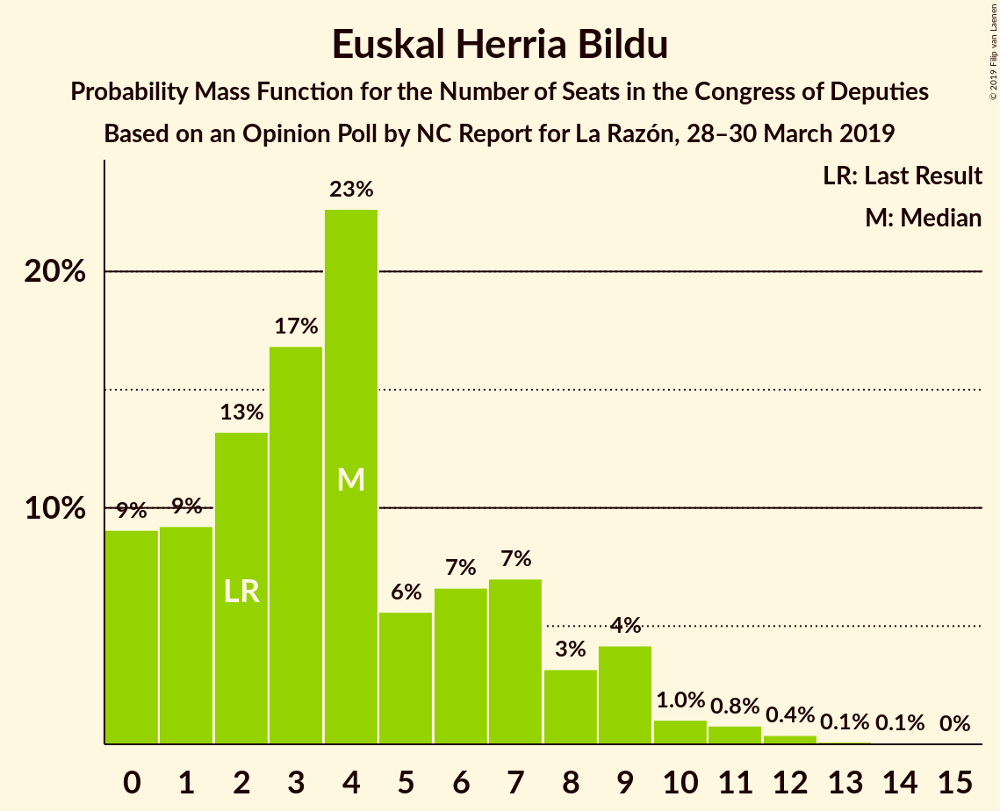
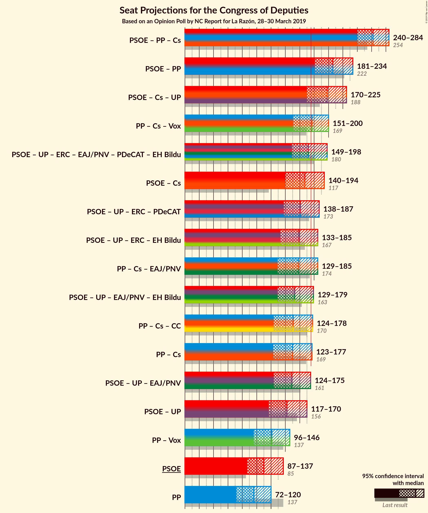
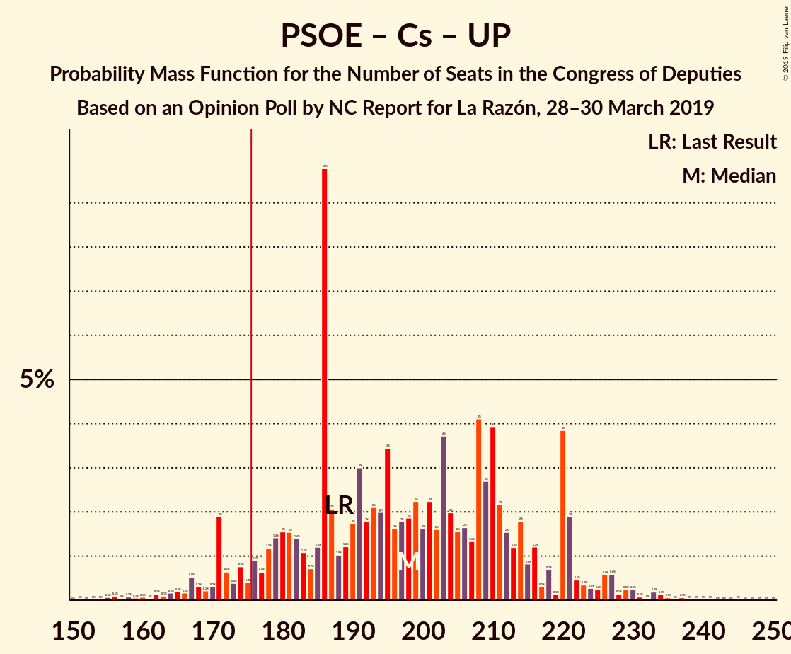
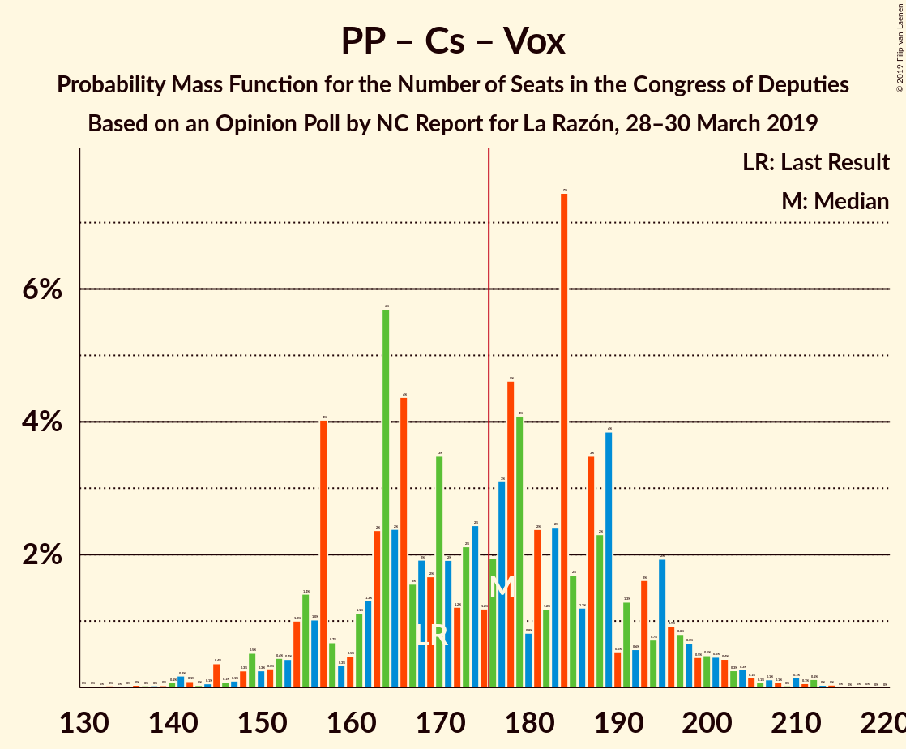
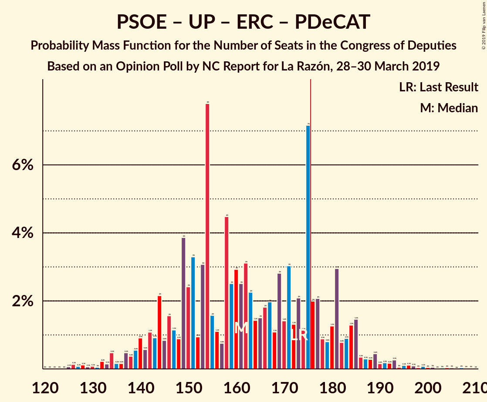

# Opinion Poll by NC Report for La Razón, 28–30 March 2019

<a href="#voting-intentions">Voting Intentions</a> | <a href="#seats">Seats</a> | <a href="#coalitions">Coalitions</a> | <a href="#technical-information">Technical Information</a>

## Voting Intentions

### Confidence Intervals

| Party | Last Result | Poll Result | 80% Confidence Interval | 90% Confidence Interval | 95% Confidence Interval | 99% Confidence Interval |
|:-----:|:-----------:|:-----------:|:-----------------------:|:-----------------------:|:-----------------------:|:-----------------------:|
| Partido Socialista Obrero Español | 22.6% | 26.7% | 23.6–30.1% |22.7–31.1% |22.0–32.0% |20.6–33.7% |
| Partido Popular | 33.0% | 23.0% | 20.1–26.3% |19.3–27.3% |18.6–28.1% |17.3–29.8% |
| Ciudadanos–Partido de la Ciudadanía | 13.1% | 16.7% | 14.2–19.7% |13.5–20.6% |12.9–21.3% |11.8–22.8% |
| Unidos Podemos | 21.2% | 12.0% | 9.9–14.7% |9.3–15.5% |8.8–16.2% |7.9–17.6% |
| Vox | 0.2% | 10.3% | 8.4–12.9% |7.8–13.7% |7.4–14.3% |6.5–15.6% |
| Esquerra Republicana de Catalunya–Catalunya Sí | 2.7% | 3.0% | 2.1–4.7% |1.8–5.2% |1.6–5.6% |1.2–6.5% |
| Partit Demòcrata Europeu Català | 2.0% | 1.3% | 0.8–2.7% |0.7–3.0% |0.5–3.4% |0.4–4.1% |
| Euzko Alderdi Jeltzalea/Partido Nacionalista Vasco | 1.2% | 1.3% | 0.8–2.7% |0.7–3.0% |0.5–3.4% |0.4–4.1% |
| Euskal Herria Bildu | 0.8% | 0.7% | 0.4–1.8% |0.3–2.1% |0.2–2.4% |0.1–3.0% |

*Note:* The poll result column reflects the actual value used in the calculations. Published results may vary slightly, and in addition be rounded to fewer digits.

## Seats

### Confidence Intervals

| Party | Last Result | Median | 80% Confidence Interval | 90% Confidence Interval | 95% Confidence Interval | 99% Confidence Interval |
|:-----:|:-----------:|:------:|:-----------------------:|:-----------------------:|:-----------------------:|:-----------------------:|
| <a href="#partido-socialista-obrero-español">Partido Socialista Obrero Español</a> | 85 | 110 | 106–112 |103–112 |96–112 |96–112 |
| <a href="#partido-popular">Partido Popular</a> | 137 | 106 | 94–107 |94–107 |87–107 |87–107 |
| <a href="#ciudadanos–partido-de-la-ciudadanía">Ciudadanos–Partido de la Ciudadanía</a> | 32 | 49 | 49–55 |45–55 |42–65 |42–65 |
| <a href="#unidos-podemos">Unidos Podemos</a> | 71 | 39 | 29–40 |22–40 |22–62 |20–62 |
| <a href="#vox">Vox</a> | 0 | 13 | 12–27 |12–36 |12–40 |12–40 |
| <a href="#esquerra-republicana-de-catalunya–catalunya-sí">Esquerra Republicana de Catalunya–Catalunya Sí</a> | 9 | 12 | 11–17 |11–19 |6–19 |6–23 |
| <a href="#partit-demòcrata-europeu-català">Partit Demòcrata Europeu Català</a> | 8 | 9 | 3–9 |1–9 |1–9 |1–9 |
| <a href="#euzko-alderdi-jeltzalea/partido-nacionalista-vasco">Euzko Alderdi Jeltzalea/Partido Nacionalista Vasco</a> | 5 | 3 | 2–12 |2–12 |1–12 |1–17 |
| <a href="#euskal-herria-bildu">Euskal Herria Bildu</a> | 2 | 7 | 0–7 |0–7 |0–8 |0–8 |

### Partido Socialista Obrero Español

*For a full overview of the results for this party, see the [Partido Socialista Obrero Español](party-partidosocialistaobreroespañol.html) page.*

| Number of Seats | Probability | Accumulated | Special Marks |
|:---------------:|:-----------:|:-----------:|:-------------:|
| 85 | 0% | 100% | Last Result |
| 86 | 0% | 100% |  |
| 87 | 0% | 100% |  |
| 88 | 0% | 100% |  |
| 89 | 0% | 100% |  |
| 90 | 0% | 100% |  |
| 91 | 0.1% | 100% |  |
| 92 | 0% | 99.9% |  |
| 93 | 0% | 99.9% |  |
| 94 | 0% | 99.9% |  |
| 95 | 0% | 99.9% |  |
| 96 | 3% | 99.9% |  |
| 97 | 0% | 96% |  |
| 98 | 0% | 96% |  |
| 99 | 0% | 96% |  |
| 100 | 0% | 96% |  |
| 101 | 0% | 96% |  |
| 102 | 0% | 96% |  |
| 103 | 5% | 96% |  |
| 104 | 0.6% | 92% |  |
| 105 | 0.6% | 91% |  |
| 106 | 20% | 91% |  |
| 107 | 0% | 71% |  |
| 108 | 2% | 71% |  |
| 109 | 0% | 69% |  |
| 110 | 20% | 69% | Median |
| 111 | 4% | 49% |  |
| 112 | 45% | 45% |  |
| 113 | 0% | 0% |  |

### Partido Popular

*For a full overview of the results for this party, see the [Partido Popular](party-partidopopular.html) page.*

| Number of Seats | Probability | Accumulated | Special Marks |
|:---------------:|:-----------:|:-----------:|:-------------:|
| 82 | 0.1% | 100% |  |
| 83 | 0% | 99.9% |  |
| 84 | 0% | 99.9% |  |
| 85 | 0% | 99.9% |  |
| 86 | 0% | 99.9% |  |
| 87 | 3% | 99.9% |  |
| 88 | 0% | 97% |  |
| 89 | 0% | 96% |  |
| 90 | 0% | 96% |  |
| 91 | 0% | 96% |  |
| 92 | 0% | 96% |  |
| 93 | 0% | 96% |  |
| 94 | 22% | 96% |  |
| 95 | 0.6% | 75% |  |
| 96 | 0% | 74% |  |
| 97 | 0% | 74% |  |
| 98 | 0% | 74% |  |
| 99 | 0% | 74% |  |
| 100 | 0% | 74% |  |
| 101 | 0% | 74% |  |
| 102 | 0% | 74% |  |
| 103 | 0% | 74% |  |
| 104 | 2% | 74% |  |
| 105 | 11% | 72% |  |
| 106 | 12% | 61% | Median |
| 107 | 49% | 49% |  |
| 108 | 0% | 0% |  |
| 109 | 0% | 0% |  |
| 110 | 0% | 0% |  |
| 111 | 0% | 0% |  |
| 112 | 0% | 0% |  |
| 113 | 0% | 0% |  |
| 114 | 0% | 0% |  |
| 115 | 0% | 0% |  |
| 116 | 0% | 0% |  |
| 117 | 0% | 0% |  |
| 118 | 0% | 0% |  |
| 119 | 0% | 0% |  |
| 120 | 0% | 0% |  |
| 121 | 0% | 0% |  |
| 122 | 0% | 0% |  |
| 123 | 0% | 0% |  |
| 124 | 0% | 0% |  |
| 125 | 0% | 0% |  |
| 126 | 0% | 0% |  |
| 127 | 0% | 0% |  |
| 128 | 0% | 0% |  |
| 129 | 0% | 0% |  |
| 130 | 0% | 0% |  |
| 131 | 0% | 0% |  |
| 132 | 0% | 0% |  |
| 133 | 0% | 0% |  |
| 134 | 0% | 0% |  |
| 135 | 0% | 0% |  |
| 136 | 0% | 0% |  |
| 137 | 0% | 0% | Last Result |

### Ciudadanos–Partido de la Ciudadanía

*For a full overview of the results for this party, see the [Ciudadanos–Partido de la Ciudadanía](party-ciudadanos–partidodelaciudadanía.html) page.*

| Number of Seats | Probability | Accumulated | Special Marks |
|:---------------:|:-----------:|:-----------:|:-------------:|
| 32 | 0% | 100% | Last Result |
| 33 | 0% | 100% |  |
| 34 | 0% | 100% |  |
| 35 | 0% | 100% |  |
| 36 | 0% | 100% |  |
| 37 | 0% | 100% |  |
| 38 | 0% | 100% |  |
| 39 | 0% | 100% |  |
| 40 | 0% | 100% |  |
| 41 | 0% | 100% |  |
| 42 | 3% | 100% |  |
| 43 | 0% | 97% |  |
| 44 | 0.6% | 97% |  |
| 45 | 2% | 96% |  |
| 46 | 0% | 95% |  |
| 47 | 0% | 95% |  |
| 48 | 0% | 95% |  |
| 49 | 57% | 95% | Median |
| 50 | 0% | 38% |  |
| 51 | 12% | 38% |  |
| 52 | 0% | 26% |  |
| 53 | 0% | 26% |  |
| 54 | 0% | 26% |  |
| 55 | 22% | 26% |  |
| 56 | 0% | 4% |  |
| 57 | 0% | 4% |  |
| 58 | 0% | 4% |  |
| 59 | 0.5% | 4% |  |
| 60 | 0% | 4% |  |
| 61 | 0% | 4% |  |
| 62 | 0% | 4% |  |
| 63 | 0% | 4% |  |
| 64 | 0% | 4% |  |
| 65 | 3% | 4% |  |
| 66 | 0% | 0.1% |  |
| 67 | 0% | 0.1% |  |
| 68 | 0% | 0.1% |  |
| 69 | 0% | 0.1% |  |
| 70 | 0% | 0.1% |  |
| 71 | 0% | 0.1% |  |
| 72 | 0% | 0.1% |  |
| 73 | 0% | 0.1% |  |
| 74 | 0% | 0.1% |  |
| 75 | 0% | 0.1% |  |
| 76 | 0.1% | 0.1% |  |
| 77 | 0% | 0% |  |

### Unidos Podemos

*For a full overview of the results for this party, see the [Unidos Podemos](party-unidospodemos.html) page.*

| Number of Seats | Probability | Accumulated | Special Marks |
|:---------------:|:-----------:|:-----------:|:-------------:|
| 20 | 2% | 100% |  |
| 21 | 0% | 98% |  |
| 22 | 4% | 98% |  |
| 23 | 0% | 95% |  |
| 24 | 0% | 95% |  |
| 25 | 0.6% | 95% |  |
| 26 | 0% | 94% |  |
| 27 | 0% | 94% |  |
| 28 | 0% | 94% |  |
| 29 | 20% | 94% |  |
| 30 | 2% | 74% |  |
| 31 | 0% | 72% |  |
| 32 | 0% | 72% |  |
| 33 | 0% | 72% |  |
| 34 | 0.1% | 72% |  |
| 35 | 0% | 72% |  |
| 36 | 0% | 72% |  |
| 37 | 0% | 72% |  |
| 38 | 9% | 72% |  |
| 39 | 49% | 64% | Median |
| 40 | 11% | 15% |  |
| 41 | 0% | 3% |  |
| 42 | 0% | 3% |  |
| 43 | 0% | 3% |  |
| 44 | 0% | 3% |  |
| 45 | 0% | 3% |  |
| 46 | 0% | 3% |  |
| 47 | 0% | 3% |  |
| 48 | 0% | 3% |  |
| 49 | 0% | 3% |  |
| 50 | 0% | 3% |  |
| 51 | 0% | 3% |  |
| 52 | 0% | 3% |  |
| 53 | 0% | 3% |  |
| 54 | 0% | 3% |  |
| 55 | 0% | 3% |  |
| 56 | 0% | 3% |  |
| 57 | 0% | 3% |  |
| 58 | 0% | 3% |  |
| 59 | 0% | 3% |  |
| 60 | 0% | 3% |  |
| 61 | 0% | 3% |  |
| 62 | 3% | 3% |  |
| 63 | 0% | 0.3% |  |
| 64 | 0% | 0.3% |  |
| 65 | 0.3% | 0.3% |  |
| 66 | 0% | 0% |  |
| 67 | 0% | 0% |  |
| 68 | 0% | 0% |  |
| 69 | 0% | 0% |  |
| 70 | 0% | 0% |  |
| 71 | 0% | 0% | Last Result |

### Vox

*For a full overview of the results for this party, see the [Vox](party-vox.html) page.*

| Number of Seats | Probability | Accumulated | Special Marks |
|:---------------:|:-----------:|:-----------:|:-------------:|
| 0 | 0% | 100% | Last Result |
| 1 | 0% | 100% |  |
| 2 | 0% | 100% |  |
| 3 | 0% | 100% |  |
| 4 | 0% | 100% |  |
| 5 | 0% | 100% |  |
| 6 | 0% | 100% |  |
| 7 | 0% | 100% |  |
| 8 | 0% | 100% |  |
| 9 | 0% | 100% |  |
| 10 | 0% | 99.9% |  |
| 11 | 0% | 99.9% |  |
| 12 | 12% | 99.9% |  |
| 13 | 45% | 88% | Median |
| 14 | 0% | 42% |  |
| 15 | 11% | 42% |  |
| 16 | 0% | 31% |  |
| 17 | 0.3% | 31% |  |
| 18 | 3% | 31% |  |
| 19 | 0% | 28% |  |
| 20 | 0% | 28% |  |
| 21 | 0% | 28% |  |
| 22 | 0% | 28% |  |
| 23 | 0.6% | 28% |  |
| 24 | 0% | 27% |  |
| 25 | 0% | 27% |  |
| 26 | 2% | 27% |  |
| 27 | 20% | 25% |  |
| 28 | 0% | 5% |  |
| 29 | 0% | 5% |  |
| 30 | 0% | 5% |  |
| 31 | 0% | 5% |  |
| 32 | 0% | 5% |  |
| 33 | 0% | 5% |  |
| 34 | 0% | 5% |  |
| 35 | 0% | 5% |  |
| 36 | 2% | 5% |  |
| 37 | 0% | 4% |  |
| 38 | 0% | 4% |  |
| 39 | 0.6% | 4% |  |
| 40 | 3% | 3% |  |
| 41 | 0% | 0% |  |

### Esquerra Republicana de Catalunya–Catalunya Sí

*For a full overview of the results for this party, see the [Esquerra Republicana de Catalunya–Catalunya Sí](party-esquerrarepublicanadecatalunya–catalunyasí.html) page.*

| Number of Seats | Probability | Accumulated | Special Marks |
|:---------------:|:-----------:|:-----------:|:-------------:|
| 6 | 3% | 100% |  |
| 7 | 0% | 97% |  |
| 8 | 0% | 97% |  |
| 9 | 0% | 97% | Last Result |
| 10 | 0.2% | 97% |  |
| 11 | 45% | 96% |  |
| 12 | 11% | 51% | Median |
| 13 | 0% | 40% |  |
| 14 | 0% | 40% |  |
| 15 | 12% | 40% |  |
| 16 | 2% | 28% |  |
| 17 | 20% | 26% |  |
| 18 | 0% | 6% |  |
| 19 | 4% | 6% |  |
| 20 | 0% | 2% |  |
| 21 | 0.6% | 2% |  |
| 22 | 0% | 2% |  |
| 23 | 2% | 2% |  |
| 24 | 0% | 0% |  |

### Partit Demòcrata Europeu Català

*For a full overview of the results for this party, see the [Partit Demòcrata Europeu Català](party-partitdemòcrataeuropeucatalà.html) page.*

| Number of Seats | Probability | Accumulated | Special Marks |
|:---------------:|:-----------:|:-----------:|:-------------:|
| 1 | 5% | 100% |  |
| 2 | 0.5% | 95% |  |
| 3 | 9% | 94% |  |
| 4 | 0% | 86% |  |
| 5 | 0% | 86% |  |
| 6 | 0.3% | 86% |  |
| 7 | 3% | 85% |  |
| 8 | 6% | 82% | Last Result |
| 9 | 76% | 76% | Median |
| 10 | 0.2% | 0.3% |  |
| 11 | 0% | 0.1% |  |
| 12 | 0% | 0.1% |  |
| 13 | 0% | 0.1% |  |
| 14 | 0% | 0.1% |  |
| 15 | 0.1% | 0.1% |  |
| 16 | 0% | 0% |  |

### Euzko Alderdi Jeltzalea/Partido Nacionalista Vasco

*For a full overview of the results for this party, see the [Euzko Alderdi Jeltzalea/Partido Nacionalista Vasco](party-euzkoalderdijeltzaleapartidonacionalistavasco.html) page.*

| Number of Seats | Probability | Accumulated | Special Marks |
|:---------------:|:-----------:|:-----------:|:-------------:|
| 1 | 3% | 100% |  |
| 2 | 45% | 97% |  |
| 3 | 12% | 52% | Median |
| 4 | 0% | 40% |  |
| 5 | 0% | 40% | Last Result |
| 6 | 0% | 40% |  |
| 7 | 4% | 40% |  |
| 8 | 4% | 36% |  |
| 9 | 9% | 32% |  |
| 10 | 0.1% | 22% |  |
| 11 | 0% | 22% |  |
| 12 | 22% | 22% |  |
| 13 | 0% | 0.6% |  |
| 14 | 0% | 0.6% |  |
| 15 | 0% | 0.6% |  |
| 16 | 0% | 0.6% |  |
| 17 | 0.6% | 0.6% |  |
| 18 | 0% | 0% |  |

### Euskal Herria Bildu

*For a full overview of the results for this party, see the [Euskal Herria Bildu](party-euskalherriabildu.html) page.*

| Number of Seats | Probability | Accumulated | Special Marks |
|:---------------:|:-----------:|:-----------:|:-------------:|
| 0 | 25% | 100% |  |
| 1 | 0% | 75% |  |
| 2 | 0.6% | 75% | Last Result |
| 3 | 0.1% | 74% |  |
| 4 | 0% | 74% |  |
| 5 | 9% | 74% |  |
| 6 | 15% | 66% |  |
| 7 | 46% | 51% | Median |
| 8 | 5% | 5% |  |
| 9 | 0% | 0.1% |  |
| 10 | 0% | 0.1% |  |
| 11 | 0% | 0% |  |

## Coalitions

### Confidence Intervals

| Coalition | Last Result | Median | Majority? | 80% Confidence Interval | 90% Confidence Interval | 95% Confidence Interval | 99% Confidence Interval |
|:---------:|:-----------:|:------:|:---------:|:-----------------------:|:-----------------------:|:-----------------------:|:-----------------------:|
| Partido Socialista Obrero Español – Partido Popular – Ciudadanos–Partido de la Ciudadanía | 254 | 267 | 100% | 255–268 | 251–268 | 248–269 | 248–269 |
| Partido Socialista Obrero Español – Ciudadanos–Partido de la Ciudadanía – Unidos Podemos | 188 | 200 | 95% | 190–200 | 169–201 | 167–223 | 167–223 |
| Partido Socialista Obrero Español – Partido Popular | 222 | 216 | 99.9% | 200–219 | 200–219 | 183–219 | 183–219 |
| Partido Popular – Ciudadanos–Partido de la Ciudadanía – Vox | 169 | 169 | 26% | 169–176 | 169–185 | 169–188 | 169–188 |
| Partido Socialista Obrero Español – Unidos Podemos – Esquerra Republicana de Catalunya–Catalunya Sí – Euzko Alderdi Jeltzalea/Partido Nacionalista Vasco – Partit Demòcrata Europeu Català – Euskal Herria Bildu | 180 | 180 | 72% | 173–180 | 164–180 | 161–180 | 161–180 |
| Partido Socialista Obrero Español – Unidos Podemos – Esquerra Republicana de Catalunya–Catalunya Sí – Euskal Herria Bildu | 167 | 168 | 0% | 152–169 | 152–169 | 152–171 | 151–171 |
| Partido Socialista Obrero Español – Unidos Podemos – Esquerra Republicana de Catalunya–Catalunya Sí – Partit Demòcrata Europeu Català | 173 | 171 | 0% | 161–171 | 152–171 | 152–171 | 147–172 |
| Partido Popular – Ciudadanos–Partido de la Ciudadanía – Euzko Alderdi Jeltzalea/Partido Nacionalista Vasco | 174 | 158 | 0% | 157–165 | 157–166 | 149–166 | 149–171 |
| Partido Socialista Obrero Español – Unidos Podemos – Euzko Alderdi Jeltzalea/Partido Nacionalista Vasco – Euskal Herria Bildu | 163 | 160 | 0% | 147–162 | 140–163 | 134–166 | 134–166 |
| Partido Socialista Obrero Español – Unidos Podemos – Euzko Alderdi Jeltzalea/Partido Nacionalista Vasco | 161 | 153 | 0% | 147–157 | 132–157 | 126–166 | 126–166 |
| Partido Socialista Obrero Español – Ciudadanos–Partido de la Ciudadanía | 117 | 161 | 0% | 159–161 | 149–162 | 145–163 | 145–164 |
| Partido Popular – Ciudadanos–Partido de la Ciudadanía | 169 | 156 | 0% | 149–157 | 149–157 | 148–158 | 148–158 |
| Partido Socialista Obrero Español – Unidos Podemos | 156 | 150 | 0% | 135–151 | 125–151 | 125–158 | 123–158 |
| Partido Popular – Vox | 137 | 120 | 0% | 118–121 | 118–140 | 105–146 | 105–146 |
| Partido Socialista Obrero Español | 85 | 110 | 0% | 106–112 | 103–112 | 96–112 | 96–112 |
| Partido Popular | 137 | 106 | 0% | 94–107 | 94–107 | 87–107 | 87–107 |

### Partido Socialista Obrero Español – Partido Popular – Ciudadanos–Partido de la Ciudadanía

| Number of Seats | Probability | Accumulated | Special Marks |
|:---------------:|:-----------:|:-----------:|:-------------:|
| 248 | 3% | 100% |  |
| 249 | 0.1% | 97% |  |
| 250 | 0% | 97% |  |
| 251 | 4% | 97% |  |
| 252 | 0.9% | 93% |  |
| 253 | 0.6% | 92% |  |
| 254 | 0% | 91% | Last Result |
| 255 | 20% | 91% |  |
| 256 | 0% | 71% |  |
| 257 | 2% | 71% |  |
| 258 | 0% | 69% |  |
| 259 | 0.5% | 69% |  |
| 260 | 0% | 69% |  |
| 261 | 0% | 69% |  |
| 262 | 0% | 69% |  |
| 263 | 0% | 69% |  |
| 264 | 11% | 69% |  |
| 265 | 0% | 58% | Median |
| 266 | 0% | 58% |  |
| 267 | 9% | 58% |  |
| 268 | 45% | 49% |  |
| 269 | 4% | 4% |  |
| 270 | 0% | 0% |  |

### Partido Socialista Obrero Español – Ciudadanos–Partido de la Ciudadanía – Unidos Podemos

| Number of Seats | Probability | Accumulated | Special Marks |
|:---------------:|:-----------:|:-----------:|:-------------:|
| 167 | 3% | 100% |  |
| 168 | 0.9% | 97% |  |
| 169 | 1.2% | 96% |  |
| 170 | 0% | 95% |  |
| 171 | 0% | 95% |  |
| 172 | 0% | 95% |  |
| 173 | 0% | 95% |  |
| 174 | 0% | 95% |  |
| 175 | 0% | 95% |  |
| 176 | 0% | 95% | Majority |
| 177 | 0% | 95% |  |
| 178 | 0% | 95% |  |
| 179 | 0% | 95% |  |
| 180 | 0% | 95% |  |
| 181 | 0% | 95% |  |
| 182 | 0% | 95% |  |
| 183 | 0% | 95% |  |
| 184 | 0% | 95% |  |
| 185 | 0% | 95% |  |
| 186 | 0% | 95% |  |
| 187 | 0% | 95% |  |
| 188 | 0% | 95% | Last Result |
| 189 | 0.5% | 95% |  |
| 190 | 20% | 94% |  |
| 191 | 0% | 74% |  |
| 192 | 0% | 74% |  |
| 193 | 2% | 74% |  |
| 194 | 0% | 72% |  |
| 195 | 0% | 72% |  |
| 196 | 0% | 72% |  |
| 197 | 0% | 72% |  |
| 198 | 0% | 72% | Median |
| 199 | 20% | 72% |  |
| 200 | 45% | 53% |  |
| 201 | 4% | 7% |  |
| 202 | 0% | 3% |  |
| 203 | 0% | 3% |  |
| 204 | 0% | 3% |  |
| 205 | 0% | 3% |  |
| 206 | 0% | 3% |  |
| 207 | 0% | 3% |  |
| 208 | 0% | 3% |  |
| 209 | 0% | 3% |  |
| 210 | 0% | 3% |  |
| 211 | 0% | 3% |  |
| 212 | 0% | 3% |  |
| 213 | 0% | 3% |  |
| 214 | 0% | 3% |  |
| 215 | 0% | 3% |  |
| 216 | 0% | 3% |  |
| 217 | 0% | 3% |  |
| 218 | 0% | 3% |  |
| 219 | 0% | 3% |  |
| 220 | 0% | 3% |  |
| 221 | 0% | 3% |  |
| 222 | 0% | 3% |  |
| 223 | 3% | 3% |  |
| 224 | 0% | 0.3% |  |
| 225 | 0% | 0.3% |  |
| 226 | 0.3% | 0.3% |  |
| 227 | 0% | 0% |  |

### Partido Socialista Obrero Español – Partido Popular

| Number of Seats | Probability | Accumulated | Special Marks |
|:---------------:|:-----------:|:-----------:|:-------------:|
| 173 | 0.1% | 100% |  |
| 174 | 0% | 99.9% |  |
| 175 | 0% | 99.9% |  |
| 176 | 0% | 99.9% | Majority |
| 177 | 0% | 99.9% |  |
| 178 | 0% | 99.9% |  |
| 179 | 0% | 99.9% |  |
| 180 | 0% | 99.9% |  |
| 181 | 0% | 99.9% |  |
| 182 | 0% | 99.9% |  |
| 183 | 3% | 99.9% |  |
| 184 | 0% | 97% |  |
| 185 | 0% | 96% |  |
| 186 | 0% | 96% |  |
| 187 | 0% | 96% |  |
| 188 | 0% | 96% |  |
| 189 | 0% | 96% |  |
| 190 | 0% | 96% |  |
| 191 | 0% | 96% |  |
| 192 | 0% | 96% |  |
| 193 | 0% | 96% |  |
| 194 | 0% | 96% |  |
| 195 | 0% | 96% |  |
| 196 | 0% | 96% |  |
| 197 | 0% | 96% |  |
| 198 | 0% | 96% |  |
| 199 | 0% | 96% |  |
| 200 | 20% | 96% |  |
| 201 | 0% | 76% |  |
| 202 | 2% | 76% |  |
| 203 | 0% | 74% |  |
| 204 | 0% | 74% |  |
| 205 | 0% | 74% |  |
| 206 | 0% | 74% |  |
| 207 | 2% | 74% |  |
| 208 | 0.6% | 73% |  |
| 209 | 3% | 72% |  |
| 210 | 0% | 69% |  |
| 211 | 0% | 69% |  |
| 212 | 0% | 69% |  |
| 213 | 0% | 69% |  |
| 214 | 0% | 69% |  |
| 215 | 11% | 69% |  |
| 216 | 9% | 58% | Median |
| 217 | 0% | 49% |  |
| 218 | 4% | 49% |  |
| 219 | 45% | 45% |  |
| 220 | 0% | 0% |  |
| 221 | 0% | 0% |  |
| 222 | 0% | 0% | Last Result |

### Partido Popular – Ciudadanos–Partido de la Ciudadanía – Vox

| Number of Seats | Probability | Accumulated | Special Marks |
|:---------------:|:-----------:|:-----------:|:-------------:|
| 167 | 0% | 100% |  |
| 168 | 0% | 99.9% | Median |
| 169 | 66% | 99.9% | Last Result |
| 170 | 7% | 34% |  |
| 171 | 0% | 28% |  |
| 172 | 0% | 28% |  |
| 173 | 0% | 28% |  |
| 174 | 0% | 28% |  |
| 175 | 2% | 28% |  |
| 176 | 20% | 26% | Majority |
| 177 | 0.5% | 6% |  |
| 178 | 0% | 5% |  |
| 179 | 0% | 5% |  |
| 180 | 0% | 5% |  |
| 181 | 0.1% | 5% |  |
| 182 | 0% | 5% |  |
| 183 | 0% | 5% |  |
| 184 | 0% | 5% |  |
| 185 | 2% | 5% |  |
| 186 | 0% | 4% |  |
| 187 | 0.6% | 4% |  |
| 188 | 3% | 3% |  |
| 189 | 0% | 0% |  |

### Partido Socialista Obrero Español – Unidos Podemos – Esquerra Republicana de Catalunya–Catalunya Sí – Euzko Alderdi Jeltzalea/Partido Nacionalista Vasco – Partit Demòcrata Europeu Català – Euskal Herria Bildu

| Number of Seats | Probability | Accumulated | Special Marks |
|:---------------:|:-----------:|:-----------:|:-------------:|
| 161 | 3% | 100% |  |
| 162 | 0.6% | 97% |  |
| 163 | 0% | 96% |  |
| 164 | 2% | 96% |  |
| 165 | 0% | 95% |  |
| 166 | 0% | 95% |  |
| 167 | 0% | 95% |  |
| 168 | 0.1% | 95% |  |
| 169 | 0% | 95% |  |
| 170 | 0% | 95% |  |
| 171 | 0% | 95% |  |
| 172 | 0.5% | 95% |  |
| 173 | 20% | 94% |  |
| 174 | 2% | 74% |  |
| 175 | 0% | 72% |  |
| 176 | 0% | 72% | Majority |
| 177 | 0% | 72% |  |
| 178 | 0% | 72% |  |
| 179 | 7% | 72% |  |
| 180 | 66% | 66% | Last Result, Median |
| 181 | 0% | 0.1% |  |
| 182 | 0% | 0.1% |  |
| 183 | 0% | 0% |  |

### Partido Socialista Obrero Español – Unidos Podemos – Esquerra Republicana de Catalunya–Catalunya Sí – Euskal Herria Bildu

| Number of Seats | Probability | Accumulated | Special Marks |
|:---------------:|:-----------:|:-----------:|:-------------:|
| 143 | 0.1% | 100% |  |
| 144 | 0% | 99.9% |  |
| 145 | 0% | 99.9% |  |
| 146 | 0% | 99.9% |  |
| 147 | 0% | 99.9% |  |
| 148 | 0% | 99.9% |  |
| 149 | 0% | 99.9% |  |
| 150 | 0% | 99.9% |  |
| 151 | 0.6% | 99.9% |  |
| 152 | 23% | 99.3% |  |
| 153 | 0.6% | 76% |  |
| 154 | 3% | 76% |  |
| 155 | 0.6% | 73% |  |
| 156 | 0% | 72% |  |
| 157 | 0% | 72% |  |
| 158 | 0% | 72% |  |
| 159 | 0% | 72% |  |
| 160 | 0% | 72% |  |
| 161 | 0% | 72% |  |
| 162 | 0% | 72% |  |
| 163 | 0% | 72% |  |
| 164 | 3% | 72% |  |
| 165 | 0% | 69% |  |
| 166 | 0% | 69% |  |
| 167 | 0.3% | 69% | Last Result |
| 168 | 20% | 69% | Median |
| 169 | 45% | 49% |  |
| 170 | 0% | 4% |  |
| 171 | 4% | 4% |  |
| 172 | 0% | 0% |  |

### Partido Socialista Obrero Español – Unidos Podemos – Esquerra Republicana de Catalunya–Catalunya Sí – Partit Demòcrata Europeu Català

| Number of Seats | Probability | Accumulated | Special Marks |
|:---------------:|:-----------:|:-----------:|:-------------:|
| 147 | 0.9% | 100% |  |
| 148 | 0.6% | 99.1% |  |
| 149 | 0% | 98% |  |
| 150 | 0% | 98% |  |
| 151 | 0% | 98% |  |
| 152 | 4% | 98% |  |
| 153 | 0.5% | 95% |  |
| 154 | 0% | 94% |  |
| 155 | 0.1% | 94% |  |
| 156 | 0% | 94% |  |
| 157 | 0% | 94% |  |
| 158 | 0% | 94% |  |
| 159 | 0% | 94% |  |
| 160 | 0% | 94% |  |
| 161 | 20% | 94% |  |
| 162 | 2% | 74% |  |
| 163 | 0% | 72% |  |
| 164 | 0% | 72% |  |
| 165 | 0% | 72% |  |
| 166 | 12% | 72% |  |
| 167 | 0% | 60% |  |
| 168 | 0% | 60% |  |
| 169 | 0% | 60% |  |
| 170 | 0% | 60% | Median |
| 171 | 59% | 60% |  |
| 172 | 0.2% | 0.5% |  |
| 173 | 0.3% | 0.3% | Last Result |
| 174 | 0% | 0% |  |

### Partido Popular – Ciudadanos–Partido de la Ciudadanía – Euzko Alderdi Jeltzalea/Partido Nacionalista Vasco

| Number of Seats | Probability | Accumulated | Special Marks |
|:---------------:|:-----------:|:-----------:|:-------------:|
| 149 | 3% | 100% |  |
| 150 | 0% | 97% |  |
| 151 | 0.6% | 97% |  |
| 152 | 0% | 96% |  |
| 153 | 0% | 96% |  |
| 154 | 0% | 96% |  |
| 155 | 0% | 96% |  |
| 156 | 0% | 96% |  |
| 157 | 12% | 96% |  |
| 158 | 46% | 84% | Median |
| 159 | 0.3% | 38% |  |
| 160 | 3% | 38% |  |
| 161 | 22% | 35% |  |
| 162 | 0% | 13% |  |
| 163 | 0.1% | 13% |  |
| 164 | 0% | 13% |  |
| 165 | 4% | 13% |  |
| 166 | 9% | 9% |  |
| 167 | 0% | 0.6% |  |
| 168 | 0.1% | 0.6% |  |
| 169 | 0% | 0.6% |  |
| 170 | 0% | 0.6% |  |
| 171 | 0.5% | 0.5% |  |
| 172 | 0% | 0% |  |
| 173 | 0% | 0% |  |
| 174 | 0% | 0% | Last Result |

### Partido Socialista Obrero Español – Unidos Podemos – Euzko Alderdi Jeltzalea/Partido Nacionalista Vasco – Euskal Herria Bildu

| Number of Seats | Probability | Accumulated | Special Marks |
|:---------------:|:-----------:|:-----------:|:-------------:|
| 134 | 3% | 100% |  |
| 135 | 0.6% | 97% |  |
| 136 | 0% | 96% |  |
| 137 | 0% | 96% |  |
| 138 | 0.1% | 96% |  |
| 139 | 0% | 96% |  |
| 140 | 2% | 96% |  |
| 141 | 0% | 95% |  |
| 142 | 0% | 95% |  |
| 143 | 0% | 95% |  |
| 144 | 0% | 95% |  |
| 145 | 0% | 95% |  |
| 146 | 0% | 95% |  |
| 147 | 20% | 95% |  |
| 148 | 0% | 75% |  |
| 149 | 0.6% | 75% |  |
| 150 | 2% | 74% |  |
| 151 | 0% | 72% |  |
| 152 | 0% | 72% |  |
| 153 | 0% | 72% |  |
| 154 | 0% | 72% |  |
| 155 | 0% | 72% |  |
| 156 | 0% | 72% |  |
| 157 | 0% | 72% |  |
| 158 | 0% | 72% |  |
| 159 | 11% | 72% | Median |
| 160 | 45% | 61% |  |
| 161 | 0% | 16% |  |
| 162 | 9% | 16% |  |
| 163 | 4% | 7% | Last Result |
| 164 | 0% | 3% |  |
| 165 | 0% | 3% |  |
| 166 | 3% | 3% |  |
| 167 | 0% | 0.3% |  |
| 168 | 0.3% | 0.3% |  |
| 169 | 0% | 0% |  |

### Partido Socialista Obrero Español – Unidos Podemos – Euzko Alderdi Jeltzalea/Partido Nacionalista Vasco

| Number of Seats | Probability | Accumulated | Special Marks |
|:---------------:|:-----------:|:-----------:|:-------------:|
| 126 | 3% | 100% |  |
| 127 | 0% | 97% |  |
| 128 | 0.6% | 97% |  |
| 129 | 0% | 96% |  |
| 130 | 0% | 96% |  |
| 131 | 0% | 96% |  |
| 132 | 2% | 96% |  |
| 133 | 0% | 95% |  |
| 134 | 0% | 95% |  |
| 135 | 0.1% | 95% |  |
| 136 | 0% | 95% |  |
| 137 | 0% | 95% |  |
| 138 | 0% | 95% |  |
| 139 | 0% | 95% |  |
| 140 | 0% | 95% |  |
| 141 | 0% | 95% |  |
| 142 | 0% | 95% |  |
| 143 | 0% | 95% |  |
| 144 | 0% | 95% |  |
| 145 | 0% | 95% |  |
| 146 | 0% | 95% |  |
| 147 | 20% | 95% |  |
| 148 | 0% | 74% |  |
| 149 | 0% | 74% |  |
| 150 | 2% | 74% |  |
| 151 | 0% | 72% |  |
| 152 | 0% | 72% | Median |
| 153 | 57% | 72% |  |
| 154 | 0% | 16% |  |
| 155 | 0% | 16% |  |
| 156 | 0% | 16% |  |
| 157 | 12% | 16% |  |
| 158 | 0% | 3% |  |
| 159 | 0% | 3% |  |
| 160 | 0% | 3% |  |
| 161 | 0% | 3% | Last Result |
| 162 | 0% | 3% |  |
| 163 | 0% | 3% |  |
| 164 | 0% | 3% |  |
| 165 | 0% | 3% |  |
| 166 | 3% | 3% |  |
| 167 | 0% | 0.3% |  |
| 168 | 0.3% | 0.3% |  |
| 169 | 0% | 0% |  |

### Partido Socialista Obrero Español – Ciudadanos–Partido de la Ciudadanía

| Number of Seats | Probability | Accumulated | Special Marks |
|:---------------:|:-----------:|:-----------:|:-------------:|
| 117 | 0% | 100% | Last Result |
| 118 | 0% | 100% |  |
| 119 | 0% | 100% |  |
| 120 | 0% | 100% |  |
| 121 | 0% | 100% |  |
| 122 | 0% | 100% |  |
| 123 | 0% | 100% |  |
| 124 | 0% | 100% |  |
| 125 | 0% | 100% |  |
| 126 | 0% | 100% |  |
| 127 | 0% | 100% |  |
| 128 | 0% | 100% |  |
| 129 | 0% | 100% |  |
| 130 | 0% | 100% |  |
| 131 | 0% | 100% |  |
| 132 | 0% | 100% |  |
| 133 | 0% | 100% |  |
| 134 | 0% | 100% |  |
| 135 | 0% | 100% |  |
| 136 | 0% | 100% |  |
| 137 | 0% | 100% |  |
| 138 | 0% | 100% |  |
| 139 | 0% | 100% |  |
| 140 | 0% | 100% |  |
| 141 | 0% | 100% |  |
| 142 | 0% | 100% |  |
| 143 | 0% | 100% |  |
| 144 | 0% | 100% |  |
| 145 | 3% | 100% |  |
| 146 | 0% | 97% |  |
| 147 | 0.6% | 97% |  |
| 148 | 0.9% | 96% |  |
| 149 | 0.6% | 95% |  |
| 150 | 0% | 95% |  |
| 151 | 0% | 95% |  |
| 152 | 0% | 95% |  |
| 153 | 0% | 95% |  |
| 154 | 0% | 95% |  |
| 155 | 0% | 95% |  |
| 156 | 0% | 95% |  |
| 157 | 0% | 95% |  |
| 158 | 0% | 95% |  |
| 159 | 11% | 95% | Median |
| 160 | 0% | 83% |  |
| 161 | 77% | 83% |  |
| 162 | 4% | 6% |  |
| 163 | 2% | 3% |  |
| 164 | 0.5% | 0.7% |  |
| 165 | 0% | 0.2% |  |
| 166 | 0% | 0.1% |  |
| 167 | 0.1% | 0.1% |  |
| 168 | 0% | 0% |  |

### Partido Popular – Ciudadanos–Partido de la Ciudadanía

| Number of Seats | Probability | Accumulated | Special Marks |
|:---------------:|:-----------:|:-----------:|:-------------:|
| 148 | 4% | 100% |  |
| 149 | 23% | 96% |  |
| 150 | 0% | 73% |  |
| 151 | 0% | 73% |  |
| 152 | 3% | 73% |  |
| 153 | 0% | 70% |  |
| 154 | 12% | 70% |  |
| 155 | 0% | 58% | Median |
| 156 | 45% | 58% |  |
| 157 | 9% | 12% |  |
| 158 | 4% | 4% |  |
| 159 | 0% | 0% |  |
| 160 | 0% | 0% |  |
| 161 | 0% | 0% |  |
| 162 | 0% | 0% |  |
| 163 | 0% | 0% |  |
| 164 | 0% | 0% |  |
| 165 | 0% | 0% |  |
| 166 | 0% | 0% |  |
| 167 | 0% | 0% |  |
| 168 | 0% | 0% |  |
| 169 | 0% | 0% | Last Result |

### Partido Socialista Obrero Español – Unidos Podemos

| Number of Seats | Probability | Accumulated | Special Marks |
|:---------------:|:-----------:|:-----------:|:-------------:|
| 123 | 0.9% | 100% |  |
| 124 | 0.6% | 99.1% |  |
| 125 | 4% | 98% |  |
| 126 | 0% | 95% |  |
| 127 | 0% | 95% |  |
| 128 | 0% | 95% |  |
| 129 | 0% | 95% |  |
| 130 | 0.6% | 95% |  |
| 131 | 0% | 94% |  |
| 132 | 0% | 94% |  |
| 133 | 0% | 94% |  |
| 134 | 0% | 94% |  |
| 135 | 20% | 94% |  |
| 136 | 0% | 74% |  |
| 137 | 0% | 74% |  |
| 138 | 2% | 74% |  |
| 139 | 0% | 72% |  |
| 140 | 0% | 72% |  |
| 141 | 0% | 72% |  |
| 142 | 0% | 72% |  |
| 143 | 0% | 72% |  |
| 144 | 0% | 72% |  |
| 145 | 0% | 72% |  |
| 146 | 0% | 72% |  |
| 147 | 0% | 72% |  |
| 148 | 9% | 72% |  |
| 149 | 0% | 64% | Median |
| 150 | 15% | 64% |  |
| 151 | 45% | 49% |  |
| 152 | 0.2% | 4% |  |
| 153 | 0% | 3% |  |
| 154 | 0% | 3% |  |
| 155 | 0% | 3% |  |
| 156 | 0% | 3% | Last Result |
| 157 | 0% | 3% |  |
| 158 | 3% | 3% |  |
| 159 | 0% | 0.3% |  |
| 160 | 0% | 0.3% |  |
| 161 | 0.3% | 0.3% |  |
| 162 | 0% | 0% |  |

### Partido Popular – Vox

| Number of Seats | Probability | Accumulated | Special Marks |
|:---------------:|:-----------:|:-----------:|:-------------:|
| 99 | 0% | 100% |  |
| 100 | 0% | 99.9% |  |
| 101 | 0% | 99.9% |  |
| 102 | 0% | 99.9% |  |
| 103 | 0% | 99.9% |  |
| 104 | 0.3% | 99.9% |  |
| 105 | 3% | 99.6% |  |
| 106 | 0% | 96% |  |
| 107 | 0% | 96% |  |
| 108 | 0% | 96% |  |
| 109 | 0% | 96% |  |
| 110 | 0% | 96% |  |
| 111 | 0% | 96% |  |
| 112 | 0% | 96% |  |
| 113 | 0% | 96% |  |
| 114 | 0% | 96% |  |
| 115 | 0% | 96% |  |
| 116 | 0% | 96% |  |
| 117 | 0% | 96% |  |
| 118 | 9% | 96% |  |
| 119 | 4% | 87% | Median |
| 120 | 59% | 84% |  |
| 121 | 20% | 25% |  |
| 122 | 0% | 5% |  |
| 123 | 0% | 5% |  |
| 124 | 0% | 5% |  |
| 125 | 0% | 5% |  |
| 126 | 0% | 5% |  |
| 127 | 0% | 5% |  |
| 128 | 0% | 5% |  |
| 129 | 0% | 5% |  |
| 130 | 0% | 5% |  |
| 131 | 0% | 5% |  |
| 132 | 0% | 5% |  |
| 133 | 0% | 5% |  |
| 134 | 0% | 5% |  |
| 135 | 0% | 5% |  |
| 136 | 0% | 5% |  |
| 137 | 0% | 5% | Last Result |
| 138 | 0% | 5% |  |
| 139 | 0% | 5% |  |
| 140 | 2% | 5% |  |
| 141 | 0% | 4% |  |
| 142 | 0% | 4% |  |
| 143 | 0.6% | 4% |  |
| 144 | 0% | 3% |  |
| 145 | 0% | 3% |  |
| 146 | 3% | 3% |  |
| 147 | 0% | 0% |  |

### Partido Socialista Obrero Español

| Number of Seats | Probability | Accumulated | Special Marks |
|:---------------:|:-----------:|:-----------:|:-------------:|
| 85 | 0% | 100% | Last Result |
| 86 | 0% | 100% |  |
| 87 | 0% | 100% |  |
| 88 | 0% | 100% |  |
| 89 | 0% | 100% |  |
| 90 | 0% | 100% |  |
| 91 | 0.1% | 100% |  |
| 92 | 0% | 99.9% |  |
| 93 | 0% | 99.9% |  |
| 94 | 0% | 99.9% |  |
| 95 | 0% | 99.9% |  |
| 96 | 3% | 99.9% |  |
| 97 | 0% | 96% |  |
| 98 | 0% | 96% |  |
| 99 | 0% | 96% |  |
| 100 | 0% | 96% |  |
| 101 | 0% | 96% |  |
| 102 | 0% | 96% |  |
| 103 | 5% | 96% |  |
| 104 | 0.6% | 92% |  |
| 105 | 0.6% | 91% |  |
| 106 | 20% | 91% |  |
| 107 | 0% | 71% |  |
| 108 | 2% | 71% |  |
| 109 | 0% | 69% |  |
| 110 | 20% | 69% | Median |
| 111 | 4% | 49% |  |
| 112 | 45% | 45% |  |
| 113 | 0% | 0% |  |

### Partido Popular

| Number of Seats | Probability | Accumulated | Special Marks |
|:---------------:|:-----------:|:-----------:|:-------------:|
| 82 | 0.1% | 100% |  |
| 83 | 0% | 99.9% |  |
| 84 | 0% | 99.9% |  |
| 85 | 0% | 99.9% |  |
| 86 | 0% | 99.9% |  |
| 87 | 3% | 99.9% |  |
| 88 | 0% | 97% |  |
| 89 | 0% | 96% |  |
| 90 | 0% | 96% |  |
| 91 | 0% | 96% |  |
| 92 | 0% | 96% |  |
| 93 | 0% | 96% |  |
| 94 | 22% | 96% |  |
| 95 | 0.6% | 75% |  |
| 96 | 0% | 74% |  |
| 97 | 0% | 74% |  |
| 98 | 0% | 74% |  |
| 99 | 0% | 74% |  |
| 100 | 0% | 74% |  |
| 101 | 0% | 74% |  |
| 102 | 0% | 74% |  |
| 103 | 0% | 74% |  |
| 104 | 2% | 74% |  |
| 105 | 11% | 72% |  |
| 106 | 12% | 61% | Median |
| 107 | 49% | 49% |  |
| 108 | 0% | 0% |  |
| 109 | 0% | 0% |  |
| 110 | 0% | 0% |  |
| 111 | 0% | 0% |  |
| 112 | 0% | 0% |  |
| 113 | 0% | 0% |  |
| 114 | 0% | 0% |  |
| 115 | 0% | 0% |  |
| 116 | 0% | 0% |  |
| 117 | 0% | 0% |  |
| 118 | 0% | 0% |  |
| 119 | 0% | 0% |  |
| 120 | 0% | 0% |  |
| 121 | 0% | 0% |  |
| 122 | 0% | 0% |  |
| 123 | 0% | 0% |  |
| 124 | 0% | 0% |  |
| 125 | 0% | 0% |  |
| 126 | 0% | 0% |  |
| 127 | 0% | 0% |  |
| 128 | 0% | 0% |  |
| 129 | 0% | 0% |  |
| 130 | 0% | 0% |  |
| 131 | 0% | 0% |  |
| 132 | 0% | 0% |  |
| 133 | 0% | 0% |  |
| 134 | 0% | 0% |  |
| 135 | 0% | 0% |  |
| 136 | 0% | 0% |  |
| 137 | 0% | 0% | Last Result |

## Technical Information

### Opinion Poll

+ **Polling firm:** NC Report
+ **Commissioner(s):** La Razón
+ **Fieldwork period:** 28–30 March 2019

### Calculations

+ **Sample size:** 300
+ **Simulations done:** 1,024
+ **Error estimate:** 5.96%

