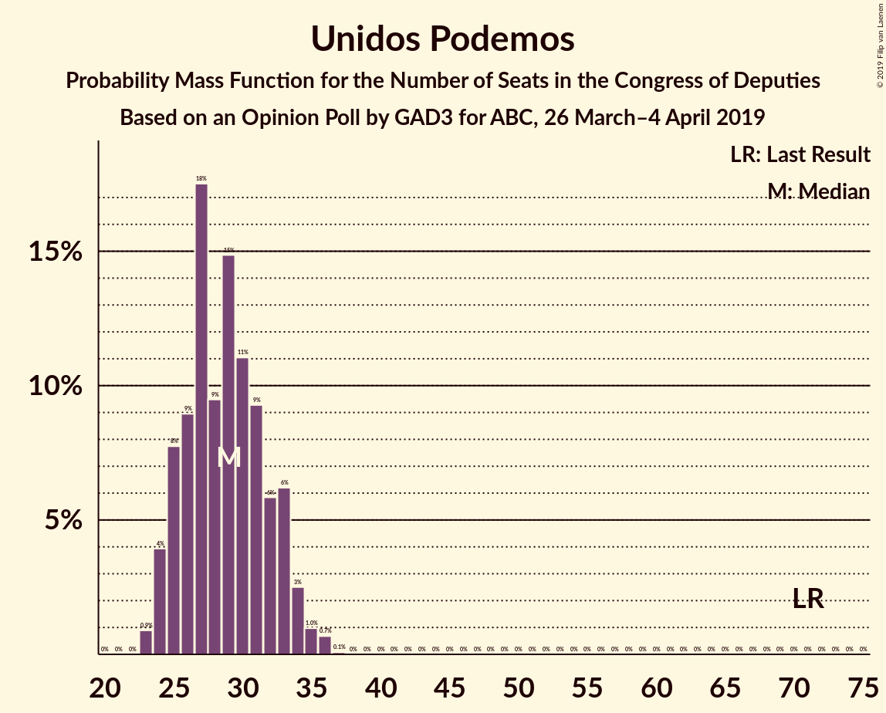
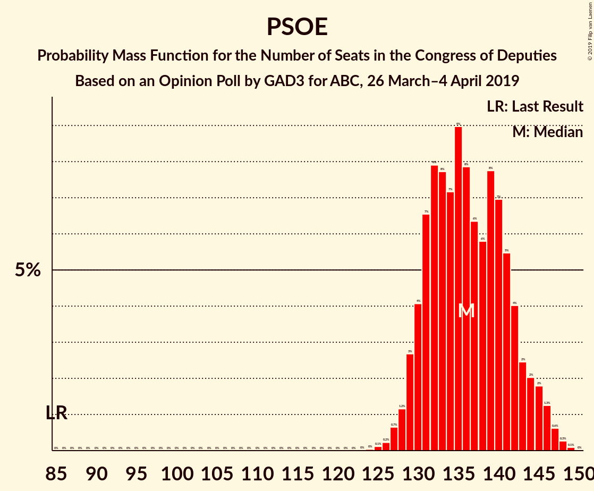

# Opinion Poll by GAD3 for ABC, 26 March–4 April 2019

<a href="#voting-intentions">Voting Intentions</a> | <a href="#seats">Seats</a> | <a href="#coalitions">Coalitions</a> | <a href="#technical-information">Technical Information</a>

## Voting Intentions

### Confidence Intervals

| Party | Last Result | Poll Result | 80% Confidence Interval | 90% Confidence Interval | 95% Confidence Interval | 99% Confidence Interval |
|:-----:|:-----------:|:-----------:|:-----------------------:|:-----------------------:|:-----------------------:|:-----------------------:|
| Partido Socialista Obrero Español | 22.6% | 31.1% | 30.2–32.1% |29.9–32.3% |29.7–32.6% |29.2–33.0% |
| Partido Popular | 33.0% | 20.9% | 20.1–21.7% |19.9–22.0% |19.7–22.2% |19.3–22.6% |
| Ciudadanos–Partido de la Ciudadanía | 13.1% | 14.9% | 14.2–15.7% |14.0–15.9% |13.8–16.0% |13.5–16.4% |
| Unidos Podemos | 21.2% | 11.5% | 10.9–12.2% |10.7–12.4% |10.5–12.5% |10.2–12.9% |
| Vox | 0.2% | 9.8% | 9.2–10.4% |9.1–10.6% |8.9–10.8% |8.6–11.1% |

*Note:* The poll result column reflects the actual value used in the calculations. Published results may vary slightly, and in addition be rounded to fewer digits.

## Seats

### Confidence Intervals

| Party | Last Result | Median | 80% Confidence Interval | 90% Confidence Interval | 95% Confidence Interval | 99% Confidence Interval |
|:-----:|:-----------:|:------:|:-----------------------:|:-----------------------:|:-----------------------:|:-----------------------:|
| <a href="#partido-socialista-obrero-español">Partido Socialista Obrero Español</a> | 85 | 136 | 131–142 |130–144 |129–145 |127–147 |
| <a href="#partido-popular">Partido Popular</a> | 137 | 85 | 79–88 |77–89 |76–90 |73–92 |
| <a href="#ciudadanos–partido-de-la-ciudadanía">Ciudadanos–Partido de la Ciudadanía</a> | 32 | 50 | 45–53 |44–54 |43–54 |41–55 |
| <a href="#unidos-podemos">Unidos Podemos</a> | 71 | 28 | 25–32 |24–33 |24–34 |23–36 |
| <a href="#vox">Vox</a> | 0 | 23 | 21–27 |20–28 |20–29 |18–30 |

### Partido Socialista Obrero Español

*For a full overview of the results for this party, see the [Partido Socialista Obrero Español](party-partidosocialistaobreroespañol.html) page.*

| Number of Seats | Probability | Accumulated | Special Marks |
|:---------------:|:-----------:|:-----------:|:-------------:|
| 85 | 0% | 100% | Last Result |
| 86 | 0% | 100% |  |
| 87 | 0% | 100% |  |
| 88 | 0% | 100% |  |
| 89 | 0% | 100% |  |
| 90 | 0% | 100% |  |
| 91 | 0% | 100% |  |
| 92 | 0% | 100% |  |
| 93 | 0% | 100% |  |
| 94 | 0% | 100% |  |
| 95 | 0% | 100% |  |
| 96 | 0% | 100% |  |
| 97 | 0% | 100% |  |
| 98 | 0% | 100% |  |
| 99 | 0% | 100% |  |
| 100 | 0% | 100% |  |
| 101 | 0% | 100% |  |
| 102 | 0% | 100% |  |
| 103 | 0% | 100% |  |
| 104 | 0% | 100% |  |
| 105 | 0% | 100% |  |
| 106 | 0% | 100% |  |
| 107 | 0% | 100% |  |
| 108 | 0% | 100% |  |
| 109 | 0% | 100% |  |
| 110 | 0% | 100% |  |
| 111 | 0% | 100% |  |
| 112 | 0% | 100% |  |
| 113 | 0% | 100% |  |
| 114 | 0% | 100% |  |
| 115 | 0% | 100% |  |
| 116 | 0% | 100% |  |
| 117 | 0% | 100% |  |
| 118 | 0% | 100% |  |
| 119 | 0% | 100% |  |
| 120 | 0% | 100% |  |
| 121 | 0% | 100% |  |
| 122 | 0% | 100% |  |
| 123 | 0% | 100% |  |
| 124 | 0% | 100% |  |
| 125 | 0.1% | 100% |  |
| 126 | 0.2% | 99.8% |  |
| 127 | 0.7% | 99.6% |  |
| 128 | 1.2% | 98.9% |  |
| 129 | 2% | 98% |  |
| 130 | 4% | 95% |  |
| 131 | 6% | 92% |  |
| 132 | 9% | 86% |  |
| 133 | 8% | 77% |  |
| 134 | 9% | 68% |  |
| 135 | 10% | 60% |  |
| 136 | 5% | 50% | Median |
| 137 | 6% | 45% |  |
| 138 | 5% | 40% |  |
| 139 | 10% | 35% |  |
| 140 | 8% | 24% |  |
| 141 | 6% | 17% |  |
| 142 | 3% | 11% |  |
| 143 | 2% | 8% |  |
| 144 | 2% | 6% |  |
| 145 | 2% | 4% |  |
| 146 | 0.8% | 2% |  |
| 147 | 0.7% | 1.1% |  |
| 148 | 0.3% | 0.4% |  |
| 149 | 0.1% | 0.1% |  |
| 150 | 0% | 0% |  |

### Partido Popular

*For a full overview of the results for this party, see the [Partido Popular](party-partidopopular.html) page.*

| Number of Seats | Probability | Accumulated | Special Marks |
|:---------------:|:-----------:|:-----------:|:-------------:|
| 71 | 0.1% | 100% |  |
| 72 | 0.1% | 99.9% |  |
| 73 | 0.4% | 99.8% |  |
| 74 | 0.4% | 99.4% |  |
| 75 | 0.5% | 98.9% |  |
| 76 | 1.1% | 98% |  |
| 77 | 3% | 97% |  |
| 78 | 3% | 94% |  |
| 79 | 2% | 91% |  |
| 80 | 5% | 89% |  |
| 81 | 8% | 84% |  |
| 82 | 6% | 76% |  |
| 83 | 8% | 70% |  |
| 84 | 10% | 62% |  |
| 85 | 16% | 52% | Median |
| 86 | 11% | 37% |  |
| 87 | 9% | 25% |  |
| 88 | 9% | 17% |  |
| 89 | 4% | 8% |  |
| 90 | 2% | 3% |  |
| 91 | 1.0% | 2% |  |
| 92 | 0.3% | 0.5% |  |
| 93 | 0.1% | 0.2% |  |
| 94 | 0.1% | 0.1% |  |
| 95 | 0% | 0% |  |
| 96 | 0% | 0% |  |
| 97 | 0% | 0% |  |
| 98 | 0% | 0% |  |
| 99 | 0% | 0% |  |
| 100 | 0% | 0% |  |
| 101 | 0% | 0% |  |
| 102 | 0% | 0% |  |
| 103 | 0% | 0% |  |
| 104 | 0% | 0% |  |
| 105 | 0% | 0% |  |
| 106 | 0% | 0% |  |
| 107 | 0% | 0% |  |
| 108 | 0% | 0% |  |
| 109 | 0% | 0% |  |
| 110 | 0% | 0% |  |
| 111 | 0% | 0% |  |
| 112 | 0% | 0% |  |
| 113 | 0% | 0% |  |
| 114 | 0% | 0% |  |
| 115 | 0% | 0% |  |
| 116 | 0% | 0% |  |
| 117 | 0% | 0% |  |
| 118 | 0% | 0% |  |
| 119 | 0% | 0% |  |
| 120 | 0% | 0% |  |
| 121 | 0% | 0% |  |
| 122 | 0% | 0% |  |
| 123 | 0% | 0% |  |
| 124 | 0% | 0% |  |
| 125 | 0% | 0% |  |
| 126 | 0% | 0% |  |
| 127 | 0% | 0% |  |
| 128 | 0% | 0% |  |
| 129 | 0% | 0% |  |
| 130 | 0% | 0% |  |
| 131 | 0% | 0% |  |
| 132 | 0% | 0% |  |
| 133 | 0% | 0% |  |
| 134 | 0% | 0% |  |
| 135 | 0% | 0% |  |
| 136 | 0% | 0% |  |
| 137 | 0% | 0% | Last Result |

### Ciudadanos–Partido de la Ciudadanía

*For a full overview of the results for this party, see the [Ciudadanos–Partido de la Ciudadanía](party-ciudadanos–partidodelaciudadanía.html) page.*

| Number of Seats | Probability | Accumulated | Special Marks |
|:---------------:|:-----------:|:-----------:|:-------------:|
| 32 | 0% | 100% | Last Result |
| 33 | 0% | 100% |  |
| 34 | 0% | 100% |  |
| 35 | 0% | 100% |  |
| 36 | 0% | 100% |  |
| 37 | 0% | 100% |  |
| 38 | 0.1% | 100% |  |
| 39 | 0.1% | 99.9% |  |
| 40 | 0.2% | 99.7% |  |
| 41 | 0.5% | 99.5% |  |
| 42 | 0.9% | 99.1% |  |
| 43 | 2% | 98% |  |
| 44 | 4% | 97% |  |
| 45 | 5% | 93% |  |
| 46 | 12% | 88% |  |
| 47 | 8% | 76% |  |
| 48 | 4% | 68% |  |
| 49 | 9% | 64% |  |
| 50 | 14% | 55% | Median |
| 51 | 13% | 41% |  |
| 52 | 14% | 29% |  |
| 53 | 9% | 15% |  |
| 54 | 5% | 6% |  |
| 55 | 1.3% | 2% |  |
| 56 | 0.3% | 0.4% |  |
| 57 | 0.1% | 0.1% |  |
| 58 | 0% | 0% |  |

### Unidos Podemos

*For a full overview of the results for this party, see the [Unidos Podemos](party-unidospodemos.html) page.*

| Number of Seats | Probability | Accumulated | Special Marks |
|:---------------:|:-----------:|:-----------:|:-------------:|
| 23 | 0.9% | 100% |  |
| 24 | 5% | 99.1% |  |
| 25 | 8% | 94% |  |
| 26 | 9% | 87% |  |
| 27 | 18% | 78% |  |
| 28 | 10% | 60% | Median |
| 29 | 15% | 50% |  |
| 30 | 11% | 35% |  |
| 31 | 9% | 24% |  |
| 32 | 5% | 15% |  |
| 33 | 6% | 9% |  |
| 34 | 2% | 3% |  |
| 35 | 0.7% | 1.3% |  |
| 36 | 0.5% | 0.6% |  |
| 37 | 0.1% | 0.1% |  |
| 38 | 0% | 0% |  |
| 39 | 0% | 0% |  |
| 40 | 0% | 0% |  |
| 41 | 0% | 0% |  |
| 42 | 0% | 0% |  |
| 43 | 0% | 0% |  |
| 44 | 0% | 0% |  |
| 45 | 0% | 0% |  |
| 46 | 0% | 0% |  |
| 47 | 0% | 0% |  |
| 48 | 0% | 0% |  |
| 49 | 0% | 0% |  |
| 50 | 0% | 0% |  |
| 51 | 0% | 0% |  |
| 52 | 0% | 0% |  |
| 53 | 0% | 0% |  |
| 54 | 0% | 0% |  |
| 55 | 0% | 0% |  |
| 56 | 0% | 0% |  |
| 57 | 0% | 0% |  |
| 58 | 0% | 0% |  |
| 59 | 0% | 0% |  |
| 60 | 0% | 0% |  |
| 61 | 0% | 0% |  |
| 62 | 0% | 0% |  |
| 63 | 0% | 0% |  |
| 64 | 0% | 0% |  |
| 65 | 0% | 0% |  |
| 66 | 0% | 0% |  |
| 67 | 0% | 0% |  |
| 68 | 0% | 0% |  |
| 69 | 0% | 0% |  |
| 70 | 0% | 0% |  |
| 71 | 0% | 0% | Last Result |

### Vox

*For a full overview of the results for this party, see the [Vox](party-vox.html) page.*

| Number of Seats | Probability | Accumulated | Special Marks |
|:---------------:|:-----------:|:-----------:|:-------------:|
| 0 | 0% | 100% | Last Result |
| 1 | 0% | 100% |  |
| 2 | 0% | 100% |  |
| 3 | 0% | 100% |  |
| 4 | 0% | 100% |  |
| 5 | 0% | 100% |  |
| 6 | 0% | 100% |  |
| 7 | 0% | 100% |  |
| 8 | 0% | 100% |  |
| 9 | 0% | 100% |  |
| 10 | 0% | 100% |  |
| 11 | 0% | 100% |  |
| 12 | 0% | 100% |  |
| 13 | 0% | 100% |  |
| 14 | 0% | 100% |  |
| 15 | 0% | 100% |  |
| 16 | 0.1% | 100% |  |
| 17 | 0.2% | 99.9% |  |
| 18 | 1.0% | 99.6% |  |
| 19 | 0.9% | 98.6% |  |
| 20 | 3% | 98% |  |
| 21 | 8% | 95% |  |
| 22 | 16% | 87% |  |
| 23 | 37% | 71% | Median |
| 24 | 10% | 34% |  |
| 25 | 7% | 24% |  |
| 26 | 6% | 17% |  |
| 27 | 4% | 11% |  |
| 28 | 3% | 7% |  |
| 29 | 3% | 4% |  |
| 30 | 1.0% | 1.1% |  |
| 31 | 0% | 0.1% |  |
| 32 | 0% | 0% |  |

## Coalitions

### Confidence Intervals

| Coalition | Last Result | Median | Majority? | 80% Confidence Interval | 90% Confidence Interval | 95% Confidence Interval | 99% Confidence Interval |
|:---------:|:-----------:|:------:|:---------:|:-----------------------:|:-----------------------:|:-----------------------:|:-----------------------:|
| Partido Socialista Obrero Español – Partido Popular – Ciudadanos–Partido de la Ciudadanía | 254 | 270 | 100% | 265–274 | 263–275 | 262–276 | 260–277 |
| Partido Socialista Obrero Español – Partido Popular | 222 | 220 | 100% | 215–226 | 214–228 | 213–229 | 211–231 |
| Partido Socialista Obrero Español – Ciudadanos–Partido de la Ciudadanía – Unidos Podemos | 188 | 214 | 100% | 208–220 | 207–222 | 206–223 | 204–225 |
| Partido Socialista Obrero Español – Ciudadanos–Partido de la Ciudadanía | 117 | 185 | 99.4% | 180–191 | 179–193 | 178–194 | 175–197 |
| Partido Socialista Obrero Español – Unidos Podemos | 156 | 165 | 0.9% | 159–171 | 158–173 | 157–174 | 155–176 |
| Partido Popular – Ciudadanos–Partido de la Ciudadanía – Vox | 169 | 157 | 0% | 151–162 | 149–163 | 148–164 | 146–166 |
| Partido Socialista Obrero Español | 85 | 136 | 0% | 131–142 | 130–144 | 129–145 | 127–147 |
| Partido Popular – Ciudadanos–Partido de la Ciudadanía | 169 | 133 | 0% | 127–139 | 126–140 | 125–140 | 122–142 |
| Partido Popular – Vox | 137 | 108 | 0% | 102–113 | 100–114 | 99–115 | 96–117 |
| Partido Popular | 137 | 85 | 0% | 79–88 | 77–89 | 76–90 | 73–92 |

### Partido Socialista Obrero Español – Partido Popular – Ciudadanos–Partido de la Ciudadanía

| Number of Seats | Probability | Accumulated | Special Marks |
|:---------------:|:-----------:|:-----------:|:-------------:|
| 254 | 0% | 100% | Last Result |
| 255 | 0% | 100% |  |
| 256 | 0% | 100% |  |
| 257 | 0% | 100% |  |
| 258 | 0.1% | 100% |  |
| 259 | 0.1% | 99.9% |  |
| 260 | 0.3% | 99.8% |  |
| 261 | 0.7% | 99.5% |  |
| 262 | 2% | 98.8% |  |
| 263 | 2% | 97% |  |
| 264 | 4% | 95% |  |
| 265 | 4% | 91% |  |
| 266 | 5% | 87% |  |
| 267 | 8% | 81% |  |
| 268 | 11% | 74% |  |
| 269 | 12% | 63% |  |
| 270 | 9% | 50% |  |
| 271 | 11% | 42% | Median |
| 272 | 10% | 31% |  |
| 273 | 9% | 20% |  |
| 274 | 5% | 11% |  |
| 275 | 4% | 6% |  |
| 276 | 2% | 3% |  |
| 277 | 0.9% | 1.2% |  |
| 278 | 0.3% | 0.4% |  |
| 279 | 0.1% | 0.1% |  |
| 280 | 0% | 0% |  |

### Partido Socialista Obrero Español – Partido Popular

| Number of Seats | Probability | Accumulated | Special Marks |
|:---------------:|:-----------:|:-----------:|:-------------:|
| 210 | 0.2% | 100% |  |
| 211 | 0.6% | 99.8% |  |
| 212 | 2% | 99.2% |  |
| 213 | 2% | 98% |  |
| 214 | 4% | 96% |  |
| 215 | 4% | 92% |  |
| 216 | 6% | 88% |  |
| 217 | 10% | 82% |  |
| 218 | 10% | 72% |  |
| 219 | 7% | 62% |  |
| 220 | 12% | 55% |  |
| 221 | 9% | 43% | Median |
| 222 | 8% | 34% | Last Result |
| 223 | 4% | 26% |  |
| 224 | 4% | 22% |  |
| 225 | 4% | 18% |  |
| 226 | 5% | 15% |  |
| 227 | 4% | 9% |  |
| 228 | 2% | 5% |  |
| 229 | 2% | 3% |  |
| 230 | 0.8% | 1.5% |  |
| 231 | 0.4% | 0.6% |  |
| 232 | 0.2% | 0.2% |  |
| 233 | 0% | 0.1% |  |
| 234 | 0% | 0% |  |

### Partido Socialista Obrero Español – Ciudadanos–Partido de la Ciudadanía – Unidos Podemos

| Number of Seats | Probability | Accumulated | Special Marks |
|:---------------:|:-----------:|:-----------:|:-------------:|
| 188 | 0% | 100% | Last Result |
| 189 | 0% | 100% |  |
| 190 | 0% | 100% |  |
| 191 | 0% | 100% |  |
| 192 | 0% | 100% |  |
| 193 | 0% | 100% |  |
| 194 | 0% | 100% |  |
| 195 | 0% | 100% |  |
| 196 | 0% | 100% |  |
| 197 | 0% | 100% |  |
| 198 | 0% | 100% |  |
| 199 | 0% | 100% |  |
| 200 | 0% | 100% |  |
| 201 | 0% | 100% |  |
| 202 | 0% | 99.9% |  |
| 203 | 0.1% | 99.9% |  |
| 204 | 0.4% | 99.8% |  |
| 205 | 0.8% | 99.4% |  |
| 206 | 1.4% | 98.6% |  |
| 207 | 4% | 97% |  |
| 208 | 4% | 94% |  |
| 209 | 4% | 90% |  |
| 210 | 6% | 86% |  |
| 211 | 10% | 80% |  |
| 212 | 9% | 70% |  |
| 213 | 9% | 61% |  |
| 214 | 9% | 52% | Median |
| 215 | 7% | 43% |  |
| 216 | 9% | 36% |  |
| 217 | 4% | 26% |  |
| 218 | 5% | 22% |  |
| 219 | 7% | 18% |  |
| 220 | 3% | 11% |  |
| 221 | 2% | 8% |  |
| 222 | 3% | 6% |  |
| 223 | 1.4% | 3% |  |
| 224 | 0.7% | 2% |  |
| 225 | 0.4% | 0.8% |  |
| 226 | 0.3% | 0.5% |  |
| 227 | 0.1% | 0.2% |  |
| 228 | 0.1% | 0.1% |  |
| 229 | 0% | 0% |  |

### Partido Socialista Obrero Español – Ciudadanos–Partido de la Ciudadanía

| Number of Seats | Probability | Accumulated | Special Marks |
|:---------------:|:-----------:|:-----------:|:-------------:|
| 117 | 0% | 100% | Last Result |
| 118 | 0% | 100% |  |
| 119 | 0% | 100% |  |
| 120 | 0% | 100% |  |
| 121 | 0% | 100% |  |
| 122 | 0% | 100% |  |
| 123 | 0% | 100% |  |
| 124 | 0% | 100% |  |
| 125 | 0% | 100% |  |
| 126 | 0% | 100% |  |
| 127 | 0% | 100% |  |
| 128 | 0% | 100% |  |
| 129 | 0% | 100% |  |
| 130 | 0% | 100% |  |
| 131 | 0% | 100% |  |
| 132 | 0% | 100% |  |
| 133 | 0% | 100% |  |
| 134 | 0% | 100% |  |
| 135 | 0% | 100% |  |
| 136 | 0% | 100% |  |
| 137 | 0% | 100% |  |
| 138 | 0% | 100% |  |
| 139 | 0% | 100% |  |
| 140 | 0% | 100% |  |
| 141 | 0% | 100% |  |
| 142 | 0% | 100% |  |
| 143 | 0% | 100% |  |
| 144 | 0% | 100% |  |
| 145 | 0% | 100% |  |
| 146 | 0% | 100% |  |
| 147 | 0% | 100% |  |
| 148 | 0% | 100% |  |
| 149 | 0% | 100% |  |
| 150 | 0% | 100% |  |
| 151 | 0% | 100% |  |
| 152 | 0% | 100% |  |
| 153 | 0% | 100% |  |
| 154 | 0% | 100% |  |
| 155 | 0% | 100% |  |
| 156 | 0% | 100% |  |
| 157 | 0% | 100% |  |
| 158 | 0% | 100% |  |
| 159 | 0% | 100% |  |
| 160 | 0% | 100% |  |
| 161 | 0% | 100% |  |
| 162 | 0% | 100% |  |
| 163 | 0% | 100% |  |
| 164 | 0% | 100% |  |
| 165 | 0% | 100% |  |
| 166 | 0% | 100% |  |
| 167 | 0% | 100% |  |
| 168 | 0% | 100% |  |
| 169 | 0% | 100% |  |
| 170 | 0% | 100% |  |
| 171 | 0% | 100% |  |
| 172 | 0% | 100% |  |
| 173 | 0.1% | 99.9% |  |
| 174 | 0.2% | 99.9% |  |
| 175 | 0.3% | 99.7% |  |
| 176 | 0.6% | 99.4% | Majority |
| 177 | 1.0% | 98.9% |  |
| 178 | 2% | 98% |  |
| 179 | 4% | 96% |  |
| 180 | 3% | 92% |  |
| 181 | 6% | 89% |  |
| 182 | 8% | 83% |  |
| 183 | 9% | 75% |  |
| 184 | 8% | 66% |  |
| 185 | 12% | 58% |  |
| 186 | 8% | 46% | Median |
| 187 | 8% | 38% |  |
| 188 | 8% | 31% |  |
| 189 | 5% | 23% |  |
| 190 | 4% | 18% |  |
| 191 | 5% | 14% |  |
| 192 | 3% | 9% |  |
| 193 | 2% | 6% |  |
| 194 | 1.4% | 3% |  |
| 195 | 0.8% | 2% |  |
| 196 | 0.5% | 1.0% |  |
| 197 | 0.3% | 0.5% |  |
| 198 | 0.1% | 0.2% |  |
| 199 | 0% | 0.1% |  |
| 200 | 0% | 0% |  |

### Partido Socialista Obrero Español – Unidos Podemos

| Number of Seats | Probability | Accumulated | Special Marks |
|:---------------:|:-----------:|:-----------:|:-------------:|
| 153 | 0.1% | 100% |  |
| 154 | 0.2% | 99.9% |  |
| 155 | 0.6% | 99.7% |  |
| 156 | 1.3% | 99.2% | Last Result |
| 157 | 3% | 98% |  |
| 158 | 4% | 95% |  |
| 159 | 5% | 92% |  |
| 160 | 8% | 87% |  |
| 161 | 8% | 78% |  |
| 162 | 10% | 71% |  |
| 163 | 6% | 61% |  |
| 164 | 4% | 55% | Median |
| 165 | 6% | 51% |  |
| 166 | 9% | 45% |  |
| 167 | 6% | 36% |  |
| 168 | 6% | 30% |  |
| 169 | 5% | 24% |  |
| 170 | 5% | 18% |  |
| 171 | 4% | 13% |  |
| 172 | 4% | 9% |  |
| 173 | 2% | 5% |  |
| 174 | 1.4% | 3% |  |
| 175 | 1.0% | 2% |  |
| 176 | 0.4% | 0.9% | Majority |
| 177 | 0.2% | 0.4% |  |
| 178 | 0.1% | 0.2% |  |
| 179 | 0.1% | 0.1% |  |
| 180 | 0% | 0% |  |

### Partido Popular – Ciudadanos–Partido de la Ciudadanía – Vox

| Number of Seats | Probability | Accumulated | Special Marks |
|:---------------:|:-----------:|:-----------:|:-------------:|
| 142 | 0% | 100% |  |
| 143 | 0.1% | 99.9% |  |
| 144 | 0.2% | 99.9% |  |
| 145 | 0.2% | 99.7% |  |
| 146 | 0.5% | 99.5% |  |
| 147 | 0.9% | 99.0% |  |
| 148 | 1.5% | 98% |  |
| 149 | 2% | 97% |  |
| 150 | 4% | 94% |  |
| 151 | 4% | 91% |  |
| 152 | 6% | 87% |  |
| 153 | 5% | 81% |  |
| 154 | 6% | 76% |  |
| 155 | 8% | 69% |  |
| 156 | 9% | 61% |  |
| 157 | 5% | 53% |  |
| 158 | 5% | 47% | Median |
| 159 | 10% | 42% |  |
| 160 | 9% | 32% |  |
| 161 | 8% | 23% |  |
| 162 | 6% | 15% |  |
| 163 | 4% | 9% |  |
| 164 | 2% | 5% |  |
| 165 | 1.5% | 2% |  |
| 166 | 0.6% | 0.8% |  |
| 167 | 0.2% | 0.2% |  |
| 168 | 0.1% | 0.1% |  |
| 169 | 0% | 0% | Last Result |

### Partido Socialista Obrero Español

| Number of Seats | Probability | Accumulated | Special Marks |
|:---------------:|:-----------:|:-----------:|:-------------:|
| 85 | 0% | 100% | Last Result |
| 86 | 0% | 100% |  |
| 87 | 0% | 100% |  |
| 88 | 0% | 100% |  |
| 89 | 0% | 100% |  |
| 90 | 0% | 100% |  |
| 91 | 0% | 100% |  |
| 92 | 0% | 100% |  |
| 93 | 0% | 100% |  |
| 94 | 0% | 100% |  |
| 95 | 0% | 100% |  |
| 96 | 0% | 100% |  |
| 97 | 0% | 100% |  |
| 98 | 0% | 100% |  |
| 99 | 0% | 100% |  |
| 100 | 0% | 100% |  |
| 101 | 0% | 100% |  |
| 102 | 0% | 100% |  |
| 103 | 0% | 100% |  |
| 104 | 0% | 100% |  |
| 105 | 0% | 100% |  |
| 106 | 0% | 100% |  |
| 107 | 0% | 100% |  |
| 108 | 0% | 100% |  |
| 109 | 0% | 100% |  |
| 110 | 0% | 100% |  |
| 111 | 0% | 100% |  |
| 112 | 0% | 100% |  |
| 113 | 0% | 100% |  |
| 114 | 0% | 100% |  |
| 115 | 0% | 100% |  |
| 116 | 0% | 100% |  |
| 117 | 0% | 100% |  |
| 118 | 0% | 100% |  |
| 119 | 0% | 100% |  |
| 120 | 0% | 100% |  |
| 121 | 0% | 100% |  |
| 122 | 0% | 100% |  |
| 123 | 0% | 100% |  |
| 124 | 0% | 100% |  |
| 125 | 0.1% | 100% |  |
| 126 | 0.2% | 99.8% |  |
| 127 | 0.7% | 99.6% |  |
| 128 | 1.2% | 98.9% |  |
| 129 | 2% | 98% |  |
| 130 | 4% | 95% |  |
| 131 | 6% | 92% |  |
| 132 | 9% | 86% |  |
| 133 | 8% | 77% |  |
| 134 | 9% | 68% |  |
| 135 | 10% | 60% |  |
| 136 | 5% | 50% | Median |
| 137 | 6% | 45% |  |
| 138 | 5% | 40% |  |
| 139 | 10% | 35% |  |
| 140 | 8% | 24% |  |
| 141 | 6% | 17% |  |
| 142 | 3% | 11% |  |
| 143 | 2% | 8% |  |
| 144 | 2% | 6% |  |
| 145 | 2% | 4% |  |
| 146 | 0.8% | 2% |  |
| 147 | 0.7% | 1.1% |  |
| 148 | 0.3% | 0.4% |  |
| 149 | 0.1% | 0.1% |  |
| 150 | 0% | 0% |  |

### Partido Popular – Ciudadanos–Partido de la Ciudadanía

| Number of Seats | Probability | Accumulated | Special Marks |
|:---------------:|:-----------:|:-----------:|:-------------:|
| 119 | 0% | 100% |  |
| 120 | 0.1% | 99.9% |  |
| 121 | 0.2% | 99.9% |  |
| 122 | 0.3% | 99.6% |  |
| 123 | 0.7% | 99.4% |  |
| 124 | 1.0% | 98.7% |  |
| 125 | 1.2% | 98% |  |
| 126 | 3% | 96% |  |
| 127 | 4% | 94% |  |
| 128 | 4% | 90% |  |
| 129 | 5% | 86% |  |
| 130 | 7% | 81% |  |
| 131 | 7% | 74% |  |
| 132 | 8% | 67% |  |
| 133 | 10% | 58% |  |
| 134 | 6% | 48% |  |
| 135 | 6% | 42% | Median |
| 136 | 10% | 37% |  |
| 137 | 8% | 27% |  |
| 138 | 8% | 19% |  |
| 139 | 5% | 10% |  |
| 140 | 3% | 6% |  |
| 141 | 1.3% | 2% |  |
| 142 | 0.6% | 1.1% |  |
| 143 | 0.3% | 0.5% |  |
| 144 | 0.1% | 0.1% |  |
| 145 | 0% | 0% |  |
| 146 | 0% | 0% |  |
| 147 | 0% | 0% |  |
| 148 | 0% | 0% |  |
| 149 | 0% | 0% |  |
| 150 | 0% | 0% |  |
| 151 | 0% | 0% |  |
| 152 | 0% | 0% |  |
| 153 | 0% | 0% |  |
| 154 | 0% | 0% |  |
| 155 | 0% | 0% |  |
| 156 | 0% | 0% |  |
| 157 | 0% | 0% |  |
| 158 | 0% | 0% |  |
| 159 | 0% | 0% |  |
| 160 | 0% | 0% |  |
| 161 | 0% | 0% |  |
| 162 | 0% | 0% |  |
| 163 | 0% | 0% |  |
| 164 | 0% | 0% |  |
| 165 | 0% | 0% |  |
| 166 | 0% | 0% |  |
| 167 | 0% | 0% |  |
| 168 | 0% | 0% |  |
| 169 | 0% | 0% | Last Result |

### Partido Popular – Vox

| Number of Seats | Probability | Accumulated | Special Marks |
|:---------------:|:-----------:|:-----------:|:-------------:|
| 93 | 0% | 100% |  |
| 94 | 0.1% | 99.9% |  |
| 95 | 0.1% | 99.8% |  |
| 96 | 0.3% | 99.7% |  |
| 97 | 0.5% | 99.4% |  |
| 98 | 0.7% | 99.0% |  |
| 99 | 2% | 98% |  |
| 100 | 3% | 97% |  |
| 101 | 2% | 93% |  |
| 102 | 3% | 92% |  |
| 103 | 7% | 89% |  |
| 104 | 6% | 82% |  |
| 105 | 5% | 76% |  |
| 106 | 8% | 71% |  |
| 107 | 9% | 63% |  |
| 108 | 10% | 54% | Median |
| 109 | 11% | 44% |  |
| 110 | 9% | 33% |  |
| 111 | 8% | 24% |  |
| 112 | 5% | 15% |  |
| 113 | 4% | 11% |  |
| 114 | 4% | 7% |  |
| 115 | 2% | 3% |  |
| 116 | 0.7% | 1.3% |  |
| 117 | 0.4% | 0.6% |  |
| 118 | 0.1% | 0.2% |  |
| 119 | 0% | 0.1% |  |
| 120 | 0% | 0.1% |  |
| 121 | 0% | 0% |  |
| 122 | 0% | 0% |  |
| 123 | 0% | 0% |  |
| 124 | 0% | 0% |  |
| 125 | 0% | 0% |  |
| 126 | 0% | 0% |  |
| 127 | 0% | 0% |  |
| 128 | 0% | 0% |  |
| 129 | 0% | 0% |  |
| 130 | 0% | 0% |  |
| 131 | 0% | 0% |  |
| 132 | 0% | 0% |  |
| 133 | 0% | 0% |  |
| 134 | 0% | 0% |  |
| 135 | 0% | 0% |  |
| 136 | 0% | 0% |  |
| 137 | 0% | 0% | Last Result |

### Partido Popular

| Number of Seats | Probability | Accumulated | Special Marks |
|:---------------:|:-----------:|:-----------:|:-------------:|
| 71 | 0.1% | 100% |  |
| 72 | 0.1% | 99.9% |  |
| 73 | 0.4% | 99.8% |  |
| 74 | 0.4% | 99.4% |  |
| 75 | 0.5% | 98.9% |  |
| 76 | 1.1% | 98% |  |
| 77 | 3% | 97% |  |
| 78 | 3% | 94% |  |
| 79 | 2% | 91% |  |
| 80 | 5% | 89% |  |
| 81 | 8% | 84% |  |
| 82 | 6% | 76% |  |
| 83 | 8% | 70% |  |
| 84 | 10% | 62% |  |
| 85 | 16% | 52% | Median |
| 86 | 11% | 37% |  |
| 87 | 9% | 25% |  |
| 88 | 9% | 17% |  |
| 89 | 4% | 8% |  |
| 90 | 2% | 3% |  |
| 91 | 1.0% | 2% |  |
| 92 | 0.3% | 0.5% |  |
| 93 | 0.1% | 0.2% |  |
| 94 | 0.1% | 0.1% |  |
| 95 | 0% | 0% |  |
| 96 | 0% | 0% |  |
| 97 | 0% | 0% |  |
| 98 | 0% | 0% |  |
| 99 | 0% | 0% |  |
| 100 | 0% | 0% |  |
| 101 | 0% | 0% |  |
| 102 | 0% | 0% |  |
| 103 | 0% | 0% |  |
| 104 | 0% | 0% |  |
| 105 | 0% | 0% |  |
| 106 | 0% | 0% |  |
| 107 | 0% | 0% |  |
| 108 | 0% | 0% |  |
| 109 | 0% | 0% |  |
| 110 | 0% | 0% |  |
| 111 | 0% | 0% |  |
| 112 | 0% | 0% |  |
| 113 | 0% | 0% |  |
| 114 | 0% | 0% |  |
| 115 | 0% | 0% |  |
| 116 | 0% | 0% |  |
| 117 | 0% | 0% |  |
| 118 | 0% | 0% |  |
| 119 | 0% | 0% |  |
| 120 | 0% | 0% |  |
| 121 | 0% | 0% |  |
| 122 | 0% | 0% |  |
| 123 | 0% | 0% |  |
| 124 | 0% | 0% |  |
| 125 | 0% | 0% |  |
| 126 | 0% | 0% |  |
| 127 | 0% | 0% |  |
| 128 | 0% | 0% |  |
| 129 | 0% | 0% |  |
| 130 | 0% | 0% |  |
| 131 | 0% | 0% |  |
| 132 | 0% | 0% |  |
| 133 | 0% | 0% |  |
| 134 | 0% | 0% |  |
| 135 | 0% | 0% |  |
| 136 | 0% | 0% |  |
| 137 | 0% | 0% | Last Result |

## Technical Information

### Opinion Poll

+ **Polling firm:** GAD3
+ **Commissioner(s):** ABC
+ **Fieldwork period:** 26 March–4 April 2019

### Calculations

+ **Sample size:** 4000
+ **Simulations done:** 131,072
+ **Error estimate:** 0.62%

