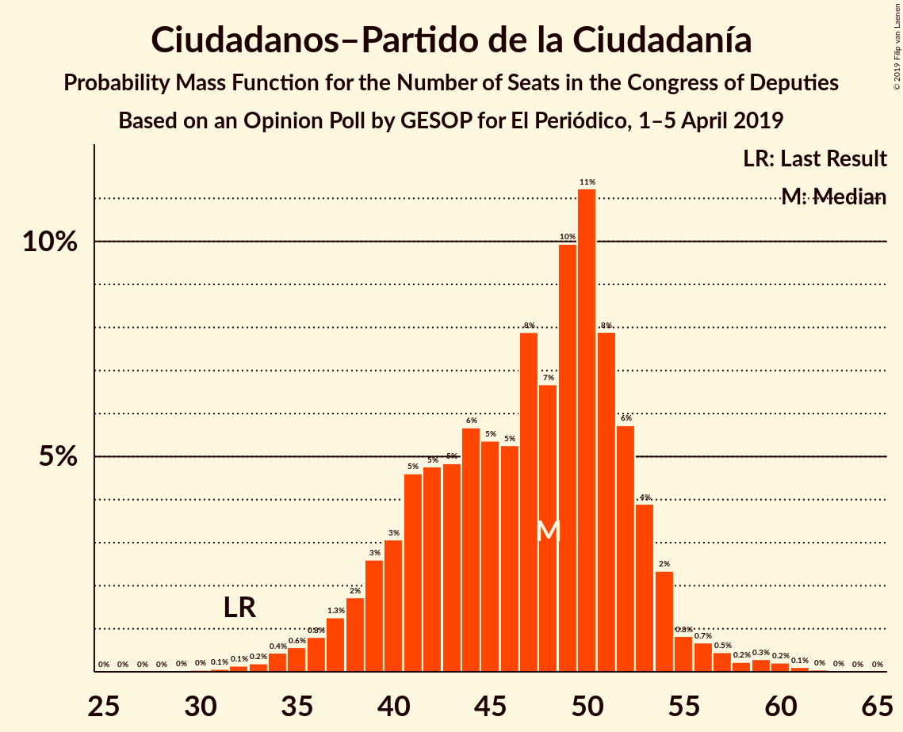
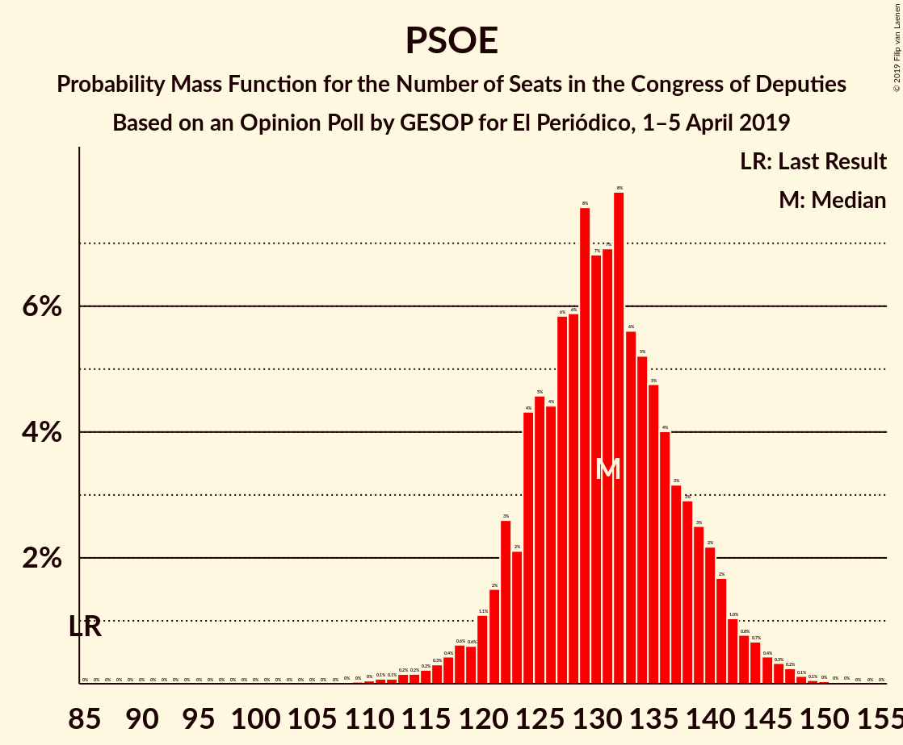

# Opinion Poll by GESOP for El Periódico, 1–5 April 2019

<a href="#voting-intentions">Voting Intentions</a> | <a href="#seats">Seats</a> | <a href="#coalitions">Coalitions</a> | <a href="#technical-information">Technical Information</a>

## Voting Intentions

### Confidence Intervals

| Party | Last Result | Poll Result | 80% Confidence Interval | 90% Confidence Interval | 95% Confidence Interval | 99% Confidence Interval |
|:-----:|:-----------:|:-----------:|:-----------------------:|:-----------------------:|:-----------------------:|:-----------------------:|
| Partido Socialista Obrero Español | 22.6% | 29.8% | 28.3–31.4% |27.9–31.8% |27.5–32.2% |26.8–32.9% |
| Partido Popular | 33.0% | 21.0% | 19.7–22.4% |19.3–22.8% |19.0–23.1% |18.4–23.8% |
| Ciudadanos–Partido de la Ciudadanía | 13.1% | 14.5% | 13.4–15.8% |13.1–16.1% |12.8–16.4% |12.3–17.0% |
| Unidos Podemos | 21.2% | 12.0% | 11.0–13.1% |10.7–13.5% |10.4–13.7% |10.0–14.3% |
| Vox | 0.2% | 10.6% | 9.6–11.7% |9.4–12.0% |9.1–12.3% |8.7–12.8% |

*Note:* The poll result column reflects the actual value used in the calculations. Published results may vary slightly, and in addition be rounded to fewer digits.

## Seats

### Confidence Intervals

| Party | Last Result | Median | 80% Confidence Interval | 90% Confidence Interval | 95% Confidence Interval | 99% Confidence Interval |
|:-----:|:-----------:|:------:|:-----------------------:|:-----------------------:|:-----------------------:|:-----------------------:|
| <a href="#partido-socialista-obrero-español">Partido Socialista Obrero Español</a> | 85 | 131 | 123–139 |121–141 |119–143 |114–147 |
| <a href="#partido-popular">Partido Popular</a> | 137 | 85 | 78–92 |75–95 |73–98 |70–103 |
| <a href="#ciudadanos–partido-de-la-ciudadanía">Ciudadanos–Partido de la Ciudadanía</a> | 32 | 48 | 40–52 |38–54 |37–55 |33–59 |
| <a href="#unidos-podemos">Unidos Podemos</a> | 71 | 31 | 25–36 |24–37 |24–37 |23–39 |
| <a href="#vox">Vox</a> | 0 | 27 | 23–31 |22–32 |21–33 |18–35 |

### Partido Socialista Obrero Español

*For a full overview of the results for this party, see the [Partido Socialista Obrero Español](party-partidosocialistaobreroespañol.html) page.*

| Number of Seats | Probability | Accumulated | Special Marks |
|:---------------:|:-----------:|:-----------:|:-------------:|
| 85 | 0% | 100% | Last Result |
| 86 | 0% | 100% |  |
| 87 | 0% | 100% |  |
| 88 | 0% | 100% |  |
| 89 | 0% | 100% |  |
| 90 | 0% | 100% |  |
| 91 | 0% | 100% |  |
| 92 | 0% | 100% |  |
| 93 | 0% | 100% |  |
| 94 | 0% | 100% |  |
| 95 | 0% | 100% |  |
| 96 | 0% | 100% |  |
| 97 | 0% | 100% |  |
| 98 | 0% | 100% |  |
| 99 | 0% | 100% |  |
| 100 | 0% | 100% |  |
| 101 | 0% | 100% |  |
| 102 | 0% | 100% |  |
| 103 | 0% | 100% |  |
| 104 | 0% | 100% |  |
| 105 | 0% | 100% |  |
| 106 | 0% | 100% |  |
| 107 | 0% | 100% |  |
| 108 | 0% | 100% |  |
| 109 | 0% | 100% |  |
| 110 | 0% | 99.9% |  |
| 111 | 0.1% | 99.9% |  |
| 112 | 0.1% | 99.8% |  |
| 113 | 0.2% | 99.7% |  |
| 114 | 0.2% | 99.6% |  |
| 115 | 0.2% | 99.4% |  |
| 116 | 0.3% | 99.2% |  |
| 117 | 0.4% | 98.9% |  |
| 118 | 0.6% | 98% |  |
| 119 | 0.6% | 98% |  |
| 120 | 1.1% | 97% |  |
| 121 | 2% | 96% |  |
| 122 | 3% | 95% |  |
| 123 | 2% | 92% |  |
| 124 | 4% | 90% |  |
| 125 | 5% | 86% |  |
| 126 | 4% | 81% |  |
| 127 | 6% | 77% |  |
| 128 | 6% | 71% |  |
| 129 | 8% | 65% |  |
| 130 | 7% | 57% |  |
| 131 | 7% | 51% | Median |
| 132 | 8% | 44% |  |
| 133 | 6% | 36% |  |
| 134 | 5% | 30% |  |
| 135 | 5% | 25% |  |
| 136 | 4% | 20% |  |
| 137 | 3% | 16% |  |
| 138 | 3% | 13% |  |
| 139 | 3% | 10% |  |
| 140 | 2% | 8% |  |
| 141 | 2% | 5% |  |
| 142 | 1.0% | 4% |  |
| 143 | 0.8% | 3% |  |
| 144 | 0.7% | 2% |  |
| 145 | 0.4% | 1.3% |  |
| 146 | 0.3% | 0.8% |  |
| 147 | 0.2% | 0.5% |  |
| 148 | 0.1% | 0.3% |  |
| 149 | 0.1% | 0.2% |  |
| 150 | 0% | 0.1% |  |
| 151 | 0% | 0.1% |  |
| 152 | 0% | 0% |  |

### Partido Popular

*For a full overview of the results for this party, see the [Partido Popular](party-partidopopular.html) page.*

| Number of Seats | Probability | Accumulated | Special Marks |
|:---------------:|:-----------:|:-----------:|:-------------:|
| 67 | 0% | 100% |  |
| 68 | 0.1% | 99.9% |  |
| 69 | 0.2% | 99.8% |  |
| 70 | 0.5% | 99.6% |  |
| 71 | 0.5% | 99.1% |  |
| 72 | 1.0% | 98.6% |  |
| 73 | 1.2% | 98% |  |
| 74 | 1.2% | 96% |  |
| 75 | 1.2% | 95% |  |
| 76 | 1.4% | 94% |  |
| 77 | 2% | 93% |  |
| 78 | 2% | 91% |  |
| 79 | 3% | 89% |  |
| 80 | 4% | 87% |  |
| 81 | 5% | 83% |  |
| 82 | 5% | 78% |  |
| 83 | 6% | 72% |  |
| 84 | 9% | 66% |  |
| 85 | 10% | 57% | Median |
| 86 | 10% | 47% |  |
| 87 | 7% | 37% |  |
| 88 | 7% | 30% |  |
| 89 | 5% | 23% |  |
| 90 | 4% | 19% |  |
| 91 | 4% | 15% |  |
| 92 | 2% | 11% |  |
| 93 | 2% | 9% |  |
| 94 | 1.3% | 7% |  |
| 95 | 1.4% | 6% |  |
| 96 | 0.8% | 4% |  |
| 97 | 0.7% | 3% |  |
| 98 | 0.7% | 3% |  |
| 99 | 0.5% | 2% |  |
| 100 | 0.4% | 1.5% |  |
| 101 | 0.3% | 1.1% |  |
| 102 | 0.2% | 0.8% |  |
| 103 | 0.2% | 0.5% |  |
| 104 | 0.1% | 0.4% |  |
| 105 | 0.1% | 0.2% |  |
| 106 | 0.1% | 0.2% |  |
| 107 | 0% | 0.1% |  |
| 108 | 0% | 0.1% |  |
| 109 | 0% | 0% |  |
| 110 | 0% | 0% |  |
| 111 | 0% | 0% |  |
| 112 | 0% | 0% |  |
| 113 | 0% | 0% |  |
| 114 | 0% | 0% |  |
| 115 | 0% | 0% |  |
| 116 | 0% | 0% |  |
| 117 | 0% | 0% |  |
| 118 | 0% | 0% |  |
| 119 | 0% | 0% |  |
| 120 | 0% | 0% |  |
| 121 | 0% | 0% |  |
| 122 | 0% | 0% |  |
| 123 | 0% | 0% |  |
| 124 | 0% | 0% |  |
| 125 | 0% | 0% |  |
| 126 | 0% | 0% |  |
| 127 | 0% | 0% |  |
| 128 | 0% | 0% |  |
| 129 | 0% | 0% |  |
| 130 | 0% | 0% |  |
| 131 | 0% | 0% |  |
| 132 | 0% | 0% |  |
| 133 | 0% | 0% |  |
| 134 | 0% | 0% |  |
| 135 | 0% | 0% |  |
| 136 | 0% | 0% |  |
| 137 | 0% | 0% | Last Result |

### Ciudadanos–Partido de la Ciudadanía

*For a full overview of the results for this party, see the [Ciudadanos–Partido de la Ciudadanía](party-ciudadanos–partidodelaciudadanía.html) page.*

| Number of Seats | Probability | Accumulated | Special Marks |
|:---------------:|:-----------:|:-----------:|:-------------:|
| 29 | 0% | 100% |  |
| 30 | 0% | 99.9% |  |
| 31 | 0.1% | 99.9% |  |
| 32 | 0.1% | 99.8% | Last Result |
| 33 | 0.2% | 99.7% |  |
| 34 | 0.4% | 99.5% |  |
| 35 | 0.6% | 99.0% |  |
| 36 | 0.8% | 98% |  |
| 37 | 1.3% | 98% |  |
| 38 | 2% | 96% |  |
| 39 | 3% | 95% |  |
| 40 | 3% | 92% |  |
| 41 | 5% | 89% |  |
| 42 | 5% | 84% |  |
| 43 | 5% | 80% |  |
| 44 | 6% | 75% |  |
| 45 | 5% | 69% |  |
| 46 | 5% | 64% |  |
| 47 | 8% | 58% |  |
| 48 | 7% | 51% | Median |
| 49 | 10% | 44% |  |
| 50 | 11% | 34% |  |
| 51 | 8% | 23% |  |
| 52 | 6% | 15% |  |
| 53 | 4% | 9% |  |
| 54 | 2% | 5% |  |
| 55 | 0.8% | 3% |  |
| 56 | 0.7% | 2% |  |
| 57 | 0.5% | 1.4% |  |
| 58 | 0.2% | 0.9% |  |
| 59 | 0.3% | 0.7% |  |
| 60 | 0.2% | 0.4% |  |
| 61 | 0.1% | 0.2% |  |
| 62 | 0% | 0.1% |  |
| 63 | 0% | 0.1% |  |
| 64 | 0% | 0% |  |

### Unidos Podemos

*For a full overview of the results for this party, see the [Unidos Podemos](party-unidospodemos.html) page.*

| Number of Seats | Probability | Accumulated | Special Marks |
|:---------------:|:-----------:|:-----------:|:-------------:|
| 22 | 0.2% | 100% |  |
| 23 | 0.8% | 99.8% |  |
| 24 | 5% | 99.1% |  |
| 25 | 4% | 94% |  |
| 26 | 3% | 90% |  |
| 27 | 5% | 87% |  |
| 28 | 7% | 82% |  |
| 29 | 10% | 75% |  |
| 30 | 9% | 66% |  |
| 31 | 8% | 56% | Median |
| 32 | 8% | 49% |  |
| 33 | 9% | 40% |  |
| 34 | 8% | 32% |  |
| 35 | 7% | 24% |  |
| 36 | 10% | 17% |  |
| 37 | 5% | 7% |  |
| 38 | 1.1% | 2% |  |
| 39 | 0.4% | 0.9% |  |
| 40 | 0.2% | 0.5% |  |
| 41 | 0.1% | 0.2% |  |
| 42 | 0.1% | 0.1% |  |
| 43 | 0% | 0.1% |  |
| 44 | 0% | 0% |  |
| 45 | 0% | 0% |  |
| 46 | 0% | 0% |  |
| 47 | 0% | 0% |  |
| 48 | 0% | 0% |  |
| 49 | 0% | 0% |  |
| 50 | 0% | 0% |  |
| 51 | 0% | 0% |  |
| 52 | 0% | 0% |  |
| 53 | 0% | 0% |  |
| 54 | 0% | 0% |  |
| 55 | 0% | 0% |  |
| 56 | 0% | 0% |  |
| 57 | 0% | 0% |  |
| 58 | 0% | 0% |  |
| 59 | 0% | 0% |  |
| 60 | 0% | 0% |  |
| 61 | 0% | 0% |  |
| 62 | 0% | 0% |  |
| 63 | 0% | 0% |  |
| 64 | 0% | 0% |  |
| 65 | 0% | 0% |  |
| 66 | 0% | 0% |  |
| 67 | 0% | 0% |  |
| 68 | 0% | 0% |  |
| 69 | 0% | 0% |  |
| 70 | 0% | 0% |  |
| 71 | 0% | 0% | Last Result |

### Vox

*For a full overview of the results for this party, see the [Vox](party-vox.html) page.*

| Number of Seats | Probability | Accumulated | Special Marks |
|:---------------:|:-----------:|:-----------:|:-------------:|
| 0 | 0% | 100% | Last Result |
| 1 | 0% | 100% |  |
| 2 | 0% | 100% |  |
| 3 | 0% | 100% |  |
| 4 | 0% | 100% |  |
| 5 | 0% | 100% |  |
| 6 | 0% | 100% |  |
| 7 | 0% | 100% |  |
| 8 | 0% | 100% |  |
| 9 | 0% | 100% |  |
| 10 | 0% | 100% |  |
| 11 | 0% | 100% |  |
| 12 | 0% | 100% |  |
| 13 | 0% | 100% |  |
| 14 | 0% | 100% |  |
| 15 | 0% | 100% |  |
| 16 | 0.1% | 100% |  |
| 17 | 0.2% | 99.9% |  |
| 18 | 0.2% | 99.7% |  |
| 19 | 0.4% | 99.4% |  |
| 20 | 0.7% | 99.0% |  |
| 21 | 1.4% | 98% |  |
| 22 | 3% | 97% |  |
| 23 | 10% | 94% |  |
| 24 | 8% | 83% |  |
| 25 | 8% | 75% |  |
| 26 | 9% | 67% |  |
| 27 | 12% | 58% | Median |
| 28 | 12% | 46% |  |
| 29 | 11% | 33% |  |
| 30 | 10% | 23% |  |
| 31 | 6% | 13% |  |
| 32 | 2% | 7% |  |
| 33 | 3% | 4% |  |
| 34 | 1.0% | 2% |  |
| 35 | 0.3% | 0.8% |  |
| 36 | 0.2% | 0.4% |  |
| 37 | 0.1% | 0.3% |  |
| 38 | 0.1% | 0.2% |  |
| 39 | 0% | 0.1% |  |
| 40 | 0% | 0.1% |  |
| 41 | 0% | 0% |  |

## Coalitions

### Confidence Intervals

| Coalition | Last Result | Median | Majority? | 80% Confidence Interval | 90% Confidence Interval | 95% Confidence Interval | 99% Confidence Interval |
|:---------:|:-----------:|:------:|:---------:|:-----------------------:|:-----------------------:|:-----------------------:|:-----------------------:|
| Partido Socialista Obrero Español – Partido Popular – Ciudadanos–Partido de la Ciudadanía | 254 | 262 | 100% | 257–269 | 255–271 | 254–272 | 251–275 |
| Partido Socialista Obrero Español – Partido Popular | 222 | 216 | 100% | 209–223 | 207–226 | 206–228 | 202–232 |
| Partido Socialista Obrero Español – Ciudadanos–Partido de la Ciudadanía – Unidos Podemos | 188 | 209 | 100% | 201–217 | 199–219 | 196–221 | 190–225 |
| Partido Socialista Obrero Español – Ciudadanos–Partido de la Ciudadanía | 117 | 177 | 64% | 170–185 | 168–188 | 165–190 | 159–194 |
| Partido Socialista Obrero Español – Unidos Podemos | 156 | 161 | 2% | 154–171 | 152–173 | 150–175 | 146–179 |
| Partido Popular – Ciudadanos–Partido de la Ciudadanía – Vox | 169 | 159 | 0.4% | 151–167 | 148–169 | 147–171 | 143–175 |
| Partido Popular – Ciudadanos–Partido de la Ciudadanía | 169 | 132 | 0% | 123–140 | 121–143 | 119–145 | 115–149 |
| Partido Socialista Obrero Español | 85 | 131 | 0% | 123–139 | 121–141 | 119–143 | 114–147 |
| Partido Popular – Vox | 137 | 112 | 0% | 104–119 | 102–122 | 100–125 | 96–130 |
| Partido Popular | 137 | 85 | 0% | 78–92 | 75–95 | 73–98 | 70–103 |

### Partido Socialista Obrero Español – Partido Popular – Ciudadanos–Partido de la Ciudadanía

| Number of Seats | Probability | Accumulated | Special Marks |
|:---------------:|:-----------:|:-----------:|:-------------:|
| 247 | 0% | 100% |  |
| 248 | 0.1% | 99.9% |  |
| 249 | 0.1% | 99.9% |  |
| 250 | 0.2% | 99.7% |  |
| 251 | 0.3% | 99.5% |  |
| 252 | 0.5% | 99.2% |  |
| 253 | 0.8% | 98.7% |  |
| 254 | 1.2% | 98% | Last Result |
| 255 | 2% | 97% |  |
| 256 | 3% | 95% |  |
| 257 | 5% | 92% |  |
| 258 | 6% | 87% |  |
| 259 | 6% | 81% |  |
| 260 | 7% | 75% |  |
| 261 | 8% | 68% |  |
| 262 | 10% | 60% |  |
| 263 | 8% | 50% |  |
| 264 | 7% | 41% | Median |
| 265 | 6% | 34% |  |
| 266 | 6% | 28% |  |
| 267 | 6% | 21% |  |
| 268 | 4% | 16% |  |
| 269 | 4% | 11% |  |
| 270 | 2% | 8% |  |
| 271 | 2% | 5% |  |
| 272 | 1.4% | 4% |  |
| 273 | 1.0% | 2% |  |
| 274 | 0.6% | 1.2% |  |
| 275 | 0.3% | 0.7% |  |
| 276 | 0.2% | 0.4% |  |
| 277 | 0.1% | 0.2% |  |
| 278 | 0% | 0.1% |  |
| 279 | 0% | 0% |  |

### Partido Socialista Obrero Español – Partido Popular

| Number of Seats | Probability | Accumulated | Special Marks |
|:---------------:|:-----------:|:-----------:|:-------------:|
| 197 | 0% | 100% |  |
| 198 | 0% | 99.9% |  |
| 199 | 0.1% | 99.9% |  |
| 200 | 0.1% | 99.8% |  |
| 201 | 0.2% | 99.7% |  |
| 202 | 0.3% | 99.5% |  |
| 203 | 0.3% | 99.2% |  |
| 204 | 0.6% | 98.9% |  |
| 205 | 0.7% | 98% |  |
| 206 | 1.2% | 98% |  |
| 207 | 2% | 96% |  |
| 208 | 2% | 95% |  |
| 209 | 3% | 92% |  |
| 210 | 5% | 89% |  |
| 211 | 5% | 84% |  |
| 212 | 7% | 79% |  |
| 213 | 7% | 72% |  |
| 214 | 6% | 65% |  |
| 215 | 8% | 59% |  |
| 216 | 8% | 51% | Median |
| 217 | 8% | 43% |  |
| 218 | 7% | 35% |  |
| 219 | 5% | 28% |  |
| 220 | 4% | 23% |  |
| 221 | 4% | 19% |  |
| 222 | 3% | 15% | Last Result |
| 223 | 3% | 12% |  |
| 224 | 2% | 9% |  |
| 225 | 2% | 7% |  |
| 226 | 1.3% | 5% |  |
| 227 | 1.1% | 4% |  |
| 228 | 0.9% | 3% |  |
| 229 | 0.6% | 2% |  |
| 230 | 0.5% | 2% |  |
| 231 | 0.4% | 1.1% |  |
| 232 | 0.2% | 0.7% |  |
| 233 | 0.2% | 0.5% |  |
| 234 | 0.1% | 0.3% |  |
| 235 | 0.1% | 0.2% |  |
| 236 | 0.1% | 0.1% |  |
| 237 | 0% | 0.1% |  |
| 238 | 0% | 0.1% |  |
| 239 | 0% | 0% |  |

### Partido Socialista Obrero Español – Ciudadanos–Partido de la Ciudadanía – Unidos Podemos

| Number of Seats | Probability | Accumulated | Special Marks |
|:---------------:|:-----------:|:-----------:|:-------------:|
| 185 | 0% | 100% |  |
| 186 | 0% | 99.9% |  |
| 187 | 0.1% | 99.9% |  |
| 188 | 0.1% | 99.8% | Last Result |
| 189 | 0.1% | 99.7% |  |
| 190 | 0.1% | 99.6% |  |
| 191 | 0.2% | 99.5% |  |
| 192 | 0.2% | 99.3% |  |
| 193 | 0.5% | 99.0% |  |
| 194 | 0.5% | 98.6% |  |
| 195 | 0.5% | 98% |  |
| 196 | 0.6% | 98% |  |
| 197 | 0.7% | 97% |  |
| 198 | 1.1% | 96% |  |
| 199 | 1.4% | 95% |  |
| 200 | 2% | 94% |  |
| 201 | 2% | 92% |  |
| 202 | 3% | 89% |  |
| 203 | 4% | 87% |  |
| 204 | 5% | 83% |  |
| 205 | 6% | 77% |  |
| 206 | 7% | 71% |  |
| 207 | 8% | 65% |  |
| 208 | 6% | 57% |  |
| 209 | 7% | 50% |  |
| 210 | 6% | 43% | Median |
| 211 | 6% | 38% |  |
| 212 | 6% | 32% |  |
| 213 | 6% | 26% |  |
| 214 | 4% | 21% |  |
| 215 | 3% | 16% |  |
| 216 | 3% | 13% |  |
| 217 | 2% | 10% |  |
| 218 | 2% | 8% |  |
| 219 | 2% | 7% |  |
| 220 | 1.5% | 5% |  |
| 221 | 1.3% | 3% |  |
| 222 | 0.7% | 2% |  |
| 223 | 0.4% | 2% |  |
| 224 | 0.4% | 1.1% |  |
| 225 | 0.3% | 0.7% |  |
| 226 | 0.2% | 0.4% |  |
| 227 | 0.1% | 0.3% |  |
| 228 | 0.1% | 0.2% |  |
| 229 | 0% | 0.1% |  |
| 230 | 0% | 0.1% |  |
| 231 | 0% | 0% |  |

### Partido Socialista Obrero Español – Ciudadanos–Partido de la Ciudadanía

| Number of Seats | Probability | Accumulated | Special Marks |
|:---------------:|:-----------:|:-----------:|:-------------:|
| 117 | 0% | 100% | Last Result |
| 118 | 0% | 100% |  |
| 119 | 0% | 100% |  |
| 120 | 0% | 100% |  |
| 121 | 0% | 100% |  |
| 122 | 0% | 100% |  |
| 123 | 0% | 100% |  |
| 124 | 0% | 100% |  |
| 125 | 0% | 100% |  |
| 126 | 0% | 100% |  |
| 127 | 0% | 100% |  |
| 128 | 0% | 100% |  |
| 129 | 0% | 100% |  |
| 130 | 0% | 100% |  |
| 131 | 0% | 100% |  |
| 132 | 0% | 100% |  |
| 133 | 0% | 100% |  |
| 134 | 0% | 100% |  |
| 135 | 0% | 100% |  |
| 136 | 0% | 100% |  |
| 137 | 0% | 100% |  |
| 138 | 0% | 100% |  |
| 139 | 0% | 100% |  |
| 140 | 0% | 100% |  |
| 141 | 0% | 100% |  |
| 142 | 0% | 100% |  |
| 143 | 0% | 100% |  |
| 144 | 0% | 100% |  |
| 145 | 0% | 100% |  |
| 146 | 0% | 100% |  |
| 147 | 0% | 100% |  |
| 148 | 0% | 100% |  |
| 149 | 0% | 100% |  |
| 150 | 0% | 100% |  |
| 151 | 0% | 100% |  |
| 152 | 0% | 100% |  |
| 153 | 0% | 100% |  |
| 154 | 0% | 100% |  |
| 155 | 0% | 100% |  |
| 156 | 0% | 99.9% |  |
| 157 | 0.1% | 99.9% |  |
| 158 | 0.2% | 99.8% |  |
| 159 | 0.2% | 99.6% |  |
| 160 | 0.2% | 99.4% |  |
| 161 | 0.3% | 99.2% |  |
| 162 | 0.3% | 98.9% |  |
| 163 | 0.5% | 98.6% |  |
| 164 | 0.5% | 98% |  |
| 165 | 0.8% | 98% |  |
| 166 | 0.9% | 97% |  |
| 167 | 0.9% | 96% |  |
| 168 | 1.4% | 95% |  |
| 169 | 2% | 94% |  |
| 170 | 3% | 92% |  |
| 171 | 3% | 89% |  |
| 172 | 4% | 86% |  |
| 173 | 5% | 82% |  |
| 174 | 6% | 76% |  |
| 175 | 6% | 70% |  |
| 176 | 7% | 64% | Majority |
| 177 | 7% | 56% |  |
| 178 | 7% | 49% |  |
| 179 | 7% | 42% | Median |
| 180 | 5% | 36% |  |
| 181 | 6% | 30% |  |
| 182 | 5% | 24% |  |
| 183 | 4% | 20% |  |
| 184 | 3% | 16% |  |
| 185 | 3% | 13% |  |
| 186 | 2% | 10% |  |
| 187 | 2% | 8% |  |
| 188 | 1.4% | 6% |  |
| 189 | 1.4% | 5% |  |
| 190 | 1.0% | 3% |  |
| 191 | 0.8% | 2% |  |
| 192 | 0.6% | 1.5% |  |
| 193 | 0.4% | 0.9% |  |
| 194 | 0.2% | 0.6% |  |
| 195 | 0.2% | 0.4% |  |
| 196 | 0.1% | 0.2% |  |
| 197 | 0.1% | 0.1% |  |
| 198 | 0% | 0.1% |  |
| 199 | 0% | 0% |  |

### Partido Socialista Obrero Español – Unidos Podemos

| Number of Seats | Probability | Accumulated | Special Marks |
|:---------------:|:-----------:|:-----------:|:-------------:|
| 140 | 0% | 100% |  |
| 141 | 0% | 99.9% |  |
| 142 | 0.1% | 99.9% |  |
| 143 | 0.1% | 99.8% |  |
| 144 | 0.1% | 99.8% |  |
| 145 | 0.2% | 99.7% |  |
| 146 | 0.2% | 99.5% |  |
| 147 | 0.4% | 99.3% |  |
| 148 | 0.5% | 99.0% |  |
| 149 | 0.7% | 98% |  |
| 150 | 0.8% | 98% |  |
| 151 | 1.4% | 97% |  |
| 152 | 2% | 96% |  |
| 153 | 2% | 94% |  |
| 154 | 4% | 91% |  |
| 155 | 4% | 88% |  |
| 156 | 5% | 84% | Last Result |
| 157 | 6% | 78% |  |
| 158 | 6% | 72% |  |
| 159 | 6% | 66% |  |
| 160 | 6% | 61% |  |
| 161 | 5% | 55% |  |
| 162 | 6% | 50% | Median |
| 163 | 5% | 44% |  |
| 164 | 5% | 39% |  |
| 165 | 5% | 34% |  |
| 166 | 4% | 30% |  |
| 167 | 4% | 26% |  |
| 168 | 5% | 22% |  |
| 169 | 4% | 18% |  |
| 170 | 3% | 14% |  |
| 171 | 3% | 10% |  |
| 172 | 2% | 8% |  |
| 173 | 2% | 6% |  |
| 174 | 1.0% | 4% |  |
| 175 | 1.0% | 3% |  |
| 176 | 0.8% | 2% | Majority |
| 177 | 0.4% | 1.3% |  |
| 178 | 0.3% | 0.9% |  |
| 179 | 0.2% | 0.6% |  |
| 180 | 0.1% | 0.4% |  |
| 181 | 0.1% | 0.2% |  |
| 182 | 0.1% | 0.1% |  |
| 183 | 0% | 0.1% |  |
| 184 | 0% | 0% |  |

### Partido Popular – Ciudadanos–Partido de la Ciudadanía – Vox

| Number of Seats | Probability | Accumulated | Special Marks |
|:---------------:|:-----------:|:-----------:|:-------------:|
| 138 | 0% | 100% |  |
| 139 | 0.1% | 99.9% |  |
| 140 | 0.1% | 99.9% |  |
| 141 | 0.1% | 99.8% |  |
| 142 | 0.1% | 99.7% |  |
| 143 | 0.3% | 99.6% |  |
| 144 | 0.3% | 99.3% |  |
| 145 | 0.5% | 99.0% |  |
| 146 | 0.8% | 98% |  |
| 147 | 1.2% | 98% |  |
| 148 | 2% | 96% |  |
| 149 | 2% | 95% |  |
| 150 | 3% | 93% |  |
| 151 | 3% | 90% |  |
| 152 | 4% | 87% |  |
| 153 | 4% | 83% |  |
| 154 | 4% | 79% |  |
| 155 | 4% | 75% |  |
| 156 | 5% | 71% |  |
| 157 | 5% | 66% |  |
| 158 | 6% | 61% |  |
| 159 | 6% | 55% |  |
| 160 | 6% | 50% | Median |
| 161 | 6% | 44% |  |
| 162 | 6% | 38% |  |
| 163 | 6% | 32% |  |
| 164 | 6% | 26% |  |
| 165 | 5% | 20% |  |
| 166 | 4% | 15% |  |
| 167 | 3% | 11% |  |
| 168 | 2% | 7% |  |
| 169 | 2% | 5% | Last Result |
| 170 | 1.1% | 4% |  |
| 171 | 0.7% | 3% |  |
| 172 | 0.7% | 2% |  |
| 173 | 0.5% | 1.3% |  |
| 174 | 0.3% | 0.9% |  |
| 175 | 0.2% | 0.6% |  |
| 176 | 0.1% | 0.4% | Majority |
| 177 | 0.1% | 0.3% |  |
| 178 | 0.1% | 0.2% |  |
| 179 | 0.1% | 0.1% |  |
| 180 | 0% | 0.1% |  |
| 181 | 0% | 0% |  |

### Partido Popular – Ciudadanos–Partido de la Ciudadanía

| Number of Seats | Probability | Accumulated | Special Marks |
|:---------------:|:-----------:|:-----------:|:-------------:|
| 111 | 0% | 100% |  |
| 112 | 0.1% | 99.9% |  |
| 113 | 0.1% | 99.9% |  |
| 114 | 0.1% | 99.8% |  |
| 115 | 0.2% | 99.7% |  |
| 116 | 0.3% | 99.4% |  |
| 117 | 0.5% | 99.2% |  |
| 118 | 0.7% | 98.7% |  |
| 119 | 1.0% | 98% |  |
| 120 | 1.3% | 97% |  |
| 121 | 2% | 96% |  |
| 122 | 2% | 94% |  |
| 123 | 2% | 92% |  |
| 124 | 3% | 89% |  |
| 125 | 4% | 86% |  |
| 126 | 4% | 83% |  |
| 127 | 4% | 78% |  |
| 128 | 4% | 74% |  |
| 129 | 5% | 70% |  |
| 130 | 5% | 65% |  |
| 131 | 5% | 60% |  |
| 132 | 6% | 55% |  |
| 133 | 6% | 49% | Median |
| 134 | 6% | 44% |  |
| 135 | 6% | 37% |  |
| 136 | 6% | 31% |  |
| 137 | 5% | 25% |  |
| 138 | 4% | 20% |  |
| 139 | 4% | 16% |  |
| 140 | 3% | 12% |  |
| 141 | 2% | 10% |  |
| 142 | 2% | 7% |  |
| 143 | 2% | 5% |  |
| 144 | 1.0% | 4% |  |
| 145 | 0.9% | 3% |  |
| 146 | 0.6% | 2% |  |
| 147 | 0.4% | 1.3% |  |
| 148 | 0.3% | 0.9% |  |
| 149 | 0.2% | 0.6% |  |
| 150 | 0.1% | 0.4% |  |
| 151 | 0.1% | 0.3% |  |
| 152 | 0.1% | 0.2% |  |
| 153 | 0% | 0.1% |  |
| 154 | 0% | 0.1% |  |
| 155 | 0% | 0% |  |
| 156 | 0% | 0% |  |
| 157 | 0% | 0% |  |
| 158 | 0% | 0% |  |
| 159 | 0% | 0% |  |
| 160 | 0% | 0% |  |
| 161 | 0% | 0% |  |
| 162 | 0% | 0% |  |
| 163 | 0% | 0% |  |
| 164 | 0% | 0% |  |
| 165 | 0% | 0% |  |
| 166 | 0% | 0% |  |
| 167 | 0% | 0% |  |
| 168 | 0% | 0% |  |
| 169 | 0% | 0% | Last Result |

### Partido Socialista Obrero Español

| Number of Seats | Probability | Accumulated | Special Marks |
|:---------------:|:-----------:|:-----------:|:-------------:|
| 85 | 0% | 100% | Last Result |
| 86 | 0% | 100% |  |
| 87 | 0% | 100% |  |
| 88 | 0% | 100% |  |
| 89 | 0% | 100% |  |
| 90 | 0% | 100% |  |
| 91 | 0% | 100% |  |
| 92 | 0% | 100% |  |
| 93 | 0% | 100% |  |
| 94 | 0% | 100% |  |
| 95 | 0% | 100% |  |
| 96 | 0% | 100% |  |
| 97 | 0% | 100% |  |
| 98 | 0% | 100% |  |
| 99 | 0% | 100% |  |
| 100 | 0% | 100% |  |
| 101 | 0% | 100% |  |
| 102 | 0% | 100% |  |
| 103 | 0% | 100% |  |
| 104 | 0% | 100% |  |
| 105 | 0% | 100% |  |
| 106 | 0% | 100% |  |
| 107 | 0% | 100% |  |
| 108 | 0% | 100% |  |
| 109 | 0% | 100% |  |
| 110 | 0% | 99.9% |  |
| 111 | 0.1% | 99.9% |  |
| 112 | 0.1% | 99.8% |  |
| 113 | 0.2% | 99.7% |  |
| 114 | 0.2% | 99.6% |  |
| 115 | 0.2% | 99.4% |  |
| 116 | 0.3% | 99.2% |  |
| 117 | 0.4% | 98.9% |  |
| 118 | 0.6% | 98% |  |
| 119 | 0.6% | 98% |  |
| 120 | 1.1% | 97% |  |
| 121 | 2% | 96% |  |
| 122 | 3% | 95% |  |
| 123 | 2% | 92% |  |
| 124 | 4% | 90% |  |
| 125 | 5% | 86% |  |
| 126 | 4% | 81% |  |
| 127 | 6% | 77% |  |
| 128 | 6% | 71% |  |
| 129 | 8% | 65% |  |
| 130 | 7% | 57% |  |
| 131 | 7% | 51% | Median |
| 132 | 8% | 44% |  |
| 133 | 6% | 36% |  |
| 134 | 5% | 30% |  |
| 135 | 5% | 25% |  |
| 136 | 4% | 20% |  |
| 137 | 3% | 16% |  |
| 138 | 3% | 13% |  |
| 139 | 3% | 10% |  |
| 140 | 2% | 8% |  |
| 141 | 2% | 5% |  |
| 142 | 1.0% | 4% |  |
| 143 | 0.8% | 3% |  |
| 144 | 0.7% | 2% |  |
| 145 | 0.4% | 1.3% |  |
| 146 | 0.3% | 0.8% |  |
| 147 | 0.2% | 0.5% |  |
| 148 | 0.1% | 0.3% |  |
| 149 | 0.1% | 0.2% |  |
| 150 | 0% | 0.1% |  |
| 151 | 0% | 0.1% |  |
| 152 | 0% | 0% |  |

### Partido Popular – Vox

| Number of Seats | Probability | Accumulated | Special Marks |
|:---------------:|:-----------:|:-----------:|:-------------:|
| 91 | 0% | 100% |  |
| 92 | 0% | 99.9% |  |
| 93 | 0.1% | 99.9% |  |
| 94 | 0.1% | 99.8% |  |
| 95 | 0.2% | 99.7% |  |
| 96 | 0.3% | 99.6% |  |
| 97 | 0.4% | 99.3% |  |
| 98 | 0.5% | 98.9% |  |
| 99 | 0.7% | 98% |  |
| 100 | 0.9% | 98% |  |
| 101 | 2% | 97% |  |
| 102 | 2% | 95% |  |
| 103 | 2% | 93% |  |
| 104 | 2% | 92% |  |
| 105 | 3% | 90% |  |
| 106 | 3% | 87% |  |
| 107 | 4% | 84% |  |
| 108 | 6% | 80% |  |
| 109 | 6% | 74% |  |
| 110 | 6% | 68% |  |
| 111 | 6% | 62% |  |
| 112 | 8% | 56% | Median |
| 113 | 7% | 49% |  |
| 114 | 8% | 42% |  |
| 115 | 7% | 35% |  |
| 116 | 7% | 28% |  |
| 117 | 5% | 21% |  |
| 118 | 3% | 16% |  |
| 119 | 3% | 13% |  |
| 120 | 2% | 9% |  |
| 121 | 2% | 7% |  |
| 122 | 1.4% | 6% |  |
| 123 | 0.9% | 4% |  |
| 124 | 0.7% | 3% |  |
| 125 | 0.5% | 3% |  |
| 126 | 0.6% | 2% |  |
| 127 | 0.5% | 2% |  |
| 128 | 0.3% | 1.2% |  |
| 129 | 0.3% | 0.9% |  |
| 130 | 0.2% | 0.6% |  |
| 131 | 0.1% | 0.5% |  |
| 132 | 0.1% | 0.3% |  |
| 133 | 0.1% | 0.2% |  |
| 134 | 0% | 0.1% |  |
| 135 | 0% | 0.1% |  |
| 136 | 0% | 0% |  |
| 137 | 0% | 0% | Last Result |

### Partido Popular

| Number of Seats | Probability | Accumulated | Special Marks |
|:---------------:|:-----------:|:-----------:|:-------------:|
| 67 | 0% | 100% |  |
| 68 | 0.1% | 99.9% |  |
| 69 | 0.2% | 99.8% |  |
| 70 | 0.5% | 99.6% |  |
| 71 | 0.5% | 99.1% |  |
| 72 | 1.0% | 98.6% |  |
| 73 | 1.2% | 98% |  |
| 74 | 1.2% | 96% |  |
| 75 | 1.2% | 95% |  |
| 76 | 1.4% | 94% |  |
| 77 | 2% | 93% |  |
| 78 | 2% | 91% |  |
| 79 | 3% | 89% |  |
| 80 | 4% | 87% |  |
| 81 | 5% | 83% |  |
| 82 | 5% | 78% |  |
| 83 | 6% | 72% |  |
| 84 | 9% | 66% |  |
| 85 | 10% | 57% | Median |
| 86 | 10% | 47% |  |
| 87 | 7% | 37% |  |
| 88 | 7% | 30% |  |
| 89 | 5% | 23% |  |
| 90 | 4% | 19% |  |
| 91 | 4% | 15% |  |
| 92 | 2% | 11% |  |
| 93 | 2% | 9% |  |
| 94 | 1.3% | 7% |  |
| 95 | 1.4% | 6% |  |
| 96 | 0.8% | 4% |  |
| 97 | 0.7% | 3% |  |
| 98 | 0.7% | 3% |  |
| 99 | 0.5% | 2% |  |
| 100 | 0.4% | 1.5% |  |
| 101 | 0.3% | 1.1% |  |
| 102 | 0.2% | 0.8% |  |
| 103 | 0.2% | 0.5% |  |
| 104 | 0.1% | 0.4% |  |
| 105 | 0.1% | 0.2% |  |
| 106 | 0.1% | 0.2% |  |
| 107 | 0% | 0.1% |  |
| 108 | 0% | 0.1% |  |
| 109 | 0% | 0% |  |
| 110 | 0% | 0% |  |
| 111 | 0% | 0% |  |
| 112 | 0% | 0% |  |
| 113 | 0% | 0% |  |
| 114 | 0% | 0% |  |
| 115 | 0% | 0% |  |
| 116 | 0% | 0% |  |
| 117 | 0% | 0% |  |
| 118 | 0% | 0% |  |
| 119 | 0% | 0% |  |
| 120 | 0% | 0% |  |
| 121 | 0% | 0% |  |
| 122 | 0% | 0% |  |
| 123 | 0% | 0% |  |
| 124 | 0% | 0% |  |
| 125 | 0% | 0% |  |
| 126 | 0% | 0% |  |
| 127 | 0% | 0% |  |
| 128 | 0% | 0% |  |
| 129 | 0% | 0% |  |
| 130 | 0% | 0% |  |
| 131 | 0% | 0% |  |
| 132 | 0% | 0% |  |
| 133 | 0% | 0% |  |
| 134 | 0% | 0% |  |
| 135 | 0% | 0% |  |
| 136 | 0% | 0% |  |
| 137 | 0% | 0% | Last Result |

## Technical Information

### Opinion Poll

+ **Polling firm:** GESOP
+ **Commissioner(s):** El Periódico
+ **Fieldwork period:** 1–5 April 2019

### Calculations

+ **Sample size:** 1500
+ **Simulations done:** 1,048,576
+ **Error estimate:** 0.18%

