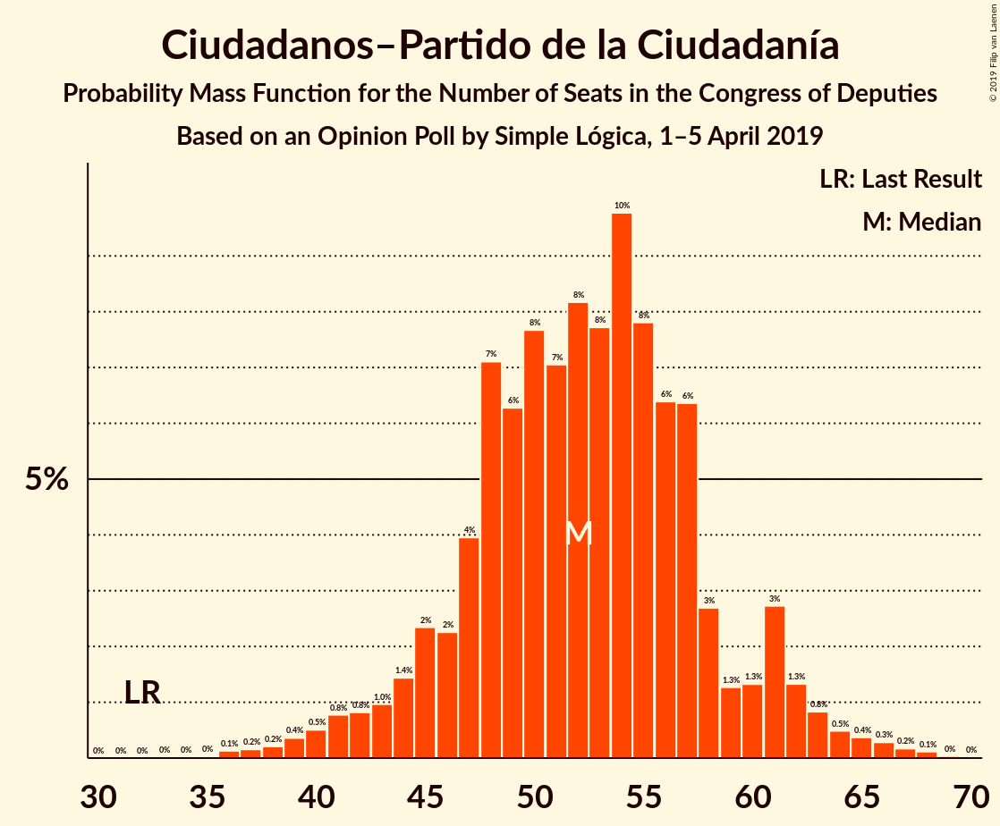
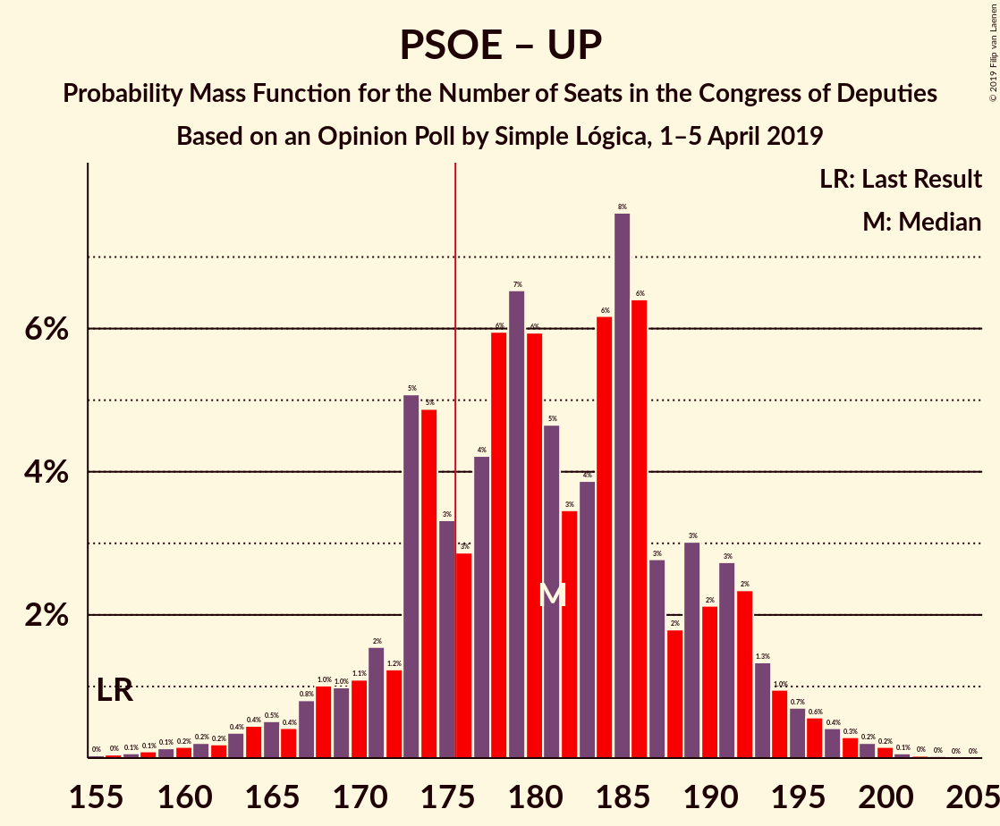

# Opinion Poll by Simple Lógica, 1–5 April 2019

<a href="#voting-intentions">Voting Intentions</a> | <a href="#seats">Seats</a> | <a href="#coalitions">Coalitions</a> | <a href="#technical-information">Technical Information</a>

## Voting Intentions

### Confidence Intervals

| Party | Last Result | Poll Result | 80% Confidence Interval | 90% Confidence Interval | 95% Confidence Interval | 99% Confidence Interval |
|:-----:|:-----------:|:-----------:|:-----------------------:|:-----------------------:|:-----------------------:|:-----------------------:|
| Partido Socialista Obrero Español | 22.6% | 30.5% | 28.7–32.3% |28.2–32.8% |27.7–33.3% |26.9–34.2% |
| Partido Popular | 33.0% | 16.7% | 15.3–18.3% |14.9–18.7% |14.6–19.1% |13.9–19.8% |
| Ciudadanos–Partido de la Ciudadanía | 13.1% | 15.5% | 14.1–17.0% |13.7–17.4% |13.4–17.8% |12.8–18.5% |
| Unidos Podemos | 21.2% | 14.4% | 13.1–15.9% |12.7–16.3% |12.4–16.7% |11.8–17.4% |
| Vox | 0.2% | 9.8% | 8.7–11.1% |8.4–11.4% |8.1–11.7% |7.6–12.4% |

*Note:* The poll result column reflects the actual value used in the calculations. Published results may vary slightly, and in addition be rounded to fewer digits.

## Seats

### Confidence Intervals

| Party | Last Result | Median | 80% Confidence Interval | 90% Confidence Interval | 95% Confidence Interval | 99% Confidence Interval |
|:-----:|:-----------:|:------:|:-----------------------:|:-----------------------:|:-----------------------:|:-----------------------:|
| <a href="#partido-socialista-obrero-español">Partido Socialista Obrero Español</a> | 85 | 139 | 132–146 |126–148 |124–151 |117–156 |
| <a href="#partido-popular">Partido Popular</a> | 137 | 65 | 57–70 |55–72 |53–75 |52–82 |
| <a href="#ciudadanos–partido-de-la-ciudadanía">Ciudadanos–Partido de la Ciudadanía</a> | 32 | 52 | 47–59 |45–61 |42–63 |38–66 |
| <a href="#unidos-podemos">Unidos Podemos</a> | 71 | 42 | 36–50 |36–53 |34–55 |32–58 |
| <a href="#vox">Vox</a> | 0 | 24 | 19–29 |18–30 |17–32 |15–34 |

### Partido Socialista Obrero Español

*For a full overview of the results for this party, see the [Partido Socialista Obrero Español](party-partidosocialistaobreroespañol.html) page.*

| Number of Seats | Probability | Accumulated | Special Marks |
|:---------------:|:-----------:|:-----------:|:-------------:|
| 85 | 0% | 100% | Last Result |
| 86 | 0% | 100% |  |
| 87 | 0% | 100% |  |
| 88 | 0% | 100% |  |
| 89 | 0% | 100% |  |
| 90 | 0% | 100% |  |
| 91 | 0% | 100% |  |
| 92 | 0% | 100% |  |
| 93 | 0% | 100% |  |
| 94 | 0% | 100% |  |
| 95 | 0% | 100% |  |
| 96 | 0% | 100% |  |
| 97 | 0% | 100% |  |
| 98 | 0% | 100% |  |
| 99 | 0% | 100% |  |
| 100 | 0% | 100% |  |
| 101 | 0% | 100% |  |
| 102 | 0% | 100% |  |
| 103 | 0% | 100% |  |
| 104 | 0% | 100% |  |
| 105 | 0% | 100% |  |
| 106 | 0% | 100% |  |
| 107 | 0% | 100% |  |
| 108 | 0% | 100% |  |
| 109 | 0% | 100% |  |
| 110 | 0% | 100% |  |
| 111 | 0% | 100% |  |
| 112 | 0% | 100% |  |
| 113 | 0% | 100% |  |
| 114 | 0.1% | 100% |  |
| 115 | 0.2% | 99.9% |  |
| 116 | 0.1% | 99.7% |  |
| 117 | 0.1% | 99.5% |  |
| 118 | 0% | 99.4% |  |
| 119 | 0% | 99.4% |  |
| 120 | 0.1% | 99.4% |  |
| 121 | 0.2% | 99.3% |  |
| 122 | 0.5% | 99.1% |  |
| 123 | 0.7% | 98.6% |  |
| 124 | 1.4% | 98% |  |
| 125 | 0.7% | 96% |  |
| 126 | 1.2% | 96% |  |
| 127 | 1.0% | 95% |  |
| 128 | 0.6% | 94% |  |
| 129 | 0.7% | 93% |  |
| 130 | 0.8% | 92% |  |
| 131 | 1.1% | 91% |  |
| 132 | 3% | 90% |  |
| 133 | 3% | 88% |  |
| 134 | 4% | 85% |  |
| 135 | 4% | 81% |  |
| 136 | 5% | 77% |  |
| 137 | 6% | 72% |  |
| 138 | 11% | 66% |  |
| 139 | 11% | 54% | Median |
| 140 | 8% | 43% |  |
| 141 | 7% | 35% |  |
| 142 | 4% | 28% |  |
| 143 | 3% | 24% |  |
| 144 | 5% | 21% |  |
| 145 | 5% | 16% |  |
| 146 | 3% | 11% |  |
| 147 | 2% | 8% |  |
| 148 | 1.1% | 6% |  |
| 149 | 0.8% | 5% |  |
| 150 | 1.2% | 4% |  |
| 151 | 0.8% | 3% |  |
| 152 | 0.7% | 2% |  |
| 153 | 0.3% | 1.2% |  |
| 154 | 0.2% | 0.9% |  |
| 155 | 0.1% | 0.7% |  |
| 156 | 0.2% | 0.6% |  |
| 157 | 0.2% | 0.4% |  |
| 158 | 0.1% | 0.3% |  |
| 159 | 0.1% | 0.2% |  |
| 160 | 0% | 0.1% |  |
| 161 | 0% | 0.1% |  |
| 162 | 0% | 0% |  |

### Partido Popular

*For a full overview of the results for this party, see the [Partido Popular](party-partidopopular.html) page.*

| Number of Seats | Probability | Accumulated | Special Marks |
|:---------------:|:-----------:|:-----------:|:-------------:|
| 48 | 0% | 100% |  |
| 49 | 0% | 99.9% |  |
| 50 | 0.1% | 99.9% |  |
| 51 | 0.2% | 99.8% |  |
| 52 | 0.5% | 99.6% |  |
| 53 | 2% | 99.0% |  |
| 54 | 1.1% | 97% |  |
| 55 | 3% | 96% |  |
| 56 | 3% | 93% |  |
| 57 | 6% | 90% |  |
| 58 | 3% | 84% |  |
| 59 | 5% | 81% |  |
| 60 | 6% | 76% |  |
| 61 | 4% | 70% |  |
| 62 | 4% | 66% |  |
| 63 | 3% | 62% |  |
| 64 | 4% | 59% |  |
| 65 | 10% | 55% | Median |
| 66 | 8% | 45% |  |
| 67 | 7% | 37% |  |
| 68 | 10% | 30% |  |
| 69 | 4% | 20% |  |
| 70 | 7% | 16% |  |
| 71 | 3% | 9% |  |
| 72 | 2% | 6% |  |
| 73 | 1.2% | 5% |  |
| 74 | 0.9% | 3% |  |
| 75 | 0.4% | 3% |  |
| 76 | 0.2% | 2% |  |
| 77 | 0.3% | 2% |  |
| 78 | 0.3% | 2% |  |
| 79 | 0.4% | 1.3% |  |
| 80 | 0.2% | 0.9% |  |
| 81 | 0.1% | 0.7% |  |
| 82 | 0.2% | 0.6% |  |
| 83 | 0.1% | 0.4% |  |
| 84 | 0.2% | 0.3% |  |
| 85 | 0% | 0.1% |  |
| 86 | 0% | 0% |  |
| 87 | 0% | 0% |  |
| 88 | 0% | 0% |  |
| 89 | 0% | 0% |  |
| 90 | 0% | 0% |  |
| 91 | 0% | 0% |  |
| 92 | 0% | 0% |  |
| 93 | 0% | 0% |  |
| 94 | 0% | 0% |  |
| 95 | 0% | 0% |  |
| 96 | 0% | 0% |  |
| 97 | 0% | 0% |  |
| 98 | 0% | 0% |  |
| 99 | 0% | 0% |  |
| 100 | 0% | 0% |  |
| 101 | 0% | 0% |  |
| 102 | 0% | 0% |  |
| 103 | 0% | 0% |  |
| 104 | 0% | 0% |  |
| 105 | 0% | 0% |  |
| 106 | 0% | 0% |  |
| 107 | 0% | 0% |  |
| 108 | 0% | 0% |  |
| 109 | 0% | 0% |  |
| 110 | 0% | 0% |  |
| 111 | 0% | 0% |  |
| 112 | 0% | 0% |  |
| 113 | 0% | 0% |  |
| 114 | 0% | 0% |  |
| 115 | 0% | 0% |  |
| 116 | 0% | 0% |  |
| 117 | 0% | 0% |  |
| 118 | 0% | 0% |  |
| 119 | 0% | 0% |  |
| 120 | 0% | 0% |  |
| 121 | 0% | 0% |  |
| 122 | 0% | 0% |  |
| 123 | 0% | 0% |  |
| 124 | 0% | 0% |  |
| 125 | 0% | 0% |  |
| 126 | 0% | 0% |  |
| 127 | 0% | 0% |  |
| 128 | 0% | 0% |  |
| 129 | 0% | 0% |  |
| 130 | 0% | 0% |  |
| 131 | 0% | 0% |  |
| 132 | 0% | 0% |  |
| 133 | 0% | 0% |  |
| 134 | 0% | 0% |  |
| 135 | 0% | 0% |  |
| 136 | 0% | 0% |  |
| 137 | 0% | 0% | Last Result |

### Ciudadanos–Partido de la Ciudadanía

*For a full overview of the results for this party, see the [Ciudadanos–Partido de la Ciudadanía](party-ciudadanos–partidodelaciudadanía.html) page.*

| Number of Seats | Probability | Accumulated | Special Marks |
|:---------------:|:-----------:|:-----------:|:-------------:|
| 32 | 0% | 100% | Last Result |
| 33 | 0% | 100% |  |
| 34 | 0% | 100% |  |
| 35 | 0% | 100% |  |
| 36 | 0.1% | 99.9% |  |
| 37 | 0.2% | 99.8% |  |
| 38 | 0.1% | 99.6% |  |
| 39 | 0.4% | 99.5% |  |
| 40 | 0.4% | 99.1% |  |
| 41 | 0.9% | 98.7% |  |
| 42 | 0.6% | 98% |  |
| 43 | 0.8% | 97% |  |
| 44 | 1.1% | 96% |  |
| 45 | 3% | 95% |  |
| 46 | 2% | 93% |  |
| 47 | 4% | 91% |  |
| 48 | 7% | 87% |  |
| 49 | 7% | 80% |  |
| 50 | 9% | 73% |  |
| 51 | 8% | 64% |  |
| 52 | 8% | 56% | Median |
| 53 | 9% | 48% |  |
| 54 | 12% | 39% |  |
| 55 | 5% | 28% |  |
| 56 | 5% | 22% |  |
| 57 | 4% | 17% |  |
| 58 | 2% | 12% |  |
| 59 | 2% | 11% |  |
| 60 | 1.4% | 9% |  |
| 61 | 3% | 7% |  |
| 62 | 1.5% | 4% |  |
| 63 | 1.1% | 3% |  |
| 64 | 0.7% | 2% |  |
| 65 | 0.4% | 1.0% |  |
| 66 | 0.3% | 0.7% |  |
| 67 | 0.2% | 0.4% |  |
| 68 | 0.1% | 0.1% |  |
| 69 | 0% | 0% |  |

### Unidos Podemos

*For a full overview of the results for this party, see the [Unidos Podemos](party-unidospodemos.html) page.*

| Number of Seats | Probability | Accumulated | Special Marks |
|:---------------:|:-----------:|:-----------:|:-------------:|
| 28 | 0% | 100% |  |
| 29 | 0.1% | 99.9% |  |
| 30 | 0.1% | 99.9% |  |
| 31 | 0.3% | 99.8% |  |
| 32 | 0.5% | 99.5% |  |
| 33 | 0.8% | 99.0% |  |
| 34 | 1.4% | 98% |  |
| 35 | 2% | 97% |  |
| 36 | 11% | 95% |  |
| 37 | 5% | 84% |  |
| 38 | 12% | 79% |  |
| 39 | 6% | 67% |  |
| 40 | 6% | 61% |  |
| 41 | 5% | 55% |  |
| 42 | 8% | 50% | Median |
| 43 | 6% | 43% |  |
| 44 | 6% | 36% |  |
| 45 | 6% | 30% |  |
| 46 | 6% | 24% |  |
| 47 | 3% | 18% |  |
| 48 | 3% | 15% |  |
| 49 | 2% | 12% |  |
| 50 | 2% | 10% |  |
| 51 | 1.3% | 8% |  |
| 52 | 2% | 7% |  |
| 53 | 1.1% | 5% |  |
| 54 | 1.3% | 4% |  |
| 55 | 0.9% | 3% |  |
| 56 | 0.8% | 2% |  |
| 57 | 0.5% | 1.2% |  |
| 58 | 0.3% | 0.7% |  |
| 59 | 0.2% | 0.5% |  |
| 60 | 0.1% | 0.2% |  |
| 61 | 0.1% | 0.1% |  |
| 62 | 0% | 0.1% |  |
| 63 | 0% | 0% |  |
| 64 | 0% | 0% |  |
| 65 | 0% | 0% |  |
| 66 | 0% | 0% |  |
| 67 | 0% | 0% |  |
| 68 | 0% | 0% |  |
| 69 | 0% | 0% |  |
| 70 | 0% | 0% |  |
| 71 | 0% | 0% | Last Result |

### Vox

*For a full overview of the results for this party, see the [Vox](party-vox.html) page.*

| Number of Seats | Probability | Accumulated | Special Marks |
|:---------------:|:-----------:|:-----------:|:-------------:|
| 0 | 0% | 100% | Last Result |
| 1 | 0% | 100% |  |
| 2 | 0% | 100% |  |
| 3 | 0% | 100% |  |
| 4 | 0% | 100% |  |
| 5 | 0% | 100% |  |
| 6 | 0% | 100% |  |
| 7 | 0% | 100% |  |
| 8 | 0% | 100% |  |
| 9 | 0% | 100% |  |
| 10 | 0% | 100% |  |
| 11 | 0% | 100% |  |
| 12 | 0% | 100% |  |
| 13 | 0% | 100% |  |
| 14 | 0.3% | 99.9% |  |
| 15 | 0.7% | 99.6% |  |
| 16 | 1.1% | 99.0% |  |
| 17 | 2% | 98% |  |
| 18 | 4% | 96% |  |
| 19 | 4% | 92% |  |
| 20 | 6% | 88% |  |
| 21 | 6% | 82% |  |
| 22 | 9% | 76% |  |
| 23 | 11% | 67% |  |
| 24 | 12% | 56% | Median |
| 25 | 9% | 45% |  |
| 26 | 7% | 36% |  |
| 27 | 12% | 29% |  |
| 28 | 7% | 17% |  |
| 29 | 4% | 10% |  |
| 30 | 2% | 7% |  |
| 31 | 2% | 4% |  |
| 32 | 1.1% | 3% |  |
| 33 | 0.9% | 2% |  |
| 34 | 0.5% | 1.0% |  |
| 35 | 0.2% | 0.5% |  |
| 36 | 0.1% | 0.3% |  |
| 37 | 0.1% | 0.2% |  |
| 38 | 0% | 0.1% |  |
| 39 | 0% | 0.1% |  |
| 40 | 0% | 0% |  |

## Coalitions

### Confidence Intervals

| Coalition | Last Result | Median | Majority? | 80% Confidence Interval | 90% Confidence Interval | 95% Confidence Interval | 99% Confidence Interval |
|:---------:|:-----------:|:------:|:---------:|:-----------------------:|:-----------------------:|:-----------------------:|:-----------------------:|
| Partido Socialista Obrero Español – Partido Popular – Ciudadanos–Partido de la Ciudadanía | 254 | 256 | 100% | 248–262 | 245–264 | 242–266 | 238–269 |
| Partido Socialista Obrero Español – Ciudadanos–Partido de la Ciudadanía – Unidos Podemos | 188 | 233 | 100% | 225–242 | 223–244 | 220–246 | 214–249 |
| Partido Socialista Obrero Español – Partido Popular | 222 | 204 | 100% | 193–209 | 189–213 | 187–216 | 184–220 |
| Partido Socialista Obrero Español – Ciudadanos–Partido de la Ciudadanía | 117 | 191 | 98% | 183–199 | 180–201 | 178–203 | 172–207 |
| Partido Socialista Obrero Español – Unidos Podemos | 156 | 180 | 78% | 173–191 | 169–192 | 166–195 | 160–199 |
| Partido Popular – Ciudadanos–Partido de la Ciudadanía – Vox | 169 | 141 | 0% | 131–148 | 130–151 | 128–154 | 124–160 |
| Partido Socialista Obrero Español | 85 | 139 | 0% | 132–146 | 126–148 | 124–151 | 117–156 |
| Partido Popular – Ciudadanos–Partido de la Ciudadanía | 169 | 117 | 0% | 108–124 | 106–127 | 104–130 | 100–136 |
| Partido Popular – Vox | 137 | 88 | 0% | 80–96 | 78–98 | 76–100 | 73–107 |
| Partido Popular | 137 | 65 | 0% | 57–70 | 55–72 | 53–75 | 52–82 |

### Partido Socialista Obrero Español – Partido Popular – Ciudadanos–Partido de la Ciudadanía

| Number of Seats | Probability | Accumulated | Special Marks |
|:---------------:|:-----------:|:-----------:|:-------------:|
| 234 | 0% | 100% |  |
| 235 | 0% | 99.9% |  |
| 236 | 0.1% | 99.9% |  |
| 237 | 0.1% | 99.8% |  |
| 238 | 0.2% | 99.7% |  |
| 239 | 0.3% | 99.5% |  |
| 240 | 0.3% | 99.1% |  |
| 241 | 0.6% | 98.9% |  |
| 242 | 0.7% | 98% |  |
| 243 | 0.8% | 97% |  |
| 244 | 0.9% | 97% |  |
| 245 | 2% | 96% |  |
| 246 | 2% | 94% |  |
| 247 | 2% | 93% |  |
| 248 | 3% | 90% |  |
| 249 | 3% | 88% |  |
| 250 | 3% | 85% |  |
| 251 | 5% | 82% |  |
| 252 | 5% | 77% |  |
| 253 | 9% | 72% |  |
| 254 | 7% | 63% | Last Result |
| 255 | 6% | 57% |  |
| 256 | 9% | 51% | Median |
| 257 | 6% | 42% |  |
| 258 | 9% | 36% |  |
| 259 | 7% | 27% |  |
| 260 | 4% | 20% |  |
| 261 | 3% | 16% |  |
| 262 | 4% | 13% |  |
| 263 | 2% | 9% |  |
| 264 | 2% | 6% |  |
| 265 | 2% | 4% |  |
| 266 | 1.1% | 3% |  |
| 267 | 0.7% | 2% |  |
| 268 | 0.3% | 0.9% |  |
| 269 | 0.3% | 0.6% |  |
| 270 | 0.2% | 0.3% |  |
| 271 | 0.1% | 0.1% |  |
| 272 | 0% | 0.1% |  |
| 273 | 0% | 0% |  |

### Partido Socialista Obrero Español – Ciudadanos–Partido de la Ciudadanía – Unidos Podemos

| Number of Seats | Probability | Accumulated | Special Marks |
|:---------------:|:-----------:|:-----------:|:-------------:|
| 188 | 0% | 100% | Last Result |
| 189 | 0% | 100% |  |
| 190 | 0% | 100% |  |
| 191 | 0% | 100% |  |
| 192 | 0% | 100% |  |
| 193 | 0% | 100% |  |
| 194 | 0% | 100% |  |
| 195 | 0% | 100% |  |
| 196 | 0% | 100% |  |
| 197 | 0% | 100% |  |
| 198 | 0% | 100% |  |
| 199 | 0% | 100% |  |
| 200 | 0% | 100% |  |
| 201 | 0% | 100% |  |
| 202 | 0% | 100% |  |
| 203 | 0% | 100% |  |
| 204 | 0% | 100% |  |
| 205 | 0% | 100% |  |
| 206 | 0% | 100% |  |
| 207 | 0% | 100% |  |
| 208 | 0% | 100% |  |
| 209 | 0% | 100% |  |
| 210 | 0% | 100% |  |
| 211 | 0.1% | 99.9% |  |
| 212 | 0.1% | 99.8% |  |
| 213 | 0.2% | 99.7% |  |
| 214 | 0.2% | 99.5% |  |
| 215 | 0.3% | 99.3% |  |
| 216 | 0.2% | 99.1% |  |
| 217 | 0.2% | 98.8% |  |
| 218 | 0.3% | 98.6% |  |
| 219 | 0.4% | 98% |  |
| 220 | 0.8% | 98% |  |
| 221 | 0.9% | 97% |  |
| 222 | 1.2% | 96% |  |
| 223 | 2% | 95% |  |
| 224 | 2% | 93% |  |
| 225 | 5% | 91% |  |
| 226 | 4% | 87% |  |
| 227 | 4% | 83% |  |
| 228 | 6% | 79% |  |
| 229 | 4% | 73% |  |
| 230 | 7% | 69% |  |
| 231 | 4% | 62% |  |
| 232 | 5% | 58% |  |
| 233 | 5% | 53% | Median |
| 234 | 5% | 47% |  |
| 235 | 4% | 42% |  |
| 236 | 6% | 38% |  |
| 237 | 4% | 32% |  |
| 238 | 5% | 28% |  |
| 239 | 5% | 23% |  |
| 240 | 5% | 18% |  |
| 241 | 3% | 14% |  |
| 242 | 1.5% | 11% |  |
| 243 | 3% | 10% |  |
| 244 | 3% | 7% |  |
| 245 | 2% | 5% |  |
| 246 | 1.2% | 3% |  |
| 247 | 0.5% | 2% |  |
| 248 | 0.3% | 1.1% |  |
| 249 | 0.3% | 0.8% |  |
| 250 | 0.3% | 0.5% |  |
| 251 | 0.1% | 0.2% |  |
| 252 | 0.1% | 0.1% |  |
| 253 | 0% | 0% |  |

### Partido Socialista Obrero Español – Partido Popular

| Number of Seats | Probability | Accumulated | Special Marks |
|:---------------:|:-----------:|:-----------:|:-------------:|
| 181 | 0% | 100% |  |
| 182 | 0.2% | 99.9% |  |
| 183 | 0.2% | 99.7% |  |
| 184 | 0.5% | 99.5% |  |
| 185 | 0.3% | 99.0% |  |
| 186 | 0.7% | 98.7% |  |
| 187 | 0.9% | 98% |  |
| 188 | 0.9% | 97% |  |
| 189 | 2% | 96% |  |
| 190 | 2% | 95% |  |
| 191 | 1.1% | 93% |  |
| 192 | 1.3% | 92% |  |
| 193 | 2% | 91% |  |
| 194 | 1.4% | 88% |  |
| 195 | 2% | 87% |  |
| 196 | 2% | 85% |  |
| 197 | 2% | 83% |  |
| 198 | 2% | 81% |  |
| 199 | 2% | 79% |  |
| 200 | 3% | 78% |  |
| 201 | 6% | 75% |  |
| 202 | 5% | 69% |  |
| 203 | 9% | 65% |  |
| 204 | 10% | 56% | Median |
| 205 | 9% | 46% |  |
| 206 | 12% | 36% |  |
| 207 | 8% | 25% |  |
| 208 | 5% | 17% |  |
| 209 | 3% | 12% |  |
| 210 | 1.5% | 10% |  |
| 211 | 2% | 8% |  |
| 212 | 0.9% | 6% |  |
| 213 | 0.6% | 5% |  |
| 214 | 0.9% | 5% |  |
| 215 | 1.2% | 4% |  |
| 216 | 0.8% | 3% |  |
| 217 | 0.7% | 2% |  |
| 218 | 0.3% | 1.1% |  |
| 219 | 0.3% | 0.9% |  |
| 220 | 0.2% | 0.5% |  |
| 221 | 0.2% | 0.3% |  |
| 222 | 0.1% | 0.2% | Last Result |
| 223 | 0% | 0.1% |  |
| 224 | 0% | 0% |  |

### Partido Socialista Obrero Español – Ciudadanos–Partido de la Ciudadanía

| Number of Seats | Probability | Accumulated | Special Marks |
|:---------------:|:-----------:|:-----------:|:-------------:|
| 117 | 0% | 100% | Last Result |
| 118 | 0% | 100% |  |
| 119 | 0% | 100% |  |
| 120 | 0% | 100% |  |
| 121 | 0% | 100% |  |
| 122 | 0% | 100% |  |
| 123 | 0% | 100% |  |
| 124 | 0% | 100% |  |
| 125 | 0% | 100% |  |
| 126 | 0% | 100% |  |
| 127 | 0% | 100% |  |
| 128 | 0% | 100% |  |
| 129 | 0% | 100% |  |
| 130 | 0% | 100% |  |
| 131 | 0% | 100% |  |
| 132 | 0% | 100% |  |
| 133 | 0% | 100% |  |
| 134 | 0% | 100% |  |
| 135 | 0% | 100% |  |
| 136 | 0% | 100% |  |
| 137 | 0% | 100% |  |
| 138 | 0% | 100% |  |
| 139 | 0% | 100% |  |
| 140 | 0% | 100% |  |
| 141 | 0% | 100% |  |
| 142 | 0% | 100% |  |
| 143 | 0% | 100% |  |
| 144 | 0% | 100% |  |
| 145 | 0% | 100% |  |
| 146 | 0% | 100% |  |
| 147 | 0% | 100% |  |
| 148 | 0% | 100% |  |
| 149 | 0% | 100% |  |
| 150 | 0% | 100% |  |
| 151 | 0% | 100% |  |
| 152 | 0% | 100% |  |
| 153 | 0% | 100% |  |
| 154 | 0% | 100% |  |
| 155 | 0% | 100% |  |
| 156 | 0% | 100% |  |
| 157 | 0% | 100% |  |
| 158 | 0% | 100% |  |
| 159 | 0% | 100% |  |
| 160 | 0% | 100% |  |
| 161 | 0% | 100% |  |
| 162 | 0% | 100% |  |
| 163 | 0% | 100% |  |
| 164 | 0% | 100% |  |
| 165 | 0% | 100% |  |
| 166 | 0% | 100% |  |
| 167 | 0% | 100% |  |
| 168 | 0% | 99.9% |  |
| 169 | 0.1% | 99.9% |  |
| 170 | 0.1% | 99.8% |  |
| 171 | 0.1% | 99.7% |  |
| 172 | 0.2% | 99.6% |  |
| 173 | 0.2% | 99.5% |  |
| 174 | 0.4% | 99.3% |  |
| 175 | 0.4% | 98.8% |  |
| 176 | 0.4% | 98% | Majority |
| 177 | 0.4% | 98% |  |
| 178 | 0.7% | 98% |  |
| 179 | 1.0% | 97% |  |
| 180 | 1.0% | 96% |  |
| 181 | 2% | 95% |  |
| 182 | 1.3% | 93% |  |
| 183 | 3% | 92% |  |
| 184 | 3% | 90% |  |
| 185 | 5% | 87% |  |
| 186 | 4% | 81% |  |
| 187 | 5% | 78% |  |
| 188 | 8% | 73% |  |
| 189 | 8% | 65% |  |
| 190 | 5% | 57% |  |
| 191 | 4% | 52% | Median |
| 192 | 7% | 48% |  |
| 193 | 6% | 41% |  |
| 194 | 5% | 35% |  |
| 195 | 5% | 30% |  |
| 196 | 4% | 25% |  |
| 197 | 4% | 21% |  |
| 198 | 4% | 16% |  |
| 199 | 3% | 12% |  |
| 200 | 3% | 9% |  |
| 201 | 2% | 6% |  |
| 202 | 1.3% | 4% |  |
| 203 | 1.3% | 3% |  |
| 204 | 0.6% | 2% |  |
| 205 | 0.4% | 1.3% |  |
| 206 | 0.3% | 1.0% |  |
| 207 | 0.3% | 0.7% |  |
| 208 | 0.1% | 0.4% |  |
| 209 | 0.1% | 0.3% |  |
| 210 | 0% | 0.1% |  |
| 211 | 0% | 0.1% |  |
| 212 | 0% | 0% |  |

### Partido Socialista Obrero Español – Unidos Podemos

| Number of Seats | Probability | Accumulated | Special Marks |
|:---------------:|:-----------:|:-----------:|:-------------:|
| 154 | 0% | 100% |  |
| 155 | 0% | 99.9% |  |
| 156 | 0% | 99.9% | Last Result |
| 157 | 0% | 99.9% |  |
| 158 | 0.1% | 99.8% |  |
| 159 | 0.1% | 99.8% |  |
| 160 | 0.2% | 99.6% |  |
| 161 | 0.3% | 99.5% |  |
| 162 | 0.2% | 99.1% |  |
| 163 | 0.4% | 98.9% |  |
| 164 | 0.5% | 98.6% |  |
| 165 | 0.6% | 98% |  |
| 166 | 0.4% | 98% |  |
| 167 | 0.8% | 97% |  |
| 168 | 0.8% | 96% |  |
| 169 | 1.2% | 95% |  |
| 170 | 0.9% | 94% |  |
| 171 | 2% | 93% |  |
| 172 | 1.2% | 92% |  |
| 173 | 5% | 91% |  |
| 174 | 5% | 85% |  |
| 175 | 2% | 81% |  |
| 176 | 3% | 78% | Majority |
| 177 | 6% | 76% |  |
| 178 | 8% | 69% |  |
| 179 | 7% | 62% |  |
| 180 | 6% | 55% |  |
| 181 | 4% | 49% | Median |
| 182 | 3% | 45% |  |
| 183 | 4% | 42% |  |
| 184 | 6% | 38% |  |
| 185 | 7% | 32% |  |
| 186 | 6% | 25% |  |
| 187 | 2% | 19% |  |
| 188 | 2% | 17% |  |
| 189 | 3% | 15% |  |
| 190 | 2% | 12% |  |
| 191 | 3% | 10% |  |
| 192 | 2% | 7% |  |
| 193 | 1.4% | 5% |  |
| 194 | 0.9% | 3% |  |
| 195 | 0.6% | 3% |  |
| 196 | 0.5% | 2% |  |
| 197 | 0.5% | 1.4% |  |
| 198 | 0.3% | 0.9% |  |
| 199 | 0.3% | 0.6% |  |
| 200 | 0.1% | 0.3% |  |
| 201 | 0.1% | 0.1% |  |
| 202 | 0% | 0.1% |  |
| 203 | 0% | 0.1% |  |
| 204 | 0% | 0% |  |

### Partido Popular – Ciudadanos–Partido de la Ciudadanía – Vox

| Number of Seats | Probability | Accumulated | Special Marks |
|:---------------:|:-----------:|:-----------:|:-------------:|
| 119 | 0% | 100% |  |
| 120 | 0% | 99.9% |  |
| 121 | 0.1% | 99.9% |  |
| 122 | 0.1% | 99.9% |  |
| 123 | 0.1% | 99.8% |  |
| 124 | 0.4% | 99.6% |  |
| 125 | 0.4% | 99.3% |  |
| 126 | 0.6% | 98.9% |  |
| 127 | 0.7% | 98% |  |
| 128 | 0.7% | 98% |  |
| 129 | 1.3% | 97% |  |
| 130 | 2% | 96% |  |
| 131 | 4% | 93% |  |
| 132 | 2% | 90% |  |
| 133 | 3% | 88% |  |
| 134 | 2% | 85% |  |
| 135 | 3% | 84% |  |
| 136 | 6% | 81% |  |
| 137 | 9% | 74% |  |
| 138 | 6% | 65% |  |
| 139 | 2% | 60% |  |
| 140 | 2% | 57% |  |
| 141 | 6% | 55% | Median |
| 142 | 10% | 49% |  |
| 143 | 11% | 39% |  |
| 144 | 3% | 28% |  |
| 145 | 2% | 24% |  |
| 146 | 5% | 22% |  |
| 147 | 7% | 17% |  |
| 148 | 1.2% | 10% |  |
| 149 | 2% | 9% |  |
| 150 | 1.4% | 7% |  |
| 151 | 1.3% | 6% |  |
| 152 | 0.8% | 5% |  |
| 153 | 0.8% | 4% |  |
| 154 | 0.8% | 3% |  |
| 155 | 0.6% | 2% |  |
| 156 | 0.3% | 2% |  |
| 157 | 0.3% | 1.4% |  |
| 158 | 0.3% | 1.1% |  |
| 159 | 0.2% | 0.8% |  |
| 160 | 0.2% | 0.6% |  |
| 161 | 0.1% | 0.3% |  |
| 162 | 0.1% | 0.3% |  |
| 163 | 0.1% | 0.2% |  |
| 164 | 0.1% | 0.1% |  |
| 165 | 0% | 0.1% |  |
| 166 | 0% | 0% |  |
| 167 | 0% | 0% |  |
| 168 | 0% | 0% |  |
| 169 | 0% | 0% | Last Result |

### Partido Socialista Obrero Español

| Number of Seats | Probability | Accumulated | Special Marks |
|:---------------:|:-----------:|:-----------:|:-------------:|
| 85 | 0% | 100% | Last Result |
| 86 | 0% | 100% |  |
| 87 | 0% | 100% |  |
| 88 | 0% | 100% |  |
| 89 | 0% | 100% |  |
| 90 | 0% | 100% |  |
| 91 | 0% | 100% |  |
| 92 | 0% | 100% |  |
| 93 | 0% | 100% |  |
| 94 | 0% | 100% |  |
| 95 | 0% | 100% |  |
| 96 | 0% | 100% |  |
| 97 | 0% | 100% |  |
| 98 | 0% | 100% |  |
| 99 | 0% | 100% |  |
| 100 | 0% | 100% |  |
| 101 | 0% | 100% |  |
| 102 | 0% | 100% |  |
| 103 | 0% | 100% |  |
| 104 | 0% | 100% |  |
| 105 | 0% | 100% |  |
| 106 | 0% | 100% |  |
| 107 | 0% | 100% |  |
| 108 | 0% | 100% |  |
| 109 | 0% | 100% |  |
| 110 | 0% | 100% |  |
| 111 | 0% | 100% |  |
| 112 | 0% | 100% |  |
| 113 | 0% | 100% |  |
| 114 | 0.1% | 100% |  |
| 115 | 0.2% | 99.9% |  |
| 116 | 0.1% | 99.7% |  |
| 117 | 0.1% | 99.5% |  |
| 118 | 0% | 99.4% |  |
| 119 | 0% | 99.4% |  |
| 120 | 0.1% | 99.4% |  |
| 121 | 0.2% | 99.3% |  |
| 122 | 0.5% | 99.1% |  |
| 123 | 0.7% | 98.6% |  |
| 124 | 1.4% | 98% |  |
| 125 | 0.7% | 96% |  |
| 126 | 1.2% | 96% |  |
| 127 | 1.0% | 95% |  |
| 128 | 0.6% | 94% |  |
| 129 | 0.7% | 93% |  |
| 130 | 0.8% | 92% |  |
| 131 | 1.1% | 91% |  |
| 132 | 3% | 90% |  |
| 133 | 3% | 88% |  |
| 134 | 4% | 85% |  |
| 135 | 4% | 81% |  |
| 136 | 5% | 77% |  |
| 137 | 6% | 72% |  |
| 138 | 11% | 66% |  |
| 139 | 11% | 54% | Median |
| 140 | 8% | 43% |  |
| 141 | 7% | 35% |  |
| 142 | 4% | 28% |  |
| 143 | 3% | 24% |  |
| 144 | 5% | 21% |  |
| 145 | 5% | 16% |  |
| 146 | 3% | 11% |  |
| 147 | 2% | 8% |  |
| 148 | 1.1% | 6% |  |
| 149 | 0.8% | 5% |  |
| 150 | 1.2% | 4% |  |
| 151 | 0.8% | 3% |  |
| 152 | 0.7% | 2% |  |
| 153 | 0.3% | 1.2% |  |
| 154 | 0.2% | 0.9% |  |
| 155 | 0.1% | 0.7% |  |
| 156 | 0.2% | 0.6% |  |
| 157 | 0.2% | 0.4% |  |
| 158 | 0.1% | 0.3% |  |
| 159 | 0.1% | 0.2% |  |
| 160 | 0% | 0.1% |  |
| 161 | 0% | 0.1% |  |
| 162 | 0% | 0% |  |

### Partido Popular – Ciudadanos–Partido de la Ciudadanía

| Number of Seats | Probability | Accumulated | Special Marks |
|:---------------:|:-----------:|:-----------:|:-------------:|
| 95 | 0% | 100% |  |
| 96 | 0% | 99.9% |  |
| 97 | 0% | 99.9% |  |
| 98 | 0.1% | 99.9% |  |
| 99 | 0.2% | 99.8% |  |
| 100 | 0.3% | 99.6% |  |
| 101 | 0.4% | 99.3% |  |
| 102 | 0.4% | 99.0% |  |
| 103 | 0.9% | 98.5% |  |
| 104 | 1.0% | 98% |  |
| 105 | 0.9% | 97% |  |
| 106 | 2% | 96% |  |
| 107 | 2% | 94% |  |
| 108 | 3% | 92% |  |
| 109 | 3% | 89% |  |
| 110 | 4% | 86% |  |
| 111 | 4% | 82% |  |
| 112 | 3% | 78% |  |
| 113 | 7% | 75% |  |
| 114 | 7% | 68% |  |
| 115 | 6% | 61% |  |
| 116 | 5% | 55% |  |
| 117 | 5% | 50% | Median |
| 118 | 7% | 45% |  |
| 119 | 10% | 38% |  |
| 120 | 5% | 28% |  |
| 121 | 4% | 23% |  |
| 122 | 5% | 19% |  |
| 123 | 4% | 14% |  |
| 124 | 2% | 11% |  |
| 125 | 2% | 9% |  |
| 126 | 1.0% | 7% |  |
| 127 | 2% | 6% |  |
| 128 | 0.9% | 5% |  |
| 129 | 0.9% | 4% |  |
| 130 | 0.8% | 3% |  |
| 131 | 0.4% | 2% |  |
| 132 | 0.3% | 2% |  |
| 133 | 0.2% | 1.4% |  |
| 134 | 0.4% | 1.2% |  |
| 135 | 0.1% | 0.9% |  |
| 136 | 0.2% | 0.7% |  |
| 137 | 0.1% | 0.5% |  |
| 138 | 0.1% | 0.3% |  |
| 139 | 0.1% | 0.3% |  |
| 140 | 0% | 0.2% |  |
| 141 | 0% | 0.1% |  |
| 142 | 0.1% | 0.1% |  |
| 143 | 0% | 0% |  |
| 144 | 0% | 0% |  |
| 145 | 0% | 0% |  |
| 146 | 0% | 0% |  |
| 147 | 0% | 0% |  |
| 148 | 0% | 0% |  |
| 149 | 0% | 0% |  |
| 150 | 0% | 0% |  |
| 151 | 0% | 0% |  |
| 152 | 0% | 0% |  |
| 153 | 0% | 0% |  |
| 154 | 0% | 0% |  |
| 155 | 0% | 0% |  |
| 156 | 0% | 0% |  |
| 157 | 0% | 0% |  |
| 158 | 0% | 0% |  |
| 159 | 0% | 0% |  |
| 160 | 0% | 0% |  |
| 161 | 0% | 0% |  |
| 162 | 0% | 0% |  |
| 163 | 0% | 0% |  |
| 164 | 0% | 0% |  |
| 165 | 0% | 0% |  |
| 166 | 0% | 0% |  |
| 167 | 0% | 0% |  |
| 168 | 0% | 0% |  |
| 169 | 0% | 0% | Last Result |

### Partido Popular – Vox

| Number of Seats | Probability | Accumulated | Special Marks |
|:---------------:|:-----------:|:-----------:|:-------------:|
| 71 | 0.1% | 100% |  |
| 72 | 0.1% | 99.9% |  |
| 73 | 0.4% | 99.8% |  |
| 74 | 0.4% | 99.4% |  |
| 75 | 0.6% | 99.0% |  |
| 76 | 1.2% | 98% |  |
| 77 | 2% | 97% |  |
| 78 | 3% | 95% |  |
| 79 | 2% | 93% |  |
| 80 | 2% | 91% |  |
| 81 | 3% | 88% |  |
| 82 | 6% | 85% |  |
| 83 | 5% | 80% |  |
| 84 | 4% | 75% |  |
| 85 | 6% | 71% |  |
| 86 | 5% | 64% |  |
| 87 | 4% | 59% |  |
| 88 | 6% | 55% |  |
| 89 | 6% | 49% | Median |
| 90 | 7% | 44% |  |
| 91 | 3% | 37% |  |
| 92 | 9% | 34% |  |
| 93 | 4% | 25% |  |
| 94 | 4% | 21% |  |
| 95 | 6% | 17% |  |
| 96 | 2% | 11% |  |
| 97 | 3% | 9% |  |
| 98 | 1.3% | 6% |  |
| 99 | 1.1% | 4% |  |
| 100 | 0.9% | 3% |  |
| 101 | 0.4% | 2% |  |
| 102 | 0.5% | 2% |  |
| 103 | 0.3% | 1.5% |  |
| 104 | 0.2% | 1.2% |  |
| 105 | 0.3% | 1.0% |  |
| 106 | 0.2% | 0.8% |  |
| 107 | 0.3% | 0.6% |  |
| 108 | 0.1% | 0.3% |  |
| 109 | 0.1% | 0.2% |  |
| 110 | 0.1% | 0.1% |  |
| 111 | 0% | 0.1% |  |
| 112 | 0% | 0% |  |
| 113 | 0% | 0% |  |
| 114 | 0% | 0% |  |
| 115 | 0% | 0% |  |
| 116 | 0% | 0% |  |
| 117 | 0% | 0% |  |
| 118 | 0% | 0% |  |
| 119 | 0% | 0% |  |
| 120 | 0% | 0% |  |
| 121 | 0% | 0% |  |
| 122 | 0% | 0% |  |
| 123 | 0% | 0% |  |
| 124 | 0% | 0% |  |
| 125 | 0% | 0% |  |
| 126 | 0% | 0% |  |
| 127 | 0% | 0% |  |
| 128 | 0% | 0% |  |
| 129 | 0% | 0% |  |
| 130 | 0% | 0% |  |
| 131 | 0% | 0% |  |
| 132 | 0% | 0% |  |
| 133 | 0% | 0% |  |
| 134 | 0% | 0% |  |
| 135 | 0% | 0% |  |
| 136 | 0% | 0% |  |
| 137 | 0% | 0% | Last Result |

### Partido Popular

| Number of Seats | Probability | Accumulated | Special Marks |
|:---------------:|:-----------:|:-----------:|:-------------:|
| 48 | 0% | 100% |  |
| 49 | 0% | 99.9% |  |
| 50 | 0.1% | 99.9% |  |
| 51 | 0.2% | 99.8% |  |
| 52 | 0.5% | 99.6% |  |
| 53 | 2% | 99.0% |  |
| 54 | 1.1% | 97% |  |
| 55 | 3% | 96% |  |
| 56 | 3% | 93% |  |
| 57 | 6% | 90% |  |
| 58 | 3% | 84% |  |
| 59 | 5% | 81% |  |
| 60 | 6% | 76% |  |
| 61 | 4% | 70% |  |
| 62 | 4% | 66% |  |
| 63 | 3% | 62% |  |
| 64 | 4% | 59% |  |
| 65 | 10% | 55% | Median |
| 66 | 8% | 45% |  |
| 67 | 7% | 37% |  |
| 68 | 10% | 30% |  |
| 69 | 4% | 20% |  |
| 70 | 7% | 16% |  |
| 71 | 3% | 9% |  |
| 72 | 2% | 6% |  |
| 73 | 1.2% | 5% |  |
| 74 | 0.9% | 3% |  |
| 75 | 0.4% | 3% |  |
| 76 | 0.2% | 2% |  |
| 77 | 0.3% | 2% |  |
| 78 | 0.3% | 2% |  |
| 79 | 0.4% | 1.3% |  |
| 80 | 0.2% | 0.9% |  |
| 81 | 0.1% | 0.7% |  |
| 82 | 0.2% | 0.6% |  |
| 83 | 0.1% | 0.4% |  |
| 84 | 0.2% | 0.3% |  |
| 85 | 0% | 0.1% |  |
| 86 | 0% | 0% |  |
| 87 | 0% | 0% |  |
| 88 | 0% | 0% |  |
| 89 | 0% | 0% |  |
| 90 | 0% | 0% |  |
| 91 | 0% | 0% |  |
| 92 | 0% | 0% |  |
| 93 | 0% | 0% |  |
| 94 | 0% | 0% |  |
| 95 | 0% | 0% |  |
| 96 | 0% | 0% |  |
| 97 | 0% | 0% |  |
| 98 | 0% | 0% |  |
| 99 | 0% | 0% |  |
| 100 | 0% | 0% |  |
| 101 | 0% | 0% |  |
| 102 | 0% | 0% |  |
| 103 | 0% | 0% |  |
| 104 | 0% | 0% |  |
| 105 | 0% | 0% |  |
| 106 | 0% | 0% |  |
| 107 | 0% | 0% |  |
| 108 | 0% | 0% |  |
| 109 | 0% | 0% |  |
| 110 | 0% | 0% |  |
| 111 | 0% | 0% |  |
| 112 | 0% | 0% |  |
| 113 | 0% | 0% |  |
| 114 | 0% | 0% |  |
| 115 | 0% | 0% |  |
| 116 | 0% | 0% |  |
| 117 | 0% | 0% |  |
| 118 | 0% | 0% |  |
| 119 | 0% | 0% |  |
| 120 | 0% | 0% |  |
| 121 | 0% | 0% |  |
| 122 | 0% | 0% |  |
| 123 | 0% | 0% |  |
| 124 | 0% | 0% |  |
| 125 | 0% | 0% |  |
| 126 | 0% | 0% |  |
| 127 | 0% | 0% |  |
| 128 | 0% | 0% |  |
| 129 | 0% | 0% |  |
| 130 | 0% | 0% |  |
| 131 | 0% | 0% |  |
| 132 | 0% | 0% |  |
| 133 | 0% | 0% |  |
| 134 | 0% | 0% |  |
| 135 | 0% | 0% |  |
| 136 | 0% | 0% |  |
| 137 | 0% | 0% | Last Result |

## Technical Information

### Opinion Poll

+ **Polling firm:** Simple Lógica
+ **Commissioner(s):** —
+ **Fieldwork period:** 1–5 April 2019

### Calculations

+ **Sample size:** 1054
+ **Simulations done:** 262,144
+ **Error estimate:** 0.41%

