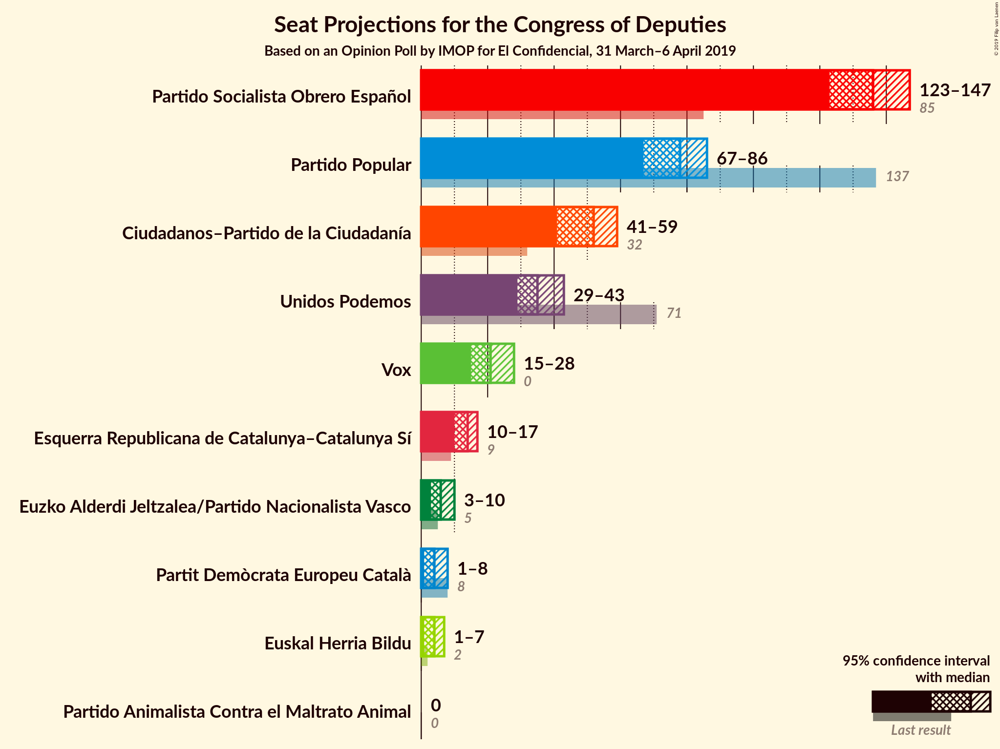
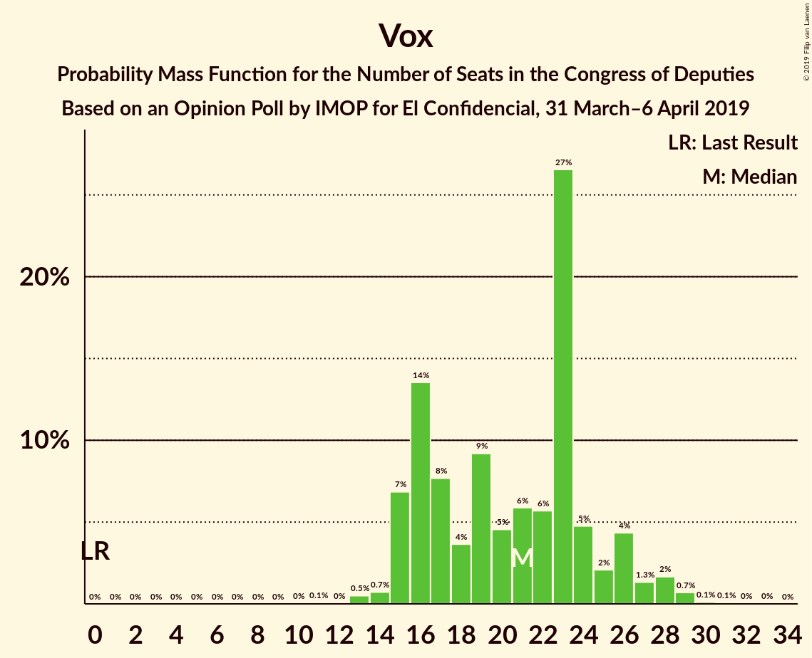
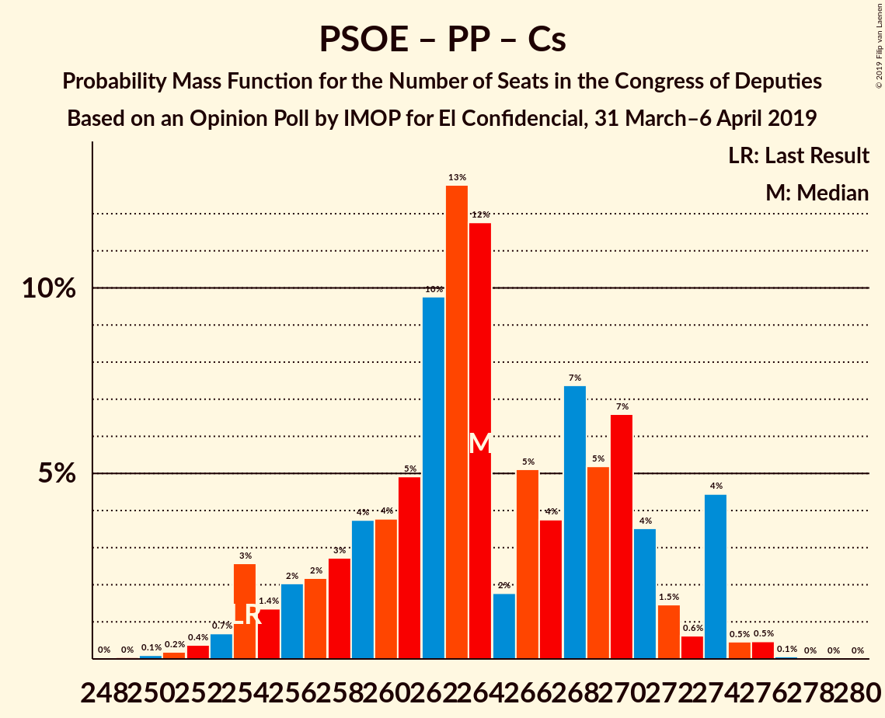
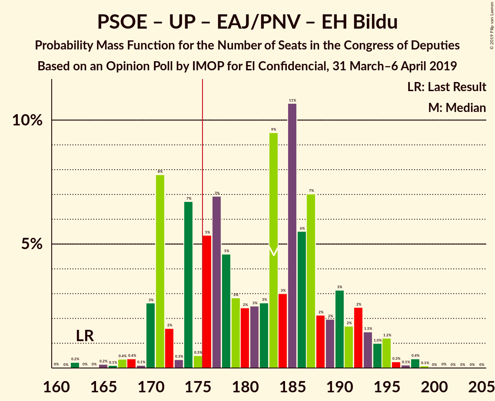

# Opinion Poll by IMOP for El Confidencial, 31 March–6 April 2019

<a href="#voting-intentions">Voting Intentions</a> | <a href="#seats">Seats</a> | <a href="#coalitions">Coalitions</a> | <a href="#technical-information">Technical Information</a>

## Voting Intentions

### Confidence Intervals

| Party | Last Result | Poll Result | 80% Confidence Interval | 90% Confidence Interval | 95% Confidence Interval | 99% Confidence Interval |
|:-----:|:-----------:|:-----------:|:-----------------------:|:-----------------------:|:-----------------------:|:-----------------------:|
| Partido Socialista Obrero Español | 22.6% | 31.5% | 30.0–33.1% |29.6–33.6% |29.2–34.0% |28.4–34.8% |
| Partido Popular | 33.0% | 20.0% | 18.7–21.4% |18.3–21.8% |18.0–22.1% |17.4–22.8% |
| Ciudadanos–Partido de la Ciudadanía | 13.1% | 15.5% | 14.3–16.8% |14.0–17.1% |13.7–17.5% |13.2–18.1% |
| Unidos Podemos | 21.2% | 13.5% | 12.4–14.8% |12.1–15.1% |11.9–15.4% |11.4–16.0% |
| Vox | 0.2% | 9.3% | 8.4–10.4% |8.1–10.7% |7.9–10.9% |7.5–11.4% |
| Esquerra Republicana de Catalunya–Catalunya Sí | 2.7% | 3.2% | 2.7–3.9% |2.5–4.1% |2.4–4.2% |2.2–4.6% |
| Euzko Alderdi Jeltzalea/Partido Nacionalista Vasco | 1.2% | 1.3% | 1.0–1.8% |0.9–1.9% |0.8–2.1% |0.7–2.3% |
| Partit Demòcrata Europeu Català | 2.0% | 1.2% | 0.9–1.6% |0.8–1.8% |0.7–1.9% |0.6–2.1% |
| Partido Animalista Contra el Maltrato Animal | 1.2% | 1.2% | 0.9–1.6% |0.8–1.8% |0.7–1.9% |0.6–2.1% |
| Euskal Herria Bildu | 0.8% | 0.9% | 0.7–1.3% |0.6–1.4% |0.5–1.5% |0.4–1.8% |

*Note:* The poll result column reflects the actual value used in the calculations. Published results may vary slightly, and in addition be rounded to fewer digits.

## Seats

### Confidence Intervals

| Party | Last Result | Median | 80% Confidence Interval | 90% Confidence Interval | 95% Confidence Interval | 99% Confidence Interval |
|:-----:|:-----------:|:------:|:-----------------------:|:-----------------------:|:-----------------------:|:-----------------------:|
| <a href="#partido-socialista-obrero-español">Partido Socialista Obrero Español</a> | 85 | 136 | 129–144 |128–146 |125–147 |120–149 |
| <a href="#partido-popular">Partido Popular</a> | 137 | 78 | 71–84 |69–84 |67–87 |64–89 |
| <a href="#ciudadanos–partido-de-la-ciudadanía">Ciudadanos–Partido de la Ciudadanía</a> | 32 | 51 | 45–56 |43–56 |41–58 |37–63 |
| <a href="#unidos-podemos">Unidos Podemos</a> | 71 | 35 | 32–41 |31–43 |29–43 |27–45 |
| <a href="#vox">Vox</a> | 0 | 21 | 15–25 |15–26 |15–27 |14–28 |
| <a href="#esquerra-republicana-de-catalunya–catalunya-sí">Esquerra Republicana de Catalunya–Catalunya Sí</a> | 9 | 14 | 12–16 |11–17 |10–18 |9–19 |
| <a href="#euzko-alderdi-jeltzalea/partido-nacionalista-vasco">Euzko Alderdi Jeltzalea/Partido Nacionalista Vasco</a> | 5 | 6 | 4–8 |4–10 |3–10 |3–10 |
| <a href="#partit-demòcrata-europeu-català">Partit Demòcrata Europeu Català</a> | 8 | 4 | 1–6 |1–8 |1–8 |1–8 |
| <a href="#partido-animalista-contra-el-maltrato-animal">Partido Animalista Contra el Maltrato Animal</a> | 0 | 0 | 0 |0 |0 |0–1 |
| <a href="#euskal-herria-bildu">Euskal Herria Bildu</a> | 2 | 4 | 2–6 |2–7 |1–7 |1–7 |

### Partido Socialista Obrero Español

*For a full overview of the results for this party, see the [Partido Socialista Obrero Español](party-partidosocialistaobreroespañol.html) page.*

| Number of Seats | Probability | Accumulated | Special Marks |
|:---------------:|:-----------:|:-----------:|:-------------:|
| 85 | 0% | 100% | Last Result |
| 86 | 0% | 100% |  |
| 87 | 0% | 100% |  |
| 88 | 0% | 100% |  |
| 89 | 0% | 100% |  |
| 90 | 0% | 100% |  |
| 91 | 0% | 100% |  |
| 92 | 0% | 100% |  |
| 93 | 0% | 100% |  |
| 94 | 0% | 100% |  |
| 95 | 0% | 100% |  |
| 96 | 0% | 100% |  |
| 97 | 0% | 100% |  |
| 98 | 0% | 100% |  |
| 99 | 0% | 100% |  |
| 100 | 0% | 100% |  |
| 101 | 0% | 100% |  |
| 102 | 0% | 100% |  |
| 103 | 0% | 100% |  |
| 104 | 0% | 100% |  |
| 105 | 0% | 100% |  |
| 106 | 0% | 100% |  |
| 107 | 0% | 100% |  |
| 108 | 0% | 100% |  |
| 109 | 0% | 100% |  |
| 110 | 0% | 100% |  |
| 111 | 0% | 100% |  |
| 112 | 0% | 100% |  |
| 113 | 0% | 100% |  |
| 114 | 0% | 100% |  |
| 115 | 0% | 100% |  |
| 116 | 0% | 100% |  |
| 117 | 0.1% | 99.9% |  |
| 118 | 0% | 99.9% |  |
| 119 | 0.3% | 99.8% |  |
| 120 | 0.1% | 99.5% |  |
| 121 | 0.1% | 99.4% |  |
| 122 | 0.1% | 99.3% |  |
| 123 | 0.3% | 99.2% |  |
| 124 | 0.6% | 98.9% |  |
| 125 | 1.1% | 98% |  |
| 126 | 0.7% | 97% |  |
| 127 | 0.5% | 97% |  |
| 128 | 2% | 96% |  |
| 129 | 13% | 94% |  |
| 130 | 2% | 80% |  |
| 131 | 10% | 79% |  |
| 132 | 0.6% | 69% |  |
| 133 | 5% | 68% |  |
| 134 | 0.7% | 63% |  |
| 135 | 5% | 63% |  |
| 136 | 8% | 57% | Median |
| 137 | 3% | 49% |  |
| 138 | 11% | 46% |  |
| 139 | 4% | 36% |  |
| 140 | 12% | 32% |  |
| 141 | 2% | 21% |  |
| 142 | 2% | 19% |  |
| 143 | 6% | 17% |  |
| 144 | 3% | 11% |  |
| 145 | 2% | 8% |  |
| 146 | 2% | 6% |  |
| 147 | 2% | 4% |  |
| 148 | 0.6% | 2% |  |
| 149 | 2% | 2% |  |
| 150 | 0.1% | 0.3% |  |
| 151 | 0% | 0.2% |  |
| 152 | 0% | 0.2% |  |
| 153 | 0% | 0.1% |  |
| 154 | 0% | 0.1% |  |
| 155 | 0% | 0.1% |  |
| 156 | 0% | 0% |  |

### Partido Popular

*For a full overview of the results for this party, see the [Partido Popular](party-partidopopular.html) page.*

| Number of Seats | Probability | Accumulated | Special Marks |
|:---------------:|:-----------:|:-----------:|:-------------:|
| 63 | 0% | 100% |  |
| 64 | 0.7% | 99.9% |  |
| 65 | 0.1% | 99.3% |  |
| 66 | 1.1% | 99.2% |  |
| 67 | 0.8% | 98% |  |
| 68 | 2% | 97% |  |
| 69 | 4% | 96% |  |
| 70 | 1.1% | 91% |  |
| 71 | 3% | 90% |  |
| 72 | 1.3% | 87% |  |
| 73 | 5% | 86% |  |
| 74 | 2% | 81% |  |
| 75 | 10% | 79% |  |
| 76 | 4% | 70% |  |
| 77 | 3% | 65% |  |
| 78 | 13% | 62% | Median |
| 79 | 11% | 49% |  |
| 80 | 16% | 38% |  |
| 81 | 1.0% | 22% |  |
| 82 | 3% | 21% |  |
| 83 | 0.8% | 18% |  |
| 84 | 13% | 17% |  |
| 85 | 0.9% | 4% |  |
| 86 | 0.1% | 3% |  |
| 87 | 1.2% | 3% |  |
| 88 | 0.7% | 1.4% |  |
| 89 | 0.2% | 0.7% |  |
| 90 | 0.1% | 0.4% |  |
| 91 | 0.1% | 0.3% |  |
| 92 | 0% | 0.3% |  |
| 93 | 0% | 0.3% |  |
| 94 | 0% | 0.2% |  |
| 95 | 0% | 0.2% |  |
| 96 | 0.2% | 0.2% |  |
| 97 | 0% | 0% |  |
| 98 | 0% | 0% |  |
| 99 | 0% | 0% |  |
| 100 | 0% | 0% |  |
| 101 | 0% | 0% |  |
| 102 | 0% | 0% |  |
| 103 | 0% | 0% |  |
| 104 | 0% | 0% |  |
| 105 | 0% | 0% |  |
| 106 | 0% | 0% |  |
| 107 | 0% | 0% |  |
| 108 | 0% | 0% |  |
| 109 | 0% | 0% |  |
| 110 | 0% | 0% |  |
| 111 | 0% | 0% |  |
| 112 | 0% | 0% |  |
| 113 | 0% | 0% |  |
| 114 | 0% | 0% |  |
| 115 | 0% | 0% |  |
| 116 | 0% | 0% |  |
| 117 | 0% | 0% |  |
| 118 | 0% | 0% |  |
| 119 | 0% | 0% |  |
| 120 | 0% | 0% |  |
| 121 | 0% | 0% |  |
| 122 | 0% | 0% |  |
| 123 | 0% | 0% |  |
| 124 | 0% | 0% |  |
| 125 | 0% | 0% |  |
| 126 | 0% | 0% |  |
| 127 | 0% | 0% |  |
| 128 | 0% | 0% |  |
| 129 | 0% | 0% |  |
| 130 | 0% | 0% |  |
| 131 | 0% | 0% |  |
| 132 | 0% | 0% |  |
| 133 | 0% | 0% |  |
| 134 | 0% | 0% |  |
| 135 | 0% | 0% |  |
| 136 | 0% | 0% |  |
| 137 | 0% | 0% | Last Result |

### Ciudadanos–Partido de la Ciudadanía

*For a full overview of the results for this party, see the [Ciudadanos–Partido de la Ciudadanía](party-ciudadanos–partidodelaciudadanía.html) page.*

| Number of Seats | Probability | Accumulated | Special Marks |
|:---------------:|:-----------:|:-----------:|:-------------:|
| 32 | 0% | 100% | Last Result |
| 33 | 0% | 100% |  |
| 34 | 0.1% | 100% |  |
| 35 | 0% | 99.9% |  |
| 36 | 0.1% | 99.9% |  |
| 37 | 0.4% | 99.8% |  |
| 38 | 0.1% | 99.4% |  |
| 39 | 0.2% | 99.4% |  |
| 40 | 1.2% | 99.2% |  |
| 41 | 1.4% | 98% |  |
| 42 | 1.4% | 97% |  |
| 43 | 2% | 95% |  |
| 44 | 0.1% | 93% |  |
| 45 | 5% | 93% |  |
| 46 | 3% | 89% |  |
| 47 | 0.4% | 86% |  |
| 48 | 5% | 85% |  |
| 49 | 7% | 80% |  |
| 50 | 15% | 73% |  |
| 51 | 9% | 58% | Median |
| 52 | 20% | 49% |  |
| 53 | 10% | 30% |  |
| 54 | 2% | 19% |  |
| 55 | 3% | 17% |  |
| 56 | 9% | 14% |  |
| 57 | 2% | 5% |  |
| 58 | 0.8% | 3% |  |
| 59 | 0.8% | 2% |  |
| 60 | 0.3% | 1.2% |  |
| 61 | 0.2% | 0.9% |  |
| 62 | 0.2% | 0.7% |  |
| 63 | 0.1% | 0.5% |  |
| 64 | 0.1% | 0.4% |  |
| 65 | 0.3% | 0.4% |  |
| 66 | 0% | 0% |  |

### Unidos Podemos

*For a full overview of the results for this party, see the [Unidos Podemos](party-unidospodemos.html) page.*

| Number of Seats | Probability | Accumulated | Special Marks |
|:---------------:|:-----------:|:-----------:|:-------------:|
| 25 | 0.1% | 100% |  |
| 26 | 0.1% | 99.8% |  |
| 27 | 0.3% | 99.7% |  |
| 28 | 1.4% | 99.4% |  |
| 29 | 1.0% | 98% |  |
| 30 | 1.0% | 97% |  |
| 31 | 1.3% | 96% |  |
| 32 | 7% | 95% |  |
| 33 | 13% | 88% |  |
| 34 | 15% | 75% |  |
| 35 | 16% | 60% | Median |
| 36 | 10% | 44% |  |
| 37 | 15% | 34% |  |
| 38 | 6% | 20% |  |
| 39 | 2% | 14% |  |
| 40 | 1.3% | 12% |  |
| 41 | 4% | 11% |  |
| 42 | 0.6% | 6% |  |
| 43 | 5% | 6% |  |
| 44 | 0.3% | 1.0% |  |
| 45 | 0.2% | 0.7% |  |
| 46 | 0.2% | 0.4% |  |
| 47 | 0% | 0.2% |  |
| 48 | 0.1% | 0.1% |  |
| 49 | 0% | 0.1% |  |
| 50 | 0% | 0% |  |
| 51 | 0% | 0% |  |
| 52 | 0% | 0% |  |
| 53 | 0% | 0% |  |
| 54 | 0% | 0% |  |
| 55 | 0% | 0% |  |
| 56 | 0% | 0% |  |
| 57 | 0% | 0% |  |
| 58 | 0% | 0% |  |
| 59 | 0% | 0% |  |
| 60 | 0% | 0% |  |
| 61 | 0% | 0% |  |
| 62 | 0% | 0% |  |
| 63 | 0% | 0% |  |
| 64 | 0% | 0% |  |
| 65 | 0% | 0% |  |
| 66 | 0% | 0% |  |
| 67 | 0% | 0% |  |
| 68 | 0% | 0% |  |
| 69 | 0% | 0% |  |
| 70 | 0% | 0% |  |
| 71 | 0% | 0% | Last Result |

### Vox

*For a full overview of the results for this party, see the [Vox](party-vox.html) page.*

| Number of Seats | Probability | Accumulated | Special Marks |
|:---------------:|:-----------:|:-----------:|:-------------:|
| 0 | 0% | 100% | Last Result |
| 1 | 0% | 100% |  |
| 2 | 0% | 100% |  |
| 3 | 0% | 100% |  |
| 4 | 0% | 100% |  |
| 5 | 0% | 100% |  |
| 6 | 0% | 100% |  |
| 7 | 0% | 100% |  |
| 8 | 0% | 100% |  |
| 9 | 0% | 100% |  |
| 10 | 0% | 100% |  |
| 11 | 0% | 100% |  |
| 12 | 0% | 100% |  |
| 13 | 0.4% | 100% |  |
| 14 | 1.1% | 99.6% |  |
| 15 | 11% | 98% |  |
| 16 | 14% | 88% |  |
| 17 | 11% | 73% |  |
| 18 | 3% | 62% |  |
| 19 | 5% | 60% |  |
| 20 | 3% | 54% |  |
| 21 | 5% | 51% | Median |
| 22 | 2% | 46% |  |
| 23 | 28% | 44% |  |
| 24 | 5% | 16% |  |
| 25 | 2% | 12% |  |
| 26 | 6% | 9% |  |
| 27 | 1.3% | 4% |  |
| 28 | 2% | 2% |  |
| 29 | 0.1% | 0.3% |  |
| 30 | 0.1% | 0.2% |  |
| 31 | 0.1% | 0.1% |  |
| 32 | 0% | 0% |  |

### Esquerra Republicana de Catalunya–Catalunya Sí

*For a full overview of the results for this party, see the [Esquerra Republicana de Catalunya–Catalunya Sí](party-esquerrarepublicanadecatalunya–catalunyasí.html) page.*

| Number of Seats | Probability | Accumulated | Special Marks |
|:---------------:|:-----------:|:-----------:|:-------------:|
| 9 | 1.2% | 100% | Last Result |
| 10 | 2% | 98.7% |  |
| 11 | 3% | 97% |  |
| 12 | 6% | 94% |  |
| 13 | 3% | 88% |  |
| 14 | 51% | 85% | Median |
| 15 | 18% | 34% |  |
| 16 | 11% | 16% |  |
| 17 | 2% | 5% |  |
| 18 | 2% | 3% |  |
| 19 | 1.4% | 2% |  |
| 20 | 0.2% | 0.2% |  |
| 21 | 0% | 0% |  |

### Euzko Alderdi Jeltzalea/Partido Nacionalista Vasco

*For a full overview of the results for this party, see the [Euzko Alderdi Jeltzalea/Partido Nacionalista Vasco](party-euzkoalderdijeltzaleapartidonacionalistavasco.html) page.*

| Number of Seats | Probability | Accumulated | Special Marks |
|:---------------:|:-----------:|:-----------:|:-------------:|
| 2 | 0.1% | 100% |  |
| 3 | 4% | 99.9% |  |
| 4 | 6% | 96% |  |
| 5 | 9% | 89% | Last Result |
| 6 | 50% | 81% | Median |
| 7 | 8% | 30% |  |
| 8 | 16% | 22% |  |
| 9 | 2% | 7% |  |
| 10 | 5% | 5% |  |
| 11 | 0% | 0% |  |

### Partit Demòcrata Europeu Català

*For a full overview of the results for this party, see the [Partit Demòcrata Europeu Català](party-partitdemòcrataeuropeucatalà.html) page.*

| Number of Seats | Probability | Accumulated | Special Marks |
|:---------------:|:-----------:|:-----------:|:-------------:|
| 1 | 10% | 100% |  |
| 2 | 2% | 90% |  |
| 3 | 22% | 88% |  |
| 4 | 38% | 66% | Median |
| 5 | 15% | 28% |  |
| 6 | 7% | 13% |  |
| 7 | 0.3% | 6% |  |
| 8 | 6% | 6% | Last Result |
| 9 | 0.1% | 0.1% |  |
| 10 | 0% | 0% |  |

### Partido Animalista Contra el Maltrato Animal

*For a full overview of the results for this party, see the [Partido Animalista Contra el Maltrato Animal](party-partidoanimalistacontraelmaltratoanimal.html) page.*

| Number of Seats | Probability | Accumulated | Special Marks |
|:---------------:|:-----------:|:-----------:|:-------------:|
| 0 | 98% | 100% | Last Result, Median |
| 1 | 2% | 2% |  |
| 2 | 0% | 0% |  |

### Euskal Herria Bildu

*For a full overview of the results for this party, see the [Euskal Herria Bildu](party-euskalherriabildu.html) page.*

| Number of Seats | Probability | Accumulated | Special Marks |
|:---------------:|:-----------:|:-----------:|:-------------:|
| 0 | 0.1% | 100% |  |
| 1 | 3% | 99.9% |  |
| 2 | 22% | 97% | Last Result |
| 3 | 18% | 76% |  |
| 4 | 18% | 57% | Median |
| 5 | 22% | 39% |  |
| 6 | 11% | 17% |  |
| 7 | 6% | 6% |  |
| 8 | 0.2% | 0.4% |  |
| 9 | 0.1% | 0.1% |  |
| 10 | 0% | 0% |  |

## Coalitions

### Confidence Intervals

| Coalition | Last Result | Median | Majority? | 80% Confidence Interval | 90% Confidence Interval | 95% Confidence Interval | 99% Confidence Interval |
|:---------:|:-----------:|:------:|:---------:|:-----------------------:|:-----------------------:|:-----------------------:|:-----------------------:|
| Partido Socialista Obrero Español – Partido Popular – Ciudadanos–Partido de la Ciudadanía | 254 | 263 | 100% | 257–272 | 255–274 | 254–274 | 252–276 |
| Partido Socialista Obrero Español – Ciudadanos–Partido de la Ciudadanía – Unidos Podemos | 188 | 223 | 100% | 213–231 | 213–233 | 212–236 | 207–237 |
| Partido Socialista Obrero Español – Partido Popular | 222 | 214 | 100% | 207–219 | 205–221 | 204–222 | 200–229 |
| Partido Socialista Obrero Español – Unidos Podemos – Esquerra Republicana de Catalunya–Catalunya Sí – Euzko Alderdi Jeltzalea/Partido Nacionalista Vasco – Partit Demòcrata Europeu Català – Euskal Herria Bildu | 180 | 201 | 100% | 192–208 | 192–211 | 190–212 | 186–214 |
| Partido Socialista Obrero Español – Unidos Podemos – Esquerra Republicana de Catalunya–Catalunya Sí – Partit Demòcrata Europeu Català | 173 | 190 | 99.1% | 181–197 | 181–200 | 179–202 | 175–204 |
| Partido Socialista Obrero Español – Unidos Podemos – Esquerra Republicana de Catalunya–Catalunya Sí – Euskal Herria Bildu | 167 | 191 | 98.9% | 180–198 | 180–199 | 178–201 | 173–205 |
| Partido Socialista Obrero Español – Ciudadanos–Partido de la Ciudadanía | 117 | 185 | 98% | 179–196 | 177–197 | 176–199 | 172–199 |
| Partido Socialista Obrero Español – Unidos Podemos – Euzko Alderdi Jeltzalea/Partido Nacionalista Vasco – Euskal Herria Bildu | 163 | 183 | 84% | 174–190 | 174–193 | 170–194 | 166–196 |
| Partido Socialista Obrero Español – Unidos Podemos – Euzko Alderdi Jeltzalea/Partido Nacionalista Vasco | 161 | 180 | 64% | 170–186 | 170–189 | 166–190 | 162–194 |
| Partido Socialista Obrero Español – Unidos Podemos | 156 | 173 | 20% | 163–179 | 163–182 | 160–184 | 156–187 |
| Partido Popular – Ciudadanos–Partido de la Ciudadanía – Vox | 169 | 148 | 0% | 141–157 | 138–157 | 137–159 | 135–163 |
| Partido Socialista Obrero Español | 85 | 136 | 0% | 129–144 | 128–146 | 125–147 | 120–149 |
| Partido Popular – Ciudadanos–Partido de la Ciudadanía – Euzko Alderdi Jeltzalea/Partido Nacionalista Vasco | 174 | 136 | 0% | 125–142 | 124–143 | 122–146 | 120–150 |
| Partido Popular – Ciudadanos–Partido de la Ciudadanía | 169 | 130 | 0% | 119–136 | 118–137 | 116–139 | 113–144 |
| Partido Popular – Vox | 137 | 98 | 0% | 91–107 | 88–107 | 86–109 | 85–112 |
| Partido Popular | 137 | 78 | 0% | 71–84 | 69–84 | 67–87 | 64–89 |

### Partido Socialista Obrero Español – Partido Popular – Ciudadanos–Partido de la Ciudadanía

| Number of Seats | Probability | Accumulated | Special Marks |
|:---------------:|:-----------:|:-----------:|:-------------:|
| 248 | 0.1% | 100% |  |
| 249 | 0% | 99.9% |  |
| 250 | 0.2% | 99.9% |  |
| 251 | 0.1% | 99.7% |  |
| 252 | 0.2% | 99.6% |  |
| 253 | 0.6% | 99.3% |  |
| 254 | 4% | 98.8% | Last Result |
| 255 | 1.0% | 95% |  |
| 256 | 3% | 94% |  |
| 257 | 2% | 91% |  |
| 258 | 2% | 89% |  |
| 259 | 6% | 86% |  |
| 260 | 0.7% | 81% |  |
| 261 | 6% | 80% |  |
| 262 | 12% | 74% |  |
| 263 | 17% | 62% |  |
| 264 | 2% | 46% |  |
| 265 | 1.1% | 44% | Median |
| 266 | 2% | 43% |  |
| 267 | 2% | 40% |  |
| 268 | 4% | 38% |  |
| 269 | 4% | 34% |  |
| 270 | 12% | 30% |  |
| 271 | 6% | 18% |  |
| 272 | 3% | 12% |  |
| 273 | 0.4% | 10% |  |
| 274 | 8% | 10% |  |
| 275 | 0.6% | 1.5% |  |
| 276 | 0.7% | 0.9% |  |
| 277 | 0.1% | 0.1% |  |
| 278 | 0% | 0.1% |  |
| 279 | 0% | 0.1% |  |
| 280 | 0% | 0% |  |

### Partido Socialista Obrero Español – Ciudadanos–Partido de la Ciudadanía – Unidos Podemos

| Number of Seats | Probability | Accumulated | Special Marks |
|:---------------:|:-----------:|:-----------:|:-------------:|
| 188 | 0% | 100% | Last Result |
| 189 | 0% | 100% |  |
| 190 | 0% | 100% |  |
| 191 | 0% | 100% |  |
| 192 | 0% | 100% |  |
| 193 | 0% | 100% |  |
| 194 | 0% | 100% |  |
| 195 | 0% | 100% |  |
| 196 | 0% | 100% |  |
| 197 | 0% | 100% |  |
| 198 | 0% | 100% |  |
| 199 | 0% | 100% |  |
| 200 | 0% | 100% |  |
| 201 | 0% | 100% |  |
| 202 | 0% | 100% |  |
| 203 | 0.2% | 100% |  |
| 204 | 0% | 99.8% |  |
| 205 | 0% | 99.7% |  |
| 206 | 0.2% | 99.7% |  |
| 207 | 0.1% | 99.5% |  |
| 208 | 0.2% | 99.4% |  |
| 209 | 0.1% | 99.2% |  |
| 210 | 0.3% | 99.1% |  |
| 211 | 0.9% | 98.8% |  |
| 212 | 2% | 98% |  |
| 213 | 12% | 96% |  |
| 214 | 0.2% | 84% |  |
| 215 | 3% | 84% |  |
| 216 | 7% | 81% |  |
| 217 | 6% | 73% |  |
| 218 | 5% | 67% |  |
| 219 | 3% | 61% |  |
| 220 | 1.3% | 58% |  |
| 221 | 2% | 57% |  |
| 222 | 1.3% | 55% | Median |
| 223 | 5% | 54% |  |
| 224 | 4% | 49% |  |
| 225 | 2% | 45% |  |
| 226 | 1.0% | 43% |  |
| 227 | 12% | 42% |  |
| 228 | 9% | 30% |  |
| 229 | 2% | 20% |  |
| 230 | 0.9% | 18% |  |
| 231 | 10% | 17% |  |
| 232 | 0.8% | 7% |  |
| 233 | 2% | 6% |  |
| 234 | 0.8% | 5% |  |
| 235 | 0.7% | 4% |  |
| 236 | 2% | 3% |  |
| 237 | 0.8% | 1.2% |  |
| 238 | 0% | 0.3% |  |
| 239 | 0.2% | 0.3% |  |
| 240 | 0% | 0.1% |  |
| 241 | 0% | 0.1% |  |
| 242 | 0% | 0% |  |

### Partido Socialista Obrero Español – Partido Popular

| Number of Seats | Probability | Accumulated | Special Marks |
|:---------------:|:-----------:|:-----------:|:-------------:|
| 195 | 0.1% | 100% |  |
| 196 | 0% | 99.9% |  |
| 197 | 0.1% | 99.8% |  |
| 198 | 0.1% | 99.8% |  |
| 199 | 0.1% | 99.7% |  |
| 200 | 0.2% | 99.6% |  |
| 201 | 0.2% | 99.4% |  |
| 202 | 0.6% | 99.3% |  |
| 203 | 0.6% | 98.6% |  |
| 204 | 0.9% | 98% |  |
| 205 | 4% | 97% |  |
| 206 | 3% | 94% |  |
| 207 | 4% | 91% |  |
| 208 | 0.9% | 87% |  |
| 209 | 3% | 86% |  |
| 210 | 10% | 83% |  |
| 211 | 3% | 73% |  |
| 212 | 6% | 70% |  |
| 213 | 12% | 64% |  |
| 214 | 4% | 52% | Median |
| 215 | 5% | 47% |  |
| 216 | 6% | 43% |  |
| 217 | 3% | 37% |  |
| 218 | 24% | 35% |  |
| 219 | 2% | 11% |  |
| 220 | 3% | 8% |  |
| 221 | 3% | 6% |  |
| 222 | 1.0% | 3% | Last Result |
| 223 | 0.1% | 2% |  |
| 224 | 0.2% | 2% |  |
| 225 | 0.1% | 2% |  |
| 226 | 0.9% | 2% |  |
| 227 | 0.1% | 0.7% |  |
| 228 | 0% | 0.6% |  |
| 229 | 0.4% | 0.6% |  |
| 230 | 0% | 0.2% |  |
| 231 | 0.1% | 0.2% |  |
| 232 | 0% | 0.1% |  |
| 233 | 0% | 0.1% |  |
| 234 | 0% | 0.1% |  |
| 235 | 0.1% | 0.1% |  |
| 236 | 0% | 0% |  |

### Partido Socialista Obrero Español – Unidos Podemos – Esquerra Republicana de Catalunya–Catalunya Sí – Euzko Alderdi Jeltzalea/Partido Nacionalista Vasco – Partit Demòcrata Europeu Català – Euskal Herria Bildu

| Number of Seats | Probability | Accumulated | Special Marks |
|:---------------:|:-----------:|:-----------:|:-------------:|
| 180 | 0% | 100% | Last Result |
| 181 | 0.1% | 99.9% |  |
| 182 | 0% | 99.9% |  |
| 183 | 0.1% | 99.9% |  |
| 184 | 0.2% | 99.8% |  |
| 185 | 0.1% | 99.6% |  |
| 186 | 0.4% | 99.5% |  |
| 187 | 0.7% | 99.1% |  |
| 188 | 0.1% | 98% |  |
| 189 | 0.2% | 98% |  |
| 190 | 1.4% | 98% |  |
| 191 | 1.3% | 97% |  |
| 192 | 12% | 95% |  |
| 193 | 0.3% | 83% |  |
| 194 | 1.2% | 83% |  |
| 195 | 9% | 82% |  |
| 196 | 6% | 73% |  |
| 197 | 2% | 67% |  |
| 198 | 11% | 65% |  |
| 199 | 2% | 54% | Median |
| 200 | 0.7% | 51% |  |
| 201 | 2% | 51% |  |
| 202 | 4% | 48% |  |
| 203 | 12% | 45% |  |
| 204 | 10% | 33% |  |
| 205 | 7% | 23% |  |
| 206 | 0.8% | 16% |  |
| 207 | 3% | 16% |  |
| 208 | 6% | 13% |  |
| 209 | 1.1% | 7% |  |
| 210 | 0.4% | 6% |  |
| 211 | 2% | 6% |  |
| 212 | 2% | 4% |  |
| 213 | 0.8% | 1.4% |  |
| 214 | 0.2% | 0.6% |  |
| 215 | 0.1% | 0.4% |  |
| 216 | 0.1% | 0.3% |  |
| 217 | 0.1% | 0.2% |  |
| 218 | 0.1% | 0.1% |  |
| 219 | 0% | 0.1% |  |
| 220 | 0% | 0.1% |  |
| 221 | 0% | 0% |  |

### Partido Socialista Obrero Español – Unidos Podemos – Esquerra Republicana de Catalunya–Catalunya Sí – Partit Demòcrata Europeu Català

| Number of Seats | Probability | Accumulated | Special Marks |
|:---------------:|:-----------:|:-----------:|:-------------:|
| 170 | 0% | 100% |  |
| 171 | 0% | 99.9% |  |
| 172 | 0% | 99.9% |  |
| 173 | 0.1% | 99.9% | Last Result |
| 174 | 0.3% | 99.8% |  |
| 175 | 0.4% | 99.5% |  |
| 176 | 0.3% | 99.1% | Majority |
| 177 | 0.2% | 98.8% |  |
| 178 | 0.3% | 98.6% |  |
| 179 | 1.1% | 98% |  |
| 180 | 0.3% | 97% |  |
| 181 | 13% | 97% |  |
| 182 | 0.3% | 84% |  |
| 183 | 7% | 84% |  |
| 184 | 1.0% | 77% |  |
| 185 | 7% | 76% |  |
| 186 | 2% | 69% |  |
| 187 | 0.7% | 67% |  |
| 188 | 3% | 67% |  |
| 189 | 4% | 64% | Median |
| 190 | 11% | 60% |  |
| 191 | 3% | 49% |  |
| 192 | 6% | 46% |  |
| 193 | 11% | 41% |  |
| 194 | 11% | 29% |  |
| 195 | 0.8% | 19% |  |
| 196 | 3% | 18% |  |
| 197 | 6% | 15% |  |
| 198 | 1.3% | 9% |  |
| 199 | 2% | 8% |  |
| 200 | 0.9% | 6% |  |
| 201 | 2% | 5% |  |
| 202 | 0.7% | 3% |  |
| 203 | 0.1% | 2% |  |
| 204 | 2% | 2% |  |
| 205 | 0.2% | 0.5% |  |
| 206 | 0.1% | 0.3% |  |
| 207 | 0.1% | 0.3% |  |
| 208 | 0.1% | 0.1% |  |
| 209 | 0% | 0.1% |  |
| 210 | 0% | 0.1% |  |
| 211 | 0% | 0.1% |  |
| 212 | 0% | 0% |  |

### Partido Socialista Obrero Español – Unidos Podemos – Esquerra Republicana de Catalunya–Catalunya Sí – Euskal Herria Bildu

| Number of Seats | Probability | Accumulated | Special Marks |
|:---------------:|:-----------:|:-----------:|:-------------:|
| 167 | 0% | 100% | Last Result |
| 168 | 0% | 100% |  |
| 169 | 0% | 100% |  |
| 170 | 0% | 99.9% |  |
| 171 | 0.1% | 99.9% |  |
| 172 | 0.1% | 99.8% |  |
| 173 | 0.2% | 99.7% |  |
| 174 | 0.2% | 99.5% |  |
| 175 | 0.3% | 99.3% |  |
| 176 | 0.5% | 98.9% | Majority |
| 177 | 0.3% | 98% |  |
| 178 | 1.0% | 98% |  |
| 179 | 1.2% | 97% |  |
| 180 | 11% | 96% |  |
| 181 | 0.4% | 84% |  |
| 182 | 0.8% | 84% |  |
| 183 | 0.5% | 83% |  |
| 184 | 0.4% | 83% |  |
| 185 | 5% | 82% |  |
| 186 | 7% | 77% |  |
| 187 | 3% | 70% |  |
| 188 | 4% | 67% |  |
| 189 | 5% | 64% | Median |
| 190 | 4% | 59% |  |
| 191 | 15% | 55% |  |
| 192 | 1.1% | 40% |  |
| 193 | 13% | 39% |  |
| 194 | 8% | 27% |  |
| 195 | 3% | 19% |  |
| 196 | 3% | 16% |  |
| 197 | 2% | 12% |  |
| 198 | 1.1% | 11% |  |
| 199 | 5% | 10% |  |
| 200 | 1.5% | 5% |  |
| 201 | 1.0% | 3% |  |
| 202 | 0.3% | 2% |  |
| 203 | 0.7% | 2% |  |
| 204 | 0.1% | 1.4% |  |
| 205 | 1.0% | 1.3% |  |
| 206 | 0.1% | 0.3% |  |
| 207 | 0.1% | 0.2% |  |
| 208 | 0% | 0.1% |  |
| 209 | 0% | 0.1% |  |
| 210 | 0% | 0.1% |  |
| 211 | 0% | 0% |  |

### Partido Socialista Obrero Español – Ciudadanos–Partido de la Ciudadanía

| Number of Seats | Probability | Accumulated | Special Marks |
|:---------------:|:-----------:|:-----------:|:-------------:|
| 117 | 0% | 100% | Last Result |
| 118 | 0% | 100% |  |
| 119 | 0% | 100% |  |
| 120 | 0% | 100% |  |
| 121 | 0% | 100% |  |
| 122 | 0% | 100% |  |
| 123 | 0% | 100% |  |
| 124 | 0% | 100% |  |
| 125 | 0% | 100% |  |
| 126 | 0% | 100% |  |
| 127 | 0% | 100% |  |
| 128 | 0% | 100% |  |
| 129 | 0% | 100% |  |
| 130 | 0% | 100% |  |
| 131 | 0% | 100% |  |
| 132 | 0% | 100% |  |
| 133 | 0% | 100% |  |
| 134 | 0% | 100% |  |
| 135 | 0% | 100% |  |
| 136 | 0% | 100% |  |
| 137 | 0% | 100% |  |
| 138 | 0% | 100% |  |
| 139 | 0% | 100% |  |
| 140 | 0% | 100% |  |
| 141 | 0% | 100% |  |
| 142 | 0% | 100% |  |
| 143 | 0% | 100% |  |
| 144 | 0% | 100% |  |
| 145 | 0% | 100% |  |
| 146 | 0% | 100% |  |
| 147 | 0% | 100% |  |
| 148 | 0% | 100% |  |
| 149 | 0% | 100% |  |
| 150 | 0% | 100% |  |
| 151 | 0% | 100% |  |
| 152 | 0% | 100% |  |
| 153 | 0% | 100% |  |
| 154 | 0% | 100% |  |
| 155 | 0% | 100% |  |
| 156 | 0% | 100% |  |
| 157 | 0% | 100% |  |
| 158 | 0% | 100% |  |
| 159 | 0% | 100% |  |
| 160 | 0% | 100% |  |
| 161 | 0% | 100% |  |
| 162 | 0% | 100% |  |
| 163 | 0% | 100% |  |
| 164 | 0% | 100% |  |
| 165 | 0% | 100% |  |
| 166 | 0% | 100% |  |
| 167 | 0.2% | 99.9% |  |
| 168 | 0.1% | 99.8% |  |
| 169 | 0% | 99.7% |  |
| 170 | 0.1% | 99.7% |  |
| 171 | 0% | 99.6% |  |
| 172 | 0.5% | 99.6% |  |
| 173 | 0.2% | 99.1% |  |
| 174 | 0.2% | 98.9% |  |
| 175 | 0.8% | 98.6% |  |
| 176 | 1.1% | 98% | Majority |
| 177 | 3% | 97% |  |
| 178 | 1.2% | 94% |  |
| 179 | 11% | 92% |  |
| 180 | 0.5% | 81% |  |
| 181 | 7% | 80% |  |
| 182 | 2% | 74% |  |
| 183 | 11% | 72% |  |
| 184 | 7% | 61% |  |
| 185 | 5% | 54% |  |
| 186 | 1.3% | 49% |  |
| 187 | 3% | 48% | Median |
| 188 | 2% | 45% |  |
| 189 | 1.2% | 43% |  |
| 190 | 1.0% | 41% |  |
| 191 | 0.6% | 41% |  |
| 192 | 11% | 40% |  |
| 193 | 3% | 29% |  |
| 194 | 10% | 26% |  |
| 195 | 3% | 16% |  |
| 196 | 7% | 12% |  |
| 197 | 0.9% | 5% |  |
| 198 | 1.0% | 4% |  |
| 199 | 3% | 3% |  |
| 200 | 0.1% | 0.4% |  |
| 201 | 0.2% | 0.3% |  |
| 202 | 0.1% | 0.1% |  |
| 203 | 0% | 0.1% |  |
| 204 | 0% | 0.1% |  |
| 205 | 0% | 0% |  |

### Partido Socialista Obrero Español – Unidos Podemos – Euzko Alderdi Jeltzalea/Partido Nacionalista Vasco – Euskal Herria Bildu

| Number of Seats | Probability | Accumulated | Special Marks |
|:---------------:|:-----------:|:-----------:|:-------------:|
| 160 | 0% | 100% |  |
| 161 | 0% | 99.9% |  |
| 162 | 0% | 99.9% |  |
| 163 | 0% | 99.9% | Last Result |
| 164 | 0% | 99.9% |  |
| 165 | 0.2% | 99.9% |  |
| 166 | 0.2% | 99.7% |  |
| 167 | 0.3% | 99.5% |  |
| 168 | 0.3% | 99.2% |  |
| 169 | 0.1% | 98.9% |  |
| 170 | 1.4% | 98.8% |  |
| 171 | 0.9% | 97% |  |
| 172 | 0.1% | 96% |  |
| 173 | 0.3% | 96% |  |
| 174 | 12% | 96% |  |
| 175 | 0.4% | 84% |  |
| 176 | 9% | 84% | Majority |
| 177 | 6% | 75% |  |
| 178 | 6% | 69% |  |
| 179 | 2% | 63% |  |
| 180 | 2% | 61% |  |
| 181 | 0.5% | 60% | Median |
| 182 | 3% | 59% |  |
| 183 | 12% | 56% |  |
| 184 | 4% | 44% |  |
| 185 | 16% | 40% |  |
| 186 | 6% | 24% |  |
| 187 | 2% | 18% |  |
| 188 | 1.4% | 16% |  |
| 189 | 3% | 14% |  |
| 190 | 3% | 12% |  |
| 191 | 1.3% | 9% |  |
| 192 | 1.1% | 7% |  |
| 193 | 2% | 6% |  |
| 194 | 2% | 4% |  |
| 195 | 1.5% | 2% |  |
| 196 | 0.3% | 0.7% |  |
| 197 | 0.1% | 0.4% |  |
| 198 | 0.1% | 0.3% |  |
| 199 | 0% | 0.2% |  |
| 200 | 0% | 0.1% |  |
| 201 | 0% | 0.1% |  |
| 202 | 0% | 0.1% |  |
| 203 | 0% | 0% |  |

### Partido Socialista Obrero Español – Unidos Podemos – Euzko Alderdi Jeltzalea/Partido Nacionalista Vasco

| Number of Seats | Probability | Accumulated | Special Marks |
|:---------------:|:-----------:|:-----------:|:-------------:|
| 157 | 0% | 100% |  |
| 158 | 0% | 99.9% |  |
| 159 | 0% | 99.9% |  |
| 160 | 0% | 99.9% |  |
| 161 | 0.2% | 99.8% | Last Result |
| 162 | 0.3% | 99.7% |  |
| 163 | 0.1% | 99.3% |  |
| 164 | 0.5% | 99.2% |  |
| 165 | 0.4% | 98.7% |  |
| 166 | 1.1% | 98% |  |
| 167 | 0.2% | 97% |  |
| 168 | 0.2% | 97% |  |
| 169 | 1.1% | 97% |  |
| 170 | 8% | 96% |  |
| 171 | 13% | 88% |  |
| 172 | 6% | 75% |  |
| 173 | 0.9% | 69% |  |
| 174 | 3% | 68% |  |
| 175 | 1.0% | 65% |  |
| 176 | 3% | 64% | Majority |
| 177 | 5% | 61% | Median |
| 178 | 3% | 56% |  |
| 179 | 0.7% | 53% |  |
| 180 | 7% | 52% |  |
| 181 | 20% | 45% |  |
| 182 | 2% | 25% |  |
| 183 | 5% | 23% |  |
| 184 | 4% | 19% |  |
| 185 | 5% | 15% |  |
| 186 | 2% | 10% |  |
| 187 | 2% | 8% |  |
| 188 | 0.7% | 7% |  |
| 189 | 2% | 6% |  |
| 190 | 3% | 4% |  |
| 191 | 0.5% | 1.3% |  |
| 192 | 0.1% | 0.7% |  |
| 193 | 0.1% | 0.6% |  |
| 194 | 0.2% | 0.5% |  |
| 195 | 0.1% | 0.3% |  |
| 196 | 0.1% | 0.2% |  |
| 197 | 0% | 0.1% |  |
| 198 | 0% | 0.1% |  |
| 199 | 0% | 0.1% |  |
| 200 | 0% | 0% |  |

### Partido Socialista Obrero Español – Unidos Podemos

| Number of Seats | Probability | Accumulated | Special Marks |
|:---------------:|:-----------:|:-----------:|:-------------:|
| 151 | 0% | 100% |  |
| 152 | 0% | 99.9% |  |
| 153 | 0.1% | 99.9% |  |
| 154 | 0.1% | 99.9% |  |
| 155 | 0.3% | 99.8% |  |
| 156 | 0.2% | 99.5% | Last Result |
| 157 | 0% | 99.4% |  |
| 158 | 0.5% | 99.3% |  |
| 159 | 0.4% | 98.9% |  |
| 160 | 1.1% | 98.5% |  |
| 161 | 0.3% | 97% |  |
| 162 | 0.9% | 97% |  |
| 163 | 12% | 96% |  |
| 164 | 8% | 84% |  |
| 165 | 1.2% | 77% |  |
| 166 | 4% | 75% |  |
| 167 | 2% | 71% |  |
| 168 | 3% | 69% |  |
| 169 | 2% | 66% |  |
| 170 | 0.5% | 64% |  |
| 171 | 3% | 63% | Median |
| 172 | 5% | 60% |  |
| 173 | 7% | 55% |  |
| 174 | 2% | 48% |  |
| 175 | 25% | 46% |  |
| 176 | 2% | 20% | Majority |
| 177 | 0.6% | 18% |  |
| 178 | 4% | 17% |  |
| 179 | 4% | 13% |  |
| 180 | 1.1% | 10% |  |
| 181 | 2% | 8% |  |
| 182 | 2% | 6% |  |
| 183 | 1.1% | 4% |  |
| 184 | 0.7% | 3% |  |
| 185 | 0.1% | 2% |  |
| 186 | 0.6% | 2% |  |
| 187 | 1.1% | 2% |  |
| 188 | 0.2% | 0.5% |  |
| 189 | 0% | 0.2% |  |
| 190 | 0.1% | 0.2% |  |
| 191 | 0% | 0.1% |  |
| 192 | 0% | 0.1% |  |
| 193 | 0% | 0.1% |  |
| 194 | 0% | 0% |  |

### Partido Popular – Ciudadanos–Partido de la Ciudadanía – Vox

| Number of Seats | Probability | Accumulated | Special Marks |
|:---------------:|:-----------:|:-----------:|:-------------:|
| 129 | 0% | 100% |  |
| 130 | 0% | 99.9% |  |
| 131 | 0% | 99.9% |  |
| 132 | 0.1% | 99.9% |  |
| 133 | 0.1% | 99.8% |  |
| 134 | 0.1% | 99.6% |  |
| 135 | 0.2% | 99.6% |  |
| 136 | 0.8% | 99.4% |  |
| 137 | 2% | 98.6% |  |
| 138 | 2% | 96% |  |
| 139 | 0.7% | 94% |  |
| 140 | 0.8% | 94% |  |
| 141 | 6% | 93% |  |
| 142 | 3% | 87% |  |
| 143 | 0.7% | 84% |  |
| 144 | 7% | 84% |  |
| 145 | 9% | 77% |  |
| 146 | 12% | 67% |  |
| 147 | 4% | 55% |  |
| 148 | 2% | 52% |  |
| 149 | 1.2% | 49% |  |
| 150 | 2% | 48% | Median |
| 151 | 11% | 46% |  |
| 152 | 2% | 35% |  |
| 153 | 6% | 33% |  |
| 154 | 9% | 27% |  |
| 155 | 1.2% | 18% |  |
| 156 | 0.3% | 17% |  |
| 157 | 12% | 17% |  |
| 158 | 1.3% | 5% |  |
| 159 | 1.4% | 3% |  |
| 160 | 0.2% | 2% |  |
| 161 | 0.1% | 2% |  |
| 162 | 0.7% | 2% |  |
| 163 | 0.4% | 0.9% |  |
| 164 | 0.1% | 0.5% |  |
| 165 | 0.2% | 0.4% |  |
| 166 | 0.1% | 0.2% |  |
| 167 | 0% | 0.1% |  |
| 168 | 0% | 0.1% |  |
| 169 | 0% | 0.1% | Last Result |
| 170 | 0% | 0% |  |

### Partido Socialista Obrero Español

| Number of Seats | Probability | Accumulated | Special Marks |
|:---------------:|:-----------:|:-----------:|:-------------:|
| 85 | 0% | 100% | Last Result |
| 86 | 0% | 100% |  |
| 87 | 0% | 100% |  |
| 88 | 0% | 100% |  |
| 89 | 0% | 100% |  |
| 90 | 0% | 100% |  |
| 91 | 0% | 100% |  |
| 92 | 0% | 100% |  |
| 93 | 0% | 100% |  |
| 94 | 0% | 100% |  |
| 95 | 0% | 100% |  |
| 96 | 0% | 100% |  |
| 97 | 0% | 100% |  |
| 98 | 0% | 100% |  |
| 99 | 0% | 100% |  |
| 100 | 0% | 100% |  |
| 101 | 0% | 100% |  |
| 102 | 0% | 100% |  |
| 103 | 0% | 100% |  |
| 104 | 0% | 100% |  |
| 105 | 0% | 100% |  |
| 106 | 0% | 100% |  |
| 107 | 0% | 100% |  |
| 108 | 0% | 100% |  |
| 109 | 0% | 100% |  |
| 110 | 0% | 100% |  |
| 111 | 0% | 100% |  |
| 112 | 0% | 100% |  |
| 113 | 0% | 100% |  |
| 114 | 0% | 100% |  |
| 115 | 0% | 100% |  |
| 116 | 0% | 100% |  |
| 117 | 0.1% | 99.9% |  |
| 118 | 0% | 99.9% |  |
| 119 | 0.3% | 99.8% |  |
| 120 | 0.1% | 99.5% |  |
| 121 | 0.1% | 99.4% |  |
| 122 | 0.1% | 99.3% |  |
| 123 | 0.3% | 99.2% |  |
| 124 | 0.6% | 98.9% |  |
| 125 | 1.1% | 98% |  |
| 126 | 0.7% | 97% |  |
| 127 | 0.5% | 97% |  |
| 128 | 2% | 96% |  |
| 129 | 13% | 94% |  |
| 130 | 2% | 80% |  |
| 131 | 10% | 79% |  |
| 132 | 0.6% | 69% |  |
| 133 | 5% | 68% |  |
| 134 | 0.7% | 63% |  |
| 135 | 5% | 63% |  |
| 136 | 8% | 57% | Median |
| 137 | 3% | 49% |  |
| 138 | 11% | 46% |  |
| 139 | 4% | 36% |  |
| 140 | 12% | 32% |  |
| 141 | 2% | 21% |  |
| 142 | 2% | 19% |  |
| 143 | 6% | 17% |  |
| 144 | 3% | 11% |  |
| 145 | 2% | 8% |  |
| 146 | 2% | 6% |  |
| 147 | 2% | 4% |  |
| 148 | 0.6% | 2% |  |
| 149 | 2% | 2% |  |
| 150 | 0.1% | 0.3% |  |
| 151 | 0% | 0.2% |  |
| 152 | 0% | 0.2% |  |
| 153 | 0% | 0.1% |  |
| 154 | 0% | 0.1% |  |
| 155 | 0% | 0.1% |  |
| 156 | 0% | 0% |  |

### Partido Popular – Ciudadanos–Partido de la Ciudadanía – Euzko Alderdi Jeltzalea/Partido Nacionalista Vasco

| Number of Seats | Probability | Accumulated | Special Marks |
|:---------------:|:-----------:|:-----------:|:-------------:|
| 115 | 0% | 100% |  |
| 116 | 0.1% | 99.9% |  |
| 117 | 0.1% | 99.9% |  |
| 118 | 0.1% | 99.7% |  |
| 119 | 0.1% | 99.6% |  |
| 120 | 0.2% | 99.5% |  |
| 121 | 1.5% | 99.3% |  |
| 122 | 0.8% | 98% |  |
| 123 | 1.1% | 97% |  |
| 124 | 4% | 96% |  |
| 125 | 2% | 92% |  |
| 126 | 1.2% | 89% |  |
| 127 | 3% | 88% |  |
| 128 | 3% | 85% |  |
| 129 | 4% | 82% |  |
| 130 | 2% | 78% |  |
| 131 | 3% | 76% |  |
| 132 | 3% | 73% |  |
| 133 | 6% | 70% |  |
| 134 | 5% | 64% |  |
| 135 | 5% | 58% | Median |
| 136 | 15% | 54% |  |
| 137 | 8% | 39% |  |
| 138 | 3% | 31% |  |
| 139 | 0.4% | 29% |  |
| 140 | 2% | 28% |  |
| 141 | 2% | 26% |  |
| 142 | 20% | 25% |  |
| 143 | 1.4% | 5% |  |
| 144 | 0.8% | 4% |  |
| 145 | 0.3% | 3% |  |
| 146 | 0.8% | 3% |  |
| 147 | 0.5% | 2% |  |
| 148 | 0% | 1.3% |  |
| 149 | 0.2% | 1.2% |  |
| 150 | 0.6% | 1.0% |  |
| 151 | 0.1% | 0.4% |  |
| 152 | 0.1% | 0.3% |  |
| 153 | 0.1% | 0.2% |  |
| 154 | 0% | 0.1% |  |
| 155 | 0% | 0% |  |
| 156 | 0% | 0% |  |
| 157 | 0% | 0% |  |
| 158 | 0% | 0% |  |
| 159 | 0% | 0% |  |
| 160 | 0% | 0% |  |
| 161 | 0% | 0% |  |
| 162 | 0% | 0% |  |
| 163 | 0% | 0% |  |
| 164 | 0% | 0% |  |
| 165 | 0% | 0% |  |
| 166 | 0% | 0% |  |
| 167 | 0% | 0% |  |
| 168 | 0% | 0% |  |
| 169 | 0% | 0% |  |
| 170 | 0% | 0% |  |
| 171 | 0% | 0% |  |
| 172 | 0% | 0% |  |
| 173 | 0% | 0% |  |
| 174 | 0% | 0% | Last Result |

### Partido Popular – Ciudadanos–Partido de la Ciudadanía

| Number of Seats | Probability | Accumulated | Special Marks |
|:---------------:|:-----------:|:-----------:|:-------------:|
| 108 | 0% | 100% |  |
| 109 | 0% | 99.9% |  |
| 110 | 0% | 99.9% |  |
| 111 | 0.3% | 99.9% |  |
| 112 | 0.1% | 99.6% |  |
| 113 | 0.1% | 99.6% |  |
| 114 | 0.2% | 99.4% |  |
| 115 | 1.3% | 99.2% |  |
| 116 | 0.7% | 98% |  |
| 117 | 0.5% | 97% |  |
| 118 | 5% | 97% |  |
| 119 | 3% | 92% |  |
| 120 | 1.3% | 89% |  |
| 121 | 3% | 88% |  |
| 122 | 3% | 85% |  |
| 123 | 4% | 82% |  |
| 124 | 1.0% | 78% |  |
| 125 | 7% | 77% |  |
| 126 | 2% | 69% |  |
| 127 | 0.9% | 68% |  |
| 128 | 13% | 67% |  |
| 129 | 0.5% | 53% | Median |
| 130 | 14% | 53% |  |
| 131 | 8% | 38% |  |
| 132 | 2% | 31% |  |
| 133 | 1.1% | 29% |  |
| 134 | 13% | 28% |  |
| 135 | 0.9% | 15% |  |
| 136 | 9% | 14% |  |
| 137 | 2% | 6% |  |
| 138 | 0.8% | 4% |  |
| 139 | 1.1% | 3% |  |
| 140 | 0.1% | 2% |  |
| 141 | 0.3% | 2% |  |
| 142 | 0.1% | 1.3% |  |
| 143 | 0.7% | 1.3% |  |
| 144 | 0.3% | 0.6% |  |
| 145 | 0.1% | 0.3% |  |
| 146 | 0.1% | 0.2% |  |
| 147 | 0.1% | 0.1% |  |
| 148 | 0% | 0% |  |
| 149 | 0% | 0% |  |
| 150 | 0% | 0% |  |
| 151 | 0% | 0% |  |
| 152 | 0% | 0% |  |
| 153 | 0% | 0% |  |
| 154 | 0% | 0% |  |
| 155 | 0% | 0% |  |
| 156 | 0% | 0% |  |
| 157 | 0% | 0% |  |
| 158 | 0% | 0% |  |
| 159 | 0% | 0% |  |
| 160 | 0% | 0% |  |
| 161 | 0% | 0% |  |
| 162 | 0% | 0% |  |
| 163 | 0% | 0% |  |
| 164 | 0% | 0% |  |
| 165 | 0% | 0% |  |
| 166 | 0% | 0% |  |
| 167 | 0% | 0% |  |
| 168 | 0% | 0% |  |
| 169 | 0% | 0% | Last Result |

### Partido Popular – Vox

| Number of Seats | Probability | Accumulated | Special Marks |
|:---------------:|:-----------:|:-----------:|:-------------:|
| 82 | 0% | 100% |  |
| 83 | 0.1% | 99.9% |  |
| 84 | 0.1% | 99.8% |  |
| 85 | 0.9% | 99.7% |  |
| 86 | 2% | 98.8% |  |
| 87 | 0.9% | 97% |  |
| 88 | 3% | 96% |  |
| 89 | 2% | 93% |  |
| 90 | 0.6% | 91% |  |
| 91 | 2% | 90% |  |
| 92 | 10% | 88% |  |
| 93 | 0.9% | 79% |  |
| 94 | 14% | 78% |  |
| 95 | 9% | 64% |  |
| 96 | 1.4% | 55% |  |
| 97 | 2% | 53% |  |
| 98 | 3% | 52% |  |
| 99 | 9% | 49% | Median |
| 100 | 2% | 39% |  |
| 101 | 2% | 37% |  |
| 102 | 13% | 35% |  |
| 103 | 0.7% | 22% |  |
| 104 | 2% | 21% |  |
| 105 | 4% | 19% |  |
| 106 | 0.4% | 15% |  |
| 107 | 11% | 15% |  |
| 108 | 0.9% | 4% |  |
| 109 | 1.0% | 3% |  |
| 110 | 0.9% | 2% |  |
| 111 | 0.2% | 0.8% |  |
| 112 | 0.2% | 0.5% |  |
| 113 | 0% | 0.4% |  |
| 114 | 0.1% | 0.3% |  |
| 115 | 0% | 0.3% |  |
| 116 | 0% | 0.2% |  |
| 117 | 0.2% | 0.2% |  |
| 118 | 0% | 0% |  |
| 119 | 0% | 0% |  |
| 120 | 0% | 0% |  |
| 121 | 0% | 0% |  |
| 122 | 0% | 0% |  |
| 123 | 0% | 0% |  |
| 124 | 0% | 0% |  |
| 125 | 0% | 0% |  |
| 126 | 0% | 0% |  |
| 127 | 0% | 0% |  |
| 128 | 0% | 0% |  |
| 129 | 0% | 0% |  |
| 130 | 0% | 0% |  |
| 131 | 0% | 0% |  |
| 132 | 0% | 0% |  |
| 133 | 0% | 0% |  |
| 134 | 0% | 0% |  |
| 135 | 0% | 0% |  |
| 136 | 0% | 0% |  |
| 137 | 0% | 0% | Last Result |

### Partido Popular

| Number of Seats | Probability | Accumulated | Special Marks |
|:---------------:|:-----------:|:-----------:|:-------------:|
| 63 | 0% | 100% |  |
| 64 | 0.7% | 99.9% |  |
| 65 | 0.1% | 99.3% |  |
| 66 | 1.1% | 99.2% |  |
| 67 | 0.8% | 98% |  |
| 68 | 2% | 97% |  |
| 69 | 4% | 96% |  |
| 70 | 1.1% | 91% |  |
| 71 | 3% | 90% |  |
| 72 | 1.3% | 87% |  |
| 73 | 5% | 86% |  |
| 74 | 2% | 81% |  |
| 75 | 10% | 79% |  |
| 76 | 4% | 70% |  |
| 77 | 3% | 65% |  |
| 78 | 13% | 62% | Median |
| 79 | 11% | 49% |  |
| 80 | 16% | 38% |  |
| 81 | 1.0% | 22% |  |
| 82 | 3% | 21% |  |
| 83 | 0.8% | 18% |  |
| 84 | 13% | 17% |  |
| 85 | 0.9% | 4% |  |
| 86 | 0.1% | 3% |  |
| 87 | 1.2% | 3% |  |
| 88 | 0.7% | 1.4% |  |
| 89 | 0.2% | 0.7% |  |
| 90 | 0.1% | 0.4% |  |
| 91 | 0.1% | 0.3% |  |
| 92 | 0% | 0.3% |  |
| 93 | 0% | 0.3% |  |
| 94 | 0% | 0.2% |  |
| 95 | 0% | 0.2% |  |
| 96 | 0.2% | 0.2% |  |
| 97 | 0% | 0% |  |
| 98 | 0% | 0% |  |
| 99 | 0% | 0% |  |
| 100 | 0% | 0% |  |
| 101 | 0% | 0% |  |
| 102 | 0% | 0% |  |
| 103 | 0% | 0% |  |
| 104 | 0% | 0% |  |
| 105 | 0% | 0% |  |
| 106 | 0% | 0% |  |
| 107 | 0% | 0% |  |
| 108 | 0% | 0% |  |
| 109 | 0% | 0% |  |
| 110 | 0% | 0% |  |
| 111 | 0% | 0% |  |
| 112 | 0% | 0% |  |
| 113 | 0% | 0% |  |
| 114 | 0% | 0% |  |
| 115 | 0% | 0% |  |
| 116 | 0% | 0% |  |
| 117 | 0% | 0% |  |
| 118 | 0% | 0% |  |
| 119 | 0% | 0% |  |
| 120 | 0% | 0% |  |
| 121 | 0% | 0% |  |
| 122 | 0% | 0% |  |
| 123 | 0% | 0% |  |
| 124 | 0% | 0% |  |
| 125 | 0% | 0% |  |
| 126 | 0% | 0% |  |
| 127 | 0% | 0% |  |
| 128 | 0% | 0% |  |
| 129 | 0% | 0% |  |
| 130 | 0% | 0% |  |
| 131 | 0% | 0% |  |
| 132 | 0% | 0% |  |
| 133 | 0% | 0% |  |
| 134 | 0% | 0% |  |
| 135 | 0% | 0% |  |
| 136 | 0% | 0% |  |
| 137 | 0% | 0% | Last Result |

## Technical Information

### Opinion Poll

+ **Polling firm:** IMOP
+ **Commissioner(s):** El Confidencial
+ **Fieldwork period:** 31 March–6 April 2019

### Calculations

+ **Sample size:** 1440
+ **Simulations done:** 524,288
+ **Error estimate:** 1.27%

