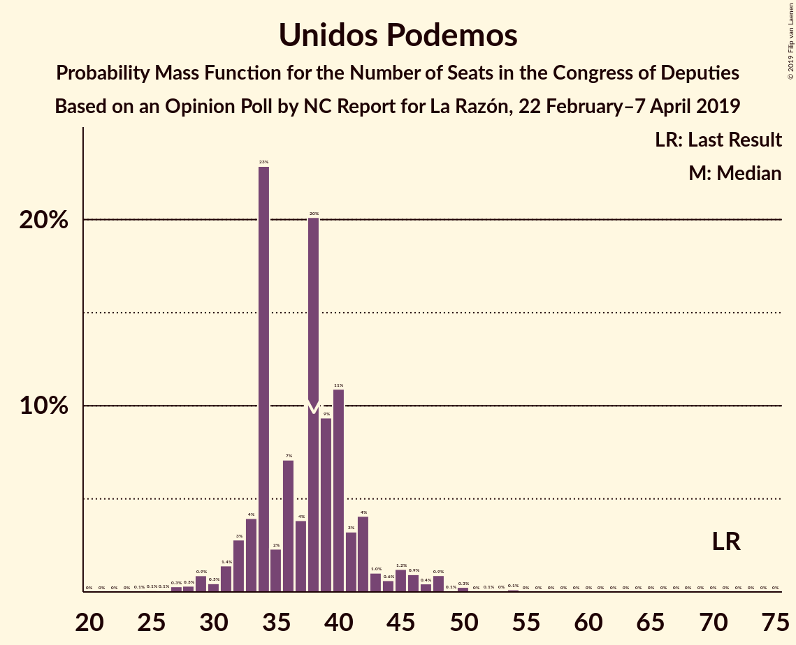
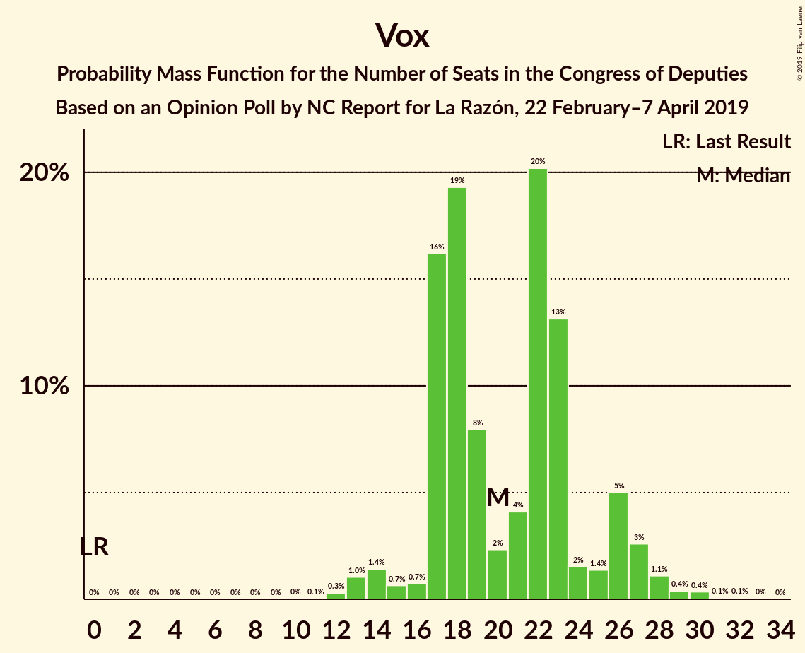
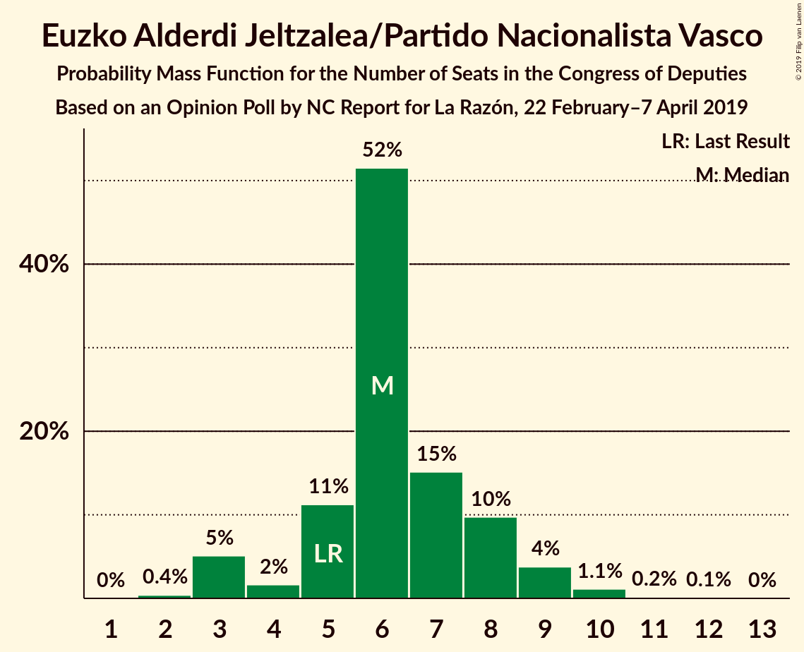
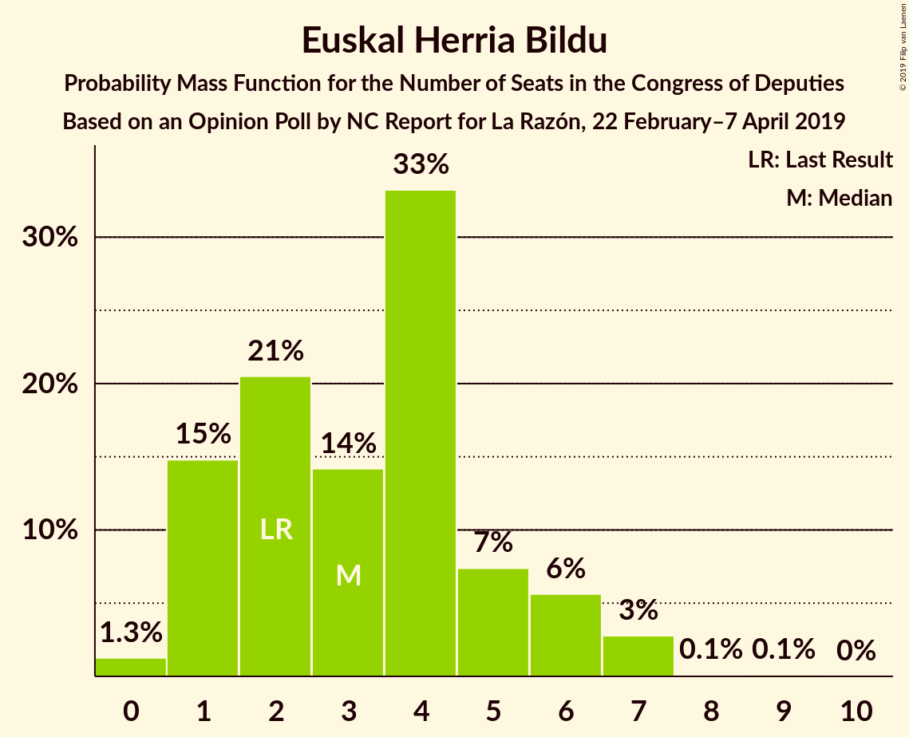
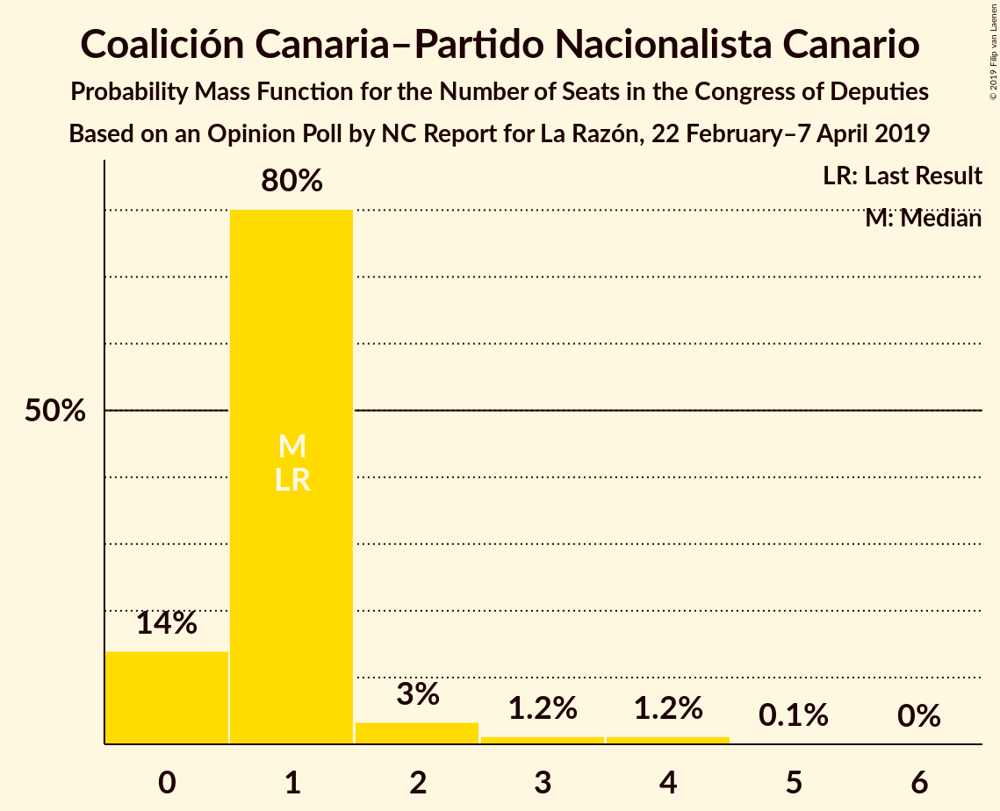
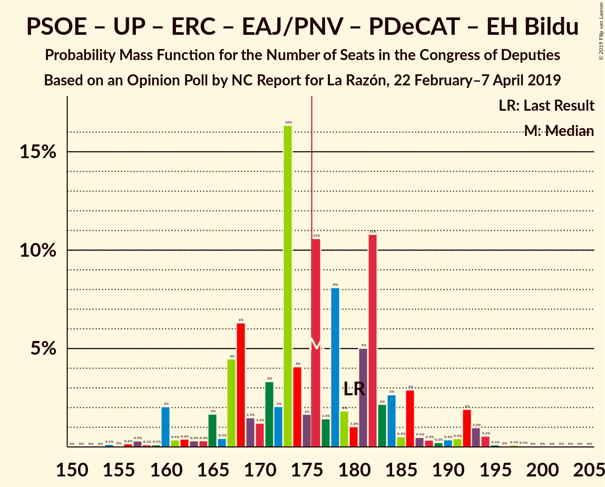
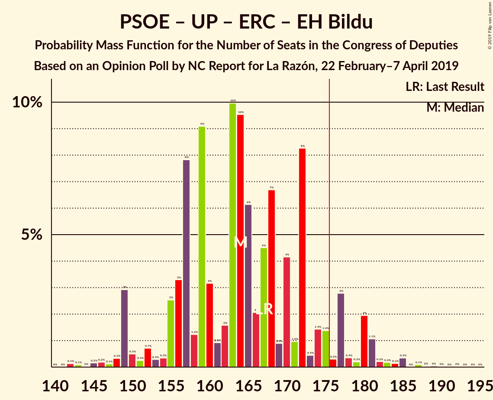
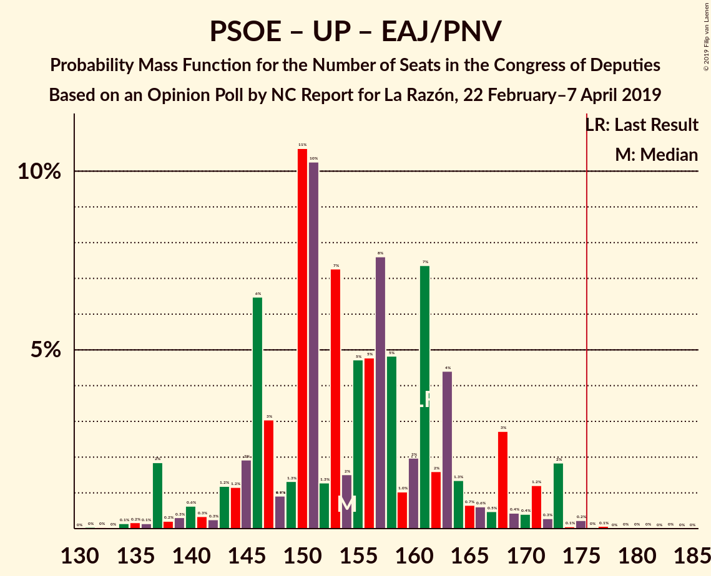
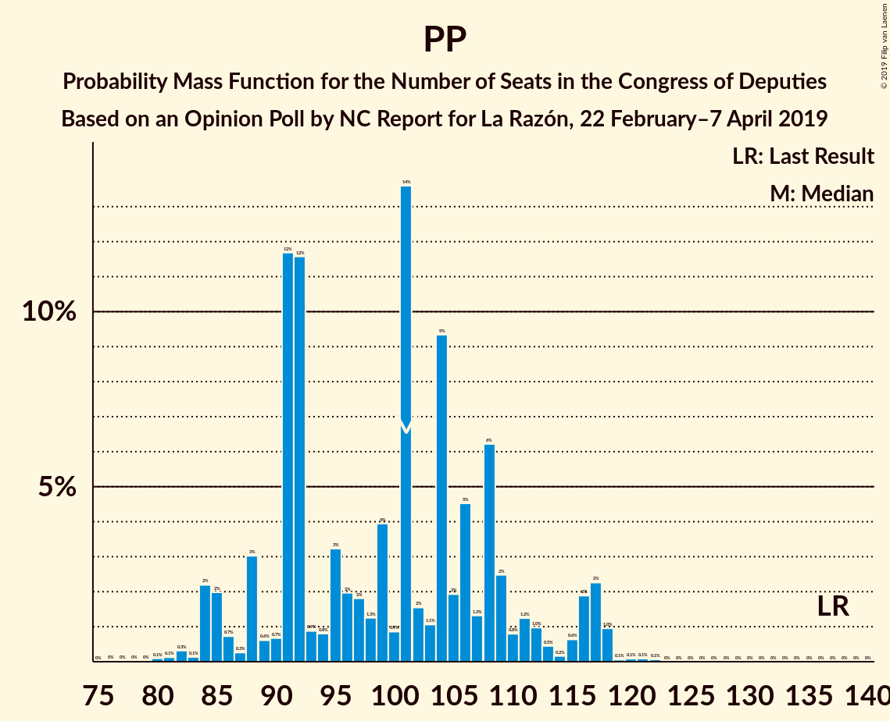

# Opinion Poll by NC Report for La Razón, 22 February–7 April 2019

<a href="#voting-intentions">Voting Intentions</a> | <a href="#seats">Seats</a> | <a href="#coalitions">Coalitions</a> | <a href="#technical-information">Technical Information</a>

## Voting Intentions

### Confidence Intervals

| Party | Last Result | Poll Result | 80% Confidence Interval | 90% Confidence Interval | 95% Confidence Interval | 99% Confidence Interval |
|:-----:|:-----------:|:-----------:|:-----------------------:|:-----------------------:|:-----------------------:|:-----------------------:|
| Partido Socialista Obrero Español | 22.6% | 26.9% | 25.1–28.8% |24.7–29.3% |24.2–29.7% |23.4–30.7% |
| Partido Popular | 33.0% | 24.0% | 22.3–25.8% |21.9–26.3% |21.4–26.7% |20.7–27.6% |
| Ciudadanos–Partido de la Ciudadanía | 13.1% | 16.1% | 14.7–17.7% |14.3–18.1% |13.9–18.5% |13.3–19.3% |
| Unidos Podemos | 21.2% | 14.0% | 12.7–15.5% |12.3–15.9% |12.0–16.3% |11.4–17.0% |
| Vox | 0.2% | 9.4% | 8.3–10.7% |8.0–11.1% |7.7–11.4% |7.2–12.0% |
| Esquerra Republicana de Catalunya–Catalunya Sí | 2.7% | 2.8% | 2.2–3.6% |2.1–3.8% |1.9–4.0% |1.7–4.4% |
| Partit Demòcrata Europeu Català | 2.0% | 1.3% | 0.9–1.9% |0.8–2.1% |0.8–2.2% |0.6–2.5% |
| Euzko Alderdi Jeltzalea/Partido Nacionalista Vasco | 1.2% | 1.3% | 0.9–1.9% |0.8–2.1% |0.8–2.2% |0.6–2.5% |
| Euskal Herria Bildu | 0.8% | 0.8% | 0.5–1.3% |0.5–1.4% |0.4–1.6% |0.3–1.9% |
| Coalición Canaria–Partido Nacionalista Canario | 0.3% | 0.3% | 0.2–0.7% |0.1–0.8% |0.1–0.9% |0.1–1.1% |

*Note:* The poll result column reflects the actual value used in the calculations. Published results may vary slightly, and in addition be rounded to fewer digits.

## Seats

### Confidence Intervals

| Party | Last Result | Median | 80% Confidence Interval | 90% Confidence Interval | 95% Confidence Interval | 99% Confidence Interval |
|:-----:|:-----------:|:------:|:-----------------------:|:-----------------------:|:-----------------------:|:-----------------------:|
| <a href="#partido-socialista-obrero-español">Partido Socialista Obrero Español</a> | 85 | 113 | 93–113 |93–113 |93–113 |93–113 |
| <a href="#partido-popular">Partido Popular</a> | 137 | 99 | 96–99 |96–99 |96–99 |96–99 |
| <a href="#ciudadanos–partido-de-la-ciudadanía">Ciudadanos–Partido de la Ciudadanía</a> | 32 | 50 | 50–59 |50–59 |50–59 |50–59 |
| <a href="#unidos-podemos">Unidos Podemos</a> | 71 | 32 | 32–46 |32–46 |32–46 |32–46 |
| <a href="#vox">Vox</a> | 0 | 20 | 18–20 |18–20 |18–20 |18–20 |
| <a href="#esquerra-republicana-de-catalunya–catalunya-sí">Esquerra Republicana de Catalunya–Catalunya Sí</a> | 9 | 15 | 13–20 |13–20 |13–20 |13–20 |
| <a href="#partit-demòcrata-europeu-català">Partit Demòcrata Europeu Català</a> | 8 | 8 | 3–13 |3–13 |3–13 |3–13 |
| <a href="#euzko-alderdi-jeltzalea/partido-nacionalista-vasco">Euzko Alderdi Jeltzalea/Partido Nacionalista Vasco</a> | 5 | 8 | 7–10 |7–10 |7–10 |7–10 |
| <a href="#euskal-herria-bildu">Euskal Herria Bildu</a> | 2 | 5 | 1–5 |1–5 |1–5 |1–5 |
| <a href="#coalición-canaria–partido-nacionalista-canario">Coalición Canaria–Partido Nacionalista Canario</a> | 1 | 0 | 0–2 |0–2 |0–2 |0–2 |

### Partido Socialista Obrero Español

*For a full overview of the results for this party, see the [Partido Socialista Obrero Español](party-partidosocialistaobreroespañol.html) page.*

| Number of Seats | Probability | Accumulated | Special Marks |
|:---------------:|:-----------:|:-----------:|:-------------:|
| 85 | 0% | 100% | Last Result |
| 86 | 0% | 100% |  |
| 87 | 0% | 100% |  |
| 88 | 0% | 100% |  |
| 89 | 0% | 100% |  |
| 90 | 0% | 100% |  |
| 91 | 0% | 100% |  |
| 92 | 0% | 100% |  |
| 93 | 19% | 100% |  |
| 94 | 0% | 81% |  |
| 95 | 0% | 81% |  |
| 96 | 0% | 81% |  |
| 97 | 0% | 81% |  |
| 98 | 0% | 81% |  |
| 99 | 0% | 81% |  |
| 100 | 0% | 81% |  |
| 101 | 0% | 81% |  |
| 102 | 0% | 81% |  |
| 103 | 0% | 81% |  |
| 104 | 0% | 81% |  |
| 105 | 12% | 81% |  |
| 106 | 0% | 69% |  |
| 107 | 0% | 69% |  |
| 108 | 0% | 69% |  |
| 109 | 0% | 69% |  |
| 110 | 0% | 69% |  |
| 111 | 0% | 69% |  |
| 112 | 0.2% | 69% |  |
| 113 | 69% | 69% | Median |
| 114 | 0% | 0% |  |

### Partido Popular

*For a full overview of the results for this party, see the [Partido Popular](party-partidopopular.html) page.*

| Number of Seats | Probability | Accumulated | Special Marks |
|:---------------:|:-----------:|:-----------:|:-------------:|
| 96 | 12% | 100% |  |
| 97 | 19% | 88% |  |
| 98 | 0.2% | 69% |  |
| 99 | 69% | 69% | Median |
| 100 | 0% | 0% |  |
| 101 | 0% | 0% |  |
| 102 | 0% | 0% |  |
| 103 | 0% | 0% |  |
| 104 | 0% | 0% |  |
| 105 | 0% | 0% |  |
| 106 | 0% | 0% |  |
| 107 | 0% | 0% |  |
| 108 | 0% | 0% |  |
| 109 | 0% | 0% |  |
| 110 | 0% | 0% |  |
| 111 | 0% | 0% |  |
| 112 | 0% | 0% |  |
| 113 | 0% | 0% |  |
| 114 | 0% | 0% |  |
| 115 | 0% | 0% |  |
| 116 | 0% | 0% |  |
| 117 | 0% | 0% |  |
| 118 | 0% | 0% |  |
| 119 | 0% | 0% |  |
| 120 | 0% | 0% |  |
| 121 | 0% | 0% |  |
| 122 | 0% | 0% |  |
| 123 | 0% | 0% |  |
| 124 | 0% | 0% |  |
| 125 | 0% | 0% |  |
| 126 | 0% | 0% |  |
| 127 | 0% | 0% |  |
| 128 | 0% | 0% |  |
| 129 | 0% | 0% |  |
| 130 | 0% | 0% |  |
| 131 | 0% | 0% |  |
| 132 | 0% | 0% |  |
| 133 | 0% | 0% |  |
| 134 | 0% | 0% |  |
| 135 | 0% | 0% |  |
| 136 | 0% | 0% |  |
| 137 | 0% | 0% | Last Result |

### Ciudadanos–Partido de la Ciudadanía

*For a full overview of the results for this party, see the [Ciudadanos–Partido de la Ciudadanía](party-ciudadanos–partidodelaciudadanía.html) page.*

| Number of Seats | Probability | Accumulated | Special Marks |
|:---------------:|:-----------:|:-----------:|:-------------:|
| 32 | 0% | 100% | Last Result |
| 33 | 0% | 100% |  |
| 34 | 0% | 100% |  |
| 35 | 0% | 100% |  |
| 36 | 0% | 100% |  |
| 37 | 0% | 100% |  |
| 38 | 0% | 100% |  |
| 39 | 0% | 100% |  |
| 40 | 0% | 100% |  |
| 41 | 0% | 100% |  |
| 42 | 0% | 100% |  |
| 43 | 0% | 100% |  |
| 44 | 0% | 100% |  |
| 45 | 0% | 100% |  |
| 46 | 0% | 100% |  |
| 47 | 0% | 100% |  |
| 48 | 0% | 100% |  |
| 49 | 0% | 100% |  |
| 50 | 69% | 100% | Median |
| 51 | 0.2% | 31% |  |
| 52 | 0% | 31% |  |
| 53 | 0% | 31% |  |
| 54 | 0% | 31% |  |
| 55 | 0% | 31% |  |
| 56 | 0% | 31% |  |
| 57 | 0% | 31% |  |
| 58 | 12% | 31% |  |
| 59 | 19% | 19% |  |
| 60 | 0% | 0% |  |

### Unidos Podemos

*For a full overview of the results for this party, see the [Unidos Podemos](party-unidospodemos.html) page.*

| Number of Seats | Probability | Accumulated | Special Marks |
|:---------------:|:-----------:|:-----------:|:-------------:|
| 32 | 69% | 100% | Median |
| 33 | 0% | 31% |  |
| 34 | 0% | 31% |  |
| 35 | 12% | 31% |  |
| 36 | 0% | 19% |  |
| 37 | 0% | 19% |  |
| 38 | 0% | 19% |  |
| 39 | 0% | 19% |  |
| 40 | 0% | 19% |  |
| 41 | 0% | 19% |  |
| 42 | 0% | 19% |  |
| 43 | 0% | 19% |  |
| 44 | 0% | 19% |  |
| 45 | 0% | 19% |  |
| 46 | 19% | 19% |  |
| 47 | 0% | 0% |  |
| 48 | 0% | 0% |  |
| 49 | 0% | 0% |  |
| 50 | 0% | 0% |  |
| 51 | 0% | 0% |  |
| 52 | 0% | 0% |  |
| 53 | 0% | 0% |  |
| 54 | 0% | 0% |  |
| 55 | 0% | 0% |  |
| 56 | 0% | 0% |  |
| 57 | 0% | 0% |  |
| 58 | 0% | 0% |  |
| 59 | 0% | 0% |  |
| 60 | 0% | 0% |  |
| 61 | 0% | 0% |  |
| 62 | 0% | 0% |  |
| 63 | 0% | 0% |  |
| 64 | 0% | 0% |  |
| 65 | 0% | 0% |  |
| 66 | 0% | 0% |  |
| 67 | 0% | 0% |  |
| 68 | 0% | 0% |  |
| 69 | 0% | 0% |  |
| 70 | 0% | 0% |  |
| 71 | 0% | 0% | Last Result |

### Vox

*For a full overview of the results for this party, see the [Vox](party-vox.html) page.*

| Number of Seats | Probability | Accumulated | Special Marks |
|:---------------:|:-----------:|:-----------:|:-------------:|
| 0 | 0% | 100% | Last Result |
| 1 | 0% | 100% |  |
| 2 | 0% | 100% |  |
| 3 | 0% | 100% |  |
| 4 | 0% | 100% |  |
| 5 | 0% | 100% |  |
| 6 | 0% | 100% |  |
| 7 | 0% | 100% |  |
| 8 | 0% | 100% |  |
| 9 | 0% | 100% |  |
| 10 | 0% | 100% |  |
| 11 | 0% | 100% |  |
| 12 | 0% | 100% |  |
| 13 | 0% | 100% |  |
| 14 | 0% | 100% |  |
| 15 | 0% | 100% |  |
| 16 | 0% | 100% |  |
| 17 | 0% | 100% |  |
| 18 | 12% | 100% |  |
| 19 | 0% | 88% |  |
| 20 | 88% | 88% | Median |
| 21 | 0.2% | 0.2% |  |
| 22 | 0% | 0% |  |

### Esquerra Republicana de Catalunya–Catalunya Sí

*For a full overview of the results for this party, see the [Esquerra Republicana de Catalunya–Catalunya Sí](party-esquerrarepublicanadecatalunya–catalunyasí.html) page.*

| Number of Seats | Probability | Accumulated | Special Marks |
|:---------------:|:-----------:|:-----------:|:-------------:|
| 9 | 0% | 100% | Last Result |
| 10 | 0% | 100% |  |
| 11 | 0% | 100% |  |
| 12 | 0% | 100% |  |
| 13 | 19% | 100% |  |
| 14 | 0% | 81% |  |
| 15 | 69% | 81% | Median |
| 16 | 0% | 12% |  |
| 17 | 0% | 12% |  |
| 18 | 0% | 12% |  |
| 19 | 0% | 12% |  |
| 20 | 12% | 12% |  |
| 21 | 0% | 0% |  |

### Partit Demòcrata Europeu Català

*For a full overview of the results for this party, see the [Partit Demòcrata Europeu Català](party-partitdemòcrataeuropeucatalà.html) page.*

| Number of Seats | Probability | Accumulated | Special Marks |
|:---------------:|:-----------:|:-----------:|:-------------:|
| 3 | 12% | 100% |  |
| 4 | 0% | 88% |  |
| 5 | 0% | 88% |  |
| 6 | 0% | 88% |  |
| 7 | 0% | 88% |  |
| 8 | 69% | 88% | Last Result, Median |
| 9 | 0% | 19% |  |
| 10 | 0% | 19% |  |
| 11 | 0% | 19% |  |
| 12 | 0% | 19% |  |
| 13 | 19% | 19% |  |
| 14 | 0% | 0% |  |

### Euzko Alderdi Jeltzalea/Partido Nacionalista Vasco

*For a full overview of the results for this party, see the [Euzko Alderdi Jeltzalea/Partido Nacionalista Vasco](party-euzkoalderdijeltzaleapartidonacionalistavasco.html) page.*

| Number of Seats | Probability | Accumulated | Special Marks |
|:---------------:|:-----------:|:-----------:|:-------------:|
| 5 | 0% | 100% | Last Result |
| 6 | 0% | 100% |  |
| 7 | 19% | 100% |  |
| 8 | 69% | 81% | Median |
| 9 | 0% | 12% |  |
| 10 | 12% | 12% |  |
| 11 | 0% | 0% |  |

### Euskal Herria Bildu

*For a full overview of the results for this party, see the [Euskal Herria Bildu](party-euskalherriabildu.html) page.*

| Number of Seats | Probability | Accumulated | Special Marks |
|:---------------:|:-----------:|:-----------:|:-------------:|
| 1 | 19% | 100% |  |
| 2 | 0% | 81% | Last Result |
| 3 | 12% | 81% |  |
| 4 | 0% | 69% |  |
| 5 | 69% | 69% | Median |
| 6 | 0% | 0% |  |

### Coalición Canaria–Partido Nacionalista Canario

*For a full overview of the results for this party, see the [Coalición Canaria–Partido Nacionalista Canario](party-coalicióncanaria–partidonacionalistacanario.html) page.*

| Number of Seats | Probability | Accumulated | Special Marks |
|:---------------:|:-----------:|:-----------:|:-------------:|
| 0 | 69% | 100% | Median |
| 1 | 19% | 31% | Last Result |
| 2 | 12% | 12% |  |
| 3 | 0% | 0% |  |

## Coalitions

### Confidence Intervals

| Coalition | Last Result | Median | Majority? | 80% Confidence Interval | 90% Confidence Interval | 95% Confidence Interval | 99% Confidence Interval |
|:---------:|:-----------:|:------:|:---------:|:-----------------------:|:-----------------------:|:-----------------------:|:-----------------------:|
| Partido Socialista Obrero Español – Partido Popular – Ciudadanos–Partido de la Ciudadanía | 254 | 262 | 100% | 249–262 | 249–262 | 249–262 | 249–262 |
| Partido Socialista Obrero Español – Partido Popular | 222 | 212 | 100% | 190–212 | 190–212 | 190–212 | 190–212 |
| Partido Socialista Obrero Español – Ciudadanos–Partido de la Ciudadanía – Unidos Podemos | 188 | 195 | 100% | 195–198 | 195–198 | 195–198 | 195–198 |
| Partido Socialista Obrero Español – Unidos Podemos – Esquerra Republicana de Catalunya–Catalunya Sí – Euzko Alderdi Jeltzalea/Partido Nacionalista Vasco – Partit Demòcrata Europeu Català – Euskal Herria Bildu | 180 | 181 | 81% | 173–181 | 173–181 | 173–181 | 173–181 |
| Partido Popular – Ciudadanos–Partido de la Ciudadanía – Vox | 169 | 169 | 19% | 169–176 | 169–176 | 169–176 | 169–176 |
| Partido Socialista Obrero Español – Unidos Podemos – Esquerra Republicana de Catalunya–Catalunya Sí – Partit Demòcrata Europeu Català | 173 | 168 | 0% | 163–168 | 163–168 | 163–168 | 163–168 |
| Partido Socialista Obrero Español – Unidos Podemos – Esquerra Republicana de Catalunya–Catalunya Sí – Euskal Herria Bildu | 167 | 165 | 0% | 153–165 | 153–165 | 153–165 | 153–165 |
| Partido Popular – Ciudadanos–Partido de la Ciudadanía – Euzko Alderdi Jeltzalea/Partido Nacionalista Vasco | 174 | 157 | 0% | 157–164 | 157–164 | 157–164 | 157–164 |
| Partido Socialista Obrero Español – Ciudadanos–Partido de la Ciudadanía | 117 | 163 | 0% | 152–163 | 152–163 | 152–163 | 152–163 |
| Partido Socialista Obrero Español – Unidos Podemos – Euzko Alderdi Jeltzalea/Partido Nacionalista Vasco – Euskal Herria Bildu | 163 | 158 | 0% | 147–158 | 147–158 | 147–158 | 147–158 |
| Partido Popular – Ciudadanos–Partido de la Ciudadanía – Coalición Canaria–Partido Nacionalista Canario | 170 | 149 | 0% | 149–157 | 149–157 | 149–157 | 149–157 |
| Partido Popular – Ciudadanos–Partido de la Ciudadanía | 169 | 149 | 0% | 149–156 | 149–156 | 149–156 | 149–156 |
| Partido Socialista Obrero Español – Unidos Podemos – Euzko Alderdi Jeltzalea/Partido Nacionalista Vasco | 161 | 153 | 0% | 146–153 | 146–153 | 146–153 | 146–153 |
| Partido Socialista Obrero Español – Unidos Podemos | 156 | 145 | 0% | 139–145 | 139–145 | 139–145 | 139–145 |
| Partido Popular – Vox | 137 | 119 | 0% | 114–119 | 114–119 | 114–119 | 114–119 |
| Partido Socialista Obrero Español | 85 | 113 | 0% | 93–113 | 93–113 | 93–113 | 93–113 |
| Partido Popular | 137 | 99 | 0% | 96–99 | 96–99 | 96–99 | 96–99 |

### Partido Socialista Obrero Español – Partido Popular – Ciudadanos–Partido de la Ciudadanía

| Number of Seats | Probability | Accumulated | Special Marks |
|:---------------:|:-----------:|:-----------:|:-------------:|
| 249 | 19% | 100% |  |
| 250 | 0% | 81% |  |
| 251 | 0% | 81% |  |
| 252 | 0% | 81% |  |
| 253 | 0% | 81% |  |
| 254 | 0% | 81% | Last Result |
| 255 | 0% | 81% |  |
| 256 | 0% | 81% |  |
| 257 | 0% | 81% |  |
| 258 | 0% | 81% |  |
| 259 | 12% | 81% |  |
| 260 | 0% | 69% |  |
| 261 | 0.2% | 69% |  |
| 262 | 69% | 69% | Median |
| 263 | 0% | 0% |  |

### Partido Socialista Obrero Español – Partido Popular

| Number of Seats | Probability | Accumulated | Special Marks |
|:---------------:|:-----------:|:-----------:|:-------------:|
| 190 | 19% | 100% |  |
| 191 | 0% | 81% |  |
| 192 | 0% | 81% |  |
| 193 | 0% | 81% |  |
| 194 | 0% | 81% |  |
| 195 | 0% | 81% |  |
| 196 | 0% | 81% |  |
| 197 | 0% | 81% |  |
| 198 | 0% | 81% |  |
| 199 | 0% | 81% |  |
| 200 | 0% | 81% |  |
| 201 | 12% | 81% |  |
| 202 | 0% | 69% |  |
| 203 | 0% | 69% |  |
| 204 | 0% | 69% |  |
| 205 | 0% | 69% |  |
| 206 | 0% | 69% |  |
| 207 | 0% | 69% |  |
| 208 | 0% | 69% |  |
| 209 | 0% | 69% |  |
| 210 | 0.2% | 69% |  |
| 211 | 0% | 69% |  |
| 212 | 69% | 69% | Median |
| 213 | 0% | 0% |  |
| 214 | 0% | 0% |  |
| 215 | 0% | 0% |  |
| 216 | 0% | 0% |  |
| 217 | 0% | 0% |  |
| 218 | 0% | 0% |  |
| 219 | 0% | 0% |  |
| 220 | 0% | 0% |  |
| 221 | 0% | 0% |  |
| 222 | 0% | 0% | Last Result |

### Partido Socialista Obrero Español – Ciudadanos–Partido de la Ciudadanía – Unidos Podemos

| Number of Seats | Probability | Accumulated | Special Marks |
|:---------------:|:-----------:|:-----------:|:-------------:|
| 188 | 0% | 100% | Last Result |
| 189 | 0% | 100% |  |
| 190 | 0% | 100% |  |
| 191 | 0% | 100% |  |
| 192 | 0% | 100% |  |
| 193 | 0% | 100% |  |
| 194 | 0% | 100% |  |
| 195 | 69% | 100% | Median |
| 196 | 0% | 31% |  |
| 197 | 0% | 31% |  |
| 198 | 31% | 31% |  |
| 199 | 0% | 0% |  |

### Partido Socialista Obrero Español – Unidos Podemos – Esquerra Republicana de Catalunya–Catalunya Sí – Euzko Alderdi Jeltzalea/Partido Nacionalista Vasco – Partit Demòcrata Europeu Català – Euskal Herria Bildu

| Number of Seats | Probability | Accumulated | Special Marks |
|:---------------:|:-----------:|:-----------:|:-------------:|
| 173 | 19% | 100% |  |
| 174 | 0% | 81% |  |
| 175 | 0% | 81% |  |
| 176 | 12% | 81% | Majority |
| 177 | 0% | 69% |  |
| 178 | 0% | 69% |  |
| 179 | 0% | 69% |  |
| 180 | 0.2% | 69% | Last Result |
| 181 | 69% | 69% | Median |
| 182 | 0% | 0% |  |

### Partido Popular – Ciudadanos–Partido de la Ciudadanía – Vox

| Number of Seats | Probability | Accumulated | Special Marks |
|:---------------:|:-----------:|:-----------:|:-------------:|
| 169 | 69% | 100% | Last Result, Median |
| 170 | 0.2% | 31% |  |
| 171 | 0% | 31% |  |
| 172 | 12% | 31% |  |
| 173 | 0% | 19% |  |
| 174 | 0% | 19% |  |
| 175 | 0% | 19% |  |
| 176 | 19% | 19% | Majority |
| 177 | 0% | 0% |  |

### Partido Socialista Obrero Español – Unidos Podemos – Esquerra Republicana de Catalunya–Catalunya Sí – Partit Demòcrata Europeu Català

| Number of Seats | Probability | Accumulated | Special Marks |
|:---------------:|:-----------:|:-----------:|:-------------:|
| 163 | 12% | 100% |  |
| 164 | 0% | 88% |  |
| 165 | 19% | 88% |  |
| 166 | 0% | 69% |  |
| 167 | 0.2% | 69% |  |
| 168 | 69% | 69% | Median |
| 169 | 0% | 0% |  |
| 170 | 0% | 0% |  |
| 171 | 0% | 0% |  |
| 172 | 0% | 0% |  |
| 173 | 0% | 0% | Last Result |

### Partido Socialista Obrero Español – Unidos Podemos – Esquerra Republicana de Catalunya–Catalunya Sí – Euskal Herria Bildu

| Number of Seats | Probability | Accumulated | Special Marks |
|:---------------:|:-----------:|:-----------:|:-------------:|
| 153 | 19% | 100% |  |
| 154 | 0% | 81% |  |
| 155 | 0% | 81% |  |
| 156 | 0% | 81% |  |
| 157 | 0% | 81% |  |
| 158 | 0% | 81% |  |
| 159 | 0% | 81% |  |
| 160 | 0% | 81% |  |
| 161 | 0% | 81% |  |
| 162 | 0% | 81% |  |
| 163 | 12% | 81% |  |
| 164 | 0.2% | 69% |  |
| 165 | 69% | 69% | Median |
| 166 | 0% | 0% |  |
| 167 | 0% | 0% | Last Result |

### Partido Popular – Ciudadanos–Partido de la Ciudadanía – Euzko Alderdi Jeltzalea/Partido Nacionalista Vasco

| Number of Seats | Probability | Accumulated | Special Marks |
|:---------------:|:-----------:|:-----------:|:-------------:|
| 157 | 69% | 100% | Median |
| 158 | 0% | 31% |  |
| 159 | 0% | 31% |  |
| 160 | 0% | 31% |  |
| 161 | 0% | 31% |  |
| 162 | 0% | 31% |  |
| 163 | 19% | 31% |  |
| 164 | 12% | 12% |  |
| 165 | 0% | 0% |  |
| 166 | 0% | 0% |  |
| 167 | 0% | 0% |  |
| 168 | 0% | 0% |  |
| 169 | 0% | 0% |  |
| 170 | 0% | 0% |  |
| 171 | 0% | 0% |  |
| 172 | 0% | 0% |  |
| 173 | 0% | 0% |  |
| 174 | 0% | 0% | Last Result |

### Partido Socialista Obrero Español – Ciudadanos–Partido de la Ciudadanía

| Number of Seats | Probability | Accumulated | Special Marks |
|:---------------:|:-----------:|:-----------:|:-------------:|
| 117 | 0% | 100% | Last Result |
| 118 | 0% | 100% |  |
| 119 | 0% | 100% |  |
| 120 | 0% | 100% |  |
| 121 | 0% | 100% |  |
| 122 | 0% | 100% |  |
| 123 | 0% | 100% |  |
| 124 | 0% | 100% |  |
| 125 | 0% | 100% |  |
| 126 | 0% | 100% |  |
| 127 | 0% | 100% |  |
| 128 | 0% | 100% |  |
| 129 | 0% | 100% |  |
| 130 | 0% | 100% |  |
| 131 | 0% | 100% |  |
| 132 | 0% | 100% |  |
| 133 | 0% | 100% |  |
| 134 | 0% | 100% |  |
| 135 | 0% | 100% |  |
| 136 | 0% | 100% |  |
| 137 | 0% | 100% |  |
| 138 | 0% | 100% |  |
| 139 | 0% | 100% |  |
| 140 | 0% | 100% |  |
| 141 | 0% | 100% |  |
| 142 | 0% | 100% |  |
| 143 | 0% | 100% |  |
| 144 | 0% | 100% |  |
| 145 | 0% | 100% |  |
| 146 | 0% | 100% |  |
| 147 | 0% | 100% |  |
| 148 | 0% | 100% |  |
| 149 | 0% | 100% |  |
| 150 | 0% | 100% |  |
| 151 | 0% | 100% |  |
| 152 | 19% | 100% |  |
| 153 | 0% | 81% |  |
| 154 | 0% | 81% |  |
| 155 | 0% | 81% |  |
| 156 | 0% | 81% |  |
| 157 | 0% | 81% |  |
| 158 | 0% | 81% |  |
| 159 | 0% | 81% |  |
| 160 | 0% | 81% |  |
| 161 | 0% | 81% |  |
| 162 | 0% | 81% |  |
| 163 | 81% | 81% | Median |
| 164 | 0% | 0% |  |

### Partido Socialista Obrero Español – Unidos Podemos – Euzko Alderdi Jeltzalea/Partido Nacionalista Vasco – Euskal Herria Bildu

| Number of Seats | Probability | Accumulated | Special Marks |
|:---------------:|:-----------:|:-----------:|:-------------:|
| 147 | 19% | 100% |  |
| 148 | 0% | 81% |  |
| 149 | 0% | 81% |  |
| 150 | 0% | 81% |  |
| 151 | 0% | 81% |  |
| 152 | 0% | 81% |  |
| 153 | 12% | 81% |  |
| 154 | 0% | 69% |  |
| 155 | 0% | 69% |  |
| 156 | 0% | 69% |  |
| 157 | 0.2% | 69% |  |
| 158 | 69% | 69% | Median |
| 159 | 0% | 0% |  |
| 160 | 0% | 0% |  |
| 161 | 0% | 0% |  |
| 162 | 0% | 0% |  |
| 163 | 0% | 0% | Last Result |

### Partido Popular – Ciudadanos–Partido de la Ciudadanía – Coalición Canaria–Partido Nacionalista Canario

| Number of Seats | Probability | Accumulated | Special Marks |
|:---------------:|:-----------:|:-----------:|:-------------:|
| 149 | 69% | 100% | Median |
| 150 | 0% | 31% |  |
| 151 | 0% | 31% |  |
| 152 | 0% | 31% |  |
| 153 | 0% | 31% |  |
| 154 | 0% | 31% |  |
| 155 | 0% | 31% |  |
| 156 | 12% | 31% |  |
| 157 | 19% | 19% |  |
| 158 | 0% | 0% |  |
| 159 | 0% | 0% |  |
| 160 | 0% | 0% |  |
| 161 | 0% | 0% |  |
| 162 | 0% | 0% |  |
| 163 | 0% | 0% |  |
| 164 | 0% | 0% |  |
| 165 | 0% | 0% |  |
| 166 | 0% | 0% |  |
| 167 | 0% | 0% |  |
| 168 | 0% | 0% |  |
| 169 | 0% | 0% |  |
| 170 | 0% | 0% | Last Result |

### Partido Popular – Ciudadanos–Partido de la Ciudadanía

| Number of Seats | Probability | Accumulated | Special Marks |
|:---------------:|:-----------:|:-----------:|:-------------:|
| 149 | 69% | 100% | Median |
| 150 | 0% | 31% |  |
| 151 | 0% | 31% |  |
| 152 | 0% | 31% |  |
| 153 | 0% | 31% |  |
| 154 | 12% | 31% |  |
| 155 | 0% | 19% |  |
| 156 | 19% | 19% |  |
| 157 | 0% | 0% |  |
| 158 | 0% | 0% |  |
| 159 | 0% | 0% |  |
| 160 | 0% | 0% |  |
| 161 | 0% | 0% |  |
| 162 | 0% | 0% |  |
| 163 | 0% | 0% |  |
| 164 | 0% | 0% |  |
| 165 | 0% | 0% |  |
| 166 | 0% | 0% |  |
| 167 | 0% | 0% |  |
| 168 | 0% | 0% |  |
| 169 | 0% | 0% | Last Result |

### Partido Socialista Obrero Español – Unidos Podemos – Euzko Alderdi Jeltzalea/Partido Nacionalista Vasco

| Number of Seats | Probability | Accumulated | Special Marks |
|:---------------:|:-----------:|:-----------:|:-------------:|
| 146 | 19% | 100% |  |
| 147 | 0% | 81% |  |
| 148 | 0% | 81% |  |
| 149 | 0% | 81% |  |
| 150 | 12% | 81% |  |
| 151 | 0% | 69% |  |
| 152 | 0.2% | 69% |  |
| 153 | 69% | 69% | Median |
| 154 | 0% | 0% |  |
| 155 | 0% | 0% |  |
| 156 | 0% | 0% |  |
| 157 | 0% | 0% |  |
| 158 | 0% | 0% |  |
| 159 | 0% | 0% |  |
| 160 | 0% | 0% |  |
| 161 | 0% | 0% | Last Result |

### Partido Socialista Obrero Español – Unidos Podemos

| Number of Seats | Probability | Accumulated | Special Marks |
|:---------------:|:-----------:|:-----------:|:-------------:|
| 139 | 19% | 100% |  |
| 140 | 12% | 81% |  |
| 141 | 0% | 69% |  |
| 142 | 0% | 69% |  |
| 143 | 0% | 69% |  |
| 144 | 0.2% | 69% |  |
| 145 | 69% | 69% | Median |
| 146 | 0% | 0% |  |
| 147 | 0% | 0% |  |
| 148 | 0% | 0% |  |
| 149 | 0% | 0% |  |
| 150 | 0% | 0% |  |
| 151 | 0% | 0% |  |
| 152 | 0% | 0% |  |
| 153 | 0% | 0% |  |
| 154 | 0% | 0% |  |
| 155 | 0% | 0% |  |
| 156 | 0% | 0% | Last Result |

### Partido Popular – Vox

| Number of Seats | Probability | Accumulated | Special Marks |
|:---------------:|:-----------:|:-----------:|:-------------:|
| 114 | 12% | 100% |  |
| 115 | 0% | 88% |  |
| 116 | 0% | 88% |  |
| 117 | 19% | 88% |  |
| 118 | 0% | 69% |  |
| 119 | 69% | 69% | Median |
| 120 | 0% | 0% |  |
| 121 | 0% | 0% |  |
| 122 | 0% | 0% |  |
| 123 | 0% | 0% |  |
| 124 | 0% | 0% |  |
| 125 | 0% | 0% |  |
| 126 | 0% | 0% |  |
| 127 | 0% | 0% |  |
| 128 | 0% | 0% |  |
| 129 | 0% | 0% |  |
| 130 | 0% | 0% |  |
| 131 | 0% | 0% |  |
| 132 | 0% | 0% |  |
| 133 | 0% | 0% |  |
| 134 | 0% | 0% |  |
| 135 | 0% | 0% |  |
| 136 | 0% | 0% |  |
| 137 | 0% | 0% | Last Result |

### Partido Socialista Obrero Español

| Number of Seats | Probability | Accumulated | Special Marks |
|:---------------:|:-----------:|:-----------:|:-------------:|
| 85 | 0% | 100% | Last Result |
| 86 | 0% | 100% |  |
| 87 | 0% | 100% |  |
| 88 | 0% | 100% |  |
| 89 | 0% | 100% |  |
| 90 | 0% | 100% |  |
| 91 | 0% | 100% |  |
| 92 | 0% | 100% |  |
| 93 | 19% | 100% |  |
| 94 | 0% | 81% |  |
| 95 | 0% | 81% |  |
| 96 | 0% | 81% |  |
| 97 | 0% | 81% |  |
| 98 | 0% | 81% |  |
| 99 | 0% | 81% |  |
| 100 | 0% | 81% |  |
| 101 | 0% | 81% |  |
| 102 | 0% | 81% |  |
| 103 | 0% | 81% |  |
| 104 | 0% | 81% |  |
| 105 | 12% | 81% |  |
| 106 | 0% | 69% |  |
| 107 | 0% | 69% |  |
| 108 | 0% | 69% |  |
| 109 | 0% | 69% |  |
| 110 | 0% | 69% |  |
| 111 | 0% | 69% |  |
| 112 | 0.2% | 69% |  |
| 113 | 69% | 69% | Median |
| 114 | 0% | 0% |  |

### Partido Popular

| Number of Seats | Probability | Accumulated | Special Marks |
|:---------------:|:-----------:|:-----------:|:-------------:|
| 96 | 12% | 100% |  |
| 97 | 19% | 88% |  |
| 98 | 0.2% | 69% |  |
| 99 | 69% | 69% | Median |
| 100 | 0% | 0% |  |
| 101 | 0% | 0% |  |
| 102 | 0% | 0% |  |
| 103 | 0% | 0% |  |
| 104 | 0% | 0% |  |
| 105 | 0% | 0% |  |
| 106 | 0% | 0% |  |
| 107 | 0% | 0% |  |
| 108 | 0% | 0% |  |
| 109 | 0% | 0% |  |
| 110 | 0% | 0% |  |
| 111 | 0% | 0% |  |
| 112 | 0% | 0% |  |
| 113 | 0% | 0% |  |
| 114 | 0% | 0% |  |
| 115 | 0% | 0% |  |
| 116 | 0% | 0% |  |
| 117 | 0% | 0% |  |
| 118 | 0% | 0% |  |
| 119 | 0% | 0% |  |
| 120 | 0% | 0% |  |
| 121 | 0% | 0% |  |
| 122 | 0% | 0% |  |
| 123 | 0% | 0% |  |
| 124 | 0% | 0% |  |
| 125 | 0% | 0% |  |
| 126 | 0% | 0% |  |
| 127 | 0% | 0% |  |
| 128 | 0% | 0% |  |
| 129 | 0% | 0% |  |
| 130 | 0% | 0% |  |
| 131 | 0% | 0% |  |
| 132 | 0% | 0% |  |
| 133 | 0% | 0% |  |
| 134 | 0% | 0% |  |
| 135 | 0% | 0% |  |
| 136 | 0% | 0% |  |
| 137 | 0% | 0% | Last Result |

## Technical Information

### Opinion Poll

+ **Polling firm:** NC Report
+ **Commissioner(s):** La Razón
+ **Fieldwork period:** 22 February–7 April 2019

### Calculations

+ **Sample size:** 1000
+ **Simulations done:** 64
+ **Error estimate:** 3.28%

