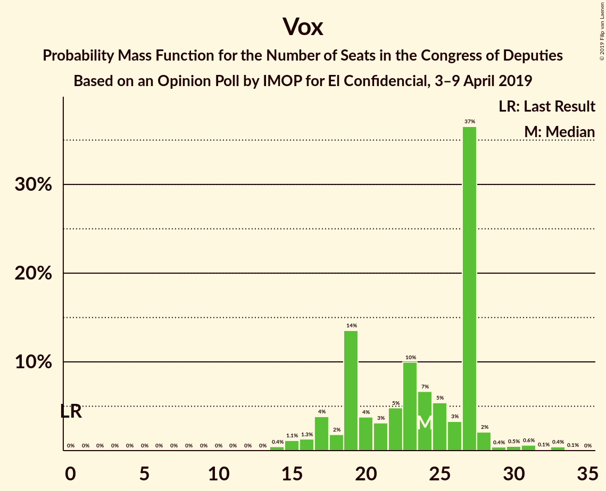
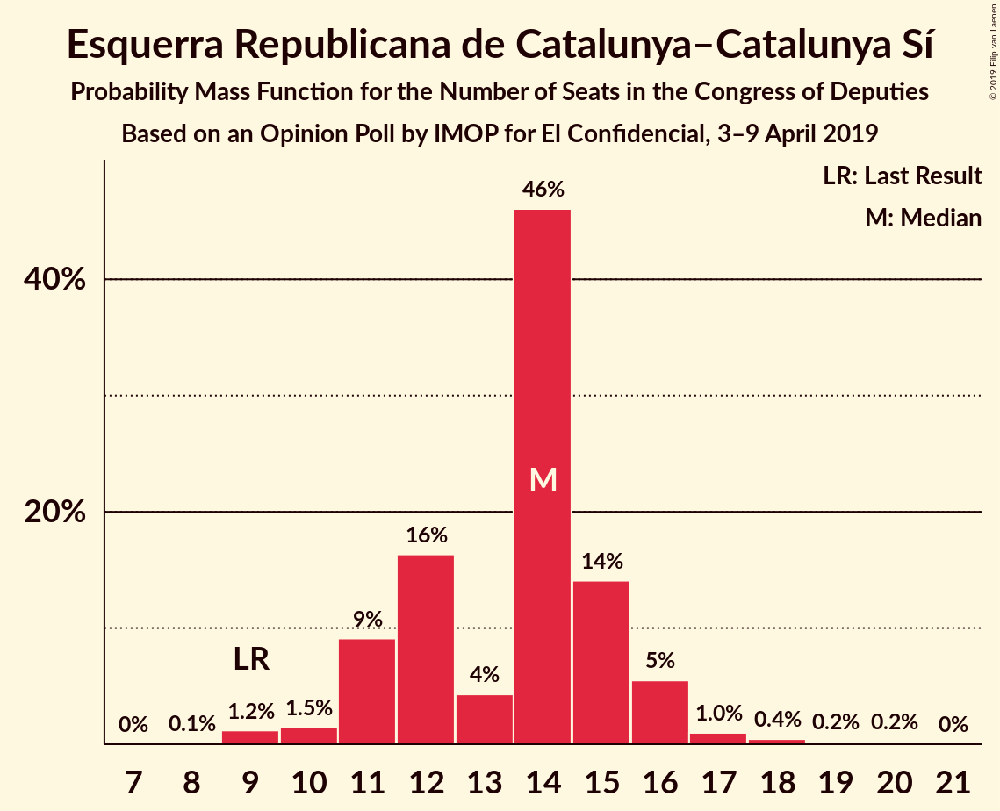
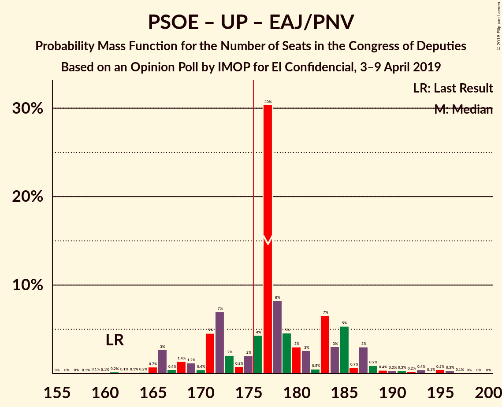
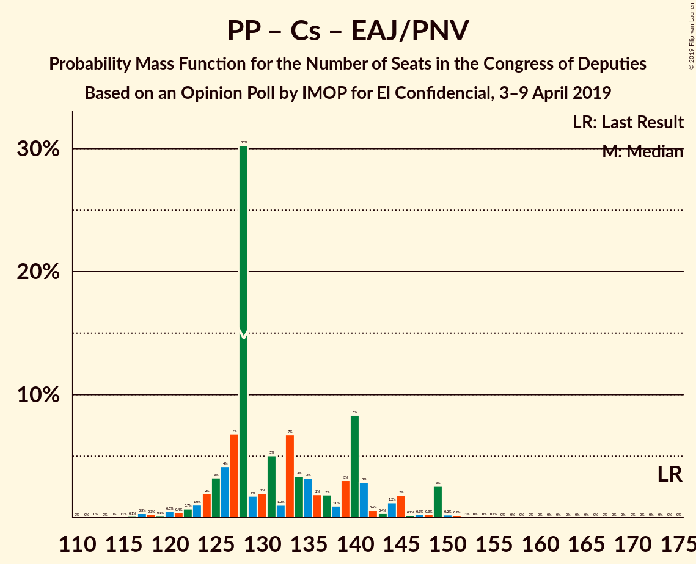

# Opinion Poll by IMOP for El Confidencial, 3–9 April 2019

<a href="#voting-intentions">Voting Intentions</a> | <a href="#seats">Seats</a> | <a href="#coalitions">Coalitions</a> | <a href="#technical-information">Technical Information</a>

## Voting Intentions

### Confidence Intervals

| Party | Last Result | Poll Result | 80% Confidence Interval | 90% Confidence Interval | 95% Confidence Interval | 99% Confidence Interval |
|:-----:|:-----------:|:-----------:|:-----------------------:|:-----------------------:|:-----------------------:|:-----------------------:|
| Partido Socialista Obrero Español | 22.6% | 31.0% | 29.4–32.6% |29.0–33.1% |28.6–33.5% |27.9–34.2% |
| Partido Popular | 33.0% | 19.4% | 18.1–20.8% |17.7–21.2% |17.4–21.6% |16.8–22.3% |
| Ciudadanos–Partido de la Ciudadanía | 13.1% | 16.0% | 14.8–17.3% |14.4–17.7% |14.2–18.0% |13.6–18.7% |
| Unidos Podemos | 21.2% | 14.0% | 12.9–15.3% |12.6–15.6% |12.3–15.9% |11.8–16.5% |
| Vox | 0.2% | 9.8% | 8.9–10.9% |8.6–11.2% |8.4–11.5% |7.9–12.0% |
| Esquerra Republicana de Catalunya–Catalunya Sí | 2.7% | 3.1% | 2.6–3.8% |2.5–4.0% |2.3–4.2% |2.1–4.5% |
| Partido Animalista Contra el Maltrato Animal | 1.2% | 1.5% | 1.1–2.0% |1.1–2.1% |1.0–2.3% |0.8–2.5% |
| Partit Demòcrata Europeu Català | 2.0% | 1.3% | 1.0–1.8% |0.9–1.9% |0.8–2.0% |0.7–2.3% |
| Euzko Alderdi Jeltzalea/Partido Nacionalista Vasco | 1.2% | 1.3% | 1.0–1.8% |0.9–1.9% |0.8–2.0% |0.7–2.3% |
| Euskal Herria Bildu | 0.8% | 0.8% | 0.5–1.2% |0.5–1.3% |0.4–1.4% |0.4–1.6% |

*Note:* The poll result column reflects the actual value used in the calculations. Published results may vary slightly, and in addition be rounded to fewer digits.

## Seats

### Confidence Intervals

| Party | Last Result | Median | 80% Confidence Interval | 90% Confidence Interval | 95% Confidence Interval | 99% Confidence Interval |
|:-----:|:-----------:|:------:|:-----------------------:|:-----------------------:|:-----------------------:|:-----------------------:|
| <a href="#partido-socialista-obrero-español">Partido Socialista Obrero Español</a> | 85 | 137 | 126–145 |124–145 |121–145 |115–148 |
| <a href="#partido-popular">Partido Popular</a> | 137 | 72 | 68–84 |66–86 |65–87 |61–88 |
| <a href="#ciudadanos–partido-de-la-ciudadanía">Ciudadanos–Partido de la Ciudadanía</a> | 32 | 51 | 46–58 |44–62 |44–63 |40–65 |
| <a href="#unidos-podemos">Unidos Podemos</a> | 71 | 37 | 34–40 |32–43 |30–45 |30–49 |
| <a href="#vox">Vox</a> | 0 | 23 | 17–27 |17–28 |16–31 |15–33 |
| <a href="#esquerra-republicana-de-catalunya–catalunya-sí">Esquerra Republicana de Catalunya–Catalunya Sí</a> | 9 | 14 | 12–16 |10–16 |10–17 |9–20 |
| <a href="#partido-animalista-contra-el-maltrato-animal">Partido Animalista Contra el Maltrato Animal</a> | 0 | 0 | 0–1 |0–1 |0–1 |0–1 |
| <a href="#partit-demòcrata-europeu-català">Partit Demòcrata Europeu Català</a> | 8 | 5 | 3–6 |2–8 |1–8 |1–10 |
| <a href="#euzko-alderdi-jeltzalea/partido-nacionalista-vasco">Euzko Alderdi Jeltzalea/Partido Nacionalista Vasco</a> | 5 | 6 | 6–9 |4–9 |4–10 |3–10 |
| <a href="#euskal-herria-bildu">Euskal Herria Bildu</a> | 2 | 2 | 1–5 |1–5 |1–7 |0–7 |

### Partido Socialista Obrero Español

*For a full overview of the results for this party, see the [Partido Socialista Obrero Español](party-partidosocialistaobreroespañol.html) page.*

| Number of Seats | Probability | Accumulated | Special Marks |
|:---------------:|:-----------:|:-----------:|:-------------:|
| 85 | 0% | 100% | Last Result |
| 86 | 0% | 100% |  |
| 87 | 0% | 100% |  |
| 88 | 0% | 100% |  |
| 89 | 0% | 100% |  |
| 90 | 0% | 100% |  |
| 91 | 0% | 100% |  |
| 92 | 0% | 100% |  |
| 93 | 0% | 100% |  |
| 94 | 0% | 100% |  |
| 95 | 0% | 100% |  |
| 96 | 0% | 100% |  |
| 97 | 0% | 100% |  |
| 98 | 0% | 100% |  |
| 99 | 0% | 100% |  |
| 100 | 0% | 100% |  |
| 101 | 0% | 100% |  |
| 102 | 0% | 100% |  |
| 103 | 0% | 100% |  |
| 104 | 0% | 100% |  |
| 105 | 0% | 100% |  |
| 106 | 0% | 100% |  |
| 107 | 0% | 100% |  |
| 108 | 0% | 100% |  |
| 109 | 0% | 100% |  |
| 110 | 0% | 100% |  |
| 111 | 0% | 100% |  |
| 112 | 0% | 100% |  |
| 113 | 0% | 100% |  |
| 114 | 0.1% | 99.9% |  |
| 115 | 0.5% | 99.8% |  |
| 116 | 0.2% | 99.3% |  |
| 117 | 0.2% | 99.1% |  |
| 118 | 0.3% | 98.9% |  |
| 119 | 0.4% | 98.6% |  |
| 120 | 0.3% | 98% |  |
| 121 | 2% | 98% |  |
| 122 | 0.5% | 96% |  |
| 123 | 0.6% | 96% |  |
| 124 | 0.4% | 95% |  |
| 125 | 5% | 95% |  |
| 126 | 0.4% | 90% |  |
| 127 | 0.6% | 90% |  |
| 128 | 1.5% | 89% |  |
| 129 | 7% | 88% |  |
| 130 | 4% | 80% |  |
| 131 | 4% | 77% |  |
| 132 | 6% | 73% |  |
| 133 | 3% | 67% |  |
| 134 | 3% | 64% |  |
| 135 | 3% | 61% |  |
| 136 | 6% | 58% |  |
| 137 | 7% | 52% | Median |
| 138 | 3% | 45% |  |
| 139 | 6% | 42% |  |
| 140 | 2% | 36% |  |
| 141 | 12% | 33% |  |
| 142 | 2% | 22% |  |
| 143 | 5% | 20% |  |
| 144 | 3% | 15% |  |
| 145 | 10% | 12% |  |
| 146 | 0.5% | 2% |  |
| 147 | 0.1% | 1.2% |  |
| 148 | 0.7% | 1.2% |  |
| 149 | 0.2% | 0.5% |  |
| 150 | 0.1% | 0.2% |  |
| 151 | 0% | 0.1% |  |
| 152 | 0% | 0.1% |  |
| 153 | 0% | 0.1% |  |
| 154 | 0% | 0% |  |

### Partido Popular

*For a full overview of the results for this party, see the [Partido Popular](party-partidopopular.html) page.*

| Number of Seats | Probability | Accumulated | Special Marks |
|:---------------:|:-----------:|:-----------:|:-------------:|
| 57 | 0.1% | 100% |  |
| 58 | 0.1% | 99.9% |  |
| 59 | 0.1% | 99.8% |  |
| 60 | 0.1% | 99.7% |  |
| 61 | 0.4% | 99.6% |  |
| 62 | 0.4% | 99.3% |  |
| 63 | 0.6% | 98.8% |  |
| 64 | 0.4% | 98% |  |
| 65 | 2% | 98% |  |
| 66 | 3% | 96% |  |
| 67 | 2% | 93% |  |
| 68 | 10% | 90% |  |
| 69 | 11% | 80% |  |
| 70 | 13% | 69% |  |
| 71 | 4% | 56% |  |
| 72 | 4% | 52% | Median |
| 73 | 5% | 48% |  |
| 74 | 1.5% | 43% |  |
| 75 | 6% | 42% |  |
| 76 | 1.2% | 36% |  |
| 77 | 10% | 35% |  |
| 78 | 1.1% | 25% |  |
| 79 | 1.4% | 24% |  |
| 80 | 3% | 22% |  |
| 81 | 3% | 20% |  |
| 82 | 2% | 17% |  |
| 83 | 2% | 15% |  |
| 84 | 4% | 13% |  |
| 85 | 4% | 10% |  |
| 86 | 0.7% | 6% |  |
| 87 | 4% | 5% |  |
| 88 | 0.3% | 0.8% |  |
| 89 | 0.2% | 0.5% |  |
| 90 | 0% | 0.3% |  |
| 91 | 0% | 0.3% |  |
| 92 | 0% | 0.3% |  |
| 93 | 0.2% | 0.2% |  |
| 94 | 0% | 0% |  |
| 95 | 0% | 0% |  |
| 96 | 0% | 0% |  |
| 97 | 0% | 0% |  |
| 98 | 0% | 0% |  |
| 99 | 0% | 0% |  |
| 100 | 0% | 0% |  |
| 101 | 0% | 0% |  |
| 102 | 0% | 0% |  |
| 103 | 0% | 0% |  |
| 104 | 0% | 0% |  |
| 105 | 0% | 0% |  |
| 106 | 0% | 0% |  |
| 107 | 0% | 0% |  |
| 108 | 0% | 0% |  |
| 109 | 0% | 0% |  |
| 110 | 0% | 0% |  |
| 111 | 0% | 0% |  |
| 112 | 0% | 0% |  |
| 113 | 0% | 0% |  |
| 114 | 0% | 0% |  |
| 115 | 0% | 0% |  |
| 116 | 0% | 0% |  |
| 117 | 0% | 0% |  |
| 118 | 0% | 0% |  |
| 119 | 0% | 0% |  |
| 120 | 0% | 0% |  |
| 121 | 0% | 0% |  |
| 122 | 0% | 0% |  |
| 123 | 0% | 0% |  |
| 124 | 0% | 0% |  |
| 125 | 0% | 0% |  |
| 126 | 0% | 0% |  |
| 127 | 0% | 0% |  |
| 128 | 0% | 0% |  |
| 129 | 0% | 0% |  |
| 130 | 0% | 0% |  |
| 131 | 0% | 0% |  |
| 132 | 0% | 0% |  |
| 133 | 0% | 0% |  |
| 134 | 0% | 0% |  |
| 135 | 0% | 0% |  |
| 136 | 0% | 0% |  |
| 137 | 0% | 0% | Last Result |

### Ciudadanos–Partido de la Ciudadanía

*For a full overview of the results for this party, see the [Ciudadanos–Partido de la Ciudadanía](party-ciudadanos–partidodelaciudadanía.html) page.*

| Number of Seats | Probability | Accumulated | Special Marks |
|:---------------:|:-----------:|:-----------:|:-------------:|
| 32 | 0% | 100% | Last Result |
| 33 | 0% | 100% |  |
| 34 | 0% | 100% |  |
| 35 | 0% | 100% |  |
| 36 | 0% | 100% |  |
| 37 | 0% | 99.9% |  |
| 38 | 0.2% | 99.9% |  |
| 39 | 0.1% | 99.7% |  |
| 40 | 0.1% | 99.6% |  |
| 41 | 0.2% | 99.4% |  |
| 42 | 0.5% | 99.3% |  |
| 43 | 1.2% | 98.8% |  |
| 44 | 3% | 98% |  |
| 45 | 4% | 95% |  |
| 46 | 5% | 91% |  |
| 47 | 0.9% | 86% |  |
| 48 | 3% | 85% |  |
| 49 | 6% | 82% |  |
| 50 | 13% | 75% |  |
| 51 | 26% | 63% | Median |
| 52 | 10% | 36% |  |
| 53 | 6% | 27% |  |
| 54 | 5% | 20% |  |
| 55 | 2% | 15% |  |
| 56 | 1.0% | 13% |  |
| 57 | 1.4% | 12% |  |
| 58 | 2% | 10% |  |
| 59 | 0.4% | 9% |  |
| 60 | 2% | 8% |  |
| 61 | 2% | 7% |  |
| 62 | 2% | 5% |  |
| 63 | 0.6% | 3% |  |
| 64 | 0.5% | 2% |  |
| 65 | 2% | 2% |  |
| 66 | 0.2% | 0.2% |  |
| 67 | 0% | 0% |  |

### Unidos Podemos

*For a full overview of the results for this party, see the [Unidos Podemos](party-unidospodemos.html) page.*

| Number of Seats | Probability | Accumulated | Special Marks |
|:---------------:|:-----------:|:-----------:|:-------------:|
| 25 | 0% | 100% |  |
| 26 | 0% | 99.9% |  |
| 27 | 0.1% | 99.9% |  |
| 28 | 0.2% | 99.8% |  |
| 29 | 0.1% | 99.7% |  |
| 30 | 2% | 99.6% |  |
| 31 | 1.3% | 97% |  |
| 32 | 2% | 96% |  |
| 33 | 2% | 94% |  |
| 34 | 11% | 91% |  |
| 35 | 5% | 80% |  |
| 36 | 21% | 75% |  |
| 37 | 9% | 54% | Median |
| 38 | 23% | 45% |  |
| 39 | 10% | 22% |  |
| 40 | 2% | 11% |  |
| 41 | 1.0% | 9% |  |
| 42 | 3% | 8% |  |
| 43 | 2% | 6% |  |
| 44 | 0.8% | 4% |  |
| 45 | 1.3% | 3% |  |
| 46 | 0.3% | 2% |  |
| 47 | 0.4% | 1.3% |  |
| 48 | 0.2% | 1.0% |  |
| 49 | 0.3% | 0.7% |  |
| 50 | 0.2% | 0.5% |  |
| 51 | 0% | 0.3% |  |
| 52 | 0.2% | 0.2% |  |
| 53 | 0% | 0.1% |  |
| 54 | 0% | 0.1% |  |
| 55 | 0% | 0% |  |
| 56 | 0% | 0% |  |
| 57 | 0% | 0% |  |
| 58 | 0% | 0% |  |
| 59 | 0% | 0% |  |
| 60 | 0% | 0% |  |
| 61 | 0% | 0% |  |
| 62 | 0% | 0% |  |
| 63 | 0% | 0% |  |
| 64 | 0% | 0% |  |
| 65 | 0% | 0% |  |
| 66 | 0% | 0% |  |
| 67 | 0% | 0% |  |
| 68 | 0% | 0% |  |
| 69 | 0% | 0% |  |
| 70 | 0% | 0% |  |
| 71 | 0% | 0% | Last Result |

### Vox

*For a full overview of the results for this party, see the [Vox](party-vox.html) page.*

| Number of Seats | Probability | Accumulated | Special Marks |
|:---------------:|:-----------:|:-----------:|:-------------:|
| 0 | 0% | 100% | Last Result |
| 1 | 0% | 100% |  |
| 2 | 0% | 100% |  |
| 3 | 0% | 100% |  |
| 4 | 0% | 100% |  |
| 5 | 0% | 100% |  |
| 6 | 0% | 100% |  |
| 7 | 0% | 100% |  |
| 8 | 0% | 100% |  |
| 9 | 0% | 100% |  |
| 10 | 0% | 100% |  |
| 11 | 0% | 100% |  |
| 12 | 0% | 100% |  |
| 13 | 0.1% | 100% |  |
| 14 | 0.3% | 99.9% |  |
| 15 | 2% | 99.6% |  |
| 16 | 3% | 98% |  |
| 17 | 8% | 95% |  |
| 18 | 3% | 87% |  |
| 19 | 12% | 84% |  |
| 20 | 5% | 72% |  |
| 21 | 3% | 67% |  |
| 22 | 12% | 64% |  |
| 23 | 12% | 52% | Median |
| 24 | 14% | 40% |  |
| 25 | 4% | 25% |  |
| 26 | 5% | 21% |  |
| 27 | 6% | 16% |  |
| 28 | 5% | 10% |  |
| 29 | 0.2% | 4% |  |
| 30 | 0.4% | 4% |  |
| 31 | 2% | 4% |  |
| 32 | 0.3% | 2% |  |
| 33 | 1.3% | 1.4% |  |
| 34 | 0.1% | 0.1% |  |
| 35 | 0% | 0% |  |

### Esquerra Republicana de Catalunya–Catalunya Sí

*For a full overview of the results for this party, see the [Esquerra Republicana de Catalunya–Catalunya Sí](party-esquerrarepublicanadecatalunya–catalunyasí.html) page.*

| Number of Seats | Probability | Accumulated | Special Marks |
|:---------------:|:-----------:|:-----------:|:-------------:|
| 7 | 0.1% | 100% |  |
| 8 | 0.1% | 99.9% |  |
| 9 | 2% | 99.7% | Last Result |
| 10 | 3% | 98% |  |
| 11 | 3% | 95% |  |
| 12 | 12% | 91% |  |
| 13 | 6% | 79% |  |
| 14 | 32% | 73% | Median |
| 15 | 22% | 41% |  |
| 16 | 16% | 19% |  |
| 17 | 1.1% | 3% |  |
| 18 | 0.6% | 2% |  |
| 19 | 0.5% | 1.0% |  |
| 20 | 0.5% | 0.5% |  |
| 21 | 0% | 0% |  |

### Partido Animalista Contra el Maltrato Animal

*For a full overview of the results for this party, see the [Partido Animalista Contra el Maltrato Animal](party-partidoanimalistacontraelmaltratoanimal.html) page.*

| Number of Seats | Probability | Accumulated | Special Marks |
|:---------------:|:-----------:|:-----------:|:-------------:|
| 0 | 80% | 100% | Last Result, Median |
| 1 | 20% | 20% |  |
| 2 | 0% | 0% |  |

### Partit Demòcrata Europeu Català

*For a full overview of the results for this party, see the [Partit Demòcrata Europeu Català](party-partitdemòcrataeuropeucatalà.html) page.*

| Number of Seats | Probability | Accumulated | Special Marks |
|:---------------:|:-----------:|:-----------:|:-------------:|
| 1 | 5% | 100% |  |
| 2 | 3% | 95% |  |
| 3 | 17% | 93% |  |
| 4 | 20% | 76% |  |
| 5 | 37% | 56% | Median |
| 6 | 9% | 19% |  |
| 7 | 1.3% | 9% |  |
| 8 | 6% | 8% | Last Result |
| 9 | 1.0% | 2% |  |
| 10 | 1.0% | 1.0% |  |
| 11 | 0% | 0% |  |

### Euzko Alderdi Jeltzalea/Partido Nacionalista Vasco

*For a full overview of the results for this party, see the [Euzko Alderdi Jeltzalea/Partido Nacionalista Vasco](party-euzkoalderdijeltzaleapartidonacionalistavasco.html) page.*

| Number of Seats | Probability | Accumulated | Special Marks |
|:---------------:|:-----------:|:-----------:|:-------------:|
| 2 | 0.2% | 100% |  |
| 3 | 2% | 99.8% |  |
| 4 | 5% | 98% |  |
| 5 | 3% | 93% | Last Result |
| 6 | 47% | 90% | Median |
| 7 | 24% | 43% |  |
| 8 | 8% | 19% |  |
| 9 | 6% | 10% |  |
| 10 | 4% | 4% |  |
| 11 | 0% | 0.1% |  |
| 12 | 0% | 0% |  |

### Euskal Herria Bildu

*For a full overview of the results for this party, see the [Euskal Herria Bildu](party-euskalherriabildu.html) page.*

| Number of Seats | Probability | Accumulated | Special Marks |
|:---------------:|:-----------:|:-----------:|:-------------:|
| 0 | 2% | 100% |  |
| 1 | 16% | 98% |  |
| 2 | 35% | 82% | Last Result, Median |
| 3 | 16% | 47% |  |
| 4 | 9% | 32% |  |
| 5 | 19% | 23% |  |
| 6 | 1.5% | 4% |  |
| 7 | 3% | 3% |  |
| 8 | 0.1% | 0.1% |  |
| 9 | 0% | 0% |  |

## Coalitions

### Confidence Intervals

| Coalition | Last Result | Median | Majority? | 80% Confidence Interval | 90% Confidence Interval | 95% Confidence Interval | 99% Confidence Interval |
|:---------:|:-----------:|:------:|:---------:|:-----------------------:|:-----------------------:|:-----------------------:|:-----------------------:|
| Partido Socialista Obrero Español – Partido Popular – Ciudadanos–Partido de la Ciudadanía | 254 | 261 | 100% | 255–268 | 252–270 | 250–270 | 248–276 |
| Partido Socialista Obrero Español – Ciudadanos–Partido de la Ciudadanía – Unidos Podemos | 188 | 224 | 100% | 214–232 | 209–235 | 209–236 | 208–240 |
| Partido Socialista Obrero Español – Partido Popular | 222 | 210 | 100% | 202–217 | 199–220 | 196–220 | 190–222 |
| Partido Socialista Obrero Español – Unidos Podemos – Esquerra Republicana de Catalunya–Catalunya Sí – Euzko Alderdi Jeltzalea/Partido Nacionalista Vasco – Partit Demòcrata Europeu Català – Euskal Herria Bildu | 180 | 202 | 100% | 192–209 | 191–209 | 186–210 | 183–217 |
| Partido Socialista Obrero Español – Unidos Podemos – Esquerra Republicana de Catalunya–Catalunya Sí – Partit Demòcrata Europeu Català | 173 | 192 | 98.8% | 182–200 | 181–200 | 176–202 | 173–210 |
| Partido Socialista Obrero Español – Unidos Podemos – Esquerra Republicana de Catalunya–Catalunya Sí – Euskal Herria Bildu | 167 | 190 | 97% | 180–198 | 179–199 | 174–200 | 171–207 |
| Partido Socialista Obrero Español – Ciudadanos–Partido de la Ciudadanía | 117 | 189 | 93% | 177–196 | 171–196 | 171–198 | 171–201 |
| Partido Socialista Obrero Español – Unidos Podemos – Euzko Alderdi Jeltzalea/Partido Nacionalista Vasco – Euskal Herria Bildu | 163 | 183 | 87% | 174–190 | 173–193 | 168–193 | 164–198 |
| Partido Socialista Obrero Español – Unidos Podemos – Euzko Alderdi Jeltzalea/Partido Nacionalista Vasco | 161 | 180 | 75% | 171–187 | 169–188 | 166–190 | 161–196 |
| Partido Socialista Obrero Español – Unidos Podemos | 156 | 173 | 41% | 164–181 | 163–182 | 158–184 | 155–191 |
| Partido Popular – Ciudadanos–Partido de la Ciudadanía – Vox | 169 | 147 | 0% | 140–157 | 139–158 | 138–162 | 132–165 |
| Partido Popular – Ciudadanos–Partido de la Ciudadanía – Euzko Alderdi Jeltzalea/Partido Nacionalista Vasco | 174 | 131 | 0% | 125–141 | 122–144 | 120–146 | 116–150 |
| Partido Socialista Obrero Español | 85 | 137 | 0% | 126–145 | 124–145 | 121–145 | 115–148 |
| Partido Popular – Ciudadanos–Partido de la Ciudadanía | 169 | 124 | 0% | 119–134 | 117–137 | 114–139 | 111–143 |
| Partido Popular – Vox | 137 | 95 | 0% | 89–107 | 87–111 | 86–111 | 82–112 |
| Partido Popular | 137 | 72 | 0% | 68–84 | 66–86 | 65–87 | 61–88 |

### Partido Socialista Obrero Español – Partido Popular – Ciudadanos–Partido de la Ciudadanía

| Number of Seats | Probability | Accumulated | Special Marks |
|:---------------:|:-----------:|:-----------:|:-------------:|
| 243 | 0% | 100% |  |
| 244 | 0% | 99.9% |  |
| 245 | 0.2% | 99.9% |  |
| 246 | 0.1% | 99.8% |  |
| 247 | 0.1% | 99.7% |  |
| 248 | 0.3% | 99.6% |  |
| 249 | 0.6% | 99.3% |  |
| 250 | 2% | 98.8% |  |
| 251 | 2% | 97% |  |
| 252 | 2% | 96% |  |
| 253 | 2% | 94% |  |
| 254 | 1.4% | 92% | Last Result |
| 255 | 3% | 90% |  |
| 256 | 4% | 87% |  |
| 257 | 8% | 83% |  |
| 258 | 5% | 75% |  |
| 259 | 9% | 70% |  |
| 260 | 4% | 61% | Median |
| 261 | 12% | 57% |  |
| 262 | 10% | 45% |  |
| 263 | 2% | 35% |  |
| 264 | 3% | 33% |  |
| 265 | 2% | 30% |  |
| 266 | 11% | 28% |  |
| 267 | 1.4% | 17% |  |
| 268 | 6% | 16% |  |
| 269 | 3% | 9% |  |
| 270 | 4% | 6% |  |
| 271 | 0.3% | 2% |  |
| 272 | 0.1% | 1.3% |  |
| 273 | 0.2% | 1.2% |  |
| 274 | 0% | 1.0% |  |
| 275 | 0.1% | 0.9% |  |
| 276 | 0.8% | 0.8% |  |
| 277 | 0% | 0.1% |  |
| 278 | 0% | 0% |  |

### Partido Socialista Obrero Español – Ciudadanos–Partido de la Ciudadanía – Unidos Podemos

| Number of Seats | Probability | Accumulated | Special Marks |
|:---------------:|:-----------:|:-----------:|:-------------:|
| 188 | 0% | 100% | Last Result |
| 189 | 0% | 100% |  |
| 190 | 0% | 100% |  |
| 191 | 0% | 100% |  |
| 192 | 0% | 100% |  |
| 193 | 0% | 100% |  |
| 194 | 0% | 100% |  |
| 195 | 0% | 100% |  |
| 196 | 0% | 100% |  |
| 197 | 0% | 100% |  |
| 198 | 0% | 100% |  |
| 199 | 0% | 100% |  |
| 200 | 0% | 100% |  |
| 201 | 0% | 100% |  |
| 202 | 0% | 100% |  |
| 203 | 0% | 100% |  |
| 204 | 0% | 99.9% |  |
| 205 | 0% | 99.9% |  |
| 206 | 0% | 99.9% |  |
| 207 | 0.1% | 99.8% |  |
| 208 | 1.4% | 99.8% |  |
| 209 | 4% | 98% |  |
| 210 | 0.2% | 94% |  |
| 211 | 0.2% | 94% |  |
| 212 | 1.4% | 94% |  |
| 213 | 0.4% | 92% |  |
| 214 | 4% | 92% |  |
| 215 | 3% | 88% |  |
| 216 | 5% | 85% |  |
| 217 | 2% | 80% |  |
| 218 | 0.7% | 78% |  |
| 219 | 3% | 77% |  |
| 220 | 5% | 74% |  |
| 221 | 2% | 69% |  |
| 222 | 4% | 68% |  |
| 223 | 7% | 64% |  |
| 224 | 7% | 56% |  |
| 225 | 1.3% | 49% | Median |
| 226 | 2% | 48% |  |
| 227 | 7% | 46% |  |
| 228 | 2% | 39% |  |
| 229 | 0.6% | 37% |  |
| 230 | 15% | 36% |  |
| 231 | 2% | 21% |  |
| 232 | 11% | 19% |  |
| 233 | 0.4% | 8% |  |
| 234 | 0.4% | 7% |  |
| 235 | 2% | 7% |  |
| 236 | 3% | 5% |  |
| 237 | 0.3% | 2% |  |
| 238 | 0.8% | 2% |  |
| 239 | 0.1% | 0.7% |  |
| 240 | 0.4% | 0.6% |  |
| 241 | 0.1% | 0.2% |  |
| 242 | 0% | 0.2% |  |
| 243 | 0% | 0.1% |  |
| 244 | 0% | 0.1% |  |
| 245 | 0% | 0.1% |  |
| 246 | 0% | 0.1% |  |
| 247 | 0% | 0.1% |  |
| 248 | 0% | 0% |  |

### Partido Socialista Obrero Español – Partido Popular

| Number of Seats | Probability | Accumulated | Special Marks |
|:---------------:|:-----------:|:-----------:|:-------------:|
| 188 | 0.1% | 100% |  |
| 189 | 0% | 99.9% |  |
| 190 | 0.4% | 99.9% |  |
| 191 | 0.2% | 99.4% |  |
| 192 | 0.4% | 99.3% |  |
| 193 | 0.1% | 98.9% |  |
| 194 | 0.3% | 98.8% |  |
| 195 | 0.6% | 98.6% |  |
| 196 | 0.5% | 98% |  |
| 197 | 2% | 97% |  |
| 198 | 0.5% | 96% |  |
| 199 | 3% | 95% |  |
| 200 | 0.6% | 92% |  |
| 201 | 0.7% | 92% |  |
| 202 | 5% | 91% |  |
| 203 | 1.2% | 86% |  |
| 204 | 1.3% | 85% |  |
| 205 | 4% | 84% |  |
| 206 | 5% | 80% |  |
| 207 | 8% | 75% |  |
| 208 | 5% | 67% |  |
| 209 | 5% | 62% | Median |
| 210 | 13% | 57% |  |
| 211 | 3% | 44% |  |
| 212 | 8% | 41% |  |
| 213 | 3% | 33% |  |
| 214 | 2% | 30% |  |
| 215 | 13% | 29% |  |
| 216 | 3% | 16% |  |
| 217 | 4% | 13% |  |
| 218 | 1.1% | 9% |  |
| 219 | 2% | 8% |  |
| 220 | 4% | 6% |  |
| 221 | 0.8% | 1.5% |  |
| 222 | 0.3% | 0.7% | Last Result |
| 223 | 0.1% | 0.4% |  |
| 224 | 0.1% | 0.3% |  |
| 225 | 0% | 0.2% |  |
| 226 | 0.1% | 0.1% |  |
| 227 | 0% | 0.1% |  |
| 228 | 0% | 0% |  |

### Partido Socialista Obrero Español – Unidos Podemos – Esquerra Republicana de Catalunya–Catalunya Sí – Euzko Alderdi Jeltzalea/Partido Nacionalista Vasco – Partit Demòcrata Europeu Català – Euskal Herria Bildu

| Number of Seats | Probability | Accumulated | Special Marks |
|:---------------:|:-----------:|:-----------:|:-------------:|
| 178 | 0% | 100% |  |
| 179 | 0% | 99.9% |  |
| 180 | 0.1% | 99.9% | Last Result |
| 181 | 0.1% | 99.9% |  |
| 182 | 0.1% | 99.8% |  |
| 183 | 0.4% | 99.7% |  |
| 184 | 0.2% | 99.3% |  |
| 185 | 0.3% | 99.1% |  |
| 186 | 2% | 98.7% |  |
| 187 | 0.2% | 97% |  |
| 188 | 0.1% | 97% |  |
| 189 | 0.9% | 97% |  |
| 190 | 0.7% | 96% |  |
| 191 | 0.3% | 95% |  |
| 192 | 5% | 95% |  |
| 193 | 3% | 90% |  |
| 194 | 4% | 87% |  |
| 195 | 9% | 84% |  |
| 196 | 1.2% | 75% |  |
| 197 | 8% | 73% |  |
| 198 | 1.4% | 65% |  |
| 199 | 3% | 64% |  |
| 200 | 5% | 60% |  |
| 201 | 4% | 56% | Median |
| 202 | 4% | 52% |  |
| 203 | 5% | 48% |  |
| 204 | 7% | 43% |  |
| 205 | 6% | 36% |  |
| 206 | 11% | 30% |  |
| 207 | 0.9% | 19% |  |
| 208 | 3% | 18% |  |
| 209 | 12% | 15% |  |
| 210 | 0.6% | 3% |  |
| 211 | 0.3% | 2% |  |
| 212 | 0.1% | 2% |  |
| 213 | 0.6% | 2% |  |
| 214 | 0.2% | 1.2% |  |
| 215 | 0.1% | 1.1% |  |
| 216 | 0.3% | 1.0% |  |
| 217 | 0.6% | 0.8% |  |
| 218 | 0% | 0.1% |  |
| 219 | 0.1% | 0.1% |  |
| 220 | 0% | 0% |  |

### Partido Socialista Obrero Español – Unidos Podemos – Esquerra Republicana de Catalunya–Catalunya Sí – Partit Demòcrata Europeu Català

| Number of Seats | Probability | Accumulated | Special Marks |
|:---------------:|:-----------:|:-----------:|:-------------:|
| 169 | 0% | 100% |  |
| 170 | 0% | 99.9% |  |
| 171 | 0.1% | 99.9% |  |
| 172 | 0.1% | 99.8% |  |
| 173 | 0.5% | 99.8% | Last Result |
| 174 | 0.1% | 99.2% |  |
| 175 | 0.4% | 99.1% |  |
| 176 | 2% | 98.8% | Majority |
| 177 | 0.2% | 97% |  |
| 178 | 0.3% | 97% |  |
| 179 | 0.3% | 97% |  |
| 180 | 0.5% | 96% |  |
| 181 | 1.4% | 96% |  |
| 182 | 6% | 94% |  |
| 183 | 5% | 89% |  |
| 184 | 4% | 84% |  |
| 185 | 2% | 80% |  |
| 186 | 0.7% | 78% |  |
| 187 | 5% | 77% |  |
| 188 | 4% | 73% |  |
| 189 | 9% | 69% |  |
| 190 | 5% | 60% |  |
| 191 | 4% | 55% |  |
| 192 | 6% | 51% |  |
| 193 | 2% | 45% | Median |
| 194 | 2% | 43% |  |
| 195 | 7% | 42% |  |
| 196 | 1.4% | 34% |  |
| 197 | 7% | 33% |  |
| 198 | 12% | 26% |  |
| 199 | 0.7% | 14% |  |
| 200 | 9% | 13% |  |
| 201 | 0.7% | 3% |  |
| 202 | 0.4% | 3% |  |
| 203 | 0.9% | 2% |  |
| 204 | 0.1% | 1.4% |  |
| 205 | 0.2% | 1.3% |  |
| 206 | 0.2% | 1.0% |  |
| 207 | 0% | 0.8% |  |
| 208 | 0.1% | 0.8% |  |
| 209 | 0.1% | 0.7% |  |
| 210 | 0.6% | 0.6% |  |
| 211 | 0% | 0.1% |  |
| 212 | 0% | 0% |  |

### Partido Socialista Obrero Español – Unidos Podemos – Esquerra Republicana de Catalunya–Catalunya Sí – Euskal Herria Bildu

| Number of Seats | Probability | Accumulated | Special Marks |
|:---------------:|:-----------:|:-----------:|:-------------:|
| 167 | 0% | 100% | Last Result |
| 168 | 0.2% | 100% |  |
| 169 | 0.1% | 99.8% |  |
| 170 | 0.1% | 99.6% |  |
| 171 | 0.2% | 99.6% |  |
| 172 | 0.1% | 99.3% |  |
| 173 | 2% | 99.3% |  |
| 174 | 0.3% | 98% |  |
| 175 | 0.2% | 97% |  |
| 176 | 0.1% | 97% | Majority |
| 177 | 0.8% | 97% |  |
| 178 | 0.6% | 96% |  |
| 179 | 1.0% | 96% |  |
| 180 | 5% | 95% |  |
| 181 | 1.2% | 90% |  |
| 182 | 2% | 89% |  |
| 183 | 6% | 86% |  |
| 184 | 8% | 81% |  |
| 185 | 4% | 73% |  |
| 186 | 5% | 69% |  |
| 187 | 4% | 63% |  |
| 188 | 4% | 60% |  |
| 189 | 5% | 56% |  |
| 190 | 1.3% | 51% | Median |
| 191 | 4% | 50% |  |
| 192 | 6% | 45% |  |
| 193 | 3% | 39% |  |
| 194 | 6% | 36% |  |
| 195 | 2% | 30% |  |
| 196 | 0.5% | 28% |  |
| 197 | 10% | 28% |  |
| 198 | 11% | 18% |  |
| 199 | 4% | 7% |  |
| 200 | 0.2% | 3% |  |
| 201 | 0.3% | 2% |  |
| 202 | 0.5% | 2% |  |
| 203 | 0.1% | 1.4% |  |
| 204 | 0.2% | 1.3% |  |
| 205 | 0.1% | 1.1% |  |
| 206 | 0.2% | 1.0% |  |
| 207 | 0.7% | 0.8% |  |
| 208 | 0% | 0.1% |  |
| 209 | 0.1% | 0.1% |  |
| 210 | 0% | 0% |  |

### Partido Socialista Obrero Español – Ciudadanos–Partido de la Ciudadanía

| Number of Seats | Probability | Accumulated | Special Marks |
|:---------------:|:-----------:|:-----------:|:-------------:|
| 117 | 0% | 100% | Last Result |
| 118 | 0% | 100% |  |
| 119 | 0% | 100% |  |
| 120 | 0% | 100% |  |
| 121 | 0% | 100% |  |
| 122 | 0% | 100% |  |
| 123 | 0% | 100% |  |
| 124 | 0% | 100% |  |
| 125 | 0% | 100% |  |
| 126 | 0% | 100% |  |
| 127 | 0% | 100% |  |
| 128 | 0% | 100% |  |
| 129 | 0% | 100% |  |
| 130 | 0% | 100% |  |
| 131 | 0% | 100% |  |
| 132 | 0% | 100% |  |
| 133 | 0% | 100% |  |
| 134 | 0% | 100% |  |
| 135 | 0% | 100% |  |
| 136 | 0% | 100% |  |
| 137 | 0% | 100% |  |
| 138 | 0% | 100% |  |
| 139 | 0% | 100% |  |
| 140 | 0% | 100% |  |
| 141 | 0% | 100% |  |
| 142 | 0% | 100% |  |
| 143 | 0% | 100% |  |
| 144 | 0% | 100% |  |
| 145 | 0% | 100% |  |
| 146 | 0% | 100% |  |
| 147 | 0% | 100% |  |
| 148 | 0% | 100% |  |
| 149 | 0% | 100% |  |
| 150 | 0% | 100% |  |
| 151 | 0% | 100% |  |
| 152 | 0% | 100% |  |
| 153 | 0% | 100% |  |
| 154 | 0% | 100% |  |
| 155 | 0% | 100% |  |
| 156 | 0% | 100% |  |
| 157 | 0% | 100% |  |
| 158 | 0% | 100% |  |
| 159 | 0% | 100% |  |
| 160 | 0% | 100% |  |
| 161 | 0% | 100% |  |
| 162 | 0% | 100% |  |
| 163 | 0% | 100% |  |
| 164 | 0% | 100% |  |
| 165 | 0% | 100% |  |
| 166 | 0% | 100% |  |
| 167 | 0.1% | 99.9% |  |
| 168 | 0% | 99.9% |  |
| 169 | 0.1% | 99.8% |  |
| 170 | 0% | 99.8% |  |
| 171 | 6% | 99.7% |  |
| 172 | 0.1% | 94% |  |
| 173 | 0.4% | 94% |  |
| 174 | 0.3% | 94% |  |
| 175 | 0.9% | 93% |  |
| 176 | 1.0% | 93% | Majority |
| 177 | 6% | 92% |  |
| 178 | 2% | 86% |  |
| 179 | 1.0% | 84% |  |
| 180 | 8% | 83% |  |
| 181 | 1.1% | 75% |  |
| 182 | 1.3% | 74% |  |
| 183 | 2% | 73% |  |
| 184 | 5% | 71% |  |
| 185 | 1.1% | 66% |  |
| 186 | 5% | 65% |  |
| 187 | 5% | 60% |  |
| 188 | 2% | 55% | Median |
| 189 | 5% | 53% |  |
| 190 | 0.8% | 47% |  |
| 191 | 6% | 47% |  |
| 192 | 12% | 41% |  |
| 193 | 8% | 29% |  |
| 194 | 5% | 21% |  |
| 195 | 1.3% | 16% |  |
| 196 | 11% | 15% |  |
| 197 | 0.8% | 4% |  |
| 198 | 2% | 3% |  |
| 199 | 0.4% | 1.2% |  |
| 200 | 0.2% | 0.8% |  |
| 201 | 0.3% | 0.6% |  |
| 202 | 0.1% | 0.3% |  |
| 203 | 0% | 0.2% |  |
| 204 | 0.1% | 0.2% |  |
| 205 | 0% | 0.1% |  |
| 206 | 0% | 0% |  |

### Partido Socialista Obrero Español – Unidos Podemos – Euzko Alderdi Jeltzalea/Partido Nacionalista Vasco – Euskal Herria Bildu

| Number of Seats | Probability | Accumulated | Special Marks |
|:---------------:|:-----------:|:-----------:|:-------------:|
| 159 | 0.1% | 100% |  |
| 160 | 0% | 99.9% |  |
| 161 | 0% | 99.9% |  |
| 162 | 0.1% | 99.9% |  |
| 163 | 0.2% | 99.8% | Last Result |
| 164 | 0.1% | 99.6% |  |
| 165 | 0.3% | 99.5% |  |
| 166 | 0.1% | 99.2% |  |
| 167 | 0.3% | 99.1% |  |
| 168 | 2% | 98.8% |  |
| 169 | 0.8% | 97% |  |
| 170 | 0.3% | 96% |  |
| 171 | 0.4% | 96% |  |
| 172 | 0.6% | 96% |  |
| 173 | 4% | 95% |  |
| 174 | 2% | 91% |  |
| 175 | 0.9% | 88% |  |
| 176 | 5% | 87% | Majority |
| 177 | 10% | 83% |  |
| 178 | 5% | 73% |  |
| 179 | 5% | 68% |  |
| 180 | 1.5% | 63% |  |
| 181 | 5% | 62% |  |
| 182 | 7% | 57% | Median |
| 183 | 2% | 50% |  |
| 184 | 7% | 48% |  |
| 185 | 6% | 41% |  |
| 186 | 0.9% | 35% |  |
| 187 | 15% | 35% |  |
| 188 | 1.0% | 19% |  |
| 189 | 0.4% | 18% |  |
| 190 | 10% | 18% |  |
| 191 | 2% | 8% |  |
| 192 | 0.7% | 6% |  |
| 193 | 3% | 5% |  |
| 194 | 0.4% | 2% |  |
| 195 | 0.4% | 2% |  |
| 196 | 0.1% | 1.4% |  |
| 197 | 0.3% | 1.3% |  |
| 198 | 0.6% | 0.9% |  |
| 199 | 0.1% | 0.3% |  |
| 200 | 0% | 0.1% |  |
| 201 | 0.1% | 0.1% |  |
| 202 | 0% | 0% |  |

### Partido Socialista Obrero Español – Unidos Podemos – Euzko Alderdi Jeltzalea/Partido Nacionalista Vasco

| Number of Seats | Probability | Accumulated | Special Marks |
|:---------------:|:-----------:|:-----------:|:-------------:|
| 156 | 0% | 100% |  |
| 157 | 0.1% | 99.9% |  |
| 158 | 0.1% | 99.9% |  |
| 159 | 0.1% | 99.8% |  |
| 160 | 0.2% | 99.8% |  |
| 161 | 0.3% | 99.5% | Last Result |
| 162 | 0.3% | 99.3% |  |
| 163 | 0.2% | 99.0% |  |
| 164 | 0.4% | 98.7% |  |
| 165 | 0.4% | 98% |  |
| 166 | 1.5% | 98% |  |
| 167 | 0.7% | 97% |  |
| 168 | 0.4% | 96% |  |
| 169 | 0.6% | 95% |  |
| 170 | 0.6% | 95% |  |
| 171 | 9% | 94% |  |
| 172 | 2% | 85% |  |
| 173 | 5% | 83% |  |
| 174 | 1.0% | 78% |  |
| 175 | 3% | 77% |  |
| 176 | 11% | 75% | Majority |
| 177 | 4% | 64% |  |
| 178 | 4% | 60% |  |
| 179 | 3% | 56% |  |
| 180 | 6% | 53% | Median |
| 181 | 5% | 47% |  |
| 182 | 1.4% | 41% |  |
| 183 | 6% | 40% |  |
| 184 | 0.9% | 34% |  |
| 185 | 16% | 33% |  |
| 186 | 2% | 17% |  |
| 187 | 9% | 16% |  |
| 188 | 2% | 6% |  |
| 189 | 0.6% | 4% |  |
| 190 | 0.9% | 3% |  |
| 191 | 0.8% | 2% |  |
| 192 | 0.3% | 2% |  |
| 193 | 0.3% | 1.3% |  |
| 194 | 0.1% | 1.0% |  |
| 195 | 0.1% | 0.9% |  |
| 196 | 0.6% | 0.8% |  |
| 197 | 0.1% | 0.2% |  |
| 198 | 0% | 0.1% |  |
| 199 | 0% | 0% |  |

### Partido Socialista Obrero Español – Unidos Podemos

| Number of Seats | Probability | Accumulated | Special Marks |
|:---------------:|:-----------:|:-----------:|:-------------:|
| 150 | 0% | 100% |  |
| 151 | 0.1% | 99.9% |  |
| 152 | 0.1% | 99.9% |  |
| 153 | 0.1% | 99.8% |  |
| 154 | 0.1% | 99.8% |  |
| 155 | 0.2% | 99.7% |  |
| 156 | 0.4% | 99.5% | Last Result |
| 157 | 0.5% | 99.1% |  |
| 158 | 2% | 98.6% |  |
| 159 | 0.3% | 97% |  |
| 160 | 0.6% | 97% |  |
| 161 | 0.3% | 96% |  |
| 162 | 0.7% | 96% |  |
| 163 | 5% | 95% |  |
| 164 | 0.9% | 90% |  |
| 165 | 6% | 89% |  |
| 166 | 2% | 83% |  |
| 167 | 4% | 81% |  |
| 168 | 2% | 77% |  |
| 169 | 10% | 75% |  |
| 170 | 2% | 64% |  |
| 171 | 7% | 62% |  |
| 172 | 5% | 56% |  |
| 173 | 6% | 51% |  |
| 174 | 3% | 45% | Median |
| 175 | 1.1% | 42% |  |
| 176 | 2% | 41% | Majority |
| 177 | 6% | 39% |  |
| 178 | 6% | 34% |  |
| 179 | 11% | 28% |  |
| 180 | 2% | 18% |  |
| 181 | 10% | 16% |  |
| 182 | 2% | 6% |  |
| 183 | 0.6% | 4% |  |
| 184 | 0.9% | 3% |  |
| 185 | 0.4% | 2% |  |
| 186 | 0.2% | 2% |  |
| 187 | 0.8% | 2% |  |
| 188 | 0.1% | 1.1% |  |
| 189 | 0.2% | 1.0% |  |
| 190 | 0.1% | 0.8% |  |
| 191 | 0.6% | 0.7% |  |
| 192 | 0% | 0.1% |  |
| 193 | 0% | 0.1% |  |
| 194 | 0% | 0% |  |

### Partido Popular – Ciudadanos–Partido de la Ciudadanía – Vox

| Number of Seats | Probability | Accumulated | Special Marks |
|:---------------:|:-----------:|:-----------:|:-------------:|
| 130 | 0.1% | 100% |  |
| 131 | 0% | 99.9% |  |
| 132 | 0.6% | 99.9% |  |
| 133 | 0.3% | 99.2% |  |
| 134 | 0% | 98.9% |  |
| 135 | 0.2% | 98.9% |  |
| 136 | 0.6% | 98.7% |  |
| 137 | 0.1% | 98% |  |
| 138 | 0.6% | 98% |  |
| 139 | 3% | 97% |  |
| 140 | 12% | 95% |  |
| 141 | 1.4% | 83% |  |
| 142 | 0.8% | 82% |  |
| 143 | 12% | 81% |  |
| 144 | 10% | 69% |  |
| 145 | 2% | 59% |  |
| 146 | 5% | 56% | Median |
| 147 | 4% | 52% |  |
| 148 | 4% | 48% |  |
| 149 | 4% | 44% |  |
| 150 | 3% | 39% |  |
| 151 | 3% | 36% |  |
| 152 | 7% | 33% |  |
| 153 | 0.9% | 26% |  |
| 154 | 9% | 25% |  |
| 155 | 5% | 16% |  |
| 156 | 0.8% | 11% |  |
| 157 | 5% | 10% |  |
| 158 | 0.2% | 5% |  |
| 159 | 1.2% | 5% |  |
| 160 | 0.5% | 4% |  |
| 161 | 0.1% | 3% |  |
| 162 | 1.4% | 3% |  |
| 163 | 0.6% | 2% |  |
| 164 | 0.3% | 1.1% |  |
| 165 | 0.3% | 0.8% |  |
| 166 | 0.1% | 0.5% |  |
| 167 | 0.2% | 0.3% |  |
| 168 | 0% | 0.2% |  |
| 169 | 0% | 0.1% | Last Result |
| 170 | 0% | 0.1% |  |
| 171 | 0% | 0% |  |

### Partido Popular – Ciudadanos–Partido de la Ciudadanía – Euzko Alderdi Jeltzalea/Partido Nacionalista Vasco

| Number of Seats | Probability | Accumulated | Special Marks |
|:---------------:|:-----------:|:-----------:|:-------------:|
| 112 | 0.1% | 100% |  |
| 113 | 0% | 99.9% |  |
| 114 | 0% | 99.9% |  |
| 115 | 0.1% | 99.9% |  |
| 116 | 0.3% | 99.8% |  |
| 117 | 1.0% | 99.5% |  |
| 118 | 0.2% | 98% |  |
| 119 | 0.2% | 98% |  |
| 120 | 2% | 98% |  |
| 121 | 0.9% | 96% |  |
| 122 | 1.3% | 96% |  |
| 123 | 0.6% | 94% |  |
| 124 | 3% | 94% |  |
| 125 | 3% | 91% |  |
| 126 | 13% | 88% |  |
| 127 | 15% | 75% |  |
| 128 | 3% | 60% |  |
| 129 | 4% | 57% | Median |
| 130 | 2% | 53% |  |
| 131 | 2% | 51% |  |
| 132 | 1.1% | 50% |  |
| 133 | 8% | 49% |  |
| 134 | 9% | 40% |  |
| 135 | 1.3% | 32% |  |
| 136 | 3% | 30% |  |
| 137 | 5% | 28% |  |
| 138 | 1.2% | 22% |  |
| 139 | 4% | 21% |  |
| 140 | 3% | 17% |  |
| 141 | 5% | 14% |  |
| 142 | 1.5% | 9% |  |
| 143 | 0.6% | 8% |  |
| 144 | 3% | 7% |  |
| 145 | 1.4% | 4% |  |
| 146 | 0.3% | 3% |  |
| 147 | 0.3% | 2% |  |
| 148 | 0.7% | 2% |  |
| 149 | 0.7% | 1.4% |  |
| 150 | 0.3% | 0.7% |  |
| 151 | 0.1% | 0.4% |  |
| 152 | 0.2% | 0.3% |  |
| 153 | 0.1% | 0.1% |  |
| 154 | 0% | 0.1% |  |
| 155 | 0% | 0.1% |  |
| 156 | 0% | 0% |  |
| 157 | 0% | 0% |  |
| 158 | 0% | 0% |  |
| 159 | 0% | 0% |  |
| 160 | 0% | 0% |  |
| 161 | 0% | 0% |  |
| 162 | 0% | 0% |  |
| 163 | 0% | 0% |  |
| 164 | 0% | 0% |  |
| 165 | 0% | 0% |  |
| 166 | 0% | 0% |  |
| 167 | 0% | 0% |  |
| 168 | 0% | 0% |  |
| 169 | 0% | 0% |  |
| 170 | 0% | 0% |  |
| 171 | 0% | 0% |  |
| 172 | 0% | 0% |  |
| 173 | 0% | 0% |  |
| 174 | 0% | 0% | Last Result |

### Partido Socialista Obrero Español

| Number of Seats | Probability | Accumulated | Special Marks |
|:---------------:|:-----------:|:-----------:|:-------------:|
| 85 | 0% | 100% | Last Result |
| 86 | 0% | 100% |  |
| 87 | 0% | 100% |  |
| 88 | 0% | 100% |  |
| 89 | 0% | 100% |  |
| 90 | 0% | 100% |  |
| 91 | 0% | 100% |  |
| 92 | 0% | 100% |  |
| 93 | 0% | 100% |  |
| 94 | 0% | 100% |  |
| 95 | 0% | 100% |  |
| 96 | 0% | 100% |  |
| 97 | 0% | 100% |  |
| 98 | 0% | 100% |  |
| 99 | 0% | 100% |  |
| 100 | 0% | 100% |  |
| 101 | 0% | 100% |  |
| 102 | 0% | 100% |  |
| 103 | 0% | 100% |  |
| 104 | 0% | 100% |  |
| 105 | 0% | 100% |  |
| 106 | 0% | 100% |  |
| 107 | 0% | 100% |  |
| 108 | 0% | 100% |  |
| 109 | 0% | 100% |  |
| 110 | 0% | 100% |  |
| 111 | 0% | 100% |  |
| 112 | 0% | 100% |  |
| 113 | 0% | 100% |  |
| 114 | 0.1% | 99.9% |  |
| 115 | 0.5% | 99.8% |  |
| 116 | 0.2% | 99.3% |  |
| 117 | 0.2% | 99.1% |  |
| 118 | 0.3% | 98.9% |  |
| 119 | 0.4% | 98.6% |  |
| 120 | 0.3% | 98% |  |
| 121 | 2% | 98% |  |
| 122 | 0.5% | 96% |  |
| 123 | 0.6% | 96% |  |
| 124 | 0.4% | 95% |  |
| 125 | 5% | 95% |  |
| 126 | 0.4% | 90% |  |
| 127 | 0.6% | 90% |  |
| 128 | 1.5% | 89% |  |
| 129 | 7% | 88% |  |
| 130 | 4% | 80% |  |
| 131 | 4% | 77% |  |
| 132 | 6% | 73% |  |
| 133 | 3% | 67% |  |
| 134 | 3% | 64% |  |
| 135 | 3% | 61% |  |
| 136 | 6% | 58% |  |
| 137 | 7% | 52% | Median |
| 138 | 3% | 45% |  |
| 139 | 6% | 42% |  |
| 140 | 2% | 36% |  |
| 141 | 12% | 33% |  |
| 142 | 2% | 22% |  |
| 143 | 5% | 20% |  |
| 144 | 3% | 15% |  |
| 145 | 10% | 12% |  |
| 146 | 0.5% | 2% |  |
| 147 | 0.1% | 1.2% |  |
| 148 | 0.7% | 1.2% |  |
| 149 | 0.2% | 0.5% |  |
| 150 | 0.1% | 0.2% |  |
| 151 | 0% | 0.1% |  |
| 152 | 0% | 0.1% |  |
| 153 | 0% | 0.1% |  |
| 154 | 0% | 0% |  |

### Partido Popular – Ciudadanos–Partido de la Ciudadanía

| Number of Seats | Probability | Accumulated | Special Marks |
|:---------------:|:-----------:|:-----------:|:-------------:|
| 106 | 0.1% | 100% |  |
| 107 | 0% | 99.9% |  |
| 108 | 0% | 99.9% |  |
| 109 | 0.1% | 99.9% |  |
| 110 | 0% | 99.8% |  |
| 111 | 1.0% | 99.7% |  |
| 112 | 0.2% | 98.7% |  |
| 113 | 0.3% | 98% |  |
| 114 | 2% | 98% |  |
| 115 | 0.7% | 97% |  |
| 116 | 0.5% | 96% |  |
| 117 | 4% | 96% |  |
| 118 | 1.0% | 92% |  |
| 119 | 2% | 91% |  |
| 120 | 22% | 89% |  |
| 121 | 12% | 68% |  |
| 122 | 1.0% | 56% |  |
| 123 | 2% | 55% | Median |
| 124 | 3% | 53% |  |
| 125 | 4% | 50% |  |
| 126 | 3% | 46% |  |
| 127 | 10% | 44% |  |
| 128 | 4% | 34% |  |
| 129 | 1.4% | 30% |  |
| 130 | 6% | 29% |  |
| 131 | 3% | 23% |  |
| 132 | 1.0% | 20% |  |
| 133 | 8% | 19% |  |
| 134 | 1.0% | 11% |  |
| 135 | 0.8% | 10% |  |
| 136 | 0.7% | 9% |  |
| 137 | 4% | 8% |  |
| 138 | 1.4% | 5% |  |
| 139 | 1.1% | 3% |  |
| 140 | 0.5% | 2% |  |
| 141 | 0.2% | 2% |  |
| 142 | 0.3% | 1.3% |  |
| 143 | 0.6% | 1.0% |  |
| 144 | 0.1% | 0.5% |  |
| 145 | 0.1% | 0.4% |  |
| 146 | 0.1% | 0.3% |  |
| 147 | 0% | 0.2% |  |
| 148 | 0.2% | 0.2% |  |
| 149 | 0% | 0% |  |
| 150 | 0% | 0% |  |
| 151 | 0% | 0% |  |
| 152 | 0% | 0% |  |
| 153 | 0% | 0% |  |
| 154 | 0% | 0% |  |
| 155 | 0% | 0% |  |
| 156 | 0% | 0% |  |
| 157 | 0% | 0% |  |
| 158 | 0% | 0% |  |
| 159 | 0% | 0% |  |
| 160 | 0% | 0% |  |
| 161 | 0% | 0% |  |
| 162 | 0% | 0% |  |
| 163 | 0% | 0% |  |
| 164 | 0% | 0% |  |
| 165 | 0% | 0% |  |
| 166 | 0% | 0% |  |
| 167 | 0% | 0% |  |
| 168 | 0% | 0% |  |
| 169 | 0% | 0% | Last Result |

### Partido Popular – Vox

| Number of Seats | Probability | Accumulated | Special Marks |
|:---------------:|:-----------:|:-----------:|:-------------:|
| 76 | 0% | 100% |  |
| 77 | 0% | 99.9% |  |
| 78 | 0% | 99.9% |  |
| 79 | 0% | 99.9% |  |
| 80 | 0.1% | 99.9% |  |
| 81 | 0% | 99.8% |  |
| 82 | 0.4% | 99.8% |  |
| 83 | 0.1% | 99.4% |  |
| 84 | 0.3% | 99.3% |  |
| 85 | 1.1% | 99.0% |  |
| 86 | 2% | 98% |  |
| 87 | 0.6% | 96% |  |
| 88 | 1.2% | 95% |  |
| 89 | 11% | 94% |  |
| 90 | 5% | 83% |  |
| 91 | 1.2% | 78% |  |
| 92 | 16% | 77% |  |
| 93 | 2% | 61% |  |
| 94 | 9% | 59% |  |
| 95 | 2% | 50% | Median |
| 96 | 5% | 49% |  |
| 97 | 6% | 44% |  |
| 98 | 2% | 37% |  |
| 99 | 4% | 36% |  |
| 100 | 4% | 31% |  |
| 101 | 6% | 28% |  |
| 102 | 1.5% | 21% |  |
| 103 | 1.2% | 20% |  |
| 104 | 4% | 19% |  |
| 105 | 1.0% | 15% |  |
| 106 | 3% | 14% |  |
| 107 | 5% | 11% |  |
| 108 | 0.4% | 7% |  |
| 109 | 0.4% | 6% |  |
| 110 | 0.2% | 6% |  |
| 111 | 4% | 6% |  |
| 112 | 1.3% | 2% |  |
| 113 | 0.1% | 0.2% |  |
| 114 | 0.1% | 0.2% |  |
| 115 | 0% | 0.1% |  |
| 116 | 0% | 0.1% |  |
| 117 | 0% | 0% |  |
| 118 | 0% | 0% |  |
| 119 | 0% | 0% |  |
| 120 | 0% | 0% |  |
| 121 | 0% | 0% |  |
| 122 | 0% | 0% |  |
| 123 | 0% | 0% |  |
| 124 | 0% | 0% |  |
| 125 | 0% | 0% |  |
| 126 | 0% | 0% |  |
| 127 | 0% | 0% |  |
| 128 | 0% | 0% |  |
| 129 | 0% | 0% |  |
| 130 | 0% | 0% |  |
| 131 | 0% | 0% |  |
| 132 | 0% | 0% |  |
| 133 | 0% | 0% |  |
| 134 | 0% | 0% |  |
| 135 | 0% | 0% |  |
| 136 | 0% | 0% |  |
| 137 | 0% | 0% | Last Result |

### Partido Popular

| Number of Seats | Probability | Accumulated | Special Marks |
|:---------------:|:-----------:|:-----------:|:-------------:|
| 57 | 0.1% | 100% |  |
| 58 | 0.1% | 99.9% |  |
| 59 | 0.1% | 99.8% |  |
| 60 | 0.1% | 99.7% |  |
| 61 | 0.4% | 99.6% |  |
| 62 | 0.4% | 99.3% |  |
| 63 | 0.6% | 98.8% |  |
| 64 | 0.4% | 98% |  |
| 65 | 2% | 98% |  |
| 66 | 3% | 96% |  |
| 67 | 2% | 93% |  |
| 68 | 10% | 90% |  |
| 69 | 11% | 80% |  |
| 70 | 13% | 69% |  |
| 71 | 4% | 56% |  |
| 72 | 4% | 52% | Median |
| 73 | 5% | 48% |  |
| 74 | 1.5% | 43% |  |
| 75 | 6% | 42% |  |
| 76 | 1.2% | 36% |  |
| 77 | 10% | 35% |  |
| 78 | 1.1% | 25% |  |
| 79 | 1.4% | 24% |  |
| 80 | 3% | 22% |  |
| 81 | 3% | 20% |  |
| 82 | 2% | 17% |  |
| 83 | 2% | 15% |  |
| 84 | 4% | 13% |  |
| 85 | 4% | 10% |  |
| 86 | 0.7% | 6% |  |
| 87 | 4% | 5% |  |
| 88 | 0.3% | 0.8% |  |
| 89 | 0.2% | 0.5% |  |
| 90 | 0% | 0.3% |  |
| 91 | 0% | 0.3% |  |
| 92 | 0% | 0.3% |  |
| 93 | 0.2% | 0.2% |  |
| 94 | 0% | 0% |  |
| 95 | 0% | 0% |  |
| 96 | 0% | 0% |  |
| 97 | 0% | 0% |  |
| 98 | 0% | 0% |  |
| 99 | 0% | 0% |  |
| 100 | 0% | 0% |  |
| 101 | 0% | 0% |  |
| 102 | 0% | 0% |  |
| 103 | 0% | 0% |  |
| 104 | 0% | 0% |  |
| 105 | 0% | 0% |  |
| 106 | 0% | 0% |  |
| 107 | 0% | 0% |  |
| 108 | 0% | 0% |  |
| 109 | 0% | 0% |  |
| 110 | 0% | 0% |  |
| 111 | 0% | 0% |  |
| 112 | 0% | 0% |  |
| 113 | 0% | 0% |  |
| 114 | 0% | 0% |  |
| 115 | 0% | 0% |  |
| 116 | 0% | 0% |  |
| 117 | 0% | 0% |  |
| 118 | 0% | 0% |  |
| 119 | 0% | 0% |  |
| 120 | 0% | 0% |  |
| 121 | 0% | 0% |  |
| 122 | 0% | 0% |  |
| 123 | 0% | 0% |  |
| 124 | 0% | 0% |  |
| 125 | 0% | 0% |  |
| 126 | 0% | 0% |  |
| 127 | 0% | 0% |  |
| 128 | 0% | 0% |  |
| 129 | 0% | 0% |  |
| 130 | 0% | 0% |  |
| 131 | 0% | 0% |  |
| 132 | 0% | 0% |  |
| 133 | 0% | 0% |  |
| 134 | 0% | 0% |  |
| 135 | 0% | 0% |  |
| 136 | 0% | 0% |  |
| 137 | 0% | 0% | Last Result |

## Technical Information

### Opinion Poll

+ **Polling firm:** IMOP
+ **Commissioner(s):** El Confidencial
+ **Fieldwork period:** 3–9 April 2019

### Calculations

+ **Sample size:** 1407
+ **Simulations done:** 524,288
+ **Error estimate:** 0.66%

