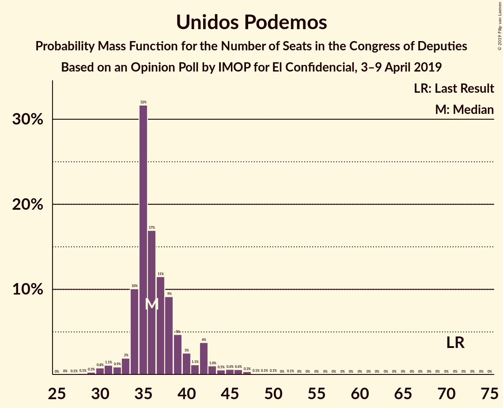
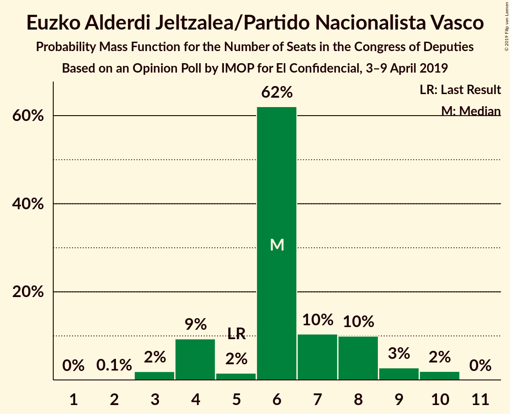
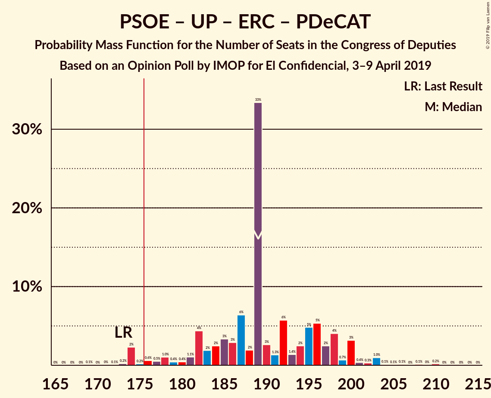
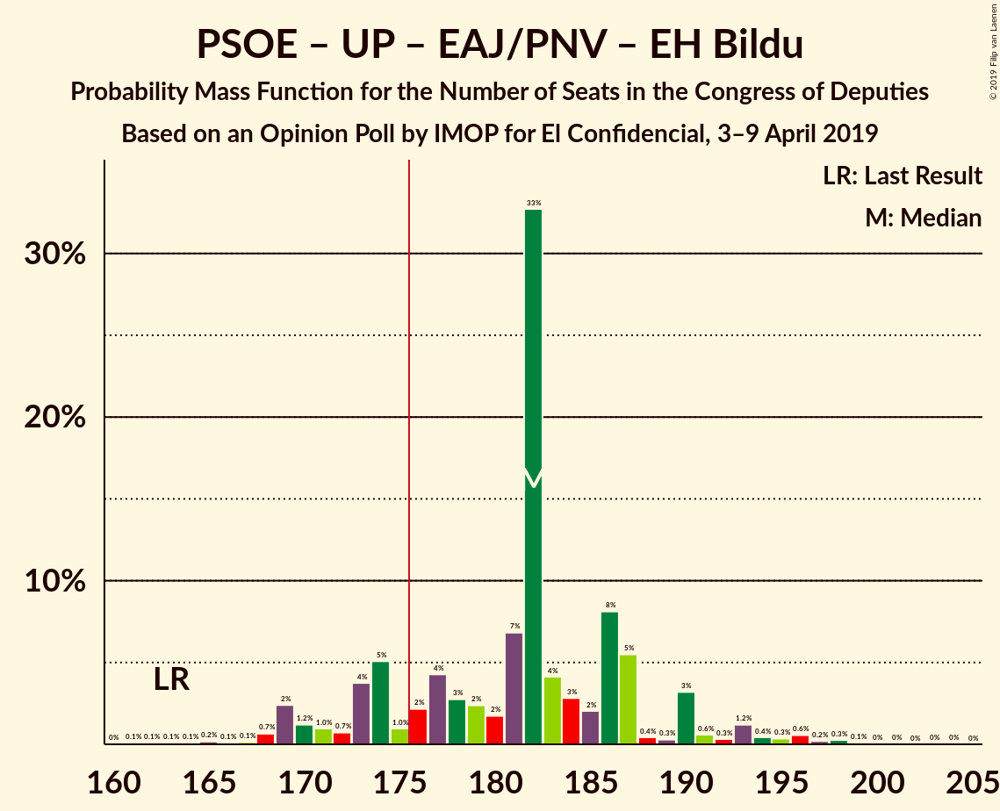

# Opinion Poll by IMOP for El Confidencial, 3–9 April 2019

<a href="#voting-intentions">Voting Intentions</a> | <a href="#seats">Seats</a> | <a href="#coalitions">Coalitions</a> | <a href="#technical-information">Technical Information</a>

## Voting Intentions

### Confidence Intervals

| Party | Last Result | Poll Result | 80% Confidence Interval | 90% Confidence Interval | 95% Confidence Interval | 99% Confidence Interval |
|:-----:|:-----------:|:-----------:|:-----------------------:|:-----------------------:|:-----------------------:|:-----------------------:|
| Partido Socialista Obrero Español | 22.6% | 31.0% | 29.4–32.6% |29.0–33.1% |28.6–33.5% |27.9–34.2% |
| Partido Popular | 33.0% | 19.4% | 18.1–20.8% |17.7–21.2% |17.4–21.6% |16.8–22.3% |
| Ciudadanos–Partido de la Ciudadanía | 13.1% | 16.0% | 14.8–17.3% |14.4–17.7% |14.2–18.0% |13.6–18.7% |
| Unidos Podemos | 21.2% | 14.0% | 12.9–15.3% |12.6–15.6% |12.3–15.9% |11.8–16.5% |
| Vox | 0.2% | 9.8% | 8.9–10.9% |8.6–11.2% |8.4–11.5% |7.9–12.0% |
| Esquerra Republicana de Catalunya–Catalunya Sí | 2.7% | 3.1% | 2.6–3.8% |2.5–4.0% |2.3–4.2% |2.1–4.5% |
| Partido Animalista Contra el Maltrato Animal | 1.2% | 1.5% | 1.1–2.0% |1.1–2.1% |1.0–2.3% |0.8–2.5% |
| Partit Demòcrata Europeu Català | 2.0% | 1.3% | 1.0–1.8% |0.9–1.9% |0.8–2.0% |0.7–2.3% |
| Euzko Alderdi Jeltzalea/Partido Nacionalista Vasco | 1.2% | 1.3% | 1.0–1.8% |0.9–1.9% |0.8–2.0% |0.7–2.3% |
| Euskal Herria Bildu | 0.8% | 0.8% | 0.5–1.2% |0.5–1.3% |0.4–1.4% |0.4–1.6% |

*Note:* The poll result column reflects the actual value used in the calculations. Published results may vary slightly, and in addition be rounded to fewer digits.

## Seats

### Confidence Intervals

| Party | Last Result | Median | 80% Confidence Interval | 90% Confidence Interval | 95% Confidence Interval | 99% Confidence Interval |
|:-----:|:-----------:|:------:|:-----------------------:|:-----------------------:|:-----------------------:|:-----------------------:|
| <a href="#partido-socialista-obrero-español">Partido Socialista Obrero Español</a> | 85 | 136 | 125–143 |123–144 |122–145 |117–148 |
| <a href="#partido-popular">Partido Popular</a> | 137 | 72 | 68–81 |66–84 |66–86 |62–87 |
| <a href="#ciudadanos–partido-de-la-ciudadanía">Ciudadanos–Partido de la Ciudadanía</a> | 32 | 50 | 49–58 |46–61 |45–62 |41–65 |
| <a href="#unidos-podemos">Unidos Podemos</a> | 71 | 36 | 34–40 |33–42 |32–43 |30–47 |
| <a href="#vox">Vox</a> | 0 | 24 | 19–27 |17–27 |16–28 |15–33 |
| <a href="#esquerra-republicana-de-catalunya–catalunya-sí">Esquerra Republicana de Catalunya–Catalunya Sí</a> | 9 | 14 | 11–15 |11–16 |10–16 |9–18 |
| <a href="#partido-animalista-contra-el-maltrato-animal">Partido Animalista Contra el Maltrato Animal</a> | 0 | 0 | 0–1 |0–1 |0–1 |0–1 |
| <a href="#partit-demòcrata-europeu-català">Partit Demòcrata Europeu Català</a> | 8 | 4 | 3–6 |3–7 |2–8 |1–9 |
| <a href="#euzko-alderdi-jeltzalea/partido-nacionalista-vasco">Euzko Alderdi Jeltzalea/Partido Nacionalista Vasco</a> | 5 | 6 | 4–8 |4–8 |4–9 |3–10 |
| <a href="#euskal-herria-bildu">Euskal Herria Bildu</a> | 2 | 4 | 1–5 |1–5 |1–6 |0–7 |

### Partido Socialista Obrero Español

*For a full overview of the results for this party, see the [Partido Socialista Obrero Español](party-partidosocialistaobreroespañol.html) page.*

| Number of Seats | Probability | Accumulated | Special Marks |
|:---------------:|:-----------:|:-----------:|:-------------:|
| 85 | 0% | 100% | Last Result |
| 86 | 0% | 100% |  |
| 87 | 0% | 100% |  |
| 88 | 0% | 100% |  |
| 89 | 0% | 100% |  |
| 90 | 0% | 100% |  |
| 91 | 0% | 100% |  |
| 92 | 0% | 100% |  |
| 93 | 0% | 100% |  |
| 94 | 0% | 100% |  |
| 95 | 0% | 100% |  |
| 96 | 0% | 100% |  |
| 97 | 0% | 100% |  |
| 98 | 0% | 100% |  |
| 99 | 0% | 100% |  |
| 100 | 0% | 100% |  |
| 101 | 0% | 100% |  |
| 102 | 0% | 100% |  |
| 103 | 0% | 100% |  |
| 104 | 0% | 100% |  |
| 105 | 0% | 100% |  |
| 106 | 0% | 100% |  |
| 107 | 0% | 100% |  |
| 108 | 0% | 100% |  |
| 109 | 0% | 100% |  |
| 110 | 0% | 100% |  |
| 111 | 0% | 100% |  |
| 112 | 0% | 100% |  |
| 113 | 0% | 100% |  |
| 114 | 0.1% | 100% |  |
| 115 | 0.2% | 99.9% |  |
| 116 | 0.2% | 99.7% |  |
| 117 | 0.2% | 99.5% |  |
| 118 | 0.2% | 99.3% |  |
| 119 | 0.5% | 99.1% |  |
| 120 | 0.2% | 98.6% |  |
| 121 | 0.7% | 98% |  |
| 122 | 3% | 98% |  |
| 123 | 0.5% | 95% |  |
| 124 | 3% | 95% |  |
| 125 | 2% | 91% |  |
| 126 | 0.3% | 90% |  |
| 127 | 0.4% | 89% |  |
| 128 | 2% | 89% |  |
| 129 | 6% | 87% |  |
| 130 | 2% | 81% |  |
| 131 | 3% | 79% |  |
| 132 | 3% | 76% |  |
| 133 | 1.2% | 73% |  |
| 134 | 2% | 72% |  |
| 135 | 1.2% | 70% |  |
| 136 | 36% | 69% | Median |
| 137 | 7% | 33% |  |
| 138 | 1.3% | 26% |  |
| 139 | 2% | 25% |  |
| 140 | 3% | 22% |  |
| 141 | 7% | 20% |  |
| 142 | 1.2% | 13% |  |
| 143 | 6% | 11% |  |
| 144 | 1.2% | 5% |  |
| 145 | 3% | 4% |  |
| 146 | 0.4% | 1.1% |  |
| 147 | 0.1% | 0.6% |  |
| 148 | 0.3% | 0.5% |  |
| 149 | 0.1% | 0.2% |  |
| 150 | 0.1% | 0.1% |  |
| 151 | 0% | 0.1% |  |
| 152 | 0% | 0% |  |

### Partido Popular

*For a full overview of the results for this party, see the [Partido Popular](party-partidopopular.html) page.*

| Number of Seats | Probability | Accumulated | Special Marks |
|:---------------:|:-----------:|:-----------:|:-------------:|
| 57 | 0% | 100% |  |
| 58 | 0% | 99.9% |  |
| 59 | 0% | 99.9% |  |
| 60 | 0% | 99.9% |  |
| 61 | 0.2% | 99.8% |  |
| 62 | 0.1% | 99.6% |  |
| 63 | 0.3% | 99.5% |  |
| 64 | 0.3% | 99.2% |  |
| 65 | 1.3% | 98.9% |  |
| 66 | 4% | 98% |  |
| 67 | 2% | 93% |  |
| 68 | 4% | 91% |  |
| 69 | 4% | 87% |  |
| 70 | 5% | 83% |  |
| 71 | 2% | 78% |  |
| 72 | 36% | 76% | Median |
| 73 | 3% | 39% |  |
| 74 | 5% | 37% |  |
| 75 | 2% | 31% |  |
| 76 | 1.0% | 29% |  |
| 77 | 4% | 28% |  |
| 78 | 2% | 24% |  |
| 79 | 4% | 23% |  |
| 80 | 3% | 19% |  |
| 81 | 6% | 15% |  |
| 82 | 2% | 10% |  |
| 83 | 0.9% | 7% |  |
| 84 | 2% | 6% |  |
| 85 | 2% | 5% |  |
| 86 | 1.2% | 3% |  |
| 87 | 1.4% | 2% |  |
| 88 | 0.2% | 0.4% |  |
| 89 | 0.1% | 0.2% |  |
| 90 | 0% | 0.1% |  |
| 91 | 0% | 0.1% |  |
| 92 | 0% | 0.1% |  |
| 93 | 0.1% | 0.1% |  |
| 94 | 0% | 0% |  |
| 95 | 0% | 0% |  |
| 96 | 0% | 0% |  |
| 97 | 0% | 0% |  |
| 98 | 0% | 0% |  |
| 99 | 0% | 0% |  |
| 100 | 0% | 0% |  |
| 101 | 0% | 0% |  |
| 102 | 0% | 0% |  |
| 103 | 0% | 0% |  |
| 104 | 0% | 0% |  |
| 105 | 0% | 0% |  |
| 106 | 0% | 0% |  |
| 107 | 0% | 0% |  |
| 108 | 0% | 0% |  |
| 109 | 0% | 0% |  |
| 110 | 0% | 0% |  |
| 111 | 0% | 0% |  |
| 112 | 0% | 0% |  |
| 113 | 0% | 0% |  |
| 114 | 0% | 0% |  |
| 115 | 0% | 0% |  |
| 116 | 0% | 0% |  |
| 117 | 0% | 0% |  |
| 118 | 0% | 0% |  |
| 119 | 0% | 0% |  |
| 120 | 0% | 0% |  |
| 121 | 0% | 0% |  |
| 122 | 0% | 0% |  |
| 123 | 0% | 0% |  |
| 124 | 0% | 0% |  |
| 125 | 0% | 0% |  |
| 126 | 0% | 0% |  |
| 127 | 0% | 0% |  |
| 128 | 0% | 0% |  |
| 129 | 0% | 0% |  |
| 130 | 0% | 0% |  |
| 131 | 0% | 0% |  |
| 132 | 0% | 0% |  |
| 133 | 0% | 0% |  |
| 134 | 0% | 0% |  |
| 135 | 0% | 0% |  |
| 136 | 0% | 0% |  |
| 137 | 0% | 0% | Last Result |

### Ciudadanos–Partido de la Ciudadanía

*For a full overview of the results for this party, see the [Ciudadanos–Partido de la Ciudadanía](party-ciudadanos–partidodelaciudadanía.html) page.*

| Number of Seats | Probability | Accumulated | Special Marks |
|:---------------:|:-----------:|:-----------:|:-------------:|
| 32 | 0% | 100% | Last Result |
| 33 | 0% | 100% |  |
| 34 | 0% | 100% |  |
| 35 | 0% | 100% |  |
| 36 | 0% | 100% |  |
| 37 | 0% | 100% |  |
| 38 | 0.1% | 99.9% |  |
| 39 | 0.1% | 99.8% |  |
| 40 | 0.2% | 99.7% |  |
| 41 | 0.2% | 99.6% |  |
| 42 | 0.2% | 99.4% |  |
| 43 | 0.5% | 99.1% |  |
| 44 | 1.0% | 98.7% |  |
| 45 | 1.4% | 98% |  |
| 46 | 4% | 96% |  |
| 47 | 0.6% | 93% |  |
| 48 | 2% | 92% |  |
| 49 | 5% | 91% |  |
| 50 | 36% | 85% | Median |
| 51 | 10% | 50% |  |
| 52 | 5% | 40% |  |
| 53 | 11% | 35% |  |
| 54 | 2% | 24% |  |
| 55 | 6% | 22% |  |
| 56 | 0.7% | 16% |  |
| 57 | 2% | 15% |  |
| 58 | 6% | 14% |  |
| 59 | 0.3% | 8% |  |
| 60 | 1.4% | 8% |  |
| 61 | 2% | 6% |  |
| 62 | 3% | 5% |  |
| 63 | 0.5% | 2% |  |
| 64 | 0.4% | 1.1% |  |
| 65 | 0.6% | 0.7% |  |
| 66 | 0.1% | 0.1% |  |
| 67 | 0% | 0% |  |

### Unidos Podemos

*For a full overview of the results for this party, see the [Unidos Podemos](party-unidospodemos.html) page.*

| Number of Seats | Probability | Accumulated | Special Marks |
|:---------------:|:-----------:|:-----------:|:-------------:|
| 26 | 0% | 100% |  |
| 27 | 0.1% | 99.9% |  |
| 28 | 0.1% | 99.9% |  |
| 29 | 0.3% | 99.8% |  |
| 30 | 0.8% | 99.5% |  |
| 31 | 1.1% | 98.7% |  |
| 32 | 0.9% | 98% |  |
| 33 | 2% | 97% |  |
| 34 | 10% | 95% |  |
| 35 | 32% | 85% |  |
| 36 | 17% | 53% | Median |
| 37 | 11% | 36% |  |
| 38 | 9% | 25% |  |
| 39 | 5% | 16% |  |
| 40 | 3% | 11% |  |
| 41 | 1.1% | 8% |  |
| 42 | 4% | 7% |  |
| 43 | 1.0% | 3% |  |
| 44 | 0.5% | 2% |  |
| 45 | 0.6% | 2% |  |
| 46 | 0.6% | 1.3% |  |
| 47 | 0.3% | 0.8% |  |
| 48 | 0.1% | 0.4% |  |
| 49 | 0.1% | 0.3% |  |
| 50 | 0.1% | 0.2% |  |
| 51 | 0% | 0.1% |  |
| 52 | 0.1% | 0.1% |  |
| 53 | 0% | 0% |  |
| 54 | 0% | 0% |  |
| 55 | 0% | 0% |  |
| 56 | 0% | 0% |  |
| 57 | 0% | 0% |  |
| 58 | 0% | 0% |  |
| 59 | 0% | 0% |  |
| 60 | 0% | 0% |  |
| 61 | 0% | 0% |  |
| 62 | 0% | 0% |  |
| 63 | 0% | 0% |  |
| 64 | 0% | 0% |  |
| 65 | 0% | 0% |  |
| 66 | 0% | 0% |  |
| 67 | 0% | 0% |  |
| 68 | 0% | 0% |  |
| 69 | 0% | 0% |  |
| 70 | 0% | 0% |  |
| 71 | 0% | 0% | Last Result |

### Vox

*For a full overview of the results for this party, see the [Vox](party-vox.html) page.*

| Number of Seats | Probability | Accumulated | Special Marks |
|:---------------:|:-----------:|:-----------:|:-------------:|
| 0 | 0% | 100% | Last Result |
| 1 | 0% | 100% |  |
| 2 | 0% | 100% |  |
| 3 | 0% | 100% |  |
| 4 | 0% | 100% |  |
| 5 | 0% | 100% |  |
| 6 | 0% | 100% |  |
| 7 | 0% | 100% |  |
| 8 | 0% | 100% |  |
| 9 | 0% | 100% |  |
| 10 | 0% | 100% |  |
| 11 | 0% | 100% |  |
| 12 | 0% | 100% |  |
| 13 | 0% | 100% |  |
| 14 | 0.4% | 100% |  |
| 15 | 1.1% | 99.5% |  |
| 16 | 1.3% | 98% |  |
| 17 | 4% | 97% |  |
| 18 | 2% | 93% |  |
| 19 | 14% | 91% |  |
| 20 | 4% | 78% |  |
| 21 | 3% | 74% |  |
| 22 | 5% | 71% |  |
| 23 | 10% | 66% |  |
| 24 | 7% | 56% | Median |
| 25 | 5% | 49% |  |
| 26 | 3% | 44% |  |
| 27 | 37% | 41% |  |
| 28 | 2% | 4% |  |
| 29 | 0.4% | 2% |  |
| 30 | 0.5% | 2% |  |
| 31 | 0.6% | 1.3% |  |
| 32 | 0.1% | 0.7% |  |
| 33 | 0.4% | 0.5% |  |
| 34 | 0.1% | 0.1% |  |
| 35 | 0% | 0% |  |

### Esquerra Republicana de Catalunya–Catalunya Sí

*For a full overview of the results for this party, see the [Esquerra Republicana de Catalunya–Catalunya Sí](party-esquerrarepublicanadecatalunya–catalunyasí.html) page.*

| Number of Seats | Probability | Accumulated | Special Marks |
|:---------------:|:-----------:|:-----------:|:-------------:|
| 8 | 0.1% | 100% |  |
| 9 | 1.2% | 99.9% | Last Result |
| 10 | 1.5% | 98.7% |  |
| 11 | 9% | 97% |  |
| 12 | 16% | 88% |  |
| 13 | 4% | 72% |  |
| 14 | 46% | 67% | Median |
| 15 | 14% | 21% |  |
| 16 | 5% | 7% |  |
| 17 | 1.0% | 2% |  |
| 18 | 0.4% | 0.9% |  |
| 19 | 0.2% | 0.4% |  |
| 20 | 0.2% | 0.2% |  |
| 21 | 0% | 0% |  |

### Partido Animalista Contra el Maltrato Animal

*For a full overview of the results for this party, see the [Partido Animalista Contra el Maltrato Animal](party-partidoanimalistacontraelmaltratoanimal.html) page.*

| Number of Seats | Probability | Accumulated | Special Marks |
|:---------------:|:-----------:|:-----------:|:-------------:|
| 0 | 89% | 100% | Last Result, Median |
| 1 | 11% | 11% |  |
| 2 | 0% | 0% |  |

### Partit Demòcrata Europeu Català

*For a full overview of the results for this party, see the [Partit Demòcrata Europeu Català](party-partitdemòcrataeuropeucatalà.html) page.*

| Number of Seats | Probability | Accumulated | Special Marks |
|:---------------:|:-----------:|:-----------:|:-------------:|
| 1 | 2% | 100% |  |
| 2 | 2% | 98% |  |
| 3 | 8% | 97% |  |
| 4 | 47% | 89% | Median |
| 5 | 22% | 43% |  |
| 6 | 14% | 21% |  |
| 7 | 2% | 7% |  |
| 8 | 4% | 4% | Last Result |
| 9 | 0.4% | 0.7% |  |
| 10 | 0.3% | 0.3% |  |
| 11 | 0% | 0% |  |

### Euzko Alderdi Jeltzalea/Partido Nacionalista Vasco

*For a full overview of the results for this party, see the [Euzko Alderdi Jeltzalea/Partido Nacionalista Vasco](party-euzkoalderdijeltzaleapartidonacionalistavasco.html) page.*

| Number of Seats | Probability | Accumulated | Special Marks |
|:---------------:|:-----------:|:-----------:|:-------------:|
| 2 | 0.1% | 100% |  |
| 3 | 2% | 99.9% |  |
| 4 | 9% | 98% |  |
| 5 | 2% | 89% | Last Result |
| 6 | 62% | 87% | Median |
| 7 | 10% | 25% |  |
| 8 | 10% | 15% |  |
| 9 | 3% | 5% |  |
| 10 | 2% | 2% |  |
| 11 | 0% | 0% |  |

### Euskal Herria Bildu

*For a full overview of the results for this party, see the [Euskal Herria Bildu](party-euskalherriabildu.html) page.*

| Number of Seats | Probability | Accumulated | Special Marks |
|:---------------:|:-----------:|:-----------:|:-------------:|
| 0 | 0.7% | 100% |  |
| 1 | 10% | 99.3% |  |
| 2 | 21% | 90% | Last Result |
| 3 | 17% | 69% |  |
| 4 | 9% | 51% | Median |
| 5 | 38% | 43% |  |
| 6 | 3% | 5% |  |
| 7 | 2% | 2% |  |
| 8 | 0% | 0% |  |

## Coalitions

### Confidence Intervals

| Coalition | Last Result | Median | Majority? | 80% Confidence Interval | 90% Confidence Interval | 95% Confidence Interval | 99% Confidence Interval |
|:---------:|:-----------:|:------:|:---------:|:-----------------------:|:-----------------------:|:-----------------------:|:-----------------------:|
| Partido Socialista Obrero Español – Partido Popular – Ciudadanos–Partido de la Ciudadanía | 254 | 259 | 100% | 257–268 | 254–270 | 252–270 | 249–273 |
| Partido Socialista Obrero Español – Ciudadanos–Partido de la Ciudadanía – Unidos Podemos | 188 | 221 | 100% | 216–232 | 214–234 | 211–236 | 208–239 |
| Partido Socialista Obrero Español – Partido Popular | 222 | 208 | 100% | 202–215 | 200–218 | 198–219 | 193–221 |
| Partido Socialista Obrero Español – Unidos Podemos – Esquerra Republicana de Catalunya–Catalunya Sí – Euzko Alderdi Jeltzalea/Partido Nacionalista Vasco – Partit Demòcrata Europeu Català – Euskal Herria Bildu | 180 | 200 | 100% | 191–206 | 189–209 | 185–209 | 184–215 |
| Partido Socialista Obrero Español – Unidos Podemos – Esquerra Republicana de Catalunya–Catalunya Sí – Partit Demòcrata Europeu Català | 173 | 189 | 97% | 182–198 | 178–200 | 174–200 | 174–206 |
| Partido Socialista Obrero Español – Unidos Podemos – Esquerra Republicana de Catalunya–Catalunya Sí – Euskal Herria Bildu | 167 | 190 | 96% | 180–197 | 177–198 | 173–199 | 172–205 |
| Partido Socialista Obrero Español – Ciudadanos–Partido de la Ciudadanía | 117 | 186 | 97% | 178–196 | 177–198 | 173–198 | 171–199 |
| Partido Socialista Obrero Español – Unidos Podemos – Euzko Alderdi Jeltzalea/Partido Nacionalista Vasco – Euskal Herria Bildu | 163 | 182 | 84% | 173–187 | 170–190 | 169–193 | 165–197 |
| Partido Socialista Obrero Español – Unidos Podemos – Euzko Alderdi Jeltzalea/Partido Nacionalista Vasco | 161 | 177 | 76% | 171–185 | 168–187 | 166–189 | 162–195 |
| Partido Socialista Obrero Español – Unidos Podemos | 156 | 171 | 23% | 165–179 | 162–181 | 158–183 | 156–189 |
| Partido Popular – Ciudadanos–Partido de la Ciudadanía – Vox | 169 | 149 | 0% | 143–158 | 140–160 | 139–164 | 133–165 |
| Partido Popular – Ciudadanos–Partido de la Ciudadanía – Euzko Alderdi Jeltzalea/Partido Nacionalista Vasco | 174 | 128 | 0% | 126–141 | 124–145 | 122–149 | 117–150 |
| Partido Socialista Obrero Español | 85 | 136 | 0% | 125–143 | 123–144 | 122–145 | 117–148 |
| Partido Popular – Ciudadanos–Partido de la Ciudadanía | 169 | 122 | 0% | 120–135 | 118–139 | 116–141 | 111–143 |
| Partido Popular – Vox | 137 | 99 | 0% | 90–106 | 89–107 | 86–109 | 84–112 |
| Partido Popular | 137 | 72 | 0% | 68–81 | 66–84 | 66–86 | 62–87 |

### Partido Socialista Obrero Español – Partido Popular – Ciudadanos–Partido de la Ciudadanía

| Number of Seats | Probability | Accumulated | Special Marks |
|:---------------:|:-----------:|:-----------:|:-------------:|
| 245 | 0.1% | 100% |  |
| 246 | 0% | 99.9% |  |
| 247 | 0% | 99.8% |  |
| 248 | 0.1% | 99.8% |  |
| 249 | 0.2% | 99.7% |  |
| 250 | 0.6% | 99.4% |  |
| 251 | 1.2% | 98.9% |  |
| 252 | 0.8% | 98% |  |
| 253 | 2% | 97% |  |
| 254 | 0.6% | 95% | Last Result |
| 255 | 2% | 94% |  |
| 256 | 2% | 92% |  |
| 257 | 3% | 90% |  |
| 258 | 36% | 87% | Median |
| 259 | 4% | 51% |  |
| 260 | 4% | 47% |  |
| 261 | 5% | 42% |  |
| 262 | 4% | 37% |  |
| 263 | 6% | 34% |  |
| 264 | 4% | 28% |  |
| 265 | 2% | 23% |  |
| 266 | 5% | 22% |  |
| 267 | 1.0% | 16% |  |
| 268 | 7% | 15% |  |
| 269 | 1.4% | 9% |  |
| 270 | 6% | 7% |  |
| 271 | 0.5% | 1.3% |  |
| 272 | 0.1% | 0.8% |  |
| 273 | 0.2% | 0.6% |  |
| 274 | 0% | 0.4% |  |
| 275 | 0% | 0.4% |  |
| 276 | 0.3% | 0.3% |  |
| 277 | 0% | 0% |  |

### Partido Socialista Obrero Español – Ciudadanos–Partido de la Ciudadanía – Unidos Podemos

| Number of Seats | Probability | Accumulated | Special Marks |
|:---------------:|:-----------:|:-----------:|:-------------:|
| 188 | 0% | 100% | Last Result |
| 189 | 0% | 100% |  |
| 190 | 0% | 100% |  |
| 191 | 0% | 100% |  |
| 192 | 0% | 100% |  |
| 193 | 0% | 100% |  |
| 194 | 0% | 100% |  |
| 195 | 0% | 100% |  |
| 196 | 0% | 100% |  |
| 197 | 0% | 100% |  |
| 198 | 0% | 100% |  |
| 199 | 0% | 100% |  |
| 200 | 0% | 100% |  |
| 201 | 0% | 100% |  |
| 202 | 0% | 100% |  |
| 203 | 0% | 100% |  |
| 204 | 0% | 100% |  |
| 205 | 0% | 100% |  |
| 206 | 0% | 99.9% |  |
| 207 | 0.1% | 99.9% |  |
| 208 | 0.5% | 99.8% |  |
| 209 | 1.4% | 99.3% |  |
| 210 | 0.2% | 98% |  |
| 211 | 0.5% | 98% |  |
| 212 | 0.5% | 97% |  |
| 213 | 0.4% | 97% |  |
| 214 | 1.5% | 96% |  |
| 215 | 4% | 95% |  |
| 216 | 2% | 91% |  |
| 217 | 1.3% | 88% |  |
| 218 | 0.7% | 87% |  |
| 219 | 6% | 86% |  |
| 220 | 4% | 80% |  |
| 221 | 31% | 76% |  |
| 222 | 3% | 45% | Median |
| 223 | 3% | 42% |  |
| 224 | 4% | 38% |  |
| 225 | 1.2% | 35% |  |
| 226 | 0.9% | 33% |  |
| 227 | 3% | 32% |  |
| 228 | 7% | 29% |  |
| 229 | 0.7% | 22% |  |
| 230 | 5% | 22% |  |
| 231 | 3% | 17% |  |
| 232 | 4% | 14% |  |
| 233 | 1.3% | 9% |  |
| 234 | 5% | 8% |  |
| 235 | 0.9% | 4% |  |
| 236 | 1.4% | 3% |  |
| 237 | 0.3% | 1.2% |  |
| 238 | 0.4% | 1.0% |  |
| 239 | 0.1% | 0.5% |  |
| 240 | 0.3% | 0.4% |  |
| 241 | 0% | 0.1% |  |
| 242 | 0% | 0.1% |  |
| 243 | 0% | 0.1% |  |
| 244 | 0% | 0.1% |  |
| 245 | 0% | 0% |  |

### Partido Socialista Obrero Español – Partido Popular

| Number of Seats | Probability | Accumulated | Special Marks |
|:---------------:|:-----------:|:-----------:|:-------------:|
| 188 | 0.1% | 100% |  |
| 189 | 0% | 99.9% |  |
| 190 | 0.1% | 99.9% |  |
| 191 | 0.1% | 99.8% |  |
| 192 | 0.1% | 99.7% |  |
| 193 | 0.1% | 99.5% |  |
| 194 | 0.2% | 99.5% |  |
| 195 | 0.6% | 99.3% |  |
| 196 | 0.2% | 98.7% |  |
| 197 | 0.6% | 98% |  |
| 198 | 2% | 98% |  |
| 199 | 1.1% | 96% |  |
| 200 | 1.1% | 95% |  |
| 201 | 3% | 94% |  |
| 202 | 2% | 91% |  |
| 203 | 1.0% | 90% |  |
| 204 | 1.3% | 89% |  |
| 205 | 4% | 87% |  |
| 206 | 3% | 83% |  |
| 207 | 5% | 80% |  |
| 208 | 31% | 75% | Median |
| 209 | 6% | 43% |  |
| 210 | 10% | 37% |  |
| 211 | 2% | 27% |  |
| 212 | 3% | 25% |  |
| 213 | 5% | 22% |  |
| 214 | 0.8% | 18% |  |
| 215 | 8% | 17% |  |
| 216 | 1.4% | 8% |  |
| 217 | 2% | 7% |  |
| 218 | 3% | 5% |  |
| 219 | 0.6% | 3% |  |
| 220 | 1.4% | 2% |  |
| 221 | 0.3% | 0.7% |  |
| 222 | 0.1% | 0.4% | Last Result |
| 223 | 0.1% | 0.3% |  |
| 224 | 0.1% | 0.1% |  |
| 225 | 0% | 0.1% |  |
| 226 | 0% | 0.1% |  |
| 227 | 0% | 0% |  |

### Partido Socialista Obrero Español – Unidos Podemos – Esquerra Republicana de Catalunya–Catalunya Sí – Euzko Alderdi Jeltzalea/Partido Nacionalista Vasco – Partit Demòcrata Europeu Català – Euskal Herria Bildu

| Number of Seats | Probability | Accumulated | Special Marks |
|:---------------:|:-----------:|:-----------:|:-------------:|
| 179 | 0.1% | 100% |  |
| 180 | 0% | 99.9% | Last Result |
| 181 | 0% | 99.9% |  |
| 182 | 0.1% | 99.8% |  |
| 183 | 0.2% | 99.7% |  |
| 184 | 0.1% | 99.5% |  |
| 185 | 2% | 99.4% |  |
| 186 | 1.4% | 97% |  |
| 187 | 0.2% | 96% |  |
| 188 | 0.1% | 95% |  |
| 189 | 1.3% | 95% |  |
| 190 | 3% | 94% |  |
| 191 | 2% | 91% |  |
| 192 | 2% | 89% |  |
| 193 | 3% | 87% |  |
| 194 | 2% | 84% |  |
| 195 | 3% | 82% |  |
| 196 | 0.8% | 78% |  |
| 197 | 4% | 78% |  |
| 198 | 6% | 74% |  |
| 199 | 3% | 68% |  |
| 200 | 31% | 65% | Median |
| 201 | 3% | 34% |  |
| 202 | 5% | 32% |  |
| 203 | 9% | 26% |  |
| 204 | 4% | 18% |  |
| 205 | 2% | 14% |  |
| 206 | 4% | 12% |  |
| 207 | 0.8% | 8% |  |
| 208 | 1.2% | 8% |  |
| 209 | 4% | 6% |  |
| 210 | 0.5% | 2% |  |
| 211 | 0.4% | 2% |  |
| 212 | 0.3% | 2% |  |
| 213 | 0.6% | 1.3% |  |
| 214 | 0.1% | 0.7% |  |
| 215 | 0.1% | 0.6% |  |
| 216 | 0.2% | 0.5% |  |
| 217 | 0.2% | 0.3% |  |
| 218 | 0% | 0.1% |  |
| 219 | 0% | 0.1% |  |
| 220 | 0% | 0% |  |

### Partido Socialista Obrero Español – Unidos Podemos – Esquerra Republicana de Catalunya–Catalunya Sí – Partit Demòcrata Europeu Català

| Number of Seats | Probability | Accumulated | Special Marks |
|:---------------:|:-----------:|:-----------:|:-------------:|
| 169 | 0.1% | 100% |  |
| 170 | 0% | 99.9% |  |
| 171 | 0% | 99.9% |  |
| 172 | 0.1% | 99.9% |  |
| 173 | 0.2% | 99.8% | Last Result |
| 174 | 2% | 99.6% |  |
| 175 | 0.2% | 97% |  |
| 176 | 0.6% | 97% | Majority |
| 177 | 0.5% | 96% |  |
| 178 | 1.0% | 96% |  |
| 179 | 0.4% | 95% |  |
| 180 | 0.4% | 95% |  |
| 181 | 1.1% | 94% |  |
| 182 | 4% | 93% |  |
| 183 | 2% | 89% |  |
| 184 | 2% | 87% |  |
| 185 | 3% | 84% |  |
| 186 | 3% | 81% |  |
| 187 | 6% | 78% |  |
| 188 | 2% | 72% |  |
| 189 | 33% | 70% |  |
| 190 | 3% | 36% | Median |
| 191 | 1.3% | 34% |  |
| 192 | 6% | 32% |  |
| 193 | 1.4% | 27% |  |
| 194 | 2% | 25% |  |
| 195 | 5% | 23% |  |
| 196 | 5% | 18% |  |
| 197 | 2% | 13% |  |
| 198 | 4% | 10% |  |
| 199 | 0.7% | 6% |  |
| 200 | 3% | 6% |  |
| 201 | 0.4% | 2% |  |
| 202 | 0.3% | 2% |  |
| 203 | 1.0% | 2% |  |
| 204 | 0.1% | 0.7% |  |
| 205 | 0.1% | 0.6% |  |
| 206 | 0.1% | 0.5% |  |
| 207 | 0% | 0.4% |  |
| 208 | 0.1% | 0.4% |  |
| 209 | 0% | 0.3% |  |
| 210 | 0.2% | 0.2% |  |
| 211 | 0% | 0% |  |

### Partido Socialista Obrero Español – Unidos Podemos – Esquerra Republicana de Catalunya–Catalunya Sí – Euskal Herria Bildu

| Number of Seats | Probability | Accumulated | Special Marks |
|:---------------:|:-----------:|:-----------:|:-------------:|
| 166 | 0.1% | 100% |  |
| 167 | 0% | 99.9% | Last Result |
| 168 | 0.1% | 99.9% |  |
| 169 | 0.1% | 99.9% |  |
| 170 | 0.1% | 99.8% |  |
| 171 | 0.1% | 99.7% |  |
| 172 | 0.1% | 99.6% |  |
| 173 | 3% | 99.5% |  |
| 174 | 0.2% | 97% |  |
| 175 | 0.3% | 97% |  |
| 176 | 0.9% | 96% | Majority |
| 177 | 0.4% | 95% |  |
| 178 | 0.4% | 95% |  |
| 179 | 1.0% | 95% |  |
| 180 | 4% | 94% |  |
| 181 | 3% | 89% |  |
| 182 | 2% | 86% |  |
| 183 | 3% | 84% |  |
| 184 | 3% | 81% |  |
| 185 | 7% | 78% |  |
| 186 | 3% | 71% |  |
| 187 | 2% | 68% |  |
| 188 | 2% | 66% |  |
| 189 | 2% | 63% |  |
| 190 | 31% | 62% | Median |
| 191 | 5% | 31% |  |
| 192 | 4% | 26% |  |
| 193 | 7% | 22% |  |
| 194 | 3% | 15% |  |
| 195 | 0.8% | 12% |  |
| 196 | 0.6% | 11% |  |
| 197 | 3% | 11% |  |
| 198 | 4% | 7% |  |
| 199 | 1.4% | 3% |  |
| 200 | 0.3% | 2% |  |
| 201 | 0.6% | 2% |  |
| 202 | 0.3% | 1.1% |  |
| 203 | 0.1% | 0.8% |  |
| 204 | 0.1% | 0.7% |  |
| 205 | 0.2% | 0.6% |  |
| 206 | 0.1% | 0.4% |  |
| 207 | 0.2% | 0.3% |  |
| 208 | 0% | 0.1% |  |
| 209 | 0% | 0.1% |  |
| 210 | 0% | 0% |  |

### Partido Socialista Obrero Español – Ciudadanos–Partido de la Ciudadanía

| Number of Seats | Probability | Accumulated | Special Marks |
|:---------------:|:-----------:|:-----------:|:-------------:|
| 117 | 0% | 100% | Last Result |
| 118 | 0% | 100% |  |
| 119 | 0% | 100% |  |
| 120 | 0% | 100% |  |
| 121 | 0% | 100% |  |
| 122 | 0% | 100% |  |
| 123 | 0% | 100% |  |
| 124 | 0% | 100% |  |
| 125 | 0% | 100% |  |
| 126 | 0% | 100% |  |
| 127 | 0% | 100% |  |
| 128 | 0% | 100% |  |
| 129 | 0% | 100% |  |
| 130 | 0% | 100% |  |
| 131 | 0% | 100% |  |
| 132 | 0% | 100% |  |
| 133 | 0% | 100% |  |
| 134 | 0% | 100% |  |
| 135 | 0% | 100% |  |
| 136 | 0% | 100% |  |
| 137 | 0% | 100% |  |
| 138 | 0% | 100% |  |
| 139 | 0% | 100% |  |
| 140 | 0% | 100% |  |
| 141 | 0% | 100% |  |
| 142 | 0% | 100% |  |
| 143 | 0% | 100% |  |
| 144 | 0% | 100% |  |
| 145 | 0% | 100% |  |
| 146 | 0% | 100% |  |
| 147 | 0% | 100% |  |
| 148 | 0% | 100% |  |
| 149 | 0% | 100% |  |
| 150 | 0% | 100% |  |
| 151 | 0% | 100% |  |
| 152 | 0% | 100% |  |
| 153 | 0% | 100% |  |
| 154 | 0% | 100% |  |
| 155 | 0% | 100% |  |
| 156 | 0% | 100% |  |
| 157 | 0% | 100% |  |
| 158 | 0% | 100% |  |
| 159 | 0% | 100% |  |
| 160 | 0% | 100% |  |
| 161 | 0% | 100% |  |
| 162 | 0% | 100% |  |
| 163 | 0% | 100% |  |
| 164 | 0% | 100% |  |
| 165 | 0% | 100% |  |
| 166 | 0% | 100% |  |
| 167 | 0% | 100% |  |
| 168 | 0% | 99.9% |  |
| 169 | 0% | 99.9% |  |
| 170 | 0.1% | 99.9% |  |
| 171 | 2% | 99.8% |  |
| 172 | 0.3% | 98% |  |
| 173 | 0.3% | 98% |  |
| 174 | 0.3% | 97% |  |
| 175 | 0.4% | 97% |  |
| 176 | 0.5% | 97% | Majority |
| 177 | 5% | 96% |  |
| 178 | 3% | 91% |  |
| 179 | 1.3% | 88% |  |
| 180 | 3% | 87% |  |
| 181 | 1.1% | 84% |  |
| 182 | 2% | 83% |  |
| 183 | 3% | 81% |  |
| 184 | 5% | 78% |  |
| 185 | 2% | 73% |  |
| 186 | 31% | 71% | Median |
| 187 | 2% | 40% |  |
| 188 | 1.0% | 37% |  |
| 189 | 3% | 36% |  |
| 190 | 3% | 34% |  |
| 191 | 2% | 31% |  |
| 192 | 5% | 28% |  |
| 193 | 4% | 24% |  |
| 194 | 9% | 20% |  |
| 195 | 0.9% | 11% |  |
| 196 | 4% | 11% |  |
| 197 | 0.8% | 7% |  |
| 198 | 5% | 6% |  |
| 199 | 0.6% | 1.0% |  |
| 200 | 0.1% | 0.4% |  |
| 201 | 0.1% | 0.3% |  |
| 202 | 0.1% | 0.2% |  |
| 203 | 0.1% | 0.2% |  |
| 204 | 0.1% | 0.1% |  |
| 205 | 0% | 0% |  |

### Partido Socialista Obrero Español – Unidos Podemos – Euzko Alderdi Jeltzalea/Partido Nacionalista Vasco – Euskal Herria Bildu

| Number of Seats | Probability | Accumulated | Special Marks |
|:---------------:|:-----------:|:-----------:|:-------------:|
| 161 | 0.1% | 100% |  |
| 162 | 0.1% | 99.9% |  |
| 163 | 0.1% | 99.8% | Last Result |
| 164 | 0.1% | 99.7% |  |
| 165 | 0.2% | 99.6% |  |
| 166 | 0.1% | 99.5% |  |
| 167 | 0.1% | 99.4% |  |
| 168 | 0.7% | 99.2% |  |
| 169 | 2% | 98.6% |  |
| 170 | 1.2% | 96% |  |
| 171 | 1.0% | 95% |  |
| 172 | 0.7% | 94% |  |
| 173 | 4% | 93% |  |
| 174 | 5% | 90% |  |
| 175 | 1.0% | 84% |  |
| 176 | 2% | 84% | Majority |
| 177 | 4% | 81% |  |
| 178 | 3% | 77% |  |
| 179 | 2% | 74% |  |
| 180 | 2% | 72% |  |
| 181 | 7% | 70% |  |
| 182 | 33% | 63% | Median |
| 183 | 4% | 31% |  |
| 184 | 3% | 27% |  |
| 185 | 2% | 24% |  |
| 186 | 8% | 22% |  |
| 187 | 5% | 14% |  |
| 188 | 0.4% | 8% |  |
| 189 | 0.3% | 8% |  |
| 190 | 3% | 7% |  |
| 191 | 0.6% | 4% |  |
| 192 | 0.3% | 4% |  |
| 193 | 1.2% | 3% |  |
| 194 | 0.4% | 2% |  |
| 195 | 0.3% | 2% |  |
| 196 | 0.6% | 1.2% |  |
| 197 | 0.2% | 0.6% |  |
| 198 | 0.3% | 0.4% |  |
| 199 | 0.1% | 0.2% |  |
| 200 | 0% | 0.1% |  |
| 201 | 0% | 0.1% |  |
| 202 | 0% | 0% |  |

### Partido Socialista Obrero Español – Unidos Podemos – Euzko Alderdi Jeltzalea/Partido Nacionalista Vasco

| Number of Seats | Probability | Accumulated | Special Marks |
|:---------------:|:-----------:|:-----------:|:-------------:|
| 158 | 0.1% | 100% |  |
| 159 | 0.1% | 99.9% |  |
| 160 | 0.1% | 99.8% |  |
| 161 | 0.2% | 99.7% | Last Result |
| 162 | 0.1% | 99.5% |  |
| 163 | 0.1% | 99.4% |  |
| 164 | 0.2% | 99.3% |  |
| 165 | 0.7% | 99.1% |  |
| 166 | 3% | 98% |  |
| 167 | 0.4% | 96% |  |
| 168 | 1.4% | 95% |  |
| 169 | 1.2% | 94% |  |
| 170 | 0.4% | 93% |  |
| 171 | 5% | 92% |  |
| 172 | 7% | 88% |  |
| 173 | 2% | 81% |  |
| 174 | 0.8% | 79% |  |
| 175 | 2% | 78% |  |
| 176 | 4% | 76% | Majority |
| 177 | 30% | 72% |  |
| 178 | 8% | 41% | Median |
| 179 | 5% | 33% |  |
| 180 | 3% | 28% |  |
| 181 | 3% | 25% |  |
| 182 | 0.5% | 23% |  |
| 183 | 7% | 22% |  |
| 184 | 3% | 16% |  |
| 185 | 5% | 13% |  |
| 186 | 0.7% | 7% |  |
| 187 | 3% | 7% |  |
| 188 | 0.9% | 4% |  |
| 189 | 0.4% | 3% |  |
| 190 | 0.3% | 2% |  |
| 191 | 0.3% | 2% |  |
| 192 | 0.2% | 2% |  |
| 193 | 0.4% | 1.4% |  |
| 194 | 0.1% | 1.0% |  |
| 195 | 0.5% | 0.9% |  |
| 196 | 0.3% | 0.4% |  |
| 197 | 0.1% | 0.1% |  |
| 198 | 0% | 0.1% |  |
| 199 | 0% | 0% |  |

### Partido Socialista Obrero Español – Unidos Podemos

| Number of Seats | Probability | Accumulated | Special Marks |
|:---------------:|:-----------:|:-----------:|:-------------:|
| 151 | 0.1% | 100% |  |
| 152 | 0% | 99.9% |  |
| 153 | 0.1% | 99.9% |  |
| 154 | 0.1% | 99.8% |  |
| 155 | 0.1% | 99.7% |  |
| 156 | 0.2% | 99.6% | Last Result |
| 157 | 0.3% | 99.4% |  |
| 158 | 3% | 99.1% |  |
| 159 | 0.7% | 96% |  |
| 160 | 0.3% | 96% |  |
| 161 | 0.2% | 95% |  |
| 162 | 1.4% | 95% |  |
| 163 | 2% | 94% |  |
| 164 | 0.9% | 92% |  |
| 165 | 3% | 91% |  |
| 166 | 6% | 88% |  |
| 167 | 2% | 81% |  |
| 168 | 3% | 80% |  |
| 169 | 4% | 77% |  |
| 170 | 7% | 73% |  |
| 171 | 32% | 66% |  |
| 172 | 3% | 35% | Median |
| 173 | 5% | 32% |  |
| 174 | 3% | 27% |  |
| 175 | 1.3% | 24% |  |
| 176 | 1.2% | 23% | Majority |
| 177 | 2% | 22% |  |
| 178 | 5% | 20% |  |
| 179 | 8% | 15% |  |
| 180 | 0.7% | 7% |  |
| 181 | 3% | 7% |  |
| 182 | 0.9% | 3% |  |
| 183 | 0.3% | 3% |  |
| 184 | 0.4% | 2% |  |
| 185 | 0.2% | 2% |  |
| 186 | 0.7% | 2% |  |
| 187 | 0.4% | 1.0% |  |
| 188 | 0.1% | 0.6% |  |
| 189 | 0.1% | 0.5% |  |
| 190 | 0.1% | 0.4% |  |
| 191 | 0.2% | 0.3% |  |
| 192 | 0% | 0.1% |  |
| 193 | 0% | 0% |  |

### Partido Popular – Ciudadanos–Partido de la Ciudadanía – Vox

| Number of Seats | Probability | Accumulated | Special Marks |
|:---------------:|:-----------:|:-----------:|:-------------:|
| 130 | 0% | 100% |  |
| 131 | 0% | 99.9% |  |
| 132 | 0.2% | 99.9% |  |
| 133 | 0.2% | 99.7% |  |
| 134 | 0% | 99.5% |  |
| 135 | 0.1% | 99.4% |  |
| 136 | 0.7% | 99.3% |  |
| 137 | 0.5% | 98.6% |  |
| 138 | 0.3% | 98% |  |
| 139 | 1.2% | 98% |  |
| 140 | 4% | 97% |  |
| 141 | 0.5% | 93% |  |
| 142 | 0.8% | 92% |  |
| 143 | 4% | 92% |  |
| 144 | 3% | 88% |  |
| 145 | 2% | 84% |  |
| 146 | 8% | 82% | Median |
| 147 | 6% | 74% |  |
| 148 | 3% | 68% |  |
| 149 | 31% | 65% |  |
| 150 | 3% | 34% |  |
| 151 | 6% | 31% |  |
| 152 | 4% | 26% |  |
| 153 | 0.5% | 22% |  |
| 154 | 4% | 21% |  |
| 155 | 2% | 18% |  |
| 156 | 3% | 15% |  |
| 157 | 2% | 13% |  |
| 158 | 2% | 11% |  |
| 159 | 3% | 9% |  |
| 160 | 1.2% | 6% |  |
| 161 | 0.2% | 5% |  |
| 162 | 1.3% | 4% |  |
| 163 | 0.2% | 3% |  |
| 164 | 2% | 3% |  |
| 165 | 0.1% | 0.5% |  |
| 166 | 0.1% | 0.4% |  |
| 167 | 0.1% | 0.3% |  |
| 168 | 0% | 0.2% |  |
| 169 | 0% | 0.1% | Last Result |
| 170 | 0.1% | 0.1% |  |
| 171 | 0% | 0% |  |

### Partido Popular – Ciudadanos–Partido de la Ciudadanía – Euzko Alderdi Jeltzalea/Partido Nacionalista Vasco

| Number of Seats | Probability | Accumulated | Special Marks |
|:---------------:|:-----------:|:-----------:|:-------------:|
| 113 | 0% | 100% |  |
| 114 | 0% | 99.9% |  |
| 115 | 0.1% | 99.9% |  |
| 116 | 0.1% | 99.9% |  |
| 117 | 0.3% | 99.7% |  |
| 118 | 0.3% | 99.4% |  |
| 119 | 0.1% | 99.1% |  |
| 120 | 0.5% | 99.0% |  |
| 121 | 0.4% | 98% |  |
| 122 | 0.7% | 98% |  |
| 123 | 1.0% | 97% |  |
| 124 | 2% | 96% |  |
| 125 | 3% | 94% |  |
| 126 | 4% | 91% |  |
| 127 | 7% | 87% |  |
| 128 | 30% | 80% | Median |
| 129 | 2% | 50% |  |
| 130 | 2% | 48% |  |
| 131 | 5% | 46% |  |
| 132 | 1.0% | 41% |  |
| 133 | 7% | 40% |  |
| 134 | 3% | 33% |  |
| 135 | 3% | 30% |  |
| 136 | 2% | 27% |  |
| 137 | 2% | 25% |  |
| 138 | 1.0% | 23% |  |
| 139 | 3% | 22% |  |
| 140 | 8% | 19% |  |
| 141 | 3% | 11% |  |
| 142 | 0.6% | 8% |  |
| 143 | 0.4% | 7% |  |
| 144 | 1.2% | 7% |  |
| 145 | 2% | 6% |  |
| 146 | 0.2% | 4% |  |
| 147 | 0.3% | 4% |  |
| 148 | 0.3% | 3% |  |
| 149 | 3% | 3% |  |
| 150 | 0.2% | 0.6% |  |
| 151 | 0.2% | 0.4% |  |
| 152 | 0.1% | 0.2% |  |
| 153 | 0% | 0.1% |  |
| 154 | 0% | 0.1% |  |
| 155 | 0.1% | 0.1% |  |
| 156 | 0% | 0% |  |
| 157 | 0% | 0% |  |
| 158 | 0% | 0% |  |
| 159 | 0% | 0% |  |
| 160 | 0% | 0% |  |
| 161 | 0% | 0% |  |
| 162 | 0% | 0% |  |
| 163 | 0% | 0% |  |
| 164 | 0% | 0% |  |
| 165 | 0% | 0% |  |
| 166 | 0% | 0% |  |
| 167 | 0% | 0% |  |
| 168 | 0% | 0% |  |
| 169 | 0% | 0% |  |
| 170 | 0% | 0% |  |
| 171 | 0% | 0% |  |
| 172 | 0% | 0% |  |
| 173 | 0% | 0% |  |
| 174 | 0% | 0% | Last Result |

### Partido Socialista Obrero Español

| Number of Seats | Probability | Accumulated | Special Marks |
|:---------------:|:-----------:|:-----------:|:-------------:|
| 85 | 0% | 100% | Last Result |
| 86 | 0% | 100% |  |
| 87 | 0% | 100% |  |
| 88 | 0% | 100% |  |
| 89 | 0% | 100% |  |
| 90 | 0% | 100% |  |
| 91 | 0% | 100% |  |
| 92 | 0% | 100% |  |
| 93 | 0% | 100% |  |
| 94 | 0% | 100% |  |
| 95 | 0% | 100% |  |
| 96 | 0% | 100% |  |
| 97 | 0% | 100% |  |
| 98 | 0% | 100% |  |
| 99 | 0% | 100% |  |
| 100 | 0% | 100% |  |
| 101 | 0% | 100% |  |
| 102 | 0% | 100% |  |
| 103 | 0% | 100% |  |
| 104 | 0% | 100% |  |
| 105 | 0% | 100% |  |
| 106 | 0% | 100% |  |
| 107 | 0% | 100% |  |
| 108 | 0% | 100% |  |
| 109 | 0% | 100% |  |
| 110 | 0% | 100% |  |
| 111 | 0% | 100% |  |
| 112 | 0% | 100% |  |
| 113 | 0% | 100% |  |
| 114 | 0.1% | 100% |  |
| 115 | 0.2% | 99.9% |  |
| 116 | 0.2% | 99.7% |  |
| 117 | 0.2% | 99.5% |  |
| 118 | 0.2% | 99.3% |  |
| 119 | 0.5% | 99.1% |  |
| 120 | 0.2% | 98.6% |  |
| 121 | 0.7% | 98% |  |
| 122 | 3% | 98% |  |
| 123 | 0.5% | 95% |  |
| 124 | 3% | 95% |  |
| 125 | 2% | 91% |  |
| 126 | 0.3% | 90% |  |
| 127 | 0.4% | 89% |  |
| 128 | 2% | 89% |  |
| 129 | 6% | 87% |  |
| 130 | 2% | 81% |  |
| 131 | 3% | 79% |  |
| 132 | 3% | 76% |  |
| 133 | 1.2% | 73% |  |
| 134 | 2% | 72% |  |
| 135 | 1.2% | 70% |  |
| 136 | 36% | 69% | Median |
| 137 | 7% | 33% |  |
| 138 | 1.3% | 26% |  |
| 139 | 2% | 25% |  |
| 140 | 3% | 22% |  |
| 141 | 7% | 20% |  |
| 142 | 1.2% | 13% |  |
| 143 | 6% | 11% |  |
| 144 | 1.2% | 5% |  |
| 145 | 3% | 4% |  |
| 146 | 0.4% | 1.1% |  |
| 147 | 0.1% | 0.6% |  |
| 148 | 0.3% | 0.5% |  |
| 149 | 0.1% | 0.2% |  |
| 150 | 0.1% | 0.1% |  |
| 151 | 0% | 0.1% |  |
| 152 | 0% | 0% |  |

### Partido Popular – Ciudadanos–Partido de la Ciudadanía

| Number of Seats | Probability | Accumulated | Special Marks |
|:---------------:|:-----------:|:-----------:|:-------------:|
| 107 | 0% | 100% |  |
| 108 | 0% | 99.9% |  |
| 109 | 0% | 99.9% |  |
| 110 | 0% | 99.9% |  |
| 111 | 0.5% | 99.8% |  |
| 112 | 0.2% | 99.4% |  |
| 113 | 0.2% | 99.2% |  |
| 114 | 0.6% | 99.0% |  |
| 115 | 0.7% | 98% |  |
| 116 | 0.4% | 98% |  |
| 117 | 2% | 97% |  |
| 118 | 0.8% | 96% |  |
| 119 | 3% | 95% |  |
| 120 | 8% | 92% |  |
| 121 | 5% | 84% |  |
| 122 | 30% | 80% | Median |
| 123 | 2% | 50% |  |
| 124 | 2% | 48% |  |
| 125 | 1.3% | 46% |  |
| 126 | 2% | 44% |  |
| 127 | 12% | 43% |  |
| 128 | 2% | 31% |  |
| 129 | 3% | 29% |  |
| 130 | 2% | 26% |  |
| 131 | 1.4% | 24% |  |
| 132 | 5% | 22% |  |
| 133 | 3% | 17% |  |
| 134 | 3% | 14% |  |
| 135 | 3% | 11% |  |
| 136 | 0.5% | 8% |  |
| 137 | 2% | 8% |  |
| 138 | 0.5% | 6% |  |
| 139 | 2% | 5% |  |
| 140 | 0.2% | 4% |  |
| 141 | 2% | 3% |  |
| 142 | 0.3% | 1.0% |  |
| 143 | 0.3% | 0.7% |  |
| 144 | 0% | 0.4% |  |
| 145 | 0.2% | 0.4% |  |
| 146 | 0% | 0.2% |  |
| 147 | 0.1% | 0.2% |  |
| 148 | 0.1% | 0.1% |  |
| 149 | 0% | 0% |  |
| 150 | 0% | 0% |  |
| 151 | 0% | 0% |  |
| 152 | 0% | 0% |  |
| 153 | 0% | 0% |  |
| 154 | 0% | 0% |  |
| 155 | 0% | 0% |  |
| 156 | 0% | 0% |  |
| 157 | 0% | 0% |  |
| 158 | 0% | 0% |  |
| 159 | 0% | 0% |  |
| 160 | 0% | 0% |  |
| 161 | 0% | 0% |  |
| 162 | 0% | 0% |  |
| 163 | 0% | 0% |  |
| 164 | 0% | 0% |  |
| 165 | 0% | 0% |  |
| 166 | 0% | 0% |  |
| 167 | 0% | 0% |  |
| 168 | 0% | 0% |  |
| 169 | 0% | 0% | Last Result |

### Partido Popular – Vox

| Number of Seats | Probability | Accumulated | Special Marks |
|:---------------:|:-----------:|:-----------:|:-------------:|
| 79 | 0% | 100% |  |
| 80 | 0% | 99.9% |  |
| 81 | 0% | 99.9% |  |
| 82 | 0.1% | 99.9% |  |
| 83 | 0.2% | 99.8% |  |
| 84 | 0.6% | 99.5% |  |
| 85 | 0.5% | 98.9% |  |
| 86 | 1.4% | 98% |  |
| 87 | 1.1% | 97% |  |
| 88 | 0.7% | 96% |  |
| 89 | 4% | 95% |  |
| 90 | 2% | 91% |  |
| 91 | 5% | 89% |  |
| 92 | 6% | 84% |  |
| 93 | 8% | 78% |  |
| 94 | 4% | 71% |  |
| 95 | 3% | 67% |  |
| 96 | 2% | 64% | Median |
| 97 | 4% | 62% |  |
| 98 | 2% | 58% |  |
| 99 | 31% | 56% |  |
| 100 | 2% | 26% |  |
| 101 | 5% | 24% |  |
| 102 | 3% | 19% |  |
| 103 | 1.1% | 16% |  |
| 104 | 2% | 15% |  |
| 105 | 2% | 14% |  |
| 106 | 4% | 12% |  |
| 107 | 4% | 8% |  |
| 108 | 0.2% | 4% |  |
| 109 | 1.1% | 3% |  |
| 110 | 0.2% | 2% |  |
| 111 | 1.4% | 2% |  |
| 112 | 0.4% | 0.7% |  |
| 113 | 0.1% | 0.2% |  |
| 114 | 0.1% | 0.1% |  |
| 115 | 0% | 0.1% |  |
| 116 | 0% | 0% |  |
| 117 | 0% | 0% |  |
| 118 | 0% | 0% |  |
| 119 | 0% | 0% |  |
| 120 | 0% | 0% |  |
| 121 | 0% | 0% |  |
| 122 | 0% | 0% |  |
| 123 | 0% | 0% |  |
| 124 | 0% | 0% |  |
| 125 | 0% | 0% |  |
| 126 | 0% | 0% |  |
| 127 | 0% | 0% |  |
| 128 | 0% | 0% |  |
| 129 | 0% | 0% |  |
| 130 | 0% | 0% |  |
| 131 | 0% | 0% |  |
| 132 | 0% | 0% |  |
| 133 | 0% | 0% |  |
| 134 | 0% | 0% |  |
| 135 | 0% | 0% |  |
| 136 | 0% | 0% |  |
| 137 | 0% | 0% | Last Result |

### Partido Popular

| Number of Seats | Probability | Accumulated | Special Marks |
|:---------------:|:-----------:|:-----------:|:-------------:|
| 57 | 0% | 100% |  |
| 58 | 0% | 99.9% |  |
| 59 | 0% | 99.9% |  |
| 60 | 0% | 99.9% |  |
| 61 | 0.2% | 99.8% |  |
| 62 | 0.1% | 99.6% |  |
| 63 | 0.3% | 99.5% |  |
| 64 | 0.3% | 99.2% |  |
| 65 | 1.3% | 98.9% |  |
| 66 | 4% | 98% |  |
| 67 | 2% | 93% |  |
| 68 | 4% | 91% |  |
| 69 | 4% | 87% |  |
| 70 | 5% | 83% |  |
| 71 | 2% | 78% |  |
| 72 | 36% | 76% | Median |
| 73 | 3% | 39% |  |
| 74 | 5% | 37% |  |
| 75 | 2% | 31% |  |
| 76 | 1.0% | 29% |  |
| 77 | 4% | 28% |  |
| 78 | 2% | 24% |  |
| 79 | 4% | 23% |  |
| 80 | 3% | 19% |  |
| 81 | 6% | 15% |  |
| 82 | 2% | 10% |  |
| 83 | 0.9% | 7% |  |
| 84 | 2% | 6% |  |
| 85 | 2% | 5% |  |
| 86 | 1.2% | 3% |  |
| 87 | 1.4% | 2% |  |
| 88 | 0.2% | 0.4% |  |
| 89 | 0.1% | 0.2% |  |
| 90 | 0% | 0.1% |  |
| 91 | 0% | 0.1% |  |
| 92 | 0% | 0.1% |  |
| 93 | 0.1% | 0.1% |  |
| 94 | 0% | 0% |  |
| 95 | 0% | 0% |  |
| 96 | 0% | 0% |  |
| 97 | 0% | 0% |  |
| 98 | 0% | 0% |  |
| 99 | 0% | 0% |  |
| 100 | 0% | 0% |  |
| 101 | 0% | 0% |  |
| 102 | 0% | 0% |  |
| 103 | 0% | 0% |  |
| 104 | 0% | 0% |  |
| 105 | 0% | 0% |  |
| 106 | 0% | 0% |  |
| 107 | 0% | 0% |  |
| 108 | 0% | 0% |  |
| 109 | 0% | 0% |  |
| 110 | 0% | 0% |  |
| 111 | 0% | 0% |  |
| 112 | 0% | 0% |  |
| 113 | 0% | 0% |  |
| 114 | 0% | 0% |  |
| 115 | 0% | 0% |  |
| 116 | 0% | 0% |  |
| 117 | 0% | 0% |  |
| 118 | 0% | 0% |  |
| 119 | 0% | 0% |  |
| 120 | 0% | 0% |  |
| 121 | 0% | 0% |  |
| 122 | 0% | 0% |  |
| 123 | 0% | 0% |  |
| 124 | 0% | 0% |  |
| 125 | 0% | 0% |  |
| 126 | 0% | 0% |  |
| 127 | 0% | 0% |  |
| 128 | 0% | 0% |  |
| 129 | 0% | 0% |  |
| 130 | 0% | 0% |  |
| 131 | 0% | 0% |  |
| 132 | 0% | 0% |  |
| 133 | 0% | 0% |  |
| 134 | 0% | 0% |  |
| 135 | 0% | 0% |  |
| 136 | 0% | 0% |  |
| 137 | 0% | 0% | Last Result |

## Technical Information

### Opinion Poll

+ **Polling firm:** IMOP
+ **Commissioner(s):** El Confidencial
+ **Fieldwork period:** 3–9 April 2019

### Calculations

+ **Sample size:** 1407
+ **Simulations done:** 1,048,576
+ **Error estimate:** 1.07%

