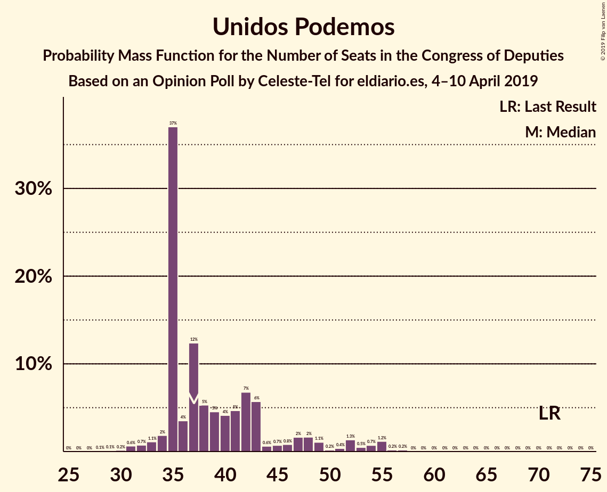
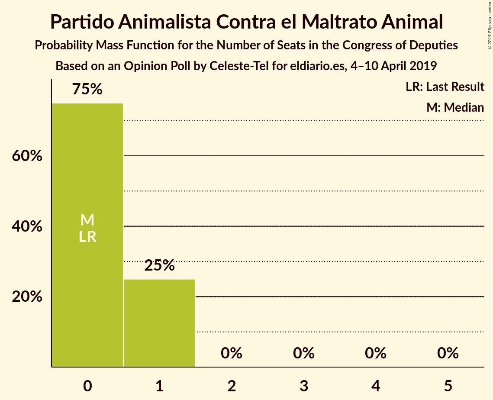
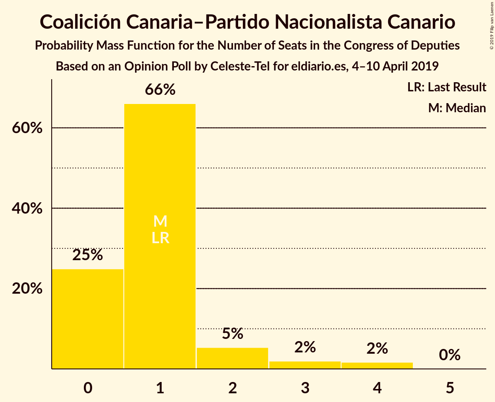
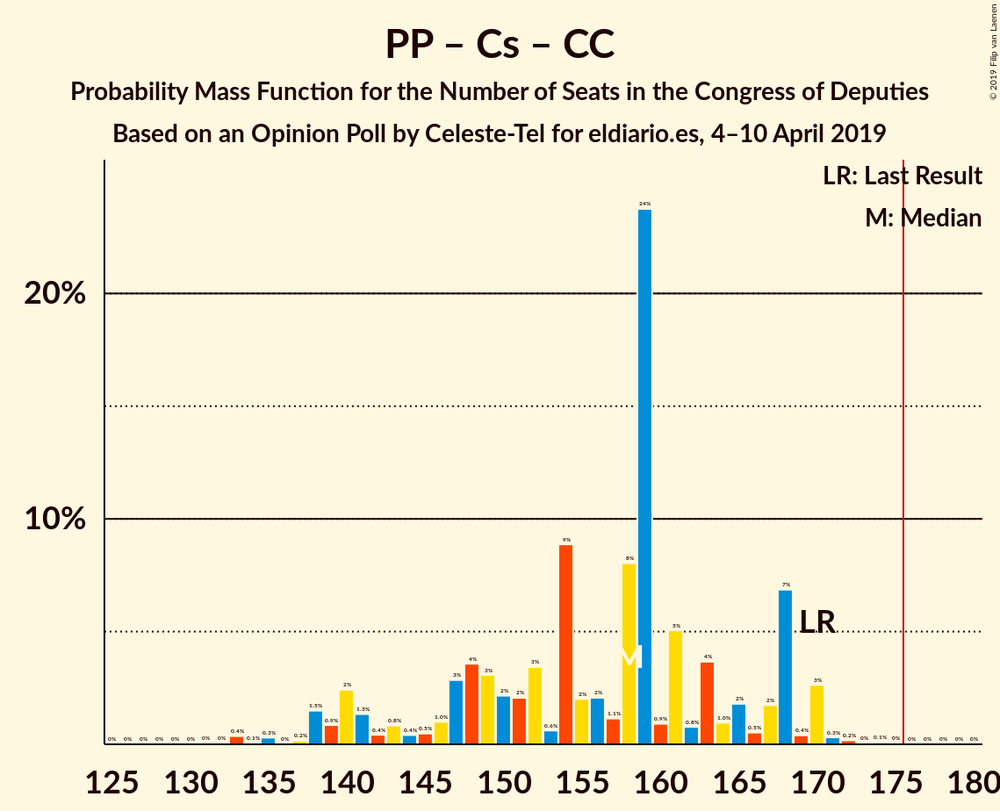
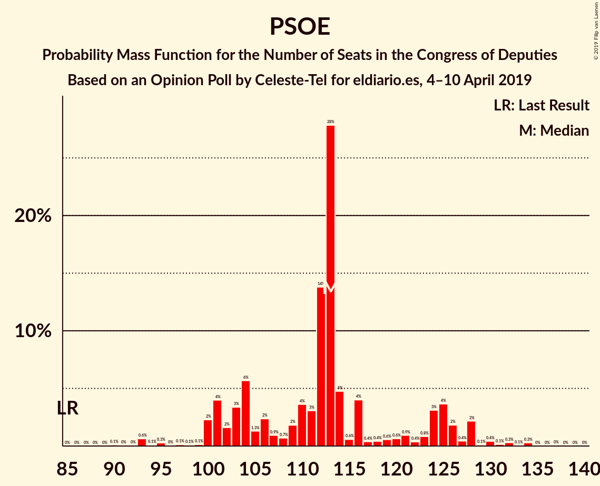

# Opinion Poll by Celeste-Tel for eldiario.es, 4–10 April 2019

<a href="#voting-intentions">Voting Intentions</a> | <a href="#seats">Seats</a> | <a href="#coalitions">Coalitions</a> | <a href="#technical-information">Technical Information</a>

## Voting Intentions

### Confidence Intervals

| Party | Last Result | Poll Result | 80% Confidence Interval | 90% Confidence Interval | 95% Confidence Interval | 99% Confidence Interval |
|:-----:|:-----------:|:-----------:|:-----------------------:|:-----------------------:|:-----------------------:|:-----------------------:|
| Partido Socialista Obrero Español | 22.6% | 27.3% | 25.6–29.1% |25.1–29.6% |24.7–30.0% |23.9–30.8% |
| Partido Popular | 33.0% | 23.9% | 22.3–25.6% |21.9–26.1% |21.5–26.5% |20.7–27.4% |
| Ciudadanos–Partido de la Ciudadanía | 13.1% | 15.9% | 14.6–17.4% |14.2–17.8% |13.9–18.2% |13.2–18.9% |
| Unidos Podemos | 21.2% | 14.6% | 13.3–16.1% |13.0–16.5% |12.7–16.9% |12.1–17.6% |
| Vox | 0.2% | 7.8% | 6.9–9.0% |6.6–9.3% |6.4–9.6% |5.9–10.1% |
| Esquerra Republicana de Catalunya–Catalunya Sí | 2.7% | 2.8% | 2.3–3.6% |2.1–3.8% |2.0–4.0% |1.8–4.4% |
| Partit Demòcrata Europeu Català | 2.0% | 1.6% | 1.2–2.3% |1.1–2.4% |1.0–2.6% |0.9–2.9% |
| Partido Animalista Contra el Maltrato Animal | 1.2% | 1.5% | 1.2–2.1% |1.1–2.3% |1.0–2.5% |0.8–2.8% |
| Euzko Alderdi Jeltzalea/Partido Nacionalista Vasco | 1.2% | 1.2% | 0.9–1.7% |0.8–1.9% |0.7–2.0% |0.6–2.3% |
| Euskal Herria Bildu | 0.8% | 0.8% | 0.6–1.3% |0.5–1.4% |0.4–1.6% |0.3–1.8% |
| Coalición Canaria–Partido Nacionalista Canario | 0.3% | 0.3% | 0.2–0.6% |0.1–0.7% |0.1–0.8% |0.1–1.0% |

*Note:* The poll result column reflects the actual value used in the calculations. Published results may vary slightly, and in addition be rounded to fewer digits.

## Seats

### Confidence Intervals

| Party | Last Result | Median | 80% Confidence Interval | 90% Confidence Interval | 95% Confidence Interval | 99% Confidence Interval |
|:-----:|:-----------:|:------:|:-----------------------:|:-----------------------:|:-----------------------:|:-----------------------:|
| <a href="#partido-socialista-obrero-español">Partido Socialista Obrero Español</a> | 85 | 113 | 103–123 |102–125 |100–126 |94–130 |
| <a href="#partido-popular">Partido Popular</a> | 137 | 99 | 92–111 |87–116 |85–120 |79–120 |
| <a href="#ciudadanos–partido-de-la-ciudadanía">Ciudadanos–Partido de la Ciudadanía</a> | 32 | 58 | 50–59 |48–59 |46–60 |38–64 |
| <a href="#unidos-podemos">Unidos Podemos</a> | 71 | 35 | 35–47 |35–49 |34–54 |31–56 |
| <a href="#vox">Vox</a> | 0 | 13 | 11–17 |11–21 |9–23 |8–24 |
| <a href="#esquerra-republicana-de-catalunya–catalunya-sí">Esquerra Republicana de Catalunya–Catalunya Sí</a> | 9 | 12 | 10–15 |9–15 |9–15 |7–17 |
| <a href="#partit-demòcrata-europeu-català">Partit Demòcrata Europeu Català</a> | 8 | 8 | 4–9 |4–9 |4–9 |3–10 |
| <a href="#partido-animalista-contra-el-maltrato-animal">Partido Animalista Contra el Maltrato Animal</a> | 0 | 0 | 0–1 |0–1 |0–1 |0–1 |
| <a href="#euzko-alderdi-jeltzalea/partido-nacionalista-vasco">Euzko Alderdi Jeltzalea/Partido Nacionalista Vasco</a> | 5 | 6 | 4–8 |3–8 |3–8 |2–10 |
| <a href="#euskal-herria-bildu">Euskal Herria Bildu</a> | 2 | 4 | 1–5 |1–5 |1–7 |0–7 |
| <a href="#coalición-canaria–partido-nacionalista-canario">Coalición Canaria–Partido Nacionalista Canario</a> | 1 | 1 | 0–1 |0–2 |0–3 |0–4 |

### Partido Socialista Obrero Español

*For a full overview of the results for this party, see the [Partido Socialista Obrero Español](party-partidosocialistaobreroespañol.html) page.*

| Number of Seats | Probability | Accumulated | Special Marks |
|:---------------:|:-----------:|:-----------:|:-------------:|
| 85 | 0% | 100% | Last Result |
| 86 | 0% | 100% |  |
| 87 | 0% | 100% |  |
| 88 | 0% | 100% |  |
| 89 | 0% | 100% |  |
| 90 | 0.2% | 100% |  |
| 91 | 0% | 99.8% |  |
| 92 | 0% | 99.8% |  |
| 93 | 0.2% | 99.8% |  |
| 94 | 0.1% | 99.6% |  |
| 95 | 0.1% | 99.5% |  |
| 96 | 0% | 99.4% |  |
| 97 | 0.2% | 99.3% |  |
| 98 | 0.1% | 99.1% |  |
| 99 | 0.1% | 99.1% |  |
| 100 | 2% | 99.0% |  |
| 101 | 0.9% | 97% |  |
| 102 | 2% | 96% |  |
| 103 | 6% | 95% |  |
| 104 | 6% | 89% |  |
| 105 | 2% | 82% |  |
| 106 | 3% | 80% |  |
| 107 | 0.7% | 77% |  |
| 108 | 0.5% | 76% |  |
| 109 | 1.4% | 76% |  |
| 110 | 0.9% | 74% |  |
| 111 | 3% | 73% |  |
| 112 | 5% | 70% |  |
| 113 | 41% | 65% | Median |
| 114 | 3% | 23% |  |
| 115 | 0.4% | 20% |  |
| 116 | 7% | 20% |  |
| 117 | 0.5% | 13% |  |
| 118 | 0.3% | 12% |  |
| 119 | 0.3% | 12% |  |
| 120 | 0.5% | 12% |  |
| 121 | 0.5% | 11% |  |
| 122 | 0.6% | 11% |  |
| 123 | 0.2% | 10% |  |
| 124 | 3% | 10% |  |
| 125 | 2% | 7% |  |
| 126 | 3% | 5% |  |
| 127 | 0.7% | 2% |  |
| 128 | 0.1% | 1.1% |  |
| 129 | 0.1% | 1.0% |  |
| 130 | 0.7% | 0.9% |  |
| 131 | 0% | 0.2% |  |
| 132 | 0% | 0.2% |  |
| 133 | 0.1% | 0.2% |  |
| 134 | 0% | 0.1% |  |
| 135 | 0% | 0.1% |  |
| 136 | 0% | 0.1% |  |
| 137 | 0% | 0% |  |

### Partido Popular

*For a full overview of the results for this party, see the [Partido Popular](party-partidopopular.html) page.*

| Number of Seats | Probability | Accumulated | Special Marks |
|:---------------:|:-----------:|:-----------:|:-------------:|
| 78 | 0% | 100% |  |
| 79 | 0.5% | 99.9% |  |
| 80 | 0% | 99.5% |  |
| 81 | 0.1% | 99.4% |  |
| 82 | 0.1% | 99.3% |  |
| 83 | 0.2% | 99.3% |  |
| 84 | 0.1% | 99.1% |  |
| 85 | 2% | 99.0% |  |
| 86 | 0.9% | 97% |  |
| 87 | 1.0% | 96% |  |
| 88 | 0.7% | 95% |  |
| 89 | 2% | 94% |  |
| 90 | 0.3% | 93% |  |
| 91 | 2% | 92% |  |
| 92 | 2% | 90% |  |
| 93 | 5% | 88% |  |
| 94 | 2% | 83% |  |
| 95 | 0.8% | 81% |  |
| 96 | 1.4% | 81% |  |
| 97 | 1.3% | 79% |  |
| 98 | 0.3% | 78% |  |
| 99 | 41% | 78% | Median |
| 100 | 1.3% | 36% |  |
| 101 | 0.3% | 35% |  |
| 102 | 5% | 35% |  |
| 103 | 7% | 30% |  |
| 104 | 1.4% | 23% |  |
| 105 | 0.2% | 22% |  |
| 106 | 0.5% | 22% |  |
| 107 | 0.3% | 21% |  |
| 108 | 4% | 21% |  |
| 109 | 6% | 17% |  |
| 110 | 0.4% | 11% |  |
| 111 | 1.0% | 10% |  |
| 112 | 2% | 9% |  |
| 113 | 0.4% | 7% |  |
| 114 | 0.9% | 7% |  |
| 115 | 1.0% | 6% |  |
| 116 | 0.4% | 5% |  |
| 117 | 0.1% | 5% |  |
| 118 | 0.1% | 5% |  |
| 119 | 0.2% | 5% |  |
| 120 | 4% | 4% |  |
| 121 | 0% | 0.1% |  |
| 122 | 0% | 0.1% |  |
| 123 | 0% | 0% |  |
| 124 | 0% | 0% |  |
| 125 | 0% | 0% |  |
| 126 | 0% | 0% |  |
| 127 | 0% | 0% |  |
| 128 | 0% | 0% |  |
| 129 | 0% | 0% |  |
| 130 | 0% | 0% |  |
| 131 | 0% | 0% |  |
| 132 | 0% | 0% |  |
| 133 | 0% | 0% |  |
| 134 | 0% | 0% |  |
| 135 | 0% | 0% |  |
| 136 | 0% | 0% |  |
| 137 | 0% | 0% | Last Result |

### Ciudadanos–Partido de la Ciudadanía

*For a full overview of the results for this party, see the [Ciudadanos–Partido de la Ciudadanía](party-ciudadanos–partidodelaciudadanía.html) page.*

| Number of Seats | Probability | Accumulated | Special Marks |
|:---------------:|:-----------:|:-----------:|:-------------:|
| 31 | 0% | 100% |  |
| 32 | 0% | 99.9% | Last Result |
| 33 | 0.1% | 99.9% |  |
| 34 | 0% | 99.8% |  |
| 35 | 0.1% | 99.8% |  |
| 36 | 0% | 99.7% |  |
| 37 | 0.1% | 99.6% |  |
| 38 | 0% | 99.5% |  |
| 39 | 0.1% | 99.5% |  |
| 40 | 0.1% | 99.4% |  |
| 41 | 0% | 99.3% |  |
| 42 | 0.5% | 99.3% |  |
| 43 | 0.4% | 98.8% |  |
| 44 | 0.5% | 98% |  |
| 45 | 0.2% | 98% |  |
| 46 | 0.6% | 98% |  |
| 47 | 0.7% | 97% |  |
| 48 | 3% | 96% |  |
| 49 | 0.4% | 93% |  |
| 50 | 6% | 93% |  |
| 51 | 11% | 87% |  |
| 52 | 2% | 76% |  |
| 53 | 6% | 74% |  |
| 54 | 4% | 68% |  |
| 55 | 7% | 64% |  |
| 56 | 1.4% | 57% |  |
| 57 | 1.1% | 56% |  |
| 58 | 8% | 55% | Median |
| 59 | 43% | 46% |  |
| 60 | 1.5% | 3% |  |
| 61 | 0.5% | 2% |  |
| 62 | 0.3% | 1.1% |  |
| 63 | 0.3% | 0.8% |  |
| 64 | 0.1% | 0.5% |  |
| 65 | 0.2% | 0.5% |  |
| 66 | 0% | 0.3% |  |
| 67 | 0.2% | 0.3% |  |
| 68 | 0% | 0% |  |

### Unidos Podemos

*For a full overview of the results for this party, see the [Unidos Podemos](party-unidospodemos.html) page.*

| Number of Seats | Probability | Accumulated | Special Marks |
|:---------------:|:-----------:|:-----------:|:-------------:|
| 28 | 0% | 100% |  |
| 29 | 0.2% | 99.9% |  |
| 30 | 0.2% | 99.8% |  |
| 31 | 0.7% | 99.6% |  |
| 32 | 0.6% | 98.9% |  |
| 33 | 0.5% | 98% |  |
| 34 | 1.2% | 98% |  |
| 35 | 53% | 97% | Median |
| 36 | 4% | 44% |  |
| 37 | 6% | 40% |  |
| 38 | 4% | 33% |  |
| 39 | 1.3% | 29% |  |
| 40 | 2% | 28% |  |
| 41 | 5% | 26% |  |
| 42 | 3% | 22% |  |
| 43 | 7% | 19% |  |
| 44 | 0.9% | 13% |  |
| 45 | 0.6% | 12% |  |
| 46 | 0.1% | 11% |  |
| 47 | 2% | 11% |  |
| 48 | 3% | 8% |  |
| 49 | 2% | 6% |  |
| 50 | 0.1% | 4% |  |
| 51 | 0.2% | 4% |  |
| 52 | 1.1% | 4% |  |
| 53 | 0.1% | 3% |  |
| 54 | 1.0% | 3% |  |
| 55 | 1.1% | 2% |  |
| 56 | 0.2% | 0.6% |  |
| 57 | 0.3% | 0.4% |  |
| 58 | 0% | 0.1% |  |
| 59 | 0% | 0.1% |  |
| 60 | 0% | 0.1% |  |
| 61 | 0% | 0% |  |
| 62 | 0% | 0% |  |
| 63 | 0% | 0% |  |
| 64 | 0% | 0% |  |
| 65 | 0% | 0% |  |
| 66 | 0% | 0% |  |
| 67 | 0% | 0% |  |
| 68 | 0% | 0% |  |
| 69 | 0% | 0% |  |
| 70 | 0% | 0% |  |
| 71 | 0% | 0% | Last Result |

### Vox

*For a full overview of the results for this party, see the [Vox](party-vox.html) page.*

| Number of Seats | Probability | Accumulated | Special Marks |
|:---------------:|:-----------:|:-----------:|:-------------:|
| 0 | 0% | 100% | Last Result |
| 1 | 0% | 100% |  |
| 2 | 0% | 100% |  |
| 3 | 0% | 100% |  |
| 4 | 0% | 100% |  |
| 5 | 0% | 100% |  |
| 6 | 0% | 100% |  |
| 7 | 0.2% | 100% |  |
| 8 | 1.1% | 99.8% |  |
| 9 | 1.3% | 98.7% |  |
| 10 | 2% | 97% |  |
| 11 | 6% | 95% |  |
| 12 | 13% | 89% |  |
| 13 | 53% | 77% | Median |
| 14 | 2% | 23% |  |
| 15 | 3% | 22% |  |
| 16 | 3% | 18% |  |
| 17 | 5% | 15% |  |
| 18 | 1.4% | 10% |  |
| 19 | 1.0% | 8% |  |
| 20 | 2% | 7% |  |
| 21 | 1.4% | 5% |  |
| 22 | 0.4% | 4% |  |
| 23 | 3% | 4% |  |
| 24 | 0.4% | 0.5% |  |
| 25 | 0% | 0.1% |  |
| 26 | 0.1% | 0.1% |  |
| 27 | 0% | 0% |  |

### Esquerra Republicana de Catalunya–Catalunya Sí

*For a full overview of the results for this party, see the [Esquerra Republicana de Catalunya–Catalunya Sí](party-esquerrarepublicanadecatalunya–catalunyasí.html) page.*

| Number of Seats | Probability | Accumulated | Special Marks |
|:---------------:|:-----------:|:-----------:|:-------------:|
| 6 | 0.2% | 100% |  |
| 7 | 0.5% | 99.8% |  |
| 8 | 0.8% | 99.3% |  |
| 9 | 6% | 98.6% | Last Result |
| 10 | 4% | 92% |  |
| 11 | 10% | 88% |  |
| 12 | 43% | 79% | Median |
| 13 | 11% | 36% |  |
| 14 | 11% | 24% |  |
| 15 | 12% | 14% |  |
| 16 | 0.7% | 1.3% |  |
| 17 | 0.2% | 0.6% |  |
| 18 | 0.2% | 0.4% |  |
| 19 | 0.1% | 0.2% |  |
| 20 | 0.1% | 0.1% |  |
| 21 | 0% | 0% |  |

### Partit Demòcrata Europeu Català

*For a full overview of the results for this party, see the [Partit Demòcrata Europeu Català](party-partitdemòcrataeuropeucatalà.html) page.*

| Number of Seats | Probability | Accumulated | Special Marks |
|:---------------:|:-----------:|:-----------:|:-------------:|
| 1 | 0.1% | 100% |  |
| 2 | 0.1% | 99.9% |  |
| 3 | 1.4% | 99.8% |  |
| 4 | 14% | 98% |  |
| 5 | 8% | 85% |  |
| 6 | 11% | 77% |  |
| 7 | 3% | 66% |  |
| 8 | 53% | 63% | Last Result, Median |
| 9 | 8% | 10% |  |
| 10 | 1.2% | 2% |  |
| 11 | 0.3% | 0.5% |  |
| 12 | 0.1% | 0.1% |  |
| 13 | 0% | 0% |  |

### Partido Animalista Contra el Maltrato Animal

*For a full overview of the results for this party, see the [Partido Animalista Contra el Maltrato Animal](party-partidoanimalistacontraelmaltratoanimal.html) page.*

| Number of Seats | Probability | Accumulated | Special Marks |
|:---------------:|:-----------:|:-----------:|:-------------:|
| 0 | 88% | 100% | Last Result, Median |
| 1 | 12% | 12% |  |
| 2 | 0% | 0% |  |

### Euzko Alderdi Jeltzalea/Partido Nacionalista Vasco

*For a full overview of the results for this party, see the [Euzko Alderdi Jeltzalea/Partido Nacionalista Vasco](party-euzkoalderdijeltzaleapartidonacionalistavasco.html) page.*

| Number of Seats | Probability | Accumulated | Special Marks |
|:---------------:|:-----------:|:-----------:|:-------------:|
| 1 | 0.3% | 100% |  |
| 2 | 1.1% | 99.7% |  |
| 3 | 7% | 98.6% |  |
| 4 | 7% | 91% |  |
| 5 | 0.9% | 84% | Last Result |
| 6 | 57% | 83% | Median |
| 7 | 7% | 26% |  |
| 8 | 17% | 19% |  |
| 9 | 0.3% | 2% |  |
| 10 | 2% | 2% |  |
| 11 | 0% | 0.1% |  |
| 12 | 0% | 0% |  |

### Euskal Herria Bildu

*For a full overview of the results for this party, see the [Euskal Herria Bildu](party-euskalherriabildu.html) page.*

| Number of Seats | Probability | Accumulated | Special Marks |
|:---------------:|:-----------:|:-----------:|:-------------:|
| 0 | 0.7% | 100% |  |
| 1 | 11% | 99.3% |  |
| 2 | 16% | 88% | Last Result |
| 3 | 10% | 73% |  |
| 4 | 51% | 63% | Median |
| 5 | 6% | 11% |  |
| 6 | 2% | 5% |  |
| 7 | 2% | 3% |  |
| 8 | 0.1% | 0.2% |  |
| 9 | 0.1% | 0.1% |  |
| 10 | 0% | 0% |  |

### Coalición Canaria–Partido Nacionalista Canario

*For a full overview of the results for this party, see the [Coalición Canaria–Partido Nacionalista Canario](party-coalicióncanaria–partidonacionalistacanario.html) page.*

| Number of Seats | Probability | Accumulated | Special Marks |
|:---------------:|:-----------:|:-----------:|:-------------:|
| 0 | 22% | 100% |  |
| 1 | 71% | 78% | Last Result, Median |
| 2 | 3% | 7% |  |
| 3 | 1.5% | 4% |  |
| 4 | 2% | 2% |  |
| 5 | 0.1% | 0.1% |  |
| 6 | 0% | 0% |  |

## Coalitions

### Confidence Intervals

| Coalition | Last Result | Median | Majority? | 80% Confidence Interval | 90% Confidence Interval | 95% Confidence Interval | 99% Confidence Interval |
|:---------:|:-----------:|:------:|:---------:|:-----------------------:|:-----------------------:|:-----------------------:|:-----------------------:|
| Partido Socialista Obrero Español – Partido Popular – Ciudadanos–Partido de la Ciudadanía | 254 | 271 | 100% | 259–273 | 256–274 | 256–276 | 253–277 |
| Partido Socialista Obrero Español – Ciudadanos–Partido de la Ciudadanía – Unidos Podemos | 188 | 207 | 100% | 196–217 | 194–222 | 189–224 | 186–225 |
| Partido Socialista Obrero Español – Partido Popular | 222 | 212 | 100% | 206–220 | 203–223 | 200–223 | 197–229 |
| Partido Socialista Obrero Español – Unidos Podemos – Esquerra Republicana de Catalunya–Catalunya Sí – Partit Demòcrata Europeu Català – Euzko Alderdi Jeltzalea/Partido Nacionalista Vasco – Euskal Herria Bildu | 180 | 178 | 78% | 171–187 | 168–192 | 167–200 | 164–201 |
| Partido Socialista Obrero Español – Unidos Podemos – Esquerra Republicana de Catalunya–Catalunya Sí – Partit Demòcrata Europeu Català | 173 | 168 | 16% | 160–180 | 160–184 | 158–190 | 154–191 |
| Partido Socialista Obrero Español – Unidos Podemos – Esquerra Republicana de Catalunya–Catalunya Sí – Euskal Herria Bildu | 167 | 164 | 14% | 159–177 | 158–183 | 156–186 | 152–188 |
| Partido Popular – Ciudadanos–Partido de la Ciudadanía – Vox | 169 | 171 | 16% | 161–178 | 156–182 | 150–182 | 148–183 |
| Partido Socialista Obrero Español – Ciudadanos–Partido de la Ciudadanía | 117 | 172 | 11% | 153–176 | 153–180 | 151–180 | 143–184 |
| Partido Socialista Obrero Español – Unidos Podemos – Euzko Alderdi Jeltzalea/Partido Nacionalista Vasco – Euskal Herria Bildu | 163 | 158 | 5% | 152–171 | 152–176 | 148–179 | 145–180 |
| Partido Socialista Obrero Español – Unidos Podemos – Euzko Alderdi Jeltzalea/Partido Nacionalista Vasco | 161 | 154 | 3% | 148–168 | 148–172 | 141–177 | 141–179 |
| Partido Popular – Ciudadanos–Partido de la Ciudadanía – Euzko Alderdi Jeltzalea/Partido Nacionalista Vasco | 174 | 164 | 1.3% | 151–174 | 146–174 | 144–174 | 140–177 |
| Partido Popular – Ciudadanos–Partido de la Ciudadanía – Coalición Canaria–Partido Nacionalista Canario | 170 | 159 | 0% | 148–168 | 141–170 | 138–170 | 135–171 |
| Partido Popular – Ciudadanos–Partido de la Ciudadanía | 169 | 158 | 0% | 147–167 | 139–170 | 138–170 | 134–170 |
| Partido Socialista Obrero Español – Unidos Podemos | 156 | 148 | 0.1% | 142–163 | 141–167 | 138–169 | 135–171 |
| Partido Popular – Vox | 137 | 112 | 0% | 106–125 | 102–132 | 97–132 | 94–133 |
| Partido Socialista Obrero Español | 85 | 113 | 0% | 103–123 | 102–125 | 100–126 | 94–130 |
| Partido Popular | 137 | 99 | 0% | 92–111 | 87–116 | 85–120 | 79–120 |

### Partido Socialista Obrero Español – Partido Popular – Ciudadanos–Partido de la Ciudadanía

| Number of Seats | Probability | Accumulated | Special Marks |
|:---------------:|:-----------:|:-----------:|:-------------:|
| 245 | 0% | 100% |  |
| 246 | 0% | 99.9% |  |
| 247 | 0% | 99.9% |  |
| 248 | 0% | 99.9% |  |
| 249 | 0% | 99.9% |  |
| 250 | 0% | 99.8% |  |
| 251 | 0.1% | 99.8% |  |
| 252 | 0.1% | 99.7% |  |
| 253 | 0.5% | 99.6% |  |
| 254 | 0.4% | 99.1% | Last Result |
| 255 | 1.0% | 98.7% |  |
| 256 | 3% | 98% |  |
| 257 | 1.4% | 95% |  |
| 258 | 2% | 93% |  |
| 259 | 4% | 91% |  |
| 260 | 3% | 87% |  |
| 261 | 0.3% | 84% |  |
| 262 | 3% | 84% |  |
| 263 | 3% | 81% |  |
| 264 | 1.2% | 77% |  |
| 265 | 2% | 76% |  |
| 266 | 0.7% | 74% |  |
| 267 | 0.5% | 73% |  |
| 268 | 3% | 73% |  |
| 269 | 1.0% | 70% |  |
| 270 | 7% | 69% | Median |
| 271 | 46% | 62% |  |
| 272 | 0.9% | 16% |  |
| 273 | 7% | 15% |  |
| 274 | 5% | 8% |  |
| 275 | 0.4% | 3% |  |
| 276 | 2% | 3% |  |
| 277 | 0.6% | 1.0% |  |
| 278 | 0.1% | 0.4% |  |
| 279 | 0.1% | 0.4% |  |
| 280 | 0.2% | 0.3% |  |
| 281 | 0% | 0.1% |  |
| 282 | 0% | 0.1% |  |
| 283 | 0% | 0% |  |

### Partido Socialista Obrero Español – Ciudadanos–Partido de la Ciudadanía – Unidos Podemos

| Number of Seats | Probability | Accumulated | Special Marks |
|:---------------:|:-----------:|:-----------:|:-------------:|
| 182 | 0.1% | 100% |  |
| 183 | 0% | 99.8% |  |
| 184 | 0% | 99.8% |  |
| 185 | 0.2% | 99.8% |  |
| 186 | 2% | 99.6% |  |
| 187 | 0.2% | 98% |  |
| 188 | 0.3% | 98% | Last Result |
| 189 | 0.2% | 98% |  |
| 190 | 0.1% | 97% |  |
| 191 | 1.2% | 97% |  |
| 192 | 0.5% | 96% |  |
| 193 | 0.3% | 95% |  |
| 194 | 1.1% | 95% |  |
| 195 | 0.2% | 94% |  |
| 196 | 4% | 94% |  |
| 197 | 0.6% | 90% |  |
| 198 | 0.6% | 89% |  |
| 199 | 7% | 88% |  |
| 200 | 0.4% | 82% |  |
| 201 | 6% | 82% |  |
| 202 | 11% | 75% |  |
| 203 | 0.1% | 64% |  |
| 204 | 0.6% | 64% |  |
| 205 | 0.3% | 64% |  |
| 206 | 0.3% | 63% | Median |
| 207 | 44% | 63% |  |
| 208 | 2% | 19% |  |
| 209 | 0.2% | 17% |  |
| 210 | 0.3% | 17% |  |
| 211 | 0.6% | 17% |  |
| 212 | 0.3% | 16% |  |
| 213 | 0.9% | 16% |  |
| 214 | 0.9% | 15% |  |
| 215 | 0.2% | 14% |  |
| 216 | 3% | 14% |  |
| 217 | 1.0% | 10% |  |
| 218 | 2% | 9% |  |
| 219 | 0.5% | 7% |  |
| 220 | 0.2% | 7% |  |
| 221 | 0.1% | 6% |  |
| 222 | 2% | 6% |  |
| 223 | 2% | 5% |  |
| 224 | 2% | 3% |  |
| 225 | 1.0% | 1.1% |  |
| 226 | 0% | 0.2% |  |
| 227 | 0% | 0.1% |  |
| 228 | 0% | 0.1% |  |
| 229 | 0.1% | 0.1% |  |
| 230 | 0% | 0% |  |

### Partido Socialista Obrero Español – Partido Popular

| Number of Seats | Probability | Accumulated | Special Marks |
|:---------------:|:-----------:|:-----------:|:-------------:|
| 188 | 0% | 100% |  |
| 189 | 0% | 99.9% |  |
| 190 | 0% | 99.9% |  |
| 191 | 0% | 99.9% |  |
| 192 | 0% | 99.9% |  |
| 193 | 0% | 99.9% |  |
| 194 | 0% | 99.9% |  |
| 195 | 0.1% | 99.8% |  |
| 196 | 0.2% | 99.7% |  |
| 197 | 0.1% | 99.5% |  |
| 198 | 0.2% | 99.5% |  |
| 199 | 0.3% | 99.3% |  |
| 200 | 2% | 99.0% |  |
| 201 | 1.0% | 97% |  |
| 202 | 0.3% | 96% |  |
| 203 | 2% | 96% |  |
| 204 | 3% | 94% |  |
| 205 | 0.5% | 91% |  |
| 206 | 2% | 90% |  |
| 207 | 3% | 88% |  |
| 208 | 3% | 85% |  |
| 209 | 3% | 82% |  |
| 210 | 1.5% | 79% |  |
| 211 | 0.5% | 78% |  |
| 212 | 43% | 77% | Median |
| 213 | 7% | 35% |  |
| 214 | 1.1% | 28% |  |
| 215 | 2% | 27% |  |
| 216 | 1.1% | 25% |  |
| 217 | 0.3% | 24% |  |
| 218 | 4% | 23% |  |
| 219 | 7% | 19% |  |
| 220 | 4% | 12% |  |
| 221 | 0.6% | 8% |  |
| 222 | 0.2% | 7% | Last Result |
| 223 | 5% | 7% |  |
| 224 | 0.4% | 2% |  |
| 225 | 0.2% | 1.2% |  |
| 226 | 0.3% | 1.1% |  |
| 227 | 0.1% | 0.8% |  |
| 228 | 0.1% | 0.7% |  |
| 229 | 0.3% | 0.6% |  |
| 230 | 0% | 0.3% |  |
| 231 | 0% | 0.3% |  |
| 232 | 0% | 0.3% |  |
| 233 | 0.1% | 0.3% |  |
| 234 | 0.1% | 0.2% |  |
| 235 | 0% | 0.1% |  |
| 236 | 0.1% | 0.1% |  |
| 237 | 0% | 0.1% |  |
| 238 | 0% | 0% |  |

### Partido Socialista Obrero Español – Unidos Podemos – Esquerra Republicana de Catalunya–Catalunya Sí – Partit Demòcrata Europeu Català – Euzko Alderdi Jeltzalea/Partido Nacionalista Vasco – Euskal Herria Bildu

| Number of Seats | Probability | Accumulated | Special Marks |
|:---------------:|:-----------:|:-----------:|:-------------:|
| 160 | 0.2% | 100% |  |
| 161 | 0% | 99.8% |  |
| 162 | 0% | 99.8% |  |
| 163 | 0.1% | 99.7% |  |
| 164 | 0.2% | 99.6% |  |
| 165 | 0.1% | 99.4% |  |
| 166 | 0.1% | 99.3% |  |
| 167 | 2% | 99.2% |  |
| 168 | 5% | 97% |  |
| 169 | 0.3% | 92% |  |
| 170 | 0.5% | 92% |  |
| 171 | 6% | 91% |  |
| 172 | 0.4% | 85% |  |
| 173 | 0.6% | 84% |  |
| 174 | 2% | 84% |  |
| 175 | 4% | 82% |  |
| 176 | 1.0% | 78% | Majority |
| 177 | 0.9% | 77% |  |
| 178 | 45% | 76% | Median |
| 179 | 0.8% | 31% |  |
| 180 | 0.3% | 30% | Last Result |
| 181 | 0.7% | 30% |  |
| 182 | 2% | 29% |  |
| 183 | 10% | 27% |  |
| 184 | 1.4% | 18% |  |
| 185 | 1.3% | 16% |  |
| 186 | 4% | 15% |  |
| 187 | 3% | 11% |  |
| 188 | 0.3% | 8% |  |
| 189 | 0.2% | 8% |  |
| 190 | 0.2% | 8% |  |
| 191 | 0.2% | 7% |  |
| 192 | 2% | 7% |  |
| 193 | 1.0% | 5% |  |
| 194 | 0.1% | 4% |  |
| 195 | 0.2% | 4% |  |
| 196 | 0.1% | 4% |  |
| 197 | 0.1% | 3% |  |
| 198 | 0% | 3% |  |
| 199 | 0% | 3% |  |
| 200 | 3% | 3% |  |
| 201 | 0.4% | 0.6% |  |
| 202 | 0% | 0.2% |  |
| 203 | 0% | 0.2% |  |
| 204 | 0% | 0.1% |  |
| 205 | 0% | 0.1% |  |
| 206 | 0% | 0.1% |  |
| 207 | 0% | 0.1% |  |
| 208 | 0% | 0.1% |  |
| 209 | 0% | 0% |  |

### Partido Socialista Obrero Español – Unidos Podemos – Esquerra Republicana de Catalunya–Catalunya Sí – Partit Demòcrata Europeu Català

| Number of Seats | Probability | Accumulated | Special Marks |
|:---------------:|:-----------:|:-----------:|:-------------:|
| 150 | 0.2% | 100% |  |
| 151 | 0% | 99.8% |  |
| 152 | 0% | 99.8% |  |
| 153 | 0.1% | 99.7% |  |
| 154 | 0.3% | 99.7% |  |
| 155 | 0.1% | 99.4% |  |
| 156 | 0% | 99.3% |  |
| 157 | 1.4% | 99.3% |  |
| 158 | 2% | 98% |  |
| 159 | 0.7% | 96% |  |
| 160 | 6% | 95% |  |
| 161 | 5% | 90% |  |
| 162 | 0.6% | 85% |  |
| 163 | 0.4% | 84% |  |
| 164 | 0.3% | 84% |  |
| 165 | 0.3% | 84% |  |
| 166 | 6% | 83% |  |
| 167 | 0.6% | 77% |  |
| 168 | 41% | 77% | Median |
| 169 | 2% | 36% |  |
| 170 | 3% | 34% |  |
| 171 | 1.2% | 30% |  |
| 172 | 2% | 29% |  |
| 173 | 10% | 27% | Last Result |
| 174 | 0.7% | 17% |  |
| 175 | 0.8% | 17% |  |
| 176 | 0.8% | 16% | Majority |
| 177 | 0.3% | 15% |  |
| 178 | 3% | 15% |  |
| 179 | 2% | 12% |  |
| 180 | 2% | 10% |  |
| 181 | 0.4% | 8% |  |
| 182 | 0.2% | 7% |  |
| 183 | 0.1% | 7% |  |
| 184 | 3% | 7% |  |
| 185 | 0.3% | 4% |  |
| 186 | 0.1% | 4% |  |
| 187 | 0.2% | 4% |  |
| 188 | 0% | 4% |  |
| 189 | 0.6% | 3% |  |
| 190 | 0.5% | 3% |  |
| 191 | 2% | 2% |  |
| 192 | 0% | 0.2% |  |
| 193 | 0% | 0.2% |  |
| 194 | 0% | 0.1% |  |
| 195 | 0% | 0.1% |  |
| 196 | 0.1% | 0.1% |  |
| 197 | 0% | 0% |  |

### Partido Socialista Obrero Español – Unidos Podemos – Esquerra Republicana de Catalunya–Catalunya Sí – Euskal Herria Bildu

| Number of Seats | Probability | Accumulated | Special Marks |
|:---------------:|:-----------:|:-----------:|:-------------:|
| 146 | 0.1% | 100% |  |
| 147 | 0% | 99.8% |  |
| 148 | 0.1% | 99.8% |  |
| 149 | 0% | 99.7% |  |
| 150 | 0.1% | 99.7% |  |
| 151 | 0.1% | 99.6% |  |
| 152 | 1.4% | 99.5% |  |
| 153 | 0.2% | 98% |  |
| 154 | 0.1% | 98% |  |
| 155 | 0.2% | 98% |  |
| 156 | 0.5% | 98% |  |
| 157 | 1.0% | 97% |  |
| 158 | 4% | 96% |  |
| 159 | 4% | 92% |  |
| 160 | 7% | 87% |  |
| 161 | 2% | 81% |  |
| 162 | 0.6% | 79% |  |
| 163 | 1.0% | 78% |  |
| 164 | 41% | 77% | Median |
| 165 | 0.6% | 36% |  |
| 166 | 8% | 36% |  |
| 167 | 5% | 28% | Last Result |
| 168 | 0.6% | 23% |  |
| 169 | 0.4% | 22% |  |
| 170 | 5% | 22% |  |
| 171 | 0.7% | 17% |  |
| 172 | 0.9% | 16% |  |
| 173 | 1.1% | 15% |  |
| 174 | 0.1% | 14% |  |
| 175 | 0.3% | 14% |  |
| 176 | 3% | 14% | Majority |
| 177 | 2% | 10% |  |
| 178 | 0.3% | 8% |  |
| 179 | 0.2% | 8% |  |
| 180 | 0.2% | 7% |  |
| 181 | 0.4% | 7% |  |
| 182 | 0.6% | 7% |  |
| 183 | 1.5% | 6% |  |
| 184 | 0.1% | 5% |  |
| 185 | 1.0% | 5% |  |
| 186 | 3% | 4% |  |
| 187 | 0.1% | 1.1% |  |
| 188 | 0.9% | 1.1% |  |
| 189 | 0% | 0.2% |  |
| 190 | 0% | 0.2% |  |
| 191 | 0% | 0.1% |  |
| 192 | 0% | 0.1% |  |
| 193 | 0% | 0.1% |  |
| 194 | 0.1% | 0.1% |  |
| 195 | 0% | 0% |  |

### Partido Popular – Ciudadanos–Partido de la Ciudadanía – Vox

| Number of Seats | Probability | Accumulated | Special Marks |
|:---------------:|:-----------:|:-----------:|:-------------:|
| 141 | 0% | 100% |  |
| 142 | 0% | 99.9% |  |
| 143 | 0% | 99.9% |  |
| 144 | 0% | 99.9% |  |
| 145 | 0% | 99.9% |  |
| 146 | 0% | 99.9% |  |
| 147 | 0% | 99.8% |  |
| 148 | 0.4% | 99.8% |  |
| 149 | 0.6% | 99.4% |  |
| 150 | 2% | 98.8% |  |
| 151 | 0.1% | 97% |  |
| 152 | 0% | 97% |  |
| 153 | 0.2% | 96% |  |
| 154 | 0.1% | 96% |  |
| 155 | 0.1% | 96% |  |
| 156 | 2% | 96% |  |
| 157 | 0.6% | 94% |  |
| 158 | 1.2% | 94% |  |
| 159 | 0.1% | 92% |  |
| 160 | 0.3% | 92% |  |
| 161 | 3% | 92% |  |
| 162 | 1.0% | 89% |  |
| 163 | 3% | 88% |  |
| 164 | 2% | 86% |  |
| 165 | 1.3% | 84% |  |
| 166 | 4% | 82% |  |
| 167 | 8% | 78% |  |
| 168 | 1.3% | 70% |  |
| 169 | 0.2% | 69% | Last Result |
| 170 | 2% | 69% | Median |
| 171 | 43% | 67% |  |
| 172 | 3% | 24% |  |
| 173 | 0.2% | 21% |  |
| 174 | 4% | 21% |  |
| 175 | 0.6% | 16% |  |
| 176 | 0.6% | 16% | Majority |
| 177 | 0.3% | 15% |  |
| 178 | 6% | 15% |  |
| 179 | 0.5% | 9% |  |
| 180 | 0.3% | 8% |  |
| 181 | 0.7% | 8% |  |
| 182 | 5% | 7% |  |
| 183 | 2% | 2% |  |
| 184 | 0.1% | 0.5% |  |
| 185 | 0% | 0.4% |  |
| 186 | 0.1% | 0.3% |  |
| 187 | 0% | 0.3% |  |
| 188 | 0.1% | 0.2% |  |
| 189 | 0.1% | 0.1% |  |
| 190 | 0% | 0% |  |

### Partido Socialista Obrero Español – Ciudadanos–Partido de la Ciudadanía

| Number of Seats | Probability | Accumulated | Special Marks |
|:---------------:|:-----------:|:-----------:|:-------------:|
| 117 | 0% | 100% | Last Result |
| 118 | 0% | 100% |  |
| 119 | 0% | 100% |  |
| 120 | 0% | 100% |  |
| 121 | 0% | 100% |  |
| 122 | 0% | 100% |  |
| 123 | 0% | 100% |  |
| 124 | 0% | 100% |  |
| 125 | 0% | 100% |  |
| 126 | 0% | 100% |  |
| 127 | 0% | 100% |  |
| 128 | 0% | 100% |  |
| 129 | 0% | 100% |  |
| 130 | 0% | 100% |  |
| 131 | 0% | 100% |  |
| 132 | 0% | 100% |  |
| 133 | 0% | 100% |  |
| 134 | 0% | 100% |  |
| 135 | 0% | 100% |  |
| 136 | 0% | 100% |  |
| 137 | 0% | 100% |  |
| 138 | 0% | 100% |  |
| 139 | 0% | 100% |  |
| 140 | 0.1% | 100% |  |
| 141 | 0% | 99.9% |  |
| 142 | 0% | 99.9% |  |
| 143 | 0.4% | 99.8% |  |
| 144 | 0.1% | 99.5% |  |
| 145 | 0.3% | 99.4% |  |
| 146 | 0.1% | 99.1% |  |
| 147 | 0.1% | 99.0% |  |
| 148 | 0.1% | 98.8% |  |
| 149 | 0.2% | 98.7% |  |
| 150 | 0.2% | 98.5% |  |
| 151 | 2% | 98% |  |
| 152 | 0.1% | 97% |  |
| 153 | 7% | 97% |  |
| 154 | 3% | 90% |  |
| 155 | 0.7% | 87% |  |
| 156 | 0.5% | 86% |  |
| 157 | 0.5% | 85% |  |
| 158 | 2% | 85% |  |
| 159 | 1.3% | 83% |  |
| 160 | 0.4% | 82% |  |
| 161 | 0.4% | 81% |  |
| 162 | 6% | 81% |  |
| 163 | 0.7% | 75% |  |
| 164 | 0.3% | 74% |  |
| 165 | 0.5% | 74% |  |
| 166 | 7% | 73% |  |
| 167 | 9% | 67% |  |
| 168 | 0.4% | 58% |  |
| 169 | 1.2% | 58% |  |
| 170 | 0.8% | 57% |  |
| 171 | 0.2% | 56% | Median |
| 172 | 42% | 56% |  |
| 173 | 2% | 13% |  |
| 174 | 0.6% | 12% |  |
| 175 | 0.3% | 11% |  |
| 176 | 2% | 11% | Majority |
| 177 | 3% | 9% |  |
| 178 | 0.6% | 6% |  |
| 179 | 0.7% | 6% |  |
| 180 | 3% | 5% |  |
| 181 | 0.2% | 2% |  |
| 182 | 0.4% | 2% |  |
| 183 | 0% | 2% |  |
| 184 | 1.5% | 2% |  |
| 185 | 0.1% | 0.4% |  |
| 186 | 0.1% | 0.3% |  |
| 187 | 0.1% | 0.2% |  |
| 188 | 0% | 0.1% |  |
| 189 | 0% | 0.1% |  |
| 190 | 0% | 0.1% |  |
| 191 | 0% | 0% |  |

### Partido Socialista Obrero Español – Unidos Podemos – Euzko Alderdi Jeltzalea/Partido Nacionalista Vasco – Euskal Herria Bildu

| Number of Seats | Probability | Accumulated | Special Marks |
|:---------------:|:-----------:|:-----------:|:-------------:|
| 140 | 0.1% | 100% |  |
| 141 | 0.1% | 99.9% |  |
| 142 | 0% | 99.8% |  |
| 143 | 0% | 99.7% |  |
| 144 | 0% | 99.7% |  |
| 145 | 2% | 99.7% |  |
| 146 | 0.2% | 98% |  |
| 147 | 0.1% | 98% |  |
| 148 | 2% | 98% |  |
| 149 | 0.1% | 96% |  |
| 150 | 0.2% | 96% |  |
| 151 | 0.3% | 96% |  |
| 152 | 6% | 95% |  |
| 153 | 5% | 90% |  |
| 154 | 1.0% | 85% |  |
| 155 | 0.9% | 84% |  |
| 156 | 6% | 83% |  |
| 157 | 2% | 77% |  |
| 158 | 41% | 75% | Median |
| 159 | 0.2% | 35% |  |
| 160 | 4% | 34% |  |
| 161 | 8% | 30% |  |
| 162 | 0.8% | 23% |  |
| 163 | 1.4% | 22% | Last Result |
| 164 | 3% | 20% |  |
| 165 | 1.1% | 17% |  |
| 166 | 1.2% | 16% |  |
| 167 | 0.4% | 15% |  |
| 168 | 3% | 14% |  |
| 169 | 0.6% | 11% |  |
| 170 | 0.2% | 11% |  |
| 171 | 3% | 10% |  |
| 172 | 0.4% | 8% |  |
| 173 | 0.1% | 8% |  |
| 174 | 2% | 7% |  |
| 175 | 0.3% | 5% |  |
| 176 | 1.4% | 5% | Majority |
| 177 | 0.1% | 4% |  |
| 178 | 0% | 3% |  |
| 179 | 1.0% | 3% |  |
| 180 | 2% | 2% |  |
| 181 | 0% | 0.2% |  |
| 182 | 0% | 0.2% |  |
| 183 | 0% | 0.2% |  |
| 184 | 0% | 0.2% |  |
| 185 | 0% | 0.2% |  |
| 186 | 0% | 0.1% |  |
| 187 | 0% | 0.1% |  |
| 188 | 0% | 0.1% |  |
| 189 | 0% | 0.1% |  |
| 190 | 0% | 0.1% |  |
| 191 | 0% | 0.1% |  |
| 192 | 0% | 0% |  |

### Partido Socialista Obrero Español – Unidos Podemos – Euzko Alderdi Jeltzalea/Partido Nacionalista Vasco

| Number of Seats | Probability | Accumulated | Special Marks |
|:---------------:|:-----------:|:-----------:|:-------------:|
| 137 | 0.2% | 100% |  |
| 138 | 0% | 99.7% |  |
| 139 | 0.1% | 99.7% |  |
| 140 | 0% | 99.6% |  |
| 141 | 2% | 99.6% |  |
| 142 | 0.1% | 97% |  |
| 143 | 0.2% | 97% |  |
| 144 | 0.6% | 97% |  |
| 145 | 0.4% | 96% |  |
| 146 | 0.2% | 96% |  |
| 147 | 0.4% | 96% |  |
| 148 | 6% | 95% |  |
| 149 | 0.7% | 89% |  |
| 150 | 5% | 89% |  |
| 151 | 0.3% | 84% |  |
| 152 | 0.9% | 84% |  |
| 153 | 0.1% | 83% |  |
| 154 | 44% | 83% | Median |
| 155 | 7% | 38% |  |
| 156 | 0.9% | 31% |  |
| 157 | 0.4% | 30% |  |
| 158 | 1.4% | 30% |  |
| 159 | 7% | 28% |  |
| 160 | 0.9% | 21% |  |
| 161 | 1.3% | 21% | Last Result |
| 162 | 4% | 19% |  |
| 163 | 1.0% | 15% |  |
| 164 | 0.7% | 14% |  |
| 165 | 0.5% | 14% |  |
| 166 | 0.5% | 13% |  |
| 167 | 3% | 13% |  |
| 168 | 0.4% | 10% |  |
| 169 | 2% | 10% |  |
| 170 | 2% | 8% |  |
| 171 | 1.0% | 6% |  |
| 172 | 2% | 5% |  |
| 173 | 0% | 4% |  |
| 174 | 0.9% | 4% |  |
| 175 | 0.1% | 3% |  |
| 176 | 0% | 3% | Majority |
| 177 | 0.1% | 3% |  |
| 178 | 0% | 2% |  |
| 179 | 2% | 2% |  |
| 180 | 0% | 0.2% |  |
| 181 | 0% | 0.1% |  |
| 182 | 0% | 0.1% |  |
| 183 | 0% | 0.1% |  |
| 184 | 0% | 0.1% |  |
| 185 | 0% | 0.1% |  |
| 186 | 0% | 0% |  |

### Partido Popular – Ciudadanos–Partido de la Ciudadanía – Euzko Alderdi Jeltzalea/Partido Nacionalista Vasco

| Number of Seats | Probability | Accumulated | Special Marks |
|:---------------:|:-----------:|:-----------:|:-------------:|
| 131 | 0% | 100% |  |
| 132 | 0% | 99.9% |  |
| 133 | 0% | 99.9% |  |
| 134 | 0% | 99.9% |  |
| 135 | 0% | 99.9% |  |
| 136 | 0% | 99.9% |  |
| 137 | 0% | 99.9% |  |
| 138 | 0% | 99.8% |  |
| 139 | 0.1% | 99.8% |  |
| 140 | 0.5% | 99.7% |  |
| 141 | 0.1% | 99.2% |  |
| 142 | 0% | 99.1% |  |
| 143 | 1.4% | 99.1% |  |
| 144 | 0.4% | 98% |  |
| 145 | 0.5% | 97% |  |
| 146 | 2% | 97% |  |
| 147 | 0.1% | 94% |  |
| 148 | 0.5% | 94% |  |
| 149 | 2% | 94% |  |
| 150 | 0.2% | 92% |  |
| 151 | 3% | 92% |  |
| 152 | 1.0% | 89% |  |
| 153 | 1.1% | 88% |  |
| 154 | 3% | 87% |  |
| 155 | 1.0% | 84% |  |
| 156 | 3% | 83% |  |
| 157 | 0.5% | 80% |  |
| 158 | 4% | 79% |  |
| 159 | 0.6% | 75% |  |
| 160 | 2% | 74% |  |
| 161 | 3% | 73% |  |
| 162 | 8% | 70% |  |
| 163 | 0.5% | 62% | Median |
| 164 | 41% | 62% |  |
| 165 | 0.6% | 20% |  |
| 166 | 0.1% | 20% |  |
| 167 | 0.3% | 20% |  |
| 168 | 0.5% | 19% |  |
| 169 | 3% | 19% |  |
| 170 | 4% | 16% |  |
| 171 | 0.3% | 12% |  |
| 172 | 0.4% | 12% |  |
| 173 | 0.1% | 11% |  |
| 174 | 10% | 11% | Last Result |
| 175 | 0.1% | 1.4% |  |
| 176 | 0.5% | 1.3% | Majority |
| 177 | 0.4% | 0.7% |  |
| 178 | 0.1% | 0.4% |  |
| 179 | 0.1% | 0.2% |  |
| 180 | 0.1% | 0.1% |  |
| 181 | 0% | 0% |  |

### Partido Popular – Ciudadanos–Partido de la Ciudadanía – Coalición Canaria–Partido Nacionalista Canario

| Number of Seats | Probability | Accumulated | Special Marks |
|:---------------:|:-----------:|:-----------:|:-------------:|
| 126 | 0% | 100% |  |
| 127 | 0% | 99.9% |  |
| 128 | 0% | 99.9% |  |
| 129 | 0% | 99.9% |  |
| 130 | 0% | 99.9% |  |
| 131 | 0% | 99.9% |  |
| 132 | 0% | 99.9% |  |
| 133 | 0% | 99.8% |  |
| 134 | 0.1% | 99.8% |  |
| 135 | 0.5% | 99.8% |  |
| 136 | 0% | 99.3% |  |
| 137 | 0% | 99.2% |  |
| 138 | 2% | 99.2% |  |
| 139 | 0.5% | 97% |  |
| 140 | 0.5% | 96% |  |
| 141 | 1.5% | 96% |  |
| 142 | 0.5% | 94% |  |
| 143 | 0.3% | 94% |  |
| 144 | 0.3% | 94% |  |
| 145 | 0.3% | 93% |  |
| 146 | 1.5% | 93% |  |
| 147 | 1.2% | 91% |  |
| 148 | 2% | 90% |  |
| 149 | 5% | 88% |  |
| 150 | 2% | 83% |  |
| 151 | 3% | 81% |  |
| 152 | 0.5% | 78% |  |
| 153 | 0.6% | 77% |  |
| 154 | 9% | 77% |  |
| 155 | 1.1% | 68% |  |
| 156 | 2% | 67% |  |
| 157 | 1.1% | 65% |  |
| 158 | 0.3% | 64% | Median |
| 159 | 42% | 63% |  |
| 160 | 1.4% | 21% |  |
| 161 | 0.3% | 20% |  |
| 162 | 0.7% | 20% |  |
| 163 | 5% | 19% |  |
| 164 | 0.4% | 14% |  |
| 165 | 0.7% | 13% |  |
| 166 | 0.4% | 13% |  |
| 167 | 0.1% | 12% |  |
| 168 | 6% | 12% |  |
| 169 | 0.2% | 6% |  |
| 170 | 5% | 6% | Last Result |
| 171 | 0.5% | 1.0% |  |
| 172 | 0.3% | 0.5% |  |
| 173 | 0.1% | 0.2% |  |
| 174 | 0.1% | 0.2% |  |
| 175 | 0.1% | 0.1% |  |
| 176 | 0% | 0% | Majority |

### Partido Popular – Ciudadanos–Partido de la Ciudadanía

| Number of Seats | Probability | Accumulated | Special Marks |
|:---------------:|:-----------:|:-----------:|:-------------:|
| 125 | 0% | 100% |  |
| 126 | 0% | 99.9% |  |
| 127 | 0% | 99.9% |  |
| 128 | 0% | 99.9% |  |
| 129 | 0% | 99.9% |  |
| 130 | 0% | 99.9% |  |
| 131 | 0% | 99.9% |  |
| 132 | 0% | 99.9% |  |
| 133 | 0% | 99.8% |  |
| 134 | 0.5% | 99.8% |  |
| 135 | 0% | 99.3% |  |
| 136 | 0.1% | 99.2% |  |
| 137 | 0.1% | 99.1% |  |
| 138 | 3% | 99.0% |  |
| 139 | 2% | 96% |  |
| 140 | 0.1% | 95% |  |
| 141 | 0.2% | 94% |  |
| 142 | 0.5% | 94% |  |
| 143 | 0.5% | 94% |  |
| 144 | 0.3% | 93% |  |
| 145 | 0.6% | 93% |  |
| 146 | 2% | 92% |  |
| 147 | 1.1% | 90% |  |
| 148 | 6% | 89% |  |
| 149 | 0.9% | 83% |  |
| 150 | 5% | 82% |  |
| 151 | 0.6% | 77% |  |
| 152 | 0.3% | 77% |  |
| 153 | 0.8% | 76% |  |
| 154 | 8% | 76% |  |
| 155 | 4% | 68% |  |
| 156 | 1.1% | 63% |  |
| 157 | 0.3% | 62% | Median |
| 158 | 41% | 62% |  |
| 159 | 1.4% | 21% |  |
| 160 | 0.3% | 20% |  |
| 161 | 0.6% | 20% |  |
| 162 | 4% | 19% |  |
| 163 | 2% | 15% |  |
| 164 | 0.8% | 13% |  |
| 165 | 0.1% | 12% |  |
| 166 | 0.4% | 12% |  |
| 167 | 6% | 12% |  |
| 168 | 0.1% | 6% |  |
| 169 | 0.4% | 6% | Last Result |
| 170 | 5% | 5% |  |
| 171 | 0.3% | 0.5% |  |
| 172 | 0% | 0.2% |  |
| 173 | 0% | 0.2% |  |
| 174 | 0.1% | 0.2% |  |
| 175 | 0% | 0% |  |

### Partido Socialista Obrero Español – Unidos Podemos

| Number of Seats | Probability | Accumulated | Special Marks |
|:---------------:|:-----------:|:-----------:|:-------------:|
| 130 | 0.1% | 100% |  |
| 131 | 0.1% | 99.9% |  |
| 132 | 0% | 99.8% |  |
| 133 | 0.1% | 99.7% |  |
| 134 | 0% | 99.7% |  |
| 135 | 2% | 99.6% |  |
| 136 | 0.1% | 98% |  |
| 137 | 0.1% | 98% |  |
| 138 | 0.7% | 98% |  |
| 139 | 1.1% | 97% |  |
| 140 | 0.2% | 96% |  |
| 141 | 6% | 96% |  |
| 142 | 0.4% | 90% |  |
| 143 | 0.7% | 90% |  |
| 144 | 1.2% | 89% |  |
| 145 | 0.3% | 88% |  |
| 146 | 5% | 88% |  |
| 147 | 4% | 83% |  |
| 148 | 43% | 79% | Median |
| 149 | 0.9% | 36% |  |
| 150 | 1.2% | 35% |  |
| 151 | 8% | 34% |  |
| 152 | 3% | 25% |  |
| 153 | 1.1% | 22% |  |
| 154 | 3% | 21% |  |
| 155 | 2% | 18% |  |
| 156 | 0.4% | 16% | Last Result |
| 157 | 0.6% | 16% |  |
| 158 | 2% | 15% |  |
| 159 | 0.4% | 14% |  |
| 160 | 0.3% | 13% |  |
| 161 | 2% | 13% |  |
| 162 | 0.3% | 10% |  |
| 163 | 1.1% | 10% |  |
| 164 | 2% | 9% |  |
| 165 | 0.7% | 8% |  |
| 166 | 2% | 7% |  |
| 167 | 0.3% | 5% |  |
| 168 | 2% | 5% |  |
| 169 | 0.1% | 3% |  |
| 170 | 0% | 2% |  |
| 171 | 2% | 2% |  |
| 172 | 0% | 0.2% |  |
| 173 | 0% | 0.2% |  |
| 174 | 0% | 0.2% |  |
| 175 | 0% | 0.2% |  |
| 176 | 0% | 0.1% | Majority |
| 177 | 0% | 0.1% |  |
| 178 | 0% | 0.1% |  |
| 179 | 0% | 0.1% |  |
| 180 | 0% | 0% |  |

### Partido Popular – Vox

| Number of Seats | Probability | Accumulated | Special Marks |
|:---------------:|:-----------:|:-----------:|:-------------:|
| 93 | 0% | 100% |  |
| 94 | 0.5% | 99.9% |  |
| 95 | 0.1% | 99.5% |  |
| 96 | 0% | 99.4% |  |
| 97 | 2% | 99.3% |  |
| 98 | 0.5% | 97% |  |
| 99 | 0.9% | 96% |  |
| 100 | 0.2% | 96% |  |
| 101 | 0.2% | 95% |  |
| 102 | 0.1% | 95% |  |
| 103 | 0.5% | 95% |  |
| 104 | 1.1% | 94% |  |
| 105 | 3% | 93% |  |
| 106 | 4% | 90% |  |
| 107 | 0.5% | 86% |  |
| 108 | 1.0% | 86% |  |
| 109 | 0.5% | 85% |  |
| 110 | 1.0% | 84% |  |
| 111 | 0.6% | 83% |  |
| 112 | 42% | 83% | Median |
| 113 | 2% | 41% |  |
| 114 | 0.5% | 39% |  |
| 115 | 0.3% | 38% |  |
| 116 | 9% | 38% |  |
| 117 | 0.1% | 29% |  |
| 118 | 3% | 29% |  |
| 119 | 4% | 26% |  |
| 120 | 10% | 22% |  |
| 121 | 0.4% | 12% |  |
| 122 | 1.0% | 12% |  |
| 123 | 0.5% | 11% |  |
| 124 | 0.3% | 10% |  |
| 125 | 1.1% | 10% |  |
| 126 | 0.1% | 9% |  |
| 127 | 0.4% | 9% |  |
| 128 | 0.9% | 9% |  |
| 129 | 0.1% | 8% |  |
| 130 | 1.0% | 8% |  |
| 131 | 0.3% | 7% |  |
| 132 | 6% | 6% |  |
| 133 | 0.1% | 0.5% |  |
| 134 | 0.2% | 0.5% |  |
| 135 | 0.1% | 0.3% |  |
| 136 | 0.1% | 0.2% |  |
| 137 | 0.1% | 0.2% | Last Result |
| 138 | 0% | 0% |  |

### Partido Socialista Obrero Español

| Number of Seats | Probability | Accumulated | Special Marks |
|:---------------:|:-----------:|:-----------:|:-------------:|
| 85 | 0% | 100% | Last Result |
| 86 | 0% | 100% |  |
| 87 | 0% | 100% |  |
| 88 | 0% | 100% |  |
| 89 | 0% | 100% |  |
| 90 | 0.2% | 100% |  |
| 91 | 0% | 99.8% |  |
| 92 | 0% | 99.8% |  |
| 93 | 0.2% | 99.8% |  |
| 94 | 0.1% | 99.6% |  |
| 95 | 0.1% | 99.5% |  |
| 96 | 0% | 99.4% |  |
| 97 | 0.2% | 99.3% |  |
| 98 | 0.1% | 99.1% |  |
| 99 | 0.1% | 99.1% |  |
| 100 | 2% | 99.0% |  |
| 101 | 0.9% | 97% |  |
| 102 | 2% | 96% |  |
| 103 | 6% | 95% |  |
| 104 | 6% | 89% |  |
| 105 | 2% | 82% |  |
| 106 | 3% | 80% |  |
| 107 | 0.7% | 77% |  |
| 108 | 0.5% | 76% |  |
| 109 | 1.4% | 76% |  |
| 110 | 0.9% | 74% |  |
| 111 | 3% | 73% |  |
| 112 | 5% | 70% |  |
| 113 | 41% | 65% | Median |
| 114 | 3% | 23% |  |
| 115 | 0.4% | 20% |  |
| 116 | 7% | 20% |  |
| 117 | 0.5% | 13% |  |
| 118 | 0.3% | 12% |  |
| 119 | 0.3% | 12% |  |
| 120 | 0.5% | 12% |  |
| 121 | 0.5% | 11% |  |
| 122 | 0.6% | 11% |  |
| 123 | 0.2% | 10% |  |
| 124 | 3% | 10% |  |
| 125 | 2% | 7% |  |
| 126 | 3% | 5% |  |
| 127 | 0.7% | 2% |  |
| 128 | 0.1% | 1.1% |  |
| 129 | 0.1% | 1.0% |  |
| 130 | 0.7% | 0.9% |  |
| 131 | 0% | 0.2% |  |
| 132 | 0% | 0.2% |  |
| 133 | 0.1% | 0.2% |  |
| 134 | 0% | 0.1% |  |
| 135 | 0% | 0.1% |  |
| 136 | 0% | 0.1% |  |
| 137 | 0% | 0% |  |

### Partido Popular

| Number of Seats | Probability | Accumulated | Special Marks |
|:---------------:|:-----------:|:-----------:|:-------------:|
| 78 | 0% | 100% |  |
| 79 | 0.5% | 99.9% |  |
| 80 | 0% | 99.5% |  |
| 81 | 0.1% | 99.4% |  |
| 82 | 0.1% | 99.3% |  |
| 83 | 0.2% | 99.3% |  |
| 84 | 0.1% | 99.1% |  |
| 85 | 2% | 99.0% |  |
| 86 | 0.9% | 97% |  |
| 87 | 1.0% | 96% |  |
| 88 | 0.7% | 95% |  |
| 89 | 2% | 94% |  |
| 90 | 0.3% | 93% |  |
| 91 | 2% | 92% |  |
| 92 | 2% | 90% |  |
| 93 | 5% | 88% |  |
| 94 | 2% | 83% |  |
| 95 | 0.8% | 81% |  |
| 96 | 1.4% | 81% |  |
| 97 | 1.3% | 79% |  |
| 98 | 0.3% | 78% |  |
| 99 | 41% | 78% | Median |
| 100 | 1.3% | 36% |  |
| 101 | 0.3% | 35% |  |
| 102 | 5% | 35% |  |
| 103 | 7% | 30% |  |
| 104 | 1.4% | 23% |  |
| 105 | 0.2% | 22% |  |
| 106 | 0.5% | 22% |  |
| 107 | 0.3% | 21% |  |
| 108 | 4% | 21% |  |
| 109 | 6% | 17% |  |
| 110 | 0.4% | 11% |  |
| 111 | 1.0% | 10% |  |
| 112 | 2% | 9% |  |
| 113 | 0.4% | 7% |  |
| 114 | 0.9% | 7% |  |
| 115 | 1.0% | 6% |  |
| 116 | 0.4% | 5% |  |
| 117 | 0.1% | 5% |  |
| 118 | 0.1% | 5% |  |
| 119 | 0.2% | 5% |  |
| 120 | 4% | 4% |  |
| 121 | 0% | 0.1% |  |
| 122 | 0% | 0.1% |  |
| 123 | 0% | 0% |  |
| 124 | 0% | 0% |  |
| 125 | 0% | 0% |  |
| 126 | 0% | 0% |  |
| 127 | 0% | 0% |  |
| 128 | 0% | 0% |  |
| 129 | 0% | 0% |  |
| 130 | 0% | 0% |  |
| 131 | 0% | 0% |  |
| 132 | 0% | 0% |  |
| 133 | 0% | 0% |  |
| 134 | 0% | 0% |  |
| 135 | 0% | 0% |  |
| 136 | 0% | 0% |  |
| 137 | 0% | 0% | Last Result |

## Technical Information

### Opinion Poll

+ **Polling firm:** Celeste-Tel
+ **Commissioner(s):** eldiario.es
+ **Fieldwork period:** 4–10 April 2019

### Calculations

+ **Sample size:** 1100
+ **Simulations done:** 524,288
+ **Error estimate:** 1.68%

