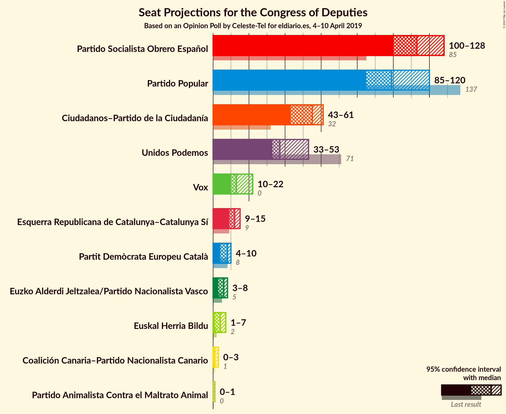
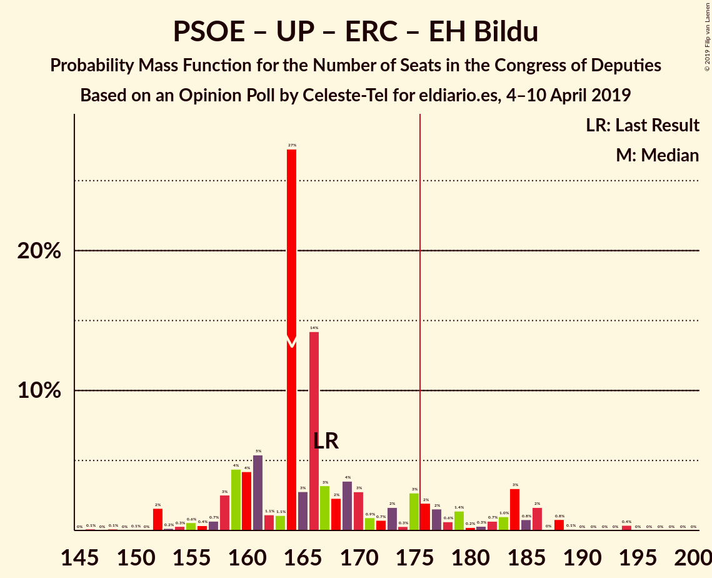
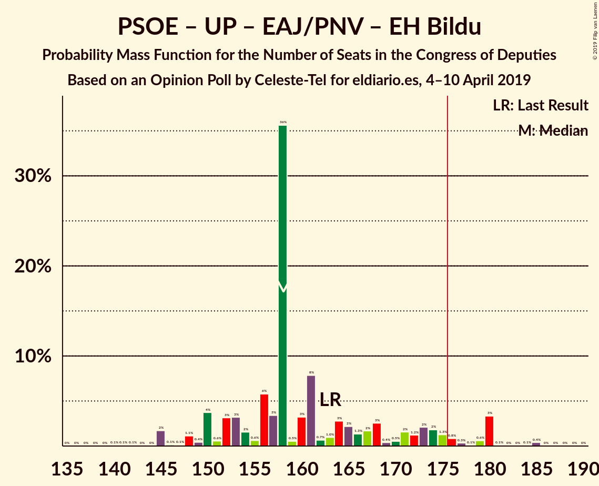
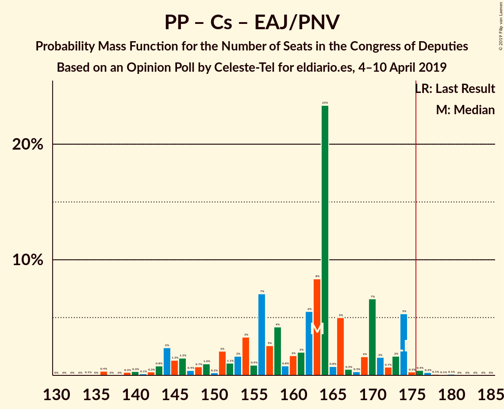
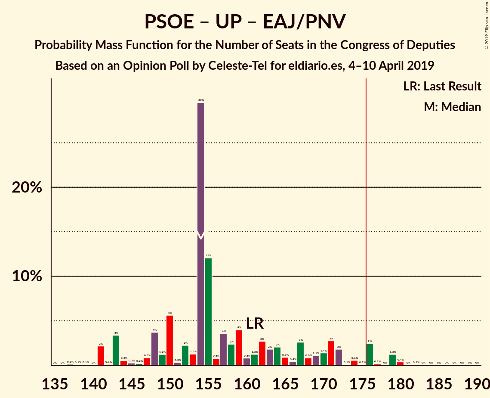
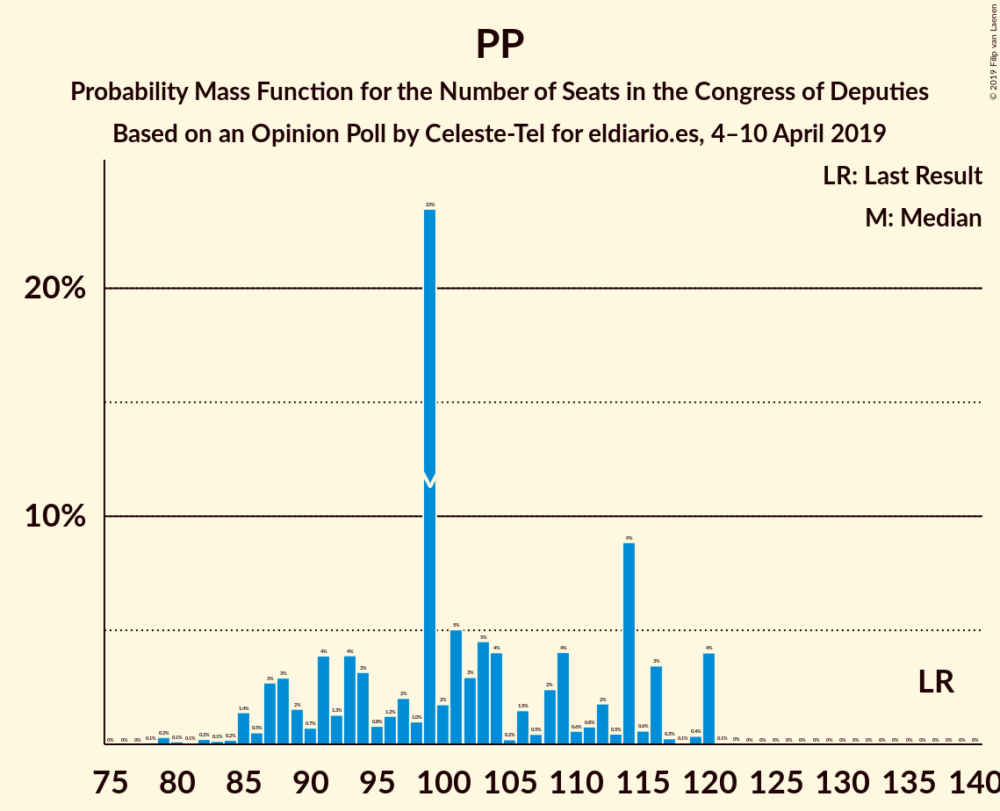

# Opinion Poll by Celeste-Tel for eldiario.es, 4–10 April 2019

<a href="#voting-intentions">Voting Intentions</a> | <a href="#seats">Seats</a> | <a href="#coalitions">Coalitions</a> | <a href="#technical-information">Technical Information</a>

## Voting Intentions

### Confidence Intervals

| Party | Last Result | Poll Result | 80% Confidence Interval | 90% Confidence Interval | 95% Confidence Interval | 99% Confidence Interval |
|:-----:|:-----------:|:-----------:|:-----------------------:|:-----------------------:|:-----------------------:|:-----------------------:|
| Partido Socialista Obrero Español | 22.6% | 27.3% | 25.6–29.1% |25.1–29.6% |24.7–30.0% |23.9–30.8% |
| Partido Popular | 33.0% | 23.9% | 22.3–25.6% |21.9–26.1% |21.5–26.5% |20.7–27.4% |
| Ciudadanos–Partido de la Ciudadanía | 13.1% | 15.9% | 14.6–17.4% |14.2–17.8% |13.9–18.2% |13.2–18.9% |
| Unidos Podemos | 21.2% | 14.6% | 13.3–16.1% |13.0–16.5% |12.7–16.9% |12.1–17.6% |
| Vox | 0.2% | 7.8% | 6.9–9.0% |6.6–9.3% |6.4–9.6% |5.9–10.1% |
| Esquerra Republicana de Catalunya–Catalunya Sí | 2.7% | 2.8% | 2.3–3.6% |2.1–3.8% |2.0–4.0% |1.8–4.4% |
| Partit Demòcrata Europeu Català | 2.0% | 1.6% | 1.2–2.3% |1.1–2.4% |1.0–2.6% |0.9–2.9% |
| Partido Animalista Contra el Maltrato Animal | 1.2% | 1.5% | 1.2–2.1% |1.1–2.3% |1.0–2.5% |0.8–2.8% |
| Euzko Alderdi Jeltzalea/Partido Nacionalista Vasco | 1.2% | 1.2% | 0.9–1.7% |0.8–1.9% |0.7–2.0% |0.6–2.3% |
| Euskal Herria Bildu | 0.8% | 0.8% | 0.6–1.3% |0.5–1.4% |0.4–1.6% |0.3–1.8% |
| Coalición Canaria–Partido Nacionalista Canario | 0.3% | 0.3% | 0.2–0.6% |0.1–0.7% |0.1–0.8% |0.1–1.0% |

*Note:* The poll result column reflects the actual value used in the calculations. Published results may vary slightly, and in addition be rounded to fewer digits.

## Seats

### Confidence Intervals

| Party | Last Result | Median | 80% Confidence Interval | 90% Confidence Interval | 95% Confidence Interval | 99% Confidence Interval |
|:-----:|:-----------:|:------:|:-----------------------:|:-----------------------:|:-----------------------:|:-----------------------:|
| <a href="#partido-socialista-obrero-español">Partido Socialista Obrero Español</a> | 85 | 114 | 104–118 |104–126 |103–126 |96–130 |
| <a href="#partido-popular">Partido Popular</a> | 137 | 103 | 91–109 |87–111 |87–114 |86–116 |
| <a href="#ciudadanos–partido-de-la-ciudadanía">Ciudadanos–Partido de la Ciudadanía</a> | 32 | 56 | 51–59 |50–60 |42–60 |37–62 |
| <a href="#unidos-podemos">Unidos Podemos</a> | 71 | 37 | 35–42 |34–52 |34–54 |30–54 |
| <a href="#vox">Vox</a> | 0 | 13 | 11–23 |10–23 |10–23 |9–23 |
| <a href="#esquerra-republicana-de-catalunya–catalunya-sí">Esquerra Republicana de Catalunya–Catalunya Sí</a> | 9 | 13 | 10–15 |10–15 |9–15 |8–17 |
| <a href="#partit-demòcrata-europeu-català">Partit Demòcrata Europeu Català</a> | 8 | 6 | 4–9 |4–9 |3–9 |3–11 |
| <a href="#partido-animalista-contra-el-maltrato-animal">Partido Animalista Contra el Maltrato Animal</a> | 0 | 0 | 0–1 |0–1 |0–1 |0–1 |
| <a href="#euzko-alderdi-jeltzalea/partido-nacionalista-vasco">Euzko Alderdi Jeltzalea/Partido Nacionalista Vasco</a> | 5 | 7 | 3–8 |3–8 |3–8 |2–10 |
| <a href="#euskal-herria-bildu">Euskal Herria Bildu</a> | 2 | 3 | 2–5 |1–5 |1–6 |0–7 |
| <a href="#coalición-canaria–partido-nacionalista-canario">Coalición Canaria–Partido Nacionalista Canario</a> | 1 | 1 | 0–1 |0–2 |0–3 |0–4 |

### Partido Socialista Obrero Español

*For a full overview of the results for this party, see the [Partido Socialista Obrero Español](party-partidosocialistaobreroespañol.html) page.*

| Number of Seats | Probability | Accumulated | Special Marks |
|:---------------:|:-----------:|:-----------:|:-------------:|
| 85 | 0% | 100% | Last Result |
| 86 | 0% | 100% |  |
| 87 | 0% | 100% |  |
| 88 | 0% | 100% |  |
| 89 | 0% | 100% |  |
| 90 | 0% | 100% |  |
| 91 | 0% | 100% |  |
| 92 | 0% | 100% |  |
| 93 | 0% | 99.9% |  |
| 94 | 0% | 99.9% |  |
| 95 | 0.3% | 99.9% |  |
| 96 | 0.1% | 99.6% |  |
| 97 | 0% | 99.5% |  |
| 98 | 0.1% | 99.4% |  |
| 99 | 0% | 99.3% |  |
| 100 | 0.1% | 99.3% |  |
| 101 | 0% | 99.3% |  |
| 102 | 1.0% | 99.2% |  |
| 103 | 1.4% | 98% |  |
| 104 | 23% | 97% |  |
| 105 | 1.5% | 74% |  |
| 106 | 0.4% | 72% |  |
| 107 | 0.2% | 72% |  |
| 108 | 0.4% | 72% |  |
| 109 | 5% | 71% |  |
| 110 | 0.4% | 67% |  |
| 111 | 12% | 66% |  |
| 112 | 0.1% | 54% |  |
| 113 | 3% | 54% |  |
| 114 | 9% | 51% | Median |
| 115 | 0.9% | 42% |  |
| 116 | 29% | 41% |  |
| 117 | 0.6% | 11% |  |
| 118 | 1.0% | 11% |  |
| 119 | 0.2% | 10% |  |
| 120 | 0.3% | 10% |  |
| 121 | 0.1% | 9% |  |
| 122 | 1.5% | 9% |  |
| 123 | 0.5% | 8% |  |
| 124 | 0.1% | 7% |  |
| 125 | 0.1% | 7% |  |
| 126 | 6% | 7% |  |
| 127 | 0.4% | 1.2% |  |
| 128 | 0% | 0.9% |  |
| 129 | 0.3% | 0.9% |  |
| 130 | 0.5% | 0.6% |  |
| 131 | 0.1% | 0.2% |  |
| 132 | 0% | 0.1% |  |
| 133 | 0% | 0.1% |  |
| 134 | 0% | 0.1% |  |
| 135 | 0% | 0% |  |

### Partido Popular

*For a full overview of the results for this party, see the [Partido Popular](party-partidopopular.html) page.*

| Number of Seats | Probability | Accumulated | Special Marks |
|:---------------:|:-----------:|:-----------:|:-------------:|
| 80 | 0% | 100% |  |
| 81 | 0% | 99.9% |  |
| 82 | 0.1% | 99.9% |  |
| 83 | 0% | 99.9% |  |
| 84 | 0% | 99.8% |  |
| 85 | 0.2% | 99.8% |  |
| 86 | 1.4% | 99.6% |  |
| 87 | 4% | 98% |  |
| 88 | 0.7% | 94% |  |
| 89 | 0.8% | 94% |  |
| 90 | 0.3% | 93% |  |
| 91 | 4% | 93% |  |
| 92 | 7% | 89% |  |
| 93 | 11% | 81% |  |
| 94 | 4% | 70% |  |
| 95 | 0.1% | 66% |  |
| 96 | 2% | 66% |  |
| 97 | 0.3% | 64% |  |
| 98 | 0.2% | 63% |  |
| 99 | 0.5% | 63% |  |
| 100 | 3% | 63% |  |
| 101 | 0.1% | 59% |  |
| 102 | 0.2% | 59% |  |
| 103 | 27% | 59% | Median |
| 104 | 0.1% | 32% |  |
| 105 | 0.1% | 32% |  |
| 106 | 1.4% | 32% |  |
| 107 | 0.6% | 30% |  |
| 108 | 0% | 30% |  |
| 109 | 24% | 30% |  |
| 110 | 0.8% | 6% |  |
| 111 | 2% | 5% |  |
| 112 | 0% | 3% |  |
| 113 | 0.8% | 3% |  |
| 114 | 1.4% | 3% |  |
| 115 | 0.4% | 1.2% |  |
| 116 | 0.4% | 0.8% |  |
| 117 | 0% | 0.4% |  |
| 118 | 0% | 0.4% |  |
| 119 | 0.1% | 0.4% |  |
| 120 | 0.1% | 0.3% |  |
| 121 | 0.1% | 0.2% |  |
| 122 | 0% | 0.1% |  |
| 123 | 0% | 0% |  |
| 124 | 0% | 0% |  |
| 125 | 0% | 0% |  |
| 126 | 0% | 0% |  |
| 127 | 0% | 0% |  |
| 128 | 0% | 0% |  |
| 129 | 0% | 0% |  |
| 130 | 0% | 0% |  |
| 131 | 0% | 0% |  |
| 132 | 0% | 0% |  |
| 133 | 0% | 0% |  |
| 134 | 0% | 0% |  |
| 135 | 0% | 0% |  |
| 136 | 0% | 0% |  |
| 137 | 0% | 0% | Last Result |

### Ciudadanos–Partido de la Ciudadanía

*For a full overview of the results for this party, see the [Ciudadanos–Partido de la Ciudadanía](party-ciudadanos–partidodelaciudadanía.html) page.*

| Number of Seats | Probability | Accumulated | Special Marks |
|:---------------:|:-----------:|:-----------:|:-------------:|
| 32 | 0% | 100% | Last Result |
| 33 | 0% | 100% |  |
| 34 | 0% | 100% |  |
| 35 | 0.4% | 100% |  |
| 36 | 0% | 99.6% |  |
| 37 | 0.5% | 99.6% |  |
| 38 | 0% | 99.1% |  |
| 39 | 0.2% | 99.1% |  |
| 40 | 0.4% | 98.9% |  |
| 41 | 0% | 98.5% |  |
| 42 | 1.1% | 98% |  |
| 43 | 0% | 97% |  |
| 44 | 1.2% | 97% |  |
| 45 | 0.1% | 96% |  |
| 46 | 0.3% | 96% |  |
| 47 | 0.5% | 96% |  |
| 48 | 0.1% | 95% |  |
| 49 | 0.2% | 95% |  |
| 50 | 0.2% | 95% |  |
| 51 | 29% | 95% |  |
| 52 | 1.3% | 66% |  |
| 53 | 2% | 65% |  |
| 54 | 0.8% | 63% |  |
| 55 | 12% | 62% |  |
| 56 | 1.1% | 50% | Median |
| 57 | 3% | 49% |  |
| 58 | 32% | 46% |  |
| 59 | 7% | 14% |  |
| 60 | 6% | 7% |  |
| 61 | 0.4% | 1.4% |  |
| 62 | 0.6% | 1.0% |  |
| 63 | 0.2% | 0.4% |  |
| 64 | 0% | 0.2% |  |
| 65 | 0% | 0.2% |  |
| 66 | 0% | 0.1% |  |
| 67 | 0% | 0.1% |  |
| 68 | 0% | 0% |  |

### Unidos Podemos

*For a full overview of the results for this party, see the [Unidos Podemos](party-unidospodemos.html) page.*

| Number of Seats | Probability | Accumulated | Special Marks |
|:---------------:|:-----------:|:-----------:|:-------------:|
| 29 | 0% | 100% |  |
| 30 | 0.5% | 99.9% |  |
| 31 | 0.7% | 99.4% |  |
| 32 | 0.5% | 98.8% |  |
| 33 | 0.1% | 98% |  |
| 34 | 4% | 98% |  |
| 35 | 28% | 94% |  |
| 36 | 5% | 66% |  |
| 37 | 23% | 61% | Median |
| 38 | 6% | 38% |  |
| 39 | 3% | 32% |  |
| 40 | 2% | 29% |  |
| 41 | 14% | 27% |  |
| 42 | 3% | 13% |  |
| 43 | 0.4% | 10% |  |
| 44 | 0.3% | 9% |  |
| 45 | 0.4% | 9% |  |
| 46 | 0.1% | 9% |  |
| 47 | 0% | 9% |  |
| 48 | 0.1% | 9% |  |
| 49 | 0.5% | 8% |  |
| 50 | 0.1% | 8% |  |
| 51 | 0.1% | 8% |  |
| 52 | 4% | 8% |  |
| 53 | 0.2% | 4% |  |
| 54 | 4% | 4% |  |
| 55 | 0% | 0.2% |  |
| 56 | 0% | 0.2% |  |
| 57 | 0.1% | 0.2% |  |
| 58 | 0% | 0% |  |
| 59 | 0% | 0% |  |
| 60 | 0% | 0% |  |
| 61 | 0% | 0% |  |
| 62 | 0% | 0% |  |
| 63 | 0% | 0% |  |
| 64 | 0% | 0% |  |
| 65 | 0% | 0% |  |
| 66 | 0% | 0% |  |
| 67 | 0% | 0% |  |
| 68 | 0% | 0% |  |
| 69 | 0% | 0% |  |
| 70 | 0% | 0% |  |
| 71 | 0% | 0% | Last Result |

### Vox

*For a full overview of the results for this party, see the [Vox](party-vox.html) page.*

| Number of Seats | Probability | Accumulated | Special Marks |
|:---------------:|:-----------:|:-----------:|:-------------:|
| 0 | 0% | 100% | Last Result |
| 1 | 0% | 100% |  |
| 2 | 0% | 100% |  |
| 3 | 0% | 100% |  |
| 4 | 0% | 100% |  |
| 5 | 0% | 100% |  |
| 6 | 0% | 100% |  |
| 7 | 0.1% | 100% |  |
| 8 | 0.3% | 99.9% |  |
| 9 | 2% | 99.7% |  |
| 10 | 4% | 98% |  |
| 11 | 23% | 94% |  |
| 12 | 5% | 71% |  |
| 13 | 40% | 66% | Median |
| 14 | 4% | 26% |  |
| 15 | 0.8% | 22% |  |
| 16 | 0.1% | 22% |  |
| 17 | 6% | 22% |  |
| 18 | 2% | 16% |  |
| 19 | 0.8% | 14% |  |
| 20 | 0.4% | 13% |  |
| 21 | 1.0% | 13% |  |
| 22 | 0.4% | 12% |  |
| 23 | 11% | 11% |  |
| 24 | 0.1% | 0.1% |  |
| 25 | 0% | 0% |  |

### Esquerra Republicana de Catalunya–Catalunya Sí

*For a full overview of the results for this party, see the [Esquerra Republicana de Catalunya–Catalunya Sí](party-esquerrarepublicanadecatalunya–catalunyasí.html) page.*

| Number of Seats | Probability | Accumulated | Special Marks |
|:---------------:|:-----------:|:-----------:|:-------------:|
| 6 | 0.1% | 100% |  |
| 7 | 0.1% | 99.9% |  |
| 8 | 0.3% | 99.8% |  |
| 9 | 3% | 99.5% | Last Result |
| 10 | 11% | 97% |  |
| 11 | 11% | 86% |  |
| 12 | 1.1% | 74% |  |
| 13 | 33% | 73% | Median |
| 14 | 11% | 40% |  |
| 15 | 29% | 29% |  |
| 16 | 0.1% | 0.7% |  |
| 17 | 0.5% | 0.6% |  |
| 18 | 0% | 0.2% |  |
| 19 | 0.1% | 0.2% |  |
| 20 | 0.1% | 0.1% |  |
| 21 | 0% | 0% |  |

### Partit Demòcrata Europeu Català

*For a full overview of the results for this party, see the [Partit Demòcrata Europeu Català](party-partitdemòcrataeuropeucatalà.html) page.*

| Number of Seats | Probability | Accumulated | Special Marks |
|:---------------:|:-----------:|:-----------:|:-------------:|
| 1 | 0.1% | 100% |  |
| 2 | 0.1% | 99.9% |  |
| 3 | 4% | 99.8% |  |
| 4 | 40% | 96% |  |
| 5 | 4% | 56% |  |
| 6 | 3% | 53% | Median |
| 7 | 2% | 50% |  |
| 8 | 19% | 48% | Last Result |
| 9 | 27% | 29% |  |
| 10 | 0.7% | 1.4% |  |
| 11 | 0.6% | 0.7% |  |
| 12 | 0.1% | 0.1% |  |
| 13 | 0% | 0% |  |

### Partido Animalista Contra el Maltrato Animal

*For a full overview of the results for this party, see the [Partido Animalista Contra el Maltrato Animal](party-partidoanimalistacontraelmaltratoanimal.html) page.*

| Number of Seats | Probability | Accumulated | Special Marks |
|:---------------:|:-----------:|:-----------:|:-------------:|
| 0 | 83% | 100% | Last Result, Median |
| 1 | 17% | 17% |  |
| 2 | 0% | 0% |  |

### Euzko Alderdi Jeltzalea/Partido Nacionalista Vasco

*For a full overview of the results for this party, see the [Euzko Alderdi Jeltzalea/Partido Nacionalista Vasco](party-euzkoalderdijeltzaleapartidonacionalistavasco.html) page.*

| Number of Seats | Probability | Accumulated | Special Marks |
|:---------------:|:-----------:|:-----------:|:-------------:|
| 2 | 0.8% | 100% |  |
| 3 | 19% | 99.2% |  |
| 4 | 1.1% | 80% |  |
| 5 | 0.9% | 79% | Last Result |
| 6 | 20% | 78% |  |
| 7 | 24% | 57% | Median |
| 8 | 31% | 33% |  |
| 9 | 0% | 2% |  |
| 10 | 2% | 2% |  |
| 11 | 0% | 0% |  |

### Euskal Herria Bildu

*For a full overview of the results for this party, see the [Euskal Herria Bildu](party-euskalherriabildu.html) page.*

| Number of Seats | Probability | Accumulated | Special Marks |
|:---------------:|:-----------:|:-----------:|:-------------:|
| 0 | 1.5% | 100% |  |
| 1 | 8% | 98.5% |  |
| 2 | 39% | 91% | Last Result |
| 3 | 3% | 52% | Median |
| 4 | 24% | 49% |  |
| 5 | 20% | 25% |  |
| 6 | 2% | 4% |  |
| 7 | 2% | 2% |  |
| 8 | 0.3% | 0.4% |  |
| 9 | 0% | 0% |  |

### Coalición Canaria–Partido Nacionalista Canario

*For a full overview of the results for this party, see the [Coalición Canaria–Partido Nacionalista Canario](party-coalicióncanaria–partidonacionalistacanario.html) page.*

| Number of Seats | Probability | Accumulated | Special Marks |
|:---------------:|:-----------:|:-----------:|:-------------:|
| 0 | 50% | 100% |  |
| 1 | 45% | 50% | Last Result, Median |
| 2 | 2% | 6% |  |
| 3 | 3% | 4% |  |
| 4 | 0.7% | 0.7% |  |
| 5 | 0% | 0% |  |

## Coalitions

### Confidence Intervals

| Coalition | Last Result | Median | Majority? | 80% Confidence Interval | 90% Confidence Interval | 95% Confidence Interval | 99% Confidence Interval |
|:---------:|:-----------:|:------:|:---------:|:-----------------------:|:-----------------------:|:-----------------------:|:-----------------------:|
| Partido Socialista Obrero Español – Partido Popular – Ciudadanos–Partido de la Ciudadanía | 254 | 270 | 100% | 259–272 | 259–276 | 259–276 | 252–277 |
| Partido Socialista Obrero Español – Ciudadanos–Partido de la Ciudadanía – Unidos Podemos | 188 | 202 | 100% | 199–222 | 194–223 | 192–225 | 185–225 |
| Partido Socialista Obrero Español – Partido Popular | 222 | 213 | 100% | 204–219 | 201–219 | 201–224 | 195–228 |
| Partido Socialista Obrero Español – Unidos Podemos – Esquerra Republicana de Catalunya–Catalunya Sí – Partit Demòcrata Europeu Català – Euzko Alderdi Jeltzalea/Partido Nacionalista Vasco – Euskal Herria Bildu | 180 | 183 | 72% | 171–186 | 171–192 | 171–192 | 163–195 |
| Partido Socialista Obrero Español – Unidos Podemos – Esquerra Republicana de Catalunya–Catalunya Sí – Euskal Herria Bildu | 167 | 166 | 17% | 160–176 | 160–178 | 159–185 | 147–185 |
| Partido Socialista Obrero Español – Unidos Podemos – Esquerra Republicana de Catalunya–Catalunya Sí – Partit Demòcrata Europeu Català | 173 | 173 | 18% | 160–179 | 160–181 | 160–184 | 154–187 |
| Partido Socialista Obrero Español – Ciudadanos–Partido de la Ciudadanía | 117 | 167 | 10% | 162–174 | 155–184 | 153–184 | 147–184 |
| Partido Popular – Ciudadanos–Partido de la Ciudadanía – Vox | 169 | 167 | 27% | 163–178 | 158–178 | 158–178 | 153–186 |
| Partido Socialista Obrero Español – Unidos Podemos – Euzko Alderdi Jeltzalea/Partido Nacionalista Vasco – Euskal Herria Bildu | 163 | 161 | 0.7% | 152–171 | 152–171 | 152–174 | 145–177 |
| Partido Popular – Ciudadanos–Partido de la Ciudadanía – Euzko Alderdi Jeltzalea/Partido Nacionalista Vasco | 174 | 162 | 2% | 151–174 | 149–174 | 149–174 | 145–177 |
| Partido Socialista Obrero Español – Unidos Podemos – Euzko Alderdi Jeltzalea/Partido Nacionalista Vasco | 161 | 159 | 0.2% | 148–169 | 148–170 | 148–170 | 141–172 |
| Partido Popular – Ciudadanos–Partido de la Ciudadanía – Coalición Canaria–Partido Nacionalista Canario | 170 | 154 | 0% | 148–168 | 146–168 | 146–168 | 141–172 |
| Partido Popular – Ciudadanos–Partido de la Ciudadanía | 169 | 154 | 0% | 148–167 | 146–167 | 145–167 | 140–171 |
| Partido Socialista Obrero Español – Unidos Podemos | 156 | 151 | 0.1% | 141–164 | 141–164 | 141–166 | 136–168 |
| Partido Popular – Vox | 137 | 116 | 0% | 104–120 | 102–124 | 99–128 | 99–134 |
| Partido Socialista Obrero Español | 85 | 114 | 0% | 104–118 | 104–126 | 103–126 | 96–130 |
| Partido Popular | 137 | 103 | 0% | 91–109 | 87–111 | 87–114 | 86–116 |

### Partido Socialista Obrero Español – Partido Popular – Ciudadanos–Partido de la Ciudadanía

| Number of Seats | Probability | Accumulated | Special Marks |
|:---------------:|:-----------:|:-----------:|:-------------:|
| 245 | 0.2% | 100% |  |
| 246 | 0% | 99.8% |  |
| 247 | 0% | 99.8% |  |
| 248 | 0% | 99.8% |  |
| 249 | 0.1% | 99.8% |  |
| 250 | 0% | 99.7% |  |
| 251 | 0% | 99.7% |  |
| 252 | 0.2% | 99.7% |  |
| 253 | 0.1% | 99.5% |  |
| 254 | 0.1% | 99.4% | Last Result |
| 255 | 0.3% | 99.3% |  |
| 256 | 0.6% | 99.0% |  |
| 257 | 0% | 98% |  |
| 258 | 0.4% | 98% |  |
| 259 | 12% | 98% |  |
| 260 | 4% | 86% |  |
| 261 | 0.2% | 82% |  |
| 262 | 2% | 82% |  |
| 263 | 6% | 80% |  |
| 264 | 3% | 74% |  |
| 265 | 0.4% | 71% |  |
| 266 | 1.0% | 71% |  |
| 267 | 0.2% | 70% |  |
| 268 | 5% | 70% |  |
| 269 | 1.1% | 65% |  |
| 270 | 28% | 64% |  |
| 271 | 23% | 36% |  |
| 272 | 3% | 13% |  |
| 273 | 1.5% | 10% | Median |
| 274 | 1.2% | 8% |  |
| 275 | 0.1% | 7% |  |
| 276 | 6% | 7% |  |
| 277 | 0.1% | 0.6% |  |
| 278 | 0.1% | 0.5% |  |
| 279 | 0.3% | 0.4% |  |
| 280 | 0% | 0.1% |  |
| 281 | 0% | 0.1% |  |
| 282 | 0% | 0% |  |

### Partido Socialista Obrero Español – Ciudadanos–Partido de la Ciudadanía – Unidos Podemos

| Number of Seats | Probability | Accumulated | Special Marks |
|:---------------:|:-----------:|:-----------:|:-------------:|
| 183 | 0.1% | 100% |  |
| 184 | 0% | 99.9% |  |
| 185 | 0.5% | 99.9% |  |
| 186 | 0% | 99.4% |  |
| 187 | 0.4% | 99.4% |  |
| 188 | 0.5% | 98.9% | Last Result |
| 189 | 0.3% | 98% |  |
| 190 | 0% | 98% |  |
| 191 | 0.4% | 98% |  |
| 192 | 1.2% | 98% |  |
| 193 | 0.1% | 96% |  |
| 194 | 2% | 96% |  |
| 195 | 0.2% | 94% |  |
| 196 | 0% | 94% |  |
| 197 | 0.1% | 94% |  |
| 198 | 0.4% | 94% |  |
| 199 | 24% | 94% |  |
| 200 | 0.5% | 69% |  |
| 201 | 1.5% | 69% |  |
| 202 | 27% | 67% |  |
| 203 | 0.1% | 40% |  |
| 204 | 0.2% | 40% |  |
| 205 | 0.2% | 40% |  |
| 206 | 0.1% | 40% |  |
| 207 | 13% | 40% | Median |
| 208 | 3% | 26% |  |
| 209 | 0.3% | 24% |  |
| 210 | 1.0% | 23% |  |
| 211 | 0.2% | 22% |  |
| 212 | 0.4% | 22% |  |
| 213 | 2% | 22% |  |
| 214 | 3% | 20% |  |
| 215 | 0% | 16% |  |
| 216 | 0.4% | 16% |  |
| 217 | 0.5% | 16% |  |
| 218 | 1.4% | 15% |  |
| 219 | 0% | 14% |  |
| 220 | 0.4% | 14% |  |
| 221 | 0% | 14% |  |
| 222 | 6% | 14% |  |
| 223 | 3% | 7% |  |
| 224 | 0% | 4% |  |
| 225 | 4% | 4% |  |
| 226 | 0% | 0.1% |  |
| 227 | 0% | 0% |  |

### Partido Socialista Obrero Español – Partido Popular

| Number of Seats | Probability | Accumulated | Special Marks |
|:---------------:|:-----------:|:-----------:|:-------------:|
| 188 | 0.2% | 100% |  |
| 189 | 0% | 99.8% |  |
| 190 | 0% | 99.8% |  |
| 191 | 0% | 99.8% |  |
| 192 | 0% | 99.8% |  |
| 193 | 0% | 99.8% |  |
| 194 | 0% | 99.8% |  |
| 195 | 0.5% | 99.8% |  |
| 196 | 0% | 99.3% |  |
| 197 | 0.1% | 99.3% |  |
| 198 | 0.1% | 99.2% |  |
| 199 | 0.7% | 99.1% |  |
| 200 | 0.4% | 98% |  |
| 201 | 4% | 98% |  |
| 202 | 0.1% | 94% |  |
| 203 | 4% | 94% |  |
| 204 | 11% | 90% |  |
| 205 | 2% | 79% |  |
| 206 | 0% | 78% |  |
| 207 | 2% | 78% |  |
| 208 | 1.3% | 75% |  |
| 209 | 0.1% | 74% |  |
| 210 | 4% | 74% |  |
| 211 | 0.4% | 70% |  |
| 212 | 0.1% | 70% |  |
| 213 | 27% | 70% |  |
| 214 | 0.6% | 43% |  |
| 215 | 0.2% | 42% |  |
| 216 | 0.4% | 42% |  |
| 217 | 0.6% | 41% | Median |
| 218 | 7% | 41% |  |
| 219 | 29% | 34% |  |
| 220 | 2% | 5% |  |
| 221 | 0.1% | 3% |  |
| 222 | 0.3% | 3% | Last Result |
| 223 | 0.1% | 3% |  |
| 224 | 0.6% | 3% |  |
| 225 | 0.4% | 2% |  |
| 226 | 1.0% | 2% |  |
| 227 | 0.2% | 0.7% |  |
| 228 | 0.1% | 0.5% |  |
| 229 | 0% | 0.4% |  |
| 230 | 0% | 0.4% |  |
| 231 | 0% | 0.4% |  |
| 232 | 0% | 0.4% |  |
| 233 | 0.3% | 0.4% |  |
| 234 | 0.1% | 0.2% |  |
| 235 | 0% | 0.1% |  |
| 236 | 0% | 0.1% |  |
| 237 | 0% | 0.1% |  |
| 238 | 0% | 0.1% |  |
| 239 | 0% | 0% |  |

### Partido Socialista Obrero Español – Unidos Podemos – Esquerra Republicana de Catalunya–Catalunya Sí – Partit Demòcrata Europeu Català – Euzko Alderdi Jeltzalea/Partido Nacionalista Vasco – Euskal Herria Bildu

| Number of Seats | Probability | Accumulated | Special Marks |
|:---------------:|:-----------:|:-----------:|:-------------:|
| 160 | 0.3% | 100% |  |
| 161 | 0% | 99.7% |  |
| 162 | 0% | 99.6% |  |
| 163 | 0.2% | 99.6% |  |
| 164 | 0.8% | 99.4% |  |
| 165 | 0% | 98.7% |  |
| 166 | 0% | 98.6% |  |
| 167 | 0% | 98.6% |  |
| 168 | 0.1% | 98.6% |  |
| 169 | 0% | 98.6% |  |
| 170 | 0.1% | 98.5% |  |
| 171 | 25% | 98% |  |
| 172 | 0.1% | 74% |  |
| 173 | 2% | 74% |  |
| 174 | 0.4% | 72% |  |
| 175 | 0.3% | 72% |  |
| 176 | 3% | 72% | Majority |
| 177 | 2% | 69% |  |
| 178 | 11% | 66% |  |
| 179 | 0.4% | 55% |  |
| 180 | 0% | 55% | Last Result, Median |
| 181 | 1.4% | 55% |  |
| 182 | 2% | 53% |  |
| 183 | 28% | 51% |  |
| 184 | 3% | 23% |  |
| 185 | 1.0% | 20% |  |
| 186 | 12% | 19% |  |
| 187 | 0.2% | 7% |  |
| 188 | 0.8% | 6% |  |
| 189 | 0.3% | 6% |  |
| 190 | 0% | 5% |  |
| 191 | 0.1% | 5% |  |
| 192 | 4% | 5% |  |
| 193 | 0.4% | 2% |  |
| 194 | 0.1% | 1.1% |  |
| 195 | 0.5% | 1.0% |  |
| 196 | 0.3% | 0.5% |  |
| 197 | 0% | 0.2% |  |
| 198 | 0.1% | 0.2% |  |
| 199 | 0% | 0.1% |  |
| 200 | 0% | 0.1% |  |
| 201 | 0% | 0.1% |  |
| 202 | 0% | 0.1% |  |
| 203 | 0% | 0.1% |  |
| 204 | 0% | 0.1% |  |
| 205 | 0% | 0.1% |  |
| 206 | 0% | 0% |  |

### Partido Socialista Obrero Español – Unidos Podemos – Esquerra Republicana de Catalunya–Catalunya Sí – Euskal Herria Bildu

| Number of Seats | Probability | Accumulated | Special Marks |
|:---------------:|:-----------:|:-----------:|:-------------:|
| 146 | 0.5% | 100% |  |
| 147 | 0% | 99.5% |  |
| 148 | 0% | 99.5% |  |
| 149 | 0% | 99.5% |  |
| 150 | 0% | 99.5% |  |
| 151 | 0% | 99.5% |  |
| 152 | 0% | 99.5% |  |
| 153 | 0% | 99.4% |  |
| 154 | 0% | 99.4% |  |
| 155 | 0% | 99.4% |  |
| 156 | 0.1% | 99.4% |  |
| 157 | 0.8% | 99.3% |  |
| 158 | 0.1% | 98% |  |
| 159 | 2% | 98% |  |
| 160 | 23% | 97% |  |
| 161 | 0.7% | 74% |  |
| 162 | 1.0% | 73% |  |
| 163 | 2% | 72% |  |
| 164 | 0.3% | 70% |  |
| 165 | 0.2% | 70% |  |
| 166 | 27% | 70% |  |
| 167 | 14% | 42% | Last Result, Median |
| 168 | 2% | 28% |  |
| 169 | 1.1% | 26% |  |
| 170 | 5% | 25% |  |
| 171 | 0.1% | 20% |  |
| 172 | 2% | 20% |  |
| 173 | 0.3% | 18% |  |
| 174 | 0% | 18% |  |
| 175 | 0.6% | 18% |  |
| 176 | 12% | 17% | Majority |
| 177 | 0.1% | 5% |  |
| 178 | 0.1% | 5% |  |
| 179 | 0.1% | 5% |  |
| 180 | 0.1% | 5% |  |
| 181 | 0.5% | 5% |  |
| 182 | 0% | 4% |  |
| 183 | 0.1% | 4% |  |
| 184 | 0.3% | 4% |  |
| 185 | 4% | 4% |  |
| 186 | 0% | 0.2% |  |
| 187 | 0% | 0.1% |  |
| 188 | 0% | 0.1% |  |
| 189 | 0% | 0.1% |  |
| 190 | 0% | 0.1% |  |
| 191 | 0% | 0.1% |  |
| 192 | 0% | 0.1% |  |
| 193 | 0% | 0.1% |  |
| 194 | 0% | 0.1% |  |
| 195 | 0% | 0% |  |

### Partido Socialista Obrero Español – Unidos Podemos – Esquerra Republicana de Catalunya–Catalunya Sí – Partit Demòcrata Europeu Català

| Number of Seats | Probability | Accumulated | Special Marks |
|:---------------:|:-----------:|:-----------:|:-------------:|
| 150 | 0.3% | 100% |  |
| 151 | 0% | 99.7% |  |
| 152 | 0% | 99.7% |  |
| 153 | 0.1% | 99.6% |  |
| 154 | 0.9% | 99.6% |  |
| 155 | 0% | 98.7% |  |
| 156 | 0% | 98.7% |  |
| 157 | 0% | 98.6% |  |
| 158 | 0% | 98.6% |  |
| 159 | 0% | 98.6% |  |
| 160 | 23% | 98.6% |  |
| 161 | 0.2% | 75% |  |
| 162 | 1.3% | 75% |  |
| 163 | 1.1% | 74% |  |
| 164 | 0.3% | 73% |  |
| 165 | 0.3% | 72% |  |
| 166 | 0.8% | 72% |  |
| 167 | 0.3% | 71% |  |
| 168 | 0.3% | 71% |  |
| 169 | 3% | 71% |  |
| 170 | 12% | 67% | Median |
| 171 | 4% | 55% |  |
| 172 | 0.5% | 51% |  |
| 173 | 29% | 51% | Last Result |
| 174 | 0.4% | 21% |  |
| 175 | 3% | 21% |  |
| 176 | 1.3% | 18% | Majority |
| 177 | 0.3% | 17% |  |
| 178 | 5% | 17% |  |
| 179 | 6% | 12% |  |
| 180 | 0.1% | 6% |  |
| 181 | 0.7% | 6% |  |
| 182 | 0.1% | 5% |  |
| 183 | 0.1% | 5% |  |
| 184 | 4% | 5% |  |
| 185 | 0% | 1.0% |  |
| 186 | 0% | 1.0% |  |
| 187 | 0.6% | 1.0% |  |
| 188 | 0.1% | 0.3% |  |
| 189 | 0.1% | 0.3% |  |
| 190 | 0% | 0.2% |  |
| 191 | 0% | 0.2% |  |
| 192 | 0% | 0.1% |  |
| 193 | 0% | 0.1% |  |
| 194 | 0% | 0.1% |  |
| 195 | 0.1% | 0.1% |  |
| 196 | 0% | 0% |  |

### Partido Socialista Obrero Español – Ciudadanos–Partido de la Ciudadanía

| Number of Seats | Probability | Accumulated | Special Marks |
|:---------------:|:-----------:|:-----------:|:-------------:|
| 117 | 0% | 100% | Last Result |
| 118 | 0% | 100% |  |
| 119 | 0% | 100% |  |
| 120 | 0% | 100% |  |
| 121 | 0% | 100% |  |
| 122 | 0% | 100% |  |
| 123 | 0% | 100% |  |
| 124 | 0% | 100% |  |
| 125 | 0% | 100% |  |
| 126 | 0% | 100% |  |
| 127 | 0% | 100% |  |
| 128 | 0% | 100% |  |
| 129 | 0% | 100% |  |
| 130 | 0% | 100% |  |
| 131 | 0% | 100% |  |
| 132 | 0% | 100% |  |
| 133 | 0% | 100% |  |
| 134 | 0% | 100% |  |
| 135 | 0% | 100% |  |
| 136 | 0% | 100% |  |
| 137 | 0% | 100% |  |
| 138 | 0% | 100% |  |
| 139 | 0% | 100% |  |
| 140 | 0% | 100% |  |
| 141 | 0% | 100% |  |
| 142 | 0% | 100% |  |
| 143 | 0.1% | 100% |  |
| 144 | 0.3% | 99.9% |  |
| 145 | 0% | 99.6% |  |
| 146 | 0% | 99.6% |  |
| 147 | 0.4% | 99.6% |  |
| 148 | 0% | 99.2% |  |
| 149 | 0.3% | 99.1% |  |
| 150 | 0.1% | 98.9% |  |
| 151 | 0.4% | 98.8% |  |
| 152 | 0% | 98% |  |
| 153 | 2% | 98% |  |
| 154 | 0.4% | 96% |  |
| 155 | 1.0% | 96% |  |
| 156 | 0% | 95% |  |
| 157 | 0.1% | 95% |  |
| 158 | 0.1% | 94% |  |
| 159 | 1.4% | 94% |  |
| 160 | 1.3% | 93% |  |
| 161 | 0.3% | 92% |  |
| 162 | 23% | 91% |  |
| 163 | 0.2% | 69% |  |
| 164 | 0% | 69% |  |
| 165 | 0.3% | 69% |  |
| 166 | 11% | 68% |  |
| 167 | 29% | 57% |  |
| 168 | 0.6% | 28% |  |
| 169 | 4% | 28% |  |
| 170 | 1.1% | 24% | Median |
| 171 | 0.4% | 23% |  |
| 172 | 6% | 22% |  |
| 173 | 6% | 16% |  |
| 174 | 0.1% | 10% |  |
| 175 | 0.3% | 10% |  |
| 176 | 0.1% | 10% | Majority |
| 177 | 1.0% | 10% |  |
| 178 | 0% | 9% |  |
| 179 | 0.1% | 9% |  |
| 180 | 0.1% | 8% |  |
| 181 | 0.7% | 8% |  |
| 182 | 1.3% | 8% |  |
| 183 | 0% | 6% |  |
| 184 | 6% | 6% |  |
| 185 | 0% | 0.4% |  |
| 186 | 0% | 0.4% |  |
| 187 | 0.3% | 0.4% |  |
| 188 | 0% | 0% |  |

### Partido Popular – Ciudadanos–Partido de la Ciudadanía – Vox

| Number of Seats | Probability | Accumulated | Special Marks |
|:---------------:|:-----------:|:-----------:|:-------------:|
| 143 | 0% | 100% |  |
| 144 | 0% | 99.9% |  |
| 145 | 0% | 99.9% |  |
| 146 | 0% | 99.9% |  |
| 147 | 0% | 99.9% |  |
| 148 | 0% | 99.9% |  |
| 149 | 0% | 99.9% |  |
| 150 | 0% | 99.9% |  |
| 151 | 0.1% | 99.8% |  |
| 152 | 0% | 99.8% |  |
| 153 | 0.7% | 99.8% |  |
| 154 | 0.1% | 99.1% |  |
| 155 | 0.1% | 99.0% |  |
| 156 | 0% | 98.9% |  |
| 157 | 0.7% | 98.8% |  |
| 158 | 4% | 98% |  |
| 159 | 0.1% | 94% |  |
| 160 | 0.5% | 94% |  |
| 161 | 0.4% | 94% |  |
| 162 | 1.1% | 93% |  |
| 163 | 9% | 92% |  |
| 164 | 4% | 84% |  |
| 165 | 3% | 79% |  |
| 166 | 1.4% | 77% |  |
| 167 | 28% | 75% |  |
| 168 | 2% | 47% |  |
| 169 | 0.1% | 45% | Last Result |
| 170 | 0.1% | 45% |  |
| 171 | 11% | 45% |  |
| 172 | 5% | 34% | Median |
| 173 | 0.2% | 28% |  |
| 174 | 0.7% | 28% |  |
| 175 | 0.6% | 28% |  |
| 176 | 0.7% | 27% | Majority |
| 177 | 0.1% | 26% |  |
| 178 | 24% | 26% |  |
| 179 | 0.9% | 2% |  |
| 180 | 0.1% | 1.5% |  |
| 181 | 0% | 1.4% |  |
| 182 | 0% | 1.4% |  |
| 183 | 0.8% | 1.4% |  |
| 184 | 0% | 0.6% |  |
| 185 | 0% | 0.6% |  |
| 186 | 0.1% | 0.5% |  |
| 187 | 0% | 0.4% |  |
| 188 | 0.4% | 0.4% |  |
| 189 | 0% | 0% |  |

### Partido Socialista Obrero Español – Unidos Podemos – Euzko Alderdi Jeltzalea/Partido Nacionalista Vasco – Euskal Herria Bildu

| Number of Seats | Probability | Accumulated | Special Marks |
|:---------------:|:-----------:|:-----------:|:-------------:|
| 141 | 0.4% | 100% |  |
| 142 | 0% | 99.6% |  |
| 143 | 0% | 99.6% |  |
| 144 | 0.1% | 99.6% |  |
| 145 | 0.1% | 99.6% |  |
| 146 | 0% | 99.4% |  |
| 147 | 0% | 99.4% |  |
| 148 | 0.8% | 99.4% |  |
| 149 | 0.1% | 98.6% |  |
| 150 | 0.4% | 98.5% |  |
| 151 | 0.1% | 98% |  |
| 152 | 23% | 98% |  |
| 153 | 2% | 75% |  |
| 154 | 2% | 74% |  |
| 155 | 0.1% | 71% |  |
| 156 | 0.9% | 71% |  |
| 157 | 0.3% | 70% |  |
| 158 | 0.5% | 70% |  |
| 159 | 0.1% | 69% |  |
| 160 | 15% | 69% |  |
| 161 | 29% | 54% | Median |
| 162 | 1.3% | 25% |  |
| 163 | 4% | 23% | Last Result |
| 164 | 0.2% | 20% |  |
| 165 | 0.6% | 20% |  |
| 166 | 0.4% | 19% |  |
| 167 | 0.4% | 19% |  |
| 168 | 1.4% | 18% |  |
| 169 | 2% | 17% |  |
| 170 | 0.5% | 15% |  |
| 171 | 10% | 15% |  |
| 172 | 0% | 5% |  |
| 173 | 0% | 5% |  |
| 174 | 4% | 5% |  |
| 175 | 0.1% | 0.8% |  |
| 176 | 0.1% | 0.7% | Majority |
| 177 | 0.4% | 0.6% |  |
| 178 | 0% | 0.2% |  |
| 179 | 0% | 0.2% |  |
| 180 | 0% | 0.2% |  |
| 181 | 0% | 0.2% |  |
| 182 | 0% | 0.1% |  |
| 183 | 0% | 0.1% |  |
| 184 | 0.1% | 0.1% |  |
| 185 | 0% | 0% |  |

### Partido Popular – Ciudadanos–Partido de la Ciudadanía – Euzko Alderdi Jeltzalea/Partido Nacionalista Vasco

| Number of Seats | Probability | Accumulated | Special Marks |
|:---------------:|:-----------:|:-----------:|:-------------:|
| 134 | 0.1% | 100% |  |
| 135 | 0% | 99.9% |  |
| 136 | 0% | 99.9% |  |
| 137 | 0% | 99.8% |  |
| 138 | 0% | 99.8% |  |
| 139 | 0% | 99.8% |  |
| 140 | 0% | 99.8% |  |
| 141 | 0% | 99.7% |  |
| 142 | 0% | 99.7% |  |
| 143 | 0% | 99.7% |  |
| 144 | 0.1% | 99.7% |  |
| 145 | 0.3% | 99.6% |  |
| 146 | 0.4% | 99.4% |  |
| 147 | 0% | 99.0% |  |
| 148 | 0.2% | 98.9% |  |
| 149 | 4% | 98.7% |  |
| 150 | 0.2% | 95% |  |
| 151 | 11% | 95% |  |
| 152 | 3% | 84% |  |
| 153 | 0.3% | 81% |  |
| 154 | 3% | 80% |  |
| 155 | 2% | 78% |  |
| 156 | 7% | 75% |  |
| 157 | 0.5% | 68% |  |
| 158 | 0% | 68% |  |
| 159 | 1.4% | 68% |  |
| 160 | 4% | 66% |  |
| 161 | 1.4% | 63% |  |
| 162 | 30% | 61% |  |
| 163 | 0.6% | 31% |  |
| 164 | 2% | 31% |  |
| 165 | 1.5% | 28% |  |
| 166 | 0.1% | 27% | Median |
| 167 | 0% | 27% |  |
| 168 | 1.1% | 27% |  |
| 169 | 1.3% | 26% |  |
| 170 | 0% | 24% |  |
| 171 | 0% | 24% |  |
| 172 | 0.1% | 24% |  |
| 173 | 0.1% | 24% |  |
| 174 | 22% | 24% | Last Result |
| 175 | 0% | 2% |  |
| 176 | 0% | 2% | Majority |
| 177 | 1.4% | 2% |  |
| 178 | 0% | 0.2% |  |
| 179 | 0% | 0.2% |  |
| 180 | 0.1% | 0.2% |  |
| 181 | 0% | 0% |  |

### Partido Socialista Obrero Español – Unidos Podemos – Euzko Alderdi Jeltzalea/Partido Nacionalista Vasco

| Number of Seats | Probability | Accumulated | Special Marks |
|:---------------:|:-----------:|:-----------:|:-------------:|
| 137 | 0.4% | 100% |  |
| 138 | 0% | 99.6% |  |
| 139 | 0% | 99.6% |  |
| 140 | 0% | 99.6% |  |
| 141 | 0.8% | 99.6% |  |
| 142 | 0% | 98.8% |  |
| 143 | 0.1% | 98.8% |  |
| 144 | 0.2% | 98.7% |  |
| 145 | 0.1% | 98% |  |
| 146 | 0.1% | 98% |  |
| 147 | 0.5% | 98% |  |
| 148 | 22% | 98% |  |
| 149 | 2% | 75% |  |
| 150 | 0.3% | 74% |  |
| 151 | 0.1% | 73% |  |
| 152 | 1.1% | 73% |  |
| 153 | 0.1% | 72% |  |
| 154 | 3% | 72% |  |
| 155 | 12% | 69% |  |
| 156 | 3% | 57% |  |
| 157 | 0% | 54% |  |
| 158 | 3% | 54% | Median |
| 159 | 28% | 51% |  |
| 160 | 3% | 24% |  |
| 161 | 1.4% | 20% | Last Result |
| 162 | 0.4% | 19% |  |
| 163 | 0.2% | 19% |  |
| 164 | 2% | 18% |  |
| 165 | 0.5% | 17% |  |
| 166 | 1.5% | 16% |  |
| 167 | 0.1% | 15% |  |
| 168 | 0.5% | 15% |  |
| 169 | 7% | 14% |  |
| 170 | 6% | 7% |  |
| 171 | 0.1% | 0.9% |  |
| 172 | 0.4% | 0.8% |  |
| 173 | 0.1% | 0.4% |  |
| 174 | 0% | 0.3% |  |
| 175 | 0.1% | 0.3% |  |
| 176 | 0% | 0.2% | Majority |
| 177 | 0% | 0.2% |  |
| 178 | 0% | 0.1% |  |
| 179 | 0% | 0.1% |  |
| 180 | 0% | 0.1% |  |
| 181 | 0% | 0.1% |  |
| 182 | 0% | 0.1% |  |
| 183 | 0% | 0% |  |

### Partido Popular – Ciudadanos–Partido de la Ciudadanía – Coalición Canaria–Partido Nacionalista Canario

| Number of Seats | Probability | Accumulated | Special Marks |
|:---------------:|:-----------:|:-----------:|:-------------:|
| 129 | 0.1% | 100% |  |
| 130 | 0% | 99.9% |  |
| 131 | 0.1% | 99.9% |  |
| 132 | 0% | 99.8% |  |
| 133 | 0% | 99.8% |  |
| 134 | 0% | 99.8% |  |
| 135 | 0% | 99.8% |  |
| 136 | 0% | 99.8% |  |
| 137 | 0% | 99.8% |  |
| 138 | 0% | 99.8% |  |
| 139 | 0% | 99.7% |  |
| 140 | 0% | 99.7% |  |
| 141 | 0.4% | 99.7% |  |
| 142 | 0% | 99.2% |  |
| 143 | 0.3% | 99.2% |  |
| 144 | 0% | 98.9% |  |
| 145 | 0.1% | 98.9% |  |
| 146 | 5% | 98.8% |  |
| 147 | 1.1% | 94% |  |
| 148 | 3% | 92% |  |
| 149 | 12% | 89% |  |
| 150 | 8% | 78% |  |
| 151 | 0.6% | 70% |  |
| 152 | 0.7% | 69% |  |
| 153 | 0.5% | 69% |  |
| 154 | 33% | 68% |  |
| 155 | 2% | 35% |  |
| 156 | 0.3% | 32% |  |
| 157 | 0% | 32% |  |
| 158 | 0.2% | 32% |  |
| 159 | 0.6% | 32% |  |
| 160 | 4% | 31% | Median |
| 161 | 0.4% | 27% |  |
| 162 | 0.9% | 27% |  |
| 163 | 0% | 26% |  |
| 164 | 0.6% | 26% |  |
| 165 | 0.1% | 25% |  |
| 166 | 0% | 25% |  |
| 167 | 0.2% | 25% |  |
| 168 | 23% | 25% |  |
| 169 | 0.8% | 2% |  |
| 170 | 1.1% | 2% | Last Result |
| 171 | 0% | 0.5% |  |
| 172 | 0.4% | 0.5% |  |
| 173 | 0.1% | 0.1% |  |
| 174 | 0% | 0% |  |

### Partido Popular – Ciudadanos–Partido de la Ciudadanía

| Number of Seats | Probability | Accumulated | Special Marks |
|:---------------:|:-----------:|:-----------:|:-------------:|
| 128 | 0.1% | 100% |  |
| 129 | 0% | 99.9% |  |
| 130 | 0.1% | 99.9% |  |
| 131 | 0% | 99.8% |  |
| 132 | 0% | 99.8% |  |
| 133 | 0% | 99.8% |  |
| 134 | 0% | 99.8% |  |
| 135 | 0% | 99.8% |  |
| 136 | 0% | 99.8% |  |
| 137 | 0% | 99.7% |  |
| 138 | 0% | 99.7% |  |
| 139 | 0% | 99.7% |  |
| 140 | 0.4% | 99.6% |  |
| 141 | 0% | 99.2% |  |
| 142 | 0.2% | 99.2% |  |
| 143 | 0.3% | 99.0% |  |
| 144 | 1.2% | 98.7% |  |
| 145 | 0.2% | 98% |  |
| 146 | 5% | 97% |  |
| 147 | 0.1% | 92% |  |
| 148 | 15% | 92% |  |
| 149 | 2% | 77% |  |
| 150 | 7% | 75% |  |
| 151 | 0.4% | 69% |  |
| 152 | 0.4% | 68% |  |
| 153 | 2% | 68% |  |
| 154 | 33% | 66% |  |
| 155 | 0.9% | 33% |  |
| 156 | 0.1% | 32% |  |
| 157 | 0.6% | 32% |  |
| 158 | 0.1% | 32% |  |
| 159 | 4% | 31% | Median |
| 160 | 0.1% | 27% |  |
| 161 | 0.9% | 27% |  |
| 162 | 1.0% | 26% |  |
| 163 | 0% | 25% |  |
| 164 | 0% | 25% |  |
| 165 | 0.1% | 25% |  |
| 166 | 1.0% | 25% |  |
| 167 | 22% | 24% |  |
| 168 | 0% | 2% |  |
| 169 | 1.1% | 2% | Last Result |
| 170 | 0% | 0.5% |  |
| 171 | 0.3% | 0.5% |  |
| 172 | 0.1% | 0.2% |  |
| 173 | 0% | 0% |  |

### Partido Socialista Obrero Español – Unidos Podemos

| Number of Seats | Probability | Accumulated | Special Marks |
|:---------------:|:-----------:|:-----------:|:-------------:|
| 131 | 0.4% | 100% |  |
| 132 | 0% | 99.6% |  |
| 133 | 0% | 99.6% |  |
| 134 | 0% | 99.6% |  |
| 135 | 0% | 99.6% |  |
| 136 | 0.1% | 99.6% |  |
| 137 | 0.1% | 99.4% |  |
| 138 | 0.8% | 99.3% |  |
| 139 | 0% | 98.6% |  |
| 140 | 0% | 98.5% |  |
| 141 | 23% | 98% |  |
| 142 | 0.1% | 76% |  |
| 143 | 2% | 76% |  |
| 144 | 1.2% | 74% |  |
| 145 | 0.1% | 73% |  |
| 146 | 0.6% | 73% |  |
| 147 | 0.5% | 72% |  |
| 148 | 3% | 71% |  |
| 149 | 0.4% | 69% |  |
| 150 | 5% | 68% |  |
| 151 | 28% | 64% | Median |
| 152 | 11% | 36% |  |
| 153 | 0.7% | 24% |  |
| 154 | 0.2% | 24% |  |
| 155 | 5% | 24% |  |
| 156 | 0.3% | 19% | Last Result |
| 157 | 0.7% | 19% |  |
| 158 | 2% | 18% |  |
| 159 | 0.7% | 16% |  |
| 160 | 0.1% | 15% |  |
| 161 | 0.2% | 15% |  |
| 162 | 0.3% | 15% |  |
| 163 | 4% | 15% |  |
| 164 | 6% | 11% |  |
| 165 | 0.1% | 5% |  |
| 166 | 4% | 5% |  |
| 167 | 0.1% | 0.6% |  |
| 168 | 0.3% | 0.5% |  |
| 169 | 0% | 0.3% |  |
| 170 | 0% | 0.2% |  |
| 171 | 0.1% | 0.2% |  |
| 172 | 0% | 0.2% |  |
| 173 | 0% | 0.1% |  |
| 174 | 0% | 0.1% |  |
| 175 | 0% | 0.1% |  |
| 176 | 0% | 0.1% | Majority |
| 177 | 0% | 0.1% |  |
| 178 | 0% | 0% |  |

### Partido Popular – Vox

| Number of Seats | Probability | Accumulated | Special Marks |
|:---------------:|:-----------:|:-----------:|:-------------:|
| 94 | 0% | 100% |  |
| 95 | 0% | 99.9% |  |
| 96 | 0.1% | 99.9% |  |
| 97 | 0.1% | 99.8% |  |
| 98 | 0% | 99.8% |  |
| 99 | 4% | 99.8% |  |
| 100 | 0.6% | 96% |  |
| 101 | 0.3% | 95% |  |
| 102 | 0.4% | 95% |  |
| 103 | 2% | 95% |  |
| 104 | 4% | 93% |  |
| 105 | 8% | 89% |  |
| 106 | 0.6% | 82% |  |
| 107 | 0.6% | 81% |  |
| 108 | 2% | 81% |  |
| 109 | 0% | 78% |  |
| 110 | 4% | 78% |  |
| 111 | 0.1% | 75% |  |
| 112 | 0.6% | 75% |  |
| 113 | 3% | 74% |  |
| 114 | 0% | 71% |  |
| 115 | 0.2% | 71% |  |
| 116 | 38% | 71% | Median |
| 117 | 0% | 33% |  |
| 118 | 0.6% | 33% |  |
| 119 | 1.4% | 32% |  |
| 120 | 22% | 31% |  |
| 121 | 0.1% | 8% |  |
| 122 | 2% | 8% |  |
| 123 | 1.1% | 6% |  |
| 124 | 0.1% | 5% |  |
| 125 | 0.6% | 5% |  |
| 126 | 0% | 4% |  |
| 127 | 0.9% | 4% |  |
| 128 | 1.4% | 3% |  |
| 129 | 0.1% | 2% |  |
| 130 | 0.1% | 2% |  |
| 131 | 0% | 2% |  |
| 132 | 0.8% | 2% |  |
| 133 | 0.2% | 0.9% |  |
| 134 | 0.5% | 0.7% |  |
| 135 | 0.1% | 0.2% |  |
| 136 | 0% | 0.1% |  |
| 137 | 0% | 0.1% | Last Result |
| 138 | 0% | 0.1% |  |
| 139 | 0% | 0% |  |

### Partido Socialista Obrero Español

| Number of Seats | Probability | Accumulated | Special Marks |
|:---------------:|:-----------:|:-----------:|:-------------:|
| 85 | 0% | 100% | Last Result |
| 86 | 0% | 100% |  |
| 87 | 0% | 100% |  |
| 88 | 0% | 100% |  |
| 89 | 0% | 100% |  |
| 90 | 0% | 100% |  |
| 91 | 0% | 100% |  |
| 92 | 0% | 100% |  |
| 93 | 0% | 99.9% |  |
| 94 | 0% | 99.9% |  |
| 95 | 0.3% | 99.9% |  |
| 96 | 0.1% | 99.6% |  |
| 97 | 0% | 99.5% |  |
| 98 | 0.1% | 99.4% |  |
| 99 | 0% | 99.3% |  |
| 100 | 0.1% | 99.3% |  |
| 101 | 0% | 99.3% |  |
| 102 | 1.0% | 99.2% |  |
| 103 | 1.4% | 98% |  |
| 104 | 23% | 97% |  |
| 105 | 1.5% | 74% |  |
| 106 | 0.4% | 72% |  |
| 107 | 0.2% | 72% |  |
| 108 | 0.4% | 72% |  |
| 109 | 5% | 71% |  |
| 110 | 0.4% | 67% |  |
| 111 | 12% | 66% |  |
| 112 | 0.1% | 54% |  |
| 113 | 3% | 54% |  |
| 114 | 9% | 51% | Median |
| 115 | 0.9% | 42% |  |
| 116 | 29% | 41% |  |
| 117 | 0.6% | 11% |  |
| 118 | 1.0% | 11% |  |
| 119 | 0.2% | 10% |  |
| 120 | 0.3% | 10% |  |
| 121 | 0.1% | 9% |  |
| 122 | 1.5% | 9% |  |
| 123 | 0.5% | 8% |  |
| 124 | 0.1% | 7% |  |
| 125 | 0.1% | 7% |  |
| 126 | 6% | 7% |  |
| 127 | 0.4% | 1.2% |  |
| 128 | 0% | 0.9% |  |
| 129 | 0.3% | 0.9% |  |
| 130 | 0.5% | 0.6% |  |
| 131 | 0.1% | 0.2% |  |
| 132 | 0% | 0.1% |  |
| 133 | 0% | 0.1% |  |
| 134 | 0% | 0.1% |  |
| 135 | 0% | 0% |  |

### Partido Popular

| Number of Seats | Probability | Accumulated | Special Marks |
|:---------------:|:-----------:|:-----------:|:-------------:|
| 80 | 0% | 100% |  |
| 81 | 0% | 99.9% |  |
| 82 | 0.1% | 99.9% |  |
| 83 | 0% | 99.9% |  |
| 84 | 0% | 99.8% |  |
| 85 | 0.2% | 99.8% |  |
| 86 | 1.4% | 99.6% |  |
| 87 | 4% | 98% |  |
| 88 | 0.7% | 94% |  |
| 89 | 0.8% | 94% |  |
| 90 | 0.3% | 93% |  |
| 91 | 4% | 93% |  |
| 92 | 7% | 89% |  |
| 93 | 11% | 81% |  |
| 94 | 4% | 70% |  |
| 95 | 0.1% | 66% |  |
| 96 | 2% | 66% |  |
| 97 | 0.3% | 64% |  |
| 98 | 0.2% | 63% |  |
| 99 | 0.5% | 63% |  |
| 100 | 3% | 63% |  |
| 101 | 0.1% | 59% |  |
| 102 | 0.2% | 59% |  |
| 103 | 27% | 59% | Median |
| 104 | 0.1% | 32% |  |
| 105 | 0.1% | 32% |  |
| 106 | 1.4% | 32% |  |
| 107 | 0.6% | 30% |  |
| 108 | 0% | 30% |  |
| 109 | 24% | 30% |  |
| 110 | 0.8% | 6% |  |
| 111 | 2% | 5% |  |
| 112 | 0% | 3% |  |
| 113 | 0.8% | 3% |  |
| 114 | 1.4% | 3% |  |
| 115 | 0.4% | 1.2% |  |
| 116 | 0.4% | 0.8% |  |
| 117 | 0% | 0.4% |  |
| 118 | 0% | 0.4% |  |
| 119 | 0.1% | 0.4% |  |
| 120 | 0.1% | 0.3% |  |
| 121 | 0.1% | 0.2% |  |
| 122 | 0% | 0.1% |  |
| 123 | 0% | 0% |  |
| 124 | 0% | 0% |  |
| 125 | 0% | 0% |  |
| 126 | 0% | 0% |  |
| 127 | 0% | 0% |  |
| 128 | 0% | 0% |  |
| 129 | 0% | 0% |  |
| 130 | 0% | 0% |  |
| 131 | 0% | 0% |  |
| 132 | 0% | 0% |  |
| 133 | 0% | 0% |  |
| 134 | 0% | 0% |  |
| 135 | 0% | 0% |  |
| 136 | 0% | 0% |  |
| 137 | 0% | 0% | Last Result |

## Technical Information

### Opinion Poll

+ **Polling firm:** Celeste-Tel
+ **Commissioner(s):** eldiario.es
+ **Fieldwork period:** 4–10 April 2019

### Calculations

+ **Sample size:** 1100
+ **Simulations done:** 131,072
+ **Error estimate:** 2.47%

