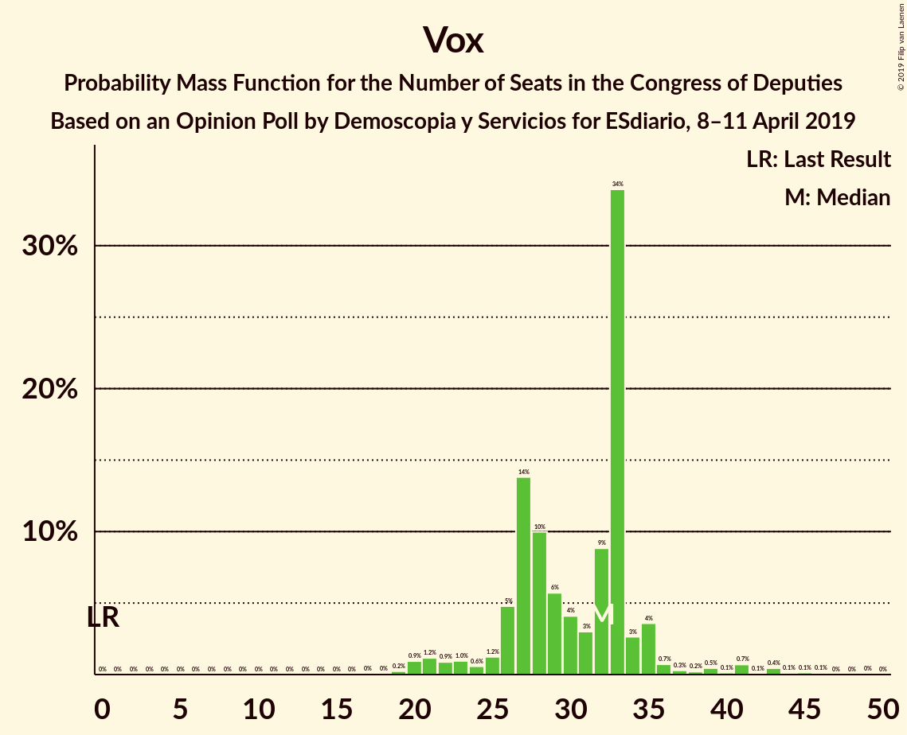

# Opinion Poll by Demoscopia y Servicios for ESdiario, 8–11 April 2019

<a href="#voting-intentions">Voting Intentions</a> | <a href="#seats">Seats</a> | <a href="#coalitions">Coalitions</a> | <a href="#technical-information">Technical Information</a>

## Voting Intentions

### Confidence Intervals

| Party | Last Result | Poll Result | 80% Confidence Interval | 90% Confidence Interval | 95% Confidence Interval | 99% Confidence Interval |
|:-----:|:-----------:|:-----------:|:-----------------------:|:-----------------------:|:-----------------------:|:-----------------------:|
| Partido Socialista Obrero Español | 22.6% | 27.9% | 26.1–29.9% |25.6–30.5% |25.1–30.9% |24.3–31.9% |
| Partido Popular | 33.0% | 20.8% | 19.1–22.6% |18.7–23.1% |18.3–23.5% |17.5–24.4% |
| Ciudadanos–Partido de la Ciudadanía | 13.1% | 16.6% | 15.1–18.3% |14.7–18.8% |14.4–19.2% |13.7–20.0% |
| Unidos Podemos | 21.2% | 14.1% | 12.7–15.7% |12.4–16.2% |12.0–16.5% |11.4–17.3% |
| Vox | 0.2% | 11.7% | 10.5–13.2% |10.1–13.6% |9.8–14.0% |9.2–14.7% |
| Esquerra Republicana de Catalunya–Catalunya Sí | 2.7% | 2.3% | 1.8–3.0% |1.6–3.3% |1.5–3.5% |1.3–3.9% |
| Euzko Alderdi Jeltzalea/Partido Nacionalista Vasco | 1.2% | 1.5% | 1.1–2.2% |1.0–2.4% |0.9–2.5% |0.7–2.9% |
| Partit Demòcrata Europeu Català | 2.0% | 1.2% | 0.8–1.8% |0.7–2.0% |0.7–2.1% |0.5–2.5% |
| Euskal Herria Bildu | 0.8% | 1.1% | 0.8–1.7% |0.7–1.8% |0.6–2.0% |0.5–2.3% |
| Coalición Canaria–Partido Nacionalista Canario | 0.3% | 0.2% | 0.1–0.6% |0.1–0.7% |0.1–0.8% |0.0–1.0% |

*Note:* The poll result column reflects the actual value used in the calculations. Published results may vary slightly, and in addition be rounded to fewer digits.

## Seats

### Confidence Intervals

| Party | Last Result | Median | 80% Confidence Interval | 90% Confidence Interval | 95% Confidence Interval | 99% Confidence Interval |
|:-----:|:-----------:|:------:|:-----------------------:|:-----------------------:|:-----------------------:|:-----------------------:|
| <a href="#partido-socialista-obrero-español">Partido Socialista Obrero Español</a> | 85 | 119 | 110–128 |108–131 |104–135 |100–137 |
| <a href="#partido-popular">Partido Popular</a> | 137 | 78 | 74–89 |71–90 |69–94 |63–101 |
| <a href="#ciudadanos–partido-de-la-ciudadanía">Ciudadanos–Partido de la Ciudadanía</a> | 32 | 54 | 49–60 |49–62 |47–65 |40–67 |
| <a href="#unidos-podemos">Unidos Podemos</a> | 71 | 38 | 34–42 |32–45 |31–47 |25–51 |
| <a href="#vox">Vox</a> | 0 | 32 | 26–33 |25–35 |22–37 |20–43 |
| <a href="#esquerra-republicana-de-catalunya–catalunya-sí">Esquerra Republicana de Catalunya–Catalunya Sí</a> | 9 | 10 | 8–14 |8–14 |7–15 |6–16 |
| <a href="#euzko-alderdi-jeltzalea/partido-nacionalista-vasco">Euzko Alderdi Jeltzalea/Partido Nacionalista Vasco</a> | 5 | 6 | 4–8 |4–8 |3–10 |3–10 |
| <a href="#partit-demòcrata-europeu-català">Partit Demòcrata Europeu Català</a> | 8 | 4 | 2–8 |1–8 |1–9 |1–10 |
| <a href="#euskal-herria-bildu">Euskal Herria Bildu</a> | 2 | 5 | 3–7 |2–8 |2–9 |1–9 |
| <a href="#coalición-canaria–partido-nacionalista-canario">Coalición Canaria–Partido Nacionalista Canario</a> | 1 | 1 | 0–2 |0–2 |0–2 |0–4 |

### Partido Socialista Obrero Español

*For a full overview of the results for this party, see the [Partido Socialista Obrero Español](party-partidosocialistaobreroespañol.html) page.*

| Number of Seats | Probability | Accumulated | Special Marks |
|:---------------:|:-----------:|:-----------:|:-------------:|
| 85 | 0% | 100% | Last Result |
| 86 | 0% | 100% |  |
| 87 | 0% | 100% |  |
| 88 | 0% | 100% |  |
| 89 | 0% | 100% |  |
| 90 | 0% | 100% |  |
| 91 | 0% | 100% |  |
| 92 | 0% | 100% |  |
| 93 | 0% | 100% |  |
| 94 | 0% | 100% |  |
| 95 | 0% | 99.9% |  |
| 96 | 0% | 99.9% |  |
| 97 | 0.1% | 99.9% |  |
| 98 | 0.1% | 99.8% |  |
| 99 | 0.1% | 99.6% |  |
| 100 | 0.3% | 99.6% |  |
| 101 | 0.1% | 99.2% |  |
| 102 | 0.5% | 99.1% |  |
| 103 | 0.2% | 98.6% |  |
| 104 | 1.0% | 98% |  |
| 105 | 0.4% | 97% |  |
| 106 | 0.8% | 97% |  |
| 107 | 1.1% | 96% |  |
| 108 | 1.3% | 95% |  |
| 109 | 4% | 94% |  |
| 110 | 2% | 90% |  |
| 111 | 0.9% | 88% |  |
| 112 | 7% | 87% |  |
| 113 | 5% | 80% |  |
| 114 | 6% | 75% |  |
| 115 | 1.1% | 69% |  |
| 116 | 1.0% | 68% |  |
| 117 | 2% | 67% |  |
| 118 | 14% | 65% |  |
| 119 | 2% | 51% | Median |
| 120 | 6% | 49% |  |
| 121 | 2% | 43% |  |
| 122 | 2% | 41% |  |
| 123 | 0.8% | 39% |  |
| 124 | 1.1% | 38% |  |
| 125 | 14% | 37% |  |
| 126 | 2% | 24% |  |
| 127 | 9% | 22% |  |
| 128 | 5% | 13% |  |
| 129 | 2% | 8% |  |
| 130 | 0.6% | 7% |  |
| 131 | 3% | 6% |  |
| 132 | 0.2% | 3% |  |
| 133 | 0.2% | 3% |  |
| 134 | 0.2% | 3% |  |
| 135 | 0.4% | 3% |  |
| 136 | 0.7% | 2% |  |
| 137 | 1.0% | 1.5% |  |
| 138 | 0.1% | 0.5% |  |
| 139 | 0.1% | 0.4% |  |
| 140 | 0% | 0.2% |  |
| 141 | 0.2% | 0.2% |  |
| 142 | 0% | 0% |  |

### Partido Popular

*For a full overview of the results for this party, see the [Partido Popular](party-partidopopular.html) page.*

| Number of Seats | Probability | Accumulated | Special Marks |
|:---------------:|:-----------:|:-----------:|:-------------:|
| 60 | 0% | 100% |  |
| 61 | 0.1% | 99.9% |  |
| 62 | 0.1% | 99.9% |  |
| 63 | 0.3% | 99.7% |  |
| 64 | 0.1% | 99.5% |  |
| 65 | 0.1% | 99.4% |  |
| 66 | 0% | 99.3% |  |
| 67 | 0.6% | 99.3% |  |
| 68 | 1.0% | 98.7% |  |
| 69 | 1.1% | 98% |  |
| 70 | 0.6% | 97% |  |
| 71 | 2% | 96% |  |
| 72 | 1.1% | 94% |  |
| 73 | 1.3% | 93% |  |
| 74 | 3% | 91% |  |
| 75 | 5% | 88% |  |
| 76 | 5% | 84% |  |
| 77 | 11% | 79% |  |
| 78 | 23% | 67% | Median |
| 79 | 0.9% | 44% |  |
| 80 | 9% | 43% |  |
| 81 | 2% | 34% |  |
| 82 | 2% | 32% |  |
| 83 | 3% | 30% |  |
| 84 | 12% | 27% |  |
| 85 | 1.0% | 15% |  |
| 86 | 1.3% | 14% |  |
| 87 | 2% | 13% |  |
| 88 | 1.5% | 12% |  |
| 89 | 1.0% | 10% |  |
| 90 | 4% | 9% |  |
| 91 | 1.0% | 5% |  |
| 92 | 0.8% | 4% |  |
| 93 | 0.3% | 3% |  |
| 94 | 0.9% | 3% |  |
| 95 | 0.3% | 2% |  |
| 96 | 0.2% | 1.5% |  |
| 97 | 0.1% | 1.3% |  |
| 98 | 0.1% | 1.2% |  |
| 99 | 0.1% | 1.1% |  |
| 100 | 0.4% | 0.9% |  |
| 101 | 0.3% | 0.6% |  |
| 102 | 0% | 0.3% |  |
| 103 | 0% | 0.2% |  |
| 104 | 0% | 0.2% |  |
| 105 | 0% | 0.2% |  |
| 106 | 0% | 0.2% |  |
| 107 | 0% | 0.1% |  |
| 108 | 0% | 0.1% |  |
| 109 | 0% | 0.1% |  |
| 110 | 0.1% | 0.1% |  |
| 111 | 0% | 0% |  |
| 112 | 0% | 0% |  |
| 113 | 0% | 0% |  |
| 114 | 0% | 0% |  |
| 115 | 0% | 0% |  |
| 116 | 0% | 0% |  |
| 117 | 0% | 0% |  |
| 118 | 0% | 0% |  |
| 119 | 0% | 0% |  |
| 120 | 0% | 0% |  |
| 121 | 0% | 0% |  |
| 122 | 0% | 0% |  |
| 123 | 0% | 0% |  |
| 124 | 0% | 0% |  |
| 125 | 0% | 0% |  |
| 126 | 0% | 0% |  |
| 127 | 0% | 0% |  |
| 128 | 0% | 0% |  |
| 129 | 0% | 0% |  |
| 130 | 0% | 0% |  |
| 131 | 0% | 0% |  |
| 132 | 0% | 0% |  |
| 133 | 0% | 0% |  |
| 134 | 0% | 0% |  |
| 135 | 0% | 0% |  |
| 136 | 0% | 0% |  |
| 137 | 0% | 0% | Last Result |

### Ciudadanos–Partido de la Ciudadanía

*For a full overview of the results for this party, see the [Ciudadanos–Partido de la Ciudadanía](party-ciudadanos–partidodelaciudadanía.html) page.*

| Number of Seats | Probability | Accumulated | Special Marks |
|:---------------:|:-----------:|:-----------:|:-------------:|
| 32 | 0% | 100% | Last Result |
| 33 | 0% | 100% |  |
| 34 | 0.1% | 100% |  |
| 35 | 0.1% | 99.9% |  |
| 36 | 0% | 99.9% |  |
| 37 | 0.1% | 99.8% |  |
| 38 | 0% | 99.8% |  |
| 39 | 0% | 99.7% |  |
| 40 | 0.4% | 99.7% |  |
| 41 | 0% | 99.3% |  |
| 42 | 0.1% | 99.3% |  |
| 43 | 0.1% | 99.2% |  |
| 44 | 0.5% | 99.1% |  |
| 45 | 0.3% | 98.7% |  |
| 46 | 0.8% | 98% |  |
| 47 | 0.8% | 98% |  |
| 48 | 1.0% | 97% |  |
| 49 | 7% | 96% |  |
| 50 | 6% | 89% |  |
| 51 | 16% | 83% |  |
| 52 | 11% | 67% |  |
| 53 | 4% | 57% |  |
| 54 | 4% | 52% | Median |
| 55 | 18% | 48% |  |
| 56 | 1.5% | 30% |  |
| 57 | 4% | 29% |  |
| 58 | 9% | 25% |  |
| 59 | 4% | 16% |  |
| 60 | 4% | 12% |  |
| 61 | 3% | 8% |  |
| 62 | 1.3% | 6% |  |
| 63 | 1.3% | 5% |  |
| 64 | 0.4% | 3% |  |
| 65 | 0.9% | 3% |  |
| 66 | 0.9% | 2% |  |
| 67 | 0.5% | 1.0% |  |
| 68 | 0.1% | 0.5% |  |
| 69 | 0.2% | 0.4% |  |
| 70 | 0% | 0.2% |  |
| 71 | 0.1% | 0.1% |  |
| 72 | 0% | 0.1% |  |
| 73 | 0% | 0% |  |

### Unidos Podemos

*For a full overview of the results for this party, see the [Unidos Podemos](party-unidospodemos.html) page.*

| Number of Seats | Probability | Accumulated | Special Marks |
|:---------------:|:-----------:|:-----------:|:-------------:|
| 25 | 0.5% | 100% |  |
| 26 | 0.2% | 99.5% |  |
| 27 | 0.2% | 99.2% |  |
| 28 | 0.8% | 99.0% |  |
| 29 | 0.3% | 98% |  |
| 30 | 0.4% | 98% |  |
| 31 | 2% | 98% |  |
| 32 | 2% | 96% |  |
| 33 | 4% | 94% |  |
| 34 | 8% | 91% |  |
| 35 | 4% | 83% |  |
| 36 | 5% | 79% |  |
| 37 | 15% | 74% |  |
| 38 | 16% | 59% | Median |
| 39 | 4% | 43% |  |
| 40 | 14% | 39% |  |
| 41 | 6% | 25% |  |
| 42 | 10% | 20% |  |
| 43 | 1.1% | 9% |  |
| 44 | 1.1% | 8% |  |
| 45 | 4% | 7% |  |
| 46 | 0.6% | 3% |  |
| 47 | 0.8% | 3% |  |
| 48 | 0.1% | 2% |  |
| 49 | 0.7% | 2% |  |
| 50 | 0.2% | 1.0% |  |
| 51 | 0.3% | 0.7% |  |
| 52 | 0.1% | 0.4% |  |
| 53 | 0% | 0.3% |  |
| 54 | 0.1% | 0.3% |  |
| 55 | 0% | 0.2% |  |
| 56 | 0.1% | 0.2% |  |
| 57 | 0.1% | 0.2% |  |
| 58 | 0% | 0.1% |  |
| 59 | 0% | 0.1% |  |
| 60 | 0% | 0.1% |  |
| 61 | 0% | 0% |  |
| 62 | 0% | 0% |  |
| 63 | 0% | 0% |  |
| 64 | 0% | 0% |  |
| 65 | 0% | 0% |  |
| 66 | 0% | 0% |  |
| 67 | 0% | 0% |  |
| 68 | 0% | 0% |  |
| 69 | 0% | 0% |  |
| 70 | 0% | 0% |  |
| 71 | 0% | 0% | Last Result |

### Vox

*For a full overview of the results for this party, see the [Vox](party-vox.html) page.*

| Number of Seats | Probability | Accumulated | Special Marks |
|:---------------:|:-----------:|:-----------:|:-------------:|
| 0 | 0% | 100% | Last Result |
| 1 | 0% | 100% |  |
| 2 | 0% | 100% |  |
| 3 | 0% | 100% |  |
| 4 | 0% | 100% |  |
| 5 | 0% | 100% |  |
| 6 | 0% | 100% |  |
| 7 | 0% | 100% |  |
| 8 | 0% | 100% |  |
| 9 | 0% | 100% |  |
| 10 | 0% | 100% |  |
| 11 | 0% | 100% |  |
| 12 | 0% | 100% |  |
| 13 | 0% | 100% |  |
| 14 | 0% | 100% |  |
| 15 | 0% | 100% |  |
| 16 | 0% | 100% |  |
| 17 | 0% | 100% |  |
| 18 | 0% | 99.9% |  |
| 19 | 0.2% | 99.9% |  |
| 20 | 0.9% | 99.7% |  |
| 21 | 1.2% | 98.7% |  |
| 22 | 0.9% | 98% |  |
| 23 | 1.0% | 97% |  |
| 24 | 0.6% | 96% |  |
| 25 | 1.2% | 95% |  |
| 26 | 5% | 94% |  |
| 27 | 14% | 89% |  |
| 28 | 10% | 75% |  |
| 29 | 6% | 65% |  |
| 30 | 4% | 60% |  |
| 31 | 3% | 56% |  |
| 32 | 9% | 52% | Median |
| 33 | 34% | 44% |  |
| 34 | 3% | 10% |  |
| 35 | 4% | 7% |  |
| 36 | 0.7% | 3% |  |
| 37 | 0.3% | 3% |  |
| 38 | 0.2% | 2% |  |
| 39 | 0.5% | 2% |  |
| 40 | 0.1% | 2% |  |
| 41 | 0.7% | 2% |  |
| 42 | 0.1% | 1.0% |  |
| 43 | 0.4% | 0.9% |  |
| 44 | 0.1% | 0.5% |  |
| 45 | 0.1% | 0.3% |  |
| 46 | 0.1% | 0.2% |  |
| 47 | 0% | 0.1% |  |
| 48 | 0% | 0.1% |  |
| 49 | 0% | 0.1% |  |
| 50 | 0% | 0% |  |

### Esquerra Republicana de Catalunya–Catalunya Sí

*For a full overview of the results for this party, see the [Esquerra Republicana de Catalunya–Catalunya Sí](party-esquerrarepublicanadecatalunya–catalunyasí.html) page.*

| Number of Seats | Probability | Accumulated | Special Marks |
|:---------------:|:-----------:|:-----------:|:-------------:|
| 5 | 0% | 100% |  |
| 6 | 2% | 99.9% |  |
| 7 | 3% | 98% |  |
| 8 | 6% | 95% |  |
| 9 | 23% | 89% | Last Result |
| 10 | 19% | 66% | Median |
| 11 | 17% | 47% |  |
| 12 | 12% | 29% |  |
| 13 | 7% | 17% |  |
| 14 | 7% | 10% |  |
| 15 | 2% | 4% |  |
| 16 | 1.1% | 1.4% |  |
| 17 | 0.2% | 0.3% |  |
| 18 | 0.1% | 0.1% |  |
| 19 | 0% | 0% |  |

### Euzko Alderdi Jeltzalea/Partido Nacionalista Vasco

*For a full overview of the results for this party, see the [Euzko Alderdi Jeltzalea/Partido Nacionalista Vasco](party-euzkoalderdijeltzaleapartidonacionalistavasco.html) page.*

| Number of Seats | Probability | Accumulated | Special Marks |
|:---------------:|:-----------:|:-----------:|:-------------:|
| 2 | 0.1% | 100% |  |
| 3 | 5% | 99.9% |  |
| 4 | 14% | 95% |  |
| 5 | 4% | 81% | Last Result |
| 6 | 29% | 77% | Median |
| 7 | 36% | 48% |  |
| 8 | 7% | 12% |  |
| 9 | 1.3% | 5% |  |
| 10 | 3% | 4% |  |
| 11 | 0.2% | 0.2% |  |
| 12 | 0% | 0% |  |

### Partit Demòcrata Europeu Català

*For a full overview of the results for this party, see the [Partit Demòcrata Europeu Català](party-partitdemòcrataeuropeucatalà.html) page.*

| Number of Seats | Probability | Accumulated | Special Marks |
|:---------------:|:-----------:|:-----------:|:-------------:|
| 1 | 6% | 100% |  |
| 2 | 10% | 94% |  |
| 3 | 29% | 83% |  |
| 4 | 18% | 54% | Median |
| 5 | 5% | 36% |  |
| 6 | 5% | 31% |  |
| 7 | 6% | 26% |  |
| 8 | 16% | 20% | Last Result |
| 9 | 2% | 3% |  |
| 10 | 1.2% | 1.3% |  |
| 11 | 0% | 0.2% |  |
| 12 | 0.1% | 0.1% |  |
| 13 | 0% | 0.1% |  |
| 14 | 0% | 0% |  |

### Euskal Herria Bildu

*For a full overview of the results for this party, see the [Euskal Herria Bildu](party-euskalherriabildu.html) page.*

| Number of Seats | Probability | Accumulated | Special Marks |
|:---------------:|:-----------:|:-----------:|:-------------:|
| 0 | 0.1% | 100% |  |
| 1 | 2% | 99.9% |  |
| 2 | 4% | 98% | Last Result |
| 3 | 5% | 95% |  |
| 4 | 12% | 90% |  |
| 5 | 44% | 78% | Median |
| 6 | 21% | 34% |  |
| 7 | 8% | 13% |  |
| 8 | 2% | 6% |  |
| 9 | 3% | 4% |  |
| 10 | 0.1% | 0.1% |  |
| 11 | 0% | 0% |  |

### Coalición Canaria–Partido Nacionalista Canario

*For a full overview of the results for this party, see the [Coalición Canaria–Partido Nacionalista Canario](party-coalicióncanaria–partidonacionalistacanario.html) page.*

| Number of Seats | Probability | Accumulated | Special Marks |
|:---------------:|:-----------:|:-----------:|:-------------:|
| 0 | 20% | 100% |  |
| 1 | 62% | 80% | Last Result, Median |
| 2 | 17% | 18% |  |
| 3 | 0.2% | 1.4% |  |
| 4 | 1.1% | 1.2% |  |
| 5 | 0% | 0% |  |

## Coalitions

### Confidence Intervals

| Coalition | Last Result | Median | Majority? | 80% Confidence Interval | 90% Confidence Interval | 95% Confidence Interval | 99% Confidence Interval |
|:---------:|:-----------:|:------:|:---------:|:-----------------------:|:-----------------------:|:-----------------------:|:-----------------------:|
| Partido Socialista Obrero Español – Partido Popular – Ciudadanos–Partido de la Ciudadanía | 254 | 254 | 100% | 245–259 | 244–263 | 243–266 | 238–271 |
| Partido Socialista Obrero Español – Ciudadanos–Partido de la Ciudadanía – Unidos Podemos | 188 | 212 | 100% | 203–219 | 200–223 | 196–226 | 190–228 |
| Partido Socialista Obrero Español – Partido Popular | 222 | 202 | 99.9% | 188–206 | 187–210 | 185–214 | 180–216 |
| Partido Socialista Obrero Español – Unidos Podemos – Esquerra Republicana de Catalunya–Catalunya Sí – Euzko Alderdi Jeltzalea/Partido Nacionalista Vasco – Partit Demòcrata Europeu Català – Euskal Herria Bildu | 180 | 186 | 89% | 174–193 | 172–195 | 170–199 | 164–203 |
| Partido Socialista Obrero Español – Unidos Podemos – Esquerra Republicana de Catalunya–Catalunya Sí – Partit Demòcrata Europeu Català | 173 | 173 | 44% | 162–183 | 160–184 | 159–188 | 152–192 |
| Partido Socialista Obrero Español – Ciudadanos–Partido de la Ciudadanía | 117 | 174 | 48% | 165–180 | 163–185 | 158–187 | 152–190 |
| Partido Socialista Obrero Español – Unidos Podemos – Esquerra Republicana de Catalunya–Catalunya Sí – Euskal Herria Bildu | 167 | 174 | 44% | 164–184 | 161–184 | 158–186 | 153–195 |
| Partido Socialista Obrero Español – Unidos Podemos – Euzko Alderdi Jeltzalea/Partido Nacionalista Vasco – Euskal Herria Bildu | 163 | 168 | 21% | 160–180 | 157–180 | 154–182 | 149–188 |
| Partido Popular – Ciudadanos–Partido de la Ciudadanía – Vox | 169 | 163 | 6% | 156–174 | 153–177 | 150–180 | 146–186 |
| Partido Socialista Obrero Español – Unidos Podemos – Euzko Alderdi Jeltzalea/Partido Nacionalista Vasco | 161 | 163 | 4% | 155–174 | 151–174 | 149–179 | 143–184 |
| Partido Socialista Obrero Español – Unidos Podemos | 156 | 157 | 0.9% | 148–167 | 145–168 | 143–171 | 137–178 |
| Partido Popular – Ciudadanos–Partido de la Ciudadanía – Euzko Alderdi Jeltzalea/Partido Nacionalista Vasco | 174 | 140 | 0% | 133–152 | 132–153 | 127–156 | 125–163 |
| Partido Popular – Ciudadanos–Partido de la Ciudadanía – Coalición Canaria–Partido Nacionalista Canario | 170 | 134 | 0% | 128–146 | 126–147 | 122–150 | 119–157 |
| Partido Popular – Ciudadanos–Partido de la Ciudadanía | 169 | 133 | 0% | 127–145 | 125–146 | 121–149 | 118–155 |
| Partido Socialista Obrero Español | 85 | 119 | 0% | 110–128 | 108–131 | 104–135 | 100–137 |
| Partido Popular – Vox | 137 | 111 | 0% | 103–119 | 99–120 | 98–126 | 94–131 |
| Partido Popular | 137 | 78 | 0% | 74–89 | 71–90 | 69–94 | 63–101 |

### Partido Socialista Obrero Español – Partido Popular – Ciudadanos–Partido de la Ciudadanía

| Number of Seats | Probability | Accumulated | Special Marks |
|:---------------:|:-----------:|:-----------:|:-------------:|
| 230 | 0% | 100% |  |
| 231 | 0.1% | 99.9% |  |
| 232 | 0% | 99.9% |  |
| 233 | 0.1% | 99.9% |  |
| 234 | 0% | 99.8% |  |
| 235 | 0.1% | 99.8% |  |
| 236 | 0.1% | 99.7% |  |
| 237 | 0.1% | 99.6% |  |
| 238 | 0.1% | 99.6% |  |
| 239 | 0.1% | 99.5% |  |
| 240 | 0.2% | 99.4% |  |
| 241 | 0.3% | 99.1% |  |
| 242 | 0.7% | 98.8% |  |
| 243 | 2% | 98% |  |
| 244 | 3% | 96% |  |
| 245 | 9% | 93% |  |
| 246 | 3% | 85% |  |
| 247 | 1.1% | 82% |  |
| 248 | 4% | 81% |  |
| 249 | 1.2% | 77% |  |
| 250 | 4% | 76% |  |
| 251 | 1.4% | 72% | Median |
| 252 | 4% | 71% |  |
| 253 | 3% | 67% |  |
| 254 | 14% | 64% | Last Result |
| 255 | 2% | 50% |  |
| 256 | 12% | 48% |  |
| 257 | 17% | 36% |  |
| 258 | 4% | 18% |  |
| 259 | 4% | 14% |  |
| 260 | 2% | 10% |  |
| 261 | 1.2% | 8% |  |
| 262 | 0.8% | 7% |  |
| 263 | 2% | 6% |  |
| 264 | 0.6% | 4% |  |
| 265 | 0.4% | 3% |  |
| 266 | 1.2% | 3% |  |
| 267 | 0.5% | 2% |  |
| 268 | 0% | 1.3% |  |
| 269 | 0.2% | 1.2% |  |
| 270 | 0.3% | 1.1% |  |
| 271 | 0.6% | 0.8% |  |
| 272 | 0% | 0.1% |  |
| 273 | 0% | 0.1% |  |
| 274 | 0% | 0% |  |

### Partido Socialista Obrero Español – Ciudadanos–Partido de la Ciudadanía – Unidos Podemos

| Number of Seats | Probability | Accumulated | Special Marks |
|:---------------:|:-----------:|:-----------:|:-------------:|
| 183 | 0% | 100% |  |
| 184 | 0.1% | 99.9% |  |
| 185 | 0% | 99.8% |  |
| 186 | 0.1% | 99.8% |  |
| 187 | 0% | 99.8% |  |
| 188 | 0% | 99.7% | Last Result |
| 189 | 0.1% | 99.7% |  |
| 190 | 0.2% | 99.6% |  |
| 191 | 0.1% | 99.4% |  |
| 192 | 0.6% | 99.3% |  |
| 193 | 0.2% | 98.7% |  |
| 194 | 0.1% | 98% |  |
| 195 | 0.2% | 98% |  |
| 196 | 0.9% | 98% |  |
| 197 | 0.5% | 97% |  |
| 198 | 0.3% | 97% |  |
| 199 | 0.8% | 96% |  |
| 200 | 0.7% | 96% |  |
| 201 | 0.6% | 95% |  |
| 202 | 0.9% | 94% |  |
| 203 | 5% | 93% |  |
| 204 | 1.1% | 89% |  |
| 205 | 0.7% | 88% |  |
| 206 | 3% | 87% |  |
| 207 | 2% | 84% |  |
| 208 | 2% | 82% |  |
| 209 | 4% | 80% |  |
| 210 | 12% | 76% |  |
| 211 | 6% | 64% | Median |
| 212 | 10% | 58% |  |
| 213 | 5% | 48% |  |
| 214 | 16% | 43% |  |
| 215 | 0.6% | 27% |  |
| 216 | 3% | 26% |  |
| 217 | 2% | 23% |  |
| 218 | 5% | 21% |  |
| 219 | 7% | 16% |  |
| 220 | 1.2% | 9% |  |
| 221 | 1.2% | 8% |  |
| 222 | 1.1% | 7% |  |
| 223 | 1.3% | 5% |  |
| 224 | 1.0% | 4% |  |
| 225 | 0.5% | 3% |  |
| 226 | 1.2% | 3% |  |
| 227 | 0.8% | 1.4% |  |
| 228 | 0.1% | 0.6% |  |
| 229 | 0.1% | 0.5% |  |
| 230 | 0.1% | 0.4% |  |
| 231 | 0.1% | 0.4% |  |
| 232 | 0.1% | 0.3% |  |
| 233 | 0.1% | 0.1% |  |
| 234 | 0% | 0.1% |  |
| 235 | 0% | 0% |  |

### Partido Socialista Obrero Español – Partido Popular

| Number of Seats | Probability | Accumulated | Special Marks |
|:---------------:|:-----------:|:-----------:|:-------------:|
| 174 | 0% | 100% |  |
| 175 | 0% | 99.9% |  |
| 176 | 0.1% | 99.9% | Majority |
| 177 | 0% | 99.8% |  |
| 178 | 0.1% | 99.8% |  |
| 179 | 0% | 99.7% |  |
| 180 | 0.3% | 99.6% |  |
| 181 | 0.1% | 99.4% |  |
| 182 | 0.2% | 99.3% |  |
| 183 | 0.9% | 99.1% |  |
| 184 | 0.2% | 98% |  |
| 185 | 0.7% | 98% |  |
| 186 | 0.5% | 97% |  |
| 187 | 6% | 97% |  |
| 188 | 3% | 90% |  |
| 189 | 0.5% | 88% |  |
| 190 | 0.5% | 87% |  |
| 191 | 1.2% | 87% |  |
| 192 | 7% | 86% |  |
| 193 | 2% | 79% |  |
| 194 | 1.2% | 77% |  |
| 195 | 1.3% | 76% |  |
| 196 | 6% | 75% |  |
| 197 | 2% | 68% | Median |
| 198 | 6% | 66% |  |
| 199 | 2% | 60% |  |
| 200 | 2% | 57% |  |
| 201 | 2% | 56% |  |
| 202 | 11% | 54% |  |
| 203 | 14% | 43% |  |
| 204 | 13% | 29% |  |
| 205 | 0.3% | 16% |  |
| 206 | 7% | 16% |  |
| 207 | 0.3% | 9% |  |
| 208 | 2% | 9% |  |
| 209 | 1.3% | 7% |  |
| 210 | 1.3% | 6% |  |
| 211 | 0.1% | 5% |  |
| 212 | 0.7% | 5% |  |
| 213 | 0.6% | 4% |  |
| 214 | 2% | 3% |  |
| 215 | 0.9% | 1.4% |  |
| 216 | 0% | 0.5% |  |
| 217 | 0.2% | 0.5% |  |
| 218 | 0.1% | 0.2% |  |
| 219 | 0% | 0.1% |  |
| 220 | 0% | 0.1% |  |
| 221 | 0% | 0.1% |  |
| 222 | 0% | 0.1% | Last Result |
| 223 | 0% | 0% |  |

### Partido Socialista Obrero Español – Unidos Podemos – Esquerra Republicana de Catalunya–Catalunya Sí – Euzko Alderdi Jeltzalea/Partido Nacionalista Vasco – Partit Demòcrata Europeu Català – Euskal Herria Bildu

| Number of Seats | Probability | Accumulated | Special Marks |
|:---------------:|:-----------:|:-----------:|:-------------:|
| 158 | 0% | 100% |  |
| 159 | 0% | 99.9% |  |
| 160 | 0% | 99.9% |  |
| 161 | 0.1% | 99.9% |  |
| 162 | 0% | 99.8% |  |
| 163 | 0.1% | 99.8% |  |
| 164 | 0.6% | 99.7% |  |
| 165 | 0.2% | 99.1% |  |
| 166 | 0.2% | 98.9% |  |
| 167 | 0.2% | 98.7% |  |
| 168 | 0.2% | 98.5% |  |
| 169 | 0.6% | 98% |  |
| 170 | 1.0% | 98% |  |
| 171 | 1.0% | 97% |  |
| 172 | 0.8% | 96% |  |
| 173 | 0.8% | 95% |  |
| 174 | 4% | 94% |  |
| 175 | 1.1% | 90% |  |
| 176 | 0.9% | 89% | Majority |
| 177 | 12% | 88% |  |
| 178 | 3% | 76% |  |
| 179 | 2% | 72% |  |
| 180 | 4% | 70% | Last Result |
| 181 | 1.4% | 66% |  |
| 182 | 5% | 65% | Median |
| 183 | 4% | 60% |  |
| 184 | 4% | 55% |  |
| 185 | 1.0% | 51% |  |
| 186 | 3% | 50% |  |
| 187 | 17% | 47% |  |
| 188 | 2% | 31% |  |
| 189 | 3% | 29% |  |
| 190 | 5% | 26% |  |
| 191 | 1.1% | 21% |  |
| 192 | 0.7% | 20% |  |
| 193 | 12% | 20% |  |
| 194 | 2% | 8% |  |
| 195 | 1.1% | 6% |  |
| 196 | 0.3% | 5% |  |
| 197 | 0.7% | 5% |  |
| 198 | 1.1% | 4% |  |
| 199 | 0.9% | 3% |  |
| 200 | 0.5% | 2% |  |
| 201 | 0.2% | 1.5% |  |
| 202 | 0.7% | 1.3% |  |
| 203 | 0.1% | 0.6% |  |
| 204 | 0.3% | 0.5% |  |
| 205 | 0.1% | 0.2% |  |
| 206 | 0% | 0.1% |  |
| 207 | 0% | 0.1% |  |
| 208 | 0% | 0.1% |  |
| 209 | 0% | 0% |  |

### Partido Socialista Obrero Español – Unidos Podemos – Esquerra Republicana de Catalunya–Catalunya Sí – Partit Demòcrata Europeu Català

| Number of Seats | Probability | Accumulated | Special Marks |
|:---------------:|:-----------:|:-----------:|:-------------:|
| 147 | 0% | 100% |  |
| 148 | 0% | 99.9% |  |
| 149 | 0.1% | 99.9% |  |
| 150 | 0.1% | 99.9% |  |
| 151 | 0.1% | 99.8% |  |
| 152 | 0.4% | 99.7% |  |
| 153 | 0.1% | 99.4% |  |
| 154 | 0.4% | 99.3% |  |
| 155 | 0.2% | 98.9% |  |
| 156 | 0.1% | 98.8% |  |
| 157 | 0.6% | 98.7% |  |
| 158 | 0.5% | 98% |  |
| 159 | 2% | 98% |  |
| 160 | 1.1% | 96% |  |
| 161 | 0.5% | 95% |  |
| 162 | 5% | 94% |  |
| 163 | 0.9% | 89% |  |
| 164 | 0.3% | 88% |  |
| 165 | 1.5% | 88% |  |
| 166 | 1.4% | 87% |  |
| 167 | 7% | 85% |  |
| 168 | 12% | 78% |  |
| 169 | 2% | 66% |  |
| 170 | 4% | 65% |  |
| 171 | 4% | 61% | Median |
| 172 | 2% | 56% |  |
| 173 | 5% | 54% | Last Result |
| 174 | 1.3% | 50% |  |
| 175 | 4% | 48% |  |
| 176 | 16% | 44% | Majority |
| 177 | 1.3% | 28% |  |
| 178 | 5% | 27% |  |
| 179 | 1.2% | 22% |  |
| 180 | 7% | 20% |  |
| 181 | 0.3% | 13% |  |
| 182 | 2% | 13% |  |
| 183 | 6% | 11% |  |
| 184 | 0.9% | 6% |  |
| 185 | 1.0% | 5% |  |
| 186 | 0.4% | 4% |  |
| 187 | 0.5% | 3% |  |
| 188 | 1.2% | 3% |  |
| 189 | 0.1% | 2% |  |
| 190 | 0.5% | 2% |  |
| 191 | 0.3% | 1.1% |  |
| 192 | 0.5% | 0.8% |  |
| 193 | 0.1% | 0.3% |  |
| 194 | 0.1% | 0.2% |  |
| 195 | 0% | 0.2% |  |
| 196 | 0% | 0.2% |  |
| 197 | 0% | 0.1% |  |
| 198 | 0.1% | 0.1% |  |
| 199 | 0% | 0% |  |

### Partido Socialista Obrero Español – Ciudadanos–Partido de la Ciudadanía

| Number of Seats | Probability | Accumulated | Special Marks |
|:---------------:|:-----------:|:-----------:|:-------------:|
| 117 | 0% | 100% | Last Result |
| 118 | 0% | 100% |  |
| 119 | 0% | 100% |  |
| 120 | 0% | 100% |  |
| 121 | 0% | 100% |  |
| 122 | 0% | 100% |  |
| 123 | 0% | 100% |  |
| 124 | 0% | 100% |  |
| 125 | 0% | 100% |  |
| 126 | 0% | 100% |  |
| 127 | 0% | 100% |  |
| 128 | 0% | 100% |  |
| 129 | 0% | 100% |  |
| 130 | 0% | 100% |  |
| 131 | 0% | 100% |  |
| 132 | 0% | 100% |  |
| 133 | 0% | 100% |  |
| 134 | 0% | 100% |  |
| 135 | 0% | 100% |  |
| 136 | 0% | 100% |  |
| 137 | 0% | 100% |  |
| 138 | 0% | 100% |  |
| 139 | 0% | 100% |  |
| 140 | 0% | 100% |  |
| 141 | 0% | 100% |  |
| 142 | 0% | 100% |  |
| 143 | 0% | 100% |  |
| 144 | 0% | 100% |  |
| 145 | 0% | 100% |  |
| 146 | 0% | 99.9% |  |
| 147 | 0.2% | 99.9% |  |
| 148 | 0.1% | 99.7% |  |
| 149 | 0% | 99.7% |  |
| 150 | 0.1% | 99.6% |  |
| 151 | 0% | 99.6% |  |
| 152 | 0% | 99.5% |  |
| 153 | 0.5% | 99.5% |  |
| 154 | 0.1% | 98.9% |  |
| 155 | 0.4% | 98.8% |  |
| 156 | 0.6% | 98% |  |
| 157 | 0.3% | 98% |  |
| 158 | 0.4% | 98% |  |
| 159 | 0.4% | 97% |  |
| 160 | 0.5% | 97% |  |
| 161 | 0.2% | 96% |  |
| 162 | 0.9% | 96% |  |
| 163 | 0.4% | 95% |  |
| 164 | 0.9% | 95% |  |
| 165 | 4% | 94% |  |
| 166 | 1.0% | 89% |  |
| 167 | 4% | 88% |  |
| 168 | 1.0% | 84% |  |
| 169 | 8% | 83% |  |
| 170 | 6% | 75% |  |
| 171 | 2% | 69% |  |
| 172 | 4% | 68% |  |
| 173 | 13% | 64% | Median |
| 174 | 1.4% | 51% |  |
| 175 | 1.4% | 49% |  |
| 176 | 15% | 48% | Majority |
| 177 | 2% | 32% |  |
| 178 | 7% | 30% |  |
| 179 | 10% | 24% |  |
| 180 | 5% | 13% |  |
| 181 | 0.6% | 9% |  |
| 182 | 0.7% | 8% |  |
| 183 | 0.7% | 8% |  |
| 184 | 0.5% | 7% |  |
| 185 | 2% | 6% |  |
| 186 | 1.1% | 4% |  |
| 187 | 1.1% | 3% |  |
| 188 | 0.5% | 2% |  |
| 189 | 0.7% | 2% |  |
| 190 | 0.7% | 1.1% |  |
| 191 | 0.1% | 0.4% |  |
| 192 | 0.1% | 0.3% |  |
| 193 | 0.1% | 0.2% |  |
| 194 | 0.1% | 0.2% |  |
| 195 | 0% | 0.1% |  |
| 196 | 0% | 0.1% |  |
| 197 | 0% | 0% |  |

### Partido Socialista Obrero Español – Unidos Podemos – Esquerra Republicana de Catalunya–Catalunya Sí – Euskal Herria Bildu

| Number of Seats | Probability | Accumulated | Special Marks |
|:---------------:|:-----------:|:-----------:|:-------------:|
| 147 | 0% | 100% |  |
| 148 | 0% | 99.9% |  |
| 149 | 0.1% | 99.9% |  |
| 150 | 0.1% | 99.9% |  |
| 151 | 0.2% | 99.8% |  |
| 152 | 0% | 99.6% |  |
| 153 | 0.3% | 99.6% |  |
| 154 | 0.1% | 99.2% |  |
| 155 | 0.9% | 99.1% |  |
| 156 | 0.3% | 98% |  |
| 157 | 0.3% | 98% |  |
| 158 | 0.6% | 98% |  |
| 159 | 0.5% | 97% |  |
| 160 | 0.8% | 97% |  |
| 161 | 2% | 96% |  |
| 162 | 0.4% | 94% |  |
| 163 | 0.8% | 93% |  |
| 164 | 6% | 93% |  |
| 165 | 1.0% | 87% |  |
| 166 | 1.1% | 86% |  |
| 167 | 4% | 85% | Last Result |
| 168 | 5% | 81% |  |
| 169 | 14% | 76% |  |
| 170 | 3% | 62% |  |
| 171 | 5% | 60% |  |
| 172 | 3% | 55% | Median |
| 173 | 2% | 52% |  |
| 174 | 2% | 50% |  |
| 175 | 4% | 48% |  |
| 176 | 4% | 44% | Majority |
| 177 | 3% | 40% |  |
| 178 | 13% | 38% |  |
| 179 | 0.8% | 25% |  |
| 180 | 5% | 24% |  |
| 181 | 0.4% | 20% |  |
| 182 | 2% | 19% |  |
| 183 | 1.0% | 17% |  |
| 184 | 12% | 16% |  |
| 185 | 1.1% | 4% |  |
| 186 | 0.6% | 3% |  |
| 187 | 0.1% | 2% |  |
| 188 | 0.1% | 2% |  |
| 189 | 0.5% | 2% |  |
| 190 | 0.2% | 2% |  |
| 191 | 0.1% | 1.4% |  |
| 192 | 0.3% | 1.3% |  |
| 193 | 0.1% | 0.9% |  |
| 194 | 0.2% | 0.9% |  |
| 195 | 0.5% | 0.7% |  |
| 196 | 0.1% | 0.2% |  |
| 197 | 0.1% | 0.1% |  |
| 198 | 0% | 0.1% |  |
| 199 | 0% | 0% |  |

### Partido Socialista Obrero Español – Unidos Podemos – Euzko Alderdi Jeltzalea/Partido Nacionalista Vasco – Euskal Herria Bildu

| Number of Seats | Probability | Accumulated | Special Marks |
|:---------------:|:-----------:|:-----------:|:-------------:|
| 143 | 0% | 100% |  |
| 144 | 0% | 99.9% |  |
| 145 | 0% | 99.9% |  |
| 146 | 0.1% | 99.9% |  |
| 147 | 0.1% | 99.8% |  |
| 148 | 0.1% | 99.6% |  |
| 149 | 0.3% | 99.5% |  |
| 150 | 0.2% | 99.2% |  |
| 151 | 0.6% | 99.1% |  |
| 152 | 0.5% | 98% |  |
| 153 | 0.3% | 98% |  |
| 154 | 0.4% | 98% |  |
| 155 | 0.8% | 97% |  |
| 156 | 0.8% | 96% |  |
| 157 | 1.1% | 96% |  |
| 158 | 2% | 95% |  |
| 159 | 0.8% | 93% |  |
| 160 | 5% | 92% |  |
| 161 | 1.0% | 87% |  |
| 162 | 2% | 86% |  |
| 163 | 3% | 84% | Last Result |
| 164 | 12% | 81% |  |
| 165 | 9% | 70% |  |
| 166 | 1.0% | 61% |  |
| 167 | 9% | 60% |  |
| 168 | 2% | 51% | Median |
| 169 | 1.4% | 49% |  |
| 170 | 3% | 48% |  |
| 171 | 2% | 45% |  |
| 172 | 1.1% | 43% |  |
| 173 | 1.2% | 42% |  |
| 174 | 17% | 41% |  |
| 175 | 3% | 24% |  |
| 176 | 3% | 21% | Majority |
| 177 | 1.1% | 18% |  |
| 178 | 5% | 17% |  |
| 179 | 0.9% | 12% |  |
| 180 | 7% | 11% |  |
| 181 | 0.1% | 4% |  |
| 182 | 2% | 4% |  |
| 183 | 0.2% | 2% |  |
| 184 | 0.5% | 2% |  |
| 185 | 0.4% | 2% |  |
| 186 | 0.5% | 1.4% |  |
| 187 | 0.1% | 1.0% |  |
| 188 | 0.5% | 0.9% |  |
| 189 | 0.2% | 0.4% |  |
| 190 | 0.1% | 0.2% |  |
| 191 | 0.1% | 0.2% |  |
| 192 | 0% | 0.1% |  |
| 193 | 0% | 0.1% |  |
| 194 | 0% | 0% |  |

### Partido Popular – Ciudadanos–Partido de la Ciudadanía – Vox

| Number of Seats | Probability | Accumulated | Special Marks |
|:---------------:|:-----------:|:-----------:|:-------------:|
| 140 | 0% | 100% |  |
| 141 | 0% | 99.9% |  |
| 142 | 0% | 99.9% |  |
| 143 | 0% | 99.9% |  |
| 144 | 0% | 99.9% |  |
| 145 | 0.1% | 99.9% |  |
| 146 | 0.3% | 99.7% |  |
| 147 | 0.7% | 99.4% |  |
| 148 | 0.2% | 98.7% |  |
| 149 | 0.4% | 98.5% |  |
| 150 | 0.8% | 98% |  |
| 151 | 1.0% | 97% |  |
| 152 | 1.2% | 96% |  |
| 153 | 0.4% | 95% |  |
| 154 | 0.1% | 95% |  |
| 155 | 0.8% | 95% |  |
| 156 | 14% | 94% |  |
| 157 | 0.2% | 80% |  |
| 158 | 4% | 80% |  |
| 159 | 4% | 76% |  |
| 160 | 1.1% | 72% |  |
| 161 | 2% | 71% |  |
| 162 | 14% | 69% |  |
| 163 | 6% | 55% |  |
| 164 | 2% | 49% | Median |
| 165 | 1.3% | 48% |  |
| 166 | 7% | 46% |  |
| 167 | 4% | 39% |  |
| 168 | 1.2% | 35% |  |
| 169 | 4% | 34% | Last Result |
| 170 | 2% | 30% |  |
| 171 | 4% | 28% |  |
| 172 | 12% | 24% |  |
| 173 | 0.8% | 12% |  |
| 174 | 5% | 11% |  |
| 175 | 0.2% | 6% |  |
| 176 | 0.7% | 6% | Majority |
| 177 | 1.4% | 5% |  |
| 178 | 0.9% | 4% |  |
| 179 | 0.4% | 3% |  |
| 180 | 1.1% | 3% |  |
| 181 | 0.2% | 2% |  |
| 182 | 0.2% | 1.5% |  |
| 183 | 0.2% | 1.3% |  |
| 184 | 0.1% | 1.1% |  |
| 185 | 0.3% | 0.9% |  |
| 186 | 0.4% | 0.6% |  |
| 187 | 0.1% | 0.2% |  |
| 188 | 0.1% | 0.2% |  |
| 189 | 0% | 0.1% |  |
| 190 | 0% | 0.1% |  |
| 191 | 0% | 0.1% |  |
| 192 | 0% | 0% |  |

### Partido Socialista Obrero Español – Unidos Podemos – Euzko Alderdi Jeltzalea/Partido Nacionalista Vasco

| Number of Seats | Probability | Accumulated | Special Marks |
|:---------------:|:-----------:|:-----------:|:-------------:|
| 138 | 0% | 100% |  |
| 139 | 0% | 99.9% |  |
| 140 | 0% | 99.9% |  |
| 141 | 0% | 99.9% |  |
| 142 | 0.2% | 99.9% |  |
| 143 | 0.2% | 99.7% |  |
| 144 | 0.3% | 99.5% |  |
| 145 | 0.4% | 99.2% |  |
| 146 | 0.1% | 98.8% |  |
| 147 | 0.4% | 98.7% |  |
| 148 | 0.5% | 98% |  |
| 149 | 0.7% | 98% |  |
| 150 | 1.3% | 97% |  |
| 151 | 0.9% | 96% |  |
| 152 | 1.1% | 95% |  |
| 153 | 1.1% | 94% |  |
| 154 | 1.4% | 93% |  |
| 155 | 4% | 91% |  |
| 156 | 1.4% | 87% |  |
| 157 | 2% | 85% |  |
| 158 | 4% | 83% |  |
| 159 | 13% | 80% |  |
| 160 | 7% | 67% |  |
| 161 | 6% | 60% | Last Result |
| 162 | 4% | 55% |  |
| 163 | 3% | 50% | Median |
| 164 | 0.9% | 47% |  |
| 165 | 1.2% | 46% |  |
| 166 | 1.3% | 45% |  |
| 167 | 2% | 44% |  |
| 168 | 1.3% | 42% |  |
| 169 | 18% | 41% |  |
| 170 | 3% | 23% |  |
| 171 | 1.0% | 20% |  |
| 172 | 0.9% | 19% |  |
| 173 | 2% | 18% |  |
| 174 | 12% | 16% |  |
| 175 | 0.6% | 5% |  |
| 176 | 0.8% | 4% | Majority |
| 177 | 0.2% | 3% |  |
| 178 | 0.1% | 3% |  |
| 179 | 0.7% | 3% |  |
| 180 | 0.3% | 2% |  |
| 181 | 0.5% | 2% |  |
| 182 | 0.4% | 1.4% |  |
| 183 | 0.2% | 1.0% |  |
| 184 | 0.6% | 0.8% |  |
| 185 | 0% | 0.2% |  |
| 186 | 0.1% | 0.2% |  |
| 187 | 0% | 0.2% |  |
| 188 | 0.1% | 0.1% |  |
| 189 | 0% | 0.1% |  |
| 190 | 0% | 0% |  |

### Partido Socialista Obrero Español – Unidos Podemos

| Number of Seats | Probability | Accumulated | Special Marks |
|:---------------:|:-----------:|:-----------:|:-------------:|
| 131 | 0% | 100% |  |
| 132 | 0% | 99.9% |  |
| 133 | 0% | 99.9% |  |
| 134 | 0% | 99.9% |  |
| 135 | 0.1% | 99.9% |  |
| 136 | 0.2% | 99.8% |  |
| 137 | 0.2% | 99.6% |  |
| 138 | 0.1% | 99.4% |  |
| 139 | 0.6% | 99.4% |  |
| 140 | 0.2% | 98.7% |  |
| 141 | 0.4% | 98.5% |  |
| 142 | 0.5% | 98% |  |
| 143 | 0.6% | 98% |  |
| 144 | 1.5% | 97% |  |
| 145 | 1.4% | 96% |  |
| 146 | 2% | 94% |  |
| 147 | 0.8% | 93% |  |
| 148 | 5% | 92% |  |
| 149 | 0.6% | 87% |  |
| 150 | 1.1% | 86% |  |
| 151 | 3% | 85% |  |
| 152 | 4% | 82% |  |
| 153 | 4% | 78% |  |
| 154 | 8% | 74% |  |
| 155 | 14% | 66% |  |
| 156 | 2% | 53% | Last Result |
| 157 | 2% | 51% | Median |
| 158 | 1.4% | 49% |  |
| 159 | 2% | 47% |  |
| 160 | 2% | 45% |  |
| 161 | 1.3% | 43% |  |
| 162 | 5% | 41% |  |
| 163 | 14% | 36% |  |
| 164 | 3% | 22% |  |
| 165 | 0.9% | 19% |  |
| 166 | 2% | 18% |  |
| 167 | 7% | 16% |  |
| 168 | 4% | 9% |  |
| 169 | 0.4% | 4% |  |
| 170 | 0.7% | 4% |  |
| 171 | 0.9% | 3% |  |
| 172 | 0.6% | 2% |  |
| 173 | 0.1% | 2% |  |
| 174 | 0.2% | 2% |  |
| 175 | 0.5% | 1.5% |  |
| 176 | 0% | 0.9% | Majority |
| 177 | 0.2% | 0.9% |  |
| 178 | 0.5% | 0.7% |  |
| 179 | 0% | 0.2% |  |
| 180 | 0% | 0.2% |  |
| 181 | 0% | 0.1% |  |
| 182 | 0% | 0.1% |  |
| 183 | 0% | 0.1% |  |
| 184 | 0.1% | 0.1% |  |
| 185 | 0% | 0% |  |

### Partido Popular – Ciudadanos–Partido de la Ciudadanía – Euzko Alderdi Jeltzalea/Partido Nacionalista Vasco

| Number of Seats | Probability | Accumulated | Special Marks |
|:---------------:|:-----------:|:-----------:|:-------------:|
| 117 | 0% | 100% |  |
| 118 | 0% | 99.9% |  |
| 119 | 0.1% | 99.9% |  |
| 120 | 0.1% | 99.8% |  |
| 121 | 0% | 99.7% |  |
| 122 | 0.1% | 99.7% |  |
| 123 | 0% | 99.6% |  |
| 124 | 0.1% | 99.6% |  |
| 125 | 0.5% | 99.5% |  |
| 126 | 0.8% | 99.0% |  |
| 127 | 0.8% | 98% |  |
| 128 | 0.6% | 97% |  |
| 129 | 1.0% | 97% |  |
| 130 | 0.3% | 96% |  |
| 131 | 0.4% | 96% |  |
| 132 | 4% | 95% |  |
| 133 | 1.2% | 91% |  |
| 134 | 5% | 90% |  |
| 135 | 14% | 85% |  |
| 136 | 9% | 70% |  |
| 137 | 3% | 61% |  |
| 138 | 6% | 58% | Median |
| 139 | 0.7% | 52% |  |
| 140 | 7% | 51% |  |
| 141 | 2% | 44% |  |
| 142 | 3% | 43% |  |
| 143 | 16% | 40% |  |
| 144 | 4% | 23% |  |
| 145 | 2% | 20% |  |
| 146 | 0.6% | 18% |  |
| 147 | 0.8% | 17% |  |
| 148 | 2% | 16% |  |
| 149 | 2% | 15% |  |
| 150 | 0.5% | 13% |  |
| 151 | 2% | 13% |  |
| 152 | 5% | 11% |  |
| 153 | 0.8% | 5% |  |
| 154 | 1.1% | 5% |  |
| 155 | 0.6% | 3% |  |
| 156 | 0.8% | 3% |  |
| 157 | 0.2% | 2% |  |
| 158 | 0.6% | 2% |  |
| 159 | 0.3% | 1.3% |  |
| 160 | 0.3% | 1.0% |  |
| 161 | 0.1% | 0.8% |  |
| 162 | 0.2% | 0.7% |  |
| 163 | 0.1% | 0.5% |  |
| 164 | 0.1% | 0.4% |  |
| 165 | 0.1% | 0.3% |  |
| 166 | 0% | 0.2% |  |
| 167 | 0.1% | 0.1% |  |
| 168 | 0% | 0% |  |
| 169 | 0% | 0% |  |
| 170 | 0% | 0% |  |
| 171 | 0% | 0% |  |
| 172 | 0% | 0% |  |
| 173 | 0% | 0% |  |
| 174 | 0% | 0% | Last Result |

### Partido Popular – Ciudadanos–Partido de la Ciudadanía – Coalición Canaria–Partido Nacionalista Canario

| Number of Seats | Probability | Accumulated | Special Marks |
|:---------------:|:-----------:|:-----------:|:-------------:|
| 111 | 0% | 100% |  |
| 112 | 0% | 99.9% |  |
| 113 | 0% | 99.9% |  |
| 114 | 0% | 99.9% |  |
| 115 | 0.1% | 99.9% |  |
| 116 | 0.1% | 99.8% |  |
| 117 | 0% | 99.7% |  |
| 118 | 0.1% | 99.6% |  |
| 119 | 0.2% | 99.5% |  |
| 120 | 0.9% | 99.4% |  |
| 121 | 0.9% | 98.5% |  |
| 122 | 1.0% | 98% |  |
| 123 | 0.2% | 97% |  |
| 124 | 0.6% | 96% |  |
| 125 | 0.6% | 96% |  |
| 126 | 0.9% | 95% |  |
| 127 | 4% | 94% |  |
| 128 | 1.4% | 90% |  |
| 129 | 4% | 89% |  |
| 130 | 23% | 84% |  |
| 131 | 4% | 62% |  |
| 132 | 1.4% | 58% |  |
| 133 | 4% | 57% | Median |
| 134 | 5% | 53% |  |
| 135 | 5% | 48% |  |
| 136 | 3% | 43% |  |
| 137 | 4% | 41% |  |
| 138 | 6% | 37% |  |
| 139 | 1.0% | 30% |  |
| 140 | 12% | 29% |  |
| 141 | 1.5% | 18% |  |
| 142 | 1.1% | 16% |  |
| 143 | 0.8% | 15% |  |
| 144 | 0.9% | 14% |  |
| 145 | 2% | 13% |  |
| 146 | 2% | 12% |  |
| 147 | 6% | 10% |  |
| 148 | 0.7% | 4% |  |
| 149 | 0.3% | 3% |  |
| 150 | 0.6% | 3% |  |
| 151 | 0.7% | 2% |  |
| 152 | 0.3% | 2% |  |
| 153 | 0.2% | 1.4% |  |
| 154 | 0.5% | 1.3% |  |
| 155 | 0.1% | 0.8% |  |
| 156 | 0.2% | 0.7% |  |
| 157 | 0% | 0.5% |  |
| 158 | 0.1% | 0.5% |  |
| 159 | 0.2% | 0.4% |  |
| 160 | 0.1% | 0.2% |  |
| 161 | 0.1% | 0.1% |  |
| 162 | 0% | 0.1% |  |
| 163 | 0% | 0% |  |
| 164 | 0% | 0% |  |
| 165 | 0% | 0% |  |
| 166 | 0% | 0% |  |
| 167 | 0% | 0% |  |
| 168 | 0% | 0% |  |
| 169 | 0% | 0% |  |
| 170 | 0% | 0% | Last Result |

### Partido Popular – Ciudadanos–Partido de la Ciudadanía

| Number of Seats | Probability | Accumulated | Special Marks |
|:---------------:|:-----------:|:-----------:|:-------------:|
| 111 | 0% | 100% |  |
| 112 | 0% | 99.9% |  |
| 113 | 0% | 99.9% |  |
| 114 | 0.1% | 99.9% |  |
| 115 | 0.1% | 99.8% |  |
| 116 | 0% | 99.7% |  |
| 117 | 0.1% | 99.6% |  |
| 118 | 0.1% | 99.5% |  |
| 119 | 0.9% | 99.4% |  |
| 120 | 0.6% | 98.5% |  |
| 121 | 1.4% | 98% |  |
| 122 | 0.3% | 97% |  |
| 123 | 0.7% | 96% |  |
| 124 | 0.1% | 96% |  |
| 125 | 5% | 95% |  |
| 126 | 0.9% | 91% |  |
| 127 | 0.6% | 90% |  |
| 128 | 5% | 89% |  |
| 129 | 21% | 84% |  |
| 130 | 2% | 63% |  |
| 131 | 5% | 61% |  |
| 132 | 4% | 55% | Median |
| 133 | 4% | 52% |  |
| 134 | 3% | 47% |  |
| 135 | 4% | 44% |  |
| 136 | 3% | 40% |  |
| 137 | 4% | 37% |  |
| 138 | 3% | 33% |  |
| 139 | 12% | 30% |  |
| 140 | 2% | 18% |  |
| 141 | 0.6% | 16% |  |
| 142 | 1.1% | 15% |  |
| 143 | 0.8% | 14% |  |
| 144 | 1.2% | 13% |  |
| 145 | 6% | 12% |  |
| 146 | 2% | 6% |  |
| 147 | 1.4% | 5% |  |
| 148 | 0.4% | 3% |  |
| 149 | 0.5% | 3% |  |
| 150 | 0.5% | 2% |  |
| 151 | 0.5% | 2% |  |
| 152 | 0.3% | 2% |  |
| 153 | 0.2% | 1.3% |  |
| 154 | 0.5% | 1.0% |  |
| 155 | 0.1% | 0.5% |  |
| 156 | 0% | 0.5% |  |
| 157 | 0.1% | 0.5% |  |
| 158 | 0.1% | 0.4% |  |
| 159 | 0.1% | 0.2% |  |
| 160 | 0.1% | 0.1% |  |
| 161 | 0% | 0.1% |  |
| 162 | 0% | 0% |  |
| 163 | 0% | 0% |  |
| 164 | 0% | 0% |  |
| 165 | 0% | 0% |  |
| 166 | 0% | 0% |  |
| 167 | 0% | 0% |  |
| 168 | 0% | 0% |  |
| 169 | 0% | 0% | Last Result |

### Partido Socialista Obrero Español

| Number of Seats | Probability | Accumulated | Special Marks |
|:---------------:|:-----------:|:-----------:|:-------------:|
| 85 | 0% | 100% | Last Result |
| 86 | 0% | 100% |  |
| 87 | 0% | 100% |  |
| 88 | 0% | 100% |  |
| 89 | 0% | 100% |  |
| 90 | 0% | 100% |  |
| 91 | 0% | 100% |  |
| 92 | 0% | 100% |  |
| 93 | 0% | 100% |  |
| 94 | 0% | 100% |  |
| 95 | 0% | 99.9% |  |
| 96 | 0% | 99.9% |  |
| 97 | 0.1% | 99.9% |  |
| 98 | 0.1% | 99.8% |  |
| 99 | 0.1% | 99.6% |  |
| 100 | 0.3% | 99.6% |  |
| 101 | 0.1% | 99.2% |  |
| 102 | 0.5% | 99.1% |  |
| 103 | 0.2% | 98.6% |  |
| 104 | 1.0% | 98% |  |
| 105 | 0.4% | 97% |  |
| 106 | 0.8% | 97% |  |
| 107 | 1.1% | 96% |  |
| 108 | 1.3% | 95% |  |
| 109 | 4% | 94% |  |
| 110 | 2% | 90% |  |
| 111 | 0.9% | 88% |  |
| 112 | 7% | 87% |  |
| 113 | 5% | 80% |  |
| 114 | 6% | 75% |  |
| 115 | 1.1% | 69% |  |
| 116 | 1.0% | 68% |  |
| 117 | 2% | 67% |  |
| 118 | 14% | 65% |  |
| 119 | 2% | 51% | Median |
| 120 | 6% | 49% |  |
| 121 | 2% | 43% |  |
| 122 | 2% | 41% |  |
| 123 | 0.8% | 39% |  |
| 124 | 1.1% | 38% |  |
| 125 | 14% | 37% |  |
| 126 | 2% | 24% |  |
| 127 | 9% | 22% |  |
| 128 | 5% | 13% |  |
| 129 | 2% | 8% |  |
| 130 | 0.6% | 7% |  |
| 131 | 3% | 6% |  |
| 132 | 0.2% | 3% |  |
| 133 | 0.2% | 3% |  |
| 134 | 0.2% | 3% |  |
| 135 | 0.4% | 3% |  |
| 136 | 0.7% | 2% |  |
| 137 | 1.0% | 1.5% |  |
| 138 | 0.1% | 0.5% |  |
| 139 | 0.1% | 0.4% |  |
| 140 | 0% | 0.2% |  |
| 141 | 0.2% | 0.2% |  |
| 142 | 0% | 0% |  |

### Partido Popular – Vox

| Number of Seats | Probability | Accumulated | Special Marks |
|:---------------:|:-----------:|:-----------:|:-------------:|
| 87 | 0% | 100% |  |
| 88 | 0% | 99.9% |  |
| 89 | 0% | 99.9% |  |
| 90 | 0.1% | 99.9% |  |
| 91 | 0.1% | 99.9% |  |
| 92 | 0.1% | 99.8% |  |
| 93 | 0.1% | 99.7% |  |
| 94 | 0.6% | 99.6% |  |
| 95 | 0.8% | 99.0% |  |
| 96 | 0.3% | 98% |  |
| 97 | 0.3% | 98% |  |
| 98 | 2% | 98% |  |
| 99 | 1.1% | 96% |  |
| 100 | 0.5% | 95% |  |
| 101 | 2% | 94% |  |
| 102 | 1.0% | 92% |  |
| 103 | 3% | 91% |  |
| 104 | 8% | 88% |  |
| 105 | 2% | 80% |  |
| 106 | 7% | 78% |  |
| 107 | 3% | 71% |  |
| 108 | 5% | 69% |  |
| 109 | 6% | 63% |  |
| 110 | 7% | 57% | Median |
| 111 | 14% | 50% |  |
| 112 | 1.2% | 36% |  |
| 113 | 8% | 35% |  |
| 114 | 1.4% | 27% |  |
| 115 | 2% | 25% |  |
| 116 | 2% | 24% |  |
| 117 | 11% | 22% |  |
| 118 | 0.5% | 11% |  |
| 119 | 5% | 10% |  |
| 120 | 1.0% | 6% |  |
| 121 | 0.2% | 5% |  |
| 122 | 0.4% | 4% |  |
| 123 | 0.6% | 4% |  |
| 124 | 0.2% | 3% |  |
| 125 | 0.7% | 3% |  |
| 126 | 0.5% | 3% |  |
| 127 | 0.1% | 2% |  |
| 128 | 0.8% | 2% |  |
| 129 | 0.3% | 1.2% |  |
| 130 | 0.2% | 0.9% |  |
| 131 | 0.3% | 0.7% |  |
| 132 | 0.1% | 0.4% |  |
| 133 | 0% | 0.3% |  |
| 134 | 0% | 0.3% |  |
| 135 | 0% | 0.2% |  |
| 136 | 0% | 0.2% |  |
| 137 | 0.1% | 0.2% | Last Result |
| 138 | 0% | 0.1% |  |
| 139 | 0% | 0.1% |  |
| 140 | 0.1% | 0.1% |  |
| 141 | 0% | 0% |  |

### Partido Popular

| Number of Seats | Probability | Accumulated | Special Marks |
|:---------------:|:-----------:|:-----------:|:-------------:|
| 60 | 0% | 100% |  |
| 61 | 0.1% | 99.9% |  |
| 62 | 0.1% | 99.9% |  |
| 63 | 0.3% | 99.7% |  |
| 64 | 0.1% | 99.5% |  |
| 65 | 0.1% | 99.4% |  |
| 66 | 0% | 99.3% |  |
| 67 | 0.6% | 99.3% |  |
| 68 | 1.0% | 98.7% |  |
| 69 | 1.1% | 98% |  |
| 70 | 0.6% | 97% |  |
| 71 | 2% | 96% |  |
| 72 | 1.1% | 94% |  |
| 73 | 1.3% | 93% |  |
| 74 | 3% | 91% |  |
| 75 | 5% | 88% |  |
| 76 | 5% | 84% |  |
| 77 | 11% | 79% |  |
| 78 | 23% | 67% | Median |
| 79 | 0.9% | 44% |  |
| 80 | 9% | 43% |  |
| 81 | 2% | 34% |  |
| 82 | 2% | 32% |  |
| 83 | 3% | 30% |  |
| 84 | 12% | 27% |  |
| 85 | 1.0% | 15% |  |
| 86 | 1.3% | 14% |  |
| 87 | 2% | 13% |  |
| 88 | 1.5% | 12% |  |
| 89 | 1.0% | 10% |  |
| 90 | 4% | 9% |  |
| 91 | 1.0% | 5% |  |
| 92 | 0.8% | 4% |  |
| 93 | 0.3% | 3% |  |
| 94 | 0.9% | 3% |  |
| 95 | 0.3% | 2% |  |
| 96 | 0.2% | 1.5% |  |
| 97 | 0.1% | 1.3% |  |
| 98 | 0.1% | 1.2% |  |
| 99 | 0.1% | 1.1% |  |
| 100 | 0.4% | 0.9% |  |
| 101 | 0.3% | 0.6% |  |
| 102 | 0% | 0.3% |  |
| 103 | 0% | 0.2% |  |
| 104 | 0% | 0.2% |  |
| 105 | 0% | 0.2% |  |
| 106 | 0% | 0.2% |  |
| 107 | 0% | 0.1% |  |
| 108 | 0% | 0.1% |  |
| 109 | 0% | 0.1% |  |
| 110 | 0.1% | 0.1% |  |
| 111 | 0% | 0% |  |
| 112 | 0% | 0% |  |
| 113 | 0% | 0% |  |
| 114 | 0% | 0% |  |
| 115 | 0% | 0% |  |
| 116 | 0% | 0% |  |
| 117 | 0% | 0% |  |
| 118 | 0% | 0% |  |
| 119 | 0% | 0% |  |
| 120 | 0% | 0% |  |
| 121 | 0% | 0% |  |
| 122 | 0% | 0% |  |
| 123 | 0% | 0% |  |
| 124 | 0% | 0% |  |
| 125 | 0% | 0% |  |
| 126 | 0% | 0% |  |
| 127 | 0% | 0% |  |
| 128 | 0% | 0% |  |
| 129 | 0% | 0% |  |
| 130 | 0% | 0% |  |
| 131 | 0% | 0% |  |
| 132 | 0% | 0% |  |
| 133 | 0% | 0% |  |
| 134 | 0% | 0% |  |
| 135 | 0% | 0% |  |
| 136 | 0% | 0% |  |
| 137 | 0% | 0% | Last Result |

## Technical Information

### Opinion Poll

+ **Polling firm:** Demoscopia y Servicios
+ **Commissioner(s):** ESdiario
+ **Fieldwork period:** 8–11 April 2019

### Calculations

+ **Sample size:** 920
+ **Simulations done:** 1,048,576
+ **Error estimate:** 1.48%

