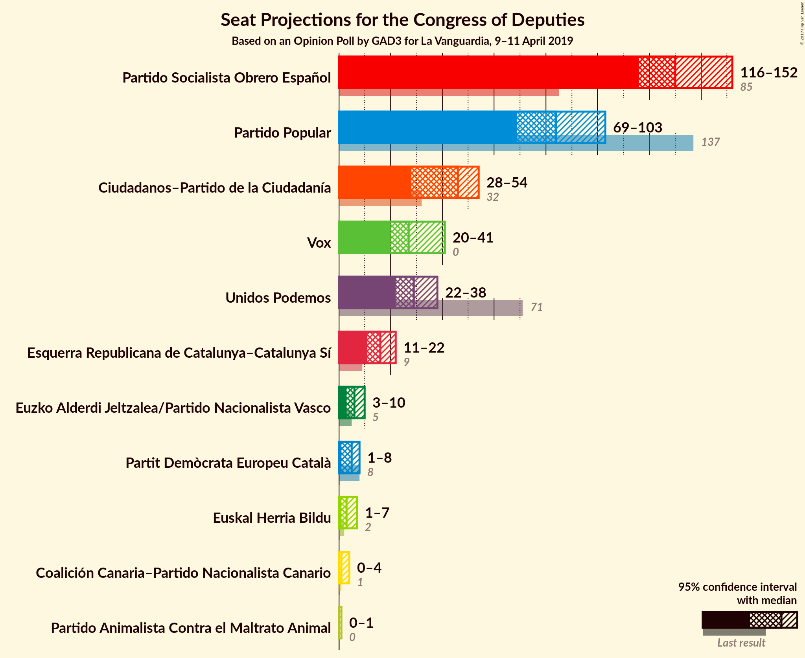
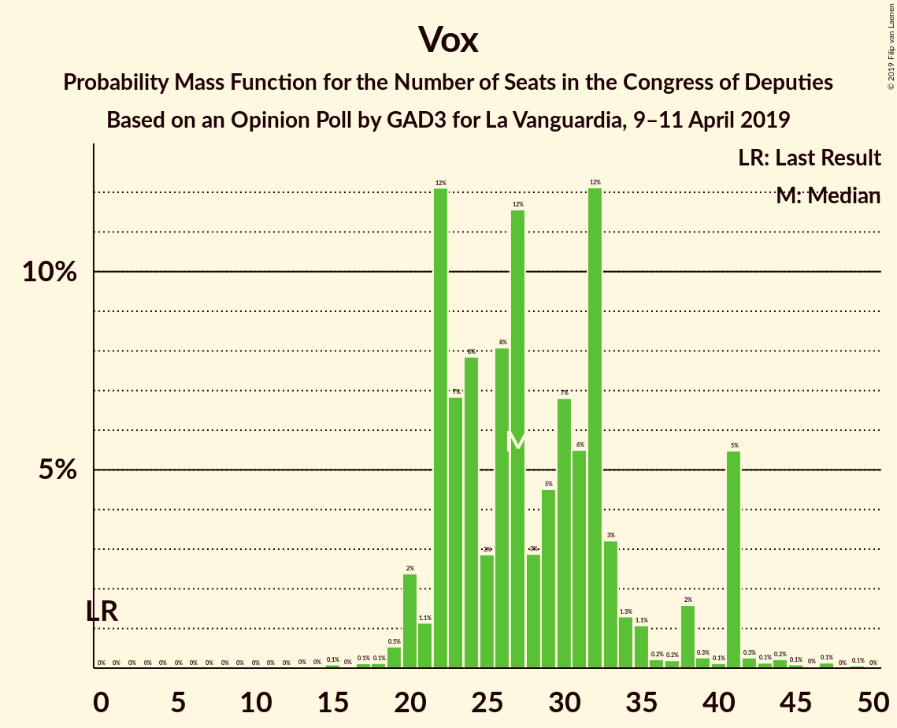
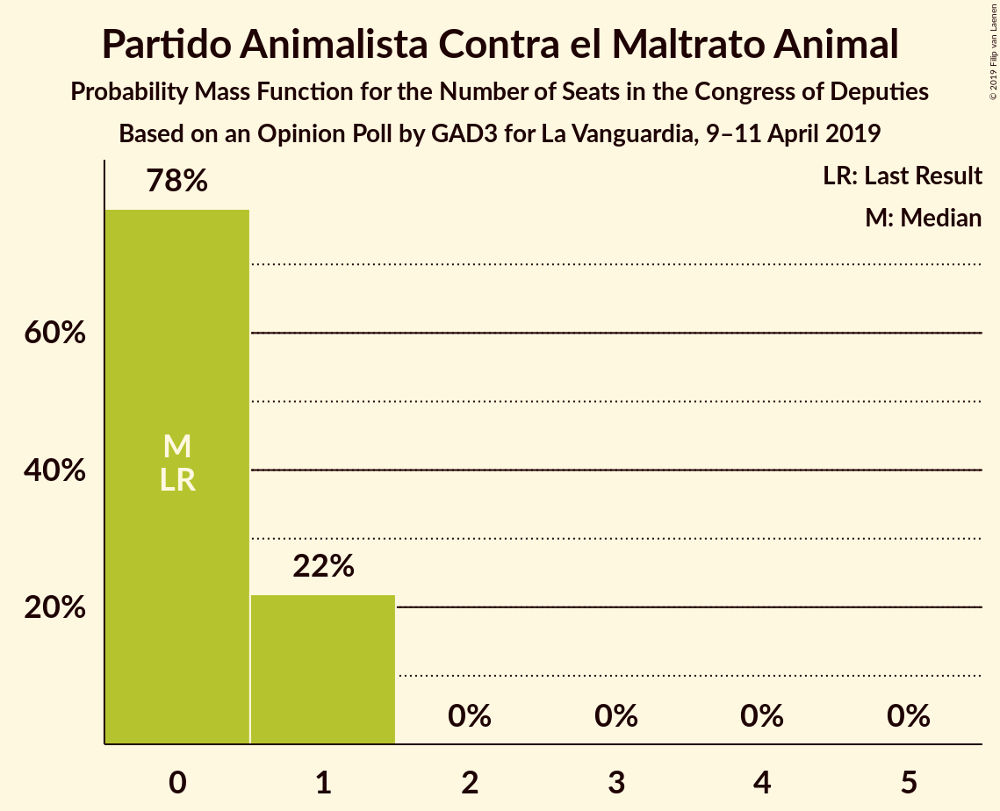
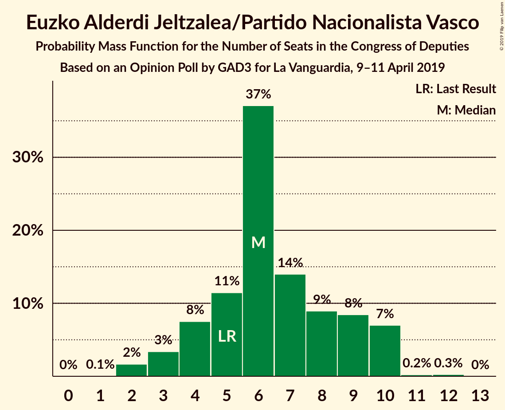
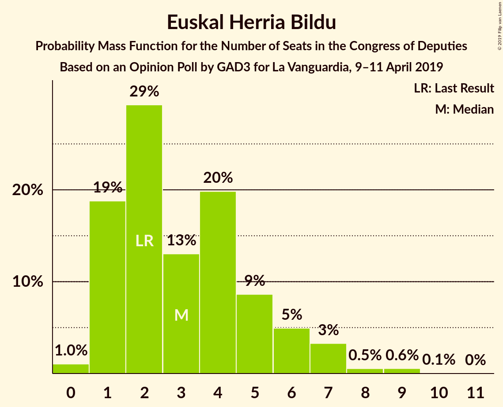
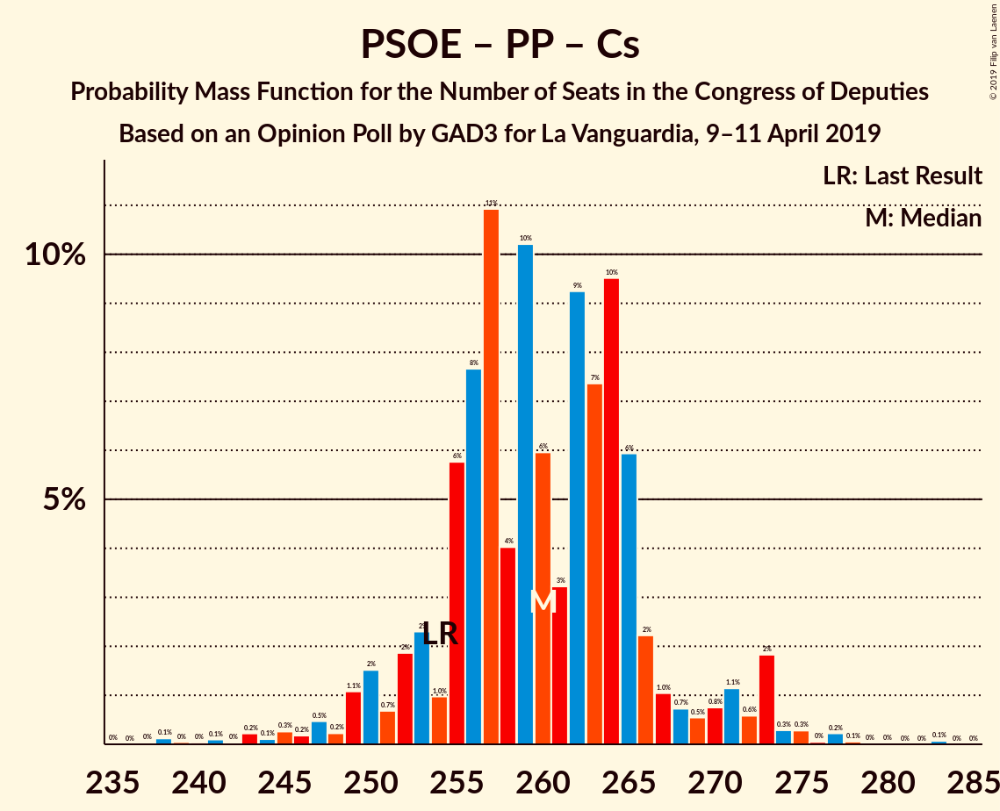
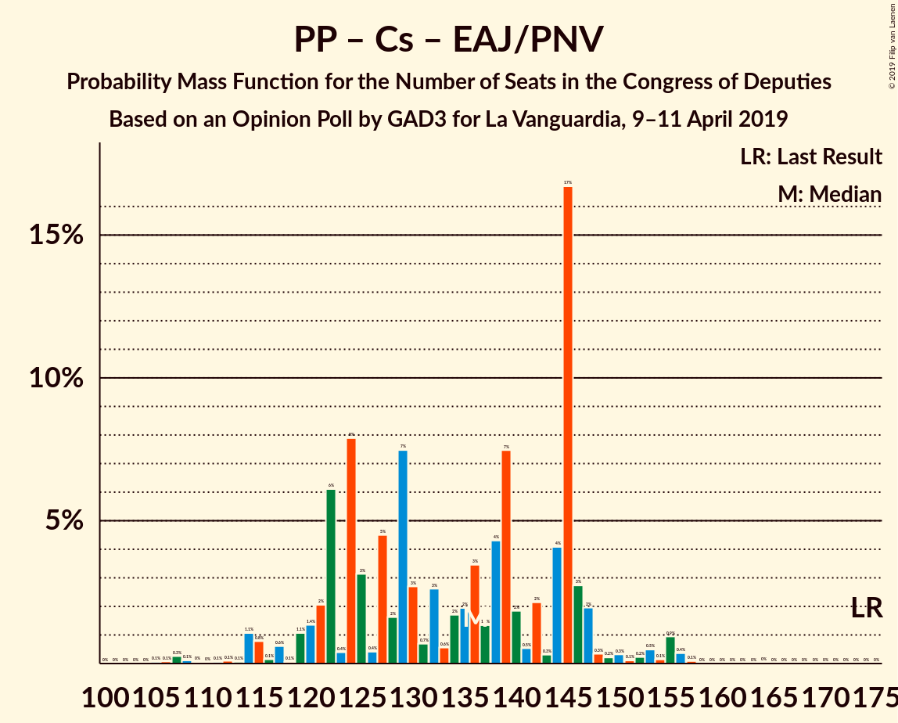
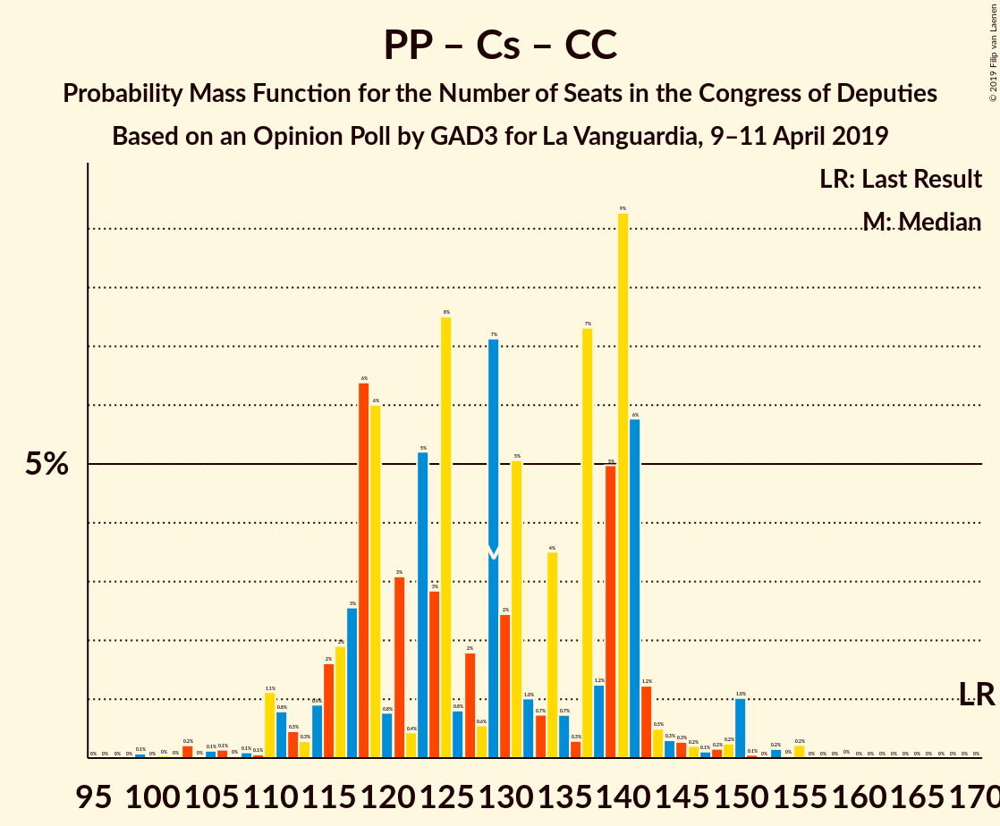

# Opinion Poll by GAD3 for La Vanguardia, 9–11 April 2019

<a href="#voting-intentions">Voting Intentions</a> | <a href="#seats">Seats</a> | <a href="#coalitions">Coalitions</a> | <a href="#technical-information">Technical Information</a>

## Voting Intentions

### Confidence Intervals

| Party | Last Result | Poll Result | 80% Confidence Interval | 90% Confidence Interval | 95% Confidence Interval | 99% Confidence Interval |
|:-----:|:-----------:|:-----------:|:-----------------------:|:-----------------------:|:-----------------------:|:-----------------------:|
| Partido Socialista Obrero Español | 22.6% | 31.1% | 29.1–33.3% |28.5–33.9% |28.0–34.4% |27.1–35.5% |
| Partido Popular | 33.0% | 21.0% | 19.2–22.9% |18.7–23.5% |18.3–24.0% |17.5–24.9% |
| Ciudadanos–Partido de la Ciudadanía | 13.1% | 14.4% | 12.9–16.1% |12.5–16.6% |12.1–17.0% |11.4–17.8% |
| Unidos Podemos | 21.2% | 11.9% | 10.5–13.5% |10.1–13.9% |9.8–14.3% |9.2–15.1% |
| Vox | 0.2% | 11.2% | 9.9–12.8% |9.6–13.2% |9.2–13.6% |8.6–14.4% |
| Esquerra Republicana de Catalunya–Catalunya Sí | 2.7% | 3.6% | 2.9–4.6% |2.7–4.9% |2.5–5.2% |2.2–5.7% |
| Partido Animalista Contra el Maltrato Animal | 1.2% | 1.4% | 1.0–2.1% |0.9–2.3% |0.8–2.5% |0.6–2.8% |
| Partit Demòcrata Europeu Català | 2.0% | 1.2% | 0.9–1.9% |0.8–2.1% |0.7–2.3% |0.5–2.7% |
| Euzko Alderdi Jeltzalea/Partido Nacionalista Vasco | 1.2% | 1.2% | 0.9–1.9% |0.8–2.1% |0.7–2.3% |0.5–2.7% |
| Euskal Herria Bildu | 0.8% | 0.8% | 0.5–1.3% |0.4–1.5% |0.4–1.6% |0.2–2.0% |
| Coalición Canaria–Partido Nacionalista Canario | 0.3% | 0.2% | 0.1–0.7% |0.1–0.8% |0.1–0.9% |0.0–1.2% |

*Note:* The poll result column reflects the actual value used in the calculations. Published results may vary slightly, and in addition be rounded to fewer digits.

## Seats

### Confidence Intervals

| Party | Last Result | Median | 80% Confidence Interval | 90% Confidence Interval | 95% Confidence Interval | 99% Confidence Interval |
|:-----:|:-----------:|:------:|:-----------------------:|:-----------------------:|:-----------------------:|:-----------------------:|
| <a href="#partido-socialista-obrero-español">Partido Socialista Obrero Español</a> | 85 | 125 | 116–142 |116–148 |116–148 |115–153 |
| <a href="#partido-popular">Partido Popular</a> | 137 | 89 | 78–103 |70–103 |70–103 |68–103 |
| <a href="#ciudadanos–partido-de-la-ciudadanía">Ciudadanos–Partido de la Ciudadanía</a> | 32 | 45 | 37–52 |33–52 |33–54 |26–58 |
| <a href="#unidos-podemos">Unidos Podemos</a> | 71 | 28 | 22–34 |22–38 |22–38 |22–40 |
| <a href="#vox">Vox</a> | 0 | 27 | 22–32 |22–32 |20–33 |19–37 |
| <a href="#esquerra-republicana-de-catalunya–catalunya-sí">Esquerra Republicana de Catalunya–Catalunya Sí</a> | 9 | 15 | 15–19 |14–19 |13–20 |12–21 |
| <a href="#partido-animalista-contra-el-maltrato-animal">Partido Animalista Contra el Maltrato Animal</a> | 0 | 0 | 0 |0–1 |0–1 |0–1 |
| <a href="#partit-demòcrata-europeu-català">Partit Demòcrata Europeu Català</a> | 8 | 7 | 3–8 |2–8 |2–8 |1–9 |
| <a href="#euzko-alderdi-jeltzalea/partido-nacionalista-vasco">Euzko Alderdi Jeltzalea/Partido Nacionalista Vasco</a> | 5 | 6 | 5–7 |5–8 |3–10 |3–10 |
| <a href="#euskal-herria-bildu">Euskal Herria Bildu</a> | 2 | 4 | 2–4 |1–5 |1–7 |1–7 |
| <a href="#coalición-canaria–partido-nacionalista-canario">Coalición Canaria–Partido Nacionalista Canario</a> | 1 | 1 | 1–2 |0–4 |0–4 |0–5 |

### Partido Socialista Obrero Español

*For a full overview of the results for this party, see the [Partido Socialista Obrero Español](party-partidosocialistaobreroespañol.html) page.*

| Number of Seats | Probability | Accumulated | Special Marks |
|:---------------:|:-----------:|:-----------:|:-------------:|
| 85 | 0% | 100% | Last Result |
| 86 | 0% | 100% |  |
| 87 | 0% | 100% |  |
| 88 | 0% | 100% |  |
| 89 | 0% | 100% |  |
| 90 | 0% | 100% |  |
| 91 | 0% | 100% |  |
| 92 | 0% | 100% |  |
| 93 | 0% | 100% |  |
| 94 | 0% | 100% |  |
| 95 | 0% | 100% |  |
| 96 | 0% | 100% |  |
| 97 | 0% | 100% |  |
| 98 | 0% | 100% |  |
| 99 | 0% | 100% |  |
| 100 | 0% | 100% |  |
| 101 | 0% | 100% |  |
| 102 | 0% | 100% |  |
| 103 | 0% | 100% |  |
| 104 | 0% | 100% |  |
| 105 | 0% | 100% |  |
| 106 | 0% | 100% |  |
| 107 | 0% | 100% |  |
| 108 | 0% | 100% |  |
| 109 | 0.1% | 100% |  |
| 110 | 0% | 99.8% |  |
| 111 | 0.2% | 99.8% |  |
| 112 | 0% | 99.6% |  |
| 113 | 0% | 99.6% |  |
| 114 | 0% | 99.6% |  |
| 115 | 1.1% | 99.6% |  |
| 116 | 26% | 98% |  |
| 117 | 0% | 73% |  |
| 118 | 0.1% | 73% |  |
| 119 | 0.8% | 73% |  |
| 120 | 0.3% | 72% |  |
| 121 | 0% | 72% |  |
| 122 | 0.1% | 72% |  |
| 123 | 0.3% | 72% |  |
| 124 | 1.2% | 71% |  |
| 125 | 30% | 70% | Median |
| 126 | 3% | 40% |  |
| 127 | 2% | 37% |  |
| 128 | 14% | 35% |  |
| 129 | 0.1% | 22% |  |
| 130 | 0.1% | 21% |  |
| 131 | 0.7% | 21% |  |
| 132 | 0.7% | 21% |  |
| 133 | 0% | 20% |  |
| 134 | 0.2% | 20% |  |
| 135 | 0.1% | 20% |  |
| 136 | 0.6% | 20% |  |
| 137 | 0% | 19% |  |
| 138 | 0% | 19% |  |
| 139 | 0.1% | 19% |  |
| 140 | 0% | 19% |  |
| 141 | 0.1% | 19% |  |
| 142 | 10% | 19% |  |
| 143 | 0.1% | 9% |  |
| 144 | 0% | 9% |  |
| 145 | 0% | 9% |  |
| 146 | 1.5% | 9% |  |
| 147 | 0% | 7% |  |
| 148 | 6% | 7% |  |
| 149 | 0% | 1.3% |  |
| 150 | 0.1% | 1.3% |  |
| 151 | 0% | 1.2% |  |
| 152 | 0% | 1.1% |  |
| 153 | 0.7% | 1.1% |  |
| 154 | 0.1% | 0.4% |  |
| 155 | 0.3% | 0.4% |  |
| 156 | 0% | 0.1% |  |
| 157 | 0% | 0.1% |  |
| 158 | 0.1% | 0.1% |  |
| 159 | 0% | 0% |  |

### Partido Popular

*For a full overview of the results for this party, see the [Partido Popular](party-partidopopular.html) page.*

| Number of Seats | Probability | Accumulated | Special Marks |
|:---------------:|:-----------:|:-----------:|:-------------:|
| 64 | 0.1% | 100% |  |
| 65 | 0% | 99.8% |  |
| 66 | 0% | 99.8% |  |
| 67 | 0% | 99.8% |  |
| 68 | 0.6% | 99.7% |  |
| 69 | 0.1% | 99.1% |  |
| 70 | 5% | 99.1% |  |
| 71 | 0% | 94% |  |
| 72 | 0% | 94% |  |
| 73 | 0.3% | 94% |  |
| 74 | 0.4% | 94% |  |
| 75 | 0% | 93% |  |
| 76 | 0.2% | 93% |  |
| 77 | 0.3% | 93% |  |
| 78 | 12% | 93% |  |
| 79 | 0.9% | 81% |  |
| 80 | 1.2% | 80% |  |
| 81 | 0.1% | 79% |  |
| 82 | 0.1% | 79% |  |
| 83 | 2% | 78% |  |
| 84 | 10% | 77% |  |
| 85 | 0.8% | 67% |  |
| 86 | 0.8% | 66% |  |
| 87 | 0.1% | 65% |  |
| 88 | 2% | 65% |  |
| 89 | 35% | 64% | Median |
| 90 | 0.1% | 28% |  |
| 91 | 0% | 28% |  |
| 92 | 0.3% | 28% |  |
| 93 | 0.2% | 28% |  |
| 94 | 0% | 28% |  |
| 95 | 0% | 28% |  |
| 96 | 0% | 28% |  |
| 97 | 0% | 28% |  |
| 98 | 0% | 28% |  |
| 99 | 0% | 28% |  |
| 100 | 0.1% | 28% |  |
| 101 | 0.2% | 28% |  |
| 102 | 2% | 27% |  |
| 103 | 26% | 26% |  |
| 104 | 0% | 0.1% |  |
| 105 | 0% | 0.1% |  |
| 106 | 0% | 0.1% |  |
| 107 | 0% | 0.1% |  |
| 108 | 0% | 0.1% |  |
| 109 | 0% | 0% |  |
| 110 | 0% | 0% |  |
| 111 | 0% | 0% |  |
| 112 | 0% | 0% |  |
| 113 | 0% | 0% |  |
| 114 | 0% | 0% |  |
| 115 | 0% | 0% |  |
| 116 | 0% | 0% |  |
| 117 | 0% | 0% |  |
| 118 | 0% | 0% |  |
| 119 | 0% | 0% |  |
| 120 | 0% | 0% |  |
| 121 | 0% | 0% |  |
| 122 | 0% | 0% |  |
| 123 | 0% | 0% |  |
| 124 | 0% | 0% |  |
| 125 | 0% | 0% |  |
| 126 | 0% | 0% |  |
| 127 | 0% | 0% |  |
| 128 | 0% | 0% |  |
| 129 | 0% | 0% |  |
| 130 | 0% | 0% |  |
| 131 | 0% | 0% |  |
| 132 | 0% | 0% |  |
| 133 | 0% | 0% |  |
| 134 | 0% | 0% |  |
| 135 | 0% | 0% |  |
| 136 | 0% | 0% |  |
| 137 | 0% | 0% | Last Result |

### Ciudadanos–Partido de la Ciudadanía

*For a full overview of the results for this party, see the [Ciudadanos–Partido de la Ciudadanía](party-ciudadanos–partidodelaciudadanía.html) page.*

| Number of Seats | Probability | Accumulated | Special Marks |
|:---------------:|:-----------:|:-----------:|:-------------:|
| 25 | 0% | 100% |  |
| 26 | 1.4% | 99.9% |  |
| 27 | 0% | 98.6% |  |
| 28 | 0% | 98.6% |  |
| 29 | 0% | 98.6% |  |
| 30 | 0.1% | 98.5% |  |
| 31 | 0.2% | 98% |  |
| 32 | 0.1% | 98% | Last Result |
| 33 | 5% | 98% |  |
| 34 | 0.1% | 93% |  |
| 35 | 0% | 93% |  |
| 36 | 0.4% | 93% |  |
| 37 | 26% | 92% |  |
| 38 | 0.2% | 67% |  |
| 39 | 0.7% | 67% |  |
| 40 | 0.1% | 66% |  |
| 41 | 0% | 66% |  |
| 42 | 0% | 66% |  |
| 43 | 0.2% | 66% |  |
| 44 | 15% | 65% |  |
| 45 | 2% | 50% | Median |
| 46 | 2% | 48% |  |
| 47 | 0.2% | 47% |  |
| 48 | 0.1% | 46% |  |
| 49 | 31% | 46% |  |
| 50 | 3% | 16% |  |
| 51 | 2% | 13% |  |
| 52 | 9% | 11% |  |
| 53 | 0% | 3% |  |
| 54 | 2% | 3% |  |
| 55 | 0% | 0.6% |  |
| 56 | 0% | 0.6% |  |
| 57 | 0.1% | 0.6% |  |
| 58 | 0.1% | 0.5% |  |
| 59 | 0.3% | 0.4% |  |
| 60 | 0% | 0.1% |  |
| 61 | 0% | 0.1% |  |
| 62 | 0.1% | 0.1% |  |
| 63 | 0% | 0% |  |

### Unidos Podemos

*For a full overview of the results for this party, see the [Unidos Podemos](party-unidospodemos.html) page.*

| Number of Seats | Probability | Accumulated | Special Marks |
|:---------------:|:-----------:|:-----------:|:-------------:|
| 20 | 0.1% | 100% |  |
| 21 | 0.2% | 99.9% |  |
| 22 | 11% | 99.7% |  |
| 23 | 5% | 88% |  |
| 24 | 0% | 83% |  |
| 25 | 0.9% | 83% |  |
| 26 | 1.3% | 82% |  |
| 27 | 30% | 81% |  |
| 28 | 0.9% | 51% | Median |
| 29 | 0.4% | 50% |  |
| 30 | 2% | 49% |  |
| 31 | 26% | 48% |  |
| 32 | 0.3% | 21% |  |
| 33 | 4% | 21% |  |
| 34 | 10% | 17% |  |
| 35 | 0% | 7% |  |
| 36 | 0% | 7% |  |
| 37 | 0.1% | 7% |  |
| 38 | 6% | 7% |  |
| 39 | 0.1% | 0.6% |  |
| 40 | 0% | 0.5% |  |
| 41 | 0% | 0.5% |  |
| 42 | 0% | 0.4% |  |
| 43 | 0.3% | 0.4% |  |
| 44 | 0.1% | 0.1% |  |
| 45 | 0% | 0% |  |
| 46 | 0% | 0% |  |
| 47 | 0% | 0% |  |
| 48 | 0% | 0% |  |
| 49 | 0% | 0% |  |
| 50 | 0% | 0% |  |
| 51 | 0% | 0% |  |
| 52 | 0% | 0% |  |
| 53 | 0% | 0% |  |
| 54 | 0% | 0% |  |
| 55 | 0% | 0% |  |
| 56 | 0% | 0% |  |
| 57 | 0% | 0% |  |
| 58 | 0% | 0% |  |
| 59 | 0% | 0% |  |
| 60 | 0% | 0% |  |
| 61 | 0% | 0% |  |
| 62 | 0% | 0% |  |
| 63 | 0% | 0% |  |
| 64 | 0% | 0% |  |
| 65 | 0% | 0% |  |
| 66 | 0% | 0% |  |
| 67 | 0% | 0% |  |
| 68 | 0% | 0% |  |
| 69 | 0% | 0% |  |
| 70 | 0% | 0% |  |
| 71 | 0% | 0% | Last Result |

### Vox

*For a full overview of the results for this party, see the [Vox](party-vox.html) page.*

| Number of Seats | Probability | Accumulated | Special Marks |
|:---------------:|:-----------:|:-----------:|:-------------:|
| 0 | 0% | 100% | Last Result |
| 1 | 0% | 100% |  |
| 2 | 0% | 100% |  |
| 3 | 0% | 100% |  |
| 4 | 0% | 100% |  |
| 5 | 0% | 100% |  |
| 6 | 0% | 100% |  |
| 7 | 0% | 100% |  |
| 8 | 0% | 100% |  |
| 9 | 0% | 100% |  |
| 10 | 0% | 100% |  |
| 11 | 0% | 100% |  |
| 12 | 0% | 100% |  |
| 13 | 0% | 100% |  |
| 14 | 0% | 100% |  |
| 15 | 0% | 100% |  |
| 16 | 0% | 99.9% |  |
| 17 | 0% | 99.9% |  |
| 18 | 0% | 99.9% |  |
| 19 | 2% | 99.9% |  |
| 20 | 2% | 98% |  |
| 21 | 0% | 96% |  |
| 22 | 10% | 96% |  |
| 23 | 0.4% | 86% |  |
| 24 | 31% | 86% |  |
| 25 | 3% | 55% |  |
| 26 | 0.1% | 53% |  |
| 27 | 6% | 53% | Median |
| 28 | 0.6% | 47% |  |
| 29 | 0.4% | 46% |  |
| 30 | 26% | 46% |  |
| 31 | 0.2% | 20% |  |
| 32 | 15% | 20% |  |
| 33 | 3% | 5% |  |
| 34 | 0.8% | 1.5% |  |
| 35 | 0% | 0.7% |  |
| 36 | 0% | 0.7% |  |
| 37 | 0.2% | 0.6% |  |
| 38 | 0.1% | 0.5% |  |
| 39 | 0.1% | 0.4% |  |
| 40 | 0% | 0.3% |  |
| 41 | 0% | 0.3% |  |
| 42 | 0% | 0.2% |  |
| 43 | 0% | 0.2% |  |
| 44 | 0% | 0.2% |  |
| 45 | 0% | 0.2% |  |
| 46 | 0% | 0.1% |  |
| 47 | 0.1% | 0.1% |  |
| 48 | 0% | 0% |  |

### Esquerra Republicana de Catalunya–Catalunya Sí

*For a full overview of the results for this party, see the [Esquerra Republicana de Catalunya–Catalunya Sí](party-esquerrarepublicanadecatalunya–catalunyasí.html) page.*

| Number of Seats | Probability | Accumulated | Special Marks |
|:---------------:|:-----------:|:-----------:|:-------------:|
| 9 | 0% | 100% | Last Result |
| 10 | 0.1% | 100% |  |
| 11 | 0.2% | 99.9% |  |
| 12 | 2% | 99.7% |  |
| 13 | 1.0% | 98% |  |
| 14 | 4% | 97% |  |
| 15 | 48% | 93% | Median |
| 16 | 9% | 45% |  |
| 17 | 1.0% | 35% |  |
| 18 | 1.0% | 34% |  |
| 19 | 31% | 33% |  |
| 20 | 2% | 3% |  |
| 21 | 0.6% | 0.7% |  |
| 22 | 0% | 0.1% |  |
| 23 | 0.1% | 0.1% |  |
| 24 | 0% | 0% |  |

### Partido Animalista Contra el Maltrato Animal

*For a full overview of the results for this party, see the [Partido Animalista Contra el Maltrato Animal](party-partidoanimalistacontraelmaltratoanimal.html) page.*

| Number of Seats | Probability | Accumulated | Special Marks |
|:---------------:|:-----------:|:-----------:|:-------------:|
| 0 | 95% | 100% | Last Result, Median |
| 1 | 5% | 5% |  |
| 2 | 0% | 0% |  |

### Partit Demòcrata Europeu Català

*For a full overview of the results for this party, see the [Partit Demòcrata Europeu Català](party-partitdemòcrataeuropeucatalà.html) page.*

| Number of Seats | Probability | Accumulated | Special Marks |
|:---------------:|:-----------:|:-----------:|:-------------:|
| 0 | 0.1% | 100% |  |
| 1 | 0.9% | 99.9% |  |
| 2 | 9% | 98.9% |  |
| 3 | 2% | 90% |  |
| 4 | 30% | 88% |  |
| 5 | 0.9% | 58% |  |
| 6 | 6% | 57% |  |
| 7 | 11% | 51% | Median |
| 8 | 39% | 40% | Last Result |
| 9 | 1.1% | 1.2% |  |
| 10 | 0% | 0.1% |  |
| 11 | 0% | 0% |  |

### Euzko Alderdi Jeltzalea/Partido Nacionalista Vasco

*For a full overview of the results for this party, see the [Euzko Alderdi Jeltzalea/Partido Nacionalista Vasco](party-euzkoalderdijeltzaleapartidonacionalistavasco.html) page.*

| Number of Seats | Probability | Accumulated | Special Marks |
|:---------------:|:-----------:|:-----------:|:-------------:|
| 2 | 0.3% | 100% |  |
| 3 | 4% | 99.7% |  |
| 4 | 0.6% | 96% |  |
| 5 | 36% | 95% | Last Result |
| 6 | 13% | 59% | Median |
| 7 | 36% | 46% |  |
| 8 | 6% | 10% |  |
| 9 | 0.7% | 4% |  |
| 10 | 3% | 3% |  |
| 11 | 0.2% | 0.3% |  |
| 12 | 0% | 0% |  |

### Euskal Herria Bildu

*For a full overview of the results for this party, see the [Euskal Herria Bildu](party-euskalherriabildu.html) page.*

| Number of Seats | Probability | Accumulated | Special Marks |
|:---------------:|:-----------:|:-----------:|:-------------:|
| 0 | 0.2% | 100% |  |
| 1 | 8% | 99.8% |  |
| 2 | 16% | 92% | Last Result |
| 3 | 2% | 75% |  |
| 4 | 68% | 73% | Median |
| 5 | 1.1% | 5% |  |
| 6 | 0.4% | 4% |  |
| 7 | 3% | 4% |  |
| 8 | 0% | 0.1% |  |
| 9 | 0% | 0% |  |

### Coalición Canaria–Partido Nacionalista Canario

*For a full overview of the results for this party, see the [Coalición Canaria–Partido Nacionalista Canario](party-coalicióncanaria–partidonacionalistacanario.html) page.*

| Number of Seats | Probability | Accumulated | Special Marks |
|:---------------:|:-----------:|:-----------:|:-------------:|
| 0 | 5% | 100% |  |
| 1 | 51% | 95% | Last Result, Median |
| 2 | 34% | 44% |  |
| 3 | 0.2% | 10% |  |
| 4 | 9% | 10% |  |
| 5 | 0.7% | 0.7% |  |
| 6 | 0% | 0% |  |

## Coalitions

### Confidence Intervals

| Coalition | Last Result | Median | Majority? | 80% Confidence Interval | 90% Confidence Interval | 95% Confidence Interval | 99% Confidence Interval |
|:---------:|:-----------:|:------:|:---------:|:-----------------------:|:-----------------------:|:-----------------------:|:-----------------------:|
| Partido Socialista Obrero Español – Partido Popular – Ciudadanos–Partido de la Ciudadanía | 254 | 263 | 100% | 256–264 | 250–264 | 250–270 | 245–277 |
| Partido Socialista Obrero Español – Partido Popular | 222 | 217 | 100% | 212–220 | 210–220 | 205–232 | 199–234 |
| Partido Socialista Obrero Español – Ciudadanos–Partido de la Ciudadanía – Unidos Podemos | 188 | 201 | 100% | 184–214 | 184–215 | 184–218 | 184–223 |
| Partido Socialista Obrero Español – Unidos Podemos – Esquerra Republicana de Catalunya–Catalunya Sí – Euzko Alderdi Jeltzalea/Partido Nacionalista Vasco – Partit Demòcrata Europeu Català – Euskal Herria Bildu | 180 | 186 | 98% | 179–200 | 179–203 | 179–208 | 170–213 |
| Partido Socialista Obrero Español – Unidos Podemos – Esquerra Republicana de Catalunya–Catalunya Sí – Euskal Herria Bildu | 167 | 171 | 39% | 170–186 | 170–188 | 166–200 | 159–202 |
| Partido Socialista Obrero Español – Unidos Podemos – Esquerra Republicana de Catalunya–Catalunya Sí – Partit Demòcrata Europeu Català | 173 | 175 | 40% | 170–191 | 170–194 | 170–199 | 160–205 |
| Partido Socialista Obrero Español – Ciudadanos–Partido de la Ciudadanía | 117 | 174 | 32% | 153–186 | 153–192 | 153–192 | 153–193 |
| Partido Socialista Obrero Español – Unidos Podemos – Euzko Alderdi Jeltzalea/Partido Nacionalista Vasco – Euskal Herria Bildu | 163 | 163 | 11% | 156–178 | 156–180 | 156–186 | 147–192 |
| Partido Socialista Obrero Español – Unidos Podemos – Euzko Alderdi Jeltzalea/Partido Nacionalista Vasco | 161 | 159 | 9% | 152–175 | 152–178 | 152–182 | 140–191 |
| Partido Socialista Obrero Español – Unidos Podemos | 156 | 152 | 3% | 147–166 | 147–171 | 147–176 | 137–184 |
| Partido Popular – Ciudadanos–Partido de la Ciudadanía – Vox | 169 | 162 | 2% | 149–170 | 146–170 | 140–170 | 137–178 |
| Partido Popular – Ciudadanos–Partido de la Ciudadanía – Euzko Alderdi Jeltzalea/Partido Nacionalista Vasco | 174 | 145 | 0% | 127–145 | 121–145 | 120–152 | 117–156 |
| Partido Socialista Obrero Español | 85 | 125 | 0% | 116–142 | 116–148 | 116–148 | 115–153 |
| Partido Popular – Ciudadanos–Partido de la Ciudadanía – Coalición Canaria–Partido Nacionalista Canario | 170 | 140 | 0% | 123–141 | 115–141 | 115–147 | 114–155 |
| Partido Popular – Ciudadanos–Partido de la Ciudadanía | 169 | 138 | 0% | 122–140 | 114–140 | 114–147 | 114–153 |
| Partido Popular – Vox | 137 | 113 | 0% | 104–133 | 102–133 | 102–133 | 94–133 |
| Partido Popular | 137 | 89 | 0% | 78–103 | 70–103 | 70–103 | 68–103 |

### Partido Socialista Obrero Español – Partido Popular – Ciudadanos–Partido de la Ciudadanía

| Number of Seats | Probability | Accumulated | Special Marks |
|:---------------:|:-----------:|:-----------:|:-------------:|
| 237 | 0% | 100% |  |
| 238 | 0% | 99.9% |  |
| 239 | 0% | 99.9% |  |
| 240 | 0% | 99.9% |  |
| 241 | 0% | 99.9% |  |
| 242 | 0% | 99.9% |  |
| 243 | 0% | 99.9% |  |
| 244 | 0% | 99.9% |  |
| 245 | 0.5% | 99.9% |  |
| 246 | 0.2% | 99.4% |  |
| 247 | 0% | 99.2% |  |
| 248 | 0% | 99.2% |  |
| 249 | 0.3% | 99.2% |  |
| 250 | 6% | 98.8% |  |
| 251 | 0.1% | 93% |  |
| 252 | 1.3% | 93% |  |
| 253 | 0.2% | 92% |  |
| 254 | 0.1% | 92% | Last Result |
| 255 | 0% | 92% |  |
| 256 | 28% | 92% |  |
| 257 | 0.8% | 64% |  |
| 258 | 0.3% | 63% |  |
| 259 | 0.1% | 63% | Median |
| 260 | 3% | 63% |  |
| 261 | 0.1% | 60% |  |
| 262 | 5% | 60% |  |
| 263 | 30% | 54% |  |
| 264 | 21% | 25% |  |
| 265 | 0% | 4% |  |
| 266 | 0.1% | 4% |  |
| 267 | 0% | 4% |  |
| 268 | 1.2% | 4% |  |
| 269 | 0% | 3% |  |
| 270 | 1.0% | 3% |  |
| 271 | 0% | 2% |  |
| 272 | 0.7% | 2% |  |
| 273 | 0% | 1.2% |  |
| 274 | 0.4% | 1.1% |  |
| 275 | 0% | 0.8% |  |
| 276 | 0% | 0.8% |  |
| 277 | 0.6% | 0.8% |  |
| 278 | 0% | 0.1% |  |
| 279 | 0% | 0.1% |  |
| 280 | 0.1% | 0.1% |  |
| 281 | 0% | 0% |  |

### Partido Socialista Obrero Español – Partido Popular

| Number of Seats | Probability | Accumulated | Special Marks |
|:---------------:|:-----------:|:-----------:|:-------------:|
| 189 | 0% | 100% |  |
| 190 | 0% | 99.9% |  |
| 191 | 0% | 99.9% |  |
| 192 | 0% | 99.9% |  |
| 193 | 0.1% | 99.9% |  |
| 194 | 0% | 99.9% |  |
| 195 | 0% | 99.8% |  |
| 196 | 0% | 99.8% |  |
| 197 | 0% | 99.8% |  |
| 198 | 0% | 99.8% |  |
| 199 | 0.5% | 99.8% |  |
| 200 | 0.1% | 99.3% |  |
| 201 | 0.1% | 99.2% |  |
| 202 | 1.2% | 99.1% |  |
| 203 | 0% | 98% |  |
| 204 | 0.3% | 98% |  |
| 205 | 0.2% | 98% |  |
| 206 | 1.3% | 97% |  |
| 207 | 0.1% | 96% |  |
| 208 | 0.1% | 96% |  |
| 209 | 0.2% | 96% |  |
| 210 | 2% | 96% |  |
| 211 | 2% | 93% |  |
| 212 | 9% | 91% |  |
| 213 | 0.1% | 82% |  |
| 214 | 30% | 82% | Median |
| 215 | 0.6% | 52% |  |
| 216 | 0% | 52% |  |
| 217 | 6% | 52% |  |
| 218 | 5% | 45% |  |
| 219 | 26% | 40% |  |
| 220 | 10% | 15% |  |
| 221 | 0.7% | 4% |  |
| 222 | 0.1% | 4% | Last Result |
| 223 | 0% | 4% |  |
| 224 | 0% | 4% |  |
| 225 | 0% | 4% |  |
| 226 | 0% | 4% |  |
| 227 | 0% | 4% |  |
| 228 | 0.1% | 4% |  |
| 229 | 0.1% | 3% |  |
| 230 | 0% | 3% |  |
| 231 | 0.7% | 3% |  |
| 232 | 0.7% | 3% |  |
| 233 | 0% | 2% |  |
| 234 | 2% | 2% |  |
| 235 | 0% | 0.2% |  |
| 236 | 0% | 0.2% |  |
| 237 | 0.1% | 0.2% |  |
| 238 | 0% | 0% |  |

### Partido Socialista Obrero Español – Ciudadanos–Partido de la Ciudadanía – Unidos Podemos

| Number of Seats | Probability | Accumulated | Special Marks |
|:---------------:|:-----------:|:-----------:|:-------------:|
| 178 | 0.1% | 100% |  |
| 179 | 0.1% | 99.9% |  |
| 180 | 0% | 99.8% |  |
| 181 | 0% | 99.7% |  |
| 182 | 0% | 99.7% |  |
| 183 | 0% | 99.7% |  |
| 184 | 26% | 99.7% |  |
| 185 | 0% | 74% |  |
| 186 | 0% | 74% |  |
| 187 | 0% | 74% |  |
| 188 | 1.2% | 74% | Last Result |
| 189 | 0% | 73% |  |
| 190 | 0% | 73% |  |
| 191 | 0.2% | 73% |  |
| 192 | 0.1% | 73% |  |
| 193 | 0% | 73% |  |
| 194 | 0.1% | 73% |  |
| 195 | 0.6% | 72% |  |
| 196 | 0.1% | 72% |  |
| 197 | 0% | 72% |  |
| 198 | 1.3% | 72% | Median |
| 199 | 5% | 70% |  |
| 200 | 0% | 65% |  |
| 201 | 30% | 65% |  |
| 202 | 1.4% | 35% |  |
| 203 | 0.3% | 34% |  |
| 204 | 0.2% | 34% |  |
| 205 | 0.1% | 34% |  |
| 206 | 0.2% | 33% |  |
| 207 | 0.1% | 33% |  |
| 208 | 11% | 33% |  |
| 209 | 1.2% | 22% |  |
| 210 | 0.6% | 21% |  |
| 211 | 0.5% | 20% |  |
| 212 | 0.7% | 20% |  |
| 213 | 0.1% | 19% |  |
| 214 | 10% | 19% |  |
| 215 | 6% | 8% |  |
| 216 | 0.2% | 3% |  |
| 217 | 0% | 3% |  |
| 218 | 0.7% | 3% |  |
| 219 | 0.1% | 2% |  |
| 220 | 0.3% | 2% |  |
| 221 | 0.1% | 2% |  |
| 222 | 0.2% | 1.5% |  |
| 223 | 0.8% | 1.3% |  |
| 224 | 0% | 0.5% |  |
| 225 | 0.4% | 0.4% |  |
| 226 | 0% | 0.1% |  |
| 227 | 0% | 0.1% |  |
| 228 | 0% | 0% |  |

### Partido Socialista Obrero Español – Unidos Podemos – Esquerra Republicana de Catalunya–Catalunya Sí – Euzko Alderdi Jeltzalea/Partido Nacionalista Vasco – Partit Demòcrata Europeu Català – Euskal Herria Bildu

| Number of Seats | Probability | Accumulated | Special Marks |
|:---------------:|:-----------:|:-----------:|:-------------:|
| 170 | 1.2% | 100% |  |
| 171 | 0% | 98.8% |  |
| 172 | 0% | 98.8% |  |
| 173 | 0.7% | 98.8% |  |
| 174 | 0.1% | 98% |  |
| 175 | 0.3% | 98% |  |
| 176 | 0% | 98% | Majority |
| 177 | 0% | 98% |  |
| 178 | 0% | 98% |  |
| 179 | 26% | 98% |  |
| 180 | 0.5% | 72% | Last Result |
| 181 | 0% | 72% |  |
| 182 | 1.0% | 72% |  |
| 183 | 0% | 71% |  |
| 184 | 0% | 71% |  |
| 185 | 1.1% | 71% | Median |
| 186 | 30% | 69% |  |
| 187 | 0.3% | 40% |  |
| 188 | 10% | 39% |  |
| 189 | 0.2% | 29% |  |
| 190 | 0% | 29% |  |
| 191 | 0.9% | 29% |  |
| 192 | 0.1% | 28% |  |
| 193 | 0% | 28% |  |
| 194 | 2% | 28% |  |
| 195 | 10% | 26% |  |
| 196 | 0.1% | 16% |  |
| 197 | 0.2% | 16% |  |
| 198 | 0.1% | 16% |  |
| 199 | 0.1% | 16% |  |
| 200 | 7% | 16% |  |
| 201 | 0% | 9% |  |
| 202 | 0.5% | 9% |  |
| 203 | 5% | 8% |  |
| 204 | 0.1% | 3% |  |
| 205 | 0% | 3% |  |
| 206 | 0% | 3% |  |
| 207 | 0.3% | 3% |  |
| 208 | 0.3% | 3% |  |
| 209 | 1.4% | 2% |  |
| 210 | 0% | 1.0% |  |
| 211 | 0.1% | 1.0% |  |
| 212 | 0.1% | 1.0% |  |
| 213 | 0.7% | 0.8% |  |
| 214 | 0% | 0.1% |  |
| 215 | 0% | 0.1% |  |
| 216 | 0% | 0.1% |  |
| 217 | 0% | 0.1% |  |
| 218 | 0% | 0.1% |  |
| 219 | 0% | 0.1% |  |
| 220 | 0% | 0.1% |  |
| 221 | 0% | 0.1% |  |
| 222 | 0% | 0.1% |  |
| 223 | 0% | 0.1% |  |
| 224 | 0.1% | 0.1% |  |
| 225 | 0% | 0% |  |

### Partido Socialista Obrero Español – Unidos Podemos – Esquerra Republicana de Catalunya–Catalunya Sí – Euskal Herria Bildu

| Number of Seats | Probability | Accumulated | Special Marks |
|:---------------:|:-----------:|:-----------:|:-------------:|
| 157 | 0.2% | 100% |  |
| 158 | 0% | 99.8% |  |
| 159 | 1.0% | 99.8% |  |
| 160 | 0% | 98.7% |  |
| 161 | 0% | 98.7% |  |
| 162 | 0.2% | 98.7% |  |
| 163 | 0% | 98% |  |
| 164 | 0.1% | 98% |  |
| 165 | 0% | 98% |  |
| 166 | 0.9% | 98% |  |
| 167 | 0% | 97% | Last Result |
| 168 | 0% | 97% |  |
| 169 | 1.1% | 97% |  |
| 170 | 26% | 96% |  |
| 171 | 30% | 71% |  |
| 172 | 0.1% | 41% | Median |
| 173 | 0.3% | 41% |  |
| 174 | 0.5% | 41% |  |
| 175 | 1.1% | 40% |  |
| 176 | 2% | 39% | Majority |
| 177 | 1.2% | 37% |  |
| 178 | 0% | 36% |  |
| 179 | 0.1% | 36% |  |
| 180 | 9% | 36% |  |
| 181 | 0.8% | 27% |  |
| 182 | 0.2% | 26% |  |
| 183 | 10% | 26% |  |
| 184 | 0.9% | 16% |  |
| 185 | 0.1% | 15% |  |
| 186 | 5% | 15% |  |
| 187 | 0.5% | 10% |  |
| 188 | 5% | 9% |  |
| 189 | 0% | 4% |  |
| 190 | 0.2% | 4% |  |
| 191 | 0.1% | 4% |  |
| 192 | 0.1% | 4% |  |
| 193 | 0% | 4% |  |
| 194 | 0.7% | 4% |  |
| 195 | 0% | 3% |  |
| 196 | 0.1% | 3% |  |
| 197 | 0.3% | 3% |  |
| 198 | 0% | 3% |  |
| 199 | 0% | 3% |  |
| 200 | 2% | 3% |  |
| 201 | 0.1% | 1.0% |  |
| 202 | 0.7% | 0.9% |  |
| 203 | 0% | 0.2% |  |
| 204 | 0% | 0.2% |  |
| 205 | 0% | 0.1% |  |
| 206 | 0.1% | 0.1% |  |
| 207 | 0% | 0.1% |  |
| 208 | 0% | 0.1% |  |
| 209 | 0% | 0.1% |  |
| 210 | 0% | 0.1% |  |
| 211 | 0.1% | 0.1% |  |
| 212 | 0% | 0% |  |

### Partido Socialista Obrero Español – Unidos Podemos – Esquerra Republicana de Catalunya–Catalunya Sí – Partit Demòcrata Europeu Català

| Number of Seats | Probability | Accumulated | Special Marks |
|:---------------:|:-----------:|:-----------:|:-------------:|
| 159 | 0.2% | 100% |  |
| 160 | 1.0% | 99.8% |  |
| 161 | 0% | 98.8% |  |
| 162 | 0.3% | 98.8% |  |
| 163 | 0% | 98% |  |
| 164 | 0% | 98% |  |
| 165 | 0% | 98% |  |
| 166 | 0.7% | 98% |  |
| 167 | 0% | 98% |  |
| 168 | 0.1% | 98% |  |
| 169 | 0% | 98% |  |
| 170 | 26% | 98% |  |
| 171 | 0% | 71% |  |
| 172 | 0.3% | 71% |  |
| 173 | 0.5% | 71% | Last Result |
| 174 | 0.2% | 71% |  |
| 175 | 30% | 70% | Median |
| 176 | 0.1% | 40% | Majority |
| 177 | 0% | 40% |  |
| 178 | 2% | 40% |  |
| 179 | 0.1% | 38% |  |
| 180 | 9% | 38% |  |
| 181 | 1.0% | 29% |  |
| 182 | 2% | 28% |  |
| 183 | 0.1% | 26% |  |
| 184 | 0% | 26% |  |
| 185 | 0.2% | 26% |  |
| 186 | 10% | 26% |  |
| 187 | 0.1% | 16% |  |
| 188 | 0.3% | 16% |  |
| 189 | 0.6% | 15% |  |
| 190 | 0.1% | 15% |  |
| 191 | 6% | 15% |  |
| 192 | 0.7% | 9% |  |
| 193 | 0.1% | 8% |  |
| 194 | 5% | 8% |  |
| 195 | 0% | 3% |  |
| 196 | 0.1% | 3% |  |
| 197 | 0% | 3% |  |
| 198 | 0.3% | 3% |  |
| 199 | 1.4% | 3% |  |
| 200 | 0.1% | 1.3% |  |
| 201 | 0.4% | 1.2% |  |
| 202 | 0% | 0.8% |  |
| 203 | 0% | 0.8% |  |
| 204 | 0% | 0.8% |  |
| 205 | 0.7% | 0.8% |  |
| 206 | 0% | 0.1% |  |
| 207 | 0% | 0.1% |  |
| 208 | 0% | 0.1% |  |
| 209 | 0% | 0.1% |  |
| 210 | 0% | 0.1% |  |
| 211 | 0% | 0.1% |  |
| 212 | 0% | 0.1% |  |
| 213 | 0% | 0.1% |  |
| 214 | 0% | 0.1% |  |
| 215 | 0% | 0.1% |  |
| 216 | 0.1% | 0.1% |  |
| 217 | 0% | 0% |  |

### Partido Socialista Obrero Español – Ciudadanos–Partido de la Ciudadanía

| Number of Seats | Probability | Accumulated | Special Marks |
|:---------------:|:-----------:|:-----------:|:-------------:|
| 117 | 0% | 100% | Last Result |
| 118 | 0% | 100% |  |
| 119 | 0% | 100% |  |
| 120 | 0% | 100% |  |
| 121 | 0% | 100% |  |
| 122 | 0% | 100% |  |
| 123 | 0% | 100% |  |
| 124 | 0% | 100% |  |
| 125 | 0% | 100% |  |
| 126 | 0% | 100% |  |
| 127 | 0% | 100% |  |
| 128 | 0% | 100% |  |
| 129 | 0% | 100% |  |
| 130 | 0% | 100% |  |
| 131 | 0% | 100% |  |
| 132 | 0% | 100% |  |
| 133 | 0% | 100% |  |
| 134 | 0% | 100% |  |
| 135 | 0% | 100% |  |
| 136 | 0% | 100% |  |
| 137 | 0% | 100% |  |
| 138 | 0% | 100% |  |
| 139 | 0% | 100% |  |
| 140 | 0% | 100% |  |
| 141 | 0% | 100% |  |
| 142 | 0% | 100% |  |
| 143 | 0% | 100% |  |
| 144 | 0% | 100% |  |
| 145 | 0% | 100% |  |
| 146 | 0% | 100% |  |
| 147 | 0% | 100% |  |
| 148 | 0% | 100% |  |
| 149 | 0% | 100% |  |
| 150 | 0% | 100% |  |
| 151 | 0% | 99.9% |  |
| 152 | 0% | 99.9% |  |
| 153 | 26% | 99.9% |  |
| 154 | 0% | 74% |  |
| 155 | 0% | 74% |  |
| 156 | 0.2% | 74% |  |
| 157 | 0% | 74% |  |
| 158 | 0% | 74% |  |
| 159 | 0.1% | 74% |  |
| 160 | 0% | 74% |  |
| 161 | 5% | 74% |  |
| 162 | 0% | 69% |  |
| 163 | 0% | 69% |  |
| 164 | 0% | 69% |  |
| 165 | 0.5% | 69% |  |
| 166 | 1.0% | 68% |  |
| 167 | 0.1% | 67% |  |
| 168 | 0.3% | 67% |  |
| 169 | 0% | 67% |  |
| 170 | 0.8% | 67% | Median |
| 171 | 0.1% | 66% |  |
| 172 | 2% | 66% |  |
| 173 | 0.1% | 63% |  |
| 174 | 32% | 63% |  |
| 175 | 0.1% | 32% |  |
| 176 | 1.4% | 32% | Majority |
| 177 | 1.1% | 30% |  |
| 178 | 0.2% | 29% |  |
| 179 | 0% | 29% |  |
| 180 | 9% | 29% |  |
| 181 | 2% | 20% |  |
| 182 | 0.3% | 18% |  |
| 183 | 0.1% | 18% |  |
| 184 | 0% | 18% |  |
| 185 | 0.3% | 18% |  |
| 186 | 10% | 18% |  |
| 187 | 0% | 7% |  |
| 188 | 0.2% | 7% |  |
| 189 | 0% | 7% |  |
| 190 | 0% | 7% |  |
| 191 | 0.4% | 7% |  |
| 192 | 6% | 7% |  |
| 193 | 0.9% | 1.0% |  |
| 194 | 0% | 0.1% |  |
| 195 | 0% | 0.1% |  |
| 196 | 0% | 0% |  |

### Partido Socialista Obrero Español – Unidos Podemos – Euzko Alderdi Jeltzalea/Partido Nacionalista Vasco – Euskal Herria Bildu

| Number of Seats | Probability | Accumulated | Special Marks |
|:---------------:|:-----------:|:-----------:|:-------------:|
| 143 | 0.1% | 100% |  |
| 144 | 0% | 99.9% |  |
| 145 | 0% | 99.9% |  |
| 146 | 0% | 99.9% |  |
| 147 | 1.0% | 99.8% |  |
| 148 | 0% | 98.8% |  |
| 149 | 0% | 98.8% |  |
| 150 | 0% | 98.8% |  |
| 151 | 0% | 98.8% |  |
| 152 | 0% | 98.7% |  |
| 153 | 0% | 98.7% |  |
| 154 | 1.0% | 98.7% |  |
| 155 | 0% | 98% |  |
| 156 | 26% | 98% |  |
| 157 | 0.3% | 72% |  |
| 158 | 0.2% | 72% |  |
| 159 | 0% | 72% |  |
| 160 | 0% | 72% |  |
| 161 | 0.1% | 72% |  |
| 162 | 0.3% | 71% |  |
| 163 | 30% | 71% | Last Result, Median |
| 164 | 0.6% | 41% |  |
| 165 | 0.4% | 41% |  |
| 166 | 1.1% | 40% |  |
| 167 | 0% | 39% |  |
| 168 | 1.2% | 39% |  |
| 169 | 0.2% | 38% |  |
| 170 | 9% | 38% |  |
| 171 | 0.1% | 29% |  |
| 172 | 2% | 29% |  |
| 173 | 11% | 27% |  |
| 174 | 0.1% | 16% |  |
| 175 | 5% | 16% |  |
| 176 | 0.6% | 11% | Majority |
| 177 | 0% | 10% |  |
| 178 | 0.3% | 10% |  |
| 179 | 0.1% | 10% |  |
| 180 | 6% | 10% |  |
| 181 | 0.7% | 4% |  |
| 182 | 0% | 3% |  |
| 183 | 0.1% | 3% |  |
| 184 | 0.1% | 3% |  |
| 185 | 0% | 3% |  |
| 186 | 1.4% | 3% |  |
| 187 | 0% | 2% |  |
| 188 | 0.1% | 2% |  |
| 189 | 0.3% | 2% |  |
| 190 | 0.3% | 1.2% |  |
| 191 | 0.1% | 0.9% |  |
| 192 | 0.7% | 0.8% |  |
| 193 | 0% | 0.1% |  |
| 194 | 0% | 0.1% |  |
| 195 | 0% | 0.1% |  |
| 196 | 0% | 0.1% |  |
| 197 | 0% | 0.1% |  |
| 198 | 0% | 0.1% |  |
| 199 | 0% | 0.1% |  |
| 200 | 0% | 0.1% |  |
| 201 | 0% | 0.1% |  |
| 202 | 0% | 0.1% |  |
| 203 | 0.1% | 0.1% |  |
| 204 | 0% | 0% |  |

### Partido Socialista Obrero Español – Unidos Podemos – Euzko Alderdi Jeltzalea/Partido Nacionalista Vasco

| Number of Seats | Probability | Accumulated | Special Marks |
|:---------------:|:-----------:|:-----------:|:-------------:|
| 139 | 0.1% | 100% |  |
| 140 | 1.0% | 99.8% |  |
| 141 | 0% | 98.8% |  |
| 142 | 0% | 98.8% |  |
| 143 | 0% | 98.8% |  |
| 144 | 0% | 98.8% |  |
| 145 | 0% | 98.8% |  |
| 146 | 0% | 98.8% |  |
| 147 | 0.1% | 98.8% |  |
| 148 | 0% | 98.7% |  |
| 149 | 0% | 98.7% |  |
| 150 | 0.8% | 98.7% |  |
| 151 | 0.3% | 98% |  |
| 152 | 26% | 98% |  |
| 153 | 0% | 72% |  |
| 154 | 0.3% | 72% |  |
| 155 | 0% | 72% |  |
| 156 | 0.2% | 72% |  |
| 157 | 0% | 72% |  |
| 158 | 0.4% | 71% |  |
| 159 | 30% | 71% | Median |
| 160 | 0.4% | 42% |  |
| 161 | 2% | 41% | Last Result |
| 162 | 0% | 39% |  |
| 163 | 0.2% | 39% |  |
| 164 | 0.2% | 39% |  |
| 165 | 1.1% | 39% |  |
| 166 | 0.9% | 38% |  |
| 167 | 0% | 37% |  |
| 168 | 9% | 37% |  |
| 169 | 10% | 28% |  |
| 170 | 2% | 18% |  |
| 171 | 0% | 16% |  |
| 172 | 0.2% | 16% |  |
| 173 | 0.1% | 16% |  |
| 174 | 5% | 16% |  |
| 175 | 1.2% | 10% |  |
| 176 | 0% | 9% | Majority |
| 177 | 0.2% | 9% |  |
| 178 | 6% | 9% |  |
| 179 | 0% | 3% |  |
| 180 | 0% | 3% |  |
| 181 | 0% | 3% |  |
| 182 | 2% | 3% |  |
| 183 | 0.1% | 2% |  |
| 184 | 0.2% | 2% |  |
| 185 | 0.4% | 1.5% |  |
| 186 | 0.3% | 1.1% |  |
| 187 | 0% | 0.8% |  |
| 188 | 0% | 0.8% |  |
| 189 | 0% | 0.8% |  |
| 190 | 0% | 0.8% |  |
| 191 | 0.7% | 0.8% |  |
| 192 | 0% | 0.1% |  |
| 193 | 0% | 0.1% |  |
| 194 | 0% | 0.1% |  |
| 195 | 0% | 0.1% |  |
| 196 | 0% | 0.1% |  |
| 197 | 0% | 0.1% |  |
| 198 | 0% | 0.1% |  |
| 199 | 0% | 0.1% |  |
| 200 | 0% | 0.1% |  |
| 201 | 0.1% | 0.1% |  |
| 202 | 0% | 0% |  |

### Partido Socialista Obrero Español – Unidos Podemos

| Number of Seats | Probability | Accumulated | Special Marks |
|:---------------:|:-----------:|:-----------:|:-------------:|
| 132 | 0.1% | 100% |  |
| 133 | 0% | 99.9% |  |
| 134 | 0% | 99.9% |  |
| 135 | 0% | 99.9% |  |
| 136 | 0% | 99.9% |  |
| 137 | 1.0% | 99.8% |  |
| 138 | 0% | 98.8% |  |
| 139 | 0% | 98.7% |  |
| 140 | 0% | 98.7% |  |
| 141 | 0.2% | 98.7% |  |
| 142 | 0% | 98% |  |
| 143 | 0.1% | 98% |  |
| 144 | 0.1% | 98% |  |
| 145 | 0% | 98% |  |
| 146 | 0.2% | 98% |  |
| 147 | 26% | 98% |  |
| 148 | 0% | 72% |  |
| 149 | 0% | 72% |  |
| 150 | 0.3% | 72% |  |
| 151 | 0.1% | 71% |  |
| 152 | 30% | 71% |  |
| 153 | 0.4% | 41% | Median |
| 154 | 0% | 41% |  |
| 155 | 0% | 41% |  |
| 156 | 0% | 41% | Last Result |
| 157 | 0.2% | 41% |  |
| 158 | 1.3% | 40% |  |
| 159 | 1.2% | 39% |  |
| 160 | 2% | 38% |  |
| 161 | 0.1% | 36% |  |
| 162 | 9% | 36% |  |
| 163 | 0.8% | 27% |  |
| 164 | 10% | 26% |  |
| 165 | 0.7% | 16% |  |
| 166 | 5% | 15% |  |
| 167 | 0.1% | 10% |  |
| 168 | 0.1% | 10% |  |
| 169 | 0.5% | 10% |  |
| 170 | 0% | 9% |  |
| 171 | 5% | 9% |  |
| 172 | 0% | 4% |  |
| 173 | 0.7% | 4% |  |
| 174 | 0.1% | 3% |  |
| 175 | 0% | 3% |  |
| 176 | 2% | 3% | Majority |
| 177 | 0.1% | 2% |  |
| 178 | 0.1% | 2% |  |
| 179 | 0.3% | 2% |  |
| 180 | 0.1% | 1.2% |  |
| 181 | 0% | 1.1% |  |
| 182 | 0% | 1.1% |  |
| 183 | 0% | 1.1% |  |
| 184 | 0.9% | 1.1% |  |
| 185 | 0% | 0.1% |  |
| 186 | 0% | 0.1% |  |
| 187 | 0% | 0.1% |  |
| 188 | 0% | 0.1% |  |
| 189 | 0% | 0.1% |  |
| 190 | 0% | 0.1% |  |
| 191 | 0% | 0.1% |  |
| 192 | 0% | 0.1% |  |
| 193 | 0% | 0.1% |  |
| 194 | 0% | 0.1% |  |
| 195 | 0.1% | 0.1% |  |
| 196 | 0% | 0% |  |

### Partido Popular – Ciudadanos–Partido de la Ciudadanía – Vox

| Number of Seats | Probability | Accumulated | Special Marks |
|:---------------:|:-----------:|:-----------:|:-------------:|
| 125 | 0.1% | 100% |  |
| 126 | 0% | 99.9% |  |
| 127 | 0% | 99.9% |  |
| 128 | 0% | 99.9% |  |
| 129 | 0% | 99.9% |  |
| 130 | 0% | 99.9% |  |
| 131 | 0% | 99.9% |  |
| 132 | 0% | 99.9% |  |
| 133 | 0% | 99.9% |  |
| 134 | 0% | 99.9% |  |
| 135 | 0.1% | 99.9% |  |
| 136 | 0.2% | 99.8% |  |
| 137 | 0.7% | 99.7% |  |
| 138 | 0% | 99.0% |  |
| 139 | 1.4% | 99.0% |  |
| 140 | 0.3% | 98% |  |
| 141 | 0% | 97% |  |
| 142 | 0.3% | 97% |  |
| 143 | 0.1% | 97% |  |
| 144 | 0.1% | 97% |  |
| 145 | 0.1% | 97% |  |
| 146 | 5% | 97% |  |
| 147 | 0.6% | 92% |  |
| 148 | 0.7% | 91% |  |
| 149 | 6% | 90% |  |
| 150 | 0% | 84% |  |
| 151 | 0.1% | 84% |  |
| 152 | 0.1% | 84% |  |
| 153 | 0.1% | 84% |  |
| 154 | 10% | 84% |  |
| 155 | 0.1% | 74% |  |
| 156 | 2% | 74% |  |
| 157 | 1.1% | 72% |  |
| 158 | 9% | 71% |  |
| 159 | 0% | 62% |  |
| 160 | 0.1% | 62% |  |
| 161 | 1.3% | 62% | Median |
| 162 | 30% | 60% |  |
| 163 | 1.3% | 31% |  |
| 164 | 0% | 30% |  |
| 165 | 0.9% | 29% |  |
| 166 | 0.2% | 29% |  |
| 167 | 0% | 28% |  |
| 168 | 0.4% | 28% |  |
| 169 | 0.2% | 28% | Last Result |
| 170 | 26% | 28% |  |
| 171 | 0.1% | 2% |  |
| 172 | 0% | 2% |  |
| 173 | 0% | 2% |  |
| 174 | 0.1% | 2% |  |
| 175 | 0.2% | 2% |  |
| 176 | 0% | 2% | Majority |
| 177 | 0.7% | 2% |  |
| 178 | 1.0% | 1.2% |  |
| 179 | 0% | 0.2% |  |
| 180 | 0.1% | 0.2% |  |
| 181 | 0% | 0% |  |

### Partido Popular – Ciudadanos–Partido de la Ciudadanía – Euzko Alderdi Jeltzalea/Partido Nacionalista Vasco

| Number of Seats | Probability | Accumulated | Special Marks |
|:---------------:|:-----------:|:-----------:|:-------------:|
| 106 | 0.1% | 100% |  |
| 107 | 0% | 99.9% |  |
| 108 | 0% | 99.9% |  |
| 109 | 0% | 99.9% |  |
| 110 | 0% | 99.9% |  |
| 111 | 0.1% | 99.9% |  |
| 112 | 0% | 99.8% |  |
| 113 | 0% | 99.7% |  |
| 114 | 0.1% | 99.7% |  |
| 115 | 0% | 99.6% |  |
| 116 | 0% | 99.6% |  |
| 117 | 0.3% | 99.6% |  |
| 118 | 0% | 99.3% |  |
| 119 | 0% | 99.3% |  |
| 120 | 2% | 99.3% |  |
| 121 | 5% | 97% |  |
| 122 | 0% | 92% |  |
| 123 | 0% | 92% |  |
| 124 | 0.9% | 92% |  |
| 125 | 0.1% | 91% |  |
| 126 | 0.6% | 91% |  |
| 127 | 10% | 91% |  |
| 128 | 0.1% | 80% |  |
| 129 | 0.1% | 80% |  |
| 130 | 5% | 80% |  |
| 131 | 1.2% | 75% |  |
| 132 | 0% | 74% |  |
| 133 | 0% | 73% |  |
| 134 | 1.3% | 73% |  |
| 135 | 0% | 72% |  |
| 136 | 1.1% | 72% |  |
| 137 | 0.1% | 71% |  |
| 138 | 0.7% | 71% |  |
| 139 | 0.2% | 70% |  |
| 140 | 0.9% | 70% | Median |
| 141 | 0.6% | 69% |  |
| 142 | 9% | 69% |  |
| 143 | 0.1% | 60% |  |
| 144 | 0% | 60% |  |
| 145 | 55% | 60% |  |
| 146 | 0% | 4% |  |
| 147 | 2% | 4% |  |
| 148 | 0% | 3% |  |
| 149 | 0% | 3% |  |
| 150 | 0% | 3% |  |
| 151 | 0% | 3% |  |
| 152 | 0.1% | 3% |  |
| 153 | 0% | 2% |  |
| 154 | 0.4% | 2% |  |
| 155 | 0% | 2% |  |
| 156 | 2% | 2% |  |
| 157 | 0.2% | 0.3% |  |
| 158 | 0% | 0% |  |
| 159 | 0% | 0% |  |
| 160 | 0% | 0% |  |
| 161 | 0% | 0% |  |
| 162 | 0% | 0% |  |
| 163 | 0% | 0% |  |
| 164 | 0% | 0% |  |
| 165 | 0% | 0% |  |
| 166 | 0% | 0% |  |
| 167 | 0% | 0% |  |
| 168 | 0% | 0% |  |
| 169 | 0% | 0% |  |
| 170 | 0% | 0% |  |
| 171 | 0% | 0% |  |
| 172 | 0% | 0% |  |
| 173 | 0% | 0% |  |
| 174 | 0% | 0% | Last Result |

### Partido Socialista Obrero Español

| Number of Seats | Probability | Accumulated | Special Marks |
|:---------------:|:-----------:|:-----------:|:-------------:|
| 85 | 0% | 100% | Last Result |
| 86 | 0% | 100% |  |
| 87 | 0% | 100% |  |
| 88 | 0% | 100% |  |
| 89 | 0% | 100% |  |
| 90 | 0% | 100% |  |
| 91 | 0% | 100% |  |
| 92 | 0% | 100% |  |
| 93 | 0% | 100% |  |
| 94 | 0% | 100% |  |
| 95 | 0% | 100% |  |
| 96 | 0% | 100% |  |
| 97 | 0% | 100% |  |
| 98 | 0% | 100% |  |
| 99 | 0% | 100% |  |
| 100 | 0% | 100% |  |
| 101 | 0% | 100% |  |
| 102 | 0% | 100% |  |
| 103 | 0% | 100% |  |
| 104 | 0% | 100% |  |
| 105 | 0% | 100% |  |
| 106 | 0% | 100% |  |
| 107 | 0% | 100% |  |
| 108 | 0% | 100% |  |
| 109 | 0.1% | 100% |  |
| 110 | 0% | 99.8% |  |
| 111 | 0.2% | 99.8% |  |
| 112 | 0% | 99.6% |  |
| 113 | 0% | 99.6% |  |
| 114 | 0% | 99.6% |  |
| 115 | 1.1% | 99.6% |  |
| 116 | 26% | 98% |  |
| 117 | 0% | 73% |  |
| 118 | 0.1% | 73% |  |
| 119 | 0.8% | 73% |  |
| 120 | 0.3% | 72% |  |
| 121 | 0% | 72% |  |
| 122 | 0.1% | 72% |  |
| 123 | 0.3% | 72% |  |
| 124 | 1.2% | 71% |  |
| 125 | 30% | 70% | Median |
| 126 | 3% | 40% |  |
| 127 | 2% | 37% |  |
| 128 | 14% | 35% |  |
| 129 | 0.1% | 22% |  |
| 130 | 0.1% | 21% |  |
| 131 | 0.7% | 21% |  |
| 132 | 0.7% | 21% |  |
| 133 | 0% | 20% |  |
| 134 | 0.2% | 20% |  |
| 135 | 0.1% | 20% |  |
| 136 | 0.6% | 20% |  |
| 137 | 0% | 19% |  |
| 138 | 0% | 19% |  |
| 139 | 0.1% | 19% |  |
| 140 | 0% | 19% |  |
| 141 | 0.1% | 19% |  |
| 142 | 10% | 19% |  |
| 143 | 0.1% | 9% |  |
| 144 | 0% | 9% |  |
| 145 | 0% | 9% |  |
| 146 | 1.5% | 9% |  |
| 147 | 0% | 7% |  |
| 148 | 6% | 7% |  |
| 149 | 0% | 1.3% |  |
| 150 | 0.1% | 1.3% |  |
| 151 | 0% | 1.2% |  |
| 152 | 0% | 1.1% |  |
| 153 | 0.7% | 1.1% |  |
| 154 | 0.1% | 0.4% |  |
| 155 | 0.3% | 0.4% |  |
| 156 | 0% | 0.1% |  |
| 157 | 0% | 0.1% |  |
| 158 | 0.1% | 0.1% |  |
| 159 | 0% | 0% |  |

### Partido Popular – Ciudadanos–Partido de la Ciudadanía – Coalición Canaria–Partido Nacionalista Canario

| Number of Seats | Probability | Accumulated | Special Marks |
|:---------------:|:-----------:|:-----------:|:-------------:|
| 101 | 0.1% | 100% |  |
| 102 | 0% | 99.9% |  |
| 103 | 0% | 99.9% |  |
| 104 | 0% | 99.9% |  |
| 105 | 0% | 99.9% |  |
| 106 | 0% | 99.9% |  |
| 107 | 0% | 99.9% |  |
| 108 | 0.1% | 99.9% |  |
| 109 | 0.1% | 99.7% |  |
| 110 | 0% | 99.6% |  |
| 111 | 0% | 99.6% |  |
| 112 | 0% | 99.6% |  |
| 113 | 0% | 99.6% |  |
| 114 | 0.2% | 99.6% |  |
| 115 | 7% | 99.4% |  |
| 116 | 0.3% | 92% |  |
| 117 | 0.8% | 92% |  |
| 118 | 0.3% | 91% |  |
| 119 | 0.1% | 91% |  |
| 120 | 0.1% | 91% |  |
| 121 | 0.3% | 91% |  |
| 122 | 0.3% | 91% |  |
| 123 | 15% | 90% |  |
| 124 | 0% | 75% |  |
| 125 | 0.1% | 75% |  |
| 126 | 0.6% | 75% |  |
| 127 | 0.1% | 74% |  |
| 128 | 0.1% | 74% |  |
| 129 | 2% | 74% |  |
| 130 | 0% | 72% |  |
| 131 | 0.3% | 72% |  |
| 132 | 1.3% | 72% |  |
| 133 | 0.6% | 71% |  |
| 134 | 0% | 70% |  |
| 135 | 0.2% | 70% | Median |
| 136 | 0.8% | 70% |  |
| 137 | 2% | 69% |  |
| 138 | 0% | 67% |  |
| 139 | 0.4% | 67% |  |
| 140 | 38% | 67% |  |
| 141 | 26% | 28% |  |
| 142 | 0.3% | 3% |  |
| 143 | 0% | 3% |  |
| 144 | 0% | 3% |  |
| 145 | 0% | 3% |  |
| 146 | 0% | 3% |  |
| 147 | 0.4% | 3% |  |
| 148 | 0.3% | 2% |  |
| 149 | 0% | 2% |  |
| 150 | 0.1% | 2% |  |
| 151 | 0% | 2% |  |
| 152 | 0% | 2% |  |
| 153 | 0.7% | 2% |  |
| 154 | 0% | 1.1% |  |
| 155 | 1.0% | 1.0% |  |
| 156 | 0% | 0% |  |
| 157 | 0% | 0% |  |
| 158 | 0% | 0% |  |
| 159 | 0% | 0% |  |
| 160 | 0% | 0% |  |
| 161 | 0% | 0% |  |
| 162 | 0% | 0% |  |
| 163 | 0% | 0% |  |
| 164 | 0% | 0% |  |
| 165 | 0% | 0% |  |
| 166 | 0% | 0% |  |
| 167 | 0% | 0% |  |
| 168 | 0% | 0% |  |
| 169 | 0% | 0% |  |
| 170 | 0% | 0% | Last Result |

### Partido Popular – Ciudadanos–Partido de la Ciudadanía

| Number of Seats | Probability | Accumulated | Special Marks |
|:---------------:|:-----------:|:-----------:|:-------------:|
| 100 | 0.1% | 100% |  |
| 101 | 0% | 99.9% |  |
| 102 | 0% | 99.9% |  |
| 103 | 0% | 99.9% |  |
| 104 | 0% | 99.9% |  |
| 105 | 0% | 99.9% |  |
| 106 | 0% | 99.9% |  |
| 107 | 0.2% | 99.9% |  |
| 108 | 0% | 99.7% |  |
| 109 | 0% | 99.6% |  |
| 110 | 0% | 99.6% |  |
| 111 | 0% | 99.6% |  |
| 112 | 0% | 99.6% |  |
| 113 | 0.1% | 99.6% |  |
| 114 | 7% | 99.5% |  |
| 115 | 0.5% | 92% |  |
| 116 | 0.1% | 92% |  |
| 117 | 0.7% | 92% |  |
| 118 | 0.1% | 91% |  |
| 119 | 0.1% | 91% |  |
| 120 | 0.5% | 91% |  |
| 121 | 0.2% | 91% |  |
| 122 | 16% | 90% |  |
| 123 | 0% | 75% |  |
| 124 | 0.6% | 75% |  |
| 125 | 0% | 74% |  |
| 126 | 0% | 74% |  |
| 127 | 0.1% | 74% |  |
| 128 | 1.3% | 74% |  |
| 129 | 0.7% | 73% |  |
| 130 | 1.3% | 72% |  |
| 131 | 0.7% | 71% |  |
| 132 | 0.2% | 70% |  |
| 133 | 0.1% | 70% |  |
| 134 | 0.5% | 70% | Median |
| 135 | 0.8% | 69% |  |
| 136 | 9% | 69% |  |
| 137 | 2% | 60% |  |
| 138 | 30% | 58% |  |
| 139 | 0% | 28% |  |
| 140 | 26% | 28% |  |
| 141 | 0% | 3% |  |
| 142 | 0% | 3% |  |
| 143 | 0% | 3% |  |
| 144 | 0% | 3% |  |
| 145 | 0.1% | 3% |  |
| 146 | 0% | 3% |  |
| 147 | 0.4% | 3% |  |
| 148 | 0.3% | 2% |  |
| 149 | 0.1% | 2% |  |
| 150 | 0% | 2% |  |
| 151 | 0% | 2% |  |
| 152 | 0% | 2% |  |
| 153 | 2% | 2% |  |
| 154 | 0% | 0% |  |
| 155 | 0% | 0% |  |
| 156 | 0% | 0% |  |
| 157 | 0% | 0% |  |
| 158 | 0% | 0% |  |
| 159 | 0% | 0% |  |
| 160 | 0% | 0% |  |
| 161 | 0% | 0% |  |
| 162 | 0% | 0% |  |
| 163 | 0% | 0% |  |
| 164 | 0% | 0% |  |
| 165 | 0% | 0% |  |
| 166 | 0% | 0% |  |
| 167 | 0% | 0% |  |
| 168 | 0% | 0% |  |
| 169 | 0% | 0% | Last Result |

### Partido Popular – Vox

| Number of Seats | Probability | Accumulated | Special Marks |
|:---------------:|:-----------:|:-----------:|:-------------:|
| 92 | 0% | 100% |  |
| 93 | 0.1% | 99.9% |  |
| 94 | 0.3% | 99.8% |  |
| 95 | 0.1% | 99.4% |  |
| 96 | 0% | 99.3% |  |
| 97 | 0.1% | 99.3% |  |
| 98 | 0.7% | 99.2% |  |
| 99 | 0% | 98% |  |
| 100 | 0.2% | 98% |  |
| 101 | 0.5% | 98% |  |
| 102 | 7% | 98% |  |
| 103 | 0.8% | 91% |  |
| 104 | 0.7% | 90% |  |
| 105 | 0% | 89% |  |
| 106 | 9% | 89% |  |
| 107 | 0.4% | 80% |  |
| 108 | 0.8% | 80% |  |
| 109 | 0.4% | 79% |  |
| 110 | 10% | 79% |  |
| 111 | 1.4% | 69% |  |
| 112 | 0% | 67% |  |
| 113 | 32% | 67% |  |
| 114 | 0.1% | 35% |  |
| 115 | 0% | 35% |  |
| 116 | 5% | 35% | Median |
| 117 | 0% | 30% |  |
| 118 | 0.2% | 30% |  |
| 119 | 0.7% | 29% |  |
| 120 | 0.5% | 29% |  |
| 121 | 0.4% | 28% |  |
| 122 | 0% | 28% |  |
| 123 | 0% | 28% |  |
| 124 | 0% | 28% |  |
| 125 | 0% | 28% |  |
| 126 | 0.8% | 28% |  |
| 127 | 1.0% | 27% |  |
| 128 | 0% | 26% |  |
| 129 | 0% | 26% |  |
| 130 | 0.1% | 26% |  |
| 131 | 0% | 26% |  |
| 132 | 0% | 26% |  |
| 133 | 26% | 26% |  |
| 134 | 0.1% | 0.2% |  |
| 135 | 0% | 0.1% |  |
| 136 | 0% | 0.1% |  |
| 137 | 0% | 0% | Last Result |

### Partido Popular

| Number of Seats | Probability | Accumulated | Special Marks |
|:---------------:|:-----------:|:-----------:|:-------------:|
| 64 | 0.1% | 100% |  |
| 65 | 0% | 99.8% |  |
| 66 | 0% | 99.8% |  |
| 67 | 0% | 99.8% |  |
| 68 | 0.6% | 99.7% |  |
| 69 | 0.1% | 99.1% |  |
| 70 | 5% | 99.1% |  |
| 71 | 0% | 94% |  |
| 72 | 0% | 94% |  |
| 73 | 0.3% | 94% |  |
| 74 | 0.4% | 94% |  |
| 75 | 0% | 93% |  |
| 76 | 0.2% | 93% |  |
| 77 | 0.3% | 93% |  |
| 78 | 12% | 93% |  |
| 79 | 0.9% | 81% |  |
| 80 | 1.2% | 80% |  |
| 81 | 0.1% | 79% |  |
| 82 | 0.1% | 79% |  |
| 83 | 2% | 78% |  |
| 84 | 10% | 77% |  |
| 85 | 0.8% | 67% |  |
| 86 | 0.8% | 66% |  |
| 87 | 0.1% | 65% |  |
| 88 | 2% | 65% |  |
| 89 | 35% | 64% | Median |
| 90 | 0.1% | 28% |  |
| 91 | 0% | 28% |  |
| 92 | 0.3% | 28% |  |
| 93 | 0.2% | 28% |  |
| 94 | 0% | 28% |  |
| 95 | 0% | 28% |  |
| 96 | 0% | 28% |  |
| 97 | 0% | 28% |  |
| 98 | 0% | 28% |  |
| 99 | 0% | 28% |  |
| 100 | 0.1% | 28% |  |
| 101 | 0.2% | 28% |  |
| 102 | 2% | 27% |  |
| 103 | 26% | 26% |  |
| 104 | 0% | 0.1% |  |
| 105 | 0% | 0.1% |  |
| 106 | 0% | 0.1% |  |
| 107 | 0% | 0.1% |  |
| 108 | 0% | 0.1% |  |
| 109 | 0% | 0% |  |
| 110 | 0% | 0% |  |
| 111 | 0% | 0% |  |
| 112 | 0% | 0% |  |
| 113 | 0% | 0% |  |
| 114 | 0% | 0% |  |
| 115 | 0% | 0% |  |
| 116 | 0% | 0% |  |
| 117 | 0% | 0% |  |
| 118 | 0% | 0% |  |
| 119 | 0% | 0% |  |
| 120 | 0% | 0% |  |
| 121 | 0% | 0% |  |
| 122 | 0% | 0% |  |
| 123 | 0% | 0% |  |
| 124 | 0% | 0% |  |
| 125 | 0% | 0% |  |
| 126 | 0% | 0% |  |
| 127 | 0% | 0% |  |
| 128 | 0% | 0% |  |
| 129 | 0% | 0% |  |
| 130 | 0% | 0% |  |
| 131 | 0% | 0% |  |
| 132 | 0% | 0% |  |
| 133 | 0% | 0% |  |
| 134 | 0% | 0% |  |
| 135 | 0% | 0% |  |
| 136 | 0% | 0% |  |
| 137 | 0% | 0% | Last Result |

## Technical Information

### Opinion Poll

+ **Polling firm:** GAD3
+ **Commissioner(s):** La Vanguardia
+ **Fieldwork period:** 9–11 April 2019

### Calculations

+ **Sample size:** 800
+ **Simulations done:** 131,072
+ **Error estimate:** 1.78%

