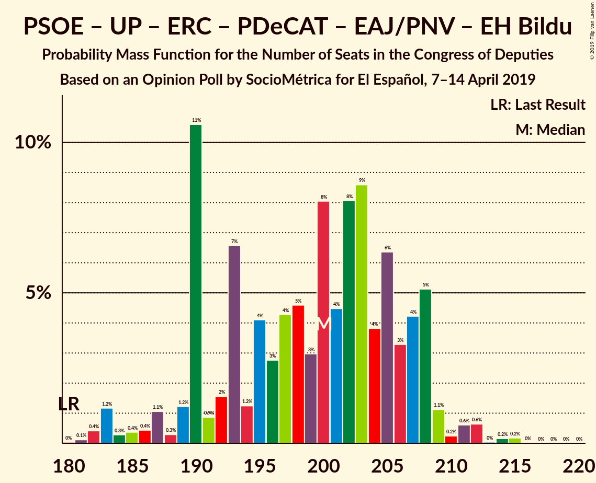
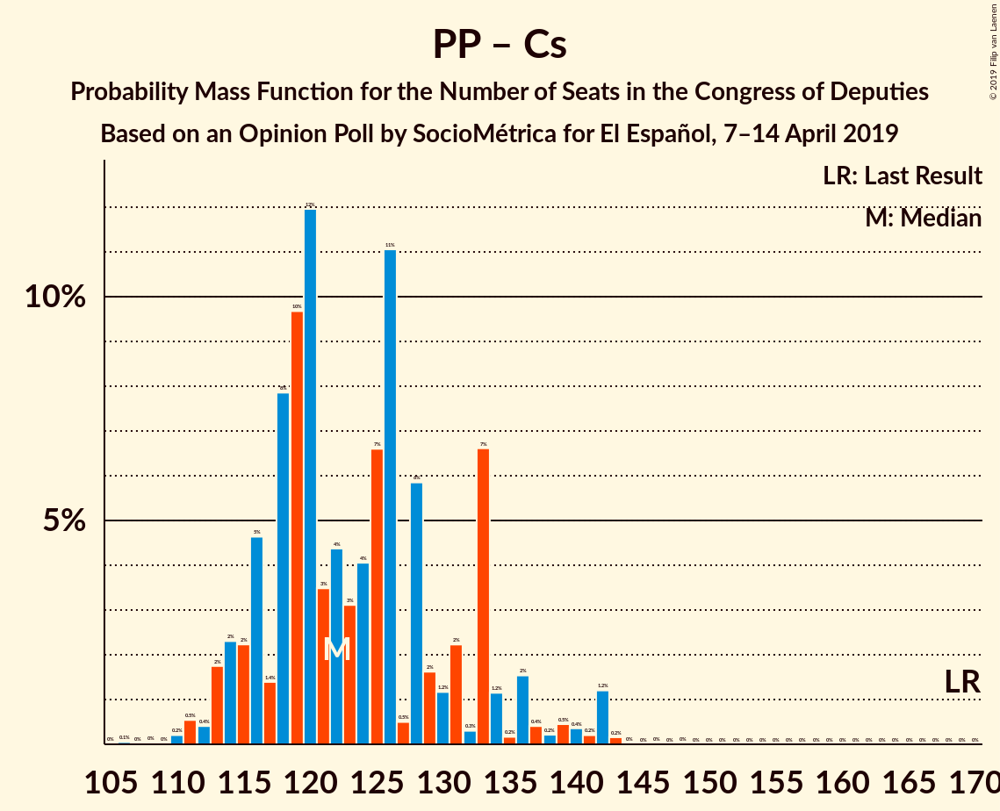

# Opinion Poll by SocioMétrica for El Español, 7–14 April 2019

<a href="#voting-intentions">Voting Intentions</a> | <a href="#seats">Seats</a> | <a href="#coalitions">Coalitions</a> | <a href="#technical-information">Technical Information</a>

## Voting Intentions

### Confidence Intervals

| Party | Last Result | Poll Result | 80% Confidence Interval | 90% Confidence Interval | 95% Confidence Interval | 99% Confidence Interval |
|:-----:|:-----------:|:-----------:|:-----------------------:|:-----------------------:|:-----------------------:|:-----------------------:|
| Partido Socialista Obrero Español | 22.6% | 30.5% | 29.1–31.9% |28.7–32.3% |28.4–32.7% |27.8–33.4% |
| Partido Popular | 33.0% | 18.8% | 17.6–20.0% |17.3–20.3% |17.0–20.7% |16.5–21.3% |
| Ciudadanos–Partido de la Ciudadanía | 13.1% | 16.0% | 14.9–17.2% |14.6–17.5% |14.4–17.8% |13.9–18.3% |
| Unidos Podemos | 21.2% | 13.5% | 12.5–14.6% |12.2–14.9% |12.0–15.2% |11.5–15.7% |
| Vox | 0.2% | 10.9% | 10.0–11.9% |9.7–12.2% |9.5–12.4% |9.1–12.9% |
| Esquerra Republicana de Catalunya–Catalunya Sí | 2.7% | 3.3% | 2.8–3.9% |2.7–4.1% |2.5–4.2% |2.3–4.5% |
| Partit Demòcrata Europeu Català | 2.0% | 1.3% | 1.0–1.7% |0.9–1.8% |0.9–1.9% |0.7–2.1% |
| Euzko Alderdi Jeltzalea/Partido Nacionalista Vasco | 1.2% | 1.1% | 0.9–1.5% |0.8–1.6% |0.7–1.7% |0.6–1.9% |
| Partido Animalista Contra el Maltrato Animal | 1.2% | 1.0% | 0.7–1.4% |0.7–1.5% |0.6–1.6% |0.5–1.8% |
| Euskal Herria Bildu | 0.8% | 1.0% | 0.7–1.4% |0.7–1.5% |0.6–1.6% |0.5–1.8% |
| Coalición Canaria–Partido Nacionalista Canario | 0.3% | 0.2% | 0.1–0.5% |0.1–0.5% |0.1–0.6% |0.0–0.7% |

*Note:* The poll result column reflects the actual value used in the calculations. Published results may vary slightly, and in addition be rounded to fewer digits.

## Seats

### Confidence Intervals

| Party | Last Result | Median | 80% Confidence Interval | 90% Confidence Interval | 95% Confidence Interval | 99% Confidence Interval |
|:-----:|:-----------:|:------:|:-----------------------:|:-----------------------:|:-----------------------:|:-----------------------:|
| <a href="#partido-socialista-obrero-español">Partido Socialista Obrero Español</a> | 85 | 135 | 126–140 |124–140 |120–143 |118–146 |
| <a href="#partido-popular">Partido Popular</a> | 137 | 71 | 64–77 |63–78 |62–80 |58–84 |
| <a href="#ciudadanos–partido-de-la-ciudadanía">Ciudadanos–Partido de la Ciudadanía</a> | 32 | 52 | 46–58 |45–61 |42–62 |39–63 |
| <a href="#unidos-podemos">Unidos Podemos</a> | 71 | 36 | 31–41 |29–42 |29–44 |27–46 |
| <a href="#vox">Vox</a> | 0 | 27 | 22–34 |19–34 |19–34 |18–38 |
| <a href="#esquerra-republicana-de-catalunya–catalunya-sí">Esquerra Republicana de Catalunya–Catalunya Sí</a> | 9 | 14 | 12–16 |11–18 |11–18 |10–20 |
| <a href="#partit-demòcrata-europeu-català">Partit Demòcrata Europeu Català</a> | 8 | 5 | 4–8 |3–8 |3–8 |1–9 |
| <a href="#euzko-alderdi-jeltzalea/partido-nacionalista-vasco">Euzko Alderdi Jeltzalea/Partido Nacionalista Vasco</a> | 5 | 6 | 3–7 |3–7 |3–7 |2–9 |
| <a href="#partido-animalista-contra-el-maltrato-animal">Partido Animalista Contra el Maltrato Animal</a> | 0 | 0 | 0 |0 |0 |0–1 |
| <a href="#euskal-herria-bildu">Euskal Herria Bildu</a> | 2 | 5 | 3–7 |2–7 |2–7 |1–8 |
| <a href="#coalición-canaria–partido-nacionalista-canario">Coalición Canaria–Partido Nacionalista Canario</a> | 1 | 1 | 0–2 |0–2 |0–2 |0–2 |

### Partido Socialista Obrero Español

*For a full overview of the results for this party, see the [Partido Socialista Obrero Español](party-partidosocialistaobreroespañol.html) page.*

| Number of Seats | Probability | Accumulated | Special Marks |
|:---------------:|:-----------:|:-----------:|:-------------:|
| 85 | 0% | 100% | Last Result |
| 86 | 0% | 100% |  |
| 87 | 0% | 100% |  |
| 88 | 0% | 100% |  |
| 89 | 0% | 100% |  |
| 90 | 0% | 100% |  |
| 91 | 0% | 100% |  |
| 92 | 0% | 100% |  |
| 93 | 0% | 100% |  |
| 94 | 0% | 100% |  |
| 95 | 0% | 100% |  |
| 96 | 0% | 100% |  |
| 97 | 0% | 100% |  |
| 98 | 0% | 100% |  |
| 99 | 0% | 100% |  |
| 100 | 0% | 100% |  |
| 101 | 0% | 100% |  |
| 102 | 0% | 100% |  |
| 103 | 0% | 100% |  |
| 104 | 0% | 100% |  |
| 105 | 0% | 100% |  |
| 106 | 0% | 100% |  |
| 107 | 0% | 100% |  |
| 108 | 0% | 100% |  |
| 109 | 0% | 100% |  |
| 110 | 0% | 100% |  |
| 111 | 0% | 100% |  |
| 112 | 0% | 100% |  |
| 113 | 0% | 100% |  |
| 114 | 0% | 100% |  |
| 115 | 0.1% | 100% |  |
| 116 | 0.1% | 99.9% |  |
| 117 | 0.2% | 99.8% |  |
| 118 | 1.4% | 99.7% |  |
| 119 | 0.3% | 98% |  |
| 120 | 0.9% | 98% |  |
| 121 | 0.3% | 97% |  |
| 122 | 0.7% | 97% |  |
| 123 | 0.6% | 96% |  |
| 124 | 2% | 96% |  |
| 125 | 3% | 94% |  |
| 126 | 9% | 91% |  |
| 127 | 1.1% | 81% |  |
| 128 | 2% | 80% |  |
| 129 | 1.5% | 78% |  |
| 130 | 1.1% | 77% |  |
| 131 | 2% | 76% |  |
| 132 | 2% | 73% |  |
| 133 | 14% | 71% |  |
| 134 | 3% | 57% |  |
| 135 | 6% | 54% | Median |
| 136 | 7% | 48% |  |
| 137 | 3% | 41% |  |
| 138 | 13% | 37% |  |
| 139 | 8% | 24% |  |
| 140 | 12% | 17% |  |
| 141 | 1.1% | 5% |  |
| 142 | 0.4% | 3% |  |
| 143 | 1.1% | 3% |  |
| 144 | 1.1% | 2% |  |
| 145 | 0.2% | 0.9% |  |
| 146 | 0.2% | 0.7% |  |
| 147 | 0.2% | 0.5% |  |
| 148 | 0.2% | 0.3% |  |
| 149 | 0.1% | 0.1% |  |
| 150 | 0% | 0% |  |

### Partido Popular

*For a full overview of the results for this party, see the [Partido Popular](party-partidopopular.html) page.*

| Number of Seats | Probability | Accumulated | Special Marks |
|:---------------:|:-----------:|:-----------:|:-------------:|
| 57 | 0.4% | 100% |  |
| 58 | 0.1% | 99.6% |  |
| 59 | 0.5% | 99.5% |  |
| 60 | 0.1% | 99.0% |  |
| 61 | 0.3% | 98.9% |  |
| 62 | 3% | 98.5% |  |
| 63 | 3% | 95% |  |
| 64 | 3% | 92% |  |
| 65 | 3% | 89% |  |
| 66 | 4% | 86% |  |
| 67 | 7% | 82% |  |
| 68 | 7% | 76% |  |
| 69 | 7% | 68% |  |
| 70 | 7% | 61% |  |
| 71 | 6% | 55% | Median |
| 72 | 5% | 48% |  |
| 73 | 7% | 43% |  |
| 74 | 7% | 36% |  |
| 75 | 0.9% | 28% |  |
| 76 | 10% | 28% |  |
| 77 | 8% | 18% |  |
| 78 | 5% | 9% |  |
| 79 | 2% | 5% |  |
| 80 | 0.9% | 3% |  |
| 81 | 0.8% | 2% |  |
| 82 | 0.4% | 1.3% |  |
| 83 | 0.4% | 0.9% |  |
| 84 | 0.3% | 0.5% |  |
| 85 | 0.1% | 0.3% |  |
| 86 | 0.1% | 0.2% |  |
| 87 | 0.1% | 0.1% |  |
| 88 | 0% | 0% |  |
| 89 | 0% | 0% |  |
| 90 | 0% | 0% |  |
| 91 | 0% | 0% |  |
| 92 | 0% | 0% |  |
| 93 | 0% | 0% |  |
| 94 | 0% | 0% |  |
| 95 | 0% | 0% |  |
| 96 | 0% | 0% |  |
| 97 | 0% | 0% |  |
| 98 | 0% | 0% |  |
| 99 | 0% | 0% |  |
| 100 | 0% | 0% |  |
| 101 | 0% | 0% |  |
| 102 | 0% | 0% |  |
| 103 | 0% | 0% |  |
| 104 | 0% | 0% |  |
| 105 | 0% | 0% |  |
| 106 | 0% | 0% |  |
| 107 | 0% | 0% |  |
| 108 | 0% | 0% |  |
| 109 | 0% | 0% |  |
| 110 | 0% | 0% |  |
| 111 | 0% | 0% |  |
| 112 | 0% | 0% |  |
| 113 | 0% | 0% |  |
| 114 | 0% | 0% |  |
| 115 | 0% | 0% |  |
| 116 | 0% | 0% |  |
| 117 | 0% | 0% |  |
| 118 | 0% | 0% |  |
| 119 | 0% | 0% |  |
| 120 | 0% | 0% |  |
| 121 | 0% | 0% |  |
| 122 | 0% | 0% |  |
| 123 | 0% | 0% |  |
| 124 | 0% | 0% |  |
| 125 | 0% | 0% |  |
| 126 | 0% | 0% |  |
| 127 | 0% | 0% |  |
| 128 | 0% | 0% |  |
| 129 | 0% | 0% |  |
| 130 | 0% | 0% |  |
| 131 | 0% | 0% |  |
| 132 | 0% | 0% |  |
| 133 | 0% | 0% |  |
| 134 | 0% | 0% |  |
| 135 | 0% | 0% |  |
| 136 | 0% | 0% |  |
| 137 | 0% | 0% | Last Result |

### Ciudadanos–Partido de la Ciudadanía

*For a full overview of the results for this party, see the [Ciudadanos–Partido de la Ciudadanía](party-ciudadanos–partidodelaciudadanía.html) page.*

| Number of Seats | Probability | Accumulated | Special Marks |
|:---------------:|:-----------:|:-----------:|:-------------:|
| 32 | 0% | 100% | Last Result |
| 33 | 0% | 100% |  |
| 34 | 0% | 100% |  |
| 35 | 0% | 100% |  |
| 36 | 0% | 100% |  |
| 37 | 0.1% | 100% |  |
| 38 | 0% | 99.9% |  |
| 39 | 1.1% | 99.9% |  |
| 40 | 0.3% | 98.8% |  |
| 41 | 0.6% | 98.5% |  |
| 42 | 0.8% | 98% |  |
| 43 | 0.2% | 97% |  |
| 44 | 2% | 97% |  |
| 45 | 2% | 95% |  |
| 46 | 7% | 93% |  |
| 47 | 3% | 86% |  |
| 48 | 5% | 83% |  |
| 49 | 5% | 78% |  |
| 50 | 14% | 73% |  |
| 51 | 6% | 59% |  |
| 52 | 5% | 53% | Median |
| 53 | 6% | 47% |  |
| 54 | 8% | 41% |  |
| 55 | 8% | 34% |  |
| 56 | 12% | 26% |  |
| 57 | 3% | 14% |  |
| 58 | 3% | 12% |  |
| 59 | 2% | 9% |  |
| 60 | 2% | 7% |  |
| 61 | 1.2% | 6% |  |
| 62 | 3% | 4% |  |
| 63 | 1.3% | 2% |  |
| 64 | 0.1% | 0.3% |  |
| 65 | 0.2% | 0.2% |  |
| 66 | 0% | 0% |  |

### Unidos Podemos

*For a full overview of the results for this party, see the [Unidos Podemos](party-unidospodemos.html) page.*

| Number of Seats | Probability | Accumulated | Special Marks |
|:---------------:|:-----------:|:-----------:|:-------------:|
| 25 | 0.1% | 100% |  |
| 26 | 0.2% | 99.8% |  |
| 27 | 1.4% | 99.7% |  |
| 28 | 0.4% | 98% |  |
| 29 | 3% | 98% |  |
| 30 | 2% | 95% |  |
| 31 | 11% | 93% |  |
| 32 | 1.4% | 82% |  |
| 33 | 6% | 81% |  |
| 34 | 9% | 75% |  |
| 35 | 10% | 65% |  |
| 36 | 12% | 55% | Median |
| 37 | 15% | 43% |  |
| 38 | 9% | 28% |  |
| 39 | 5% | 19% |  |
| 40 | 4% | 14% |  |
| 41 | 5% | 10% |  |
| 42 | 1.5% | 5% |  |
| 43 | 1.1% | 4% |  |
| 44 | 2% | 3% |  |
| 45 | 0.1% | 0.9% |  |
| 46 | 0.4% | 0.9% |  |
| 47 | 0.3% | 0.5% |  |
| 48 | 0.1% | 0.1% |  |
| 49 | 0% | 0% |  |
| 50 | 0% | 0% |  |
| 51 | 0% | 0% |  |
| 52 | 0% | 0% |  |
| 53 | 0% | 0% |  |
| 54 | 0% | 0% |  |
| 55 | 0% | 0% |  |
| 56 | 0% | 0% |  |
| 57 | 0% | 0% |  |
| 58 | 0% | 0% |  |
| 59 | 0% | 0% |  |
| 60 | 0% | 0% |  |
| 61 | 0% | 0% |  |
| 62 | 0% | 0% |  |
| 63 | 0% | 0% |  |
| 64 | 0% | 0% |  |
| 65 | 0% | 0% |  |
| 66 | 0% | 0% |  |
| 67 | 0% | 0% |  |
| 68 | 0% | 0% |  |
| 69 | 0% | 0% |  |
| 70 | 0% | 0% |  |
| 71 | 0% | 0% | Last Result |

### Vox

*For a full overview of the results for this party, see the [Vox](party-vox.html) page.*

| Number of Seats | Probability | Accumulated | Special Marks |
|:---------------:|:-----------:|:-----------:|:-------------:|
| 0 | 0% | 100% | Last Result |
| 1 | 0% | 100% |  |
| 2 | 0% | 100% |  |
| 3 | 0% | 100% |  |
| 4 | 0% | 100% |  |
| 5 | 0% | 100% |  |
| 6 | 0% | 100% |  |
| 7 | 0% | 100% |  |
| 8 | 0% | 100% |  |
| 9 | 0% | 100% |  |
| 10 | 0% | 100% |  |
| 11 | 0% | 100% |  |
| 12 | 0% | 100% |  |
| 13 | 0% | 100% |  |
| 14 | 0% | 100% |  |
| 15 | 0% | 100% |  |
| 16 | 0.1% | 100% |  |
| 17 | 0.2% | 99.9% |  |
| 18 | 0.5% | 99.7% |  |
| 19 | 6% | 99.2% |  |
| 20 | 2% | 94% |  |
| 21 | 0.6% | 91% |  |
| 22 | 2% | 91% |  |
| 23 | 13% | 89% |  |
| 24 | 7% | 76% |  |
| 25 | 9% | 69% |  |
| 26 | 7% | 60% |  |
| 27 | 13% | 53% | Median |
| 28 | 8% | 39% |  |
| 29 | 5% | 31% |  |
| 30 | 4% | 26% |  |
| 31 | 4% | 23% |  |
| 32 | 3% | 18% |  |
| 33 | 6% | 16% |  |
| 34 | 8% | 10% |  |
| 35 | 0.8% | 2% |  |
| 36 | 0.3% | 1.0% |  |
| 37 | 0.1% | 0.6% |  |
| 38 | 0.4% | 0.5% |  |
| 39 | 0.1% | 0.1% |  |
| 40 | 0% | 0.1% |  |
| 41 | 0% | 0.1% |  |
| 42 | 0% | 0% |  |

### Esquerra Republicana de Catalunya–Catalunya Sí

*For a full overview of the results for this party, see the [Esquerra Republicana de Catalunya–Catalunya Sí](party-esquerrarepublicanadecatalunya–catalunyasí.html) page.*

| Number of Seats | Probability | Accumulated | Special Marks |
|:---------------:|:-----------:|:-----------:|:-------------:|
| 8 | 0.1% | 100% |  |
| 9 | 0.2% | 99.9% | Last Result |
| 10 | 0.7% | 99.6% |  |
| 11 | 4% | 98.9% |  |
| 12 | 15% | 94% |  |
| 13 | 7% | 80% |  |
| 14 | 31% | 72% | Median |
| 15 | 19% | 41% |  |
| 16 | 13% | 22% |  |
| 17 | 4% | 10% |  |
| 18 | 3% | 6% |  |
| 19 | 1.3% | 2% |  |
| 20 | 1.2% | 1.2% |  |
| 21 | 0% | 0% |  |

### Partit Demòcrata Europeu Català

*For a full overview of the results for this party, see the [Partit Demòcrata Europeu Català](party-partitdemòcrataeuropeucatalà.html) page.*

| Number of Seats | Probability | Accumulated | Special Marks |
|:---------------:|:-----------:|:-----------:|:-------------:|
| 1 | 2% | 100% |  |
| 2 | 0.3% | 98% |  |
| 3 | 7% | 98% |  |
| 4 | 34% | 92% |  |
| 5 | 25% | 58% | Median |
| 6 | 19% | 33% |  |
| 7 | 2% | 14% |  |
| 8 | 12% | 12% | Last Result |
| 9 | 0.6% | 0.6% |  |
| 10 | 0.1% | 0.1% |  |
| 11 | 0% | 0% |  |

### Euzko Alderdi Jeltzalea/Partido Nacionalista Vasco

*For a full overview of the results for this party, see the [Euzko Alderdi Jeltzalea/Partido Nacionalista Vasco](party-euzkoalderdijeltzaleapartidonacionalistavasco.html) page.*

| Number of Seats | Probability | Accumulated | Special Marks |
|:---------------:|:-----------:|:-----------:|:-------------:|
| 2 | 0.6% | 100% |  |
| 3 | 27% | 99.4% |  |
| 4 | 8% | 72% |  |
| 5 | 9% | 64% | Last Result |
| 6 | 41% | 55% | Median |
| 7 | 12% | 14% |  |
| 8 | 0.8% | 2% |  |
| 9 | 0.7% | 0.7% |  |
| 10 | 0.1% | 0.1% |  |
| 11 | 0% | 0% |  |

### Partido Animalista Contra el Maltrato Animal

*For a full overview of the results for this party, see the [Partido Animalista Contra el Maltrato Animal](party-partidoanimalistacontraelmaltratoanimal.html) page.*

| Number of Seats | Probability | Accumulated | Special Marks |
|:---------------:|:-----------:|:-----------:|:-------------:|
| 0 | 99.2% | 100% | Last Result, Median |
| 1 | 0.8% | 0.8% |  |
| 2 | 0% | 0% |  |

### Euskal Herria Bildu

*For a full overview of the results for this party, see the [Euskal Herria Bildu](party-euskalherriabildu.html) page.*

| Number of Seats | Probability | Accumulated | Special Marks |
|:---------------:|:-----------:|:-----------:|:-------------:|
| 1 | 1.0% | 100% |  |
| 2 | 9% | 99.0% | Last Result |
| 3 | 1.5% | 90% |  |
| 4 | 23% | 89% |  |
| 5 | 36% | 66% | Median |
| 6 | 11% | 30% |  |
| 7 | 18% | 19% |  |
| 8 | 0.4% | 0.7% |  |
| 9 | 0.2% | 0.3% |  |
| 10 | 0.1% | 0.1% |  |
| 11 | 0% | 0% |  |

### Coalición Canaria–Partido Nacionalista Canario

*For a full overview of the results for this party, see the [Coalición Canaria–Partido Nacionalista Canario](party-coalicióncanaria–partidonacionalistacanario.html) page.*

| Number of Seats | Probability | Accumulated | Special Marks |
|:---------------:|:-----------:|:-----------:|:-------------:|
| 0 | 40% | 100% |  |
| 1 | 48% | 60% | Last Result, Median |
| 2 | 12% | 12% |  |
| 3 | 0.1% | 0.2% |  |
| 4 | 0.1% | 0.1% |  |
| 5 | 0% | 0% |  |

## Coalitions

### Confidence Intervals

| Coalition | Last Result | Median | Majority? | 80% Confidence Interval | 90% Confidence Interval | 95% Confidence Interval | 99% Confidence Interval |
|:---------:|:-----------:|:------:|:---------:|:-----------------------:|:-----------------------:|:-----------------------:|:-----------------------:|
| Partido Socialista Obrero Español – Partido Popular – Ciudadanos–Partido de la Ciudadanía | 254 | 257 | 100% | 252–266 | 250–266 | 247–268 | 244–269 |
| Partido Socialista Obrero Español – Ciudadanos–Partido de la Ciudadanía – Unidos Podemos | 188 | 221 | 100% | 213–231 | 212–233 | 210–233 | 207–236 |
| Partido Socialista Obrero Español – Partido Popular | 222 | 206 | 100% | 198–212 | 196–214 | 193–215 | 191–218 |
| Partido Socialista Obrero Español – Unidos Podemos – Esquerra Republicana de Catalunya–Catalunya Sí – Partit Demòcrata Europeu Català – Euzko Alderdi Jeltzalea/Partido Nacionalista Vasco – Euskal Herria Bildu | 180 | 200 | 100% | 190–207 | 189–208 | 186–209 | 182–212 |
| Partido Socialista Obrero Español – Unidos Podemos – Esquerra Republicana de Catalunya–Catalunya Sí – Euskal Herria Bildu | 167 | 189 | 97% | 179–197 | 178–201 | 175–201 | 171–203 |
| Partido Socialista Obrero Español – Unidos Podemos – Esquerra Republicana de Catalunya–Catalunya Sí – Partit Demòcrata Europeu Català | 173 | 190 | 98% | 182–196 | 179–198 | 176–199 | 173–202 |
| Partido Socialista Obrero Español – Ciudadanos–Partido de la Ciudadanía | 117 | 187 | 96% | 176–194 | 176–195 | 172–196 | 169–199 |
| Partido Socialista Obrero Español – Unidos Podemos – Euzko Alderdi Jeltzalea/Partido Nacionalista Vasco – Euskal Herria Bildu | 163 | 180 | 72% | 170–189 | 169–190 | 166–191 | 162–195 |
| Partido Socialista Obrero Español – Unidos Podemos – Euzko Alderdi Jeltzalea/Partido Nacionalista Vasco | 161 | 175 | 49% | 166–184 | 164–184 | 162–187 | 158–190 |
| Partido Socialista Obrero Español – Unidos Podemos | 156 | 170 | 20% | 162–179 | 159–180 | 156–181 | 152–184 |
| Partido Popular – Ciudadanos–Partido de la Ciudadanía – Vox | 169 | 149 | 0% | 143–160 | 141–160 | 141–164 | 138–167 |
| Partido Popular – Ciudadanos–Partido de la Ciudadanía – Euzko Alderdi Jeltzalea/Partido Nacionalista Vasco | 174 | 127 | 0% | 121–136 | 120–141 | 118–144 | 117–148 |
| Partido Socialista Obrero Español | 85 | 135 | 0% | 126–140 | 124–140 | 120–143 | 118–146 |
| Partido Popular – Ciudadanos–Partido de la Ciudadanía – Coalición Canaria–Partido Nacionalista Canario | 170 | 123 | 0% | 117–134 | 115–135 | 114–139 | 112–143 |
| Partido Popular – Ciudadanos–Partido de la Ciudadanía | 169 | 122 | 0% | 116–133 | 114–134 | 113–138 | 111–142 |
| Partido Popular – Vox | 137 | 98 | 0% | 90–108 | 88–110 | 87–110 | 84–113 |
| Partido Popular | 137 | 71 | 0% | 64–77 | 63–78 | 62–80 | 58–84 |

### Partido Socialista Obrero Español – Partido Popular – Ciudadanos–Partido de la Ciudadanía

| Number of Seats | Probability | Accumulated | Special Marks |
|:---------------:|:-----------:|:-----------:|:-------------:|
| 241 | 0.1% | 100% |  |
| 242 | 0.1% | 99.9% |  |
| 243 | 0% | 99.9% |  |
| 244 | 0.7% | 99.8% |  |
| 245 | 0.4% | 99.2% |  |
| 246 | 1.0% | 98.7% |  |
| 247 | 1.1% | 98% |  |
| 248 | 0.8% | 97% |  |
| 249 | 0.7% | 96% |  |
| 250 | 1.3% | 95% |  |
| 251 | 3% | 94% |  |
| 252 | 15% | 90% |  |
| 253 | 3% | 75% |  |
| 254 | 6% | 72% | Last Result |
| 255 | 6% | 66% |  |
| 256 | 6% | 60% |  |
| 257 | 9% | 54% |  |
| 258 | 6% | 45% | Median |
| 259 | 8% | 39% |  |
| 260 | 6% | 31% |  |
| 261 | 2% | 25% |  |
| 262 | 2% | 23% |  |
| 263 | 6% | 21% |  |
| 264 | 2% | 16% |  |
| 265 | 0.6% | 14% |  |
| 266 | 8% | 13% |  |
| 267 | 0.3% | 5% |  |
| 268 | 3% | 4% |  |
| 269 | 0.6% | 1.0% |  |
| 270 | 0.1% | 0.4% |  |
| 271 | 0% | 0.3% |  |
| 272 | 0.2% | 0.3% |  |
| 273 | 0% | 0.1% |  |
| 274 | 0% | 0% |  |

### Partido Socialista Obrero Español – Ciudadanos–Partido de la Ciudadanía – Unidos Podemos

| Number of Seats | Probability | Accumulated | Special Marks |
|:---------------:|:-----------:|:-----------:|:-------------:|
| 188 | 0% | 100% | Last Result |
| 189 | 0% | 100% |  |
| 190 | 0% | 100% |  |
| 191 | 0% | 100% |  |
| 192 | 0% | 100% |  |
| 193 | 0% | 100% |  |
| 194 | 0% | 100% |  |
| 195 | 0% | 100% |  |
| 196 | 0% | 100% |  |
| 197 | 0% | 100% |  |
| 198 | 0% | 100% |  |
| 199 | 0% | 100% |  |
| 200 | 0% | 100% |  |
| 201 | 0% | 100% |  |
| 202 | 0% | 100% |  |
| 203 | 0% | 100% |  |
| 204 | 0% | 99.9% |  |
| 205 | 0.1% | 99.9% |  |
| 206 | 0.2% | 99.8% |  |
| 207 | 0.3% | 99.6% |  |
| 208 | 0.7% | 99.3% |  |
| 209 | 0.9% | 98.6% |  |
| 210 | 2% | 98% |  |
| 211 | 0.9% | 96% |  |
| 212 | 0.5% | 95% |  |
| 213 | 11% | 95% |  |
| 214 | 2% | 84% |  |
| 215 | 5% | 83% |  |
| 216 | 3% | 77% |  |
| 217 | 5% | 74% |  |
| 218 | 3% | 69% |  |
| 219 | 2% | 66% |  |
| 220 | 8% | 64% |  |
| 221 | 7% | 56% |  |
| 222 | 7% | 50% |  |
| 223 | 3% | 42% | Median |
| 224 | 1.5% | 40% |  |
| 225 | 8% | 38% |  |
| 226 | 2% | 30% |  |
| 227 | 3% | 27% |  |
| 228 | 4% | 24% |  |
| 229 | 5% | 21% |  |
| 230 | 0.5% | 15% |  |
| 231 | 5% | 15% |  |
| 232 | 0.7% | 9% |  |
| 233 | 7% | 9% |  |
| 234 | 0.1% | 2% |  |
| 235 | 0.4% | 2% |  |
| 236 | 1.2% | 1.4% |  |
| 237 | 0% | 0.3% |  |
| 238 | 0.1% | 0.2% |  |
| 239 | 0% | 0.1% |  |
| 240 | 0% | 0.1% |  |
| 241 | 0% | 0.1% |  |
| 242 | 0% | 0% |  |

### Partido Socialista Obrero Español – Partido Popular

| Number of Seats | Probability | Accumulated | Special Marks |
|:---------------:|:-----------:|:-----------:|:-------------:|
| 188 | 0% | 100% |  |
| 189 | 0% | 99.9% |  |
| 190 | 0.3% | 99.9% |  |
| 191 | 0.3% | 99.5% |  |
| 192 | 0.2% | 99.2% |  |
| 193 | 2% | 99.0% |  |
| 194 | 1.0% | 97% |  |
| 195 | 0.5% | 96% |  |
| 196 | 1.3% | 96% |  |
| 197 | 4% | 94% |  |
| 198 | 4% | 90% |  |
| 199 | 2% | 86% |  |
| 200 | 3% | 85% |  |
| 201 | 1.0% | 82% |  |
| 202 | 10% | 81% |  |
| 203 | 4% | 71% |  |
| 204 | 5% | 67% |  |
| 205 | 4% | 62% |  |
| 206 | 16% | 58% | Median |
| 207 | 15% | 42% |  |
| 208 | 5% | 27% |  |
| 209 | 1.3% | 22% |  |
| 210 | 9% | 21% |  |
| 211 | 2% | 12% |  |
| 212 | 2% | 10% |  |
| 213 | 0.6% | 8% |  |
| 214 | 5% | 8% |  |
| 215 | 0.5% | 3% |  |
| 216 | 0.4% | 2% |  |
| 217 | 1.3% | 2% |  |
| 218 | 0.3% | 0.7% |  |
| 219 | 0.1% | 0.4% |  |
| 220 | 0.2% | 0.3% |  |
| 221 | 0.1% | 0.1% |  |
| 222 | 0.1% | 0.1% | Last Result |
| 223 | 0% | 0% |  |

### Partido Socialista Obrero Español – Unidos Podemos – Esquerra Republicana de Catalunya–Catalunya Sí – Partit Demòcrata Europeu Català – Euzko Alderdi Jeltzalea/Partido Nacionalista Vasco – Euskal Herria Bildu

| Number of Seats | Probability | Accumulated | Special Marks |
|:---------------:|:-----------:|:-----------:|:-------------:|
| 180 | 0% | 100% | Last Result |
| 181 | 0.1% | 99.9% |  |
| 182 | 0.4% | 99.8% |  |
| 183 | 1.2% | 99.4% |  |
| 184 | 0.3% | 98% |  |
| 185 | 0.4% | 98% |  |
| 186 | 0.4% | 98% |  |
| 187 | 1.1% | 97% |  |
| 188 | 0.3% | 96% |  |
| 189 | 1.2% | 96% |  |
| 190 | 11% | 95% |  |
| 191 | 0.9% | 84% |  |
| 192 | 2% | 83% |  |
| 193 | 7% | 82% |  |
| 194 | 1.2% | 75% |  |
| 195 | 4% | 74% |  |
| 196 | 3% | 70% |  |
| 197 | 4% | 67% |  |
| 198 | 5% | 63% |  |
| 199 | 3% | 58% |  |
| 200 | 8% | 55% |  |
| 201 | 4% | 47% | Median |
| 202 | 8% | 42% |  |
| 203 | 9% | 34% |  |
| 204 | 4% | 26% |  |
| 205 | 6% | 22% |  |
| 206 | 3% | 16% |  |
| 207 | 4% | 12% |  |
| 208 | 5% | 8% |  |
| 209 | 1.1% | 3% |  |
| 210 | 0.2% | 2% |  |
| 211 | 0.6% | 2% |  |
| 212 | 0.6% | 1.0% |  |
| 213 | 0% | 0.4% |  |
| 214 | 0.2% | 0.4% |  |
| 215 | 0.2% | 0.2% |  |
| 216 | 0% | 0% |  |

### Partido Socialista Obrero Español – Unidos Podemos – Esquerra Republicana de Catalunya–Catalunya Sí – Euskal Herria Bildu

| Number of Seats | Probability | Accumulated | Special Marks |
|:---------------:|:-----------:|:-----------:|:-------------:|
| 167 | 0% | 100% | Last Result |
| 168 | 0% | 100% |  |
| 169 | 0% | 100% |  |
| 170 | 0.2% | 99.9% |  |
| 171 | 1.3% | 99.7% |  |
| 172 | 0.4% | 98% |  |
| 173 | 0.1% | 98% |  |
| 174 | 0.2% | 98% |  |
| 175 | 0.9% | 98% |  |
| 176 | 1.2% | 97% | Majority |
| 177 | 0.6% | 96% |  |
| 178 | 2% | 95% |  |
| 179 | 9% | 93% |  |
| 180 | 1.1% | 84% |  |
| 181 | 0.6% | 83% |  |
| 182 | 0.8% | 82% |  |
| 183 | 4% | 82% |  |
| 184 | 3% | 78% |  |
| 185 | 7% | 75% |  |
| 186 | 3% | 68% |  |
| 187 | 3% | 65% |  |
| 188 | 8% | 62% |  |
| 189 | 6% | 54% |  |
| 190 | 3% | 48% | Median |
| 191 | 2% | 45% |  |
| 192 | 8% | 43% |  |
| 193 | 9% | 34% |  |
| 194 | 4% | 26% |  |
| 195 | 1.4% | 22% |  |
| 196 | 7% | 21% |  |
| 197 | 4% | 14% |  |
| 198 | 2% | 10% |  |
| 199 | 2% | 8% |  |
| 200 | 1.0% | 6% |  |
| 201 | 4% | 5% |  |
| 202 | 1.1% | 2% |  |
| 203 | 0.1% | 0.6% |  |
| 204 | 0.2% | 0.5% |  |
| 205 | 0.2% | 0.3% |  |
| 206 | 0% | 0.1% |  |
| 207 | 0% | 0.1% |  |
| 208 | 0.1% | 0.1% |  |
| 209 | 0% | 0% |  |

### Partido Socialista Obrero Español – Unidos Podemos – Esquerra Republicana de Catalunya–Catalunya Sí – Partit Demòcrata Europeu Català

| Number of Seats | Probability | Accumulated | Special Marks |
|:---------------:|:-----------:|:-----------:|:-------------:|
| 169 | 0% | 100% |  |
| 170 | 0% | 99.9% |  |
| 171 | 0.2% | 99.9% |  |
| 172 | 0.1% | 99.8% |  |
| 173 | 1.1% | 99.6% | Last Result |
| 174 | 0.5% | 98.6% |  |
| 175 | 0.2% | 98% |  |
| 176 | 1.3% | 98% | Majority |
| 177 | 1.0% | 96% |  |
| 178 | 0.4% | 95% |  |
| 179 | 1.4% | 95% |  |
| 180 | 2% | 94% |  |
| 181 | 1.3% | 92% |  |
| 182 | 0.9% | 90% |  |
| 183 | 15% | 89% |  |
| 184 | 3% | 74% |  |
| 185 | 5% | 71% |  |
| 186 | 1.1% | 67% |  |
| 187 | 1.5% | 66% |  |
| 188 | 8% | 64% |  |
| 189 | 5% | 56% |  |
| 190 | 5% | 52% | Median |
| 191 | 9% | 47% |  |
| 192 | 7% | 38% |  |
| 193 | 7% | 31% |  |
| 194 | 3% | 24% |  |
| 195 | 3% | 21% |  |
| 196 | 8% | 18% |  |
| 197 | 2% | 10% |  |
| 198 | 5% | 8% |  |
| 199 | 1.3% | 4% |  |
| 200 | 1.0% | 2% |  |
| 201 | 0.7% | 1.3% |  |
| 202 | 0.1% | 0.5% |  |
| 203 | 0.1% | 0.5% |  |
| 204 | 0.2% | 0.4% |  |
| 205 | 0% | 0.1% |  |
| 206 | 0% | 0.1% |  |
| 207 | 0.1% | 0.1% |  |
| 208 | 0% | 0% |  |

### Partido Socialista Obrero Español – Ciudadanos–Partido de la Ciudadanía

| Number of Seats | Probability | Accumulated | Special Marks |
|:---------------:|:-----------:|:-----------:|:-------------:|
| 117 | 0% | 100% | Last Result |
| 118 | 0% | 100% |  |
| 119 | 0% | 100% |  |
| 120 | 0% | 100% |  |
| 121 | 0% | 100% |  |
| 122 | 0% | 100% |  |
| 123 | 0% | 100% |  |
| 124 | 0% | 100% |  |
| 125 | 0% | 100% |  |
| 126 | 0% | 100% |  |
| 127 | 0% | 100% |  |
| 128 | 0% | 100% |  |
| 129 | 0% | 100% |  |
| 130 | 0% | 100% |  |
| 131 | 0% | 100% |  |
| 132 | 0% | 100% |  |
| 133 | 0% | 100% |  |
| 134 | 0% | 100% |  |
| 135 | 0% | 100% |  |
| 136 | 0% | 100% |  |
| 137 | 0% | 100% |  |
| 138 | 0% | 100% |  |
| 139 | 0% | 100% |  |
| 140 | 0% | 100% |  |
| 141 | 0% | 100% |  |
| 142 | 0% | 100% |  |
| 143 | 0% | 100% |  |
| 144 | 0% | 100% |  |
| 145 | 0% | 100% |  |
| 146 | 0% | 100% |  |
| 147 | 0% | 100% |  |
| 148 | 0% | 100% |  |
| 149 | 0% | 100% |  |
| 150 | 0% | 100% |  |
| 151 | 0% | 100% |  |
| 152 | 0% | 100% |  |
| 153 | 0% | 100% |  |
| 154 | 0% | 100% |  |
| 155 | 0% | 100% |  |
| 156 | 0% | 100% |  |
| 157 | 0% | 100% |  |
| 158 | 0% | 100% |  |
| 159 | 0% | 100% |  |
| 160 | 0% | 100% |  |
| 161 | 0% | 100% |  |
| 162 | 0% | 100% |  |
| 163 | 0% | 100% |  |
| 164 | 0% | 100% |  |
| 165 | 0% | 100% |  |
| 166 | 0% | 100% |  |
| 167 | 0% | 100% |  |
| 168 | 0.2% | 100% |  |
| 169 | 0.9% | 99.7% |  |
| 170 | 0.8% | 98.8% |  |
| 171 | 0.2% | 98% |  |
| 172 | 0.6% | 98% |  |
| 173 | 0.3% | 97% |  |
| 174 | 0.5% | 97% |  |
| 175 | 0.6% | 96% |  |
| 176 | 9% | 96% | Majority |
| 177 | 0.9% | 87% |  |
| 178 | 2% | 86% |  |
| 179 | 6% | 84% |  |
| 180 | 5% | 79% |  |
| 181 | 2% | 74% |  |
| 182 | 2% | 71% |  |
| 183 | 1.1% | 69% |  |
| 184 | 2% | 68% |  |
| 185 | 9% | 66% |  |
| 186 | 7% | 57% |  |
| 187 | 3% | 50% | Median |
| 188 | 3% | 48% |  |
| 189 | 10% | 45% |  |
| 190 | 5% | 35% |  |
| 191 | 7% | 31% |  |
| 192 | 3% | 24% |  |
| 193 | 3% | 21% |  |
| 194 | 9% | 18% |  |
| 195 | 5% | 9% |  |
| 196 | 2% | 3% |  |
| 197 | 0.4% | 1.2% |  |
| 198 | 0.3% | 0.8% |  |
| 199 | 0.2% | 0.5% |  |
| 200 | 0.1% | 0.3% |  |
| 201 | 0.2% | 0.2% |  |
| 202 | 0% | 0.1% |  |
| 203 | 0% | 0% |  |

### Partido Socialista Obrero Español – Unidos Podemos – Euzko Alderdi Jeltzalea/Partido Nacionalista Vasco – Euskal Herria Bildu

| Number of Seats | Probability | Accumulated | Special Marks |
|:---------------:|:-----------:|:-----------:|:-------------:|
| 160 | 0% | 100% |  |
| 161 | 0% | 99.9% |  |
| 162 | 1.1% | 99.9% |  |
| 163 | 0.2% | 98.8% | Last Result |
| 164 | 0.7% | 98.6% |  |
| 165 | 0.2% | 98% |  |
| 166 | 0.4% | 98% |  |
| 167 | 0.9% | 97% |  |
| 168 | 1.0% | 96% |  |
| 169 | 1.0% | 95% |  |
| 170 | 10% | 95% |  |
| 171 | 2% | 85% |  |
| 172 | 2% | 83% |  |
| 173 | 2% | 81% |  |
| 174 | 6% | 80% |  |
| 175 | 2% | 74% |  |
| 176 | 4% | 72% | Majority |
| 177 | 4% | 67% |  |
| 178 | 2% | 63% |  |
| 179 | 8% | 61% |  |
| 180 | 4% | 53% |  |
| 181 | 2% | 49% |  |
| 182 | 9% | 47% | Median |
| 183 | 5% | 38% |  |
| 184 | 4% | 33% |  |
| 185 | 7% | 29% |  |
| 186 | 6% | 22% |  |
| 187 | 2% | 16% |  |
| 188 | 3% | 14% |  |
| 189 | 4% | 10% |  |
| 190 | 4% | 6% |  |
| 191 | 1.0% | 3% |  |
| 192 | 0.2% | 2% |  |
| 193 | 0.5% | 1.5% |  |
| 194 | 0.1% | 1.0% |  |
| 195 | 0.7% | 0.9% |  |
| 196 | 0.2% | 0.3% |  |
| 197 | 0.1% | 0.1% |  |
| 198 | 0% | 0% |  |

### Partido Socialista Obrero Español – Unidos Podemos – Euzko Alderdi Jeltzalea/Partido Nacionalista Vasco

| Number of Seats | Probability | Accumulated | Special Marks |
|:---------------:|:-----------:|:-----------:|:-------------:|
| 154 | 0% | 100% |  |
| 155 | 0% | 99.9% |  |
| 156 | 0% | 99.9% |  |
| 157 | 0.1% | 99.9% |  |
| 158 | 1.2% | 99.8% |  |
| 159 | 0.2% | 98.6% |  |
| 160 | 0.3% | 98% |  |
| 161 | 0.2% | 98% | Last Result |
| 162 | 2% | 98% |  |
| 163 | 0.9% | 96% |  |
| 164 | 0.9% | 95% |  |
| 165 | 0.6% | 95% |  |
| 166 | 12% | 94% |  |
| 167 | 7% | 82% |  |
| 168 | 1.1% | 76% |  |
| 169 | 2% | 74% |  |
| 170 | 1.2% | 72% |  |
| 171 | 4% | 71% |  |
| 172 | 3% | 67% |  |
| 173 | 4% | 64% |  |
| 174 | 5% | 60% |  |
| 175 | 6% | 55% |  |
| 176 | 2% | 49% | Majority |
| 177 | 5% | 47% | Median |
| 178 | 10% | 42% |  |
| 179 | 5% | 32% |  |
| 180 | 5% | 27% |  |
| 181 | 5% | 23% |  |
| 182 | 3% | 18% |  |
| 183 | 4% | 15% |  |
| 184 | 7% | 11% |  |
| 185 | 1.4% | 4% |  |
| 186 | 0.1% | 3% |  |
| 187 | 1.5% | 3% |  |
| 188 | 0.5% | 2% |  |
| 189 | 0% | 1.1% |  |
| 190 | 0.6% | 1.0% |  |
| 191 | 0.3% | 0.4% |  |
| 192 | 0.1% | 0.1% |  |
| 193 | 0% | 0.1% |  |
| 194 | 0% | 0% |  |

### Partido Socialista Obrero Español – Unidos Podemos

| Number of Seats | Probability | Accumulated | Special Marks |
|:---------------:|:-----------:|:-----------:|:-------------:|
| 149 | 0% | 100% |  |
| 150 | 0% | 99.9% |  |
| 151 | 0.1% | 99.9% |  |
| 152 | 1.0% | 99.8% |  |
| 153 | 0.1% | 98.8% |  |
| 154 | 0.2% | 98.6% |  |
| 155 | 0.2% | 98% |  |
| 156 | 2% | 98% | Last Result |
| 157 | 0.5% | 96% |  |
| 158 | 0.7% | 96% |  |
| 159 | 0.9% | 95% |  |
| 160 | 4% | 94% |  |
| 161 | 0.6% | 91% |  |
| 162 | 1.5% | 90% |  |
| 163 | 9% | 89% |  |
| 164 | 6% | 80% |  |
| 165 | 2% | 73% |  |
| 166 | 5% | 71% |  |
| 167 | 4% | 66% |  |
| 168 | 4% | 63% |  |
| 169 | 8% | 58% |  |
| 170 | 2% | 50% |  |
| 171 | 5% | 49% | Median |
| 172 | 7% | 43% |  |
| 173 | 6% | 36% |  |
| 174 | 6% | 31% |  |
| 175 | 5% | 25% |  |
| 176 | 3% | 20% | Majority |
| 177 | 2% | 17% |  |
| 178 | 4% | 15% |  |
| 179 | 4% | 11% |  |
| 180 | 4% | 6% |  |
| 181 | 0.4% | 3% |  |
| 182 | 1.2% | 2% |  |
| 183 | 0.2% | 1.2% |  |
| 184 | 0.6% | 1.0% |  |
| 185 | 0.3% | 0.5% |  |
| 186 | 0% | 0.2% |  |
| 187 | 0% | 0.1% |  |
| 188 | 0% | 0.1% |  |
| 189 | 0.1% | 0.1% |  |
| 190 | 0% | 0% |  |

### Partido Popular – Ciudadanos–Partido de la Ciudadanía – Vox

| Number of Seats | Probability | Accumulated | Special Marks |
|:---------------:|:-----------:|:-----------:|:-------------:|
| 135 | 0.2% | 100% |  |
| 136 | 0.2% | 99.8% |  |
| 137 | 0.1% | 99.6% |  |
| 138 | 1.1% | 99.5% |  |
| 139 | 0.3% | 98% |  |
| 140 | 0.5% | 98% |  |
| 141 | 5% | 98% |  |
| 142 | 2% | 93% |  |
| 143 | 4% | 90% |  |
| 144 | 3% | 86% |  |
| 145 | 11% | 83% |  |
| 146 | 7% | 72% |  |
| 147 | 9% | 66% |  |
| 148 | 3% | 57% |  |
| 149 | 9% | 54% |  |
| 150 | 3% | 45% | Median |
| 151 | 5% | 42% |  |
| 152 | 3% | 38% |  |
| 153 | 3% | 34% |  |
| 154 | 3% | 31% |  |
| 155 | 2% | 28% |  |
| 156 | 7% | 26% |  |
| 157 | 1.1% | 19% |  |
| 158 | 2% | 17% |  |
| 159 | 2% | 16% |  |
| 160 | 9% | 14% |  |
| 161 | 1.0% | 5% |  |
| 162 | 0.9% | 4% |  |
| 163 | 0.3% | 3% |  |
| 164 | 0.4% | 3% |  |
| 165 | 0.3% | 2% |  |
| 166 | 1.3% | 2% |  |
| 167 | 0.4% | 0.6% |  |
| 168 | 0.1% | 0.2% |  |
| 169 | 0% | 0.1% | Last Result |
| 170 | 0% | 0.1% |  |
| 171 | 0% | 0% |  |

### Partido Popular – Ciudadanos–Partido de la Ciudadanía – Euzko Alderdi Jeltzalea/Partido Nacionalista Vasco

| Number of Seats | Probability | Accumulated | Special Marks |
|:---------------:|:-----------:|:-----------:|:-------------:|
| 112 | 0.1% | 100% |  |
| 113 | 0% | 99.9% |  |
| 114 | 0.1% | 99.9% |  |
| 115 | 0.1% | 99.8% |  |
| 116 | 0.2% | 99.8% |  |
| 117 | 1.0% | 99.5% |  |
| 118 | 1.4% | 98.6% |  |
| 119 | 0.5% | 97% |  |
| 120 | 3% | 97% |  |
| 121 | 6% | 94% |  |
| 122 | 5% | 87% |  |
| 123 | 2% | 83% |  |
| 124 | 4% | 81% |  |
| 125 | 16% | 77% |  |
| 126 | 6% | 61% |  |
| 127 | 5% | 54% |  |
| 128 | 2% | 50% |  |
| 129 | 10% | 47% | Median |
| 130 | 7% | 37% |  |
| 131 | 7% | 30% |  |
| 132 | 0.6% | 24% |  |
| 133 | 2% | 23% |  |
| 134 | 3% | 21% |  |
| 135 | 2% | 18% |  |
| 136 | 7% | 16% |  |
| 137 | 2% | 9% |  |
| 138 | 0.5% | 6% |  |
| 139 | 0.3% | 6% |  |
| 140 | 0.3% | 6% |  |
| 141 | 1.0% | 5% |  |
| 142 | 2% | 4% |  |
| 143 | 0.3% | 3% |  |
| 144 | 0.1% | 3% |  |
| 145 | 0.7% | 2% |  |
| 146 | 0.3% | 2% |  |
| 147 | 0.1% | 1.3% |  |
| 148 | 1.0% | 1.2% |  |
| 149 | 0.1% | 0.2% |  |
| 150 | 0% | 0.1% |  |
| 151 | 0% | 0.1% |  |
| 152 | 0% | 0% |  |
| 153 | 0% | 0% |  |
| 154 | 0% | 0% |  |
| 155 | 0% | 0% |  |
| 156 | 0% | 0% |  |
| 157 | 0% | 0% |  |
| 158 | 0% | 0% |  |
| 159 | 0% | 0% |  |
| 160 | 0% | 0% |  |
| 161 | 0% | 0% |  |
| 162 | 0% | 0% |  |
| 163 | 0% | 0% |  |
| 164 | 0% | 0% |  |
| 165 | 0% | 0% |  |
| 166 | 0% | 0% |  |
| 167 | 0% | 0% |  |
| 168 | 0% | 0% |  |
| 169 | 0% | 0% |  |
| 170 | 0% | 0% |  |
| 171 | 0% | 0% |  |
| 172 | 0% | 0% |  |
| 173 | 0% | 0% |  |
| 174 | 0% | 0% | Last Result |

### Partido Socialista Obrero Español

| Number of Seats | Probability | Accumulated | Special Marks |
|:---------------:|:-----------:|:-----------:|:-------------:|
| 85 | 0% | 100% | Last Result |
| 86 | 0% | 100% |  |
| 87 | 0% | 100% |  |
| 88 | 0% | 100% |  |
| 89 | 0% | 100% |  |
| 90 | 0% | 100% |  |
| 91 | 0% | 100% |  |
| 92 | 0% | 100% |  |
| 93 | 0% | 100% |  |
| 94 | 0% | 100% |  |
| 95 | 0% | 100% |  |
| 96 | 0% | 100% |  |
| 97 | 0% | 100% |  |
| 98 | 0% | 100% |  |
| 99 | 0% | 100% |  |
| 100 | 0% | 100% |  |
| 101 | 0% | 100% |  |
| 102 | 0% | 100% |  |
| 103 | 0% | 100% |  |
| 104 | 0% | 100% |  |
| 105 | 0% | 100% |  |
| 106 | 0% | 100% |  |
| 107 | 0% | 100% |  |
| 108 | 0% | 100% |  |
| 109 | 0% | 100% |  |
| 110 | 0% | 100% |  |
| 111 | 0% | 100% |  |
| 112 | 0% | 100% |  |
| 113 | 0% | 100% |  |
| 114 | 0% | 100% |  |
| 115 | 0.1% | 100% |  |
| 116 | 0.1% | 99.9% |  |
| 117 | 0.2% | 99.8% |  |
| 118 | 1.4% | 99.7% |  |
| 119 | 0.3% | 98% |  |
| 120 | 0.9% | 98% |  |
| 121 | 0.3% | 97% |  |
| 122 | 0.7% | 97% |  |
| 123 | 0.6% | 96% |  |
| 124 | 2% | 96% |  |
| 125 | 3% | 94% |  |
| 126 | 9% | 91% |  |
| 127 | 1.1% | 81% |  |
| 128 | 2% | 80% |  |
| 129 | 1.5% | 78% |  |
| 130 | 1.1% | 77% |  |
| 131 | 2% | 76% |  |
| 132 | 2% | 73% |  |
| 133 | 14% | 71% |  |
| 134 | 3% | 57% |  |
| 135 | 6% | 54% | Median |
| 136 | 7% | 48% |  |
| 137 | 3% | 41% |  |
| 138 | 13% | 37% |  |
| 139 | 8% | 24% |  |
| 140 | 12% | 17% |  |
| 141 | 1.1% | 5% |  |
| 142 | 0.4% | 3% |  |
| 143 | 1.1% | 3% |  |
| 144 | 1.1% | 2% |  |
| 145 | 0.2% | 0.9% |  |
| 146 | 0.2% | 0.7% |  |
| 147 | 0.2% | 0.5% |  |
| 148 | 0.2% | 0.3% |  |
| 149 | 0.1% | 0.1% |  |
| 150 | 0% | 0% |  |

### Partido Popular – Ciudadanos–Partido de la Ciudadanía – Coalición Canaria–Partido Nacionalista Canario

| Number of Seats | Probability | Accumulated | Special Marks |
|:---------------:|:-----------:|:-----------:|:-------------:|
| 107 | 0.1% | 100% |  |
| 108 | 0% | 99.9% |  |
| 109 | 0% | 99.9% |  |
| 110 | 0.1% | 99.9% |  |
| 111 | 0.2% | 99.8% |  |
| 112 | 0.5% | 99.5% |  |
| 113 | 0.4% | 99.0% |  |
| 114 | 3% | 98.6% |  |
| 115 | 1.4% | 95% |  |
| 116 | 3% | 94% |  |
| 117 | 3% | 91% |  |
| 118 | 4% | 88% |  |
| 119 | 9% | 84% |  |
| 120 | 6% | 76% |  |
| 121 | 11% | 70% |  |
| 122 | 6% | 59% |  |
| 123 | 5% | 53% |  |
| 124 | 4% | 48% | Median |
| 125 | 4% | 44% |  |
| 126 | 13% | 40% |  |
| 127 | 2% | 27% |  |
| 128 | 6% | 25% |  |
| 129 | 1.0% | 18% |  |
| 130 | 1.1% | 17% |  |
| 131 | 2% | 16% |  |
| 132 | 2% | 14% |  |
| 133 | 0.3% | 13% |  |
| 134 | 7% | 13% |  |
| 135 | 0.8% | 6% |  |
| 136 | 0.9% | 5% |  |
| 137 | 1.0% | 4% |  |
| 138 | 0.3% | 3% |  |
| 139 | 0.2% | 3% |  |
| 140 | 0.6% | 2% |  |
| 141 | 0.3% | 2% |  |
| 142 | 0.2% | 1.5% |  |
| 143 | 1.1% | 1.2% |  |
| 144 | 0.1% | 0.2% |  |
| 145 | 0% | 0.1% |  |
| 146 | 0% | 0% |  |
| 147 | 0% | 0% |  |
| 148 | 0% | 0% |  |
| 149 | 0% | 0% |  |
| 150 | 0% | 0% |  |
| 151 | 0% | 0% |  |
| 152 | 0% | 0% |  |
| 153 | 0% | 0% |  |
| 154 | 0% | 0% |  |
| 155 | 0% | 0% |  |
| 156 | 0% | 0% |  |
| 157 | 0% | 0% |  |
| 158 | 0% | 0% |  |
| 159 | 0% | 0% |  |
| 160 | 0% | 0% |  |
| 161 | 0% | 0% |  |
| 162 | 0% | 0% |  |
| 163 | 0% | 0% |  |
| 164 | 0% | 0% |  |
| 165 | 0% | 0% |  |
| 166 | 0% | 0% |  |
| 167 | 0% | 0% |  |
| 168 | 0% | 0% |  |
| 169 | 0% | 0% |  |
| 170 | 0% | 0% | Last Result |

### Partido Popular – Ciudadanos–Partido de la Ciudadanía

| Number of Seats | Probability | Accumulated | Special Marks |
|:---------------:|:-----------:|:-----------:|:-------------:|
| 106 | 0.1% | 100% |  |
| 107 | 0% | 99.9% |  |
| 108 | 0% | 99.9% |  |
| 109 | 0% | 99.9% |  |
| 110 | 0.2% | 99.9% |  |
| 111 | 0.5% | 99.7% |  |
| 112 | 0.4% | 99.1% |  |
| 113 | 2% | 98.7% |  |
| 114 | 2% | 97% |  |
| 115 | 2% | 95% |  |
| 116 | 5% | 92% |  |
| 117 | 1.4% | 88% |  |
| 118 | 8% | 86% |  |
| 119 | 10% | 79% |  |
| 120 | 12% | 69% |  |
| 121 | 3% | 57% |  |
| 122 | 4% | 53% |  |
| 123 | 3% | 49% | Median |
| 124 | 4% | 46% |  |
| 125 | 7% | 42% |  |
| 126 | 11% | 35% |  |
| 127 | 0.5% | 24% |  |
| 128 | 6% | 24% |  |
| 129 | 2% | 18% |  |
| 130 | 1.2% | 16% |  |
| 131 | 2% | 15% |  |
| 132 | 0.3% | 13% |  |
| 133 | 7% | 13% |  |
| 134 | 1.2% | 6% |  |
| 135 | 0.2% | 5% |  |
| 136 | 2% | 5% |  |
| 137 | 0.4% | 3% |  |
| 138 | 0.2% | 3% |  |
| 139 | 0.5% | 2% |  |
| 140 | 0.4% | 2% |  |
| 141 | 0.2% | 2% |  |
| 142 | 1.2% | 1.4% |  |
| 143 | 0.2% | 0.2% |  |
| 144 | 0% | 0.1% |  |
| 145 | 0% | 0% |  |
| 146 | 0% | 0% |  |
| 147 | 0% | 0% |  |
| 148 | 0% | 0% |  |
| 149 | 0% | 0% |  |
| 150 | 0% | 0% |  |
| 151 | 0% | 0% |  |
| 152 | 0% | 0% |  |
| 153 | 0% | 0% |  |
| 154 | 0% | 0% |  |
| 155 | 0% | 0% |  |
| 156 | 0% | 0% |  |
| 157 | 0% | 0% |  |
| 158 | 0% | 0% |  |
| 159 | 0% | 0% |  |
| 160 | 0% | 0% |  |
| 161 | 0% | 0% |  |
| 162 | 0% | 0% |  |
| 163 | 0% | 0% |  |
| 164 | 0% | 0% |  |
| 165 | 0% | 0% |  |
| 166 | 0% | 0% |  |
| 167 | 0% | 0% |  |
| 168 | 0% | 0% |  |
| 169 | 0% | 0% | Last Result |

### Partido Popular – Vox

| Number of Seats | Probability | Accumulated | Special Marks |
|:---------------:|:-----------:|:-----------:|:-------------:|
| 82 | 0.1% | 100% |  |
| 83 | 0.1% | 99.9% |  |
| 84 | 0.5% | 99.8% |  |
| 85 | 0.4% | 99.4% |  |
| 86 | 0.9% | 98.9% |  |
| 87 | 0.6% | 98% |  |
| 88 | 3% | 97% |  |
| 89 | 1.1% | 94% |  |
| 90 | 7% | 93% |  |
| 91 | 4% | 86% |  |
| 92 | 3% | 82% |  |
| 93 | 12% | 79% |  |
| 94 | 3% | 67% |  |
| 95 | 3% | 64% |  |
| 96 | 4% | 61% |  |
| 97 | 4% | 57% |  |
| 98 | 4% | 53% | Median |
| 99 | 3% | 48% |  |
| 100 | 13% | 45% |  |
| 101 | 4% | 32% |  |
| 102 | 3% | 28% |  |
| 103 | 3% | 25% |  |
| 104 | 2% | 22% |  |
| 105 | 2% | 20% |  |
| 106 | 3% | 18% |  |
| 107 | 3% | 14% |  |
| 108 | 1.3% | 11% |  |
| 109 | 0.8% | 10% |  |
| 110 | 8% | 9% |  |
| 111 | 0.2% | 0.9% |  |
| 112 | 0.2% | 0.7% |  |
| 113 | 0.4% | 0.5% |  |
| 114 | 0.1% | 0.2% |  |
| 115 | 0% | 0.1% |  |
| 116 | 0% | 0% |  |
| 117 | 0% | 0% |  |
| 118 | 0% | 0% |  |
| 119 | 0% | 0% |  |
| 120 | 0% | 0% |  |
| 121 | 0% | 0% |  |
| 122 | 0% | 0% |  |
| 123 | 0% | 0% |  |
| 124 | 0% | 0% |  |
| 125 | 0% | 0% |  |
| 126 | 0% | 0% |  |
| 127 | 0% | 0% |  |
| 128 | 0% | 0% |  |
| 129 | 0% | 0% |  |
| 130 | 0% | 0% |  |
| 131 | 0% | 0% |  |
| 132 | 0% | 0% |  |
| 133 | 0% | 0% |  |
| 134 | 0% | 0% |  |
| 135 | 0% | 0% |  |
| 136 | 0% | 0% |  |
| 137 | 0% | 0% | Last Result |

### Partido Popular

| Number of Seats | Probability | Accumulated | Special Marks |
|:---------------:|:-----------:|:-----------:|:-------------:|
| 57 | 0.4% | 100% |  |
| 58 | 0.1% | 99.6% |  |
| 59 | 0.5% | 99.5% |  |
| 60 | 0.1% | 99.0% |  |
| 61 | 0.3% | 98.9% |  |
| 62 | 3% | 98.5% |  |
| 63 | 3% | 95% |  |
| 64 | 3% | 92% |  |
| 65 | 3% | 89% |  |
| 66 | 4% | 86% |  |
| 67 | 7% | 82% |  |
| 68 | 7% | 76% |  |
| 69 | 7% | 68% |  |
| 70 | 7% | 61% |  |
| 71 | 6% | 55% | Median |
| 72 | 5% | 48% |  |
| 73 | 7% | 43% |  |
| 74 | 7% | 36% |  |
| 75 | 0.9% | 28% |  |
| 76 | 10% | 28% |  |
| 77 | 8% | 18% |  |
| 78 | 5% | 9% |  |
| 79 | 2% | 5% |  |
| 80 | 0.9% | 3% |  |
| 81 | 0.8% | 2% |  |
| 82 | 0.4% | 1.3% |  |
| 83 | 0.4% | 0.9% |  |
| 84 | 0.3% | 0.5% |  |
| 85 | 0.1% | 0.3% |  |
| 86 | 0.1% | 0.2% |  |
| 87 | 0.1% | 0.1% |  |
| 88 | 0% | 0% |  |
| 89 | 0% | 0% |  |
| 90 | 0% | 0% |  |
| 91 | 0% | 0% |  |
| 92 | 0% | 0% |  |
| 93 | 0% | 0% |  |
| 94 | 0% | 0% |  |
| 95 | 0% | 0% |  |
| 96 | 0% | 0% |  |
| 97 | 0% | 0% |  |
| 98 | 0% | 0% |  |
| 99 | 0% | 0% |  |
| 100 | 0% | 0% |  |
| 101 | 0% | 0% |  |
| 102 | 0% | 0% |  |
| 103 | 0% | 0% |  |
| 104 | 0% | 0% |  |
| 105 | 0% | 0% |  |
| 106 | 0% | 0% |  |
| 107 | 0% | 0% |  |
| 108 | 0% | 0% |  |
| 109 | 0% | 0% |  |
| 110 | 0% | 0% |  |
| 111 | 0% | 0% |  |
| 112 | 0% | 0% |  |
| 113 | 0% | 0% |  |
| 114 | 0% | 0% |  |
| 115 | 0% | 0% |  |
| 116 | 0% | 0% |  |
| 117 | 0% | 0% |  |
| 118 | 0% | 0% |  |
| 119 | 0% | 0% |  |
| 120 | 0% | 0% |  |
| 121 | 0% | 0% |  |
| 122 | 0% | 0% |  |
| 123 | 0% | 0% |  |
| 124 | 0% | 0% |  |
| 125 | 0% | 0% |  |
| 126 | 0% | 0% |  |
| 127 | 0% | 0% |  |
| 128 | 0% | 0% |  |
| 129 | 0% | 0% |  |
| 130 | 0% | 0% |  |
| 131 | 0% | 0% |  |
| 132 | 0% | 0% |  |
| 133 | 0% | 0% |  |
| 134 | 0% | 0% |  |
| 135 | 0% | 0% |  |
| 136 | 0% | 0% |  |
| 137 | 0% | 0% | Last Result |

## Technical Information

### Opinion Poll

+ **Polling firm:** SocioMétrica
+ **Commissioner(s):** El Español
+ **Fieldwork period:** 7–14 April 2019

### Calculations

+ **Sample size:** 1800
+ **Simulations done:** 1,048,576
+ **Error estimate:** 1.92%

