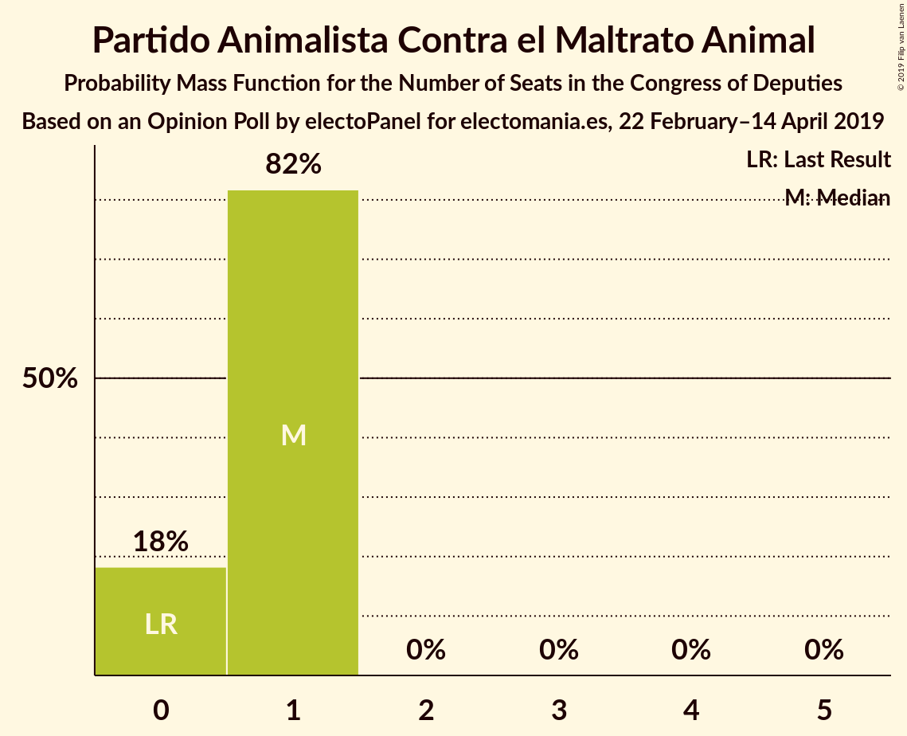
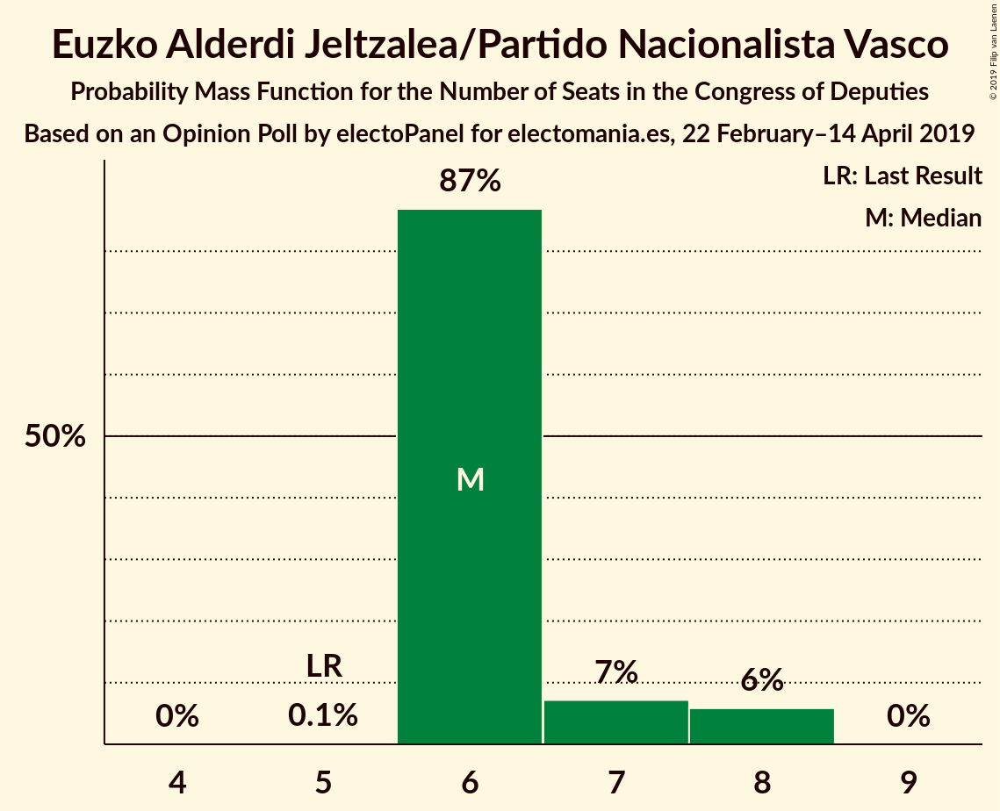

# Opinion Poll by electoPanel for electomania.es, 22 February–14 April 2019

<a href="#voting-intentions">Voting Intentions</a> | <a href="#seats">Seats</a> | <a href="#coalitions">Coalitions</a> | <a href="#technical-information">Technical Information</a>

## Voting Intentions

### Confidence Intervals

| Party | Last Result | Poll Result | 80% Confidence Interval | 90% Confidence Interval | 95% Confidence Interval | 99% Confidence Interval |
|:-----:|:-----------:|:-----------:|:-----------------------:|:-----------------------:|:-----------------------:|:-----------------------:|
| Partido Socialista Obrero Español | 22.6% | 28.1% | 27.5–28.7% |27.4–28.9% |27.2–29.0% |26.9–29.3% |
| Partido Popular | 33.0% | 20.0% | 19.5–20.5% |19.3–20.7% |19.2–20.8% |19.0–21.0% |
| Ciudadanos–Partido de la Ciudadanía | 13.1% | 15.3% | 14.8–15.8% |14.7–15.9% |14.6–16.0% |14.4–16.2% |
| Unidos Podemos | 21.2% | 13.4% | 13.0–13.9% |12.8–14.0% |12.7–14.1% |12.5–14.3% |
| Vox | 0.2% | 11.1% | 10.7–11.5% |10.6–11.6% |10.5–11.7% |10.3–11.9% |
| Esquerra Republicana de Catalunya–Catalunya Sí | 2.7% | 2.8% | 2.6–3.0% |2.5–3.1% |2.5–3.2% |2.4–3.3% |
| Partido Animalista Contra el Maltrato Animal | 1.2% | 1.9% | 1.7–2.1% |1.7–2.1% |1.6–2.2% |1.6–2.3% |
| Partit Demòcrata Europeu Català | 2.0% | 1.3% | 1.2–1.5% |1.1–1.5% |1.1–1.6% |1.0–1.6% |
| Euzko Alderdi Jeltzalea/Partido Nacionalista Vasco | 1.2% | 1.3% | 1.2–1.5% |1.1–1.5% |1.1–1.6% |1.0–1.6% |
| Euskal Herria Bildu | 0.8% | 0.8% | 0.7–0.9% |0.7–1.0% |0.6–1.0% |0.6–1.1% |
| Coalición Canaria–Partido Nacionalista Canario | 0.3% | 0.2% | 0.2–0.3% |0.1–0.3% |0.1–0.3% |0.1–0.4% |

*Note:* The poll result column reflects the actual value used in the calculations. Published results may vary slightly, and in addition be rounded to fewer digits.

## Seats

### Confidence Intervals

| Party | Last Result | Median | 80% Confidence Interval | 90% Confidence Interval | 95% Confidence Interval | 99% Confidence Interval |
|:-----:|:-----------:|:------:|:-----------------------:|:-----------------------:|:-----------------------:|:-----------------------:|
| <a href="#partido-socialista-obrero-español">Partido Socialista Obrero Español</a> | 85 | 122 | 118–125 |118–126 |118–129 |118–137 |
| <a href="#partido-popular">Partido Popular</a> | 137 | 82 | 82–85 |78–85 |72–85 |71–85 |
| <a href="#ciudadanos–partido-de-la-ciudadanía">Ciudadanos–Partido de la Ciudadanía</a> | 32 | 51 | 51–55 |50–55 |49–58 |49–59 |
| <a href="#unidos-podemos">Unidos Podemos</a> | 71 | 36 | 36–40 |36–40 |36–40 |35–40 |
| <a href="#vox">Vox</a> | 0 | 26 | 24–27 |24–27 |24–27 |24–33 |
| <a href="#esquerra-republicana-de-catalunya–catalunya-sí">Esquerra Republicana de Catalunya–Catalunya Sí</a> | 9 | 14 | 14 |13–14 |12–14 |10–15 |
| <a href="#partido-animalista-contra-el-maltrato-animal">Partido Animalista Contra el Maltrato Animal</a> | 0 | 1 | 0–1 |0–1 |0–1 |0–1 |
| <a href="#partit-demòcrata-europeu-català">Partit Demòcrata Europeu Català</a> | 8 | 4 | 4 |4–5 |4–5 |4–6 |
| <a href="#euzko-alderdi-jeltzalea/partido-nacionalista-vasco">Euzko Alderdi Jeltzalea/Partido Nacionalista Vasco</a> | 5 | 6 | 6–8 |6–8 |6–8 |6–8 |
| <a href="#euskal-herria-bildu">Euskal Herria Bildu</a> | 2 | 2 | 2–4 |2–5 |2–6 |2–6 |
| <a href="#coalición-canaria–partido-nacionalista-canario">Coalición Canaria–Partido Nacionalista Canario</a> | 1 | 1 | 0–1 |0–1 |0–1 |0–1 |

### Partido Socialista Obrero Español

*For a full overview of the results for this party, see the [Partido Socialista Obrero Español](party-partidosocialistaobreroespañol.html) page.*

| Number of Seats | Probability | Accumulated | Special Marks |
|:---------------:|:-----------:|:-----------:|:-------------:|
| 85 | 0% | 100% | Last Result |
| 86 | 0% | 100% |  |
| 87 | 0% | 100% |  |
| 88 | 0% | 100% |  |
| 89 | 0% | 100% |  |
| 90 | 0% | 100% |  |
| 91 | 0% | 100% |  |
| 92 | 0% | 100% |  |
| 93 | 0% | 100% |  |
| 94 | 0% | 100% |  |
| 95 | 0% | 100% |  |
| 96 | 0% | 100% |  |
| 97 | 0% | 100% |  |
| 98 | 0% | 100% |  |
| 99 | 0% | 100% |  |
| 100 | 0% | 100% |  |
| 101 | 0% | 100% |  |
| 102 | 0% | 100% |  |
| 103 | 0% | 100% |  |
| 104 | 0% | 100% |  |
| 105 | 0% | 100% |  |
| 106 | 0% | 100% |  |
| 107 | 0% | 100% |  |
| 108 | 0% | 100% |  |
| 109 | 0% | 100% |  |
| 110 | 0% | 100% |  |
| 111 | 0% | 100% |  |
| 112 | 0% | 100% |  |
| 113 | 0% | 100% |  |
| 114 | 0% | 100% |  |
| 115 | 0% | 100% |  |
| 116 | 0% | 100% |  |
| 117 | 0% | 100% |  |
| 118 | 31% | 100% |  |
| 119 | 11% | 69% |  |
| 120 | 1.3% | 57% |  |
| 121 | 1.2% | 56% |  |
| 122 | 5% | 55% | Median |
| 123 | 0% | 49% |  |
| 124 | 28% | 49% |  |
| 125 | 16% | 21% |  |
| 126 | 1.4% | 5% |  |
| 127 | 0.7% | 4% |  |
| 128 | 0% | 3% |  |
| 129 | 2% | 3% |  |
| 130 | 0% | 2% |  |
| 131 | 0.1% | 2% |  |
| 132 | 0% | 1.5% |  |
| 133 | 0% | 1.5% |  |
| 134 | 0% | 1.5% |  |
| 135 | 0% | 1.5% |  |
| 136 | 0% | 1.5% |  |
| 137 | 1.5% | 1.5% |  |
| 138 | 0% | 0% |  |

### Partido Popular

*For a full overview of the results for this party, see the [Partido Popular](party-partidopopular.html) page.*

| Number of Seats | Probability | Accumulated | Special Marks |
|:---------------:|:-----------:|:-----------:|:-------------:|
| 71 | 1.2% | 100% |  |
| 72 | 1.5% | 98.8% |  |
| 73 | 0% | 97% |  |
| 74 | 0% | 97% |  |
| 75 | 0% | 97% |  |
| 76 | 0% | 97% |  |
| 77 | 0.5% | 97% |  |
| 78 | 4% | 97% |  |
| 79 | 0.1% | 93% |  |
| 80 | 1.2% | 93% |  |
| 81 | 0% | 92% |  |
| 82 | 44% | 92% | Median |
| 83 | 3% | 48% |  |
| 84 | 0% | 45% |  |
| 85 | 45% | 45% |  |
| 86 | 0% | 0% |  |
| 87 | 0% | 0% |  |
| 88 | 0% | 0% |  |
| 89 | 0% | 0% |  |
| 90 | 0% | 0% |  |
| 91 | 0% | 0% |  |
| 92 | 0% | 0% |  |
| 93 | 0% | 0% |  |
| 94 | 0% | 0% |  |
| 95 | 0% | 0% |  |
| 96 | 0% | 0% |  |
| 97 | 0% | 0% |  |
| 98 | 0% | 0% |  |
| 99 | 0% | 0% |  |
| 100 | 0% | 0% |  |
| 101 | 0% | 0% |  |
| 102 | 0% | 0% |  |
| 103 | 0% | 0% |  |
| 104 | 0% | 0% |  |
| 105 | 0% | 0% |  |
| 106 | 0% | 0% |  |
| 107 | 0% | 0% |  |
| 108 | 0% | 0% |  |
| 109 | 0% | 0% |  |
| 110 | 0% | 0% |  |
| 111 | 0% | 0% |  |
| 112 | 0% | 0% |  |
| 113 | 0% | 0% |  |
| 114 | 0% | 0% |  |
| 115 | 0% | 0% |  |
| 116 | 0% | 0% |  |
| 117 | 0% | 0% |  |
| 118 | 0% | 0% |  |
| 119 | 0% | 0% |  |
| 120 | 0% | 0% |  |
| 121 | 0% | 0% |  |
| 122 | 0% | 0% |  |
| 123 | 0% | 0% |  |
| 124 | 0% | 0% |  |
| 125 | 0% | 0% |  |
| 126 | 0% | 0% |  |
| 127 | 0% | 0% |  |
| 128 | 0% | 0% |  |
| 129 | 0% | 0% |  |
| 130 | 0% | 0% |  |
| 131 | 0% | 0% |  |
| 132 | 0% | 0% |  |
| 133 | 0% | 0% |  |
| 134 | 0% | 0% |  |
| 135 | 0% | 0% |  |
| 136 | 0% | 0% |  |
| 137 | 0% | 0% | Last Result |

### Ciudadanos–Partido de la Ciudadanía

*For a full overview of the results for this party, see the [Ciudadanos–Partido de la Ciudadanía](party-ciudadanos–partidodelaciudadanía.html) page.*

| Number of Seats | Probability | Accumulated | Special Marks |
|:---------------:|:-----------:|:-----------:|:-------------:|
| 32 | 0% | 100% | Last Result |
| 33 | 0% | 100% |  |
| 34 | 0% | 100% |  |
| 35 | 0% | 100% |  |
| 36 | 0% | 100% |  |
| 37 | 0% | 100% |  |
| 38 | 0% | 100% |  |
| 39 | 0% | 100% |  |
| 40 | 0% | 100% |  |
| 41 | 0% | 100% |  |
| 42 | 0% | 100% |  |
| 43 | 0% | 100% |  |
| 44 | 0% | 100% |  |
| 45 | 0.5% | 100% |  |
| 46 | 0% | 99.5% |  |
| 47 | 0% | 99.5% |  |
| 48 | 0% | 99.5% |  |
| 49 | 2% | 99.5% |  |
| 50 | 3% | 97% |  |
| 51 | 48% | 95% | Median |
| 52 | 0.2% | 47% |  |
| 53 | 0% | 46% |  |
| 54 | 0% | 46% |  |
| 55 | 43% | 46% |  |
| 56 | 0% | 4% |  |
| 57 | 0% | 4% |  |
| 58 | 2% | 4% |  |
| 59 | 2% | 2% |  |
| 60 | 0% | 0% |  |

### Unidos Podemos

*For a full overview of the results for this party, see the [Unidos Podemos](party-unidospodemos.html) page.*

| Number of Seats | Probability | Accumulated | Special Marks |
|:---------------:|:-----------:|:-----------:|:-------------:|
| 33 | 0.1% | 100% |  |
| 34 | 0% | 99.9% |  |
| 35 | 1.0% | 99.9% |  |
| 36 | 50% | 98.9% | Median |
| 37 | 2% | 49% |  |
| 38 | 1.0% | 46% |  |
| 39 | 11% | 45% |  |
| 40 | 34% | 34% |  |
| 41 | 0% | 0% |  |
| 42 | 0% | 0% |  |
| 43 | 0% | 0% |  |
| 44 | 0% | 0% |  |
| 45 | 0% | 0% |  |
| 46 | 0% | 0% |  |
| 47 | 0% | 0% |  |
| 48 | 0% | 0% |  |
| 49 | 0% | 0% |  |
| 50 | 0% | 0% |  |
| 51 | 0% | 0% |  |
| 52 | 0% | 0% |  |
| 53 | 0% | 0% |  |
| 54 | 0% | 0% |  |
| 55 | 0% | 0% |  |
| 56 | 0% | 0% |  |
| 57 | 0% | 0% |  |
| 58 | 0% | 0% |  |
| 59 | 0% | 0% |  |
| 60 | 0% | 0% |  |
| 61 | 0% | 0% |  |
| 62 | 0% | 0% |  |
| 63 | 0% | 0% |  |
| 64 | 0% | 0% |  |
| 65 | 0% | 0% |  |
| 66 | 0% | 0% |  |
| 67 | 0% | 0% |  |
| 68 | 0% | 0% |  |
| 69 | 0% | 0% |  |
| 70 | 0% | 0% |  |
| 71 | 0% | 0% | Last Result |

### Vox

*For a full overview of the results for this party, see the [Vox](party-vox.html) page.*

| Number of Seats | Probability | Accumulated | Special Marks |
|:---------------:|:-----------:|:-----------:|:-------------:|
| 0 | 0% | 100% | Last Result |
| 1 | 0% | 100% |  |
| 2 | 0% | 100% |  |
| 3 | 0% | 100% |  |
| 4 | 0% | 100% |  |
| 5 | 0% | 100% |  |
| 6 | 0% | 100% |  |
| 7 | 0% | 100% |  |
| 8 | 0% | 100% |  |
| 9 | 0% | 100% |  |
| 10 | 0% | 100% |  |
| 11 | 0% | 100% |  |
| 12 | 0% | 100% |  |
| 13 | 0% | 100% |  |
| 14 | 0% | 100% |  |
| 15 | 0% | 100% |  |
| 16 | 0% | 100% |  |
| 17 | 0% | 100% |  |
| 18 | 0% | 100% |  |
| 19 | 0% | 100% |  |
| 20 | 0% | 100% |  |
| 21 | 0% | 100% |  |
| 22 | 0% | 100% |  |
| 23 | 0% | 100% |  |
| 24 | 43% | 100% |  |
| 25 | 2% | 57% |  |
| 26 | 6% | 55% | Median |
| 27 | 46% | 48% |  |
| 28 | 0% | 2% |  |
| 29 | 0% | 2% |  |
| 30 | 0% | 2% |  |
| 31 | 1.0% | 2% |  |
| 32 | 0% | 1.1% |  |
| 33 | 1.0% | 1.0% |  |
| 34 | 0% | 0% |  |

### Esquerra Republicana de Catalunya–Catalunya Sí

*For a full overview of the results for this party, see the [Esquerra Republicana de Catalunya–Catalunya Sí](party-esquerrarepublicanadecatalunya–catalunyasí.html) page.*

| Number of Seats | Probability | Accumulated | Special Marks |
|:---------------:|:-----------:|:-----------:|:-------------:|
| 9 | 0.1% | 100% | Last Result |
| 10 | 0.8% | 99.9% |  |
| 11 | 0.1% | 99.1% |  |
| 12 | 4% | 99.1% |  |
| 13 | 2% | 95% |  |
| 14 | 91% | 93% | Median |
| 15 | 2% | 2% |  |
| 16 | 0% | 0% |  |

### Partido Animalista Contra el Maltrato Animal

*For a full overview of the results for this party, see the [Partido Animalista Contra el Maltrato Animal](party-partidoanimalistacontraelmaltratoanimal.html) page.*

| Number of Seats | Probability | Accumulated | Special Marks |
|:---------------:|:-----------:|:-----------:|:-------------:|
| 0 | 15% | 100% | Last Result |
| 1 | 85% | 85% | Median |
| 2 | 0% | 0% |  |

### Partit Demòcrata Europeu Català

*For a full overview of the results for this party, see the [Partit Demòcrata Europeu Català](party-partitdemòcrataeuropeucatalà.html) page.*

| Number of Seats | Probability | Accumulated | Special Marks |
|:---------------:|:-----------:|:-----------:|:-------------:|
| 3 | 0.5% | 100% |  |
| 4 | 92% | 99.5% | Median |
| 5 | 5% | 7% |  |
| 6 | 2% | 2% |  |
| 7 | 0% | 0.1% |  |
| 8 | 0.1% | 0.1% | Last Result |
| 9 | 0% | 0% |  |

### Euzko Alderdi Jeltzalea/Partido Nacionalista Vasco

*For a full overview of the results for this party, see the [Euzko Alderdi Jeltzalea/Partido Nacionalista Vasco](party-euzkoalderdijeltzaleapartidonacionalistavasco.html) page.*

| Number of Seats | Probability | Accumulated | Special Marks |
|:---------------:|:-----------:|:-----------:|:-------------:|
| 5 | 0% | 100% | Last Result |
| 6 | 55% | 100% | Median |
| 7 | 1.3% | 45% |  |
| 8 | 44% | 44% |  |
| 9 | 0% | 0% |  |

### Euskal Herria Bildu

*For a full overview of the results for this party, see the [Euskal Herria Bildu](party-euskalherriabildu.html) page.*

| Number of Seats | Probability | Accumulated | Special Marks |
|:---------------:|:-----------:|:-----------:|:-------------:|
| 2 | 77% | 100% | Last Result, Median |
| 3 | 11% | 23% |  |
| 4 | 5% | 11% |  |
| 5 | 3% | 6% |  |
| 6 | 3% | 3% |  |
| 7 | 0% | 0% |  |

### Coalición Canaria–Partido Nacionalista Canario

*For a full overview of the results for this party, see the [Coalición Canaria–Partido Nacionalista Canario](party-coalicióncanaria–partidonacionalistacanario.html) page.*

| Number of Seats | Probability | Accumulated | Special Marks |
|:---------------:|:-----------:|:-----------:|:-------------:|
| 0 | 21% | 100% |  |
| 1 | 79% | 79% | Last Result, Median |
| 2 | 0% | 0% |  |

## Coalitions

### Confidence Intervals

| Coalition | Last Result | Median | Majority? | 80% Confidence Interval | 90% Confidence Interval | 95% Confidence Interval | 99% Confidence Interval |
|:---------:|:-----------:|:------:|:---------:|:-----------------------:|:-----------------------:|:-----------------------:|:-----------------------:|
| Partido Socialista Obrero Español – Partido Popular – Ciudadanos–Partido de la Ciudadanía | 254 | 258 | 100% | 257–259 | 256–259 | 256–259 | 248–260 |
| Partido Socialista Obrero Español – Ciudadanos–Partido de la Ciudadanía – Unidos Podemos | 188 | 213 | 100% | 211–213 | 211–213 | 208–223 | 208–224 |
| Partido Socialista Obrero Español – Partido Popular | 222 | 205 | 100% | 203–207 | 203–207 | 200–207 | 198–209 |
| Partido Socialista Obrero Español – Unidos Podemos – Esquerra Republicana de Catalunya–Catalunya Sí – Euzko Alderdi Jeltzalea/Partido Nacionalista Vasco – Partit Demòcrata Europeu Català – Euskal Herria Bildu | 180 | 188 | 100% | 184–189 | 184–192 | 184–194 | 181–199 |
| Partido Socialista Obrero Español – Ciudadanos–Partido de la Ciudadanía | 117 | 175 | 23% | 173–176 | 173–178 | 171–187 | 170–188 |
| Partido Socialista Obrero Español – Unidos Podemos – Esquerra Republicana de Catalunya–Catalunya Sí – Partit Demòcrata Europeu Català | 173 | 178 | 97% | 176–179 | 176–182 | 175–184 | 171–191 |
| Partido Socialista Obrero Español – Unidos Podemos – Esquerra Republicana de Catalunya–Catalunya Sí – Euskal Herria Bildu | 167 | 176 | 55% | 174–177 | 174–181 | 174–184 | 169–188 |
| Partido Socialista Obrero Español – Unidos Podemos – Euzko Alderdi Jeltzalea/Partido Nacionalista Vasco – Euskal Herria Bildu | 163 | 170 | 3% | 166–171 | 166–172 | 166–176 | 165–181 |
| Partido Socialista Obrero Español – Unidos Podemos – Euzko Alderdi Jeltzalea/Partido Nacionalista Vasco | 161 | 168 | 1.5% | 164–169 | 164–169 | 164–171 | 161–179 |
| Partido Socialista Obrero Español – Unidos Podemos | 156 | 160 | 0% | 158–161 | 158–162 | 158–165 | 155–173 |
| Partido Popular – Ciudadanos–Partido de la Ciudadanía – Vox | 169 | 160 | 0% | 160–164 | 156–164 | 155–164 | 149–167 |
| Partido Popular – Ciudadanos–Partido de la Ciudadanía – Euzko Alderdi Jeltzalea/Partido Nacionalista Vasco | 174 | 141 | 0% | 140–146 | 136–146 | 134–146 | 129–146 |
| Partido Popular – Ciudadanos–Partido de la Ciudadanía – Coalición Canaria–Partido Nacionalista Canario | 170 | 134 | 0% | 133–141 | 131–141 | 128–141 | 124–141 |
| Partido Popular – Ciudadanos–Partido de la Ciudadanía | 169 | 134 | 0% | 133–140 | 130–140 | 128–140 | 123–140 |
| Partido Socialista Obrero Español | 85 | 122 | 0% | 118–125 | 118–126 | 118–129 | 118–137 |
| Partido Popular – Vox | 137 | 109 | 0% | 109 | 105–110 | 98–110 | 97–111 |
| Partido Popular | 137 | 82 | 0% | 82–85 | 78–85 | 72–85 | 71–85 |

### Partido Socialista Obrero Español – Partido Popular – Ciudadanos–Partido de la Ciudadanía

| Number of Seats | Probability | Accumulated | Special Marks |
|:---------------:|:-----------:|:-----------:|:-------------:|
| 248 | 0.5% | 100% |  |
| 249 | 0% | 99.5% |  |
| 250 | 0% | 99.5% |  |
| 251 | 0.5% | 99.5% |  |
| 252 | 0% | 99.0% |  |
| 253 | 0.2% | 98.9% |  |
| 254 | 0% | 98.8% | Last Result |
| 255 | 0.7% | 98.8% | Median |
| 256 | 7% | 98% |  |
| 257 | 28% | 91% |  |
| 258 | 50% | 63% |  |
| 259 | 12% | 14% |  |
| 260 | 2% | 2% |  |
| 261 | 0.1% | 0.1% |  |
| 262 | 0% | 0% |  |

### Partido Socialista Obrero Español – Ciudadanos–Partido de la Ciudadanía – Unidos Podemos

| Number of Seats | Probability | Accumulated | Special Marks |
|:---------------:|:-----------:|:-----------:|:-------------:|
| 188 | 0% | 100% | Last Result |
| 189 | 0% | 100% |  |
| 190 | 0% | 100% |  |
| 191 | 0% | 100% |  |
| 192 | 0% | 100% |  |
| 193 | 0% | 100% |  |
| 194 | 0% | 100% |  |
| 195 | 0% | 100% |  |
| 196 | 0% | 100% |  |
| 197 | 0% | 100% |  |
| 198 | 0% | 100% |  |
| 199 | 0% | 100% |  |
| 200 | 0% | 100% |  |
| 201 | 0% | 100% |  |
| 202 | 0% | 100% |  |
| 203 | 0% | 100% |  |
| 204 | 0% | 100% |  |
| 205 | 0% | 100% |  |
| 206 | 0.2% | 100% |  |
| 207 | 0% | 99.8% |  |
| 208 | 3% | 99.8% |  |
| 209 | 0% | 97% | Median |
| 210 | 0% | 97% |  |
| 211 | 28% | 97% |  |
| 212 | 17% | 69% |  |
| 213 | 47% | 51% |  |
| 214 | 0% | 4% |  |
| 215 | 0% | 4% |  |
| 216 | 1.1% | 4% |  |
| 217 | 0.5% | 3% |  |
| 218 | 0% | 3% |  |
| 219 | 0% | 3% |  |
| 220 | 0% | 3% |  |
| 221 | 0% | 3% |  |
| 222 | 0% | 3% |  |
| 223 | 1.2% | 3% |  |
| 224 | 1.5% | 1.5% |  |
| 225 | 0% | 0% |  |

### Partido Socialista Obrero Español – Partido Popular

| Number of Seats | Probability | Accumulated | Special Marks |
|:---------------:|:-----------:|:-----------:|:-------------:|
| 198 | 1.3% | 100% |  |
| 199 | 1.0% | 98.6% |  |
| 200 | 2% | 98% |  |
| 201 | 0.1% | 96% |  |
| 202 | 0% | 96% |  |
| 203 | 32% | 96% |  |
| 204 | 11% | 64% | Median |
| 205 | 3% | 53% |  |
| 206 | 30% | 50% |  |
| 207 | 18% | 20% |  |
| 208 | 0.1% | 2% |  |
| 209 | 2% | 2% |  |
| 210 | 0% | 0% |  |
| 211 | 0% | 0% |  |
| 212 | 0% | 0% |  |
| 213 | 0% | 0% |  |
| 214 | 0% | 0% |  |
| 215 | 0% | 0% |  |
| 216 | 0% | 0% |  |
| 217 | 0% | 0% |  |
| 218 | 0% | 0% |  |
| 219 | 0% | 0% |  |
| 220 | 0% | 0% |  |
| 221 | 0% | 0% |  |
| 222 | 0% | 0% | Last Result |

### Partido Socialista Obrero Español – Unidos Podemos – Esquerra Republicana de Catalunya–Catalunya Sí – Euzko Alderdi Jeltzalea/Partido Nacionalista Vasco – Partit Demòcrata Europeu Català – Euskal Herria Bildu

| Number of Seats | Probability | Accumulated | Special Marks |
|:---------------:|:-----------:|:-----------:|:-------------:|
| 180 | 0% | 100% | Last Result |
| 181 | 0.8% | 100% |  |
| 182 | 0% | 99.2% |  |
| 183 | 0% | 99.2% |  |
| 184 | 31% | 99.2% | Median |
| 185 | 13% | 68% |  |
| 186 | 0.5% | 55% |  |
| 187 | 0.1% | 55% |  |
| 188 | 29% | 55% |  |
| 189 | 21% | 26% |  |
| 190 | 0% | 5% |  |
| 191 | 0% | 5% |  |
| 192 | 1.2% | 5% |  |
| 193 | 0.1% | 4% |  |
| 194 | 2% | 4% |  |
| 195 | 0.7% | 2% |  |
| 196 | 0% | 1.5% |  |
| 197 | 0% | 1.5% |  |
| 198 | 0% | 1.5% |  |
| 199 | 1.5% | 1.5% |  |
| 200 | 0% | 0% |  |

### Partido Socialista Obrero Español – Ciudadanos–Partido de la Ciudadanía

| Number of Seats | Probability | Accumulated | Special Marks |
|:---------------:|:-----------:|:-----------:|:-------------:|
| 117 | 0% | 100% | Last Result |
| 118 | 0% | 100% |  |
| 119 | 0% | 100% |  |
| 120 | 0% | 100% |  |
| 121 | 0% | 100% |  |
| 122 | 0% | 100% |  |
| 123 | 0% | 100% |  |
| 124 | 0% | 100% |  |
| 125 | 0% | 100% |  |
| 126 | 0% | 100% |  |
| 127 | 0% | 100% |  |
| 128 | 0% | 100% |  |
| 129 | 0% | 100% |  |
| 130 | 0% | 100% |  |
| 131 | 0% | 100% |  |
| 132 | 0% | 100% |  |
| 133 | 0% | 100% |  |
| 134 | 0% | 100% |  |
| 135 | 0% | 100% |  |
| 136 | 0% | 100% |  |
| 137 | 0% | 100% |  |
| 138 | 0% | 100% |  |
| 139 | 0% | 100% |  |
| 140 | 0% | 100% |  |
| 141 | 0% | 100% |  |
| 142 | 0% | 100% |  |
| 143 | 0% | 100% |  |
| 144 | 0% | 100% |  |
| 145 | 0% | 100% |  |
| 146 | 0% | 100% |  |
| 147 | 0% | 100% |  |
| 148 | 0% | 100% |  |
| 149 | 0% | 100% |  |
| 150 | 0% | 100% |  |
| 151 | 0% | 100% |  |
| 152 | 0% | 100% |  |
| 153 | 0% | 100% |  |
| 154 | 0% | 100% |  |
| 155 | 0% | 100% |  |
| 156 | 0% | 100% |  |
| 157 | 0% | 100% |  |
| 158 | 0% | 100% |  |
| 159 | 0% | 100% |  |
| 160 | 0% | 100% |  |
| 161 | 0% | 100% |  |
| 162 | 0% | 100% |  |
| 163 | 0% | 100% |  |
| 164 | 0% | 100% |  |
| 165 | 0% | 100% |  |
| 166 | 0% | 100% |  |
| 167 | 0% | 100% |  |
| 168 | 0% | 100% |  |
| 169 | 0% | 100% |  |
| 170 | 0.5% | 100% |  |
| 171 | 3% | 99.5% |  |
| 172 | 0.1% | 97% |  |
| 173 | 34% | 97% | Median |
| 174 | 12% | 63% |  |
| 175 | 28% | 51% |  |
| 176 | 17% | 23% | Majority |
| 177 | 0.9% | 6% |  |
| 178 | 0.8% | 5% |  |
| 179 | 0% | 4% |  |
| 180 | 1.1% | 4% |  |
| 181 | 0.5% | 3% |  |
| 182 | 0% | 3% |  |
| 183 | 0.1% | 3% |  |
| 184 | 0% | 3% |  |
| 185 | 0% | 3% |  |
| 186 | 0% | 3% |  |
| 187 | 1.2% | 3% |  |
| 188 | 1.5% | 1.5% |  |
| 189 | 0% | 0% |  |

### Partido Socialista Obrero Español – Unidos Podemos – Esquerra Republicana de Catalunya–Catalunya Sí – Partit Demòcrata Europeu Català

| Number of Seats | Probability | Accumulated | Special Marks |
|:---------------:|:-----------:|:-----------:|:-------------:|
| 171 | 0.8% | 100% |  |
| 172 | 0% | 99.2% |  |
| 173 | 1.0% | 99.2% | Last Result |
| 174 | 0.5% | 98% |  |
| 175 | 0.2% | 98% |  |
| 176 | 43% | 97% | Median, Majority |
| 177 | 2% | 55% |  |
| 178 | 29% | 52% |  |
| 179 | 18% | 23% |  |
| 180 | 0% | 5% |  |
| 181 | 0.3% | 5% |  |
| 182 | 1.2% | 5% |  |
| 183 | 1.2% | 4% |  |
| 184 | 1.1% | 3% |  |
| 185 | 0% | 2% |  |
| 186 | 0% | 2% |  |
| 187 | 0% | 1.5% |  |
| 188 | 0% | 1.5% |  |
| 189 | 0% | 1.5% |  |
| 190 | 0% | 1.5% |  |
| 191 | 1.5% | 1.5% |  |
| 192 | 0% | 0% |  |

### Partido Socialista Obrero Español – Unidos Podemos – Esquerra Republicana de Catalunya–Catalunya Sí – Euskal Herria Bildu

| Number of Seats | Probability | Accumulated | Special Marks |
|:---------------:|:-----------:|:-----------:|:-------------:|
| 167 | 0% | 100% | Last Result |
| 168 | 0% | 100% |  |
| 169 | 0.8% | 100% |  |
| 170 | 0% | 99.2% |  |
| 171 | 0% | 99.2% |  |
| 172 | 0.1% | 99.2% |  |
| 173 | 0.2% | 99.1% |  |
| 174 | 32% | 98.9% | Median |
| 175 | 11% | 66% |  |
| 176 | 29% | 55% | Majority |
| 177 | 16% | 26% |  |
| 178 | 2% | 10% |  |
| 179 | 2% | 8% |  |
| 180 | 0% | 5% |  |
| 181 | 1.3% | 5% |  |
| 182 | 0% | 4% |  |
| 183 | 0.7% | 4% |  |
| 184 | 1.2% | 3% |  |
| 185 | 0.5% | 2% |  |
| 186 | 0% | 1.5% |  |
| 187 | 0% | 1.5% |  |
| 188 | 1.5% | 1.5% |  |
| 189 | 0% | 0% |  |

### Partido Socialista Obrero Español – Unidos Podemos – Euzko Alderdi Jeltzalea/Partido Nacionalista Vasco – Euskal Herria Bildu

| Number of Seats | Probability | Accumulated | Special Marks |
|:---------------:|:-----------:|:-----------:|:-------------:|
| 163 | 0% | 100% | Last Result |
| 164 | 0% | 100% |  |
| 165 | 0.8% | 100% |  |
| 166 | 32% | 99.2% | Median |
| 167 | 11% | 68% |  |
| 168 | 0.4% | 56% |  |
| 169 | 1.2% | 56% |  |
| 170 | 29% | 55% |  |
| 171 | 18% | 26% |  |
| 172 | 4% | 7% |  |
| 173 | 0% | 4% |  |
| 174 | 0.7% | 4% |  |
| 175 | 0% | 3% |  |
| 176 | 1.3% | 3% | Majority |
| 177 | 0.5% | 2% |  |
| 178 | 0% | 1.5% |  |
| 179 | 0% | 1.5% |  |
| 180 | 0% | 1.5% |  |
| 181 | 1.5% | 1.5% |  |
| 182 | 0% | 0% |  |

### Partido Socialista Obrero Español – Unidos Podemos – Euzko Alderdi Jeltzalea/Partido Nacionalista Vasco

| Number of Seats | Probability | Accumulated | Special Marks |
|:---------------:|:-----------:|:-----------:|:-------------:|
| 161 | 0.8% | 100% | Last Result |
| 162 | 0.2% | 99.2% |  |
| 163 | 0% | 99.0% |  |
| 164 | 45% | 99.0% | Median |
| 165 | 2% | 54% |  |
| 166 | 0% | 52% |  |
| 167 | 0.1% | 52% |  |
| 168 | 32% | 52% |  |
| 169 | 17% | 20% |  |
| 170 | 0% | 3% |  |
| 171 | 1.3% | 3% |  |
| 172 | 0% | 2% |  |
| 173 | 0.5% | 2% |  |
| 174 | 0% | 1.5% |  |
| 175 | 0% | 1.5% |  |
| 176 | 0% | 1.5% | Majority |
| 177 | 0% | 1.5% |  |
| 178 | 0% | 1.5% |  |
| 179 | 1.5% | 1.5% |  |
| 180 | 0% | 0% |  |

### Partido Socialista Obrero Español – Unidos Podemos

| Number of Seats | Probability | Accumulated | Special Marks |
|:---------------:|:-----------:|:-----------:|:-------------:|
| 155 | 0.8% | 100% |  |
| 156 | 0.2% | 99.2% | Last Result |
| 157 | 1.0% | 99.0% |  |
| 158 | 44% | 98% | Median |
| 159 | 2% | 54% |  |
| 160 | 28% | 52% |  |
| 161 | 16% | 24% |  |
| 162 | 4% | 8% |  |
| 163 | 0.7% | 4% |  |
| 164 | 0.1% | 3% |  |
| 165 | 1.2% | 3% |  |
| 166 | 0% | 2% |  |
| 167 | 0.5% | 2% |  |
| 168 | 0% | 1.5% |  |
| 169 | 0% | 1.5% |  |
| 170 | 0% | 1.5% |  |
| 171 | 0% | 1.5% |  |
| 172 | 0% | 1.5% |  |
| 173 | 1.5% | 1.5% |  |
| 174 | 0% | 0% |  |

### Partido Popular – Ciudadanos–Partido de la Ciudadanía – Vox

| Number of Seats | Probability | Accumulated | Special Marks |
|:---------------:|:-----------:|:-----------:|:-------------:|
| 149 | 1.5% | 100% |  |
| 150 | 0% | 98.5% |  |
| 151 | 0% | 98.5% |  |
| 152 | 0% | 98.5% |  |
| 153 | 0% | 98.5% |  |
| 154 | 0.7% | 98.5% |  |
| 155 | 2% | 98% |  |
| 156 | 1.2% | 96% |  |
| 157 | 0.1% | 95% |  |
| 158 | 0% | 95% |  |
| 159 | 2% | 95% | Median |
| 160 | 44% | 92% |  |
| 161 | 3% | 48% |  |
| 162 | 0.1% | 45% |  |
| 163 | 2% | 45% |  |
| 164 | 43% | 44% |  |
| 165 | 0% | 0.8% |  |
| 166 | 0% | 0.8% |  |
| 167 | 0.8% | 0.8% |  |
| 168 | 0% | 0% |  |
| 169 | 0% | 0% | Last Result |

### Partido Popular – Ciudadanos–Partido de la Ciudadanía – Euzko Alderdi Jeltzalea/Partido Nacionalista Vasco

| Number of Seats | Probability | Accumulated | Special Marks |
|:---------------:|:-----------:|:-----------:|:-------------:|
| 128 | 0.5% | 100% |  |
| 129 | 1.5% | 99.5% |  |
| 130 | 0% | 98% |  |
| 131 | 0% | 98% |  |
| 132 | 0% | 98% |  |
| 133 | 0% | 98% |  |
| 134 | 1.1% | 98% |  |
| 135 | 1.4% | 97% |  |
| 136 | 1.2% | 96% |  |
| 137 | 0.1% | 94% |  |
| 138 | 0.2% | 94% |  |
| 139 | 0% | 94% | Median |
| 140 | 5% | 94% |  |
| 141 | 44% | 89% |  |
| 142 | 0.9% | 45% |  |
| 143 | 0.5% | 44% |  |
| 144 | 1.0% | 44% |  |
| 145 | 0% | 43% |  |
| 146 | 43% | 43% |  |
| 147 | 0% | 0% |  |
| 148 | 0% | 0% |  |
| 149 | 0% | 0% |  |
| 150 | 0% | 0% |  |
| 151 | 0% | 0% |  |
| 152 | 0% | 0% |  |
| 153 | 0% | 0% |  |
| 154 | 0% | 0% |  |
| 155 | 0% | 0% |  |
| 156 | 0% | 0% |  |
| 157 | 0% | 0% |  |
| 158 | 0% | 0% |  |
| 159 | 0% | 0% |  |
| 160 | 0% | 0% |  |
| 161 | 0% | 0% |  |
| 162 | 0% | 0% |  |
| 163 | 0% | 0% |  |
| 164 | 0% | 0% |  |
| 165 | 0% | 0% |  |
| 166 | 0% | 0% |  |
| 167 | 0% | 0% |  |
| 168 | 0% | 0% |  |
| 169 | 0% | 0% |  |
| 170 | 0% | 0% |  |
| 171 | 0% | 0% |  |
| 172 | 0% | 0% |  |
| 173 | 0% | 0% |  |
| 174 | 0% | 0% | Last Result |

### Partido Popular – Ciudadanos–Partido de la Ciudadanía – Coalición Canaria–Partido Nacionalista Canario

| Number of Seats | Probability | Accumulated | Special Marks |
|:---------------:|:-----------:|:-----------:|:-------------:|
| 122 | 0.5% | 100% |  |
| 123 | 0% | 99.5% |  |
| 124 | 1.5% | 99.5% |  |
| 125 | 0% | 98% |  |
| 126 | 0% | 98% |  |
| 127 | 0% | 98% |  |
| 128 | 0.7% | 98% |  |
| 129 | 2% | 97% |  |
| 130 | 0.2% | 96% |  |
| 131 | 1.2% | 95% |  |
| 132 | 0% | 94% |  |
| 133 | 16% | 94% |  |
| 134 | 30% | 78% | Median |
| 135 | 3% | 48% |  |
| 136 | 0.1% | 45% |  |
| 137 | 1.3% | 45% |  |
| 138 | 1.0% | 44% |  |
| 139 | 0% | 43% |  |
| 140 | 0% | 43% |  |
| 141 | 43% | 43% |  |
| 142 | 0% | 0% |  |
| 143 | 0% | 0% |  |
| 144 | 0% | 0% |  |
| 145 | 0% | 0% |  |
| 146 | 0% | 0% |  |
| 147 | 0% | 0% |  |
| 148 | 0% | 0% |  |
| 149 | 0% | 0% |  |
| 150 | 0% | 0% |  |
| 151 | 0% | 0% |  |
| 152 | 0% | 0% |  |
| 153 | 0% | 0% |  |
| 154 | 0% | 0% |  |
| 155 | 0% | 0% |  |
| 156 | 0% | 0% |  |
| 157 | 0% | 0% |  |
| 158 | 0% | 0% |  |
| 159 | 0% | 0% |  |
| 160 | 0% | 0% |  |
| 161 | 0% | 0% |  |
| 162 | 0% | 0% |  |
| 163 | 0% | 0% |  |
| 164 | 0% | 0% |  |
| 165 | 0% | 0% |  |
| 166 | 0% | 0% |  |
| 167 | 0% | 0% |  |
| 168 | 0% | 0% |  |
| 169 | 0% | 0% |  |
| 170 | 0% | 0% | Last Result |

### Partido Popular – Ciudadanos–Partido de la Ciudadanía

| Number of Seats | Probability | Accumulated | Special Marks |
|:---------------:|:-----------:|:-----------:|:-------------:|
| 122 | 0.5% | 100% |  |
| 123 | 1.5% | 99.5% |  |
| 124 | 0% | 98% |  |
| 125 | 0% | 98% |  |
| 126 | 0% | 98% |  |
| 127 | 0% | 98% |  |
| 128 | 1.2% | 98% |  |
| 129 | 1.3% | 97% |  |
| 130 | 1.3% | 96% |  |
| 131 | 0% | 94% |  |
| 132 | 0.2% | 94% |  |
| 133 | 44% | 94% | Median |
| 134 | 5% | 50% |  |
| 135 | 0.1% | 45% |  |
| 136 | 0.8% | 45% |  |
| 137 | 2% | 44% |  |
| 138 | 0% | 43% |  |
| 139 | 0% | 43% |  |
| 140 | 43% | 43% |  |
| 141 | 0% | 0% |  |
| 142 | 0% | 0% |  |
| 143 | 0% | 0% |  |
| 144 | 0% | 0% |  |
| 145 | 0% | 0% |  |
| 146 | 0% | 0% |  |
| 147 | 0% | 0% |  |
| 148 | 0% | 0% |  |
| 149 | 0% | 0% |  |
| 150 | 0% | 0% |  |
| 151 | 0% | 0% |  |
| 152 | 0% | 0% |  |
| 153 | 0% | 0% |  |
| 154 | 0% | 0% |  |
| 155 | 0% | 0% |  |
| 156 | 0% | 0% |  |
| 157 | 0% | 0% |  |
| 158 | 0% | 0% |  |
| 159 | 0% | 0% |  |
| 160 | 0% | 0% |  |
| 161 | 0% | 0% |  |
| 162 | 0% | 0% |  |
| 163 | 0% | 0% |  |
| 164 | 0% | 0% |  |
| 165 | 0% | 0% |  |
| 166 | 0% | 0% |  |
| 167 | 0% | 0% |  |
| 168 | 0% | 0% |  |
| 169 | 0% | 0% | Last Result |

### Partido Socialista Obrero Español

| Number of Seats | Probability | Accumulated | Special Marks |
|:---------------:|:-----------:|:-----------:|:-------------:|
| 85 | 0% | 100% | Last Result |
| 86 | 0% | 100% |  |
| 87 | 0% | 100% |  |
| 88 | 0% | 100% |  |
| 89 | 0% | 100% |  |
| 90 | 0% | 100% |  |
| 91 | 0% | 100% |  |
| 92 | 0% | 100% |  |
| 93 | 0% | 100% |  |
| 94 | 0% | 100% |  |
| 95 | 0% | 100% |  |
| 96 | 0% | 100% |  |
| 97 | 0% | 100% |  |
| 98 | 0% | 100% |  |
| 99 | 0% | 100% |  |
| 100 | 0% | 100% |  |
| 101 | 0% | 100% |  |
| 102 | 0% | 100% |  |
| 103 | 0% | 100% |  |
| 104 | 0% | 100% |  |
| 105 | 0% | 100% |  |
| 106 | 0% | 100% |  |
| 107 | 0% | 100% |  |
| 108 | 0% | 100% |  |
| 109 | 0% | 100% |  |
| 110 | 0% | 100% |  |
| 111 | 0% | 100% |  |
| 112 | 0% | 100% |  |
| 113 | 0% | 100% |  |
| 114 | 0% | 100% |  |
| 115 | 0% | 100% |  |
| 116 | 0% | 100% |  |
| 117 | 0% | 100% |  |
| 118 | 31% | 100% |  |
| 119 | 11% | 69% |  |
| 120 | 1.3% | 57% |  |
| 121 | 1.2% | 56% |  |
| 122 | 5% | 55% | Median |
| 123 | 0% | 49% |  |
| 124 | 28% | 49% |  |
| 125 | 16% | 21% |  |
| 126 | 1.4% | 5% |  |
| 127 | 0.7% | 4% |  |
| 128 | 0% | 3% |  |
| 129 | 2% | 3% |  |
| 130 | 0% | 2% |  |
| 131 | 0.1% | 2% |  |
| 132 | 0% | 1.5% |  |
| 133 | 0% | 1.5% |  |
| 134 | 0% | 1.5% |  |
| 135 | 0% | 1.5% |  |
| 136 | 0% | 1.5% |  |
| 137 | 1.5% | 1.5% |  |
| 138 | 0% | 0% |  |

### Partido Popular – Vox

| Number of Seats | Probability | Accumulated | Special Marks |
|:---------------:|:-----------:|:-----------:|:-------------:|
| 97 | 1.2% | 100% |  |
| 98 | 1.5% | 98.8% |  |
| 99 | 0% | 97% |  |
| 100 | 0% | 97% |  |
| 101 | 0% | 97% |  |
| 102 | 0% | 97% |  |
| 103 | 0% | 97% |  |
| 104 | 2% | 97% |  |
| 105 | 0.1% | 95% |  |
| 106 | 1.2% | 95% |  |
| 107 | 0% | 94% |  |
| 108 | 0% | 94% | Median |
| 109 | 88% | 94% |  |
| 110 | 5% | 6% |  |
| 111 | 0.5% | 0.8% |  |
| 112 | 0.1% | 0.2% |  |
| 113 | 0.2% | 0.2% |  |
| 114 | 0% | 0% |  |
| 115 | 0% | 0% |  |
| 116 | 0% | 0% |  |
| 117 | 0% | 0% |  |
| 118 | 0% | 0% |  |
| 119 | 0% | 0% |  |
| 120 | 0% | 0% |  |
| 121 | 0% | 0% |  |
| 122 | 0% | 0% |  |
| 123 | 0% | 0% |  |
| 124 | 0% | 0% |  |
| 125 | 0% | 0% |  |
| 126 | 0% | 0% |  |
| 127 | 0% | 0% |  |
| 128 | 0% | 0% |  |
| 129 | 0% | 0% |  |
| 130 | 0% | 0% |  |
| 131 | 0% | 0% |  |
| 132 | 0% | 0% |  |
| 133 | 0% | 0% |  |
| 134 | 0% | 0% |  |
| 135 | 0% | 0% |  |
| 136 | 0% | 0% |  |
| 137 | 0% | 0% | Last Result |

### Partido Popular

| Number of Seats | Probability | Accumulated | Special Marks |
|:---------------:|:-----------:|:-----------:|:-------------:|
| 71 | 1.2% | 100% |  |
| 72 | 1.5% | 98.8% |  |
| 73 | 0% | 97% |  |
| 74 | 0% | 97% |  |
| 75 | 0% | 97% |  |
| 76 | 0% | 97% |  |
| 77 | 0.5% | 97% |  |
| 78 | 4% | 97% |  |
| 79 | 0.1% | 93% |  |
| 80 | 1.2% | 93% |  |
| 81 | 0% | 92% |  |
| 82 | 44% | 92% | Median |
| 83 | 3% | 48% |  |
| 84 | 0% | 45% |  |
| 85 | 45% | 45% |  |
| 86 | 0% | 0% |  |
| 87 | 0% | 0% |  |
| 88 | 0% | 0% |  |
| 89 | 0% | 0% |  |
| 90 | 0% | 0% |  |
| 91 | 0% | 0% |  |
| 92 | 0% | 0% |  |
| 93 | 0% | 0% |  |
| 94 | 0% | 0% |  |
| 95 | 0% | 0% |  |
| 96 | 0% | 0% |  |
| 97 | 0% | 0% |  |
| 98 | 0% | 0% |  |
| 99 | 0% | 0% |  |
| 100 | 0% | 0% |  |
| 101 | 0% | 0% |  |
| 102 | 0% | 0% |  |
| 103 | 0% | 0% |  |
| 104 | 0% | 0% |  |
| 105 | 0% | 0% |  |
| 106 | 0% | 0% |  |
| 107 | 0% | 0% |  |
| 108 | 0% | 0% |  |
| 109 | 0% | 0% |  |
| 110 | 0% | 0% |  |
| 111 | 0% | 0% |  |
| 112 | 0% | 0% |  |
| 113 | 0% | 0% |  |
| 114 | 0% | 0% |  |
| 115 | 0% | 0% |  |
| 116 | 0% | 0% |  |
| 117 | 0% | 0% |  |
| 118 | 0% | 0% |  |
| 119 | 0% | 0% |  |
| 120 | 0% | 0% |  |
| 121 | 0% | 0% |  |
| 122 | 0% | 0% |  |
| 123 | 0% | 0% |  |
| 124 | 0% | 0% |  |
| 125 | 0% | 0% |  |
| 126 | 0% | 0% |  |
| 127 | 0% | 0% |  |
| 128 | 0% | 0% |  |
| 129 | 0% | 0% |  |
| 130 | 0% | 0% |  |
| 131 | 0% | 0% |  |
| 132 | 0% | 0% |  |
| 133 | 0% | 0% |  |
| 134 | 0% | 0% |  |
| 135 | 0% | 0% |  |
| 136 | 0% | 0% |  |
| 137 | 0% | 0% | Last Result |

## Technical Information

### Opinion Poll

+ **Polling firm:** electoPanel
+ **Commissioner(s):** electomania.es
+ **Fieldwork period:** 22 February–14 April 2019

### Calculations

+ **Sample size:** 10000
+ **Simulations done:** 1,024
+ **Error estimate:** 1.10%

