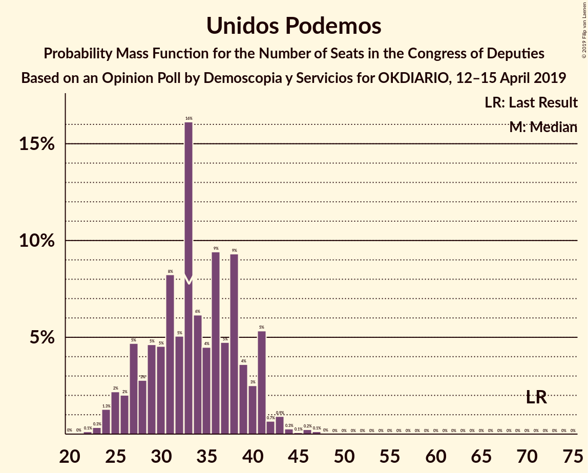
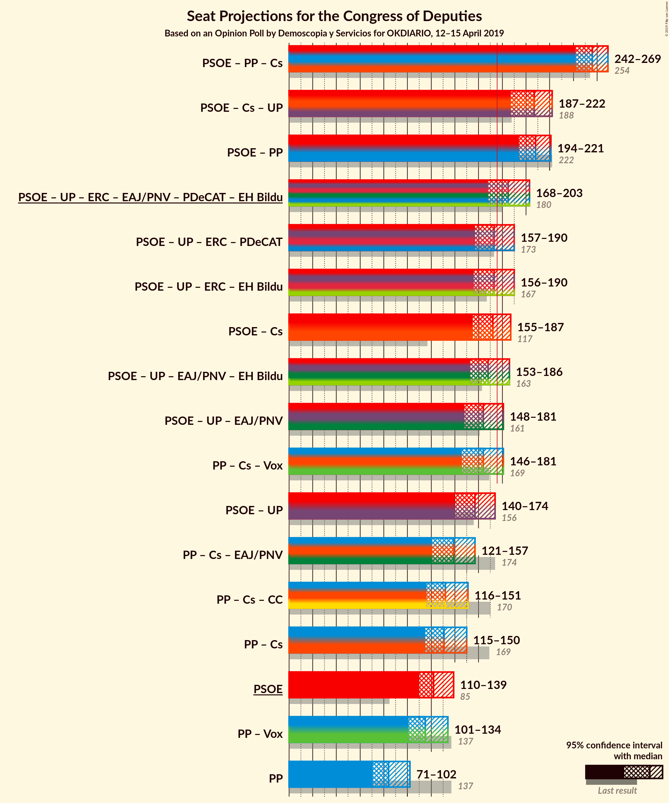

# Opinion Poll by Demoscopia y Servicios for OKDIARIO, 12–15 April 2019

<a href="#voting-intentions">Voting Intentions</a> | <a href="#seats">Seats</a> | <a href="#coalitions">Coalitions</a> | <a href="#technical-information">Technical Information</a>

## Voting Intentions

### Confidence Intervals

| Party | Last Result | Poll Result | 80% Confidence Interval | 90% Confidence Interval | 95% Confidence Interval | 99% Confidence Interval |
|:-----:|:-----------:|:-----------:|:-----------------------:|:-----------------------:|:-----------------------:|:-----------------------:|
| Partido Socialista Obrero Español | 22.6% | 28.9% | 27.1–30.9% |26.5–31.4% |26.1–31.9% |25.2–32.9% |
| Partido Popular | 33.0% | 21.3% | 19.6–23.1% |19.2–23.6% |18.8–24.1% |18.0–25.0% |
| Ciudadanos–Partido de la Ciudadanía | 13.1% | 14.9% | 13.5–16.5% |13.1–16.9% |12.7–17.3% |12.1–18.1% |
| Unidos Podemos | 21.2% | 12.8% | 11.5–14.3% |11.1–14.8% |10.8–15.2% |10.2–15.9% |
| Vox | 0.2% | 12.2% | 10.9–13.7% |10.5–14.1% |10.2–14.4% |9.6–15.2% |
| Esquerra Republicana de Catalunya–Catalunya Sí | 2.7% | 2.3% | 1.8–3.0% |1.6–3.3% |1.5–3.5% |1.3–3.9% |
| Euzko Alderdi Jeltzalea/Partido Nacionalista Vasco | 1.2% | 1.5% | 1.1–2.2% |1.0–2.4% |0.9–2.5% |0.7–2.9% |
| Partit Demòcrata Europeu Català | 2.0% | 1.3% | 0.9–1.9% |0.8–2.1% |0.7–2.3% |0.6–2.6% |
| Euskal Herria Bildu | 0.8% | 1.2% | 0.8–1.8% |0.7–2.0% |0.7–2.1% |0.5–2.5% |

*Note:* The poll result column reflects the actual value used in the calculations. Published results may vary slightly, and in addition be rounded to fewer digits.

## Seats

### Confidence Intervals

| Party | Last Result | Median | 80% Confidence Interval | 90% Confidence Interval | 95% Confidence Interval | 99% Confidence Interval |
|:-----:|:-----------:|:------:|:-----------------------:|:-----------------------:|:-----------------------:|:-----------------------:|
| <a href="#partido-socialista-obrero-español">Partido Socialista Obrero Español</a> | 85 | 130 | 111–135 |110–135 |108–135 |107–136 |
| <a href="#partido-popular">Partido Popular</a> | 137 | 82 | 71–89 |71–98 |71–100 |70–104 |
| <a href="#ciudadanos–partido-de-la-ciudadanía">Ciudadanos–Partido de la Ciudadanía</a> | 32 | 50 | 39–58 |37–58 |34–58 |31–62 |
| <a href="#unidos-podemos">Unidos Podemos</a> | 71 | 32 | 27–39 |26–40 |25–42 |25–44 |
| <a href="#vox">Vox</a> | 0 | 31 | 27–38 |24–40 |24–44 |23–45 |
| <a href="#esquerra-republicana-de-catalunya–catalunya-sí">Esquerra Republicana de Catalunya–Catalunya Sí</a> | 9 | 9 | 8–14 |7–14 |6–15 |6–16 |
| <a href="#euzko-alderdi-jeltzalea/partido-nacionalista-vasco">Euzko Alderdi Jeltzalea/Partido Nacionalista Vasco</a> | 5 | 7 | 5–8 |5–10 |3–10 |3–10 |
| <a href="#partit-demòcrata-europeu-català">Partit Demòcrata Europeu Català</a> | 8 | 5 | 4–9 |4–9 |1–9 |1–10 |
| <a href="#euskal-herria-bildu">Euskal Herria Bildu</a> | 2 | 5 | 3–7 |2–8 |2–9 |1–9 |

### Partido Socialista Obrero Español

*For a full overview of the results for this party, see the [Partido Socialista Obrero Español](party-partidosocialistaobreroespañol.html) page.*

| Number of Seats | Probability | Accumulated | Special Marks |
|:---------------:|:-----------:|:-----------:|:-------------:|
| 85 | 0% | 100% | Last Result |
| 86 | 0% | 100% |  |
| 87 | 0% | 100% |  |
| 88 | 0% | 100% |  |
| 89 | 0% | 100% |  |
| 90 | 0% | 100% |  |
| 91 | 0% | 100% |  |
| 92 | 0% | 100% |  |
| 93 | 0% | 100% |  |
| 94 | 0% | 100% |  |
| 95 | 0% | 100% |  |
| 96 | 0% | 100% |  |
| 97 | 0% | 100% |  |
| 98 | 0% | 99.9% |  |
| 99 | 0% | 99.9% |  |
| 100 | 0% | 99.9% |  |
| 101 | 0% | 99.9% |  |
| 102 | 0% | 99.9% |  |
| 103 | 0% | 99.9% |  |
| 104 | 0% | 99.9% |  |
| 105 | 0% | 99.9% |  |
| 106 | 0.2% | 99.9% |  |
| 107 | 0.3% | 99.7% |  |
| 108 | 3% | 99.4% |  |
| 109 | 0.4% | 97% |  |
| 110 | 4% | 96% |  |
| 111 | 2% | 92% |  |
| 112 | 2% | 90% |  |
| 113 | 12% | 88% |  |
| 114 | 4% | 75% |  |
| 115 | 1.4% | 71% |  |
| 116 | 1.1% | 70% |  |
| 117 | 5% | 69% |  |
| 118 | 0% | 64% |  |
| 119 | 0% | 64% |  |
| 120 | 0.3% | 64% |  |
| 121 | 0% | 64% |  |
| 122 | 0% | 64% |  |
| 123 | 0.1% | 64% |  |
| 124 | 0% | 63% |  |
| 125 | 0% | 63% |  |
| 126 | 0.1% | 63% |  |
| 127 | 0.3% | 63% |  |
| 128 | 11% | 63% |  |
| 129 | 1.4% | 52% |  |
| 130 | 8% | 51% | Median |
| 131 | 6% | 43% |  |
| 132 | 15% | 37% |  |
| 133 | 4% | 22% |  |
| 134 | 4% | 18% |  |
| 135 | 13% | 14% |  |
| 136 | 0.3% | 0.7% |  |
| 137 | 0.1% | 0.3% |  |
| 138 | 0% | 0.2% |  |
| 139 | 0% | 0.2% |  |
| 140 | 0% | 0.2% |  |
| 141 | 0% | 0.2% |  |
| 142 | 0% | 0.2% |  |
| 143 | 0% | 0.2% |  |
| 144 | 0% | 0.2% |  |
| 145 | 0.1% | 0.2% |  |
| 146 | 0.1% | 0.2% |  |
| 147 | 0% | 0.1% |  |
| 148 | 0% | 0.1% |  |
| 149 | 0% | 0% |  |

### Partido Popular

*For a full overview of the results for this party, see the [Partido Popular](party-partidopopular.html) page.*

| Number of Seats | Probability | Accumulated | Special Marks |
|:---------------:|:-----------:|:-----------:|:-------------:|
| 64 | 0% | 100% |  |
| 65 | 0.1% | 99.9% |  |
| 66 | 0.1% | 99.9% |  |
| 67 | 0.1% | 99.7% |  |
| 68 | 0.1% | 99.7% |  |
| 69 | 0% | 99.6% |  |
| 70 | 0.8% | 99.6% |  |
| 71 | 13% | 98.8% |  |
| 72 | 2% | 86% |  |
| 73 | 1.0% | 84% |  |
| 74 | 0.7% | 83% |  |
| 75 | 13% | 83% |  |
| 76 | 0.5% | 70% |  |
| 77 | 1.3% | 69% |  |
| 78 | 0.5% | 68% |  |
| 79 | 3% | 67% |  |
| 80 | 6% | 64% |  |
| 81 | 5% | 58% |  |
| 82 | 5% | 53% | Median |
| 83 | 7% | 49% |  |
| 84 | 0.7% | 41% |  |
| 85 | 4% | 41% |  |
| 86 | 1.2% | 36% |  |
| 87 | 15% | 35% |  |
| 88 | 8% | 20% |  |
| 89 | 2% | 11% |  |
| 90 | 0.1% | 10% |  |
| 91 | 0.1% | 9% |  |
| 92 | 0.7% | 9% |  |
| 93 | 1.4% | 9% |  |
| 94 | 0.1% | 7% |  |
| 95 | 0.2% | 7% |  |
| 96 | 0.2% | 7% |  |
| 97 | 0.3% | 7% |  |
| 98 | 4% | 6% |  |
| 99 | 0.1% | 3% |  |
| 100 | 1.0% | 3% |  |
| 101 | 0.5% | 2% |  |
| 102 | 0.8% | 1.3% |  |
| 103 | 0% | 0.5% |  |
| 104 | 0.1% | 0.5% |  |
| 105 | 0% | 0.4% |  |
| 106 | 0% | 0.4% |  |
| 107 | 0.3% | 0.4% |  |
| 108 | 0% | 0.1% |  |
| 109 | 0% | 0.1% |  |
| 110 | 0% | 0.1% |  |
| 111 | 0% | 0% |  |
| 112 | 0% | 0% |  |
| 113 | 0% | 0% |  |
| 114 | 0% | 0% |  |
| 115 | 0% | 0% |  |
| 116 | 0% | 0% |  |
| 117 | 0% | 0% |  |
| 118 | 0% | 0% |  |
| 119 | 0% | 0% |  |
| 120 | 0% | 0% |  |
| 121 | 0% | 0% |  |
| 122 | 0% | 0% |  |
| 123 | 0% | 0% |  |
| 124 | 0% | 0% |  |
| 125 | 0% | 0% |  |
| 126 | 0% | 0% |  |
| 127 | 0% | 0% |  |
| 128 | 0% | 0% |  |
| 129 | 0% | 0% |  |
| 130 | 0% | 0% |  |
| 131 | 0% | 0% |  |
| 132 | 0% | 0% |  |
| 133 | 0% | 0% |  |
| 134 | 0% | 0% |  |
| 135 | 0% | 0% |  |
| 136 | 0% | 0% |  |
| 137 | 0% | 0% | Last Result |

### Ciudadanos–Partido de la Ciudadanía

*For a full overview of the results for this party, see the [Ciudadanos–Partido de la Ciudadanía](party-ciudadanos–partidodelaciudadanía.html) page.*

| Number of Seats | Probability | Accumulated | Special Marks |
|:---------------:|:-----------:|:-----------:|:-------------:|
| 25 | 0% | 100% |  |
| 26 | 0.1% | 99.9% |  |
| 27 | 0% | 99.9% |  |
| 28 | 0.1% | 99.9% |  |
| 29 | 0.1% | 99.8% |  |
| 30 | 0.2% | 99.8% |  |
| 31 | 0.1% | 99.6% |  |
| 32 | 0.1% | 99.5% | Last Result |
| 33 | 0.1% | 99.4% |  |
| 34 | 2% | 99.4% |  |
| 35 | 0.7% | 97% |  |
| 36 | 0.7% | 96% |  |
| 37 | 0.9% | 96% |  |
| 38 | 0.2% | 95% |  |
| 39 | 6% | 95% |  |
| 40 | 0.4% | 89% |  |
| 41 | 5% | 88% |  |
| 42 | 0.8% | 83% |  |
| 43 | 0.8% | 83% |  |
| 44 | 16% | 82% |  |
| 45 | 0.9% | 66% |  |
| 46 | 2% | 65% |  |
| 47 | 2% | 62% |  |
| 48 | 2% | 60% |  |
| 49 | 5% | 58% |  |
| 50 | 20% | 53% | Median |
| 51 | 2% | 33% |  |
| 52 | 6% | 32% |  |
| 53 | 4% | 26% |  |
| 54 | 3% | 22% |  |
| 55 | 3% | 19% |  |
| 56 | 1.0% | 16% |  |
| 57 | 0.1% | 15% |  |
| 58 | 13% | 14% |  |
| 59 | 0% | 2% |  |
| 60 | 0.2% | 2% |  |
| 61 | 0.9% | 2% |  |
| 62 | 0.3% | 0.7% |  |
| 63 | 0.2% | 0.5% |  |
| 64 | 0.3% | 0.3% |  |
| 65 | 0% | 0% |  |

### Unidos Podemos

*For a full overview of the results for this party, see the [Unidos Podemos](party-unidospodemos.html) page.*

| Number of Seats | Probability | Accumulated | Special Marks |
|:---------------:|:-----------:|:-----------:|:-------------:|
| 22 | 0% | 100% |  |
| 23 | 0% | 99.9% |  |
| 24 | 0.4% | 99.9% |  |
| 25 | 4% | 99.5% |  |
| 26 | 0.9% | 95% |  |
| 27 | 5% | 94% |  |
| 28 | 0.9% | 89% |  |
| 29 | 1.3% | 89% |  |
| 30 | 10% | 87% |  |
| 31 | 26% | 77% |  |
| 32 | 2% | 51% | Median |
| 33 | 3% | 49% |  |
| 34 | 13% | 46% |  |
| 35 | 1.2% | 33% |  |
| 36 | 3% | 31% |  |
| 37 | 2% | 28% |  |
| 38 | 12% | 26% |  |
| 39 | 9% | 14% |  |
| 40 | 0.6% | 5% |  |
| 41 | 2% | 4% |  |
| 42 | 2% | 3% |  |
| 43 | 0.2% | 1.1% |  |
| 44 | 0.6% | 0.8% |  |
| 45 | 0.1% | 0.2% |  |
| 46 | 0% | 0.1% |  |
| 47 | 0% | 0.1% |  |
| 48 | 0.1% | 0.1% |  |
| 49 | 0% | 0% |  |
| 50 | 0% | 0% |  |
| 51 | 0% | 0% |  |
| 52 | 0% | 0% |  |
| 53 | 0% | 0% |  |
| 54 | 0% | 0% |  |
| 55 | 0% | 0% |  |
| 56 | 0% | 0% |  |
| 57 | 0% | 0% |  |
| 58 | 0% | 0% |  |
| 59 | 0% | 0% |  |
| 60 | 0% | 0% |  |
| 61 | 0% | 0% |  |
| 62 | 0% | 0% |  |
| 63 | 0% | 0% |  |
| 64 | 0% | 0% |  |
| 65 | 0% | 0% |  |
| 66 | 0% | 0% |  |
| 67 | 0% | 0% |  |
| 68 | 0% | 0% |  |
| 69 | 0% | 0% |  |
| 70 | 0% | 0% |  |
| 71 | 0% | 0% | Last Result |

### Vox

*For a full overview of the results for this party, see the [Vox](party-vox.html) page.*

| Number of Seats | Probability | Accumulated | Special Marks |
|:---------------:|:-----------:|:-----------:|:-------------:|
| 0 | 0% | 100% | Last Result |
| 1 | 0% | 100% |  |
| 2 | 0% | 100% |  |
| 3 | 0% | 100% |  |
| 4 | 0% | 100% |  |
| 5 | 0% | 100% |  |
| 6 | 0% | 100% |  |
| 7 | 0% | 100% |  |
| 8 | 0% | 100% |  |
| 9 | 0% | 100% |  |
| 10 | 0% | 100% |  |
| 11 | 0% | 100% |  |
| 12 | 0% | 100% |  |
| 13 | 0% | 100% |  |
| 14 | 0% | 100% |  |
| 15 | 0% | 100% |  |
| 16 | 0% | 100% |  |
| 17 | 0% | 100% |  |
| 18 | 0% | 100% |  |
| 19 | 0% | 99.9% |  |
| 20 | 0% | 99.9% |  |
| 21 | 0.1% | 99.9% |  |
| 22 | 0.1% | 99.8% |  |
| 23 | 0.5% | 99.7% |  |
| 24 | 4% | 99.2% |  |
| 25 | 2% | 95% |  |
| 26 | 1.0% | 93% |  |
| 27 | 5% | 92% |  |
| 28 | 6% | 87% |  |
| 29 | 1.2% | 81% |  |
| 30 | 26% | 79% |  |
| 31 | 9% | 54% | Median |
| 32 | 0.8% | 45% |  |
| 33 | 8% | 44% |  |
| 34 | 6% | 36% |  |
| 35 | 4% | 30% |  |
| 36 | 0.7% | 25% |  |
| 37 | 0.1% | 25% |  |
| 38 | 17% | 25% |  |
| 39 | 0.6% | 8% |  |
| 40 | 2% | 7% |  |
| 41 | 2% | 5% |  |
| 42 | 0.1% | 3% |  |
| 43 | 0.1% | 3% |  |
| 44 | 1.3% | 3% |  |
| 45 | 0.8% | 1.3% |  |
| 46 | 0.1% | 0.5% |  |
| 47 | 0.1% | 0.4% |  |
| 48 | 0.3% | 0.3% |  |
| 49 | 0% | 0.1% |  |
| 50 | 0% | 0.1% |  |
| 51 | 0% | 0.1% |  |
| 52 | 0% | 0.1% |  |
| 53 | 0% | 0% |  |

### Esquerra Republicana de Catalunya–Catalunya Sí

*For a full overview of the results for this party, see the [Esquerra Republicana de Catalunya–Catalunya Sí](party-esquerrarepublicanadecatalunya–catalunyasí.html) page.*

| Number of Seats | Probability | Accumulated | Special Marks |
|:---------------:|:-----------:|:-----------:|:-------------:|
| 5 | 0.1% | 100% |  |
| 6 | 4% | 99.9% |  |
| 7 | 0.9% | 96% |  |
| 8 | 13% | 95% |  |
| 9 | 34% | 82% | Last Result, Median |
| 10 | 9% | 48% |  |
| 11 | 23% | 39% |  |
| 12 | 0.9% | 16% |  |
| 13 | 2% | 15% |  |
| 14 | 10% | 14% |  |
| 15 | 3% | 4% |  |
| 16 | 0.6% | 1.0% |  |
| 17 | 0.2% | 0.5% |  |
| 18 | 0.1% | 0.2% |  |
| 19 | 0% | 0.1% |  |
| 20 | 0.1% | 0.1% |  |
| 21 | 0% | 0% |  |

### Euzko Alderdi Jeltzalea/Partido Nacionalista Vasco

*For a full overview of the results for this party, see the [Euzko Alderdi Jeltzalea/Partido Nacionalista Vasco](party-euzkoalderdijeltzaleapartidonacionalistavasco.html) page.*

| Number of Seats | Probability | Accumulated | Special Marks |
|:---------------:|:-----------:|:-----------:|:-------------:|
| 2 | 0.1% | 100% |  |
| 3 | 3% | 99.9% |  |
| 4 | 0.9% | 97% |  |
| 5 | 7% | 96% | Last Result |
| 6 | 18% | 89% |  |
| 7 | 37% | 71% | Median |
| 8 | 26% | 35% |  |
| 9 | 0.8% | 8% |  |
| 10 | 7% | 8% |  |
| 11 | 0.1% | 0.1% |  |
| 12 | 0% | 0% |  |

### Partit Demòcrata Europeu Català

*For a full overview of the results for this party, see the [Partit Demòcrata Europeu Català](party-partitdemòcrataeuropeucatalà.html) page.*

| Number of Seats | Probability | Accumulated | Special Marks |
|:---------------:|:-----------:|:-----------:|:-------------:|
| 1 | 3% | 100% |  |
| 2 | 0.4% | 97% |  |
| 3 | 1.5% | 97% |  |
| 4 | 17% | 95% |  |
| 5 | 38% | 78% | Median |
| 6 | 4% | 40% |  |
| 7 | 13% | 36% |  |
| 8 | 10% | 23% | Last Result |
| 9 | 11% | 13% |  |
| 10 | 2% | 2% |  |
| 11 | 0.1% | 0.4% |  |
| 12 | 0.2% | 0.3% |  |
| 13 | 0.1% | 0.1% |  |
| 14 | 0% | 0% |  |

### Euskal Herria Bildu

*For a full overview of the results for this party, see the [Euskal Herria Bildu](party-euskalherriabildu.html) page.*

| Number of Seats | Probability | Accumulated | Special Marks |
|:---------------:|:-----------:|:-----------:|:-------------:|
| 1 | 0.5% | 100% |  |
| 2 | 6% | 99.4% | Last Result |
| 3 | 19% | 93% |  |
| 4 | 4% | 74% |  |
| 5 | 23% | 70% | Median |
| 6 | 33% | 47% |  |
| 7 | 7% | 14% |  |
| 8 | 3% | 7% |  |
| 9 | 4% | 4% |  |
| 10 | 0.5% | 0.5% |  |
| 11 | 0% | 0% |  |

## Coalitions

### Confidence Intervals

| Coalition | Last Result | Median | Majority? | 80% Confidence Interval | 90% Confidence Interval | 95% Confidence Interval | 99% Confidence Interval |
|:---------:|:-----------:|:------:|:---------:|:-----------------------:|:-----------------------:|:-----------------------:|:-----------------------:|
| Partido Socialista Obrero Español – Partido Popular – Ciudadanos–Partido de la Ciudadanía | 254 | 256 | 100% | 248–263 | 246–264 | 242–267 | 236–271 |
| Partido Socialista Obrero Español – Ciudadanos–Partido de la Ciudadanía – Unidos Podemos | 188 | 206 | 99.9% | 196–223 | 190–223 | 189–223 | 182–224 |
| Partido Socialista Obrero Español – Partido Popular | 222 | 207 | 100% | 198–218 | 195–219 | 194–221 | 188–228 |
| Partido Socialista Obrero Español – Unidos Podemos – Esquerra Republicana de Catalunya–Catalunya Sí – Euzko Alderdi Jeltzalea/Partido Nacionalista Vasco – Partit Demòcrata Europeu Català – Euskal Herria Bildu | 180 | 188 | 78% | 174–198 | 168–198 | 167–200 | 166–205 |
| Partido Socialista Obrero Español – Unidos Podemos – Esquerra Republicana de Catalunya–Catalunya Sí – Euskal Herria Bildu | 167 | 176 | 53% | 162–187 | 152–187 | 152–190 | 152–190 |
| Partido Socialista Obrero Español – Unidos Podemos – Esquerra Republicana de Catalunya–Catalunya Sí – Partit Demòcrata Europeu Català | 173 | 176 | 51% | 161–186 | 155–186 | 154–188 | 154–192 |
| Partido Socialista Obrero Español – Ciudadanos–Partido de la Ciudadanía | 117 | 171 | 47% | 161–185 | 160–185 | 156–185 | 150–194 |
| Partido Socialista Obrero Español – Unidos Podemos – Euzko Alderdi Jeltzalea/Partido Nacionalista Vasco – Euskal Herria Bildu | 163 | 171 | 23% | 160–185 | 151–185 | 148–185 | 148–189 |
| Partido Popular – Ciudadanos–Partido de la Ciudadanía – Vox | 169 | 161 | 10% | 151–175 | 151–181 | 149–182 | 144–183 |
| Partido Socialista Obrero Español – Unidos Podemos – Euzko Alderdi Jeltzalea/Partido Nacionalista Vasco | 161 | 166 | 15% | 153–180 | 148–180 | 143–180 | 142–184 |
| Partido Socialista Obrero Español – Unidos Podemos | 156 | 159 | 0.9% | 147–173 | 138–173 | 135–173 | 135–176 |
| Partido Popular – Ciudadanos–Partido de la Ciudadanía – Euzko Alderdi Jeltzalea/Partido Nacionalista Vasco | 174 | 135 | 0% | 127–152 | 126–154 | 122–160 | 119–161 |
| Partido Popular – Ciudadanos–Partido de la Ciudadanía | 169 | 129 | 0% | 119–145 | 119–148 | 115–150 | 110–152 |
| Partido Socialista Obrero Español | 85 | 130 | 0% | 111–135 | 110–135 | 108–135 | 107–136 |
| Partido Popular – Vox | 137 | 114 | 0% | 101–125 | 101–129 | 101–131 | 98–138 |
| Partido Popular | 137 | 82 | 0% | 71–89 | 71–98 | 71–100 | 70–104 |

### Partido Socialista Obrero Español – Partido Popular – Ciudadanos–Partido de la Ciudadanía

| Number of Seats | Probability | Accumulated | Special Marks |
|:---------------:|:-----------:|:-----------:|:-------------:|
| 234 | 0.2% | 100% |  |
| 235 | 0.3% | 99.8% |  |
| 236 | 0.3% | 99.5% |  |
| 237 | 0.2% | 99.2% |  |
| 238 | 0.1% | 99.0% |  |
| 239 | 0.1% | 98.9% |  |
| 240 | 0% | 98.8% |  |
| 241 | 0.6% | 98.8% |  |
| 242 | 1.0% | 98% |  |
| 243 | 0.4% | 97% |  |
| 244 | 1.0% | 97% |  |
| 245 | 0.4% | 96% |  |
| 246 | 1.2% | 95% |  |
| 247 | 1.0% | 94% |  |
| 248 | 4% | 93% |  |
| 249 | 1.0% | 89% |  |
| 250 | 4% | 88% |  |
| 251 | 17% | 83% |  |
| 252 | 4% | 67% |  |
| 253 | 1.1% | 63% |  |
| 254 | 2% | 62% | Last Result |
| 255 | 0.4% | 59% |  |
| 256 | 13% | 59% |  |
| 257 | 4% | 46% |  |
| 258 | 21% | 42% |  |
| 259 | 1.2% | 21% |  |
| 260 | 0.5% | 20% |  |
| 261 | 5% | 19% |  |
| 262 | 0.9% | 15% | Median |
| 263 | 6% | 14% |  |
| 264 | 5% | 8% |  |
| 265 | 0.4% | 3% |  |
| 266 | 0.1% | 3% |  |
| 267 | 0.1% | 3% |  |
| 268 | 1.3% | 2% |  |
| 269 | 0.1% | 1.2% |  |
| 270 | 0.1% | 1.1% |  |
| 271 | 0.8% | 1.1% |  |
| 272 | 0% | 0.3% |  |
| 273 | 0.1% | 0.3% |  |
| 274 | 0.1% | 0.2% |  |
| 275 | 0% | 0% |  |

### Partido Socialista Obrero Español – Ciudadanos–Partido de la Ciudadanía – Unidos Podemos

| Number of Seats | Probability | Accumulated | Special Marks |
|:---------------:|:-----------:|:-----------:|:-------------:|
| 175 | 0% | 100% |  |
| 176 | 0% | 99.9% | Majority |
| 177 | 0% | 99.9% |  |
| 178 | 0% | 99.9% |  |
| 179 | 0.1% | 99.9% |  |
| 180 | 0% | 99.8% |  |
| 181 | 0.2% | 99.7% |  |
| 182 | 0.6% | 99.5% |  |
| 183 | 0% | 98.9% |  |
| 184 | 0.1% | 98.9% |  |
| 185 | 0.3% | 98.8% |  |
| 186 | 0.3% | 98% |  |
| 187 | 0.3% | 98% |  |
| 188 | 0.4% | 98% | Last Result |
| 189 | 2% | 98% |  |
| 190 | 3% | 95% |  |
| 191 | 0.1% | 92% |  |
| 192 | 0.1% | 92% |  |
| 193 | 0.3% | 92% |  |
| 194 | 0.9% | 92% |  |
| 195 | 0.9% | 91% |  |
| 196 | 0.8% | 90% |  |
| 197 | 1.2% | 89% |  |
| 198 | 0.7% | 88% |  |
| 199 | 0.7% | 87% |  |
| 200 | 2% | 87% |  |
| 201 | 6% | 85% |  |
| 202 | 6% | 79% |  |
| 203 | 2% | 74% |  |
| 204 | 1.5% | 72% |  |
| 205 | 20% | 70% |  |
| 206 | 2% | 50% |  |
| 207 | 12% | 49% |  |
| 208 | 7% | 36% |  |
| 209 | 6% | 29% |  |
| 210 | 0.3% | 23% |  |
| 211 | 4% | 23% |  |
| 212 | 0.4% | 19% | Median |
| 213 | 1.0% | 19% |  |
| 214 | 1.5% | 18% |  |
| 215 | 2% | 16% |  |
| 216 | 0.1% | 14% |  |
| 217 | 0.5% | 14% |  |
| 218 | 0.4% | 14% |  |
| 219 | 0.1% | 13% |  |
| 220 | 0.6% | 13% |  |
| 221 | 0% | 12% |  |
| 222 | 0% | 12% |  |
| 223 | 12% | 12% |  |
| 224 | 0.4% | 0.7% |  |
| 225 | 0.1% | 0.3% |  |
| 226 | 0.1% | 0.2% |  |
| 227 | 0% | 0.1% |  |
| 228 | 0% | 0.1% |  |
| 229 | 0% | 0.1% |  |
| 230 | 0% | 0.1% |  |
| 231 | 0% | 0.1% |  |
| 232 | 0% | 0% |  |

### Partido Socialista Obrero Español – Partido Popular

| Number of Seats | Probability | Accumulated | Special Marks |
|:---------------:|:-----------:|:-----------:|:-------------:|
| 185 | 0.1% | 100% |  |
| 186 | 0.1% | 99.9% |  |
| 187 | 0.1% | 99.8% |  |
| 188 | 0.3% | 99.7% |  |
| 189 | 0% | 99.3% |  |
| 190 | 0% | 99.3% |  |
| 191 | 0% | 99.2% |  |
| 192 | 0% | 99.2% |  |
| 193 | 0.9% | 99.2% |  |
| 194 | 0.8% | 98% |  |
| 195 | 3% | 97% |  |
| 196 | 0.1% | 94% |  |
| 197 | 0.6% | 94% |  |
| 198 | 4% | 94% |  |
| 199 | 5% | 89% |  |
| 200 | 13% | 85% |  |
| 201 | 0.5% | 72% |  |
| 202 | 0.3% | 71% |  |
| 203 | 0.7% | 71% |  |
| 204 | 2% | 70% |  |
| 205 | 3% | 69% |  |
| 206 | 16% | 66% |  |
| 207 | 16% | 50% |  |
| 208 | 0.8% | 35% |  |
| 209 | 0.8% | 34% |  |
| 210 | 5% | 33% |  |
| 211 | 6% | 28% |  |
| 212 | 2% | 21% | Median |
| 213 | 4% | 20% |  |
| 214 | 0.2% | 16% |  |
| 215 | 0.2% | 15% |  |
| 216 | 0.1% | 15% |  |
| 217 | 4% | 15% |  |
| 218 | 0.9% | 11% |  |
| 219 | 6% | 10% |  |
| 220 | 2% | 4% |  |
| 221 | 1.2% | 3% |  |
| 222 | 0.4% | 1.3% | Last Result |
| 223 | 0.1% | 0.9% |  |
| 224 | 0% | 0.8% |  |
| 225 | 0.2% | 0.8% |  |
| 226 | 0.1% | 0.6% |  |
| 227 | 0% | 0.5% |  |
| 228 | 0% | 0.5% |  |
| 229 | 0.2% | 0.5% |  |
| 230 | 0% | 0.3% |  |
| 231 | 0.1% | 0.3% |  |
| 232 | 0% | 0.2% |  |
| 233 | 0% | 0.2% |  |
| 234 | 0.1% | 0.2% |  |
| 235 | 0% | 0.1% |  |
| 236 | 0% | 0.1% |  |
| 237 | 0% | 0% |  |

### Partido Socialista Obrero Español – Unidos Podemos – Esquerra Republicana de Catalunya–Catalunya Sí – Euzko Alderdi Jeltzalea/Partido Nacionalista Vasco – Partit Demòcrata Europeu Català – Euskal Herria Bildu

| Number of Seats | Probability | Accumulated | Special Marks |
|:---------------:|:-----------:|:-----------:|:-------------:|
| 160 | 0.1% | 100% |  |
| 161 | 0% | 99.9% |  |
| 162 | 0% | 99.9% |  |
| 163 | 0.2% | 99.9% |  |
| 164 | 0.2% | 99.7% |  |
| 165 | 0% | 99.5% |  |
| 166 | 0.3% | 99.5% |  |
| 167 | 2% | 99.2% |  |
| 168 | 3% | 97% |  |
| 169 | 2% | 94% |  |
| 170 | 0.4% | 93% |  |
| 171 | 0.5% | 92% |  |
| 172 | 0.4% | 92% |  |
| 173 | 1.0% | 91% |  |
| 174 | 12% | 90% |  |
| 175 | 0.2% | 78% |  |
| 176 | 0.3% | 78% | Majority |
| 177 | 0.3% | 78% |  |
| 178 | 1.2% | 77% |  |
| 179 | 1.1% | 76% |  |
| 180 | 9% | 75% | Last Result |
| 181 | 0.6% | 66% |  |
| 182 | 0.3% | 65% |  |
| 183 | 2% | 65% |  |
| 184 | 0.3% | 63% |  |
| 185 | 0.5% | 63% |  |
| 186 | 5% | 63% |  |
| 187 | 7% | 58% |  |
| 188 | 3% | 51% | Median |
| 189 | 0.2% | 48% |  |
| 190 | 5% | 48% |  |
| 191 | 5% | 43% |  |
| 192 | 12% | 37% |  |
| 193 | 0.6% | 25% |  |
| 194 | 5% | 24% |  |
| 195 | 0.5% | 19% |  |
| 196 | 1.3% | 19% |  |
| 197 | 0.5% | 17% |  |
| 198 | 13% | 17% |  |
| 199 | 0.4% | 4% |  |
| 200 | 2% | 4% |  |
| 201 | 0.8% | 2% |  |
| 202 | 0.1% | 0.9% |  |
| 203 | 0.1% | 0.9% |  |
| 204 | 0.2% | 0.8% |  |
| 205 | 0.4% | 0.6% |  |
| 206 | 0.1% | 0.2% |  |
| 207 | 0% | 0.1% |  |
| 208 | 0% | 0.1% |  |
| 209 | 0% | 0.1% |  |
| 210 | 0% | 0% |  |

### Partido Socialista Obrero Español – Unidos Podemos – Esquerra Republicana de Catalunya–Catalunya Sí – Euskal Herria Bildu

| Number of Seats | Probability | Accumulated | Special Marks |
|:---------------:|:-----------:|:-----------:|:-------------:|
| 147 | 0% | 100% |  |
| 148 | 0% | 99.9% |  |
| 149 | 0.2% | 99.9% |  |
| 150 | 0.2% | 99.8% |  |
| 151 | 0.1% | 99.6% |  |
| 152 | 5% | 99.5% |  |
| 153 | 0.3% | 95% |  |
| 154 | 0.2% | 94% |  |
| 155 | 0.3% | 94% |  |
| 156 | 0.6% | 94% |  |
| 157 | 0.9% | 93% |  |
| 158 | 0.1% | 92% |  |
| 159 | 1.3% | 92% |  |
| 160 | 0.1% | 91% |  |
| 161 | 0.6% | 91% |  |
| 162 | 12% | 90% |  |
| 163 | 0.1% | 78% |  |
| 164 | 0.7% | 78% |  |
| 165 | 1.0% | 77% |  |
| 166 | 0.2% | 76% |  |
| 167 | 5% | 76% | Last Result |
| 168 | 5% | 72% |  |
| 169 | 1.2% | 67% |  |
| 170 | 0.8% | 66% |  |
| 171 | 2% | 65% |  |
| 172 | 1.2% | 63% |  |
| 173 | 4% | 62% |  |
| 174 | 4% | 58% |  |
| 175 | 0.9% | 54% |  |
| 176 | 9% | 53% | Median, Majority |
| 177 | 16% | 44% |  |
| 178 | 1.2% | 28% |  |
| 179 | 4% | 27% |  |
| 180 | 0.9% | 23% |  |
| 181 | 3% | 22% |  |
| 182 | 1.2% | 19% |  |
| 183 | 1.4% | 18% |  |
| 184 | 0.2% | 16% |  |
| 185 | 0.4% | 16% |  |
| 186 | 0.1% | 16% |  |
| 187 | 12% | 16% |  |
| 188 | 0.4% | 4% |  |
| 189 | 0.6% | 3% |  |
| 190 | 2% | 3% |  |
| 191 | 0% | 0.4% |  |
| 192 | 0.1% | 0.4% |  |
| 193 | 0% | 0.3% |  |
| 194 | 0% | 0.3% |  |
| 195 | 0.1% | 0.2% |  |
| 196 | 0% | 0.1% |  |
| 197 | 0.1% | 0.1% |  |
| 198 | 0% | 0% |  |

### Partido Socialista Obrero Español – Unidos Podemos – Esquerra Republicana de Catalunya–Catalunya Sí – Partit Demòcrata Europeu Català

| Number of Seats | Probability | Accumulated | Special Marks |
|:---------------:|:-----------:|:-----------:|:-------------:|
| 148 | 0% | 100% |  |
| 149 | 0% | 99.9% |  |
| 150 | 0.1% | 99.9% |  |
| 151 | 0% | 99.8% |  |
| 152 | 0.2% | 99.8% |  |
| 153 | 0.1% | 99.7% |  |
| 154 | 2% | 99.5% |  |
| 155 | 3% | 97% |  |
| 156 | 1.4% | 94% |  |
| 157 | 0.1% | 93% |  |
| 158 | 0.6% | 93% |  |
| 159 | 0.3% | 92% |  |
| 160 | 1.4% | 92% |  |
| 161 | 12% | 91% |  |
| 162 | 0.4% | 79% |  |
| 163 | 0.5% | 78% |  |
| 164 | 0.5% | 78% |  |
| 165 | 1.3% | 77% |  |
| 166 | 3% | 76% |  |
| 167 | 0.7% | 73% |  |
| 168 | 0.3% | 72% |  |
| 169 | 0.2% | 72% |  |
| 170 | 5% | 72% |  |
| 171 | 3% | 67% |  |
| 172 | 0.5% | 64% |  |
| 173 | 8% | 63% | Last Result |
| 174 | 0.5% | 55% |  |
| 175 | 4% | 55% |  |
| 176 | 0.9% | 51% | Median, Majority |
| 177 | 0.5% | 50% |  |
| 178 | 6% | 49% |  |
| 179 | 6% | 43% |  |
| 180 | 1.1% | 37% |  |
| 181 | 17% | 36% |  |
| 182 | 0.9% | 19% |  |
| 183 | 0.6% | 18% |  |
| 184 | 0.4% | 18% |  |
| 185 | 0.9% | 17% |  |
| 186 | 12% | 16% |  |
| 187 | 0.5% | 4% |  |
| 188 | 2% | 4% |  |
| 189 | 0.5% | 1.5% |  |
| 190 | 0.1% | 1.0% |  |
| 191 | 0.2% | 0.9% |  |
| 192 | 0.4% | 0.7% |  |
| 193 | 0.1% | 0.3% |  |
| 194 | 0% | 0.2% |  |
| 195 | 0% | 0.2% |  |
| 196 | 0.1% | 0.2% |  |
| 197 | 0.1% | 0.1% |  |
| 198 | 0% | 0% |  |

### Partido Socialista Obrero Español – Ciudadanos–Partido de la Ciudadanía

| Number of Seats | Probability | Accumulated | Special Marks |
|:---------------:|:-----------:|:-----------:|:-------------:|
| 117 | 0% | 100% | Last Result |
| 118 | 0% | 100% |  |
| 119 | 0% | 100% |  |
| 120 | 0% | 100% |  |
| 121 | 0% | 100% |  |
| 122 | 0% | 100% |  |
| 123 | 0% | 100% |  |
| 124 | 0% | 100% |  |
| 125 | 0% | 100% |  |
| 126 | 0% | 100% |  |
| 127 | 0% | 100% |  |
| 128 | 0% | 100% |  |
| 129 | 0% | 100% |  |
| 130 | 0% | 100% |  |
| 131 | 0% | 100% |  |
| 132 | 0% | 100% |  |
| 133 | 0% | 100% |  |
| 134 | 0% | 100% |  |
| 135 | 0% | 100% |  |
| 136 | 0% | 100% |  |
| 137 | 0% | 100% |  |
| 138 | 0% | 100% |  |
| 139 | 0% | 100% |  |
| 140 | 0% | 100% |  |
| 141 | 0% | 100% |  |
| 142 | 0.1% | 100% |  |
| 143 | 0% | 99.8% |  |
| 144 | 0% | 99.8% |  |
| 145 | 0% | 99.8% |  |
| 146 | 0.1% | 99.8% |  |
| 147 | 0.1% | 99.7% |  |
| 148 | 0% | 99.6% |  |
| 149 | 0.1% | 99.6% |  |
| 150 | 0.1% | 99.5% |  |
| 151 | 0.1% | 99.4% |  |
| 152 | 0.1% | 99.4% |  |
| 153 | 0.3% | 99.3% |  |
| 154 | 1.1% | 99.0% |  |
| 155 | 0.1% | 98% |  |
| 156 | 0.8% | 98% |  |
| 157 | 0.5% | 97% |  |
| 158 | 1.0% | 97% |  |
| 159 | 0.4% | 96% |  |
| 160 | 4% | 95% |  |
| 161 | 2% | 91% |  |
| 162 | 0.2% | 90% |  |
| 163 | 0.3% | 89% |  |
| 164 | 3% | 89% |  |
| 165 | 1.1% | 86% |  |
| 166 | 5% | 85% |  |
| 167 | 3% | 80% |  |
| 168 | 0.8% | 78% |  |
| 169 | 4% | 77% |  |
| 170 | 6% | 73% |  |
| 171 | 17% | 66% |  |
| 172 | 0.6% | 50% |  |
| 173 | 0.3% | 49% |  |
| 174 | 0.4% | 49% |  |
| 175 | 1.2% | 48% |  |
| 176 | 12% | 47% | Majority |
| 177 | 0.6% | 35% |  |
| 178 | 10% | 34% |  |
| 179 | 2% | 24% |  |
| 180 | 0.4% | 22% | Median |
| 181 | 5% | 22% |  |
| 182 | 2% | 17% |  |
| 183 | 0.1% | 15% |  |
| 184 | 1.0% | 15% |  |
| 185 | 12% | 14% |  |
| 186 | 0.4% | 2% |  |
| 187 | 0.6% | 2% |  |
| 188 | 0.2% | 1.1% |  |
| 189 | 0.1% | 0.9% |  |
| 190 | 0.1% | 0.8% |  |
| 191 | 0.1% | 0.7% |  |
| 192 | 0% | 0.6% |  |
| 193 | 0% | 0.6% |  |
| 194 | 0.5% | 0.6% |  |
| 195 | 0% | 0.1% |  |
| 196 | 0% | 0.1% |  |
| 197 | 0% | 0.1% |  |
| 198 | 0.1% | 0.1% |  |
| 199 | 0% | 0% |  |

### Partido Socialista Obrero Español – Unidos Podemos – Euzko Alderdi Jeltzalea/Partido Nacionalista Vasco – Euskal Herria Bildu

| Number of Seats | Probability | Accumulated | Special Marks |
|:---------------:|:-----------:|:-----------:|:-------------:|
| 142 | 0% | 100% |  |
| 143 | 0% | 99.9% |  |
| 144 | 0% | 99.9% |  |
| 145 | 0.1% | 99.9% |  |
| 146 | 0.1% | 99.8% |  |
| 147 | 0.2% | 99.7% |  |
| 148 | 2% | 99.6% |  |
| 149 | 0.2% | 97% |  |
| 150 | 0.5% | 97% |  |
| 151 | 4% | 97% |  |
| 152 | 0.4% | 93% |  |
| 153 | 0.2% | 93% |  |
| 154 | 0.9% | 93% |  |
| 155 | 0.1% | 92% |  |
| 156 | 0% | 92% |  |
| 157 | 0.7% | 92% |  |
| 158 | 0.1% | 91% |  |
| 159 | 0.7% | 91% |  |
| 160 | 12% | 90% |  |
| 161 | 0.9% | 78% |  |
| 162 | 0.5% | 77% |  |
| 163 | 0.9% | 77% | Last Result |
| 164 | 1.2% | 76% |  |
| 165 | 1.2% | 75% |  |
| 166 | 6% | 73% |  |
| 167 | 4% | 67% |  |
| 168 | 0.3% | 63% |  |
| 169 | 4% | 63% |  |
| 170 | 0.8% | 59% |  |
| 171 | 8% | 58% |  |
| 172 | 0.6% | 50% |  |
| 173 | 3% | 49% |  |
| 174 | 23% | 46% | Median |
| 175 | 0.4% | 23% |  |
| 176 | 4% | 23% | Majority |
| 177 | 0.6% | 19% |  |
| 178 | 0.2% | 18% |  |
| 179 | 0.2% | 18% |  |
| 180 | 1.0% | 18% |  |
| 181 | 3% | 17% |  |
| 182 | 0.5% | 14% |  |
| 183 | 1.1% | 14% |  |
| 184 | 0.1% | 13% |  |
| 185 | 12% | 13% |  |
| 186 | 0.1% | 1.0% |  |
| 187 | 0.1% | 0.9% |  |
| 188 | 0% | 0.8% |  |
| 189 | 0.4% | 0.8% |  |
| 190 | 0.3% | 0.4% |  |
| 191 | 0% | 0.1% |  |
| 192 | 0% | 0.1% |  |
| 193 | 0% | 0.1% |  |
| 194 | 0% | 0.1% |  |
| 195 | 0% | 0% |  |

### Partido Popular – Ciudadanos–Partido de la Ciudadanía – Vox

| Number of Seats | Probability | Accumulated | Special Marks |
|:---------------:|:-----------:|:-----------:|:-------------:|
| 140 | 0% | 100% |  |
| 141 | 0% | 99.9% |  |
| 142 | 0% | 99.9% |  |
| 143 | 0.1% | 99.9% |  |
| 144 | 0.4% | 99.8% |  |
| 145 | 0.2% | 99.4% |  |
| 146 | 0.1% | 99.2% |  |
| 147 | 0.1% | 99.1% |  |
| 148 | 0.8% | 99.1% |  |
| 149 | 2% | 98% |  |
| 150 | 0.4% | 96% |  |
| 151 | 13% | 96% |  |
| 152 | 0.5% | 83% |  |
| 153 | 1.3% | 83% |  |
| 154 | 0.5% | 81% |  |
| 155 | 5% | 81% |  |
| 156 | 0.6% | 76% |  |
| 157 | 12% | 75% |  |
| 158 | 5% | 63% |  |
| 159 | 5% | 57% |  |
| 160 | 0.2% | 52% |  |
| 161 | 3% | 52% |  |
| 162 | 7% | 49% |  |
| 163 | 5% | 42% | Median |
| 164 | 0.5% | 37% |  |
| 165 | 0.3% | 37% |  |
| 166 | 2% | 37% |  |
| 167 | 0.3% | 35% |  |
| 168 | 0.6% | 35% |  |
| 169 | 9% | 34% | Last Result |
| 170 | 1.1% | 25% |  |
| 171 | 1.2% | 24% |  |
| 172 | 0.3% | 23% |  |
| 173 | 0.3% | 22% |  |
| 174 | 0.2% | 22% |  |
| 175 | 12% | 22% |  |
| 176 | 1.0% | 10% | Majority |
| 177 | 0.4% | 9% |  |
| 178 | 0.5% | 8% |  |
| 179 | 0.4% | 8% |  |
| 180 | 2% | 7% |  |
| 181 | 3% | 6% |  |
| 182 | 2% | 3% |  |
| 183 | 0.3% | 0.8% |  |
| 184 | 0% | 0.5% |  |
| 185 | 0.2% | 0.5% |  |
| 186 | 0.2% | 0.3% |  |
| 187 | 0% | 0.1% |  |
| 188 | 0% | 0.1% |  |
| 189 | 0.1% | 0.1% |  |
| 190 | 0% | 0% |  |

### Partido Socialista Obrero Español – Unidos Podemos – Euzko Alderdi Jeltzalea/Partido Nacionalista Vasco

| Number of Seats | Probability | Accumulated | Special Marks |
|:---------------:|:-----------:|:-----------:|:-------------:|
| 138 | 0% | 100% |  |
| 139 | 0.2% | 99.9% |  |
| 140 | 0.1% | 99.7% |  |
| 141 | 0.1% | 99.7% |  |
| 142 | 2% | 99.6% |  |
| 143 | 0.2% | 98% |  |
| 144 | 0.1% | 97% |  |
| 145 | 0.2% | 97% |  |
| 146 | 1.1% | 97% |  |
| 147 | 0.3% | 96% |  |
| 148 | 4% | 96% |  |
| 149 | 0.1% | 92% |  |
| 150 | 0.2% | 92% |  |
| 151 | 0.8% | 92% |  |
| 152 | 0.1% | 91% |  |
| 153 | 0.8% | 91% |  |
| 154 | 12% | 90% |  |
| 155 | 0.2% | 78% |  |
| 156 | 2% | 78% |  |
| 157 | 0.5% | 76% |  |
| 158 | 1.0% | 76% |  |
| 159 | 0.3% | 75% |  |
| 160 | 7% | 74% |  |
| 161 | 1.1% | 67% | Last Result |
| 162 | 1.5% | 66% |  |
| 163 | 0.2% | 64% |  |
| 164 | 5% | 64% |  |
| 165 | 4% | 59% |  |
| 166 | 5% | 55% |  |
| 167 | 0.7% | 49% |  |
| 168 | 7% | 49% |  |
| 169 | 7% | 42% | Median |
| 170 | 4% | 35% |  |
| 171 | 12% | 32% |  |
| 172 | 1.2% | 19% |  |
| 173 | 0.4% | 18% |  |
| 174 | 2% | 18% |  |
| 175 | 0.4% | 16% |  |
| 176 | 0.2% | 15% | Majority |
| 177 | 1.1% | 15% |  |
| 178 | 1.1% | 14% |  |
| 179 | 0.1% | 13% |  |
| 180 | 12% | 13% |  |
| 181 | 0.1% | 1.0% |  |
| 182 | 0% | 0.9% |  |
| 183 | 0% | 0.9% |  |
| 184 | 0.4% | 0.8% |  |
| 185 | 0.3% | 0.4% |  |
| 186 | 0% | 0.1% |  |
| 187 | 0% | 0.1% |  |
| 188 | 0% | 0.1% |  |
| 189 | 0% | 0% |  |

### Partido Socialista Obrero Español – Unidos Podemos

| Number of Seats | Probability | Accumulated | Special Marks |
|:---------------:|:-----------:|:-----------:|:-------------:|
| 131 | 0% | 100% |  |
| 132 | 0.2% | 99.9% |  |
| 133 | 0% | 99.8% |  |
| 134 | 0.2% | 99.8% |  |
| 135 | 2% | 99.6% |  |
| 136 | 0.1% | 97% |  |
| 137 | 0.1% | 97% |  |
| 138 | 3% | 97% |  |
| 139 | 0.6% | 94% |  |
| 140 | 0.2% | 93% |  |
| 141 | 1.0% | 93% |  |
| 142 | 0.4% | 92% |  |
| 143 | 0.1% | 92% |  |
| 144 | 0% | 92% |  |
| 145 | 0.3% | 92% |  |
| 146 | 0.9% | 91% |  |
| 147 | 12% | 90% |  |
| 148 | 0.9% | 78% |  |
| 149 | 1.3% | 77% |  |
| 150 | 0.3% | 76% |  |
| 151 | 1.0% | 76% |  |
| 152 | 0.3% | 75% |  |
| 153 | 3% | 74% |  |
| 154 | 1.2% | 72% |  |
| 155 | 4% | 70% |  |
| 156 | 5% | 66% | Last Result |
| 157 | 1.5% | 61% |  |
| 158 | 5% | 59% |  |
| 159 | 5% | 54% |  |
| 160 | 0.4% | 50% |  |
| 161 | 6% | 49% |  |
| 162 | 7% | 44% | Median |
| 163 | 14% | 37% |  |
| 164 | 3% | 22% |  |
| 165 | 1.1% | 19% |  |
| 166 | 0.3% | 18% |  |
| 167 | 0.4% | 18% |  |
| 168 | 1.0% | 17% |  |
| 169 | 2% | 16% |  |
| 170 | 0.6% | 14% |  |
| 171 | 0.8% | 14% |  |
| 172 | 0.2% | 13% |  |
| 173 | 12% | 13% |  |
| 174 | 0% | 1.0% |  |
| 175 | 0.1% | 0.9% |  |
| 176 | 0.4% | 0.9% | Majority |
| 177 | 0.1% | 0.5% |  |
| 178 | 0.2% | 0.4% |  |
| 179 | 0% | 0.2% |  |
| 180 | 0.1% | 0.1% |  |
| 181 | 0% | 0.1% |  |
| 182 | 0% | 0.1% |  |
| 183 | 0% | 0.1% |  |
| 184 | 0% | 0% |  |

### Partido Popular – Ciudadanos–Partido de la Ciudadanía – Euzko Alderdi Jeltzalea/Partido Nacionalista Vasco

| Number of Seats | Probability | Accumulated | Special Marks |
|:---------------:|:-----------:|:-----------:|:-------------:|
| 113 | 0% | 100% |  |
| 114 | 0% | 99.9% |  |
| 115 | 0.1% | 99.9% |  |
| 116 | 0% | 99.8% |  |
| 117 | 0.2% | 99.8% |  |
| 118 | 0.1% | 99.6% |  |
| 119 | 0.2% | 99.5% |  |
| 120 | 1.0% | 99.4% |  |
| 121 | 0.3% | 98% |  |
| 122 | 0.6% | 98% |  |
| 123 | 0.5% | 97% |  |
| 124 | 1.0% | 97% |  |
| 125 | 0.9% | 96% |  |
| 126 | 2% | 95% |  |
| 127 | 13% | 93% |  |
| 128 | 12% | 81% |  |
| 129 | 5% | 69% |  |
| 130 | 0.3% | 64% |  |
| 131 | 0.5% | 63% |  |
| 132 | 1.1% | 63% |  |
| 133 | 8% | 62% |  |
| 134 | 3% | 54% |  |
| 135 | 2% | 50% |  |
| 136 | 0.2% | 48% |  |
| 137 | 0.6% | 48% |  |
| 138 | 0.9% | 48% |  |
| 139 | 8% | 47% | Median |
| 140 | 0.9% | 38% |  |
| 141 | 5% | 37% |  |
| 142 | 0.1% | 33% |  |
| 143 | 4% | 33% |  |
| 144 | 4% | 29% |  |
| 145 | 0.4% | 25% |  |
| 146 | 1.3% | 25% |  |
| 147 | 2% | 24% |  |
| 148 | 1.1% | 22% |  |
| 149 | 2% | 21% |  |
| 150 | 0.4% | 19% |  |
| 151 | 0.2% | 18% |  |
| 152 | 12% | 18% |  |
| 153 | 0.3% | 6% |  |
| 154 | 0.9% | 6% |  |
| 155 | 0.1% | 5% |  |
| 156 | 0.5% | 5% |  |
| 157 | 0% | 4% |  |
| 158 | 0.2% | 4% |  |
| 159 | 0% | 4% |  |
| 160 | 3% | 4% |  |
| 161 | 0.8% | 1.2% |  |
| 162 | 0% | 0.4% |  |
| 163 | 0% | 0.4% |  |
| 164 | 0.2% | 0.4% |  |
| 165 | 0% | 0.1% |  |
| 166 | 0% | 0.1% |  |
| 167 | 0% | 0.1% |  |
| 168 | 0.1% | 0.1% |  |
| 169 | 0% | 0% |  |
| 170 | 0% | 0% |  |
| 171 | 0% | 0% |  |
| 172 | 0% | 0% |  |
| 173 | 0% | 0% |  |
| 174 | 0% | 0% | Last Result |

### Partido Popular – Ciudadanos–Partido de la Ciudadanía

| Number of Seats | Probability | Accumulated | Special Marks |
|:---------------:|:-----------:|:-----------:|:-------------:|
| 107 | 0% | 100% |  |
| 108 | 0% | 99.9% |  |
| 109 | 0.1% | 99.9% |  |
| 110 | 0.8% | 99.8% |  |
| 111 | 0.2% | 99.1% |  |
| 112 | 0.4% | 98.9% |  |
| 113 | 0.3% | 98.5% |  |
| 114 | 0.1% | 98% |  |
| 115 | 0.7% | 98% |  |
| 116 | 0.9% | 97% |  |
| 117 | 0.6% | 97% |  |
| 118 | 0.4% | 96% |  |
| 119 | 12% | 96% |  |
| 120 | 0.9% | 83% |  |
| 121 | 18% | 83% |  |
| 122 | 1.1% | 65% |  |
| 123 | 0.6% | 64% |  |
| 124 | 0.6% | 63% |  |
| 125 | 1.0% | 62% |  |
| 126 | 0.4% | 61% |  |
| 127 | 8% | 61% |  |
| 128 | 0.4% | 53% |  |
| 129 | 5% | 52% |  |
| 130 | 0.3% | 48% |  |
| 131 | 5% | 47% |  |
| 132 | 1.0% | 42% | Median |
| 133 | 2% | 41% |  |
| 134 | 0.5% | 39% |  |
| 135 | 4% | 38% |  |
| 136 | 9% | 34% |  |
| 137 | 0.1% | 25% |  |
| 138 | 0.2% | 25% |  |
| 139 | 1.2% | 25% |  |
| 140 | 0.1% | 24% |  |
| 141 | 1.2% | 24% |  |
| 142 | 3% | 23% |  |
| 143 | 0.9% | 20% |  |
| 144 | 0.2% | 19% |  |
| 145 | 12% | 18% |  |
| 146 | 0.7% | 6% |  |
| 147 | 0.4% | 6% |  |
| 148 | 0.5% | 5% |  |
| 149 | 0.4% | 5% |  |
| 150 | 3% | 4% |  |
| 151 | 0.8% | 1.3% |  |
| 152 | 0% | 0.5% |  |
| 153 | 0% | 0.5% |  |
| 154 | 0.1% | 0.4% |  |
| 155 | 0.1% | 0.3% |  |
| 156 | 0% | 0.2% |  |
| 157 | 0% | 0.2% |  |
| 158 | 0% | 0.1% |  |
| 159 | 0% | 0.1% |  |
| 160 | 0.1% | 0.1% |  |
| 161 | 0% | 0% |  |
| 162 | 0% | 0% |  |
| 163 | 0% | 0% |  |
| 164 | 0% | 0% |  |
| 165 | 0% | 0% |  |
| 166 | 0% | 0% |  |
| 167 | 0% | 0% |  |
| 168 | 0% | 0% |  |
| 169 | 0% | 0% | Last Result |

### Partido Socialista Obrero Español

| Number of Seats | Probability | Accumulated | Special Marks |
|:---------------:|:-----------:|:-----------:|:-------------:|
| 85 | 0% | 100% | Last Result |
| 86 | 0% | 100% |  |
| 87 | 0% | 100% |  |
| 88 | 0% | 100% |  |
| 89 | 0% | 100% |  |
| 90 | 0% | 100% |  |
| 91 | 0% | 100% |  |
| 92 | 0% | 100% |  |
| 93 | 0% | 100% |  |
| 94 | 0% | 100% |  |
| 95 | 0% | 100% |  |
| 96 | 0% | 100% |  |
| 97 | 0% | 100% |  |
| 98 | 0% | 99.9% |  |
| 99 | 0% | 99.9% |  |
| 100 | 0% | 99.9% |  |
| 101 | 0% | 99.9% |  |
| 102 | 0% | 99.9% |  |
| 103 | 0% | 99.9% |  |
| 104 | 0% | 99.9% |  |
| 105 | 0% | 99.9% |  |
| 106 | 0.2% | 99.9% |  |
| 107 | 0.3% | 99.7% |  |
| 108 | 3% | 99.4% |  |
| 109 | 0.4% | 97% |  |
| 110 | 4% | 96% |  |
| 111 | 2% | 92% |  |
| 112 | 2% | 90% |  |
| 113 | 12% | 88% |  |
| 114 | 4% | 75% |  |
| 115 | 1.4% | 71% |  |
| 116 | 1.1% | 70% |  |
| 117 | 5% | 69% |  |
| 118 | 0% | 64% |  |
| 119 | 0% | 64% |  |
| 120 | 0.3% | 64% |  |
| 121 | 0% | 64% |  |
| 122 | 0% | 64% |  |
| 123 | 0.1% | 64% |  |
| 124 | 0% | 63% |  |
| 125 | 0% | 63% |  |
| 126 | 0.1% | 63% |  |
| 127 | 0.3% | 63% |  |
| 128 | 11% | 63% |  |
| 129 | 1.4% | 52% |  |
| 130 | 8% | 51% | Median |
| 131 | 6% | 43% |  |
| 132 | 15% | 37% |  |
| 133 | 4% | 22% |  |
| 134 | 4% | 18% |  |
| 135 | 13% | 14% |  |
| 136 | 0.3% | 0.7% |  |
| 137 | 0.1% | 0.3% |  |
| 138 | 0% | 0.2% |  |
| 139 | 0% | 0.2% |  |
| 140 | 0% | 0.2% |  |
| 141 | 0% | 0.2% |  |
| 142 | 0% | 0.2% |  |
| 143 | 0% | 0.2% |  |
| 144 | 0% | 0.2% |  |
| 145 | 0.1% | 0.2% |  |
| 146 | 0.1% | 0.2% |  |
| 147 | 0% | 0.1% |  |
| 148 | 0% | 0.1% |  |
| 149 | 0% | 0% |  |

### Partido Popular – Vox

| Number of Seats | Probability | Accumulated | Special Marks |
|:---------------:|:-----------:|:-----------:|:-------------:|
| 92 | 0.1% | 100% |  |
| 93 | 0% | 99.9% |  |
| 94 | 0% | 99.9% |  |
| 95 | 0% | 99.9% |  |
| 96 | 0.1% | 99.9% |  |
| 97 | 0% | 99.8% |  |
| 98 | 0.8% | 99.7% |  |
| 99 | 0.2% | 99.0% |  |
| 100 | 0.1% | 98.8% |  |
| 101 | 12% | 98.6% |  |
| 102 | 0.2% | 87% |  |
| 103 | 0.5% | 86% |  |
| 104 | 0.4% | 86% |  |
| 105 | 1.1% | 86% |  |
| 106 | 0.1% | 85% |  |
| 107 | 0.6% | 84% |  |
| 108 | 0.2% | 84% |  |
| 109 | 6% | 84% |  |
| 110 | 5% | 77% |  |
| 111 | 0.4% | 72% |  |
| 112 | 5% | 72% |  |
| 113 | 12% | 67% | Median |
| 114 | 8% | 55% |  |
| 115 | 2% | 47% |  |
| 116 | 0.9% | 45% |  |
| 117 | 13% | 44% |  |
| 118 | 5% | 31% |  |
| 119 | 6% | 26% |  |
| 120 | 5% | 20% |  |
| 121 | 1.3% | 14% |  |
| 122 | 2% | 13% |  |
| 123 | 0.3% | 11% |  |
| 124 | 0.8% | 11% |  |
| 125 | 0.4% | 10% |  |
| 126 | 1.0% | 10% |  |
| 127 | 0.1% | 9% |  |
| 128 | 2% | 9% |  |
| 129 | 4% | 6% |  |
| 130 | 0.3% | 3% |  |
| 131 | 0.3% | 3% |  |
| 132 | 0.6% | 2% |  |
| 133 | 0.3% | 2% |  |
| 134 | 0% | 1.4% |  |
| 135 | 0.2% | 1.3% |  |
| 136 | 0.5% | 1.2% |  |
| 137 | 0.1% | 0.6% | Last Result |
| 138 | 0.2% | 0.5% |  |
| 139 | 0.2% | 0.4% |  |
| 140 | 0.1% | 0.2% |  |
| 141 | 0% | 0.2% |  |
| 142 | 0% | 0.1% |  |
| 143 | 0% | 0.1% |  |
| 144 | 0.1% | 0.1% |  |
| 145 | 0% | 0% |  |

### Partido Popular

| Number of Seats | Probability | Accumulated | Special Marks |
|:---------------:|:-----------:|:-----------:|:-------------:|
| 64 | 0% | 100% |  |
| 65 | 0.1% | 99.9% |  |
| 66 | 0.1% | 99.9% |  |
| 67 | 0.1% | 99.7% |  |
| 68 | 0.1% | 99.7% |  |
| 69 | 0% | 99.6% |  |
| 70 | 0.8% | 99.6% |  |
| 71 | 13% | 98.8% |  |
| 72 | 2% | 86% |  |
| 73 | 1.0% | 84% |  |
| 74 | 0.7% | 83% |  |
| 75 | 13% | 83% |  |
| 76 | 0.5% | 70% |  |
| 77 | 1.3% | 69% |  |
| 78 | 0.5% | 68% |  |
| 79 | 3% | 67% |  |
| 80 | 6% | 64% |  |
| 81 | 5% | 58% |  |
| 82 | 5% | 53% | Median |
| 83 | 7% | 49% |  |
| 84 | 0.7% | 41% |  |
| 85 | 4% | 41% |  |
| 86 | 1.2% | 36% |  |
| 87 | 15% | 35% |  |
| 88 | 8% | 20% |  |
| 89 | 2% | 11% |  |
| 90 | 0.1% | 10% |  |
| 91 | 0.1% | 9% |  |
| 92 | 0.7% | 9% |  |
| 93 | 1.4% | 9% |  |
| 94 | 0.1% | 7% |  |
| 95 | 0.2% | 7% |  |
| 96 | 0.2% | 7% |  |
| 97 | 0.3% | 7% |  |
| 98 | 4% | 6% |  |
| 99 | 0.1% | 3% |  |
| 100 | 1.0% | 3% |  |
| 101 | 0.5% | 2% |  |
| 102 | 0.8% | 1.3% |  |
| 103 | 0% | 0.5% |  |
| 104 | 0.1% | 0.5% |  |
| 105 | 0% | 0.4% |  |
| 106 | 0% | 0.4% |  |
| 107 | 0.3% | 0.4% |  |
| 108 | 0% | 0.1% |  |
| 109 | 0% | 0.1% |  |
| 110 | 0% | 0.1% |  |
| 111 | 0% | 0% |  |
| 112 | 0% | 0% |  |
| 113 | 0% | 0% |  |
| 114 | 0% | 0% |  |
| 115 | 0% | 0% |  |
| 116 | 0% | 0% |  |
| 117 | 0% | 0% |  |
| 118 | 0% | 0% |  |
| 119 | 0% | 0% |  |
| 120 | 0% | 0% |  |
| 121 | 0% | 0% |  |
| 122 | 0% | 0% |  |
| 123 | 0% | 0% |  |
| 124 | 0% | 0% |  |
| 125 | 0% | 0% |  |
| 126 | 0% | 0% |  |
| 127 | 0% | 0% |  |
| 128 | 0% | 0% |  |
| 129 | 0% | 0% |  |
| 130 | 0% | 0% |  |
| 131 | 0% | 0% |  |
| 132 | 0% | 0% |  |
| 133 | 0% | 0% |  |
| 134 | 0% | 0% |  |
| 135 | 0% | 0% |  |
| 136 | 0% | 0% |  |
| 137 | 0% | 0% | Last Result |

## Technical Information

### Opinion Poll

+ **Polling firm:** Demoscopia y Servicios
+ **Commissioner(s):** OKDIARIO
+ **Fieldwork period:** 12–15 April 2019

### Calculations

+ **Sample size:** 920
+ **Simulations done:** 131,072
+ **Error estimate:** 3.52%

