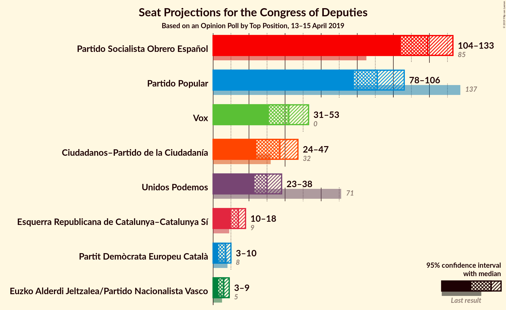
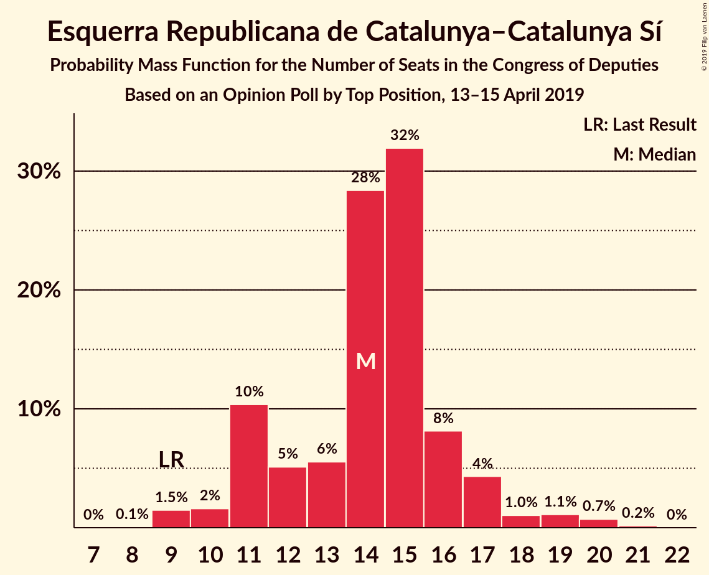
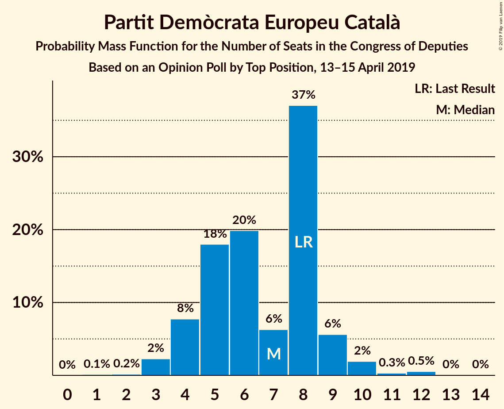
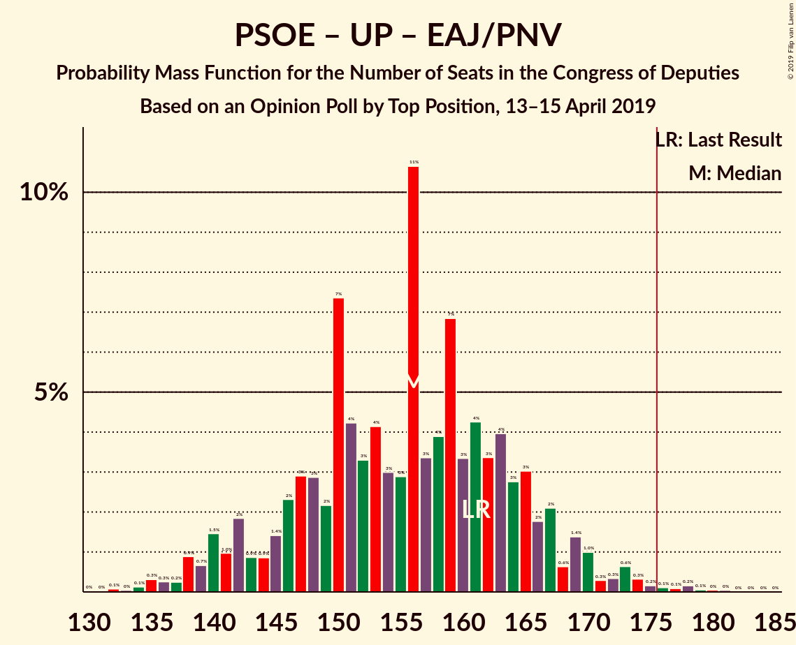

# Opinion Poll by Top Position, 13–15 April 2019

<a href="#voting-intentions">Voting Intentions</a> | <a href="#seats">Seats</a> | <a href="#coalitions">Coalitions</a> | <a href="#technical-information">Technical Information</a>

## Voting Intentions

### Confidence Intervals

| Party | Last Result | Poll Result | 80% Confidence Interval | 90% Confidence Interval | 95% Confidence Interval | 99% Confidence Interval |
|:-----:|:-----------:|:-----------:|:-----------------------:|:-----------------------:|:-----------------------:|:-----------------------:|
| Partido Socialista Obrero Español | 22.6% | 27.8% | 26.2–29.5% |25.8–30.0% |25.4–30.5% |24.6–31.3% |
| Partido Popular | 33.0% | 22.3% | 20.8–23.9% |20.4–24.4% |20.1–24.8% |19.4–25.6% |
| Vox | 0.2% | 14.2% | 12.9–15.5% |12.6–15.9% |12.3–16.3% |11.7–16.9% |
| Ciudadanos–Partido de la Ciudadanía | 13.1% | 13.1% | 11.9–14.4% |11.6–14.8% |11.3–15.1% |10.7–15.8% |
| Unidos Podemos | 21.2% | 12.2% | 11.0–13.5% |10.7–13.8% |10.4–14.1% |9.9–14.8% |
| Esquerra Republicana de Catalunya–Catalunya Sí | 2.7% | 3.2% | 2.6–3.9% |2.4–4.1% |2.3–4.3% |2.1–4.7% |
| Partit Demòcrata Europeu Català | 2.0% | 1.6% | 1.2–2.2% |1.1–2.3% |1.0–2.5% |0.9–2.8% |
| Euzko Alderdi Jeltzalea/Partido Nacionalista Vasco | 1.2% | 1.2% | 0.9–1.7% |0.8–1.8% |0.7–2.0% |0.6–2.2% |

*Note:* The poll result column reflects the actual value used in the calculations. Published results may vary slightly, and in addition be rounded to fewer digits.

## Seats

### Confidence Intervals

| Party | Last Result | Median | 80% Confidence Interval | 90% Confidence Interval | 95% Confidence Interval | 99% Confidence Interval |
|:-----:|:-----------:|:------:|:-----------------------:|:-----------------------:|:-----------------------:|:-----------------------:|
| <a href="#partido-socialista-obrero-español">Partido Socialista Obrero Español</a> | 85 | 116 | 116–131 |116–133 |116–133 |116–133 |
| <a href="#partido-popular">Partido Popular</a> | 137 | 93 | 83–93 |78–93 |78–93 |78–93 |
| <a href="#vox">Vox</a> | 0 | 31 | 31–39 |31–42 |31–44 |31–48 |
| <a href="#ciudadanos–partido-de-la-ciudadanía">Ciudadanos–Partido de la Ciudadanía</a> | 32 | 46 | 43–47 |40–47 |40–47 |35–47 |
| <a href="#unidos-podemos">Unidos Podemos</a> | 71 | 34 | 27–34 |23–34 |23–34 |23–34 |
| <a href="#esquerra-republicana-de-catalunya–catalunya-sí">Esquerra Republicana de Catalunya–Catalunya Sí</a> | 9 | 11 | 10–19 |10–19 |10–19 |10–19 |
| <a href="#partit-demòcrata-europeu-català">Partit Demòcrata Europeu Català</a> | 8 | 10 | 5–10 |5–10 |4–10 |4–12 |
| <a href="#euzko-alderdi-jeltzalea/partido-nacionalista-vasco">Euzko Alderdi Jeltzalea/Partido Nacionalista Vasco</a> | 5 | 5 | 5–7 |5–7 |3–7 |3–7 |

### Partido Socialista Obrero Español

*For a full overview of the results for this party, see the [Partido Socialista Obrero Español](party-partidosocialistaobreroespañol.html) page.*

| Number of Seats | Probability | Accumulated | Special Marks |
|:---------------:|:-----------:|:-----------:|:-------------:|
| 85 | 0% | 100% | Last Result |
| 86 | 0% | 100% |  |
| 87 | 0% | 100% |  |
| 88 | 0% | 100% |  |
| 89 | 0% | 100% |  |
| 90 | 0% | 100% |  |
| 91 | 0% | 100% |  |
| 92 | 0% | 100% |  |
| 93 | 0% | 100% |  |
| 94 | 0% | 100% |  |
| 95 | 0% | 100% |  |
| 96 | 0% | 100% |  |
| 97 | 0% | 100% |  |
| 98 | 0% | 100% |  |
| 99 | 0% | 100% |  |
| 100 | 0% | 100% |  |
| 101 | 0% | 100% |  |
| 102 | 0% | 100% |  |
| 103 | 0% | 100% |  |
| 104 | 0% | 100% |  |
| 105 | 0% | 100% |  |
| 106 | 0% | 100% |  |
| 107 | 0% | 100% |  |
| 108 | 0% | 100% |  |
| 109 | 0% | 100% |  |
| 110 | 0.1% | 100% |  |
| 111 | 0% | 99.9% |  |
| 112 | 0% | 99.9% |  |
| 113 | 0% | 99.9% |  |
| 114 | 0% | 99.9% |  |
| 115 | 0.1% | 99.9% |  |
| 116 | 64% | 99.9% | Median |
| 117 | 0.1% | 36% |  |
| 118 | 0% | 36% |  |
| 119 | 0% | 36% |  |
| 120 | 0% | 36% |  |
| 121 | 0% | 36% |  |
| 122 | 0% | 36% |  |
| 123 | 0.9% | 36% |  |
| 124 | 11% | 35% |  |
| 125 | 0% | 24% |  |
| 126 | 0.2% | 24% |  |
| 127 | 0% | 24% |  |
| 128 | 0% | 24% |  |
| 129 | 0.2% | 24% |  |
| 130 | 12% | 23% |  |
| 131 | 3% | 11% |  |
| 132 | 0.1% | 9% |  |
| 133 | 8% | 8% |  |
| 134 | 0.1% | 0.2% |  |
| 135 | 0% | 0.1% |  |
| 136 | 0% | 0.1% |  |
| 137 | 0% | 0.1% |  |
| 138 | 0% | 0.1% |  |
| 139 | 0.1% | 0.1% |  |
| 140 | 0% | 0% |  |

### Partido Popular

*For a full overview of the results for this party, see the [Partido Popular](party-partidopopular.html) page.*

| Number of Seats | Probability | Accumulated | Special Marks |
|:---------------:|:-----------:|:-----------:|:-------------:|
| 73 | 0.1% | 100% |  |
| 74 | 0% | 99.9% |  |
| 75 | 0% | 99.9% |  |
| 76 | 0% | 99.9% |  |
| 77 | 0% | 99.9% |  |
| 78 | 6% | 99.9% |  |
| 79 | 0% | 93% |  |
| 80 | 2% | 93% |  |
| 81 | 0.1% | 92% |  |
| 82 | 0.3% | 92% |  |
| 83 | 3% | 91% |  |
| 84 | 12% | 88% |  |
| 85 | 0.9% | 76% |  |
| 86 | 11% | 75% |  |
| 87 | 0% | 65% |  |
| 88 | 0.2% | 65% |  |
| 89 | 0% | 64% |  |
| 90 | 0% | 64% |  |
| 91 | 0% | 64% |  |
| 92 | 0% | 64% |  |
| 93 | 64% | 64% | Median |
| 94 | 0.1% | 0.2% |  |
| 95 | 0% | 0.1% |  |
| 96 | 0% | 0.1% |  |
| 97 | 0% | 0.1% |  |
| 98 | 0% | 0.1% |  |
| 99 | 0% | 0% |  |
| 100 | 0% | 0% |  |
| 101 | 0% | 0% |  |
| 102 | 0% | 0% |  |
| 103 | 0% | 0% |  |
| 104 | 0% | 0% |  |
| 105 | 0% | 0% |  |
| 106 | 0% | 0% |  |
| 107 | 0% | 0% |  |
| 108 | 0% | 0% |  |
| 109 | 0% | 0% |  |
| 110 | 0% | 0% |  |
| 111 | 0% | 0% |  |
| 112 | 0% | 0% |  |
| 113 | 0% | 0% |  |
| 114 | 0% | 0% |  |
| 115 | 0% | 0% |  |
| 116 | 0% | 0% |  |
| 117 | 0% | 0% |  |
| 118 | 0% | 0% |  |
| 119 | 0% | 0% |  |
| 120 | 0% | 0% |  |
| 121 | 0% | 0% |  |
| 122 | 0% | 0% |  |
| 123 | 0% | 0% |  |
| 124 | 0% | 0% |  |
| 125 | 0% | 0% |  |
| 126 | 0% | 0% |  |
| 127 | 0% | 0% |  |
| 128 | 0% | 0% |  |
| 129 | 0% | 0% |  |
| 130 | 0% | 0% |  |
| 131 | 0% | 0% |  |
| 132 | 0% | 0% |  |
| 133 | 0% | 0% |  |
| 134 | 0% | 0% |  |
| 135 | 0% | 0% |  |
| 136 | 0% | 0% |  |
| 137 | 0% | 0% | Last Result |

### Vox

*For a full overview of the results for this party, see the [Vox](party-vox.html) page.*

| Number of Seats | Probability | Accumulated | Special Marks |
|:---------------:|:-----------:|:-----------:|:-------------:|
| 0 | 0% | 100% | Last Result |
| 1 | 0% | 100% |  |
| 2 | 0% | 100% |  |
| 3 | 0% | 100% |  |
| 4 | 0% | 100% |  |
| 5 | 0% | 100% |  |
| 6 | 0% | 100% |  |
| 7 | 0% | 100% |  |
| 8 | 0% | 100% |  |
| 9 | 0% | 100% |  |
| 10 | 0% | 100% |  |
| 11 | 0% | 100% |  |
| 12 | 0% | 100% |  |
| 13 | 0% | 100% |  |
| 14 | 0% | 100% |  |
| 15 | 0% | 100% |  |
| 16 | 0% | 100% |  |
| 17 | 0% | 100% |  |
| 18 | 0% | 100% |  |
| 19 | 0% | 100% |  |
| 20 | 0% | 100% |  |
| 21 | 0% | 100% |  |
| 22 | 0% | 100% |  |
| 23 | 0% | 100% |  |
| 24 | 0% | 100% |  |
| 25 | 0% | 100% |  |
| 26 | 0% | 100% |  |
| 27 | 0% | 100% |  |
| 28 | 0% | 100% |  |
| 29 | 0% | 100% |  |
| 30 | 0% | 100% |  |
| 31 | 64% | 100% | Median |
| 32 | 11% | 36% |  |
| 33 | 0.2% | 25% |  |
| 34 | 12% | 25% |  |
| 35 | 1.0% | 13% |  |
| 36 | 0% | 12% |  |
| 37 | 0% | 11% |  |
| 38 | 0% | 11% |  |
| 39 | 6% | 11% |  |
| 40 | 0% | 5% |  |
| 41 | 0% | 5% |  |
| 42 | 0% | 5% |  |
| 43 | 0% | 5% |  |
| 44 | 3% | 5% |  |
| 45 | 0% | 2% |  |
| 46 | 0% | 2% |  |
| 47 | 2% | 2% |  |
| 48 | 0.5% | 0.5% |  |
| 49 | 0% | 0% |  |

### Ciudadanos–Partido de la Ciudadanía

*For a full overview of the results for this party, see the [Ciudadanos–Partido de la Ciudadanía](party-ciudadanos–partidodelaciudadanía.html) page.*

| Number of Seats | Probability | Accumulated | Special Marks |
|:---------------:|:-----------:|:-----------:|:-------------:|
| 32 | 0% | 100% | Last Result |
| 33 | 0% | 100% |  |
| 34 | 0% | 99.9% |  |
| 35 | 0.6% | 99.9% |  |
| 36 | 0% | 99.3% |  |
| 37 | 2% | 99.3% |  |
| 38 | 0% | 98% |  |
| 39 | 0% | 98% |  |
| 40 | 3% | 98% |  |
| 41 | 0% | 95% |  |
| 42 | 0% | 95% |  |
| 43 | 6% | 95% |  |
| 44 | 0% | 89% |  |
| 45 | 0.9% | 88% |  |
| 46 | 75% | 88% | Median |
| 47 | 12% | 13% |  |
| 48 | 0% | 0.4% |  |
| 49 | 0.4% | 0.4% |  |
| 50 | 0% | 0% |  |

### Unidos Podemos

*For a full overview of the results for this party, see the [Unidos Podemos](party-unidospodemos.html) page.*

| Number of Seats | Probability | Accumulated | Special Marks |
|:---------------:|:-----------:|:-----------:|:-------------:|
| 22 | 0.1% | 100% |  |
| 23 | 8% | 99.9% |  |
| 24 | 0.1% | 92% |  |
| 25 | 0% | 91% |  |
| 26 | 0% | 91% |  |
| 27 | 3% | 91% |  |
| 28 | 12% | 88% |  |
| 29 | 12% | 77% |  |
| 30 | 0% | 65% |  |
| 31 | 0.2% | 65% |  |
| 32 | 2% | 64% |  |
| 33 | 0% | 62% |  |
| 34 | 62% | 62% | Median |
| 35 | 0% | 0.1% |  |
| 36 | 0% | 0.1% |  |
| 37 | 0.1% | 0.1% |  |
| 38 | 0% | 0% |  |
| 39 | 0% | 0% |  |
| 40 | 0% | 0% |  |
| 41 | 0% | 0% |  |
| 42 | 0% | 0% |  |
| 43 | 0% | 0% |  |
| 44 | 0% | 0% |  |
| 45 | 0% | 0% |  |
| 46 | 0% | 0% |  |
| 47 | 0% | 0% |  |
| 48 | 0% | 0% |  |
| 49 | 0% | 0% |  |
| 50 | 0% | 0% |  |
| 51 | 0% | 0% |  |
| 52 | 0% | 0% |  |
| 53 | 0% | 0% |  |
| 54 | 0% | 0% |  |
| 55 | 0% | 0% |  |
| 56 | 0% | 0% |  |
| 57 | 0% | 0% |  |
| 58 | 0% | 0% |  |
| 59 | 0% | 0% |  |
| 60 | 0% | 0% |  |
| 61 | 0% | 0% |  |
| 62 | 0% | 0% |  |
| 63 | 0% | 0% |  |
| 64 | 0% | 0% |  |
| 65 | 0% | 0% |  |
| 66 | 0% | 0% |  |
| 67 | 0% | 0% |  |
| 68 | 0% | 0% |  |
| 69 | 0% | 0% |  |
| 70 | 0% | 0% |  |
| 71 | 0% | 0% | Last Result |

### Esquerra Republicana de Catalunya–Catalunya Sí

*For a full overview of the results for this party, see the [Esquerra Republicana de Catalunya–Catalunya Sí](party-esquerrarepublicanadecatalunya–catalunyasí.html) page.*

| Number of Seats | Probability | Accumulated | Special Marks |
|:---------------:|:-----------:|:-----------:|:-------------:|
| 8 | 0.2% | 100% |  |
| 9 | 0.1% | 99.8% | Last Result |
| 10 | 12% | 99.7% |  |
| 11 | 62% | 88% | Median |
| 12 | 0% | 25% |  |
| 13 | 0.9% | 25% |  |
| 14 | 9% | 25% |  |
| 15 | 2% | 16% |  |
| 16 | 0.1% | 14% |  |
| 17 | 2% | 14% |  |
| 18 | 0.2% | 11% |  |
| 19 | 11% | 11% |  |
| 20 | 0% | 0% |  |

### Partit Demòcrata Europeu Català

*For a full overview of the results for this party, see the [Partit Demòcrata Europeu Català](party-partitdemòcrataeuropeucatalà.html) page.*

| Number of Seats | Probability | Accumulated | Special Marks |
|:---------------:|:-----------:|:-----------:|:-------------:|
| 1 | 0.2% | 100% |  |
| 2 | 0% | 99.8% |  |
| 3 | 0.1% | 99.8% |  |
| 4 | 3% | 99.7% |  |
| 5 | 23% | 97% |  |
| 6 | 2% | 74% |  |
| 7 | 0.2% | 72% |  |
| 8 | 2% | 72% | Last Result |
| 9 | 6% | 70% |  |
| 10 | 62% | 63% | Median |
| 11 | 0% | 1.0% |  |
| 12 | 1.0% | 1.0% |  |
| 13 | 0% | 0% |  |

### Euzko Alderdi Jeltzalea/Partido Nacionalista Vasco

*For a full overview of the results for this party, see the [Euzko Alderdi Jeltzalea/Partido Nacionalista Vasco](party-euzkoalderdijeltzaleapartidonacionalistavasco.html) page.*

| Number of Seats | Probability | Accumulated | Special Marks |
|:---------------:|:-----------:|:-----------:|:-------------:|
| 1 | 0.3% | 100% |  |
| 2 | 0.1% | 99.7% |  |
| 3 | 5% | 99.6% |  |
| 4 | 0% | 95% |  |
| 5 | 65% | 95% | Last Result, Median |
| 6 | 11% | 30% |  |
| 7 | 19% | 19% |  |
| 8 | 0% | 0% |  |

## Coalitions

### Confidence Intervals

| Coalition | Last Result | Median | Majority? | 80% Confidence Interval | 90% Confidence Interval | 95% Confidence Interval | 99% Confidence Interval |
|:---------:|:-----------:|:------:|:---------:|:-----------------------:|:-----------------------:|:-----------------------:|:-----------------------:|
| Partido Socialista Obrero Español – Partido Popular – Ciudadanos–Partido de la Ciudadanía | 254 | 255 | 100% | 254–261 | 254–261 | 251–261 | 249–261 |
| Partido Socialista Obrero Español – Partido Popular | 222 | 209 | 100% | 209–214 | 209–214 | 209–214 | 208–214 |
| Partido Socialista Obrero Español – Ciudadanos–Partido de la Ciudadanía – Unidos Podemos | 188 | 196 | 100% | 196–206 | 196–206 | 194–206 | 193–206 |
| Partido Socialista Obrero Español – Unidos Podemos – Esquerra Republicana de Catalunya–Catalunya Sí – Partit Demòcrata Europeu Català | 173 | 171 | 23% | 171–176 | 171–179 | 171–179 | 171–179 |
| Partido Socialista Obrero Español – Ciudadanos–Partido de la Ciudadanía | 117 | 162 | 19% | 162–177 | 162–177 | 162–177 | 162–177 |
| Partido Popular – Vox – Ciudadanos–Partido de la Ciudadanía | 169 | 170 | 0.1% | 164–170 | 160–170 | 160–170 | 160–170 |
| Partido Socialista Obrero Español – Unidos Podemos – Euzko Alderdi Jeltzalea/Partido Nacionalista Vasco | 161 | 155 | 0% | 155–166 | 155–166 | 155–166 | 153–166 |
| Partido Socialista Obrero Español – Unidos Podemos | 156 | 150 | 0% | 150–159 | 150–159 | 150–159 | 148–159 |
| Partido Popular – Ciudadanos–Partido de la Ciudadanía – Euzko Alderdi Jeltzalea/Partido Nacionalista Vasco | 174 | 144 | 0% | 128–144 | 128–144 | 126–144 | 119–144 |
| Partido Popular – Ciudadanos–Partido de la Ciudadanía | 169 | 139 | 0% | 123–139 | 121–139 | 121–139 | 117–139 |
| Partido Socialista Obrero Español | 85 | 116 | 0% | 116–131 | 116–133 | 116–133 | 116–133 |
| Partido Popular – Vox | 137 | 124 | 0% | 118–124 | 117–127 | 117–127 | 117–130 |
| Partido Popular | 137 | 93 | 0% | 83–93 | 78–93 | 78–93 | 78–93 |

### Partido Socialista Obrero Español – Partido Popular – Ciudadanos–Partido de la Ciudadanía

| Number of Seats | Probability | Accumulated | Special Marks |
|:---------------:|:-----------:|:-----------:|:-------------:|
| 243 | 0% | 100% |  |
| 244 | 0% | 99.9% |  |
| 245 | 0% | 99.9% |  |
| 246 | 0% | 99.9% |  |
| 247 | 0.1% | 99.9% |  |
| 248 | 0% | 99.8% |  |
| 249 | 0.4% | 99.8% |  |
| 250 | 2% | 99.4% |  |
| 251 | 0% | 98% |  |
| 252 | 0% | 97% |  |
| 253 | 0.9% | 97% |  |
| 254 | 9% | 97% | Last Result |
| 255 | 64% | 88% | Median |
| 256 | 11% | 23% |  |
| 257 | 0% | 13% |  |
| 258 | 0.1% | 13% |  |
| 259 | 0% | 12% |  |
| 260 | 0.2% | 12% |  |
| 261 | 12% | 12% |  |
| 262 | 0% | 0.2% |  |
| 263 | 0.2% | 0.2% |  |
| 264 | 0% | 0% |  |

### Partido Socialista Obrero Español – Partido Popular

| Number of Seats | Probability | Accumulated | Special Marks |
|:---------------:|:-----------:|:-----------:|:-------------:|
| 206 | 0% | 100% |  |
| 207 | 0% | 99.9% |  |
| 208 | 0.9% | 99.9% |  |
| 209 | 64% | 99.0% | Median |
| 210 | 11% | 35% |  |
| 211 | 7% | 24% |  |
| 212 | 0.1% | 17% |  |
| 213 | 2% | 17% |  |
| 214 | 15% | 15% |  |
| 215 | 0.1% | 0.1% |  |
| 216 | 0% | 0% |  |
| 217 | 0% | 0% |  |
| 218 | 0% | 0% |  |
| 219 | 0% | 0% |  |
| 220 | 0% | 0% |  |
| 221 | 0% | 0% |  |
| 222 | 0% | 0% | Last Result |

### Partido Socialista Obrero Español – Ciudadanos–Partido de la Ciudadanía – Unidos Podemos

| Number of Seats | Probability | Accumulated | Special Marks |
|:---------------:|:-----------:|:-----------:|:-------------:|
| 185 | 0% | 100% |  |
| 186 | 0% | 99.9% |  |
| 187 | 0% | 99.9% |  |
| 188 | 0% | 99.9% | Last Result |
| 189 | 0% | 99.9% |  |
| 190 | 0% | 99.9% |  |
| 191 | 0% | 99.9% |  |
| 192 | 0% | 99.9% |  |
| 193 | 2% | 99.8% |  |
| 194 | 2% | 98% |  |
| 195 | 0.1% | 96% |  |
| 196 | 63% | 95% | Median |
| 197 | 0% | 32% |  |
| 198 | 13% | 32% |  |
| 199 | 6% | 19% |  |
| 200 | 0% | 13% |  |
| 201 | 0.1% | 13% |  |
| 202 | 0% | 12% |  |
| 203 | 0% | 12% |  |
| 204 | 0% | 12% |  |
| 205 | 0.2% | 12% |  |
| 206 | 12% | 12% |  |
| 207 | 0% | 0% |  |

### Partido Socialista Obrero Español – Unidos Podemos – Esquerra Republicana de Catalunya–Catalunya Sí – Partit Demòcrata Europeu Català

| Number of Seats | Probability | Accumulated | Special Marks |
|:---------------:|:-----------:|:-----------:|:-------------:|
| 167 | 0.1% | 100% |  |
| 168 | 0% | 99.8% |  |
| 169 | 0% | 99.8% |  |
| 170 | 0.1% | 99.8% |  |
| 171 | 64% | 99.8% | Median |
| 172 | 0.2% | 36% |  |
| 173 | 0% | 35% | Last Result |
| 174 | 12% | 35% |  |
| 175 | 0.2% | 23% |  |
| 176 | 14% | 23% | Majority |
| 177 | 0% | 9% |  |
| 178 | 0% | 9% |  |
| 179 | 9% | 9% |  |
| 180 | 0% | 0.2% |  |
| 181 | 0% | 0.1% |  |
| 182 | 0% | 0.1% |  |
| 183 | 0% | 0.1% |  |
| 184 | 0% | 0.1% |  |
| 185 | 0.1% | 0.1% |  |
| 186 | 0% | 0% |  |

### Partido Socialista Obrero Español – Ciudadanos–Partido de la Ciudadanía

| Number of Seats | Probability | Accumulated | Special Marks |
|:---------------:|:-----------:|:-----------:|:-------------:|
| 117 | 0% | 100% | Last Result |
| 118 | 0% | 100% |  |
| 119 | 0% | 100% |  |
| 120 | 0% | 100% |  |
| 121 | 0% | 100% |  |
| 122 | 0% | 100% |  |
| 123 | 0% | 100% |  |
| 124 | 0% | 100% |  |
| 125 | 0% | 100% |  |
| 126 | 0% | 100% |  |
| 127 | 0% | 100% |  |
| 128 | 0% | 100% |  |
| 129 | 0% | 100% |  |
| 130 | 0% | 100% |  |
| 131 | 0% | 100% |  |
| 132 | 0% | 100% |  |
| 133 | 0% | 100% |  |
| 134 | 0% | 100% |  |
| 135 | 0% | 100% |  |
| 136 | 0% | 100% |  |
| 137 | 0% | 100% |  |
| 138 | 0% | 100% |  |
| 139 | 0% | 100% |  |
| 140 | 0% | 100% |  |
| 141 | 0% | 100% |  |
| 142 | 0% | 100% |  |
| 143 | 0% | 100% |  |
| 144 | 0% | 100% |  |
| 145 | 0% | 100% |  |
| 146 | 0% | 100% |  |
| 147 | 0% | 100% |  |
| 148 | 0% | 100% |  |
| 149 | 0% | 100% |  |
| 150 | 0% | 100% |  |
| 151 | 0% | 100% |  |
| 152 | 0% | 100% |  |
| 153 | 0% | 100% |  |
| 154 | 0% | 100% |  |
| 155 | 0% | 99.9% |  |
| 156 | 0% | 99.9% |  |
| 157 | 0% | 99.9% |  |
| 158 | 0% | 99.9% |  |
| 159 | 0% | 99.9% |  |
| 160 | 0% | 99.9% |  |
| 161 | 0% | 99.9% |  |
| 162 | 64% | 99.8% | Median |
| 163 | 0% | 36% |  |
| 164 | 0.1% | 36% |  |
| 165 | 0% | 36% |  |
| 166 | 0.3% | 36% |  |
| 167 | 0.1% | 35% |  |
| 168 | 0.9% | 35% |  |
| 169 | 0.1% | 34% |  |
| 170 | 13% | 34% |  |
| 171 | 3% | 22% |  |
| 172 | 0% | 19% |  |
| 173 | 0% | 19% |  |
| 174 | 0.1% | 19% |  |
| 175 | 0.2% | 19% |  |
| 176 | 6% | 19% | Majority |
| 177 | 12% | 12% |  |
| 178 | 0.2% | 0.2% |  |
| 179 | 0% | 0% |  |

### Partido Popular – Vox – Ciudadanos–Partido de la Ciudadanía

| Number of Seats | Probability | Accumulated | Special Marks |
|:---------------:|:-----------:|:-----------:|:-------------:|
| 155 | 0.1% | 100% |  |
| 156 | 0% | 99.9% |  |
| 157 | 0% | 99.9% |  |
| 158 | 0% | 99.9% |  |
| 159 | 0% | 99.9% |  |
| 160 | 6% | 99.9% |  |
| 161 | 0% | 93% |  |
| 162 | 0% | 93% |  |
| 163 | 0% | 93% |  |
| 164 | 13% | 93% |  |
| 165 | 13% | 80% |  |
| 166 | 0.3% | 67% |  |
| 167 | 3% | 67% |  |
| 168 | 0.2% | 65% |  |
| 169 | 0% | 64% | Last Result |
| 170 | 64% | 64% | Median |
| 171 | 0% | 0.2% |  |
| 172 | 0% | 0.2% |  |
| 173 | 0% | 0.2% |  |
| 174 | 0% | 0.2% |  |
| 175 | 0% | 0.1% |  |
| 176 | 0.1% | 0.1% | Majority |
| 177 | 0% | 0.1% |  |
| 178 | 0% | 0% |  |

### Partido Socialista Obrero Español – Unidos Podemos – Euzko Alderdi Jeltzalea/Partido Nacionalista Vasco

| Number of Seats | Probability | Accumulated | Special Marks |
|:---------------:|:-----------:|:-----------:|:-------------:|
| 148 | 0% | 100% |  |
| 149 | 0% | 99.9% |  |
| 150 | 0% | 99.9% |  |
| 151 | 0% | 99.9% |  |
| 152 | 0% | 99.9% |  |
| 153 | 2% | 99.9% |  |
| 154 | 0% | 98% |  |
| 155 | 62% | 98% | Median |
| 156 | 0.9% | 36% |  |
| 157 | 0.1% | 35% |  |
| 158 | 11% | 35% |  |
| 159 | 2% | 24% |  |
| 160 | 0% | 22% |  |
| 161 | 3% | 22% | Last Result |
| 162 | 0.1% | 19% |  |
| 163 | 7% | 19% |  |
| 164 | 0% | 12% |  |
| 165 | 0% | 12% |  |
| 166 | 12% | 12% |  |
| 167 | 0.1% | 0.1% |  |
| 168 | 0% | 0% |  |

### Partido Socialista Obrero Español – Unidos Podemos

| Number of Seats | Probability | Accumulated | Special Marks |
|:---------------:|:-----------:|:-----------:|:-------------:|
| 144 | 0.1% | 100% |  |
| 145 | 0% | 99.9% |  |
| 146 | 0% | 99.9% |  |
| 147 | 0.1% | 99.9% |  |
| 148 | 2% | 99.9% |  |
| 149 | 0% | 98% |  |
| 150 | 62% | 98% | Median |
| 151 | 0.9% | 36% |  |
| 152 | 11% | 35% |  |
| 153 | 0% | 24% |  |
| 154 | 0.1% | 24% |  |
| 155 | 0% | 24% |  |
| 156 | 8% | 24% | Last Result |
| 157 | 0.2% | 15% |  |
| 158 | 3% | 15% |  |
| 159 | 12% | 12% |  |
| 160 | 0.1% | 0.2% |  |
| 161 | 0.1% | 0.1% |  |
| 162 | 0% | 0% |  |

### Partido Popular – Ciudadanos–Partido de la Ciudadanía – Euzko Alderdi Jeltzalea/Partido Nacionalista Vasco

| Number of Seats | Probability | Accumulated | Special Marks |
|:---------------:|:-----------:|:-----------:|:-------------:|
| 114 | 0.1% | 100% |  |
| 115 | 0% | 99.9% |  |
| 116 | 0% | 99.9% |  |
| 117 | 0% | 99.9% |  |
| 118 | 0% | 99.9% |  |
| 119 | 0.5% | 99.9% |  |
| 120 | 2% | 99.4% |  |
| 121 | 0% | 98% |  |
| 122 | 0% | 98% |  |
| 123 | 0% | 98% |  |
| 124 | 0% | 98% |  |
| 125 | 0% | 98% |  |
| 126 | 3% | 98% |  |
| 127 | 0% | 95% |  |
| 128 | 6% | 95% |  |
| 129 | 0% | 89% |  |
| 130 | 0% | 89% |  |
| 131 | 0% | 89% |  |
| 132 | 0% | 89% |  |
| 133 | 0% | 89% |  |
| 134 | 0% | 89% |  |
| 135 | 0.9% | 89% |  |
| 136 | 0% | 88% |  |
| 137 | 0% | 88% |  |
| 138 | 23% | 88% |  |
| 139 | 0% | 65% |  |
| 140 | 0% | 65% |  |
| 141 | 0% | 65% |  |
| 142 | 0% | 65% |  |
| 143 | 0.2% | 65% |  |
| 144 | 64% | 64% | Median |
| 145 | 0% | 0% |  |
| 146 | 0% | 0% |  |
| 147 | 0% | 0% |  |
| 148 | 0% | 0% |  |
| 149 | 0% | 0% |  |
| 150 | 0% | 0% |  |
| 151 | 0% | 0% |  |
| 152 | 0% | 0% |  |
| 153 | 0% | 0% |  |
| 154 | 0% | 0% |  |
| 155 | 0% | 0% |  |
| 156 | 0% | 0% |  |
| 157 | 0% | 0% |  |
| 158 | 0% | 0% |  |
| 159 | 0% | 0% |  |
| 160 | 0% | 0% |  |
| 161 | 0% | 0% |  |
| 162 | 0% | 0% |  |
| 163 | 0% | 0% |  |
| 164 | 0% | 0% |  |
| 165 | 0% | 0% |  |
| 166 | 0% | 0% |  |
| 167 | 0% | 0% |  |
| 168 | 0% | 0% |  |
| 169 | 0% | 0% |  |
| 170 | 0% | 0% |  |
| 171 | 0% | 0% |  |
| 172 | 0% | 0% |  |
| 173 | 0% | 0% |  |
| 174 | 0% | 0% | Last Result |

### Partido Popular – Ciudadanos–Partido de la Ciudadanía

| Number of Seats | Probability | Accumulated | Special Marks |
|:---------------:|:-----------:|:-----------:|:-------------:|
| 108 | 0.1% | 100% |  |
| 109 | 0% | 99.9% |  |
| 110 | 0% | 99.9% |  |
| 111 | 0% | 99.9% |  |
| 112 | 0% | 99.9% |  |
| 113 | 0% | 99.9% |  |
| 114 | 0% | 99.9% |  |
| 115 | 0% | 99.9% |  |
| 116 | 0.1% | 99.8% |  |
| 117 | 2% | 99.8% |  |
| 118 | 0.3% | 98% |  |
| 119 | 0% | 98% |  |
| 120 | 0% | 98% |  |
| 121 | 6% | 98% |  |
| 122 | 0% | 91% |  |
| 123 | 3% | 91% |  |
| 124 | 0% | 89% |  |
| 125 | 0% | 89% |  |
| 126 | 0% | 89% |  |
| 127 | 0% | 89% |  |
| 128 | 0% | 89% |  |
| 129 | 0% | 89% |  |
| 130 | 0.9% | 89% |  |
| 131 | 12% | 88% |  |
| 132 | 11% | 75% |  |
| 133 | 0% | 65% |  |
| 134 | 0% | 65% |  |
| 135 | 0% | 65% |  |
| 136 | 0% | 65% |  |
| 137 | 0.2% | 65% |  |
| 138 | 0% | 64% |  |
| 139 | 64% | 64% | Median |
| 140 | 0% | 0.2% |  |
| 141 | 0.1% | 0.2% |  |
| 142 | 0% | 0.1% |  |
| 143 | 0% | 0% |  |
| 144 | 0% | 0% |  |
| 145 | 0% | 0% |  |
| 146 | 0% | 0% |  |
| 147 | 0% | 0% |  |
| 148 | 0% | 0% |  |
| 149 | 0% | 0% |  |
| 150 | 0% | 0% |  |
| 151 | 0% | 0% |  |
| 152 | 0% | 0% |  |
| 153 | 0% | 0% |  |
| 154 | 0% | 0% |  |
| 155 | 0% | 0% |  |
| 156 | 0% | 0% |  |
| 157 | 0% | 0% |  |
| 158 | 0% | 0% |  |
| 159 | 0% | 0% |  |
| 160 | 0% | 0% |  |
| 161 | 0% | 0% |  |
| 162 | 0% | 0% |  |
| 163 | 0% | 0% |  |
| 164 | 0% | 0% |  |
| 165 | 0% | 0% |  |
| 166 | 0% | 0% |  |
| 167 | 0% | 0% |  |
| 168 | 0% | 0% |  |
| 169 | 0% | 0% | Last Result |

### Partido Socialista Obrero Español

| Number of Seats | Probability | Accumulated | Special Marks |
|:---------------:|:-----------:|:-----------:|:-------------:|
| 85 | 0% | 100% | Last Result |
| 86 | 0% | 100% |  |
| 87 | 0% | 100% |  |
| 88 | 0% | 100% |  |
| 89 | 0% | 100% |  |
| 90 | 0% | 100% |  |
| 91 | 0% | 100% |  |
| 92 | 0% | 100% |  |
| 93 | 0% | 100% |  |
| 94 | 0% | 100% |  |
| 95 | 0% | 100% |  |
| 96 | 0% | 100% |  |
| 97 | 0% | 100% |  |
| 98 | 0% | 100% |  |
| 99 | 0% | 100% |  |
| 100 | 0% | 100% |  |
| 101 | 0% | 100% |  |
| 102 | 0% | 100% |  |
| 103 | 0% | 100% |  |
| 104 | 0% | 100% |  |
| 105 | 0% | 100% |  |
| 106 | 0% | 100% |  |
| 107 | 0% | 100% |  |
| 108 | 0% | 100% |  |
| 109 | 0% | 100% |  |
| 110 | 0.1% | 100% |  |
| 111 | 0% | 99.9% |  |
| 112 | 0% | 99.9% |  |
| 113 | 0% | 99.9% |  |
| 114 | 0% | 99.9% |  |
| 115 | 0.1% | 99.9% |  |
| 116 | 64% | 99.9% | Median |
| 117 | 0.1% | 36% |  |
| 118 | 0% | 36% |  |
| 119 | 0% | 36% |  |
| 120 | 0% | 36% |  |
| 121 | 0% | 36% |  |
| 122 | 0% | 36% |  |
| 123 | 0.9% | 36% |  |
| 124 | 11% | 35% |  |
| 125 | 0% | 24% |  |
| 126 | 0.2% | 24% |  |
| 127 | 0% | 24% |  |
| 128 | 0% | 24% |  |
| 129 | 0.2% | 24% |  |
| 130 | 12% | 23% |  |
| 131 | 3% | 11% |  |
| 132 | 0.1% | 9% |  |
| 133 | 8% | 8% |  |
| 134 | 0.1% | 0.2% |  |
| 135 | 0% | 0.1% |  |
| 136 | 0% | 0.1% |  |
| 137 | 0% | 0.1% |  |
| 138 | 0% | 0.1% |  |
| 139 | 0.1% | 0.1% |  |
| 140 | 0% | 0% |  |

### Partido Popular – Vox

| Number of Seats | Probability | Accumulated | Special Marks |
|:---------------:|:-----------:|:-----------:|:-------------:|
| 115 | 0.2% | 100% |  |
| 116 | 0% | 99.8% |  |
| 117 | 6% | 99.8% |  |
| 118 | 23% | 93% |  |
| 119 | 0.2% | 70% |  |
| 120 | 1.0% | 70% |  |
| 121 | 0% | 69% |  |
| 122 | 0% | 69% |  |
| 123 | 0% | 69% |  |
| 124 | 64% | 69% | Median |
| 125 | 0% | 5% |  |
| 126 | 0% | 5% |  |
| 127 | 4% | 5% |  |
| 128 | 0% | 0.7% |  |
| 129 | 0.2% | 0.7% |  |
| 130 | 0.1% | 0.5% |  |
| 131 | 0.3% | 0.4% |  |
| 132 | 0% | 0.1% |  |
| 133 | 0% | 0.1% |  |
| 134 | 0% | 0.1% |  |
| 135 | 0% | 0% |  |
| 136 | 0% | 0% |  |
| 137 | 0% | 0% | Last Result |

### Partido Popular

| Number of Seats | Probability | Accumulated | Special Marks |
|:---------------:|:-----------:|:-----------:|:-------------:|
| 73 | 0.1% | 100% |  |
| 74 | 0% | 99.9% |  |
| 75 | 0% | 99.9% |  |
| 76 | 0% | 99.9% |  |
| 77 | 0% | 99.9% |  |
| 78 | 6% | 99.9% |  |
| 79 | 0% | 93% |  |
| 80 | 2% | 93% |  |
| 81 | 0.1% | 92% |  |
| 82 | 0.3% | 92% |  |
| 83 | 3% | 91% |  |
| 84 | 12% | 88% |  |
| 85 | 0.9% | 76% |  |
| 86 | 11% | 75% |  |
| 87 | 0% | 65% |  |
| 88 | 0.2% | 65% |  |
| 89 | 0% | 64% |  |
| 90 | 0% | 64% |  |
| 91 | 0% | 64% |  |
| 92 | 0% | 64% |  |
| 93 | 64% | 64% | Median |
| 94 | 0.1% | 0.2% |  |
| 95 | 0% | 0.1% |  |
| 96 | 0% | 0.1% |  |
| 97 | 0% | 0.1% |  |
| 98 | 0% | 0.1% |  |
| 99 | 0% | 0% |  |
| 100 | 0% | 0% |  |
| 101 | 0% | 0% |  |
| 102 | 0% | 0% |  |
| 103 | 0% | 0% |  |
| 104 | 0% | 0% |  |
| 105 | 0% | 0% |  |
| 106 | 0% | 0% |  |
| 107 | 0% | 0% |  |
| 108 | 0% | 0% |  |
| 109 | 0% | 0% |  |
| 110 | 0% | 0% |  |
| 111 | 0% | 0% |  |
| 112 | 0% | 0% |  |
| 113 | 0% | 0% |  |
| 114 | 0% | 0% |  |
| 115 | 0% | 0% |  |
| 116 | 0% | 0% |  |
| 117 | 0% | 0% |  |
| 118 | 0% | 0% |  |
| 119 | 0% | 0% |  |
| 120 | 0% | 0% |  |
| 121 | 0% | 0% |  |
| 122 | 0% | 0% |  |
| 123 | 0% | 0% |  |
| 124 | 0% | 0% |  |
| 125 | 0% | 0% |  |
| 126 | 0% | 0% |  |
| 127 | 0% | 0% |  |
| 128 | 0% | 0% |  |
| 129 | 0% | 0% |  |
| 130 | 0% | 0% |  |
| 131 | 0% | 0% |  |
| 132 | 0% | 0% |  |
| 133 | 0% | 0% |  |
| 134 | 0% | 0% |  |
| 135 | 0% | 0% |  |
| 136 | 0% | 0% |  |
| 137 | 0% | 0% | Last Result |

## Technical Information

### Opinion Poll

+ **Polling firm:** Top Position
+ **Commissioner(s):** —
+ **Fieldwork period:** 13–15 April 2019

### Calculations

+ **Sample size:** 1200
+ **Simulations done:** 1,024
+ **Error estimate:** 3.16%

