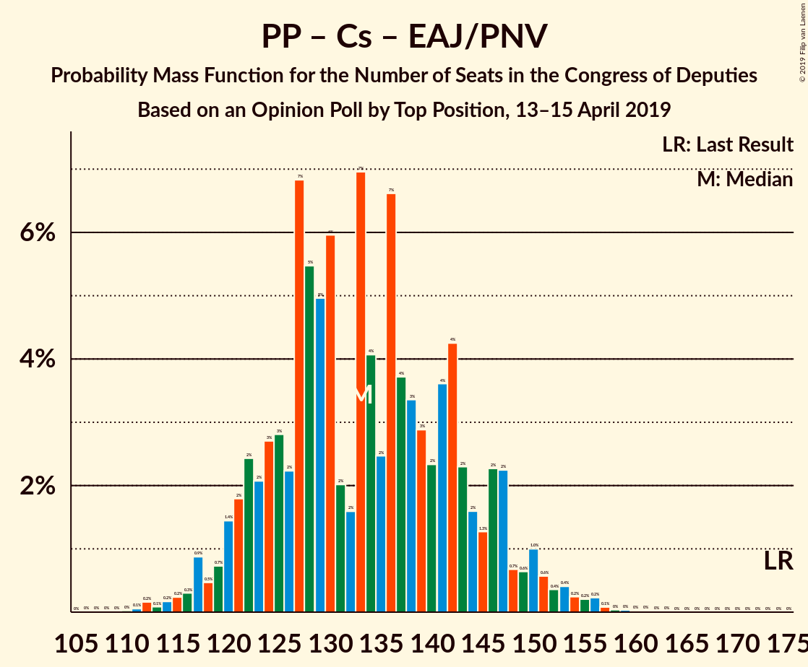
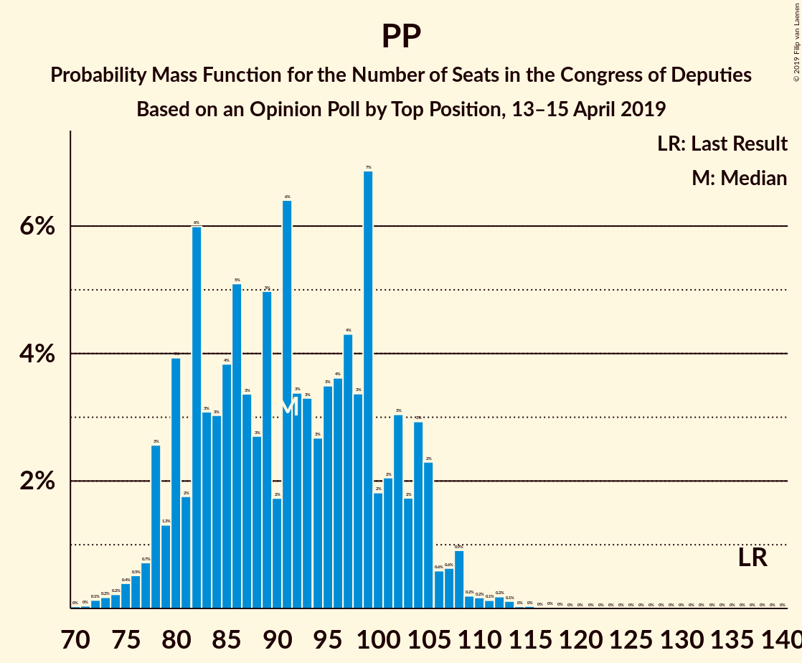

# Opinion Poll by Top Position, 13–15 April 2019

<a href="#voting-intentions">Voting Intentions</a> | <a href="#seats">Seats</a> | <a href="#coalitions">Coalitions</a> | <a href="#technical-information">Technical Information</a>

## Voting Intentions

### Confidence Intervals

| Party | Last Result | Poll Result | 80% Confidence Interval | 90% Confidence Interval | 95% Confidence Interval | 99% Confidence Interval |
|:-----:|:-----------:|:-----------:|:-----------------------:|:-----------------------:|:-----------------------:|:-----------------------:|
| Partido Socialista Obrero Español | 22.6% | 27.8% | 26.2–29.5% |25.8–30.0% |25.4–30.5% |24.6–31.3% |
| Partido Popular | 33.0% | 22.3% | 20.8–23.9% |20.4–24.4% |20.1–24.8% |19.4–25.6% |
| Vox | 0.2% | 14.2% | 12.9–15.5% |12.6–15.9% |12.3–16.3% |11.7–16.9% |
| Ciudadanos–Partido de la Ciudadanía | 13.1% | 13.1% | 11.9–14.4% |11.6–14.8% |11.3–15.1% |10.7–15.8% |
| Unidos Podemos | 21.2% | 12.2% | 11.0–13.5% |10.7–13.8% |10.4–14.1% |9.9–14.8% |
| Esquerra Republicana de Catalunya–Catalunya Sí | 2.7% | 3.2% | 2.6–3.9% |2.4–4.1% |2.3–4.3% |2.1–4.7% |
| Partit Demòcrata Europeu Català | 2.0% | 1.6% | 1.2–2.2% |1.1–2.3% |1.0–2.5% |0.9–2.8% |
| Euzko Alderdi Jeltzalea/Partido Nacionalista Vasco | 1.2% | 1.2% | 0.9–1.7% |0.8–1.8% |0.7–2.0% |0.6–2.2% |

*Note:* The poll result column reflects the actual value used in the calculations. Published results may vary slightly, and in addition be rounded to fewer digits.

## Seats

### Confidence Intervals

| Party | Last Result | Median | 80% Confidence Interval | 90% Confidence Interval | 95% Confidence Interval | 99% Confidence Interval |
|:-----:|:-----------:|:------:|:-----------------------:|:-----------------------:|:-----------------------:|:-----------------------:|
| <a href="#partido-socialista-obrero-español">Partido Socialista Obrero Español</a> | 85 | 120 | 109–129 |107–133 |105–134 |99–135 |
| <a href="#partido-popular">Partido Popular</a> | 137 | 92 | 80–101 |78–104 |76–105 |73–109 |
| <a href="#vox">Vox</a> | 0 | 44 | 32–47 |31–50 |31–52 |30–56 |
| <a href="#ciudadanos–partido-de-la-ciudadanía">Ciudadanos–Partido de la Ciudadanía</a> | 32 | 40 | 26–44 |25–45 |24–46 |22–49 |
| <a href="#unidos-podemos">Unidos Podemos</a> | 71 | 31 | 25–36 |24–37 |24–37 |23–40 |
| <a href="#esquerra-republicana-de-catalunya–catalunya-sí">Esquerra Republicana de Catalunya–Catalunya Sí</a> | 9 | 14 | 11–16 |11–17 |11–18 |9–20 |
| <a href="#partit-demòcrata-europeu-català">Partit Demòcrata Europeu Català</a> | 8 | 6 | 5–8 |4–9 |4–10 |3–11 |
| <a href="#euzko-alderdi-jeltzalea/partido-nacionalista-vasco">Euzko Alderdi Jeltzalea/Partido Nacionalista Vasco</a> | 5 | 6 | 4–8 |3–8 |3–9 |3–10 |

### Partido Socialista Obrero Español

*For a full overview of the results for this party, see the [Partido Socialista Obrero Español](party-partidosocialistaobreroespañol.html) page.*

| Number of Seats | Probability | Accumulated | Special Marks |
|:---------------:|:-----------:|:-----------:|:-------------:|
| 85 | 0% | 100% | Last Result |
| 86 | 0% | 100% |  |
| 87 | 0% | 100% |  |
| 88 | 0% | 100% |  |
| 89 | 0% | 100% |  |
| 90 | 0% | 100% |  |
| 91 | 0% | 100% |  |
| 92 | 0% | 100% |  |
| 93 | 0% | 100% |  |
| 94 | 0% | 100% |  |
| 95 | 0% | 100% |  |
| 96 | 0% | 99.9% |  |
| 97 | 0% | 99.9% |  |
| 98 | 0.1% | 99.9% |  |
| 99 | 0.4% | 99.7% |  |
| 100 | 0.3% | 99.3% |  |
| 101 | 0.2% | 99.0% |  |
| 102 | 0.2% | 98.8% |  |
| 103 | 0.2% | 98.6% |  |
| 104 | 0.5% | 98% |  |
| 105 | 1.3% | 98% |  |
| 106 | 1.4% | 96% |  |
| 107 | 0.8% | 95% |  |
| 108 | 3% | 94% |  |
| 109 | 7% | 91% |  |
| 110 | 2% | 84% |  |
| 111 | 2% | 83% |  |
| 112 | 2% | 80% |  |
| 113 | 0.8% | 78% |  |
| 114 | 3% | 77% |  |
| 115 | 4% | 74% |  |
| 116 | 6% | 70% |  |
| 117 | 1.2% | 65% |  |
| 118 | 2% | 63% |  |
| 119 | 11% | 62% |  |
| 120 | 5% | 51% | Median |
| 121 | 0.7% | 46% |  |
| 122 | 4% | 45% |  |
| 123 | 14% | 41% |  |
| 124 | 3% | 26% |  |
| 125 | 2% | 24% |  |
| 126 | 6% | 22% |  |
| 127 | 0.5% | 15% |  |
| 128 | 0.9% | 15% |  |
| 129 | 6% | 14% |  |
| 130 | 0.5% | 8% |  |
| 131 | 1.3% | 7% |  |
| 132 | 0.9% | 6% |  |
| 133 | 0.8% | 5% |  |
| 134 | 4% | 4% |  |
| 135 | 0.2% | 0.7% |  |
| 136 | 0% | 0.5% |  |
| 137 | 0.2% | 0.5% |  |
| 138 | 0.1% | 0.3% |  |
| 139 | 0.1% | 0.2% |  |
| 140 | 0% | 0.2% |  |
| 141 | 0% | 0.1% |  |
| 142 | 0% | 0.1% |  |
| 143 | 0.1% | 0.1% |  |
| 144 | 0% | 0% |  |

### Partido Popular

*For a full overview of the results for this party, see the [Partido Popular](party-partidopopular.html) page.*

| Number of Seats | Probability | Accumulated | Special Marks |
|:---------------:|:-----------:|:-----------:|:-------------:|
| 71 | 0.2% | 100% |  |
| 72 | 0.2% | 99.8% |  |
| 73 | 0.3% | 99.6% |  |
| 74 | 0.1% | 99.3% |  |
| 75 | 0.1% | 99.1% |  |
| 76 | 2% | 99.0% |  |
| 77 | 0.7% | 97% |  |
| 78 | 2% | 97% |  |
| 79 | 0.7% | 95% |  |
| 80 | 10% | 94% |  |
| 81 | 1.0% | 84% |  |
| 82 | 4% | 83% |  |
| 83 | 0.6% | 79% |  |
| 84 | 4% | 78% |  |
| 85 | 5% | 74% |  |
| 86 | 2% | 69% |  |
| 87 | 4% | 67% |  |
| 88 | 1.1% | 63% |  |
| 89 | 3% | 61% |  |
| 90 | 2% | 59% |  |
| 91 | 1.2% | 57% |  |
| 92 | 9% | 56% | Median |
| 93 | 7% | 47% |  |
| 94 | 3% | 40% |  |
| 95 | 1.4% | 37% |  |
| 96 | 3% | 35% |  |
| 97 | 14% | 32% |  |
| 98 | 2% | 18% |  |
| 99 | 0.7% | 16% |  |
| 100 | 4% | 15% |  |
| 101 | 3% | 11% |  |
| 102 | 0.9% | 8% |  |
| 103 | 0.7% | 7% |  |
| 104 | 3% | 6% |  |
| 105 | 1.2% | 3% |  |
| 106 | 0.6% | 2% |  |
| 107 | 0.2% | 1.2% |  |
| 108 | 0.5% | 1.0% |  |
| 109 | 0.1% | 0.5% |  |
| 110 | 0.1% | 0.4% |  |
| 111 | 0% | 0.4% |  |
| 112 | 0.1% | 0.3% |  |
| 113 | 0.2% | 0.3% |  |
| 114 | 0% | 0.1% |  |
| 115 | 0% | 0% |  |
| 116 | 0% | 0% |  |
| 117 | 0% | 0% |  |
| 118 | 0% | 0% |  |
| 119 | 0% | 0% |  |
| 120 | 0% | 0% |  |
| 121 | 0% | 0% |  |
| 122 | 0% | 0% |  |
| 123 | 0% | 0% |  |
| 124 | 0% | 0% |  |
| 125 | 0% | 0% |  |
| 126 | 0% | 0% |  |
| 127 | 0% | 0% |  |
| 128 | 0% | 0% |  |
| 129 | 0% | 0% |  |
| 130 | 0% | 0% |  |
| 131 | 0% | 0% |  |
| 132 | 0% | 0% |  |
| 133 | 0% | 0% |  |
| 134 | 0% | 0% |  |
| 135 | 0% | 0% |  |
| 136 | 0% | 0% |  |
| 137 | 0% | 0% | Last Result |

### Vox

*For a full overview of the results for this party, see the [Vox](party-vox.html) page.*

| Number of Seats | Probability | Accumulated | Special Marks |
|:---------------:|:-----------:|:-----------:|:-------------:|
| 0 | 0% | 100% | Last Result |
| 1 | 0% | 100% |  |
| 2 | 0% | 100% |  |
| 3 | 0% | 100% |  |
| 4 | 0% | 100% |  |
| 5 | 0% | 100% |  |
| 6 | 0% | 100% |  |
| 7 | 0% | 100% |  |
| 8 | 0% | 100% |  |
| 9 | 0% | 100% |  |
| 10 | 0% | 100% |  |
| 11 | 0% | 100% |  |
| 12 | 0% | 100% |  |
| 13 | 0% | 100% |  |
| 14 | 0% | 100% |  |
| 15 | 0% | 100% |  |
| 16 | 0% | 100% |  |
| 17 | 0% | 100% |  |
| 18 | 0% | 100% |  |
| 19 | 0% | 100% |  |
| 20 | 0% | 100% |  |
| 21 | 0% | 100% |  |
| 22 | 0% | 100% |  |
| 23 | 0% | 100% |  |
| 24 | 0% | 100% |  |
| 25 | 0% | 100% |  |
| 26 | 0% | 100% |  |
| 27 | 0% | 100% |  |
| 28 | 0% | 100% |  |
| 29 | 0.2% | 99.9% |  |
| 30 | 0.7% | 99.8% |  |
| 31 | 5% | 99.1% |  |
| 32 | 4% | 94% |  |
| 33 | 2% | 89% |  |
| 34 | 0.8% | 87% |  |
| 35 | 2% | 87% |  |
| 36 | 0.6% | 84% |  |
| 37 | 1.3% | 84% |  |
| 38 | 2% | 82% |  |
| 39 | 0.8% | 81% |  |
| 40 | 10% | 80% |  |
| 41 | 5% | 70% |  |
| 42 | 7% | 65% |  |
| 43 | 7% | 58% |  |
| 44 | 16% | 51% | Median |
| 45 | 9% | 35% |  |
| 46 | 1.4% | 26% |  |
| 47 | 15% | 25% |  |
| 48 | 1.4% | 10% |  |
| 49 | 1.1% | 8% |  |
| 50 | 3% | 7% |  |
| 51 | 1.2% | 4% |  |
| 52 | 0.8% | 3% |  |
| 53 | 0.2% | 2% |  |
| 54 | 0.5% | 2% |  |
| 55 | 0.4% | 1.3% |  |
| 56 | 0.5% | 0.9% |  |
| 57 | 0.2% | 0.4% |  |
| 58 | 0.2% | 0.2% |  |
| 59 | 0% | 0% |  |

### Ciudadanos–Partido de la Ciudadanía

*For a full overview of the results for this party, see the [Ciudadanos–Partido de la Ciudadanía](party-ciudadanos–partidodelaciudadanía.html) page.*

| Number of Seats | Probability | Accumulated | Special Marks |
|:---------------:|:-----------:|:-----------:|:-------------:|
| 20 | 0% | 100% |  |
| 21 | 0.2% | 99.9% |  |
| 22 | 0.4% | 99.7% |  |
| 23 | 1.3% | 99.3% |  |
| 24 | 3% | 98% |  |
| 25 | 2% | 95% |  |
| 26 | 6% | 94% |  |
| 27 | 11% | 88% |  |
| 28 | 2% | 77% |  |
| 29 | 8% | 74% |  |
| 30 | 4% | 66% |  |
| 31 | 2% | 62% |  |
| 32 | 0.2% | 60% | Last Result |
| 33 | 0.9% | 60% |  |
| 34 | 0.4% | 59% |  |
| 35 | 0.9% | 59% |  |
| 36 | 2% | 58% |  |
| 37 | 2% | 56% |  |
| 38 | 0.6% | 54% |  |
| 39 | 1.3% | 53% |  |
| 40 | 4% | 52% | Median |
| 41 | 8% | 47% |  |
| 42 | 5% | 40% |  |
| 43 | 12% | 34% |  |
| 44 | 14% | 22% |  |
| 45 | 4% | 8% |  |
| 46 | 2% | 4% |  |
| 47 | 1.4% | 2% |  |
| 48 | 0.2% | 0.9% |  |
| 49 | 0.3% | 0.6% |  |
| 50 | 0% | 0.3% |  |
| 51 | 0% | 0.3% |  |
| 52 | 0.1% | 0.3% |  |
| 53 | 0.1% | 0.2% |  |
| 54 | 0% | 0.2% |  |
| 55 | 0.1% | 0.1% |  |
| 56 | 0% | 0% |  |

### Unidos Podemos

*For a full overview of the results for this party, see the [Unidos Podemos](party-unidospodemos.html) page.*

| Number of Seats | Probability | Accumulated | Special Marks |
|:---------------:|:-----------:|:-----------:|:-------------:|
| 22 | 0.3% | 100% |  |
| 23 | 2% | 99.6% |  |
| 24 | 5% | 98% |  |
| 25 | 3% | 93% |  |
| 26 | 7% | 90% |  |
| 27 | 9% | 82% |  |
| 28 | 5% | 73% |  |
| 29 | 4% | 68% |  |
| 30 | 13% | 64% |  |
| 31 | 3% | 51% | Median |
| 32 | 13% | 49% |  |
| 33 | 6% | 36% |  |
| 34 | 5% | 29% |  |
| 35 | 6% | 24% |  |
| 36 | 12% | 18% |  |
| 37 | 3% | 5% |  |
| 38 | 1.2% | 2% |  |
| 39 | 0.4% | 1.3% |  |
| 40 | 0.4% | 0.9% |  |
| 41 | 0.2% | 0.5% |  |
| 42 | 0.2% | 0.3% |  |
| 43 | 0% | 0.1% |  |
| 44 | 0% | 0% |  |
| 45 | 0% | 0% |  |
| 46 | 0% | 0% |  |
| 47 | 0% | 0% |  |
| 48 | 0% | 0% |  |
| 49 | 0% | 0% |  |
| 50 | 0% | 0% |  |
| 51 | 0% | 0% |  |
| 52 | 0% | 0% |  |
| 53 | 0% | 0% |  |
| 54 | 0% | 0% |  |
| 55 | 0% | 0% |  |
| 56 | 0% | 0% |  |
| 57 | 0% | 0% |  |
| 58 | 0% | 0% |  |
| 59 | 0% | 0% |  |
| 60 | 0% | 0% |  |
| 61 | 0% | 0% |  |
| 62 | 0% | 0% |  |
| 63 | 0% | 0% |  |
| 64 | 0% | 0% |  |
| 65 | 0% | 0% |  |
| 66 | 0% | 0% |  |
| 67 | 0% | 0% |  |
| 68 | 0% | 0% |  |
| 69 | 0% | 0% |  |
| 70 | 0% | 0% |  |
| 71 | 0% | 0% | Last Result |

### Esquerra Republicana de Catalunya–Catalunya Sí

*For a full overview of the results for this party, see the [Esquerra Republicana de Catalunya–Catalunya Sí](party-esquerrarepublicanadecatalunya–catalunyasí.html) page.*

| Number of Seats | Probability | Accumulated | Special Marks |
|:---------------:|:-----------:|:-----------:|:-------------:|
| 8 | 0.1% | 100% |  |
| 9 | 2% | 99.9% | Last Result |
| 10 | 0.5% | 98% |  |
| 11 | 9% | 98% |  |
| 12 | 2% | 89% |  |
| 13 | 6% | 86% |  |
| 14 | 45% | 81% | Median |
| 15 | 23% | 36% |  |
| 16 | 4% | 13% |  |
| 17 | 5% | 9% |  |
| 18 | 1.3% | 4% |  |
| 19 | 2% | 2% |  |
| 20 | 0.5% | 0.7% |  |
| 21 | 0.2% | 0.2% |  |
| 22 | 0% | 0% |  |

### Partit Demòcrata Europeu Català

*For a full overview of the results for this party, see the [Partit Demòcrata Europeu Català](party-partitdemòcrataeuropeucatalà.html) page.*

| Number of Seats | Probability | Accumulated | Special Marks |
|:---------------:|:-----------:|:-----------:|:-------------:|
| 1 | 0.2% | 100% |  |
| 2 | 0.2% | 99.8% |  |
| 3 | 1.5% | 99.5% |  |
| 4 | 4% | 98% |  |
| 5 | 34% | 94% |  |
| 6 | 20% | 59% | Median |
| 7 | 6% | 39% |  |
| 8 | 24% | 33% | Last Result |
| 9 | 6% | 9% |  |
| 10 | 2% | 3% |  |
| 11 | 0.3% | 0.7% |  |
| 12 | 0.3% | 0.3% |  |
| 13 | 0% | 0% |  |

### Euzko Alderdi Jeltzalea/Partido Nacionalista Vasco

*For a full overview of the results for this party, see the [Euzko Alderdi Jeltzalea/Partido Nacionalista Vasco](party-euzkoalderdijeltzaleapartidonacionalistavasco.html) page.*

| Number of Seats | Probability | Accumulated | Special Marks |
|:---------------:|:-----------:|:-----------:|:-------------:|
| 2 | 0.4% | 100% |  |
| 3 | 8% | 99.6% |  |
| 4 | 8% | 92% |  |
| 5 | 8% | 84% | Last Result |
| 6 | 57% | 76% | Median |
| 7 | 2% | 19% |  |
| 8 | 13% | 17% |  |
| 9 | 3% | 4% |  |
| 10 | 0.6% | 0.6% |  |
| 11 | 0% | 0% |  |

## Coalitions

### Confidence Intervals

| Coalition | Last Result | Median | Majority? | 80% Confidence Interval | 90% Confidence Interval | 95% Confidence Interval | 99% Confidence Interval |
|:---------:|:-----------:|:------:|:---------:|:-----------------------:|:-----------------------:|:-----------------------:|:-----------------------:|
| Partido Socialista Obrero Español – Partido Popular – Ciudadanos–Partido de la Ciudadanía | 254 | 246 | 100% | 239–255 | 238–260 | 234–261 | 229–262 |
| Partido Socialista Obrero Español – Partido Popular | 222 | 210 | 100% | 199–222 | 198–224 | 195–225 | 191–229 |
| Partido Socialista Obrero Español – Ciudadanos–Partido de la Ciudadanía – Unidos Podemos | 188 | 186 | 93% | 177–197 | 173–201 | 171–202 | 166–205 |
| Partido Socialista Obrero Español – Unidos Podemos – Esquerra Republicana de Catalunya–Catalunya Sí – Partit Demòcrata Europeu Català | 173 | 171 | 25% | 160–182 | 157–184 | 156–187 | 150–190 |
| Partido Popular – Vox – Ciudadanos–Partido de la Ciudadanía | 169 | 169 | 24% | 159–181 | 156–184 | 153–185 | 152–190 |
| Partido Socialista Obrero Español – Unidos Podemos – Euzko Alderdi Jeltzalea/Partido Nacionalista Vasco | 161 | 157 | 0.6% | 145–167 | 140–170 | 138–173 | 135–176 |
| Partido Socialista Obrero Español – Ciudadanos–Partido de la Ciudadanía | 117 | 156 | 0.4% | 146–165 | 143–170 | 140–171 | 135–174 |
| Partido Socialista Obrero Español – Unidos Podemos | 156 | 151 | 0% | 138–162 | 134–164 | 134–167 | 130–169 |
| Partido Popular – Ciudadanos–Partido de la Ciudadanía – Euzko Alderdi Jeltzalea/Partido Nacionalista Vasco | 174 | 131 | 0% | 123–144 | 118–147 | 117–150 | 114–155 |
| Partido Popular – Vox | 137 | 134 | 0% | 121–143 | 119–147 | 118–149 | 116–154 |
| Partido Popular – Ciudadanos–Partido de la Ciudadanía | 169 | 125 | 0% | 117–140 | 112–141 | 111–144 | 108–149 |
| Partido Socialista Obrero Español | 85 | 120 | 0% | 109–129 | 107–133 | 105–134 | 99–135 |
| Partido Popular | 137 | 92 | 0% | 80–101 | 78–104 | 76–105 | 73–109 |

### Partido Socialista Obrero Español – Partido Popular – Ciudadanos–Partido de la Ciudadanía

| Number of Seats | Probability | Accumulated | Special Marks |
|:---------------:|:-----------:|:-----------:|:-------------:|
| 225 | 0% | 100% |  |
| 226 | 0% | 99.9% |  |
| 227 | 0.1% | 99.9% |  |
| 228 | 0.2% | 99.8% |  |
| 229 | 0.1% | 99.6% |  |
| 230 | 0.3% | 99.5% |  |
| 231 | 0.2% | 99.1% |  |
| 232 | 0.5% | 99.0% |  |
| 233 | 0.6% | 98% |  |
| 234 | 0.7% | 98% |  |
| 235 | 1.0% | 97% |  |
| 236 | 0.5% | 96% |  |
| 237 | 0.3% | 96% |  |
| 238 | 2% | 95% |  |
| 239 | 3% | 93% |  |
| 240 | 2% | 90% |  |
| 241 | 4% | 88% |  |
| 242 | 15% | 84% |  |
| 243 | 6% | 69% |  |
| 244 | 3% | 64% |  |
| 245 | 10% | 61% |  |
| 246 | 3% | 51% |  |
| 247 | 14% | 48% |  |
| 248 | 4% | 35% |  |
| 249 | 3% | 31% |  |
| 250 | 7% | 28% |  |
| 251 | 1.1% | 21% |  |
| 252 | 0.7% | 20% | Median |
| 253 | 4% | 19% |  |
| 254 | 4% | 16% | Last Result |
| 255 | 1.5% | 11% |  |
| 256 | 1.4% | 10% |  |
| 257 | 0.5% | 8% |  |
| 258 | 2% | 8% |  |
| 259 | 0.7% | 6% |  |
| 260 | 1.5% | 6% |  |
| 261 | 3% | 4% |  |
| 262 | 0.3% | 0.7% |  |
| 263 | 0.2% | 0.4% |  |
| 264 | 0.1% | 0.2% |  |
| 265 | 0% | 0.1% |  |
| 266 | 0% | 0% |  |

### Partido Socialista Obrero Español – Partido Popular

| Number of Seats | Probability | Accumulated | Special Marks |
|:---------------:|:-----------:|:-----------:|:-------------:|
| 187 | 0.3% | 100% |  |
| 188 | 0.1% | 99.7% |  |
| 189 | 0% | 99.6% |  |
| 190 | 0% | 99.6% |  |
| 191 | 0.5% | 99.5% |  |
| 192 | 0.2% | 99.1% |  |
| 193 | 0.5% | 98.8% |  |
| 194 | 0.3% | 98% |  |
| 195 | 0.7% | 98% |  |
| 196 | 0.5% | 97% |  |
| 197 | 0.8% | 97% |  |
| 198 | 3% | 96% |  |
| 199 | 12% | 93% |  |
| 200 | 2% | 82% |  |
| 201 | 8% | 80% |  |
| 202 | 2% | 72% |  |
| 203 | 3% | 69% |  |
| 204 | 4% | 66% |  |
| 205 | 2% | 62% |  |
| 206 | 2% | 60% |  |
| 207 | 2% | 59% |  |
| 208 | 2% | 57% |  |
| 209 | 3% | 55% |  |
| 210 | 3% | 52% |  |
| 211 | 2% | 49% |  |
| 212 | 1.2% | 48% | Median |
| 213 | 2% | 46% |  |
| 214 | 4% | 44% |  |
| 215 | 1.4% | 40% |  |
| 216 | 4% | 39% |  |
| 217 | 4% | 35% |  |
| 218 | 0.8% | 31% |  |
| 219 | 5% | 30% |  |
| 220 | 11% | 25% |  |
| 221 | 4% | 14% |  |
| 222 | 2% | 11% | Last Result |
| 223 | 2% | 9% |  |
| 224 | 3% | 7% |  |
| 225 | 2% | 4% |  |
| 226 | 0.4% | 2% |  |
| 227 | 0.9% | 1.5% |  |
| 228 | 0% | 0.6% |  |
| 229 | 0.2% | 0.6% |  |
| 230 | 0.2% | 0.4% |  |
| 231 | 0% | 0.2% |  |
| 232 | 0.1% | 0.2% |  |
| 233 | 0% | 0% |  |

### Partido Socialista Obrero Español – Ciudadanos–Partido de la Ciudadanía – Unidos Podemos

| Number of Seats | Probability | Accumulated | Special Marks |
|:---------------:|:-----------:|:-----------:|:-------------:|
| 161 | 0% | 100% |  |
| 162 | 0% | 99.9% |  |
| 163 | 0.1% | 99.9% |  |
| 164 | 0% | 99.8% |  |
| 165 | 0.3% | 99.8% |  |
| 166 | 0.3% | 99.5% |  |
| 167 | 0.6% | 99.2% |  |
| 168 | 0.5% | 98.6% |  |
| 169 | 0.3% | 98% |  |
| 170 | 0.1% | 98% |  |
| 171 | 2% | 98% |  |
| 172 | 0.8% | 96% |  |
| 173 | 0.5% | 95% |  |
| 174 | 0.3% | 95% |  |
| 175 | 1.2% | 94% |  |
| 176 | 1.2% | 93% | Majority |
| 177 | 4% | 92% |  |
| 178 | 3% | 88% |  |
| 179 | 2% | 85% |  |
| 180 | 15% | 83% |  |
| 181 | 3% | 68% |  |
| 182 | 7% | 65% |  |
| 183 | 1.3% | 58% |  |
| 184 | 0.8% | 57% |  |
| 185 | 2% | 56% |  |
| 186 | 8% | 54% |  |
| 187 | 2% | 46% |  |
| 188 | 5% | 44% | Last Result |
| 189 | 0.6% | 39% |  |
| 190 | 1.0% | 39% |  |
| 191 | 4% | 38% | Median |
| 192 | 4% | 34% |  |
| 193 | 4% | 30% |  |
| 194 | 11% | 27% |  |
| 195 | 0.5% | 16% |  |
| 196 | 5% | 15% |  |
| 197 | 0.8% | 11% |  |
| 198 | 0.4% | 10% |  |
| 199 | 2% | 10% |  |
| 200 | 2% | 7% |  |
| 201 | 3% | 6% |  |
| 202 | 1.0% | 3% |  |
| 203 | 0.4% | 2% |  |
| 204 | 0.3% | 2% |  |
| 205 | 0.8% | 1.3% |  |
| 206 | 0.3% | 0.5% |  |
| 207 | 0% | 0.2% |  |
| 208 | 0.1% | 0.2% |  |
| 209 | 0% | 0.1% |  |
| 210 | 0% | 0.1% |  |
| 211 | 0% | 0.1% |  |
| 212 | 0% | 0% |  |

### Partido Socialista Obrero Español – Unidos Podemos – Esquerra Republicana de Catalunya–Catalunya Sí – Partit Demòcrata Europeu Català

| Number of Seats | Probability | Accumulated | Special Marks |
|:---------------:|:-----------:|:-----------:|:-------------:|
| 146 | 0.1% | 100% |  |
| 147 | 0% | 99.8% |  |
| 148 | 0% | 99.8% |  |
| 149 | 0% | 99.8% |  |
| 150 | 0.4% | 99.7% |  |
| 151 | 0.1% | 99.3% |  |
| 152 | 0.2% | 99.2% |  |
| 153 | 0.1% | 99.1% |  |
| 154 | 0.5% | 98.9% |  |
| 155 | 0% | 98% |  |
| 156 | 3% | 98% |  |
| 157 | 3% | 96% |  |
| 158 | 0.3% | 93% |  |
| 159 | 1.2% | 92% |  |
| 160 | 1.3% | 91% |  |
| 161 | 5% | 90% |  |
| 162 | 2% | 85% |  |
| 163 | 0.6% | 83% |  |
| 164 | 6% | 83% |  |
| 165 | 2% | 77% |  |
| 166 | 2% | 75% |  |
| 167 | 4% | 73% |  |
| 168 | 3% | 69% |  |
| 169 | 3% | 66% |  |
| 170 | 12% | 63% |  |
| 171 | 2% | 51% | Median |
| 172 | 12% | 49% |  |
| 173 | 5% | 37% | Last Result |
| 174 | 5% | 32% |  |
| 175 | 3% | 28% |  |
| 176 | 1.3% | 25% | Majority |
| 177 | 4% | 23% |  |
| 178 | 3% | 20% |  |
| 179 | 4% | 16% |  |
| 180 | 0.7% | 13% |  |
| 181 | 2% | 12% |  |
| 182 | 4% | 11% |  |
| 183 | 0.6% | 6% |  |
| 184 | 0.9% | 6% |  |
| 185 | 0.2% | 5% |  |
| 186 | 0.1% | 5% |  |
| 187 | 4% | 4% |  |
| 188 | 0.1% | 0.6% |  |
| 189 | 0.1% | 0.6% |  |
| 190 | 0.2% | 0.5% |  |
| 191 | 0.1% | 0.4% |  |
| 192 | 0.1% | 0.2% |  |
| 193 | 0% | 0.1% |  |
| 194 | 0.1% | 0.1% |  |
| 195 | 0% | 0.1% |  |
| 196 | 0% | 0.1% |  |
| 197 | 0% | 0% |  |

### Partido Popular – Vox – Ciudadanos–Partido de la Ciudadanía

| Number of Seats | Probability | Accumulated | Special Marks |
|:---------------:|:-----------:|:-----------:|:-------------:|
| 145 | 0% | 100% |  |
| 146 | 0% | 99.9% |  |
| 147 | 0.1% | 99.9% |  |
| 148 | 0% | 99.8% |  |
| 149 | 0% | 99.8% |  |
| 150 | 0.1% | 99.8% |  |
| 151 | 0.1% | 99.6% |  |
| 152 | 0.3% | 99.6% |  |
| 153 | 4% | 99.3% |  |
| 154 | 0.2% | 96% |  |
| 155 | 0.2% | 95% |  |
| 156 | 0.9% | 95% |  |
| 157 | 1.3% | 94% |  |
| 158 | 0.4% | 93% |  |
| 159 | 4% | 93% |  |
| 160 | 2% | 89% |  |
| 161 | 3% | 87% |  |
| 162 | 4% | 84% |  |
| 163 | 3% | 81% |  |
| 164 | 2% | 77% |  |
| 165 | 1.2% | 75% |  |
| 166 | 8% | 74% |  |
| 167 | 2% | 66% |  |
| 168 | 13% | 64% |  |
| 169 | 2% | 51% | Last Result |
| 170 | 12% | 49% |  |
| 171 | 2% | 37% |  |
| 172 | 0.5% | 35% |  |
| 173 | 6% | 35% |  |
| 174 | 1.5% | 28% |  |
| 175 | 2% | 27% |  |
| 176 | 6% | 24% | Median, Majority |
| 177 | 2% | 19% |  |
| 178 | 3% | 17% |  |
| 179 | 1.3% | 14% |  |
| 180 | 1.2% | 12% |  |
| 181 | 3% | 11% |  |
| 182 | 1.1% | 8% |  |
| 183 | 1.4% | 7% |  |
| 184 | 1.0% | 6% |  |
| 185 | 3% | 5% |  |
| 186 | 0.6% | 2% |  |
| 187 | 0% | 1.3% |  |
| 188 | 0.5% | 1.3% |  |
| 189 | 0.1% | 0.8% |  |
| 190 | 0.4% | 0.7% |  |
| 191 | 0.1% | 0.3% |  |
| 192 | 0% | 0.2% |  |
| 193 | 0.1% | 0.2% |  |
| 194 | 0% | 0% |  |

### Partido Socialista Obrero Español – Unidos Podemos – Euzko Alderdi Jeltzalea/Partido Nacionalista Vasco

| Number of Seats | Probability | Accumulated | Special Marks |
|:---------------:|:-----------:|:-----------:|:-------------:|
| 131 | 0% | 100% |  |
| 132 | 0.1% | 99.9% |  |
| 133 | 0% | 99.9% |  |
| 134 | 0% | 99.8% |  |
| 135 | 0.4% | 99.8% |  |
| 136 | 0% | 99.4% |  |
| 137 | 0.6% | 99.3% |  |
| 138 | 3% | 98.8% |  |
| 139 | 0.2% | 96% |  |
| 140 | 1.2% | 96% |  |
| 141 | 0.1% | 95% |  |
| 142 | 2% | 95% |  |
| 143 | 3% | 93% |  |
| 144 | 0.1% | 90% |  |
| 145 | 4% | 90% |  |
| 146 | 2% | 86% |  |
| 147 | 0.7% | 84% |  |
| 148 | 0.6% | 83% |  |
| 149 | 1.4% | 83% |  |
| 150 | 1.3% | 81% |  |
| 151 | 7% | 80% |  |
| 152 | 3% | 74% |  |
| 153 | 4% | 71% |  |
| 154 | 3% | 66% |  |
| 155 | 1.2% | 63% |  |
| 156 | 3% | 62% |  |
| 157 | 13% | 60% | Median |
| 158 | 4% | 46% |  |
| 159 | 14% | 43% |  |
| 160 | 3% | 29% |  |
| 161 | 5% | 25% | Last Result |
| 162 | 2% | 21% |  |
| 163 | 4% | 18% |  |
| 164 | 1.1% | 15% |  |
| 165 | 2% | 14% |  |
| 166 | 0.5% | 12% |  |
| 167 | 4% | 11% |  |
| 168 | 0.8% | 7% |  |
| 169 | 0.8% | 6% |  |
| 170 | 0.9% | 6% |  |
| 171 | 0.2% | 5% |  |
| 172 | 0.3% | 4% |  |
| 173 | 3% | 4% |  |
| 174 | 0.1% | 0.7% |  |
| 175 | 0.1% | 0.6% |  |
| 176 | 0.3% | 0.6% | Majority |
| 177 | 0.1% | 0.3% |  |
| 178 | 0.1% | 0.2% |  |
| 179 | 0% | 0.1% |  |
| 180 | 0.1% | 0.1% |  |
| 181 | 0% | 0% |  |

### Partido Socialista Obrero Español – Ciudadanos–Partido de la Ciudadanía

| Number of Seats | Probability | Accumulated | Special Marks |
|:---------------:|:-----------:|:-----------:|:-------------:|
| 117 | 0% | 100% | Last Result |
| 118 | 0% | 100% |  |
| 119 | 0% | 100% |  |
| 120 | 0% | 100% |  |
| 121 | 0% | 100% |  |
| 122 | 0% | 100% |  |
| 123 | 0% | 100% |  |
| 124 | 0% | 100% |  |
| 125 | 0% | 100% |  |
| 126 | 0% | 100% |  |
| 127 | 0% | 100% |  |
| 128 | 0% | 100% |  |
| 129 | 0% | 100% |  |
| 130 | 0% | 100% |  |
| 131 | 0% | 99.9% |  |
| 132 | 0.2% | 99.9% |  |
| 133 | 0.1% | 99.7% |  |
| 134 | 0% | 99.7% |  |
| 135 | 0.2% | 99.6% |  |
| 136 | 0.2% | 99.5% |  |
| 137 | 0.3% | 99.3% |  |
| 138 | 0.4% | 99.0% |  |
| 139 | 0.6% | 98.6% |  |
| 140 | 2% | 98% |  |
| 141 | 0.7% | 96% |  |
| 142 | 0.7% | 96% |  |
| 143 | 1.3% | 95% |  |
| 144 | 1.1% | 94% |  |
| 145 | 0.9% | 93% |  |
| 146 | 3% | 92% |  |
| 147 | 4% | 89% |  |
| 148 | 0.9% | 85% |  |
| 149 | 0.6% | 84% |  |
| 150 | 18% | 84% |  |
| 151 | 1.2% | 66% |  |
| 152 | 7% | 64% |  |
| 153 | 4% | 58% |  |
| 154 | 3% | 54% |  |
| 155 | 1.1% | 51% |  |
| 156 | 6% | 50% |  |
| 157 | 0.9% | 44% |  |
| 158 | 7% | 43% |  |
| 159 | 0.7% | 36% |  |
| 160 | 2% | 35% | Median |
| 161 | 1.2% | 33% |  |
| 162 | 11% | 32% |  |
| 163 | 5% | 21% |  |
| 164 | 4% | 15% |  |
| 165 | 2% | 12% |  |
| 166 | 3% | 10% |  |
| 167 | 0.6% | 7% |  |
| 168 | 0.2% | 6% |  |
| 169 | 0.5% | 6% |  |
| 170 | 2% | 6% |  |
| 171 | 1.0% | 3% |  |
| 172 | 0.2% | 2% |  |
| 173 | 0.4% | 2% |  |
| 174 | 1.3% | 2% |  |
| 175 | 0.1% | 0.5% |  |
| 176 | 0.2% | 0.4% | Majority |
| 177 | 0.2% | 0.2% |  |
| 178 | 0% | 0.1% |  |
| 179 | 0% | 0.1% |  |
| 180 | 0% | 0.1% |  |
| 181 | 0% | 0% |  |

### Partido Socialista Obrero Español – Unidos Podemos

| Number of Seats | Probability | Accumulated | Special Marks |
|:---------------:|:-----------:|:-----------:|:-------------:|
| 125 | 0% | 100% |  |
| 126 | 0% | 99.9% |  |
| 127 | 0% | 99.9% |  |
| 128 | 0.1% | 99.9% |  |
| 129 | 0.2% | 99.8% |  |
| 130 | 0.1% | 99.6% |  |
| 131 | 0% | 99.5% |  |
| 132 | 0.7% | 99.5% |  |
| 133 | 0.2% | 98.7% |  |
| 134 | 4% | 98.5% |  |
| 135 | 2% | 95% |  |
| 136 | 0.4% | 93% |  |
| 137 | 1.2% | 92% |  |
| 138 | 2% | 91% |  |
| 139 | 2% | 89% |  |
| 140 | 0.9% | 87% |  |
| 141 | 1.0% | 87% |  |
| 142 | 4% | 86% |  |
| 143 | 1.2% | 81% |  |
| 144 | 1.5% | 80% |  |
| 145 | 5% | 79% |  |
| 146 | 1.5% | 73% |  |
| 147 | 4% | 72% |  |
| 148 | 0.7% | 68% |  |
| 149 | 4% | 67% |  |
| 150 | 6% | 64% |  |
| 151 | 12% | 57% | Median |
| 152 | 4% | 45% |  |
| 153 | 16% | 42% |  |
| 154 | 2% | 26% |  |
| 155 | 3% | 24% |  |
| 156 | 3% | 21% | Last Result |
| 157 | 4% | 19% |  |
| 158 | 1.2% | 15% |  |
| 159 | 3% | 14% |  |
| 160 | 0.5% | 11% |  |
| 161 | 0.3% | 11% |  |
| 162 | 4% | 10% |  |
| 163 | 0.7% | 6% |  |
| 164 | 0.8% | 5% |  |
| 165 | 0.2% | 5% |  |
| 166 | 0.2% | 4% |  |
| 167 | 4% | 4% |  |
| 168 | 0.2% | 0.7% |  |
| 169 | 0.1% | 0.5% |  |
| 170 | 0.1% | 0.4% |  |
| 171 | 0.1% | 0.3% |  |
| 172 | 0% | 0.1% |  |
| 173 | 0% | 0.1% |  |
| 174 | 0% | 0.1% |  |
| 175 | 0% | 0.1% |  |
| 176 | 0% | 0% | Majority |

### Partido Popular – Ciudadanos–Partido de la Ciudadanía – Euzko Alderdi Jeltzalea/Partido Nacionalista Vasco

| Number of Seats | Probability | Accumulated | Special Marks |
|:---------------:|:-----------:|:-----------:|:-------------:|
| 107 | 0% | 100% |  |
| 108 | 0% | 99.9% |  |
| 109 | 0% | 99.9% |  |
| 110 | 0% | 99.9% |  |
| 111 | 0% | 99.9% |  |
| 112 | 0.1% | 99.9% |  |
| 113 | 0% | 99.8% |  |
| 114 | 0.4% | 99.8% |  |
| 115 | 0.1% | 99.4% |  |
| 116 | 0.8% | 99.3% |  |
| 117 | 4% | 98.6% |  |
| 118 | 0.3% | 95% |  |
| 119 | 0.2% | 95% |  |
| 120 | 0.7% | 95% |  |
| 121 | 2% | 94% |  |
| 122 | 1.0% | 92% |  |
| 123 | 3% | 91% |  |
| 124 | 4% | 88% |  |
| 125 | 2% | 83% |  |
| 126 | 0.6% | 82% |  |
| 127 | 5% | 81% |  |
| 128 | 1.4% | 76% |  |
| 129 | 12% | 74% |  |
| 130 | 12% | 62% |  |
| 131 | 1.1% | 51% |  |
| 132 | 0.4% | 50% |  |
| 133 | 5% | 49% |  |
| 134 | 2% | 44% |  |
| 135 | 5% | 42% |  |
| 136 | 3% | 37% |  |
| 137 | 5% | 34% |  |
| 138 | 3% | 30% | Median |
| 139 | 5% | 27% |  |
| 140 | 2% | 22% |  |
| 141 | 2% | 19% |  |
| 142 | 0.9% | 18% |  |
| 143 | 2% | 17% |  |
| 144 | 5% | 15% |  |
| 145 | 0.2% | 10% |  |
| 146 | 1.2% | 10% |  |
| 147 | 4% | 8% |  |
| 148 | 0.6% | 5% |  |
| 149 | 0.6% | 4% |  |
| 150 | 1.0% | 3% |  |
| 151 | 0.8% | 2% |  |
| 152 | 0.4% | 1.5% |  |
| 153 | 0.4% | 1.1% |  |
| 154 | 0.2% | 0.7% |  |
| 155 | 0.4% | 0.6% |  |
| 156 | 0% | 0.2% |  |
| 157 | 0.1% | 0.2% |  |
| 158 | 0% | 0.1% |  |
| 159 | 0% | 0.1% |  |
| 160 | 0% | 0% |  |
| 161 | 0% | 0% |  |
| 162 | 0% | 0% |  |
| 163 | 0% | 0% |  |
| 164 | 0% | 0% |  |
| 165 | 0% | 0% |  |
| 166 | 0% | 0% |  |
| 167 | 0% | 0% |  |
| 168 | 0% | 0% |  |
| 169 | 0% | 0% |  |
| 170 | 0% | 0% |  |
| 171 | 0% | 0% |  |
| 172 | 0% | 0% |  |
| 173 | 0% | 0% |  |
| 174 | 0% | 0% | Last Result |

### Partido Popular – Vox

| Number of Seats | Probability | Accumulated | Special Marks |
|:---------------:|:-----------:|:-----------:|:-------------:|
| 111 | 0% | 100% |  |
| 112 | 0% | 99.9% |  |
| 113 | 0.2% | 99.9% |  |
| 114 | 0.1% | 99.7% |  |
| 115 | 0.1% | 99.7% |  |
| 116 | 0.5% | 99.6% |  |
| 117 | 1.2% | 99.0% |  |
| 118 | 3% | 98% |  |
| 119 | 2% | 95% |  |
| 120 | 2% | 93% |  |
| 121 | 0.7% | 91% |  |
| 122 | 0.2% | 90% |  |
| 123 | 1.4% | 90% |  |
| 124 | 5% | 88% |  |
| 125 | 2% | 84% |  |
| 126 | 3% | 81% |  |
| 127 | 11% | 78% |  |
| 128 | 1.0% | 67% |  |
| 129 | 4% | 66% |  |
| 130 | 1.2% | 62% |  |
| 131 | 2% | 61% |  |
| 132 | 1.1% | 59% |  |
| 133 | 4% | 58% |  |
| 134 | 4% | 53% |  |
| 135 | 6% | 49% |  |
| 136 | 3% | 44% | Median |
| 137 | 8% | 41% | Last Result |
| 138 | 2% | 32% |  |
| 139 | 0.7% | 30% |  |
| 140 | 2% | 30% |  |
| 141 | 15% | 28% |  |
| 142 | 0.9% | 13% |  |
| 143 | 2% | 12% |  |
| 144 | 2% | 9% |  |
| 145 | 1.5% | 7% |  |
| 146 | 0.2% | 5% |  |
| 147 | 2% | 5% |  |
| 148 | 1.0% | 4% |  |
| 149 | 0.9% | 3% |  |
| 150 | 0.4% | 2% |  |
| 151 | 0.2% | 1.1% |  |
| 152 | 0.1% | 0.9% |  |
| 153 | 0.2% | 0.8% |  |
| 154 | 0.3% | 0.6% |  |
| 155 | 0.2% | 0.3% |  |
| 156 | 0% | 0.1% |  |
| 157 | 0% | 0.1% |  |
| 158 | 0% | 0% |  |

### Partido Popular – Ciudadanos–Partido de la Ciudadanía

| Number of Seats | Probability | Accumulated | Special Marks |
|:---------------:|:-----------:|:-----------:|:-------------:|
| 102 | 0% | 100% |  |
| 103 | 0% | 99.9% |  |
| 104 | 0% | 99.9% |  |
| 105 | 0% | 99.9% |  |
| 106 | 0.1% | 99.9% |  |
| 107 | 0.1% | 99.8% |  |
| 108 | 0.2% | 99.7% |  |
| 109 | 0.1% | 99.5% |  |
| 110 | 0.8% | 99.4% |  |
| 111 | 4% | 98.6% |  |
| 112 | 0.3% | 95% |  |
| 113 | 0.3% | 95% |  |
| 114 | 0.8% | 94% |  |
| 115 | 0.5% | 94% |  |
| 116 | 2% | 93% |  |
| 117 | 3% | 91% |  |
| 118 | 2% | 88% |  |
| 119 | 4% | 86% |  |
| 120 | 1.0% | 82% |  |
| 121 | 5% | 81% |  |
| 122 | 1.0% | 75% |  |
| 123 | 11% | 74% |  |
| 124 | 12% | 63% |  |
| 125 | 4% | 51% |  |
| 126 | 0.4% | 47% |  |
| 127 | 2% | 47% |  |
| 128 | 4% | 45% |  |
| 129 | 2% | 41% |  |
| 130 | 2% | 40% |  |
| 131 | 8% | 37% |  |
| 132 | 1.0% | 29% | Median |
| 133 | 5% | 28% |  |
| 134 | 3% | 23% |  |
| 135 | 3% | 21% |  |
| 136 | 0.8% | 18% |  |
| 137 | 3% | 17% |  |
| 138 | 0.9% | 14% |  |
| 139 | 2% | 13% |  |
| 140 | 3% | 11% |  |
| 141 | 3% | 8% |  |
| 142 | 1.2% | 5% |  |
| 143 | 0.6% | 3% |  |
| 144 | 0.3% | 3% |  |
| 145 | 1.4% | 2% |  |
| 146 | 0.1% | 1.0% |  |
| 147 | 0.2% | 0.9% |  |
| 148 | 0.2% | 0.7% |  |
| 149 | 0.4% | 0.5% |  |
| 150 | 0% | 0.2% |  |
| 151 | 0% | 0.1% |  |
| 152 | 0% | 0.1% |  |
| 153 | 0% | 0.1% |  |
| 154 | 0% | 0% |  |
| 155 | 0% | 0% |  |
| 156 | 0% | 0% |  |
| 157 | 0% | 0% |  |
| 158 | 0% | 0% |  |
| 159 | 0% | 0% |  |
| 160 | 0% | 0% |  |
| 161 | 0% | 0% |  |
| 162 | 0% | 0% |  |
| 163 | 0% | 0% |  |
| 164 | 0% | 0% |  |
| 165 | 0% | 0% |  |
| 166 | 0% | 0% |  |
| 167 | 0% | 0% |  |
| 168 | 0% | 0% |  |
| 169 | 0% | 0% | Last Result |

### Partido Socialista Obrero Español

| Number of Seats | Probability | Accumulated | Special Marks |
|:---------------:|:-----------:|:-----------:|:-------------:|
| 85 | 0% | 100% | Last Result |
| 86 | 0% | 100% |  |
| 87 | 0% | 100% |  |
| 88 | 0% | 100% |  |
| 89 | 0% | 100% |  |
| 90 | 0% | 100% |  |
| 91 | 0% | 100% |  |
| 92 | 0% | 100% |  |
| 93 | 0% | 100% |  |
| 94 | 0% | 100% |  |
| 95 | 0% | 100% |  |
| 96 | 0% | 99.9% |  |
| 97 | 0% | 99.9% |  |
| 98 | 0.1% | 99.9% |  |
| 99 | 0.4% | 99.7% |  |
| 100 | 0.3% | 99.3% |  |
| 101 | 0.2% | 99.0% |  |
| 102 | 0.2% | 98.8% |  |
| 103 | 0.2% | 98.6% |  |
| 104 | 0.5% | 98% |  |
| 105 | 1.3% | 98% |  |
| 106 | 1.4% | 96% |  |
| 107 | 0.8% | 95% |  |
| 108 | 3% | 94% |  |
| 109 | 7% | 91% |  |
| 110 | 2% | 84% |  |
| 111 | 2% | 83% |  |
| 112 | 2% | 80% |  |
| 113 | 0.8% | 78% |  |
| 114 | 3% | 77% |  |
| 115 | 4% | 74% |  |
| 116 | 6% | 70% |  |
| 117 | 1.2% | 65% |  |
| 118 | 2% | 63% |  |
| 119 | 11% | 62% |  |
| 120 | 5% | 51% | Median |
| 121 | 0.7% | 46% |  |
| 122 | 4% | 45% |  |
| 123 | 14% | 41% |  |
| 124 | 3% | 26% |  |
| 125 | 2% | 24% |  |
| 126 | 6% | 22% |  |
| 127 | 0.5% | 15% |  |
| 128 | 0.9% | 15% |  |
| 129 | 6% | 14% |  |
| 130 | 0.5% | 8% |  |
| 131 | 1.3% | 7% |  |
| 132 | 0.9% | 6% |  |
| 133 | 0.8% | 5% |  |
| 134 | 4% | 4% |  |
| 135 | 0.2% | 0.7% |  |
| 136 | 0% | 0.5% |  |
| 137 | 0.2% | 0.5% |  |
| 138 | 0.1% | 0.3% |  |
| 139 | 0.1% | 0.2% |  |
| 140 | 0% | 0.2% |  |
| 141 | 0% | 0.1% |  |
| 142 | 0% | 0.1% |  |
| 143 | 0.1% | 0.1% |  |
| 144 | 0% | 0% |  |

### Partido Popular

| Number of Seats | Probability | Accumulated | Special Marks |
|:---------------:|:-----------:|:-----------:|:-------------:|
| 71 | 0.2% | 100% |  |
| 72 | 0.2% | 99.8% |  |
| 73 | 0.3% | 99.6% |  |
| 74 | 0.1% | 99.3% |  |
| 75 | 0.1% | 99.1% |  |
| 76 | 2% | 99.0% |  |
| 77 | 0.7% | 97% |  |
| 78 | 2% | 97% |  |
| 79 | 0.7% | 95% |  |
| 80 | 10% | 94% |  |
| 81 | 1.0% | 84% |  |
| 82 | 4% | 83% |  |
| 83 | 0.6% | 79% |  |
| 84 | 4% | 78% |  |
| 85 | 5% | 74% |  |
| 86 | 2% | 69% |  |
| 87 | 4% | 67% |  |
| 88 | 1.1% | 63% |  |
| 89 | 3% | 61% |  |
| 90 | 2% | 59% |  |
| 91 | 1.2% | 57% |  |
| 92 | 9% | 56% | Median |
| 93 | 7% | 47% |  |
| 94 | 3% | 40% |  |
| 95 | 1.4% | 37% |  |
| 96 | 3% | 35% |  |
| 97 | 14% | 32% |  |
| 98 | 2% | 18% |  |
| 99 | 0.7% | 16% |  |
| 100 | 4% | 15% |  |
| 101 | 3% | 11% |  |
| 102 | 0.9% | 8% |  |
| 103 | 0.7% | 7% |  |
| 104 | 3% | 6% |  |
| 105 | 1.2% | 3% |  |
| 106 | 0.6% | 2% |  |
| 107 | 0.2% | 1.2% |  |
| 108 | 0.5% | 1.0% |  |
| 109 | 0.1% | 0.5% |  |
| 110 | 0.1% | 0.4% |  |
| 111 | 0% | 0.4% |  |
| 112 | 0.1% | 0.3% |  |
| 113 | 0.2% | 0.3% |  |
| 114 | 0% | 0.1% |  |
| 115 | 0% | 0% |  |
| 116 | 0% | 0% |  |
| 117 | 0% | 0% |  |
| 118 | 0% | 0% |  |
| 119 | 0% | 0% |  |
| 120 | 0% | 0% |  |
| 121 | 0% | 0% |  |
| 122 | 0% | 0% |  |
| 123 | 0% | 0% |  |
| 124 | 0% | 0% |  |
| 125 | 0% | 0% |  |
| 126 | 0% | 0% |  |
| 127 | 0% | 0% |  |
| 128 | 0% | 0% |  |
| 129 | 0% | 0% |  |
| 130 | 0% | 0% |  |
| 131 | 0% | 0% |  |
| 132 | 0% | 0% |  |
| 133 | 0% | 0% |  |
| 134 | 0% | 0% |  |
| 135 | 0% | 0% |  |
| 136 | 0% | 0% |  |
| 137 | 0% | 0% | Last Result |

## Technical Information

### Opinion Poll

+ **Polling firm:** Top Position
+ **Commissioner(s):** —
+ **Fieldwork period:** 13–15 April 2019

### Calculations

+ **Sample size:** 1200
+ **Simulations done:** 131,072
+ **Error estimate:** 2.42%

