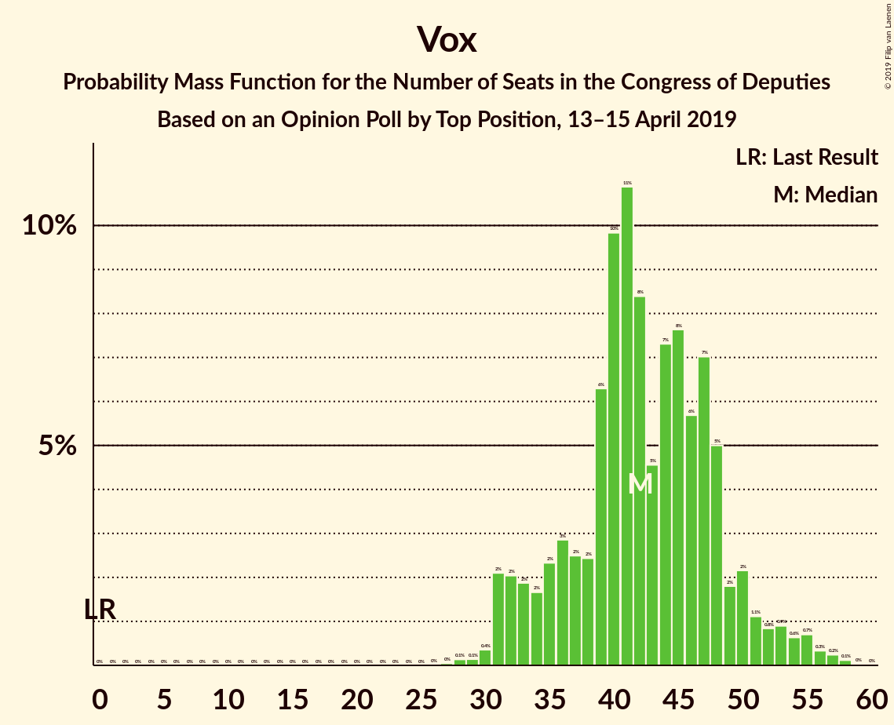
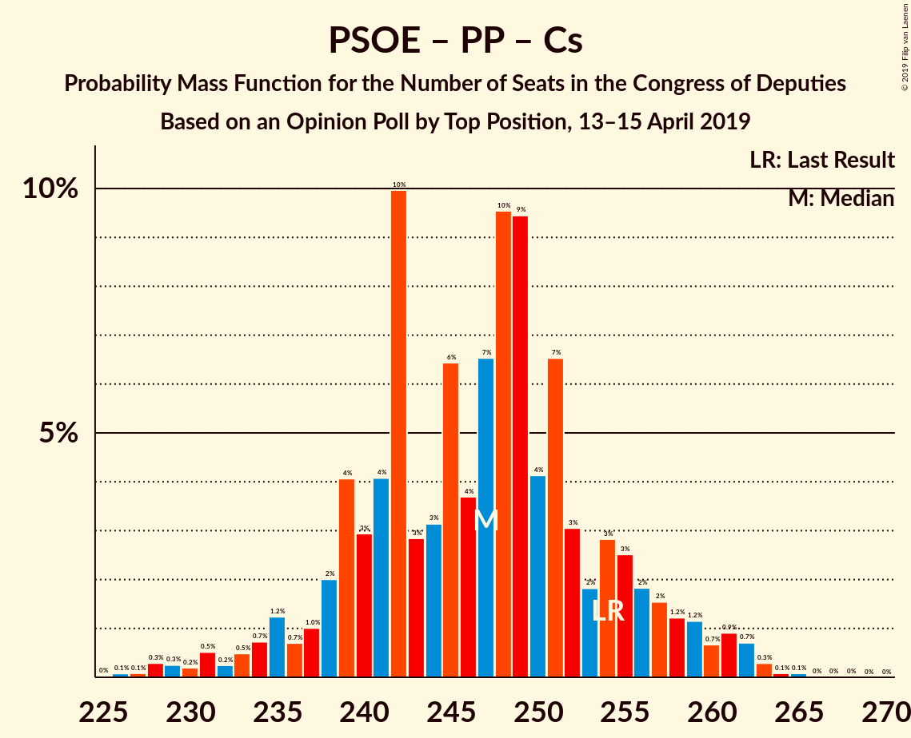
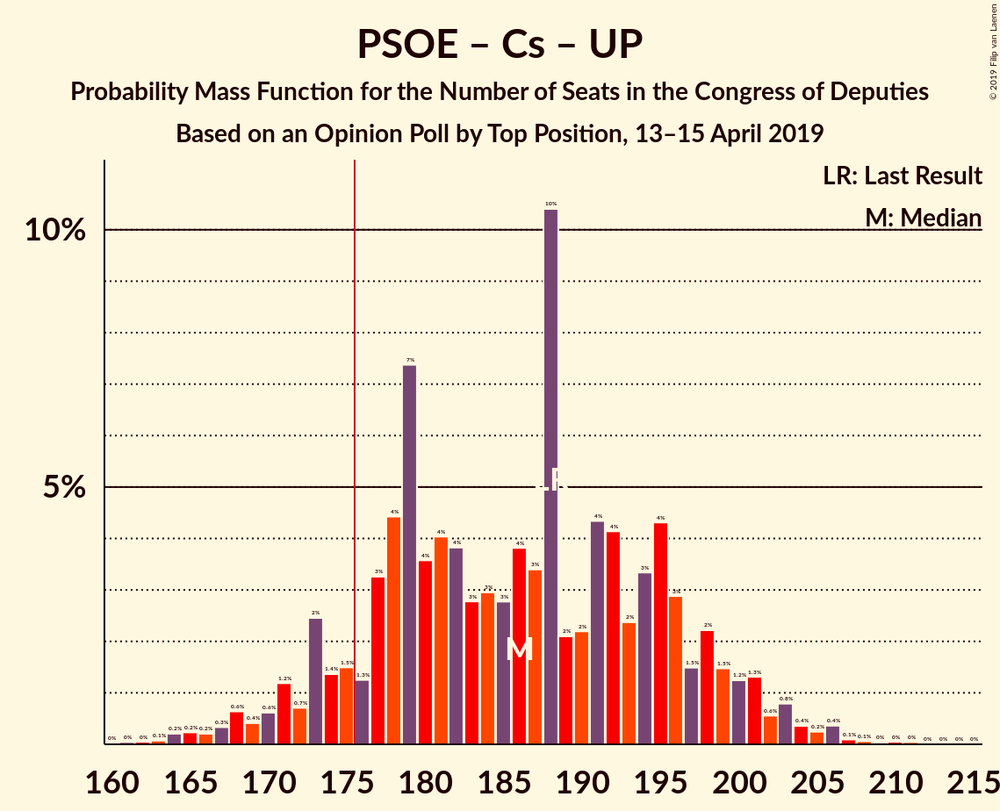

# Opinion Poll by Top Position, 13–15 April 2019

<a href="#voting-intentions">Voting Intentions</a> | <a href="#seats">Seats</a> | <a href="#coalitions">Coalitions</a> | <a href="#technical-information">Technical Information</a>

## Voting Intentions

### Confidence Intervals

| Party | Last Result | Poll Result | 80% Confidence Interval | 90% Confidence Interval | 95% Confidence Interval | 99% Confidence Interval |
|:-----:|:-----------:|:-----------:|:-----------------------:|:-----------------------:|:-----------------------:|:-----------------------:|
| Partido Socialista Obrero Español | 22.6% | 27.8% | 26.2–29.5% |25.8–30.0% |25.4–30.5% |24.6–31.3% |
| Partido Popular | 33.0% | 22.3% | 20.8–23.9% |20.4–24.4% |20.1–24.8% |19.4–25.6% |
| Vox | 0.2% | 14.2% | 12.9–15.5% |12.6–15.9% |12.3–16.3% |11.7–16.9% |
| Ciudadanos–Partido de la Ciudadanía | 13.1% | 13.1% | 11.9–14.4% |11.6–14.8% |11.3–15.1% |10.7–15.8% |
| Unidos Podemos | 21.2% | 12.2% | 11.0–13.5% |10.7–13.8% |10.4–14.1% |9.9–14.8% |
| Esquerra Republicana de Catalunya–Catalunya Sí | 2.7% | 3.2% | 2.6–3.9% |2.4–4.1% |2.3–4.3% |2.1–4.7% |
| Partit Demòcrata Europeu Català | 2.0% | 1.6% | 1.2–2.2% |1.1–2.3% |1.0–2.5% |0.9–2.8% |
| Euzko Alderdi Jeltzalea/Partido Nacionalista Vasco | 1.2% | 1.2% | 0.9–1.7% |0.8–1.8% |0.7–2.0% |0.6–2.2% |

*Note:* The poll result column reflects the actual value used in the calculations. Published results may vary slightly, and in addition be rounded to fewer digits.

## Seats

### Confidence Intervals

| Party | Last Result | Median | 80% Confidence Interval | 90% Confidence Interval | 95% Confidence Interval | 99% Confidence Interval |
|:-----:|:-----------:|:------:|:-----------------------:|:-----------------------:|:-----------------------:|:-----------------------:|
| <a href="#partido-socialista-obrero-español">Partido Socialista Obrero Español</a> | 85 | 120 | 109–129 |107–131 |105–134 |100–137 |
| <a href="#partido-popular">Partido Popular</a> | 137 | 91 | 80–101 |78–104 |77–106 |73–110 |
| <a href="#vox">Vox</a> | 0 | 42 | 36–48 |33–50 |31–53 |30–56 |
| <a href="#ciudadanos–partido-de-la-ciudadanía">Ciudadanos–Partido de la Ciudadanía</a> | 32 | 37 | 27–44 |26–46 |24–47 |21–50 |
| <a href="#unidos-podemos">Unidos Podemos</a> | 71 | 30 | 25–36 |24–37 |23–38 |23–41 |
| <a href="#esquerra-republicana-de-catalunya–catalunya-sí">Esquerra Republicana de Catalunya–Catalunya Sí</a> | 9 | 14 | 11–16 |11–17 |10–18 |9–20 |
| <a href="#partit-demòcrata-europeu-català">Partit Demòcrata Europeu Català</a> | 8 | 7 | 5–8 |4–9 |3–10 |3–12 |
| <a href="#euzko-alderdi-jeltzalea/partido-nacionalista-vasco">Euzko Alderdi Jeltzalea/Partido Nacionalista Vasco</a> | 5 | 6 | 3–8 |3–8 |3–9 |3–10 |

### Partido Socialista Obrero Español

*For a full overview of the results for this party, see the [Partido Socialista Obrero Español](party-partidosocialistaobreroespañol.html) page.*

| Number of Seats | Probability | Accumulated | Special Marks |
|:---------------:|:-----------:|:-----------:|:-------------:|
| 85 | 0% | 100% | Last Result |
| 86 | 0% | 100% |  |
| 87 | 0% | 100% |  |
| 88 | 0% | 100% |  |
| 89 | 0% | 100% |  |
| 90 | 0% | 100% |  |
| 91 | 0% | 100% |  |
| 92 | 0% | 100% |  |
| 93 | 0% | 100% |  |
| 94 | 0% | 100% |  |
| 95 | 0% | 100% |  |
| 96 | 0% | 100% |  |
| 97 | 0.1% | 99.9% |  |
| 98 | 0.1% | 99.9% |  |
| 99 | 0.2% | 99.8% |  |
| 100 | 0.3% | 99.6% |  |
| 101 | 0.2% | 99.3% |  |
| 102 | 0.2% | 99.1% |  |
| 103 | 0.3% | 98.8% |  |
| 104 | 0.9% | 98.6% |  |
| 105 | 0.9% | 98% |  |
| 106 | 1.4% | 97% |  |
| 107 | 1.2% | 95% |  |
| 108 | 2% | 94% |  |
| 109 | 6% | 92% |  |
| 110 | 2% | 86% |  |
| 111 | 2% | 84% |  |
| 112 | 2% | 83% |  |
| 113 | 3% | 81% |  |
| 114 | 5% | 78% |  |
| 115 | 3% | 73% |  |
| 116 | 10% | 70% |  |
| 117 | 2% | 60% |  |
| 118 | 1.3% | 58% |  |
| 119 | 6% | 57% |  |
| 120 | 3% | 51% | Median |
| 121 | 8% | 47% |  |
| 122 | 6% | 40% |  |
| 123 | 8% | 33% |  |
| 124 | 3% | 26% |  |
| 125 | 2% | 23% |  |
| 126 | 4% | 21% |  |
| 127 | 4% | 17% |  |
| 128 | 3% | 13% |  |
| 129 | 5% | 11% |  |
| 130 | 0.5% | 6% |  |
| 131 | 0.6% | 5% |  |
| 132 | 1.0% | 4% |  |
| 133 | 0.9% | 3% |  |
| 134 | 1.1% | 3% |  |
| 135 | 0.3% | 2% |  |
| 136 | 0.2% | 1.3% |  |
| 137 | 0.8% | 1.1% |  |
| 138 | 0.1% | 0.3% |  |
| 139 | 0.1% | 0.3% |  |
| 140 | 0.1% | 0.2% |  |
| 141 | 0% | 0.1% |  |
| 142 | 0% | 0.1% |  |
| 143 | 0% | 0% |  |

### Partido Popular

*For a full overview of the results for this party, see the [Partido Popular](party-partidopopular.html) page.*

| Number of Seats | Probability | Accumulated | Special Marks |
|:---------------:|:-----------:|:-----------:|:-------------:|
| 70 | 0% | 100% |  |
| 71 | 0.1% | 99.9% |  |
| 72 | 0.2% | 99.9% |  |
| 73 | 0.2% | 99.7% |  |
| 74 | 0.1% | 99.5% |  |
| 75 | 0.3% | 99.3% |  |
| 76 | 0.7% | 99.0% |  |
| 77 | 0.9% | 98% |  |
| 78 | 4% | 97% |  |
| 79 | 1.4% | 94% |  |
| 80 | 4% | 92% |  |
| 81 | 2% | 88% |  |
| 82 | 5% | 87% |  |
| 83 | 4% | 82% |  |
| 84 | 2% | 79% |  |
| 85 | 2% | 76% |  |
| 86 | 7% | 74% |  |
| 87 | 3% | 67% |  |
| 88 | 3% | 64% |  |
| 89 | 2% | 61% |  |
| 90 | 2% | 59% |  |
| 91 | 9% | 57% | Median |
| 92 | 4% | 48% |  |
| 93 | 5% | 44% |  |
| 94 | 1.2% | 40% |  |
| 95 | 3% | 38% |  |
| 96 | 3% | 35% |  |
| 97 | 7% | 32% |  |
| 98 | 2% | 25% |  |
| 99 | 9% | 22% |  |
| 100 | 2% | 14% |  |
| 101 | 2% | 12% |  |
| 102 | 2% | 10% |  |
| 103 | 0.8% | 8% |  |
| 104 | 2% | 7% |  |
| 105 | 2% | 5% |  |
| 106 | 0.6% | 3% |  |
| 107 | 0.4% | 2% |  |
| 108 | 0.8% | 2% |  |
| 109 | 0.1% | 0.8% |  |
| 110 | 0.2% | 0.7% |  |
| 111 | 0.1% | 0.5% |  |
| 112 | 0.2% | 0.4% |  |
| 113 | 0.1% | 0.2% |  |
| 114 | 0% | 0.1% |  |
| 115 | 0% | 0.1% |  |
| 116 | 0% | 0% |  |
| 117 | 0% | 0% |  |
| 118 | 0% | 0% |  |
| 119 | 0% | 0% |  |
| 120 | 0% | 0% |  |
| 121 | 0% | 0% |  |
| 122 | 0% | 0% |  |
| 123 | 0% | 0% |  |
| 124 | 0% | 0% |  |
| 125 | 0% | 0% |  |
| 126 | 0% | 0% |  |
| 127 | 0% | 0% |  |
| 128 | 0% | 0% |  |
| 129 | 0% | 0% |  |
| 130 | 0% | 0% |  |
| 131 | 0% | 0% |  |
| 132 | 0% | 0% |  |
| 133 | 0% | 0% |  |
| 134 | 0% | 0% |  |
| 135 | 0% | 0% |  |
| 136 | 0% | 0% |  |
| 137 | 0% | 0% | Last Result |

### Vox

*For a full overview of the results for this party, see the [Vox](party-vox.html) page.*

| Number of Seats | Probability | Accumulated | Special Marks |
|:---------------:|:-----------:|:-----------:|:-------------:|
| 0 | 0% | 100% | Last Result |
| 1 | 0% | 100% |  |
| 2 | 0% | 100% |  |
| 3 | 0% | 100% |  |
| 4 | 0% | 100% |  |
| 5 | 0% | 100% |  |
| 6 | 0% | 100% |  |
| 7 | 0% | 100% |  |
| 8 | 0% | 100% |  |
| 9 | 0% | 100% |  |
| 10 | 0% | 100% |  |
| 11 | 0% | 100% |  |
| 12 | 0% | 100% |  |
| 13 | 0% | 100% |  |
| 14 | 0% | 100% |  |
| 15 | 0% | 100% |  |
| 16 | 0% | 100% |  |
| 17 | 0% | 100% |  |
| 18 | 0% | 100% |  |
| 19 | 0% | 100% |  |
| 20 | 0% | 100% |  |
| 21 | 0% | 100% |  |
| 22 | 0% | 100% |  |
| 23 | 0% | 100% |  |
| 24 | 0% | 100% |  |
| 25 | 0% | 100% |  |
| 26 | 0% | 100% |  |
| 27 | 0.1% | 100% |  |
| 28 | 0.2% | 99.9% |  |
| 29 | 0.2% | 99.7% |  |
| 30 | 0.4% | 99.5% |  |
| 31 | 2% | 99.1% |  |
| 32 | 2% | 97% |  |
| 33 | 1.2% | 95% |  |
| 34 | 1.0% | 94% |  |
| 35 | 2% | 93% |  |
| 36 | 2% | 91% |  |
| 37 | 2% | 89% |  |
| 38 | 3% | 88% |  |
| 39 | 5% | 85% |  |
| 40 | 14% | 80% |  |
| 41 | 14% | 66% |  |
| 42 | 9% | 52% | Median |
| 43 | 6% | 43% |  |
| 44 | 7% | 37% |  |
| 45 | 9% | 30% |  |
| 46 | 4% | 21% |  |
| 47 | 5% | 16% |  |
| 48 | 2% | 11% |  |
| 49 | 1.4% | 9% |  |
| 50 | 3% | 7% |  |
| 51 | 0.8% | 5% |  |
| 52 | 1.1% | 4% |  |
| 53 | 0.7% | 3% |  |
| 54 | 0.7% | 2% |  |
| 55 | 0.7% | 1.3% |  |
| 56 | 0.3% | 0.6% |  |
| 57 | 0.1% | 0.3% |  |
| 58 | 0.1% | 0.2% |  |
| 59 | 0% | 0% |  |

### Ciudadanos–Partido de la Ciudadanía

*For a full overview of the results for this party, see the [Ciudadanos–Partido de la Ciudadanía](party-ciudadanos–partidodelaciudadanía.html) page.*

| Number of Seats | Probability | Accumulated | Special Marks |
|:---------------:|:-----------:|:-----------:|:-------------:|
| 19 | 0.1% | 100% |  |
| 20 | 0.2% | 99.9% |  |
| 21 | 0.3% | 99.7% |  |
| 22 | 0.3% | 99.3% |  |
| 23 | 0.9% | 99.0% |  |
| 24 | 1.0% | 98% |  |
| 25 | 2% | 97% |  |
| 26 | 3% | 96% |  |
| 27 | 3% | 93% |  |
| 28 | 3% | 90% |  |
| 29 | 5% | 87% |  |
| 30 | 4% | 82% |  |
| 31 | 1.1% | 78% |  |
| 32 | 1.1% | 77% | Last Result |
| 33 | 9% | 76% |  |
| 34 | 2% | 67% |  |
| 35 | 5% | 65% |  |
| 36 | 3% | 60% |  |
| 37 | 13% | 57% | Median |
| 38 | 4% | 44% |  |
| 39 | 7% | 40% |  |
| 40 | 3% | 33% |  |
| 41 | 8% | 30% |  |
| 42 | 3% | 22% |  |
| 43 | 4% | 19% |  |
| 44 | 6% | 14% |  |
| 45 | 2% | 9% |  |
| 46 | 4% | 6% |  |
| 47 | 1.1% | 3% |  |
| 48 | 0.8% | 2% |  |
| 49 | 0.4% | 1.0% |  |
| 50 | 0.2% | 0.6% |  |
| 51 | 0.1% | 0.4% |  |
| 52 | 0.1% | 0.3% |  |
| 53 | 0.1% | 0.2% |  |
| 54 | 0% | 0.1% |  |
| 55 | 0% | 0.1% |  |
| 56 | 0% | 0% |  |

### Unidos Podemos

*For a full overview of the results for this party, see the [Unidos Podemos](party-unidospodemos.html) page.*

| Number of Seats | Probability | Accumulated | Special Marks |
|:---------------:|:-----------:|:-----------:|:-------------:|
| 22 | 0.3% | 100% |  |
| 23 | 3% | 99.7% |  |
| 24 | 4% | 96% |  |
| 25 | 3% | 92% |  |
| 26 | 6% | 89% |  |
| 27 | 7% | 83% |  |
| 28 | 7% | 76% |  |
| 29 | 5% | 69% |  |
| 30 | 19% | 64% | Median |
| 31 | 4% | 45% |  |
| 32 | 10% | 41% |  |
| 33 | 6% | 31% |  |
| 34 | 4% | 25% |  |
| 35 | 5% | 21% |  |
| 36 | 9% | 16% |  |
| 37 | 3% | 7% |  |
| 38 | 1.2% | 4% |  |
| 39 | 1.1% | 2% |  |
| 40 | 0.4% | 1.3% |  |
| 41 | 0.5% | 0.9% |  |
| 42 | 0.1% | 0.4% |  |
| 43 | 0.2% | 0.3% |  |
| 44 | 0% | 0% |  |
| 45 | 0% | 0% |  |
| 46 | 0% | 0% |  |
| 47 | 0% | 0% |  |
| 48 | 0% | 0% |  |
| 49 | 0% | 0% |  |
| 50 | 0% | 0% |  |
| 51 | 0% | 0% |  |
| 52 | 0% | 0% |  |
| 53 | 0% | 0% |  |
| 54 | 0% | 0% |  |
| 55 | 0% | 0% |  |
| 56 | 0% | 0% |  |
| 57 | 0% | 0% |  |
| 58 | 0% | 0% |  |
| 59 | 0% | 0% |  |
| 60 | 0% | 0% |  |
| 61 | 0% | 0% |  |
| 62 | 0% | 0% |  |
| 63 | 0% | 0% |  |
| 64 | 0% | 0% |  |
| 65 | 0% | 0% |  |
| 66 | 0% | 0% |  |
| 67 | 0% | 0% |  |
| 68 | 0% | 0% |  |
| 69 | 0% | 0% |  |
| 70 | 0% | 0% |  |
| 71 | 0% | 0% | Last Result |

### Esquerra Republicana de Catalunya–Catalunya Sí

*For a full overview of the results for this party, see the [Esquerra Republicana de Catalunya–Catalunya Sí](party-esquerrarepublicanadecatalunya–catalunyasí.html) page.*

| Number of Seats | Probability | Accumulated | Special Marks |
|:---------------:|:-----------:|:-----------:|:-------------:|
| 8 | 0% | 100% |  |
| 9 | 2% | 99.9% | Last Result |
| 10 | 1.5% | 98% |  |
| 11 | 13% | 97% |  |
| 12 | 2% | 84% |  |
| 13 | 7% | 82% |  |
| 14 | 32% | 76% | Median |
| 15 | 28% | 44% |  |
| 16 | 9% | 16% |  |
| 17 | 4% | 7% |  |
| 18 | 1.1% | 3% |  |
| 19 | 1.2% | 2% |  |
| 20 | 0.6% | 0.8% |  |
| 21 | 0.2% | 0.2% |  |
| 22 | 0% | 0% |  |

### Partit Demòcrata Europeu Català

*For a full overview of the results for this party, see the [Partit Demòcrata Europeu Català](party-partitdemòcrataeuropeucatalà.html) page.*

| Number of Seats | Probability | Accumulated | Special Marks |
|:---------------:|:-----------:|:-----------:|:-------------:|
| 1 | 0.2% | 100% |  |
| 2 | 0.2% | 99.8% |  |
| 3 | 3% | 99.6% |  |
| 4 | 6% | 97% |  |
| 5 | 16% | 91% |  |
| 6 | 17% | 75% |  |
| 7 | 9% | 58% | Median |
| 8 | 41% | 49% | Last Result |
| 9 | 5% | 8% |  |
| 10 | 2% | 3% |  |
| 11 | 0.3% | 0.8% |  |
| 12 | 0.5% | 0.5% |  |
| 13 | 0% | 0.1% |  |
| 14 | 0% | 0% |  |

### Euzko Alderdi Jeltzalea/Partido Nacionalista Vasco

*For a full overview of the results for this party, see the [Euzko Alderdi Jeltzalea/Partido Nacionalista Vasco](party-euzkoalderdijeltzaleapartidonacionalistavasco.html) page.*

| Number of Seats | Probability | Accumulated | Special Marks |
|:---------------:|:-----------:|:-----------:|:-------------:|
| 2 | 0.4% | 100% |  |
| 3 | 10% | 99.6% |  |
| 4 | 14% | 90% |  |
| 5 | 19% | 76% | Last Result |
| 6 | 36% | 57% | Median |
| 7 | 2% | 21% |  |
| 8 | 14% | 19% |  |
| 9 | 4% | 4% |  |
| 10 | 0.7% | 0.7% |  |
| 11 | 0% | 0% |  |

## Coalitions

### Confidence Intervals

| Coalition | Last Result | Median | Majority? | 80% Confidence Interval | 90% Confidence Interval | 95% Confidence Interval | 99% Confidence Interval |
|:---------:|:-----------:|:------:|:---------:|:-----------------------:|:-----------------------:|:-----------------------:|:-----------------------:|
| Partido Socialista Obrero Español – Partido Popular – Ciudadanos–Partido de la Ciudadanía | 254 | 248 | 100% | 239–254 | 237–256 | 234–259 | 229–262 |
| Partido Socialista Obrero Español – Partido Popular | 222 | 211 | 100% | 200–221 | 198–224 | 195–226 | 190–230 |
| Partido Socialista Obrero Español – Ciudadanos–Partido de la Ciudadanía – Unidos Podemos | 188 | 187 | 92% | 177–196 | 173–199 | 170–201 | 165–206 |
| Partido Socialista Obrero Español – Unidos Podemos – Esquerra Republicana de Catalunya–Catalunya Sí – Partit Demòcrata Europeu Català | 173 | 172 | 25% | 160–180 | 158–182 | 156–185 | 151–190 |
| Partido Popular – Vox – Ciudadanos–Partido de la Ciudadanía | 169 | 168 | 23% | 161–180 | 158–184 | 155–185 | 151–190 |
| Partido Socialista Obrero Español – Ciudadanos–Partido de la Ciudadanía | 117 | 156 | 0.3% | 145–166 | 142–168 | 140–171 | 136–174 |
| Partido Socialista Obrero Español – Unidos Podemos – Euzko Alderdi Jeltzalea/Partido Nacionalista Vasco | 161 | 156 | 0.6% | 146–165 | 141–168 | 140–171 | 135–176 |
| Partido Socialista Obrero Español – Unidos Podemos | 156 | 151 | 0% | 139–159 | 136–162 | 134–165 | 129–170 |
| Partido Popular – Ciudadanos–Partido de la Ciudadanía – Euzko Alderdi Jeltzalea/Partido Nacionalista Vasco | 174 | 133 | 0% | 123–144 | 121–147 | 118–150 | 114–155 |
| Partido Popular – Vox | 137 | 133 | 0% | 123–143 | 121–147 | 118–150 | 115–154 |
| Partido Popular – Ciudadanos–Partido de la Ciudadanía | 169 | 128 | 0% | 117–139 | 115–142 | 112–143 | 109–149 |
| Partido Socialista Obrero Español | 85 | 120 | 0% | 109–129 | 107–131 | 105–134 | 100–137 |
| Partido Popular | 137 | 91 | 0% | 80–101 | 78–104 | 77–106 | 73–110 |

### Partido Socialista Obrero Español – Partido Popular – Ciudadanos–Partido de la Ciudadanía

| Number of Seats | Probability | Accumulated | Special Marks |
|:---------------:|:-----------:|:-----------:|:-------------:|
| 225 | 0% | 100% |  |
| 226 | 0% | 99.9% |  |
| 227 | 0.1% | 99.9% |  |
| 228 | 0.2% | 99.8% |  |
| 229 | 0.3% | 99.6% |  |
| 230 | 0.3% | 99.3% |  |
| 231 | 0.5% | 99.1% |  |
| 232 | 0.2% | 98.6% |  |
| 233 | 0.5% | 98% |  |
| 234 | 0.8% | 98% |  |
| 235 | 1.1% | 97% |  |
| 236 | 0.7% | 96% |  |
| 237 | 0.6% | 95% |  |
| 238 | 3% | 95% |  |
| 239 | 2% | 92% |  |
| 240 | 2% | 90% |  |
| 241 | 2% | 88% |  |
| 242 | 12% | 86% |  |
| 243 | 3% | 74% |  |
| 244 | 3% | 71% |  |
| 245 | 9% | 69% |  |
| 246 | 3% | 59% |  |
| 247 | 6% | 56% |  |
| 248 | 10% | 50% | Median |
| 249 | 11% | 41% |  |
| 250 | 6% | 30% |  |
| 251 | 7% | 24% |  |
| 252 | 3% | 17% |  |
| 253 | 2% | 14% |  |
| 254 | 3% | 11% | Last Result |
| 255 | 3% | 8% |  |
| 256 | 1.1% | 6% |  |
| 257 | 0.7% | 4% |  |
| 258 | 0.7% | 4% |  |
| 259 | 0.6% | 3% |  |
| 260 | 0.4% | 2% |  |
| 261 | 1.4% | 2% |  |
| 262 | 0.3% | 0.7% |  |
| 263 | 0.2% | 0.3% |  |
| 264 | 0.1% | 0.2% |  |
| 265 | 0% | 0.1% |  |
| 266 | 0% | 0% |  |

### Partido Socialista Obrero Español – Partido Popular

| Number of Seats | Probability | Accumulated | Special Marks |
|:---------------:|:-----------:|:-----------:|:-------------:|
| 185 | 0% | 100% |  |
| 186 | 0% | 99.9% |  |
| 187 | 0.2% | 99.9% |  |
| 188 | 0.1% | 99.7% |  |
| 189 | 0.1% | 99.7% |  |
| 190 | 0.2% | 99.6% |  |
| 191 | 0.4% | 99.4% |  |
| 192 | 0.4% | 99.0% |  |
| 193 | 0.3% | 98.6% |  |
| 194 | 0.6% | 98% |  |
| 195 | 0.4% | 98% |  |
| 196 | 0.9% | 97% |  |
| 197 | 1.1% | 96% |  |
| 198 | 1.2% | 95% |  |
| 199 | 3% | 94% |  |
| 200 | 1.4% | 91% |  |
| 201 | 7% | 90% |  |
| 202 | 2% | 82% |  |
| 203 | 3% | 80% |  |
| 204 | 3% | 77% |  |
| 205 | 3% | 74% |  |
| 206 | 3% | 71% |  |
| 207 | 3% | 68% |  |
| 208 | 5% | 65% |  |
| 209 | 3% | 60% |  |
| 210 | 3% | 57% |  |
| 211 | 5% | 54% | Median |
| 212 | 12% | 49% |  |
| 213 | 4% | 37% |  |
| 214 | 2% | 33% |  |
| 215 | 8% | 31% |  |
| 216 | 2% | 22% |  |
| 217 | 3% | 20% |  |
| 218 | 1.2% | 17% |  |
| 219 | 2% | 16% |  |
| 220 | 4% | 14% |  |
| 221 | 2% | 10% |  |
| 222 | 0.6% | 8% | Last Result |
| 223 | 0.9% | 7% |  |
| 224 | 3% | 7% |  |
| 225 | 1.2% | 4% |  |
| 226 | 0.3% | 3% |  |
| 227 | 0.9% | 2% |  |
| 228 | 0.3% | 1.4% |  |
| 229 | 0.5% | 1.1% |  |
| 230 | 0.2% | 0.6% |  |
| 231 | 0.1% | 0.4% |  |
| 232 | 0.2% | 0.3% |  |
| 233 | 0% | 0.1% |  |
| 234 | 0% | 0.1% |  |
| 235 | 0% | 0.1% |  |
| 236 | 0% | 0% |  |

### Partido Socialista Obrero Español – Ciudadanos–Partido de la Ciudadanía – Unidos Podemos

| Number of Seats | Probability | Accumulated | Special Marks |
|:---------------:|:-----------:|:-----------:|:-------------:|
| 160 | 0% | 100% |  |
| 161 | 0% | 99.9% |  |
| 162 | 0.1% | 99.9% |  |
| 163 | 0.1% | 99.9% |  |
| 164 | 0.1% | 99.8% |  |
| 165 | 0.2% | 99.7% |  |
| 166 | 0.3% | 99.5% |  |
| 167 | 0.2% | 99.2% |  |
| 168 | 0.8% | 99.0% |  |
| 169 | 0.3% | 98% |  |
| 170 | 0.4% | 98% |  |
| 171 | 0.8% | 97% |  |
| 172 | 0.5% | 97% |  |
| 173 | 1.3% | 96% |  |
| 174 | 1.2% | 95% |  |
| 175 | 2% | 94% |  |
| 176 | 2% | 92% | Majority |
| 177 | 3% | 90% |  |
| 178 | 2% | 87% |  |
| 179 | 9% | 85% |  |
| 180 | 5% | 76% |  |
| 181 | 5% | 71% |  |
| 182 | 5% | 67% |  |
| 183 | 1.4% | 61% |  |
| 184 | 2% | 60% |  |
| 185 | 4% | 58% |  |
| 186 | 3% | 55% |  |
| 187 | 4% | 52% | Median |
| 188 | 11% | 47% | Last Result |
| 189 | 0.9% | 36% |  |
| 190 | 1.4% | 35% |  |
| 191 | 4% | 34% |  |
| 192 | 7% | 30% |  |
| 193 | 2% | 23% |  |
| 194 | 4% | 22% |  |
| 195 | 4% | 17% |  |
| 196 | 5% | 13% |  |
| 197 | 1.2% | 8% |  |
| 198 | 1.4% | 7% |  |
| 199 | 1.4% | 6% |  |
| 200 | 0.6% | 4% |  |
| 201 | 1.4% | 4% |  |
| 202 | 0.4% | 2% |  |
| 203 | 0.4% | 2% |  |
| 204 | 0.3% | 1.3% |  |
| 205 | 0.2% | 0.9% |  |
| 206 | 0.4% | 0.7% |  |
| 207 | 0.1% | 0.3% |  |
| 208 | 0.1% | 0.2% |  |
| 209 | 0% | 0.1% |  |
| 210 | 0% | 0.1% |  |
| 211 | 0% | 0.1% |  |
| 212 | 0% | 0% |  |

### Partido Socialista Obrero Español – Unidos Podemos – Esquerra Republicana de Catalunya–Catalunya Sí – Partit Demòcrata Europeu Català

| Number of Seats | Probability | Accumulated | Special Marks |
|:---------------:|:-----------:|:-----------:|:-------------:|
| 145 | 0% | 100% |  |
| 146 | 0.1% | 99.9% |  |
| 147 | 0% | 99.9% |  |
| 148 | 0.1% | 99.9% |  |
| 149 | 0.1% | 99.8% |  |
| 150 | 0.2% | 99.7% |  |
| 151 | 0.3% | 99.5% |  |
| 152 | 0.2% | 99.3% |  |
| 153 | 0.5% | 99.1% |  |
| 154 | 0.6% | 98.6% |  |
| 155 | 0.3% | 98% |  |
| 156 | 1.0% | 98% |  |
| 157 | 1.1% | 97% |  |
| 158 | 2% | 96% |  |
| 159 | 2% | 93% |  |
| 160 | 4% | 92% |  |
| 161 | 2% | 87% |  |
| 162 | 1.3% | 85% |  |
| 163 | 1.2% | 83% |  |
| 164 | 3% | 82% |  |
| 165 | 3% | 79% |  |
| 166 | 3% | 76% |  |
| 167 | 3% | 73% |  |
| 168 | 3% | 70% |  |
| 169 | 8% | 67% |  |
| 170 | 5% | 59% |  |
| 171 | 4% | 54% | Median |
| 172 | 4% | 50% |  |
| 173 | 14% | 46% | Last Result |
| 174 | 2% | 31% |  |
| 175 | 5% | 29% |  |
| 176 | 3% | 25% | Majority |
| 177 | 5% | 22% |  |
| 178 | 3% | 16% |  |
| 179 | 2% | 13% |  |
| 180 | 2% | 11% |  |
| 181 | 1.2% | 9% |  |
| 182 | 3% | 8% |  |
| 183 | 0.8% | 5% |  |
| 184 | 1.1% | 4% |  |
| 185 | 0.6% | 3% |  |
| 186 | 0.3% | 2% |  |
| 187 | 1.3% | 2% |  |
| 188 | 0.1% | 0.8% |  |
| 189 | 0.1% | 0.7% |  |
| 190 | 0.3% | 0.6% |  |
| 191 | 0.1% | 0.4% |  |
| 192 | 0.1% | 0.3% |  |
| 193 | 0% | 0.2% |  |
| 194 | 0% | 0.1% |  |
| 195 | 0.1% | 0.1% |  |
| 196 | 0% | 0% |  |

### Partido Popular – Vox – Ciudadanos–Partido de la Ciudadanía

| Number of Seats | Probability | Accumulated | Special Marks |
|:---------------:|:-----------:|:-----------:|:-------------:|
| 146 | 0% | 100% |  |
| 147 | 0.1% | 99.9% |  |
| 148 | 0.1% | 99.9% |  |
| 149 | 0.1% | 99.8% |  |
| 150 | 0.1% | 99.7% |  |
| 151 | 0.4% | 99.6% |  |
| 152 | 0.1% | 99.3% |  |
| 153 | 1.3% | 99.2% |  |
| 154 | 0.3% | 98% |  |
| 155 | 0.7% | 98% |  |
| 156 | 0.8% | 97% |  |
| 157 | 0.7% | 96% |  |
| 158 | 1.0% | 95% |  |
| 159 | 2% | 94% |  |
| 160 | 2% | 92% |  |
| 161 | 3% | 90% |  |
| 162 | 3% | 88% |  |
| 163 | 4% | 85% |  |
| 164 | 6% | 81% |  |
| 165 | 4% | 75% |  |
| 166 | 3% | 71% |  |
| 167 | 4% | 68% |  |
| 168 | 14% | 64% |  |
| 169 | 2% | 49% | Last Result |
| 170 | 6% | 48% | Median |
| 171 | 2% | 42% |  |
| 172 | 2% | 40% |  |
| 173 | 10% | 38% |  |
| 174 | 2% | 28% |  |
| 175 | 3% | 26% |  |
| 176 | 4% | 23% | Majority |
| 177 | 2% | 19% |  |
| 178 | 2% | 17% |  |
| 179 | 2% | 16% |  |
| 180 | 4% | 14% |  |
| 181 | 2% | 10% |  |
| 182 | 1.1% | 7% |  |
| 183 | 1.0% | 6% |  |
| 184 | 2% | 5% |  |
| 185 | 1.2% | 3% |  |
| 186 | 0.8% | 2% |  |
| 187 | 0.1% | 1.3% |  |
| 188 | 0.3% | 1.1% |  |
| 189 | 0.3% | 0.9% |  |
| 190 | 0.2% | 0.6% |  |
| 191 | 0.1% | 0.4% |  |
| 192 | 0.1% | 0.2% |  |
| 193 | 0.1% | 0.1% |  |
| 194 | 0% | 0.1% |  |
| 195 | 0% | 0% |  |

### Partido Socialista Obrero Español – Ciudadanos–Partido de la Ciudadanía

| Number of Seats | Probability | Accumulated | Special Marks |
|:---------------:|:-----------:|:-----------:|:-------------:|
| 117 | 0% | 100% | Last Result |
| 118 | 0% | 100% |  |
| 119 | 0% | 100% |  |
| 120 | 0% | 100% |  |
| 121 | 0% | 100% |  |
| 122 | 0% | 100% |  |
| 123 | 0% | 100% |  |
| 124 | 0% | 100% |  |
| 125 | 0% | 100% |  |
| 126 | 0% | 100% |  |
| 127 | 0% | 100% |  |
| 128 | 0% | 100% |  |
| 129 | 0% | 100% |  |
| 130 | 0% | 100% |  |
| 131 | 0% | 99.9% |  |
| 132 | 0.1% | 99.9% |  |
| 133 | 0.1% | 99.9% |  |
| 134 | 0% | 99.7% |  |
| 135 | 0.1% | 99.7% |  |
| 136 | 0.1% | 99.6% |  |
| 137 | 0.4% | 99.4% |  |
| 138 | 0.3% | 99.0% |  |
| 139 | 0.8% | 98.8% |  |
| 140 | 0.8% | 98% |  |
| 141 | 0.5% | 97% |  |
| 142 | 3% | 97% |  |
| 143 | 1.3% | 94% |  |
| 144 | 3% | 93% |  |
| 145 | 0.9% | 90% |  |
| 146 | 2% | 89% |  |
| 147 | 3% | 87% |  |
| 148 | 0.7% | 84% |  |
| 149 | 8% | 83% |  |
| 150 | 6% | 75% |  |
| 151 | 2% | 69% |  |
| 152 | 5% | 67% |  |
| 153 | 4% | 63% |  |
| 154 | 3% | 58% |  |
| 155 | 3% | 55% |  |
| 156 | 3% | 51% |  |
| 157 | 1.1% | 48% | Median |
| 158 | 10% | 47% |  |
| 159 | 5% | 37% |  |
| 160 | 4% | 32% |  |
| 161 | 3% | 28% |  |
| 162 | 4% | 25% |  |
| 163 | 3% | 20% |  |
| 164 | 4% | 17% |  |
| 165 | 3% | 13% |  |
| 166 | 2% | 10% |  |
| 167 | 1.5% | 8% |  |
| 168 | 3% | 7% |  |
| 169 | 0.9% | 4% |  |
| 170 | 0.8% | 3% |  |
| 171 | 1.2% | 3% |  |
| 172 | 0.2% | 1.4% |  |
| 173 | 0.3% | 1.2% |  |
| 174 | 0.4% | 0.9% |  |
| 175 | 0.2% | 0.5% |  |
| 176 | 0.1% | 0.3% | Majority |
| 177 | 0.1% | 0.2% |  |
| 178 | 0% | 0.1% |  |
| 179 | 0% | 0.1% |  |
| 180 | 0% | 0.1% |  |
| 181 | 0% | 0% |  |

### Partido Socialista Obrero Español – Unidos Podemos – Euzko Alderdi Jeltzalea/Partido Nacionalista Vasco

| Number of Seats | Probability | Accumulated | Special Marks |
|:---------------:|:-----------:|:-----------:|:-------------:|
| 130 | 0% | 100% |  |
| 131 | 0% | 99.9% |  |
| 132 | 0.1% | 99.9% |  |
| 133 | 0% | 99.8% |  |
| 134 | 0.1% | 99.8% |  |
| 135 | 0.2% | 99.7% |  |
| 136 | 0.1% | 99.5% |  |
| 137 | 0.4% | 99.3% |  |
| 138 | 1.1% | 99.0% |  |
| 139 | 0.3% | 98% |  |
| 140 | 2% | 98% |  |
| 141 | 0.9% | 95% |  |
| 142 | 1.3% | 94% |  |
| 143 | 0.9% | 93% |  |
| 144 | 1.0% | 92% |  |
| 145 | 1.2% | 91% |  |
| 146 | 2% | 90% |  |
| 147 | 3% | 88% |  |
| 148 | 3% | 85% |  |
| 149 | 3% | 82% |  |
| 150 | 8% | 79% |  |
| 151 | 3% | 71% |  |
| 152 | 4% | 68% |  |
| 153 | 3% | 63% |  |
| 154 | 1.4% | 60% |  |
| 155 | 3% | 59% |  |
| 156 | 14% | 56% | Median |
| 157 | 4% | 42% |  |
| 158 | 4% | 38% |  |
| 159 | 6% | 35% |  |
| 160 | 3% | 28% |  |
| 161 | 4% | 26% | Last Result |
| 162 | 2% | 22% |  |
| 163 | 6% | 19% |  |
| 164 | 2% | 14% |  |
| 165 | 3% | 12% |  |
| 166 | 0.4% | 9% |  |
| 167 | 3% | 8% |  |
| 168 | 0.9% | 6% |  |
| 169 | 1.4% | 5% |  |
| 170 | 0.5% | 3% |  |
| 171 | 0.3% | 3% |  |
| 172 | 0.3% | 2% |  |
| 173 | 1.0% | 2% |  |
| 174 | 0.4% | 1.2% |  |
| 175 | 0.2% | 0.8% |  |
| 176 | 0.1% | 0.6% | Majority |
| 177 | 0.1% | 0.5% |  |
| 178 | 0.2% | 0.4% |  |
| 179 | 0.1% | 0.1% |  |
| 180 | 0% | 0.1% |  |
| 181 | 0% | 0% |  |

### Partido Socialista Obrero Español – Unidos Podemos

| Number of Seats | Probability | Accumulated | Special Marks |
|:---------------:|:-----------:|:-----------:|:-------------:|
| 124 | 0% | 100% |  |
| 125 | 0% | 99.9% |  |
| 126 | 0% | 99.9% |  |
| 127 | 0.1% | 99.9% |  |
| 128 | 0.2% | 99.8% |  |
| 129 | 0.2% | 99.6% |  |
| 130 | 0.2% | 99.5% |  |
| 131 | 0.2% | 99.3% |  |
| 132 | 0.4% | 99.1% |  |
| 133 | 0.7% | 98.7% |  |
| 134 | 1.3% | 98% |  |
| 135 | 0.8% | 97% |  |
| 136 | 2% | 96% |  |
| 137 | 0.8% | 94% |  |
| 138 | 2% | 93% |  |
| 139 | 1.5% | 91% |  |
| 140 | 1.2% | 90% |  |
| 141 | 1.4% | 89% |  |
| 142 | 5% | 87% |  |
| 143 | 2% | 82% |  |
| 144 | 5% | 80% |  |
| 145 | 3% | 75% |  |
| 146 | 8% | 73% |  |
| 147 | 2% | 64% |  |
| 148 | 1.4% | 62% |  |
| 149 | 4% | 61% |  |
| 150 | 6% | 56% | Median |
| 151 | 14% | 51% |  |
| 152 | 3% | 37% |  |
| 153 | 6% | 34% |  |
| 154 | 2% | 28% |  |
| 155 | 4% | 26% |  |
| 156 | 2% | 22% | Last Result |
| 157 | 3% | 20% |  |
| 158 | 5% | 17% |  |
| 159 | 2% | 12% |  |
| 160 | 2% | 10% |  |
| 161 | 2% | 8% |  |
| 162 | 2% | 6% |  |
| 163 | 0.9% | 4% |  |
| 164 | 0.7% | 3% |  |
| 165 | 0.2% | 3% |  |
| 166 | 0.2% | 2% |  |
| 167 | 1.0% | 2% |  |
| 168 | 0.5% | 1.2% |  |
| 169 | 0.1% | 0.7% |  |
| 170 | 0.1% | 0.5% |  |
| 171 | 0.1% | 0.5% |  |
| 172 | 0.3% | 0.4% |  |
| 173 | 0.1% | 0.2% |  |
| 174 | 0% | 0.1% |  |
| 175 | 0% | 0.1% |  |
| 176 | 0% | 0% | Majority |

### Partido Popular – Ciudadanos–Partido de la Ciudadanía – Euzko Alderdi Jeltzalea/Partido Nacionalista Vasco

| Number of Seats | Probability | Accumulated | Special Marks |
|:---------------:|:-----------:|:-----------:|:-------------:|
| 109 | 0% | 100% |  |
| 110 | 0% | 99.9% |  |
| 111 | 0% | 99.9% |  |
| 112 | 0.2% | 99.9% |  |
| 113 | 0.1% | 99.7% |  |
| 114 | 0.3% | 99.6% |  |
| 115 | 0.2% | 99.3% |  |
| 116 | 0.4% | 99.2% |  |
| 117 | 1.0% | 98.8% |  |
| 118 | 0.6% | 98% |  |
| 119 | 0.7% | 97% |  |
| 120 | 1.2% | 97% |  |
| 121 | 2% | 95% |  |
| 122 | 2% | 94% |  |
| 123 | 2% | 91% |  |
| 124 | 3% | 89% |  |
| 125 | 3% | 87% |  |
| 126 | 1.4% | 84% |  |
| 127 | 4% | 82% |  |
| 128 | 9% | 79% |  |
| 129 | 6% | 70% |  |
| 130 | 6% | 64% |  |
| 131 | 2% | 58% |  |
| 132 | 0.8% | 56% |  |
| 133 | 10% | 55% |  |
| 134 | 4% | 46% | Median |
| 135 | 3% | 42% |  |
| 136 | 8% | 39% |  |
| 137 | 3% | 31% |  |
| 138 | 2% | 28% |  |
| 139 | 2% | 26% |  |
| 140 | 2% | 24% |  |
| 141 | 2% | 22% |  |
| 142 | 6% | 20% |  |
| 143 | 2% | 14% |  |
| 144 | 2% | 11% |  |
| 145 | 1.1% | 10% |  |
| 146 | 3% | 9% |  |
| 147 | 2% | 6% |  |
| 148 | 0.5% | 4% |  |
| 149 | 0.4% | 3% |  |
| 150 | 0.6% | 3% |  |
| 151 | 0.6% | 2% |  |
| 152 | 0.4% | 2% |  |
| 153 | 0.5% | 1.2% |  |
| 154 | 0.1% | 0.7% |  |
| 155 | 0.1% | 0.5% |  |
| 156 | 0.2% | 0.4% |  |
| 157 | 0.1% | 0.2% |  |
| 158 | 0% | 0.1% |  |
| 159 | 0% | 0.1% |  |
| 160 | 0% | 0.1% |  |
| 161 | 0% | 0% |  |
| 162 | 0% | 0% |  |
| 163 | 0% | 0% |  |
| 164 | 0% | 0% |  |
| 165 | 0% | 0% |  |
| 166 | 0% | 0% |  |
| 167 | 0% | 0% |  |
| 168 | 0% | 0% |  |
| 169 | 0% | 0% |  |
| 170 | 0% | 0% |  |
| 171 | 0% | 0% |  |
| 172 | 0% | 0% |  |
| 173 | 0% | 0% |  |
| 174 | 0% | 0% | Last Result |

### Partido Popular – Vox

| Number of Seats | Probability | Accumulated | Special Marks |
|:---------------:|:-----------:|:-----------:|:-------------:|
| 110 | 0% | 100% |  |
| 111 | 0% | 99.9% |  |
| 112 | 0% | 99.9% |  |
| 113 | 0.1% | 99.9% |  |
| 114 | 0.2% | 99.8% |  |
| 115 | 0.1% | 99.6% |  |
| 116 | 0.5% | 99.5% |  |
| 117 | 0.7% | 99.0% |  |
| 118 | 1.1% | 98% |  |
| 119 | 0.8% | 97% |  |
| 120 | 1.0% | 96% |  |
| 121 | 0.9% | 95% |  |
| 122 | 2% | 94% |  |
| 123 | 4% | 93% |  |
| 124 | 3% | 89% |  |
| 125 | 2% | 86% |  |
| 126 | 3% | 84% |  |
| 127 | 10% | 81% |  |
| 128 | 1.5% | 71% |  |
| 129 | 6% | 70% |  |
| 130 | 2% | 64% |  |
| 131 | 9% | 62% |  |
| 132 | 2% | 53% |  |
| 133 | 3% | 51% | Median |
| 134 | 4% | 48% |  |
| 135 | 3% | 45% |  |
| 136 | 3% | 42% |  |
| 137 | 4% | 39% | Last Result |
| 138 | 4% | 35% |  |
| 139 | 1.4% | 31% |  |
| 140 | 8% | 30% |  |
| 141 | 10% | 22% |  |
| 142 | 1.2% | 12% |  |
| 143 | 2% | 11% |  |
| 144 | 1.3% | 9% |  |
| 145 | 2% | 8% |  |
| 146 | 1.0% | 6% |  |
| 147 | 1.4% | 5% |  |
| 148 | 0.6% | 4% |  |
| 149 | 0.5% | 3% |  |
| 150 | 1.4% | 3% |  |
| 151 | 0.3% | 1.1% |  |
| 152 | 0.1% | 0.8% |  |
| 153 | 0.2% | 0.7% |  |
| 154 | 0.1% | 0.5% |  |
| 155 | 0.2% | 0.4% |  |
| 156 | 0.1% | 0.2% |  |
| 157 | 0% | 0.1% |  |
| 158 | 0.1% | 0.1% |  |
| 159 | 0% | 0% |  |

### Partido Popular – Ciudadanos–Partido de la Ciudadanía

| Number of Seats | Probability | Accumulated | Special Marks |
|:---------------:|:-----------:|:-----------:|:-------------:|
| 103 | 0% | 100% |  |
| 104 | 0% | 99.9% |  |
| 105 | 0% | 99.9% |  |
| 106 | 0.1% | 99.9% |  |
| 107 | 0.1% | 99.8% |  |
| 108 | 0.2% | 99.8% |  |
| 109 | 0.3% | 99.6% |  |
| 110 | 0.3% | 99.2% |  |
| 111 | 1.1% | 98.9% |  |
| 112 | 0.5% | 98% |  |
| 113 | 0.8% | 97% |  |
| 114 | 1.2% | 97% |  |
| 115 | 1.2% | 95% |  |
| 116 | 1.4% | 94% |  |
| 117 | 3% | 93% |  |
| 118 | 2% | 90% |  |
| 119 | 5% | 88% |  |
| 120 | 2% | 84% |  |
| 121 | 2% | 82% |  |
| 122 | 4% | 80% |  |
| 123 | 13% | 76% |  |
| 124 | 5% | 63% |  |
| 125 | 4% | 58% |  |
| 126 | 1.2% | 54% |  |
| 127 | 1.5% | 53% |  |
| 128 | 9% | 52% | Median |
| 129 | 2% | 42% |  |
| 130 | 2% | 40% |  |
| 131 | 3% | 38% |  |
| 132 | 8% | 35% |  |
| 133 | 3% | 27% |  |
| 134 | 3% | 23% |  |
| 135 | 1.4% | 21% |  |
| 136 | 4% | 19% |  |
| 137 | 3% | 15% |  |
| 138 | 1.4% | 12% |  |
| 139 | 2% | 11% |  |
| 140 | 2% | 9% |  |
| 141 | 2% | 7% |  |
| 142 | 2% | 6% |  |
| 143 | 1.0% | 3% |  |
| 144 | 0.3% | 2% |  |
| 145 | 0.6% | 2% |  |
| 146 | 0.3% | 1.3% |  |
| 147 | 0.2% | 1.0% |  |
| 148 | 0.2% | 0.8% |  |
| 149 | 0.3% | 0.6% |  |
| 150 | 0.1% | 0.3% |  |
| 151 | 0% | 0.2% |  |
| 152 | 0% | 0.1% |  |
| 153 | 0% | 0.1% |  |
| 154 | 0% | 0.1% |  |
| 155 | 0% | 0% |  |
| 156 | 0% | 0% |  |
| 157 | 0% | 0% |  |
| 158 | 0% | 0% |  |
| 159 | 0% | 0% |  |
| 160 | 0% | 0% |  |
| 161 | 0% | 0% |  |
| 162 | 0% | 0% |  |
| 163 | 0% | 0% |  |
| 164 | 0% | 0% |  |
| 165 | 0% | 0% |  |
| 166 | 0% | 0% |  |
| 167 | 0% | 0% |  |
| 168 | 0% | 0% |  |
| 169 | 0% | 0% | Last Result |

### Partido Socialista Obrero Español

| Number of Seats | Probability | Accumulated | Special Marks |
|:---------------:|:-----------:|:-----------:|:-------------:|
| 85 | 0% | 100% | Last Result |
| 86 | 0% | 100% |  |
| 87 | 0% | 100% |  |
| 88 | 0% | 100% |  |
| 89 | 0% | 100% |  |
| 90 | 0% | 100% |  |
| 91 | 0% | 100% |  |
| 92 | 0% | 100% |  |
| 93 | 0% | 100% |  |
| 94 | 0% | 100% |  |
| 95 | 0% | 100% |  |
| 96 | 0% | 100% |  |
| 97 | 0.1% | 99.9% |  |
| 98 | 0.1% | 99.9% |  |
| 99 | 0.2% | 99.8% |  |
| 100 | 0.3% | 99.6% |  |
| 101 | 0.2% | 99.3% |  |
| 102 | 0.2% | 99.1% |  |
| 103 | 0.3% | 98.8% |  |
| 104 | 0.9% | 98.6% |  |
| 105 | 0.9% | 98% |  |
| 106 | 1.4% | 97% |  |
| 107 | 1.2% | 95% |  |
| 108 | 2% | 94% |  |
| 109 | 6% | 92% |  |
| 110 | 2% | 86% |  |
| 111 | 2% | 84% |  |
| 112 | 2% | 83% |  |
| 113 | 3% | 81% |  |
| 114 | 5% | 78% |  |
| 115 | 3% | 73% |  |
| 116 | 10% | 70% |  |
| 117 | 2% | 60% |  |
| 118 | 1.3% | 58% |  |
| 119 | 6% | 57% |  |
| 120 | 3% | 51% | Median |
| 121 | 8% | 47% |  |
| 122 | 6% | 40% |  |
| 123 | 8% | 33% |  |
| 124 | 3% | 26% |  |
| 125 | 2% | 23% |  |
| 126 | 4% | 21% |  |
| 127 | 4% | 17% |  |
| 128 | 3% | 13% |  |
| 129 | 5% | 11% |  |
| 130 | 0.5% | 6% |  |
| 131 | 0.6% | 5% |  |
| 132 | 1.0% | 4% |  |
| 133 | 0.9% | 3% |  |
| 134 | 1.1% | 3% |  |
| 135 | 0.3% | 2% |  |
| 136 | 0.2% | 1.3% |  |
| 137 | 0.8% | 1.1% |  |
| 138 | 0.1% | 0.3% |  |
| 139 | 0.1% | 0.3% |  |
| 140 | 0.1% | 0.2% |  |
| 141 | 0% | 0.1% |  |
| 142 | 0% | 0.1% |  |
| 143 | 0% | 0% |  |

### Partido Popular

| Number of Seats | Probability | Accumulated | Special Marks |
|:---------------:|:-----------:|:-----------:|:-------------:|
| 70 | 0% | 100% |  |
| 71 | 0.1% | 99.9% |  |
| 72 | 0.2% | 99.9% |  |
| 73 | 0.2% | 99.7% |  |
| 74 | 0.1% | 99.5% |  |
| 75 | 0.3% | 99.3% |  |
| 76 | 0.7% | 99.0% |  |
| 77 | 0.9% | 98% |  |
| 78 | 4% | 97% |  |
| 79 | 1.4% | 94% |  |
| 80 | 4% | 92% |  |
| 81 | 2% | 88% |  |
| 82 | 5% | 87% |  |
| 83 | 4% | 82% |  |
| 84 | 2% | 79% |  |
| 85 | 2% | 76% |  |
| 86 | 7% | 74% |  |
| 87 | 3% | 67% |  |
| 88 | 3% | 64% |  |
| 89 | 2% | 61% |  |
| 90 | 2% | 59% |  |
| 91 | 9% | 57% | Median |
| 92 | 4% | 48% |  |
| 93 | 5% | 44% |  |
| 94 | 1.2% | 40% |  |
| 95 | 3% | 38% |  |
| 96 | 3% | 35% |  |
| 97 | 7% | 32% |  |
| 98 | 2% | 25% |  |
| 99 | 9% | 22% |  |
| 100 | 2% | 14% |  |
| 101 | 2% | 12% |  |
| 102 | 2% | 10% |  |
| 103 | 0.8% | 8% |  |
| 104 | 2% | 7% |  |
| 105 | 2% | 5% |  |
| 106 | 0.6% | 3% |  |
| 107 | 0.4% | 2% |  |
| 108 | 0.8% | 2% |  |
| 109 | 0.1% | 0.8% |  |
| 110 | 0.2% | 0.7% |  |
| 111 | 0.1% | 0.5% |  |
| 112 | 0.2% | 0.4% |  |
| 113 | 0.1% | 0.2% |  |
| 114 | 0% | 0.1% |  |
| 115 | 0% | 0.1% |  |
| 116 | 0% | 0% |  |
| 117 | 0% | 0% |  |
| 118 | 0% | 0% |  |
| 119 | 0% | 0% |  |
| 120 | 0% | 0% |  |
| 121 | 0% | 0% |  |
| 122 | 0% | 0% |  |
| 123 | 0% | 0% |  |
| 124 | 0% | 0% |  |
| 125 | 0% | 0% |  |
| 126 | 0% | 0% |  |
| 127 | 0% | 0% |  |
| 128 | 0% | 0% |  |
| 129 | 0% | 0% |  |
| 130 | 0% | 0% |  |
| 131 | 0% | 0% |  |
| 132 | 0% | 0% |  |
| 133 | 0% | 0% |  |
| 134 | 0% | 0% |  |
| 135 | 0% | 0% |  |
| 136 | 0% | 0% |  |
| 137 | 0% | 0% | Last Result |

## Technical Information

### Opinion Poll

+ **Polling firm:** Top Position
+ **Commissioner(s):** —
+ **Fieldwork period:** 13–15 April 2019

### Calculations

+ **Sample size:** 1200
+ **Simulations done:** 524,288
+ **Error estimate:** 0.72%

