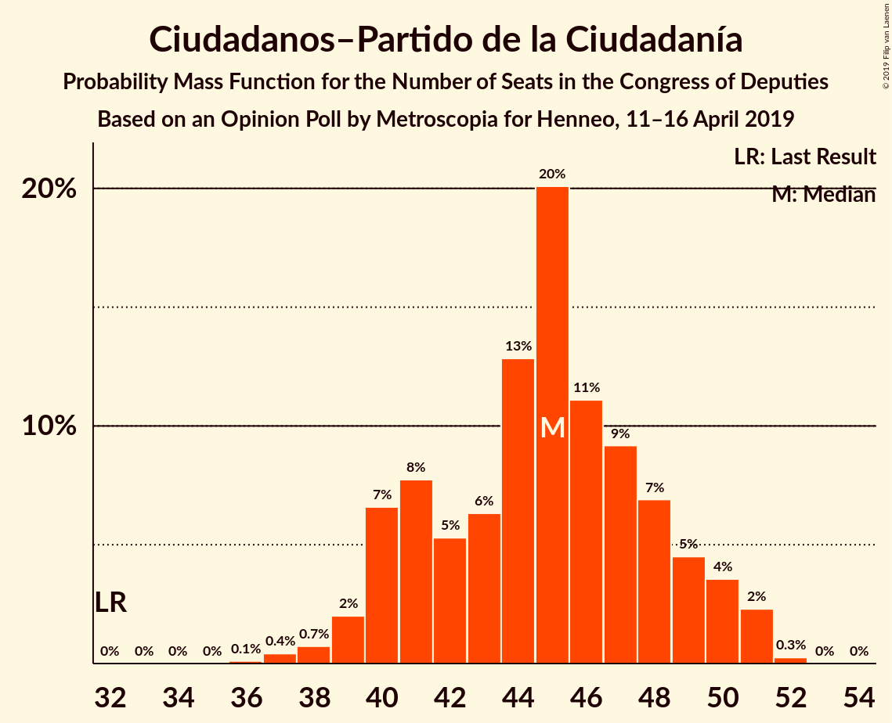
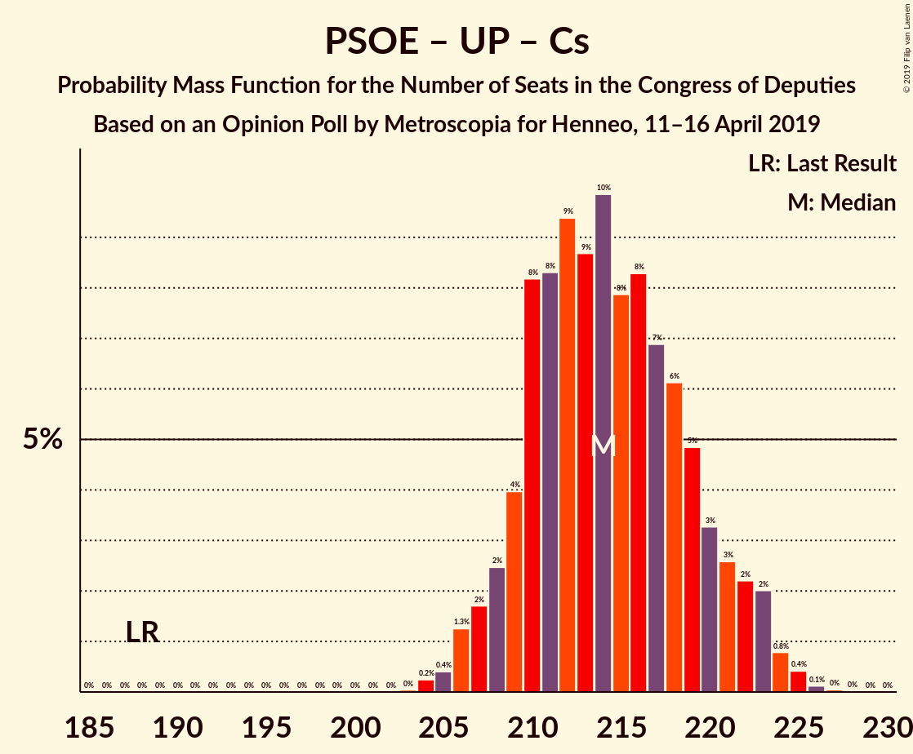
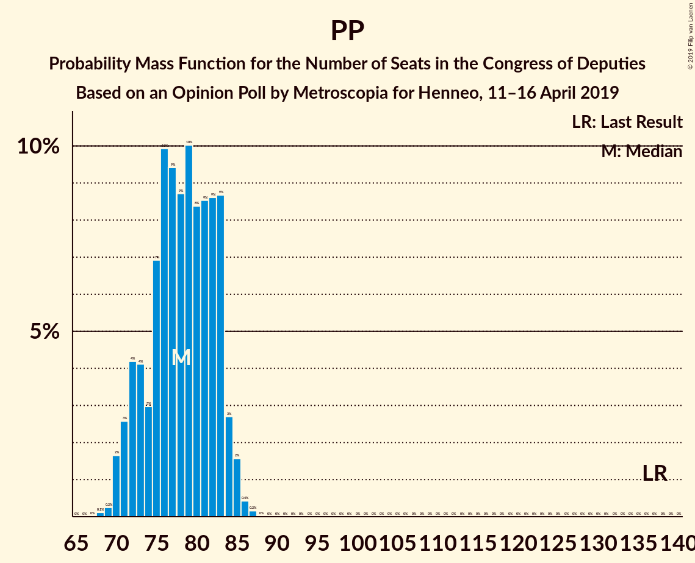

# Opinion Poll by Metroscopia for Henneo, 11–16 April 2019

<a href="#voting-intentions">Voting Intentions</a> | <a href="#seats">Seats</a> | <a href="#coalitions">Coalitions</a> | <a href="#technical-information">Technical Information</a>

## Voting Intentions

### Confidence Intervals

| Party | Last Result | Poll Result | 80% Confidence Interval | 90% Confidence Interval | 95% Confidence Interval | 99% Confidence Interval |
|:-----:|:-----------:|:-----------:|:-----------------------:|:-----------------------:|:-----------------------:|:-----------------------:|
| Partido Socialista Obrero Español | 22.6% | 29.1% | 28.3–30.0% |28.0–30.2% |27.8–30.4% |27.4–30.8% |
| Partido Popular | 33.0% | 19.6% | 18.9–20.4% |18.7–20.6% |18.5–20.8% |18.2–21.1% |
| Unidos Podemos | 21.2% | 14.3% | 13.7–15.0% |13.5–15.2% |13.3–15.3% |13.0–15.7% |
| Ciudadanos–Partido de la Ciudadanía | 13.1% | 14.2% | 13.6–14.9% |13.4–15.1% |13.2–15.2% |12.9–15.5% |
| Vox | 0.2% | 11.1% | 10.5–11.7% |10.4–11.9% |10.2–12.0% |10.0–12.3% |

*Note:* The poll result column reflects the actual value used in the calculations. Published results may vary slightly, and in addition be rounded to fewer digits.

## Seats

### Confidence Intervals

| Party | Last Result | Median | 80% Confidence Interval | 90% Confidence Interval | 95% Confidence Interval | 99% Confidence Interval |
|:-----:|:-----------:|:------:|:-----------------------:|:-----------------------:|:-----------------------:|:-----------------------:|
| <a href="#partido-socialista-obrero-español">Partido Socialista Obrero Español</a> | 85 | 130 | 124–135 |123–136 |121–136 |119–138 |
| <a href="#partido-popular">Partido Popular</a> | 137 | 78 | 73–83 |72–84 |71–84 |70–86 |
| <a href="#unidos-podemos">Unidos Podemos</a> | 71 | 40 | 37–43 |36–43 |36–44 |36–46 |
| <a href="#ciudadanos–partido-de-la-ciudadanía">Ciudadanos–Partido de la Ciudadanía</a> | 32 | 45 | 41–49 |40–50 |39–51 |37–51 |
| <a href="#vox">Vox</a> | 0 | 28 | 27–32 |27–33 |26–33 |24–34 |

### Partido Socialista Obrero Español

*For a full overview of the results for this party, see the [Partido Socialista Obrero Español](party-partidosocialistaobreroespañol.html) page.*

| Number of Seats | Probability | Accumulated | Special Marks |
|:---------------:|:-----------:|:-----------:|:-------------:|
| 85 | 0% | 100% | Last Result |
| 86 | 0% | 100% |  |
| 87 | 0% | 100% |  |
| 88 | 0% | 100% |  |
| 89 | 0% | 100% |  |
| 90 | 0% | 100% |  |
| 91 | 0% | 100% |  |
| 92 | 0% | 100% |  |
| 93 | 0% | 100% |  |
| 94 | 0% | 100% |  |
| 95 | 0% | 100% |  |
| 96 | 0% | 100% |  |
| 97 | 0% | 100% |  |
| 98 | 0% | 100% |  |
| 99 | 0% | 100% |  |
| 100 | 0% | 100% |  |
| 101 | 0% | 100% |  |
| 102 | 0% | 100% |  |
| 103 | 0% | 100% |  |
| 104 | 0% | 100% |  |
| 105 | 0% | 100% |  |
| 106 | 0% | 100% |  |
| 107 | 0% | 100% |  |
| 108 | 0% | 100% |  |
| 109 | 0% | 100% |  |
| 110 | 0% | 100% |  |
| 111 | 0% | 100% |  |
| 112 | 0% | 100% |  |
| 113 | 0% | 100% |  |
| 114 | 0% | 100% |  |
| 115 | 0% | 100% |  |
| 116 | 0% | 100% |  |
| 117 | 0% | 100% |  |
| 118 | 0.2% | 99.9% |  |
| 119 | 0.4% | 99.8% |  |
| 120 | 0.8% | 99.4% |  |
| 121 | 1.2% | 98.6% |  |
| 122 | 2% | 97% |  |
| 123 | 3% | 95% |  |
| 124 | 4% | 92% |  |
| 125 | 4% | 88% |  |
| 126 | 5% | 84% |  |
| 127 | 5% | 79% |  |
| 128 | 7% | 74% |  |
| 129 | 8% | 67% |  |
| 130 | 9% | 59% | Median |
| 131 | 10% | 50% |  |
| 132 | 10% | 40% |  |
| 133 | 7% | 30% |  |
| 134 | 10% | 24% |  |
| 135 | 6% | 13% |  |
| 136 | 6% | 7% |  |
| 137 | 0.7% | 1.2% |  |
| 138 | 0.4% | 0.5% |  |
| 139 | 0.1% | 0.2% |  |
| 140 | 0% | 0.1% |  |
| 141 | 0% | 0% |  |

### Partido Popular

*For a full overview of the results for this party, see the [Partido Popular](party-partidopopular.html) page.*

| Number of Seats | Probability | Accumulated | Special Marks |
|:---------------:|:-----------:|:-----------:|:-------------:|
| 68 | 0.1% | 100% |  |
| 69 | 0.3% | 99.9% |  |
| 70 | 2% | 99.6% |  |
| 71 | 3% | 98% |  |
| 72 | 4% | 95% |  |
| 73 | 4% | 91% |  |
| 74 | 3% | 87% |  |
| 75 | 7% | 84% |  |
| 76 | 10% | 77% |  |
| 77 | 10% | 67% |  |
| 78 | 8% | 57% | Median |
| 79 | 10% | 49% |  |
| 80 | 8% | 39% |  |
| 81 | 9% | 31% |  |
| 82 | 9% | 22% |  |
| 83 | 8% | 13% |  |
| 84 | 3% | 5% |  |
| 85 | 2% | 2% |  |
| 86 | 0.4% | 0.6% |  |
| 87 | 0.1% | 0.2% |  |
| 88 | 0% | 0% |  |
| 89 | 0% | 0% |  |
| 90 | 0% | 0% |  |
| 91 | 0% | 0% |  |
| 92 | 0% | 0% |  |
| 93 | 0% | 0% |  |
| 94 | 0% | 0% |  |
| 95 | 0% | 0% |  |
| 96 | 0% | 0% |  |
| 97 | 0% | 0% |  |
| 98 | 0% | 0% |  |
| 99 | 0% | 0% |  |
| 100 | 0% | 0% |  |
| 101 | 0% | 0% |  |
| 102 | 0% | 0% |  |
| 103 | 0% | 0% |  |
| 104 | 0% | 0% |  |
| 105 | 0% | 0% |  |
| 106 | 0% | 0% |  |
| 107 | 0% | 0% |  |
| 108 | 0% | 0% |  |
| 109 | 0% | 0% |  |
| 110 | 0% | 0% |  |
| 111 | 0% | 0% |  |
| 112 | 0% | 0% |  |
| 113 | 0% | 0% |  |
| 114 | 0% | 0% |  |
| 115 | 0% | 0% |  |
| 116 | 0% | 0% |  |
| 117 | 0% | 0% |  |
| 118 | 0% | 0% |  |
| 119 | 0% | 0% |  |
| 120 | 0% | 0% |  |
| 121 | 0% | 0% |  |
| 122 | 0% | 0% |  |
| 123 | 0% | 0% |  |
| 124 | 0% | 0% |  |
| 125 | 0% | 0% |  |
| 126 | 0% | 0% |  |
| 127 | 0% | 0% |  |
| 128 | 0% | 0% |  |
| 129 | 0% | 0% |  |
| 130 | 0% | 0% |  |
| 131 | 0% | 0% |  |
| 132 | 0% | 0% |  |
| 133 | 0% | 0% |  |
| 134 | 0% | 0% |  |
| 135 | 0% | 0% |  |
| 136 | 0% | 0% |  |
| 137 | 0% | 0% | Last Result |

### Unidos Podemos

*For a full overview of the results for this party, see the [Unidos Podemos](party-unidospodemos.html) page.*

| Number of Seats | Probability | Accumulated | Special Marks |
|:---------------:|:-----------:|:-----------:|:-------------:|
| 34 | 0.1% | 100% |  |
| 35 | 0.3% | 99.9% |  |
| 36 | 6% | 99.6% |  |
| 37 | 22% | 94% |  |
| 38 | 10% | 72% |  |
| 39 | 9% | 62% |  |
| 40 | 14% | 53% | Median |
| 41 | 18% | 39% |  |
| 42 | 9% | 21% |  |
| 43 | 9% | 12% |  |
| 44 | 1.5% | 3% |  |
| 45 | 0.7% | 2% |  |
| 46 | 0.7% | 1.0% |  |
| 47 | 0.2% | 0.3% |  |
| 48 | 0.1% | 0.1% |  |
| 49 | 0% | 0% |  |
| 50 | 0% | 0% |  |
| 51 | 0% | 0% |  |
| 52 | 0% | 0% |  |
| 53 | 0% | 0% |  |
| 54 | 0% | 0% |  |
| 55 | 0% | 0% |  |
| 56 | 0% | 0% |  |
| 57 | 0% | 0% |  |
| 58 | 0% | 0% |  |
| 59 | 0% | 0% |  |
| 60 | 0% | 0% |  |
| 61 | 0% | 0% |  |
| 62 | 0% | 0% |  |
| 63 | 0% | 0% |  |
| 64 | 0% | 0% |  |
| 65 | 0% | 0% |  |
| 66 | 0% | 0% |  |
| 67 | 0% | 0% |  |
| 68 | 0% | 0% |  |
| 69 | 0% | 0% |  |
| 70 | 0% | 0% |  |
| 71 | 0% | 0% | Last Result |

### Ciudadanos–Partido de la Ciudadanía

*For a full overview of the results for this party, see the [Ciudadanos–Partido de la Ciudadanía](party-ciudadanos–partidodelaciudadanía.html) page.*

| Number of Seats | Probability | Accumulated | Special Marks |
|:---------------:|:-----------:|:-----------:|:-------------:|
| 32 | 0% | 100% | Last Result |
| 33 | 0% | 100% |  |
| 34 | 0% | 100% |  |
| 35 | 0% | 100% |  |
| 36 | 0.1% | 100% |  |
| 37 | 0.4% | 99.9% |  |
| 38 | 0.7% | 99.4% |  |
| 39 | 2% | 98.8% |  |
| 40 | 7% | 97% |  |
| 41 | 8% | 90% |  |
| 42 | 5% | 82% |  |
| 43 | 6% | 77% |  |
| 44 | 13% | 71% |  |
| 45 | 19% | 58% | Median |
| 46 | 12% | 39% |  |
| 47 | 9% | 27% |  |
| 48 | 7% | 18% |  |
| 49 | 4% | 11% |  |
| 50 | 4% | 6% |  |
| 51 | 2% | 3% |  |
| 52 | 0.3% | 0.3% |  |
| 53 | 0% | 0% |  |

### Vox

*For a full overview of the results for this party, see the [Vox](party-vox.html) page.*

| Number of Seats | Probability | Accumulated | Special Marks |
|:---------------:|:-----------:|:-----------:|:-------------:|
| 0 | 0% | 100% | Last Result |
| 1 | 0% | 100% |  |
| 2 | 0% | 100% |  |
| 3 | 0% | 100% |  |
| 4 | 0% | 100% |  |
| 5 | 0% | 100% |  |
| 6 | 0% | 100% |  |
| 7 | 0% | 100% |  |
| 8 | 0% | 100% |  |
| 9 | 0% | 100% |  |
| 10 | 0% | 100% |  |
| 11 | 0% | 100% |  |
| 12 | 0% | 100% |  |
| 13 | 0% | 100% |  |
| 14 | 0% | 100% |  |
| 15 | 0% | 100% |  |
| 16 | 0% | 100% |  |
| 17 | 0% | 100% |  |
| 18 | 0% | 100% |  |
| 19 | 0% | 100% |  |
| 20 | 0% | 100% |  |
| 21 | 0% | 100% |  |
| 22 | 0% | 100% |  |
| 23 | 0.2% | 100% |  |
| 24 | 0.6% | 99.8% |  |
| 25 | 1.3% | 99.2% |  |
| 26 | 2% | 98% |  |
| 27 | 13% | 96% |  |
| 28 | 51% | 83% | Median |
| 29 | 8% | 31% |  |
| 30 | 7% | 23% |  |
| 31 | 5% | 16% |  |
| 32 | 3% | 11% |  |
| 33 | 6% | 8% |  |
| 34 | 2% | 2% |  |
| 35 | 0.2% | 0.2% |  |
| 36 | 0% | 0.1% |  |
| 37 | 0% | 0% |  |

## Coalitions

### Confidence Intervals

| Coalition | Last Result | Median | Majority? | 80% Confidence Interval | 90% Confidence Interval | 95% Confidence Interval | 99% Confidence Interval |
|:---------:|:-----------:|:------:|:---------:|:-----------------------:|:-----------------------:|:-----------------------:|:-----------------------:|
| Partido Socialista Obrero Español – Partido Popular – Ciudadanos–Partido de la Ciudadanía | 254 | 253 | 100% | 249–256 | 248–257 | 247–258 | 245–259 |
| Partido Socialista Obrero Español – Unidos Podemos – Ciudadanos–Partido de la Ciudadanía | 188 | 214 | 100% | 209–220 | 208–222 | 207–223 | 205–225 |
| Partido Socialista Obrero Español – Partido Popular | 222 | 208 | 100% | 203–213 | 201–214 | 200–215 | 198–216 |
| Partido Socialista Obrero Español – Ciudadanos–Partido de la Ciudadanía | 117 | 175 | 43% | 170–180 | 168–181 | 167–183 | 166–185 |
| Partido Socialista Obrero Español – Unidos Podemos | 156 | 170 | 10% | 164–176 | 162–177 | 161–178 | 158–180 |
| Partido Popular – Ciudadanos–Partido de la Ciudadanía – Vox | 169 | 152 | 0% | 146–157 | 145–158 | 144–160 | 142–162 |
| Partido Socialista Obrero Español | 85 | 130 | 0% | 124–135 | 123–136 | 121–136 | 119–138 |
| Partido Popular – Ciudadanos–Partido de la Ciudadanía | 169 | 123 | 0% | 117–128 | 116–130 | 115–131 | 114–134 |
| Partido Popular – Vox | 137 | 107 | 0% | 101–111 | 100–113 | 99–114 | 97–115 |
| Partido Popular | 137 | 78 | 0% | 73–83 | 72–84 | 71–84 | 70–86 |

### Partido Socialista Obrero Español – Partido Popular – Ciudadanos–Partido de la Ciudadanía

| Number of Seats | Probability | Accumulated | Special Marks |
|:---------------:|:-----------:|:-----------:|:-------------:|
| 243 | 0.1% | 100% |  |
| 244 | 0.3% | 99.9% |  |
| 245 | 0.4% | 99.6% |  |
| 246 | 1.4% | 99.2% |  |
| 247 | 3% | 98% |  |
| 248 | 3% | 95% |  |
| 249 | 4% | 92% |  |
| 250 | 5% | 89% |  |
| 251 | 11% | 83% |  |
| 252 | 10% | 73% |  |
| 253 | 17% | 62% | Median |
| 254 | 15% | 45% | Last Result |
| 255 | 12% | 30% |  |
| 256 | 11% | 18% |  |
| 257 | 4% | 7% |  |
| 258 | 2% | 3% |  |
| 259 | 0.5% | 0.7% |  |
| 260 | 0.1% | 0.2% |  |
| 261 | 0.1% | 0.1% |  |
| 262 | 0% | 0% |  |

### Partido Socialista Obrero Español – Unidos Podemos – Ciudadanos–Partido de la Ciudadanía

| Number of Seats | Probability | Accumulated | Special Marks |
|:---------------:|:-----------:|:-----------:|:-------------:|
| 188 | 0% | 100% | Last Result |
| 189 | 0% | 100% |  |
| 190 | 0% | 100% |  |
| 191 | 0% | 100% |  |
| 192 | 0% | 100% |  |
| 193 | 0% | 100% |  |
| 194 | 0% | 100% |  |
| 195 | 0% | 100% |  |
| 196 | 0% | 100% |  |
| 197 | 0% | 100% |  |
| 198 | 0% | 100% |  |
| 199 | 0% | 100% |  |
| 200 | 0% | 100% |  |
| 201 | 0% | 100% |  |
| 202 | 0% | 100% |  |
| 203 | 0% | 100% |  |
| 204 | 0.2% | 99.9% |  |
| 205 | 0.4% | 99.7% |  |
| 206 | 1.2% | 99.3% |  |
| 207 | 2% | 98% |  |
| 208 | 2% | 96% |  |
| 209 | 4% | 94% |  |
| 210 | 8% | 90% |  |
| 211 | 8% | 82% |  |
| 212 | 10% | 74% |  |
| 213 | 9% | 64% |  |
| 214 | 9% | 55% |  |
| 215 | 8% | 46% | Median |
| 216 | 8% | 38% |  |
| 217 | 7% | 30% |  |
| 218 | 7% | 23% |  |
| 219 | 5% | 16% |  |
| 220 | 3% | 12% |  |
| 221 | 2% | 8% |  |
| 222 | 3% | 6% |  |
| 223 | 2% | 3% |  |
| 224 | 0.8% | 1.4% |  |
| 225 | 0.5% | 0.6% |  |
| 226 | 0.1% | 0.2% |  |
| 227 | 0% | 0.1% |  |
| 228 | 0% | 0% |  |

### Partido Socialista Obrero Español – Partido Popular

| Number of Seats | Probability | Accumulated | Special Marks |
|:---------------:|:-----------:|:-----------:|:-------------:|
| 196 | 0% | 100% |  |
| 197 | 0.3% | 99.9% |  |
| 198 | 0.5% | 99.7% |  |
| 199 | 0.8% | 99.2% |  |
| 200 | 1.3% | 98% |  |
| 201 | 2% | 97% |  |
| 202 | 3% | 95% |  |
| 203 | 4% | 92% |  |
| 204 | 5% | 89% |  |
| 205 | 6% | 83% |  |
| 206 | 8% | 77% |  |
| 207 | 10% | 69% |  |
| 208 | 12% | 59% | Median |
| 209 | 11% | 47% |  |
| 210 | 7% | 36% |  |
| 211 | 8% | 29% |  |
| 212 | 8% | 20% |  |
| 213 | 4% | 13% |  |
| 214 | 4% | 9% |  |
| 215 | 3% | 4% |  |
| 216 | 0.7% | 1.1% |  |
| 217 | 0.3% | 0.4% |  |
| 218 | 0.1% | 0.1% |  |
| 219 | 0% | 0% |  |
| 220 | 0% | 0% |  |
| 221 | 0% | 0% |  |
| 222 | 0% | 0% | Last Result |

### Partido Socialista Obrero Español – Ciudadanos–Partido de la Ciudadanía

| Number of Seats | Probability | Accumulated | Special Marks |
|:---------------:|:-----------:|:-----------:|:-------------:|
| 117 | 0% | 100% | Last Result |
| 118 | 0% | 100% |  |
| 119 | 0% | 100% |  |
| 120 | 0% | 100% |  |
| 121 | 0% | 100% |  |
| 122 | 0% | 100% |  |
| 123 | 0% | 100% |  |
| 124 | 0% | 100% |  |
| 125 | 0% | 100% |  |
| 126 | 0% | 100% |  |
| 127 | 0% | 100% |  |
| 128 | 0% | 100% |  |
| 129 | 0% | 100% |  |
| 130 | 0% | 100% |  |
| 131 | 0% | 100% |  |
| 132 | 0% | 100% |  |
| 133 | 0% | 100% |  |
| 134 | 0% | 100% |  |
| 135 | 0% | 100% |  |
| 136 | 0% | 100% |  |
| 137 | 0% | 100% |  |
| 138 | 0% | 100% |  |
| 139 | 0% | 100% |  |
| 140 | 0% | 100% |  |
| 141 | 0% | 100% |  |
| 142 | 0% | 100% |  |
| 143 | 0% | 100% |  |
| 144 | 0% | 100% |  |
| 145 | 0% | 100% |  |
| 146 | 0% | 100% |  |
| 147 | 0% | 100% |  |
| 148 | 0% | 100% |  |
| 149 | 0% | 100% |  |
| 150 | 0% | 100% |  |
| 151 | 0% | 100% |  |
| 152 | 0% | 100% |  |
| 153 | 0% | 100% |  |
| 154 | 0% | 100% |  |
| 155 | 0% | 100% |  |
| 156 | 0% | 100% |  |
| 157 | 0% | 100% |  |
| 158 | 0% | 100% |  |
| 159 | 0% | 100% |  |
| 160 | 0% | 100% |  |
| 161 | 0% | 100% |  |
| 162 | 0% | 100% |  |
| 163 | 0% | 100% |  |
| 164 | 0.1% | 100% |  |
| 165 | 0.3% | 99.8% |  |
| 166 | 0.7% | 99.5% |  |
| 167 | 2% | 98.9% |  |
| 168 | 3% | 97% |  |
| 169 | 4% | 95% |  |
| 170 | 5% | 91% |  |
| 171 | 7% | 86% |  |
| 172 | 9% | 79% |  |
| 173 | 9% | 70% |  |
| 174 | 8% | 62% |  |
| 175 | 11% | 53% | Median |
| 176 | 10% | 43% | Majority |
| 177 | 10% | 33% |  |
| 178 | 7% | 23% |  |
| 179 | 5% | 17% |  |
| 180 | 4% | 12% |  |
| 181 | 4% | 8% |  |
| 182 | 2% | 5% |  |
| 183 | 1.2% | 3% |  |
| 184 | 0.7% | 1.3% |  |
| 185 | 0.4% | 0.6% |  |
| 186 | 0.2% | 0.2% |  |
| 187 | 0% | 0.1% |  |
| 188 | 0% | 0% |  |

### Partido Socialista Obrero Español – Unidos Podemos

| Number of Seats | Probability | Accumulated | Special Marks |
|:---------------:|:-----------:|:-----------:|:-------------:|
| 156 | 0.1% | 100% | Last Result |
| 157 | 0.1% | 99.9% |  |
| 158 | 0.5% | 99.8% |  |
| 159 | 0.6% | 99.3% |  |
| 160 | 1.3% | 98.8% |  |
| 161 | 2% | 98% |  |
| 162 | 2% | 96% |  |
| 163 | 3% | 94% |  |
| 164 | 5% | 91% |  |
| 165 | 6% | 87% |  |
| 166 | 7% | 81% |  |
| 167 | 7% | 74% |  |
| 168 | 6% | 67% |  |
| 169 | 10% | 60% |  |
| 170 | 7% | 51% | Median |
| 171 | 10% | 44% |  |
| 172 | 7% | 34% |  |
| 173 | 7% | 27% |  |
| 174 | 5% | 20% |  |
| 175 | 4% | 14% |  |
| 176 | 4% | 10% | Majority |
| 177 | 3% | 7% |  |
| 178 | 2% | 4% |  |
| 179 | 1.3% | 2% |  |
| 180 | 0.3% | 0.6% |  |
| 181 | 0.1% | 0.3% |  |
| 182 | 0.1% | 0.1% |  |
| 183 | 0% | 0.1% |  |
| 184 | 0% | 0% |  |

### Partido Popular – Ciudadanos–Partido de la Ciudadanía – Vox

| Number of Seats | Probability | Accumulated | Special Marks |
|:---------------:|:-----------:|:-----------:|:-------------:|
| 139 | 0% | 100% |  |
| 140 | 0.1% | 99.9% |  |
| 141 | 0.1% | 99.9% |  |
| 142 | 0.3% | 99.7% |  |
| 143 | 1.3% | 99.4% |  |
| 144 | 2% | 98% |  |
| 145 | 3% | 96% |  |
| 146 | 5% | 93% |  |
| 147 | 6% | 88% |  |
| 148 | 7% | 82% |  |
| 149 | 6% | 76% |  |
| 150 | 10% | 69% |  |
| 151 | 8% | 59% | Median |
| 152 | 10% | 51% |  |
| 153 | 8% | 42% |  |
| 154 | 8% | 34% |  |
| 155 | 7% | 26% |  |
| 156 | 7% | 19% |  |
| 157 | 4% | 12% |  |
| 158 | 3% | 8% |  |
| 159 | 2% | 5% |  |
| 160 | 2% | 3% |  |
| 161 | 0.8% | 1.5% |  |
| 162 | 0.4% | 0.7% |  |
| 163 | 0.1% | 0.3% |  |
| 164 | 0.1% | 0.1% |  |
| 165 | 0% | 0% |  |
| 166 | 0% | 0% |  |
| 167 | 0% | 0% |  |
| 168 | 0% | 0% |  |
| 169 | 0% | 0% | Last Result |

### Partido Socialista Obrero Español

| Number of Seats | Probability | Accumulated | Special Marks |
|:---------------:|:-----------:|:-----------:|:-------------:|
| 85 | 0% | 100% | Last Result |
| 86 | 0% | 100% |  |
| 87 | 0% | 100% |  |
| 88 | 0% | 100% |  |
| 89 | 0% | 100% |  |
| 90 | 0% | 100% |  |
| 91 | 0% | 100% |  |
| 92 | 0% | 100% |  |
| 93 | 0% | 100% |  |
| 94 | 0% | 100% |  |
| 95 | 0% | 100% |  |
| 96 | 0% | 100% |  |
| 97 | 0% | 100% |  |
| 98 | 0% | 100% |  |
| 99 | 0% | 100% |  |
| 100 | 0% | 100% |  |
| 101 | 0% | 100% |  |
| 102 | 0% | 100% |  |
| 103 | 0% | 100% |  |
| 104 | 0% | 100% |  |
| 105 | 0% | 100% |  |
| 106 | 0% | 100% |  |
| 107 | 0% | 100% |  |
| 108 | 0% | 100% |  |
| 109 | 0% | 100% |  |
| 110 | 0% | 100% |  |
| 111 | 0% | 100% |  |
| 112 | 0% | 100% |  |
| 113 | 0% | 100% |  |
| 114 | 0% | 100% |  |
| 115 | 0% | 100% |  |
| 116 | 0% | 100% |  |
| 117 | 0% | 100% |  |
| 118 | 0.2% | 99.9% |  |
| 119 | 0.4% | 99.8% |  |
| 120 | 0.8% | 99.4% |  |
| 121 | 1.2% | 98.6% |  |
| 122 | 2% | 97% |  |
| 123 | 3% | 95% |  |
| 124 | 4% | 92% |  |
| 125 | 4% | 88% |  |
| 126 | 5% | 84% |  |
| 127 | 5% | 79% |  |
| 128 | 7% | 74% |  |
| 129 | 8% | 67% |  |
| 130 | 9% | 59% | Median |
| 131 | 10% | 50% |  |
| 132 | 10% | 40% |  |
| 133 | 7% | 30% |  |
| 134 | 10% | 24% |  |
| 135 | 6% | 13% |  |
| 136 | 6% | 7% |  |
| 137 | 0.7% | 1.2% |  |
| 138 | 0.4% | 0.5% |  |
| 139 | 0.1% | 0.2% |  |
| 140 | 0% | 0.1% |  |
| 141 | 0% | 0% |  |

### Partido Popular – Ciudadanos–Partido de la Ciudadanía

| Number of Seats | Probability | Accumulated | Special Marks |
|:---------------:|:-----------:|:-----------:|:-------------:|
| 111 | 0.1% | 100% |  |
| 112 | 0.1% | 99.9% |  |
| 113 | 0.3% | 99.8% |  |
| 114 | 0.5% | 99.5% |  |
| 115 | 2% | 99.0% |  |
| 116 | 3% | 97% |  |
| 117 | 5% | 95% |  |
| 118 | 6% | 89% |  |
| 119 | 5% | 83% |  |
| 120 | 7% | 78% |  |
| 121 | 8% | 72% |  |
| 122 | 10% | 63% |  |
| 123 | 9% | 54% | Median |
| 124 | 9% | 45% |  |
| 125 | 8% | 36% |  |
| 126 | 7% | 27% |  |
| 127 | 6% | 20% |  |
| 128 | 5% | 14% |  |
| 129 | 3% | 9% |  |
| 130 | 2% | 6% |  |
| 131 | 1.4% | 4% |  |
| 132 | 0.9% | 2% |  |
| 133 | 0.8% | 1.4% |  |
| 134 | 0.3% | 0.5% |  |
| 135 | 0.2% | 0.2% |  |
| 136 | 0.1% | 0.1% |  |
| 137 | 0% | 0% |  |
| 138 | 0% | 0% |  |
| 139 | 0% | 0% |  |
| 140 | 0% | 0% |  |
| 141 | 0% | 0% |  |
| 142 | 0% | 0% |  |
| 143 | 0% | 0% |  |
| 144 | 0% | 0% |  |
| 145 | 0% | 0% |  |
| 146 | 0% | 0% |  |
| 147 | 0% | 0% |  |
| 148 | 0% | 0% |  |
| 149 | 0% | 0% |  |
| 150 | 0% | 0% |  |
| 151 | 0% | 0% |  |
| 152 | 0% | 0% |  |
| 153 | 0% | 0% |  |
| 154 | 0% | 0% |  |
| 155 | 0% | 0% |  |
| 156 | 0% | 0% |  |
| 157 | 0% | 0% |  |
| 158 | 0% | 0% |  |
| 159 | 0% | 0% |  |
| 160 | 0% | 0% |  |
| 161 | 0% | 0% |  |
| 162 | 0% | 0% |  |
| 163 | 0% | 0% |  |
| 164 | 0% | 0% |  |
| 165 | 0% | 0% |  |
| 166 | 0% | 0% |  |
| 167 | 0% | 0% |  |
| 168 | 0% | 0% |  |
| 169 | 0% | 0% | Last Result |

### Partido Popular – Vox

| Number of Seats | Probability | Accumulated | Special Marks |
|:---------------:|:-----------:|:-----------:|:-------------:|
| 95 | 0.1% | 100% |  |
| 96 | 0.1% | 99.9% |  |
| 97 | 0.6% | 99.8% |  |
| 98 | 1.0% | 99.2% |  |
| 99 | 2% | 98% |  |
| 100 | 3% | 96% |  |
| 101 | 3% | 93% |  |
| 102 | 4% | 89% |  |
| 103 | 5% | 85% |  |
| 104 | 7% | 80% |  |
| 105 | 8% | 73% |  |
| 106 | 8% | 65% | Median |
| 107 | 10% | 57% |  |
| 108 | 8% | 47% |  |
| 109 | 10% | 39% |  |
| 110 | 9% | 28% |  |
| 111 | 9% | 19% |  |
| 112 | 4% | 9% |  |
| 113 | 3% | 6% |  |
| 114 | 1.5% | 3% |  |
| 115 | 1.0% | 1.3% |  |
| 116 | 0.3% | 0.3% |  |
| 117 | 0.1% | 0.1% |  |
| 118 | 0% | 0% |  |
| 119 | 0% | 0% |  |
| 120 | 0% | 0% |  |
| 121 | 0% | 0% |  |
| 122 | 0% | 0% |  |
| 123 | 0% | 0% |  |
| 124 | 0% | 0% |  |
| 125 | 0% | 0% |  |
| 126 | 0% | 0% |  |
| 127 | 0% | 0% |  |
| 128 | 0% | 0% |  |
| 129 | 0% | 0% |  |
| 130 | 0% | 0% |  |
| 131 | 0% | 0% |  |
| 132 | 0% | 0% |  |
| 133 | 0% | 0% |  |
| 134 | 0% | 0% |  |
| 135 | 0% | 0% |  |
| 136 | 0% | 0% |  |
| 137 | 0% | 0% | Last Result |

### Partido Popular

| Number of Seats | Probability | Accumulated | Special Marks |
|:---------------:|:-----------:|:-----------:|:-------------:|
| 68 | 0.1% | 100% |  |
| 69 | 0.3% | 99.9% |  |
| 70 | 2% | 99.6% |  |
| 71 | 3% | 98% |  |
| 72 | 4% | 95% |  |
| 73 | 4% | 91% |  |
| 74 | 3% | 87% |  |
| 75 | 7% | 84% |  |
| 76 | 10% | 77% |  |
| 77 | 10% | 67% |  |
| 78 | 8% | 57% | Median |
| 79 | 10% | 49% |  |
| 80 | 8% | 39% |  |
| 81 | 9% | 31% |  |
| 82 | 9% | 22% |  |
| 83 | 8% | 13% |  |
| 84 | 3% | 5% |  |
| 85 | 2% | 2% |  |
| 86 | 0.4% | 0.6% |  |
| 87 | 0.1% | 0.2% |  |
| 88 | 0% | 0% |  |
| 89 | 0% | 0% |  |
| 90 | 0% | 0% |  |
| 91 | 0% | 0% |  |
| 92 | 0% | 0% |  |
| 93 | 0% | 0% |  |
| 94 | 0% | 0% |  |
| 95 | 0% | 0% |  |
| 96 | 0% | 0% |  |
| 97 | 0% | 0% |  |
| 98 | 0% | 0% |  |
| 99 | 0% | 0% |  |
| 100 | 0% | 0% |  |
| 101 | 0% | 0% |  |
| 102 | 0% | 0% |  |
| 103 | 0% | 0% |  |
| 104 | 0% | 0% |  |
| 105 | 0% | 0% |  |
| 106 | 0% | 0% |  |
| 107 | 0% | 0% |  |
| 108 | 0% | 0% |  |
| 109 | 0% | 0% |  |
| 110 | 0% | 0% |  |
| 111 | 0% | 0% |  |
| 112 | 0% | 0% |  |
| 113 | 0% | 0% |  |
| 114 | 0% | 0% |  |
| 115 | 0% | 0% |  |
| 116 | 0% | 0% |  |
| 117 | 0% | 0% |  |
| 118 | 0% | 0% |  |
| 119 | 0% | 0% |  |
| 120 | 0% | 0% |  |
| 121 | 0% | 0% |  |
| 122 | 0% | 0% |  |
| 123 | 0% | 0% |  |
| 124 | 0% | 0% |  |
| 125 | 0% | 0% |  |
| 126 | 0% | 0% |  |
| 127 | 0% | 0% |  |
| 128 | 0% | 0% |  |
| 129 | 0% | 0% |  |
| 130 | 0% | 0% |  |
| 131 | 0% | 0% |  |
| 132 | 0% | 0% |  |
| 133 | 0% | 0% |  |
| 134 | 0% | 0% |  |
| 135 | 0% | 0% |  |
| 136 | 0% | 0% |  |
| 137 | 0% | 0% | Last Result |

## Technical Information

### Opinion Poll

+ **Polling firm:** Metroscopia
+ **Commissioner(s):** Henneo
+ **Fieldwork period:** 11–16 April 2019

### Calculations

+ **Sample size:** 4775
+ **Simulations done:** 524,288
+ **Error estimate:** 0.24%

