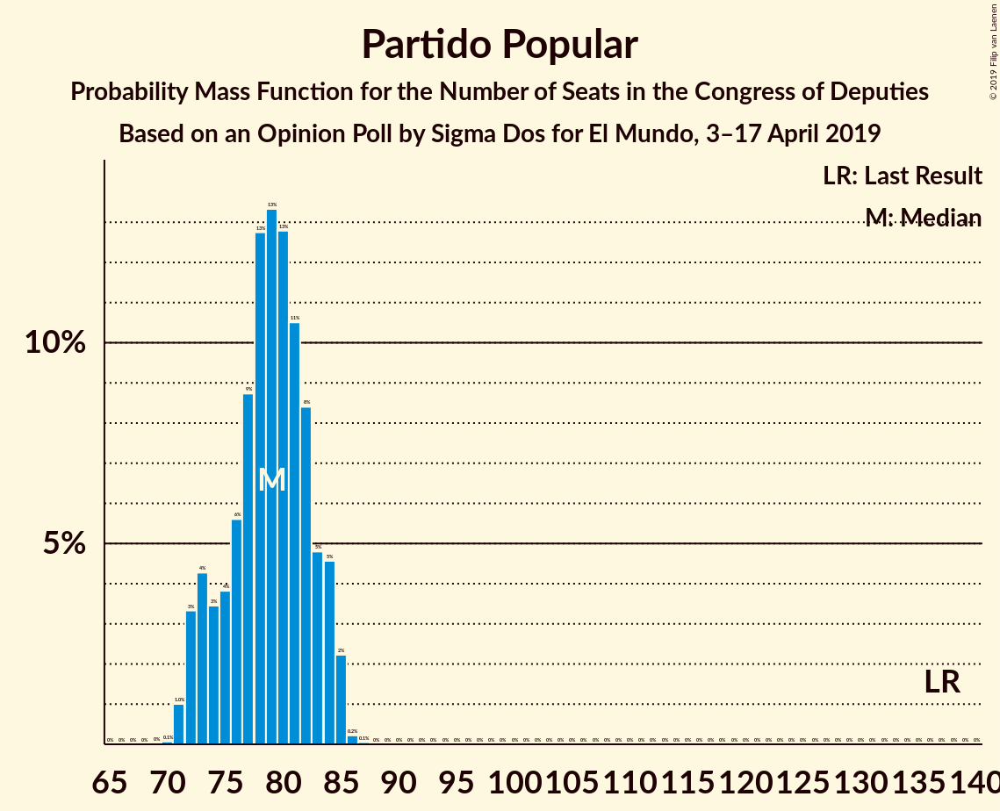
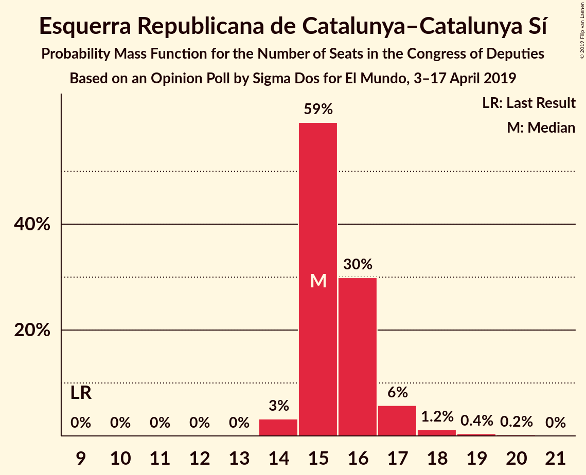
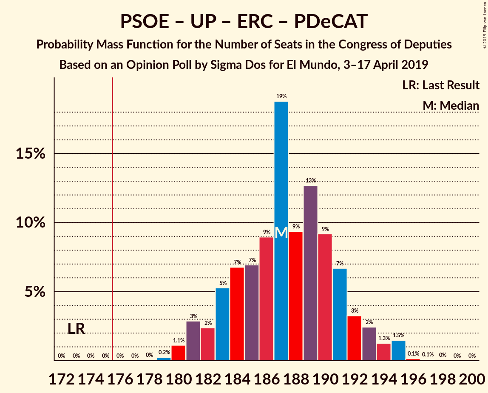
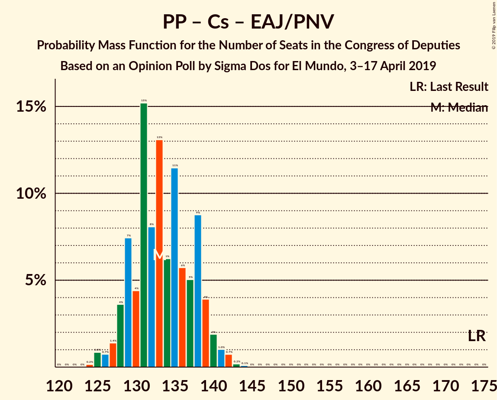

# Opinion Poll by Sigma Dos for El Mundo, 3–17 April 2019

<a href="#voting-intentions">Voting Intentions</a> | <a href="#seats">Seats</a> | <a href="#coalitions">Coalitions</a> | <a href="#technical-information">Technical Information</a>

## Voting Intentions

### Confidence Intervals

| Party | Last Result | Poll Result | 80% Confidence Interval | 90% Confidence Interval | 95% Confidence Interval | 99% Confidence Interval |
|:-----:|:-----------:|:-----------:|:-----------------------:|:-----------------------:|:-----------------------:|:-----------------------:|
| Partido Socialista Obrero Español | 22.6% | 30.3% | 29.6–31.0% |29.5–31.2% |29.3–31.3% |29.0–31.6% |
| Partido Popular | 33.0% | 20.1% | 19.5–20.7% |19.4–20.9% |19.2–21.0% |19.0–21.3% |
| Ciudadanos–Partido de la Ciudadanía | 13.1% | 15.0% | 14.5–15.5% |14.3–15.7% |14.2–15.8% |14.0–16.1% |
| Unidos Podemos | 21.2% | 13.2% | 12.7–13.7% |12.6–13.8% |12.5–14.0% |12.2–14.2% |
| Vox | 0.2% | 10.2% | 9.8–10.7% |9.6–10.8% |9.5–10.9% |9.3–11.1% |
| Esquerra Republicana de Catalunya–Catalunya Sí | 2.7% | 3.8% | 3.5–4.1% |3.5–4.2% |3.4–4.3% |3.3–4.4% |
| Partit Demòcrata Europeu Català | 2.0% | 1.3% | 1.1–1.5% |1.1–1.5% |1.1–1.6% |1.0–1.7% |
| Euzko Alderdi Jeltzalea/Partido Nacionalista Vasco | 1.2% | 1.3% | 1.1–1.5% |1.1–1.5% |1.1–1.6% |1.0–1.7% |

*Note:* The poll result column reflects the actual value used in the calculations. Published results may vary slightly, and in addition be rounded to fewer digits.

## Seats

### Confidence Intervals

| Party | Last Result | Median | 80% Confidence Interval | 90% Confidence Interval | 95% Confidence Interval | 99% Confidence Interval |
|:-----:|:-----------:|:------:|:-----------------------:|:-----------------------:|:-----------------------:|:-----------------------:|
| <a href="#partido-socialista-obrero-español">Partido Socialista Obrero Español</a> | 85 | 132 | 130–135 |128–137 |126–137 |125–138 |
| <a href="#partido-popular">Partido Popular</a> | 137 | 78 | 76–82 |73–83 |72–84 |71–85 |
| <a href="#ciudadanos–partido-de-la-ciudadanía">Ciudadanos–Partido de la Ciudadanía</a> | 32 | 49 | 46–50 |45–51 |44–52 |42–52 |
| <a href="#unidos-podemos">Unidos Podemos</a> | 71 | 36 | 34–36 |33–37 |33–37 |32–39 |
| <a href="#vox">Vox</a> | 0 | 26 | 23–27 |22–27 |22–27 |21–28 |
| <a href="#esquerra-republicana-de-catalunya–catalunya-sí">Esquerra Republicana de Catalunya–Catalunya Sí</a> | 9 | 15 | 15–16 |15–17 |14–17 |14–18 |
| <a href="#partit-demòcrata-europeu-català">Partit Demòcrata Europeu Català</a> | 8 | 5 | 4–5 |4–5 |3–6 |3–6 |
| <a href="#euzko-alderdi-jeltzalea/partido-nacionalista-vasco">Euzko Alderdi Jeltzalea/Partido Nacionalista Vasco</a> | 5 | 6 | 6 |6 |6–8 |6–8 |

### Partido Socialista Obrero Español

*For a full overview of the results for this party, see the [Partido Socialista Obrero Español](party-partidosocialistaobreroespañol.html) page.*

| Number of Seats | Probability | Accumulated | Special Marks |
|:---------------:|:-----------:|:-----------:|:-------------:|
| 85 | 0% | 100% | Last Result |
| 86 | 0% | 100% |  |
| 87 | 0% | 100% |  |
| 88 | 0% | 100% |  |
| 89 | 0% | 100% |  |
| 90 | 0% | 100% |  |
| 91 | 0% | 100% |  |
| 92 | 0% | 100% |  |
| 93 | 0% | 100% |  |
| 94 | 0% | 100% |  |
| 95 | 0% | 100% |  |
| 96 | 0% | 100% |  |
| 97 | 0% | 100% |  |
| 98 | 0% | 100% |  |
| 99 | 0% | 100% |  |
| 100 | 0% | 100% |  |
| 101 | 0% | 100% |  |
| 102 | 0% | 100% |  |
| 103 | 0% | 100% |  |
| 104 | 0% | 100% |  |
| 105 | 0% | 100% |  |
| 106 | 0% | 100% |  |
| 107 | 0% | 100% |  |
| 108 | 0% | 100% |  |
| 109 | 0% | 100% |  |
| 110 | 0% | 100% |  |
| 111 | 0% | 100% |  |
| 112 | 0% | 100% |  |
| 113 | 0% | 100% |  |
| 114 | 0% | 100% |  |
| 115 | 0% | 100% |  |
| 116 | 0% | 100% |  |
| 117 | 0% | 100% |  |
| 118 | 0% | 100% |  |
| 119 | 0% | 100% |  |
| 120 | 0% | 100% |  |
| 121 | 0% | 100% |  |
| 122 | 0% | 100% |  |
| 123 | 0% | 100% |  |
| 124 | 0.4% | 100% |  |
| 125 | 1.2% | 99.6% |  |
| 126 | 2% | 98% |  |
| 127 | 0.5% | 96% |  |
| 128 | 1.5% | 96% |  |
| 129 | 3% | 94% |  |
| 130 | 6% | 92% |  |
| 131 | 24% | 86% |  |
| 132 | 34% | 62% | Median |
| 133 | 6% | 28% |  |
| 134 | 10% | 22% |  |
| 135 | 4% | 11% |  |
| 136 | 2% | 7% |  |
| 137 | 3% | 5% |  |
| 138 | 1.4% | 2% |  |
| 139 | 0.2% | 0.4% |  |
| 140 | 0.1% | 0.2% |  |
| 141 | 0.1% | 0.1% |  |
| 142 | 0% | 0% |  |

### Partido Popular

*For a full overview of the results for this party, see the [Partido Popular](party-partidopopular.html) page.*

| Number of Seats | Probability | Accumulated | Special Marks |
|:---------------:|:-----------:|:-----------:|:-------------:|
| 70 | 0.1% | 100% |  |
| 71 | 1.0% | 99.9% |  |
| 72 | 3% | 98.9% |  |
| 73 | 2% | 96% |  |
| 74 | 1.3% | 95% |  |
| 75 | 2% | 94% |  |
| 76 | 5% | 91% |  |
| 77 | 2% | 87% |  |
| 78 | 51% | 84% | Median |
| 79 | 4% | 34% |  |
| 80 | 10% | 30% |  |
| 81 | 6% | 20% |  |
| 82 | 9% | 14% |  |
| 83 | 2% | 6% |  |
| 84 | 2% | 4% |  |
| 85 | 2% | 2% |  |
| 86 | 0.2% | 0.2% |  |
| 87 | 0.1% | 0.1% |  |
| 88 | 0% | 0% |  |
| 89 | 0% | 0% |  |
| 90 | 0% | 0% |  |
| 91 | 0% | 0% |  |
| 92 | 0% | 0% |  |
| 93 | 0% | 0% |  |
| 94 | 0% | 0% |  |
| 95 | 0% | 0% |  |
| 96 | 0% | 0% |  |
| 97 | 0% | 0% |  |
| 98 | 0% | 0% |  |
| 99 | 0% | 0% |  |
| 100 | 0% | 0% |  |
| 101 | 0% | 0% |  |
| 102 | 0% | 0% |  |
| 103 | 0% | 0% |  |
| 104 | 0% | 0% |  |
| 105 | 0% | 0% |  |
| 106 | 0% | 0% |  |
| 107 | 0% | 0% |  |
| 108 | 0% | 0% |  |
| 109 | 0% | 0% |  |
| 110 | 0% | 0% |  |
| 111 | 0% | 0% |  |
| 112 | 0% | 0% |  |
| 113 | 0% | 0% |  |
| 114 | 0% | 0% |  |
| 115 | 0% | 0% |  |
| 116 | 0% | 0% |  |
| 117 | 0% | 0% |  |
| 118 | 0% | 0% |  |
| 119 | 0% | 0% |  |
| 120 | 0% | 0% |  |
| 121 | 0% | 0% |  |
| 122 | 0% | 0% |  |
| 123 | 0% | 0% |  |
| 124 | 0% | 0% |  |
| 125 | 0% | 0% |  |
| 126 | 0% | 0% |  |
| 127 | 0% | 0% |  |
| 128 | 0% | 0% |  |
| 129 | 0% | 0% |  |
| 130 | 0% | 0% |  |
| 131 | 0% | 0% |  |
| 132 | 0% | 0% |  |
| 133 | 0% | 0% |  |
| 134 | 0% | 0% |  |
| 135 | 0% | 0% |  |
| 136 | 0% | 0% |  |
| 137 | 0% | 0% | Last Result |

### Ciudadanos–Partido de la Ciudadanía

*For a full overview of the results for this party, see the [Ciudadanos–Partido de la Ciudadanía](party-ciudadanos–partidodelaciudadanía.html) page.*

| Number of Seats | Probability | Accumulated | Special Marks |
|:---------------:|:-----------:|:-----------:|:-------------:|
| 32 | 0% | 100% | Last Result |
| 33 | 0% | 100% |  |
| 34 | 0% | 100% |  |
| 35 | 0% | 100% |  |
| 36 | 0% | 100% |  |
| 37 | 0% | 100% |  |
| 38 | 0% | 100% |  |
| 39 | 0% | 100% |  |
| 40 | 0% | 100% |  |
| 41 | 0.4% | 100% |  |
| 42 | 1.2% | 99.6% |  |
| 43 | 0.7% | 98% |  |
| 44 | 2% | 98% |  |
| 45 | 4% | 96% |  |
| 46 | 5% | 92% |  |
| 47 | 10% | 87% |  |
| 48 | 4% | 77% |  |
| 49 | 53% | 73% | Median |
| 50 | 11% | 20% |  |
| 51 | 6% | 9% |  |
| 52 | 4% | 4% |  |
| 53 | 0.1% | 0.1% |  |
| 54 | 0% | 0% |  |

### Unidos Podemos

*For a full overview of the results for this party, see the [Unidos Podemos](party-unidospodemos.html) page.*

| Number of Seats | Probability | Accumulated | Special Marks |
|:---------------:|:-----------:|:-----------:|:-------------:|
| 30 | 0.1% | 100% |  |
| 31 | 0.1% | 99.9% |  |
| 32 | 0.9% | 99.8% |  |
| 33 | 4% | 98.9% |  |
| 34 | 31% | 94% |  |
| 35 | 13% | 63% |  |
| 36 | 41% | 50% | Median |
| 37 | 7% | 9% |  |
| 38 | 0.3% | 2% |  |
| 39 | 0.9% | 1.2% |  |
| 40 | 0.3% | 0.4% |  |
| 41 | 0% | 0% |  |
| 42 | 0% | 0% |  |
| 43 | 0% | 0% |  |
| 44 | 0% | 0% |  |
| 45 | 0% | 0% |  |
| 46 | 0% | 0% |  |
| 47 | 0% | 0% |  |
| 48 | 0% | 0% |  |
| 49 | 0% | 0% |  |
| 50 | 0% | 0% |  |
| 51 | 0% | 0% |  |
| 52 | 0% | 0% |  |
| 53 | 0% | 0% |  |
| 54 | 0% | 0% |  |
| 55 | 0% | 0% |  |
| 56 | 0% | 0% |  |
| 57 | 0% | 0% |  |
| 58 | 0% | 0% |  |
| 59 | 0% | 0% |  |
| 60 | 0% | 0% |  |
| 61 | 0% | 0% |  |
| 62 | 0% | 0% |  |
| 63 | 0% | 0% |  |
| 64 | 0% | 0% |  |
| 65 | 0% | 0% |  |
| 66 | 0% | 0% |  |
| 67 | 0% | 0% |  |
| 68 | 0% | 0% |  |
| 69 | 0% | 0% |  |
| 70 | 0% | 0% |  |
| 71 | 0% | 0% | Last Result |

### Vox

*For a full overview of the results for this party, see the [Vox](party-vox.html) page.*

| Number of Seats | Probability | Accumulated | Special Marks |
|:---------------:|:-----------:|:-----------:|:-------------:|
| 0 | 0% | 100% | Last Result |
| 1 | 0% | 100% |  |
| 2 | 0% | 100% |  |
| 3 | 0% | 100% |  |
| 4 | 0% | 100% |  |
| 5 | 0% | 100% |  |
| 6 | 0% | 100% |  |
| 7 | 0% | 100% |  |
| 8 | 0% | 100% |  |
| 9 | 0% | 100% |  |
| 10 | 0% | 100% |  |
| 11 | 0% | 100% |  |
| 12 | 0% | 100% |  |
| 13 | 0% | 100% |  |
| 14 | 0% | 100% |  |
| 15 | 0% | 100% |  |
| 16 | 0% | 100% |  |
| 17 | 0% | 100% |  |
| 18 | 0% | 100% |  |
| 19 | 0% | 100% |  |
| 20 | 0.1% | 100% |  |
| 21 | 0.8% | 99.9% |  |
| 22 | 5% | 99.1% |  |
| 23 | 8% | 94% |  |
| 24 | 8% | 86% |  |
| 25 | 5% | 78% |  |
| 26 | 47% | 73% | Median |
| 27 | 25% | 26% |  |
| 28 | 1.0% | 1.0% |  |
| 29 | 0% | 0.1% |  |
| 30 | 0% | 0% |  |

### Esquerra Republicana de Catalunya–Catalunya Sí

*For a full overview of the results for this party, see the [Esquerra Republicana de Catalunya–Catalunya Sí](party-esquerrarepublicanadecatalunya–catalunyasí.html) page.*

| Number of Seats | Probability | Accumulated | Special Marks |
|:---------------:|:-----------:|:-----------:|:-------------:|
| 9 | 0% | 100% | Last Result |
| 10 | 0% | 100% |  |
| 11 | 0% | 100% |  |
| 12 | 0% | 100% |  |
| 13 | 0% | 100% |  |
| 14 | 3% | 100% |  |
| 15 | 57% | 97% | Median |
| 16 | 35% | 40% |  |
| 17 | 3% | 5% |  |
| 18 | 2% | 2% |  |
| 19 | 0.1% | 0.3% |  |
| 20 | 0.2% | 0.2% |  |
| 21 | 0% | 0% |  |

### Partit Demòcrata Europeu Català

*For a full overview of the results for this party, see the [Partit Demòcrata Europeu Català](party-partitdemòcrataeuropeucatalà.html) page.*

| Number of Seats | Probability | Accumulated | Special Marks |
|:---------------:|:-----------:|:-----------:|:-------------:|
| 3 | 5% | 100% |  |
| 4 | 23% | 95% |  |
| 5 | 69% | 72% | Median |
| 6 | 3% | 3% |  |
| 7 | 0% | 0% |  |
| 8 | 0% | 0% | Last Result |

### Euzko Alderdi Jeltzalea/Partido Nacionalista Vasco

*For a full overview of the results for this party, see the [Euzko Alderdi Jeltzalea/Partido Nacionalista Vasco](party-euzkoalderdijeltzaleapartidonacionalistavasco.html) page.*

| Number of Seats | Probability | Accumulated | Special Marks |
|:---------------:|:-----------:|:-----------:|:-------------:|
| 4 | 0.2% | 100% |  |
| 5 | 0% | 99.8% | Last Result |
| 6 | 96% | 99.8% | Median |
| 7 | 0.6% | 4% |  |
| 8 | 4% | 4% |  |
| 9 | 0% | 0% |  |

## Coalitions

### Confidence Intervals

| Coalition | Last Result | Median | Majority? | 80% Confidence Interval | 90% Confidence Interval | 95% Confidence Interval | 99% Confidence Interval |
|:---------:|:-----------:|:------:|:---------:|:-----------------------:|:-----------------------:|:-----------------------:|:-----------------------:|
| Partido Socialista Obrero Español – Partido Popular – Ciudadanos–Partido de la Ciudadanía | 254 | 259 | 100% | 257–262 | 257–263 | 256–263 | 255–266 |
| Partido Socialista Obrero Español – Ciudadanos–Partido de la Ciudadanía – Unidos Podemos | 188 | 215 | 100% | 213–220 | 211–221 | 211–222 | 208–224 |
| Partido Socialista Obrero Español – Partido Popular | 222 | 210 | 100% | 209–214 | 208–216 | 207–216 | 206–219 |
| Partido Socialista Obrero Español – Unidos Podemos – Esquerra Republicana de Catalunya–Catalunya Sí – Partit Demòcrata Europeu Català | 173 | 187 | 100% | 185–190 | 183–192 | 182–194 | 180–194 |
| Partido Socialista Obrero Español – Ciudadanos–Partido de la Ciudadanía | 117 | 181 | 96% | 178–184 | 177–185 | 175–186 | 173–189 |
| Partido Socialista Obrero Español – Unidos Podemos – Euzko Alderdi Jeltzalea/Partido Nacionalista Vasco | 161 | 173 | 15% | 171–176 | 169–178 | 168–180 | 165–180 |
| Partido Socialista Obrero Español – Unidos Podemos | 156 | 167 | 0.2% | 164–170 | 163–172 | 161–174 | 159–174 |
| Partido Popular – Ciudadanos–Partido de la Ciudadanía – Vox | 169 | 153 | 0% | 150–155 | 148–157 | 146–158 | 146–160 |
| Partido Popular – Ciudadanos–Partido de la Ciudadanía – Euzko Alderdi Jeltzalea/Partido Nacionalista Vasco | 174 | 133 | 0% | 131–137 | 129–139 | 126–140 | 125–142 |
| Partido Socialista Obrero Español | 85 | 132 | 0% | 130–135 | 128–137 | 126–137 | 125–138 |
| Partido Popular – Ciudadanos–Partido de la Ciudadanía | 169 | 127 | 0% | 125–131 | 122–132 | 120–134 | 119–136 |
| Partido Popular – Vox | 137 | 104 | 0% | 100–107 | 99–108 | 98–109 | 97–111 |
| Partido Popular | 137 | 78 | 0% | 76–82 | 73–83 | 72–84 | 71–85 |

### Partido Socialista Obrero Español – Partido Popular – Ciudadanos–Partido de la Ciudadanía

| Number of Seats | Probability | Accumulated | Special Marks |
|:---------------:|:-----------:|:-----------:|:-------------:|
| 254 | 0.2% | 100% | Last Result |
| 255 | 1.1% | 99.8% |  |
| 256 | 3% | 98.7% |  |
| 257 | 6% | 95% |  |
| 258 | 36% | 90% |  |
| 259 | 28% | 53% | Median |
| 260 | 5% | 26% |  |
| 261 | 7% | 21% |  |
| 262 | 8% | 14% |  |
| 263 | 4% | 6% |  |
| 264 | 0.3% | 2% |  |
| 265 | 0.2% | 2% |  |
| 266 | 1.3% | 1.4% |  |
| 267 | 0.1% | 0.1% |  |
| 268 | 0% | 0% |  |

### Partido Socialista Obrero Español – Ciudadanos–Partido de la Ciudadanía – Unidos Podemos

| Number of Seats | Probability | Accumulated | Special Marks |
|:---------------:|:-----------:|:-----------:|:-------------:|
| 188 | 0% | 100% | Last Result |
| 189 | 0% | 100% |  |
| 190 | 0% | 100% |  |
| 191 | 0% | 100% |  |
| 192 | 0% | 100% |  |
| 193 | 0% | 100% |  |
| 194 | 0% | 100% |  |
| 195 | 0% | 100% |  |
| 196 | 0% | 100% |  |
| 197 | 0% | 100% |  |
| 198 | 0% | 100% |  |
| 199 | 0% | 100% |  |
| 200 | 0% | 100% |  |
| 201 | 0% | 100% |  |
| 202 | 0% | 100% |  |
| 203 | 0% | 100% |  |
| 204 | 0% | 100% |  |
| 205 | 0% | 100% |  |
| 206 | 0% | 100% |  |
| 207 | 0.3% | 100% |  |
| 208 | 0.5% | 99.7% |  |
| 209 | 0.2% | 99.2% |  |
| 210 | 0.7% | 99.1% |  |
| 211 | 3% | 98% |  |
| 212 | 3% | 95% |  |
| 213 | 4% | 92% |  |
| 214 | 13% | 88% |  |
| 215 | 27% | 76% |  |
| 216 | 29% | 48% |  |
| 217 | 2% | 19% | Median |
| 218 | 2% | 17% |  |
| 219 | 3% | 15% |  |
| 220 | 5% | 12% |  |
| 221 | 4% | 7% |  |
| 222 | 1.2% | 3% |  |
| 223 | 0.3% | 1.3% |  |
| 224 | 0.9% | 1.1% |  |
| 225 | 0.1% | 0.2% |  |
| 226 | 0% | 0% |  |

### Partido Socialista Obrero Español – Partido Popular

| Number of Seats | Probability | Accumulated | Special Marks |
|:---------------:|:-----------:|:-----------:|:-------------:|
| 204 | 0% | 100% |  |
| 205 | 0.3% | 99.9% |  |
| 206 | 0.4% | 99.7% |  |
| 207 | 2% | 99.3% |  |
| 208 | 3% | 97% |  |
| 209 | 29% | 94% |  |
| 210 | 31% | 64% | Median |
| 211 | 8% | 34% |  |
| 212 | 12% | 25% |  |
| 213 | 3% | 13% |  |
| 214 | 0.9% | 10% |  |
| 215 | 3% | 9% |  |
| 216 | 4% | 7% |  |
| 217 | 2% | 2% |  |
| 218 | 0.1% | 0.7% |  |
| 219 | 0.6% | 0.6% |  |
| 220 | 0% | 0.1% |  |
| 221 | 0% | 0% |  |
| 222 | 0% | 0% | Last Result |

### Partido Socialista Obrero Español – Unidos Podemos – Esquerra Republicana de Catalunya–Catalunya Sí – Partit Demòcrata Europeu Català

| Number of Seats | Probability | Accumulated | Special Marks |
|:---------------:|:-----------:|:-----------:|:-------------:|
| 173 | 0% | 100% | Last Result |
| 174 | 0% | 100% |  |
| 175 | 0% | 100% |  |
| 176 | 0% | 100% | Majority |
| 177 | 0% | 100% |  |
| 178 | 0% | 100% |  |
| 179 | 0% | 99.9% |  |
| 180 | 1.4% | 99.9% |  |
| 181 | 0.7% | 98% |  |
| 182 | 2% | 98% |  |
| 183 | 2% | 96% |  |
| 184 | 3% | 93% |  |
| 185 | 2% | 91% |  |
| 186 | 7% | 88% |  |
| 187 | 53% | 81% |  |
| 188 | 7% | 28% | Median |
| 189 | 7% | 21% |  |
| 190 | 6% | 14% |  |
| 191 | 1.3% | 8% |  |
| 192 | 3% | 7% |  |
| 193 | 0.6% | 4% |  |
| 194 | 3% | 3% |  |
| 195 | 0.1% | 0.4% |  |
| 196 | 0.1% | 0.2% |  |
| 197 | 0% | 0.1% |  |
| 198 | 0.1% | 0.1% |  |
| 199 | 0% | 0% |  |

### Partido Socialista Obrero Español – Ciudadanos–Partido de la Ciudadanía

| Number of Seats | Probability | Accumulated | Special Marks |
|:---------------:|:-----------:|:-----------:|:-------------:|
| 117 | 0% | 100% | Last Result |
| 118 | 0% | 100% |  |
| 119 | 0% | 100% |  |
| 120 | 0% | 100% |  |
| 121 | 0% | 100% |  |
| 122 | 0% | 100% |  |
| 123 | 0% | 100% |  |
| 124 | 0% | 100% |  |
| 125 | 0% | 100% |  |
| 126 | 0% | 100% |  |
| 127 | 0% | 100% |  |
| 128 | 0% | 100% |  |
| 129 | 0% | 100% |  |
| 130 | 0% | 100% |  |
| 131 | 0% | 100% |  |
| 132 | 0% | 100% |  |
| 133 | 0% | 100% |  |
| 134 | 0% | 100% |  |
| 135 | 0% | 100% |  |
| 136 | 0% | 100% |  |
| 137 | 0% | 100% |  |
| 138 | 0% | 100% |  |
| 139 | 0% | 100% |  |
| 140 | 0% | 100% |  |
| 141 | 0% | 100% |  |
| 142 | 0% | 100% |  |
| 143 | 0% | 100% |  |
| 144 | 0% | 100% |  |
| 145 | 0% | 100% |  |
| 146 | 0% | 100% |  |
| 147 | 0% | 100% |  |
| 148 | 0% | 100% |  |
| 149 | 0% | 100% |  |
| 150 | 0% | 100% |  |
| 151 | 0% | 100% |  |
| 152 | 0% | 100% |  |
| 153 | 0% | 100% |  |
| 154 | 0% | 100% |  |
| 155 | 0% | 100% |  |
| 156 | 0% | 100% |  |
| 157 | 0% | 100% |  |
| 158 | 0% | 100% |  |
| 159 | 0% | 100% |  |
| 160 | 0% | 100% |  |
| 161 | 0% | 100% |  |
| 162 | 0% | 100% |  |
| 163 | 0% | 100% |  |
| 164 | 0% | 100% |  |
| 165 | 0% | 100% |  |
| 166 | 0% | 100% |  |
| 167 | 0% | 100% |  |
| 168 | 0% | 100% |  |
| 169 | 0% | 100% |  |
| 170 | 0% | 100% |  |
| 171 | 0% | 100% |  |
| 172 | 0.1% | 100% |  |
| 173 | 0.5% | 99.8% |  |
| 174 | 2% | 99.3% |  |
| 175 | 2% | 98% |  |
| 176 | 0.9% | 96% | Majority |
| 177 | 5% | 95% |  |
| 178 | 10% | 91% |  |
| 179 | 9% | 81% |  |
| 180 | 22% | 72% |  |
| 181 | 28% | 50% | Median |
| 182 | 5% | 22% |  |
| 183 | 2% | 16% |  |
| 184 | 7% | 15% |  |
| 185 | 4% | 8% |  |
| 186 | 2% | 4% |  |
| 187 | 0.6% | 2% |  |
| 188 | 0.5% | 1.4% |  |
| 189 | 0.8% | 0.9% |  |
| 190 | 0.1% | 0.1% |  |
| 191 | 0% | 0% |  |

### Partido Socialista Obrero Español – Unidos Podemos – Euzko Alderdi Jeltzalea/Partido Nacionalista Vasco

| Number of Seats | Probability | Accumulated | Special Marks |
|:---------------:|:-----------:|:-----------:|:-------------:|
| 161 | 0% | 100% | Last Result |
| 162 | 0% | 100% |  |
| 163 | 0.2% | 100% |  |
| 164 | 0.1% | 99.8% |  |
| 165 | 0.3% | 99.7% |  |
| 166 | 0.3% | 99.4% |  |
| 167 | 1.5% | 99.1% |  |
| 168 | 2% | 98% |  |
| 169 | 2% | 95% |  |
| 170 | 3% | 94% |  |
| 171 | 2% | 91% |  |
| 172 | 26% | 89% |  |
| 173 | 29% | 63% |  |
| 174 | 10% | 34% | Median |
| 175 | 9% | 24% |  |
| 176 | 5% | 15% | Majority |
| 177 | 3% | 10% |  |
| 178 | 2% | 6% |  |
| 179 | 1.5% | 4% |  |
| 180 | 3% | 3% |  |
| 181 | 0.2% | 0.4% |  |
| 182 | 0.1% | 0.3% |  |
| 183 | 0.1% | 0.1% |  |
| 184 | 0.1% | 0.1% |  |
| 185 | 0% | 0% |  |

### Partido Socialista Obrero Español – Unidos Podemos

| Number of Seats | Probability | Accumulated | Special Marks |
|:---------------:|:-----------:|:-----------:|:-------------:|
| 156 | 0% | 100% | Last Result |
| 157 | 0.2% | 100% |  |
| 158 | 0.1% | 99.8% |  |
| 159 | 0.3% | 99.7% |  |
| 160 | 0.5% | 99.4% |  |
| 161 | 2% | 99.0% |  |
| 162 | 2% | 97% |  |
| 163 | 1.5% | 95% |  |
| 164 | 4% | 94% |  |
| 165 | 2% | 90% |  |
| 166 | 26% | 88% |  |
| 167 | 29% | 62% |  |
| 168 | 10% | 33% | Median |
| 169 | 9% | 23% |  |
| 170 | 5% | 14% |  |
| 171 | 3% | 9% |  |
| 172 | 2% | 6% |  |
| 173 | 1.3% | 4% |  |
| 174 | 3% | 3% |  |
| 175 | 0.2% | 0.4% |  |
| 176 | 0.1% | 0.2% | Majority |
| 177 | 0.1% | 0.1% |  |
| 178 | 0.1% | 0.1% |  |
| 179 | 0% | 0% |  |

### Partido Popular – Ciudadanos–Partido de la Ciudadanía – Vox

| Number of Seats | Probability | Accumulated | Special Marks |
|:---------------:|:-----------:|:-----------:|:-------------:|
| 143 | 0.1% | 100% |  |
| 144 | 0.1% | 99.9% |  |
| 145 | 0.2% | 99.8% |  |
| 146 | 2% | 99.6% |  |
| 147 | 1.1% | 97% |  |
| 148 | 3% | 96% |  |
| 149 | 1.5% | 93% |  |
| 150 | 6% | 92% |  |
| 151 | 6% | 85% |  |
| 152 | 8% | 79% |  |
| 153 | 53% | 72% | Median |
| 154 | 7% | 18% |  |
| 155 | 3% | 12% |  |
| 156 | 2% | 8% |  |
| 157 | 2% | 6% |  |
| 158 | 2% | 4% |  |
| 159 | 0.9% | 2% |  |
| 160 | 1.2% | 1.3% |  |
| 161 | 0% | 0.1% |  |
| 162 | 0% | 0% |  |
| 163 | 0% | 0% |  |
| 164 | 0% | 0% |  |
| 165 | 0% | 0% |  |
| 166 | 0% | 0% |  |
| 167 | 0% | 0% |  |
| 168 | 0% | 0% |  |
| 169 | 0% | 0% | Last Result |

### Partido Popular – Ciudadanos–Partido de la Ciudadanía – Euzko Alderdi Jeltzalea/Partido Nacionalista Vasco

| Number of Seats | Probability | Accumulated | Special Marks |
|:---------------:|:-----------:|:-----------:|:-------------:|
| 124 | 0.1% | 100% |  |
| 125 | 2% | 99.9% |  |
| 126 | 0.8% | 98% |  |
| 127 | 0.5% | 97% |  |
| 128 | 1.3% | 96% |  |
| 129 | 0.8% | 95% |  |
| 130 | 2% | 94% |  |
| 131 | 7% | 92% |  |
| 132 | 10% | 86% |  |
| 133 | 54% | 75% | Median |
| 134 | 6% | 21% |  |
| 135 | 2% | 16% |  |
| 136 | 3% | 14% |  |
| 137 | 3% | 11% |  |
| 138 | 3% | 8% |  |
| 139 | 1.4% | 6% |  |
| 140 | 2% | 4% |  |
| 141 | 1.3% | 2% |  |
| 142 | 0.4% | 0.9% |  |
| 143 | 0.3% | 0.4% |  |
| 144 | 0.2% | 0.2% |  |
| 145 | 0% | 0% |  |
| 146 | 0% | 0% |  |
| 147 | 0% | 0% |  |
| 148 | 0% | 0% |  |
| 149 | 0% | 0% |  |
| 150 | 0% | 0% |  |
| 151 | 0% | 0% |  |
| 152 | 0% | 0% |  |
| 153 | 0% | 0% |  |
| 154 | 0% | 0% |  |
| 155 | 0% | 0% |  |
| 156 | 0% | 0% |  |
| 157 | 0% | 0% |  |
| 158 | 0% | 0% |  |
| 159 | 0% | 0% |  |
| 160 | 0% | 0% |  |
| 161 | 0% | 0% |  |
| 162 | 0% | 0% |  |
| 163 | 0% | 0% |  |
| 164 | 0% | 0% |  |
| 165 | 0% | 0% |  |
| 166 | 0% | 0% |  |
| 167 | 0% | 0% |  |
| 168 | 0% | 0% |  |
| 169 | 0% | 0% |  |
| 170 | 0% | 0% |  |
| 171 | 0% | 0% |  |
| 172 | 0% | 0% |  |
| 173 | 0% | 0% |  |
| 174 | 0% | 0% | Last Result |

### Partido Socialista Obrero Español

| Number of Seats | Probability | Accumulated | Special Marks |
|:---------------:|:-----------:|:-----------:|:-------------:|
| 85 | 0% | 100% | Last Result |
| 86 | 0% | 100% |  |
| 87 | 0% | 100% |  |
| 88 | 0% | 100% |  |
| 89 | 0% | 100% |  |
| 90 | 0% | 100% |  |
| 91 | 0% | 100% |  |
| 92 | 0% | 100% |  |
| 93 | 0% | 100% |  |
| 94 | 0% | 100% |  |
| 95 | 0% | 100% |  |
| 96 | 0% | 100% |  |
| 97 | 0% | 100% |  |
| 98 | 0% | 100% |  |
| 99 | 0% | 100% |  |
| 100 | 0% | 100% |  |
| 101 | 0% | 100% |  |
| 102 | 0% | 100% |  |
| 103 | 0% | 100% |  |
| 104 | 0% | 100% |  |
| 105 | 0% | 100% |  |
| 106 | 0% | 100% |  |
| 107 | 0% | 100% |  |
| 108 | 0% | 100% |  |
| 109 | 0% | 100% |  |
| 110 | 0% | 100% |  |
| 111 | 0% | 100% |  |
| 112 | 0% | 100% |  |
| 113 | 0% | 100% |  |
| 114 | 0% | 100% |  |
| 115 | 0% | 100% |  |
| 116 | 0% | 100% |  |
| 117 | 0% | 100% |  |
| 118 | 0% | 100% |  |
| 119 | 0% | 100% |  |
| 120 | 0% | 100% |  |
| 121 | 0% | 100% |  |
| 122 | 0% | 100% |  |
| 123 | 0% | 100% |  |
| 124 | 0.4% | 100% |  |
| 125 | 1.2% | 99.6% |  |
| 126 | 2% | 98% |  |
| 127 | 0.5% | 96% |  |
| 128 | 1.5% | 96% |  |
| 129 | 3% | 94% |  |
| 130 | 6% | 92% |  |
| 131 | 24% | 86% |  |
| 132 | 34% | 62% | Median |
| 133 | 6% | 28% |  |
| 134 | 10% | 22% |  |
| 135 | 4% | 11% |  |
| 136 | 2% | 7% |  |
| 137 | 3% | 5% |  |
| 138 | 1.4% | 2% |  |
| 139 | 0.2% | 0.4% |  |
| 140 | 0.1% | 0.2% |  |
| 141 | 0.1% | 0.1% |  |
| 142 | 0% | 0% |  |

### Partido Popular – Ciudadanos–Partido de la Ciudadanía

| Number of Seats | Probability | Accumulated | Special Marks |
|:---------------:|:-----------:|:-----------:|:-------------:|
| 118 | 0.1% | 100% |  |
| 119 | 2% | 99.9% |  |
| 120 | 0.9% | 98% |  |
| 121 | 0.6% | 97% |  |
| 122 | 1.3% | 96% |  |
| 123 | 1.0% | 95% |  |
| 124 | 2% | 94% |  |
| 125 | 7% | 91% |  |
| 126 | 10% | 85% |  |
| 127 | 53% | 75% | Median |
| 128 | 6% | 21% |  |
| 129 | 2% | 15% |  |
| 130 | 2% | 13% |  |
| 131 | 3% | 10% |  |
| 132 | 3% | 8% |  |
| 133 | 1.3% | 5% |  |
| 134 | 2% | 4% |  |
| 135 | 1.4% | 2% |  |
| 136 | 0.5% | 0.7% |  |
| 137 | 0.1% | 0.2% |  |
| 138 | 0% | 0% |  |
| 139 | 0% | 0% |  |
| 140 | 0% | 0% |  |
| 141 | 0% | 0% |  |
| 142 | 0% | 0% |  |
| 143 | 0% | 0% |  |
| 144 | 0% | 0% |  |
| 145 | 0% | 0% |  |
| 146 | 0% | 0% |  |
| 147 | 0% | 0% |  |
| 148 | 0% | 0% |  |
| 149 | 0% | 0% |  |
| 150 | 0% | 0% |  |
| 151 | 0% | 0% |  |
| 152 | 0% | 0% |  |
| 153 | 0% | 0% |  |
| 154 | 0% | 0% |  |
| 155 | 0% | 0% |  |
| 156 | 0% | 0% |  |
| 157 | 0% | 0% |  |
| 158 | 0% | 0% |  |
| 159 | 0% | 0% |  |
| 160 | 0% | 0% |  |
| 161 | 0% | 0% |  |
| 162 | 0% | 0% |  |
| 163 | 0% | 0% |  |
| 164 | 0% | 0% |  |
| 165 | 0% | 0% |  |
| 166 | 0% | 0% |  |
| 167 | 0% | 0% |  |
| 168 | 0% | 0% |  |
| 169 | 0% | 0% | Last Result |

### Partido Popular – Vox

| Number of Seats | Probability | Accumulated | Special Marks |
|:---------------:|:-----------:|:-----------:|:-------------:|
| 94 | 0% | 100% |  |
| 95 | 0.2% | 99.9% |  |
| 96 | 0.1% | 99.8% |  |
| 97 | 1.2% | 99.7% |  |
| 98 | 1.4% | 98% |  |
| 99 | 3% | 97% |  |
| 100 | 6% | 94% |  |
| 101 | 0.7% | 88% |  |
| 102 | 2% | 87% |  |
| 103 | 6% | 85% |  |
| 104 | 49% | 79% | Median |
| 105 | 4% | 30% |  |
| 106 | 9% | 26% |  |
| 107 | 10% | 17% |  |
| 108 | 2% | 7% |  |
| 109 | 2% | 5% |  |
| 110 | 2% | 2% |  |
| 111 | 0.5% | 0.6% |  |
| 112 | 0.1% | 0.1% |  |
| 113 | 0% | 0% |  |
| 114 | 0% | 0% |  |
| 115 | 0% | 0% |  |
| 116 | 0% | 0% |  |
| 117 | 0% | 0% |  |
| 118 | 0% | 0% |  |
| 119 | 0% | 0% |  |
| 120 | 0% | 0% |  |
| 121 | 0% | 0% |  |
| 122 | 0% | 0% |  |
| 123 | 0% | 0% |  |
| 124 | 0% | 0% |  |
| 125 | 0% | 0% |  |
| 126 | 0% | 0% |  |
| 127 | 0% | 0% |  |
| 128 | 0% | 0% |  |
| 129 | 0% | 0% |  |
| 130 | 0% | 0% |  |
| 131 | 0% | 0% |  |
| 132 | 0% | 0% |  |
| 133 | 0% | 0% |  |
| 134 | 0% | 0% |  |
| 135 | 0% | 0% |  |
| 136 | 0% | 0% |  |
| 137 | 0% | 0% | Last Result |

### Partido Popular

| Number of Seats | Probability | Accumulated | Special Marks |
|:---------------:|:-----------:|:-----------:|:-------------:|
| 70 | 0.1% | 100% |  |
| 71 | 1.0% | 99.9% |  |
| 72 | 3% | 98.9% |  |
| 73 | 2% | 96% |  |
| 74 | 1.3% | 95% |  |
| 75 | 2% | 94% |  |
| 76 | 5% | 91% |  |
| 77 | 2% | 87% |  |
| 78 | 51% | 84% | Median |
| 79 | 4% | 34% |  |
| 80 | 10% | 30% |  |
| 81 | 6% | 20% |  |
| 82 | 9% | 14% |  |
| 83 | 2% | 6% |  |
| 84 | 2% | 4% |  |
| 85 | 2% | 2% |  |
| 86 | 0.2% | 0.2% |  |
| 87 | 0.1% | 0.1% |  |
| 88 | 0% | 0% |  |
| 89 | 0% | 0% |  |
| 90 | 0% | 0% |  |
| 91 | 0% | 0% |  |
| 92 | 0% | 0% |  |
| 93 | 0% | 0% |  |
| 94 | 0% | 0% |  |
| 95 | 0% | 0% |  |
| 96 | 0% | 0% |  |
| 97 | 0% | 0% |  |
| 98 | 0% | 0% |  |
| 99 | 0% | 0% |  |
| 100 | 0% | 0% |  |
| 101 | 0% | 0% |  |
| 102 | 0% | 0% |  |
| 103 | 0% | 0% |  |
| 104 | 0% | 0% |  |
| 105 | 0% | 0% |  |
| 106 | 0% | 0% |  |
| 107 | 0% | 0% |  |
| 108 | 0% | 0% |  |
| 109 | 0% | 0% |  |
| 110 | 0% | 0% |  |
| 111 | 0% | 0% |  |
| 112 | 0% | 0% |  |
| 113 | 0% | 0% |  |
| 114 | 0% | 0% |  |
| 115 | 0% | 0% |  |
| 116 | 0% | 0% |  |
| 117 | 0% | 0% |  |
| 118 | 0% | 0% |  |
| 119 | 0% | 0% |  |
| 120 | 0% | 0% |  |
| 121 | 0% | 0% |  |
| 122 | 0% | 0% |  |
| 123 | 0% | 0% |  |
| 124 | 0% | 0% |  |
| 125 | 0% | 0% |  |
| 126 | 0% | 0% |  |
| 127 | 0% | 0% |  |
| 128 | 0% | 0% |  |
| 129 | 0% | 0% |  |
| 130 | 0% | 0% |  |
| 131 | 0% | 0% |  |
| 132 | 0% | 0% |  |
| 133 | 0% | 0% |  |
| 134 | 0% | 0% |  |
| 135 | 0% | 0% |  |
| 136 | 0% | 0% |  |
| 137 | 0% | 0% | Last Result |

## Technical Information

### Opinion Poll

+ **Polling firm:** Sigma Dos
+ **Commissioner(s):** El Mundo
+ **Fieldwork period:** 3–17 April 2019

### Calculations

+ **Sample size:** 8000
+ **Simulations done:** 131,072
+ **Error estimate:** 0.32%

