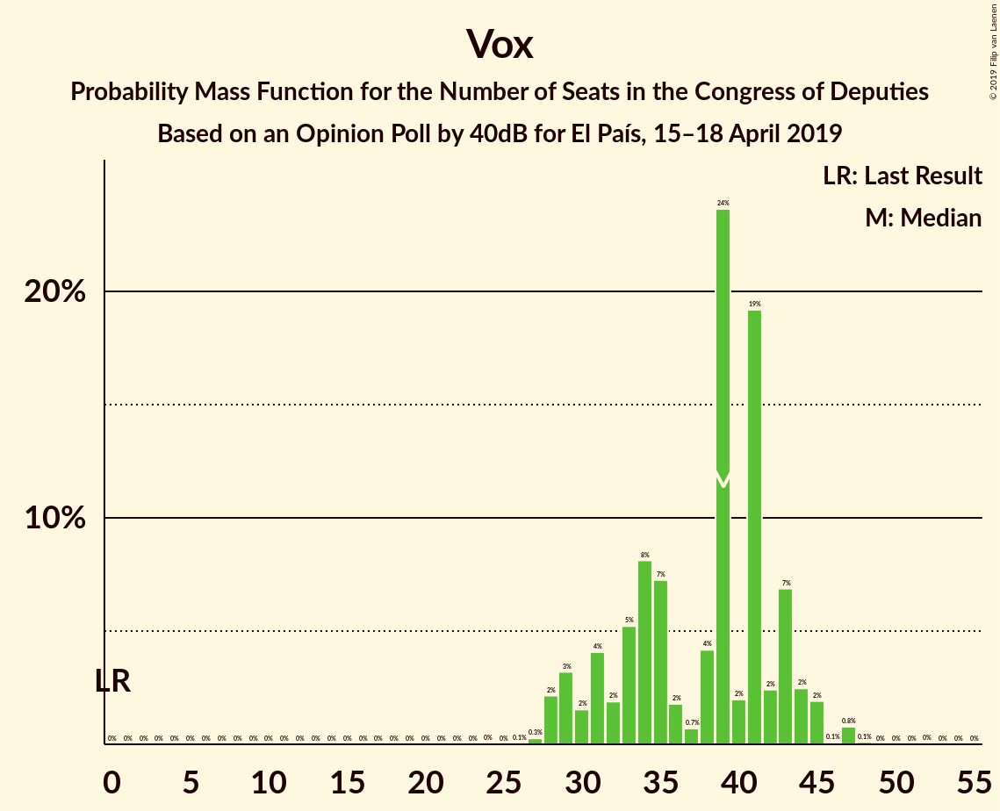
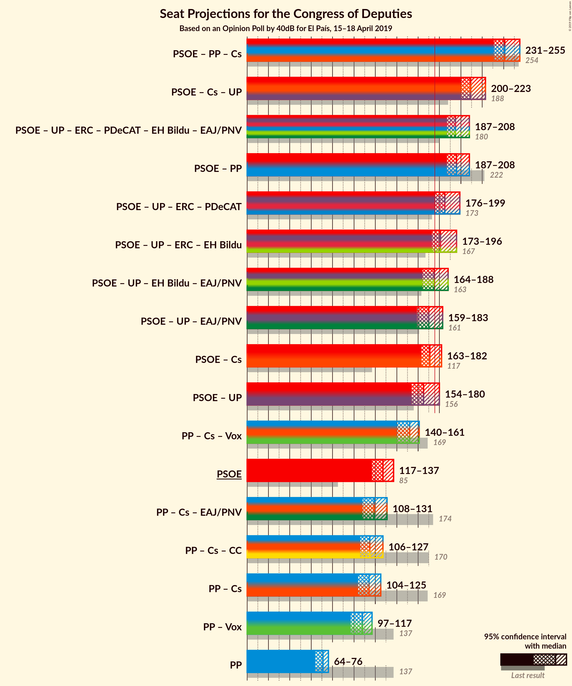
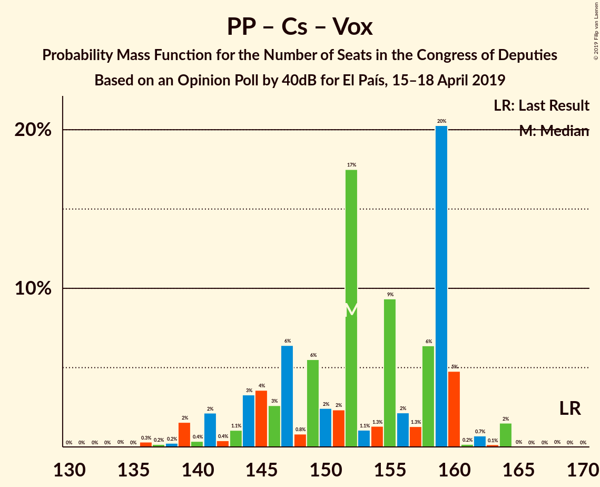

# Opinion Poll by 40dB for El País, 15–18 April 2019

<a href="#voting-intentions">Voting Intentions</a> | <a href="#seats">Seats</a> | <a href="#coalitions">Coalitions</a> | <a href="#technical-information">Technical Information</a>

## Voting Intentions

### Confidence Intervals

| Party | Last Result | Poll Result | 80% Confidence Interval | 90% Confidence Interval | 95% Confidence Interval | 99% Confidence Interval |
|:-----:|:-----------:|:-----------:|:-----------------------:|:-----------------------:|:-----------------------:|:-----------------------:|
| Partido Socialista Obrero Español | 22.6% | 28.8% | 27.5–30.1% |27.2–30.5% |26.9–30.8% |26.2–31.5% |
| Partido Popular | 33.0% | 17.8% | 16.7–18.9% |16.4–19.3% |16.2–19.5% |15.7–20.1% |
| Unidos Podemos | 21.2% | 14.1% | 13.1–15.2% |12.9–15.4% |12.6–15.7% |12.2–16.2% |
| Ciudadanos–Partido de la Ciudadanía | 13.1% | 14.1% | 13.1–15.2% |12.9–15.4% |12.6–15.7% |12.2–16.2% |
| Vox | 0.2% | 12.5% | 11.6–13.5% |11.3–13.8% |11.1–14.0% |10.7–14.5% |
| Esquerra Republicana de Catalunya–Catalunya Sí | 2.7% | 3.3% | 2.8–3.9% |2.7–4.0% |2.6–4.2% |2.4–4.5% |
| Partido Animalista Contra el Maltrato Animal | 1.2% | 2.8% | 2.4–3.3% |2.3–3.5% |2.2–3.6% |2.0–3.9% |
| Partit Demòcrata Europeu Català | 2.0% | 1.9% | 1.6–2.4% |1.5–2.5% |1.4–2.6% |1.2–2.8% |
| Euzko Alderdi Jeltzalea/Partido Nacionalista Vasco | 1.2% | 1.0% | 0.8–1.4% |0.7–1.5% |0.6–1.5% |0.5–1.7% |
| Euskal Herria Bildu | 0.8% | 1.0% | 0.8–1.4% |0.7–1.5% |0.6–1.5% |0.5–1.7% |
| Coalición Canaria–Partido Nacionalista Canario | 0.3% | 0.4% | 0.3–0.7% |0.2–0.7% |0.2–0.8% |0.2–0.9% |

*Note:* The poll result column reflects the actual value used in the calculations. Published results may vary slightly, and in addition be rounded to fewer digits.

## Seats

### Confidence Intervals

| Party | Last Result | Median | 80% Confidence Interval | 90% Confidence Interval | 95% Confidence Interval | 99% Confidence Interval |
|:-----:|:-----------:|:------:|:-----------------------:|:-----------------------:|:-----------------------:|:-----------------------:|
| <a href="#partido-socialista-obrero-español">Partido Socialista Obrero Español</a> | 85 | 127 | 121–134 |119–135 |117–137 |115–139 |
| <a href="#partido-popular">Partido Popular</a> | 137 | 71 | 65–75 |64–76 |64–76 |61–79 |
| <a href="#unidos-podemos">Unidos Podemos</a> | 71 | 37 | 35–44 |35–45 |34–46 |34–48 |
| <a href="#ciudadanos–partido-de-la-ciudadanía">Ciudadanos–Partido de la Ciudadanía</a> | 32 | 45 | 38–49 |38–50 |37–51 |33–55 |
| <a href="#vox">Vox</a> | 0 | 39 | 31–43 |29–44 |28–45 |28–47 |
| <a href="#esquerra-republicana-de-catalunya–catalunya-sí">Esquerra Republicana de Catalunya–Catalunya Sí</a> | 9 | 13 | 12–15 |12–16 |11–16 |9–16 |
| <a href="#partido-animalista-contra-el-maltrato-animal">Partido Animalista Contra el Maltrato Animal</a> | 0 | 1 | 1 |1 |1–2 |1–3 |
| <a href="#partit-demòcrata-europeu-català">Partit Demòcrata Europeu Català</a> | 8 | 8 | 6–9 |6–9 |6–9 |4–10 |
| <a href="#euzko-alderdi-jeltzalea/partido-nacionalista-vasco">Euzko Alderdi Jeltzalea/Partido Nacionalista Vasco</a> | 5 | 5 | 3–6 |3–6 |3–7 |2–8 |
| <a href="#euskal-herria-bildu">Euskal Herria Bildu</a> | 2 | 5 | 4–6 |2–7 |2–7 |2–7 |
| <a href="#coalición-canaria–partido-nacionalista-canario">Coalición Canaria–Partido Nacionalista Canario</a> | 1 | 2 | 1–2 |1–2 |0–3 |0–3 |

### Partido Socialista Obrero Español

*For a full overview of the results for this party, see the [Partido Socialista Obrero Español](party-partidosocialistaobreroespañol.html) page.*

| Number of Seats | Probability | Accumulated | Special Marks |
|:---------------:|:-----------:|:-----------:|:-------------:|
| 85 | 0% | 100% | Last Result |
| 86 | 0% | 100% |  |
| 87 | 0% | 100% |  |
| 88 | 0% | 100% |  |
| 89 | 0% | 100% |  |
| 90 | 0% | 100% |  |
| 91 | 0% | 100% |  |
| 92 | 0% | 100% |  |
| 93 | 0% | 100% |  |
| 94 | 0% | 100% |  |
| 95 | 0% | 100% |  |
| 96 | 0% | 100% |  |
| 97 | 0% | 100% |  |
| 98 | 0% | 100% |  |
| 99 | 0% | 100% |  |
| 100 | 0% | 100% |  |
| 101 | 0% | 100% |  |
| 102 | 0% | 100% |  |
| 103 | 0% | 100% |  |
| 104 | 0% | 100% |  |
| 105 | 0% | 100% |  |
| 106 | 0% | 100% |  |
| 107 | 0% | 100% |  |
| 108 | 0% | 100% |  |
| 109 | 0% | 100% |  |
| 110 | 0% | 100% |  |
| 111 | 0.1% | 100% |  |
| 112 | 0.1% | 99.9% |  |
| 113 | 0% | 99.8% |  |
| 114 | 0.1% | 99.8% |  |
| 115 | 0.9% | 99.8% |  |
| 116 | 0.7% | 98.8% |  |
| 117 | 0.9% | 98% |  |
| 118 | 1.1% | 97% |  |
| 119 | 3% | 96% |  |
| 120 | 1.4% | 93% |  |
| 121 | 24% | 92% |  |
| 122 | 6% | 68% |  |
| 123 | 1.2% | 62% |  |
| 124 | 0.9% | 61% |  |
| 125 | 7% | 60% |  |
| 126 | 1.2% | 53% |  |
| 127 | 2% | 52% | Median |
| 128 | 23% | 49% |  |
| 129 | 2% | 26% |  |
| 130 | 3% | 24% |  |
| 131 | 4% | 22% |  |
| 132 | 3% | 18% |  |
| 133 | 1.0% | 15% |  |
| 134 | 7% | 14% |  |
| 135 | 4% | 7% |  |
| 136 | 0.4% | 3% |  |
| 137 | 0.7% | 3% |  |
| 138 | 1.2% | 2% |  |
| 139 | 0.3% | 0.6% |  |
| 140 | 0.1% | 0.3% |  |
| 141 | 0% | 0.2% |  |
| 142 | 0% | 0.1% |  |
| 143 | 0.1% | 0.1% |  |
| 144 | 0% | 0% |  |

### Partido Popular

*For a full overview of the results for this party, see the [Partido Popular](party-partidopopular.html) page.*

| Number of Seats | Probability | Accumulated | Special Marks |
|:---------------:|:-----------:|:-----------:|:-------------:|
| 58 | 0% | 100% |  |
| 59 | 0.2% | 99.9% |  |
| 60 | 0.1% | 99.7% |  |
| 61 | 0.4% | 99.6% |  |
| 62 | 0.2% | 99.2% |  |
| 63 | 0.2% | 99.0% |  |
| 64 | 7% | 98.8% |  |
| 65 | 6% | 91% |  |
| 66 | 3% | 85% |  |
| 67 | 2% | 82% |  |
| 68 | 18% | 80% |  |
| 69 | 2% | 62% |  |
| 70 | 6% | 61% |  |
| 71 | 23% | 55% | Median |
| 72 | 3% | 32% |  |
| 73 | 5% | 29% |  |
| 74 | 13% | 24% |  |
| 75 | 4% | 11% |  |
| 76 | 4% | 6% |  |
| 77 | 0.5% | 2% |  |
| 78 | 0.5% | 2% |  |
| 79 | 0.7% | 1.1% |  |
| 80 | 0.2% | 0.4% |  |
| 81 | 0.1% | 0.2% |  |
| 82 | 0% | 0.1% |  |
| 83 | 0% | 0.1% |  |
| 84 | 0% | 0.1% |  |
| 85 | 0% | 0% |  |
| 86 | 0% | 0% |  |
| 87 | 0% | 0% |  |
| 88 | 0% | 0% |  |
| 89 | 0% | 0% |  |
| 90 | 0% | 0% |  |
| 91 | 0% | 0% |  |
| 92 | 0% | 0% |  |
| 93 | 0% | 0% |  |
| 94 | 0% | 0% |  |
| 95 | 0% | 0% |  |
| 96 | 0% | 0% |  |
| 97 | 0% | 0% |  |
| 98 | 0% | 0% |  |
| 99 | 0% | 0% |  |
| 100 | 0% | 0% |  |
| 101 | 0% | 0% |  |
| 102 | 0% | 0% |  |
| 103 | 0% | 0% |  |
| 104 | 0% | 0% |  |
| 105 | 0% | 0% |  |
| 106 | 0% | 0% |  |
| 107 | 0% | 0% |  |
| 108 | 0% | 0% |  |
| 109 | 0% | 0% |  |
| 110 | 0% | 0% |  |
| 111 | 0% | 0% |  |
| 112 | 0% | 0% |  |
| 113 | 0% | 0% |  |
| 114 | 0% | 0% |  |
| 115 | 0% | 0% |  |
| 116 | 0% | 0% |  |
| 117 | 0% | 0% |  |
| 118 | 0% | 0% |  |
| 119 | 0% | 0% |  |
| 120 | 0% | 0% |  |
| 121 | 0% | 0% |  |
| 122 | 0% | 0% |  |
| 123 | 0% | 0% |  |
| 124 | 0% | 0% |  |
| 125 | 0% | 0% |  |
| 126 | 0% | 0% |  |
| 127 | 0% | 0% |  |
| 128 | 0% | 0% |  |
| 129 | 0% | 0% |  |
| 130 | 0% | 0% |  |
| 131 | 0% | 0% |  |
| 132 | 0% | 0% |  |
| 133 | 0% | 0% |  |
| 134 | 0% | 0% |  |
| 135 | 0% | 0% |  |
| 136 | 0% | 0% |  |
| 137 | 0% | 0% | Last Result |

### Unidos Podemos

*For a full overview of the results for this party, see the [Unidos Podemos](party-unidospodemos.html) page.*

| Number of Seats | Probability | Accumulated | Special Marks |
|:---------------:|:-----------:|:-----------:|:-------------:|
| 27 | 0% | 100% |  |
| 28 | 0% | 99.9% |  |
| 29 | 0% | 99.9% |  |
| 30 | 0.1% | 99.9% |  |
| 31 | 0% | 99.8% |  |
| 32 | 0.1% | 99.8% |  |
| 33 | 0.1% | 99.8% |  |
| 34 | 3% | 99.6% |  |
| 35 | 7% | 96% |  |
| 36 | 8% | 89% |  |
| 37 | 51% | 81% | Median |
| 38 | 9% | 30% |  |
| 39 | 3% | 21% |  |
| 40 | 0.7% | 18% |  |
| 41 | 0.2% | 18% |  |
| 42 | 0.5% | 17% |  |
| 43 | 2% | 17% |  |
| 44 | 8% | 14% |  |
| 45 | 2% | 6% |  |
| 46 | 2% | 4% |  |
| 47 | 1.1% | 2% |  |
| 48 | 0.5% | 0.7% |  |
| 49 | 0.1% | 0.2% |  |
| 50 | 0% | 0.1% |  |
| 51 | 0% | 0% |  |
| 52 | 0% | 0% |  |
| 53 | 0% | 0% |  |
| 54 | 0% | 0% |  |
| 55 | 0% | 0% |  |
| 56 | 0% | 0% |  |
| 57 | 0% | 0% |  |
| 58 | 0% | 0% |  |
| 59 | 0% | 0% |  |
| 60 | 0% | 0% |  |
| 61 | 0% | 0% |  |
| 62 | 0% | 0% |  |
| 63 | 0% | 0% |  |
| 64 | 0% | 0% |  |
| 65 | 0% | 0% |  |
| 66 | 0% | 0% |  |
| 67 | 0% | 0% |  |
| 68 | 0% | 0% |  |
| 69 | 0% | 0% |  |
| 70 | 0% | 0% |  |
| 71 | 0% | 0% | Last Result |

### Ciudadanos–Partido de la Ciudadanía

*For a full overview of the results for this party, see the [Ciudadanos–Partido de la Ciudadanía](party-ciudadanos–partidodelaciudadanía.html) page.*

| Number of Seats | Probability | Accumulated | Special Marks |
|:---------------:|:-----------:|:-----------:|:-------------:|
| 30 | 0% | 100% |  |
| 31 | 0% | 99.9% |  |
| 32 | 0.3% | 99.9% | Last Result |
| 33 | 0.4% | 99.6% |  |
| 34 | 0.2% | 99.2% |  |
| 35 | 0.5% | 99.0% |  |
| 36 | 0.2% | 98% |  |
| 37 | 2% | 98% |  |
| 38 | 8% | 96% |  |
| 39 | 0.6% | 88% |  |
| 40 | 4% | 87% |  |
| 41 | 1.2% | 84% |  |
| 42 | 0.5% | 82% |  |
| 43 | 2% | 82% |  |
| 44 | 12% | 80% |  |
| 45 | 21% | 68% | Median |
| 46 | 3% | 47% |  |
| 47 | 29% | 44% |  |
| 48 | 4% | 16% |  |
| 49 | 3% | 12% |  |
| 50 | 6% | 9% |  |
| 51 | 0.4% | 3% |  |
| 52 | 0.9% | 2% |  |
| 53 | 0.8% | 1.4% |  |
| 54 | 0.1% | 0.6% |  |
| 55 | 0.2% | 0.5% |  |
| 56 | 0.1% | 0.3% |  |
| 57 | 0.1% | 0.2% |  |
| 58 | 0% | 0.1% |  |
| 59 | 0% | 0.1% |  |
| 60 | 0.1% | 0.1% |  |
| 61 | 0% | 0% |  |

### Vox

*For a full overview of the results for this party, see the [Vox](party-vox.html) page.*

| Number of Seats | Probability | Accumulated | Special Marks |
|:---------------:|:-----------:|:-----------:|:-------------:|
| 0 | 0% | 100% | Last Result |
| 1 | 0% | 100% |  |
| 2 | 0% | 100% |  |
| 3 | 0% | 100% |  |
| 4 | 0% | 100% |  |
| 5 | 0% | 100% |  |
| 6 | 0% | 100% |  |
| 7 | 0% | 100% |  |
| 8 | 0% | 100% |  |
| 9 | 0% | 100% |  |
| 10 | 0% | 100% |  |
| 11 | 0% | 100% |  |
| 12 | 0% | 100% |  |
| 13 | 0% | 100% |  |
| 14 | 0% | 100% |  |
| 15 | 0% | 100% |  |
| 16 | 0% | 100% |  |
| 17 | 0% | 100% |  |
| 18 | 0% | 100% |  |
| 19 | 0% | 100% |  |
| 20 | 0% | 100% |  |
| 21 | 0% | 100% |  |
| 22 | 0% | 100% |  |
| 23 | 0% | 100% |  |
| 24 | 0% | 100% |  |
| 25 | 0% | 100% |  |
| 26 | 0.1% | 99.9% |  |
| 27 | 0.3% | 99.9% |  |
| 28 | 2% | 99.6% |  |
| 29 | 3% | 97% |  |
| 30 | 2% | 94% |  |
| 31 | 4% | 93% |  |
| 32 | 2% | 89% |  |
| 33 | 5% | 87% |  |
| 34 | 8% | 82% |  |
| 35 | 7% | 73% |  |
| 36 | 2% | 66% |  |
| 37 | 0.7% | 64% |  |
| 38 | 4% | 64% |  |
| 39 | 24% | 60% | Median |
| 40 | 2% | 36% |  |
| 41 | 19% | 34% |  |
| 42 | 2% | 15% |  |
| 43 | 7% | 12% |  |
| 44 | 2% | 5% |  |
| 45 | 2% | 3% |  |
| 46 | 0.1% | 1.0% |  |
| 47 | 0.8% | 1.0% |  |
| 48 | 0.1% | 0.2% |  |
| 49 | 0% | 0.1% |  |
| 50 | 0% | 0.1% |  |
| 51 | 0% | 0% |  |

### Esquerra Republicana de Catalunya–Catalunya Sí

*For a full overview of the results for this party, see the [Esquerra Republicana de Catalunya–Catalunya Sí](party-esquerrarepublicanadecatalunya–catalunyasí.html) page.*

| Number of Seats | Probability | Accumulated | Special Marks |
|:---------------:|:-----------:|:-----------:|:-------------:|
| 9 | 0.5% | 100% | Last Result |
| 10 | 0.4% | 99.5% |  |
| 11 | 3% | 99.1% |  |
| 12 | 36% | 96% |  |
| 13 | 23% | 61% | Median |
| 14 | 19% | 38% |  |
| 15 | 12% | 19% |  |
| 16 | 6% | 6% |  |
| 17 | 0.3% | 0.5% |  |
| 18 | 0.1% | 0.2% |  |
| 19 | 0.1% | 0.2% |  |
| 20 | 0% | 0% |  |

### Partido Animalista Contra el Maltrato Animal

*For a full overview of the results for this party, see the [Partido Animalista Contra el Maltrato Animal](party-partidoanimalistacontraelmaltratoanimal.html) page.*

| Number of Seats | Probability | Accumulated | Special Marks |
|:---------------:|:-----------:|:-----------:|:-------------:|
| 0 | 0.3% | 100% | Last Result |
| 1 | 95% | 99.7% | Median |
| 2 | 3% | 4% |  |
| 3 | 0.9% | 0.9% |  |
| 4 | 0% | 0% |  |

### Partit Demòcrata Europeu Català

*For a full overview of the results for this party, see the [Partit Demòcrata Europeu Català](party-partitdemòcrataeuropeucatalà.html) page.*

| Number of Seats | Probability | Accumulated | Special Marks |
|:---------------:|:-----------:|:-----------:|:-------------:|
| 4 | 0.6% | 100% |  |
| 5 | 2% | 99.3% |  |
| 6 | 26% | 98% |  |
| 7 | 4% | 72% |  |
| 8 | 58% | 68% | Last Result, Median |
| 9 | 9% | 10% |  |
| 10 | 1.3% | 1.5% |  |
| 11 | 0.1% | 0.2% |  |
| 12 | 0.1% | 0.1% |  |
| 13 | 0% | 0% |  |

### Euzko Alderdi Jeltzalea/Partido Nacionalista Vasco

*For a full overview of the results for this party, see the [Euzko Alderdi Jeltzalea/Partido Nacionalista Vasco](party-euzkoalderdijeltzaleapartidonacionalistavasco.html) page.*

| Number of Seats | Probability | Accumulated | Special Marks |
|:---------------:|:-----------:|:-----------:|:-------------:|
| 2 | 1.0% | 100% |  |
| 3 | 37% | 99.0% |  |
| 4 | 3% | 62% |  |
| 5 | 16% | 60% | Last Result, Median |
| 6 | 40% | 44% |  |
| 7 | 3% | 4% |  |
| 8 | 0.8% | 0.9% |  |
| 9 | 0.1% | 0.1% |  |
| 10 | 0% | 0% |  |

### Euskal Herria Bildu

*For a full overview of the results for this party, see the [Euskal Herria Bildu](party-euskalherriabildu.html) page.*

| Number of Seats | Probability | Accumulated | Special Marks |
|:---------------:|:-----------:|:-----------:|:-------------:|
| 1 | 0.1% | 100% |  |
| 2 | 5% | 99.9% | Last Result |
| 3 | 4% | 95% |  |
| 4 | 33% | 91% |  |
| 5 | 20% | 57% | Median |
| 6 | 32% | 37% |  |
| 7 | 5% | 5% |  |
| 8 | 0.2% | 0.3% |  |
| 9 | 0.1% | 0.1% |  |
| 10 | 0% | 0% |  |

### Coalición Canaria–Partido Nacionalista Canario

*For a full overview of the results for this party, see the [Coalición Canaria–Partido Nacionalista Canario](party-coalicióncanaria–partidonacionalistacanario.html) page.*

| Number of Seats | Probability | Accumulated | Special Marks |
|:---------------:|:-----------:|:-----------:|:-------------:|
| 0 | 3% | 100% |  |
| 1 | 45% | 97% | Last Result |
| 2 | 50% | 52% | Median |
| 3 | 2% | 3% |  |
| 4 | 0.4% | 0.4% |  |
| 5 | 0% | 0% |  |

## Coalitions

### Confidence Intervals

| Coalition | Last Result | Median | Majority? | 80% Confidence Interval | 90% Confidence Interval | 95% Confidence Interval | 99% Confidence Interval |
|:---------:|:-----------:|:------:|:---------:|:-----------------------:|:-----------------------:|:-----------------------:|:-----------------------:|
| Partido Socialista Obrero Español – Partido Popular – Ciudadanos–Partido de la Ciudadanía | 254 | 241 | 100% | 236–249 | 234–252 | 231–255 | 229–255 |
| Partido Socialista Obrero Español – Ciudadanos–Partido de la Ciudadanía – Unidos Podemos | 188 | 209 | 100% | 202–217 | 200–218 | 200–223 | 198–225 |
| Partido Socialista Obrero Español – Unidos Podemos – Esquerra Republicana de Catalunya–Catalunya Sí – Partit Demòcrata Europeu Català – Euskal Herria Bildu – Euzko Alderdi Jeltzalea/Partido Nacionalista Vasco | 180 | 195 | 100% | 188–203 | 188–206 | 187–208 | 184–210 |
| Partido Socialista Obrero Español – Partido Popular | 222 | 196 | 100% | 191–204 | 189–208 | 187–208 | 185–211 |
| Partido Socialista Obrero Español – Unidos Podemos – Esquerra Republicana de Catalunya–Catalunya Sí – Partit Demòcrata Europeu Català | 173 | 185 | 98% | 179–194 | 178–196 | 176–199 | 172–201 |
| Partido Socialista Obrero Español – Unidos Podemos – Esquerra Republicana de Catalunya–Catalunya Sí – Euskal Herria Bildu | 167 | 181 | 94% | 176–190 | 174–193 | 173–196 | 171–200 |
| Partido Socialista Obrero Español – Unidos Podemos – Euskal Herria Bildu – Euzko Alderdi Jeltzalea/Partido Nacionalista Vasco | 163 | 175 | 33% | 167–181 | 166–185 | 164–188 | 163–191 |
| Partido Socialista Obrero Español – Unidos Podemos – Euzko Alderdi Jeltzalea/Partido Nacionalista Vasco | 161 | 170 | 17% | 161–177 | 161–180 | 159–183 | 156–186 |
| Partido Socialista Obrero Español – Ciudadanos–Partido de la Ciudadanía | 117 | 171 | 14% | 166–178 | 163–182 | 163–182 | 160–185 |
| Partido Socialista Obrero Español – Unidos Podemos | 156 | 165 | 4% | 158–173 | 156–175 | 154–180 | 152–181 |
| Partido Popular – Ciudadanos–Partido de la Ciudadanía – Vox | 169 | 152 | 0% | 145–159 | 142–160 | 140–161 | 137–164 |
| Partido Socialista Obrero Español | 85 | 127 | 0% | 121–134 | 119–135 | 117–137 | 115–139 |
| Partido Popular – Ciudadanos–Partido de la Ciudadanía – Euzko Alderdi Jeltzalea/Partido Nacionalista Vasco | 174 | 119 | 0% | 113–128 | 112–130 | 108–131 | 107–134 |
| Partido Popular – Ciudadanos–Partido de la Ciudadanía – Coalición Canaria–Partido Nacionalista Canario | 170 | 115 | 0% | 109–123 | 108–125 | 106–127 | 104–129 |
| Partido Popular – Ciudadanos–Partido de la Ciudadanía | 169 | 114 | 0% | 108–123 | 107–124 | 104–125 | 102–128 |
| Partido Popular – Vox | 137 | 108 | 0% | 101–113 | 98–117 | 97–117 | 93–118 |
| Partido Popular | 137 | 71 | 0% | 65–75 | 64–76 | 64–76 | 61–79 |

### Partido Socialista Obrero Español – Partido Popular – Ciudadanos–Partido de la Ciudadanía

| Number of Seats | Probability | Accumulated | Special Marks |
|:---------------:|:-----------:|:-----------:|:-------------:|
| 225 | 0.1% | 100% |  |
| 226 | 0% | 99.9% |  |
| 227 | 0% | 99.9% |  |
| 228 | 0% | 99.9% |  |
| 229 | 0.4% | 99.8% |  |
| 230 | 0.2% | 99.4% |  |
| 231 | 2% | 99.3% |  |
| 232 | 0.2% | 97% |  |
| 233 | 0.2% | 97% |  |
| 234 | 2% | 97% |  |
| 235 | 2% | 95% |  |
| 236 | 9% | 93% |  |
| 237 | 7% | 84% |  |
| 238 | 2% | 78% |  |
| 239 | 20% | 75% |  |
| 240 | 3% | 55% |  |
| 241 | 18% | 53% |  |
| 242 | 2% | 35% |  |
| 243 | 2% | 33% | Median |
| 244 | 7% | 31% |  |
| 245 | 7% | 25% |  |
| 246 | 4% | 18% |  |
| 247 | 2% | 14% |  |
| 248 | 2% | 12% |  |
| 249 | 0.9% | 10% |  |
| 250 | 0.9% | 9% |  |
| 251 | 3% | 8% |  |
| 252 | 2% | 5% |  |
| 253 | 0% | 3% |  |
| 254 | 0% | 3% | Last Result |
| 255 | 3% | 3% |  |
| 256 | 0% | 0.1% |  |
| 257 | 0% | 0.1% |  |
| 258 | 0% | 0% |  |

### Partido Socialista Obrero Español – Ciudadanos–Partido de la Ciudadanía – Unidos Podemos

| Number of Seats | Probability | Accumulated | Special Marks |
|:---------------:|:-----------:|:-----------:|:-------------:|
| 188 | 0% | 100% | Last Result |
| 189 | 0% | 100% |  |
| 190 | 0% | 100% |  |
| 191 | 0% | 100% |  |
| 192 | 0% | 100% |  |
| 193 | 0% | 100% |  |
| 194 | 0% | 100% |  |
| 195 | 0% | 100% |  |
| 196 | 0.2% | 99.9% |  |
| 197 | 0% | 99.7% |  |
| 198 | 0.5% | 99.7% |  |
| 199 | 0.3% | 99.2% |  |
| 200 | 7% | 98.9% |  |
| 201 | 2% | 92% |  |
| 202 | 0.9% | 90% |  |
| 203 | 1.2% | 89% |  |
| 204 | 3% | 88% |  |
| 205 | 18% | 85% |  |
| 206 | 5% | 67% |  |
| 207 | 2% | 62% |  |
| 208 | 2% | 59% |  |
| 209 | 9% | 58% | Median |
| 210 | 19% | 49% |  |
| 211 | 4% | 31% |  |
| 212 | 3% | 27% |  |
| 213 | 1.4% | 24% |  |
| 214 | 0.7% | 22% |  |
| 215 | 3% | 22% |  |
| 216 | 8% | 19% |  |
| 217 | 1.1% | 11% |  |
| 218 | 5% | 9% |  |
| 219 | 0.3% | 4% |  |
| 220 | 0.4% | 4% |  |
| 221 | 0.3% | 3% |  |
| 222 | 0.1% | 3% |  |
| 223 | 2% | 3% |  |
| 224 | 0.1% | 1.3% |  |
| 225 | 0.9% | 1.2% |  |
| 226 | 0.2% | 0.4% |  |
| 227 | 0.1% | 0.2% |  |
| 228 | 0% | 0.1% |  |
| 229 | 0% | 0% |  |

### Partido Socialista Obrero Español – Unidos Podemos – Esquerra Republicana de Catalunya–Catalunya Sí – Partit Demòcrata Europeu Català – Euskal Herria Bildu – Euzko Alderdi Jeltzalea/Partido Nacionalista Vasco

| Number of Seats | Probability | Accumulated | Special Marks |
|:---------------:|:-----------:|:-----------:|:-------------:|
| 180 | 0% | 100% | Last Result |
| 181 | 0% | 100% |  |
| 182 | 0% | 100% |  |
| 183 | 0.1% | 99.9% |  |
| 184 | 1.5% | 99.9% |  |
| 185 | 0.2% | 98% |  |
| 186 | 0.6% | 98% |  |
| 187 | 0.3% | 98% |  |
| 188 | 24% | 97% |  |
| 189 | 1.2% | 73% |  |
| 190 | 6% | 72% |  |
| 191 | 2% | 66% |  |
| 192 | 2% | 64% |  |
| 193 | 10% | 62% |  |
| 194 | 0.9% | 52% |  |
| 195 | 17% | 51% | Median |
| 196 | 3% | 34% |  |
| 197 | 2% | 31% |  |
| 198 | 0.9% | 29% |  |
| 199 | 5% | 28% |  |
| 200 | 1.4% | 23% |  |
| 201 | 8% | 21% |  |
| 202 | 3% | 14% |  |
| 203 | 3% | 10% |  |
| 204 | 1.1% | 7% |  |
| 205 | 0.7% | 6% |  |
| 206 | 0.5% | 5% |  |
| 207 | 2% | 5% |  |
| 208 | 2% | 3% |  |
| 209 | 0.1% | 0.8% |  |
| 210 | 0.3% | 0.7% |  |
| 211 | 0% | 0.4% |  |
| 212 | 0.3% | 0.4% |  |
| 213 | 0% | 0.1% |  |
| 214 | 0% | 0% |  |

### Partido Socialista Obrero Español – Partido Popular

| Number of Seats | Probability | Accumulated | Special Marks |
|:---------------:|:-----------:|:-----------:|:-------------:|
| 180 | 0% | 100% |  |
| 181 | 0.1% | 99.9% |  |
| 182 | 0.1% | 99.9% |  |
| 183 | 0.1% | 99.8% |  |
| 184 | 0% | 99.7% |  |
| 185 | 0.2% | 99.7% |  |
| 186 | 0.3% | 99.4% |  |
| 187 | 2% | 99.2% |  |
| 188 | 2% | 97% |  |
| 189 | 1.3% | 96% |  |
| 190 | 0.5% | 94% |  |
| 191 | 5% | 94% |  |
| 192 | 23% | 89% |  |
| 193 | 0.6% | 66% |  |
| 194 | 3% | 65% |  |
| 195 | 7% | 63% |  |
| 196 | 19% | 56% |  |
| 197 | 5% | 36% |  |
| 198 | 2% | 31% | Median |
| 199 | 9% | 29% |  |
| 200 | 0.7% | 20% |  |
| 201 | 3% | 19% |  |
| 202 | 2% | 16% |  |
| 203 | 0.3% | 14% |  |
| 204 | 4% | 14% |  |
| 205 | 1.1% | 10% |  |
| 206 | 0.5% | 9% |  |
| 207 | 3% | 8% |  |
| 208 | 4% | 5% |  |
| 209 | 0.7% | 2% |  |
| 210 | 0.3% | 0.9% |  |
| 211 | 0.5% | 0.7% |  |
| 212 | 0.1% | 0.2% |  |
| 213 | 0% | 0.1% |  |
| 214 | 0% | 0.1% |  |
| 215 | 0% | 0% |  |
| 216 | 0% | 0% |  |
| 217 | 0% | 0% |  |
| 218 | 0% | 0% |  |
| 219 | 0% | 0% |  |
| 220 | 0% | 0% |  |
| 221 | 0% | 0% |  |
| 222 | 0% | 0% | Last Result |

### Partido Socialista Obrero Español – Unidos Podemos – Esquerra Republicana de Catalunya–Catalunya Sí – Partit Demòcrata Europeu Català

| Number of Seats | Probability | Accumulated | Special Marks |
|:---------------:|:-----------:|:-----------:|:-------------:|
| 172 | 0.8% | 100% |  |
| 173 | 0% | 99.2% | Last Result |
| 174 | 0.1% | 99.2% |  |
| 175 | 0.9% | 99.0% |  |
| 176 | 2% | 98% | Majority |
| 177 | 0.8% | 97% |  |
| 178 | 3% | 96% |  |
| 179 | 22% | 93% |  |
| 180 | 6% | 71% |  |
| 181 | 2% | 65% |  |
| 182 | 7% | 63% |  |
| 183 | 1.1% | 56% |  |
| 184 | 0.6% | 55% |  |
| 185 | 19% | 54% | Median |
| 186 | 2% | 36% |  |
| 187 | 5% | 34% |  |
| 188 | 0.7% | 28% |  |
| 189 | 0.8% | 28% |  |
| 190 | 3% | 27% |  |
| 191 | 4% | 24% |  |
| 192 | 8% | 20% |  |
| 193 | 2% | 12% |  |
| 194 | 0.6% | 10% |  |
| 195 | 3% | 9% |  |
| 196 | 2% | 7% |  |
| 197 | 1.0% | 5% |  |
| 198 | 0.1% | 4% |  |
| 199 | 2% | 3% |  |
| 200 | 1.0% | 2% |  |
| 201 | 0.2% | 0.6% |  |
| 202 | 0.3% | 0.4% |  |
| 203 | 0% | 0.1% |  |
| 204 | 0% | 0.1% |  |
| 205 | 0% | 0.1% |  |
| 206 | 0% | 0% |  |

### Partido Socialista Obrero Español – Unidos Podemos – Esquerra Republicana de Catalunya–Catalunya Sí – Euskal Herria Bildu

| Number of Seats | Probability | Accumulated | Special Marks |
|:---------------:|:-----------:|:-----------:|:-------------:|
| 167 | 0% | 100% | Last Result |
| 168 | 0% | 100% |  |
| 169 | 0.1% | 99.9% |  |
| 170 | 0.1% | 99.9% |  |
| 171 | 0.8% | 99.8% |  |
| 172 | 0.9% | 99.0% |  |
| 173 | 2% | 98% |  |
| 174 | 1.4% | 96% |  |
| 175 | 0.9% | 94% |  |
| 176 | 5% | 94% | Majority |
| 177 | 17% | 88% |  |
| 178 | 6% | 71% |  |
| 179 | 2% | 65% |  |
| 180 | 1.3% | 63% |  |
| 181 | 17% | 62% |  |
| 182 | 7% | 44% | Median |
| 183 | 3% | 37% |  |
| 184 | 4% | 34% |  |
| 185 | 1.3% | 30% |  |
| 186 | 1.3% | 29% |  |
| 187 | 0.7% | 27% |  |
| 188 | 11% | 27% |  |
| 189 | 3% | 15% |  |
| 190 | 3% | 13% |  |
| 191 | 3% | 10% |  |
| 192 | 0.9% | 7% |  |
| 193 | 1.3% | 6% |  |
| 194 | 0.3% | 5% |  |
| 195 | 0.9% | 5% |  |
| 196 | 2% | 4% |  |
| 197 | 0.3% | 2% |  |
| 198 | 1.0% | 2% |  |
| 199 | 0% | 0.7% |  |
| 200 | 0.2% | 0.6% |  |
| 201 | 0.1% | 0.4% |  |
| 202 | 0.3% | 0.3% |  |
| 203 | 0% | 0.1% |  |
| 204 | 0% | 0% |  |

### Partido Socialista Obrero Español – Unidos Podemos – Euskal Herria Bildu – Euzko Alderdi Jeltzalea/Partido Nacionalista Vasco

| Number of Seats | Probability | Accumulated | Special Marks |
|:---------------:|:-----------:|:-----------:|:-------------:|
| 160 | 0% | 100% |  |
| 161 | 0% | 99.9% |  |
| 162 | 0.1% | 99.9% |  |
| 163 | 1.3% | 99.8% | Last Result |
| 164 | 3% | 98% |  |
| 165 | 0.7% | 96% |  |
| 166 | 0.5% | 95% |  |
| 167 | 20% | 95% |  |
| 168 | 2% | 74% |  |
| 169 | 1.5% | 72% |  |
| 170 | 8% | 71% |  |
| 171 | 3% | 63% |  |
| 172 | 0.6% | 59% |  |
| 173 | 7% | 59% |  |
| 174 | 1.1% | 52% | Median |
| 175 | 18% | 51% |  |
| 176 | 2% | 33% | Majority |
| 177 | 1.4% | 30% |  |
| 178 | 2% | 29% |  |
| 179 | 7% | 27% |  |
| 180 | 3% | 19% |  |
| 181 | 6% | 16% |  |
| 182 | 3% | 10% |  |
| 183 | 0.4% | 6% |  |
| 184 | 0.6% | 6% |  |
| 185 | 1.4% | 5% |  |
| 186 | 0.3% | 4% |  |
| 187 | 0.4% | 4% |  |
| 188 | 2% | 3% |  |
| 189 | 0.9% | 2% |  |
| 190 | 0.2% | 0.7% |  |
| 191 | 0.1% | 0.5% |  |
| 192 | 0.3% | 0.4% |  |
| 193 | 0.1% | 0.1% |  |
| 194 | 0% | 0% |  |

### Partido Socialista Obrero Español – Unidos Podemos – Euzko Alderdi Jeltzalea/Partido Nacionalista Vasco

| Number of Seats | Probability | Accumulated | Special Marks |
|:---------------:|:-----------:|:-----------:|:-------------:|
| 155 | 0% | 100% |  |
| 156 | 0.6% | 99.9% |  |
| 157 | 0.1% | 99.4% |  |
| 158 | 1.1% | 99.3% |  |
| 159 | 0.9% | 98% |  |
| 160 | 2% | 97% |  |
| 161 | 18% | 96% | Last Result |
| 162 | 5% | 78% |  |
| 163 | 0.6% | 73% |  |
| 164 | 2% | 73% |  |
| 165 | 7% | 71% |  |
| 166 | 2% | 63% |  |
| 167 | 7% | 61% |  |
| 168 | 3% | 55% |  |
| 169 | 1.1% | 52% | Median |
| 170 | 1.2% | 51% |  |
| 171 | 17% | 49% |  |
| 172 | 3% | 32% |  |
| 173 | 4% | 29% |  |
| 174 | 5% | 25% |  |
| 175 | 3% | 20% |  |
| 176 | 1.2% | 17% | Majority |
| 177 | 6% | 16% |  |
| 178 | 3% | 10% |  |
| 179 | 0.2% | 7% |  |
| 180 | 3% | 7% |  |
| 181 | 0.3% | 4% |  |
| 182 | 0.4% | 4% |  |
| 183 | 2% | 3% |  |
| 184 | 1.0% | 2% |  |
| 185 | 0% | 0.7% |  |
| 186 | 0.4% | 0.6% |  |
| 187 | 0.2% | 0.3% |  |
| 188 | 0% | 0.1% |  |
| 189 | 0% | 0.1% |  |
| 190 | 0% | 0.1% |  |
| 191 | 0% | 0% |  |

### Partido Socialista Obrero Español – Ciudadanos–Partido de la Ciudadanía

| Number of Seats | Probability | Accumulated | Special Marks |
|:---------------:|:-----------:|:-----------:|:-------------:|
| 117 | 0% | 100% | Last Result |
| 118 | 0% | 100% |  |
| 119 | 0% | 100% |  |
| 120 | 0% | 100% |  |
| 121 | 0% | 100% |  |
| 122 | 0% | 100% |  |
| 123 | 0% | 100% |  |
| 124 | 0% | 100% |  |
| 125 | 0% | 100% |  |
| 126 | 0% | 100% |  |
| 127 | 0% | 100% |  |
| 128 | 0% | 100% |  |
| 129 | 0% | 100% |  |
| 130 | 0% | 100% |  |
| 131 | 0% | 100% |  |
| 132 | 0% | 100% |  |
| 133 | 0% | 100% |  |
| 134 | 0% | 100% |  |
| 135 | 0% | 100% |  |
| 136 | 0% | 100% |  |
| 137 | 0% | 100% |  |
| 138 | 0% | 100% |  |
| 139 | 0% | 100% |  |
| 140 | 0% | 100% |  |
| 141 | 0% | 100% |  |
| 142 | 0% | 100% |  |
| 143 | 0% | 100% |  |
| 144 | 0% | 100% |  |
| 145 | 0% | 100% |  |
| 146 | 0% | 100% |  |
| 147 | 0% | 100% |  |
| 148 | 0% | 100% |  |
| 149 | 0% | 100% |  |
| 150 | 0% | 100% |  |
| 151 | 0% | 100% |  |
| 152 | 0% | 100% |  |
| 153 | 0% | 100% |  |
| 154 | 0% | 100% |  |
| 155 | 0% | 100% |  |
| 156 | 0% | 100% |  |
| 157 | 0% | 100% |  |
| 158 | 0.1% | 99.9% |  |
| 159 | 0.3% | 99.8% |  |
| 160 | 0.2% | 99.5% |  |
| 161 | 0.2% | 99.3% |  |
| 162 | 0.2% | 99.1% |  |
| 163 | 7% | 98.9% |  |
| 164 | 0.5% | 92% |  |
| 165 | 0.7% | 91% |  |
| 166 | 4% | 90% |  |
| 167 | 3% | 86% |  |
| 168 | 22% | 83% |  |
| 169 | 5% | 61% |  |
| 170 | 2% | 55% |  |
| 171 | 5% | 53% |  |
| 172 | 8% | 48% | Median |
| 173 | 18% | 39% |  |
| 174 | 2% | 21% |  |
| 175 | 5% | 19% |  |
| 176 | 0.9% | 14% | Majority |
| 177 | 2% | 13% |  |
| 178 | 1.0% | 11% |  |
| 179 | 0.6% | 10% |  |
| 180 | 0.4% | 9% |  |
| 181 | 3% | 9% |  |
| 182 | 5% | 6% |  |
| 183 | 0.2% | 0.9% |  |
| 184 | 0.1% | 0.7% |  |
| 185 | 0.3% | 0.6% |  |
| 186 | 0.1% | 0.3% |  |
| 187 | 0.1% | 0.2% |  |
| 188 | 0% | 0.2% |  |
| 189 | 0% | 0.1% |  |
| 190 | 0% | 0.1% |  |
| 191 | 0.1% | 0.1% |  |
| 192 | 0% | 0% |  |

### Partido Socialista Obrero Español – Unidos Podemos

| Number of Seats | Probability | Accumulated | Special Marks |
|:---------------:|:-----------:|:-----------:|:-------------:|
| 150 | 0% | 100% |  |
| 151 | 0% | 99.9% |  |
| 152 | 0.8% | 99.9% |  |
| 153 | 0.6% | 99.1% |  |
| 154 | 3% | 98% |  |
| 155 | 0.2% | 95% |  |
| 156 | 2% | 95% | Last Result |
| 157 | 0.4% | 94% |  |
| 158 | 19% | 93% |  |
| 159 | 11% | 74% |  |
| 160 | 1.1% | 64% |  |
| 161 | 0.6% | 63% |  |
| 162 | 7% | 62% |  |
| 163 | 1.1% | 56% |  |
| 164 | 2% | 54% | Median |
| 165 | 20% | 53% |  |
| 166 | 2% | 33% |  |
| 167 | 3% | 30% |  |
| 168 | 1.1% | 28% |  |
| 169 | 3% | 27% |  |
| 170 | 4% | 24% |  |
| 171 | 4% | 20% |  |
| 172 | 6% | 16% |  |
| 173 | 0.6% | 10% |  |
| 174 | 4% | 10% |  |
| 175 | 2% | 6% |  |
| 176 | 0.4% | 4% | Majority |
| 177 | 0.2% | 4% |  |
| 178 | 0.1% | 3% |  |
| 179 | 0.1% | 3% |  |
| 180 | 2% | 3% |  |
| 181 | 1.1% | 2% |  |
| 182 | 0.3% | 0.5% |  |
| 183 | 0.1% | 0.1% |  |
| 184 | 0% | 0.1% |  |
| 185 | 0% | 0.1% |  |
| 186 | 0% | 0% |  |

### Partido Popular – Ciudadanos–Partido de la Ciudadanía – Vox

| Number of Seats | Probability | Accumulated | Special Marks |
|:---------------:|:-----------:|:-----------:|:-------------:|
| 134 | 0% | 100% |  |
| 135 | 0% | 99.9% |  |
| 136 | 0.3% | 99.9% |  |
| 137 | 0.2% | 99.6% |  |
| 138 | 0.2% | 99.5% |  |
| 139 | 2% | 99.2% |  |
| 140 | 0.4% | 98% |  |
| 141 | 2% | 97% |  |
| 142 | 0.4% | 95% |  |
| 143 | 1.1% | 95% |  |
| 144 | 3% | 94% |  |
| 145 | 4% | 90% |  |
| 146 | 3% | 87% |  |
| 147 | 6% | 84% |  |
| 148 | 0.8% | 78% |  |
| 149 | 6% | 77% |  |
| 150 | 2% | 71% |  |
| 151 | 2% | 69% |  |
| 152 | 17% | 67% |  |
| 153 | 1.1% | 49% |  |
| 154 | 1.3% | 48% |  |
| 155 | 9% | 47% | Median |
| 156 | 2% | 37% |  |
| 157 | 1.3% | 35% |  |
| 158 | 6% | 34% |  |
| 159 | 20% | 28% |  |
| 160 | 5% | 7% |  |
| 161 | 0.2% | 3% |  |
| 162 | 0.7% | 2% |  |
| 163 | 0.1% | 2% |  |
| 164 | 2% | 2% |  |
| 165 | 0% | 0.1% |  |
| 166 | 0% | 0% |  |
| 167 | 0% | 0% |  |
| 168 | 0% | 0% |  |
| 169 | 0% | 0% | Last Result |

### Partido Socialista Obrero Español

| Number of Seats | Probability | Accumulated | Special Marks |
|:---------------:|:-----------:|:-----------:|:-------------:|
| 85 | 0% | 100% | Last Result |
| 86 | 0% | 100% |  |
| 87 | 0% | 100% |  |
| 88 | 0% | 100% |  |
| 89 | 0% | 100% |  |
| 90 | 0% | 100% |  |
| 91 | 0% | 100% |  |
| 92 | 0% | 100% |  |
| 93 | 0% | 100% |  |
| 94 | 0% | 100% |  |
| 95 | 0% | 100% |  |
| 96 | 0% | 100% |  |
| 97 | 0% | 100% |  |
| 98 | 0% | 100% |  |
| 99 | 0% | 100% |  |
| 100 | 0% | 100% |  |
| 101 | 0% | 100% |  |
| 102 | 0% | 100% |  |
| 103 | 0% | 100% |  |
| 104 | 0% | 100% |  |
| 105 | 0% | 100% |  |
| 106 | 0% | 100% |  |
| 107 | 0% | 100% |  |
| 108 | 0% | 100% |  |
| 109 | 0% | 100% |  |
| 110 | 0% | 100% |  |
| 111 | 0.1% | 100% |  |
| 112 | 0.1% | 99.9% |  |
| 113 | 0% | 99.8% |  |
| 114 | 0.1% | 99.8% |  |
| 115 | 0.9% | 99.8% |  |
| 116 | 0.7% | 98.8% |  |
| 117 | 0.9% | 98% |  |
| 118 | 1.1% | 97% |  |
| 119 | 3% | 96% |  |
| 120 | 1.4% | 93% |  |
| 121 | 24% | 92% |  |
| 122 | 6% | 68% |  |
| 123 | 1.2% | 62% |  |
| 124 | 0.9% | 61% |  |
| 125 | 7% | 60% |  |
| 126 | 1.2% | 53% |  |
| 127 | 2% | 52% | Median |
| 128 | 23% | 49% |  |
| 129 | 2% | 26% |  |
| 130 | 3% | 24% |  |
| 131 | 4% | 22% |  |
| 132 | 3% | 18% |  |
| 133 | 1.0% | 15% |  |
| 134 | 7% | 14% |  |
| 135 | 4% | 7% |  |
| 136 | 0.4% | 3% |  |
| 137 | 0.7% | 3% |  |
| 138 | 1.2% | 2% |  |
| 139 | 0.3% | 0.6% |  |
| 140 | 0.1% | 0.3% |  |
| 141 | 0% | 0.2% |  |
| 142 | 0% | 0.1% |  |
| 143 | 0.1% | 0.1% |  |
| 144 | 0% | 0% |  |

### Partido Popular – Ciudadanos–Partido de la Ciudadanía – Euzko Alderdi Jeltzalea/Partido Nacionalista Vasco

| Number of Seats | Probability | Accumulated | Special Marks |
|:---------------:|:-----------:|:-----------:|:-------------:|
| 102 | 0.1% | 100% |  |
| 103 | 0% | 99.9% |  |
| 104 | 0.1% | 99.9% |  |
| 105 | 0.1% | 99.8% |  |
| 106 | 0.1% | 99.8% |  |
| 107 | 2% | 99.7% |  |
| 108 | 0.9% | 98% |  |
| 109 | 0.2% | 97% |  |
| 110 | 0.2% | 97% |  |
| 111 | 0.6% | 96% |  |
| 112 | 1.1% | 96% |  |
| 113 | 6% | 95% |  |
| 114 | 4% | 89% |  |
| 115 | 3% | 85% |  |
| 116 | 3% | 82% |  |
| 117 | 8% | 79% |  |
| 118 | 3% | 71% |  |
| 119 | 18% | 67% |  |
| 120 | 2% | 49% |  |
| 121 | 21% | 47% | Median |
| 122 | 1.3% | 26% |  |
| 123 | 6% | 25% |  |
| 124 | 0.5% | 19% |  |
| 125 | 6% | 18% |  |
| 126 | 2% | 12% |  |
| 127 | 0.3% | 10% |  |
| 128 | 0.4% | 10% |  |
| 129 | 1.1% | 10% |  |
| 130 | 5% | 8% |  |
| 131 | 2% | 3% |  |
| 132 | 1.2% | 2% |  |
| 133 | 0% | 0.6% |  |
| 134 | 0.3% | 0.6% |  |
| 135 | 0.2% | 0.3% |  |
| 136 | 0% | 0.1% |  |
| 137 | 0% | 0.1% |  |
| 138 | 0% | 0.1% |  |
| 139 | 0.1% | 0.1% |  |
| 140 | 0% | 0% |  |
| 141 | 0% | 0% |  |
| 142 | 0% | 0% |  |
| 143 | 0% | 0% |  |
| 144 | 0% | 0% |  |
| 145 | 0% | 0% |  |
| 146 | 0% | 0% |  |
| 147 | 0% | 0% |  |
| 148 | 0% | 0% |  |
| 149 | 0% | 0% |  |
| 150 | 0% | 0% |  |
| 151 | 0% | 0% |  |
| 152 | 0% | 0% |  |
| 153 | 0% | 0% |  |
| 154 | 0% | 0% |  |
| 155 | 0% | 0% |  |
| 156 | 0% | 0% |  |
| 157 | 0% | 0% |  |
| 158 | 0% | 0% |  |
| 159 | 0% | 0% |  |
| 160 | 0% | 0% |  |
| 161 | 0% | 0% |  |
| 162 | 0% | 0% |  |
| 163 | 0% | 0% |  |
| 164 | 0% | 0% |  |
| 165 | 0% | 0% |  |
| 166 | 0% | 0% |  |
| 167 | 0% | 0% |  |
| 168 | 0% | 0% |  |
| 169 | 0% | 0% |  |
| 170 | 0% | 0% |  |
| 171 | 0% | 0% |  |
| 172 | 0% | 0% |  |
| 173 | 0% | 0% |  |
| 174 | 0% | 0% | Last Result |

### Partido Popular – Ciudadanos–Partido de la Ciudadanía – Coalición Canaria–Partido Nacionalista Canario

| Number of Seats | Probability | Accumulated | Special Marks |
|:---------------:|:-----------:|:-----------:|:-------------:|
| 99 | 0% | 100% |  |
| 100 | 0% | 99.9% |  |
| 101 | 0.1% | 99.9% |  |
| 102 | 0.2% | 99.8% |  |
| 103 | 0.1% | 99.6% |  |
| 104 | 0.7% | 99.5% |  |
| 105 | 0.3% | 98.9% |  |
| 106 | 2% | 98.6% |  |
| 107 | 1.2% | 97% |  |
| 108 | 0.6% | 95% |  |
| 109 | 6% | 95% |  |
| 110 | 2% | 89% |  |
| 111 | 3% | 88% |  |
| 112 | 3% | 84% |  |
| 113 | 8% | 82% |  |
| 114 | 5% | 74% |  |
| 115 | 19% | 68% |  |
| 116 | 2% | 49% |  |
| 117 | 2% | 47% |  |
| 118 | 1.5% | 45% | Median |
| 119 | 4% | 44% |  |
| 120 | 19% | 40% |  |
| 121 | 7% | 21% |  |
| 122 | 0.8% | 14% |  |
| 123 | 4% | 14% |  |
| 124 | 0.2% | 9% |  |
| 125 | 6% | 9% |  |
| 126 | 1.1% | 4% |  |
| 127 | 1.4% | 3% |  |
| 128 | 0.1% | 1.2% |  |
| 129 | 0.8% | 1.1% |  |
| 130 | 0.1% | 0.3% |  |
| 131 | 0.1% | 0.3% |  |
| 132 | 0% | 0.2% |  |
| 133 | 0.1% | 0.2% |  |
| 134 | 0.1% | 0.1% |  |
| 135 | 0% | 0% |  |
| 136 | 0% | 0% |  |
| 137 | 0% | 0% |  |
| 138 | 0% | 0% |  |
| 139 | 0% | 0% |  |
| 140 | 0% | 0% |  |
| 141 | 0% | 0% |  |
| 142 | 0% | 0% |  |
| 143 | 0% | 0% |  |
| 144 | 0% | 0% |  |
| 145 | 0% | 0% |  |
| 146 | 0% | 0% |  |
| 147 | 0% | 0% |  |
| 148 | 0% | 0% |  |
| 149 | 0% | 0% |  |
| 150 | 0% | 0% |  |
| 151 | 0% | 0% |  |
| 152 | 0% | 0% |  |
| 153 | 0% | 0% |  |
| 154 | 0% | 0% |  |
| 155 | 0% | 0% |  |
| 156 | 0% | 0% |  |
| 157 | 0% | 0% |  |
| 158 | 0% | 0% |  |
| 159 | 0% | 0% |  |
| 160 | 0% | 0% |  |
| 161 | 0% | 0% |  |
| 162 | 0% | 0% |  |
| 163 | 0% | 0% |  |
| 164 | 0% | 0% |  |
| 165 | 0% | 0% |  |
| 166 | 0% | 0% |  |
| 167 | 0% | 0% |  |
| 168 | 0% | 0% |  |
| 169 | 0% | 0% |  |
| 170 | 0% | 0% | Last Result |

### Partido Popular – Ciudadanos–Partido de la Ciudadanía

| Number of Seats | Probability | Accumulated | Special Marks |
|:---------------:|:-----------:|:-----------:|:-------------:|
| 98 | 0% | 100% |  |
| 99 | 0% | 99.9% |  |
| 100 | 0.1% | 99.9% |  |
| 101 | 0.3% | 99.8% |  |
| 102 | 0.3% | 99.5% |  |
| 103 | 0.6% | 99.2% |  |
| 104 | 2% | 98.7% |  |
| 105 | 0.7% | 97% |  |
| 106 | 1.1% | 96% |  |
| 107 | 0.5% | 95% |  |
| 108 | 6% | 95% |  |
| 109 | 5% | 88% |  |
| 110 | 1.1% | 83% |  |
| 111 | 2% | 82% |  |
| 112 | 10% | 80% |  |
| 113 | 20% | 70% |  |
| 114 | 2% | 50% |  |
| 115 | 1.3% | 48% |  |
| 116 | 2% | 47% | Median |
| 117 | 2% | 45% |  |
| 118 | 21% | 44% |  |
| 119 | 2% | 23% |  |
| 120 | 7% | 21% |  |
| 121 | 0.6% | 14% |  |
| 122 | 3% | 13% |  |
| 123 | 1.4% | 10% |  |
| 124 | 5% | 9% |  |
| 125 | 1.2% | 4% |  |
| 126 | 1.2% | 2% |  |
| 127 | 0.2% | 1.2% |  |
| 128 | 0.7% | 1.0% |  |
| 129 | 0% | 0.3% |  |
| 130 | 0.1% | 0.3% |  |
| 131 | 0.1% | 0.2% |  |
| 132 | 0% | 0.1% |  |
| 133 | 0.1% | 0.1% |  |
| 134 | 0% | 0% |  |
| 135 | 0% | 0% |  |
| 136 | 0% | 0% |  |
| 137 | 0% | 0% |  |
| 138 | 0% | 0% |  |
| 139 | 0% | 0% |  |
| 140 | 0% | 0% |  |
| 141 | 0% | 0% |  |
| 142 | 0% | 0% |  |
| 143 | 0% | 0% |  |
| 144 | 0% | 0% |  |
| 145 | 0% | 0% |  |
| 146 | 0% | 0% |  |
| 147 | 0% | 0% |  |
| 148 | 0% | 0% |  |
| 149 | 0% | 0% |  |
| 150 | 0% | 0% |  |
| 151 | 0% | 0% |  |
| 152 | 0% | 0% |  |
| 153 | 0% | 0% |  |
| 154 | 0% | 0% |  |
| 155 | 0% | 0% |  |
| 156 | 0% | 0% |  |
| 157 | 0% | 0% |  |
| 158 | 0% | 0% |  |
| 159 | 0% | 0% |  |
| 160 | 0% | 0% |  |
| 161 | 0% | 0% |  |
| 162 | 0% | 0% |  |
| 163 | 0% | 0% |  |
| 164 | 0% | 0% |  |
| 165 | 0% | 0% |  |
| 166 | 0% | 0% |  |
| 167 | 0% | 0% |  |
| 168 | 0% | 0% |  |
| 169 | 0% | 0% | Last Result |

### Partido Popular – Vox

| Number of Seats | Probability | Accumulated | Special Marks |
|:---------------:|:-----------:|:-----------:|:-------------:|
| 89 | 0% | 100% |  |
| 90 | 0% | 99.9% |  |
| 91 | 0.1% | 99.9% |  |
| 92 | 0.2% | 99.8% |  |
| 93 | 0.1% | 99.6% |  |
| 94 | 0.2% | 99.5% |  |
| 95 | 0.9% | 99.3% |  |
| 96 | 0.6% | 98% |  |
| 97 | 0.4% | 98% |  |
| 98 | 4% | 97% |  |
| 99 | 1.0% | 93% |  |
| 100 | 0.6% | 92% |  |
| 101 | 3% | 91% |  |
| 102 | 4% | 88% |  |
| 103 | 6% | 84% |  |
| 104 | 2% | 78% |  |
| 105 | 0.7% | 76% |  |
| 106 | 6% | 75% |  |
| 107 | 18% | 69% |  |
| 108 | 7% | 51% |  |
| 109 | 2% | 44% |  |
| 110 | 3% | 42% | Median |
| 111 | 5% | 39% |  |
| 112 | 20% | 34% |  |
| 113 | 5% | 15% |  |
| 114 | 2% | 10% |  |
| 115 | 0.1% | 8% |  |
| 116 | 0.4% | 8% |  |
| 117 | 6% | 7% |  |
| 118 | 0.9% | 1.0% |  |
| 119 | 0.1% | 0.1% |  |
| 120 | 0% | 0.1% |  |
| 121 | 0% | 0% |  |
| 122 | 0% | 0% |  |
| 123 | 0% | 0% |  |
| 124 | 0% | 0% |  |
| 125 | 0% | 0% |  |
| 126 | 0% | 0% |  |
| 127 | 0% | 0% |  |
| 128 | 0% | 0% |  |
| 129 | 0% | 0% |  |
| 130 | 0% | 0% |  |
| 131 | 0% | 0% |  |
| 132 | 0% | 0% |  |
| 133 | 0% | 0% |  |
| 134 | 0% | 0% |  |
| 135 | 0% | 0% |  |
| 136 | 0% | 0% |  |
| 137 | 0% | 0% | Last Result |

### Partido Popular

| Number of Seats | Probability | Accumulated | Special Marks |
|:---------------:|:-----------:|:-----------:|:-------------:|
| 58 | 0% | 100% |  |
| 59 | 0.2% | 99.9% |  |
| 60 | 0.1% | 99.7% |  |
| 61 | 0.4% | 99.6% |  |
| 62 | 0.2% | 99.2% |  |
| 63 | 0.2% | 99.0% |  |
| 64 | 7% | 98.8% |  |
| 65 | 6% | 91% |  |
| 66 | 3% | 85% |  |
| 67 | 2% | 82% |  |
| 68 | 18% | 80% |  |
| 69 | 2% | 62% |  |
| 70 | 6% | 61% |  |
| 71 | 23% | 55% | Median |
| 72 | 3% | 32% |  |
| 73 | 5% | 29% |  |
| 74 | 13% | 24% |  |
| 75 | 4% | 11% |  |
| 76 | 4% | 6% |  |
| 77 | 0.5% | 2% |  |
| 78 | 0.5% | 2% |  |
| 79 | 0.7% | 1.1% |  |
| 80 | 0.2% | 0.4% |  |
| 81 | 0.1% | 0.2% |  |
| 82 | 0% | 0.1% |  |
| 83 | 0% | 0.1% |  |
| 84 | 0% | 0.1% |  |
| 85 | 0% | 0% |  |
| 86 | 0% | 0% |  |
| 87 | 0% | 0% |  |
| 88 | 0% | 0% |  |
| 89 | 0% | 0% |  |
| 90 | 0% | 0% |  |
| 91 | 0% | 0% |  |
| 92 | 0% | 0% |  |
| 93 | 0% | 0% |  |
| 94 | 0% | 0% |  |
| 95 | 0% | 0% |  |
| 96 | 0% | 0% |  |
| 97 | 0% | 0% |  |
| 98 | 0% | 0% |  |
| 99 | 0% | 0% |  |
| 100 | 0% | 0% |  |
| 101 | 0% | 0% |  |
| 102 | 0% | 0% |  |
| 103 | 0% | 0% |  |
| 104 | 0% | 0% |  |
| 105 | 0% | 0% |  |
| 106 | 0% | 0% |  |
| 107 | 0% | 0% |  |
| 108 | 0% | 0% |  |
| 109 | 0% | 0% |  |
| 110 | 0% | 0% |  |
| 111 | 0% | 0% |  |
| 112 | 0% | 0% |  |
| 113 | 0% | 0% |  |
| 114 | 0% | 0% |  |
| 115 | 0% | 0% |  |
| 116 | 0% | 0% |  |
| 117 | 0% | 0% |  |
| 118 | 0% | 0% |  |
| 119 | 0% | 0% |  |
| 120 | 0% | 0% |  |
| 121 | 0% | 0% |  |
| 122 | 0% | 0% |  |
| 123 | 0% | 0% |  |
| 124 | 0% | 0% |  |
| 125 | 0% | 0% |  |
| 126 | 0% | 0% |  |
| 127 | 0% | 0% |  |
| 128 | 0% | 0% |  |
| 129 | 0% | 0% |  |
| 130 | 0% | 0% |  |
| 131 | 0% | 0% |  |
| 132 | 0% | 0% |  |
| 133 | 0% | 0% |  |
| 134 | 0% | 0% |  |
| 135 | 0% | 0% |  |
| 136 | 0% | 0% |  |
| 137 | 0% | 0% | Last Result |

## Technical Information

### Opinion Poll

+ **Polling firm:** 40dB
+ **Commissioner(s):** El País
+ **Fieldwork period:** 15–18 April 2019

### Calculations

+ **Sample size:** 2000
+ **Simulations done:** 1,048,576
+ **Error estimate:** 2.35%

