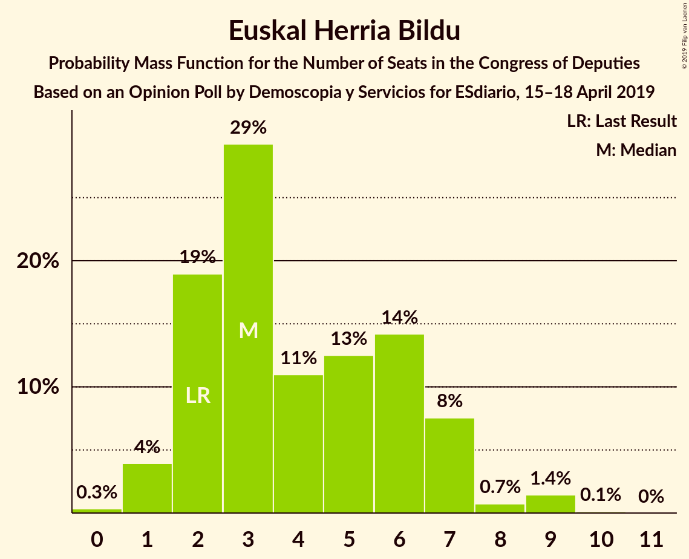
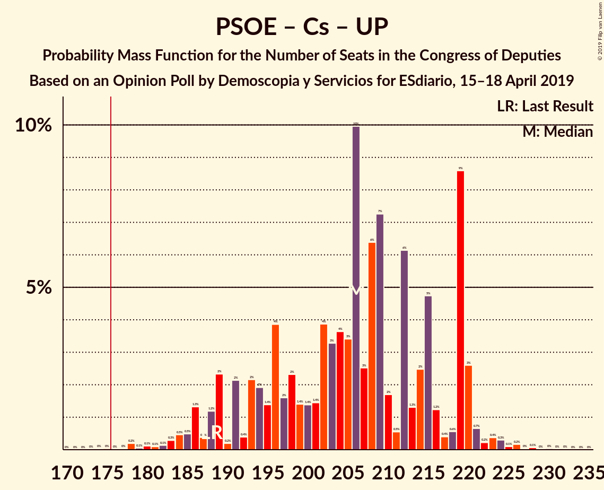
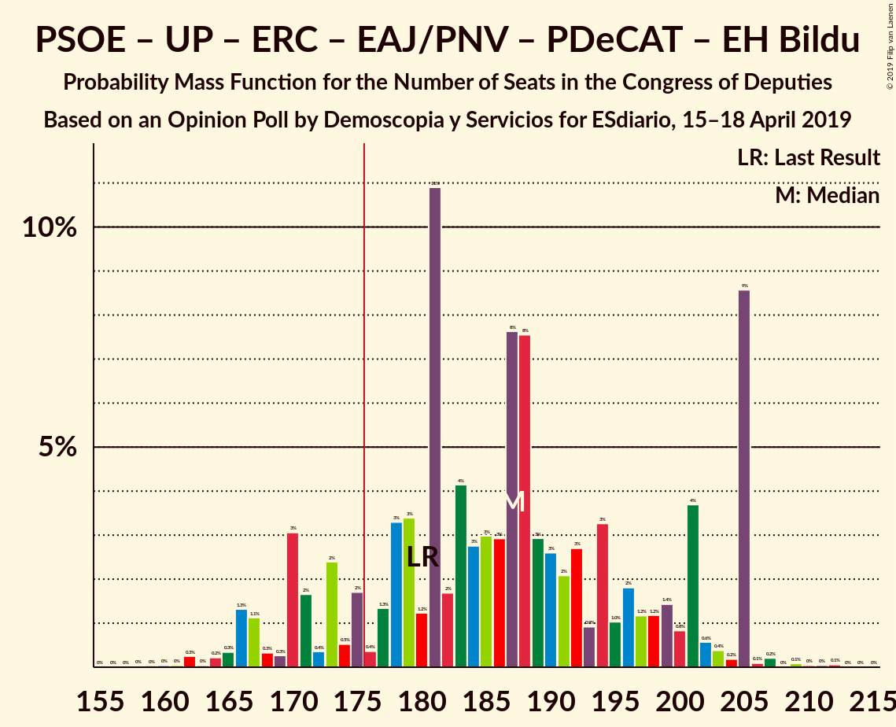
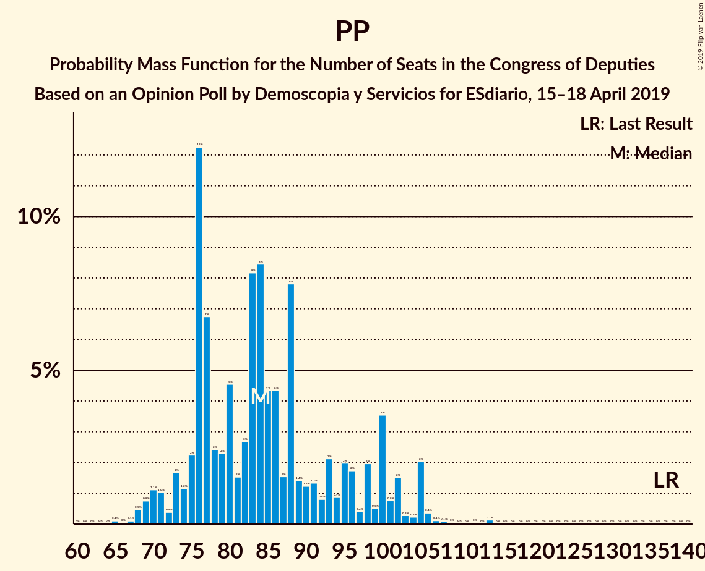

# Opinion Poll by Demoscopia y Servicios for ESdiario, 15–18 April 2019

<a href="#voting-intentions">Voting Intentions</a> | <a href="#seats">Seats</a> | <a href="#coalitions">Coalitions</a> | <a href="#technical-information">Technical Information</a>

## Voting Intentions

### Confidence Intervals

| Party | Last Result | Poll Result | 80% Confidence Interval | 90% Confidence Interval | 95% Confidence Interval | 99% Confidence Interval |
|:-----:|:-----------:|:-----------:|:-----------------------:|:-----------------------:|:-----------------------:|:-----------------------:|
| Partido Socialista Obrero Español | 22.6% | 28.4% | 26.6–30.4% |26.1–30.9% |25.6–31.4% |24.8–32.3% |
| Partido Popular | 33.0% | 21.6% | 19.9–23.4% |19.5–23.9% |19.1–24.3% |18.3–25.2% |
| Ciudadanos–Partido de la Ciudadanía | 13.1% | 14.7% | 13.4–16.3% |13.0–16.8% |12.6–17.1% |12.0–17.9% |
| Unidos Podemos | 21.2% | 13.9% | 12.5–15.4% |12.2–15.9% |11.8–16.2% |11.2–17.0% |
| Vox | 0.2% | 12.4% | 11.1–13.9% |10.8–14.3% |10.5–14.7% |9.9–15.4% |
| Esquerra Republicana de Catalunya–Catalunya Sí | 2.7% | 2.4% | 1.9–3.2% |1.7–3.4% |1.6–3.6% |1.4–4.0% |
| Euzko Alderdi Jeltzalea/Partido Nacionalista Vasco | 1.2% | 1.4% | 1.0–2.0% |0.9–2.2% |0.8–2.3% |0.7–2.7% |
| Partit Demòcrata Europeu Català | 2.0% | 1.2% | 0.8–1.8% |0.7–1.9% |0.6–2.1% |0.5–2.4% |
| Euskal Herria Bildu | 0.8% | 0.9% | 0.6–1.5% |0.6–1.6% |0.5–1.8% |0.4–2.1% |
| Coalición Canaria–Partido Nacionalista Canario | 0.3% | 0.3% | 0.2–0.7% |0.1–0.8% |0.1–0.9% |0.1–1.2% |

*Note:* The poll result column reflects the actual value used in the calculations. Published results may vary slightly, and in addition be rounded to fewer digits.

## Seats

### Confidence Intervals

| Party | Last Result | Median | 80% Confidence Interval | 90% Confidence Interval | 95% Confidence Interval | 99% Confidence Interval |
|:-----:|:-----------:|:------:|:-----------------------:|:-----------------------:|:-----------------------:|:-----------------------:|
| <a href="#partido-socialista-obrero-español">Partido Socialista Obrero Español</a> | 85 | 120 | 108–137 |107–140 |105–140 |100–142 |
| <a href="#partido-popular">Partido Popular</a> | 137 | 84 | 76–98 |73–101 |70–105 |68–107 |
| <a href="#ciudadanos–partido-de-la-ciudadanía">Ciudadanos–Partido de la Ciudadanía</a> | 32 | 46 | 37–54 |34–57 |32–59 |27–61 |
| <a href="#unidos-podemos">Unidos Podemos</a> | 71 | 40 | 31–45 |27–48 |26–48 |25–53 |
| <a href="#vox">Vox</a> | 0 | 31 | 27–40 |26–43 |25–44 |23–47 |
| <a href="#esquerra-republicana-de-catalunya–catalunya-sí">Esquerra Republicana de Catalunya–Catalunya Sí</a> | 9 | 11 | 8–14 |7–15 |7–15 |6–17 |
| <a href="#euzko-alderdi-jeltzalea/partido-nacionalista-vasco">Euzko Alderdi Jeltzalea/Partido Nacionalista Vasco</a> | 5 | 6 | 5–9 |3–10 |3–10 |3–10 |
| <a href="#partit-demòcrata-europeu-català">Partit Demòcrata Europeu Català</a> | 8 | 4 | 3–8 |2–8 |1–8 |1–10 |
| <a href="#euskal-herria-bildu">Euskal Herria Bildu</a> | 2 | 3 | 2–6 |2–7 |1–7 |1–9 |
| <a href="#coalición-canaria–partido-nacionalista-canario">Coalición Canaria–Partido Nacionalista Canario</a> | 1 | 1 | 0–2 |0–2 |0–4 |0–4 |

### Partido Socialista Obrero Español

*For a full overview of the results for this party, see the [Partido Socialista Obrero Español](party-partidosocialistaobreroespañol.html) page.*

| Number of Seats | Probability | Accumulated | Special Marks |
|:---------------:|:-----------:|:-----------:|:-------------:|
| 85 | 0% | 100% | Last Result |
| 86 | 0% | 100% |  |
| 87 | 0% | 100% |  |
| 88 | 0% | 100% |  |
| 89 | 0% | 100% |  |
| 90 | 0% | 100% |  |
| 91 | 0% | 100% |  |
| 92 | 0% | 100% |  |
| 93 | 0% | 100% |  |
| 94 | 0% | 99.9% |  |
| 95 | 0.1% | 99.9% |  |
| 96 | 0% | 99.8% |  |
| 97 | 0.1% | 99.8% |  |
| 98 | 0% | 99.7% |  |
| 99 | 0.2% | 99.7% |  |
| 100 | 0.1% | 99.6% |  |
| 101 | 0.1% | 99.5% |  |
| 102 | 0.3% | 99.4% |  |
| 103 | 0.1% | 99.1% |  |
| 104 | 0.4% | 99.0% |  |
| 105 | 2% | 98.6% |  |
| 106 | 0.8% | 97% |  |
| 107 | 2% | 96% |  |
| 108 | 4% | 94% |  |
| 109 | 2% | 90% |  |
| 110 | 1.5% | 88% |  |
| 111 | 2% | 86% |  |
| 112 | 6% | 85% |  |
| 113 | 9% | 79% |  |
| 114 | 5% | 70% |  |
| 115 | 2% | 65% |  |
| 116 | 2% | 63% |  |
| 117 | 3% | 62% |  |
| 118 | 5% | 59% |  |
| 119 | 2% | 54% |  |
| 120 | 2% | 52% | Median |
| 121 | 4% | 50% |  |
| 122 | 4% | 46% |  |
| 123 | 2% | 42% |  |
| 124 | 3% | 40% |  |
| 125 | 4% | 37% |  |
| 126 | 2% | 33% |  |
| 127 | 2% | 30% |  |
| 128 | 1.2% | 28% |  |
| 129 | 3% | 27% |  |
| 130 | 3% | 24% |  |
| 131 | 2% | 21% |  |
| 132 | 1.2% | 19% |  |
| 133 | 0.5% | 18% |  |
| 134 | 4% | 18% |  |
| 135 | 3% | 13% |  |
| 136 | 0.4% | 11% |  |
| 137 | 0.5% | 10% |  |
| 138 | 0.3% | 10% |  |
| 139 | 0.3% | 9% |  |
| 140 | 9% | 9% |  |
| 141 | 0.1% | 0.6% |  |
| 142 | 0.1% | 0.5% |  |
| 143 | 0.3% | 0.4% |  |
| 144 | 0% | 0.1% |  |
| 145 | 0% | 0.1% |  |
| 146 | 0% | 0% |  |

### Partido Popular

*For a full overview of the results for this party, see the [Partido Popular](party-partidopopular.html) page.*

| Number of Seats | Probability | Accumulated | Special Marks |
|:---------------:|:-----------:|:-----------:|:-------------:|
| 63 | 0% | 100% |  |
| 64 | 0% | 99.9% |  |
| 65 | 0.1% | 99.9% |  |
| 66 | 0% | 99.8% |  |
| 67 | 0.1% | 99.8% |  |
| 68 | 0.5% | 99.7% |  |
| 69 | 0.8% | 99.2% |  |
| 70 | 1.1% | 98% |  |
| 71 | 1.0% | 97% |  |
| 72 | 0.4% | 96% |  |
| 73 | 2% | 96% |  |
| 74 | 1.2% | 94% |  |
| 75 | 2% | 93% |  |
| 76 | 12% | 91% |  |
| 77 | 7% | 79% |  |
| 78 | 2% | 72% |  |
| 79 | 2% | 69% |  |
| 80 | 5% | 67% |  |
| 81 | 2% | 63% |  |
| 82 | 3% | 61% |  |
| 83 | 8% | 58% |  |
| 84 | 8% | 50% | Median |
| 85 | 4% | 42% |  |
| 86 | 4% | 37% |  |
| 87 | 2% | 33% |  |
| 88 | 8% | 31% |  |
| 89 | 1.4% | 24% |  |
| 90 | 1.2% | 22% |  |
| 91 | 1.3% | 21% |  |
| 92 | 0.8% | 20% |  |
| 93 | 2% | 19% |  |
| 94 | 0.9% | 17% |  |
| 95 | 2% | 16% |  |
| 96 | 2% | 14% |  |
| 97 | 0.4% | 12% |  |
| 98 | 2% | 12% |  |
| 99 | 0.5% | 10% |  |
| 100 | 4% | 9% |  |
| 101 | 0.8% | 6% |  |
| 102 | 2% | 5% |  |
| 103 | 0.3% | 3% |  |
| 104 | 0.2% | 3% |  |
| 105 | 2% | 3% |  |
| 106 | 0.4% | 0.9% |  |
| 107 | 0.1% | 0.5% |  |
| 108 | 0.1% | 0.4% |  |
| 109 | 0% | 0.3% |  |
| 110 | 0% | 0.3% |  |
| 111 | 0% | 0.2% |  |
| 112 | 0% | 0.2% |  |
| 113 | 0% | 0.2% |  |
| 114 | 0.1% | 0.2% |  |
| 115 | 0% | 0% |  |
| 116 | 0% | 0% |  |
| 117 | 0% | 0% |  |
| 118 | 0% | 0% |  |
| 119 | 0% | 0% |  |
| 120 | 0% | 0% |  |
| 121 | 0% | 0% |  |
| 122 | 0% | 0% |  |
| 123 | 0% | 0% |  |
| 124 | 0% | 0% |  |
| 125 | 0% | 0% |  |
| 126 | 0% | 0% |  |
| 127 | 0% | 0% |  |
| 128 | 0% | 0% |  |
| 129 | 0% | 0% |  |
| 130 | 0% | 0% |  |
| 131 | 0% | 0% |  |
| 132 | 0% | 0% |  |
| 133 | 0% | 0% |  |
| 134 | 0% | 0% |  |
| 135 | 0% | 0% |  |
| 136 | 0% | 0% |  |
| 137 | 0% | 0% | Last Result |

### Ciudadanos–Partido de la Ciudadanía

*For a full overview of the results for this party, see the [Ciudadanos–Partido de la Ciudadanía](party-ciudadanos–partidodelaciudadanía.html) page.*

| Number of Seats | Probability | Accumulated | Special Marks |
|:---------------:|:-----------:|:-----------:|:-------------:|
| 23 | 0.1% | 100% |  |
| 24 | 0% | 99.9% |  |
| 25 | 0.1% | 99.9% |  |
| 26 | 0.2% | 99.8% |  |
| 27 | 0.1% | 99.6% |  |
| 28 | 0.4% | 99.5% |  |
| 29 | 0.2% | 99.1% |  |
| 30 | 0.3% | 98.9% |  |
| 31 | 0.6% | 98.6% |  |
| 32 | 2% | 98% | Last Result |
| 33 | 0.7% | 96% |  |
| 34 | 0.9% | 95% |  |
| 35 | 1.2% | 94% |  |
| 36 | 2% | 93% |  |
| 37 | 1.3% | 91% |  |
| 38 | 9% | 90% |  |
| 39 | 2% | 81% |  |
| 40 | 2% | 78% |  |
| 41 | 1.4% | 76% |  |
| 42 | 5% | 75% |  |
| 43 | 8% | 70% |  |
| 44 | 4% | 62% |  |
| 45 | 2% | 58% |  |
| 46 | 7% | 56% | Median |
| 47 | 5% | 49% |  |
| 48 | 7% | 45% |  |
| 49 | 7% | 37% |  |
| 50 | 11% | 31% |  |
| 51 | 3% | 19% |  |
| 52 | 2% | 16% |  |
| 53 | 3% | 14% |  |
| 54 | 1.3% | 11% |  |
| 55 | 4% | 10% |  |
| 56 | 1.3% | 6% |  |
| 57 | 2% | 5% |  |
| 58 | 0.3% | 3% |  |
| 59 | 1.5% | 3% |  |
| 60 | 0.7% | 1.3% |  |
| 61 | 0.2% | 0.6% |  |
| 62 | 0.1% | 0.4% |  |
| 63 | 0.1% | 0.2% |  |
| 64 | 0.1% | 0.2% |  |
| 65 | 0% | 0% |  |

### Unidos Podemos

*For a full overview of the results for this party, see the [Unidos Podemos](party-unidospodemos.html) page.*

| Number of Seats | Probability | Accumulated | Special Marks |
|:---------------:|:-----------:|:-----------:|:-------------:|
| 24 | 0.5% | 100% |  |
| 25 | 1.1% | 99.5% |  |
| 26 | 3% | 98% |  |
| 27 | 0.7% | 95% |  |
| 28 | 0.9% | 94% |  |
| 29 | 2% | 94% |  |
| 30 | 1.5% | 92% |  |
| 31 | 2% | 90% |  |
| 32 | 0.6% | 88% |  |
| 33 | 2% | 87% |  |
| 34 | 0.8% | 84% |  |
| 35 | 4% | 84% |  |
| 36 | 10% | 80% |  |
| 37 | 5% | 70% |  |
| 38 | 5% | 64% |  |
| 39 | 6% | 59% |  |
| 40 | 5% | 53% | Median |
| 41 | 18% | 48% |  |
| 42 | 4% | 31% |  |
| 43 | 13% | 27% |  |
| 44 | 3% | 14% |  |
| 45 | 2% | 11% |  |
| 46 | 3% | 9% |  |
| 47 | 0.3% | 6% |  |
| 48 | 3% | 5% |  |
| 49 | 1.0% | 2% |  |
| 50 | 0.2% | 1.1% |  |
| 51 | 0.2% | 0.8% |  |
| 52 | 0.1% | 0.6% |  |
| 53 | 0.4% | 0.6% |  |
| 54 | 0.1% | 0.2% |  |
| 55 | 0% | 0.1% |  |
| 56 | 0% | 0.1% |  |
| 57 | 0% | 0.1% |  |
| 58 | 0% | 0% |  |
| 59 | 0% | 0% |  |
| 60 | 0% | 0% |  |
| 61 | 0% | 0% |  |
| 62 | 0% | 0% |  |
| 63 | 0% | 0% |  |
| 64 | 0% | 0% |  |
| 65 | 0% | 0% |  |
| 66 | 0% | 0% |  |
| 67 | 0% | 0% |  |
| 68 | 0% | 0% |  |
| 69 | 0% | 0% |  |
| 70 | 0% | 0% |  |
| 71 | 0% | 0% | Last Result |

### Vox

*For a full overview of the results for this party, see the [Vox](party-vox.html) page.*

| Number of Seats | Probability | Accumulated | Special Marks |
|:---------------:|:-----------:|:-----------:|:-------------:|
| 0 | 0% | 100% | Last Result |
| 1 | 0% | 100% |  |
| 2 | 0% | 100% |  |
| 3 | 0% | 100% |  |
| 4 | 0% | 100% |  |
| 5 | 0% | 100% |  |
| 6 | 0% | 100% |  |
| 7 | 0% | 100% |  |
| 8 | 0% | 100% |  |
| 9 | 0% | 100% |  |
| 10 | 0% | 100% |  |
| 11 | 0% | 100% |  |
| 12 | 0% | 100% |  |
| 13 | 0% | 100% |  |
| 14 | 0% | 100% |  |
| 15 | 0% | 100% |  |
| 16 | 0% | 100% |  |
| 17 | 0% | 100% |  |
| 18 | 0% | 100% |  |
| 19 | 0% | 100% |  |
| 20 | 0.2% | 100% |  |
| 21 | 0.1% | 99.8% |  |
| 22 | 0.2% | 99.7% |  |
| 23 | 1.2% | 99.6% |  |
| 24 | 0.6% | 98% |  |
| 25 | 0.6% | 98% |  |
| 26 | 2% | 97% |  |
| 27 | 5% | 95% |  |
| 28 | 4% | 90% |  |
| 29 | 6% | 86% |  |
| 30 | 22% | 80% |  |
| 31 | 19% | 58% | Median |
| 32 | 5% | 39% |  |
| 33 | 5% | 34% |  |
| 34 | 4% | 29% |  |
| 35 | 5% | 25% |  |
| 36 | 1.3% | 19% |  |
| 37 | 1.1% | 18% |  |
| 38 | 4% | 17% |  |
| 39 | 2% | 13% |  |
| 40 | 2% | 11% |  |
| 41 | 2% | 9% |  |
| 42 | 1.0% | 7% |  |
| 43 | 4% | 6% |  |
| 44 | 1.2% | 3% |  |
| 45 | 0.7% | 2% |  |
| 46 | 0.2% | 0.8% |  |
| 47 | 0.2% | 0.6% |  |
| 48 | 0.1% | 0.3% |  |
| 49 | 0.1% | 0.3% |  |
| 50 | 0% | 0.2% |  |
| 51 | 0% | 0.2% |  |
| 52 | 0.1% | 0.1% |  |
| 53 | 0% | 0.1% |  |
| 54 | 0% | 0% |  |

### Esquerra Republicana de Catalunya–Catalunya Sí

*For a full overview of the results for this party, see the [Esquerra Republicana de Catalunya–Catalunya Sí](party-esquerrarepublicanadecatalunya–catalunyasí.html) page.*

| Number of Seats | Probability | Accumulated | Special Marks |
|:---------------:|:-----------:|:-----------:|:-------------:|
| 6 | 0.6% | 100% |  |
| 7 | 5% | 99.3% |  |
| 8 | 8% | 94% |  |
| 9 | 20% | 86% | Last Result |
| 10 | 11% | 66% |  |
| 11 | 10% | 55% | Median |
| 12 | 18% | 46% |  |
| 13 | 8% | 28% |  |
| 14 | 11% | 19% |  |
| 15 | 7% | 9% |  |
| 16 | 0.9% | 2% |  |
| 17 | 0.2% | 0.7% |  |
| 18 | 0.2% | 0.5% |  |
| 19 | 0.2% | 0.3% |  |
| 20 | 0.1% | 0.1% |  |
| 21 | 0% | 0% |  |

### Euzko Alderdi Jeltzalea/Partido Nacionalista Vasco

*For a full overview of the results for this party, see the [Euzko Alderdi Jeltzalea/Partido Nacionalista Vasco](party-euzkoalderdijeltzaleapartidonacionalistavasco.html) page.*

| Number of Seats | Probability | Accumulated | Special Marks |
|:---------------:|:-----------:|:-----------:|:-------------:|
| 2 | 0.4% | 100% |  |
| 3 | 5% | 99.6% |  |
| 4 | 2% | 94% |  |
| 5 | 8% | 92% | Last Result |
| 6 | 42% | 84% | Median |
| 7 | 16% | 42% |  |
| 8 | 8% | 26% |  |
| 9 | 9% | 18% |  |
| 10 | 9% | 9% |  |
| 11 | 0.1% | 0.2% |  |
| 12 | 0.1% | 0.1% |  |
| 13 | 0% | 0% |  |

### Partit Demòcrata Europeu Català

*For a full overview of the results for this party, see the [Partit Demòcrata Europeu Català](party-partitdemòcrataeuropeucatalà.html) page.*

| Number of Seats | Probability | Accumulated | Special Marks |
|:---------------:|:-----------:|:-----------:|:-------------:|
| 0 | 0.1% | 100% |  |
| 1 | 4% | 99.9% |  |
| 2 | 4% | 96% |  |
| 3 | 11% | 92% |  |
| 4 | 34% | 81% | Median |
| 5 | 22% | 47% |  |
| 6 | 6% | 25% |  |
| 7 | 6% | 20% |  |
| 8 | 12% | 14% | Last Result |
| 9 | 1.1% | 2% |  |
| 10 | 0.9% | 1.1% |  |
| 11 | 0.1% | 0.2% |  |
| 12 | 0% | 0.1% |  |
| 13 | 0% | 0% |  |

### Euskal Herria Bildu

*For a full overview of the results for this party, see the [Euskal Herria Bildu](party-euskalherriabildu.html) page.*

| Number of Seats | Probability | Accumulated | Special Marks |
|:---------------:|:-----------:|:-----------:|:-------------:|
| 0 | 0.3% | 100% |  |
| 1 | 4% | 99.7% |  |
| 2 | 19% | 96% | Last Result |
| 3 | 29% | 77% | Median |
| 4 | 11% | 48% |  |
| 5 | 13% | 37% |  |
| 6 | 14% | 24% |  |
| 7 | 8% | 10% |  |
| 8 | 0.7% | 2% |  |
| 9 | 1.4% | 2% |  |
| 10 | 0.1% | 0.1% |  |
| 11 | 0% | 0% |  |

### Coalición Canaria–Partido Nacionalista Canario

*For a full overview of the results for this party, see the [Coalición Canaria–Partido Nacionalista Canario](party-coalicióncanaria–partidonacionalistacanario.html) page.*

| Number of Seats | Probability | Accumulated | Special Marks |
|:---------------:|:-----------:|:-----------:|:-------------:|
| 0 | 26% | 100% |  |
| 1 | 56% | 74% | Last Result, Median |
| 2 | 14% | 18% |  |
| 3 | 0.6% | 4% |  |
| 4 | 3% | 3% |  |
| 5 | 0.2% | 0.2% |  |
| 6 | 0% | 0% |  |

## Coalitions

### Confidence Intervals

| Coalition | Last Result | Median | Majority? | 80% Confidence Interval | 90% Confidence Interval | 95% Confidence Interval | 99% Confidence Interval |
|:---------:|:-----------:|:------:|:---------:|:-----------------------:|:-----------------------:|:-----------------------:|:-----------------------:|
| Partido Socialista Obrero Español – Partido Popular – Ciudadanos–Partido de la Ciudadanía | 254 | 251 | 100% | 241–261 | 240–263 | 238–264 | 232–268 |
| Partido Socialista Obrero Español – Partido Popular | 222 | 205 | 100% | 194–216 | 190–219 | 187–220 | 185–227 |
| Partido Socialista Obrero Español – Ciudadanos–Partido de la Ciudadanía – Unidos Podemos | 188 | 206 | 99.9% | 193–219 | 189–219 | 186–220 | 180–224 |
| Partido Socialista Obrero Español – Unidos Podemos – Esquerra Republicana de Catalunya–Catalunya Sí – Euzko Alderdi Jeltzalea/Partido Nacionalista Vasco – Partit Demòcrata Europeu Català – Euskal Herria Bildu | 180 | 187 | 86% | 173–202 | 170–205 | 167–205 | 164–206 |
| Partido Socialista Obrero Español – Unidos Podemos – Esquerra Republicana de Catalunya–Catalunya Sí – Partit Demòcrata Europeu Català | 173 | 175 | 49% | 162–191 | 160–197 | 157–197 | 154–197 |
| Partido Socialista Obrero Español – Unidos Podemos – Esquerra Republicana de Catalunya–Catalunya Sí – Euskal Herria Bildu | 167 | 174 | 47% | 161–191 | 159–195 | 156–195 | 151–195 |
| Partido Socialista Obrero Español – Unidos Podemos – Euzko Alderdi Jeltzalea/Partido Nacionalista Vasco – Euskal Herria Bildu | 163 | 170 | 28% | 157–186 | 153–189 | 151–189 | 147–191 |
| Partido Socialista Obrero Español – Unidos Podemos – Euzko Alderdi Jeltzalea/Partido Nacionalista Vasco | 161 | 165 | 19% | 154–181 | 149–187 | 147–187 | 142–187 |
| Partido Socialista Obrero Español – Ciudadanos–Partido de la Ciudadanía | 117 | 167 | 23% | 153–178 | 149–179 | 146–182 | 143–186 |
| Partido Popular – Ciudadanos–Partido de la Ciudadanía – Vox | 169 | 163 | 11% | 147–176 | 145–179 | 145–182 | 142–185 |
| Partido Socialista Obrero Español – Unidos Podemos | 156 | 159 | 10% | 148–176 | 142–181 | 141–181 | 137–181 |
| Partido Popular – Ciudadanos–Partido de la Ciudadanía – Euzko Alderdi Jeltzalea/Partido Nacionalista Vasco | 174 | 137 | 0% | 120–150 | 120–154 | 120–157 | 114–162 |
| Partido Popular – Ciudadanos–Partido de la Ciudadanía – Coalición Canaria–Partido Nacionalista Canario | 170 | 132 | 0% | 114–145 | 114–149 | 114–153 | 109–156 |
| Partido Popular – Ciudadanos–Partido de la Ciudadanía | 169 | 131 | 0% | 114–144 | 114–148 | 113–152 | 108–154 |
| Partido Socialista Obrero Español | 85 | 120 | 0% | 108–137 | 107–140 | 105–140 | 100–142 |
| Partido Popular – Vox | 137 | 116 | 0% | 107–131 | 106–135 | 102–136 | 99–141 |
| Partido Popular | 137 | 84 | 0% | 76–98 | 73–101 | 70–105 | 68–107 |

### Partido Socialista Obrero Español – Partido Popular – Ciudadanos–Partido de la Ciudadanía

| Number of Seats | Probability | Accumulated | Special Marks |
|:---------------:|:-----------:|:-----------:|:-------------:|
| 227 | 0% | 100% |  |
| 228 | 0.1% | 99.9% |  |
| 229 | 0.1% | 99.9% |  |
| 230 | 0% | 99.8% |  |
| 231 | 0.2% | 99.7% |  |
| 232 | 0.2% | 99.5% |  |
| 233 | 0.1% | 99.3% |  |
| 234 | 0.1% | 99.2% |  |
| 235 | 0.6% | 99.1% |  |
| 236 | 0.1% | 98% |  |
| 237 | 0.8% | 98% |  |
| 238 | 1.1% | 98% |  |
| 239 | 0.7% | 96% |  |
| 240 | 1.4% | 96% |  |
| 241 | 5% | 94% |  |
| 242 | 6% | 89% |  |
| 243 | 2% | 83% |  |
| 244 | 0.8% | 81% |  |
| 245 | 3% | 80% |  |
| 246 | 2% | 77% |  |
| 247 | 1.0% | 76% |  |
| 248 | 2% | 75% |  |
| 249 | 3% | 73% |  |
| 250 | 6% | 70% | Median |
| 251 | 14% | 63% |  |
| 252 | 6% | 49% |  |
| 253 | 4% | 43% |  |
| 254 | 11% | 39% | Last Result |
| 255 | 2% | 28% |  |
| 256 | 3% | 25% |  |
| 257 | 4% | 22% |  |
| 258 | 2% | 18% |  |
| 259 | 1.2% | 17% |  |
| 260 | 5% | 15% |  |
| 261 | 1.3% | 11% |  |
| 262 | 4% | 10% |  |
| 263 | 1.3% | 5% |  |
| 264 | 2% | 4% |  |
| 265 | 0.3% | 2% |  |
| 266 | 0.5% | 2% |  |
| 267 | 0.4% | 1.1% |  |
| 268 | 0.2% | 0.7% |  |
| 269 | 0.1% | 0.5% |  |
| 270 | 0% | 0.3% |  |
| 271 | 0.1% | 0.3% |  |
| 272 | 0.1% | 0.2% |  |
| 273 | 0% | 0.1% |  |
| 274 | 0% | 0% |  |

### Partido Socialista Obrero Español – Partido Popular

| Number of Seats | Probability | Accumulated | Special Marks |
|:---------------:|:-----------:|:-----------:|:-------------:|
| 178 | 0% | 100% |  |
| 179 | 0% | 99.9% |  |
| 180 | 0.1% | 99.9% |  |
| 181 | 0% | 99.8% |  |
| 182 | 0% | 99.8% |  |
| 183 | 0% | 99.8% |  |
| 184 | 0% | 99.7% |  |
| 185 | 0.5% | 99.7% |  |
| 186 | 2% | 99.3% |  |
| 187 | 0.1% | 98% |  |
| 188 | 0.6% | 97% |  |
| 189 | 1.0% | 97% |  |
| 190 | 2% | 96% |  |
| 191 | 0.9% | 94% |  |
| 192 | 1.1% | 93% |  |
| 193 | 2% | 92% |  |
| 194 | 2% | 90% |  |
| 195 | 3% | 88% |  |
| 196 | 1.1% | 85% |  |
| 197 | 2% | 84% |  |
| 198 | 2% | 82% |  |
| 199 | 2% | 80% |  |
| 200 | 3% | 78% |  |
| 201 | 14% | 76% |  |
| 202 | 1.0% | 62% |  |
| 203 | 2% | 61% |  |
| 204 | 3% | 59% | Median |
| 205 | 6% | 56% |  |
| 206 | 4% | 50% |  |
| 207 | 4% | 46% |  |
| 208 | 3% | 42% |  |
| 209 | 2% | 39% |  |
| 210 | 0.6% | 37% |  |
| 211 | 6% | 36% |  |
| 212 | 4% | 30% |  |
| 213 | 2% | 26% |  |
| 214 | 3% | 24% |  |
| 215 | 1.0% | 21% |  |
| 216 | 10% | 20% |  |
| 217 | 0.3% | 10% |  |
| 218 | 0.8% | 9% |  |
| 219 | 5% | 9% |  |
| 220 | 1.0% | 3% |  |
| 221 | 0.3% | 2% |  |
| 222 | 0.3% | 2% | Last Result |
| 223 | 0.2% | 2% |  |
| 224 | 0.3% | 1.5% |  |
| 225 | 0.5% | 1.2% |  |
| 226 | 0.2% | 0.7% |  |
| 227 | 0.1% | 0.6% |  |
| 228 | 0.1% | 0.4% |  |
| 229 | 0.1% | 0.3% |  |
| 230 | 0% | 0.2% |  |
| 231 | 0.1% | 0.2% |  |
| 232 | 0% | 0.1% |  |
| 233 | 0% | 0.1% |  |
| 234 | 0% | 0.1% |  |
| 235 | 0% | 0.1% |  |
| 236 | 0% | 0% |  |

### Partido Socialista Obrero Español – Ciudadanos–Partido de la Ciudadanía – Unidos Podemos

| Number of Seats | Probability | Accumulated | Special Marks |
|:---------------:|:-----------:|:-----------:|:-------------:|
| 174 | 0% | 100% |  |
| 175 | 0% | 99.9% |  |
| 176 | 0% | 99.9% | Majority |
| 177 | 0% | 99.9% |  |
| 178 | 0.2% | 99.9% |  |
| 179 | 0.1% | 99.7% |  |
| 180 | 0.1% | 99.6% |  |
| 181 | 0.1% | 99.5% |  |
| 182 | 0.1% | 99.4% |  |
| 183 | 0.3% | 99.3% |  |
| 184 | 0.5% | 99.0% |  |
| 185 | 0.5% | 98.5% |  |
| 186 | 1.3% | 98% |  |
| 187 | 0.4% | 97% |  |
| 188 | 1.2% | 96% | Last Result |
| 189 | 2% | 95% |  |
| 190 | 0.2% | 93% |  |
| 191 | 2% | 93% |  |
| 192 | 0.4% | 90% |  |
| 193 | 2% | 90% |  |
| 194 | 2% | 88% |  |
| 195 | 1.4% | 86% |  |
| 196 | 4% | 85% |  |
| 197 | 2% | 81% |  |
| 198 | 2% | 79% |  |
| 199 | 1.4% | 77% |  |
| 200 | 1.4% | 75% |  |
| 201 | 1.4% | 74% |  |
| 202 | 4% | 73% |  |
| 203 | 3% | 69% |  |
| 204 | 4% | 65% |  |
| 205 | 3% | 62% |  |
| 206 | 10% | 58% | Median |
| 207 | 3% | 48% |  |
| 208 | 6% | 46% |  |
| 209 | 7% | 40% |  |
| 210 | 2% | 32% |  |
| 211 | 0.5% | 31% |  |
| 212 | 6% | 30% |  |
| 213 | 1.3% | 24% |  |
| 214 | 2% | 23% |  |
| 215 | 5% | 20% |  |
| 216 | 1.2% | 15% |  |
| 217 | 0.4% | 14% |  |
| 218 | 0.6% | 14% |  |
| 219 | 9% | 13% |  |
| 220 | 3% | 5% |  |
| 221 | 0.7% | 2% |  |
| 222 | 0.2% | 1.3% |  |
| 223 | 0.4% | 1.1% |  |
| 224 | 0.3% | 0.8% |  |
| 225 | 0.1% | 0.5% |  |
| 226 | 0.2% | 0.4% |  |
| 227 | 0% | 0.2% |  |
| 228 | 0.1% | 0.2% |  |
| 229 | 0% | 0.1% |  |
| 230 | 0% | 0.1% |  |
| 231 | 0% | 0% |  |

### Partido Socialista Obrero Español – Unidos Podemos – Esquerra Republicana de Catalunya–Catalunya Sí – Euzko Alderdi Jeltzalea/Partido Nacionalista Vasco – Partit Demòcrata Europeu Català – Euskal Herria Bildu

| Number of Seats | Probability | Accumulated | Special Marks |
|:---------------:|:-----------:|:-----------:|:-------------:|
| 157 | 0% | 100% |  |
| 158 | 0% | 99.9% |  |
| 159 | 0% | 99.9% |  |
| 160 | 0% | 99.9% |  |
| 161 | 0% | 99.8% |  |
| 162 | 0.3% | 99.8% |  |
| 163 | 0% | 99.5% |  |
| 164 | 0.2% | 99.5% |  |
| 165 | 0.3% | 99.3% |  |
| 166 | 1.3% | 98.9% |  |
| 167 | 1.1% | 98% |  |
| 168 | 0.3% | 96% |  |
| 169 | 0.3% | 96% |  |
| 170 | 3% | 96% |  |
| 171 | 2% | 93% |  |
| 172 | 0.4% | 91% |  |
| 173 | 2% | 91% |  |
| 174 | 0.5% | 88% |  |
| 175 | 2% | 88% |  |
| 176 | 0.4% | 86% | Majority |
| 177 | 1.3% | 86% |  |
| 178 | 3% | 84% |  |
| 179 | 3% | 81% |  |
| 180 | 1.2% | 78% | Last Result |
| 181 | 11% | 77% |  |
| 182 | 2% | 66% |  |
| 183 | 4% | 64% |  |
| 184 | 3% | 60% | Median |
| 185 | 3% | 57% |  |
| 186 | 3% | 54% |  |
| 187 | 8% | 51% |  |
| 188 | 8% | 44% |  |
| 189 | 3% | 36% |  |
| 190 | 3% | 33% |  |
| 191 | 2% | 30% |  |
| 192 | 3% | 28% |  |
| 193 | 0.9% | 26% |  |
| 194 | 3% | 25% |  |
| 195 | 1.0% | 21% |  |
| 196 | 2% | 20% |  |
| 197 | 1.2% | 19% |  |
| 198 | 1.2% | 17% |  |
| 199 | 1.4% | 16% |  |
| 200 | 0.8% | 15% |  |
| 201 | 4% | 14% |  |
| 202 | 0.6% | 10% |  |
| 203 | 0.4% | 10% |  |
| 204 | 0.2% | 9% |  |
| 205 | 9% | 9% |  |
| 206 | 0.1% | 0.6% |  |
| 207 | 0.2% | 0.5% |  |
| 208 | 0% | 0.3% |  |
| 209 | 0.1% | 0.3% |  |
| 210 | 0% | 0.2% |  |
| 211 | 0% | 0.1% |  |
| 212 | 0.1% | 0.1% |  |
| 213 | 0% | 0% |  |

### Partido Socialista Obrero Español – Unidos Podemos – Esquerra Republicana de Catalunya–Catalunya Sí – Partit Demòcrata Europeu Català

| Number of Seats | Probability | Accumulated | Special Marks |
|:---------------:|:-----------:|:-----------:|:-------------:|
| 147 | 0% | 100% |  |
| 148 | 0% | 99.9% |  |
| 149 | 0.1% | 99.9% |  |
| 150 | 0.1% | 99.8% |  |
| 151 | 0% | 99.8% |  |
| 152 | 0.1% | 99.7% |  |
| 153 | 0.1% | 99.6% |  |
| 154 | 0.1% | 99.5% |  |
| 155 | 2% | 99.4% |  |
| 156 | 0.3% | 98% |  |
| 157 | 0.2% | 98% |  |
| 158 | 1.3% | 97% |  |
| 159 | 0.6% | 96% |  |
| 160 | 0.8% | 95% |  |
| 161 | 4% | 95% |  |
| 162 | 1.1% | 91% |  |
| 163 | 0.2% | 90% |  |
| 164 | 1.4% | 90% |  |
| 165 | 2% | 88% |  |
| 166 | 2% | 86% |  |
| 167 | 3% | 84% |  |
| 168 | 3% | 81% |  |
| 169 | 7% | 77% |  |
| 170 | 3% | 70% |  |
| 171 | 3% | 67% |  |
| 172 | 2% | 63% |  |
| 173 | 4% | 62% | Last Result |
| 174 | 4% | 57% |  |
| 175 | 4% | 53% | Median |
| 176 | 4% | 49% | Majority |
| 177 | 1.4% | 44% |  |
| 178 | 2% | 43% |  |
| 179 | 11% | 41% |  |
| 180 | 3% | 30% |  |
| 181 | 2% | 27% |  |
| 182 | 2% | 25% |  |
| 183 | 1.3% | 23% |  |
| 184 | 2% | 22% |  |
| 185 | 0.9% | 20% |  |
| 186 | 1.2% | 19% |  |
| 187 | 2% | 18% |  |
| 188 | 3% | 16% |  |
| 189 | 2% | 12% |  |
| 190 | 0.4% | 11% |  |
| 191 | 0.5% | 10% |  |
| 192 | 0.5% | 10% |  |
| 193 | 0.3% | 9% |  |
| 194 | 0.2% | 9% |  |
| 195 | 0.2% | 9% |  |
| 196 | 0% | 9% |  |
| 197 | 8% | 9% |  |
| 198 | 0.1% | 0.3% |  |
| 199 | 0.1% | 0.3% |  |
| 200 | 0.1% | 0.2% |  |
| 201 | 0.1% | 0.1% |  |
| 202 | 0% | 0% |  |

### Partido Socialista Obrero Español – Unidos Podemos – Esquerra Republicana de Catalunya–Catalunya Sí – Euskal Herria Bildu

| Number of Seats | Probability | Accumulated | Special Marks |
|:---------------:|:-----------:|:-----------:|:-------------:|
| 145 | 0% | 100% |  |
| 146 | 0% | 99.9% |  |
| 147 | 0% | 99.9% |  |
| 148 | 0% | 99.9% |  |
| 149 | 0.1% | 99.8% |  |
| 150 | 0.1% | 99.8% |  |
| 151 | 0.4% | 99.7% |  |
| 152 | 0.2% | 99.4% |  |
| 153 | 0.2% | 99.2% |  |
| 154 | 1.1% | 99.0% |  |
| 155 | 0.3% | 98% |  |
| 156 | 0.5% | 98% |  |
| 157 | 1.2% | 97% |  |
| 158 | 0.2% | 96% |  |
| 159 | 2% | 96% |  |
| 160 | 0.9% | 94% |  |
| 161 | 3% | 93% |  |
| 162 | 2% | 90% |  |
| 163 | 2% | 88% |  |
| 164 | 1.0% | 86% |  |
| 165 | 1.3% | 85% |  |
| 166 | 3% | 83% |  |
| 167 | 1.1% | 81% | Last Result |
| 168 | 9% | 80% |  |
| 169 | 0.8% | 71% |  |
| 170 | 4% | 70% |  |
| 171 | 5% | 66% |  |
| 172 | 4% | 61% |  |
| 173 | 5% | 57% |  |
| 174 | 5% | 53% | Median |
| 175 | 0.8% | 48% |  |
| 176 | 3% | 47% | Majority |
| 177 | 6% | 43% |  |
| 178 | 6% | 38% |  |
| 179 | 3% | 32% |  |
| 180 | 0.6% | 29% |  |
| 181 | 1.2% | 28% |  |
| 182 | 3% | 27% |  |
| 183 | 1.1% | 24% |  |
| 184 | 0.5% | 23% |  |
| 185 | 2% | 23% |  |
| 186 | 7% | 21% |  |
| 187 | 0.5% | 14% |  |
| 188 | 1.4% | 13% |  |
| 189 | 0.9% | 12% |  |
| 190 | 0.8% | 11% |  |
| 191 | 0.4% | 10% |  |
| 192 | 0.3% | 10% |  |
| 193 | 0.3% | 9% |  |
| 194 | 0.1% | 9% |  |
| 195 | 9% | 9% |  |
| 196 | 0.2% | 0.5% |  |
| 197 | 0.1% | 0.3% |  |
| 198 | 0.1% | 0.2% |  |
| 199 | 0.1% | 0.1% |  |
| 200 | 0% | 0.1% |  |
| 201 | 0% | 0.1% |  |
| 202 | 0% | 0.1% |  |
| 203 | 0% | 0% |  |

### Partido Socialista Obrero Español – Unidos Podemos – Euzko Alderdi Jeltzalea/Partido Nacionalista Vasco – Euskal Herria Bildu

| Number of Seats | Probability | Accumulated | Special Marks |
|:---------------:|:-----------:|:-----------:|:-------------:|
| 141 | 0% | 100% |  |
| 142 | 0% | 99.9% |  |
| 143 | 0.1% | 99.9% |  |
| 144 | 0% | 99.8% |  |
| 145 | 0.1% | 99.8% |  |
| 146 | 0.1% | 99.8% |  |
| 147 | 0.2% | 99.6% |  |
| 148 | 0.2% | 99.4% |  |
| 149 | 0.5% | 99.2% |  |
| 150 | 1.1% | 98.7% |  |
| 151 | 2% | 98% |  |
| 152 | 0.2% | 96% |  |
| 153 | 0.5% | 96% |  |
| 154 | 0.8% | 95% |  |
| 155 | 1.5% | 94% |  |
| 156 | 1.3% | 93% |  |
| 157 | 3% | 91% |  |
| 158 | 2% | 88% |  |
| 159 | 0.5% | 86% |  |
| 160 | 2% | 86% |  |
| 161 | 2% | 84% |  |
| 162 | 2% | 82% |  |
| 163 | 2% | 81% | Last Result |
| 164 | 3% | 79% |  |
| 165 | 2% | 76% |  |
| 166 | 4% | 74% |  |
| 167 | 3% | 70% |  |
| 168 | 12% | 67% |  |
| 169 | 2% | 56% | Median |
| 170 | 6% | 53% |  |
| 171 | 5% | 47% |  |
| 172 | 2% | 42% |  |
| 173 | 4% | 40% |  |
| 174 | 6% | 36% |  |
| 175 | 1.2% | 30% |  |
| 176 | 2% | 28% | Majority |
| 177 | 2% | 27% |  |
| 178 | 1.2% | 25% |  |
| 179 | 1.1% | 24% |  |
| 180 | 3% | 23% |  |
| 181 | 3% | 19% |  |
| 182 | 0.8% | 16% |  |
| 183 | 4% | 16% |  |
| 184 | 0.9% | 11% |  |
| 185 | 0.4% | 11% |  |
| 186 | 0.4% | 10% |  |
| 187 | 0.2% | 10% |  |
| 188 | 0.2% | 10% |  |
| 189 | 9% | 9% |  |
| 190 | 0.2% | 0.8% |  |
| 191 | 0.1% | 0.5% |  |
| 192 | 0.2% | 0.4% |  |
| 193 | 0.1% | 0.2% |  |
| 194 | 0% | 0.1% |  |
| 195 | 0% | 0.1% |  |
| 196 | 0% | 0% |  |

### Partido Socialista Obrero Español – Unidos Podemos – Euzko Alderdi Jeltzalea/Partido Nacionalista Vasco

| Number of Seats | Probability | Accumulated | Special Marks |
|:---------------:|:-----------:|:-----------:|:-------------:|
| 137 | 0% | 100% |  |
| 138 | 0% | 99.9% |  |
| 139 | 0% | 99.9% |  |
| 140 | 0.1% | 99.8% |  |
| 141 | 0.1% | 99.7% |  |
| 142 | 0.2% | 99.7% |  |
| 143 | 0.1% | 99.5% |  |
| 144 | 0.2% | 99.4% |  |
| 145 | 0.2% | 99.2% |  |
| 146 | 1.2% | 99.0% |  |
| 147 | 0.7% | 98% |  |
| 148 | 2% | 97% |  |
| 149 | 0.9% | 95% |  |
| 150 | 1.1% | 95% |  |
| 151 | 0.7% | 93% |  |
| 152 | 1.2% | 93% |  |
| 153 | 1.3% | 92% |  |
| 154 | 5% | 90% |  |
| 155 | 2% | 86% |  |
| 156 | 0.8% | 83% |  |
| 157 | 0.7% | 83% |  |
| 158 | 2% | 82% |  |
| 159 | 3% | 80% |  |
| 160 | 0.8% | 77% |  |
| 161 | 5% | 77% | Last Result |
| 162 | 0.8% | 72% |  |
| 163 | 6% | 71% |  |
| 164 | 3% | 65% |  |
| 165 | 12% | 62% |  |
| 166 | 2% | 50% | Median |
| 167 | 7% | 48% |  |
| 168 | 4% | 40% |  |
| 169 | 1.3% | 37% |  |
| 170 | 2% | 35% |  |
| 171 | 2% | 33% |  |
| 172 | 5% | 31% |  |
| 173 | 1.2% | 26% |  |
| 174 | 2% | 25% |  |
| 175 | 4% | 24% |  |
| 176 | 2% | 19% | Majority |
| 177 | 2% | 17% |  |
| 178 | 1.1% | 16% |  |
| 179 | 0.4% | 15% |  |
| 180 | 4% | 14% |  |
| 181 | 0.3% | 10% |  |
| 182 | 0.2% | 10% |  |
| 183 | 0.2% | 10% |  |
| 184 | 0.3% | 10% |  |
| 185 | 0.1% | 9% |  |
| 186 | 0.3% | 9% |  |
| 187 | 8% | 9% |  |
| 188 | 0.1% | 0.4% |  |
| 189 | 0.1% | 0.3% |  |
| 190 | 0.1% | 0.2% |  |
| 191 | 0% | 0.1% |  |
| 192 | 0% | 0% |  |

### Partido Socialista Obrero Español – Ciudadanos–Partido de la Ciudadanía

| Number of Seats | Probability | Accumulated | Special Marks |
|:---------------:|:-----------:|:-----------:|:-------------:|
| 117 | 0% | 100% | Last Result |
| 118 | 0% | 100% |  |
| 119 | 0% | 100% |  |
| 120 | 0% | 100% |  |
| 121 | 0% | 100% |  |
| 122 | 0% | 100% |  |
| 123 | 0% | 100% |  |
| 124 | 0% | 100% |  |
| 125 | 0% | 100% |  |
| 126 | 0% | 100% |  |
| 127 | 0% | 100% |  |
| 128 | 0% | 100% |  |
| 129 | 0% | 100% |  |
| 130 | 0% | 100% |  |
| 131 | 0% | 100% |  |
| 132 | 0% | 100% |  |
| 133 | 0% | 100% |  |
| 134 | 0% | 100% |  |
| 135 | 0% | 100% |  |
| 136 | 0% | 100% |  |
| 137 | 0% | 99.9% |  |
| 138 | 0% | 99.9% |  |
| 139 | 0.1% | 99.9% |  |
| 140 | 0.1% | 99.8% |  |
| 141 | 0.1% | 99.8% |  |
| 142 | 0.1% | 99.6% |  |
| 143 | 0.1% | 99.6% |  |
| 144 | 0.3% | 99.4% |  |
| 145 | 0.1% | 99.1% |  |
| 146 | 3% | 99.0% |  |
| 147 | 0.2% | 96% |  |
| 148 | 1.0% | 96% |  |
| 149 | 1.2% | 95% |  |
| 150 | 0.3% | 94% |  |
| 151 | 0.4% | 94% |  |
| 152 | 0.7% | 93% |  |
| 153 | 3% | 93% |  |
| 154 | 0.8% | 90% |  |
| 155 | 2% | 89% |  |
| 156 | 0.5% | 87% |  |
| 157 | 1.4% | 87% |  |
| 158 | 3% | 86% |  |
| 159 | 2% | 83% |  |
| 160 | 5% | 82% |  |
| 161 | 2% | 77% |  |
| 162 | 2% | 75% |  |
| 163 | 12% | 73% |  |
| 164 | 1.4% | 62% |  |
| 165 | 3% | 60% |  |
| 166 | 4% | 58% | Median |
| 167 | 6% | 54% |  |
| 168 | 4% | 48% |  |
| 169 | 3% | 44% |  |
| 170 | 2% | 41% |  |
| 171 | 4% | 39% |  |
| 172 | 5% | 35% |  |
| 173 | 3% | 30% |  |
| 174 | 2% | 28% |  |
| 175 | 2% | 25% |  |
| 176 | 4% | 23% | Majority |
| 177 | 1.2% | 19% |  |
| 178 | 13% | 18% |  |
| 179 | 0.4% | 5% |  |
| 180 | 0.4% | 5% |  |
| 181 | 1.5% | 4% |  |
| 182 | 0.6% | 3% |  |
| 183 | 0.2% | 2% |  |
| 184 | 0.9% | 2% |  |
| 185 | 0.3% | 1.0% |  |
| 186 | 0.2% | 0.7% |  |
| 187 | 0.2% | 0.5% |  |
| 188 | 0.1% | 0.3% |  |
| 189 | 0.1% | 0.2% |  |
| 190 | 0.1% | 0.1% |  |
| 191 | 0.1% | 0.1% |  |
| 192 | 0% | 0% |  |

### Partido Popular – Ciudadanos–Partido de la Ciudadanía – Vox

| Number of Seats | Probability | Accumulated | Special Marks |
|:---------------:|:-----------:|:-----------:|:-------------:|
| 138 | 0.1% | 100% |  |
| 139 | 0.1% | 99.9% |  |
| 140 | 0% | 99.8% |  |
| 141 | 0.1% | 99.7% |  |
| 142 | 0.2% | 99.7% |  |
| 143 | 0.1% | 99.5% |  |
| 144 | 0.1% | 99.3% |  |
| 145 | 9% | 99.2% |  |
| 146 | 0.4% | 91% |  |
| 147 | 0.4% | 90% |  |
| 148 | 4% | 90% |  |
| 149 | 0.5% | 86% |  |
| 150 | 0.8% | 85% |  |
| 151 | 2% | 84% |  |
| 152 | 1.2% | 82% |  |
| 153 | 2% | 81% |  |
| 154 | 0.8% | 79% |  |
| 155 | 4% | 79% |  |
| 156 | 2% | 75% |  |
| 157 | 1.5% | 73% |  |
| 158 | 3% | 71% |  |
| 159 | 1.3% | 69% |  |
| 160 | 5% | 67% |  |
| 161 | 4% | 62% | Median |
| 162 | 8% | 58% |  |
| 163 | 5% | 50% |  |
| 164 | 3% | 45% |  |
| 165 | 2% | 42% |  |
| 166 | 4% | 41% |  |
| 167 | 1.3% | 36% |  |
| 168 | 12% | 35% |  |
| 169 | 2% | 23% | Last Result |
| 170 | 0.9% | 21% |  |
| 171 | 5% | 20% |  |
| 172 | 0.9% | 15% |  |
| 173 | 0.7% | 14% |  |
| 174 | 2% | 13% |  |
| 175 | 0.8% | 12% |  |
| 176 | 2% | 11% | Majority |
| 177 | 0.6% | 9% |  |
| 178 | 0.9% | 8% |  |
| 179 | 3% | 7% |  |
| 180 | 0.3% | 4% |  |
| 181 | 0.3% | 4% |  |
| 182 | 1.1% | 3% |  |
| 183 | 2% | 2% |  |
| 184 | 0.1% | 0.7% |  |
| 185 | 0.2% | 0.7% |  |
| 186 | 0.2% | 0.5% |  |
| 187 | 0.1% | 0.3% |  |
| 188 | 0.1% | 0.2% |  |
| 189 | 0% | 0.1% |  |
| 190 | 0% | 0.1% |  |
| 191 | 0% | 0.1% |  |
| 192 | 0% | 0% |  |

### Partido Socialista Obrero Español – Unidos Podemos

| Number of Seats | Probability | Accumulated | Special Marks |
|:---------------:|:-----------:|:-----------:|:-------------:|
| 130 | 0% | 100% |  |
| 131 | 0% | 99.9% |  |
| 132 | 0% | 99.9% |  |
| 133 | 0.1% | 99.9% |  |
| 134 | 0.1% | 99.8% |  |
| 135 | 0.1% | 99.8% |  |
| 136 | 0.2% | 99.7% |  |
| 137 | 0.1% | 99.5% |  |
| 138 | 0.2% | 99.4% |  |
| 139 | 0.5% | 99.2% |  |
| 140 | 1.1% | 98.7% |  |
| 141 | 2% | 98% |  |
| 142 | 1.3% | 96% |  |
| 143 | 1.1% | 95% |  |
| 144 | 0.3% | 94% |  |
| 145 | 0.3% | 93% |  |
| 146 | 0.7% | 93% |  |
| 147 | 1.3% | 92% |  |
| 148 | 5% | 91% |  |
| 149 | 3% | 86% |  |
| 150 | 1.3% | 83% |  |
| 151 | 1.1% | 82% |  |
| 152 | 2% | 81% |  |
| 153 | 2% | 78% |  |
| 154 | 3% | 76% |  |
| 155 | 3% | 74% |  |
| 156 | 9% | 71% | Last Result |
| 157 | 4% | 61% |  |
| 158 | 3% | 58% |  |
| 159 | 5% | 54% |  |
| 160 | 4% | 50% | Median |
| 161 | 8% | 45% |  |
| 162 | 1.3% | 37% |  |
| 163 | 3% | 36% |  |
| 164 | 1.1% | 33% |  |
| 165 | 1.3% | 31% |  |
| 166 | 5% | 30% |  |
| 167 | 2% | 26% |  |
| 168 | 2% | 24% |  |
| 169 | 3% | 22% |  |
| 170 | 6% | 18% |  |
| 171 | 0.7% | 13% |  |
| 172 | 0.6% | 12% |  |
| 173 | 0.4% | 11% |  |
| 174 | 0.8% | 11% |  |
| 175 | 0.2% | 10% |  |
| 176 | 0.5% | 10% | Majority |
| 177 | 0.3% | 10% |  |
| 178 | 0.1% | 9% |  |
| 179 | 0.3% | 9% |  |
| 180 | 0.1% | 9% |  |
| 181 | 8% | 9% |  |
| 182 | 0.1% | 0.3% |  |
| 183 | 0% | 0.2% |  |
| 184 | 0.1% | 0.2% |  |
| 185 | 0% | 0.1% |  |
| 186 | 0% | 0% |  |

### Partido Popular – Ciudadanos–Partido de la Ciudadanía – Euzko Alderdi Jeltzalea/Partido Nacionalista Vasco

| Number of Seats | Probability | Accumulated | Special Marks |
|:---------------:|:-----------:|:-----------:|:-------------:|
| 110 | 0.1% | 100% |  |
| 111 | 0.1% | 99.9% |  |
| 112 | 0% | 99.8% |  |
| 113 | 0.2% | 99.8% |  |
| 114 | 0.2% | 99.6% |  |
| 115 | 0.1% | 99.5% |  |
| 116 | 1.0% | 99.4% |  |
| 117 | 0.1% | 98% |  |
| 118 | 0.2% | 98% |  |
| 119 | 0.2% | 98% |  |
| 120 | 9% | 98% |  |
| 121 | 1.1% | 89% |  |
| 122 | 1.1% | 88% |  |
| 123 | 1.4% | 87% |  |
| 124 | 1.3% | 85% |  |
| 125 | 2% | 84% |  |
| 126 | 0.9% | 83% |  |
| 127 | 3% | 82% |  |
| 128 | 2% | 79% |  |
| 129 | 5% | 77% |  |
| 130 | 1.4% | 73% |  |
| 131 | 2% | 71% |  |
| 132 | 1.0% | 69% |  |
| 133 | 7% | 68% |  |
| 134 | 4% | 61% |  |
| 135 | 4% | 58% |  |
| 136 | 2% | 54% | Median |
| 137 | 2% | 52% |  |
| 138 | 5% | 50% |  |
| 139 | 5% | 45% |  |
| 140 | 5% | 40% |  |
| 141 | 0.9% | 34% |  |
| 142 | 1.1% | 34% |  |
| 143 | 4% | 32% |  |
| 144 | 3% | 29% |  |
| 145 | 2% | 26% |  |
| 146 | 2% | 24% |  |
| 147 | 9% | 22% |  |
| 148 | 2% | 13% |  |
| 149 | 0.5% | 12% |  |
| 150 | 2% | 11% |  |
| 151 | 0.4% | 9% |  |
| 152 | 2% | 9% |  |
| 153 | 0.5% | 7% |  |
| 154 | 3% | 7% |  |
| 155 | 0.2% | 4% |  |
| 156 | 0.1% | 3% |  |
| 157 | 1.2% | 3% |  |
| 158 | 0.1% | 2% |  |
| 159 | 0.1% | 2% |  |
| 160 | 0.2% | 2% |  |
| 161 | 1.0% | 1.5% |  |
| 162 | 0.4% | 0.5% |  |
| 163 | 0% | 0.1% |  |
| 164 | 0% | 0.1% |  |
| 165 | 0% | 0.1% |  |
| 166 | 0% | 0.1% |  |
| 167 | 0% | 0% |  |
| 168 | 0% | 0% |  |
| 169 | 0% | 0% |  |
| 170 | 0% | 0% |  |
| 171 | 0% | 0% |  |
| 172 | 0% | 0% |  |
| 173 | 0% | 0% |  |
| 174 | 0% | 0% | Last Result |

### Partido Popular – Ciudadanos–Partido de la Ciudadanía – Coalición Canaria–Partido Nacionalista Canario

| Number of Seats | Probability | Accumulated | Special Marks |
|:---------------:|:-----------:|:-----------:|:-------------:|
| 105 | 0.1% | 100% |  |
| 106 | 0.1% | 99.9% |  |
| 107 | 0% | 99.9% |  |
| 108 | 0.2% | 99.8% |  |
| 109 | 0.8% | 99.6% |  |
| 110 | 0.2% | 98.8% |  |
| 111 | 0.2% | 98.7% |  |
| 112 | 0.2% | 98% |  |
| 113 | 0.2% | 98% |  |
| 114 | 9% | 98% |  |
| 115 | 1.1% | 89% |  |
| 116 | 0.4% | 88% |  |
| 117 | 0.6% | 88% |  |
| 118 | 1.2% | 87% |  |
| 119 | 1.4% | 86% |  |
| 120 | 5% | 85% |  |
| 121 | 3% | 80% |  |
| 122 | 2% | 77% |  |
| 123 | 0.8% | 75% |  |
| 124 | 1.3% | 74% |  |
| 125 | 1.5% | 73% |  |
| 126 | 2% | 72% |  |
| 127 | 6% | 70% |  |
| 128 | 2% | 64% |  |
| 129 | 6% | 62% |  |
| 130 | 2% | 56% |  |
| 131 | 3% | 54% | Median |
| 132 | 1.3% | 51% |  |
| 133 | 7% | 50% |  |
| 134 | 7% | 43% |  |
| 135 | 2% | 36% |  |
| 136 | 2% | 34% |  |
| 137 | 2% | 32% |  |
| 138 | 4% | 30% |  |
| 139 | 8% | 26% |  |
| 140 | 3% | 18% |  |
| 141 | 0.8% | 15% |  |
| 142 | 0.9% | 14% |  |
| 143 | 1.4% | 13% |  |
| 144 | 0.8% | 12% |  |
| 145 | 2% | 11% |  |
| 146 | 0.7% | 9% |  |
| 147 | 0.9% | 8% |  |
| 148 | 0.6% | 7% |  |
| 149 | 3% | 7% |  |
| 150 | 0.2% | 4% |  |
| 151 | 0.4% | 3% |  |
| 152 | 0.2% | 3% |  |
| 153 | 1.0% | 3% |  |
| 154 | 1.1% | 2% |  |
| 155 | 0.3% | 0.9% |  |
| 156 | 0.4% | 0.6% |  |
| 157 | 0.1% | 0.2% |  |
| 158 | 0% | 0.1% |  |
| 159 | 0% | 0.1% |  |
| 160 | 0% | 0.1% |  |
| 161 | 0% | 0.1% |  |
| 162 | 0% | 0% |  |
| 163 | 0% | 0% |  |
| 164 | 0% | 0% |  |
| 165 | 0% | 0% |  |
| 166 | 0% | 0% |  |
| 167 | 0% | 0% |  |
| 168 | 0% | 0% |  |
| 169 | 0% | 0% |  |
| 170 | 0% | 0% | Last Result |

### Partido Popular – Ciudadanos–Partido de la Ciudadanía

| Number of Seats | Probability | Accumulated | Special Marks |
|:---------------:|:-----------:|:-----------:|:-------------:|
| 104 | 0.1% | 100% |  |
| 105 | 0% | 99.9% |  |
| 106 | 0% | 99.8% |  |
| 107 | 0.2% | 99.8% |  |
| 108 | 0.9% | 99.6% |  |
| 109 | 0.1% | 98.8% |  |
| 110 | 0.3% | 98.7% |  |
| 111 | 0.2% | 98% |  |
| 112 | 0.3% | 98% |  |
| 113 | 0.4% | 98% |  |
| 114 | 9% | 97% |  |
| 115 | 0.6% | 88% |  |
| 116 | 0.5% | 88% |  |
| 117 | 2% | 87% |  |
| 118 | 1.1% | 85% |  |
| 119 | 4% | 84% |  |
| 120 | 3% | 80% |  |
| 121 | 2% | 78% |  |
| 122 | 1.0% | 76% |  |
| 123 | 2% | 75% |  |
| 124 | 3% | 73% |  |
| 125 | 1.4% | 70% |  |
| 126 | 1.4% | 68% |  |
| 127 | 7% | 67% |  |
| 128 | 3% | 60% |  |
| 129 | 2% | 57% |  |
| 130 | 5% | 55% | Median |
| 131 | 3% | 50% |  |
| 132 | 4% | 48% |  |
| 133 | 8% | 44% |  |
| 134 | 2% | 35% |  |
| 135 | 3% | 34% |  |
| 136 | 1.1% | 31% |  |
| 137 | 4% | 30% |  |
| 138 | 7% | 26% |  |
| 139 | 2% | 19% |  |
| 140 | 2% | 16% |  |
| 141 | 0.8% | 14% |  |
| 142 | 2% | 13% |  |
| 143 | 0.7% | 12% |  |
| 144 | 2% | 11% |  |
| 145 | 0.6% | 8% |  |
| 146 | 1.0% | 8% |  |
| 147 | 0.3% | 7% |  |
| 148 | 3% | 6% |  |
| 149 | 0.3% | 3% |  |
| 150 | 0.1% | 3% |  |
| 151 | 0.2% | 3% |  |
| 152 | 1.0% | 3% |  |
| 153 | 1.1% | 2% |  |
| 154 | 0.6% | 0.8% |  |
| 155 | 0% | 0.2% |  |
| 156 | 0.1% | 0.2% |  |
| 157 | 0% | 0.1% |  |
| 158 | 0% | 0.1% |  |
| 159 | 0% | 0.1% |  |
| 160 | 0% | 0% |  |
| 161 | 0% | 0% |  |
| 162 | 0% | 0% |  |
| 163 | 0% | 0% |  |
| 164 | 0% | 0% |  |
| 165 | 0% | 0% |  |
| 166 | 0% | 0% |  |
| 167 | 0% | 0% |  |
| 168 | 0% | 0% |  |
| 169 | 0% | 0% | Last Result |

### Partido Socialista Obrero Español

| Number of Seats | Probability | Accumulated | Special Marks |
|:---------------:|:-----------:|:-----------:|:-------------:|
| 85 | 0% | 100% | Last Result |
| 86 | 0% | 100% |  |
| 87 | 0% | 100% |  |
| 88 | 0% | 100% |  |
| 89 | 0% | 100% |  |
| 90 | 0% | 100% |  |
| 91 | 0% | 100% |  |
| 92 | 0% | 100% |  |
| 93 | 0% | 100% |  |
| 94 | 0% | 99.9% |  |
| 95 | 0.1% | 99.9% |  |
| 96 | 0% | 99.8% |  |
| 97 | 0.1% | 99.8% |  |
| 98 | 0% | 99.7% |  |
| 99 | 0.2% | 99.7% |  |
| 100 | 0.1% | 99.6% |  |
| 101 | 0.1% | 99.5% |  |
| 102 | 0.3% | 99.4% |  |
| 103 | 0.1% | 99.1% |  |
| 104 | 0.4% | 99.0% |  |
| 105 | 2% | 98.6% |  |
| 106 | 0.8% | 97% |  |
| 107 | 2% | 96% |  |
| 108 | 4% | 94% |  |
| 109 | 2% | 90% |  |
| 110 | 1.5% | 88% |  |
| 111 | 2% | 86% |  |
| 112 | 6% | 85% |  |
| 113 | 9% | 79% |  |
| 114 | 5% | 70% |  |
| 115 | 2% | 65% |  |
| 116 | 2% | 63% |  |
| 117 | 3% | 62% |  |
| 118 | 5% | 59% |  |
| 119 | 2% | 54% |  |
| 120 | 2% | 52% | Median |
| 121 | 4% | 50% |  |
| 122 | 4% | 46% |  |
| 123 | 2% | 42% |  |
| 124 | 3% | 40% |  |
| 125 | 4% | 37% |  |
| 126 | 2% | 33% |  |
| 127 | 2% | 30% |  |
| 128 | 1.2% | 28% |  |
| 129 | 3% | 27% |  |
| 130 | 3% | 24% |  |
| 131 | 2% | 21% |  |
| 132 | 1.2% | 19% |  |
| 133 | 0.5% | 18% |  |
| 134 | 4% | 18% |  |
| 135 | 3% | 13% |  |
| 136 | 0.4% | 11% |  |
| 137 | 0.5% | 10% |  |
| 138 | 0.3% | 10% |  |
| 139 | 0.3% | 9% |  |
| 140 | 9% | 9% |  |
| 141 | 0.1% | 0.6% |  |
| 142 | 0.1% | 0.5% |  |
| 143 | 0.3% | 0.4% |  |
| 144 | 0% | 0.1% |  |
| 145 | 0% | 0.1% |  |
| 146 | 0% | 0% |  |

### Partido Popular – Vox

| Number of Seats | Probability | Accumulated | Special Marks |
|:---------------:|:-----------:|:-----------:|:-------------:|
| 93 | 0% | 100% |  |
| 94 | 0% | 99.9% |  |
| 95 | 0% | 99.9% |  |
| 96 | 0.1% | 99.9% |  |
| 97 | 0.1% | 99.8% |  |
| 98 | 0.2% | 99.7% |  |
| 99 | 0.1% | 99.5% |  |
| 100 | 0.3% | 99.4% |  |
| 101 | 0.8% | 99.1% |  |
| 102 | 1.4% | 98% |  |
| 103 | 0.3% | 97% |  |
| 104 | 1.3% | 97% |  |
| 105 | 0.3% | 95% |  |
| 106 | 3% | 95% |  |
| 107 | 12% | 92% |  |
| 108 | 2% | 80% |  |
| 109 | 0.9% | 79% |  |
| 110 | 2% | 78% |  |
| 111 | 2% | 76% |  |
| 112 | 6% | 74% |  |
| 113 | 7% | 67% |  |
| 114 | 6% | 60% |  |
| 115 | 3% | 54% | Median |
| 116 | 7% | 51% |  |
| 117 | 1.0% | 44% |  |
| 118 | 11% | 43% |  |
| 119 | 3% | 32% |  |
| 120 | 2% | 29% |  |
| 121 | 2% | 27% |  |
| 122 | 2% | 25% |  |
| 123 | 3% | 24% |  |
| 124 | 1.1% | 21% |  |
| 125 | 2% | 20% |  |
| 126 | 0.5% | 18% |  |
| 127 | 2% | 17% |  |
| 128 | 2% | 15% |  |
| 129 | 0.5% | 13% |  |
| 130 | 0.6% | 13% |  |
| 131 | 3% | 12% |  |
| 132 | 2% | 9% |  |
| 133 | 1.1% | 7% |  |
| 134 | 0.3% | 6% |  |
| 135 | 1.0% | 5% |  |
| 136 | 3% | 4% |  |
| 137 | 0.4% | 1.4% | Last Result |
| 138 | 0.3% | 1.1% |  |
| 139 | 0.1% | 0.8% |  |
| 140 | 0.1% | 0.7% |  |
| 141 | 0.3% | 0.7% |  |
| 142 | 0.1% | 0.4% |  |
| 143 | 0% | 0.3% |  |
| 144 | 0.1% | 0.3% |  |
| 145 | 0% | 0.2% |  |
| 146 | 0.1% | 0.2% |  |
| 147 | 0% | 0.1% |  |
| 148 | 0% | 0% |  |

### Partido Popular

| Number of Seats | Probability | Accumulated | Special Marks |
|:---------------:|:-----------:|:-----------:|:-------------:|
| 63 | 0% | 100% |  |
| 64 | 0% | 99.9% |  |
| 65 | 0.1% | 99.9% |  |
| 66 | 0% | 99.8% |  |
| 67 | 0.1% | 99.8% |  |
| 68 | 0.5% | 99.7% |  |
| 69 | 0.8% | 99.2% |  |
| 70 | 1.1% | 98% |  |
| 71 | 1.0% | 97% |  |
| 72 | 0.4% | 96% |  |
| 73 | 2% | 96% |  |
| 74 | 1.2% | 94% |  |
| 75 | 2% | 93% |  |
| 76 | 12% | 91% |  |
| 77 | 7% | 79% |  |
| 78 | 2% | 72% |  |
| 79 | 2% | 69% |  |
| 80 | 5% | 67% |  |
| 81 | 2% | 63% |  |
| 82 | 3% | 61% |  |
| 83 | 8% | 58% |  |
| 84 | 8% | 50% | Median |
| 85 | 4% | 42% |  |
| 86 | 4% | 37% |  |
| 87 | 2% | 33% |  |
| 88 | 8% | 31% |  |
| 89 | 1.4% | 24% |  |
| 90 | 1.2% | 22% |  |
| 91 | 1.3% | 21% |  |
| 92 | 0.8% | 20% |  |
| 93 | 2% | 19% |  |
| 94 | 0.9% | 17% |  |
| 95 | 2% | 16% |  |
| 96 | 2% | 14% |  |
| 97 | 0.4% | 12% |  |
| 98 | 2% | 12% |  |
| 99 | 0.5% | 10% |  |
| 100 | 4% | 9% |  |
| 101 | 0.8% | 6% |  |
| 102 | 2% | 5% |  |
| 103 | 0.3% | 3% |  |
| 104 | 0.2% | 3% |  |
| 105 | 2% | 3% |  |
| 106 | 0.4% | 0.9% |  |
| 107 | 0.1% | 0.5% |  |
| 108 | 0.1% | 0.4% |  |
| 109 | 0% | 0.3% |  |
| 110 | 0% | 0.3% |  |
| 111 | 0% | 0.2% |  |
| 112 | 0% | 0.2% |  |
| 113 | 0% | 0.2% |  |
| 114 | 0.1% | 0.2% |  |
| 115 | 0% | 0% |  |
| 116 | 0% | 0% |  |
| 117 | 0% | 0% |  |
| 118 | 0% | 0% |  |
| 119 | 0% | 0% |  |
| 120 | 0% | 0% |  |
| 121 | 0% | 0% |  |
| 122 | 0% | 0% |  |
| 123 | 0% | 0% |  |
| 124 | 0% | 0% |  |
| 125 | 0% | 0% |  |
| 126 | 0% | 0% |  |
| 127 | 0% | 0% |  |
| 128 | 0% | 0% |  |
| 129 | 0% | 0% |  |
| 130 | 0% | 0% |  |
| 131 | 0% | 0% |  |
| 132 | 0% | 0% |  |
| 133 | 0% | 0% |  |
| 134 | 0% | 0% |  |
| 135 | 0% | 0% |  |
| 136 | 0% | 0% |  |
| 137 | 0% | 0% | Last Result |

## Technical Information

### Opinion Poll

+ **Polling firm:** Demoscopia y Servicios
+ **Commissioner(s):** ESdiario
+ **Fieldwork period:** 15–18 April 2019

### Calculations

+ **Sample size:** 950
+ **Simulations done:** 1,048,576
+ **Error estimate:** 4.44%

