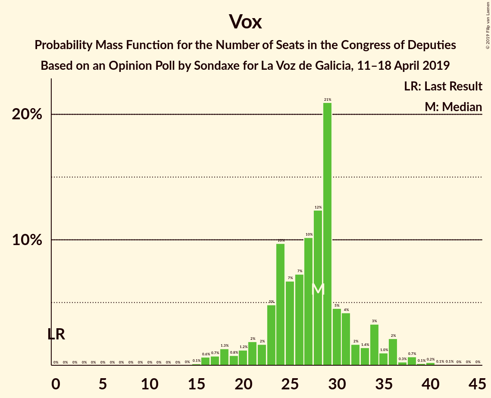
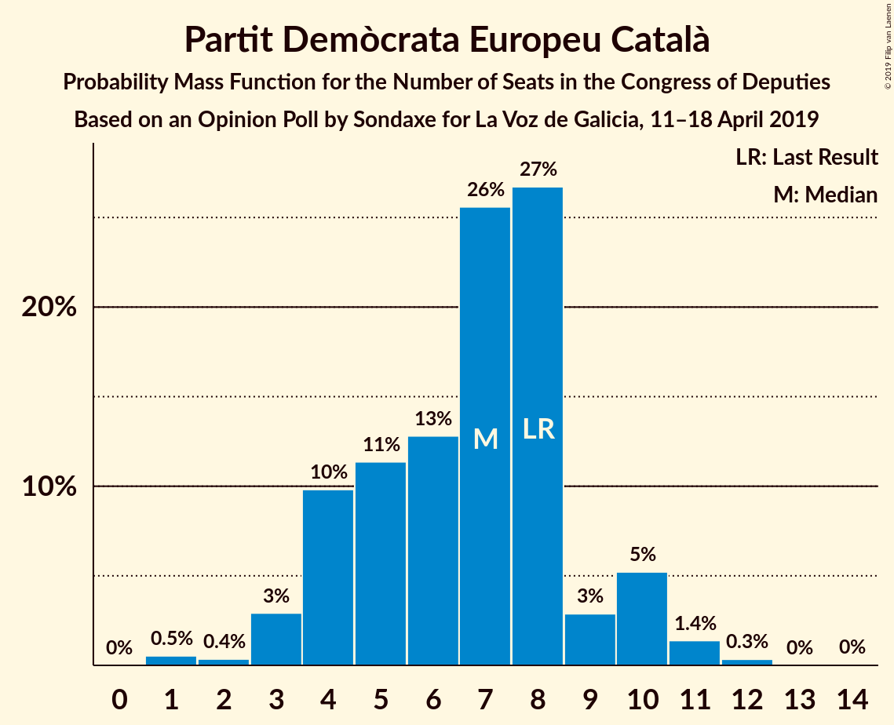
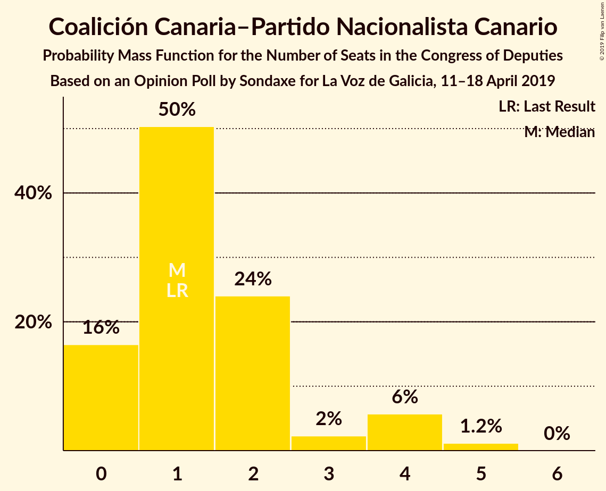
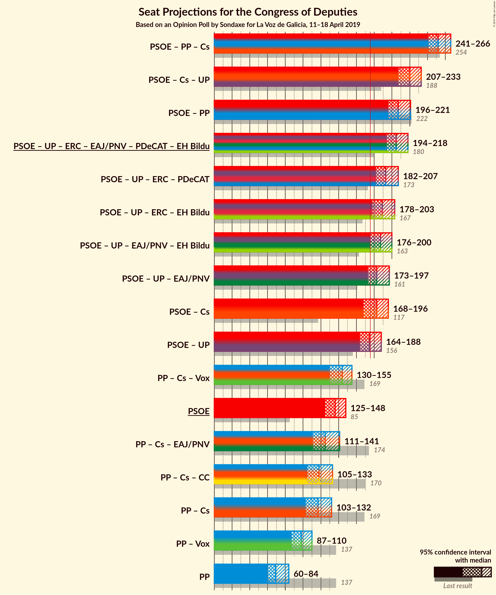

# Opinion Poll by Sondaxe for La Voz de Galicia, 11–18 April 2019

<a href="#voting-intentions">Voting Intentions</a> | <a href="#seats">Seats</a> | <a href="#coalitions">Coalitions</a> | <a href="#technical-information">Technical Information</a>

## Voting Intentions

### Confidence Intervals

| Party | Last Result | Poll Result | 80% Confidence Interval | 90% Confidence Interval | 95% Confidence Interval | 99% Confidence Interval |
|:-----:|:-----------:|:-----------:|:-----------------------:|:-----------------------:|:-----------------------:|:-----------------------:|
| Partido Socialista Obrero Español | 22.6% | 30.9% | 29.1–32.8% |28.5–33.4% |28.1–33.8% |27.3–34.8% |
| Partido Popular | 33.0% | 18.3% | 16.8–20.0% |16.4–20.4% |16.0–20.8% |15.3–21.6% |
| Ciudadanos–Partido de la Ciudadanía | 13.1% | 13.8% | 12.5–15.3% |12.1–15.7% |11.8–16.1% |11.2–16.8% |
| Unidos Podemos | 21.2% | 13.6% | 12.3–15.1% |11.9–15.5% |11.6–15.9% |11.0–16.6% |
| Vox | 0.2% | 10.5% | 9.3–11.8% |9.0–12.2% |8.7–12.6% |8.2–13.2% |
| Esquerra Republicana de Catalunya–Catalunya Sí | 2.7% | 2.8% | 2.2–3.6% |2.1–3.8% |1.9–4.0% |1.7–4.4% |
| Euzko Alderdi Jeltzalea/Partido Nacionalista Vasco | 1.2% | 2.1% | 1.6–2.8% |1.5–3.0% |1.4–3.2% |1.2–3.6% |
| Partit Demòcrata Europeu Català | 2.0% | 1.5% | 1.1–2.1% |1.0–2.3% |0.9–2.5% |0.7–2.8% |
| Euskal Herria Bildu | 0.8% | 0.8% | 0.5–1.3% |0.5–1.4% |0.4–1.6% |0.3–1.9% |
| Coalición Canaria–Partido Nacionalista Canario | 0.3% | 0.4% | 0.2–0.8% |0.2–0.9% |0.2–1.0% |0.1–1.3% |

*Note:* The poll result column reflects the actual value used in the calculations. Published results may vary slightly, and in addition be rounded to fewer digits.

## Seats

### Confidence Intervals

| Party | Last Result | Median | 80% Confidence Interval | 90% Confidence Interval | 95% Confidence Interval | 99% Confidence Interval |
|:-----:|:-----------:|:------:|:-----------------------:|:-----------------------:|:-----------------------:|:-----------------------:|
| <a href="#partido-socialista-obrero-español">Partido Socialista Obrero Español</a> | 85 | 135 | 135–144 |130–144 |129–144 |122–150 |
| <a href="#partido-popular">Partido Popular</a> | 137 | 69 | 67–73 |62–77 |62–78 |57–94 |
| <a href="#ciudadanos–partido-de-la-ciudadanía">Ciudadanos–Partido de la Ciudadanía</a> | 32 | 48 | 42–52 |37–53 |36–54 |30–56 |
| <a href="#unidos-podemos">Unidos Podemos</a> | 71 | 38 | 33–38 |30–40 |30–47 |30–50 |
| <a href="#vox">Vox</a> | 0 | 29 | 23–31 |23–32 |22–35 |19–40 |
| <a href="#esquerra-republicana-de-catalunya–catalunya-sí">Esquerra Republicana de Catalunya–Catalunya Sí</a> | 9 | 11 | 11–14 |9–15 |9–16 |9–19 |
| <a href="#euzko-alderdi-jeltzalea/partido-nacionalista-vasco">Euzko Alderdi Jeltzalea/Partido Nacionalista Vasco</a> | 5 | 7 | 7–11 |7–11 |6–11 |6–12 |
| <a href="#partit-demòcrata-europeu-català">Partit Demòcrata Europeu Català</a> | 8 | 7 | 4–7 |4–9 |3–10 |2–10 |
| <a href="#euskal-herria-bildu">Euskal Herria Bildu</a> | 2 | 5 | 2–5 |1–5 |1–5 |0–6 |
| <a href="#coalición-canaria–partido-nacionalista-canario">Coalición Canaria–Partido Nacionalista Canario</a> | 1 | 1 | 1 |1–2 |1–3 |0–5 |

### Partido Socialista Obrero Español

*For a full overview of the results for this party, see the [Partido Socialista Obrero Español](party-partidosocialistaobreroespañol.html) page.*

| Number of Seats | Probability | Accumulated | Special Marks |
|:---------------:|:-----------:|:-----------:|:-------------:|
| 85 | 0% | 100% | Last Result |
| 86 | 0% | 100% |  |
| 87 | 0% | 100% |  |
| 88 | 0% | 100% |  |
| 89 | 0% | 100% |  |
| 90 | 0% | 100% |  |
| 91 | 0% | 100% |  |
| 92 | 0% | 100% |  |
| 93 | 0% | 100% |  |
| 94 | 0% | 100% |  |
| 95 | 0% | 100% |  |
| 96 | 0% | 100% |  |
| 97 | 0% | 100% |  |
| 98 | 0% | 100% |  |
| 99 | 0% | 100% |  |
| 100 | 0% | 100% |  |
| 101 | 0% | 100% |  |
| 102 | 0% | 100% |  |
| 103 | 0% | 100% |  |
| 104 | 0% | 100% |  |
| 105 | 0% | 100% |  |
| 106 | 0% | 100% |  |
| 107 | 0% | 100% |  |
| 108 | 0% | 100% |  |
| 109 | 0% | 100% |  |
| 110 | 0% | 100% |  |
| 111 | 0% | 100% |  |
| 112 | 0% | 100% |  |
| 113 | 0% | 100% |  |
| 114 | 0.1% | 100% |  |
| 115 | 0% | 99.9% |  |
| 116 | 0% | 99.9% |  |
| 117 | 0% | 99.9% |  |
| 118 | 0% | 99.9% |  |
| 119 | 0% | 99.9% |  |
| 120 | 0% | 99.9% |  |
| 121 | 0% | 99.9% |  |
| 122 | 0.4% | 99.9% |  |
| 123 | 0.1% | 99.4% |  |
| 124 | 0% | 99.3% |  |
| 125 | 0.1% | 99.3% |  |
| 126 | 0% | 99.2% |  |
| 127 | 0% | 99.2% |  |
| 128 | 0.1% | 99.2% |  |
| 129 | 4% | 99.1% |  |
| 130 | 0.9% | 95% |  |
| 131 | 1.1% | 94% |  |
| 132 | 0.2% | 93% |  |
| 133 | 0.4% | 93% |  |
| 134 | 1.0% | 93% |  |
| 135 | 63% | 92% | Median |
| 136 | 3% | 29% |  |
| 137 | 4% | 26% |  |
| 138 | 1.4% | 22% |  |
| 139 | 3% | 20% |  |
| 140 | 0.7% | 17% |  |
| 141 | 1.0% | 16% |  |
| 142 | 2% | 15% |  |
| 143 | 1.4% | 13% |  |
| 144 | 9% | 12% |  |
| 145 | 0.9% | 2% |  |
| 146 | 0.1% | 2% |  |
| 147 | 0.6% | 1.5% |  |
| 148 | 0.3% | 0.9% |  |
| 149 | 0% | 0.6% |  |
| 150 | 0.1% | 0.5% |  |
| 151 | 0% | 0.5% |  |
| 152 | 0% | 0.4% |  |
| 153 | 0.2% | 0.4% |  |
| 154 | 0% | 0.2% |  |
| 155 | 0% | 0.2% |  |
| 156 | 0% | 0.2% |  |
| 157 | 0% | 0.2% |  |
| 158 | 0% | 0.1% |  |
| 159 | 0% | 0.1% |  |
| 160 | 0% | 0.1% |  |
| 161 | 0% | 0.1% |  |
| 162 | 0% | 0.1% |  |
| 163 | 0% | 0.1% |  |
| 164 | 0.1% | 0.1% |  |
| 165 | 0% | 0% |  |

### Partido Popular

*For a full overview of the results for this party, see the [Partido Popular](party-partidopopular.html) page.*

| Number of Seats | Probability | Accumulated | Special Marks |
|:---------------:|:-----------:|:-----------:|:-------------:|
| 56 | 0.1% | 100% |  |
| 57 | 0.7% | 99.8% |  |
| 58 | 0% | 99.1% |  |
| 59 | 0.4% | 99.1% |  |
| 60 | 0.4% | 98.7% |  |
| 61 | 0.4% | 98% |  |
| 62 | 5% | 98% |  |
| 63 | 0.5% | 93% |  |
| 64 | 0.1% | 93% |  |
| 65 | 2% | 92% |  |
| 66 | 0.3% | 91% |  |
| 67 | 4% | 90% |  |
| 68 | 0.8% | 86% |  |
| 69 | 65% | 85% | Median |
| 70 | 0.6% | 20% |  |
| 71 | 2% | 19% |  |
| 72 | 0.9% | 17% |  |
| 73 | 7% | 17% |  |
| 74 | 0.9% | 10% |  |
| 75 | 0.5% | 9% |  |
| 76 | 1.4% | 8% |  |
| 77 | 4% | 7% |  |
| 78 | 0.8% | 3% |  |
| 79 | 0.1% | 2% |  |
| 80 | 0.6% | 2% |  |
| 81 | 0.1% | 1.2% |  |
| 82 | 0.1% | 1.1% |  |
| 83 | 0.1% | 1.0% |  |
| 84 | 0% | 0.9% |  |
| 85 | 0% | 0.9% |  |
| 86 | 0.1% | 0.9% |  |
| 87 | 0% | 0.8% |  |
| 88 | 0% | 0.8% |  |
| 89 | 0% | 0.8% |  |
| 90 | 0.1% | 0.7% |  |
| 91 | 0% | 0.7% |  |
| 92 | 0% | 0.6% |  |
| 93 | 0% | 0.6% |  |
| 94 | 0.6% | 0.6% |  |
| 95 | 0% | 0% |  |
| 96 | 0% | 0% |  |
| 97 | 0% | 0% |  |
| 98 | 0% | 0% |  |
| 99 | 0% | 0% |  |
| 100 | 0% | 0% |  |
| 101 | 0% | 0% |  |
| 102 | 0% | 0% |  |
| 103 | 0% | 0% |  |
| 104 | 0% | 0% |  |
| 105 | 0% | 0% |  |
| 106 | 0% | 0% |  |
| 107 | 0% | 0% |  |
| 108 | 0% | 0% |  |
| 109 | 0% | 0% |  |
| 110 | 0% | 0% |  |
| 111 | 0% | 0% |  |
| 112 | 0% | 0% |  |
| 113 | 0% | 0% |  |
| 114 | 0% | 0% |  |
| 115 | 0% | 0% |  |
| 116 | 0% | 0% |  |
| 117 | 0% | 0% |  |
| 118 | 0% | 0% |  |
| 119 | 0% | 0% |  |
| 120 | 0% | 0% |  |
| 121 | 0% | 0% |  |
| 122 | 0% | 0% |  |
| 123 | 0% | 0% |  |
| 124 | 0% | 0% |  |
| 125 | 0% | 0% |  |
| 126 | 0% | 0% |  |
| 127 | 0% | 0% |  |
| 128 | 0% | 0% |  |
| 129 | 0% | 0% |  |
| 130 | 0% | 0% |  |
| 131 | 0% | 0% |  |
| 132 | 0% | 0% |  |
| 133 | 0% | 0% |  |
| 134 | 0% | 0% |  |
| 135 | 0% | 0% |  |
| 136 | 0% | 0% |  |
| 137 | 0% | 0% | Last Result |

### Ciudadanos–Partido de la Ciudadanía

*For a full overview of the results for this party, see the [Ciudadanos–Partido de la Ciudadanía](party-ciudadanos–partidodelaciudadanía.html) page.*

| Number of Seats | Probability | Accumulated | Special Marks |
|:---------------:|:-----------:|:-----------:|:-------------:|
| 25 | 0% | 100% |  |
| 26 | 0% | 99.9% |  |
| 27 | 0% | 99.9% |  |
| 28 | 0% | 99.9% |  |
| 29 | 0.2% | 99.9% |  |
| 30 | 0.3% | 99.7% |  |
| 31 | 0.2% | 99.4% |  |
| 32 | 1.1% | 99.3% | Last Result |
| 33 | 0.2% | 98% |  |
| 34 | 0.2% | 98% |  |
| 35 | 0.3% | 98% |  |
| 36 | 0.6% | 98% |  |
| 37 | 2% | 97% |  |
| 38 | 0.4% | 94% |  |
| 39 | 0.3% | 94% |  |
| 40 | 0.3% | 94% |  |
| 41 | 2% | 94% |  |
| 42 | 2% | 91% |  |
| 43 | 0.1% | 89% |  |
| 44 | 0.5% | 89% |  |
| 45 | 0.2% | 89% |  |
| 46 | 9% | 89% |  |
| 47 | 3% | 80% |  |
| 48 | 63% | 76% | Median |
| 49 | 3% | 13% |  |
| 50 | 0.6% | 11% |  |
| 51 | 0.1% | 10% |  |
| 52 | 5% | 10% |  |
| 53 | 1.2% | 5% |  |
| 54 | 3% | 4% |  |
| 55 | 0% | 0.7% |  |
| 56 | 0.5% | 0.7% |  |
| 57 | 0.1% | 0.2% |  |
| 58 | 0% | 0.1% |  |
| 59 | 0% | 0.1% |  |
| 60 | 0.1% | 0.1% |  |
| 61 | 0% | 0% |  |

### Unidos Podemos

*For a full overview of the results for this party, see the [Unidos Podemos](party-unidospodemos.html) page.*

| Number of Seats | Probability | Accumulated | Special Marks |
|:---------------:|:-----------:|:-----------:|:-------------:|
| 26 | 0% | 100% |  |
| 27 | 0% | 99.9% |  |
| 28 | 0.1% | 99.9% |  |
| 29 | 0.2% | 99.8% |  |
| 30 | 8% | 99.6% |  |
| 31 | 0.3% | 92% |  |
| 32 | 1.5% | 92% |  |
| 33 | 2% | 90% |  |
| 34 | 2% | 88% |  |
| 35 | 10% | 87% |  |
| 36 | 2% | 77% |  |
| 37 | 5% | 75% |  |
| 38 | 63% | 70% | Median |
| 39 | 0.8% | 7% |  |
| 40 | 2% | 6% |  |
| 41 | 0.2% | 4% |  |
| 42 | 0.5% | 3% |  |
| 43 | 0.1% | 3% |  |
| 44 | 0% | 3% |  |
| 45 | 0.1% | 3% |  |
| 46 | 0.1% | 3% |  |
| 47 | 0.1% | 3% |  |
| 48 | 0.2% | 2% |  |
| 49 | 0.8% | 2% |  |
| 50 | 0.9% | 1.3% |  |
| 51 | 0.1% | 0.5% |  |
| 52 | 0% | 0.4% |  |
| 53 | 0% | 0.4% |  |
| 54 | 0.1% | 0.4% |  |
| 55 | 0% | 0.3% |  |
| 56 | 0% | 0.3% |  |
| 57 | 0% | 0.3% |  |
| 58 | 0% | 0.3% |  |
| 59 | 0% | 0.3% |  |
| 60 | 0.2% | 0.3% |  |
| 61 | 0% | 0% |  |
| 62 | 0% | 0% |  |
| 63 | 0% | 0% |  |
| 64 | 0% | 0% |  |
| 65 | 0% | 0% |  |
| 66 | 0% | 0% |  |
| 67 | 0% | 0% |  |
| 68 | 0% | 0% |  |
| 69 | 0% | 0% |  |
| 70 | 0% | 0% |  |
| 71 | 0% | 0% | Last Result |

### Vox

*For a full overview of the results for this party, see the [Vox](party-vox.html) page.*

| Number of Seats | Probability | Accumulated | Special Marks |
|:---------------:|:-----------:|:-----------:|:-------------:|
| 0 | 0% | 100% | Last Result |
| 1 | 0% | 100% |  |
| 2 | 0% | 100% |  |
| 3 | 0% | 100% |  |
| 4 | 0% | 100% |  |
| 5 | 0% | 100% |  |
| 6 | 0% | 100% |  |
| 7 | 0% | 100% |  |
| 8 | 0% | 100% |  |
| 9 | 0% | 100% |  |
| 10 | 0% | 100% |  |
| 11 | 0% | 100% |  |
| 12 | 0% | 100% |  |
| 13 | 0% | 100% |  |
| 14 | 0% | 100% |  |
| 15 | 0.1% | 100% |  |
| 16 | 0% | 99.9% |  |
| 17 | 0.1% | 99.9% |  |
| 18 | 0% | 99.8% |  |
| 19 | 0.4% | 99.7% |  |
| 20 | 0.1% | 99.3% |  |
| 21 | 2% | 99.2% |  |
| 22 | 0.4% | 98% |  |
| 23 | 7% | 97% |  |
| 24 | 7% | 90% |  |
| 25 | 2% | 83% |  |
| 26 | 1.2% | 81% |  |
| 27 | 0.8% | 79% |  |
| 28 | 2% | 79% |  |
| 29 | 66% | 77% | Median |
| 30 | 0.6% | 11% |  |
| 31 | 5% | 10% |  |
| 32 | 0.2% | 5% |  |
| 33 | 0.8% | 5% |  |
| 34 | 0.5% | 4% |  |
| 35 | 2% | 3% |  |
| 36 | 0.6% | 1.2% |  |
| 37 | 0% | 0.7% |  |
| 38 | 0% | 0.7% |  |
| 39 | 0.2% | 0.7% |  |
| 40 | 0.4% | 0.5% |  |
| 41 | 0% | 0.1% |  |
| 42 | 0.1% | 0.1% |  |
| 43 | 0% | 0% |  |

### Esquerra Republicana de Catalunya–Catalunya Sí

*For a full overview of the results for this party, see the [Esquerra Republicana de Catalunya–Catalunya Sí](party-esquerrarepublicanadecatalunya–catalunyasí.html) page.*

| Number of Seats | Probability | Accumulated | Special Marks |
|:---------------:|:-----------:|:-----------:|:-------------:|
| 7 | 0.1% | 100% |  |
| 8 | 0.2% | 99.9% |  |
| 9 | 6% | 99.7% | Last Result |
| 10 | 1.4% | 94% |  |
| 11 | 63% | 92% | Median |
| 12 | 3% | 30% |  |
| 13 | 9% | 27% |  |
| 14 | 8% | 18% |  |
| 15 | 7% | 10% |  |
| 16 | 0.7% | 3% |  |
| 17 | 0.3% | 2% |  |
| 18 | 1.2% | 2% |  |
| 19 | 0.3% | 0.7% |  |
| 20 | 0.3% | 0.4% |  |
| 21 | 0% | 0% |  |

### Euzko Alderdi Jeltzalea/Partido Nacionalista Vasco

*For a full overview of the results for this party, see the [Euzko Alderdi Jeltzalea/Partido Nacionalista Vasco](party-euzkoalderdijeltzaleapartidonacionalistavasco.html) page.*

| Number of Seats | Probability | Accumulated | Special Marks |
|:---------------:|:-----------:|:-----------:|:-------------:|
| 5 | 0.3% | 100% | Last Result |
| 6 | 4% | 99.7% |  |
| 7 | 67% | 96% | Median |
| 8 | 4% | 29% |  |
| 9 | 1.0% | 26% |  |
| 10 | 12% | 25% |  |
| 11 | 11% | 13% |  |
| 12 | 2% | 2% |  |
| 13 | 0% | 0% |  |

### Partit Demòcrata Europeu Català

*For a full overview of the results for this party, see the [Partit Demòcrata Europeu Català](party-partitdemòcrataeuropeucatalà.html) page.*

| Number of Seats | Probability | Accumulated | Special Marks |
|:---------------:|:-----------:|:-----------:|:-------------:|
| 1 | 0.4% | 100% |  |
| 2 | 0.2% | 99.6% |  |
| 3 | 2% | 99.4% |  |
| 4 | 12% | 97% |  |
| 5 | 5% | 86% |  |
| 6 | 2% | 80% |  |
| 7 | 69% | 78% | Median |
| 8 | 4% | 9% | Last Result |
| 9 | 1.3% | 5% |  |
| 10 | 4% | 4% |  |
| 11 | 0.1% | 0.4% |  |
| 12 | 0.2% | 0.3% |  |
| 13 | 0% | 0.1% |  |
| 14 | 0.1% | 0.1% |  |
| 15 | 0% | 0% |  |

### Euskal Herria Bildu

*For a full overview of the results for this party, see the [Euskal Herria Bildu](party-euskalherriabildu.html) page.*

| Number of Seats | Probability | Accumulated | Special Marks |
|:---------------:|:-----------:|:-----------:|:-------------:|
| 0 | 2% | 100% |  |
| 1 | 6% | 98% |  |
| 2 | 9% | 92% | Last Result |
| 3 | 10% | 83% |  |
| 4 | 3% | 73% |  |
| 5 | 68% | 70% | Median |
| 6 | 1.3% | 2% |  |
| 7 | 0.4% | 0.4% |  |
| 8 | 0% | 0% |  |

### Coalición Canaria–Partido Nacionalista Canario

*For a full overview of the results for this party, see the [Coalición Canaria–Partido Nacionalista Canario](party-coalicióncanaria–partidonacionalistacanario.html) page.*

| Number of Seats | Probability | Accumulated | Special Marks |
|:---------------:|:-----------:|:-----------:|:-------------:|
| 0 | 2% | 100% |  |
| 1 | 88% | 98% | Last Result, Median |
| 2 | 6% | 10% |  |
| 3 | 1.5% | 4% |  |
| 4 | 2% | 2% |  |
| 5 | 0.5% | 0.5% |  |
| 6 | 0% | 0% |  |

## Coalitions

### Confidence Intervals

| Coalition | Last Result | Median | Majority? | 80% Confidence Interval | 90% Confidence Interval | 95% Confidence Interval | 99% Confidence Interval |
|:---------:|:-----------:|:------:|:---------:|:-----------------------:|:-----------------------:|:-----------------------:|:-----------------------:|
| Partido Socialista Obrero Español – Partido Popular – Ciudadanos–Partido de la Ciudadanía | 254 | 252 | 100% | 250–259 | 247–263 | 245–263 | 239–266 |
| Partido Socialista Obrero Español – Ciudadanos–Partido de la Ciudadanía – Unidos Podemos | 188 | 221 | 100% | 216–225 | 212–228 | 211–230 | 198–234 |
| Partido Socialista Obrero Español – Partido Popular | 222 | 204 | 100% | 204–215 | 199–217 | 198–217 | 191–225 |
| Partido Socialista Obrero Español – Unidos Podemos – Esquerra Republicana de Catalunya–Catalunya Sí – Euzko Alderdi Jeltzalea/Partido Nacionalista Vasco – Partit Demòcrata Europeu Català – Euskal Herria Bildu | 180 | 203 | 100% | 203–207 | 197–210 | 196–216 | 189–227 |
| Partido Socialista Obrero Español – Unidos Podemos – Esquerra Republicana de Catalunya–Catalunya Sí – Partit Demòcrata Europeu Català | 173 | 191 | 99.9% | 190–196 | 185–198 | 183–205 | 179–214 |
| Partido Socialista Obrero Español – Unidos Podemos – Esquerra Republicana de Catalunya–Catalunya Sí – Euskal Herria Bildu | 167 | 189 | 99.8% | 187–193 | 182–195 | 182–203 | 176–212 |
| Partido Socialista Obrero Español – Unidos Podemos – Euzko Alderdi Jeltzalea/Partido Nacionalista Vasco – Euskal Herria Bildu | 163 | 185 | 99.2% | 183–188 | 178–191 | 177–197 | 174–207 |
| Partido Socialista Obrero Español – Unidos Podemos – Euzko Alderdi Jeltzalea/Partido Nacionalista Vasco | 161 | 180 | 95% | 180–185 | 175–187 | 174–195 | 172–205 |
| Partido Socialista Obrero Español – Ciudadanos–Partido de la Ciudadanía | 117 | 183 | 95% | 181–190 | 176–191 | 171–191 | 163–196 |
| Partido Socialista Obrero Español – Unidos Podemos | 156 | 173 | 12% | 171–176 | 166–179 | 164–185 | 164–196 |
| Partido Popular – Ciudadanos–Partido de la Ciudadanía – Vox | 169 | 146 | 0% | 142–146 | 139–152 | 131–153 | 122–159 |
| Partido Socialista Obrero Español | 85 | 135 | 0% | 135–144 | 130–144 | 129–144 | 122–150 |
| Partido Popular – Ciudadanos–Partido de la Ciudadanía – Euzko Alderdi Jeltzalea/Partido Nacionalista Vasco | 174 | 124 | 0% | 121–130 | 114–136 | 113–139 | 102–139 |
| Partido Popular – Ciudadanos–Partido de la Ciudadanía – Coalición Canaria–Partido Nacionalista Canario | 170 | 118 | 0% | 113–120 | 109–127 | 108–130 | 96–130 |
| Partido Popular – Ciudadanos–Partido de la Ciudadanía | 169 | 117 | 0% | 112–119 | 108–126 | 107–129 | 94–129 |
| Partido Popular – Vox | 137 | 98 | 0% | 93–101 | 90–104 | 89–107 | 85–120 |
| Partido Popular | 137 | 69 | 0% | 67–73 | 62–77 | 62–78 | 57–94 |

### Partido Socialista Obrero Español – Partido Popular – Ciudadanos–Partido de la Ciudadanía

| Number of Seats | Probability | Accumulated | Special Marks |
|:---------------:|:-----------:|:-----------:|:-------------:|
| 229 | 0.2% | 100% |  |
| 230 | 0% | 99.8% |  |
| 231 | 0% | 99.8% |  |
| 232 | 0.1% | 99.8% |  |
| 233 | 0% | 99.7% |  |
| 234 | 0% | 99.7% |  |
| 235 | 0% | 99.7% |  |
| 236 | 0% | 99.7% |  |
| 237 | 0% | 99.7% |  |
| 238 | 0.1% | 99.6% |  |
| 239 | 0.3% | 99.6% |  |
| 240 | 0.3% | 99.3% |  |
| 241 | 0.1% | 99.0% |  |
| 242 | 0.2% | 98.8% |  |
| 243 | 0.5% | 98.6% |  |
| 244 | 0.6% | 98% |  |
| 245 | 0.3% | 98% |  |
| 246 | 0.1% | 97% |  |
| 247 | 6% | 97% |  |
| 248 | 0.7% | 91% |  |
| 249 | 0.2% | 91% |  |
| 250 | 2% | 90% |  |
| 251 | 0.2% | 89% |  |
| 252 | 63% | 89% | Median |
| 253 | 3% | 25% |  |
| 254 | 2% | 22% | Last Result |
| 255 | 0.2% | 20% |  |
| 256 | 3% | 20% |  |
| 257 | 0.8% | 17% |  |
| 258 | 4% | 16% |  |
| 259 | 3% | 12% |  |
| 260 | 0.2% | 9% |  |
| 261 | 0.7% | 9% |  |
| 262 | 0% | 8% |  |
| 263 | 7% | 8% |  |
| 264 | 0.6% | 1.1% |  |
| 265 | 0% | 0.5% |  |
| 266 | 0.1% | 0.5% |  |
| 267 | 0.1% | 0.4% |  |
| 268 | 0% | 0.4% |  |
| 269 | 0.2% | 0.3% |  |
| 270 | 0% | 0.1% |  |
| 271 | 0% | 0.1% |  |
| 272 | 0% | 0.1% |  |
| 273 | 0% | 0.1% |  |
| 274 | 0% | 0% |  |

### Partido Socialista Obrero Español – Ciudadanos–Partido de la Ciudadanía – Unidos Podemos

| Number of Seats | Probability | Accumulated | Special Marks |
|:---------------:|:-----------:|:-----------:|:-------------:|
| 188 | 0% | 100% | Last Result |
| 189 | 0% | 100% |  |
| 190 | 0% | 100% |  |
| 191 | 0% | 100% |  |
| 192 | 0% | 100% |  |
| 193 | 0% | 100% |  |
| 194 | 0% | 100% |  |
| 195 | 0% | 100% |  |
| 196 | 0% | 99.9% |  |
| 197 | 0% | 99.9% |  |
| 198 | 0.6% | 99.9% |  |
| 199 | 0% | 99.3% |  |
| 200 | 0% | 99.3% |  |
| 201 | 0.4% | 99.3% |  |
| 202 | 0% | 98.9% |  |
| 203 | 0% | 98.9% |  |
| 204 | 0.1% | 98.8% |  |
| 205 | 0.3% | 98.8% |  |
| 206 | 0.1% | 98.5% |  |
| 207 | 0.2% | 98% |  |
| 208 | 0.4% | 98% |  |
| 209 | 0.2% | 98% |  |
| 210 | 0% | 98% |  |
| 211 | 1.3% | 98% |  |
| 212 | 1.4% | 96% |  |
| 213 | 0.2% | 95% |  |
| 214 | 0.6% | 95% |  |
| 215 | 0.3% | 94% |  |
| 216 | 4% | 94% |  |
| 217 | 3% | 90% |  |
| 218 | 1.0% | 87% |  |
| 219 | 1.2% | 86% |  |
| 220 | 7% | 85% |  |
| 221 | 62% | 77% | Median |
| 222 | 3% | 15% |  |
| 223 | 0.1% | 13% |  |
| 224 | 0.8% | 13% |  |
| 225 | 4% | 12% |  |
| 226 | 0.8% | 8% |  |
| 227 | 0.3% | 7% |  |
| 228 | 3% | 7% |  |
| 229 | 0.3% | 3% |  |
| 230 | 1.3% | 3% |  |
| 231 | 0.1% | 2% |  |
| 232 | 0.7% | 2% |  |
| 233 | 0.1% | 1.1% |  |
| 234 | 0.8% | 1.0% |  |
| 235 | 0% | 0.2% |  |
| 236 | 0.1% | 0.2% |  |
| 237 | 0% | 0.1% |  |
| 238 | 0% | 0% |  |

### Partido Socialista Obrero Español – Partido Popular

| Number of Seats | Probability | Accumulated | Special Marks |
|:---------------:|:-----------:|:-----------:|:-------------:|
| 186 | 0.1% | 100% |  |
| 187 | 0% | 99.9% |  |
| 188 | 0% | 99.9% |  |
| 189 | 0% | 99.9% |  |
| 190 | 0% | 99.8% |  |
| 191 | 0.4% | 99.8% |  |
| 192 | 0.1% | 99.4% |  |
| 193 | 0.1% | 99.3% |  |
| 194 | 0.6% | 99.2% |  |
| 195 | 0% | 98.6% |  |
| 196 | 0.1% | 98.6% |  |
| 197 | 0.4% | 98% |  |
| 198 | 1.4% | 98% |  |
| 199 | 3% | 97% |  |
| 200 | 0.4% | 93% |  |
| 201 | 0.6% | 93% |  |
| 202 | 0.7% | 92% |  |
| 203 | 0.1% | 92% |  |
| 204 | 62% | 91% | Median |
| 205 | 0.1% | 29% |  |
| 206 | 7% | 29% |  |
| 207 | 1.3% | 22% |  |
| 208 | 1.0% | 20% |  |
| 209 | 2% | 19% |  |
| 210 | 2% | 17% |  |
| 211 | 0.2% | 16% |  |
| 212 | 2% | 15% |  |
| 213 | 2% | 13% |  |
| 214 | 0.4% | 11% |  |
| 215 | 1.1% | 11% |  |
| 216 | 0.4% | 9% |  |
| 217 | 7% | 9% |  |
| 218 | 0.1% | 2% |  |
| 219 | 0.3% | 2% |  |
| 220 | 0% | 2% |  |
| 221 | 0.2% | 2% |  |
| 222 | 0.5% | 1.4% | Last Result |
| 223 | 0% | 1.0% |  |
| 224 | 0% | 0.9% |  |
| 225 | 0.6% | 0.9% |  |
| 226 | 0.1% | 0.3% |  |
| 227 | 0.1% | 0.1% |  |
| 228 | 0% | 0.1% |  |
| 229 | 0% | 0.1% |  |
| 230 | 0% | 0% |  |

### Partido Socialista Obrero Español – Unidos Podemos – Esquerra Republicana de Catalunya–Catalunya Sí – Euzko Alderdi Jeltzalea/Partido Nacionalista Vasco – Partit Demòcrata Europeu Català – Euskal Herria Bildu

| Number of Seats | Probability | Accumulated | Special Marks |
|:---------------:|:-----------:|:-----------:|:-------------:|
| 180 | 0% | 100% | Last Result |
| 181 | 0% | 100% |  |
| 182 | 0% | 100% |  |
| 183 | 0% | 100% |  |
| 184 | 0% | 100% |  |
| 185 | 0% | 100% |  |
| 186 | 0% | 100% |  |
| 187 | 0% | 100% |  |
| 188 | 0.1% | 100% |  |
| 189 | 0.4% | 99.9% |  |
| 190 | 0% | 99.4% |  |
| 191 | 0% | 99.4% |  |
| 192 | 0% | 99.4% |  |
| 193 | 0.1% | 99.3% |  |
| 194 | 0.1% | 99.3% |  |
| 195 | 0% | 99.2% |  |
| 196 | 4% | 99.2% |  |
| 197 | 0.9% | 95% |  |
| 198 | 0.4% | 94% |  |
| 199 | 1.2% | 94% |  |
| 200 | 0.3% | 93% |  |
| 201 | 1.4% | 92% |  |
| 202 | 0.5% | 91% |  |
| 203 | 63% | 91% | Median |
| 204 | 6% | 28% |  |
| 205 | 3% | 22% |  |
| 206 | 3% | 19% |  |
| 207 | 8% | 16% |  |
| 208 | 0.6% | 9% |  |
| 209 | 0.1% | 8% |  |
| 210 | 4% | 8% |  |
| 211 | 0.1% | 4% |  |
| 212 | 0.4% | 4% |  |
| 213 | 0.2% | 3% |  |
| 214 | 0.2% | 3% |  |
| 215 | 0.1% | 3% |  |
| 216 | 0.2% | 3% |  |
| 217 | 0.1% | 2% |  |
| 218 | 0.1% | 2% |  |
| 219 | 0.1% | 2% |  |
| 220 | 0.9% | 2% |  |
| 221 | 0.1% | 1.3% |  |
| 222 | 0% | 1.2% |  |
| 223 | 0% | 1.2% |  |
| 224 | 0.6% | 1.2% |  |
| 225 | 0% | 0.6% |  |
| 226 | 0% | 0.6% |  |
| 227 | 0.5% | 0.6% |  |
| 228 | 0% | 0.1% |  |
| 229 | 0% | 0.1% |  |
| 230 | 0% | 0.1% |  |
| 231 | 0.1% | 0.1% |  |
| 232 | 0% | 0% |  |

### Partido Socialista Obrero Español – Unidos Podemos – Esquerra Republicana de Catalunya–Catalunya Sí – Partit Demòcrata Europeu Català

| Number of Seats | Probability | Accumulated | Special Marks |
|:---------------:|:-----------:|:-----------:|:-------------:|
| 173 | 0% | 100% | Last Result |
| 174 | 0% | 100% |  |
| 175 | 0.1% | 100% |  |
| 176 | 0% | 99.9% | Majority |
| 177 | 0% | 99.9% |  |
| 178 | 0.1% | 99.9% |  |
| 179 | 0.5% | 99.8% |  |
| 180 | 0% | 99.4% |  |
| 181 | 0.1% | 99.3% |  |
| 182 | 0.1% | 99.3% |  |
| 183 | 4% | 99.2% |  |
| 184 | 0.1% | 95% |  |
| 185 | 1.1% | 95% |  |
| 186 | 0.4% | 94% |  |
| 187 | 0.1% | 94% |  |
| 188 | 2% | 94% |  |
| 189 | 0.8% | 92% |  |
| 190 | 0.9% | 91% |  |
| 191 | 64% | 90% | Median |
| 192 | 4% | 26% |  |
| 193 | 2% | 22% |  |
| 194 | 8% | 19% |  |
| 195 | 0.4% | 11% |  |
| 196 | 2% | 11% |  |
| 197 | 2% | 8% |  |
| 198 | 2% | 7% |  |
| 199 | 0.7% | 4% |  |
| 200 | 0.2% | 4% |  |
| 201 | 0.3% | 3% |  |
| 202 | 0.2% | 3% |  |
| 203 | 0.1% | 3% |  |
| 204 | 0.1% | 3% |  |
| 205 | 0.3% | 3% |  |
| 206 | 0% | 2% |  |
| 207 | 0% | 2% |  |
| 208 | 0.1% | 2% |  |
| 209 | 0.9% | 2% |  |
| 210 | 0.1% | 1.3% |  |
| 211 | 0% | 1.3% |  |
| 212 | 0.1% | 1.2% |  |
| 213 | 0% | 1.2% |  |
| 214 | 0.8% | 1.1% |  |
| 215 | 0% | 0.4% |  |
| 216 | 0.2% | 0.3% |  |
| 217 | 0% | 0.1% |  |
| 218 | 0% | 0.1% |  |
| 219 | 0.1% | 0.1% |  |
| 220 | 0% | 0% |  |

### Partido Socialista Obrero Español – Unidos Podemos – Esquerra Republicana de Catalunya–Catalunya Sí – Euskal Herria Bildu

| Number of Seats | Probability | Accumulated | Special Marks |
|:---------------:|:-----------:|:-----------:|:-------------:|
| 167 | 0% | 100% | Last Result |
| 168 | 0% | 100% |  |
| 169 | 0% | 100% |  |
| 170 | 0% | 100% |  |
| 171 | 0% | 100% |  |
| 172 | 0% | 100% |  |
| 173 | 0.1% | 99.9% |  |
| 174 | 0% | 99.9% |  |
| 175 | 0.1% | 99.9% |  |
| 176 | 0.6% | 99.8% | Majority |
| 177 | 0% | 99.2% |  |
| 178 | 0.5% | 99.1% |  |
| 179 | 0% | 98.6% |  |
| 180 | 0.1% | 98.6% |  |
| 181 | 0.2% | 98% |  |
| 182 | 4% | 98% |  |
| 183 | 0.1% | 94% |  |
| 184 | 2% | 94% |  |
| 185 | 2% | 93% |  |
| 186 | 0.1% | 91% |  |
| 187 | 2% | 91% |  |
| 188 | 0.7% | 89% |  |
| 189 | 73% | 88% | Median |
| 190 | 0.3% | 16% |  |
| 191 | 1.4% | 15% |  |
| 192 | 3% | 14% |  |
| 193 | 4% | 11% |  |
| 194 | 0.4% | 7% |  |
| 195 | 2% | 6% |  |
| 196 | 0.2% | 4% |  |
| 197 | 0.1% | 3% |  |
| 198 | 0.3% | 3% |  |
| 199 | 0.1% | 3% |  |
| 200 | 0.3% | 3% |  |
| 201 | 0% | 3% |  |
| 202 | 0% | 3% |  |
| 203 | 0.2% | 3% |  |
| 204 | 0.1% | 2% |  |
| 205 | 0.2% | 2% |  |
| 206 | 0% | 2% |  |
| 207 | 0.1% | 2% |  |
| 208 | 0% | 2% |  |
| 209 | 0% | 2% |  |
| 210 | 0% | 2% |  |
| 211 | 1.4% | 2% |  |
| 212 | 0.2% | 0.6% |  |
| 213 | 0.2% | 0.3% |  |
| 214 | 0% | 0.1% |  |
| 215 | 0% | 0.1% |  |
| 216 | 0.1% | 0.1% |  |
| 217 | 0% | 0% |  |

### Partido Socialista Obrero Español – Unidos Podemos – Euzko Alderdi Jeltzalea/Partido Nacionalista Vasco – Euskal Herria Bildu

| Number of Seats | Probability | Accumulated | Special Marks |
|:---------------:|:-----------:|:-----------:|:-------------:|
| 163 | 0% | 100% | Last Result |
| 164 | 0% | 100% |  |
| 165 | 0% | 100% |  |
| 166 | 0% | 100% |  |
| 167 | 0% | 100% |  |
| 168 | 0% | 99.9% |  |
| 169 | 0% | 99.9% |  |
| 170 | 0% | 99.9% |  |
| 171 | 0% | 99.9% |  |
| 172 | 0.1% | 99.9% |  |
| 173 | 0% | 99.8% |  |
| 174 | 0.5% | 99.8% |  |
| 175 | 0.1% | 99.3% |  |
| 176 | 0.1% | 99.2% | Majority |
| 177 | 4% | 99.1% |  |
| 178 | 0.8% | 95% |  |
| 179 | 0.3% | 94% |  |
| 180 | 0.2% | 94% |  |
| 181 | 0.3% | 94% |  |
| 182 | 3% | 94% |  |
| 183 | 1.2% | 91% |  |
| 184 | 0.5% | 90% |  |
| 185 | 63% | 89% | Median |
| 186 | 6% | 26% |  |
| 187 | 9% | 20% |  |
| 188 | 2% | 11% |  |
| 189 | 2% | 9% |  |
| 190 | 0.8% | 7% |  |
| 191 | 3% | 6% |  |
| 192 | 0.2% | 4% |  |
| 193 | 0.3% | 3% |  |
| 194 | 0.2% | 3% |  |
| 195 | 0.4% | 3% |  |
| 196 | 0.1% | 3% |  |
| 197 | 0.1% | 3% |  |
| 198 | 0.1% | 2% |  |
| 199 | 0% | 2% |  |
| 200 | 0% | 2% |  |
| 201 | 0.1% | 2% |  |
| 202 | 0% | 2% |  |
| 203 | 1.0% | 2% |  |
| 204 | 0% | 1.2% |  |
| 205 | 0.6% | 1.2% |  |
| 206 | 0% | 0.6% |  |
| 207 | 0.2% | 0.6% |  |
| 208 | 0% | 0.3% |  |
| 209 | 0.2% | 0.3% |  |
| 210 | 0% | 0.1% |  |
| 211 | 0% | 0.1% |  |
| 212 | 0% | 0.1% |  |
| 213 | 0% | 0.1% |  |
| 214 | 0% | 0.1% |  |
| 215 | 0% | 0.1% |  |
| 216 | 0.1% | 0.1% |  |
| 217 | 0% | 0% |  |

### Partido Socialista Obrero Español – Unidos Podemos – Euzko Alderdi Jeltzalea/Partido Nacionalista Vasco

| Number of Seats | Probability | Accumulated | Special Marks |
|:---------------:|:-----------:|:-----------:|:-------------:|
| 161 | 0% | 100% | Last Result |
| 162 | 0% | 100% |  |
| 163 | 0% | 100% |  |
| 164 | 0% | 100% |  |
| 165 | 0% | 100% |  |
| 166 | 0% | 100% |  |
| 167 | 0% | 99.9% |  |
| 168 | 0% | 99.9% |  |
| 169 | 0.1% | 99.9% |  |
| 170 | 0% | 99.8% |  |
| 171 | 0% | 99.8% |  |
| 172 | 0.5% | 99.8% |  |
| 173 | 0.2% | 99.3% |  |
| 174 | 4% | 99.1% |  |
| 175 | 0.2% | 95% |  |
| 176 | 0.5% | 95% | Majority |
| 177 | 2% | 94% |  |
| 178 | 0.7% | 93% |  |
| 179 | 1.3% | 92% |  |
| 180 | 63% | 91% | Median |
| 181 | 0.6% | 27% |  |
| 182 | 2% | 27% |  |
| 183 | 2% | 25% |  |
| 184 | 1.5% | 23% |  |
| 185 | 11% | 21% |  |
| 186 | 4% | 10% |  |
| 187 | 2% | 6% |  |
| 188 | 0.6% | 4% |  |
| 189 | 0.1% | 4% |  |
| 190 | 0.3% | 3% |  |
| 191 | 0.1% | 3% |  |
| 192 | 0.2% | 3% |  |
| 193 | 0.3% | 3% |  |
| 194 | 0.1% | 3% |  |
| 195 | 0.1% | 3% |  |
| 196 | 0.1% | 2% |  |
| 197 | 0.1% | 2% |  |
| 198 | 0.9% | 2% |  |
| 199 | 0% | 1.4% |  |
| 200 | 0% | 1.4% |  |
| 201 | 0.1% | 1.4% |  |
| 202 | 0.1% | 1.3% |  |
| 203 | 0.6% | 1.2% |  |
| 204 | 0% | 0.5% |  |
| 205 | 0.2% | 0.5% |  |
| 206 | 0.2% | 0.3% |  |
| 207 | 0% | 0.1% |  |
| 208 | 0% | 0.1% |  |
| 209 | 0% | 0.1% |  |
| 210 | 0% | 0.1% |  |
| 211 | 0% | 0.1% |  |
| 212 | 0% | 0.1% |  |
| 213 | 0.1% | 0.1% |  |
| 214 | 0% | 0% |  |

### Partido Socialista Obrero Español – Ciudadanos–Partido de la Ciudadanía

| Number of Seats | Probability | Accumulated | Special Marks |
|:---------------:|:-----------:|:-----------:|:-------------:|
| 117 | 0% | 100% | Last Result |
| 118 | 0% | 100% |  |
| 119 | 0% | 100% |  |
| 120 | 0% | 100% |  |
| 121 | 0% | 100% |  |
| 122 | 0% | 100% |  |
| 123 | 0% | 100% |  |
| 124 | 0% | 100% |  |
| 125 | 0% | 100% |  |
| 126 | 0% | 100% |  |
| 127 | 0% | 100% |  |
| 128 | 0% | 100% |  |
| 129 | 0% | 100% |  |
| 130 | 0% | 100% |  |
| 131 | 0% | 100% |  |
| 132 | 0% | 100% |  |
| 133 | 0% | 100% |  |
| 134 | 0% | 100% |  |
| 135 | 0% | 100% |  |
| 136 | 0% | 100% |  |
| 137 | 0% | 100% |  |
| 138 | 0% | 100% |  |
| 139 | 0% | 100% |  |
| 140 | 0% | 100% |  |
| 141 | 0% | 100% |  |
| 142 | 0% | 100% |  |
| 143 | 0% | 100% |  |
| 144 | 0% | 100% |  |
| 145 | 0% | 100% |  |
| 146 | 0% | 100% |  |
| 147 | 0% | 100% |  |
| 148 | 0% | 100% |  |
| 149 | 0% | 100% |  |
| 150 | 0% | 100% |  |
| 151 | 0% | 100% |  |
| 152 | 0% | 100% |  |
| 153 | 0% | 100% |  |
| 154 | 0% | 100% |  |
| 155 | 0% | 100% |  |
| 156 | 0% | 100% |  |
| 157 | 0% | 100% |  |
| 158 | 0% | 100% |  |
| 159 | 0% | 99.9% |  |
| 160 | 0% | 99.9% |  |
| 161 | 0% | 99.9% |  |
| 162 | 0% | 99.9% |  |
| 163 | 0.6% | 99.9% |  |
| 164 | 0% | 99.2% |  |
| 165 | 0% | 99.2% |  |
| 166 | 0.6% | 99.2% |  |
| 167 | 0.1% | 98.6% |  |
| 168 | 0.2% | 98.5% |  |
| 169 | 0.2% | 98% |  |
| 170 | 0.6% | 98% |  |
| 171 | 0.1% | 98% |  |
| 172 | 0.3% | 97% |  |
| 173 | 1.0% | 97% |  |
| 174 | 0.2% | 96% |  |
| 175 | 0.7% | 96% |  |
| 176 | 1.1% | 95% | Majority |
| 177 | 0.4% | 94% |  |
| 178 | 0% | 94% |  |
| 179 | 0.2% | 94% |  |
| 180 | 3% | 93% |  |
| 181 | 4% | 91% |  |
| 182 | 0.8% | 87% |  |
| 183 | 63% | 86% | Median |
| 184 | 0.7% | 23% |  |
| 185 | 2% | 22% |  |
| 186 | 0.9% | 20% |  |
| 187 | 1.2% | 19% |  |
| 188 | 1.0% | 18% |  |
| 189 | 2% | 17% |  |
| 190 | 10% | 15% |  |
| 191 | 3% | 5% |  |
| 192 | 0.3% | 2% |  |
| 193 | 0.2% | 1.4% |  |
| 194 | 0.6% | 1.2% |  |
| 195 | 0.1% | 0.6% |  |
| 196 | 0.2% | 0.6% |  |
| 197 | 0.2% | 0.4% |  |
| 198 | 0% | 0.2% |  |
| 199 | 0% | 0.2% |  |
| 200 | 0.1% | 0.2% |  |
| 201 | 0% | 0.1% |  |
| 202 | 0% | 0.1% |  |
| 203 | 0% | 0% |  |

### Partido Socialista Obrero Español – Unidos Podemos

| Number of Seats | Probability | Accumulated | Special Marks |
|:---------------:|:-----------:|:-----------:|:-------------:|
| 156 | 0% | 100% | Last Result |
| 157 | 0% | 100% |  |
| 158 | 0% | 99.9% |  |
| 159 | 0.1% | 99.9% |  |
| 160 | 0% | 99.8% |  |
| 161 | 0% | 99.8% |  |
| 162 | 0% | 99.8% |  |
| 163 | 0.1% | 99.7% |  |
| 164 | 4% | 99.7% |  |
| 165 | 0.1% | 95% |  |
| 166 | 0.7% | 95% |  |
| 167 | 0.2% | 95% |  |
| 168 | 0.5% | 94% |  |
| 169 | 1.3% | 94% |  |
| 170 | 2% | 93% |  |
| 171 | 0.7% | 90% |  |
| 172 | 1.2% | 89% |  |
| 173 | 62% | 88% | Median |
| 174 | 11% | 26% |  |
| 175 | 4% | 15% |  |
| 176 | 4% | 12% | Majority |
| 177 | 1.0% | 8% |  |
| 178 | 0.4% | 7% |  |
| 179 | 2% | 6% |  |
| 180 | 0.2% | 4% |  |
| 181 | 0.3% | 4% |  |
| 182 | 0.3% | 3% |  |
| 183 | 0.1% | 3% |  |
| 184 | 0.4% | 3% |  |
| 185 | 0.1% | 3% |  |
| 186 | 0.1% | 2% |  |
| 187 | 0.1% | 2% |  |
| 188 | 0% | 2% |  |
| 189 | 0% | 2% |  |
| 190 | 0.1% | 2% |  |
| 191 | 0.1% | 2% |  |
| 192 | 0.8% | 2% |  |
| 193 | 0% | 1.2% |  |
| 194 | 0% | 1.2% |  |
| 195 | 0.6% | 1.2% |  |
| 196 | 0.5% | 0.6% |  |
| 197 | 0% | 0.1% |  |
| 198 | 0% | 0.1% |  |
| 199 | 0% | 0.1% |  |
| 200 | 0% | 0.1% |  |
| 201 | 0% | 0.1% |  |
| 202 | 0% | 0.1% |  |
| 203 | 0% | 0.1% |  |
| 204 | 0.1% | 0.1% |  |
| 205 | 0% | 0% |  |

### Partido Popular – Ciudadanos–Partido de la Ciudadanía – Vox

| Number of Seats | Probability | Accumulated | Special Marks |
|:---------------:|:-----------:|:-----------:|:-------------:|
| 116 | 0.1% | 100% |  |
| 117 | 0% | 99.9% |  |
| 118 | 0% | 99.9% |  |
| 119 | 0% | 99.9% |  |
| 120 | 0% | 99.9% |  |
| 121 | 0.3% | 99.9% |  |
| 122 | 0.2% | 99.6% |  |
| 123 | 0% | 99.4% |  |
| 124 | 0% | 99.4% |  |
| 125 | 0% | 99.4% |  |
| 126 | 0.6% | 99.4% |  |
| 127 | 0% | 98.7% |  |
| 128 | 0.9% | 98.7% |  |
| 129 | 0.1% | 98% |  |
| 130 | 0% | 98% |  |
| 131 | 0.2% | 98% |  |
| 132 | 0.1% | 97% |  |
| 133 | 0.3% | 97% |  |
| 134 | 0.1% | 97% |  |
| 135 | 0.2% | 97% |  |
| 136 | 0.1% | 97% |  |
| 137 | 0.4% | 97% |  |
| 138 | 0.4% | 96% |  |
| 139 | 4% | 96% |  |
| 140 | 0.3% | 91% |  |
| 141 | 0.2% | 91% |  |
| 142 | 8% | 91% |  |
| 143 | 6% | 83% |  |
| 144 | 1.4% | 77% |  |
| 145 | 5% | 76% |  |
| 146 | 62% | 71% | Median |
| 147 | 0.5% | 9% |  |
| 148 | 1.5% | 8% |  |
| 149 | 0.9% | 7% |  |
| 150 | 0.1% | 6% |  |
| 151 | 0.3% | 6% |  |
| 152 | 0.9% | 6% |  |
| 153 | 4% | 5% |  |
| 154 | 0% | 0.7% |  |
| 155 | 0.1% | 0.7% |  |
| 156 | 0% | 0.6% |  |
| 157 | 0% | 0.6% |  |
| 158 | 0% | 0.6% |  |
| 159 | 0.5% | 0.6% |  |
| 160 | 0% | 0.1% |  |
| 161 | 0% | 0.1% |  |
| 162 | 0% | 0% |  |
| 163 | 0% | 0% |  |
| 164 | 0% | 0% |  |
| 165 | 0% | 0% |  |
| 166 | 0% | 0% |  |
| 167 | 0% | 0% |  |
| 168 | 0% | 0% |  |
| 169 | 0% | 0% | Last Result |

### Partido Socialista Obrero Español

| Number of Seats | Probability | Accumulated | Special Marks |
|:---------------:|:-----------:|:-----------:|:-------------:|
| 85 | 0% | 100% | Last Result |
| 86 | 0% | 100% |  |
| 87 | 0% | 100% |  |
| 88 | 0% | 100% |  |
| 89 | 0% | 100% |  |
| 90 | 0% | 100% |  |
| 91 | 0% | 100% |  |
| 92 | 0% | 100% |  |
| 93 | 0% | 100% |  |
| 94 | 0% | 100% |  |
| 95 | 0% | 100% |  |
| 96 | 0% | 100% |  |
| 97 | 0% | 100% |  |
| 98 | 0% | 100% |  |
| 99 | 0% | 100% |  |
| 100 | 0% | 100% |  |
| 101 | 0% | 100% |  |
| 102 | 0% | 100% |  |
| 103 | 0% | 100% |  |
| 104 | 0% | 100% |  |
| 105 | 0% | 100% |  |
| 106 | 0% | 100% |  |
| 107 | 0% | 100% |  |
| 108 | 0% | 100% |  |
| 109 | 0% | 100% |  |
| 110 | 0% | 100% |  |
| 111 | 0% | 100% |  |
| 112 | 0% | 100% |  |
| 113 | 0% | 100% |  |
| 114 | 0.1% | 100% |  |
| 115 | 0% | 99.9% |  |
| 116 | 0% | 99.9% |  |
| 117 | 0% | 99.9% |  |
| 118 | 0% | 99.9% |  |
| 119 | 0% | 99.9% |  |
| 120 | 0% | 99.9% |  |
| 121 | 0% | 99.9% |  |
| 122 | 0.4% | 99.9% |  |
| 123 | 0.1% | 99.4% |  |
| 124 | 0% | 99.3% |  |
| 125 | 0.1% | 99.3% |  |
| 126 | 0% | 99.2% |  |
| 127 | 0% | 99.2% |  |
| 128 | 0.1% | 99.2% |  |
| 129 | 4% | 99.1% |  |
| 130 | 0.9% | 95% |  |
| 131 | 1.1% | 94% |  |
| 132 | 0.2% | 93% |  |
| 133 | 0.4% | 93% |  |
| 134 | 1.0% | 93% |  |
| 135 | 63% | 92% | Median |
| 136 | 3% | 29% |  |
| 137 | 4% | 26% |  |
| 138 | 1.4% | 22% |  |
| 139 | 3% | 20% |  |
| 140 | 0.7% | 17% |  |
| 141 | 1.0% | 16% |  |
| 142 | 2% | 15% |  |
| 143 | 1.4% | 13% |  |
| 144 | 9% | 12% |  |
| 145 | 0.9% | 2% |  |
| 146 | 0.1% | 2% |  |
| 147 | 0.6% | 1.5% |  |
| 148 | 0.3% | 0.9% |  |
| 149 | 0% | 0.6% |  |
| 150 | 0.1% | 0.5% |  |
| 151 | 0% | 0.5% |  |
| 152 | 0% | 0.4% |  |
| 153 | 0.2% | 0.4% |  |
| 154 | 0% | 0.2% |  |
| 155 | 0% | 0.2% |  |
| 156 | 0% | 0.2% |  |
| 157 | 0% | 0.2% |  |
| 158 | 0% | 0.1% |  |
| 159 | 0% | 0.1% |  |
| 160 | 0% | 0.1% |  |
| 161 | 0% | 0.1% |  |
| 162 | 0% | 0.1% |  |
| 163 | 0% | 0.1% |  |
| 164 | 0.1% | 0.1% |  |
| 165 | 0% | 0% |  |

### Partido Popular – Ciudadanos–Partido de la Ciudadanía – Euzko Alderdi Jeltzalea/Partido Nacionalista Vasco

| Number of Seats | Probability | Accumulated | Special Marks |
|:---------------:|:-----------:|:-----------:|:-------------:|
| 101 | 0.2% | 100% |  |
| 102 | 0.3% | 99.8% |  |
| 103 | 0.1% | 99.5% |  |
| 104 | 0% | 99.3% |  |
| 105 | 0% | 99.3% |  |
| 106 | 0.1% | 99.3% |  |
| 107 | 0.1% | 99.2% |  |
| 108 | 0% | 99.2% |  |
| 109 | 0.2% | 99.2% |  |
| 110 | 0.6% | 99.0% |  |
| 111 | 0.2% | 98% |  |
| 112 | 0.2% | 98% |  |
| 113 | 1.0% | 98% |  |
| 114 | 2% | 97% |  |
| 115 | 0.2% | 95% |  |
| 116 | 0.2% | 95% |  |
| 117 | 0.8% | 94% |  |
| 118 | 0.2% | 94% |  |
| 119 | 0.1% | 93% |  |
| 120 | 0.8% | 93% |  |
| 121 | 3% | 92% |  |
| 122 | 5% | 90% |  |
| 123 | 0.7% | 85% |  |
| 124 | 62% | 85% | Median |
| 125 | 2% | 22% |  |
| 126 | 0.4% | 20% |  |
| 127 | 4% | 20% |  |
| 128 | 1.0% | 16% |  |
| 129 | 1.1% | 15% |  |
| 130 | 7% | 14% |  |
| 131 | 0.2% | 7% |  |
| 132 | 0.5% | 7% |  |
| 133 | 0.1% | 6% |  |
| 134 | 0.5% | 6% |  |
| 135 | 0% | 6% |  |
| 136 | 0.6% | 6% |  |
| 137 | 0.7% | 5% |  |
| 138 | 0% | 4% |  |
| 139 | 4% | 4% |  |
| 140 | 0.1% | 0.3% |  |
| 141 | 0% | 0.2% |  |
| 142 | 0% | 0.2% |  |
| 143 | 0% | 0.2% |  |
| 144 | 0% | 0.1% |  |
| 145 | 0% | 0.1% |  |
| 146 | 0% | 0.1% |  |
| 147 | 0.1% | 0.1% |  |
| 148 | 0.1% | 0.1% |  |
| 149 | 0% | 0% |  |
| 150 | 0% | 0% |  |
| 151 | 0% | 0% |  |
| 152 | 0% | 0% |  |
| 153 | 0% | 0% |  |
| 154 | 0% | 0% |  |
| 155 | 0% | 0% |  |
| 156 | 0% | 0% |  |
| 157 | 0% | 0% |  |
| 158 | 0% | 0% |  |
| 159 | 0% | 0% |  |
| 160 | 0% | 0% |  |
| 161 | 0% | 0% |  |
| 162 | 0% | 0% |  |
| 163 | 0% | 0% |  |
| 164 | 0% | 0% |  |
| 165 | 0% | 0% |  |
| 166 | 0% | 0% |  |
| 167 | 0% | 0% |  |
| 168 | 0% | 0% |  |
| 169 | 0% | 0% |  |
| 170 | 0% | 0% |  |
| 171 | 0% | 0% |  |
| 172 | 0% | 0% |  |
| 173 | 0% | 0% |  |
| 174 | 0% | 0% | Last Result |

### Partido Popular – Ciudadanos–Partido de la Ciudadanía – Coalición Canaria–Partido Nacionalista Canario

| Number of Seats | Probability | Accumulated | Special Marks |
|:---------------:|:-----------:|:-----------:|:-------------:|
| 92 | 0.2% | 100% |  |
| 93 | 0% | 99.8% |  |
| 94 | 0% | 99.8% |  |
| 95 | 0.2% | 99.8% |  |
| 96 | 0.1% | 99.6% |  |
| 97 | 0.1% | 99.4% |  |
| 98 | 0% | 99.3% |  |
| 99 | 0% | 99.3% |  |
| 100 | 0% | 99.3% |  |
| 101 | 0.1% | 99.3% |  |
| 102 | 0.6% | 99.2% |  |
| 103 | 0% | 98.7% |  |
| 104 | 0.2% | 98.6% |  |
| 105 | 0.2% | 98% |  |
| 106 | 0.4% | 98% |  |
| 107 | 0.2% | 98% |  |
| 108 | 0.4% | 98% |  |
| 109 | 3% | 97% |  |
| 110 | 0% | 94% |  |
| 111 | 0.2% | 94% |  |
| 112 | 3% | 94% |  |
| 113 | 0.5% | 90% |  |
| 114 | 1.4% | 90% |  |
| 115 | 2% | 89% |  |
| 116 | 2% | 86% |  |
| 117 | 4% | 84% |  |
| 118 | 62% | 80% | Median |
| 119 | 0.4% | 18% |  |
| 120 | 10% | 18% |  |
| 121 | 0.6% | 8% |  |
| 122 | 0.4% | 7% |  |
| 123 | 0.1% | 7% |  |
| 124 | 0.3% | 7% |  |
| 125 | 0.6% | 7% |  |
| 126 | 0.2% | 6% |  |
| 127 | 1.1% | 6% |  |
| 128 | 0.1% | 5% |  |
| 129 | 0.1% | 5% |  |
| 130 | 4% | 5% |  |
| 131 | 0% | 0.3% |  |
| 132 | 0% | 0.3% |  |
| 133 | 0% | 0.3% |  |
| 134 | 0.1% | 0.3% |  |
| 135 | 0% | 0.2% |  |
| 136 | 0% | 0.2% |  |
| 137 | 0% | 0.2% |  |
| 138 | 0% | 0.1% |  |
| 139 | 0% | 0.1% |  |
| 140 | 0% | 0.1% |  |
| 141 | 0.1% | 0.1% |  |
| 142 | 0% | 0% |  |
| 143 | 0% | 0% |  |
| 144 | 0% | 0% |  |
| 145 | 0% | 0% |  |
| 146 | 0% | 0% |  |
| 147 | 0% | 0% |  |
| 148 | 0% | 0% |  |
| 149 | 0% | 0% |  |
| 150 | 0% | 0% |  |
| 151 | 0% | 0% |  |
| 152 | 0% | 0% |  |
| 153 | 0% | 0% |  |
| 154 | 0% | 0% |  |
| 155 | 0% | 0% |  |
| 156 | 0% | 0% |  |
| 157 | 0% | 0% |  |
| 158 | 0% | 0% |  |
| 159 | 0% | 0% |  |
| 160 | 0% | 0% |  |
| 161 | 0% | 0% |  |
| 162 | 0% | 0% |  |
| 163 | 0% | 0% |  |
| 164 | 0% | 0% |  |
| 165 | 0% | 0% |  |
| 166 | 0% | 0% |  |
| 167 | 0% | 0% |  |
| 168 | 0% | 0% |  |
| 169 | 0% | 0% |  |
| 170 | 0% | 0% | Last Result |

### Partido Popular – Ciudadanos–Partido de la Ciudadanía

| Number of Seats | Probability | Accumulated | Special Marks |
|:---------------:|:-----------:|:-----------:|:-------------:|
| 91 | 0.2% | 100% |  |
| 92 | 0% | 99.8% |  |
| 93 | 0.3% | 99.8% |  |
| 94 | 0.1% | 99.6% |  |
| 95 | 0.1% | 99.4% |  |
| 96 | 0% | 99.3% |  |
| 97 | 0% | 99.3% |  |
| 98 | 0% | 99.3% |  |
| 99 | 0.1% | 99.3% |  |
| 100 | 0.1% | 99.2% |  |
| 101 | 0.2% | 99.2% |  |
| 102 | 0.7% | 98.9% |  |
| 103 | 0.1% | 98% |  |
| 104 | 0.3% | 98% |  |
| 105 | 0.1% | 98% |  |
| 106 | 0.1% | 98% |  |
| 107 | 1.1% | 98% |  |
| 108 | 2% | 96% |  |
| 109 | 0.3% | 94% |  |
| 110 | 1.3% | 94% |  |
| 111 | 2% | 92% |  |
| 112 | 0.8% | 90% |  |
| 113 | 1.3% | 89% |  |
| 114 | 3% | 88% |  |
| 115 | 2% | 86% |  |
| 116 | 3% | 83% |  |
| 117 | 62% | 80% | Median |
| 118 | 2% | 18% |  |
| 119 | 8% | 16% |  |
| 120 | 0.5% | 8% |  |
| 121 | 0.2% | 7% |  |
| 122 | 0.7% | 7% |  |
| 123 | 0% | 6% |  |
| 124 | 0.4% | 6% |  |
| 125 | 0.1% | 6% |  |
| 126 | 0.8% | 6% |  |
| 127 | 0.1% | 5% |  |
| 128 | 0.5% | 5% |  |
| 129 | 4% | 4% |  |
| 130 | 0% | 0.3% |  |
| 131 | 0% | 0.2% |  |
| 132 | 0% | 0.2% |  |
| 133 | 0.1% | 0.2% |  |
| 134 | 0% | 0.2% |  |
| 135 | 0% | 0.1% |  |
| 136 | 0% | 0.1% |  |
| 137 | 0% | 0.1% |  |
| 138 | 0.1% | 0.1% |  |
| 139 | 0% | 0% |  |
| 140 | 0% | 0% |  |
| 141 | 0% | 0% |  |
| 142 | 0% | 0% |  |
| 143 | 0% | 0% |  |
| 144 | 0% | 0% |  |
| 145 | 0% | 0% |  |
| 146 | 0% | 0% |  |
| 147 | 0% | 0% |  |
| 148 | 0% | 0% |  |
| 149 | 0% | 0% |  |
| 150 | 0% | 0% |  |
| 151 | 0% | 0% |  |
| 152 | 0% | 0% |  |
| 153 | 0% | 0% |  |
| 154 | 0% | 0% |  |
| 155 | 0% | 0% |  |
| 156 | 0% | 0% |  |
| 157 | 0% | 0% |  |
| 158 | 0% | 0% |  |
| 159 | 0% | 0% |  |
| 160 | 0% | 0% |  |
| 161 | 0% | 0% |  |
| 162 | 0% | 0% |  |
| 163 | 0% | 0% |  |
| 164 | 0% | 0% |  |
| 165 | 0% | 0% |  |
| 166 | 0% | 0% |  |
| 167 | 0% | 0% |  |
| 168 | 0% | 0% |  |
| 169 | 0% | 0% | Last Result |

### Partido Popular – Vox

| Number of Seats | Probability | Accumulated | Special Marks |
|:---------------:|:-----------:|:-----------:|:-------------:|
| 83 | 0% | 100% |  |
| 84 | 0.1% | 99.9% |  |
| 85 | 0.4% | 99.8% |  |
| 86 | 1.1% | 99.3% |  |
| 87 | 0.5% | 98% |  |
| 88 | 0.2% | 98% |  |
| 89 | 0.8% | 98% |  |
| 90 | 2% | 97% |  |
| 91 | 4% | 95% |  |
| 92 | 0.1% | 91% |  |
| 93 | 3% | 91% |  |
| 94 | 1.4% | 88% |  |
| 95 | 0.4% | 86% |  |
| 96 | 7% | 86% |  |
| 97 | 0.3% | 79% |  |
| 98 | 64% | 78% | Median |
| 99 | 0.1% | 15% |  |
| 100 | 1.1% | 14% |  |
| 101 | 5% | 13% |  |
| 102 | 3% | 9% |  |
| 103 | 0.4% | 6% |  |
| 104 | 0.3% | 5% |  |
| 105 | 0.9% | 5% |  |
| 106 | 0.5% | 4% |  |
| 107 | 1.3% | 3% |  |
| 108 | 0.2% | 2% |  |
| 109 | 0% | 2% |  |
| 110 | 0.3% | 2% |  |
| 111 | 0% | 2% |  |
| 112 | 0% | 2% |  |
| 113 | 0.2% | 1.5% |  |
| 114 | 0.5% | 1.2% |  |
| 115 | 0% | 0.8% |  |
| 116 | 0% | 0.7% |  |
| 117 | 0.1% | 0.7% |  |
| 118 | 0% | 0.6% |  |
| 119 | 0% | 0.6% |  |
| 120 | 0.6% | 0.6% |  |
| 121 | 0% | 0% |  |
| 122 | 0% | 0% |  |
| 123 | 0% | 0% |  |
| 124 | 0% | 0% |  |
| 125 | 0% | 0% |  |
| 126 | 0% | 0% |  |
| 127 | 0% | 0% |  |
| 128 | 0% | 0% |  |
| 129 | 0% | 0% |  |
| 130 | 0% | 0% |  |
| 131 | 0% | 0% |  |
| 132 | 0% | 0% |  |
| 133 | 0% | 0% |  |
| 134 | 0% | 0% |  |
| 135 | 0% | 0% |  |
| 136 | 0% | 0% |  |
| 137 | 0% | 0% | Last Result |

### Partido Popular

| Number of Seats | Probability | Accumulated | Special Marks |
|:---------------:|:-----------:|:-----------:|:-------------:|
| 56 | 0.1% | 100% |  |
| 57 | 0.7% | 99.8% |  |
| 58 | 0% | 99.1% |  |
| 59 | 0.4% | 99.1% |  |
| 60 | 0.4% | 98.7% |  |
| 61 | 0.4% | 98% |  |
| 62 | 5% | 98% |  |
| 63 | 0.5% | 93% |  |
| 64 | 0.1% | 93% |  |
| 65 | 2% | 92% |  |
| 66 | 0.3% | 91% |  |
| 67 | 4% | 90% |  |
| 68 | 0.8% | 86% |  |
| 69 | 65% | 85% | Median |
| 70 | 0.6% | 20% |  |
| 71 | 2% | 19% |  |
| 72 | 0.9% | 17% |  |
| 73 | 7% | 17% |  |
| 74 | 0.9% | 10% |  |
| 75 | 0.5% | 9% |  |
| 76 | 1.4% | 8% |  |
| 77 | 4% | 7% |  |
| 78 | 0.8% | 3% |  |
| 79 | 0.1% | 2% |  |
| 80 | 0.6% | 2% |  |
| 81 | 0.1% | 1.2% |  |
| 82 | 0.1% | 1.1% |  |
| 83 | 0.1% | 1.0% |  |
| 84 | 0% | 0.9% |  |
| 85 | 0% | 0.9% |  |
| 86 | 0.1% | 0.9% |  |
| 87 | 0% | 0.8% |  |
| 88 | 0% | 0.8% |  |
| 89 | 0% | 0.8% |  |
| 90 | 0.1% | 0.7% |  |
| 91 | 0% | 0.7% |  |
| 92 | 0% | 0.6% |  |
| 93 | 0% | 0.6% |  |
| 94 | 0.6% | 0.6% |  |
| 95 | 0% | 0% |  |
| 96 | 0% | 0% |  |
| 97 | 0% | 0% |  |
| 98 | 0% | 0% |  |
| 99 | 0% | 0% |  |
| 100 | 0% | 0% |  |
| 101 | 0% | 0% |  |
| 102 | 0% | 0% |  |
| 103 | 0% | 0% |  |
| 104 | 0% | 0% |  |
| 105 | 0% | 0% |  |
| 106 | 0% | 0% |  |
| 107 | 0% | 0% |  |
| 108 | 0% | 0% |  |
| 109 | 0% | 0% |  |
| 110 | 0% | 0% |  |
| 111 | 0% | 0% |  |
| 112 | 0% | 0% |  |
| 113 | 0% | 0% |  |
| 114 | 0% | 0% |  |
| 115 | 0% | 0% |  |
| 116 | 0% | 0% |  |
| 117 | 0% | 0% |  |
| 118 | 0% | 0% |  |
| 119 | 0% | 0% |  |
| 120 | 0% | 0% |  |
| 121 | 0% | 0% |  |
| 122 | 0% | 0% |  |
| 123 | 0% | 0% |  |
| 124 | 0% | 0% |  |
| 125 | 0% | 0% |  |
| 126 | 0% | 0% |  |
| 127 | 0% | 0% |  |
| 128 | 0% | 0% |  |
| 129 | 0% | 0% |  |
| 130 | 0% | 0% |  |
| 131 | 0% | 0% |  |
| 132 | 0% | 0% |  |
| 133 | 0% | 0% |  |
| 134 | 0% | 0% |  |
| 135 | 0% | 0% |  |
| 136 | 0% | 0% |  |
| 137 | 0% | 0% | Last Result |

## Technical Information

### Opinion Poll

+ **Polling firm:** Sondaxe
+ **Commissioner(s):** La Voz de Galicia
+ **Fieldwork period:** 11–18 April 2019

### Calculations

+ **Sample size:** 1000
+ **Simulations done:** 131,072
+ **Error estimate:** 1.81%

