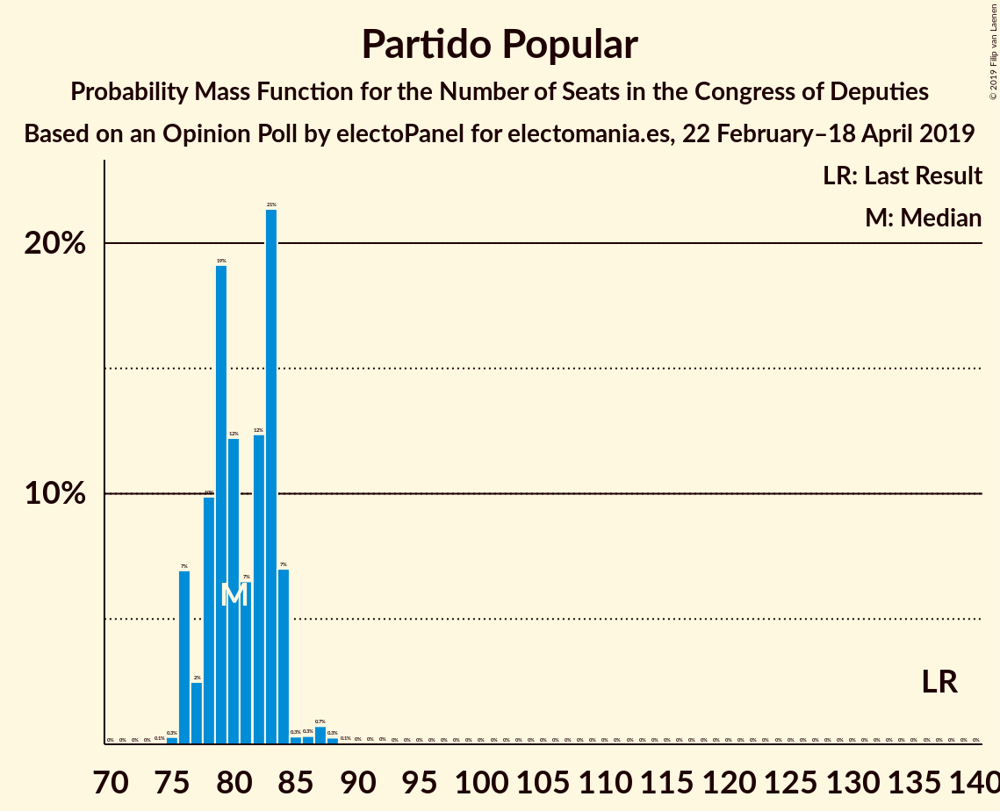
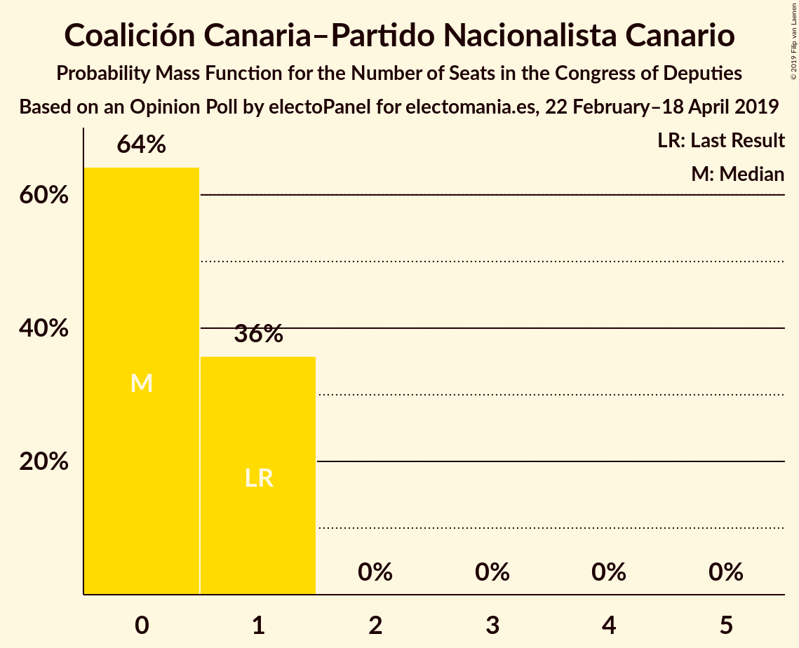
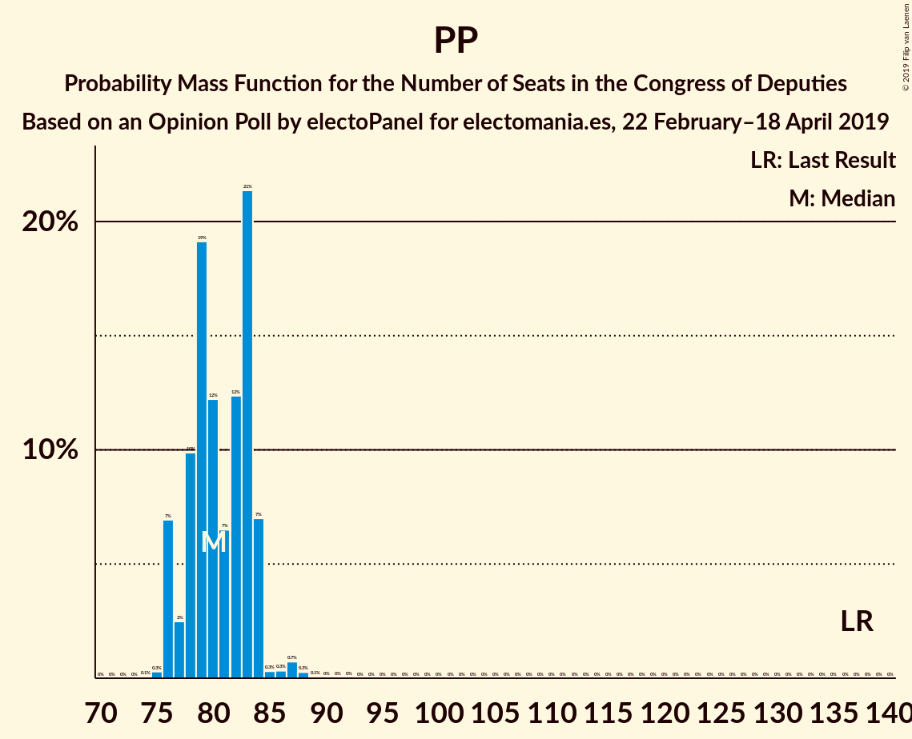

# Opinion Poll by electoPanel for electomania.es, 22 February–18 April 2019

<a href="#voting-intentions">Voting Intentions</a> | <a href="#seats">Seats</a> | <a href="#coalitions">Coalitions</a> | <a href="#technical-information">Technical Information</a>

## Voting Intentions

### Confidence Intervals

| Party | Last Result | Poll Result | 80% Confidence Interval | 90% Confidence Interval | 95% Confidence Interval | 99% Confidence Interval |
|:-----:|:-----------:|:-----------:|:-----------------------:|:-----------------------:|:-----------------------:|:-----------------------:|
| Partido Socialista Obrero Español | 22.6% | 27.6% | 27.0–28.2% |26.9–28.3% |26.7–28.5% |26.5–28.7% |
| Partido Popular | 33.0% | 20.3% | 19.8–20.8% |19.7–21.0% |19.5–21.1% |19.3–21.3% |
| Ciudadanos–Partido de la Ciudadanía | 13.1% | 14.3% | 13.9–14.8% |13.7–14.9% |13.6–15.0% |13.4–15.2% |
| Unidos Podemos | 21.2% | 13.7% | 13.3–14.1% |13.2–14.3% |13.0–14.4% |12.8–14.6% |
| Vox | 0.2% | 12.4% | 12.0–12.8% |11.9–12.9% |11.8–13.0% |11.6–13.2% |
| Esquerra Republicana de Catalunya–Catalunya Sí | 2.7% | 2.8% | 2.6–3.0% |2.5–3.1% |2.5–3.1% |2.4–3.2% |
| Partido Animalista Contra el Maltrato Animal | 1.2% | 2.3% | 2.1–2.5% |2.1–2.6% |2.0–2.6% |2.0–2.7% |
| Euzko Alderdi Jeltzalea/Partido Nacionalista Vasco | 1.2% | 1.4% | 1.2–1.6% |1.2–1.6% |1.2–1.6% |1.1–1.7% |
| Partit Demòcrata Europeu Català | 2.0% | 1.3% | 1.2–1.5% |1.1–1.5% |1.1–1.5% |1.0–1.6% |
| Euskal Herria Bildu | 0.8% | 0.9% | 0.8–1.0% |0.7–1.1% |0.7–1.1% |0.7–1.2% |
| Coalición Canaria–Partido Nacionalista Canario | 0.3% | 0.2% | 0.2–0.3% |0.1–0.3% |0.1–0.3% |0.1–0.4% |

*Note:* The poll result column reflects the actual value used in the calculations. Published results may vary slightly, and in addition be rounded to fewer digits.

## Seats

### Confidence Intervals

| Party | Last Result | Median | 80% Confidence Interval | 90% Confidence Interval | 95% Confidence Interval | 99% Confidence Interval |
|:-----:|:-----------:|:------:|:-----------------------:|:-----------------------:|:-----------------------:|:-----------------------:|
| <a href="#partido-socialista-obrero-español">Partido Socialista Obrero Español</a> | 85 | 117 | 117–126 |117–127 |117–127 |114–127 |
| <a href="#partido-popular">Partido Popular</a> | 137 | 82 | 76–82 |76–82 |76–82 |76–86 |
| <a href="#ciudadanos–partido-de-la-ciudadanía">Ciudadanos–Partido de la Ciudadanía</a> | 32 | 47 | 43–47 |42–48 |42–49 |42–50 |
| <a href="#unidos-podemos">Unidos Podemos</a> | 71 | 38 | 37–38 |36–38 |36–39 |36–40 |
| <a href="#vox">Vox</a> | 0 | 34 | 33–40 |33–40 |33–40 |31–40 |
| <a href="#esquerra-republicana-de-catalunya–catalunya-sí">Esquerra Republicana de Catalunya–Catalunya Sí</a> | 9 | 13 | 13–14 |13–14 |12–14 |11–14 |
| <a href="#partido-animalista-contra-el-maltrato-animal">Partido Animalista Contra el Maltrato Animal</a> | 0 | 1 | 1 |1 |1 |1 |
| <a href="#euzko-alderdi-jeltzalea/partido-nacionalista-vasco">Euzko Alderdi Jeltzalea/Partido Nacionalista Vasco</a> | 5 | 7 | 6–7 |6–7 |6–7 |6–7 |
| <a href="#partit-demòcrata-europeu-català">Partit Demòcrata Europeu Català</a> | 8 | 6 | 4–6 |4–6 |4–6 |4–7 |
| <a href="#euskal-herria-bildu">Euskal Herria Bildu</a> | 2 | 4 | 4–5 |3–5 |3–5 |2–5 |
| <a href="#coalición-canaria–partido-nacionalista-canario">Coalición Canaria–Partido Nacionalista Canario</a> | 1 | 1 | 0–1 |0–1 |0–1 |0–1 |

### Partido Socialista Obrero Español

*For a full overview of the results for this party, see the [Partido Socialista Obrero Español](party-partidosocialistaobreroespañol.html) page.*

| Number of Seats | Probability | Accumulated | Special Marks |
|:---------------:|:-----------:|:-----------:|:-------------:|
| 85 | 0% | 100% | Last Result |
| 86 | 0% | 100% |  |
| 87 | 0% | 100% |  |
| 88 | 0% | 100% |  |
| 89 | 0% | 100% |  |
| 90 | 0% | 100% |  |
| 91 | 0% | 100% |  |
| 92 | 0% | 100% |  |
| 93 | 0% | 100% |  |
| 94 | 0% | 100% |  |
| 95 | 0% | 100% |  |
| 96 | 0% | 100% |  |
| 97 | 0% | 100% |  |
| 98 | 0% | 100% |  |
| 99 | 0% | 100% |  |
| 100 | 0% | 100% |  |
| 101 | 0% | 100% |  |
| 102 | 0% | 100% |  |
| 103 | 0% | 100% |  |
| 104 | 0% | 100% |  |
| 105 | 0% | 100% |  |
| 106 | 0% | 100% |  |
| 107 | 0% | 100% |  |
| 108 | 0% | 100% |  |
| 109 | 0% | 100% |  |
| 110 | 0% | 100% |  |
| 111 | 0% | 100% |  |
| 112 | 0.1% | 100% |  |
| 113 | 0.1% | 99.9% |  |
| 114 | 0.4% | 99.8% |  |
| 115 | 0.1% | 99.4% |  |
| 116 | 0.3% | 99.3% |  |
| 117 | 50% | 99.0% | Median |
| 118 | 0.6% | 49% |  |
| 119 | 0.3% | 48% |  |
| 120 | 0.4% | 48% |  |
| 121 | 3% | 48% |  |
| 122 | 15% | 45% |  |
| 123 | 1.4% | 30% |  |
| 124 | 4% | 28% |  |
| 125 | 14% | 24% |  |
| 126 | 0.3% | 10% |  |
| 127 | 10% | 10% |  |
| 128 | 0% | 0.1% |  |
| 129 | 0% | 0.1% |  |
| 130 | 0% | 0.1% |  |
| 131 | 0% | 0% |  |

### Partido Popular

*For a full overview of the results for this party, see the [Partido Popular](party-partidopopular.html) page.*

| Number of Seats | Probability | Accumulated | Special Marks |
|:---------------:|:-----------:|:-----------:|:-------------:|
| 74 | 0.2% | 100% |  |
| 75 | 0.1% | 99.8% |  |
| 76 | 15% | 99.7% |  |
| 77 | 6% | 85% |  |
| 78 | 0.4% | 79% |  |
| 79 | 15% | 79% |  |
| 80 | 2% | 64% |  |
| 81 | 8% | 62% |  |
| 82 | 52% | 54% | Median |
| 83 | 0.4% | 2% |  |
| 84 | 0.3% | 1.2% |  |
| 85 | 0.2% | 0.9% |  |
| 86 | 0.4% | 0.7% |  |
| 87 | 0% | 0.3% |  |
| 88 | 0.1% | 0.3% |  |
| 89 | 0% | 0.1% |  |
| 90 | 0% | 0.1% |  |
| 91 | 0% | 0.1% |  |
| 92 | 0.1% | 0.1% |  |
| 93 | 0% | 0% |  |
| 94 | 0% | 0% |  |
| 95 | 0% | 0% |  |
| 96 | 0% | 0% |  |
| 97 | 0% | 0% |  |
| 98 | 0% | 0% |  |
| 99 | 0% | 0% |  |
| 100 | 0% | 0% |  |
| 101 | 0% | 0% |  |
| 102 | 0% | 0% |  |
| 103 | 0% | 0% |  |
| 104 | 0% | 0% |  |
| 105 | 0% | 0% |  |
| 106 | 0% | 0% |  |
| 107 | 0% | 0% |  |
| 108 | 0% | 0% |  |
| 109 | 0% | 0% |  |
| 110 | 0% | 0% |  |
| 111 | 0% | 0% |  |
| 112 | 0% | 0% |  |
| 113 | 0% | 0% |  |
| 114 | 0% | 0% |  |
| 115 | 0% | 0% |  |
| 116 | 0% | 0% |  |
| 117 | 0% | 0% |  |
| 118 | 0% | 0% |  |
| 119 | 0% | 0% |  |
| 120 | 0% | 0% |  |
| 121 | 0% | 0% |  |
| 122 | 0% | 0% |  |
| 123 | 0% | 0% |  |
| 124 | 0% | 0% |  |
| 125 | 0% | 0% |  |
| 126 | 0% | 0% |  |
| 127 | 0% | 0% |  |
| 128 | 0% | 0% |  |
| 129 | 0% | 0% |  |
| 130 | 0% | 0% |  |
| 131 | 0% | 0% |  |
| 132 | 0% | 0% |  |
| 133 | 0% | 0% |  |
| 134 | 0% | 0% |  |
| 135 | 0% | 0% |  |
| 136 | 0% | 0% |  |
| 137 | 0% | 0% | Last Result |

### Ciudadanos–Partido de la Ciudadanía

*For a full overview of the results for this party, see the [Ciudadanos–Partido de la Ciudadanía](party-ciudadanos–partidodelaciudadanía.html) page.*

| Number of Seats | Probability | Accumulated | Special Marks |
|:---------------:|:-----------:|:-----------:|:-------------:|
| 32 | 0% | 100% | Last Result |
| 33 | 0% | 100% |  |
| 34 | 0% | 100% |  |
| 35 | 0% | 100% |  |
| 36 | 0% | 100% |  |
| 37 | 0% | 100% |  |
| 38 | 0% | 100% |  |
| 39 | 0% | 100% |  |
| 40 | 0% | 100% |  |
| 41 | 0% | 99.9% |  |
| 42 | 7% | 99.9% |  |
| 43 | 4% | 93% |  |
| 44 | 24% | 90% |  |
| 45 | 0.8% | 65% |  |
| 46 | 4% | 65% |  |
| 47 | 51% | 61% | Median |
| 48 | 6% | 9% |  |
| 49 | 1.1% | 3% |  |
| 50 | 2% | 2% |  |
| 51 | 0% | 0.5% |  |
| 52 | 0% | 0.4% |  |
| 53 | 0.3% | 0.4% |  |
| 54 | 0.1% | 0.1% |  |
| 55 | 0% | 0% |  |

### Unidos Podemos

*For a full overview of the results for this party, see the [Unidos Podemos](party-unidospodemos.html) page.*

| Number of Seats | Probability | Accumulated | Special Marks |
|:---------------:|:-----------:|:-----------:|:-------------:|
| 34 | 0% | 100% |  |
| 35 | 0.1% | 99.9% |  |
| 36 | 8% | 99.8% |  |
| 37 | 35% | 92% |  |
| 38 | 53% | 57% | Median |
| 39 | 4% | 5% |  |
| 40 | 0.1% | 0.5% |  |
| 41 | 0.1% | 0.4% |  |
| 42 | 0.3% | 0.3% |  |
| 43 | 0% | 0% |  |
| 44 | 0% | 0% |  |
| 45 | 0% | 0% |  |
| 46 | 0% | 0% |  |
| 47 | 0% | 0% |  |
| 48 | 0% | 0% |  |
| 49 | 0% | 0% |  |
| 50 | 0% | 0% |  |
| 51 | 0% | 0% |  |
| 52 | 0% | 0% |  |
| 53 | 0% | 0% |  |
| 54 | 0% | 0% |  |
| 55 | 0% | 0% |  |
| 56 | 0% | 0% |  |
| 57 | 0% | 0% |  |
| 58 | 0% | 0% |  |
| 59 | 0% | 0% |  |
| 60 | 0% | 0% |  |
| 61 | 0% | 0% |  |
| 62 | 0% | 0% |  |
| 63 | 0% | 0% |  |
| 64 | 0% | 0% |  |
| 65 | 0% | 0% |  |
| 66 | 0% | 0% |  |
| 67 | 0% | 0% |  |
| 68 | 0% | 0% |  |
| 69 | 0% | 0% |  |
| 70 | 0% | 0% |  |
| 71 | 0% | 0% | Last Result |

### Vox

*For a full overview of the results for this party, see the [Vox](party-vox.html) page.*

| Number of Seats | Probability | Accumulated | Special Marks |
|:---------------:|:-----------:|:-----------:|:-------------:|
| 0 | 0% | 100% | Last Result |
| 1 | 0% | 100% |  |
| 2 | 0% | 100% |  |
| 3 | 0% | 100% |  |
| 4 | 0% | 100% |  |
| 5 | 0% | 100% |  |
| 6 | 0% | 100% |  |
| 7 | 0% | 100% |  |
| 8 | 0% | 100% |  |
| 9 | 0% | 100% |  |
| 10 | 0% | 100% |  |
| 11 | 0% | 100% |  |
| 12 | 0% | 100% |  |
| 13 | 0% | 100% |  |
| 14 | 0% | 100% |  |
| 15 | 0% | 100% |  |
| 16 | 0% | 100% |  |
| 17 | 0% | 100% |  |
| 18 | 0% | 100% |  |
| 19 | 0% | 100% |  |
| 20 | 0% | 100% |  |
| 21 | 0% | 100% |  |
| 22 | 0% | 100% |  |
| 23 | 0% | 100% |  |
| 24 | 0% | 100% |  |
| 25 | 0% | 100% |  |
| 26 | 0% | 100% |  |
| 27 | 0% | 100% |  |
| 28 | 0% | 100% |  |
| 29 | 0% | 100% |  |
| 30 | 0.1% | 100% |  |
| 31 | 0.7% | 99.9% |  |
| 32 | 0.3% | 99.2% |  |
| 33 | 19% | 99.0% |  |
| 34 | 60% | 79% | Median |
| 35 | 2% | 20% |  |
| 36 | 3% | 18% |  |
| 37 | 0.4% | 15% |  |
| 38 | 0.1% | 15% |  |
| 39 | 0.2% | 15% |  |
| 40 | 15% | 15% |  |
| 41 | 0% | 0% |  |

### Esquerra Republicana de Catalunya–Catalunya Sí

*For a full overview of the results for this party, see the [Esquerra Republicana de Catalunya–Catalunya Sí](party-esquerrarepublicanadecatalunya–catalunyasí.html) page.*

| Number of Seats | Probability | Accumulated | Special Marks |
|:---------------:|:-----------:|:-----------:|:-------------:|
| 9 | 0% | 100% | Last Result |
| 10 | 0.3% | 100% |  |
| 11 | 0.5% | 99.7% |  |
| 12 | 2% | 99.2% |  |
| 13 | 74% | 97% | Median |
| 14 | 23% | 23% |  |
| 15 | 0.3% | 0.3% |  |
| 16 | 0% | 0% |  |

### Partido Animalista Contra el Maltrato Animal

*For a full overview of the results for this party, see the [Partido Animalista Contra el Maltrato Animal](party-partidoanimalistacontraelmaltratoanimal.html) page.*

| Number of Seats | Probability | Accumulated | Special Marks |
|:---------------:|:-----------:|:-----------:|:-------------:|
| 0 | 0% | 100% | Last Result |
| 1 | 100% | 100% | Median |

### Euzko Alderdi Jeltzalea/Partido Nacionalista Vasco

*For a full overview of the results for this party, see the [Euzko Alderdi Jeltzalea/Partido Nacionalista Vasco](party-euzkoalderdijeltzaleapartidonacionalistavasco.html) page.*

| Number of Seats | Probability | Accumulated | Special Marks |
|:---------------:|:-----------:|:-----------:|:-------------:|
| 5 | 0% | 100% | Last Result |
| 6 | 39% | 100% |  |
| 7 | 60% | 61% | Median |
| 8 | 0.4% | 0.5% |  |
| 9 | 0% | 0% |  |

### Partit Demòcrata Europeu Català

*For a full overview of the results for this party, see the [Partit Demòcrata Europeu Català](party-partitdemòcrataeuropeucatalà.html) page.*

| Number of Seats | Probability | Accumulated | Special Marks |
|:---------------:|:-----------:|:-----------:|:-------------:|
| 4 | 14% | 100% |  |
| 5 | 18% | 86% |  |
| 6 | 67% | 67% | Median |
| 7 | 0.6% | 0.6% |  |
| 8 | 0.1% | 0.1% | Last Result |
| 9 | 0% | 0% |  |

### Euskal Herria Bildu

*For a full overview of the results for this party, see the [Euskal Herria Bildu](party-euskalherriabildu.html) page.*

| Number of Seats | Probability | Accumulated | Special Marks |
|:---------------:|:-----------:|:-----------:|:-------------:|
| 2 | 1.2% | 100% | Last Result |
| 3 | 8% | 98.8% |  |
| 4 | 75% | 90% | Median |
| 5 | 15% | 15% |  |
| 6 | 0% | 0% |  |

### Coalición Canaria–Partido Nacionalista Canario

*For a full overview of the results for this party, see the [Coalición Canaria–Partido Nacionalista Canario](party-coalicióncanaria–partidonacionalistacanario.html) page.*

| Number of Seats | Probability | Accumulated | Special Marks |
|:---------------:|:-----------:|:-----------:|:-------------:|
| 0 | 22% | 100% |  |
| 1 | 78% | 78% | Last Result, Median |
| 2 | 0% | 0% |  |

## Coalitions

### Confidence Intervals

| Coalition | Last Result | Median | Majority? | 80% Confidence Interval | 90% Confidence Interval | 95% Confidence Interval | 99% Confidence Interval |
|:---------:|:-----------:|:------:|:---------:|:-----------------------:|:-----------------------:|:-----------------------:|:-----------------------:|
| Partido Socialista Obrero Español – Partido Popular – Ciudadanos–Partido de la Ciudadanía | 254 | 246 | 100% | 242–250 | 242–252 | 242–252 | 242–253 |
| Partido Socialista Obrero Español – Ciudadanos–Partido de la Ciudadanía – Unidos Podemos | 188 | 202 | 100% | 202–207 | 202–209 | 202–209 | 199–211 |
| Partido Socialista Obrero Español – Partido Popular | 222 | 199 | 100% | 198–204 | 198–208 | 198–208 | 196–208 |
| Partido Socialista Obrero Español – Unidos Podemos – Esquerra Republicana de Catalunya–Catalunya Sí – Euzko Alderdi Jeltzalea/Partido Nacionalista Vasco – Partit Demòcrata Europeu Català – Euskal Herria Bildu | 180 | 185 | 100% | 185–192 | 185–193 | 184–193 | 182–193 |
| Partido Socialista Obrero Español – Unidos Podemos – Esquerra Republicana de Catalunya–Catalunya Sí – Partit Demòcrata Europeu Català | 173 | 174 | 46% | 174–182 | 174–183 | 174–183 | 171–183 |
| Partido Socialista Obrero Español – Unidos Podemos – Esquerra Republicana de Catalunya–Catalunya Sí – Euskal Herria Bildu | 167 | 172 | 45% | 172–181 | 172–182 | 172–183 | 170–183 |
| Partido Socialista Obrero Español – Unidos Podemos – Euzko Alderdi Jeltzalea/Partido Nacionalista Vasco – Euskal Herria Bildu | 163 | 166 | 0.1% | 166–174 | 166–174 | 166–175 | 164–175 |
| Partido Socialista Obrero Español – Ciudadanos–Partido de la Ciudadanía | 117 | 164 | 0% | 164–170 | 164–173 | 164–173 | 162–173 |
| Partido Socialista Obrero Español – Unidos Podemos – Euzko Alderdi Jeltzalea/Partido Nacionalista Vasco | 161 | 162 | 0% | 162–170 | 162–170 | 162–170 | 160–170 |
| Partido Popular – Ciudadanos–Partido de la Ciudadanía – Vox | 169 | 163 | 0% | 156–163 | 156–163 | 156–165 | 156–167 |
| Partido Socialista Obrero Español – Unidos Podemos | 156 | 155 | 0% | 155–164 | 155–164 | 155–164 | 153–164 |
| Partido Popular – Ciudadanos–Partido de la Ciudadanía – Euzko Alderdi Jeltzalea/Partido Nacionalista Vasco | 174 | 136 | 0% | 126–136 | 126–136 | 126–137 | 126–141 |
| Partido Popular – Ciudadanos–Partido de la Ciudadanía – Coalición Canaria–Partido Nacionalista Canario | 170 | 130 | 0% | 121–130 | 121–130 | 120–131 | 120–134 |
| Partido Popular – Ciudadanos–Partido de la Ciudadanía | 169 | 129 | 0% | 120–129 | 120–129 | 120–130 | 120–134 |
| Partido Socialista Obrero Español | 85 | 117 | 0% | 117–126 | 117–127 | 117–127 | 114–127 |
| Partido Popular – Vox | 137 | 116 | 0% | 112–116 | 112–116 | 110–116 | 110–120 |
| Partido Popular | 137 | 82 | 0% | 76–82 | 76–82 | 76–82 | 76–86 |

### Partido Socialista Obrero Español – Partido Popular – Ciudadanos–Partido de la Ciudadanía

| Number of Seats | Probability | Accumulated | Special Marks |
|:---------------:|:-----------:|:-----------:|:-------------:|
| 241 | 0% | 100% |  |
| 242 | 15% | 99.9% |  |
| 243 | 0.2% | 85% |  |
| 244 | 0.4% | 85% |  |
| 245 | 0.5% | 85% |  |
| 246 | 50% | 84% | Median |
| 247 | 6% | 34% |  |
| 248 | 9% | 28% |  |
| 249 | 2% | 18% |  |
| 250 | 8% | 17% |  |
| 251 | 2% | 9% |  |
| 252 | 6% | 7% |  |
| 253 | 1.5% | 2% |  |
| 254 | 0.1% | 0.1% | Last Result |
| 255 | 0% | 0.1% |  |
| 256 | 0% | 0% |  |

### Partido Socialista Obrero Español – Ciudadanos–Partido de la Ciudadanía – Unidos Podemos

| Number of Seats | Probability | Accumulated | Special Marks |
|:---------------:|:-----------:|:-----------:|:-------------:|
| 188 | 0% | 100% | Last Result |
| 189 | 0% | 100% |  |
| 190 | 0% | 100% |  |
| 191 | 0% | 100% |  |
| 192 | 0% | 100% |  |
| 193 | 0% | 100% |  |
| 194 | 0% | 100% |  |
| 195 | 0% | 100% |  |
| 196 | 0.2% | 100% |  |
| 197 | 0% | 99.8% |  |
| 198 | 0.1% | 99.7% |  |
| 199 | 0.3% | 99.7% |  |
| 200 | 0.1% | 99.4% |  |
| 201 | 0.2% | 99.3% |  |
| 202 | 50% | 99.1% | Median |
| 203 | 16% | 49% |  |
| 204 | 0.2% | 33% |  |
| 205 | 1.4% | 33% |  |
| 206 | 16% | 32% |  |
| 207 | 6% | 16% |  |
| 208 | 0.4% | 10% |  |
| 209 | 8% | 9% |  |
| 210 | 0.9% | 1.5% |  |
| 211 | 0.2% | 0.5% |  |
| 212 | 0.3% | 0.3% |  |
| 213 | 0% | 0% |  |

### Partido Socialista Obrero Español – Partido Popular

| Number of Seats | Probability | Accumulated | Special Marks |
|:---------------:|:-----------:|:-----------:|:-------------:|
| 195 | 0.5% | 100% |  |
| 196 | 0.2% | 99.5% |  |
| 197 | 0.1% | 99.3% |  |
| 198 | 15% | 99.2% |  |
| 199 | 51% | 84% | Median |
| 200 | 0.6% | 34% |  |
| 201 | 4% | 33% |  |
| 202 | 1.2% | 29% |  |
| 203 | 3% | 28% |  |
| 204 | 17% | 25% |  |
| 205 | 0.4% | 9% |  |
| 206 | 1.2% | 8% |  |
| 207 | 0.6% | 7% |  |
| 208 | 6% | 7% |  |
| 209 | 0% | 0.1% |  |
| 210 | 0% | 0.1% |  |
| 211 | 0% | 0% |  |
| 212 | 0% | 0% |  |
| 213 | 0% | 0% |  |
| 214 | 0% | 0% |  |
| 215 | 0% | 0% |  |
| 216 | 0% | 0% |  |
| 217 | 0% | 0% |  |
| 218 | 0% | 0% |  |
| 219 | 0% | 0% |  |
| 220 | 0% | 0% |  |
| 221 | 0% | 0% |  |
| 222 | 0% | 0% | Last Result |

### Partido Socialista Obrero Español – Unidos Podemos – Esquerra Republicana de Catalunya–Catalunya Sí – Euzko Alderdi Jeltzalea/Partido Nacionalista Vasco – Partit Demòcrata Europeu Català – Euskal Herria Bildu

| Number of Seats | Probability | Accumulated | Special Marks |
|:---------------:|:-----------:|:-----------:|:-------------:|
| 179 | 0.2% | 100% |  |
| 180 | 0% | 99.8% | Last Result |
| 181 | 0% | 99.8% |  |
| 182 | 0.6% | 99.8% |  |
| 183 | 0.5% | 99.2% |  |
| 184 | 1.3% | 98.7% |  |
| 185 | 51% | 97% | Median |
| 186 | 1.0% | 46% |  |
| 187 | 0.9% | 45% |  |
| 188 | 15% | 45% |  |
| 189 | 7% | 30% |  |
| 190 | 1.4% | 23% |  |
| 191 | 1.1% | 21% |  |
| 192 | 14% | 20% |  |
| 193 | 6% | 6% |  |
| 194 | 0% | 0.1% |  |
| 195 | 0.1% | 0.1% |  |
| 196 | 0% | 0% |  |

### Partido Socialista Obrero Español – Unidos Podemos – Esquerra Republicana de Catalunya–Catalunya Sí – Partit Demòcrata Europeu Català

| Number of Seats | Probability | Accumulated | Special Marks |
|:---------------:|:-----------:|:-----------:|:-------------:|
| 169 | 0.2% | 100% |  |
| 170 | 0% | 99.8% |  |
| 171 | 0.6% | 99.8% |  |
| 172 | 0.3% | 99.2% |  |
| 173 | 0.2% | 98.9% | Last Result |
| 174 | 50% | 98.7% | Median |
| 175 | 2% | 49% |  |
| 176 | 0.7% | 46% | Majority |
| 177 | 0.7% | 45% |  |
| 178 | 15% | 45% |  |
| 179 | 8% | 30% |  |
| 180 | 8% | 22% |  |
| 181 | 0.8% | 14% |  |
| 182 | 6% | 13% |  |
| 183 | 6% | 7% |  |
| 184 | 0% | 0.1% |  |
| 185 | 0.1% | 0.1% |  |
| 186 | 0% | 0% |  |

### Partido Socialista Obrero Español – Unidos Podemos – Esquerra Republicana de Catalunya–Catalunya Sí – Euskal Herria Bildu

| Number of Seats | Probability | Accumulated | Special Marks |
|:---------------:|:-----------:|:-----------:|:-------------:|
| 167 | 0% | 100% | Last Result |
| 168 | 0.2% | 100% |  |
| 169 | 0% | 99.8% |  |
| 170 | 0.8% | 99.8% |  |
| 171 | 0.4% | 99.1% |  |
| 172 | 51% | 98.7% | Median |
| 173 | 0.5% | 47% |  |
| 174 | 0.7% | 47% |  |
| 175 | 1.0% | 46% |  |
| 176 | 15% | 45% | Majority |
| 177 | 0.4% | 30% |  |
| 178 | 0.4% | 29% |  |
| 179 | 7% | 29% |  |
| 180 | 9% | 22% |  |
| 181 | 6% | 13% |  |
| 182 | 3% | 6% |  |
| 183 | 3% | 3% |  |
| 184 | 0% | 0.1% |  |
| 185 | 0% | 0% |  |

### Partido Socialista Obrero Español – Unidos Podemos – Euzko Alderdi Jeltzalea/Partido Nacionalista Vasco – Euskal Herria Bildu

| Number of Seats | Probability | Accumulated | Special Marks |
|:---------------:|:-----------:|:-----------:|:-------------:|
| 160 | 0.1% | 100% |  |
| 161 | 0% | 99.9% |  |
| 162 | 0% | 99.9% |  |
| 163 | 0.2% | 99.9% | Last Result |
| 164 | 0.8% | 99.7% |  |
| 165 | 0.2% | 98.9% |  |
| 166 | 51% | 98.7% | Median |
| 167 | 1.3% | 47% |  |
| 168 | 0.8% | 46% |  |
| 169 | 15% | 45% |  |
| 170 | 0.3% | 30% |  |
| 171 | 7% | 30% |  |
| 172 | 2% | 23% |  |
| 173 | 8% | 22% |  |
| 174 | 10% | 13% |  |
| 175 | 3% | 3% |  |
| 176 | 0% | 0.1% | Majority |
| 177 | 0% | 0% |  |

### Partido Socialista Obrero Español – Ciudadanos–Partido de la Ciudadanía

| Number of Seats | Probability | Accumulated | Special Marks |
|:---------------:|:-----------:|:-----------:|:-------------:|
| 117 | 0% | 100% | Last Result |
| 118 | 0% | 100% |  |
| 119 | 0% | 100% |  |
| 120 | 0% | 100% |  |
| 121 | 0% | 100% |  |
| 122 | 0% | 100% |  |
| 123 | 0% | 100% |  |
| 124 | 0% | 100% |  |
| 125 | 0% | 100% |  |
| 126 | 0% | 100% |  |
| 127 | 0% | 100% |  |
| 128 | 0% | 100% |  |
| 129 | 0% | 100% |  |
| 130 | 0% | 100% |  |
| 131 | 0% | 100% |  |
| 132 | 0% | 100% |  |
| 133 | 0% | 100% |  |
| 134 | 0% | 100% |  |
| 135 | 0% | 100% |  |
| 136 | 0% | 100% |  |
| 137 | 0% | 100% |  |
| 138 | 0% | 100% |  |
| 139 | 0% | 100% |  |
| 140 | 0% | 100% |  |
| 141 | 0% | 100% |  |
| 142 | 0% | 100% |  |
| 143 | 0% | 100% |  |
| 144 | 0% | 100% |  |
| 145 | 0% | 100% |  |
| 146 | 0% | 100% |  |
| 147 | 0% | 100% |  |
| 148 | 0% | 100% |  |
| 149 | 0% | 100% |  |
| 150 | 0% | 100% |  |
| 151 | 0% | 100% |  |
| 152 | 0% | 100% |  |
| 153 | 0% | 100% |  |
| 154 | 0% | 100% |  |
| 155 | 0% | 100% |  |
| 156 | 0% | 100% |  |
| 157 | 0.1% | 100% |  |
| 158 | 0.1% | 99.9% |  |
| 159 | 0% | 99.7% |  |
| 160 | 0.1% | 99.7% |  |
| 161 | 0% | 99.7% |  |
| 162 | 0.4% | 99.7% |  |
| 163 | 0% | 99.3% |  |
| 164 | 50% | 99.3% | Median |
| 165 | 0.8% | 49% |  |
| 166 | 15% | 48% |  |
| 167 | 1.0% | 33% |  |
| 168 | 2% | 32% |  |
| 169 | 15% | 31% |  |
| 170 | 8% | 16% |  |
| 171 | 2% | 8% |  |
| 172 | 0.5% | 6% |  |
| 173 | 5% | 6% |  |
| 174 | 0.1% | 0.1% |  |
| 175 | 0% | 0% |  |

### Partido Socialista Obrero Español – Unidos Podemos – Euzko Alderdi Jeltzalea/Partido Nacionalista Vasco

| Number of Seats | Probability | Accumulated | Special Marks |
|:---------------:|:-----------:|:-----------:|:-------------:|
| 156 | 0.1% | 100% |  |
| 157 | 0% | 99.9% |  |
| 158 | 0% | 99.9% |  |
| 159 | 0.2% | 99.9% |  |
| 160 | 0.7% | 99.7% |  |
| 161 | 0.1% | 98.9% | Last Result |
| 162 | 50% | 98.8% | Median |
| 163 | 3% | 49% |  |
| 164 | 0.6% | 46% |  |
| 165 | 15% | 46% |  |
| 166 | 0.5% | 30% |  |
| 167 | 6% | 30% |  |
| 168 | 3% | 24% |  |
| 169 | 10% | 21% |  |
| 170 | 10% | 11% |  |
| 171 | 0.3% | 0.4% |  |
| 172 | 0% | 0.1% |  |
| 173 | 0% | 0.1% |  |
| 174 | 0% | 0% |  |

### Partido Popular – Ciudadanos–Partido de la Ciudadanía – Vox

| Number of Seats | Probability | Accumulated | Special Marks |
|:---------------:|:-----------:|:-----------:|:-------------:|
| 154 | 0.1% | 100% |  |
| 155 | 0% | 99.9% |  |
| 156 | 14% | 99.9% |  |
| 157 | 7% | 86% |  |
| 158 | 2% | 79% |  |
| 159 | 0.8% | 77% |  |
| 160 | 21% | 77% |  |
| 161 | 0.4% | 56% |  |
| 162 | 0.8% | 55% |  |
| 163 | 52% | 54% | Median |
| 164 | 0.2% | 3% |  |
| 165 | 2% | 3% |  |
| 166 | 0.3% | 1.0% |  |
| 167 | 0.4% | 0.7% |  |
| 168 | 0% | 0.2% |  |
| 169 | 0.1% | 0.2% | Last Result |
| 170 | 0.1% | 0.1% |  |
| 171 | 0% | 0% |  |

### Partido Socialista Obrero Español – Unidos Podemos

| Number of Seats | Probability | Accumulated | Special Marks |
|:---------------:|:-----------:|:-----------:|:-------------:|
| 150 | 0.1% | 100% |  |
| 151 | 0% | 99.9% |  |
| 152 | 0.1% | 99.9% |  |
| 153 | 0.8% | 99.7% |  |
| 154 | 0.1% | 98.9% |  |
| 155 | 50% | 98.8% | Median |
| 156 | 0.5% | 49% | Last Result |
| 157 | 2% | 48% |  |
| 158 | 0.6% | 46% |  |
| 159 | 15% | 45% |  |
| 160 | 0.4% | 30% |  |
| 161 | 7% | 30% |  |
| 162 | 9% | 22% |  |
| 163 | 3% | 13% |  |
| 164 | 10% | 10% |  |
| 165 | 0.3% | 0.4% |  |
| 166 | 0% | 0.1% |  |
| 167 | 0% | 0% |  |

### Partido Popular – Ciudadanos–Partido de la Ciudadanía – Euzko Alderdi Jeltzalea/Partido Nacionalista Vasco

| Number of Seats | Probability | Accumulated | Special Marks |
|:---------------:|:-----------:|:-----------:|:-------------:|
| 125 | 0.1% | 100% |  |
| 126 | 17% | 99.9% |  |
| 127 | 0.2% | 83% |  |
| 128 | 1.2% | 82% |  |
| 129 | 10% | 81% |  |
| 130 | 9% | 71% |  |
| 131 | 0.4% | 63% |  |
| 132 | 1.0% | 63% |  |
| 133 | 6% | 62% |  |
| 134 | 0.6% | 56% |  |
| 135 | 0.7% | 55% |  |
| 136 | 51% | 54% | Median |
| 137 | 0.5% | 3% |  |
| 138 | 1.4% | 2% |  |
| 139 | 0.2% | 1.0% |  |
| 140 | 0.3% | 0.8% |  |
| 141 | 0.4% | 0.5% |  |
| 142 | 0% | 0.1% |  |
| 143 | 0% | 0.1% |  |
| 144 | 0.1% | 0.1% |  |
| 145 | 0% | 0% |  |
| 146 | 0% | 0% |  |
| 147 | 0% | 0% |  |
| 148 | 0% | 0% |  |
| 149 | 0% | 0% |  |
| 150 | 0% | 0% |  |
| 151 | 0% | 0% |  |
| 152 | 0% | 0% |  |
| 153 | 0% | 0% |  |
| 154 | 0% | 0% |  |
| 155 | 0% | 0% |  |
| 156 | 0% | 0% |  |
| 157 | 0% | 0% |  |
| 158 | 0% | 0% |  |
| 159 | 0% | 0% |  |
| 160 | 0% | 0% |  |
| 161 | 0% | 0% |  |
| 162 | 0% | 0% |  |
| 163 | 0% | 0% |  |
| 164 | 0% | 0% |  |
| 165 | 0% | 0% |  |
| 166 | 0% | 0% |  |
| 167 | 0% | 0% |  |
| 168 | 0% | 0% |  |
| 169 | 0% | 0% |  |
| 170 | 0% | 0% |  |
| 171 | 0% | 0% |  |
| 172 | 0% | 0% |  |
| 173 | 0% | 0% |  |
| 174 | 0% | 0% | Last Result |

### Partido Popular – Ciudadanos–Partido de la Ciudadanía – Coalición Canaria–Partido Nacionalista Canario

| Number of Seats | Probability | Accumulated | Special Marks |
|:---------------:|:-----------:|:-----------:|:-------------:|
| 119 | 0% | 100% |  |
| 120 | 3% | 99.9% |  |
| 121 | 15% | 97% |  |
| 122 | 0.8% | 82% |  |
| 123 | 9% | 82% |  |
| 124 | 9% | 72% |  |
| 125 | 0.6% | 63% |  |
| 126 | 1.3% | 63% |  |
| 127 | 6% | 61% |  |
| 128 | 0.5% | 56% |  |
| 129 | 1.0% | 55% |  |
| 130 | 51% | 54% | Median |
| 131 | 0.9% | 3% |  |
| 132 | 1.5% | 2% |  |
| 133 | 0.2% | 0.9% |  |
| 134 | 0.5% | 0.7% |  |
| 135 | 0% | 0.2% |  |
| 136 | 0% | 0.1% |  |
| 137 | 0% | 0.1% |  |
| 138 | 0% | 0.1% |  |
| 139 | 0.1% | 0.1% |  |
| 140 | 0% | 0% |  |
| 141 | 0% | 0% |  |
| 142 | 0% | 0% |  |
| 143 | 0% | 0% |  |
| 144 | 0% | 0% |  |
| 145 | 0% | 0% |  |
| 146 | 0% | 0% |  |
| 147 | 0% | 0% |  |
| 148 | 0% | 0% |  |
| 149 | 0% | 0% |  |
| 150 | 0% | 0% |  |
| 151 | 0% | 0% |  |
| 152 | 0% | 0% |  |
| 153 | 0% | 0% |  |
| 154 | 0% | 0% |  |
| 155 | 0% | 0% |  |
| 156 | 0% | 0% |  |
| 157 | 0% | 0% |  |
| 158 | 0% | 0% |  |
| 159 | 0% | 0% |  |
| 160 | 0% | 0% |  |
| 161 | 0% | 0% |  |
| 162 | 0% | 0% |  |
| 163 | 0% | 0% |  |
| 164 | 0% | 0% |  |
| 165 | 0% | 0% |  |
| 166 | 0% | 0% |  |
| 167 | 0% | 0% |  |
| 168 | 0% | 0% |  |
| 169 | 0% | 0% |  |
| 170 | 0% | 0% | Last Result |

### Partido Popular – Ciudadanos–Partido de la Ciudadanía

| Number of Seats | Probability | Accumulated | Special Marks |
|:---------------:|:-----------:|:-----------:|:-------------:|
| 119 | 0.1% | 100% |  |
| 120 | 17% | 99.9% |  |
| 121 | 0.2% | 83% |  |
| 122 | 1.2% | 82% |  |
| 123 | 18% | 81% |  |
| 124 | 0.6% | 63% |  |
| 125 | 0.6% | 63% |  |
| 126 | 0.8% | 62% |  |
| 127 | 6% | 61% |  |
| 128 | 0.8% | 55% |  |
| 129 | 50% | 54% | Median |
| 130 | 1.5% | 4% |  |
| 131 | 0.2% | 2% |  |
| 132 | 2% | 2% |  |
| 133 | 0% | 0.7% |  |
| 134 | 0.5% | 0.7% |  |
| 135 | 0% | 0.2% |  |
| 136 | 0% | 0.1% |  |
| 137 | 0% | 0.1% |  |
| 138 | 0.1% | 0.1% |  |
| 139 | 0% | 0% |  |
| 140 | 0% | 0% |  |
| 141 | 0% | 0% |  |
| 142 | 0% | 0% |  |
| 143 | 0% | 0% |  |
| 144 | 0% | 0% |  |
| 145 | 0% | 0% |  |
| 146 | 0% | 0% |  |
| 147 | 0% | 0% |  |
| 148 | 0% | 0% |  |
| 149 | 0% | 0% |  |
| 150 | 0% | 0% |  |
| 151 | 0% | 0% |  |
| 152 | 0% | 0% |  |
| 153 | 0% | 0% |  |
| 154 | 0% | 0% |  |
| 155 | 0% | 0% |  |
| 156 | 0% | 0% |  |
| 157 | 0% | 0% |  |
| 158 | 0% | 0% |  |
| 159 | 0% | 0% |  |
| 160 | 0% | 0% |  |
| 161 | 0% | 0% |  |
| 162 | 0% | 0% |  |
| 163 | 0% | 0% |  |
| 164 | 0% | 0% |  |
| 165 | 0% | 0% |  |
| 166 | 0% | 0% |  |
| 167 | 0% | 0% |  |
| 168 | 0% | 0% |  |
| 169 | 0% | 0% | Last Result |

### Partido Socialista Obrero Español

| Number of Seats | Probability | Accumulated | Special Marks |
|:---------------:|:-----------:|:-----------:|:-------------:|
| 85 | 0% | 100% | Last Result |
| 86 | 0% | 100% |  |
| 87 | 0% | 100% |  |
| 88 | 0% | 100% |  |
| 89 | 0% | 100% |  |
| 90 | 0% | 100% |  |
| 91 | 0% | 100% |  |
| 92 | 0% | 100% |  |
| 93 | 0% | 100% |  |
| 94 | 0% | 100% |  |
| 95 | 0% | 100% |  |
| 96 | 0% | 100% |  |
| 97 | 0% | 100% |  |
| 98 | 0% | 100% |  |
| 99 | 0% | 100% |  |
| 100 | 0% | 100% |  |
| 101 | 0% | 100% |  |
| 102 | 0% | 100% |  |
| 103 | 0% | 100% |  |
| 104 | 0% | 100% |  |
| 105 | 0% | 100% |  |
| 106 | 0% | 100% |  |
| 107 | 0% | 100% |  |
| 108 | 0% | 100% |  |
| 109 | 0% | 100% |  |
| 110 | 0% | 100% |  |
| 111 | 0% | 100% |  |
| 112 | 0.1% | 100% |  |
| 113 | 0.1% | 99.9% |  |
| 114 | 0.4% | 99.8% |  |
| 115 | 0.1% | 99.4% |  |
| 116 | 0.3% | 99.3% |  |
| 117 | 50% | 99.0% | Median |
| 118 | 0.6% | 49% |  |
| 119 | 0.3% | 48% |  |
| 120 | 0.4% | 48% |  |
| 121 | 3% | 48% |  |
| 122 | 15% | 45% |  |
| 123 | 1.4% | 30% |  |
| 124 | 4% | 28% |  |
| 125 | 14% | 24% |  |
| 126 | 0.3% | 10% |  |
| 127 | 10% | 10% |  |
| 128 | 0% | 0.1% |  |
| 129 | 0% | 0.1% |  |
| 130 | 0% | 0.1% |  |
| 131 | 0% | 0% |  |

### Partido Popular – Vox

| Number of Seats | Probability | Accumulated | Special Marks |
|:---------------:|:-----------:|:-----------:|:-------------:|
| 110 | 3% | 100% |  |
| 111 | 1.3% | 97% |  |
| 112 | 13% | 96% |  |
| 113 | 5% | 83% |  |
| 114 | 3% | 78% |  |
| 115 | 8% | 75% |  |
| 116 | 65% | 67% | Median |
| 117 | 0.3% | 2% |  |
| 118 | 0.2% | 1.4% |  |
| 119 | 0.7% | 1.2% |  |
| 120 | 0.1% | 0.5% |  |
| 121 | 0% | 0.4% |  |
| 122 | 0.2% | 0.3% |  |
| 123 | 0.1% | 0.2% |  |
| 124 | 0% | 0% |  |
| 125 | 0% | 0% |  |
| 126 | 0% | 0% |  |
| 127 | 0% | 0% |  |
| 128 | 0% | 0% |  |
| 129 | 0% | 0% |  |
| 130 | 0% | 0% |  |
| 131 | 0% | 0% |  |
| 132 | 0% | 0% |  |
| 133 | 0% | 0% |  |
| 134 | 0% | 0% |  |
| 135 | 0% | 0% |  |
| 136 | 0% | 0% |  |
| 137 | 0% | 0% | Last Result |

### Partido Popular

| Number of Seats | Probability | Accumulated | Special Marks |
|:---------------:|:-----------:|:-----------:|:-------------:|
| 74 | 0.2% | 100% |  |
| 75 | 0.1% | 99.8% |  |
| 76 | 15% | 99.7% |  |
| 77 | 6% | 85% |  |
| 78 | 0.4% | 79% |  |
| 79 | 15% | 79% |  |
| 80 | 2% | 64% |  |
| 81 | 8% | 62% |  |
| 82 | 52% | 54% | Median |
| 83 | 0.4% | 2% |  |
| 84 | 0.3% | 1.2% |  |
| 85 | 0.2% | 0.9% |  |
| 86 | 0.4% | 0.7% |  |
| 87 | 0% | 0.3% |  |
| 88 | 0.1% | 0.3% |  |
| 89 | 0% | 0.1% |  |
| 90 | 0% | 0.1% |  |
| 91 | 0% | 0.1% |  |
| 92 | 0.1% | 0.1% |  |
| 93 | 0% | 0% |  |
| 94 | 0% | 0% |  |
| 95 | 0% | 0% |  |
| 96 | 0% | 0% |  |
| 97 | 0% | 0% |  |
| 98 | 0% | 0% |  |
| 99 | 0% | 0% |  |
| 100 | 0% | 0% |  |
| 101 | 0% | 0% |  |
| 102 | 0% | 0% |  |
| 103 | 0% | 0% |  |
| 104 | 0% | 0% |  |
| 105 | 0% | 0% |  |
| 106 | 0% | 0% |  |
| 107 | 0% | 0% |  |
| 108 | 0% | 0% |  |
| 109 | 0% | 0% |  |
| 110 | 0% | 0% |  |
| 111 | 0% | 0% |  |
| 112 | 0% | 0% |  |
| 113 | 0% | 0% |  |
| 114 | 0% | 0% |  |
| 115 | 0% | 0% |  |
| 116 | 0% | 0% |  |
| 117 | 0% | 0% |  |
| 118 | 0% | 0% |  |
| 119 | 0% | 0% |  |
| 120 | 0% | 0% |  |
| 121 | 0% | 0% |  |
| 122 | 0% | 0% |  |
| 123 | 0% | 0% |  |
| 124 | 0% | 0% |  |
| 125 | 0% | 0% |  |
| 126 | 0% | 0% |  |
| 127 | 0% | 0% |  |
| 128 | 0% | 0% |  |
| 129 | 0% | 0% |  |
| 130 | 0% | 0% |  |
| 131 | 0% | 0% |  |
| 132 | 0% | 0% |  |
| 133 | 0% | 0% |  |
| 134 | 0% | 0% |  |
| 135 | 0% | 0% |  |
| 136 | 0% | 0% |  |
| 137 | 0% | 0% | Last Result |

## Technical Information

### Opinion Poll

+ **Polling firm:** electoPanel
+ **Commissioner(s):** electomania.es
+ **Fieldwork period:** 22 February–18 April 2019

### Calculations

+ **Sample size:** 10600
+ **Simulations done:** 131,072
+ **Error estimate:** 1.28%

