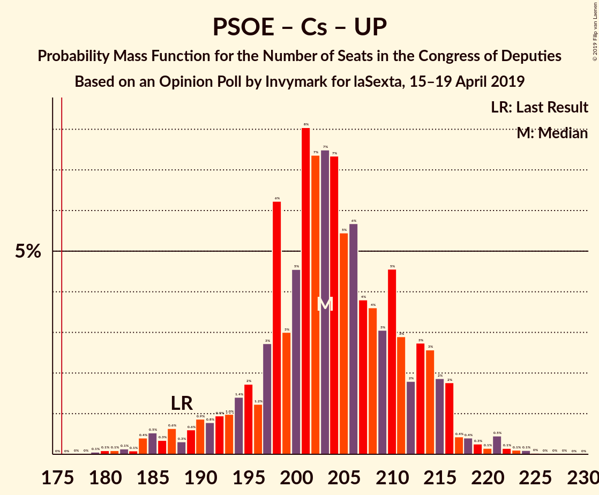
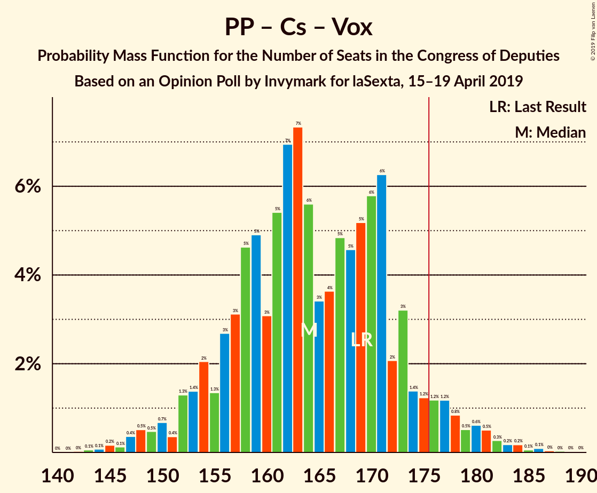
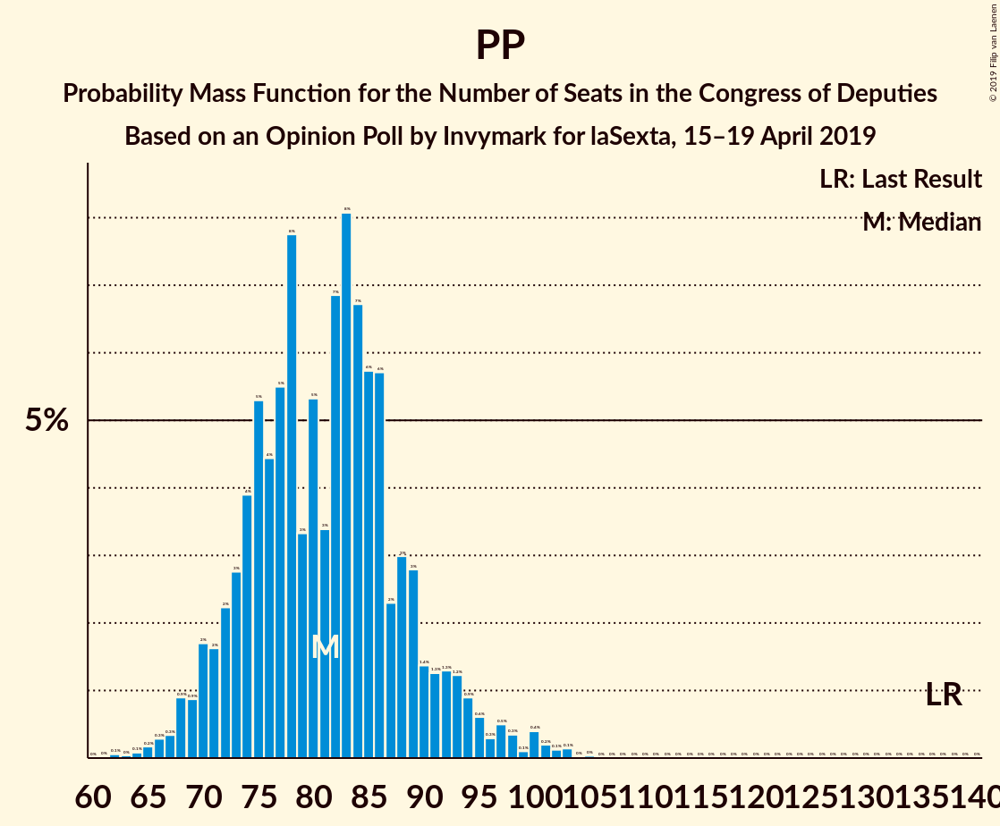

# Opinion Poll by Invymark for laSexta, 15–19 April 2019

<a href="#voting-intentions">Voting Intentions</a> | <a href="#seats">Seats</a> | <a href="#coalitions">Coalitions</a> | <a href="#technical-information">Technical Information</a>

## Voting Intentions

### Confidence Intervals

| Party | Last Result | Poll Result | 80% Confidence Interval | 90% Confidence Interval | 95% Confidence Interval | 99% Confidence Interval |
|:-----:|:-----------:|:-----------:|:-----------------------:|:-----------------------:|:-----------------------:|:-----------------------:|
| Partido Socialista Obrero Español | 22.6% | 28.1% | 26.5–29.8% |26.0–30.3% |25.6–30.7% |24.8–31.5% |
| Partido Popular | 33.0% | 20.4% | 19.0–22.0% |18.6–22.4% |18.2–22.8% |17.6–23.6% |
| Ciudadanos–Partido de la Ciudadanía | 13.1% | 15.2% | 13.9–16.6% |13.5–17.0% |13.2–17.3% |12.7–18.0% |
| Unidos Podemos | 21.2% | 13.0% | 11.8–14.3% |11.5–14.7% |11.2–15.0% |10.7–15.7% |
| Vox | 0.2% | 12.7% | 11.5–14.0% |11.2–14.4% |10.9–14.7% |10.4–15.3% |
| Esquerra Republicana de Catalunya–Catalunya Sí | 2.7% | 3.3% | 2.8–4.1% |2.6–4.3% |2.5–4.5% |2.2–4.9% |
| Partit Demòcrata Europeu Català | 2.0% | 1.3% | 1.0–1.9% |0.9–2.0% |0.8–2.2% |0.7–2.5% |
| Euzko Alderdi Jeltzalea/Partido Nacionalista Vasco | 1.2% | 1.3% | 1.0–1.9% |0.9–2.0% |0.8–2.2% |0.7–2.5% |

*Note:* The poll result column reflects the actual value used in the calculations. Published results may vary slightly, and in addition be rounded to fewer digits.

## Seats

### Confidence Intervals

| Party | Last Result | Median | 80% Confidence Interval | 90% Confidence Interval | 95% Confidence Interval | 99% Confidence Interval |
|:-----:|:-----------:|:------:|:-----------------------:|:-----------------------:|:-----------------------:|:-----------------------:|
| <a href="#partido-socialista-obrero-español">Partido Socialista Obrero Español</a> | 85 | 121 | 113–130 |109–132 |107–134 |104–139 |
| <a href="#partido-popular">Partido Popular</a> | 137 | 81 | 73–89 |71–93 |69–95 |66–101 |
| <a href="#ciudadanos–partido-de-la-ciudadanía">Ciudadanos–Partido de la Ciudadanía</a> | 32 | 49 | 43–55 |39–57 |37–59 |34–62 |
| <a href="#unidos-podemos">Unidos Podemos</a> | 71 | 35 | 28–39 |27–41 |26–43 |24–44 |
| <a href="#vox">Vox</a> | 0 | 34 | 28–43 |27–44 |26–47 |24–49 |
| <a href="#esquerra-republicana-de-catalunya–catalunya-sí">Esquerra Republicana de Catalunya–Catalunya Sí</a> | 9 | 15 | 13–17 |12–18 |11–20 |9–20 |
| <a href="#partit-demòcrata-europeu-català">Partit Demòcrata Europeu Català</a> | 8 | 5 | 3–8 |3–8 |3–8 |1–9 |
| <a href="#euzko-alderdi-jeltzalea/partido-nacionalista-vasco">Euzko Alderdi Jeltzalea/Partido Nacionalista Vasco</a> | 5 | 6 | 6–8 |4–10 |3–10 |3–10 |

### Partido Socialista Obrero Español

*For a full overview of the results for this party, see the [Partido Socialista Obrero Español](party-partidosocialistaobreroespañol.html) page.*

| Number of Seats | Probability | Accumulated | Special Marks |
|:---------------:|:-----------:|:-----------:|:-------------:|
| 85 | 0% | 100% | Last Result |
| 86 | 0% | 100% |  |
| 87 | 0% | 100% |  |
| 88 | 0% | 100% |  |
| 89 | 0% | 100% |  |
| 90 | 0% | 100% |  |
| 91 | 0% | 100% |  |
| 92 | 0% | 100% |  |
| 93 | 0% | 100% |  |
| 94 | 0% | 100% |  |
| 95 | 0% | 100% |  |
| 96 | 0% | 100% |  |
| 97 | 0% | 100% |  |
| 98 | 0% | 100% |  |
| 99 | 0% | 99.9% |  |
| 100 | 0% | 99.9% |  |
| 101 | 0.1% | 99.9% |  |
| 102 | 0.1% | 99.8% |  |
| 103 | 0.1% | 99.6% |  |
| 104 | 0.1% | 99.5% |  |
| 105 | 0.7% | 99.4% |  |
| 106 | 0.2% | 98.7% |  |
| 107 | 1.1% | 98% |  |
| 108 | 0.9% | 97% |  |
| 109 | 2% | 96% |  |
| 110 | 0.7% | 95% |  |
| 111 | 1.3% | 94% |  |
| 112 | 2% | 93% |  |
| 113 | 6% | 90% |  |
| 114 | 3% | 85% |  |
| 115 | 4% | 82% |  |
| 116 | 6% | 77% |  |
| 117 | 3% | 71% |  |
| 118 | 2% | 68% |  |
| 119 | 6% | 67% |  |
| 120 | 6% | 61% |  |
| 121 | 8% | 55% | Median |
| 122 | 7% | 47% |  |
| 123 | 5% | 40% |  |
| 124 | 5% | 35% |  |
| 125 | 2% | 30% |  |
| 126 | 6% | 28% |  |
| 127 | 3% | 22% |  |
| 128 | 5% | 18% |  |
| 129 | 3% | 13% |  |
| 130 | 4% | 11% |  |
| 131 | 1.4% | 7% |  |
| 132 | 0.7% | 5% |  |
| 133 | 1.2% | 5% |  |
| 134 | 1.1% | 3% |  |
| 135 | 0.4% | 2% |  |
| 136 | 0.7% | 2% |  |
| 137 | 0.2% | 1.0% |  |
| 138 | 0.2% | 0.8% |  |
| 139 | 0.3% | 0.6% |  |
| 140 | 0.1% | 0.3% |  |
| 141 | 0.1% | 0.2% |  |
| 142 | 0% | 0.1% |  |
| 143 | 0% | 0% |  |

### Partido Popular

*For a full overview of the results for this party, see the [Partido Popular](party-partidopopular.html) page.*

| Number of Seats | Probability | Accumulated | Special Marks |
|:---------------:|:-----------:|:-----------:|:-------------:|
| 62 | 0.1% | 100% |  |
| 63 | 0% | 99.9% |  |
| 64 | 0.1% | 99.9% |  |
| 65 | 0.2% | 99.8% |  |
| 66 | 0.3% | 99.7% |  |
| 67 | 0.3% | 99.3% |  |
| 68 | 1.1% | 99.1% |  |
| 69 | 0.9% | 98% |  |
| 70 | 2% | 97% |  |
| 71 | 2% | 96% |  |
| 72 | 3% | 94% |  |
| 73 | 3% | 91% |  |
| 74 | 4% | 88% |  |
| 75 | 5% | 84% |  |
| 76 | 2% | 79% |  |
| 77 | 6% | 77% |  |
| 78 | 9% | 70% |  |
| 79 | 4% | 62% |  |
| 80 | 5% | 58% |  |
| 81 | 3% | 53% | Median |
| 82 | 6% | 49% |  |
| 83 | 7% | 44% |  |
| 84 | 10% | 36% |  |
| 85 | 5% | 27% |  |
| 86 | 6% | 21% |  |
| 87 | 3% | 15% |  |
| 88 | 1.3% | 13% |  |
| 89 | 3% | 11% |  |
| 90 | 1.1% | 9% |  |
| 91 | 1.1% | 8% |  |
| 92 | 0.8% | 7% |  |
| 93 | 2% | 6% |  |
| 94 | 1.1% | 4% |  |
| 95 | 0.6% | 3% |  |
| 96 | 0.2% | 2% |  |
| 97 | 0.6% | 2% |  |
| 98 | 0.3% | 1.3% |  |
| 99 | 0.1% | 1.1% |  |
| 100 | 0.4% | 1.0% |  |
| 101 | 0.3% | 0.6% |  |
| 102 | 0.1% | 0.3% |  |
| 103 | 0.1% | 0.2% |  |
| 104 | 0% | 0.1% |  |
| 105 | 0% | 0% |  |
| 106 | 0% | 0% |  |
| 107 | 0% | 0% |  |
| 108 | 0% | 0% |  |
| 109 | 0% | 0% |  |
| 110 | 0% | 0% |  |
| 111 | 0% | 0% |  |
| 112 | 0% | 0% |  |
| 113 | 0% | 0% |  |
| 114 | 0% | 0% |  |
| 115 | 0% | 0% |  |
| 116 | 0% | 0% |  |
| 117 | 0% | 0% |  |
| 118 | 0% | 0% |  |
| 119 | 0% | 0% |  |
| 120 | 0% | 0% |  |
| 121 | 0% | 0% |  |
| 122 | 0% | 0% |  |
| 123 | 0% | 0% |  |
| 124 | 0% | 0% |  |
| 125 | 0% | 0% |  |
| 126 | 0% | 0% |  |
| 127 | 0% | 0% |  |
| 128 | 0% | 0% |  |
| 129 | 0% | 0% |  |
| 130 | 0% | 0% |  |
| 131 | 0% | 0% |  |
| 132 | 0% | 0% |  |
| 133 | 0% | 0% |  |
| 134 | 0% | 0% |  |
| 135 | 0% | 0% |  |
| 136 | 0% | 0% |  |
| 137 | 0% | 0% | Last Result |

### Ciudadanos–Partido de la Ciudadanía

*For a full overview of the results for this party, see the [Ciudadanos–Partido de la Ciudadanía](party-ciudadanos–partidodelaciudadanía.html) page.*

| Number of Seats | Probability | Accumulated | Special Marks |
|:---------------:|:-----------:|:-----------:|:-------------:|
| 30 | 0% | 100% |  |
| 31 | 0% | 99.9% |  |
| 32 | 0.1% | 99.9% | Last Result |
| 33 | 0.1% | 99.8% |  |
| 34 | 0.2% | 99.7% |  |
| 35 | 0.1% | 99.4% |  |
| 36 | 0.5% | 99.3% |  |
| 37 | 2% | 98.8% |  |
| 38 | 1.2% | 97% |  |
| 39 | 1.3% | 96% |  |
| 40 | 2% | 95% |  |
| 41 | 2% | 93% |  |
| 42 | 1.4% | 91% |  |
| 43 | 4% | 90% |  |
| 44 | 3% | 86% |  |
| 45 | 10% | 83% |  |
| 46 | 4% | 73% |  |
| 47 | 11% | 69% |  |
| 48 | 7% | 58% |  |
| 49 | 7% | 51% | Median |
| 50 | 7% | 44% |  |
| 51 | 10% | 37% |  |
| 52 | 3% | 27% |  |
| 53 | 7% | 24% |  |
| 54 | 7% | 17% |  |
| 55 | 3% | 10% |  |
| 56 | 2% | 7% |  |
| 57 | 2% | 5% |  |
| 58 | 0.8% | 3% |  |
| 59 | 1.0% | 3% |  |
| 60 | 0.4% | 2% |  |
| 61 | 0.6% | 1.2% |  |
| 62 | 0.1% | 0.6% |  |
| 63 | 0.2% | 0.4% |  |
| 64 | 0.1% | 0.2% |  |
| 65 | 0.1% | 0.1% |  |
| 66 | 0% | 0% |  |

### Unidos Podemos

*For a full overview of the results for this party, see the [Unidos Podemos](party-unidospodemos.html) page.*

| Number of Seats | Probability | Accumulated | Special Marks |
|:---------------:|:-----------:|:-----------:|:-------------:|
| 23 | 0.2% | 100% |  |
| 24 | 0.8% | 99.7% |  |
| 25 | 0.7% | 99.0% |  |
| 26 | 2% | 98% |  |
| 27 | 5% | 96% |  |
| 28 | 2% | 91% |  |
| 29 | 4% | 89% |  |
| 30 | 4% | 85% |  |
| 31 | 7% | 81% |  |
| 32 | 6% | 74% |  |
| 33 | 5% | 68% |  |
| 34 | 8% | 63% |  |
| 35 | 14% | 56% | Median |
| 36 | 12% | 42% |  |
| 37 | 13% | 30% |  |
| 38 | 6% | 17% |  |
| 39 | 3% | 10% |  |
| 40 | 1.0% | 8% |  |
| 41 | 2% | 7% |  |
| 42 | 2% | 4% |  |
| 43 | 2% | 3% |  |
| 44 | 0.4% | 0.9% |  |
| 45 | 0.2% | 0.5% |  |
| 46 | 0.1% | 0.2% |  |
| 47 | 0.1% | 0.1% |  |
| 48 | 0% | 0.1% |  |
| 49 | 0% | 0% |  |
| 50 | 0% | 0% |  |
| 51 | 0% | 0% |  |
| 52 | 0% | 0% |  |
| 53 | 0% | 0% |  |
| 54 | 0% | 0% |  |
| 55 | 0% | 0% |  |
| 56 | 0% | 0% |  |
| 57 | 0% | 0% |  |
| 58 | 0% | 0% |  |
| 59 | 0% | 0% |  |
| 60 | 0% | 0% |  |
| 61 | 0% | 0% |  |
| 62 | 0% | 0% |  |
| 63 | 0% | 0% |  |
| 64 | 0% | 0% |  |
| 65 | 0% | 0% |  |
| 66 | 0% | 0% |  |
| 67 | 0% | 0% |  |
| 68 | 0% | 0% |  |
| 69 | 0% | 0% |  |
| 70 | 0% | 0% |  |
| 71 | 0% | 0% | Last Result |

### Vox

*For a full overview of the results for this party, see the [Vox](party-vox.html) page.*

| Number of Seats | Probability | Accumulated | Special Marks |
|:---------------:|:-----------:|:-----------:|:-------------:|
| 0 | 0% | 100% | Last Result |
| 1 | 0% | 100% |  |
| 2 | 0% | 100% |  |
| 3 | 0% | 100% |  |
| 4 | 0% | 100% |  |
| 5 | 0% | 100% |  |
| 6 | 0% | 100% |  |
| 7 | 0% | 100% |  |
| 8 | 0% | 100% |  |
| 9 | 0% | 100% |  |
| 10 | 0% | 100% |  |
| 11 | 0% | 100% |  |
| 12 | 0% | 100% |  |
| 13 | 0% | 100% |  |
| 14 | 0% | 100% |  |
| 15 | 0% | 100% |  |
| 16 | 0% | 100% |  |
| 17 | 0% | 100% |  |
| 18 | 0% | 100% |  |
| 19 | 0% | 100% |  |
| 20 | 0% | 100% |  |
| 21 | 0% | 100% |  |
| 22 | 0% | 100% |  |
| 23 | 0.2% | 99.9% |  |
| 24 | 0.3% | 99.8% |  |
| 25 | 0.5% | 99.4% |  |
| 26 | 2% | 98.9% |  |
| 27 | 3% | 97% |  |
| 28 | 7% | 95% |  |
| 29 | 2% | 88% |  |
| 30 | 3% | 86% |  |
| 31 | 9% | 83% |  |
| 32 | 6% | 74% |  |
| 33 | 15% | 68% |  |
| 34 | 12% | 53% | Median |
| 35 | 9% | 41% |  |
| 36 | 3% | 33% |  |
| 37 | 3% | 29% |  |
| 38 | 3% | 26% |  |
| 39 | 4% | 23% |  |
| 40 | 5% | 19% |  |
| 41 | 2% | 14% |  |
| 42 | 1.4% | 11% |  |
| 43 | 3% | 10% |  |
| 44 | 3% | 8% |  |
| 45 | 1.1% | 5% |  |
| 46 | 0.7% | 3% |  |
| 47 | 2% | 3% |  |
| 48 | 0.1% | 0.7% |  |
| 49 | 0.2% | 0.7% |  |
| 50 | 0.2% | 0.4% |  |
| 51 | 0.1% | 0.3% |  |
| 52 | 0.1% | 0.1% |  |
| 53 | 0.1% | 0.1% |  |
| 54 | 0% | 0% |  |

### Esquerra Republicana de Catalunya–Catalunya Sí

*For a full overview of the results for this party, see the [Esquerra Republicana de Catalunya–Catalunya Sí](party-esquerrarepublicanadecatalunya–catalunyasí.html) page.*

| Number of Seats | Probability | Accumulated | Special Marks |
|:---------------:|:-----------:|:-----------:|:-------------:|
| 9 | 0.8% | 100% | Last Result |
| 10 | 0.5% | 99.2% |  |
| 11 | 2% | 98.7% |  |
| 12 | 6% | 97% |  |
| 13 | 14% | 91% |  |
| 14 | 22% | 77% |  |
| 15 | 29% | 54% | Median |
| 16 | 12% | 25% |  |
| 17 | 4% | 13% |  |
| 18 | 6% | 10% |  |
| 19 | 1.2% | 4% |  |
| 20 | 2% | 3% |  |
| 21 | 0.4% | 0.4% |  |
| 22 | 0% | 0% |  |

### Partit Demòcrata Europeu Català

*For a full overview of the results for this party, see the [Partit Demòcrata Europeu Català](party-partitdemòcrataeuropeucatalà.html) page.*

| Number of Seats | Probability | Accumulated | Special Marks |
|:---------------:|:-----------:|:-----------:|:-------------:|
| 1 | 2% | 100% |  |
| 2 | 0.4% | 98% |  |
| 3 | 11% | 98% |  |
| 4 | 25% | 87% |  |
| 5 | 19% | 62% | Median |
| 6 | 24% | 43% |  |
| 7 | 5% | 19% |  |
| 8 | 12% | 14% | Last Result |
| 9 | 1.2% | 2% |  |
| 10 | 0.3% | 0.3% |  |
| 11 | 0% | 0.1% |  |
| 12 | 0% | 0% |  |

### Euzko Alderdi Jeltzalea/Partido Nacionalista Vasco

*For a full overview of the results for this party, see the [Euzko Alderdi Jeltzalea/Partido Nacionalista Vasco](party-euzkoalderdijeltzaleapartidonacionalistavasco.html) page.*

| Number of Seats | Probability | Accumulated | Special Marks |
|:---------------:|:-----------:|:-----------:|:-------------:|
| 2 | 0.1% | 100% |  |
| 3 | 3% | 99.9% |  |
| 4 | 2% | 97% |  |
| 5 | 4% | 95% | Last Result |
| 6 | 46% | 91% | Median |
| 7 | 5% | 45% |  |
| 8 | 30% | 39% |  |
| 9 | 3% | 9% |  |
| 10 | 5% | 5% |  |
| 11 | 0% | 0% |  |

## Coalitions

### Confidence Intervals

| Coalition | Last Result | Median | Majority? | 80% Confidence Interval | 90% Confidence Interval | 95% Confidence Interval | 99% Confidence Interval |
|:---------:|:-----------:|:------:|:---------:|:-----------------------:|:-----------------------:|:-----------------------:|:-----------------------:|
| Partido Socialista Obrero Español – Partido Popular – Ciudadanos–Partido de la Ciudadanía | 254 | 251 | 100% | 242–259 | 239–260 | 237–262 | 233–266 |
| Partido Socialista Obrero Español – Ciudadanos–Partido de la Ciudadanía – Unidos Podemos | 188 | 203 | 100% | 195–213 | 191–215 | 188–216 | 184–222 |
| Partido Socialista Obrero Español – Partido Popular | 222 | 202 | 100% | 193–210 | 191–212 | 188–215 | 184–219 |
| Partido Socialista Obrero Español – Unidos Podemos – Esquerra Republicana de Catalunya–Catalunya Sí – Partit Demòcrata Europeu Català | 173 | 175 | 49% | 167–184 | 163–186 | 161–188 | 157–193 |
| Partido Socialista Obrero Español – Ciudadanos–Partido de la Ciudadanía | 117 | 169 | 21% | 162–178 | 158–180 | 154–183 | 150–187 |
| Partido Popular – Ciudadanos–Partido de la Ciudadanía – Vox | 169 | 164 | 6% | 156–173 | 153–176 | 151–178 | 147–183 |
| Partido Socialista Obrero Español – Unidos Podemos – Euzko Alderdi Jeltzalea/Partido Nacionalista Vasco | 161 | 162 | 3% | 153–171 | 151–174 | 148–176 | 143–181 |
| Partido Socialista Obrero Español – Unidos Podemos | 156 | 155 | 0.3% | 147–165 | 143–166 | 141–169 | 137–174 |
| Partido Popular – Ciudadanos–Partido de la Ciudadanía – Euzko Alderdi Jeltzalea/Partido Nacionalista Vasco | 174 | 136 | 0% | 126–148 | 124–149 | 121–151 | 117–156 |
| Partido Popular – Ciudadanos–Partido de la Ciudadanía | 169 | 129 | 0% | 119–140 | 117–143 | 115–145 | 111–149 |
| Partido Socialista Obrero Español | 85 | 121 | 0% | 113–130 | 109–132 | 107–134 | 104–139 |
| Partido Popular – Vox | 137 | 116 | 0% | 106–124 | 105–127 | 103–132 | 97–136 |
| Partido Popular | 137 | 81 | 0% | 73–89 | 71–93 | 69–95 | 66–101 |

### Partido Socialista Obrero Español – Partido Popular – Ciudadanos–Partido de la Ciudadanía

| Number of Seats | Probability | Accumulated | Special Marks |
|:---------------:|:-----------:|:-----------:|:-------------:|
| 229 | 0% | 100% |  |
| 230 | 0% | 99.9% |  |
| 231 | 0.1% | 99.9% |  |
| 232 | 0.2% | 99.8% |  |
| 233 | 0.1% | 99.6% |  |
| 234 | 0.3% | 99.5% |  |
| 235 | 0.4% | 99.2% |  |
| 236 | 1.1% | 98.8% |  |
| 237 | 0.4% | 98% |  |
| 238 | 2% | 97% |  |
| 239 | 0.9% | 96% |  |
| 240 | 3% | 95% |  |
| 241 | 1.4% | 92% |  |
| 242 | 5% | 91% |  |
| 243 | 1.4% | 85% |  |
| 244 | 2% | 84% |  |
| 245 | 2% | 82% |  |
| 246 | 5% | 80% |  |
| 247 | 5% | 75% |  |
| 248 | 3% | 70% |  |
| 249 | 7% | 67% |  |
| 250 | 5% | 60% |  |
| 251 | 8% | 54% | Median |
| 252 | 5% | 46% |  |
| 253 | 5% | 41% |  |
| 254 | 5% | 36% | Last Result |
| 255 | 7% | 32% |  |
| 256 | 8% | 25% |  |
| 257 | 3% | 17% |  |
| 258 | 2% | 14% |  |
| 259 | 6% | 12% |  |
| 260 | 2% | 6% |  |
| 261 | 0.7% | 4% |  |
| 262 | 0.6% | 3% |  |
| 263 | 0.6% | 2% |  |
| 264 | 0.7% | 2% |  |
| 265 | 0.3% | 0.9% |  |
| 266 | 0.4% | 0.7% |  |
| 267 | 0.1% | 0.2% |  |
| 268 | 0% | 0.1% |  |
| 269 | 0% | 0.1% |  |
| 270 | 0% | 0.1% |  |
| 271 | 0% | 0% |  |

### Partido Socialista Obrero Español – Ciudadanos–Partido de la Ciudadanía – Unidos Podemos

| Number of Seats | Probability | Accumulated | Special Marks |
|:---------------:|:-----------:|:-----------:|:-------------:|
| 179 | 0% | 100% |  |
| 180 | 0.1% | 99.9% |  |
| 181 | 0.1% | 99.9% |  |
| 182 | 0.2% | 99.8% |  |
| 183 | 0.1% | 99.6% |  |
| 184 | 0.5% | 99.6% |  |
| 185 | 0.9% | 99.1% |  |
| 186 | 0.3% | 98% |  |
| 187 | 0.3% | 98% |  |
| 188 | 0.4% | 98% | Last Result |
| 189 | 0.4% | 97% |  |
| 190 | 1.2% | 97% |  |
| 191 | 1.0% | 96% |  |
| 192 | 0.6% | 95% |  |
| 193 | 1.2% | 94% |  |
| 194 | 0.9% | 93% |  |
| 195 | 2% | 92% |  |
| 196 | 0.9% | 90% |  |
| 197 | 3% | 89% |  |
| 198 | 6% | 86% |  |
| 199 | 4% | 80% |  |
| 200 | 3% | 76% |  |
| 201 | 6% | 74% |  |
| 202 | 8% | 68% |  |
| 203 | 10% | 60% |  |
| 204 | 8% | 50% |  |
| 205 | 5% | 41% | Median |
| 206 | 6% | 36% |  |
| 207 | 4% | 30% |  |
| 208 | 2% | 26% |  |
| 209 | 3% | 24% |  |
| 210 | 4% | 21% |  |
| 211 | 4% | 17% |  |
| 212 | 1.5% | 13% |  |
| 213 | 2% | 11% |  |
| 214 | 3% | 10% |  |
| 215 | 2% | 7% |  |
| 216 | 3% | 5% |  |
| 217 | 0.5% | 2% |  |
| 218 | 0.3% | 2% |  |
| 219 | 0.3% | 2% |  |
| 220 | 0.2% | 1.3% |  |
| 221 | 0.6% | 1.1% |  |
| 222 | 0.2% | 0.5% |  |
| 223 | 0.1% | 0.3% |  |
| 224 | 0.1% | 0.2% |  |
| 225 | 0% | 0.1% |  |
| 226 | 0% | 0.1% |  |
| 227 | 0% | 0.1% |  |
| 228 | 0% | 0.1% |  |
| 229 | 0% | 0% |  |

### Partido Socialista Obrero Español – Partido Popular

| Number of Seats | Probability | Accumulated | Special Marks |
|:---------------:|:-----------:|:-----------:|:-------------:|
| 178 | 0% | 100% |  |
| 179 | 0% | 99.9% |  |
| 180 | 0% | 99.9% |  |
| 181 | 0% | 99.9% |  |
| 182 | 0.1% | 99.8% |  |
| 183 | 0.1% | 99.8% |  |
| 184 | 0.1% | 99.6% |  |
| 185 | 0.7% | 99.5% |  |
| 186 | 0.7% | 98.8% |  |
| 187 | 0.4% | 98% |  |
| 188 | 0.4% | 98% |  |
| 189 | 0.6% | 97% |  |
| 190 | 0.6% | 97% |  |
| 191 | 4% | 96% |  |
| 192 | 0.8% | 92% |  |
| 193 | 7% | 91% |  |
| 194 | 2% | 84% |  |
| 195 | 2% | 82% |  |
| 196 | 4% | 80% |  |
| 197 | 2% | 76% |  |
| 198 | 4% | 74% |  |
| 199 | 2% | 70% |  |
| 200 | 7% | 68% |  |
| 201 | 6% | 61% |  |
| 202 | 6% | 55% | Median |
| 203 | 4% | 49% |  |
| 204 | 7% | 45% |  |
| 205 | 2% | 37% |  |
| 206 | 4% | 35% |  |
| 207 | 8% | 31% |  |
| 208 | 7% | 23% |  |
| 209 | 2% | 16% |  |
| 210 | 6% | 14% |  |
| 211 | 3% | 9% |  |
| 212 | 1.1% | 6% |  |
| 213 | 0.9% | 5% |  |
| 214 | 0.9% | 4% |  |
| 215 | 1.1% | 3% |  |
| 216 | 0.3% | 2% |  |
| 217 | 0.5% | 2% |  |
| 218 | 0.6% | 1.1% |  |
| 219 | 0.2% | 0.6% |  |
| 220 | 0% | 0.4% |  |
| 221 | 0% | 0.3% |  |
| 222 | 0.1% | 0.3% | Last Result |
| 223 | 0.1% | 0.2% |  |
| 224 | 0% | 0.1% |  |
| 225 | 0% | 0% |  |

### Partido Socialista Obrero Español – Unidos Podemos – Esquerra Republicana de Catalunya–Catalunya Sí – Partit Demòcrata Europeu Català

| Number of Seats | Probability | Accumulated | Special Marks |
|:---------------:|:-----------:|:-----------:|:-------------:|
| 151 | 0% | 100% |  |
| 152 | 0% | 99.9% |  |
| 153 | 0.1% | 99.9% |  |
| 154 | 0% | 99.8% |  |
| 155 | 0% | 99.8% |  |
| 156 | 0.1% | 99.8% |  |
| 157 | 0.3% | 99.6% |  |
| 158 | 0.3% | 99.4% |  |
| 159 | 0.8% | 99.0% |  |
| 160 | 0.6% | 98% |  |
| 161 | 0.7% | 98% |  |
| 162 | 0.6% | 97% |  |
| 163 | 2% | 96% |  |
| 164 | 1.2% | 95% |  |
| 165 | 0.3% | 94% |  |
| 166 | 1.2% | 93% |  |
| 167 | 3% | 92% |  |
| 168 | 4% | 89% |  |
| 169 | 8% | 85% |  |
| 170 | 5% | 78% |  |
| 171 | 7% | 73% |  |
| 172 | 3% | 66% |  |
| 173 | 3% | 63% | Last Result |
| 174 | 6% | 60% |  |
| 175 | 4% | 54% |  |
| 176 | 6% | 49% | Median, Majority |
| 177 | 2% | 44% |  |
| 178 | 12% | 41% |  |
| 179 | 3% | 29% |  |
| 180 | 4% | 26% |  |
| 181 | 6% | 22% |  |
| 182 | 3% | 17% |  |
| 183 | 4% | 14% |  |
| 184 | 1.3% | 10% |  |
| 185 | 2% | 9% |  |
| 186 | 2% | 7% |  |
| 187 | 0.6% | 5% |  |
| 188 | 2% | 4% |  |
| 189 | 0.6% | 2% |  |
| 190 | 0.4% | 2% |  |
| 191 | 0.5% | 1.5% |  |
| 192 | 0.2% | 1.0% |  |
| 193 | 0.3% | 0.7% |  |
| 194 | 0.1% | 0.5% |  |
| 195 | 0.2% | 0.3% |  |
| 196 | 0% | 0.1% |  |
| 197 | 0% | 0.1% |  |
| 198 | 0% | 0% |  |

### Partido Socialista Obrero Español – Ciudadanos–Partido de la Ciudadanía

| Number of Seats | Probability | Accumulated | Special Marks |
|:---------------:|:-----------:|:-----------:|:-------------:|
| 117 | 0% | 100% | Last Result |
| 118 | 0% | 100% |  |
| 119 | 0% | 100% |  |
| 120 | 0% | 100% |  |
| 121 | 0% | 100% |  |
| 122 | 0% | 100% |  |
| 123 | 0% | 100% |  |
| 124 | 0% | 100% |  |
| 125 | 0% | 100% |  |
| 126 | 0% | 100% |  |
| 127 | 0% | 100% |  |
| 128 | 0% | 100% |  |
| 129 | 0% | 100% |  |
| 130 | 0% | 100% |  |
| 131 | 0% | 100% |  |
| 132 | 0% | 100% |  |
| 133 | 0% | 100% |  |
| 134 | 0% | 100% |  |
| 135 | 0% | 100% |  |
| 136 | 0% | 100% |  |
| 137 | 0% | 100% |  |
| 138 | 0% | 100% |  |
| 139 | 0% | 100% |  |
| 140 | 0% | 100% |  |
| 141 | 0% | 100% |  |
| 142 | 0% | 100% |  |
| 143 | 0% | 100% |  |
| 144 | 0% | 100% |  |
| 145 | 0.1% | 100% |  |
| 146 | 0.1% | 99.9% |  |
| 147 | 0% | 99.8% |  |
| 148 | 0.1% | 99.8% |  |
| 149 | 0.1% | 99.7% |  |
| 150 | 0.4% | 99.6% |  |
| 151 | 0.7% | 99.2% |  |
| 152 | 0.5% | 98% |  |
| 153 | 0.3% | 98% |  |
| 154 | 0.4% | 98% |  |
| 155 | 0.7% | 97% |  |
| 156 | 0.3% | 97% |  |
| 157 | 0.9% | 96% |  |
| 158 | 1.3% | 95% |  |
| 159 | 0.4% | 94% |  |
| 160 | 1.0% | 94% |  |
| 161 | 2% | 93% |  |
| 162 | 2% | 91% |  |
| 163 | 4% | 89% |  |
| 164 | 9% | 85% |  |
| 165 | 2% | 77% |  |
| 166 | 8% | 75% |  |
| 167 | 5% | 67% |  |
| 168 | 6% | 61% |  |
| 169 | 6% | 55% |  |
| 170 | 8% | 49% | Median |
| 171 | 3% | 41% |  |
| 172 | 2% | 38% |  |
| 173 | 7% | 36% |  |
| 174 | 4% | 28% |  |
| 175 | 4% | 24% |  |
| 176 | 4% | 21% | Majority |
| 177 | 4% | 16% |  |
| 178 | 3% | 12% |  |
| 179 | 2% | 9% |  |
| 180 | 3% | 7% |  |
| 181 | 0.6% | 5% |  |
| 182 | 1.3% | 4% |  |
| 183 | 0.6% | 3% |  |
| 184 | 0.5% | 2% |  |
| 185 | 0.6% | 2% |  |
| 186 | 0.3% | 0.9% |  |
| 187 | 0.2% | 0.6% |  |
| 188 | 0.1% | 0.4% |  |
| 189 | 0.1% | 0.4% |  |
| 190 | 0.1% | 0.3% |  |
| 191 | 0% | 0.2% |  |
| 192 | 0.1% | 0.1% |  |
| 193 | 0% | 0% |  |

### Partido Popular – Ciudadanos–Partido de la Ciudadanía – Vox

| Number of Seats | Probability | Accumulated | Special Marks |
|:---------------:|:-----------:|:-----------:|:-------------:|
| 142 | 0% | 100% |  |
| 143 | 0% | 99.9% |  |
| 144 | 0.1% | 99.9% |  |
| 145 | 0.2% | 99.8% |  |
| 146 | 0.1% | 99.7% |  |
| 147 | 0.4% | 99.5% |  |
| 148 | 0.7% | 99.1% |  |
| 149 | 0.5% | 98% |  |
| 150 | 0.4% | 98% |  |
| 151 | 0.4% | 98% |  |
| 152 | 2% | 97% |  |
| 153 | 0.5% | 95% |  |
| 154 | 3% | 95% |  |
| 155 | 2% | 92% |  |
| 156 | 3% | 90% |  |
| 157 | 3% | 88% |  |
| 158 | 4% | 85% |  |
| 159 | 4% | 80% |  |
| 160 | 4% | 76% |  |
| 161 | 8% | 72% |  |
| 162 | 6% | 64% |  |
| 163 | 5% | 58% |  |
| 164 | 7% | 53% | Median |
| 165 | 3% | 46% |  |
| 166 | 5% | 43% |  |
| 167 | 4% | 38% |  |
| 168 | 4% | 35% |  |
| 169 | 8% | 31% | Last Result |
| 170 | 4% | 23% |  |
| 171 | 8% | 19% |  |
| 172 | 0.5% | 11% |  |
| 173 | 2% | 11% |  |
| 174 | 2% | 9% |  |
| 175 | 1.5% | 7% |  |
| 176 | 1.4% | 6% | Majority |
| 177 | 1.0% | 4% |  |
| 178 | 1.0% | 3% |  |
| 179 | 0.3% | 2% |  |
| 180 | 0.6% | 2% |  |
| 181 | 0.6% | 1.4% |  |
| 182 | 0.2% | 0.8% |  |
| 183 | 0.2% | 0.6% |  |
| 184 | 0.1% | 0.3% |  |
| 185 | 0.1% | 0.3% |  |
| 186 | 0.1% | 0.2% |  |
| 187 | 0% | 0.1% |  |
| 188 | 0% | 0.1% |  |
| 189 | 0% | 0.1% |  |
| 190 | 0% | 0% |  |

### Partido Socialista Obrero Español – Unidos Podemos – Euzko Alderdi Jeltzalea/Partido Nacionalista Vasco

| Number of Seats | Probability | Accumulated | Special Marks |
|:---------------:|:-----------:|:-----------:|:-------------:|
| 137 | 0% | 100% |  |
| 138 | 0% | 99.9% |  |
| 139 | 0% | 99.9% |  |
| 140 | 0% | 99.9% |  |
| 141 | 0.1% | 99.8% |  |
| 142 | 0.1% | 99.7% |  |
| 143 | 0.2% | 99.6% |  |
| 144 | 0.3% | 99.4% |  |
| 145 | 0.7% | 99.1% |  |
| 146 | 0.4% | 98% |  |
| 147 | 0.5% | 98% |  |
| 148 | 0.3% | 98% |  |
| 149 | 0.8% | 97% |  |
| 150 | 0.7% | 96% |  |
| 151 | 3% | 96% |  |
| 152 | 2% | 93% |  |
| 153 | 0.9% | 90% |  |
| 154 | 3% | 90% |  |
| 155 | 2% | 87% |  |
| 156 | 9% | 85% |  |
| 157 | 3% | 76% |  |
| 158 | 2% | 73% |  |
| 159 | 12% | 71% |  |
| 160 | 4% | 59% |  |
| 161 | 4% | 55% | Last Result |
| 162 | 4% | 50% | Median |
| 163 | 3% | 46% |  |
| 164 | 4% | 43% |  |
| 165 | 4% | 39% |  |
| 166 | 7% | 35% |  |
| 167 | 7% | 28% |  |
| 168 | 4% | 21% |  |
| 169 | 3% | 17% |  |
| 170 | 1.3% | 14% |  |
| 171 | 4% | 13% |  |
| 172 | 3% | 9% |  |
| 173 | 0.5% | 6% |  |
| 174 | 0.5% | 5% |  |
| 175 | 2% | 5% |  |
| 176 | 0.3% | 3% | Majority |
| 177 | 0.4% | 2% |  |
| 178 | 0.2% | 2% |  |
| 179 | 0.8% | 2% |  |
| 180 | 0.2% | 0.8% |  |
| 181 | 0.3% | 0.6% |  |
| 182 | 0.1% | 0.3% |  |
| 183 | 0.1% | 0.3% |  |
| 184 | 0.1% | 0.2% |  |
| 185 | 0% | 0.1% |  |
| 186 | 0% | 0% |  |

### Partido Socialista Obrero Español – Unidos Podemos

| Number of Seats | Probability | Accumulated | Special Marks |
|:---------------:|:-----------:|:-----------:|:-------------:|
| 131 | 0.1% | 100% |  |
| 132 | 0% | 99.9% |  |
| 133 | 0% | 99.9% |  |
| 134 | 0.1% | 99.8% |  |
| 135 | 0.1% | 99.8% |  |
| 136 | 0.1% | 99.6% |  |
| 137 | 0.3% | 99.5% |  |
| 138 | 0.6% | 99.3% |  |
| 139 | 0.4% | 98.7% |  |
| 140 | 0.6% | 98% |  |
| 141 | 0.6% | 98% |  |
| 142 | 0.4% | 97% |  |
| 143 | 2% | 97% |  |
| 144 | 0.9% | 95% |  |
| 145 | 0.6% | 94% |  |
| 146 | 3% | 93% |  |
| 147 | 2% | 91% |  |
| 148 | 4% | 89% |  |
| 149 | 5% | 85% |  |
| 150 | 6% | 80% |  |
| 151 | 9% | 74% |  |
| 152 | 2% | 65% |  |
| 153 | 6% | 63% |  |
| 154 | 4% | 57% |  |
| 155 | 5% | 52% |  |
| 156 | 4% | 47% | Last Result, Median |
| 157 | 2% | 43% |  |
| 158 | 7% | 41% |  |
| 159 | 7% | 34% |  |
| 160 | 5% | 27% |  |
| 161 | 4% | 22% |  |
| 162 | 4% | 18% |  |
| 163 | 3% | 14% |  |
| 164 | 0.7% | 12% |  |
| 165 | 2% | 11% |  |
| 166 | 4% | 9% |  |
| 167 | 1.1% | 5% |  |
| 168 | 1.3% | 4% |  |
| 169 | 0.3% | 3% |  |
| 170 | 0.8% | 2% |  |
| 171 | 0.2% | 2% |  |
| 172 | 0.4% | 1.3% |  |
| 173 | 0.3% | 0.9% |  |
| 174 | 0.2% | 0.7% |  |
| 175 | 0.2% | 0.5% |  |
| 176 | 0.1% | 0.3% | Majority |
| 177 | 0.1% | 0.2% |  |
| 178 | 0% | 0.1% |  |
| 179 | 0% | 0% |  |

### Partido Popular – Ciudadanos–Partido de la Ciudadanía – Euzko Alderdi Jeltzalea/Partido Nacionalista Vasco

| Number of Seats | Probability | Accumulated | Special Marks |
|:---------------:|:-----------:|:-----------:|:-------------:|
| 113 | 0% | 100% |  |
| 114 | 0% | 99.9% |  |
| 115 | 0.1% | 99.9% |  |
| 116 | 0.1% | 99.9% |  |
| 117 | 0.3% | 99.8% |  |
| 118 | 0.2% | 99.5% |  |
| 119 | 0.2% | 99.3% |  |
| 120 | 0.7% | 99.1% |  |
| 121 | 1.1% | 98% |  |
| 122 | 1.1% | 97% |  |
| 123 | 1.2% | 96% |  |
| 124 | 2% | 95% |  |
| 125 | 1.4% | 93% |  |
| 126 | 4% | 92% |  |
| 127 | 1.3% | 88% |  |
| 128 | 3% | 87% |  |
| 129 | 3% | 84% |  |
| 130 | 4% | 81% |  |
| 131 | 3% | 77% |  |
| 132 | 5% | 74% |  |
| 133 | 4% | 69% |  |
| 134 | 5% | 65% |  |
| 135 | 8% | 60% |  |
| 136 | 4% | 51% | Median |
| 137 | 5% | 47% |  |
| 138 | 3% | 42% |  |
| 139 | 3% | 39% |  |
| 140 | 3% | 37% |  |
| 141 | 8% | 33% |  |
| 142 | 3% | 26% |  |
| 143 | 6% | 23% |  |
| 144 | 1.3% | 17% |  |
| 145 | 2% | 16% |  |
| 146 | 2% | 14% |  |
| 147 | 0.7% | 11% |  |
| 148 | 4% | 11% |  |
| 149 | 2% | 6% |  |
| 150 | 2% | 5% |  |
| 151 | 1.1% | 3% |  |
| 152 | 0.4% | 2% |  |
| 153 | 0.3% | 2% |  |
| 154 | 0.6% | 1.4% |  |
| 155 | 0.3% | 0.9% |  |
| 156 | 0.1% | 0.5% |  |
| 157 | 0.2% | 0.4% |  |
| 158 | 0% | 0.2% |  |
| 159 | 0% | 0.2% |  |
| 160 | 0.1% | 0.1% |  |
| 161 | 0% | 0% |  |
| 162 | 0% | 0% |  |
| 163 | 0% | 0% |  |
| 164 | 0% | 0% |  |
| 165 | 0% | 0% |  |
| 166 | 0% | 0% |  |
| 167 | 0% | 0% |  |
| 168 | 0% | 0% |  |
| 169 | 0% | 0% |  |
| 170 | 0% | 0% |  |
| 171 | 0% | 0% |  |
| 172 | 0% | 0% |  |
| 173 | 0% | 0% |  |
| 174 | 0% | 0% | Last Result |

### Partido Popular – Ciudadanos–Partido de la Ciudadanía

| Number of Seats | Probability | Accumulated | Special Marks |
|:---------------:|:-----------:|:-----------:|:-------------:|
| 106 | 0% | 100% |  |
| 107 | 0% | 99.9% |  |
| 108 | 0% | 99.9% |  |
| 109 | 0.1% | 99.9% |  |
| 110 | 0.2% | 99.8% |  |
| 111 | 0.3% | 99.6% |  |
| 112 | 0.5% | 99.3% |  |
| 113 | 0.2% | 98.8% |  |
| 114 | 0.5% | 98.6% |  |
| 115 | 1.2% | 98% |  |
| 116 | 1.1% | 97% |  |
| 117 | 1.2% | 96% |  |
| 118 | 2% | 95% |  |
| 119 | 2% | 92% |  |
| 120 | 5% | 90% |  |
| 121 | 2% | 85% |  |
| 122 | 0.9% | 83% |  |
| 123 | 1.4% | 82% |  |
| 124 | 5% | 81% |  |
| 125 | 4% | 76% |  |
| 126 | 6% | 72% |  |
| 127 | 7% | 66% |  |
| 128 | 5% | 59% |  |
| 129 | 5% | 54% |  |
| 130 | 4% | 49% | Median |
| 131 | 5% | 45% |  |
| 132 | 4% | 40% |  |
| 133 | 7% | 37% |  |
| 134 | 2% | 30% |  |
| 135 | 6% | 27% |  |
| 136 | 2% | 22% |  |
| 137 | 4% | 19% |  |
| 138 | 2% | 15% |  |
| 139 | 0.6% | 13% |  |
| 140 | 5% | 13% |  |
| 141 | 2% | 8% |  |
| 142 | 0.8% | 6% |  |
| 143 | 0.7% | 5% |  |
| 144 | 1.3% | 5% |  |
| 145 | 2% | 3% |  |
| 146 | 0.4% | 2% |  |
| 147 | 0.6% | 1.4% |  |
| 148 | 0.2% | 0.8% |  |
| 149 | 0.2% | 0.6% |  |
| 150 | 0.1% | 0.5% |  |
| 151 | 0.2% | 0.3% |  |
| 152 | 0% | 0.1% |  |
| 153 | 0% | 0.1% |  |
| 154 | 0.1% | 0.1% |  |
| 155 | 0% | 0% |  |
| 156 | 0% | 0% |  |
| 157 | 0% | 0% |  |
| 158 | 0% | 0% |  |
| 159 | 0% | 0% |  |
| 160 | 0% | 0% |  |
| 161 | 0% | 0% |  |
| 162 | 0% | 0% |  |
| 163 | 0% | 0% |  |
| 164 | 0% | 0% |  |
| 165 | 0% | 0% |  |
| 166 | 0% | 0% |  |
| 167 | 0% | 0% |  |
| 168 | 0% | 0% |  |
| 169 | 0% | 0% | Last Result |

### Partido Socialista Obrero Español

| Number of Seats | Probability | Accumulated | Special Marks |
|:---------------:|:-----------:|:-----------:|:-------------:|
| 85 | 0% | 100% | Last Result |
| 86 | 0% | 100% |  |
| 87 | 0% | 100% |  |
| 88 | 0% | 100% |  |
| 89 | 0% | 100% |  |
| 90 | 0% | 100% |  |
| 91 | 0% | 100% |  |
| 92 | 0% | 100% |  |
| 93 | 0% | 100% |  |
| 94 | 0% | 100% |  |
| 95 | 0% | 100% |  |
| 96 | 0% | 100% |  |
| 97 | 0% | 100% |  |
| 98 | 0% | 100% |  |
| 99 | 0% | 99.9% |  |
| 100 | 0% | 99.9% |  |
| 101 | 0.1% | 99.9% |  |
| 102 | 0.1% | 99.8% |  |
| 103 | 0.1% | 99.6% |  |
| 104 | 0.1% | 99.5% |  |
| 105 | 0.7% | 99.4% |  |
| 106 | 0.2% | 98.7% |  |
| 107 | 1.1% | 98% |  |
| 108 | 0.9% | 97% |  |
| 109 | 2% | 96% |  |
| 110 | 0.7% | 95% |  |
| 111 | 1.3% | 94% |  |
| 112 | 2% | 93% |  |
| 113 | 6% | 90% |  |
| 114 | 3% | 85% |  |
| 115 | 4% | 82% |  |
| 116 | 6% | 77% |  |
| 117 | 3% | 71% |  |
| 118 | 2% | 68% |  |
| 119 | 6% | 67% |  |
| 120 | 6% | 61% |  |
| 121 | 8% | 55% | Median |
| 122 | 7% | 47% |  |
| 123 | 5% | 40% |  |
| 124 | 5% | 35% |  |
| 125 | 2% | 30% |  |
| 126 | 6% | 28% |  |
| 127 | 3% | 22% |  |
| 128 | 5% | 18% |  |
| 129 | 3% | 13% |  |
| 130 | 4% | 11% |  |
| 131 | 1.4% | 7% |  |
| 132 | 0.7% | 5% |  |
| 133 | 1.2% | 5% |  |
| 134 | 1.1% | 3% |  |
| 135 | 0.4% | 2% |  |
| 136 | 0.7% | 2% |  |
| 137 | 0.2% | 1.0% |  |
| 138 | 0.2% | 0.8% |  |
| 139 | 0.3% | 0.6% |  |
| 140 | 0.1% | 0.3% |  |
| 141 | 0.1% | 0.2% |  |
| 142 | 0% | 0.1% |  |
| 143 | 0% | 0% |  |

### Partido Popular – Vox

| Number of Seats | Probability | Accumulated | Special Marks |
|:---------------:|:-----------:|:-----------:|:-------------:|
| 94 | 0% | 100% |  |
| 95 | 0.1% | 99.9% |  |
| 96 | 0% | 99.8% |  |
| 97 | 0.6% | 99.8% |  |
| 98 | 0.2% | 99.2% |  |
| 99 | 0.2% | 99.1% |  |
| 100 | 0.2% | 98.9% |  |
| 101 | 0.2% | 98.7% |  |
| 102 | 0.3% | 98% |  |
| 103 | 1.0% | 98% |  |
| 104 | 1.1% | 97% |  |
| 105 | 3% | 96% |  |
| 106 | 4% | 94% |  |
| 107 | 1.2% | 90% |  |
| 108 | 3% | 89% |  |
| 109 | 3% | 86% |  |
| 110 | 5% | 82% |  |
| 111 | 4% | 77% |  |
| 112 | 1.4% | 73% |  |
| 113 | 5% | 71% |  |
| 114 | 4% | 66% |  |
| 115 | 4% | 62% | Median |
| 116 | 9% | 58% |  |
| 117 | 12% | 49% |  |
| 118 | 10% | 37% |  |
| 119 | 5% | 27% |  |
| 120 | 2% | 23% |  |
| 121 | 4% | 20% |  |
| 122 | 4% | 16% |  |
| 123 | 2% | 12% |  |
| 124 | 3% | 10% |  |
| 125 | 0.9% | 8% |  |
| 126 | 0.9% | 7% |  |
| 127 | 1.3% | 6% |  |
| 128 | 0.5% | 4% |  |
| 129 | 0.6% | 4% |  |
| 130 | 0.2% | 3% |  |
| 131 | 0.8% | 3% |  |
| 132 | 0.2% | 3% |  |
| 133 | 0.4% | 2% |  |
| 134 | 1.0% | 2% |  |
| 135 | 0.3% | 0.9% |  |
| 136 | 0.2% | 0.6% |  |
| 137 | 0.2% | 0.5% | Last Result |
| 138 | 0.1% | 0.3% |  |
| 139 | 0.1% | 0.1% |  |
| 140 | 0% | 0.1% |  |
| 141 | 0% | 0% |  |

### Partido Popular

| Number of Seats | Probability | Accumulated | Special Marks |
|:---------------:|:-----------:|:-----------:|:-------------:|
| 62 | 0.1% | 100% |  |
| 63 | 0% | 99.9% |  |
| 64 | 0.1% | 99.9% |  |
| 65 | 0.2% | 99.8% |  |
| 66 | 0.3% | 99.7% |  |
| 67 | 0.3% | 99.3% |  |
| 68 | 1.1% | 99.1% |  |
| 69 | 0.9% | 98% |  |
| 70 | 2% | 97% |  |
| 71 | 2% | 96% |  |
| 72 | 3% | 94% |  |
| 73 | 3% | 91% |  |
| 74 | 4% | 88% |  |
| 75 | 5% | 84% |  |
| 76 | 2% | 79% |  |
| 77 | 6% | 77% |  |
| 78 | 9% | 70% |  |
| 79 | 4% | 62% |  |
| 80 | 5% | 58% |  |
| 81 | 3% | 53% | Median |
| 82 | 6% | 49% |  |
| 83 | 7% | 44% |  |
| 84 | 10% | 36% |  |
| 85 | 5% | 27% |  |
| 86 | 6% | 21% |  |
| 87 | 3% | 15% |  |
| 88 | 1.3% | 13% |  |
| 89 | 3% | 11% |  |
| 90 | 1.1% | 9% |  |
| 91 | 1.1% | 8% |  |
| 92 | 0.8% | 7% |  |
| 93 | 2% | 6% |  |
| 94 | 1.1% | 4% |  |
| 95 | 0.6% | 3% |  |
| 96 | 0.2% | 2% |  |
| 97 | 0.6% | 2% |  |
| 98 | 0.3% | 1.3% |  |
| 99 | 0.1% | 1.1% |  |
| 100 | 0.4% | 1.0% |  |
| 101 | 0.3% | 0.6% |  |
| 102 | 0.1% | 0.3% |  |
| 103 | 0.1% | 0.2% |  |
| 104 | 0% | 0.1% |  |
| 105 | 0% | 0% |  |
| 106 | 0% | 0% |  |
| 107 | 0% | 0% |  |
| 108 | 0% | 0% |  |
| 109 | 0% | 0% |  |
| 110 | 0% | 0% |  |
| 111 | 0% | 0% |  |
| 112 | 0% | 0% |  |
| 113 | 0% | 0% |  |
| 114 | 0% | 0% |  |
| 115 | 0% | 0% |  |
| 116 | 0% | 0% |  |
| 117 | 0% | 0% |  |
| 118 | 0% | 0% |  |
| 119 | 0% | 0% |  |
| 120 | 0% | 0% |  |
| 121 | 0% | 0% |  |
| 122 | 0% | 0% |  |
| 123 | 0% | 0% |  |
| 124 | 0% | 0% |  |
| 125 | 0% | 0% |  |
| 126 | 0% | 0% |  |
| 127 | 0% | 0% |  |
| 128 | 0% | 0% |  |
| 129 | 0% | 0% |  |
| 130 | 0% | 0% |  |
| 131 | 0% | 0% |  |
| 132 | 0% | 0% |  |
| 133 | 0% | 0% |  |
| 134 | 0% | 0% |  |
| 135 | 0% | 0% |  |
| 136 | 0% | 0% |  |
| 137 | 0% | 0% | Last Result |

## Technical Information

### Opinion Poll

+ **Polling firm:** Invymark
+ **Commissioner(s):** laSexta
+ **Fieldwork period:** 15–19 April 2019

### Calculations

+ **Sample size:** 1200
+ **Simulations done:** 524,288
+ **Error estimate:** 2.73%

