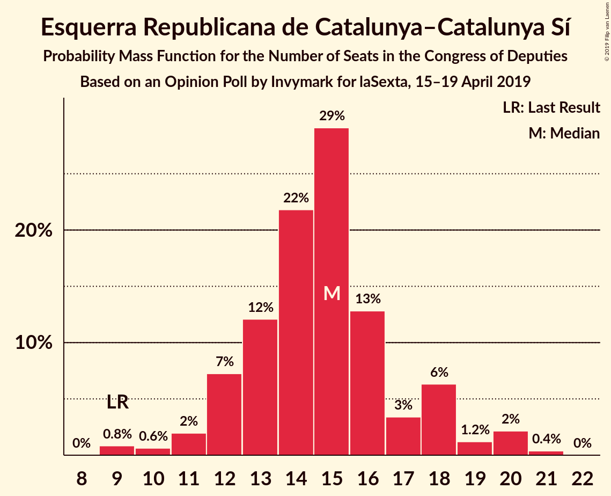
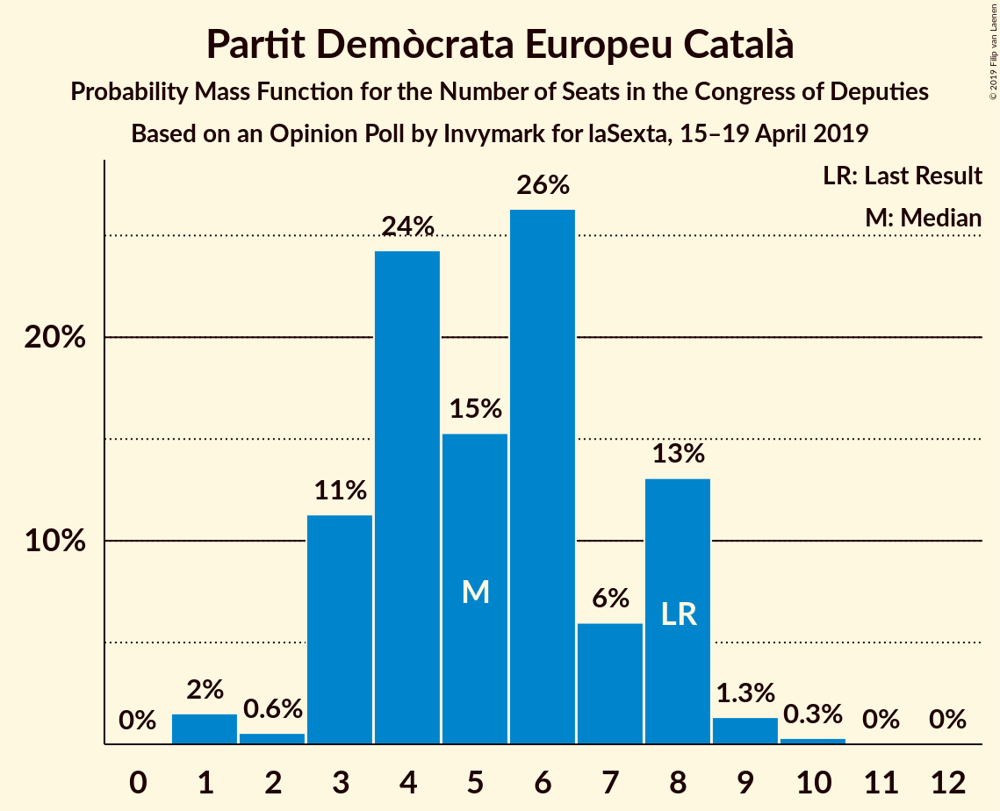
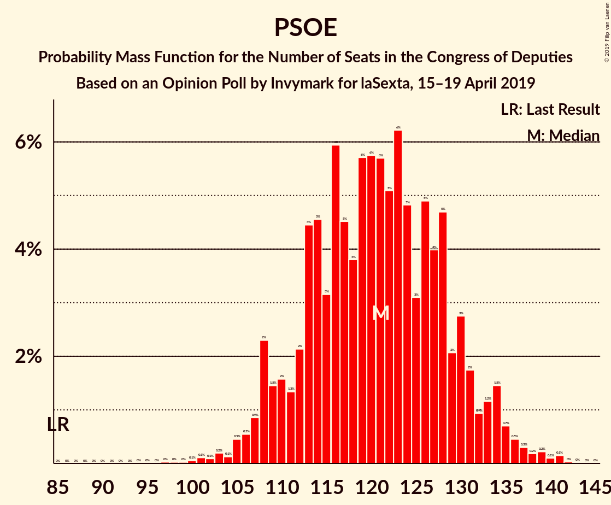

# Opinion Poll by Invymark for laSexta, 15–19 April 2019

<a href="#voting-intentions">Voting Intentions</a> | <a href="#seats">Seats</a> | <a href="#coalitions">Coalitions</a> | <a href="#technical-information">Technical Information</a>

## Voting Intentions

### Confidence Intervals

| Party | Last Result | Poll Result | 80% Confidence Interval | 90% Confidence Interval | 95% Confidence Interval | 99% Confidence Interval |
|:-----:|:-----------:|:-----------:|:-----------------------:|:-----------------------:|:-----------------------:|:-----------------------:|
| Partido Socialista Obrero Español | 22.6% | 28.1% | 26.5–29.8% |26.0–30.3% |25.6–30.7% |24.8–31.5% |
| Partido Popular | 33.0% | 20.4% | 19.0–22.0% |18.6–22.4% |18.2–22.8% |17.6–23.6% |
| Ciudadanos–Partido de la Ciudadanía | 13.1% | 15.2% | 13.9–16.6% |13.5–17.0% |13.2–17.3% |12.7–18.0% |
| Unidos Podemos | 21.2% | 13.0% | 11.8–14.3% |11.5–14.7% |11.2–15.0% |10.7–15.7% |
| Vox | 0.2% | 12.7% | 11.5–14.0% |11.2–14.4% |10.9–14.7% |10.4–15.3% |
| Esquerra Republicana de Catalunya–Catalunya Sí | 2.7% | 3.3% | 2.8–4.1% |2.6–4.3% |2.5–4.5% |2.2–4.9% |
| Partit Demòcrata Europeu Català | 2.0% | 1.3% | 1.0–1.9% |0.9–2.0% |0.8–2.2% |0.7–2.5% |
| Euzko Alderdi Jeltzalea/Partido Nacionalista Vasco | 1.2% | 1.3% | 1.0–1.9% |0.9–2.0% |0.8–2.2% |0.7–2.5% |

*Note:* The poll result column reflects the actual value used in the calculations. Published results may vary slightly, and in addition be rounded to fewer digits.

## Seats

### Confidence Intervals

| Party | Last Result | Median | 80% Confidence Interval | 90% Confidence Interval | 95% Confidence Interval | 99% Confidence Interval |
|:-----:|:-----------:|:------:|:-----------------------:|:-----------------------:|:-----------------------:|:-----------------------:|
| <a href="#partido-socialista-obrero-español">Partido Socialista Obrero Español</a> | 85 | 121 | 109–129 |107–131 |105–136 |102–139 |
| <a href="#partido-popular">Partido Popular</a> | 137 | 81 | 74–91 |72–95 |70–100 |65–101 |
| <a href="#ciudadanos–partido-de-la-ciudadanía">Ciudadanos–Partido de la Ciudadanía</a> | 32 | 48 | 43–55 |40–59 |39–60 |36–64 |
| <a href="#unidos-podemos">Unidos Podemos</a> | 71 | 34 | 29–38 |27–42 |26–42 |24–45 |
| <a href="#vox">Vox</a> | 0 | 33 | 28–40 |28–43 |26–46 |25–50 |
| <a href="#esquerra-republicana-de-catalunya–catalunya-sí">Esquerra Republicana de Catalunya–Catalunya Sí</a> | 9 | 15 | 13–18 |11–19 |10–20 |9–20 |
| <a href="#partit-demòcrata-europeu-català">Partit Demòcrata Europeu Català</a> | 8 | 6 | 3–8 |3–8 |3–8 |1–10 |
| <a href="#euzko-alderdi-jeltzalea/partido-nacionalista-vasco">Euzko Alderdi Jeltzalea/Partido Nacionalista Vasco</a> | 5 | 8 | 6–10 |4–10 |3–10 |3–10 |

### Partido Socialista Obrero Español

*For a full overview of the results for this party, see the [Partido Socialista Obrero Español](party-partidosocialistaobreroespañol.html) page.*

| Number of Seats | Probability | Accumulated | Special Marks |
|:---------------:|:-----------:|:-----------:|:-------------:|
| 85 | 0% | 100% | Last Result |
| 86 | 0% | 100% |  |
| 87 | 0% | 100% |  |
| 88 | 0% | 100% |  |
| 89 | 0% | 100% |  |
| 90 | 0% | 100% |  |
| 91 | 0% | 100% |  |
| 92 | 0% | 100% |  |
| 93 | 0% | 100% |  |
| 94 | 0% | 100% |  |
| 95 | 0% | 100% |  |
| 96 | 0% | 100% |  |
| 97 | 0% | 100% |  |
| 98 | 0.1% | 100% |  |
| 99 | 0% | 99.8% |  |
| 100 | 0.1% | 99.8% |  |
| 101 | 0.1% | 99.7% |  |
| 102 | 0.3% | 99.6% |  |
| 103 | 0.1% | 99.3% |  |
| 104 | 0.1% | 99.2% |  |
| 105 | 2% | 99.1% |  |
| 106 | 0.1% | 97% |  |
| 107 | 2% | 97% |  |
| 108 | 2% | 95% |  |
| 109 | 4% | 93% |  |
| 110 | 2% | 89% |  |
| 111 | 3% | 87% |  |
| 112 | 3% | 84% |  |
| 113 | 9% | 81% |  |
| 114 | 0.8% | 72% |  |
| 115 | 9% | 71% |  |
| 116 | 3% | 62% |  |
| 117 | 2% | 59% |  |
| 118 | 0.7% | 57% |  |
| 119 | 6% | 56% |  |
| 120 | 0.7% | 51% |  |
| 121 | 6% | 50% | Median |
| 122 | 15% | 44% |  |
| 123 | 2% | 29% |  |
| 124 | 2% | 27% |  |
| 125 | 2% | 26% |  |
| 126 | 9% | 24% |  |
| 127 | 2% | 15% |  |
| 128 | 2% | 13% |  |
| 129 | 2% | 11% |  |
| 130 | 1.1% | 9% |  |
| 131 | 4% | 8% |  |
| 132 | 0.3% | 4% |  |
| 133 | 0.3% | 4% |  |
| 134 | 0.3% | 4% |  |
| 135 | 0.1% | 3% |  |
| 136 | 0.8% | 3% |  |
| 137 | 0.4% | 2% |  |
| 138 | 0.2% | 2% |  |
| 139 | 1.3% | 2% |  |
| 140 | 0.2% | 0.4% |  |
| 141 | 0% | 0.2% |  |
| 142 | 0.1% | 0.2% |  |
| 143 | 0.1% | 0.1% |  |
| 144 | 0% | 0% |  |

### Partido Popular

*For a full overview of the results for this party, see the [Partido Popular](party-partidopopular.html) page.*

| Number of Seats | Probability | Accumulated | Special Marks |
|:---------------:|:-----------:|:-----------:|:-------------:|
| 62 | 0.1% | 100% |  |
| 63 | 0% | 99.9% |  |
| 64 | 0.1% | 99.9% |  |
| 65 | 0.3% | 99.7% |  |
| 66 | 0.4% | 99.4% |  |
| 67 | 0.4% | 99.0% |  |
| 68 | 0.6% | 98.5% |  |
| 69 | 0.4% | 98% |  |
| 70 | 1.3% | 98% |  |
| 71 | 1.1% | 96% |  |
| 72 | 3% | 95% |  |
| 73 | 1.4% | 92% |  |
| 74 | 4% | 91% |  |
| 75 | 3% | 87% |  |
| 76 | 4% | 84% |  |
| 77 | 2% | 80% |  |
| 78 | 6% | 78% |  |
| 79 | 2% | 72% |  |
| 80 | 17% | 70% |  |
| 81 | 6% | 53% | Median |
| 82 | 2% | 47% |  |
| 83 | 1.3% | 45% |  |
| 84 | 4% | 44% |  |
| 85 | 17% | 40% |  |
| 86 | 4% | 23% |  |
| 87 | 1.1% | 19% |  |
| 88 | 0.8% | 18% |  |
| 89 | 3% | 17% |  |
| 90 | 1.4% | 15% |  |
| 91 | 3% | 13% |  |
| 92 | 0.3% | 10% |  |
| 93 | 0.4% | 10% |  |
| 94 | 3% | 9% |  |
| 95 | 2% | 7% |  |
| 96 | 0.3% | 5% |  |
| 97 | 2% | 4% |  |
| 98 | 0.1% | 3% |  |
| 99 | 0.1% | 3% |  |
| 100 | 1.5% | 3% |  |
| 101 | 0.7% | 1.1% |  |
| 102 | 0.2% | 0.4% |  |
| 103 | 0.1% | 0.1% |  |
| 104 | 0% | 0.1% |  |
| 105 | 0% | 0% |  |
| 106 | 0% | 0% |  |
| 107 | 0% | 0% |  |
| 108 | 0% | 0% |  |
| 109 | 0% | 0% |  |
| 110 | 0% | 0% |  |
| 111 | 0% | 0% |  |
| 112 | 0% | 0% |  |
| 113 | 0% | 0% |  |
| 114 | 0% | 0% |  |
| 115 | 0% | 0% |  |
| 116 | 0% | 0% |  |
| 117 | 0% | 0% |  |
| 118 | 0% | 0% |  |
| 119 | 0% | 0% |  |
| 120 | 0% | 0% |  |
| 121 | 0% | 0% |  |
| 122 | 0% | 0% |  |
| 123 | 0% | 0% |  |
| 124 | 0% | 0% |  |
| 125 | 0% | 0% |  |
| 126 | 0% | 0% |  |
| 127 | 0% | 0% |  |
| 128 | 0% | 0% |  |
| 129 | 0% | 0% |  |
| 130 | 0% | 0% |  |
| 131 | 0% | 0% |  |
| 132 | 0% | 0% |  |
| 133 | 0% | 0% |  |
| 134 | 0% | 0% |  |
| 135 | 0% | 0% |  |
| 136 | 0% | 0% |  |
| 137 | 0% | 0% | Last Result |

### Ciudadanos–Partido de la Ciudadanía

*For a full overview of the results for this party, see the [Ciudadanos–Partido de la Ciudadanía](party-ciudadanos–partidodelaciudadanía.html) page.*

| Number of Seats | Probability | Accumulated | Special Marks |
|:---------------:|:-----------:|:-----------:|:-------------:|
| 30 | 0.1% | 100% |  |
| 31 | 0% | 99.9% |  |
| 32 | 0% | 99.9% | Last Result |
| 33 | 0.1% | 99.8% |  |
| 34 | 0.1% | 99.7% |  |
| 35 | 0.1% | 99.6% |  |
| 36 | 0.2% | 99.5% |  |
| 37 | 1.3% | 99.3% |  |
| 38 | 0.5% | 98% |  |
| 39 | 1.1% | 98% |  |
| 40 | 3% | 96% |  |
| 41 | 1.3% | 93% |  |
| 42 | 1.2% | 92% |  |
| 43 | 1.0% | 91% |  |
| 44 | 8% | 90% |  |
| 45 | 7% | 82% |  |
| 46 | 3% | 75% |  |
| 47 | 7% | 71% |  |
| 48 | 17% | 65% | Median |
| 49 | 4% | 47% |  |
| 50 | 7% | 43% |  |
| 51 | 2% | 36% |  |
| 52 | 4% | 34% |  |
| 53 | 15% | 31% |  |
| 54 | 4% | 16% |  |
| 55 | 4% | 12% |  |
| 56 | 1.2% | 8% |  |
| 57 | 0.7% | 7% |  |
| 58 | 0.6% | 6% |  |
| 59 | 3% | 5% |  |
| 60 | 0.4% | 3% |  |
| 61 | 1.3% | 2% |  |
| 62 | 0.4% | 1.1% |  |
| 63 | 0.2% | 0.7% |  |
| 64 | 0.3% | 0.6% |  |
| 65 | 0.2% | 0.3% |  |
| 66 | 0% | 0.1% |  |
| 67 | 0% | 0% |  |

### Unidos Podemos

*For a full overview of the results for this party, see the [Unidos Podemos](party-unidospodemos.html) page.*

| Number of Seats | Probability | Accumulated | Special Marks |
|:---------------:|:-----------:|:-----------:|:-------------:|
| 23 | 0.3% | 100% |  |
| 24 | 0.7% | 99.6% |  |
| 25 | 0.4% | 98.9% |  |
| 26 | 3% | 98.6% |  |
| 27 | 3% | 95% |  |
| 28 | 2% | 93% |  |
| 29 | 3% | 91% |  |
| 30 | 1.2% | 88% |  |
| 31 | 14% | 87% |  |
| 32 | 4% | 73% |  |
| 33 | 9% | 69% |  |
| 34 | 10% | 60% | Median |
| 35 | 5% | 50% |  |
| 36 | 18% | 45% |  |
| 37 | 4% | 27% |  |
| 38 | 13% | 23% |  |
| 39 | 2% | 10% |  |
| 40 | 2% | 8% |  |
| 41 | 1.0% | 6% |  |
| 42 | 4% | 5% |  |
| 43 | 0.8% | 2% |  |
| 44 | 0.1% | 0.8% |  |
| 45 | 0.3% | 0.7% |  |
| 46 | 0.2% | 0.4% |  |
| 47 | 0.1% | 0.2% |  |
| 48 | 0% | 0% |  |
| 49 | 0% | 0% |  |
| 50 | 0% | 0% |  |
| 51 | 0% | 0% |  |
| 52 | 0% | 0% |  |
| 53 | 0% | 0% |  |
| 54 | 0% | 0% |  |
| 55 | 0% | 0% |  |
| 56 | 0% | 0% |  |
| 57 | 0% | 0% |  |
| 58 | 0% | 0% |  |
| 59 | 0% | 0% |  |
| 60 | 0% | 0% |  |
| 61 | 0% | 0% |  |
| 62 | 0% | 0% |  |
| 63 | 0% | 0% |  |
| 64 | 0% | 0% |  |
| 65 | 0% | 0% |  |
| 66 | 0% | 0% |  |
| 67 | 0% | 0% |  |
| 68 | 0% | 0% |  |
| 69 | 0% | 0% |  |
| 70 | 0% | 0% |  |
| 71 | 0% | 0% | Last Result |

### Vox

*For a full overview of the results for this party, see the [Vox](party-vox.html) page.*

| Number of Seats | Probability | Accumulated | Special Marks |
|:---------------:|:-----------:|:-----------:|:-------------:|
| 0 | 0% | 100% | Last Result |
| 1 | 0% | 100% |  |
| 2 | 0% | 100% |  |
| 3 | 0% | 100% |  |
| 4 | 0% | 100% |  |
| 5 | 0% | 100% |  |
| 6 | 0% | 100% |  |
| 7 | 0% | 100% |  |
| 8 | 0% | 100% |  |
| 9 | 0% | 100% |  |
| 10 | 0% | 100% |  |
| 11 | 0% | 100% |  |
| 12 | 0% | 100% |  |
| 13 | 0% | 100% |  |
| 14 | 0% | 100% |  |
| 15 | 0% | 100% |  |
| 16 | 0% | 100% |  |
| 17 | 0% | 100% |  |
| 18 | 0% | 100% |  |
| 19 | 0% | 100% |  |
| 20 | 0% | 100% |  |
| 21 | 0% | 100% |  |
| 22 | 0% | 100% |  |
| 23 | 0.3% | 99.9% |  |
| 24 | 0.1% | 99.6% |  |
| 25 | 0.4% | 99.5% |  |
| 26 | 2% | 99.1% |  |
| 27 | 0.7% | 97% |  |
| 28 | 15% | 96% |  |
| 29 | 2% | 81% |  |
| 30 | 6% | 79% |  |
| 31 | 10% | 73% |  |
| 32 | 3% | 63% |  |
| 33 | 10% | 60% | Median |
| 34 | 6% | 50% |  |
| 35 | 13% | 44% |  |
| 36 | 9% | 31% |  |
| 37 | 2% | 23% |  |
| 38 | 2% | 20% |  |
| 39 | 5% | 18% |  |
| 40 | 4% | 13% |  |
| 41 | 1.3% | 9% |  |
| 42 | 2% | 8% |  |
| 43 | 1.5% | 6% |  |
| 44 | 1.0% | 5% |  |
| 45 | 1.0% | 4% |  |
| 46 | 0.5% | 3% |  |
| 47 | 1.3% | 2% |  |
| 48 | 0.1% | 0.8% |  |
| 49 | 0.1% | 0.7% |  |
| 50 | 0.4% | 0.6% |  |
| 51 | 0.1% | 0.2% |  |
| 52 | 0% | 0.1% |  |
| 53 | 0% | 0% |  |

### Esquerra Republicana de Catalunya–Catalunya Sí

*For a full overview of the results for this party, see the [Esquerra Republicana de Catalunya–Catalunya Sí](party-esquerrarepublicanadecatalunya–catalunyasí.html) page.*

| Number of Seats | Probability | Accumulated | Special Marks |
|:---------------:|:-----------:|:-----------:|:-------------:|
| 9 | 2% | 100% | Last Result |
| 10 | 1.0% | 98% |  |
| 11 | 2% | 97% |  |
| 12 | 3% | 95% |  |
| 13 | 5% | 92% |  |
| 14 | 25% | 87% |  |
| 15 | 27% | 62% | Median |
| 16 | 17% | 35% |  |
| 17 | 6% | 18% |  |
| 18 | 7% | 12% |  |
| 19 | 1.4% | 5% |  |
| 20 | 3% | 4% |  |
| 21 | 0.2% | 0.2% |  |
| 22 | 0% | 0% |  |

### Partit Demòcrata Europeu Català

*For a full overview of the results for this party, see the [Partit Demòcrata Europeu Català](party-partitdemòcrataeuropeucatalà.html) page.*

| Number of Seats | Probability | Accumulated | Special Marks |
|:---------------:|:-----------:|:-----------:|:-------------:|
| 1 | 1.0% | 100% |  |
| 2 | 0.5% | 99.0% |  |
| 3 | 10% | 98.6% |  |
| 4 | 27% | 88% |  |
| 5 | 8% | 61% |  |
| 6 | 33% | 53% | Median |
| 7 | 2% | 20% |  |
| 8 | 16% | 18% | Last Result |
| 9 | 1.1% | 2% |  |
| 10 | 0.4% | 0.6% |  |
| 11 | 0.1% | 0.1% |  |
| 12 | 0% | 0% |  |

### Euzko Alderdi Jeltzalea/Partido Nacionalista Vasco

*For a full overview of the results for this party, see the [Euzko Alderdi Jeltzalea/Partido Nacionalista Vasco](party-euzkoalderdijeltzaleapartidonacionalistavasco.html) page.*

| Number of Seats | Probability | Accumulated | Special Marks |
|:---------------:|:-----------:|:-----------:|:-------------:|
| 2 | 0.1% | 100% |  |
| 3 | 4% | 99.9% |  |
| 4 | 4% | 96% |  |
| 5 | 2% | 92% | Last Result |
| 6 | 20% | 90% |  |
| 7 | 9% | 70% |  |
| 8 | 43% | 61% | Median |
| 9 | 7% | 18% |  |
| 10 | 11% | 11% |  |
| 11 | 0% | 0.1% |  |
| 12 | 0% | 0% |  |

## Coalitions

### Confidence Intervals

| Coalition | Last Result | Median | Majority? | 80% Confidence Interval | 90% Confidence Interval | 95% Confidence Interval | 99% Confidence Interval |
|:---------:|:-----------:|:------:|:---------:|:-----------------------:|:-----------------------:|:-----------------------:|:-----------------------:|
| Partido Socialista Obrero Español – Partido Popular – Ciudadanos–Partido de la Ciudadanía | 254 | 251 | 100% | 242–258 | 240–260 | 237–261 | 234–264 |
| Partido Socialista Obrero Español – Ciudadanos–Partido de la Ciudadanía – Unidos Podemos | 188 | 204 | 100% | 192–212 | 190–214 | 185–216 | 183–223 |
| Partido Socialista Obrero Español – Partido Popular | 222 | 203 | 100% | 193–209 | 189–212 | 186–214 | 182–219 |
| Partido Socialista Obrero Español – Unidos Podemos – Esquerra Republicana de Catalunya–Catalunya Sí – Partit Demòcrata Europeu Català | 173 | 174 | 43% | 163–183 | 161–188 | 159–190 | 154–193 |
| Partido Socialista Obrero Español – Ciudadanos–Partido de la Ciudadanía | 117 | 170 | 14% | 158–177 | 155–180 | 152–182 | 150–187 |
| Partido Popular – Ciudadanos–Partido de la Ciudadanía – Vox | 169 | 165 | 10% | 157–175 | 154–178 | 149–180 | 147–185 |
| Partido Socialista Obrero Español – Unidos Podemos – Euzko Alderdi Jeltzalea/Partido Nacionalista Vasco | 161 | 161 | 2% | 151–170 | 147–172 | 145–175 | 141–181 |
| Partido Socialista Obrero Español – Unidos Podemos | 156 | 153 | 0.3% | 143–163 | 141–167 | 138–169 | 135–175 |
| Partido Popular – Ciudadanos–Partido de la Ciudadanía – Euzko Alderdi Jeltzalea/Partido Nacionalista Vasco | 174 | 141 | 0% | 126–149 | 122–151 | 121–155 | 116–158 |
| Partido Popular – Ciudadanos–Partido de la Ciudadanía | 169 | 133 | 0% | 120–141 | 117–145 | 115–147 | 110–151 |
| Partido Socialista Obrero Español | 85 | 121 | 0% | 109–129 | 107–131 | 105–136 | 102–139 |
| Partido Popular – Vox | 137 | 115 | 0% | 109–128 | 104–131 | 103–133 | 98–134 |
| Partido Popular | 137 | 81 | 0% | 74–91 | 72–95 | 70–100 | 65–101 |

### Partido Socialista Obrero Español – Partido Popular – Ciudadanos–Partido de la Ciudadanía

| Number of Seats | Probability | Accumulated | Special Marks |
|:---------------:|:-----------:|:-----------:|:-------------:|
| 228 | 0% | 100% |  |
| 229 | 0.1% | 99.9% |  |
| 230 | 0% | 99.8% |  |
| 231 | 0.1% | 99.8% |  |
| 232 | 0.1% | 99.7% |  |
| 233 | 0.1% | 99.7% |  |
| 234 | 0.5% | 99.5% |  |
| 235 | 0.3% | 99.0% |  |
| 236 | 0.9% | 98.8% |  |
| 237 | 0.6% | 98% |  |
| 238 | 2% | 97% |  |
| 239 | 0.7% | 96% |  |
| 240 | 1.1% | 95% |  |
| 241 | 1.3% | 94% |  |
| 242 | 3% | 93% |  |
| 243 | 2% | 90% |  |
| 244 | 1.4% | 88% |  |
| 245 | 2% | 87% |  |
| 246 | 13% | 84% |  |
| 247 | 2% | 72% |  |
| 248 | 4% | 69% |  |
| 249 | 5% | 66% |  |
| 250 | 8% | 60% | Median |
| 251 | 4% | 52% |  |
| 252 | 10% | 48% |  |
| 253 | 7% | 38% |  |
| 254 | 1.4% | 32% | Last Result |
| 255 | 14% | 30% |  |
| 256 | 1.3% | 16% |  |
| 257 | 2% | 15% |  |
| 258 | 4% | 13% |  |
| 259 | 3% | 9% |  |
| 260 | 3% | 6% |  |
| 261 | 0.5% | 3% |  |
| 262 | 0.3% | 2% |  |
| 263 | 1.5% | 2% |  |
| 264 | 0.4% | 0.6% |  |
| 265 | 0% | 0.3% |  |
| 266 | 0.1% | 0.2% |  |
| 267 | 0% | 0.1% |  |
| 268 | 0.1% | 0.1% |  |
| 269 | 0% | 0% |  |

### Partido Socialista Obrero Español – Ciudadanos–Partido de la Ciudadanía – Unidos Podemos

| Number of Seats | Probability | Accumulated | Special Marks |
|:---------------:|:-----------:|:-----------:|:-------------:|
| 178 | 0% | 100% |  |
| 179 | 0% | 99.9% |  |
| 180 | 0.1% | 99.9% |  |
| 181 | 0.1% | 99.8% |  |
| 182 | 0.1% | 99.7% |  |
| 183 | 0.2% | 99.6% |  |
| 184 | 2% | 99.4% |  |
| 185 | 0.8% | 98% |  |
| 186 | 0.1% | 97% |  |
| 187 | 0.5% | 97% |  |
| 188 | 1.0% | 96% | Last Result |
| 189 | 0.1% | 95% |  |
| 190 | 4% | 95% |  |
| 191 | 0.8% | 92% |  |
| 192 | 1.2% | 91% |  |
| 193 | 3% | 90% |  |
| 194 | 0.4% | 87% |  |
| 195 | 0.7% | 87% |  |
| 196 | 2% | 86% |  |
| 197 | 5% | 84% |  |
| 198 | 3% | 80% |  |
| 199 | 2% | 77% |  |
| 200 | 5% | 76% |  |
| 201 | 6% | 71% |  |
| 202 | 9% | 64% |  |
| 203 | 4% | 55% | Median |
| 204 | 14% | 51% |  |
| 205 | 3% | 37% |  |
| 206 | 14% | 34% |  |
| 207 | 3% | 20% |  |
| 208 | 2% | 17% |  |
| 209 | 1.1% | 15% |  |
| 210 | 3% | 14% |  |
| 211 | 1.1% | 12% |  |
| 212 | 2% | 10% |  |
| 213 | 3% | 8% |  |
| 214 | 2% | 5% |  |
| 215 | 0.8% | 4% |  |
| 216 | 0.5% | 3% |  |
| 217 | 0.6% | 2% |  |
| 218 | 0.7% | 2% |  |
| 219 | 0.2% | 1.2% |  |
| 220 | 0.2% | 1.0% |  |
| 221 | 0.1% | 0.8% |  |
| 222 | 0% | 0.7% |  |
| 223 | 0.5% | 0.7% |  |
| 224 | 0% | 0.2% |  |
| 225 | 0% | 0.1% |  |
| 226 | 0% | 0.1% |  |
| 227 | 0% | 0.1% |  |
| 228 | 0% | 0.1% |  |
| 229 | 0.1% | 0.1% |  |
| 230 | 0% | 0% |  |

### Partido Socialista Obrero Español – Partido Popular

| Number of Seats | Probability | Accumulated | Special Marks |
|:---------------:|:-----------:|:-----------:|:-------------:|
| 176 | 0.1% | 100% | Majority |
| 177 | 0% | 99.9% |  |
| 178 | 0% | 99.9% |  |
| 179 | 0.1% | 99.9% |  |
| 180 | 0.1% | 99.8% |  |
| 181 | 0.1% | 99.7% |  |
| 182 | 0.2% | 99.7% |  |
| 183 | 0.3% | 99.4% |  |
| 184 | 0.1% | 99.1% |  |
| 185 | 0.2% | 99.0% |  |
| 186 | 2% | 98.8% |  |
| 187 | 1.0% | 97% |  |
| 188 | 0.8% | 96% |  |
| 189 | 0.5% | 95% |  |
| 190 | 0.8% | 95% |  |
| 191 | 3% | 94% |  |
| 192 | 0.9% | 91% |  |
| 193 | 10% | 90% |  |
| 194 | 3% | 80% |  |
| 195 | 4% | 78% |  |
| 196 | 2% | 74% |  |
| 197 | 1.2% | 73% |  |
| 198 | 2% | 71% |  |
| 199 | 4% | 69% |  |
| 200 | 10% | 65% |  |
| 201 | 4% | 55% |  |
| 202 | 1.0% | 51% | Median |
| 203 | 4% | 50% |  |
| 204 | 3% | 46% |  |
| 205 | 2% | 43% |  |
| 206 | 7% | 41% |  |
| 207 | 17% | 33% |  |
| 208 | 3% | 16% |  |
| 209 | 4% | 14% |  |
| 210 | 0.8% | 9% |  |
| 211 | 3% | 9% |  |
| 212 | 2% | 5% |  |
| 213 | 0.9% | 4% |  |
| 214 | 0.4% | 3% |  |
| 215 | 0.6% | 2% |  |
| 216 | 0.1% | 2% |  |
| 217 | 0.3% | 2% |  |
| 218 | 0.8% | 1.4% |  |
| 219 | 0.2% | 0.6% |  |
| 220 | 0% | 0.4% |  |
| 221 | 0.1% | 0.4% |  |
| 222 | 0.2% | 0.3% | Last Result |
| 223 | 0% | 0.1% |  |
| 224 | 0.1% | 0.1% |  |
| 225 | 0% | 0% |  |

### Partido Socialista Obrero Español – Unidos Podemos – Esquerra Republicana de Catalunya–Catalunya Sí – Partit Demòcrata Europeu Català

| Number of Seats | Probability | Accumulated | Special Marks |
|:---------------:|:-----------:|:-----------:|:-------------:|
| 151 | 0% | 100% |  |
| 152 | 0.1% | 99.9% |  |
| 153 | 0.2% | 99.8% |  |
| 154 | 0.2% | 99.6% |  |
| 155 | 0% | 99.4% |  |
| 156 | 0% | 99.4% |  |
| 157 | 0.4% | 99.4% |  |
| 158 | 0.4% | 99.0% |  |
| 159 | 2% | 98.6% |  |
| 160 | 0.5% | 96% |  |
| 161 | 2% | 96% |  |
| 162 | 2% | 94% |  |
| 163 | 2% | 92% |  |
| 164 | 1.0% | 90% |  |
| 165 | 0.7% | 89% |  |
| 166 | 0.7% | 88% |  |
| 167 | 5% | 88% |  |
| 168 | 1.0% | 83% |  |
| 169 | 0.6% | 82% |  |
| 170 | 9% | 81% |  |
| 171 | 11% | 72% |  |
| 172 | 5% | 61% |  |
| 173 | 1.4% | 56% | Last Result |
| 174 | 7% | 54% |  |
| 175 | 4% | 48% |  |
| 176 | 3% | 43% | Median, Majority |
| 177 | 2% | 40% |  |
| 178 | 17% | 37% |  |
| 179 | 6% | 20% |  |
| 180 | 2% | 15% |  |
| 181 | 0.4% | 13% |  |
| 182 | 2% | 12% |  |
| 183 | 2% | 11% |  |
| 184 | 2% | 9% |  |
| 185 | 1.3% | 8% |  |
| 186 | 0.6% | 6% |  |
| 187 | 0.3% | 6% |  |
| 188 | 3% | 5% |  |
| 189 | 0.3% | 3% |  |
| 190 | 0.5% | 3% |  |
| 191 | 0.5% | 2% |  |
| 192 | 0.4% | 2% |  |
| 193 | 0.8% | 1.1% |  |
| 194 | 0.1% | 0.3% |  |
| 195 | 0.2% | 0.2% |  |
| 196 | 0% | 0.1% |  |
| 197 | 0% | 0% |  |

### Partido Socialista Obrero Español – Ciudadanos–Partido de la Ciudadanía

| Number of Seats | Probability | Accumulated | Special Marks |
|:---------------:|:-----------:|:-----------:|:-------------:|
| 117 | 0% | 100% | Last Result |
| 118 | 0% | 100% |  |
| 119 | 0% | 100% |  |
| 120 | 0% | 100% |  |
| 121 | 0% | 100% |  |
| 122 | 0% | 100% |  |
| 123 | 0% | 100% |  |
| 124 | 0% | 100% |  |
| 125 | 0% | 100% |  |
| 126 | 0% | 100% |  |
| 127 | 0% | 100% |  |
| 128 | 0% | 100% |  |
| 129 | 0% | 100% |  |
| 130 | 0% | 100% |  |
| 131 | 0% | 100% |  |
| 132 | 0% | 100% |  |
| 133 | 0% | 100% |  |
| 134 | 0% | 100% |  |
| 135 | 0% | 100% |  |
| 136 | 0% | 100% |  |
| 137 | 0% | 100% |  |
| 138 | 0% | 100% |  |
| 139 | 0% | 100% |  |
| 140 | 0% | 100% |  |
| 141 | 0% | 100% |  |
| 142 | 0% | 100% |  |
| 143 | 0% | 100% |  |
| 144 | 0% | 99.9% |  |
| 145 | 0% | 99.9% |  |
| 146 | 0% | 99.9% |  |
| 147 | 0.1% | 99.9% |  |
| 148 | 0.2% | 99.8% |  |
| 149 | 0% | 99.6% |  |
| 150 | 1.0% | 99.6% |  |
| 151 | 0.3% | 98.6% |  |
| 152 | 2% | 98% |  |
| 153 | 0.4% | 96% |  |
| 154 | 0% | 96% |  |
| 155 | 2% | 96% |  |
| 156 | 0.5% | 93% |  |
| 157 | 1.0% | 93% |  |
| 158 | 2% | 92% |  |
| 159 | 0.7% | 90% |  |
| 160 | 3% | 89% |  |
| 161 | 2% | 86% |  |
| 162 | 1.5% | 84% |  |
| 163 | 0.9% | 82% |  |
| 164 | 4% | 81% |  |
| 165 | 3% | 77% |  |
| 166 | 10% | 74% |  |
| 167 | 4% | 64% |  |
| 168 | 6% | 60% |  |
| 169 | 3% | 54% | Median |
| 170 | 17% | 51% |  |
| 171 | 11% | 34% |  |
| 172 | 4% | 23% |  |
| 173 | 0.4% | 19% |  |
| 174 | 3% | 18% |  |
| 175 | 2% | 16% |  |
| 176 | 4% | 14% | Majority |
| 177 | 2% | 11% |  |
| 178 | 0.9% | 9% |  |
| 179 | 2% | 8% |  |
| 180 | 0.4% | 5% |  |
| 181 | 2% | 5% |  |
| 182 | 0.6% | 3% |  |
| 183 | 0.2% | 2% |  |
| 184 | 0.1% | 2% |  |
| 185 | 0.2% | 2% |  |
| 186 | 1.1% | 2% |  |
| 187 | 0.5% | 0.9% |  |
| 188 | 0.1% | 0.5% |  |
| 189 | 0.2% | 0.4% |  |
| 190 | 0% | 0.2% |  |
| 191 | 0% | 0.2% |  |
| 192 | 0% | 0.2% |  |
| 193 | 0.1% | 0.1% |  |
| 194 | 0% | 0.1% |  |
| 195 | 0% | 0% |  |

### Partido Popular – Ciudadanos–Partido de la Ciudadanía – Vox

| Number of Seats | Probability | Accumulated | Special Marks |
|:---------------:|:-----------:|:-----------:|:-------------:|
| 143 | 0.1% | 100% |  |
| 144 | 0% | 99.9% |  |
| 145 | 0.1% | 99.9% |  |
| 146 | 0.1% | 99.8% |  |
| 147 | 0.9% | 99.7% |  |
| 148 | 0.2% | 98.7% |  |
| 149 | 1.0% | 98% |  |
| 150 | 0.2% | 97% |  |
| 151 | 0.3% | 97% |  |
| 152 | 0.2% | 97% |  |
| 153 | 0.3% | 97% |  |
| 154 | 3% | 96% |  |
| 155 | 2% | 93% |  |
| 156 | 1.2% | 91% |  |
| 157 | 1.0% | 90% |  |
| 158 | 1.3% | 89% |  |
| 159 | 6% | 88% |  |
| 160 | 7% | 82% |  |
| 161 | 12% | 75% |  |
| 162 | 3% | 62% | Median |
| 163 | 6% | 60% |  |
| 164 | 3% | 53% |  |
| 165 | 4% | 51% |  |
| 166 | 3% | 47% |  |
| 167 | 4% | 44% |  |
| 168 | 12% | 40% |  |
| 169 | 8% | 28% | Last Result |
| 170 | 0.5% | 21% |  |
| 171 | 2% | 20% |  |
| 172 | 2% | 18% |  |
| 173 | 4% | 16% |  |
| 174 | 2% | 13% |  |
| 175 | 1.3% | 11% |  |
| 176 | 2% | 10% | Majority |
| 177 | 1.3% | 8% |  |
| 178 | 2% | 6% |  |
| 179 | 0.5% | 4% |  |
| 180 | 2% | 4% |  |
| 181 | 0.7% | 2% |  |
| 182 | 0.4% | 1.4% |  |
| 183 | 0.4% | 1.0% |  |
| 184 | 0% | 0.6% |  |
| 185 | 0.2% | 0.6% |  |
| 186 | 0.3% | 0.4% |  |
| 187 | 0.1% | 0.1% |  |
| 188 | 0% | 0.1% |  |
| 189 | 0% | 0.1% |  |
| 190 | 0% | 0% |  |

### Partido Socialista Obrero Español – Unidos Podemos – Euzko Alderdi Jeltzalea/Partido Nacionalista Vasco

| Number of Seats | Probability | Accumulated | Special Marks |
|:---------------:|:-----------:|:-----------:|:-------------:|
| 135 | 0.1% | 100% |  |
| 136 | 0% | 99.9% |  |
| 137 | 0% | 99.9% |  |
| 138 | 0.1% | 99.9% |  |
| 139 | 0% | 99.8% |  |
| 140 | 0% | 99.8% |  |
| 141 | 0.6% | 99.7% |  |
| 142 | 0.1% | 99.1% |  |
| 143 | 0.5% | 99.0% |  |
| 144 | 0.3% | 98.6% |  |
| 145 | 2% | 98% |  |
| 146 | 0.2% | 96% |  |
| 147 | 1.3% | 96% |  |
| 148 | 0.3% | 95% |  |
| 149 | 1.4% | 95% |  |
| 150 | 0.3% | 93% |  |
| 151 | 6% | 93% |  |
| 152 | 2% | 87% |  |
| 153 | 0.6% | 85% |  |
| 154 | 3% | 84% |  |
| 155 | 2% | 81% |  |
| 156 | 7% | 79% |  |
| 157 | 4% | 72% |  |
| 158 | 4% | 69% |  |
| 159 | 11% | 64% |  |
| 160 | 3% | 53% |  |
| 161 | 4% | 51% | Last Result |
| 162 | 4% | 46% |  |
| 163 | 2% | 42% | Median |
| 164 | 1.3% | 40% |  |
| 165 | 6% | 39% |  |
| 166 | 14% | 33% |  |
| 167 | 1.5% | 19% |  |
| 168 | 0.7% | 18% |  |
| 169 | 4% | 17% |  |
| 170 | 3% | 13% |  |
| 171 | 4% | 10% |  |
| 172 | 2% | 6% |  |
| 173 | 0.4% | 4% |  |
| 174 | 0.1% | 3% |  |
| 175 | 0.5% | 3% |  |
| 176 | 0.3% | 2% | Majority |
| 177 | 0.7% | 2% |  |
| 178 | 0.3% | 2% |  |
| 179 | 0.1% | 1.3% |  |
| 180 | 0.3% | 1.2% |  |
| 181 | 0.7% | 1.0% |  |
| 182 | 0.1% | 0.3% |  |
| 183 | 0.1% | 0.2% |  |
| 184 | 0% | 0.1% |  |
| 185 | 0% | 0.1% |  |
| 186 | 0% | 0% |  |

### Partido Socialista Obrero Español – Unidos Podemos

| Number of Seats | Probability | Accumulated | Special Marks |
|:---------------:|:-----------:|:-----------:|:-------------:|
| 129 | 0.1% | 100% |  |
| 130 | 0% | 99.9% |  |
| 131 | 0.1% | 99.9% |  |
| 132 | 0% | 99.8% |  |
| 133 | 0.1% | 99.8% |  |
| 134 | 0% | 99.6% |  |
| 135 | 0.5% | 99.6% |  |
| 136 | 0.1% | 99.1% |  |
| 137 | 0.6% | 99.0% |  |
| 138 | 2% | 98% |  |
| 139 | 0.2% | 96% |  |
| 140 | 0.2% | 96% |  |
| 141 | 2% | 96% |  |
| 142 | 0.4% | 94% |  |
| 143 | 6% | 94% |  |
| 144 | 0.5% | 88% |  |
| 145 | 0.3% | 88% |  |
| 146 | 3% | 88% |  |
| 147 | 0.7% | 84% |  |
| 148 | 4% | 84% |  |
| 149 | 11% | 79% |  |
| 150 | 2% | 68% |  |
| 151 | 10% | 66% |  |
| 152 | 4% | 56% |  |
| 153 | 5% | 52% |  |
| 154 | 2% | 47% |  |
| 155 | 3% | 45% | Median |
| 156 | 2% | 42% | Last Result |
| 157 | 6% | 40% |  |
| 158 | 13% | 34% |  |
| 159 | 6% | 21% |  |
| 160 | 1.2% | 15% |  |
| 161 | 3% | 14% |  |
| 162 | 0.1% | 11% |  |
| 163 | 1.4% | 11% |  |
| 164 | 0.5% | 10% |  |
| 165 | 0.8% | 9% |  |
| 166 | 3% | 9% |  |
| 167 | 3% | 6% |  |
| 168 | 0.2% | 3% |  |
| 169 | 0.5% | 3% |  |
| 170 | 0.2% | 2% |  |
| 171 | 0.1% | 2% |  |
| 172 | 0.6% | 2% |  |
| 173 | 0.2% | 1.3% |  |
| 174 | 0.2% | 1.1% |  |
| 175 | 0.6% | 0.9% |  |
| 176 | 0.2% | 0.3% | Majority |
| 177 | 0% | 0.1% |  |
| 178 | 0% | 0.1% |  |
| 179 | 0% | 0.1% |  |
| 180 | 0% | 0% |  |

### Partido Popular – Ciudadanos–Partido de la Ciudadanía – Euzko Alderdi Jeltzalea/Partido Nacionalista Vasco

| Number of Seats | Probability | Accumulated | Special Marks |
|:---------------:|:-----------:|:-----------:|:-------------:|
| 112 | 0% | 100% |  |
| 113 | 0% | 99.9% |  |
| 114 | 0% | 99.9% |  |
| 115 | 0.1% | 99.9% |  |
| 116 | 0.3% | 99.8% |  |
| 117 | 0.7% | 99.4% |  |
| 118 | 0.2% | 98.7% |  |
| 119 | 0% | 98.5% |  |
| 120 | 0.7% | 98% |  |
| 121 | 1.3% | 98% |  |
| 122 | 2% | 96% |  |
| 123 | 0.2% | 94% |  |
| 124 | 1.4% | 94% |  |
| 125 | 2% | 93% |  |
| 126 | 1.1% | 91% |  |
| 127 | 2% | 89% |  |
| 128 | 0.5% | 88% |  |
| 129 | 0.9% | 87% |  |
| 130 | 3% | 86% |  |
| 131 | 1.0% | 83% |  |
| 132 | 8% | 82% |  |
| 133 | 2% | 74% |  |
| 134 | 3% | 73% |  |
| 135 | 1.3% | 70% |  |
| 136 | 7% | 69% |  |
| 137 | 1.4% | 62% | Median |
| 138 | 3% | 61% |  |
| 139 | 0.5% | 58% |  |
| 140 | 4% | 58% |  |
| 141 | 21% | 54% |  |
| 142 | 1.1% | 33% |  |
| 143 | 2% | 32% |  |
| 144 | 3% | 30% |  |
| 145 | 10% | 26% |  |
| 146 | 1.0% | 16% |  |
| 147 | 2% | 15% |  |
| 148 | 2% | 13% |  |
| 149 | 3% | 11% |  |
| 150 | 0.6% | 8% |  |
| 151 | 3% | 7% |  |
| 152 | 0.9% | 4% |  |
| 153 | 0.2% | 3% |  |
| 154 | 0.1% | 3% |  |
| 155 | 1.3% | 3% |  |
| 156 | 0.2% | 1.4% |  |
| 157 | 0.7% | 1.2% |  |
| 158 | 0% | 0.5% |  |
| 159 | 0% | 0.5% |  |
| 160 | 0.4% | 0.4% |  |
| 161 | 0% | 0.1% |  |
| 162 | 0% | 0.1% |  |
| 163 | 0% | 0% |  |
| 164 | 0% | 0% |  |
| 165 | 0% | 0% |  |
| 166 | 0% | 0% |  |
| 167 | 0% | 0% |  |
| 168 | 0% | 0% |  |
| 169 | 0% | 0% |  |
| 170 | 0% | 0% |  |
| 171 | 0% | 0% |  |
| 172 | 0% | 0% |  |
| 173 | 0% | 0% |  |
| 174 | 0% | 0% | Last Result |

### Partido Popular – Ciudadanos–Partido de la Ciudadanía

| Number of Seats | Probability | Accumulated | Special Marks |
|:---------------:|:-----------:|:-----------:|:-------------:|
| 105 | 0% | 100% |  |
| 106 | 0% | 99.9% |  |
| 107 | 0% | 99.9% |  |
| 108 | 0% | 99.9% |  |
| 109 | 0.1% | 99.9% |  |
| 110 | 0.4% | 99.8% |  |
| 111 | 0.7% | 99.4% |  |
| 112 | 0.1% | 98.7% |  |
| 113 | 0.2% | 98.6% |  |
| 114 | 0.3% | 98% |  |
| 115 | 1.2% | 98% |  |
| 116 | 0.4% | 97% |  |
| 117 | 2% | 97% |  |
| 118 | 2% | 95% |  |
| 119 | 2% | 93% |  |
| 120 | 2% | 91% |  |
| 121 | 3% | 89% |  |
| 122 | 1.0% | 87% |  |
| 123 | 1.4% | 86% |  |
| 124 | 7% | 84% |  |
| 125 | 3% | 77% |  |
| 126 | 6% | 74% |  |
| 127 | 2% | 68% |  |
| 128 | 3% | 66% |  |
| 129 | 1.1% | 64% | Median |
| 130 | 5% | 63% |  |
| 131 | 2% | 58% |  |
| 132 | 1.4% | 56% |  |
| 133 | 21% | 54% |  |
| 134 | 0.7% | 34% |  |
| 135 | 4% | 33% |  |
| 136 | 1.5% | 29% |  |
| 137 | 5% | 28% |  |
| 138 | 7% | 23% |  |
| 139 | 1.5% | 16% |  |
| 140 | 0.9% | 14% |  |
| 141 | 5% | 13% |  |
| 142 | 0.4% | 9% |  |
| 143 | 0.8% | 8% |  |
| 144 | 0.7% | 7% |  |
| 145 | 2% | 7% |  |
| 146 | 1.3% | 4% |  |
| 147 | 1.4% | 3% |  |
| 148 | 0.2% | 2% |  |
| 149 | 0% | 1.3% |  |
| 150 | 0.1% | 1.3% |  |
| 151 | 0.7% | 1.2% |  |
| 152 | 0% | 0.5% |  |
| 153 | 0% | 0.5% |  |
| 154 | 0.4% | 0.4% |  |
| 155 | 0% | 0% |  |
| 156 | 0% | 0% |  |
| 157 | 0% | 0% |  |
| 158 | 0% | 0% |  |
| 159 | 0% | 0% |  |
| 160 | 0% | 0% |  |
| 161 | 0% | 0% |  |
| 162 | 0% | 0% |  |
| 163 | 0% | 0% |  |
| 164 | 0% | 0% |  |
| 165 | 0% | 0% |  |
| 166 | 0% | 0% |  |
| 167 | 0% | 0% |  |
| 168 | 0% | 0% |  |
| 169 | 0% | 0% | Last Result |

### Partido Socialista Obrero Español

| Number of Seats | Probability | Accumulated | Special Marks |
|:---------------:|:-----------:|:-----------:|:-------------:|
| 85 | 0% | 100% | Last Result |
| 86 | 0% | 100% |  |
| 87 | 0% | 100% |  |
| 88 | 0% | 100% |  |
| 89 | 0% | 100% |  |
| 90 | 0% | 100% |  |
| 91 | 0% | 100% |  |
| 92 | 0% | 100% |  |
| 93 | 0% | 100% |  |
| 94 | 0% | 100% |  |
| 95 | 0% | 100% |  |
| 96 | 0% | 100% |  |
| 97 | 0% | 100% |  |
| 98 | 0.1% | 100% |  |
| 99 | 0% | 99.8% |  |
| 100 | 0.1% | 99.8% |  |
| 101 | 0.1% | 99.7% |  |
| 102 | 0.3% | 99.6% |  |
| 103 | 0.1% | 99.3% |  |
| 104 | 0.1% | 99.2% |  |
| 105 | 2% | 99.1% |  |
| 106 | 0.1% | 97% |  |
| 107 | 2% | 97% |  |
| 108 | 2% | 95% |  |
| 109 | 4% | 93% |  |
| 110 | 2% | 89% |  |
| 111 | 3% | 87% |  |
| 112 | 3% | 84% |  |
| 113 | 9% | 81% |  |
| 114 | 0.8% | 72% |  |
| 115 | 9% | 71% |  |
| 116 | 3% | 62% |  |
| 117 | 2% | 59% |  |
| 118 | 0.7% | 57% |  |
| 119 | 6% | 56% |  |
| 120 | 0.7% | 51% |  |
| 121 | 6% | 50% | Median |
| 122 | 15% | 44% |  |
| 123 | 2% | 29% |  |
| 124 | 2% | 27% |  |
| 125 | 2% | 26% |  |
| 126 | 9% | 24% |  |
| 127 | 2% | 15% |  |
| 128 | 2% | 13% |  |
| 129 | 2% | 11% |  |
| 130 | 1.1% | 9% |  |
| 131 | 4% | 8% |  |
| 132 | 0.3% | 4% |  |
| 133 | 0.3% | 4% |  |
| 134 | 0.3% | 4% |  |
| 135 | 0.1% | 3% |  |
| 136 | 0.8% | 3% |  |
| 137 | 0.4% | 2% |  |
| 138 | 0.2% | 2% |  |
| 139 | 1.3% | 2% |  |
| 140 | 0.2% | 0.4% |  |
| 141 | 0% | 0.2% |  |
| 142 | 0.1% | 0.2% |  |
| 143 | 0.1% | 0.1% |  |
| 144 | 0% | 0% |  |

### Partido Popular – Vox

| Number of Seats | Probability | Accumulated | Special Marks |
|:---------------:|:-----------:|:-----------:|:-------------:|
| 95 | 0.1% | 100% |  |
| 96 | 0.1% | 99.9% |  |
| 97 | 0.1% | 99.9% |  |
| 98 | 0.6% | 99.8% |  |
| 99 | 0.4% | 99.2% |  |
| 100 | 0.4% | 98.8% |  |
| 101 | 0.3% | 98% |  |
| 102 | 0.3% | 98% |  |
| 103 | 0.6% | 98% |  |
| 104 | 3% | 97% |  |
| 105 | 0.6% | 94% |  |
| 106 | 0.7% | 94% |  |
| 107 | 1.1% | 93% |  |
| 108 | 0.4% | 92% |  |
| 109 | 3% | 92% |  |
| 110 | 2% | 89% |  |
| 111 | 4% | 87% |  |
| 112 | 1.0% | 83% |  |
| 113 | 15% | 82% |  |
| 114 | 9% | 66% | Median |
| 115 | 9% | 57% |  |
| 116 | 14% | 48% |  |
| 117 | 4% | 34% |  |
| 118 | 6% | 29% |  |
| 119 | 5% | 23% |  |
| 120 | 0.3% | 18% |  |
| 121 | 0.7% | 18% |  |
| 122 | 1.1% | 17% |  |
| 123 | 3% | 16% |  |
| 124 | 0.2% | 13% |  |
| 125 | 0.5% | 13% |  |
| 126 | 0.8% | 12% |  |
| 127 | 1.4% | 11% |  |
| 128 | 1.2% | 10% |  |
| 129 | 3% | 9% |  |
| 130 | 0.2% | 6% |  |
| 131 | 2% | 6% |  |
| 132 | 0.5% | 4% |  |
| 133 | 1.0% | 3% |  |
| 134 | 2% | 2% |  |
| 135 | 0.2% | 0.4% |  |
| 136 | 0.1% | 0.2% |  |
| 137 | 0% | 0.1% | Last Result |
| 138 | 0% | 0.1% |  |
| 139 | 0% | 0.1% |  |
| 140 | 0% | 0.1% |  |
| 141 | 0% | 0% |  |

### Partido Popular

| Number of Seats | Probability | Accumulated | Special Marks |
|:---------------:|:-----------:|:-----------:|:-------------:|
| 62 | 0.1% | 100% |  |
| 63 | 0% | 99.9% |  |
| 64 | 0.1% | 99.9% |  |
| 65 | 0.3% | 99.7% |  |
| 66 | 0.4% | 99.4% |  |
| 67 | 0.4% | 99.0% |  |
| 68 | 0.6% | 98.5% |  |
| 69 | 0.4% | 98% |  |
| 70 | 1.3% | 98% |  |
| 71 | 1.1% | 96% |  |
| 72 | 3% | 95% |  |
| 73 | 1.4% | 92% |  |
| 74 | 4% | 91% |  |
| 75 | 3% | 87% |  |
| 76 | 4% | 84% |  |
| 77 | 2% | 80% |  |
| 78 | 6% | 78% |  |
| 79 | 2% | 72% |  |
| 80 | 17% | 70% |  |
| 81 | 6% | 53% | Median |
| 82 | 2% | 47% |  |
| 83 | 1.3% | 45% |  |
| 84 | 4% | 44% |  |
| 85 | 17% | 40% |  |
| 86 | 4% | 23% |  |
| 87 | 1.1% | 19% |  |
| 88 | 0.8% | 18% |  |
| 89 | 3% | 17% |  |
| 90 | 1.4% | 15% |  |
| 91 | 3% | 13% |  |
| 92 | 0.3% | 10% |  |
| 93 | 0.4% | 10% |  |
| 94 | 3% | 9% |  |
| 95 | 2% | 7% |  |
| 96 | 0.3% | 5% |  |
| 97 | 2% | 4% |  |
| 98 | 0.1% | 3% |  |
| 99 | 0.1% | 3% |  |
| 100 | 1.5% | 3% |  |
| 101 | 0.7% | 1.1% |  |
| 102 | 0.2% | 0.4% |  |
| 103 | 0.1% | 0.1% |  |
| 104 | 0% | 0.1% |  |
| 105 | 0% | 0% |  |
| 106 | 0% | 0% |  |
| 107 | 0% | 0% |  |
| 108 | 0% | 0% |  |
| 109 | 0% | 0% |  |
| 110 | 0% | 0% |  |
| 111 | 0% | 0% |  |
| 112 | 0% | 0% |  |
| 113 | 0% | 0% |  |
| 114 | 0% | 0% |  |
| 115 | 0% | 0% |  |
| 116 | 0% | 0% |  |
| 117 | 0% | 0% |  |
| 118 | 0% | 0% |  |
| 119 | 0% | 0% |  |
| 120 | 0% | 0% |  |
| 121 | 0% | 0% |  |
| 122 | 0% | 0% |  |
| 123 | 0% | 0% |  |
| 124 | 0% | 0% |  |
| 125 | 0% | 0% |  |
| 126 | 0% | 0% |  |
| 127 | 0% | 0% |  |
| 128 | 0% | 0% |  |
| 129 | 0% | 0% |  |
| 130 | 0% | 0% |  |
| 131 | 0% | 0% |  |
| 132 | 0% | 0% |  |
| 133 | 0% | 0% |  |
| 134 | 0% | 0% |  |
| 135 | 0% | 0% |  |
| 136 | 0% | 0% |  |
| 137 | 0% | 0% | Last Result |

## Technical Information

### Opinion Poll

+ **Polling firm:** Invymark
+ **Commissioner(s):** laSexta
+ **Fieldwork period:** 15–19 April 2019

### Calculations

+ **Sample size:** 1200
+ **Simulations done:** 131,072
+ **Error estimate:** 2.04%

