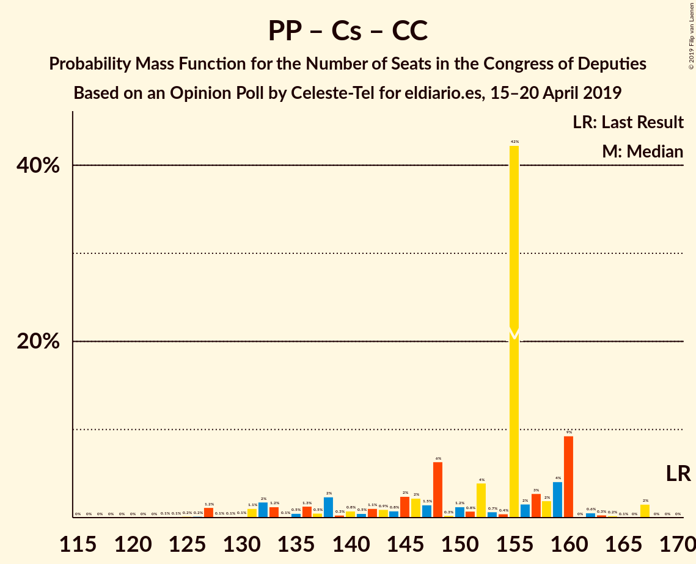
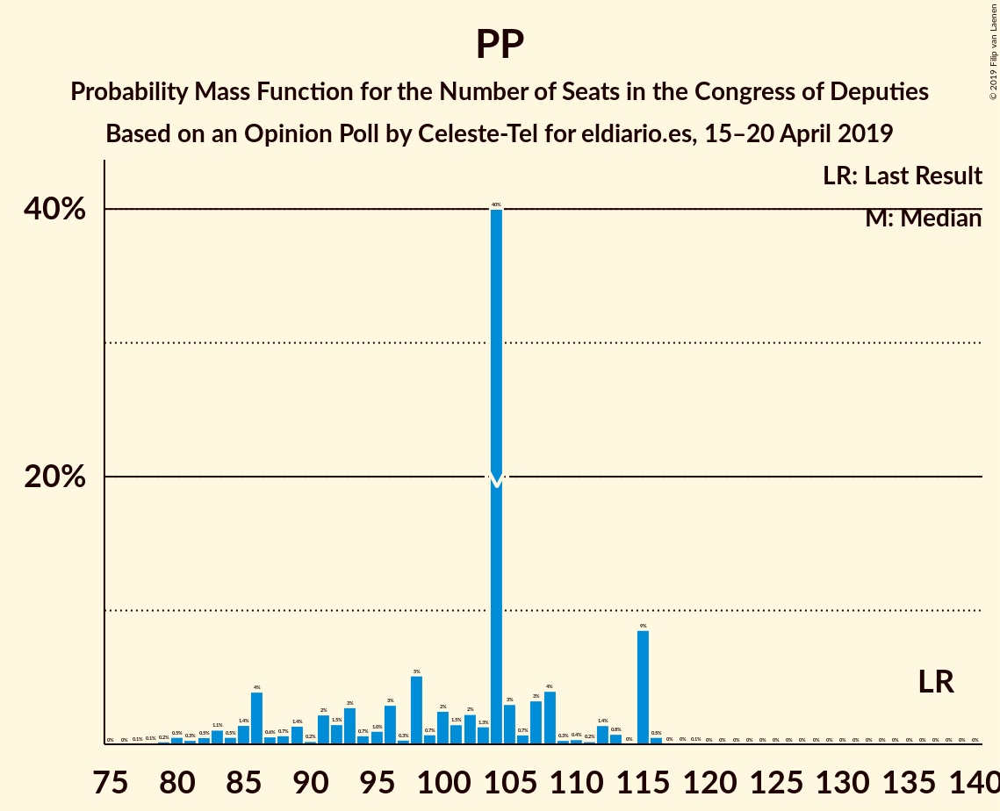

# Opinion Poll by Celeste-Tel for eldiario.es, 15–20 April 2019

<a href="#voting-intentions">Voting Intentions</a> | <a href="#seats">Seats</a> | <a href="#coalitions">Coalitions</a> | <a href="#technical-information">Technical Information</a>

## Voting Intentions

### Confidence Intervals

| Party | Last Result | Poll Result | 80% Confidence Interval | 90% Confidence Interval | 95% Confidence Interval | 99% Confidence Interval |
|:-----:|:-----------:|:-----------:|:-----------------------:|:-----------------------:|:-----------------------:|:-----------------------:|
| Partido Socialista Obrero Español | 22.6% | 28.9% | 27.2–30.7% |26.7–31.2% |26.3–31.7% |25.5–32.5% |
| Partido Popular | 33.0% | 23.5% | 22.0–25.3% |21.5–25.7% |21.1–26.2% |20.4–27.0% |
| Ciudadanos–Partido de la Ciudadanía | 13.1% | 15.1% | 13.8–16.6% |13.4–17.0% |13.1–17.3% |12.5–18.1% |
| Unidos Podemos | 21.2% | 14.8% | 13.5–16.3% |13.2–16.7% |12.8–17.1% |12.2–17.8% |
| Vox | 0.2% | 7.9% | 7.0–9.1% |6.7–9.4% |6.4–9.7% |6.0–10.2% |
| Esquerra Republicana de Catalunya–Catalunya Sí | 2.7% | 2.9% | 2.3–3.7% |2.2–3.9% |2.1–4.1% |1.8–4.5% |
| Partit Demòcrata Europeu Català | 2.0% | 1.5% | 1.2–2.1% |1.1–2.3% |1.0–2.5% |0.8–2.8% |
| Partido Animalista Contra el Maltrato Animal | 1.2% | 1.3% | 0.9–1.8% |0.8–2.0% |0.8–2.1% |0.6–2.4% |
| Euzko Alderdi Jeltzalea/Partido Nacionalista Vasco | 1.2% | 1.2% | 0.9–1.7% |0.8–1.9% |0.7–2.0% |0.6–2.3% |
| Euskal Herria Bildu | 0.8% | 0.8% | 0.6–1.3% |0.5–1.4% |0.4–1.6% |0.3–1.8% |
| Coalición Canaria–Partido Nacionalista Canario | 0.3% | 0.3% | 0.2–0.6% |0.1–0.7% |0.1–0.8% |0.1–1.0% |

*Note:* The poll result column reflects the actual value used in the calculations. Published results may vary slightly, and in addition be rounded to fewer digits.

## Seats

### Confidence Intervals

| Party | Last Result | Median | 80% Confidence Interval | 90% Confidence Interval | 95% Confidence Interval | 99% Confidence Interval |
|:-----:|:-----------:|:------:|:-----------------------:|:-----------------------:|:-----------------------:|:-----------------------:|
| <a href="#partido-socialista-obrero-español">Partido Socialista Obrero Español</a> | 85 | 112 | 112–127 |110–132 |108–138 |105–139 |
| <a href="#partido-popular">Partido Popular</a> | 137 | 104 | 88–113 |86–115 |83–115 |80–116 |
| <a href="#ciudadanos–partido-de-la-ciudadanía">Ciudadanos–Partido de la Ciudadanía</a> | 32 | 50 | 45–53 |41–56 |36–59 |32–61 |
| <a href="#unidos-podemos">Unidos Podemos</a> | 71 | 42 | 35–42 |34–47 |34–50 |32–54 |
| <a href="#vox">Vox</a> | 0 | 16 | 11–18 |11–20 |10–22 |9–24 |
| <a href="#esquerra-republicana-de-catalunya–catalunya-sí">Esquerra Republicana de Catalunya–Catalunya Sí</a> | 9 | 11 | 10–15 |9–15 |9–15 |8–16 |
| <a href="#partit-demòcrata-europeu-català">Partit Demòcrata Europeu Català</a> | 8 | 6 | 4–8 |4–9 |4–9 |3–10 |
| <a href="#partido-animalista-contra-el-maltrato-animal">Partido Animalista Contra el Maltrato Animal</a> | 0 | 0 | 0 |0–1 |0–1 |0–1 |
| <a href="#euzko-alderdi-jeltzalea/partido-nacionalista-vasco">Euzko Alderdi Jeltzalea/Partido Nacionalista Vasco</a> | 5 | 4 | 4–8 |3–8 |3–8 |3–10 |
| <a href="#euskal-herria-bildu">Euskal Herria Bildu</a> | 2 | 4 | 2–6 |1–6 |1–7 |0–7 |
| <a href="#coalición-canaria–partido-nacionalista-canario">Coalición Canaria–Partido Nacionalista Canario</a> | 1 | 1 | 0–1 |0–2 |0–2 |0–3 |

### Partido Socialista Obrero Español

*For a full overview of the results for this party, see the [Partido Socialista Obrero Español](party-partidosocialistaobreroespañol.html) page.*

| Number of Seats | Probability | Accumulated | Special Marks |
|:---------------:|:-----------:|:-----------:|:-------------:|
| 85 | 0% | 100% | Last Result |
| 86 | 0% | 100% |  |
| 87 | 0% | 100% |  |
| 88 | 0% | 100% |  |
| 89 | 0% | 100% |  |
| 90 | 0% | 100% |  |
| 91 | 0% | 100% |  |
| 92 | 0% | 100% |  |
| 93 | 0% | 100% |  |
| 94 | 0% | 100% |  |
| 95 | 0% | 100% |  |
| 96 | 0% | 100% |  |
| 97 | 0.1% | 100% |  |
| 98 | 0% | 99.9% |  |
| 99 | 0% | 99.9% |  |
| 100 | 0% | 99.9% |  |
| 101 | 0% | 99.9% |  |
| 102 | 0.1% | 99.8% |  |
| 103 | 0.2% | 99.8% |  |
| 104 | 0.1% | 99.6% |  |
| 105 | 2% | 99.5% |  |
| 106 | 0.1% | 98% |  |
| 107 | 0.1% | 98% |  |
| 108 | 0.7% | 98% |  |
| 109 | 0.4% | 97% |  |
| 110 | 2% | 97% |  |
| 111 | 0.6% | 94% |  |
| 112 | 50% | 94% | Median |
| 113 | 7% | 44% |  |
| 114 | 3% | 36% |  |
| 115 | 2% | 33% |  |
| 116 | 1.4% | 32% |  |
| 117 | 8% | 30% |  |
| 118 | 2% | 22% |  |
| 119 | 1.4% | 20% |  |
| 120 | 2% | 19% |  |
| 121 | 0.3% | 17% |  |
| 122 | 0.8% | 17% |  |
| 123 | 0.8% | 16% |  |
| 124 | 1.4% | 15% |  |
| 125 | 0.4% | 14% |  |
| 126 | 0.4% | 13% |  |
| 127 | 3% | 13% |  |
| 128 | 0.7% | 10% |  |
| 129 | 1.0% | 9% |  |
| 130 | 1.0% | 8% |  |
| 131 | 0.3% | 7% |  |
| 132 | 2% | 7% |  |
| 133 | 1.4% | 5% |  |
| 134 | 0.1% | 3% |  |
| 135 | 0.3% | 3% |  |
| 136 | 0% | 3% |  |
| 137 | 0.2% | 3% |  |
| 138 | 1.3% | 3% |  |
| 139 | 1.1% | 2% |  |
| 140 | 0% | 0.5% |  |
| 141 | 0.2% | 0.5% |  |
| 142 | 0.1% | 0.3% |  |
| 143 | 0.1% | 0.2% |  |
| 144 | 0% | 0.1% |  |
| 145 | 0% | 0.1% |  |
| 146 | 0% | 0.1% |  |
| 147 | 0% | 0% |  |

### Partido Popular

*For a full overview of the results for this party, see the [Partido Popular](party-partidopopular.html) page.*

| Number of Seats | Probability | Accumulated | Special Marks |
|:---------------:|:-----------:|:-----------:|:-------------:|
| 76 | 0% | 100% |  |
| 77 | 0.1% | 99.9% |  |
| 78 | 0.1% | 99.9% |  |
| 79 | 0.2% | 99.8% |  |
| 80 | 0.5% | 99.6% |  |
| 81 | 0.3% | 99.0% |  |
| 82 | 0.5% | 98.7% |  |
| 83 | 1.1% | 98% |  |
| 84 | 0.5% | 97% |  |
| 85 | 1.4% | 97% |  |
| 86 | 4% | 95% |  |
| 87 | 0.6% | 91% |  |
| 88 | 0.7% | 91% |  |
| 89 | 1.4% | 90% |  |
| 90 | 0.2% | 89% |  |
| 91 | 2% | 88% |  |
| 92 | 1.5% | 86% |  |
| 93 | 3% | 85% |  |
| 94 | 0.7% | 82% |  |
| 95 | 1.0% | 81% |  |
| 96 | 3% | 80% |  |
| 97 | 0.3% | 77% |  |
| 98 | 5% | 77% |  |
| 99 | 0.7% | 72% |  |
| 100 | 2% | 71% |  |
| 101 | 1.5% | 68% |  |
| 102 | 2% | 67% |  |
| 103 | 1.3% | 65% |  |
| 104 | 40% | 63% | Median |
| 105 | 3% | 23% |  |
| 106 | 0.7% | 20% |  |
| 107 | 3% | 20% |  |
| 108 | 4% | 16% |  |
| 109 | 0.3% | 12% |  |
| 110 | 0.4% | 12% |  |
| 111 | 0.2% | 12% |  |
| 112 | 1.4% | 11% |  |
| 113 | 0.8% | 10% |  |
| 114 | 0% | 9% |  |
| 115 | 9% | 9% |  |
| 116 | 0.5% | 0.7% |  |
| 117 | 0% | 0.2% |  |
| 118 | 0% | 0.1% |  |
| 119 | 0.1% | 0.1% |  |
| 120 | 0% | 0% |  |
| 121 | 0% | 0% |  |
| 122 | 0% | 0% |  |
| 123 | 0% | 0% |  |
| 124 | 0% | 0% |  |
| 125 | 0% | 0% |  |
| 126 | 0% | 0% |  |
| 127 | 0% | 0% |  |
| 128 | 0% | 0% |  |
| 129 | 0% | 0% |  |
| 130 | 0% | 0% |  |
| 131 | 0% | 0% |  |
| 132 | 0% | 0% |  |
| 133 | 0% | 0% |  |
| 134 | 0% | 0% |  |
| 135 | 0% | 0% |  |
| 136 | 0% | 0% |  |
| 137 | 0% | 0% | Last Result |

### Ciudadanos–Partido de la Ciudadanía

*For a full overview of the results for this party, see the [Ciudadanos–Partido de la Ciudadanía](party-ciudadanos–partidodelaciudadanía.html) page.*

| Number of Seats | Probability | Accumulated | Special Marks |
|:---------------:|:-----------:|:-----------:|:-------------:|
| 29 | 0% | 100% |  |
| 30 | 0.1% | 99.9% |  |
| 31 | 0.3% | 99.9% |  |
| 32 | 0.3% | 99.6% | Last Result |
| 33 | 0.1% | 99.2% |  |
| 34 | 0.7% | 99.1% |  |
| 35 | 0.1% | 98% |  |
| 36 | 1.1% | 98% |  |
| 37 | 0.9% | 97% |  |
| 38 | 0.1% | 96% |  |
| 39 | 0.2% | 96% |  |
| 40 | 0.6% | 96% |  |
| 41 | 0.8% | 95% |  |
| 42 | 0.3% | 95% |  |
| 43 | 0.4% | 94% |  |
| 44 | 0.2% | 94% |  |
| 45 | 9% | 94% |  |
| 46 | 3% | 85% |  |
| 47 | 3% | 82% |  |
| 48 | 4% | 80% |  |
| 49 | 2% | 76% |  |
| 50 | 54% | 74% | Median |
| 51 | 7% | 20% |  |
| 52 | 2% | 13% |  |
| 53 | 2% | 12% |  |
| 54 | 2% | 9% |  |
| 55 | 1.1% | 7% |  |
| 56 | 1.2% | 6% |  |
| 57 | 0.5% | 5% |  |
| 58 | 0.2% | 4% |  |
| 59 | 2% | 4% |  |
| 60 | 1.2% | 2% |  |
| 61 | 0.3% | 0.6% |  |
| 62 | 0.1% | 0.3% |  |
| 63 | 0.2% | 0.2% |  |
| 64 | 0% | 0% |  |

### Unidos Podemos

*For a full overview of the results for this party, see the [Unidos Podemos](party-unidospodemos.html) page.*

| Number of Seats | Probability | Accumulated | Special Marks |
|:---------------:|:-----------:|:-----------:|:-------------:|
| 28 | 0.1% | 100% |  |
| 29 | 0% | 99.9% |  |
| 30 | 0% | 99.9% |  |
| 31 | 0.2% | 99.9% |  |
| 32 | 0.6% | 99.6% |  |
| 33 | 0.3% | 99.0% |  |
| 34 | 5% | 98.8% |  |
| 35 | 6% | 94% |  |
| 36 | 6% | 88% |  |
| 37 | 4% | 82% |  |
| 38 | 2% | 79% |  |
| 39 | 8% | 76% |  |
| 40 | 5% | 69% |  |
| 41 | 11% | 64% |  |
| 42 | 43% | 53% | Median |
| 43 | 1.3% | 10% |  |
| 44 | 1.2% | 9% |  |
| 45 | 0.3% | 7% |  |
| 46 | 0.5% | 7% |  |
| 47 | 2% | 7% |  |
| 48 | 0.3% | 4% |  |
| 49 | 0.3% | 4% |  |
| 50 | 2% | 4% |  |
| 51 | 0.2% | 2% |  |
| 52 | 0.1% | 2% |  |
| 53 | 0.5% | 2% |  |
| 54 | 0.8% | 1.2% |  |
| 55 | 0.1% | 0.5% |  |
| 56 | 0.1% | 0.4% |  |
| 57 | 0% | 0.2% |  |
| 58 | 0.1% | 0.2% |  |
| 59 | 0.1% | 0.1% |  |
| 60 | 0% | 0% |  |
| 61 | 0% | 0% |  |
| 62 | 0% | 0% |  |
| 63 | 0% | 0% |  |
| 64 | 0% | 0% |  |
| 65 | 0% | 0% |  |
| 66 | 0% | 0% |  |
| 67 | 0% | 0% |  |
| 68 | 0% | 0% |  |
| 69 | 0% | 0% |  |
| 70 | 0% | 0% |  |
| 71 | 0% | 0% | Last Result |

### Vox

*For a full overview of the results for this party, see the [Vox](party-vox.html) page.*

| Number of Seats | Probability | Accumulated | Special Marks |
|:---------------:|:-----------:|:-----------:|:-------------:|
| 0 | 0% | 100% | Last Result |
| 1 | 0% | 100% |  |
| 2 | 0% | 100% |  |
| 3 | 0% | 100% |  |
| 4 | 0% | 100% |  |
| 5 | 0% | 100% |  |
| 6 | 0% | 100% |  |
| 7 | 0% | 100% |  |
| 8 | 0.3% | 99.9% |  |
| 9 | 0.7% | 99.6% |  |
| 10 | 3% | 99.0% |  |
| 11 | 11% | 96% |  |
| 12 | 4% | 84% |  |
| 13 | 12% | 80% |  |
| 14 | 3% | 68% |  |
| 15 | 3% | 65% |  |
| 16 | 46% | 62% | Median |
| 17 | 5% | 16% |  |
| 18 | 5% | 12% |  |
| 19 | 2% | 7% |  |
| 20 | 2% | 5% |  |
| 21 | 0.7% | 4% |  |
| 22 | 0.9% | 3% |  |
| 23 | 0.8% | 2% |  |
| 24 | 1.3% | 1.3% |  |
| 25 | 0% | 0.1% |  |
| 26 | 0% | 0.1% |  |
| 27 | 0% | 0% |  |

### Esquerra Republicana de Catalunya–Catalunya Sí

*For a full overview of the results for this party, see the [Esquerra Republicana de Catalunya–Catalunya Sí](party-esquerrarepublicanadecatalunya–catalunyasí.html) page.*

| Number of Seats | Probability | Accumulated | Special Marks |
|:---------------:|:-----------:|:-----------:|:-------------:|
| 6 | 0.1% | 100% |  |
| 7 | 0.4% | 99.9% |  |
| 8 | 1.3% | 99.5% |  |
| 9 | 8% | 98% | Last Result |
| 10 | 2% | 91% |  |
| 11 | 50% | 89% | Median |
| 12 | 8% | 40% |  |
| 13 | 12% | 31% |  |
| 14 | 8% | 19% |  |
| 15 | 11% | 11% |  |
| 16 | 0.4% | 0.7% |  |
| 17 | 0.2% | 0.4% |  |
| 18 | 0.1% | 0.2% |  |
| 19 | 0.1% | 0.1% |  |
| 20 | 0% | 0% |  |

### Partit Demòcrata Europeu Català

*For a full overview of the results for this party, see the [Partit Demòcrata Europeu Català](party-partitdemòcrataeuropeucatalà.html) page.*

| Number of Seats | Probability | Accumulated | Special Marks |
|:---------------:|:-----------:|:-----------:|:-------------:|
| 1 | 0.2% | 100% |  |
| 2 | 0.2% | 99.8% |  |
| 3 | 2% | 99.6% |  |
| 4 | 8% | 98% |  |
| 5 | 16% | 90% |  |
| 6 | 52% | 73% | Median |
| 7 | 3% | 21% |  |
| 8 | 13% | 18% | Last Result |
| 9 | 3% | 5% |  |
| 10 | 2% | 2% |  |
| 11 | 0.2% | 0.2% |  |
| 12 | 0% | 0% |  |

### Partido Animalista Contra el Maltrato Animal

*For a full overview of the results for this party, see the [Partido Animalista Contra el Maltrato Animal](party-partidoanimalistacontraelmaltratoanimal.html) page.*

| Number of Seats | Probability | Accumulated | Special Marks |
|:---------------:|:-----------:|:-----------:|:-------------:|
| 0 | 92% | 100% | Last Result, Median |
| 1 | 8% | 8% |  |
| 2 | 0% | 0% |  |

### Euzko Alderdi Jeltzalea/Partido Nacionalista Vasco

*For a full overview of the results for this party, see the [Euzko Alderdi Jeltzalea/Partido Nacionalista Vasco](party-euzkoalderdijeltzaleapartidonacionalistavasco.html) page.*

| Number of Seats | Probability | Accumulated | Special Marks |
|:---------------:|:-----------:|:-----------:|:-------------:|
| 1 | 0.1% | 100% |  |
| 2 | 0.3% | 99.9% |  |
| 3 | 5% | 99.6% |  |
| 4 | 46% | 95% | Median |
| 5 | 6% | 49% | Last Result |
| 6 | 27% | 44% |  |
| 7 | 7% | 17% |  |
| 8 | 8% | 10% |  |
| 9 | 2% | 2% |  |
| 10 | 0.6% | 0.6% |  |
| 11 | 0% | 0% |  |

### Euskal Herria Bildu

*For a full overview of the results for this party, see the [Euskal Herria Bildu](party-euskalherriabildu.html) page.*

| Number of Seats | Probability | Accumulated | Special Marks |
|:---------------:|:-----------:|:-----------:|:-------------:|
| 0 | 0.8% | 100% |  |
| 1 | 6% | 99.2% |  |
| 2 | 21% | 93% | Last Result |
| 3 | 4% | 72% |  |
| 4 | 52% | 68% | Median |
| 5 | 5% | 17% |  |
| 6 | 8% | 12% |  |
| 7 | 3% | 4% |  |
| 8 | 0.4% | 0.5% |  |
| 9 | 0% | 0.1% |  |
| 10 | 0% | 0% |  |

### Coalición Canaria–Partido Nacionalista Canario

*For a full overview of the results for this party, see the [Coalición Canaria–Partido Nacionalista Canario](party-coalicióncanaria–partidonacionalistacanario.html) page.*

| Number of Seats | Probability | Accumulated | Special Marks |
|:---------------:|:-----------:|:-----------:|:-------------:|
| 0 | 26% | 100% |  |
| 1 | 68% | 74% | Last Result, Median |
| 2 | 5% | 6% |  |
| 3 | 0.7% | 1.2% |  |
| 4 | 0.4% | 0.5% |  |
| 5 | 0% | 0% |  |

## Coalitions

### Confidence Intervals

| Coalition | Last Result | Median | Majority? | 80% Confidence Interval | 90% Confidence Interval | 95% Confidence Interval | 99% Confidence Interval |
|:---------:|:-----------:|:------:|:---------:|:-----------------------:|:-----------------------:|:-----------------------:|:-----------------------:|
| Partido Socialista Obrero Español – Partido Popular – Ciudadanos–Partido de la Ciudadanía | 254 | 266 | 100% | 262–272 | 257–274 | 254–275 | 250–279 |
| Partido Socialista Obrero Español – Partido Popular | 222 | 216 | 100% | 211–227 | 207–227 | 205–228 | 199–236 |
| Partido Socialista Obrero Español – Ciudadanos–Partido de la Ciudadanía – Unidos Podemos | 188 | 204 | 100% | 198–217 | 197–221 | 195–223 | 190–228 |
| Partido Socialista Obrero Español – Unidos Podemos – Esquerra Republicana de Catalunya–Catalunya Sí – Partit Demòcrata Europeu Català – Euzko Alderdi Jeltzalea/Partido Nacionalista Vasco – Euskal Herria Bildu | 180 | 179 | 96% | 177–196 | 176–203 | 174–206 | 170–207 |
| Partido Socialista Obrero Español – Unidos Podemos – Esquerra Republicana de Catalunya–Catalunya Sí – Partit Demòcrata Europeu Català | 173 | 171 | 28% | 168–186 | 166–193 | 164–195 | 161–199 |
| Partido Socialista Obrero Español – Unidos Podemos – Esquerra Republicana de Catalunya–Catalunya Sí – Euskal Herria Bildu | 167 | 169 | 26% | 165–184 | 162–190 | 160–193 | 159–197 |
| Partido Socialista Obrero Español – Unidos Podemos – Euzko Alderdi Jeltzalea/Partido Nacionalista Vasco – Euskal Herria Bildu | 163 | 162 | 13% | 159–177 | 158–183 | 157–188 | 150–189 |
| Partido Socialista Obrero Español – Ciudadanos–Partido de la Ciudadanía | 117 | 162 | 12% | 157–179 | 157–182 | 155–184 | 150–187 |
| Partido Socialista Obrero Español – Unidos Podemos – Euzko Alderdi Jeltzalea/Partido Nacionalista Vasco | 161 | 158 | 9% | 157–174 | 153–181 | 152–183 | 146–186 |
| Partido Socialista Obrero Español – Unidos Podemos | 156 | 154 | 3% | 150–167 | 147–174 | 146–177 | 141–180 |
| Partido Popular – Ciudadanos–Partido de la Ciudadanía – Vox | 169 | 170 | 2% | 152–172 | 146–173 | 143–174 | 142–179 |
| Partido Popular – Ciudadanos–Partido de la Ciudadanía – Euzko Alderdi Jeltzalea/Partido Nacionalista Vasco | 174 | 158 | 0% | 144–166 | 138–166 | 134–167 | 131–171 |
| Partido Popular – Ciudadanos–Partido de la Ciudadanía – Coalición Canaria–Partido Nacionalista Canario | 170 | 155 | 0% | 138–160 | 132–160 | 131–162 | 126–167 |
| Partido Popular – Ciudadanos–Partido de la Ciudadanía | 169 | 154 | 0% | 136–160 | 132–160 | 130–161 | 125–166 |
| Partido Socialista Obrero Español | 85 | 112 | 0% | 112–127 | 110–132 | 108–138 | 105–139 |
| Partido Popular – Vox | 137 | 120 | 0% | 103–126 | 100–126 | 98–126 | 94–133 |
| Partido Popular | 137 | 104 | 0% | 88–113 | 86–115 | 83–115 | 80–116 |

### Partido Socialista Obrero Español – Partido Popular – Ciudadanos–Partido de la Ciudadanía

| Number of Seats | Probability | Accumulated | Special Marks |
|:---------------:|:-----------:|:-----------:|:-------------:|
| 246 | 0% | 100% |  |
| 247 | 0% | 99.9% |  |
| 248 | 0% | 99.9% |  |
| 249 | 0.1% | 99.9% |  |
| 250 | 0.9% | 99.8% |  |
| 251 | 0.3% | 98.9% |  |
| 252 | 0.1% | 98.7% |  |
| 253 | 0.3% | 98.6% |  |
| 254 | 2% | 98% | Last Result |
| 255 | 0.2% | 97% |  |
| 256 | 0.6% | 97% |  |
| 257 | 2% | 96% |  |
| 258 | 1.0% | 94% |  |
| 259 | 1.4% | 93% |  |
| 260 | 0.8% | 92% |  |
| 261 | 0.8% | 91% |  |
| 262 | 1.0% | 90% |  |
| 263 | 2% | 89% |  |
| 264 | 2% | 87% |  |
| 265 | 9% | 86% |  |
| 266 | 41% | 77% | Median |
| 267 | 2% | 36% |  |
| 268 | 5% | 34% |  |
| 269 | 3% | 29% |  |
| 270 | 2% | 26% |  |
| 271 | 5% | 23% |  |
| 272 | 10% | 19% |  |
| 273 | 3% | 9% |  |
| 274 | 1.4% | 6% |  |
| 275 | 3% | 5% |  |
| 276 | 0.4% | 1.3% |  |
| 277 | 0.1% | 0.9% |  |
| 278 | 0.2% | 0.8% |  |
| 279 | 0.4% | 0.6% |  |
| 280 | 0% | 0.2% |  |
| 281 | 0.1% | 0.2% |  |
| 282 | 0.1% | 0.1% |  |
| 283 | 0% | 0% |  |

### Partido Socialista Obrero Español – Partido Popular

| Number of Seats | Probability | Accumulated | Special Marks |
|:---------------:|:-----------:|:-----------:|:-------------:|
| 196 | 0.2% | 100% |  |
| 197 | 0.2% | 99.7% |  |
| 198 | 0% | 99.6% |  |
| 199 | 0.1% | 99.6% |  |
| 200 | 0.1% | 99.4% |  |
| 201 | 0.2% | 99.3% |  |
| 202 | 1.1% | 99.2% |  |
| 203 | 0.1% | 98% |  |
| 204 | 0.1% | 98% |  |
| 205 | 0.5% | 98% |  |
| 206 | 1.3% | 97% |  |
| 207 | 1.1% | 96% |  |
| 208 | 1.3% | 95% |  |
| 209 | 2% | 94% |  |
| 210 | 0.8% | 92% |  |
| 211 | 3% | 91% |  |
| 212 | 1.1% | 88% |  |
| 213 | 0.5% | 87% |  |
| 214 | 2% | 87% |  |
| 215 | 8% | 85% |  |
| 216 | 40% | 76% | Median |
| 217 | 2% | 36% |  |
| 218 | 6% | 34% |  |
| 219 | 0.6% | 28% |  |
| 220 | 2% | 27% |  |
| 221 | 4% | 25% |  |
| 222 | 2% | 22% | Last Result |
| 223 | 1.3% | 19% |  |
| 224 | 4% | 18% |  |
| 225 | 0.4% | 14% |  |
| 226 | 1.2% | 14% |  |
| 227 | 10% | 12% |  |
| 228 | 0.6% | 3% |  |
| 229 | 0.1% | 2% |  |
| 230 | 0.6% | 2% |  |
| 231 | 0.2% | 1.5% |  |
| 232 | 0.2% | 1.2% |  |
| 233 | 0.3% | 1.0% |  |
| 234 | 0.1% | 0.7% |  |
| 235 | 0% | 0.6% |  |
| 236 | 0.1% | 0.5% |  |
| 237 | 0.2% | 0.5% |  |
| 238 | 0% | 0.3% |  |
| 239 | 0% | 0.3% |  |
| 240 | 0% | 0.2% |  |
| 241 | 0% | 0.2% |  |
| 242 | 0% | 0.2% |  |
| 243 | 0.1% | 0.2% |  |
| 244 | 0.1% | 0.1% |  |
| 245 | 0% | 0% |  |

### Partido Socialista Obrero Español – Ciudadanos–Partido de la Ciudadanía – Unidos Podemos

| Number of Seats | Probability | Accumulated | Special Marks |
|:---------------:|:-----------:|:-----------:|:-------------:|
| 183 | 0% | 100% |  |
| 184 | 0% | 99.9% |  |
| 185 | 0% | 99.9% |  |
| 186 | 0% | 99.9% |  |
| 187 | 0.1% | 99.9% |  |
| 188 | 0% | 99.8% | Last Result |
| 189 | 0% | 99.8% |  |
| 190 | 0.6% | 99.8% |  |
| 191 | 0.1% | 99.1% |  |
| 192 | 0.1% | 99.0% |  |
| 193 | 0.4% | 99.0% |  |
| 194 | 0.2% | 98.6% |  |
| 195 | 2% | 98% |  |
| 196 | 1.2% | 96% |  |
| 197 | 2% | 95% |  |
| 198 | 9% | 93% |  |
| 199 | 0.3% | 84% |  |
| 200 | 3% | 83% |  |
| 201 | 3% | 80% |  |
| 202 | 0.3% | 77% |  |
| 203 | 1.3% | 77% |  |
| 204 | 44% | 76% | Median |
| 205 | 1.2% | 32% |  |
| 206 | 6% | 30% |  |
| 207 | 2% | 24% |  |
| 208 | 0.5% | 23% |  |
| 209 | 0.6% | 22% |  |
| 210 | 0.6% | 22% |  |
| 211 | 1.0% | 21% |  |
| 212 | 1.3% | 20% |  |
| 213 | 2% | 19% |  |
| 214 | 0.8% | 17% |  |
| 215 | 0.5% | 16% |  |
| 216 | 4% | 15% |  |
| 217 | 2% | 12% |  |
| 218 | 1.0% | 10% |  |
| 219 | 1.2% | 9% |  |
| 220 | 2% | 7% |  |
| 221 | 1.4% | 6% |  |
| 222 | 2% | 4% |  |
| 223 | 0.9% | 3% |  |
| 224 | 0.8% | 2% |  |
| 225 | 0.2% | 1.2% |  |
| 226 | 0.3% | 0.9% |  |
| 227 | 0.1% | 0.6% |  |
| 228 | 0.1% | 0.5% |  |
| 229 | 0.2% | 0.4% |  |
| 230 | 0.1% | 0.2% |  |
| 231 | 0.1% | 0.2% |  |
| 232 | 0% | 0.1% |  |
| 233 | 0% | 0.1% |  |
| 234 | 0% | 0% |  |

### Partido Socialista Obrero Español – Unidos Podemos – Esquerra Republicana de Catalunya–Catalunya Sí – Partit Demòcrata Europeu Català – Euzko Alderdi Jeltzalea/Partido Nacionalista Vasco – Euskal Herria Bildu

| Number of Seats | Probability | Accumulated | Special Marks |
|:---------------:|:-----------:|:-----------:|:-------------:|
| 168 | 0.2% | 100% |  |
| 169 | 0.2% | 99.7% |  |
| 170 | 1.4% | 99.5% |  |
| 171 | 0% | 98% |  |
| 172 | 0.1% | 98% |  |
| 173 | 0.2% | 98% |  |
| 174 | 1.4% | 98% |  |
| 175 | 0.2% | 96% |  |
| 176 | 4% | 96% | Majority |
| 177 | 3% | 92% |  |
| 178 | 3% | 89% |  |
| 179 | 48% | 86% | Median |
| 180 | 3% | 38% | Last Result |
| 181 | 4% | 35% |  |
| 182 | 0.7% | 32% |  |
| 183 | 0.9% | 31% |  |
| 184 | 0.2% | 30% |  |
| 185 | 1.3% | 30% |  |
| 186 | 4% | 29% |  |
| 187 | 2% | 25% |  |
| 188 | 0.8% | 23% |  |
| 189 | 5% | 22% |  |
| 190 | 0.8% | 17% |  |
| 191 | 2% | 16% |  |
| 192 | 0.3% | 14% |  |
| 193 | 0.5% | 14% |  |
| 194 | 0.4% | 13% |  |
| 195 | 0.6% | 13% |  |
| 196 | 3% | 12% |  |
| 197 | 0.5% | 9% |  |
| 198 | 0.3% | 9% |  |
| 199 | 0.1% | 8% |  |
| 200 | 0.5% | 8% |  |
| 201 | 2% | 8% |  |
| 202 | 0.9% | 6% |  |
| 203 | 2% | 5% |  |
| 204 | 0.2% | 3% |  |
| 205 | 0.1% | 3% |  |
| 206 | 0.3% | 3% |  |
| 207 | 2% | 2% |  |
| 208 | 0.1% | 0.5% |  |
| 209 | 0% | 0.4% |  |
| 210 | 0% | 0.4% |  |
| 211 | 0% | 0.4% |  |
| 212 | 0.2% | 0.3% |  |
| 213 | 0% | 0.2% |  |
| 214 | 0% | 0.2% |  |
| 215 | 0.1% | 0.1% |  |
| 216 | 0% | 0% |  |

### Partido Socialista Obrero Español – Unidos Podemos – Esquerra Republicana de Catalunya–Catalunya Sí – Partit Demòcrata Europeu Català

| Number of Seats | Probability | Accumulated | Special Marks |
|:---------------:|:-----------:|:-----------:|:-------------:|
| 158 | 0.2% | 100% |  |
| 159 | 0% | 99.7% |  |
| 160 | 0% | 99.7% |  |
| 161 | 1.5% | 99.6% |  |
| 162 | 0% | 98% |  |
| 163 | 0.5% | 98% |  |
| 164 | 0.3% | 98% |  |
| 165 | 2% | 97% |  |
| 166 | 5% | 96% |  |
| 167 | 0.1% | 90% |  |
| 168 | 2% | 90% |  |
| 169 | 1.1% | 88% |  |
| 170 | 2% | 87% |  |
| 171 | 50% | 86% | Median |
| 172 | 4% | 35% |  |
| 173 | 0.7% | 32% | Last Result |
| 174 | 0.9% | 31% |  |
| 175 | 2% | 30% |  |
| 176 | 2% | 28% | Majority |
| 177 | 5% | 26% |  |
| 178 | 0.5% | 21% |  |
| 179 | 3% | 20% |  |
| 180 | 0.5% | 18% |  |
| 181 | 0.8% | 17% |  |
| 182 | 1.1% | 16% |  |
| 183 | 1.1% | 15% |  |
| 184 | 2% | 14% |  |
| 185 | 0.4% | 12% |  |
| 186 | 2% | 12% |  |
| 187 | 0.4% | 10% |  |
| 188 | 0.6% | 9% |  |
| 189 | 0.2% | 9% |  |
| 190 | 0.9% | 8% |  |
| 191 | 0.6% | 8% |  |
| 192 | 1.4% | 7% |  |
| 193 | 1.3% | 6% |  |
| 194 | 1.2% | 4% |  |
| 195 | 1.1% | 3% |  |
| 196 | 0.3% | 2% |  |
| 197 | 0.1% | 2% |  |
| 198 | 0.2% | 1.5% |  |
| 199 | 0.8% | 1.3% |  |
| 200 | 0.1% | 0.5% |  |
| 201 | 0.2% | 0.4% |  |
| 202 | 0% | 0.3% |  |
| 203 | 0% | 0.2% |  |
| 204 | 0% | 0.2% |  |
| 205 | 0% | 0.2% |  |
| 206 | 0.1% | 0.2% |  |
| 207 | 0% | 0% |  |

### Partido Socialista Obrero Español – Unidos Podemos – Esquerra Republicana de Catalunya–Catalunya Sí – Euskal Herria Bildu

| Number of Seats | Probability | Accumulated | Special Marks |
|:---------------:|:-----------:|:-----------:|:-------------:|
| 155 | 0.1% | 100% |  |
| 156 | 0.1% | 99.8% |  |
| 157 | 0.1% | 99.8% |  |
| 158 | 0% | 99.6% |  |
| 159 | 0.2% | 99.6% |  |
| 160 | 2% | 99.4% |  |
| 161 | 1.1% | 97% |  |
| 162 | 2% | 96% |  |
| 163 | 0% | 94% |  |
| 164 | 4% | 94% |  |
| 165 | 0.4% | 90% |  |
| 166 | 4% | 90% |  |
| 167 | 1.0% | 86% | Last Result |
| 168 | 10% | 85% |  |
| 169 | 43% | 75% | Median |
| 170 | 1.4% | 32% |  |
| 171 | 1.1% | 31% |  |
| 172 | 0.9% | 30% |  |
| 173 | 0.1% | 29% |  |
| 174 | 2% | 29% |  |
| 175 | 0.5% | 27% |  |
| 176 | 3% | 26% | Majority |
| 177 | 8% | 24% |  |
| 178 | 0.6% | 16% |  |
| 179 | 0.4% | 15% |  |
| 180 | 2% | 15% |  |
| 181 | 0.6% | 13% |  |
| 182 | 0.8% | 12% |  |
| 183 | 0.9% | 11% |  |
| 184 | 1.3% | 10% |  |
| 185 | 0.3% | 9% |  |
| 186 | 0.3% | 9% |  |
| 187 | 0.1% | 8% |  |
| 188 | 1.3% | 8% |  |
| 189 | 1.1% | 7% |  |
| 190 | 2% | 6% |  |
| 191 | 0.7% | 4% |  |
| 192 | 0% | 3% |  |
| 193 | 1.3% | 3% |  |
| 194 | 1.1% | 2% |  |
| 195 | 0.1% | 0.8% |  |
| 196 | 0.1% | 0.6% |  |
| 197 | 0.1% | 0.5% |  |
| 198 | 0.1% | 0.5% |  |
| 199 | 0% | 0.3% |  |
| 200 | 0.1% | 0.3% |  |
| 201 | 0% | 0.2% |  |
| 202 | 0.1% | 0.2% |  |
| 203 | 0% | 0.1% |  |
| 204 | 0% | 0% |  |

### Partido Socialista Obrero Español – Unidos Podemos – Euzko Alderdi Jeltzalea/Partido Nacionalista Vasco – Euskal Herria Bildu

| Number of Seats | Probability | Accumulated | Special Marks |
|:---------------:|:-----------:|:-----------:|:-------------:|
| 148 | 0.1% | 100% |  |
| 149 | 0% | 99.9% |  |
| 150 | 2% | 99.8% |  |
| 151 | 0.1% | 98% |  |
| 152 | 0.1% | 98% |  |
| 153 | 0% | 98% |  |
| 154 | 0.1% | 98% |  |
| 155 | 0.2% | 98% |  |
| 156 | 0.1% | 98% |  |
| 157 | 2% | 98% |  |
| 158 | 2% | 95% |  |
| 159 | 3% | 93% |  |
| 160 | 3% | 89% |  |
| 161 | 8% | 87% |  |
| 162 | 43% | 78% | Median |
| 163 | 3% | 35% | Last Result |
| 164 | 2% | 32% |  |
| 165 | 0.8% | 30% |  |
| 166 | 1.3% | 29% |  |
| 167 | 2% | 28% |  |
| 168 | 6% | 26% |  |
| 169 | 1.2% | 20% |  |
| 170 | 0.3% | 19% |  |
| 171 | 0.8% | 19% |  |
| 172 | 0.4% | 18% |  |
| 173 | 2% | 18% |  |
| 174 | 2% | 16% |  |
| 175 | 1.0% | 14% |  |
| 176 | 2% | 13% | Majority |
| 177 | 0.8% | 11% |  |
| 178 | 0.5% | 10% |  |
| 179 | 0.6% | 9% |  |
| 180 | 0.4% | 9% |  |
| 181 | 0.3% | 8% |  |
| 182 | 2% | 8% |  |
| 183 | 2% | 6% |  |
| 184 | 1.2% | 4% |  |
| 185 | 0.2% | 3% |  |
| 186 | 0.2% | 3% |  |
| 187 | 0.2% | 3% |  |
| 188 | 1.2% | 3% |  |
| 189 | 1.0% | 1.5% |  |
| 190 | 0.1% | 0.4% |  |
| 191 | 0% | 0.4% |  |
| 192 | 0% | 0.4% |  |
| 193 | 0.1% | 0.4% |  |
| 194 | 0.1% | 0.2% |  |
| 195 | 0% | 0.1% |  |
| 196 | 0% | 0.1% |  |
| 197 | 0% | 0.1% |  |
| 198 | 0% | 0.1% |  |
| 199 | 0% | 0% |  |

### Partido Socialista Obrero Español – Ciudadanos–Partido de la Ciudadanía

| Number of Seats | Probability | Accumulated | Special Marks |
|:---------------:|:-----------:|:-----------:|:-------------:|
| 117 | 0% | 100% | Last Result |
| 118 | 0% | 100% |  |
| 119 | 0% | 100% |  |
| 120 | 0% | 100% |  |
| 121 | 0% | 100% |  |
| 122 | 0% | 100% |  |
| 123 | 0% | 100% |  |
| 124 | 0% | 100% |  |
| 125 | 0% | 100% |  |
| 126 | 0% | 100% |  |
| 127 | 0% | 100% |  |
| 128 | 0% | 100% |  |
| 129 | 0% | 100% |  |
| 130 | 0% | 100% |  |
| 131 | 0% | 100% |  |
| 132 | 0% | 100% |  |
| 133 | 0% | 100% |  |
| 134 | 0% | 100% |  |
| 135 | 0% | 100% |  |
| 136 | 0% | 100% |  |
| 137 | 0% | 100% |  |
| 138 | 0% | 100% |  |
| 139 | 0% | 100% |  |
| 140 | 0% | 100% |  |
| 141 | 0% | 100% |  |
| 142 | 0% | 100% |  |
| 143 | 0% | 99.9% |  |
| 144 | 0% | 99.9% |  |
| 145 | 0% | 99.9% |  |
| 146 | 0% | 99.9% |  |
| 147 | 0% | 99.8% |  |
| 148 | 0% | 99.8% |  |
| 149 | 0.1% | 99.8% |  |
| 150 | 0.5% | 99.7% |  |
| 151 | 0.4% | 99.3% |  |
| 152 | 0.1% | 98.8% |  |
| 153 | 0.2% | 98.8% |  |
| 154 | 0.1% | 98.5% |  |
| 155 | 0.9% | 98% |  |
| 156 | 1.2% | 97% |  |
| 157 | 9% | 96% |  |
| 158 | 1.1% | 88% |  |
| 159 | 2% | 86% |  |
| 160 | 0.3% | 85% |  |
| 161 | 3% | 85% |  |
| 162 | 40% | 82% | Median |
| 163 | 5% | 41% |  |
| 164 | 0.7% | 36% |  |
| 165 | 3% | 36% |  |
| 166 | 1.3% | 33% |  |
| 167 | 7% | 32% |  |
| 168 | 4% | 25% |  |
| 169 | 1.3% | 20% |  |
| 170 | 2% | 19% |  |
| 171 | 0.4% | 18% |  |
| 172 | 2% | 17% |  |
| 173 | 0.4% | 15% |  |
| 174 | 2% | 15% |  |
| 175 | 0.6% | 13% |  |
| 176 | 0.3% | 12% | Majority |
| 177 | 1.4% | 12% |  |
| 178 | 0.4% | 11% |  |
| 179 | 2% | 10% |  |
| 180 | 1.1% | 8% |  |
| 181 | 0.6% | 7% |  |
| 182 | 2% | 6% |  |
| 183 | 0.5% | 4% |  |
| 184 | 1.2% | 4% |  |
| 185 | 0.2% | 2% |  |
| 186 | 2% | 2% |  |
| 187 | 0.2% | 0.5% |  |
| 188 | 0.1% | 0.3% |  |
| 189 | 0% | 0.2% |  |
| 190 | 0% | 0.1% |  |
| 191 | 0% | 0.1% |  |
| 192 | 0% | 0.1% |  |
| 193 | 0% | 0% |  |

### Partido Socialista Obrero Español – Unidos Podemos – Euzko Alderdi Jeltzalea/Partido Nacionalista Vasco

| Number of Seats | Probability | Accumulated | Special Marks |
|:---------------:|:-----------:|:-----------:|:-------------:|
| 144 | 0% | 100% |  |
| 145 | 0.2% | 99.9% |  |
| 146 | 1.5% | 99.7% |  |
| 147 | 0% | 98% |  |
| 148 | 0.2% | 98% |  |
| 149 | 0.1% | 98% |  |
| 150 | 0.1% | 98% |  |
| 151 | 0.2% | 98% |  |
| 152 | 0.9% | 98% |  |
| 153 | 2% | 97% |  |
| 154 | 2% | 95% |  |
| 155 | 1.0% | 93% |  |
| 156 | 0.1% | 92% |  |
| 157 | 7% | 91% |  |
| 158 | 42% | 84% | Median |
| 159 | 11% | 42% |  |
| 160 | 0.6% | 32% |  |
| 161 | 1.5% | 31% | Last Result |
| 162 | 6% | 30% |  |
| 163 | 0.4% | 24% |  |
| 164 | 1.0% | 23% |  |
| 165 | 1.4% | 22% |  |
| 166 | 2% | 21% |  |
| 167 | 0.9% | 19% |  |
| 168 | 0.4% | 18% |  |
| 169 | 2% | 18% |  |
| 170 | 0.8% | 16% |  |
| 171 | 0.6% | 15% |  |
| 172 | 2% | 15% |  |
| 173 | 1.3% | 13% |  |
| 174 | 2% | 12% |  |
| 175 | 0.1% | 9% |  |
| 176 | 1.0% | 9% | Majority |
| 177 | 0.8% | 8% |  |
| 178 | 0.1% | 8% |  |
| 179 | 0.3% | 7% |  |
| 180 | 0.7% | 7% |  |
| 181 | 2% | 6% |  |
| 182 | 1.2% | 4% |  |
| 183 | 1.4% | 3% |  |
| 184 | 1.0% | 2% |  |
| 185 | 0.1% | 0.7% |  |
| 186 | 0.2% | 0.6% |  |
| 187 | 0% | 0.5% |  |
| 188 | 0.2% | 0.4% |  |
| 189 | 0% | 0.3% |  |
| 190 | 0.1% | 0.2% |  |
| 191 | 0% | 0.1% |  |
| 192 | 0% | 0.1% |  |
| 193 | 0% | 0.1% |  |
| 194 | 0% | 0.1% |  |
| 195 | 0% | 0.1% |  |
| 196 | 0% | 0.1% |  |
| 197 | 0% | 0% |  |

### Partido Socialista Obrero Español – Unidos Podemos

| Number of Seats | Probability | Accumulated | Special Marks |
|:---------------:|:-----------:|:-----------:|:-------------:|
| 138 | 0.1% | 100% |  |
| 139 | 0% | 99.9% |  |
| 140 | 0.2% | 99.8% |  |
| 141 | 1.4% | 99.7% |  |
| 142 | 0.1% | 98% |  |
| 143 | 0.1% | 98% |  |
| 144 | 0.1% | 98% |  |
| 145 | 0.2% | 98% |  |
| 146 | 0.4% | 98% |  |
| 147 | 3% | 97% |  |
| 148 | 1.5% | 94% |  |
| 149 | 1.1% | 93% |  |
| 150 | 3% | 92% |  |
| 151 | 1.4% | 89% |  |
| 152 | 1.2% | 87% |  |
| 153 | 14% | 86% |  |
| 154 | 41% | 72% | Median |
| 155 | 1.4% | 31% |  |
| 156 | 5% | 30% | Last Result |
| 157 | 2% | 24% |  |
| 158 | 1.1% | 23% |  |
| 159 | 0.8% | 22% |  |
| 160 | 0.3% | 21% |  |
| 161 | 2% | 20% |  |
| 162 | 0.7% | 18% |  |
| 163 | 0.6% | 17% |  |
| 164 | 1.2% | 17% |  |
| 165 | 1.2% | 16% |  |
| 166 | 3% | 14% |  |
| 167 | 1.5% | 11% |  |
| 168 | 0.2% | 10% |  |
| 169 | 0.2% | 10% |  |
| 170 | 0.8% | 9% |  |
| 171 | 0.9% | 9% |  |
| 172 | 0.1% | 8% |  |
| 173 | 2% | 8% |  |
| 174 | 0.6% | 5% |  |
| 175 | 1.5% | 5% |  |
| 176 | 0.3% | 3% | Majority |
| 177 | 1.0% | 3% |  |
| 178 | 0.1% | 2% |  |
| 179 | 0.2% | 2% |  |
| 180 | 1.1% | 2% |  |
| 181 | 0% | 0.5% |  |
| 182 | 0.1% | 0.4% |  |
| 183 | 0% | 0.3% |  |
| 184 | 0% | 0.3% |  |
| 185 | 0.1% | 0.2% |  |
| 186 | 0% | 0.1% |  |
| 187 | 0% | 0.1% |  |
| 188 | 0% | 0.1% |  |
| 189 | 0% | 0.1% |  |
| 190 | 0% | 0.1% |  |
| 191 | 0% | 0% |  |

### Partido Popular – Ciudadanos–Partido de la Ciudadanía – Vox

| Number of Seats | Probability | Accumulated | Special Marks |
|:---------------:|:-----------:|:-----------:|:-------------:|
| 134 | 0% | 100% |  |
| 135 | 0.1% | 99.9% |  |
| 136 | 0% | 99.8% |  |
| 137 | 0.1% | 99.8% |  |
| 138 | 0% | 99.7% |  |
| 139 | 0% | 99.6% |  |
| 140 | 0% | 99.6% |  |
| 141 | 0.1% | 99.6% |  |
| 142 | 1.0% | 99.5% |  |
| 143 | 1.1% | 98.6% |  |
| 144 | 0.4% | 97% |  |
| 145 | 0.1% | 97% |  |
| 146 | 2% | 97% |  |
| 147 | 0.9% | 95% |  |
| 148 | 2% | 94% |  |
| 149 | 0.6% | 92% |  |
| 150 | 0.3% | 92% |  |
| 151 | 0.3% | 91% |  |
| 152 | 2% | 91% |  |
| 153 | 1.0% | 89% |  |
| 154 | 0.5% | 88% |  |
| 155 | 0.5% | 87% |  |
| 156 | 0.7% | 87% |  |
| 157 | 0.3% | 86% |  |
| 158 | 1.4% | 86% |  |
| 159 | 1.1% | 84% |  |
| 160 | 0.4% | 83% |  |
| 161 | 6% | 83% |  |
| 162 | 3% | 77% |  |
| 163 | 3% | 74% |  |
| 164 | 1.2% | 71% |  |
| 165 | 0.2% | 70% |  |
| 166 | 1.0% | 70% |  |
| 167 | 0.8% | 69% |  |
| 168 | 3% | 68% |  |
| 169 | 1.0% | 65% | Last Result |
| 170 | 42% | 64% | Median |
| 171 | 10% | 22% |  |
| 172 | 3% | 11% |  |
| 173 | 5% | 9% |  |
| 174 | 1.3% | 4% |  |
| 175 | 0.3% | 2% |  |
| 176 | 0.1% | 2% | Majority |
| 177 | 0% | 2% |  |
| 178 | 0.2% | 2% |  |
| 179 | 1.5% | 2% |  |
| 180 | 0% | 0.3% |  |
| 181 | 0.3% | 0.3% |  |
| 182 | 0% | 0% |  |

### Partido Popular – Ciudadanos–Partido de la Ciudadanía – Euzko Alderdi Jeltzalea/Partido Nacionalista Vasco

| Number of Seats | Probability | Accumulated | Special Marks |
|:---------------:|:-----------:|:-----------:|:-------------:|
| 123 | 0% | 100% |  |
| 124 | 0% | 99.9% |  |
| 125 | 0% | 99.9% |  |
| 126 | 0% | 99.9% |  |
| 127 | 0.2% | 99.9% |  |
| 128 | 0.1% | 99.7% |  |
| 129 | 0% | 99.6% |  |
| 130 | 0.1% | 99.6% |  |
| 131 | 0.1% | 99.5% |  |
| 132 | 0.1% | 99.4% |  |
| 133 | 1.1% | 99.3% |  |
| 134 | 1.2% | 98% |  |
| 135 | 0.2% | 97% |  |
| 136 | 0.2% | 97% |  |
| 137 | 0.3% | 97% |  |
| 138 | 2% | 96% |  |
| 139 | 0.9% | 94% |  |
| 140 | 0.5% | 93% |  |
| 141 | 0.9% | 93% |  |
| 142 | 0.2% | 92% |  |
| 143 | 0.6% | 92% |  |
| 144 | 3% | 91% |  |
| 145 | 0.4% | 88% |  |
| 146 | 0.7% | 87% |  |
| 147 | 1.4% | 87% |  |
| 148 | 2% | 85% |  |
| 149 | 0.4% | 84% |  |
| 150 | 0.5% | 83% |  |
| 151 | 2% | 83% |  |
| 152 | 2% | 81% |  |
| 153 | 2% | 79% |  |
| 154 | 6% | 77% |  |
| 155 | 1.3% | 72% |  |
| 156 | 1.1% | 70% |  |
| 157 | 1.3% | 69% |  |
| 158 | 40% | 68% | Median |
| 159 | 3% | 28% |  |
| 160 | 2% | 25% |  |
| 161 | 0.9% | 23% |  |
| 162 | 8% | 22% |  |
| 163 | 1.0% | 14% |  |
| 164 | 1.2% | 13% |  |
| 165 | 0.1% | 12% |  |
| 166 | 8% | 12% |  |
| 167 | 1.1% | 4% |  |
| 168 | 0.4% | 2% |  |
| 169 | 0.1% | 2% |  |
| 170 | 0.3% | 2% |  |
| 171 | 2% | 2% |  |
| 172 | 0% | 0% |  |
| 173 | 0% | 0% |  |
| 174 | 0% | 0% | Last Result |

### Partido Popular – Ciudadanos–Partido de la Ciudadanía – Coalición Canaria–Partido Nacionalista Canario

| Number of Seats | Probability | Accumulated | Special Marks |
|:---------------:|:-----------:|:-----------:|:-------------:|
| 119 | 0% | 100% |  |
| 120 | 0% | 99.9% |  |
| 121 | 0% | 99.9% |  |
| 122 | 0% | 99.9% |  |
| 123 | 0.1% | 99.9% |  |
| 124 | 0.1% | 99.8% |  |
| 125 | 0.2% | 99.7% |  |
| 126 | 0.2% | 99.5% |  |
| 127 | 1.2% | 99.4% |  |
| 128 | 0.1% | 98% |  |
| 129 | 0.1% | 98% |  |
| 130 | 0.1% | 98% |  |
| 131 | 1.1% | 98% |  |
| 132 | 2% | 97% |  |
| 133 | 1.2% | 95% |  |
| 134 | 0.1% | 94% |  |
| 135 | 0.5% | 94% |  |
| 136 | 1.3% | 93% |  |
| 137 | 0.5% | 92% |  |
| 138 | 2% | 91% |  |
| 139 | 0.3% | 89% |  |
| 140 | 0.8% | 89% |  |
| 141 | 0.5% | 88% |  |
| 142 | 1.1% | 87% |  |
| 143 | 0.9% | 86% |  |
| 144 | 0.8% | 85% |  |
| 145 | 2% | 85% |  |
| 146 | 2% | 82% |  |
| 147 | 1.5% | 80% |  |
| 148 | 6% | 78% |  |
| 149 | 0.3% | 72% |  |
| 150 | 1.2% | 72% |  |
| 151 | 0.8% | 71% |  |
| 152 | 4% | 70% |  |
| 153 | 0.7% | 66% |  |
| 154 | 0.4% | 65% |  |
| 155 | 42% | 65% | Median |
| 156 | 2% | 22% |  |
| 157 | 3% | 21% |  |
| 158 | 2% | 18% |  |
| 159 | 4% | 16% |  |
| 160 | 9% | 12% |  |
| 161 | 0% | 3% |  |
| 162 | 0.6% | 3% |  |
| 163 | 0.3% | 2% |  |
| 164 | 0.2% | 2% |  |
| 165 | 0.1% | 2% |  |
| 166 | 0% | 2% |  |
| 167 | 2% | 2% |  |
| 168 | 0% | 0% |  |
| 169 | 0% | 0% |  |
| 170 | 0% | 0% | Last Result |

### Partido Popular – Ciudadanos–Partido de la Ciudadanía

| Number of Seats | Probability | Accumulated | Special Marks |
|:---------------:|:-----------:|:-----------:|:-------------:|
| 118 | 0% | 100% |  |
| 119 | 0% | 99.9% |  |
| 120 | 0.1% | 99.9% |  |
| 121 | 0% | 99.9% |  |
| 122 | 0% | 99.9% |  |
| 123 | 0.3% | 99.9% |  |
| 124 | 0% | 99.6% |  |
| 125 | 0.1% | 99.5% |  |
| 126 | 0.1% | 99.4% |  |
| 127 | 1.2% | 99.3% |  |
| 128 | 0.2% | 98% |  |
| 129 | 0.1% | 98% |  |
| 130 | 1.0% | 98% |  |
| 131 | 1.2% | 97% |  |
| 132 | 2% | 96% |  |
| 133 | 0.4% | 94% |  |
| 134 | 0.3% | 93% |  |
| 135 | 1.2% | 93% |  |
| 136 | 2% | 92% |  |
| 137 | 0.6% | 89% |  |
| 138 | 0.7% | 89% |  |
| 139 | 0.5% | 88% |  |
| 140 | 0.3% | 88% |  |
| 141 | 0.8% | 87% |  |
| 142 | 1.1% | 86% |  |
| 143 | 0.9% | 85% |  |
| 144 | 1.4% | 84% |  |
| 145 | 2% | 83% |  |
| 146 | 2% | 81% |  |
| 147 | 2% | 79% |  |
| 148 | 5% | 77% |  |
| 149 | 1.2% | 72% |  |
| 150 | 0.8% | 70% |  |
| 151 | 2% | 70% |  |
| 152 | 2% | 68% |  |
| 153 | 0.7% | 65% |  |
| 154 | 41% | 65% | Median |
| 155 | 4% | 24% |  |
| 156 | 3% | 20% |  |
| 157 | 0.9% | 18% |  |
| 158 | 4% | 17% |  |
| 159 | 2% | 13% |  |
| 160 | 8% | 11% |  |
| 161 | 0.8% | 3% |  |
| 162 | 0.3% | 2% |  |
| 163 | 0% | 2% |  |
| 164 | 0.1% | 2% |  |
| 165 | 0% | 2% |  |
| 166 | 2% | 2% |  |
| 167 | 0% | 0% |  |
| 168 | 0% | 0% |  |
| 169 | 0% | 0% | Last Result |

### Partido Socialista Obrero Español

| Number of Seats | Probability | Accumulated | Special Marks |
|:---------------:|:-----------:|:-----------:|:-------------:|
| 85 | 0% | 100% | Last Result |
| 86 | 0% | 100% |  |
| 87 | 0% | 100% |  |
| 88 | 0% | 100% |  |
| 89 | 0% | 100% |  |
| 90 | 0% | 100% |  |
| 91 | 0% | 100% |  |
| 92 | 0% | 100% |  |
| 93 | 0% | 100% |  |
| 94 | 0% | 100% |  |
| 95 | 0% | 100% |  |
| 96 | 0% | 100% |  |
| 97 | 0.1% | 100% |  |
| 98 | 0% | 99.9% |  |
| 99 | 0% | 99.9% |  |
| 100 | 0% | 99.9% |  |
| 101 | 0% | 99.9% |  |
| 102 | 0.1% | 99.8% |  |
| 103 | 0.2% | 99.8% |  |
| 104 | 0.1% | 99.6% |  |
| 105 | 2% | 99.5% |  |
| 106 | 0.1% | 98% |  |
| 107 | 0.1% | 98% |  |
| 108 | 0.7% | 98% |  |
| 109 | 0.4% | 97% |  |
| 110 | 2% | 97% |  |
| 111 | 0.6% | 94% |  |
| 112 | 50% | 94% | Median |
| 113 | 7% | 44% |  |
| 114 | 3% | 36% |  |
| 115 | 2% | 33% |  |
| 116 | 1.4% | 32% |  |
| 117 | 8% | 30% |  |
| 118 | 2% | 22% |  |
| 119 | 1.4% | 20% |  |
| 120 | 2% | 19% |  |
| 121 | 0.3% | 17% |  |
| 122 | 0.8% | 17% |  |
| 123 | 0.8% | 16% |  |
| 124 | 1.4% | 15% |  |
| 125 | 0.4% | 14% |  |
| 126 | 0.4% | 13% |  |
| 127 | 3% | 13% |  |
| 128 | 0.7% | 10% |  |
| 129 | 1.0% | 9% |  |
| 130 | 1.0% | 8% |  |
| 131 | 0.3% | 7% |  |
| 132 | 2% | 7% |  |
| 133 | 1.4% | 5% |  |
| 134 | 0.1% | 3% |  |
| 135 | 0.3% | 3% |  |
| 136 | 0% | 3% |  |
| 137 | 0.2% | 3% |  |
| 138 | 1.3% | 3% |  |
| 139 | 1.1% | 2% |  |
| 140 | 0% | 0.5% |  |
| 141 | 0.2% | 0.5% |  |
| 142 | 0.1% | 0.3% |  |
| 143 | 0.1% | 0.2% |  |
| 144 | 0% | 0.1% |  |
| 145 | 0% | 0.1% |  |
| 146 | 0% | 0.1% |  |
| 147 | 0% | 0% |  |

### Partido Popular – Vox

| Number of Seats | Probability | Accumulated | Special Marks |
|:---------------:|:-----------:|:-----------:|:-------------:|
| 90 | 0% | 100% |  |
| 91 | 0.1% | 99.9% |  |
| 92 | 0% | 99.8% |  |
| 93 | 0.3% | 99.8% |  |
| 94 | 0.1% | 99.6% |  |
| 95 | 0.5% | 99.4% |  |
| 96 | 0.2% | 98.9% |  |
| 97 | 0.5% | 98.7% |  |
| 98 | 2% | 98% |  |
| 99 | 0.6% | 97% |  |
| 100 | 2% | 96% |  |
| 101 | 1.3% | 94% |  |
| 102 | 2% | 93% |  |
| 103 | 2% | 91% |  |
| 104 | 1.0% | 89% |  |
| 105 | 1.3% | 88% |  |
| 106 | 0.9% | 86% |  |
| 107 | 2% | 86% |  |
| 108 | 0.4% | 84% |  |
| 109 | 1.4% | 84% |  |
| 110 | 0.4% | 82% |  |
| 111 | 6% | 82% |  |
| 112 | 2% | 76% |  |
| 113 | 3% | 73% |  |
| 114 | 0.8% | 71% |  |
| 115 | 1.3% | 70% |  |
| 116 | 1.4% | 69% |  |
| 117 | 3% | 67% |  |
| 118 | 1.2% | 64% |  |
| 119 | 0.5% | 63% |  |
| 120 | 42% | 62% | Median |
| 121 | 2% | 20% |  |
| 122 | 0.3% | 19% |  |
| 123 | 2% | 18% |  |
| 124 | 0.4% | 17% |  |
| 125 | 5% | 16% |  |
| 126 | 9% | 11% |  |
| 127 | 0.2% | 2% |  |
| 128 | 0.9% | 2% |  |
| 129 | 0.3% | 1.1% |  |
| 130 | 0.1% | 0.8% |  |
| 131 | 0.1% | 0.7% |  |
| 132 | 0% | 0.6% |  |
| 133 | 0.5% | 0.6% |  |
| 134 | 0% | 0.1% |  |
| 135 | 0% | 0.1% |  |
| 136 | 0% | 0.1% |  |
| 137 | 0% | 0.1% | Last Result |
| 138 | 0% | 0% |  |

### Partido Popular

| Number of Seats | Probability | Accumulated | Special Marks |
|:---------------:|:-----------:|:-----------:|:-------------:|
| 76 | 0% | 100% |  |
| 77 | 0.1% | 99.9% |  |
| 78 | 0.1% | 99.9% |  |
| 79 | 0.2% | 99.8% |  |
| 80 | 0.5% | 99.6% |  |
| 81 | 0.3% | 99.0% |  |
| 82 | 0.5% | 98.7% |  |
| 83 | 1.1% | 98% |  |
| 84 | 0.5% | 97% |  |
| 85 | 1.4% | 97% |  |
| 86 | 4% | 95% |  |
| 87 | 0.6% | 91% |  |
| 88 | 0.7% | 91% |  |
| 89 | 1.4% | 90% |  |
| 90 | 0.2% | 89% |  |
| 91 | 2% | 88% |  |
| 92 | 1.5% | 86% |  |
| 93 | 3% | 85% |  |
| 94 | 0.7% | 82% |  |
| 95 | 1.0% | 81% |  |
| 96 | 3% | 80% |  |
| 97 | 0.3% | 77% |  |
| 98 | 5% | 77% |  |
| 99 | 0.7% | 72% |  |
| 100 | 2% | 71% |  |
| 101 | 1.5% | 68% |  |
| 102 | 2% | 67% |  |
| 103 | 1.3% | 65% |  |
| 104 | 40% | 63% | Median |
| 105 | 3% | 23% |  |
| 106 | 0.7% | 20% |  |
| 107 | 3% | 20% |  |
| 108 | 4% | 16% |  |
| 109 | 0.3% | 12% |  |
| 110 | 0.4% | 12% |  |
| 111 | 0.2% | 12% |  |
| 112 | 1.4% | 11% |  |
| 113 | 0.8% | 10% |  |
| 114 | 0% | 9% |  |
| 115 | 9% | 9% |  |
| 116 | 0.5% | 0.7% |  |
| 117 | 0% | 0.2% |  |
| 118 | 0% | 0.1% |  |
| 119 | 0.1% | 0.1% |  |
| 120 | 0% | 0% |  |
| 121 | 0% | 0% |  |
| 122 | 0% | 0% |  |
| 123 | 0% | 0% |  |
| 124 | 0% | 0% |  |
| 125 | 0% | 0% |  |
| 126 | 0% | 0% |  |
| 127 | 0% | 0% |  |
| 128 | 0% | 0% |  |
| 129 | 0% | 0% |  |
| 130 | 0% | 0% |  |
| 131 | 0% | 0% |  |
| 132 | 0% | 0% |  |
| 133 | 0% | 0% |  |
| 134 | 0% | 0% |  |
| 135 | 0% | 0% |  |
| 136 | 0% | 0% |  |
| 137 | 0% | 0% | Last Result |

## Technical Information

### Opinion Poll

+ **Polling firm:** Celeste-Tel
+ **Commissioner(s):** eldiario.es
+ **Fieldwork period:** 15–20 April 2019

### Calculations

+ **Sample size:** 1100
+ **Simulations done:** 1,048,576
+ **Error estimate:** 1.39%

