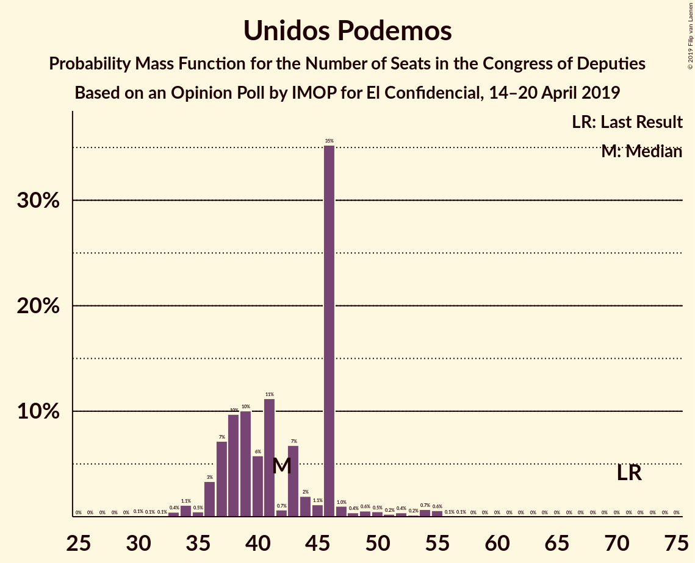
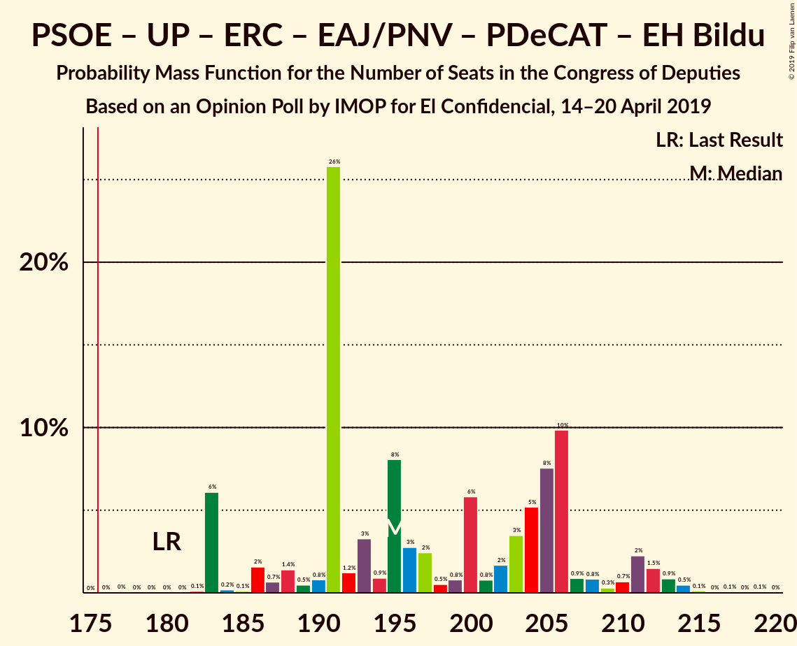
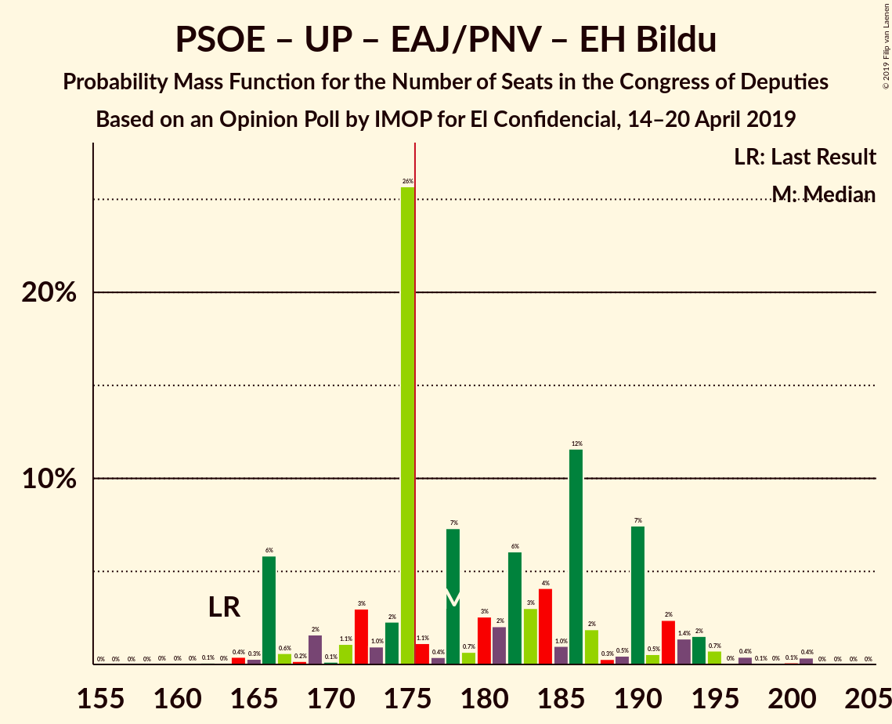

# Opinion Poll by IMOP for El Confidencial, 14–20 April 2019

<a href="#voting-intentions">Voting Intentions</a> | <a href="#seats">Seats</a> | <a href="#coalitions">Coalitions</a> | <a href="#technical-information">Technical Information</a>

## Voting Intentions

### Confidence Intervals

| Party | Last Result | Poll Result | 80% Confidence Interval | 90% Confidence Interval | 95% Confidence Interval | 99% Confidence Interval |
|:-----:|:-----------:|:-----------:|:-----------------------:|:-----------------------:|:-----------------------:|:-----------------------:|
| Partido Socialista Obrero Español | 22.6% | 29.8% | 28.2–31.4% |27.8–31.8% |27.4–32.2% |26.7–33.0% |
| Partido Popular | 33.0% | 19.8% | 18.5–21.2% |18.1–21.6% |17.8–22.0% |17.2–22.7% |
| Ciudadanos–Partido de la Ciudadanía | 13.1% | 15.1% | 13.9–16.4% |13.6–16.7% |13.3–17.1% |12.7–17.7% |
| Unidos Podemos | 21.2% | 14.9% | 13.7–16.1% |13.4–16.5% |13.1–16.8% |12.5–17.5% |
| Vox | 0.2% | 10.0% | 9.0–11.1% |8.8–11.4% |8.5–11.7% |8.1–12.2% |
| Esquerra Republicana de Catalunya–Catalunya Sí | 2.7% | 3.0% | 2.5–3.7% |2.3–3.9% |2.2–4.0% |2.0–4.4% |
| Partido Animalista Contra el Maltrato Animal | 1.2% | 1.8% | 1.4–2.3% |1.3–2.5% |1.2–2.6% |1.1–2.9% |
| Partit Demòcrata Europeu Català | 2.0% | 1.2% | 0.9–1.7% |0.8–1.8% |0.8–1.9% |0.6–2.2% |
| Euzko Alderdi Jeltzalea/Partido Nacionalista Vasco | 1.2% | 1.2% | 0.9–1.7% |0.8–1.8% |0.8–1.9% |0.6–2.2% |
| Euskal Herria Bildu | 0.8% | 0.8% | 0.5–1.2% |0.5–1.3% |0.4–1.4% |0.4–1.6% |
| Coalición Canaria–Partido Nacionalista Canario | 0.3% | 0.3% | 0.2–0.6% |0.1–0.7% |0.1–0.7% |0.1–0.9% |

*Note:* The poll result column reflects the actual value used in the calculations. Published results may vary slightly, and in addition be rounded to fewer digits.

## Seats

### Confidence Intervals

| Party | Last Result | Median | 80% Confidence Interval | 90% Confidence Interval | 95% Confidence Interval | 99% Confidence Interval |
|:-----:|:-----------:|:------:|:-----------------------:|:-----------------------:|:-----------------------:|:-----------------------:|
| <a href="#partido-socialista-obrero-español">Partido Socialista Obrero Español</a> | 85 | 136 | 122–140 |117–142 |116–143 |112–150 |
| <a href="#partido-popular">Partido Popular</a> | 137 | 76 | 69–82 |68–87 |58–88 |58–91 |
| <a href="#ciudadanos–partido-de-la-ciudadanía">Ciudadanos–Partido de la Ciudadanía</a> | 32 | 50 | 40–55 |38–55 |35–61 |35–62 |
| <a href="#unidos-podemos">Unidos Podemos</a> | 71 | 38 | 37–45 |36–47 |34–50 |32–56 |
| <a href="#vox">Vox</a> | 0 | 24 | 21–27 |18–29 |17–31 |16–34 |
| <a href="#esquerra-republicana-de-catalunya–catalunya-sí">Esquerra Republicana de Catalunya–Catalunya Sí</a> | 9 | 14 | 11–15 |9–17 |9–18 |9–19 |
| <a href="#partido-animalista-contra-el-maltrato-animal">Partido Animalista Contra el Maltrato Animal</a> | 0 | 0 | 0–1 |0–1 |0–1 |0–1 |
| <a href="#partit-demòcrata-europeu-català">Partit Demòcrata Europeu Català</a> | 8 | 6 | 3–7 |1–7 |1–8 |0–9 |
| <a href="#euzko-alderdi-jeltzalea/partido-nacionalista-vasco">Euzko Alderdi Jeltzalea/Partido Nacionalista Vasco</a> | 5 | 6 | 4–8 |3–8 |3–8 |2–10 |
| <a href="#euskal-herria-bildu">Euskal Herria Bildu</a> | 2 | 4 | 1–6 |1–6 |1–7 |0–7 |
| <a href="#coalición-canaria–partido-nacionalista-canario">Coalición Canaria–Partido Nacionalista Canario</a> | 1 | 1 | 0–2 |0–4 |0–4 |0–4 |

### Partido Socialista Obrero Español

*For a full overview of the results for this party, see the [Partido Socialista Obrero Español](party-partidosocialistaobreroespañol.html) page.*

| Number of Seats | Probability | Accumulated | Special Marks |
|:---------------:|:-----------:|:-----------:|:-------------:|
| 85 | 0% | 100% | Last Result |
| 86 | 0% | 100% |  |
| 87 | 0% | 100% |  |
| 88 | 0% | 100% |  |
| 89 | 0% | 100% |  |
| 90 | 0% | 100% |  |
| 91 | 0% | 100% |  |
| 92 | 0% | 100% |  |
| 93 | 0% | 100% |  |
| 94 | 0% | 100% |  |
| 95 | 0% | 100% |  |
| 96 | 0% | 100% |  |
| 97 | 0% | 100% |  |
| 98 | 0% | 100% |  |
| 99 | 0% | 100% |  |
| 100 | 0% | 100% |  |
| 101 | 0% | 100% |  |
| 102 | 0% | 100% |  |
| 103 | 0% | 100% |  |
| 104 | 0% | 100% |  |
| 105 | 0.1% | 100% |  |
| 106 | 0% | 99.9% |  |
| 107 | 0% | 99.9% |  |
| 108 | 0% | 99.9% |  |
| 109 | 0% | 99.8% |  |
| 110 | 0.2% | 99.8% |  |
| 111 | 0.1% | 99.6% |  |
| 112 | 0% | 99.5% |  |
| 113 | 0.2% | 99.5% |  |
| 114 | 0% | 99.3% |  |
| 115 | 0.4% | 99.3% |  |
| 116 | 3% | 98.9% |  |
| 117 | 1.0% | 96% |  |
| 118 | 0% | 95% |  |
| 119 | 2% | 95% |  |
| 120 | 1.5% | 93% |  |
| 121 | 1.2% | 91% |  |
| 122 | 2% | 90% |  |
| 123 | 2% | 88% |  |
| 124 | 0% | 85% |  |
| 125 | 1.5% | 85% |  |
| 126 | 0.2% | 84% |  |
| 127 | 2% | 84% |  |
| 128 | 2% | 81% |  |
| 129 | 9% | 80% |  |
| 130 | 0.3% | 70% |  |
| 131 | 10% | 70% |  |
| 132 | 4% | 60% |  |
| 133 | 1.0% | 57% |  |
| 134 | 3% | 56% |  |
| 135 | 1.0% | 53% |  |
| 136 | 35% | 52% | Median |
| 137 | 0.5% | 17% |  |
| 138 | 4% | 16% |  |
| 139 | 0.3% | 12% |  |
| 140 | 4% | 12% |  |
| 141 | 0.1% | 7% |  |
| 142 | 3% | 7% |  |
| 143 | 3% | 5% |  |
| 144 | 0.2% | 2% |  |
| 145 | 0.4% | 2% |  |
| 146 | 0% | 1.4% |  |
| 147 | 0% | 1.4% |  |
| 148 | 0.2% | 1.3% |  |
| 149 | 0% | 1.1% |  |
| 150 | 1.0% | 1.1% |  |
| 151 | 0% | 0.1% |  |
| 152 | 0.1% | 0.1% |  |
| 153 | 0% | 0% |  |

### Partido Popular

*For a full overview of the results for this party, see the [Partido Popular](party-partidopopular.html) page.*

| Number of Seats | Probability | Accumulated | Special Marks |
|:---------------:|:-----------:|:-----------:|:-------------:|
| 58 | 3% | 100% |  |
| 59 | 0% | 97% |  |
| 60 | 0% | 97% |  |
| 61 | 0.1% | 97% |  |
| 62 | 0.1% | 97% |  |
| 63 | 0.2% | 97% |  |
| 64 | 0% | 97% |  |
| 65 | 0.2% | 97% |  |
| 66 | 0.2% | 97% |  |
| 67 | 0.5% | 96% |  |
| 68 | 2% | 96% |  |
| 69 | 6% | 94% |  |
| 70 | 23% | 88% |  |
| 71 | 1.1% | 65% |  |
| 72 | 0.8% | 64% |  |
| 73 | 3% | 63% |  |
| 74 | 2% | 60% |  |
| 75 | 5% | 58% |  |
| 76 | 4% | 53% | Median |
| 77 | 3% | 50% |  |
| 78 | 12% | 47% |  |
| 79 | 12% | 34% |  |
| 80 | 8% | 22% |  |
| 81 | 2% | 14% |  |
| 82 | 4% | 12% |  |
| 83 | 0.6% | 8% |  |
| 84 | 0.6% | 8% |  |
| 85 | 0.7% | 7% |  |
| 86 | 0.9% | 6% |  |
| 87 | 2% | 5% |  |
| 88 | 1.4% | 3% |  |
| 89 | 0.5% | 1.5% |  |
| 90 | 0.4% | 0.9% |  |
| 91 | 0.1% | 0.5% |  |
| 92 | 0.1% | 0.4% |  |
| 93 | 0.1% | 0.3% |  |
| 94 | 0% | 0.2% |  |
| 95 | 0.1% | 0.2% |  |
| 96 | 0% | 0.1% |  |
| 97 | 0% | 0.1% |  |
| 98 | 0.1% | 0.1% |  |
| 99 | 0% | 0% |  |
| 100 | 0% | 0% |  |
| 101 | 0% | 0% |  |
| 102 | 0% | 0% |  |
| 103 | 0% | 0% |  |
| 104 | 0% | 0% |  |
| 105 | 0% | 0% |  |
| 106 | 0% | 0% |  |
| 107 | 0% | 0% |  |
| 108 | 0% | 0% |  |
| 109 | 0% | 0% |  |
| 110 | 0% | 0% |  |
| 111 | 0% | 0% |  |
| 112 | 0% | 0% |  |
| 113 | 0% | 0% |  |
| 114 | 0% | 0% |  |
| 115 | 0% | 0% |  |
| 116 | 0% | 0% |  |
| 117 | 0% | 0% |  |
| 118 | 0% | 0% |  |
| 119 | 0% | 0% |  |
| 120 | 0% | 0% |  |
| 121 | 0% | 0% |  |
| 122 | 0% | 0% |  |
| 123 | 0% | 0% |  |
| 124 | 0% | 0% |  |
| 125 | 0% | 0% |  |
| 126 | 0% | 0% |  |
| 127 | 0% | 0% |  |
| 128 | 0% | 0% |  |
| 129 | 0% | 0% |  |
| 130 | 0% | 0% |  |
| 131 | 0% | 0% |  |
| 132 | 0% | 0% |  |
| 133 | 0% | 0% |  |
| 134 | 0% | 0% |  |
| 135 | 0% | 0% |  |
| 136 | 0% | 0% |  |
| 137 | 0% | 0% | Last Result |

### Ciudadanos–Partido de la Ciudadanía

*For a full overview of the results for this party, see the [Ciudadanos–Partido de la Ciudadanía](party-ciudadanos–partidodelaciudadanía.html) page.*

| Number of Seats | Probability | Accumulated | Special Marks |
|:---------------:|:-----------:|:-----------:|:-------------:|
| 32 | 0% | 100% | Last Result |
| 33 | 0.1% | 99.9% |  |
| 34 | 0.4% | 99.9% |  |
| 35 | 3% | 99.5% |  |
| 36 | 0.7% | 97% |  |
| 37 | 0.2% | 96% |  |
| 38 | 1.1% | 96% |  |
| 39 | 0.1% | 95% |  |
| 40 | 8% | 95% |  |
| 41 | 2% | 87% |  |
| 42 | 4% | 85% |  |
| 43 | 0.5% | 82% |  |
| 44 | 3% | 81% |  |
| 45 | 0.2% | 78% |  |
| 46 | 3% | 78% |  |
| 47 | 2% | 75% |  |
| 48 | 2% | 73% |  |
| 49 | 4% | 71% |  |
| 50 | 26% | 67% | Median |
| 51 | 1.3% | 41% |  |
| 52 | 14% | 40% |  |
| 53 | 5% | 26% |  |
| 54 | 8% | 21% |  |
| 55 | 8% | 13% |  |
| 56 | 0.7% | 5% |  |
| 57 | 0.4% | 4% |  |
| 58 | 0.1% | 4% |  |
| 59 | 0.2% | 4% |  |
| 60 | 0.2% | 3% |  |
| 61 | 3% | 3% |  |
| 62 | 0.2% | 0.6% |  |
| 63 | 0.1% | 0.4% |  |
| 64 | 0.2% | 0.3% |  |
| 65 | 0% | 0.1% |  |
| 66 | 0% | 0% |  |

### Unidos Podemos

*For a full overview of the results for this party, see the [Unidos Podemos](party-unidospodemos.html) page.*

| Number of Seats | Probability | Accumulated | Special Marks |
|:---------------:|:-----------:|:-----------:|:-------------:|
| 29 | 0.1% | 100% |  |
| 30 | 0.1% | 99.8% |  |
| 31 | 0.2% | 99.7% |  |
| 32 | 0.6% | 99.5% |  |
| 33 | 0.1% | 98.9% |  |
| 34 | 2% | 98.9% |  |
| 35 | 1.1% | 97% |  |
| 36 | 1.3% | 96% |  |
| 37 | 36% | 94% |  |
| 38 | 16% | 58% | Median |
| 39 | 3% | 42% |  |
| 40 | 6% | 39% |  |
| 41 | 7% | 34% |  |
| 42 | 4% | 27% |  |
| 43 | 11% | 22% |  |
| 44 | 0.5% | 11% |  |
| 45 | 2% | 11% |  |
| 46 | 0.5% | 9% |  |
| 47 | 4% | 8% |  |
| 48 | 0.5% | 4% |  |
| 49 | 0.2% | 3% |  |
| 50 | 2% | 3% |  |
| 51 | 0.1% | 1.5% |  |
| 52 | 0.7% | 1.4% |  |
| 53 | 0% | 0.7% |  |
| 54 | 0.1% | 0.6% |  |
| 55 | 0% | 0.6% |  |
| 56 | 0.1% | 0.5% |  |
| 57 | 0.4% | 0.4% |  |
| 58 | 0% | 0.1% |  |
| 59 | 0% | 0% |  |
| 60 | 0% | 0% |  |
| 61 | 0% | 0% |  |
| 62 | 0% | 0% |  |
| 63 | 0% | 0% |  |
| 64 | 0% | 0% |  |
| 65 | 0% | 0% |  |
| 66 | 0% | 0% |  |
| 67 | 0% | 0% |  |
| 68 | 0% | 0% |  |
| 69 | 0% | 0% |  |
| 70 | 0% | 0% |  |
| 71 | 0% | 0% | Last Result |

### Vox

*For a full overview of the results for this party, see the [Vox](party-vox.html) page.*

| Number of Seats | Probability | Accumulated | Special Marks |
|:---------------:|:-----------:|:-----------:|:-------------:|
| 0 | 0% | 100% | Last Result |
| 1 | 0% | 100% |  |
| 2 | 0% | 100% |  |
| 3 | 0% | 100% |  |
| 4 | 0% | 100% |  |
| 5 | 0% | 100% |  |
| 6 | 0% | 100% |  |
| 7 | 0% | 100% |  |
| 8 | 0% | 100% |  |
| 9 | 0% | 100% |  |
| 10 | 0% | 100% |  |
| 11 | 0% | 100% |  |
| 12 | 0% | 100% |  |
| 13 | 0.1% | 100% |  |
| 14 | 0.1% | 99.9% |  |
| 15 | 0.2% | 99.8% |  |
| 16 | 2% | 99.5% |  |
| 17 | 0.8% | 98% |  |
| 18 | 4% | 97% |  |
| 19 | 0.6% | 93% |  |
| 20 | 0.4% | 92% |  |
| 21 | 19% | 92% |  |
| 22 | 5% | 73% |  |
| 23 | 11% | 68% |  |
| 24 | 34% | 57% | Median |
| 25 | 5% | 23% |  |
| 26 | 4% | 17% |  |
| 27 | 4% | 14% |  |
| 28 | 1.1% | 10% |  |
| 29 | 5% | 9% |  |
| 30 | 0.4% | 4% |  |
| 31 | 0.7% | 3% |  |
| 32 | 0.3% | 2% |  |
| 33 | 0.7% | 2% |  |
| 34 | 1.4% | 1.5% |  |
| 35 | 0% | 0.1% |  |
| 36 | 0% | 0% |  |

### Esquerra Republicana de Catalunya–Catalunya Sí

*For a full overview of the results for this party, see the [Esquerra Republicana de Catalunya–Catalunya Sí](party-esquerrarepublicanadecatalunya–catalunyasí.html) page.*

| Number of Seats | Probability | Accumulated | Special Marks |
|:---------------:|:-----------:|:-----------:|:-------------:|
| 8 | 0.2% | 100% |  |
| 9 | 8% | 99.8% | Last Result |
| 10 | 1.0% | 92% |  |
| 11 | 10% | 91% |  |
| 12 | 14% | 81% |  |
| 13 | 8% | 67% |  |
| 14 | 32% | 59% | Median |
| 15 | 17% | 26% |  |
| 16 | 4% | 9% |  |
| 17 | 0.5% | 5% |  |
| 18 | 4% | 5% |  |
| 19 | 0.3% | 0.6% |  |
| 20 | 0.3% | 0.3% |  |
| 21 | 0% | 0% |  |

### Partido Animalista Contra el Maltrato Animal

*For a full overview of the results for this party, see the [Partido Animalista Contra el Maltrato Animal](party-partidoanimalistacontraelmaltratoanimal.html) page.*

| Number of Seats | Probability | Accumulated | Special Marks |
|:---------------:|:-----------:|:-----------:|:-------------:|
| 0 | 60% | 100% | Last Result, Median |
| 1 | 40% | 40% |  |
| 2 | 0.1% | 0.1% |  |
| 3 | 0% | 0% |  |

### Partit Demòcrata Europeu Català

*For a full overview of the results for this party, see the [Partit Demòcrata Europeu Català](party-partitdemòcrataeuropeucatalà.html) page.*

| Number of Seats | Probability | Accumulated | Special Marks |
|:---------------:|:-----------:|:-----------:|:-------------:|
| 0 | 0.5% | 100% |  |
| 1 | 7% | 99.5% |  |
| 2 | 0.9% | 93% |  |
| 3 | 11% | 92% |  |
| 4 | 13% | 81% |  |
| 5 | 18% | 68% |  |
| 6 | 34% | 50% | Median |
| 7 | 14% | 16% |  |
| 8 | 2% | 3% | Last Result |
| 9 | 0.4% | 0.5% |  |
| 10 | 0.1% | 0.1% |  |
| 11 | 0% | 0% |  |

### Euzko Alderdi Jeltzalea/Partido Nacionalista Vasco

*For a full overview of the results for this party, see the [Euzko Alderdi Jeltzalea/Partido Nacionalista Vasco](party-euzkoalderdijeltzaleapartidonacionalistavasco.html) page.*

| Number of Seats | Probability | Accumulated | Special Marks |
|:---------------:|:-----------:|:-----------:|:-------------:|
| 2 | 2% | 100% |  |
| 3 | 6% | 98% |  |
| 4 | 11% | 91% |  |
| 5 | 3% | 81% | Last Result |
| 6 | 56% | 78% | Median |
| 7 | 6% | 22% |  |
| 8 | 13% | 16% |  |
| 9 | 1.2% | 2% |  |
| 10 | 0.7% | 1.2% |  |
| 11 | 0.4% | 0.4% |  |
| 12 | 0% | 0% |  |

### Euskal Herria Bildu

*For a full overview of the results for this party, see the [Euskal Herria Bildu](party-euskalherriabildu.html) page.*

| Number of Seats | Probability | Accumulated | Special Marks |
|:---------------:|:-----------:|:-----------:|:-------------:|
| 0 | 2% | 100% |  |
| 1 | 14% | 98% |  |
| 2 | 15% | 84% | Last Result |
| 3 | 4% | 68% |  |
| 4 | 23% | 65% | Median |
| 5 | 30% | 42% |  |
| 6 | 7% | 11% |  |
| 7 | 4% | 4% |  |
| 8 | 0.1% | 0.2% |  |
| 9 | 0.1% | 0.1% |  |
| 10 | 0% | 0% |  |

### Coalición Canaria–Partido Nacionalista Canario

*For a full overview of the results for this party, see the [Coalición Canaria–Partido Nacionalista Canario](party-coalicióncanaria–partidonacionalistacanario.html) page.*

| Number of Seats | Probability | Accumulated | Special Marks |
|:---------------:|:-----------:|:-----------:|:-------------:|
| 0 | 11% | 100% |  |
| 1 | 51% | 89% | Last Result, Median |
| 2 | 29% | 38% |  |
| 3 | 1.2% | 9% |  |
| 4 | 8% | 8% |  |
| 5 | 0% | 0% |  |

## Coalitions

### Confidence Intervals

| Coalition | Last Result | Median | Majority? | 80% Confidence Interval | 90% Confidence Interval | 95% Confidence Interval | 99% Confidence Interval |
|:---------:|:-----------:|:------:|:---------:|:-----------------------:|:-----------------------:|:-----------------------:|:-----------------------:|
| Partido Socialista Obrero Español – Partido Popular – Ciudadanos–Partido de la Ciudadanía | 254 | 256 | 100% | 251–265 | 247–267 | 246–267 | 240–270 |
| Partido Socialista Obrero Español – Ciudadanos–Partido de la Ciudadanía – Unidos Podemos | 188 | 223 | 100% | 213–228 | 209–229 | 206–242 | 201–242 |
| Partido Socialista Obrero Español – Partido Popular | 222 | 206 | 100% | 198–215 | 198–221 | 196–222 | 189–224 |
| Partido Socialista Obrero Español – Unidos Podemos – Esquerra Republicana de Catalunya–Catalunya Sí – Euzko Alderdi Jeltzalea/Partido Nacionalista Vasco – Partit Demòcrata Europeu Català – Euskal Herria Bildu | 180 | 204 | 100% | 189–209 | 187–212 | 187–214 | 184–214 |
| Partido Socialista Obrero Español – Unidos Podemos – Esquerra Republicana de Catalunya–Catalunya Sí – Partit Demòcrata Europeu Català | 173 | 193 | 99.5% | 180–198 | 178–204 | 178–206 | 175–206 |
| Partido Socialista Obrero Español – Unidos Podemos – Esquerra Republicana de Catalunya–Catalunya Sí – Euskal Herria Bildu | 167 | 192 | 98% | 181–201 | 177–202 | 176–203 | 173–206 |
| Partido Socialista Obrero Español – Ciudadanos–Partido de la Ciudadanía | 117 | 185 | 82% | 171–188 | 169–191 | 167–195 | 161–196 |
| Partido Socialista Obrero Español – Unidos Podemos – Euzko Alderdi Jeltzalea/Partido Nacionalista Vasco – Euskal Herria Bildu | 163 | 183 | 86% | 172–193 | 167–193 | 167–195 | 163–198 |
| Partido Socialista Obrero Español – Unidos Podemos – Euzko Alderdi Jeltzalea/Partido Nacionalista Vasco | 161 | 179 | 72% | 167–187 | 164–192 | 161–193 | 158–194 |
| Partido Socialista Obrero Español – Unidos Podemos | 156 | 173 | 27% | 161–182 | 158–185 | 158–187 | 155–187 |
| Partido Popular – Ciudadanos–Partido de la Ciudadanía – Vox | 169 | 144 | 0% | 139–159 | 135–162 | 135–162 | 134–164 |
| Partido Popular – Ciudadanos–Partido de la Ciudadanía – Euzko Alderdi Jeltzalea/Partido Nacionalista Vasco | 174 | 128 | 0% | 120–142 | 119–142 | 118–144 | 116–153 |
| Partido Socialista Obrero Español | 85 | 136 | 0% | 122–140 | 117–142 | 116–143 | 112–150 |
| Partido Popular – Ciudadanos–Partido de la Ciudadanía – Coalición Canaria–Partido Nacionalista Canario | 170 | 124 | 0% | 116–136 | 114–138 | 114–139 | 110–145 |
| Partido Popular – Ciudadanos–Partido de la Ciudadanía | 169 | 122 | 0% | 115–134 | 113–137 | 113–138 | 109–144 |
| Partido Popular – Vox | 137 | 99 | 0% | 93–107 | 91–111 | 82–113 | 82–117 |
| Partido Popular | 137 | 76 | 0% | 69–82 | 68–87 | 58–88 | 58–91 |

### Partido Socialista Obrero Español – Partido Popular – Ciudadanos–Partido de la Ciudadanía

| Number of Seats | Probability | Accumulated | Special Marks |
|:---------------:|:-----------:|:-----------:|:-------------:|
| 238 | 0% | 100% |  |
| 239 | 0.1% | 99.9% |  |
| 240 | 0.5% | 99.8% |  |
| 241 | 0% | 99.4% |  |
| 242 | 0% | 99.3% |  |
| 243 | 0.1% | 99.3% |  |
| 244 | 0.2% | 99.3% |  |
| 245 | 1.0% | 99.1% |  |
| 246 | 1.0% | 98% |  |
| 247 | 3% | 97% |  |
| 248 | 2% | 94% |  |
| 249 | 0.2% | 92% |  |
| 250 | 0.7% | 92% |  |
| 251 | 2% | 91% |  |
| 252 | 3% | 89% |  |
| 253 | 9% | 86% |  |
| 254 | 9% | 76% | Last Result |
| 255 | 4% | 68% |  |
| 256 | 26% | 63% |  |
| 257 | 1.1% | 38% |  |
| 258 | 0.5% | 36% |  |
| 259 | 0.5% | 36% |  |
| 260 | 11% | 36% |  |
| 261 | 0.4% | 24% |  |
| 262 | 6% | 24% | Median |
| 263 | 0.2% | 18% |  |
| 264 | 3% | 17% |  |
| 265 | 9% | 14% |  |
| 266 | 0.3% | 6% |  |
| 267 | 5% | 6% |  |
| 268 | 0.1% | 0.7% |  |
| 269 | 0% | 0.5% |  |
| 270 | 0.1% | 0.5% |  |
| 271 | 0.2% | 0.4% |  |
| 272 | 0.1% | 0.2% |  |
| 273 | 0.1% | 0.1% |  |
| 274 | 0% | 0% |  |

### Partido Socialista Obrero Español – Ciudadanos–Partido de la Ciudadanía – Unidos Podemos

| Number of Seats | Probability | Accumulated | Special Marks |
|:---------------:|:-----------:|:-----------:|:-------------:|
| 188 | 0% | 100% | Last Result |
| 189 | 0% | 100% |  |
| 190 | 0% | 100% |  |
| 191 | 0% | 100% |  |
| 192 | 0% | 100% |  |
| 193 | 0% | 100% |  |
| 194 | 0% | 100% |  |
| 195 | 0% | 100% |  |
| 196 | 0% | 100% |  |
| 197 | 0% | 100% |  |
| 198 | 0.2% | 100% |  |
| 199 | 0% | 99.8% |  |
| 200 | 0% | 99.8% |  |
| 201 | 0.3% | 99.8% |  |
| 202 | 0.6% | 99.4% |  |
| 203 | 0.2% | 98.8% |  |
| 204 | 0.1% | 98.6% |  |
| 205 | 0.4% | 98.5% |  |
| 206 | 2% | 98% |  |
| 207 | 0.2% | 96% |  |
| 208 | 0.2% | 95% |  |
| 209 | 0.4% | 95% |  |
| 210 | 0.2% | 95% |  |
| 211 | 0.1% | 95% |  |
| 212 | 2% | 95% |  |
| 213 | 6% | 93% |  |
| 214 | 0.9% | 87% |  |
| 215 | 0.8% | 86% |  |
| 216 | 0.4% | 85% |  |
| 217 | 4% | 85% |  |
| 218 | 10% | 81% |  |
| 219 | 12% | 71% |  |
| 220 | 0.5% | 59% |  |
| 221 | 0.7% | 59% |  |
| 222 | 3% | 58% |  |
| 223 | 32% | 55% |  |
| 224 | 0.7% | 23% | Median |
| 225 | 4% | 22% |  |
| 226 | 2% | 18% |  |
| 227 | 5% | 16% |  |
| 228 | 4% | 11% |  |
| 229 | 2% | 7% |  |
| 230 | 0.2% | 5% |  |
| 231 | 0.5% | 5% |  |
| 232 | 0.1% | 4% |  |
| 233 | 0.1% | 4% |  |
| 234 | 0.1% | 4% |  |
| 235 | 0.2% | 4% |  |
| 236 | 0.3% | 4% |  |
| 237 | 0% | 3% |  |
| 238 | 0% | 3% |  |
| 239 | 0.3% | 3% |  |
| 240 | 0% | 3% |  |
| 241 | 0.1% | 3% |  |
| 242 | 3% | 3% |  |
| 243 | 0% | 0% |  |

### Partido Socialista Obrero Español – Partido Popular

| Number of Seats | Probability | Accumulated | Special Marks |
|:---------------:|:-----------:|:-----------:|:-------------:|
| 186 | 0.1% | 100% |  |
| 187 | 0% | 99.9% |  |
| 188 | 0.2% | 99.9% |  |
| 189 | 0.2% | 99.7% |  |
| 190 | 0.2% | 99.5% |  |
| 191 | 0.3% | 99.3% |  |
| 192 | 0.8% | 99.0% |  |
| 193 | 0.1% | 98% |  |
| 194 | 0.2% | 98% |  |
| 195 | 0.2% | 98% |  |
| 196 | 2% | 98% |  |
| 197 | 0.2% | 96% |  |
| 198 | 6% | 96% |  |
| 199 | 5% | 90% |  |
| 200 | 2% | 85% |  |
| 201 | 3% | 83% |  |
| 202 | 2% | 80% |  |
| 203 | 2% | 79% |  |
| 204 | 2% | 76% |  |
| 205 | 0.5% | 74% |  |
| 206 | 24% | 74% |  |
| 207 | 0.6% | 50% |  |
| 208 | 10% | 49% |  |
| 209 | 0.4% | 39% |  |
| 210 | 1.1% | 39% |  |
| 211 | 11% | 38% |  |
| 212 | 0.6% | 27% | Median |
| 213 | 4% | 27% |  |
| 214 | 12% | 22% |  |
| 215 | 0.8% | 10% |  |
| 216 | 0.6% | 9% |  |
| 217 | 0.3% | 9% |  |
| 218 | 0.2% | 9% |  |
| 219 | 0.2% | 8% |  |
| 220 | 1.5% | 8% |  |
| 221 | 3% | 7% |  |
| 222 | 2% | 4% | Last Result |
| 223 | 0.3% | 2% |  |
| 224 | 1.2% | 1.4% |  |
| 225 | 0% | 0.2% |  |
| 226 | 0% | 0.1% |  |
| 227 | 0% | 0.1% |  |
| 228 | 0% | 0.1% |  |
| 229 | 0% | 0.1% |  |
| 230 | 0% | 0.1% |  |
| 231 | 0% | 0% |  |

### Partido Socialista Obrero Español – Unidos Podemos – Esquerra Republicana de Catalunya–Catalunya Sí – Euzko Alderdi Jeltzalea/Partido Nacionalista Vasco – Partit Demòcrata Europeu Català – Euskal Herria Bildu

| Number of Seats | Probability | Accumulated | Special Marks |
|:---------------:|:-----------:|:-----------:|:-------------:|
| 176 | 0.1% | 100% | Majority |
| 177 | 0.1% | 99.9% |  |
| 178 | 0% | 99.8% |  |
| 179 | 0% | 99.8% |  |
| 180 | 0.1% | 99.8% | Last Result |
| 181 | 0% | 99.7% |  |
| 182 | 0% | 99.7% |  |
| 183 | 0.1% | 99.7% |  |
| 184 | 0.2% | 99.5% |  |
| 185 | 0.7% | 99.3% |  |
| 186 | 0% | 98.6% |  |
| 187 | 6% | 98.6% |  |
| 188 | 2% | 93% |  |
| 189 | 0.5% | 90% |  |
| 190 | 0.4% | 90% |  |
| 191 | 0.6% | 90% |  |
| 192 | 0.5% | 89% |  |
| 193 | 8% | 88% |  |
| 194 | 13% | 81% |  |
| 195 | 5% | 67% |  |
| 196 | 4% | 62% |  |
| 197 | 0.3% | 58% |  |
| 198 | 0.4% | 58% |  |
| 199 | 2% | 57% |  |
| 200 | 3% | 56% |  |
| 201 | 0.8% | 53% |  |
| 202 | 0.3% | 52% |  |
| 203 | 1.4% | 52% |  |
| 204 | 23% | 51% | Median |
| 205 | 3% | 28% |  |
| 206 | 6% | 25% |  |
| 207 | 8% | 19% |  |
| 208 | 0.1% | 10% |  |
| 209 | 2% | 10% |  |
| 210 | 0% | 8% |  |
| 211 | 1.4% | 8% |  |
| 212 | 3% | 7% |  |
| 213 | 0.3% | 4% |  |
| 214 | 3% | 4% |  |
| 215 | 0% | 0.5% |  |
| 216 | 0% | 0.4% |  |
| 217 | 0.1% | 0.4% |  |
| 218 | 0.3% | 0.3% |  |
| 219 | 0% | 0.1% |  |
| 220 | 0% | 0.1% |  |
| 221 | 0.1% | 0.1% |  |
| 222 | 0% | 0% |  |

### Partido Socialista Obrero Español – Unidos Podemos – Esquerra Republicana de Catalunya–Catalunya Sí – Partit Demòcrata Europeu Català

| Number of Seats | Probability | Accumulated | Special Marks |
|:---------------:|:-----------:|:-----------:|:-------------:|
| 164 | 0.1% | 100% |  |
| 165 | 0% | 99.9% |  |
| 166 | 0% | 99.9% |  |
| 167 | 0.1% | 99.9% |  |
| 168 | 0% | 99.8% |  |
| 169 | 0% | 99.8% |  |
| 170 | 0.1% | 99.8% |  |
| 171 | 0.1% | 99.7% |  |
| 172 | 0.1% | 99.7% |  |
| 173 | 0.1% | 99.6% | Last Result |
| 174 | 0% | 99.5% |  |
| 175 | 0% | 99.5% |  |
| 176 | 0.6% | 99.5% | Majority |
| 177 | 1.0% | 98.9% |  |
| 178 | 3% | 98% |  |
| 179 | 1.5% | 94% |  |
| 180 | 4% | 93% |  |
| 181 | 0.3% | 89% |  |
| 182 | 2% | 89% |  |
| 183 | 2% | 87% |  |
| 184 | 17% | 85% |  |
| 185 | 1.0% | 68% |  |
| 186 | 1.2% | 67% |  |
| 187 | 2% | 66% |  |
| 188 | 0.6% | 64% |  |
| 189 | 5% | 63% |  |
| 190 | 4% | 58% |  |
| 191 | 1.2% | 54% |  |
| 192 | 0.4% | 53% |  |
| 193 | 24% | 52% |  |
| 194 | 0.1% | 28% | Median |
| 195 | 3% | 28% |  |
| 196 | 3% | 26% |  |
| 197 | 10% | 23% |  |
| 198 | 4% | 13% |  |
| 199 | 0.6% | 9% |  |
| 200 | 1.3% | 9% |  |
| 201 | 0.4% | 7% |  |
| 202 | 0.2% | 7% |  |
| 203 | 1.2% | 7% |  |
| 204 | 3% | 6% |  |
| 205 | 0% | 3% |  |
| 206 | 2% | 3% |  |
| 207 | 0.1% | 0.4% |  |
| 208 | 0% | 0.3% |  |
| 209 | 0% | 0.3% |  |
| 210 | 0% | 0.3% |  |
| 211 | 0% | 0.3% |  |
| 212 | 0.2% | 0.3% |  |
| 213 | 0% | 0% |  |

### Partido Socialista Obrero Español – Unidos Podemos – Esquerra Republicana de Catalunya–Catalunya Sí – Euskal Herria Bildu

| Number of Seats | Probability | Accumulated | Special Marks |
|:---------------:|:-----------:|:-----------:|:-------------:|
| 164 | 0.1% | 100% |  |
| 165 | 0% | 99.9% |  |
| 166 | 0% | 99.9% |  |
| 167 | 0% | 99.9% | Last Result |
| 168 | 0.1% | 99.8% |  |
| 169 | 0.1% | 99.8% |  |
| 170 | 0% | 99.7% |  |
| 171 | 0.1% | 99.7% |  |
| 172 | 0% | 99.6% |  |
| 173 | 0.1% | 99.6% |  |
| 174 | 1.0% | 99.5% |  |
| 175 | 0.8% | 98.5% |  |
| 176 | 0.6% | 98% | Majority |
| 177 | 3% | 97% |  |
| 178 | 3% | 95% |  |
| 179 | 0.3% | 91% |  |
| 180 | 0.6% | 91% |  |
| 181 | 11% | 91% |  |
| 182 | 11% | 80% |  |
| 183 | 0.9% | 69% |  |
| 184 | 0.4% | 68% |  |
| 185 | 6% | 67% |  |
| 186 | 0.5% | 61% |  |
| 187 | 0.6% | 60% |  |
| 188 | 4% | 60% |  |
| 189 | 3% | 56% |  |
| 190 | 0.5% | 53% |  |
| 191 | 0.6% | 52% |  |
| 192 | 23% | 52% | Median |
| 193 | 3% | 29% |  |
| 194 | 0.2% | 26% |  |
| 195 | 0.9% | 25% |  |
| 196 | 11% | 24% |  |
| 197 | 2% | 14% |  |
| 198 | 0.1% | 12% |  |
| 199 | 0.4% | 12% |  |
| 200 | 0.1% | 12% |  |
| 201 | 6% | 12% |  |
| 202 | 3% | 5% |  |
| 203 | 1.1% | 3% |  |
| 204 | 0.2% | 2% |  |
| 205 | 0% | 1.4% |  |
| 206 | 1.1% | 1.4% |  |
| 207 | 0.2% | 0.3% |  |
| 208 | 0% | 0.1% |  |
| 209 | 0% | 0.1% |  |
| 210 | 0% | 0.1% |  |
| 211 | 0% | 0.1% |  |
| 212 | 0% | 0% |  |

### Partido Socialista Obrero Español – Ciudadanos–Partido de la Ciudadanía

| Number of Seats | Probability | Accumulated | Special Marks |
|:---------------:|:-----------:|:-----------:|:-------------:|
| 117 | 0% | 100% | Last Result |
| 118 | 0% | 100% |  |
| 119 | 0% | 100% |  |
| 120 | 0% | 100% |  |
| 121 | 0% | 100% |  |
| 122 | 0% | 100% |  |
| 123 | 0% | 100% |  |
| 124 | 0% | 100% |  |
| 125 | 0% | 100% |  |
| 126 | 0% | 100% |  |
| 127 | 0% | 100% |  |
| 128 | 0% | 100% |  |
| 129 | 0% | 100% |  |
| 130 | 0% | 100% |  |
| 131 | 0% | 100% |  |
| 132 | 0% | 100% |  |
| 133 | 0% | 100% |  |
| 134 | 0% | 100% |  |
| 135 | 0% | 100% |  |
| 136 | 0% | 100% |  |
| 137 | 0% | 100% |  |
| 138 | 0% | 100% |  |
| 139 | 0% | 100% |  |
| 140 | 0% | 100% |  |
| 141 | 0% | 100% |  |
| 142 | 0% | 100% |  |
| 143 | 0% | 100% |  |
| 144 | 0% | 100% |  |
| 145 | 0% | 100% |  |
| 146 | 0% | 100% |  |
| 147 | 0% | 100% |  |
| 148 | 0% | 100% |  |
| 149 | 0% | 100% |  |
| 150 | 0% | 100% |  |
| 151 | 0.1% | 100% |  |
| 152 | 0% | 99.9% |  |
| 153 | 0% | 99.9% |  |
| 154 | 0% | 99.9% |  |
| 155 | 0% | 99.9% |  |
| 156 | 0% | 99.9% |  |
| 157 | 0.1% | 99.9% |  |
| 158 | 0% | 99.8% |  |
| 159 | 0% | 99.8% |  |
| 160 | 0% | 99.8% |  |
| 161 | 0.3% | 99.7% |  |
| 162 | 0.2% | 99.4% |  |
| 163 | 0.6% | 99.2% |  |
| 164 | 0% | 98.6% |  |
| 165 | 0.2% | 98.6% |  |
| 166 | 0.7% | 98% |  |
| 167 | 1.1% | 98% |  |
| 168 | 0.6% | 97% |  |
| 169 | 3% | 96% |  |
| 170 | 0.1% | 93% |  |
| 171 | 3% | 93% |  |
| 172 | 0.3% | 90% |  |
| 173 | 1.0% | 90% |  |
| 174 | 4% | 89% |  |
| 175 | 3% | 85% |  |
| 176 | 10% | 82% | Majority |
| 177 | 2% | 73% |  |
| 178 | 3% | 70% |  |
| 179 | 0.6% | 67% |  |
| 180 | 0.2% | 67% |  |
| 181 | 11% | 66% |  |
| 182 | 0.5% | 56% |  |
| 183 | 4% | 55% |  |
| 184 | 0.2% | 51% |  |
| 185 | 11% | 51% |  |
| 186 | 25% | 39% | Median |
| 187 | 3% | 14% |  |
| 188 | 1.4% | 11% |  |
| 189 | 4% | 10% |  |
| 190 | 0.1% | 5% |  |
| 191 | 0.1% | 5% |  |
| 192 | 0.5% | 5% |  |
| 193 | 0.4% | 5% |  |
| 194 | 0.5% | 4% |  |
| 195 | 3% | 4% |  |
| 196 | 0.3% | 0.5% |  |
| 197 | 0.1% | 0.3% |  |
| 198 | 0.1% | 0.2% |  |
| 199 | 0% | 0% |  |

### Partido Socialista Obrero Español – Unidos Podemos – Euzko Alderdi Jeltzalea/Partido Nacionalista Vasco – Euskal Herria Bildu

| Number of Seats | Probability | Accumulated | Special Marks |
|:---------------:|:-----------:|:-----------:|:-------------:|
| 157 | 0.1% | 100% |  |
| 158 | 0.1% | 99.9% |  |
| 159 | 0% | 99.8% |  |
| 160 | 0% | 99.8% |  |
| 161 | 0% | 99.8% |  |
| 162 | 0% | 99.8% |  |
| 163 | 0.6% | 99.7% | Last Result |
| 164 | 0.1% | 99.1% |  |
| 165 | 0.9% | 99.0% |  |
| 166 | 0% | 98% |  |
| 167 | 3% | 98% |  |
| 168 | 2% | 95% |  |
| 169 | 0.8% | 93% |  |
| 170 | 0.5% | 92% |  |
| 171 | 0.1% | 91% |  |
| 172 | 2% | 91% |  |
| 173 | 2% | 90% |  |
| 174 | 0.6% | 87% |  |
| 175 | 0.9% | 87% |  |
| 176 | 14% | 86% | Majority |
| 177 | 0.7% | 72% |  |
| 178 | 8% | 71% |  |
| 179 | 0.2% | 63% |  |
| 180 | 6% | 63% |  |
| 181 | 3% | 57% |  |
| 182 | 0.5% | 54% |  |
| 183 | 3% | 53% |  |
| 184 | 23% | 50% | Median |
| 185 | 0.6% | 27% |  |
| 186 | 0.7% | 26% |  |
| 187 | 4% | 25% |  |
| 188 | 0.6% | 21% |  |
| 189 | 8% | 21% |  |
| 190 | 2% | 13% |  |
| 191 | 0.5% | 11% |  |
| 192 | 0.1% | 11% |  |
| 193 | 6% | 11% |  |
| 194 | 0.3% | 5% |  |
| 195 | 3% | 4% |  |
| 196 | 0.1% | 2% |  |
| 197 | 0% | 2% |  |
| 198 | 1.1% | 1.5% |  |
| 199 | 0.1% | 0.4% |  |
| 200 | 0.2% | 0.3% |  |
| 201 | 0% | 0.1% |  |
| 202 | 0% | 0.1% |  |
| 203 | 0% | 0.1% |  |
| 204 | 0% | 0.1% |  |
| 205 | 0% | 0% |  |

### Partido Socialista Obrero Español – Unidos Podemos – Euzko Alderdi Jeltzalea/Partido Nacionalista Vasco

| Number of Seats | Probability | Accumulated | Special Marks |
|:---------------:|:-----------:|:-----------:|:-------------:|
| 153 | 0.2% | 100% |  |
| 154 | 0% | 99.8% |  |
| 155 | 0% | 99.8% |  |
| 156 | 0% | 99.8% |  |
| 157 | 0% | 99.8% |  |
| 158 | 0.6% | 99.7% |  |
| 159 | 0% | 99.1% |  |
| 160 | 0.7% | 99.1% |  |
| 161 | 3% | 98% | Last Result |
| 162 | 0% | 95% |  |
| 163 | 0.1% | 95% |  |
| 164 | 0.2% | 95% |  |
| 165 | 0% | 95% |  |
| 166 | 1.2% | 95% |  |
| 167 | 4% | 94% |  |
| 168 | 0.3% | 90% |  |
| 169 | 2% | 89% |  |
| 170 | 2% | 87% |  |
| 171 | 0.5% | 85% |  |
| 172 | 9% | 84% |  |
| 173 | 2% | 75% |  |
| 174 | 0.2% | 73% |  |
| 175 | 1.2% | 73% |  |
| 176 | 2% | 72% | Majority |
| 177 | 8% | 70% |  |
| 178 | 8% | 62% |  |
| 179 | 25% | 53% |  |
| 180 | 0.5% | 28% | Median |
| 181 | 1.0% | 27% |  |
| 182 | 0.2% | 26% |  |
| 183 | 4% | 26% |  |
| 184 | 1.1% | 22% |  |
| 185 | 9% | 21% |  |
| 186 | 1.5% | 12% |  |
| 187 | 0.6% | 10% |  |
| 188 | 0.5% | 10% |  |
| 189 | 2% | 9% |  |
| 190 | 0.4% | 7% |  |
| 191 | 1.0% | 7% |  |
| 192 | 2% | 6% |  |
| 193 | 3% | 3% |  |
| 194 | 0% | 0.5% |  |
| 195 | 0.2% | 0.5% |  |
| 196 | 0% | 0.3% |  |
| 197 | 0% | 0.3% |  |
| 198 | 0.2% | 0.3% |  |
| 199 | 0% | 0.1% |  |
| 200 | 0% | 0.1% |  |
| 201 | 0.1% | 0.1% |  |
| 202 | 0% | 0% |  |

### Partido Socialista Obrero Español – Unidos Podemos

| Number of Seats | Probability | Accumulated | Special Marks |
|:---------------:|:-----------:|:-----------:|:-------------:|
| 146 | 0.1% | 100% |  |
| 147 | 0.1% | 99.9% |  |
| 148 | 0% | 99.8% |  |
| 149 | 0% | 99.8% |  |
| 150 | 0% | 99.8% |  |
| 151 | 0% | 99.8% |  |
| 152 | 0% | 99.8% |  |
| 153 | 0.1% | 99.7% |  |
| 154 | 0% | 99.7% |  |
| 155 | 0.6% | 99.6% |  |
| 156 | 0.1% | 99.0% | Last Result |
| 157 | 1.3% | 98.9% |  |
| 158 | 4% | 98% |  |
| 159 | 0% | 94% |  |
| 160 | 0.2% | 94% |  |
| 161 | 4% | 93% |  |
| 162 | 0.1% | 89% |  |
| 163 | 0.2% | 89% |  |
| 164 | 2% | 89% |  |
| 165 | 2% | 87% |  |
| 166 | 9% | 85% |  |
| 167 | 3% | 75% |  |
| 168 | 0.3% | 73% |  |
| 169 | 8% | 72% |  |
| 170 | 2% | 64% |  |
| 171 | 3% | 62% |  |
| 172 | 2% | 60% |  |
| 173 | 26% | 58% |  |
| 174 | 5% | 32% | Median |
| 175 | 0.5% | 27% |  |
| 176 | 0.5% | 27% | Majority |
| 177 | 1.1% | 26% |  |
| 178 | 2% | 25% |  |
| 179 | 12% | 23% |  |
| 180 | 0.2% | 11% |  |
| 181 | 0.5% | 11% |  |
| 182 | 1.1% | 11% |  |
| 183 | 2% | 10% |  |
| 184 | 0.3% | 7% |  |
| 185 | 3% | 7% |  |
| 186 | 0.2% | 4% |  |
| 187 | 4% | 4% |  |
| 188 | 0% | 0.4% |  |
| 189 | 0.1% | 0.4% |  |
| 190 | 0% | 0.3% |  |
| 191 | 0% | 0.3% |  |
| 192 | 0% | 0.3% |  |
| 193 | 0% | 0.3% |  |
| 194 | 0.2% | 0.3% |  |
| 195 | 0.1% | 0.1% |  |
| 196 | 0% | 0% |  |

### Partido Popular – Ciudadanos–Partido de la Ciudadanía – Vox

| Number of Seats | Probability | Accumulated | Special Marks |
|:---------------:|:-----------:|:-----------:|:-------------:|
| 128 | 0% | 100% |  |
| 129 | 0% | 99.9% |  |
| 130 | 0% | 99.9% |  |
| 131 | 0.1% | 99.9% |  |
| 132 | 0.2% | 99.8% |  |
| 133 | 0% | 99.6% |  |
| 134 | 1.0% | 99.5% |  |
| 135 | 4% | 98% |  |
| 136 | 0.1% | 95% |  |
| 137 | 3% | 95% |  |
| 138 | 0.6% | 92% |  |
| 139 | 8% | 91% |  |
| 140 | 2% | 84% |  |
| 141 | 0.1% | 82% |  |
| 142 | 6% | 81% |  |
| 143 | 0.8% | 76% |  |
| 144 | 25% | 75% |  |
| 145 | 0.6% | 50% |  |
| 146 | 1.0% | 49% |  |
| 147 | 0.8% | 48% |  |
| 148 | 3% | 47% |  |
| 149 | 1.2% | 44% |  |
| 150 | 1.0% | 43% | Median |
| 151 | 0.9% | 42% |  |
| 152 | 0.3% | 41% |  |
| 153 | 3% | 41% |  |
| 154 | 13% | 37% |  |
| 155 | 13% | 25% |  |
| 156 | 0.4% | 11% |  |
| 157 | 0.3% | 11% |  |
| 158 | 0.5% | 11% |  |
| 159 | 0.7% | 10% |  |
| 160 | 0.9% | 10% |  |
| 161 | 2% | 9% |  |
| 162 | 5% | 6% |  |
| 163 | 0.1% | 1.4% |  |
| 164 | 0.9% | 1.3% |  |
| 165 | 0.1% | 0.5% |  |
| 166 | 0% | 0.4% |  |
| 167 | 0.1% | 0.3% |  |
| 168 | 0.1% | 0.3% |  |
| 169 | 0% | 0.2% | Last Result |
| 170 | 0% | 0.2% |  |
| 171 | 0% | 0.2% |  |
| 172 | 0.1% | 0.2% |  |
| 173 | 0.1% | 0.1% |  |
| 174 | 0% | 0% |  |

### Partido Popular – Ciudadanos–Partido de la Ciudadanía – Euzko Alderdi Jeltzalea/Partido Nacionalista Vasco

| Number of Seats | Probability | Accumulated | Special Marks |
|:---------------:|:-----------:|:-----------:|:-------------:|
| 110 | 0.1% | 100% |  |
| 111 | 0.2% | 99.9% |  |
| 112 | 0% | 99.8% |  |
| 113 | 0% | 99.8% |  |
| 114 | 0.2% | 99.7% |  |
| 115 | 0% | 99.5% |  |
| 116 | 1.4% | 99.5% |  |
| 117 | 0% | 98% |  |
| 118 | 0.9% | 98% |  |
| 119 | 3% | 97% |  |
| 120 | 5% | 94% |  |
| 121 | 1.1% | 90% |  |
| 122 | 0.7% | 88% |  |
| 123 | 0.3% | 88% |  |
| 124 | 8% | 87% |  |
| 125 | 0.7% | 79% |  |
| 126 | 23% | 79% |  |
| 127 | 2% | 56% |  |
| 128 | 8% | 53% |  |
| 129 | 1.2% | 45% |  |
| 130 | 3% | 44% |  |
| 131 | 4% | 42% |  |
| 132 | 0.5% | 38% | Median |
| 133 | 0.9% | 37% |  |
| 134 | 0.7% | 36% |  |
| 135 | 5% | 36% |  |
| 136 | 2% | 31% |  |
| 137 | 10% | 28% |  |
| 138 | 0.3% | 19% |  |
| 139 | 0.8% | 19% |  |
| 140 | 4% | 18% |  |
| 141 | 0.5% | 14% |  |
| 142 | 10% | 14% |  |
| 143 | 0% | 4% |  |
| 144 | 2% | 4% |  |
| 145 | 0% | 2% |  |
| 146 | 0.6% | 2% |  |
| 147 | 0% | 1.0% |  |
| 148 | 0% | 0.9% |  |
| 149 | 0.1% | 0.9% |  |
| 150 | 0% | 0.8% |  |
| 151 | 0.1% | 0.8% |  |
| 152 | 0% | 0.7% |  |
| 153 | 0.5% | 0.6% |  |
| 154 | 0% | 0.1% |  |
| 155 | 0.1% | 0.1% |  |
| 156 | 0% | 0% |  |
| 157 | 0% | 0% |  |
| 158 | 0% | 0% |  |
| 159 | 0% | 0% |  |
| 160 | 0% | 0% |  |
| 161 | 0% | 0% |  |
| 162 | 0% | 0% |  |
| 163 | 0% | 0% |  |
| 164 | 0% | 0% |  |
| 165 | 0% | 0% |  |
| 166 | 0% | 0% |  |
| 167 | 0% | 0% |  |
| 168 | 0% | 0% |  |
| 169 | 0% | 0% |  |
| 170 | 0% | 0% |  |
| 171 | 0% | 0% |  |
| 172 | 0% | 0% |  |
| 173 | 0% | 0% |  |
| 174 | 0% | 0% | Last Result |

### Partido Socialista Obrero Español

| Number of Seats | Probability | Accumulated | Special Marks |
|:---------------:|:-----------:|:-----------:|:-------------:|
| 85 | 0% | 100% | Last Result |
| 86 | 0% | 100% |  |
| 87 | 0% | 100% |  |
| 88 | 0% | 100% |  |
| 89 | 0% | 100% |  |
| 90 | 0% | 100% |  |
| 91 | 0% | 100% |  |
| 92 | 0% | 100% |  |
| 93 | 0% | 100% |  |
| 94 | 0% | 100% |  |
| 95 | 0% | 100% |  |
| 96 | 0% | 100% |  |
| 97 | 0% | 100% |  |
| 98 | 0% | 100% |  |
| 99 | 0% | 100% |  |
| 100 | 0% | 100% |  |
| 101 | 0% | 100% |  |
| 102 | 0% | 100% |  |
| 103 | 0% | 100% |  |
| 104 | 0% | 100% |  |
| 105 | 0.1% | 100% |  |
| 106 | 0% | 99.9% |  |
| 107 | 0% | 99.9% |  |
| 108 | 0% | 99.9% |  |
| 109 | 0% | 99.8% |  |
| 110 | 0.2% | 99.8% |  |
| 111 | 0.1% | 99.6% |  |
| 112 | 0% | 99.5% |  |
| 113 | 0.2% | 99.5% |  |
| 114 | 0% | 99.3% |  |
| 115 | 0.4% | 99.3% |  |
| 116 | 3% | 98.9% |  |
| 117 | 1.0% | 96% |  |
| 118 | 0% | 95% |  |
| 119 | 2% | 95% |  |
| 120 | 1.5% | 93% |  |
| 121 | 1.2% | 91% |  |
| 122 | 2% | 90% |  |
| 123 | 2% | 88% |  |
| 124 | 0% | 85% |  |
| 125 | 1.5% | 85% |  |
| 126 | 0.2% | 84% |  |
| 127 | 2% | 84% |  |
| 128 | 2% | 81% |  |
| 129 | 9% | 80% |  |
| 130 | 0.3% | 70% |  |
| 131 | 10% | 70% |  |
| 132 | 4% | 60% |  |
| 133 | 1.0% | 57% |  |
| 134 | 3% | 56% |  |
| 135 | 1.0% | 53% |  |
| 136 | 35% | 52% | Median |
| 137 | 0.5% | 17% |  |
| 138 | 4% | 16% |  |
| 139 | 0.3% | 12% |  |
| 140 | 4% | 12% |  |
| 141 | 0.1% | 7% |  |
| 142 | 3% | 7% |  |
| 143 | 3% | 5% |  |
| 144 | 0.2% | 2% |  |
| 145 | 0.4% | 2% |  |
| 146 | 0% | 1.4% |  |
| 147 | 0% | 1.4% |  |
| 148 | 0.2% | 1.3% |  |
| 149 | 0% | 1.1% |  |
| 150 | 1.0% | 1.1% |  |
| 151 | 0% | 0.1% |  |
| 152 | 0.1% | 0.1% |  |
| 153 | 0% | 0% |  |

### Partido Popular – Ciudadanos–Partido de la Ciudadanía – Coalición Canaria–Partido Nacionalista Canario

| Number of Seats | Probability | Accumulated | Special Marks |
|:---------------:|:-----------:|:-----------:|:-------------:|
| 106 | 0.1% | 100% |  |
| 107 | 0% | 99.9% |  |
| 108 | 0% | 99.9% |  |
| 109 | 0.3% | 99.8% |  |
| 110 | 0.2% | 99.5% |  |
| 111 | 0.1% | 99.3% |  |
| 112 | 0.1% | 99.1% |  |
| 113 | 1.1% | 99.1% |  |
| 114 | 5% | 98% |  |
| 115 | 0% | 93% |  |
| 116 | 3% | 93% |  |
| 117 | 1.1% | 89% |  |
| 118 | 0.7% | 88% |  |
| 119 | 0.6% | 88% |  |
| 120 | 0.7% | 87% |  |
| 121 | 24% | 86% |  |
| 122 | 8% | 62% |  |
| 123 | 2% | 54% |  |
| 124 | 4% | 51% |  |
| 125 | 5% | 48% |  |
| 126 | 2% | 43% |  |
| 127 | 4% | 41% | Median |
| 128 | 0.5% | 37% |  |
| 129 | 0.8% | 36% |  |
| 130 | 0.5% | 36% |  |
| 131 | 7% | 35% |  |
| 132 | 0.1% | 28% |  |
| 133 | 9% | 28% |  |
| 134 | 1.1% | 19% |  |
| 135 | 0.2% | 18% |  |
| 136 | 8% | 18% |  |
| 137 | 2% | 9% |  |
| 138 | 4% | 7% |  |
| 139 | 2% | 3% |  |
| 140 | 0.1% | 1.4% |  |
| 141 | 0.3% | 1.3% |  |
| 142 | 0% | 1.0% |  |
| 143 | 0% | 1.0% |  |
| 144 | 0.2% | 1.0% |  |
| 145 | 0.6% | 0.8% |  |
| 146 | 0% | 0.2% |  |
| 147 | 0.1% | 0.2% |  |
| 148 | 0% | 0.1% |  |
| 149 | 0% | 0.1% |  |
| 150 | 0.1% | 0.1% |  |
| 151 | 0% | 0% |  |
| 152 | 0% | 0% |  |
| 153 | 0% | 0% |  |
| 154 | 0% | 0% |  |
| 155 | 0% | 0% |  |
| 156 | 0% | 0% |  |
| 157 | 0% | 0% |  |
| 158 | 0% | 0% |  |
| 159 | 0% | 0% |  |
| 160 | 0% | 0% |  |
| 161 | 0% | 0% |  |
| 162 | 0% | 0% |  |
| 163 | 0% | 0% |  |
| 164 | 0% | 0% |  |
| 165 | 0% | 0% |  |
| 166 | 0% | 0% |  |
| 167 | 0% | 0% |  |
| 168 | 0% | 0% |  |
| 169 | 0% | 0% |  |
| 170 | 0% | 0% | Last Result |

### Partido Popular – Ciudadanos–Partido de la Ciudadanía

| Number of Seats | Probability | Accumulated | Special Marks |
|:---------------:|:-----------:|:-----------:|:-------------:|
| 104 | 0.1% | 100% |  |
| 105 | 0.1% | 99.9% |  |
| 106 | 0% | 99.9% |  |
| 107 | 0.2% | 99.8% |  |
| 108 | 0.1% | 99.6% |  |
| 109 | 0% | 99.5% |  |
| 110 | 0.3% | 99.5% |  |
| 111 | 0% | 99.1% |  |
| 112 | 1.1% | 99.1% |  |
| 113 | 5% | 98% |  |
| 114 | 1.3% | 93% |  |
| 115 | 3% | 92% |  |
| 116 | 0.6% | 88% |  |
| 117 | 0.3% | 88% |  |
| 118 | 8% | 88% |  |
| 119 | 0.5% | 80% |  |
| 120 | 25% | 79% |  |
| 121 | 3% | 55% |  |
| 122 | 3% | 52% |  |
| 123 | 0.8% | 49% |  |
| 124 | 5% | 48% |  |
| 125 | 3% | 43% |  |
| 126 | 3% | 40% | Median |
| 127 | 2% | 37% |  |
| 128 | 0.3% | 35% |  |
| 129 | 0.4% | 35% |  |
| 130 | 1.4% | 35% |  |
| 131 | 14% | 33% |  |
| 132 | 0.7% | 19% |  |
| 133 | 1.0% | 19% |  |
| 134 | 8% | 18% |  |
| 135 | 0.7% | 10% |  |
| 136 | 3% | 9% |  |
| 137 | 3% | 7% |  |
| 138 | 2% | 3% |  |
| 139 | 0.3% | 1.4% |  |
| 140 | 0% | 1.1% |  |
| 141 | 0% | 1.1% |  |
| 142 | 0% | 1.0% |  |
| 143 | 0.2% | 1.0% |  |
| 144 | 0.7% | 0.8% |  |
| 145 | 0% | 0.2% |  |
| 146 | 0% | 0.2% |  |
| 147 | 0% | 0.1% |  |
| 148 | 0% | 0.1% |  |
| 149 | 0.1% | 0.1% |  |
| 150 | 0% | 0% |  |
| 151 | 0% | 0% |  |
| 152 | 0% | 0% |  |
| 153 | 0% | 0% |  |
| 154 | 0% | 0% |  |
| 155 | 0% | 0% |  |
| 156 | 0% | 0% |  |
| 157 | 0% | 0% |  |
| 158 | 0% | 0% |  |
| 159 | 0% | 0% |  |
| 160 | 0% | 0% |  |
| 161 | 0% | 0% |  |
| 162 | 0% | 0% |  |
| 163 | 0% | 0% |  |
| 164 | 0% | 0% |  |
| 165 | 0% | 0% |  |
| 166 | 0% | 0% |  |
| 167 | 0% | 0% |  |
| 168 | 0% | 0% |  |
| 169 | 0% | 0% | Last Result |

### Partido Popular – Vox

| Number of Seats | Probability | Accumulated | Special Marks |
|:---------------:|:-----------:|:-----------:|:-------------:|
| 82 | 3% | 100% |  |
| 83 | 0% | 97% |  |
| 84 | 0.2% | 97% |  |
| 85 | 0% | 97% |  |
| 86 | 0.4% | 97% |  |
| 87 | 0.4% | 97% |  |
| 88 | 0.1% | 96% |  |
| 89 | 0.5% | 96% |  |
| 90 | 0.2% | 96% |  |
| 91 | 3% | 95% |  |
| 92 | 1.5% | 93% |  |
| 93 | 4% | 91% |  |
| 94 | 24% | 87% |  |
| 95 | 0.3% | 64% |  |
| 96 | 2% | 63% |  |
| 97 | 0.8% | 62% |  |
| 98 | 4% | 61% |  |
| 99 | 9% | 57% |  |
| 100 | 3% | 48% | Median |
| 101 | 10% | 45% |  |
| 102 | 17% | 34% |  |
| 103 | 2% | 18% |  |
| 104 | 0.5% | 16% |  |
| 105 | 1.3% | 15% |  |
| 106 | 3% | 14% |  |
| 107 | 4% | 11% |  |
| 108 | 0.3% | 7% |  |
| 109 | 0.6% | 7% |  |
| 110 | 0.2% | 6% |  |
| 111 | 1.4% | 6% |  |
| 112 | 0.5% | 5% |  |
| 113 | 2% | 4% |  |
| 114 | 0% | 2% |  |
| 115 | 0.4% | 2% |  |
| 116 | 0.2% | 1.2% |  |
| 117 | 0.7% | 1.0% |  |
| 118 | 0% | 0.3% |  |
| 119 | 0% | 0.3% |  |
| 120 | 0% | 0.2% |  |
| 121 | 0.2% | 0.2% |  |
| 122 | 0% | 0% |  |
| 123 | 0% | 0% |  |
| 124 | 0% | 0% |  |
| 125 | 0% | 0% |  |
| 126 | 0% | 0% |  |
| 127 | 0% | 0% |  |
| 128 | 0% | 0% |  |
| 129 | 0% | 0% |  |
| 130 | 0% | 0% |  |
| 131 | 0% | 0% |  |
| 132 | 0% | 0% |  |
| 133 | 0% | 0% |  |
| 134 | 0% | 0% |  |
| 135 | 0% | 0% |  |
| 136 | 0% | 0% |  |
| 137 | 0% | 0% | Last Result |

### Partido Popular

| Number of Seats | Probability | Accumulated | Special Marks |
|:---------------:|:-----------:|:-----------:|:-------------:|
| 58 | 3% | 100% |  |
| 59 | 0% | 97% |  |
| 60 | 0% | 97% |  |
| 61 | 0.1% | 97% |  |
| 62 | 0.1% | 97% |  |
| 63 | 0.2% | 97% |  |
| 64 | 0% | 97% |  |
| 65 | 0.2% | 97% |  |
| 66 | 0.2% | 97% |  |
| 67 | 0.5% | 96% |  |
| 68 | 2% | 96% |  |
| 69 | 6% | 94% |  |
| 70 | 23% | 88% |  |
| 71 | 1.1% | 65% |  |
| 72 | 0.8% | 64% |  |
| 73 | 3% | 63% |  |
| 74 | 2% | 60% |  |
| 75 | 5% | 58% |  |
| 76 | 4% | 53% | Median |
| 77 | 3% | 50% |  |
| 78 | 12% | 47% |  |
| 79 | 12% | 34% |  |
| 80 | 8% | 22% |  |
| 81 | 2% | 14% |  |
| 82 | 4% | 12% |  |
| 83 | 0.6% | 8% |  |
| 84 | 0.6% | 8% |  |
| 85 | 0.7% | 7% |  |
| 86 | 0.9% | 6% |  |
| 87 | 2% | 5% |  |
| 88 | 1.4% | 3% |  |
| 89 | 0.5% | 1.5% |  |
| 90 | 0.4% | 0.9% |  |
| 91 | 0.1% | 0.5% |  |
| 92 | 0.1% | 0.4% |  |
| 93 | 0.1% | 0.3% |  |
| 94 | 0% | 0.2% |  |
| 95 | 0.1% | 0.2% |  |
| 96 | 0% | 0.1% |  |
| 97 | 0% | 0.1% |  |
| 98 | 0.1% | 0.1% |  |
| 99 | 0% | 0% |  |
| 100 | 0% | 0% |  |
| 101 | 0% | 0% |  |
| 102 | 0% | 0% |  |
| 103 | 0% | 0% |  |
| 104 | 0% | 0% |  |
| 105 | 0% | 0% |  |
| 106 | 0% | 0% |  |
| 107 | 0% | 0% |  |
| 108 | 0% | 0% |  |
| 109 | 0% | 0% |  |
| 110 | 0% | 0% |  |
| 111 | 0% | 0% |  |
| 112 | 0% | 0% |  |
| 113 | 0% | 0% |  |
| 114 | 0% | 0% |  |
| 115 | 0% | 0% |  |
| 116 | 0% | 0% |  |
| 117 | 0% | 0% |  |
| 118 | 0% | 0% |  |
| 119 | 0% | 0% |  |
| 120 | 0% | 0% |  |
| 121 | 0% | 0% |  |
| 122 | 0% | 0% |  |
| 123 | 0% | 0% |  |
| 124 | 0% | 0% |  |
| 125 | 0% | 0% |  |
| 126 | 0% | 0% |  |
| 127 | 0% | 0% |  |
| 128 | 0% | 0% |  |
| 129 | 0% | 0% |  |
| 130 | 0% | 0% |  |
| 131 | 0% | 0% |  |
| 132 | 0% | 0% |  |
| 133 | 0% | 0% |  |
| 134 | 0% | 0% |  |
| 135 | 0% | 0% |  |
| 136 | 0% | 0% |  |
| 137 | 0% | 0% | Last Result |

## Technical Information

### Opinion Poll

+ **Polling firm:** IMOP
+ **Commissioner(s):** El Confidencial
+ **Fieldwork period:** 14–20 April 2019

### Calculations

+ **Sample size:** 1400
+ **Simulations done:** 131,072
+ **Error estimate:** 1.37%

