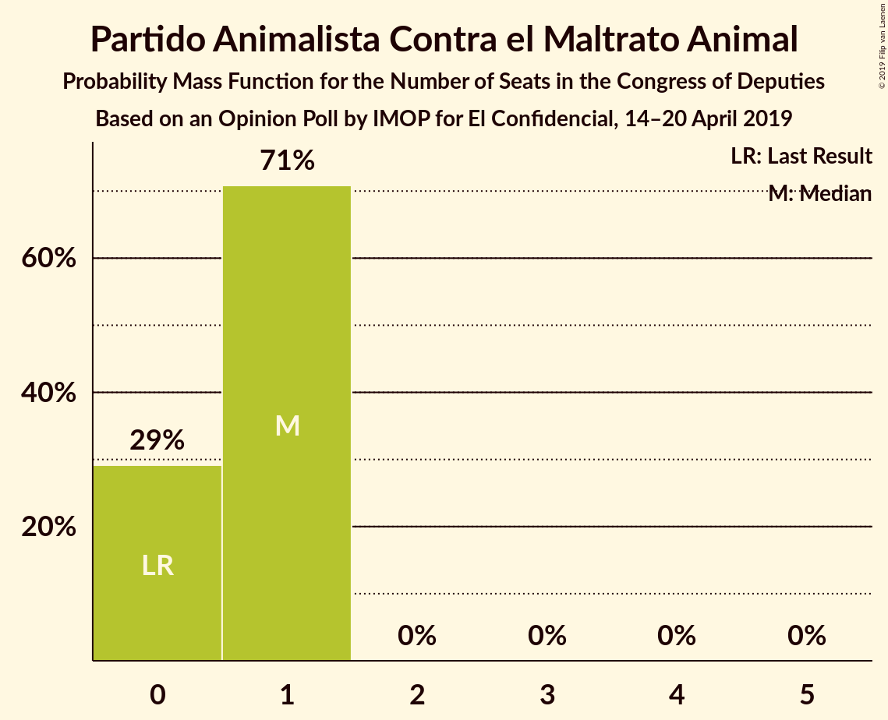
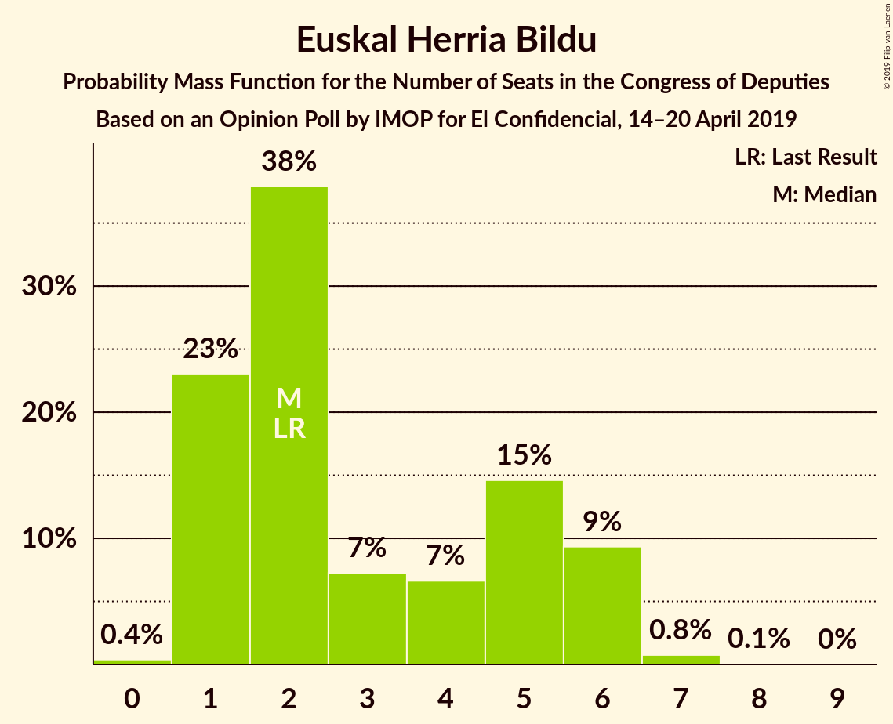
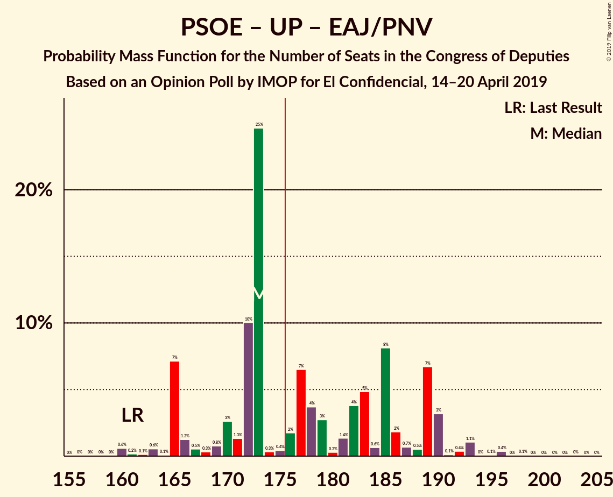

# Opinion Poll by IMOP for El Confidencial, 14–20 April 2019

<a href="#voting-intentions">Voting Intentions</a> | <a href="#seats">Seats</a> | <a href="#coalitions">Coalitions</a> | <a href="#technical-information">Technical Information</a>

## Voting Intentions

### Confidence Intervals

| Party | Last Result | Poll Result | 80% Confidence Interval | 90% Confidence Interval | 95% Confidence Interval | 99% Confidence Interval |
|:-----:|:-----------:|:-----------:|:-----------------------:|:-----------------------:|:-----------------------:|:-----------------------:|
| Partido Socialista Obrero Español | 22.6% | 29.8% | 28.2–31.4% |27.8–31.8% |27.4–32.2% |26.7–33.0% |
| Partido Popular | 33.0% | 19.8% | 18.5–21.2% |18.1–21.6% |17.8–22.0% |17.2–22.7% |
| Ciudadanos–Partido de la Ciudadanía | 13.1% | 15.1% | 13.9–16.4% |13.6–16.7% |13.3–17.1% |12.7–17.7% |
| Unidos Podemos | 21.2% | 14.9% | 13.7–16.1% |13.4–16.5% |13.1–16.8% |12.5–17.5% |
| Vox | 0.2% | 10.0% | 9.0–11.1% |8.8–11.4% |8.5–11.7% |8.1–12.2% |
| Esquerra Republicana de Catalunya–Catalunya Sí | 2.7% | 3.0% | 2.5–3.7% |2.3–3.9% |2.2–4.0% |2.0–4.4% |
| Partido Animalista Contra el Maltrato Animal | 1.2% | 1.8% | 1.4–2.3% |1.3–2.5% |1.2–2.6% |1.1–2.9% |
| Partit Demòcrata Europeu Català | 2.0% | 1.2% | 0.9–1.7% |0.8–1.8% |0.8–1.9% |0.6–2.2% |
| Euzko Alderdi Jeltzalea/Partido Nacionalista Vasco | 1.2% | 1.2% | 0.9–1.7% |0.8–1.8% |0.8–1.9% |0.6–2.2% |
| Euskal Herria Bildu | 0.8% | 0.8% | 0.5–1.2% |0.5–1.3% |0.4–1.4% |0.4–1.6% |
| Coalición Canaria–Partido Nacionalista Canario | 0.3% | 0.3% | 0.2–0.6% |0.1–0.7% |0.1–0.7% |0.1–0.9% |

*Note:* The poll result column reflects the actual value used in the calculations. Published results may vary slightly, and in addition be rounded to fewer digits.

## Seats

### Confidence Intervals

| Party | Last Result | Median | 80% Confidence Interval | 90% Confidence Interval | 95% Confidence Interval | 99% Confidence Interval |
|:-----:|:-----------:|:------:|:-----------------------:|:-----------------------:|:-----------------------:|:-----------------------:|
| <a href="#partido-socialista-obrero-español">Partido Socialista Obrero Español</a> | 85 | 135 | 123–137 |119–140 |116–142 |113–148 |
| <a href="#partido-popular">Partido Popular</a> | 137 | 75 | 67–84 |67–86 |67–88 |58–95 |
| <a href="#ciudadanos–partido-de-la-ciudadanía">Ciudadanos–Partido de la Ciudadanía</a> | 32 | 51 | 40–54 |38–55 |38–57 |35–61 |
| <a href="#unidos-podemos">Unidos Podemos</a> | 71 | 38 | 36–47 |36–52 |34–55 |33–56 |
| <a href="#vox">Vox</a> | 0 | 24 | 21–27 |18–29 |16–31 |16–34 |
| <a href="#esquerra-republicana-de-catalunya–catalunya-sí">Esquerra Republicana de Catalunya–Catalunya Sí</a> | 9 | 14 | 11–15 |10–16 |9–16 |9–18 |
| <a href="#partido-animalista-contra-el-maltrato-animal">Partido Animalista Contra el Maltrato Animal</a> | 0 | 1 | 0–1 |0–1 |0–1 |0–1 |
| <a href="#partit-demòcrata-europeu-català">Partit Demòcrata Europeu Català</a> | 8 | 5 | 3–7 |2–7 |1–8 |1–8 |
| <a href="#euzko-alderdi-jeltzalea/partido-nacionalista-vasco">Euzko Alderdi Jeltzalea/Partido Nacionalista Vasco</a> | 5 | 6 | 3–7 |3–8 |3–8 |2–10 |
| <a href="#euskal-herria-bildu">Euskal Herria Bildu</a> | 2 | 4 | 2–5 |1–6 |1–7 |0–7 |
| <a href="#coalición-canaria–partido-nacionalista-canario">Coalición Canaria–Partido Nacionalista Canario</a> | 1 | 1 | 0–2 |0–3 |0–4 |0–4 |

### Partido Socialista Obrero Español

*For a full overview of the results for this party, see the [Partido Socialista Obrero Español](party-partidosocialistaobreroespañol.html) page.*

| Number of Seats | Probability | Accumulated | Special Marks |
|:---------------:|:-----------:|:-----------:|:-------------:|
| 85 | 0% | 100% | Last Result |
| 86 | 0% | 100% |  |
| 87 | 0% | 100% |  |
| 88 | 0% | 100% |  |
| 89 | 0% | 100% |  |
| 90 | 0% | 100% |  |
| 91 | 0% | 100% |  |
| 92 | 0% | 100% |  |
| 93 | 0% | 100% |  |
| 94 | 0% | 100% |  |
| 95 | 0% | 100% |  |
| 96 | 0% | 100% |  |
| 97 | 0% | 100% |  |
| 98 | 0% | 100% |  |
| 99 | 0% | 100% |  |
| 100 | 0% | 100% |  |
| 101 | 0% | 100% |  |
| 102 | 0% | 100% |  |
| 103 | 0% | 100% |  |
| 104 | 0% | 100% |  |
| 105 | 0.1% | 100% |  |
| 106 | 0% | 99.9% |  |
| 107 | 0% | 99.9% |  |
| 108 | 0.1% | 99.8% |  |
| 109 | 0% | 99.8% |  |
| 110 | 0.1% | 99.7% |  |
| 111 | 0.1% | 99.7% |  |
| 112 | 0% | 99.6% |  |
| 113 | 0.2% | 99.6% |  |
| 114 | 0.7% | 99.3% |  |
| 115 | 0.2% | 98.7% |  |
| 116 | 1.1% | 98% |  |
| 117 | 0.3% | 97% |  |
| 118 | 0.6% | 97% |  |
| 119 | 2% | 96% |  |
| 120 | 0.6% | 94% |  |
| 121 | 0.5% | 94% |  |
| 122 | 1.2% | 93% |  |
| 123 | 17% | 92% |  |
| 124 | 0.7% | 75% |  |
| 125 | 0.6% | 75% |  |
| 126 | 0.5% | 74% |  |
| 127 | 0.9% | 74% |  |
| 128 | 1.4% | 73% |  |
| 129 | 4% | 71% |  |
| 130 | 0.4% | 67% |  |
| 131 | 4% | 67% |  |
| 132 | 3% | 62% |  |
| 133 | 5% | 59% |  |
| 134 | 2% | 54% |  |
| 135 | 2% | 52% | Median |
| 136 | 26% | 50% |  |
| 137 | 15% | 24% |  |
| 138 | 2% | 9% |  |
| 139 | 0.4% | 7% |  |
| 140 | 2% | 6% |  |
| 141 | 0.1% | 5% |  |
| 142 | 2% | 5% |  |
| 143 | 1.0% | 2% |  |
| 144 | 0.2% | 1.1% |  |
| 145 | 0.3% | 0.9% |  |
| 146 | 0% | 0.6% |  |
| 147 | 0% | 0.6% |  |
| 148 | 0.1% | 0.6% |  |
| 149 | 0.1% | 0.5% |  |
| 150 | 0.4% | 0.4% |  |
| 151 | 0% | 0.1% |  |
| 152 | 0% | 0.1% |  |
| 153 | 0% | 0% |  |

### Partido Popular

*For a full overview of the results for this party, see the [Partido Popular](party-partidopopular.html) page.*

| Number of Seats | Probability | Accumulated | Special Marks |
|:---------------:|:-----------:|:-----------:|:-------------:|
| 58 | 1.0% | 100% |  |
| 59 | 0% | 99.0% |  |
| 60 | 0% | 99.0% |  |
| 61 | 0% | 99.0% |  |
| 62 | 0% | 98.9% |  |
| 63 | 0.1% | 98.9% |  |
| 64 | 0% | 98.8% |  |
| 65 | 0.1% | 98.8% |  |
| 66 | 0.1% | 98.7% |  |
| 67 | 12% | 98.6% |  |
| 68 | 2% | 86% |  |
| 69 | 2% | 84% |  |
| 70 | 9% | 82% |  |
| 71 | 2% | 73% |  |
| 72 | 17% | 71% |  |
| 73 | 3% | 54% |  |
| 74 | 0.9% | 51% |  |
| 75 | 7% | 50% | Median |
| 76 | 3% | 43% |  |
| 77 | 1.5% | 40% |  |
| 78 | 6% | 38% |  |
| 79 | 5% | 33% |  |
| 80 | 3% | 28% |  |
| 81 | 0.9% | 25% |  |
| 82 | 2% | 24% |  |
| 83 | 0.9% | 22% |  |
| 84 | 15% | 21% |  |
| 85 | 0.6% | 6% |  |
| 86 | 1.5% | 5% |  |
| 87 | 1.1% | 4% |  |
| 88 | 0.6% | 3% |  |
| 89 | 0.2% | 2% |  |
| 90 | 0.6% | 2% |  |
| 91 | 0.2% | 1.4% |  |
| 92 | 0% | 1.2% |  |
| 93 | 0% | 1.1% |  |
| 94 | 0% | 1.1% |  |
| 95 | 0.9% | 1.1% |  |
| 96 | 0.1% | 0.2% |  |
| 97 | 0% | 0.1% |  |
| 98 | 0% | 0% |  |
| 99 | 0% | 0% |  |
| 100 | 0% | 0% |  |
| 101 | 0% | 0% |  |
| 102 | 0% | 0% |  |
| 103 | 0% | 0% |  |
| 104 | 0% | 0% |  |
| 105 | 0% | 0% |  |
| 106 | 0% | 0% |  |
| 107 | 0% | 0% |  |
| 108 | 0% | 0% |  |
| 109 | 0% | 0% |  |
| 110 | 0% | 0% |  |
| 111 | 0% | 0% |  |
| 112 | 0% | 0% |  |
| 113 | 0% | 0% |  |
| 114 | 0% | 0% |  |
| 115 | 0% | 0% |  |
| 116 | 0% | 0% |  |
| 117 | 0% | 0% |  |
| 118 | 0% | 0% |  |
| 119 | 0% | 0% |  |
| 120 | 0% | 0% |  |
| 121 | 0% | 0% |  |
| 122 | 0% | 0% |  |
| 123 | 0% | 0% |  |
| 124 | 0% | 0% |  |
| 125 | 0% | 0% |  |
| 126 | 0% | 0% |  |
| 127 | 0% | 0% |  |
| 128 | 0% | 0% |  |
| 129 | 0% | 0% |  |
| 130 | 0% | 0% |  |
| 131 | 0% | 0% |  |
| 132 | 0% | 0% |  |
| 133 | 0% | 0% |  |
| 134 | 0% | 0% |  |
| 135 | 0% | 0% |  |
| 136 | 0% | 0% |  |
| 137 | 0% | 0% | Last Result |

### Ciudadanos–Partido de la Ciudadanía

*For a full overview of the results for this party, see the [Ciudadanos–Partido de la Ciudadanía](party-ciudadanos–partidodelaciudadanía.html) page.*

| Number of Seats | Probability | Accumulated | Special Marks |
|:---------------:|:-----------:|:-----------:|:-------------:|
| 30 | 0.1% | 100% |  |
| 31 | 0% | 99.9% |  |
| 32 | 0.1% | 99.9% | Last Result |
| 33 | 0.1% | 99.8% |  |
| 34 | 0.2% | 99.7% |  |
| 35 | 0.9% | 99.5% |  |
| 36 | 0.7% | 98.6% |  |
| 37 | 0.1% | 98% |  |
| 38 | 4% | 98% |  |
| 39 | 0.3% | 94% |  |
| 40 | 5% | 93% |  |
| 41 | 2% | 88% |  |
| 42 | 3% | 87% |  |
| 43 | 0.3% | 84% |  |
| 44 | 1.4% | 84% |  |
| 45 | 0.8% | 82% |  |
| 46 | 2% | 82% |  |
| 47 | 1.3% | 80% |  |
| 48 | 14% | 79% |  |
| 49 | 2% | 65% |  |
| 50 | 11% | 64% |  |
| 51 | 16% | 52% | Median |
| 52 | 22% | 37% |  |
| 53 | 4% | 15% |  |
| 54 | 3% | 11% |  |
| 55 | 3% | 8% |  |
| 56 | 2% | 5% |  |
| 57 | 0.8% | 3% |  |
| 58 | 0.2% | 2% |  |
| 59 | 0.1% | 2% |  |
| 60 | 0.1% | 2% |  |
| 61 | 1.0% | 1.4% |  |
| 62 | 0.3% | 0.5% |  |
| 63 | 0% | 0.2% |  |
| 64 | 0.1% | 0.1% |  |
| 65 | 0% | 0% |  |

### Unidos Podemos

*For a full overview of the results for this party, see the [Unidos Podemos](party-unidospodemos.html) page.*

| Number of Seats | Probability | Accumulated | Special Marks |
|:---------------:|:-----------:|:-----------:|:-------------:|
| 29 | 0.1% | 100% |  |
| 30 | 0% | 99.9% |  |
| 31 | 0.1% | 99.9% |  |
| 32 | 0.2% | 99.8% |  |
| 33 | 2% | 99.6% |  |
| 34 | 1.1% | 98% |  |
| 35 | 0.7% | 97% |  |
| 36 | 16% | 96% |  |
| 37 | 14% | 80% |  |
| 38 | 23% | 67% | Median |
| 39 | 16% | 44% |  |
| 40 | 3% | 28% |  |
| 41 | 4% | 26% |  |
| 42 | 2% | 22% |  |
| 43 | 4% | 19% |  |
| 44 | 0.7% | 15% |  |
| 45 | 2% | 15% |  |
| 46 | 1.0% | 13% |  |
| 47 | 3% | 12% |  |
| 48 | 0.3% | 9% |  |
| 49 | 1.4% | 8% |  |
| 50 | 0.6% | 7% |  |
| 51 | 0.8% | 6% |  |
| 52 | 1.3% | 6% |  |
| 53 | 0% | 4% |  |
| 54 | 0% | 4% |  |
| 55 | 4% | 4% |  |
| 56 | 0.1% | 0.6% |  |
| 57 | 0.1% | 0.5% |  |
| 58 | 0.1% | 0.4% |  |
| 59 | 0.2% | 0.3% |  |
| 60 | 0% | 0.1% |  |
| 61 | 0% | 0.1% |  |
| 62 | 0.1% | 0.1% |  |
| 63 | 0% | 0% |  |
| 64 | 0% | 0% |  |
| 65 | 0% | 0% |  |
| 66 | 0% | 0% |  |
| 67 | 0% | 0% |  |
| 68 | 0% | 0% |  |
| 69 | 0% | 0% |  |
| 70 | 0% | 0% |  |
| 71 | 0% | 0% | Last Result |

### Vox

*For a full overview of the results for this party, see the [Vox](party-vox.html) page.*

| Number of Seats | Probability | Accumulated | Special Marks |
|:---------------:|:-----------:|:-----------:|:-------------:|
| 0 | 0% | 100% | Last Result |
| 1 | 0% | 100% |  |
| 2 | 0% | 100% |  |
| 3 | 0% | 100% |  |
| 4 | 0% | 100% |  |
| 5 | 0% | 100% |  |
| 6 | 0% | 100% |  |
| 7 | 0% | 100% |  |
| 8 | 0% | 100% |  |
| 9 | 0% | 100% |  |
| 10 | 0% | 100% |  |
| 11 | 0% | 100% |  |
| 12 | 0% | 100% |  |
| 13 | 0.1% | 100% |  |
| 14 | 0.1% | 99.9% |  |
| 15 | 0.2% | 99.8% |  |
| 16 | 2% | 99.6% |  |
| 17 | 0.4% | 97% |  |
| 18 | 3% | 97% |  |
| 19 | 2% | 94% |  |
| 20 | 0.2% | 92% |  |
| 21 | 8% | 92% |  |
| 22 | 7% | 84% |  |
| 23 | 5% | 77% |  |
| 24 | 28% | 72% | Median |
| 25 | 4% | 44% |  |
| 26 | 16% | 40% |  |
| 27 | 15% | 23% |  |
| 28 | 3% | 8% |  |
| 29 | 2% | 5% |  |
| 30 | 0.3% | 3% |  |
| 31 | 0.6% | 3% |  |
| 32 | 0.1% | 2% |  |
| 33 | 1.3% | 2% |  |
| 34 | 0.5% | 0.6% |  |
| 35 | 0% | 0.1% |  |
| 36 | 0% | 0% |  |

### Esquerra Republicana de Catalunya–Catalunya Sí

*For a full overview of the results for this party, see the [Esquerra Republicana de Catalunya–Catalunya Sí](party-esquerrarepublicanadecatalunya–catalunyasí.html) page.*

| Number of Seats | Probability | Accumulated | Special Marks |
|:---------------:|:-----------:|:-----------:|:-------------:|
| 8 | 0.1% | 100% |  |
| 9 | 4% | 99.9% | Last Result |
| 10 | 1.3% | 96% |  |
| 11 | 5% | 95% |  |
| 12 | 22% | 90% |  |
| 13 | 5% | 68% |  |
| 14 | 51% | 63% | Median |
| 15 | 8% | 13% |  |
| 16 | 3% | 5% |  |
| 17 | 0.3% | 2% |  |
| 18 | 2% | 2% |  |
| 19 | 0.1% | 0.4% |  |
| 20 | 0.2% | 0.2% |  |
| 21 | 0% | 0% |  |

### Partido Animalista Contra el Maltrato Animal

*For a full overview of the results for this party, see the [Partido Animalista Contra el Maltrato Animal](party-partidoanimalistacontraelmaltratoanimal.html) page.*

| Number of Seats | Probability | Accumulated | Special Marks |
|:---------------:|:-----------:|:-----------:|:-------------:|
| 0 | 50% | 100% | Last Result |
| 1 | 50% | 50% | Median |
| 2 | 0% | 0.1% |  |
| 3 | 0% | 0% |  |

### Partit Demòcrata Europeu Català

*For a full overview of the results for this party, see the [Partit Demòcrata Europeu Català](party-partitdemòcrataeuropeucatalà.html) page.*

| Number of Seats | Probability | Accumulated | Special Marks |
|:---------------:|:-----------:|:-----------:|:-------------:|
| 0 | 0.2% | 100% |  |
| 1 | 3% | 99.8% |  |
| 2 | 7% | 97% |  |
| 3 | 7% | 90% |  |
| 4 | 7% | 83% |  |
| 5 | 50% | 76% | Median |
| 6 | 15% | 26% |  |
| 7 | 7% | 10% |  |
| 8 | 3% | 3% | Last Result |
| 9 | 0.2% | 0.3% |  |
| 10 | 0.1% | 0.1% |  |
| 11 | 0% | 0% |  |

### Euzko Alderdi Jeltzalea/Partido Nacionalista Vasco

*For a full overview of the results for this party, see the [Euzko Alderdi Jeltzalea/Partido Nacionalista Vasco](party-euzkoalderdijeltzaleapartidonacionalistavasco.html) page.*

| Number of Seats | Probability | Accumulated | Special Marks |
|:---------------:|:-----------:|:-----------:|:-------------:|
| 2 | 2% | 100% |  |
| 3 | 20% | 98% |  |
| 4 | 5% | 79% |  |
| 5 | 5% | 74% | Last Result |
| 6 | 41% | 69% | Median |
| 7 | 18% | 28% |  |
| 8 | 7% | 10% |  |
| 9 | 1.2% | 2% |  |
| 10 | 1.1% | 1.3% |  |
| 11 | 0.2% | 0.2% |  |
| 12 | 0% | 0% |  |

### Euskal Herria Bildu

*For a full overview of the results for this party, see the [Euskal Herria Bildu](party-euskalherriabildu.html) page.*

| Number of Seats | Probability | Accumulated | Special Marks |
|:---------------:|:-----------:|:-----------:|:-------------:|
| 0 | 1.3% | 100% |  |
| 1 | 8% | 98.7% |  |
| 2 | 10% | 91% | Last Result |
| 3 | 3% | 81% |  |
| 4 | 29% | 78% | Median |
| 5 | 43% | 49% |  |
| 6 | 3% | 6% |  |
| 7 | 2% | 3% |  |
| 8 | 0.1% | 0.1% |  |
| 9 | 0.1% | 0.1% |  |
| 10 | 0% | 0% |  |

### Coalición Canaria–Partido Nacionalista Canario

*For a full overview of the results for this party, see the [Coalición Canaria–Partido Nacionalista Canario](party-coalicióncanaria–partidonacionalistacanario.html) page.*

| Number of Seats | Probability | Accumulated | Special Marks |
|:---------------:|:-----------:|:-----------:|:-------------:|
| 0 | 11% | 100% |  |
| 1 | 71% | 89% | Last Result, Median |
| 2 | 13% | 18% |  |
| 3 | 2% | 5% |  |
| 4 | 3% | 3% |  |
| 5 | 0% | 0% |  |

## Coalitions

### Confidence Intervals

| Coalition | Last Result | Median | Majority? | 80% Confidence Interval | 90% Confidence Interval | 95% Confidence Interval | 99% Confidence Interval |
|:---------:|:-----------:|:------:|:---------:|:-----------------------:|:-----------------------:|:-----------------------:|:-----------------------:|
| Partido Socialista Obrero Español – Partido Popular – Ciudadanos–Partido de la Ciudadanía | 254 | 257 | 100% | 248–263 | 246–265 | 245–266 | 240–267 |
| Partido Socialista Obrero Español – Ciudadanos–Partido de la Ciudadanía – Unidos Podemos | 188 | 223 | 100% | 211–226 | 210–229 | 209–234 | 202–242 |
| Partido Socialista Obrero Español – Partido Popular | 222 | 207 | 100% | 201–214 | 198–215 | 196–221 | 189–224 |
| Partido Socialista Obrero Español – Unidos Podemos – Esquerra Republicana de Catalunya–Catalunya Sí – Euzko Alderdi Jeltzalea/Partido Nacionalista Vasco – Partit Demòcrata Europeu Català – Euskal Herria Bildu | 180 | 202 | 100% | 186–209 | 186–213 | 186–213 | 179–214 |
| Partido Socialista Obrero Español – Unidos Podemos – Esquerra Republicana de Catalunya–Catalunya Sí – Euskal Herria Bildu | 167 | 192 | 83% | 175–198 | 175–202 | 175–206 | 167–206 |
| Partido Socialista Obrero Español – Unidos Podemos – Esquerra Republicana de Catalunya–Catalunya Sí – Partit Demòcrata Europeu Català | 173 | 193 | 98.7% | 176–198 | 176–204 | 176–204 | 169–206 |
| Partido Socialista Obrero Español – Unidos Podemos – Euzko Alderdi Jeltzalea/Partido Nacionalista Vasco – Euskal Herria Bildu | 163 | 183 | 76% | 169–191 | 169–195 | 167–197 | 163–198 |
| Partido Socialista Obrero Español – Ciudadanos–Partido de la Ciudadanía | 117 | 184 | 66% | 171–188 | 169–191 | 165–195 | 161–195 |
| Partido Socialista Obrero Español – Unidos Podemos – Euzko Alderdi Jeltzalea/Partido Nacionalista Vasco | 161 | 178 | 68% | 165–187 | 165–193 | 162–193 | 159–193 |
| Partido Socialista Obrero Español – Unidos Podemos | 156 | 174 | 21% | 159–181 | 159–187 | 158–188 | 154–188 |
| Partido Popular – Ciudadanos–Partido de la Ciudadanía – Vox | 169 | 147 | 0% | 139–162 | 135–162 | 135–162 | 134–170 |
| Partido Popular – Ciudadanos–Partido de la Ciudadanía – Euzko Alderdi Jeltzalea/Partido Nacionalista Vasco | 174 | 126 | 0% | 122–142 | 118–142 | 118–144 | 116–154 |
| Partido Socialista Obrero Español | 85 | 135 | 0% | 123–137 | 119–140 | 116–142 | 113–148 |
| Partido Popular – Ciudadanos–Partido de la Ciudadanía – Coalición Canaria–Partido Nacionalista Canario | 170 | 124 | 0% | 116–137 | 114–137 | 114–138 | 110–147 |
| Partido Popular – Ciudadanos–Partido de la Ciudadanía | 169 | 123 | 0% | 115–136 | 113–136 | 113–138 | 110–146 |
| Partido Popular – Vox | 137 | 97 | 0% | 94–110 | 91–111 | 87–113 | 82–118 |
| Partido Popular | 137 | 75 | 0% | 67–84 | 67–86 | 67–88 | 58–95 |

### Partido Socialista Obrero Español – Partido Popular – Ciudadanos–Partido de la Ciudadanía

| Number of Seats | Probability | Accumulated | Special Marks |
|:---------------:|:-----------:|:-----------:|:-------------:|
| 235 | 0% | 100% |  |
| 236 | 0% | 99.9% |  |
| 237 | 0.2% | 99.9% |  |
| 238 | 0% | 99.7% |  |
| 239 | 0% | 99.7% |  |
| 240 | 0.2% | 99.6% |  |
| 241 | 0.1% | 99.4% |  |
| 242 | 0.2% | 99.4% |  |
| 243 | 0.7% | 99.2% |  |
| 244 | 0.1% | 98% |  |
| 245 | 1.0% | 98% |  |
| 246 | 4% | 97% |  |
| 247 | 3% | 93% |  |
| 248 | 0.9% | 91% |  |
| 249 | 0.2% | 90% |  |
| 250 | 1.0% | 90% |  |
| 251 | 14% | 89% |  |
| 252 | 1.3% | 74% |  |
| 253 | 5% | 73% |  |
| 254 | 3% | 68% | Last Result |
| 255 | 4% | 65% |  |
| 256 | 11% | 61% |  |
| 257 | 0.6% | 50% |  |
| 258 | 0.3% | 50% |  |
| 259 | 15% | 49% |  |
| 260 | 20% | 34% |  |
| 261 | 2% | 15% | Median |
| 262 | 3% | 13% |  |
| 263 | 2% | 10% |  |
| 264 | 1.3% | 9% |  |
| 265 | 3% | 7% |  |
| 266 | 2% | 4% |  |
| 267 | 2% | 2% |  |
| 268 | 0.1% | 0.4% |  |
| 269 | 0% | 0.3% |  |
| 270 | 0.1% | 0.3% |  |
| 271 | 0.1% | 0.2% |  |
| 272 | 0% | 0.1% |  |
| 273 | 0.1% | 0.1% |  |
| 274 | 0% | 0% |  |

### Partido Socialista Obrero Español – Ciudadanos–Partido de la Ciudadanía – Unidos Podemos

| Number of Seats | Probability | Accumulated | Special Marks |
|:---------------:|:-----------:|:-----------:|:-------------:|
| 188 | 0% | 100% | Last Result |
| 189 | 0% | 100% |  |
| 190 | 0% | 100% |  |
| 191 | 0% | 100% |  |
| 192 | 0% | 100% |  |
| 193 | 0% | 100% |  |
| 194 | 0% | 100% |  |
| 195 | 0% | 100% |  |
| 196 | 0% | 100% |  |
| 197 | 0% | 100% |  |
| 198 | 0.1% | 100% |  |
| 199 | 0% | 99.9% |  |
| 200 | 0% | 99.9% |  |
| 201 | 0.1% | 99.9% |  |
| 202 | 0.2% | 99.7% |  |
| 203 | 0.2% | 99.5% |  |
| 204 | 0.1% | 99.3% |  |
| 205 | 0.2% | 99.3% |  |
| 206 | 1.1% | 99.1% |  |
| 207 | 0.3% | 98% |  |
| 208 | 0.1% | 98% |  |
| 209 | 0.9% | 98% |  |
| 210 | 2% | 97% |  |
| 211 | 15% | 95% |  |
| 212 | 0.7% | 80% |  |
| 213 | 4% | 79% |  |
| 214 | 0.8% | 76% |  |
| 215 | 0.7% | 75% |  |
| 216 | 0.2% | 74% |  |
| 217 | 2% | 74% |  |
| 218 | 4% | 72% |  |
| 219 | 6% | 68% |  |
| 220 | 0.7% | 62% |  |
| 221 | 1.4% | 61% |  |
| 222 | 1.3% | 60% |  |
| 223 | 23% | 59% |  |
| 224 | 3% | 35% | Median |
| 225 | 3% | 32% |  |
| 226 | 21% | 30% |  |
| 227 | 2% | 9% |  |
| 228 | 2% | 7% |  |
| 229 | 1.0% | 5% |  |
| 230 | 0.2% | 4% |  |
| 231 | 0.5% | 4% |  |
| 232 | 0.2% | 4% |  |
| 233 | 0.1% | 3% |  |
| 234 | 2% | 3% |  |
| 235 | 0.1% | 2% |  |
| 236 | 0.2% | 1.5% |  |
| 237 | 0% | 1.2% |  |
| 238 | 0% | 1.2% |  |
| 239 | 0.1% | 1.2% |  |
| 240 | 0% | 1.1% |  |
| 241 | 0.1% | 1.0% |  |
| 242 | 1.0% | 1.0% |  |
| 243 | 0% | 0% |  |

### Partido Socialista Obrero Español – Partido Popular

| Number of Seats | Probability | Accumulated | Special Marks |
|:---------------:|:-----------:|:-----------:|:-------------:|
| 187 | 0% | 100% |  |
| 188 | 0.2% | 99.9% |  |
| 189 | 0.2% | 99.7% |  |
| 190 | 0.1% | 99.5% |  |
| 191 | 0.1% | 99.4% |  |
| 192 | 0.3% | 99.3% |  |
| 193 | 0% | 99.0% |  |
| 194 | 0.6% | 98.9% |  |
| 195 | 0.4% | 98% |  |
| 196 | 0.7% | 98% |  |
| 197 | 0.3% | 97% |  |
| 198 | 2% | 97% |  |
| 199 | 2% | 95% |  |
| 200 | 0.8% | 92% |  |
| 201 | 3% | 92% |  |
| 202 | 0.7% | 89% |  |
| 203 | 13% | 88% |  |
| 204 | 1.5% | 75% |  |
| 205 | 1.0% | 73% |  |
| 206 | 9% | 72% |  |
| 207 | 19% | 63% |  |
| 208 | 8% | 44% |  |
| 209 | 16% | 37% |  |
| 210 | 1.3% | 20% | Median |
| 211 | 4% | 19% |  |
| 212 | 0.8% | 15% |  |
| 213 | 3% | 14% |  |
| 214 | 6% | 11% |  |
| 215 | 0.5% | 5% |  |
| 216 | 0.8% | 5% |  |
| 217 | 0.2% | 4% |  |
| 218 | 0.3% | 4% |  |
| 219 | 0.1% | 4% |  |
| 220 | 0.7% | 3% |  |
| 221 | 1.1% | 3% |  |
| 222 | 0.9% | 2% | Last Result |
| 223 | 0.1% | 0.8% |  |
| 224 | 0.5% | 0.7% |  |
| 225 | 0% | 0.2% |  |
| 226 | 0.1% | 0.2% |  |
| 227 | 0% | 0.1% |  |
| 228 | 0% | 0.1% |  |
| 229 | 0% | 0.1% |  |
| 230 | 0% | 0.1% |  |
| 231 | 0% | 0.1% |  |
| 232 | 0% | 0.1% |  |
| 233 | 0% | 0.1% |  |
| 234 | 0% | 0% |  |

### Partido Socialista Obrero Español – Unidos Podemos – Esquerra Republicana de Catalunya–Catalunya Sí – Euzko Alderdi Jeltzalea/Partido Nacionalista Vasco – Partit Demòcrata Europeu Català – Euskal Herria Bildu

| Number of Seats | Probability | Accumulated | Special Marks |
|:---------------:|:-----------:|:-----------:|:-------------:|
| 177 | 0% | 100% |  |
| 178 | 0.1% | 99.9% |  |
| 179 | 0.4% | 99.8% |  |
| 180 | 0% | 99.3% | Last Result |
| 181 | 0.1% | 99.3% |  |
| 182 | 0.2% | 99.2% |  |
| 183 | 0.1% | 99.0% |  |
| 184 | 0.1% | 98.9% |  |
| 185 | 0.4% | 98.8% |  |
| 186 | 15% | 98% |  |
| 187 | 2% | 84% |  |
| 188 | 2% | 82% |  |
| 189 | 1.0% | 80% |  |
| 190 | 0.4% | 79% |  |
| 191 | 0.6% | 78% |  |
| 192 | 0.6% | 78% |  |
| 193 | 3% | 77% |  |
| 194 | 5% | 74% |  |
| 195 | 2% | 69% |  |
| 196 | 3% | 67% |  |
| 197 | 2% | 64% |  |
| 198 | 0.4% | 63% |  |
| 199 | 1.1% | 62% |  |
| 200 | 2% | 61% |  |
| 201 | 0.6% | 59% |  |
| 202 | 15% | 58% | Median |
| 203 | 3% | 43% |  |
| 204 | 9% | 40% |  |
| 205 | 2% | 31% |  |
| 206 | 14% | 29% |  |
| 207 | 5% | 15% |  |
| 208 | 0.2% | 11% |  |
| 209 | 0.9% | 10% |  |
| 210 | 2% | 9% |  |
| 211 | 0.5% | 8% |  |
| 212 | 1.1% | 7% |  |
| 213 | 4% | 6% |  |
| 214 | 1.3% | 2% |  |
| 215 | 0% | 0.4% |  |
| 216 | 0% | 0.3% |  |
| 217 | 0% | 0.3% |  |
| 218 | 0.1% | 0.2% |  |
| 219 | 0% | 0.1% |  |
| 220 | 0.1% | 0.1% |  |
| 221 | 0% | 0% |  |

### Partido Socialista Obrero Español – Unidos Podemos – Esquerra Republicana de Catalunya–Catalunya Sí – Euskal Herria Bildu

| Number of Seats | Probability | Accumulated | Special Marks |
|:---------------:|:-----------:|:-----------:|:-------------:|
| 165 | 0.4% | 100% |  |
| 166 | 0% | 99.5% |  |
| 167 | 0.1% | 99.5% | Last Result |
| 168 | 0.1% | 99.4% |  |
| 169 | 0.2% | 99.3% |  |
| 170 | 0% | 99.2% |  |
| 171 | 0.1% | 99.1% |  |
| 172 | 0% | 99.1% |  |
| 173 | 0.1% | 99.0% |  |
| 174 | 0.4% | 98.9% |  |
| 175 | 15% | 98% |  |
| 176 | 0.6% | 83% | Majority |
| 177 | 1.3% | 83% |  |
| 178 | 2% | 81% |  |
| 179 | 0.6% | 80% |  |
| 180 | 0.4% | 79% |  |
| 181 | 4% | 79% |  |
| 182 | 4% | 75% |  |
| 183 | 2% | 70% |  |
| 184 | 0.7% | 69% |  |
| 185 | 3% | 68% |  |
| 186 | 0.2% | 65% |  |
| 187 | 2% | 65% |  |
| 188 | 2% | 63% |  |
| 189 | 1.3% | 61% |  |
| 190 | 1.2% | 60% |  |
| 191 | 0.8% | 59% | Median |
| 192 | 11% | 58% |  |
| 193 | 2% | 47% |  |
| 194 | 28% | 45% |  |
| 195 | 0.4% | 18% |  |
| 196 | 4% | 17% |  |
| 197 | 0.8% | 13% |  |
| 198 | 3% | 13% |  |
| 199 | 2% | 10% |  |
| 200 | 0.1% | 8% |  |
| 201 | 2% | 8% |  |
| 202 | 1.0% | 6% |  |
| 203 | 0.4% | 5% |  |
| 204 | 0.1% | 4% |  |
| 205 | 0.1% | 4% |  |
| 206 | 4% | 4% |  |
| 207 | 0.2% | 0.3% |  |
| 208 | 0% | 0.1% |  |
| 209 | 0% | 0.1% |  |
| 210 | 0% | 0.1% |  |
| 211 | 0% | 0.1% |  |
| 212 | 0% | 0% |  |

### Partido Socialista Obrero Español – Unidos Podemos – Esquerra Republicana de Catalunya–Catalunya Sí – Partit Demòcrata Europeu Català

| Number of Seats | Probability | Accumulated | Special Marks |
|:---------------:|:-----------:|:-----------:|:-------------:|
| 165 | 0% | 100% |  |
| 166 | 0% | 99.9% |  |
| 167 | 0% | 99.9% |  |
| 168 | 0% | 99.9% |  |
| 169 | 0.5% | 99.9% |  |
| 170 | 0.2% | 99.4% |  |
| 171 | 0% | 99.2% |  |
| 172 | 0.1% | 99.2% |  |
| 173 | 0.2% | 99.1% | Last Result |
| 174 | 0.1% | 99.0% |  |
| 175 | 0.2% | 98.9% |  |
| 176 | 15% | 98.7% | Majority |
| 177 | 0.5% | 84% |  |
| 178 | 1.3% | 83% |  |
| 179 | 1.3% | 82% |  |
| 180 | 1.4% | 81% |  |
| 181 | 0.3% | 79% |  |
| 182 | 2% | 79% |  |
| 183 | 0.6% | 77% |  |
| 184 | 8% | 77% |  |
| 185 | 0.5% | 69% |  |
| 186 | 0.6% | 69% |  |
| 187 | 2% | 68% |  |
| 188 | 0.3% | 66% |  |
| 189 | 4% | 66% |  |
| 190 | 2% | 62% |  |
| 191 | 0.5% | 60% |  |
| 192 | 2% | 59% | Median |
| 193 | 11% | 58% |  |
| 194 | 27% | 46% |  |
| 195 | 3% | 19% |  |
| 196 | 1.0% | 17% |  |
| 197 | 4% | 16% |  |
| 198 | 2% | 12% |  |
| 199 | 0.4% | 10% |  |
| 200 | 2% | 10% |  |
| 201 | 0.2% | 7% |  |
| 202 | 0.1% | 7% |  |
| 203 | 0.5% | 7% |  |
| 204 | 5% | 7% |  |
| 205 | 0.7% | 2% |  |
| 206 | 0.9% | 1.2% |  |
| 207 | 0.1% | 0.4% |  |
| 208 | 0% | 0.3% |  |
| 209 | 0% | 0.2% |  |
| 210 | 0% | 0.2% |  |
| 211 | 0% | 0.2% |  |
| 212 | 0.2% | 0.2% |  |
| 213 | 0% | 0% |  |

### Partido Socialista Obrero Español – Unidos Podemos – Euzko Alderdi Jeltzalea/Partido Nacionalista Vasco – Euskal Herria Bildu

| Number of Seats | Probability | Accumulated | Special Marks |
|:---------------:|:-----------:|:-----------:|:-------------:|
| 158 | 0.1% | 100% |  |
| 159 | 0.1% | 99.9% |  |
| 160 | 0% | 99.8% |  |
| 161 | 0% | 99.8% |  |
| 162 | 0.2% | 99.8% |  |
| 163 | 0.2% | 99.6% | Last Result |
| 164 | 0.5% | 99.4% |  |
| 165 | 0.4% | 98.9% |  |
| 166 | 0% | 98% |  |
| 167 | 1.2% | 98% |  |
| 168 | 1.0% | 97% |  |
| 169 | 15% | 96% |  |
| 170 | 0.2% | 81% |  |
| 171 | 0.5% | 81% |  |
| 172 | 1.0% | 80% |  |
| 173 | 1.4% | 79% |  |
| 174 | 1.2% | 78% |  |
| 175 | 0.7% | 77% |  |
| 176 | 7% | 76% | Majority |
| 177 | 0.5% | 69% |  |
| 178 | 3% | 68% |  |
| 179 | 0.9% | 65% |  |
| 180 | 3% | 64% |  |
| 181 | 1.5% | 61% |  |
| 182 | 0.6% | 60% |  |
| 183 | 16% | 59% | Median |
| 184 | 10% | 43% |  |
| 185 | 1.3% | 33% |  |
| 186 | 1.3% | 31% |  |
| 187 | 14% | 30% |  |
| 188 | 0.4% | 16% |  |
| 189 | 3% | 16% |  |
| 190 | 0.7% | 13% |  |
| 191 | 3% | 12% |  |
| 192 | 0.7% | 9% |  |
| 193 | 2% | 8% |  |
| 194 | 0.4% | 6% |  |
| 195 | 1.1% | 6% |  |
| 196 | 0.1% | 4% |  |
| 197 | 4% | 4% |  |
| 198 | 0.4% | 0.7% |  |
| 199 | 0% | 0.3% |  |
| 200 | 0.1% | 0.3% |  |
| 201 | 0.1% | 0.2% |  |
| 202 | 0% | 0.1% |  |
| 203 | 0% | 0.1% |  |
| 204 | 0% | 0% |  |

### Partido Socialista Obrero Español – Ciudadanos–Partido de la Ciudadanía

| Number of Seats | Probability | Accumulated | Special Marks |
|:---------------:|:-----------:|:-----------:|:-------------:|
| 117 | 0% | 100% | Last Result |
| 118 | 0% | 100% |  |
| 119 | 0% | 100% |  |
| 120 | 0% | 100% |  |
| 121 | 0% | 100% |  |
| 122 | 0% | 100% |  |
| 123 | 0% | 100% |  |
| 124 | 0% | 100% |  |
| 125 | 0% | 100% |  |
| 126 | 0% | 100% |  |
| 127 | 0% | 100% |  |
| 128 | 0% | 100% |  |
| 129 | 0% | 100% |  |
| 130 | 0% | 100% |  |
| 131 | 0% | 100% |  |
| 132 | 0% | 100% |  |
| 133 | 0% | 100% |  |
| 134 | 0% | 100% |  |
| 135 | 0% | 100% |  |
| 136 | 0% | 100% |  |
| 137 | 0% | 100% |  |
| 138 | 0% | 100% |  |
| 139 | 0% | 100% |  |
| 140 | 0% | 100% |  |
| 141 | 0% | 100% |  |
| 142 | 0% | 100% |  |
| 143 | 0% | 100% |  |
| 144 | 0% | 100% |  |
| 145 | 0% | 100% |  |
| 146 | 0% | 100% |  |
| 147 | 0% | 100% |  |
| 148 | 0% | 100% |  |
| 149 | 0% | 100% |  |
| 150 | 0% | 100% |  |
| 151 | 0% | 100% |  |
| 152 | 0% | 100% |  |
| 153 | 0% | 100% |  |
| 154 | 0% | 99.9% |  |
| 155 | 0% | 99.9% |  |
| 156 | 0% | 99.9% |  |
| 157 | 0.1% | 99.9% |  |
| 158 | 0% | 99.8% |  |
| 159 | 0% | 99.8% |  |
| 160 | 0% | 99.7% |  |
| 161 | 1.0% | 99.7% |  |
| 162 | 0.2% | 98.7% |  |
| 163 | 0.3% | 98% |  |
| 164 | 0.4% | 98% |  |
| 165 | 0.3% | 98% |  |
| 166 | 0.5% | 97% |  |
| 167 | 0.6% | 97% |  |
| 168 | 0.3% | 96% |  |
| 169 | 2% | 96% |  |
| 170 | 1.0% | 94% |  |
| 171 | 5% | 93% |  |
| 172 | 2% | 88% |  |
| 173 | 2% | 86% |  |
| 174 | 2% | 85% |  |
| 175 | 17% | 83% |  |
| 176 | 4% | 66% | Majority |
| 177 | 0.9% | 62% |  |
| 178 | 1.4% | 61% |  |
| 179 | 1.2% | 59% |  |
| 180 | 0.3% | 58% |  |
| 181 | 4% | 58% |  |
| 182 | 0.5% | 54% |  |
| 183 | 2% | 53% |  |
| 184 | 12% | 51% |  |
| 185 | 4% | 39% |  |
| 186 | 10% | 35% | Median |
| 187 | 2% | 26% |  |
| 188 | 17% | 24% |  |
| 189 | 2% | 7% |  |
| 190 | 0.3% | 5% |  |
| 191 | 2% | 5% |  |
| 192 | 0.2% | 4% |  |
| 193 | 0.2% | 3% |  |
| 194 | 0.3% | 3% |  |
| 195 | 3% | 3% |  |
| 196 | 0.2% | 0.4% |  |
| 197 | 0% | 0.1% |  |
| 198 | 0.1% | 0.1% |  |
| 199 | 0% | 0% |  |

### Partido Socialista Obrero Español – Unidos Podemos – Euzko Alderdi Jeltzalea/Partido Nacionalista Vasco

| Number of Seats | Probability | Accumulated | Special Marks |
|:---------------:|:-----------:|:-----------:|:-------------:|
| 153 | 0.1% | 100% |  |
| 154 | 0% | 99.9% |  |
| 155 | 0% | 99.9% |  |
| 156 | 0% | 99.9% |  |
| 157 | 0.1% | 99.9% |  |
| 158 | 0.2% | 99.8% |  |
| 159 | 0% | 99.5% |  |
| 160 | 0.4% | 99.5% |  |
| 161 | 1.1% | 99.1% | Last Result |
| 162 | 0.5% | 98% |  |
| 163 | 0.1% | 97% |  |
| 164 | 0.1% | 97% |  |
| 165 | 15% | 97% |  |
| 166 | 0.9% | 82% |  |
| 167 | 2% | 82% |  |
| 168 | 0.3% | 80% |  |
| 169 | 1.0% | 80% |  |
| 170 | 0.8% | 79% |  |
| 171 | 3% | 78% |  |
| 172 | 4% | 74% |  |
| 173 | 1.2% | 71% |  |
| 174 | 0.4% | 69% |  |
| 175 | 0.9% | 69% |  |
| 176 | 1.4% | 68% | Majority |
| 177 | 3% | 67% |  |
| 178 | 19% | 63% |  |
| 179 | 9% | 44% | Median |
| 180 | 0.9% | 35% |  |
| 181 | 1.4% | 34% |  |
| 182 | 13% | 33% |  |
| 183 | 2% | 19% |  |
| 184 | 0.4% | 17% |  |
| 185 | 4% | 17% |  |
| 186 | 2% | 13% |  |
| 187 | 2% | 11% |  |
| 188 | 0.2% | 9% |  |
| 189 | 0.8% | 8% |  |
| 190 | 0.2% | 8% |  |
| 191 | 1.0% | 7% |  |
| 192 | 1.0% | 6% |  |
| 193 | 5% | 5% |  |
| 194 | 0% | 0.4% |  |
| 195 | 0.1% | 0.4% |  |
| 196 | 0.1% | 0.3% |  |
| 197 | 0% | 0.3% |  |
| 198 | 0.1% | 0.2% |  |
| 199 | 0% | 0.2% |  |
| 200 | 0.1% | 0.1% |  |
| 201 | 0% | 0.1% |  |
| 202 | 0% | 0% |  |

### Partido Socialista Obrero Español – Unidos Podemos

| Number of Seats | Probability | Accumulated | Special Marks |
|:---------------:|:-----------:|:-----------:|:-------------:|
| 147 | 0% | 100% |  |
| 148 | 0% | 99.9% |  |
| 149 | 0% | 99.9% |  |
| 150 | 0% | 99.9% |  |
| 151 | 0.1% | 99.9% |  |
| 152 | 0% | 99.7% |  |
| 153 | 0.1% | 99.7% |  |
| 154 | 0.5% | 99.7% |  |
| 155 | 0.4% | 99.2% |  |
| 156 | 0.1% | 98.8% | Last Result |
| 157 | 0.6% | 98.7% |  |
| 158 | 2% | 98% |  |
| 159 | 15% | 97% |  |
| 160 | 0.4% | 82% |  |
| 161 | 2% | 81% |  |
| 162 | 0.2% | 80% |  |
| 163 | 0.1% | 79% |  |
| 164 | 1.5% | 79% |  |
| 165 | 1.4% | 78% |  |
| 166 | 4% | 76% |  |
| 167 | 1.4% | 73% |  |
| 168 | 3% | 71% |  |
| 169 | 3% | 68% |  |
| 170 | 1.2% | 65% |  |
| 171 | 1.1% | 64% |  |
| 172 | 1.1% | 63% |  |
| 173 | 10% | 61% | Median |
| 174 | 3% | 51% |  |
| 175 | 28% | 48% |  |
| 176 | 1.2% | 21% | Majority |
| 177 | 1.4% | 19% |  |
| 178 | 1.0% | 18% |  |
| 179 | 6% | 17% |  |
| 180 | 0.2% | 11% |  |
| 181 | 2% | 11% |  |
| 182 | 0.4% | 9% |  |
| 183 | 0.9% | 8% |  |
| 184 | 1.0% | 8% |  |
| 185 | 0.9% | 7% |  |
| 186 | 0.1% | 6% |  |
| 187 | 1.5% | 5% |  |
| 188 | 4% | 4% |  |
| 189 | 0% | 0.3% |  |
| 190 | 0.1% | 0.3% |  |
| 191 | 0% | 0.3% |  |
| 192 | 0% | 0.2% |  |
| 193 | 0.1% | 0.2% |  |
| 194 | 0.1% | 0.1% |  |
| 195 | 0% | 0.1% |  |
| 196 | 0% | 0% |  |

### Partido Popular – Ciudadanos–Partido de la Ciudadanía – Vox

| Number of Seats | Probability | Accumulated | Special Marks |
|:---------------:|:-----------:|:-----------:|:-------------:|
| 128 | 0.1% | 100% |  |
| 129 | 0% | 99.9% |  |
| 130 | 0% | 99.9% |  |
| 131 | 0% | 99.8% |  |
| 132 | 0.1% | 99.8% |  |
| 133 | 0% | 99.7% |  |
| 134 | 0.4% | 99.6% |  |
| 135 | 5% | 99.2% |  |
| 136 | 0.1% | 94% |  |
| 137 | 2% | 94% |  |
| 138 | 0.6% | 92% |  |
| 139 | 3% | 92% |  |
| 140 | 2% | 89% |  |
| 141 | 0.3% | 87% |  |
| 142 | 14% | 86% |  |
| 143 | 2% | 72% |  |
| 144 | 12% | 70% |  |
| 145 | 0.5% | 59% |  |
| 146 | 1.3% | 58% |  |
| 147 | 15% | 57% |  |
| 148 | 3% | 42% |  |
| 149 | 1.0% | 39% |  |
| 150 | 0.7% | 38% | Median |
| 151 | 1.1% | 37% |  |
| 152 | 0.1% | 36% |  |
| 153 | 3% | 36% |  |
| 154 | 5% | 33% |  |
| 155 | 5% | 28% |  |
| 156 | 0.2% | 23% |  |
| 157 | 0.2% | 23% |  |
| 158 | 1.2% | 22% |  |
| 159 | 0.6% | 21% |  |
| 160 | 2% | 21% |  |
| 161 | 0.9% | 19% |  |
| 162 | 17% | 18% |  |
| 163 | 0% | 2% |  |
| 164 | 0.4% | 2% |  |
| 165 | 0.2% | 1.2% |  |
| 166 | 0.1% | 1.0% |  |
| 167 | 0.2% | 0.9% |  |
| 168 | 0% | 0.7% |  |
| 169 | 0% | 0.7% | Last Result |
| 170 | 0.6% | 0.7% |  |
| 171 | 0% | 0.1% |  |
| 172 | 0% | 0.1% |  |
| 173 | 0% | 0% |  |

### Partido Popular – Ciudadanos–Partido de la Ciudadanía – Euzko Alderdi Jeltzalea/Partido Nacionalista Vasco

| Number of Seats | Probability | Accumulated | Special Marks |
|:---------------:|:-----------:|:-----------:|:-------------:|
| 109 | 0% | 100% |  |
| 110 | 0.1% | 99.9% |  |
| 111 | 0.1% | 99.8% |  |
| 112 | 0% | 99.8% |  |
| 113 | 0% | 99.7% |  |
| 114 | 0.1% | 99.7% |  |
| 115 | 0.1% | 99.6% |  |
| 116 | 0.5% | 99.5% |  |
| 117 | 0.7% | 99.0% |  |
| 118 | 4% | 98% |  |
| 119 | 1.4% | 94% |  |
| 120 | 2% | 93% |  |
| 121 | 0.6% | 91% |  |
| 122 | 14% | 90% |  |
| 123 | 0.2% | 77% |  |
| 124 | 3% | 76% |  |
| 125 | 0.4% | 73% |  |
| 126 | 24% | 73% |  |
| 127 | 1.1% | 49% |  |
| 128 | 4% | 48% |  |
| 129 | 1.4% | 44% |  |
| 130 | 3% | 43% |  |
| 131 | 3% | 40% |  |
| 132 | 0.7% | 37% | Median |
| 133 | 3% | 36% |  |
| 134 | 2% | 34% |  |
| 135 | 2% | 32% |  |
| 136 | 1.2% | 30% |  |
| 137 | 4% | 29% |  |
| 138 | 0.1% | 25% |  |
| 139 | 1.0% | 25% |  |
| 140 | 3% | 24% |  |
| 141 | 0.2% | 21% |  |
| 142 | 18% | 21% |  |
| 143 | 0.1% | 3% |  |
| 144 | 0.9% | 3% |  |
| 145 | 0% | 2% |  |
| 146 | 0.2% | 2% |  |
| 147 | 0.2% | 1.5% |  |
| 148 | 0% | 1.2% |  |
| 149 | 0.1% | 1.2% |  |
| 150 | 0.2% | 1.1% |  |
| 151 | 0% | 0.9% |  |
| 152 | 0% | 0.9% |  |
| 153 | 0.2% | 0.8% |  |
| 154 | 0.6% | 0.6% |  |
| 155 | 0.1% | 0.1% |  |
| 156 | 0% | 0% |  |
| 157 | 0% | 0% |  |
| 158 | 0% | 0% |  |
| 159 | 0% | 0% |  |
| 160 | 0% | 0% |  |
| 161 | 0% | 0% |  |
| 162 | 0% | 0% |  |
| 163 | 0% | 0% |  |
| 164 | 0% | 0% |  |
| 165 | 0% | 0% |  |
| 166 | 0% | 0% |  |
| 167 | 0% | 0% |  |
| 168 | 0% | 0% |  |
| 169 | 0% | 0% |  |
| 170 | 0% | 0% |  |
| 171 | 0% | 0% |  |
| 172 | 0% | 0% |  |
| 173 | 0% | 0% |  |
| 174 | 0% | 0% | Last Result |

### Partido Socialista Obrero Español

| Number of Seats | Probability | Accumulated | Special Marks |
|:---------------:|:-----------:|:-----------:|:-------------:|
| 85 | 0% | 100% | Last Result |
| 86 | 0% | 100% |  |
| 87 | 0% | 100% |  |
| 88 | 0% | 100% |  |
| 89 | 0% | 100% |  |
| 90 | 0% | 100% |  |
| 91 | 0% | 100% |  |
| 92 | 0% | 100% |  |
| 93 | 0% | 100% |  |
| 94 | 0% | 100% |  |
| 95 | 0% | 100% |  |
| 96 | 0% | 100% |  |
| 97 | 0% | 100% |  |
| 98 | 0% | 100% |  |
| 99 | 0% | 100% |  |
| 100 | 0% | 100% |  |
| 101 | 0% | 100% |  |
| 102 | 0% | 100% |  |
| 103 | 0% | 100% |  |
| 104 | 0% | 100% |  |
| 105 | 0.1% | 100% |  |
| 106 | 0% | 99.9% |  |
| 107 | 0% | 99.9% |  |
| 108 | 0.1% | 99.8% |  |
| 109 | 0% | 99.8% |  |
| 110 | 0.1% | 99.7% |  |
| 111 | 0.1% | 99.7% |  |
| 112 | 0% | 99.6% |  |
| 113 | 0.2% | 99.6% |  |
| 114 | 0.7% | 99.3% |  |
| 115 | 0.2% | 98.7% |  |
| 116 | 1.1% | 98% |  |
| 117 | 0.3% | 97% |  |
| 118 | 0.6% | 97% |  |
| 119 | 2% | 96% |  |
| 120 | 0.6% | 94% |  |
| 121 | 0.5% | 94% |  |
| 122 | 1.2% | 93% |  |
| 123 | 17% | 92% |  |
| 124 | 0.7% | 75% |  |
| 125 | 0.6% | 75% |  |
| 126 | 0.5% | 74% |  |
| 127 | 0.9% | 74% |  |
| 128 | 1.4% | 73% |  |
| 129 | 4% | 71% |  |
| 130 | 0.4% | 67% |  |
| 131 | 4% | 67% |  |
| 132 | 3% | 62% |  |
| 133 | 5% | 59% |  |
| 134 | 2% | 54% |  |
| 135 | 2% | 52% | Median |
| 136 | 26% | 50% |  |
| 137 | 15% | 24% |  |
| 138 | 2% | 9% |  |
| 139 | 0.4% | 7% |  |
| 140 | 2% | 6% |  |
| 141 | 0.1% | 5% |  |
| 142 | 2% | 5% |  |
| 143 | 1.0% | 2% |  |
| 144 | 0.2% | 1.1% |  |
| 145 | 0.3% | 0.9% |  |
| 146 | 0% | 0.6% |  |
| 147 | 0% | 0.6% |  |
| 148 | 0.1% | 0.6% |  |
| 149 | 0.1% | 0.5% |  |
| 150 | 0.4% | 0.4% |  |
| 151 | 0% | 0.1% |  |
| 152 | 0% | 0.1% |  |
| 153 | 0% | 0% |  |

### Partido Popular – Ciudadanos–Partido de la Ciudadanía – Coalición Canaria–Partido Nacionalista Canario

| Number of Seats | Probability | Accumulated | Special Marks |
|:---------------:|:-----------:|:-----------:|:-------------:|
| 104 | 0.1% | 100% |  |
| 105 | 0% | 99.9% |  |
| 106 | 0.1% | 99.9% |  |
| 107 | 0.1% | 99.8% |  |
| 108 | 0% | 99.7% |  |
| 109 | 0.1% | 99.7% |  |
| 110 | 0.8% | 99.6% |  |
| 111 | 0.1% | 98.8% |  |
| 112 | 0.1% | 98.7% |  |
| 113 | 0.4% | 98.7% |  |
| 114 | 6% | 98% |  |
| 115 | 2% | 93% |  |
| 116 | 13% | 91% |  |
| 117 | 0.8% | 78% |  |
| 118 | 0.5% | 77% |  |
| 119 | 0.3% | 76% |  |
| 120 | 0.3% | 76% |  |
| 121 | 9% | 76% |  |
| 122 | 4% | 67% |  |
| 123 | 2% | 63% |  |
| 124 | 18% | 61% |  |
| 125 | 3% | 43% |  |
| 126 | 2% | 41% |  |
| 127 | 2% | 39% | Median |
| 128 | 4% | 37% |  |
| 129 | 1.3% | 33% |  |
| 130 | 0.4% | 32% |  |
| 131 | 3% | 32% |  |
| 132 | 0.1% | 28% |  |
| 133 | 4% | 28% |  |
| 134 | 0.5% | 24% |  |
| 135 | 0.2% | 24% |  |
| 136 | 3% | 23% |  |
| 137 | 15% | 20% |  |
| 138 | 2% | 5% |  |
| 139 | 0.8% | 2% |  |
| 140 | 0.1% | 2% |  |
| 141 | 0.2% | 2% |  |
| 142 | 0.1% | 1.4% |  |
| 143 | 0% | 1.3% |  |
| 144 | 0.1% | 1.3% |  |
| 145 | 0.4% | 1.2% |  |
| 146 | 0.1% | 0.8% |  |
| 147 | 0.5% | 0.7% |  |
| 148 | 0% | 0.2% |  |
| 149 | 0.1% | 0.2% |  |
| 150 | 0.1% | 0.1% |  |
| 151 | 0% | 0% |  |
| 152 | 0% | 0% |  |
| 153 | 0% | 0% |  |
| 154 | 0% | 0% |  |
| 155 | 0% | 0% |  |
| 156 | 0% | 0% |  |
| 157 | 0% | 0% |  |
| 158 | 0% | 0% |  |
| 159 | 0% | 0% |  |
| 160 | 0% | 0% |  |
| 161 | 0% | 0% |  |
| 162 | 0% | 0% |  |
| 163 | 0% | 0% |  |
| 164 | 0% | 0% |  |
| 165 | 0% | 0% |  |
| 166 | 0% | 0% |  |
| 167 | 0% | 0% |  |
| 168 | 0% | 0% |  |
| 169 | 0% | 0% |  |
| 170 | 0% | 0% | Last Result |

### Partido Popular – Ciudadanos–Partido de la Ciudadanía

| Number of Seats | Probability | Accumulated | Special Marks |
|:---------------:|:-----------:|:-----------:|:-------------:|
| 103 | 0.1% | 100% |  |
| 104 | 0% | 99.9% |  |
| 105 | 0% | 99.9% |  |
| 106 | 0.1% | 99.8% |  |
| 107 | 0.1% | 99.7% |  |
| 108 | 0.1% | 99.6% |  |
| 109 | 0% | 99.5% |  |
| 110 | 0.8% | 99.5% |  |
| 111 | 0% | 98.7% |  |
| 112 | 0.5% | 98.7% |  |
| 113 | 6% | 98% |  |
| 114 | 0.5% | 93% |  |
| 115 | 15% | 92% |  |
| 116 | 0.6% | 77% |  |
| 117 | 0.1% | 76% |  |
| 118 | 3% | 76% |  |
| 119 | 0.2% | 73% |  |
| 120 | 9% | 73% |  |
| 121 | 1.3% | 64% |  |
| 122 | 3% | 63% |  |
| 123 | 15% | 60% |  |
| 124 | 5% | 45% |  |
| 125 | 3% | 40% |  |
| 126 | 2% | 37% | Median |
| 127 | 0.9% | 35% |  |
| 128 | 3% | 34% |  |
| 129 | 0.3% | 32% |  |
| 130 | 1.0% | 31% |  |
| 131 | 6% | 30% |  |
| 132 | 0.3% | 25% |  |
| 133 | 1.1% | 25% |  |
| 134 | 3% | 23% |  |
| 135 | 0.5% | 21% |  |
| 136 | 16% | 20% |  |
| 137 | 2% | 5% |  |
| 138 | 0.8% | 3% |  |
| 139 | 0.2% | 2% |  |
| 140 | 0.1% | 2% |  |
| 141 | 0.2% | 1.4% |  |
| 142 | 0% | 1.3% |  |
| 143 | 0.2% | 1.2% |  |
| 144 | 0.2% | 1.0% |  |
| 145 | 0.1% | 0.8% |  |
| 146 | 0.5% | 0.7% |  |
| 147 | 0% | 0.2% |  |
| 148 | 0.1% | 0.2% |  |
| 149 | 0.1% | 0.1% |  |
| 150 | 0% | 0% |  |
| 151 | 0% | 0% |  |
| 152 | 0% | 0% |  |
| 153 | 0% | 0% |  |
| 154 | 0% | 0% |  |
| 155 | 0% | 0% |  |
| 156 | 0% | 0% |  |
| 157 | 0% | 0% |  |
| 158 | 0% | 0% |  |
| 159 | 0% | 0% |  |
| 160 | 0% | 0% |  |
| 161 | 0% | 0% |  |
| 162 | 0% | 0% |  |
| 163 | 0% | 0% |  |
| 164 | 0% | 0% |  |
| 165 | 0% | 0% |  |
| 166 | 0% | 0% |  |
| 167 | 0% | 0% |  |
| 168 | 0% | 0% |  |
| 169 | 0% | 0% | Last Result |

### Partido Popular – Vox

| Number of Seats | Probability | Accumulated | Special Marks |
|:---------------:|:-----------:|:-----------:|:-------------:|
| 82 | 1.0% | 100% |  |
| 83 | 0% | 99.0% |  |
| 84 | 0.1% | 99.0% |  |
| 85 | 0.1% | 98.9% |  |
| 86 | 0.2% | 98.7% |  |
| 87 | 2% | 98.6% |  |
| 88 | 0.4% | 97% |  |
| 89 | 0.2% | 97% |  |
| 90 | 0.5% | 96% |  |
| 91 | 1.0% | 96% |  |
| 92 | 2% | 95% |  |
| 93 | 1.5% | 93% |  |
| 94 | 20% | 91% |  |
| 95 | 1.0% | 71% |  |
| 96 | 17% | 70% |  |
| 97 | 6% | 53% |  |
| 98 | 2% | 47% |  |
| 99 | 4% | 45% | Median |
| 100 | 1.4% | 42% |  |
| 101 | 4% | 40% |  |
| 102 | 6% | 36% |  |
| 103 | 4% | 30% |  |
| 104 | 0.9% | 26% |  |
| 105 | 0.7% | 26% |  |
| 106 | 1.2% | 25% |  |
| 107 | 2% | 24% |  |
| 108 | 0.3% | 21% |  |
| 109 | 0.8% | 21% |  |
| 110 | 15% | 20% |  |
| 111 | 0.6% | 5% |  |
| 112 | 0.7% | 5% |  |
| 113 | 1.4% | 4% |  |
| 114 | 0.5% | 2% |  |
| 115 | 0.2% | 2% |  |
| 116 | 0.3% | 2% |  |
| 117 | 0.3% | 2% |  |
| 118 | 1.0% | 1.2% |  |
| 119 | 0% | 0.2% |  |
| 120 | 0% | 0.1% |  |
| 121 | 0.1% | 0.1% |  |
| 122 | 0.1% | 0.1% |  |
| 123 | 0% | 0% |  |
| 124 | 0% | 0% |  |
| 125 | 0% | 0% |  |
| 126 | 0% | 0% |  |
| 127 | 0% | 0% |  |
| 128 | 0% | 0% |  |
| 129 | 0% | 0% |  |
| 130 | 0% | 0% |  |
| 131 | 0% | 0% |  |
| 132 | 0% | 0% |  |
| 133 | 0% | 0% |  |
| 134 | 0% | 0% |  |
| 135 | 0% | 0% |  |
| 136 | 0% | 0% |  |
| 137 | 0% | 0% | Last Result |

### Partido Popular

| Number of Seats | Probability | Accumulated | Special Marks |
|:---------------:|:-----------:|:-----------:|:-------------:|
| 58 | 1.0% | 100% |  |
| 59 | 0% | 99.0% |  |
| 60 | 0% | 99.0% |  |
| 61 | 0% | 99.0% |  |
| 62 | 0% | 98.9% |  |
| 63 | 0.1% | 98.9% |  |
| 64 | 0% | 98.8% |  |
| 65 | 0.1% | 98.8% |  |
| 66 | 0.1% | 98.7% |  |
| 67 | 12% | 98.6% |  |
| 68 | 2% | 86% |  |
| 69 | 2% | 84% |  |
| 70 | 9% | 82% |  |
| 71 | 2% | 73% |  |
| 72 | 17% | 71% |  |
| 73 | 3% | 54% |  |
| 74 | 0.9% | 51% |  |
| 75 | 7% | 50% | Median |
| 76 | 3% | 43% |  |
| 77 | 1.5% | 40% |  |
| 78 | 6% | 38% |  |
| 79 | 5% | 33% |  |
| 80 | 3% | 28% |  |
| 81 | 0.9% | 25% |  |
| 82 | 2% | 24% |  |
| 83 | 0.9% | 22% |  |
| 84 | 15% | 21% |  |
| 85 | 0.6% | 6% |  |
| 86 | 1.5% | 5% |  |
| 87 | 1.1% | 4% |  |
| 88 | 0.6% | 3% |  |
| 89 | 0.2% | 2% |  |
| 90 | 0.6% | 2% |  |
| 91 | 0.2% | 1.4% |  |
| 92 | 0% | 1.2% |  |
| 93 | 0% | 1.1% |  |
| 94 | 0% | 1.1% |  |
| 95 | 0.9% | 1.1% |  |
| 96 | 0.1% | 0.2% |  |
| 97 | 0% | 0.1% |  |
| 98 | 0% | 0% |  |
| 99 | 0% | 0% |  |
| 100 | 0% | 0% |  |
| 101 | 0% | 0% |  |
| 102 | 0% | 0% |  |
| 103 | 0% | 0% |  |
| 104 | 0% | 0% |  |
| 105 | 0% | 0% |  |
| 106 | 0% | 0% |  |
| 107 | 0% | 0% |  |
| 108 | 0% | 0% |  |
| 109 | 0% | 0% |  |
| 110 | 0% | 0% |  |
| 111 | 0% | 0% |  |
| 112 | 0% | 0% |  |
| 113 | 0% | 0% |  |
| 114 | 0% | 0% |  |
| 115 | 0% | 0% |  |
| 116 | 0% | 0% |  |
| 117 | 0% | 0% |  |
| 118 | 0% | 0% |  |
| 119 | 0% | 0% |  |
| 120 | 0% | 0% |  |
| 121 | 0% | 0% |  |
| 122 | 0% | 0% |  |
| 123 | 0% | 0% |  |
| 124 | 0% | 0% |  |
| 125 | 0% | 0% |  |
| 126 | 0% | 0% |  |
| 127 | 0% | 0% |  |
| 128 | 0% | 0% |  |
| 129 | 0% | 0% |  |
| 130 | 0% | 0% |  |
| 131 | 0% | 0% |  |
| 132 | 0% | 0% |  |
| 133 | 0% | 0% |  |
| 134 | 0% | 0% |  |
| 135 | 0% | 0% |  |
| 136 | 0% | 0% |  |
| 137 | 0% | 0% | Last Result |

## Technical Information

### Opinion Poll

+ **Polling firm:** IMOP
+ **Commissioner(s):** El Confidencial
+ **Fieldwork period:** 14–20 April 2019

### Calculations

+ **Sample size:** 1400
+ **Simulations done:** 262,144
+ **Error estimate:** 1.04%

