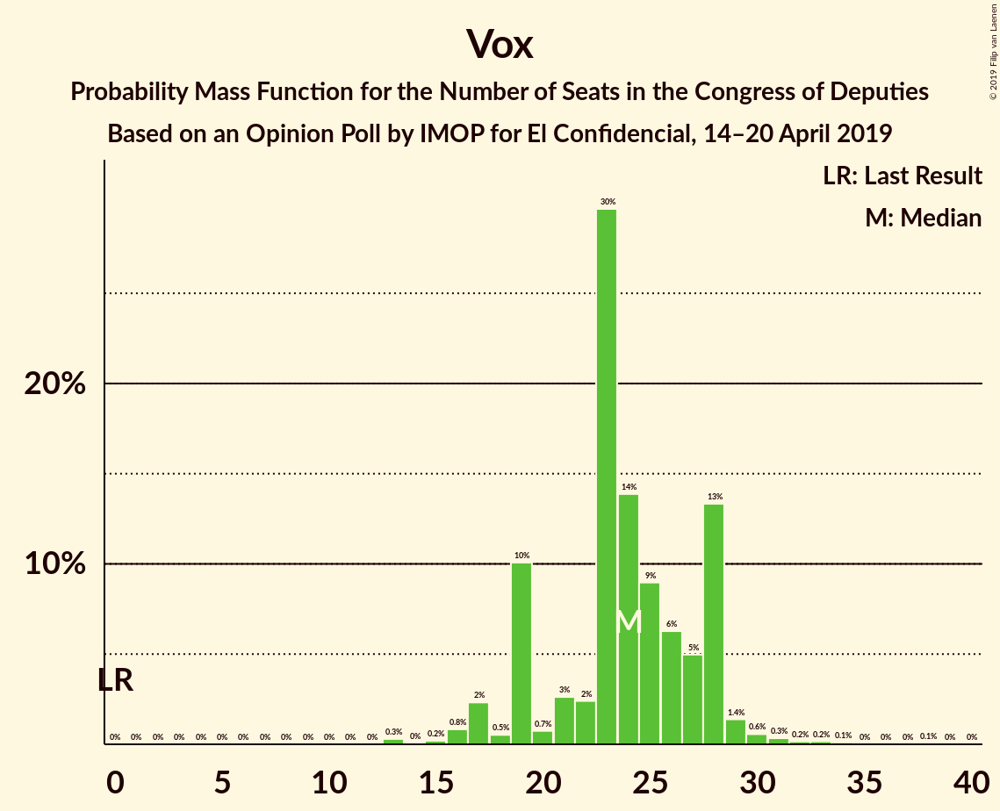
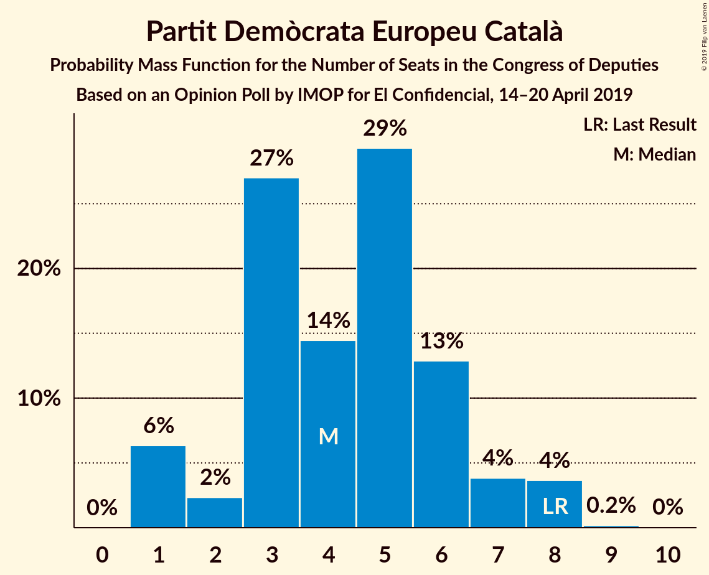
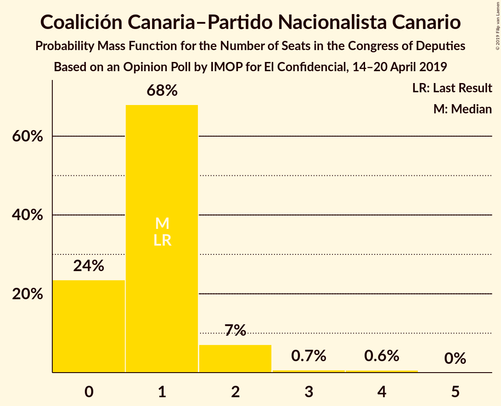

# Opinion Poll by IMOP for El Confidencial, 14–20 April 2019

<a href="#voting-intentions">Voting Intentions</a> | <a href="#seats">Seats</a> | <a href="#coalitions">Coalitions</a> | <a href="#technical-information">Technical Information</a>

## Voting Intentions

### Confidence Intervals

| Party | Last Result | Poll Result | 80% Confidence Interval | 90% Confidence Interval | 95% Confidence Interval | 99% Confidence Interval |
|:-----:|:-----------:|:-----------:|:-----------------------:|:-----------------------:|:-----------------------:|:-----------------------:|
| Partido Socialista Obrero Español | 22.6% | 29.8% | 28.2–31.4% |27.8–31.8% |27.4–32.2% |26.7–33.0% |
| Partido Popular | 33.0% | 19.8% | 18.5–21.2% |18.1–21.6% |17.8–22.0% |17.2–22.7% |
| Ciudadanos–Partido de la Ciudadanía | 13.1% | 15.1% | 13.9–16.4% |13.6–16.7% |13.3–17.1% |12.7–17.7% |
| Unidos Podemos | 21.2% | 14.9% | 13.7–16.1% |13.4–16.5% |13.1–16.8% |12.5–17.5% |
| Vox | 0.2% | 10.0% | 9.0–11.1% |8.8–11.4% |8.5–11.7% |8.1–12.2% |
| Esquerra Republicana de Catalunya–Catalunya Sí | 2.7% | 3.0% | 2.5–3.7% |2.3–3.9% |2.2–4.0% |2.0–4.4% |
| Partido Animalista Contra el Maltrato Animal | 1.2% | 1.8% | 1.4–2.3% |1.3–2.5% |1.2–2.6% |1.1–2.9% |
| Partit Demòcrata Europeu Català | 2.0% | 1.2% | 0.9–1.7% |0.8–1.8% |0.8–1.9% |0.6–2.2% |
| Euzko Alderdi Jeltzalea/Partido Nacionalista Vasco | 1.2% | 1.2% | 0.9–1.7% |0.8–1.8% |0.8–1.9% |0.6–2.2% |
| Euskal Herria Bildu | 0.8% | 0.8% | 0.5–1.2% |0.5–1.3% |0.4–1.4% |0.4–1.6% |
| Coalición Canaria–Partido Nacionalista Canario | 0.3% | 0.3% | 0.2–0.6% |0.1–0.7% |0.1–0.7% |0.1–0.9% |

*Note:* The poll result column reflects the actual value used in the calculations. Published results may vary slightly, and in addition be rounded to fewer digits.

## Seats

### Confidence Intervals

| Party | Last Result | Median | 80% Confidence Interval | 90% Confidence Interval | 95% Confidence Interval | 99% Confidence Interval |
|:-----:|:-----------:|:------:|:-----------------------:|:-----------------------:|:-----------------------:|:-----------------------:|
| <a href="#partido-socialista-obrero-español">Partido Socialista Obrero Español</a> | 85 | 136 | 123–138 |121–139 |118–140 |114–145 |
| <a href="#partido-popular">Partido Popular</a> | 137 | 73 | 68–85 |67–88 |67–88 |66–91 |
| <a href="#ciudadanos–partido-de-la-ciudadanía">Ciudadanos–Partido de la Ciudadanía</a> | 32 | 50 | 34–53 |34–55 |34–57 |34–61 |
| <a href="#unidos-podemos">Unidos Podemos</a> | 71 | 43 | 37–46 |36–47 |34–51 |33–55 |
| <a href="#vox">Vox</a> | 0 | 24 | 19–27 |19–28 |19–29 |16–33 |
| <a href="#esquerra-republicana-de-catalunya–catalunya-sí">Esquerra Republicana de Catalunya–Catalunya Sí</a> | 9 | 14 | 10–15 |10–16 |10–18 |9–18 |
| <a href="#partido-animalista-contra-el-maltrato-animal">Partido Animalista Contra el Maltrato Animal</a> | 0 | 1 | 0–1 |0–1 |0–1 |0–1 |
| <a href="#partit-demòcrata-europeu-català">Partit Demòcrata Europeu Català</a> | 8 | 5 | 3–6 |2–6 |1–7 |1–8 |
| <a href="#euzko-alderdi-jeltzalea/partido-nacionalista-vasco">Euzko Alderdi Jeltzalea/Partido Nacionalista Vasco</a> | 5 | 6 | 3–8 |3–9 |3–9 |2–10 |
| <a href="#euskal-herria-bildu">Euskal Herria Bildu</a> | 2 | 2 | 1–5 |1–5 |1–6 |0–7 |
| <a href="#coalición-canaria–partido-nacionalista-canario">Coalición Canaria–Partido Nacionalista Canario</a> | 1 | 1 | 1–2 |0–2 |0–3 |0–4 |

### Partido Socialista Obrero Español

*For a full overview of the results for this party, see the [Partido Socialista Obrero Español](party-partidosocialistaobreroespañol.html) page.*

| Number of Seats | Probability | Accumulated | Special Marks |
|:---------------:|:-----------:|:-----------:|:-------------:|
| 85 | 0% | 100% | Last Result |
| 86 | 0% | 100% |  |
| 87 | 0% | 100% |  |
| 88 | 0% | 100% |  |
| 89 | 0% | 100% |  |
| 90 | 0% | 100% |  |
| 91 | 0% | 100% |  |
| 92 | 0% | 100% |  |
| 93 | 0% | 100% |  |
| 94 | 0% | 100% |  |
| 95 | 0% | 100% |  |
| 96 | 0% | 100% |  |
| 97 | 0% | 100% |  |
| 98 | 0% | 100% |  |
| 99 | 0% | 100% |  |
| 100 | 0% | 100% |  |
| 101 | 0% | 100% |  |
| 102 | 0% | 100% |  |
| 103 | 0% | 100% |  |
| 104 | 0% | 100% |  |
| 105 | 0% | 100% |  |
| 106 | 0% | 100% |  |
| 107 | 0% | 100% |  |
| 108 | 0% | 99.9% |  |
| 109 | 0% | 99.9% |  |
| 110 | 0% | 99.9% |  |
| 111 | 0% | 99.9% |  |
| 112 | 0.1% | 99.8% |  |
| 113 | 0.1% | 99.7% |  |
| 114 | 0.5% | 99.7% |  |
| 115 | 0.1% | 99.2% |  |
| 116 | 0.4% | 99.1% |  |
| 117 | 0.6% | 98.7% |  |
| 118 | 1.4% | 98% |  |
| 119 | 1.1% | 97% |  |
| 120 | 0.3% | 96% |  |
| 121 | 0.7% | 95% |  |
| 122 | 0.4% | 95% |  |
| 123 | 16% | 94% |  |
| 124 | 0.4% | 78% |  |
| 125 | 0.3% | 78% |  |
| 126 | 1.5% | 77% |  |
| 127 | 2% | 76% |  |
| 128 | 0.7% | 73% |  |
| 129 | 6% | 73% |  |
| 130 | 1.2% | 67% |  |
| 131 | 1.3% | 66% |  |
| 132 | 2% | 64% |  |
| 133 | 2% | 62% |  |
| 134 | 0.5% | 60% |  |
| 135 | 2% | 60% |  |
| 136 | 19% | 58% | Median |
| 137 | 28% | 39% |  |
| 138 | 4% | 11% |  |
| 139 | 4% | 7% |  |
| 140 | 1.4% | 3% |  |
| 141 | 0.1% | 2% |  |
| 142 | 0.9% | 2% |  |
| 143 | 0.3% | 1.0% |  |
| 144 | 0.1% | 0.7% |  |
| 145 | 0.4% | 0.6% |  |
| 146 | 0% | 0.2% |  |
| 147 | 0% | 0.2% |  |
| 148 | 0% | 0.2% |  |
| 149 | 0% | 0.2% |  |
| 150 | 0.1% | 0.1% |  |
| 151 | 0% | 0% |  |

### Partido Popular

*For a full overview of the results for this party, see the [Partido Popular](party-partidopopular.html) page.*

| Number of Seats | Probability | Accumulated | Special Marks |
|:---------------:|:-----------:|:-----------:|:-------------:|
| 58 | 0.3% | 100% |  |
| 59 | 0% | 99.7% |  |
| 60 | 0% | 99.7% |  |
| 61 | 0% | 99.7% |  |
| 62 | 0% | 99.7% |  |
| 63 | 0% | 99.7% |  |
| 64 | 0.1% | 99.6% |  |
| 65 | 0.1% | 99.6% |  |
| 66 | 0.3% | 99.5% |  |
| 67 | 5% | 99.2% |  |
| 68 | 6% | 94% |  |
| 69 | 1.1% | 89% |  |
| 70 | 3% | 87% |  |
| 71 | 3% | 85% |  |
| 72 | 27% | 82% |  |
| 73 | 6% | 55% | Median |
| 74 | 0.9% | 49% |  |
| 75 | 2% | 48% |  |
| 76 | 1.0% | 46% |  |
| 77 | 1.2% | 45% |  |
| 78 | 2% | 44% |  |
| 79 | 5% | 41% |  |
| 80 | 1.1% | 36% |  |
| 81 | 1.1% | 35% |  |
| 82 | 0.9% | 34% |  |
| 83 | 2% | 33% |  |
| 84 | 12% | 31% |  |
| 85 | 12% | 19% |  |
| 86 | 0.7% | 8% |  |
| 87 | 0.6% | 7% |  |
| 88 | 5% | 6% |  |
| 89 | 0.1% | 1.2% |  |
| 90 | 0.2% | 1.1% |  |
| 91 | 0.5% | 0.9% |  |
| 92 | 0.1% | 0.5% |  |
| 93 | 0% | 0.4% |  |
| 94 | 0% | 0.4% |  |
| 95 | 0.3% | 0.4% |  |
| 96 | 0% | 0.1% |  |
| 97 | 0% | 0.1% |  |
| 98 | 0% | 0.1% |  |
| 99 | 0% | 0% |  |
| 100 | 0% | 0% |  |
| 101 | 0% | 0% |  |
| 102 | 0% | 0% |  |
| 103 | 0% | 0% |  |
| 104 | 0% | 0% |  |
| 105 | 0% | 0% |  |
| 106 | 0% | 0% |  |
| 107 | 0% | 0% |  |
| 108 | 0% | 0% |  |
| 109 | 0% | 0% |  |
| 110 | 0% | 0% |  |
| 111 | 0% | 0% |  |
| 112 | 0% | 0% |  |
| 113 | 0% | 0% |  |
| 114 | 0% | 0% |  |
| 115 | 0% | 0% |  |
| 116 | 0% | 0% |  |
| 117 | 0% | 0% |  |
| 118 | 0% | 0% |  |
| 119 | 0% | 0% |  |
| 120 | 0% | 0% |  |
| 121 | 0% | 0% |  |
| 122 | 0% | 0% |  |
| 123 | 0% | 0% |  |
| 124 | 0% | 0% |  |
| 125 | 0% | 0% |  |
| 126 | 0% | 0% |  |
| 127 | 0% | 0% |  |
| 128 | 0% | 0% |  |
| 129 | 0% | 0% |  |
| 130 | 0% | 0% |  |
| 131 | 0% | 0% |  |
| 132 | 0% | 0% |  |
| 133 | 0% | 0% |  |
| 134 | 0% | 0% |  |
| 135 | 0% | 0% |  |
| 136 | 0% | 0% |  |
| 137 | 0% | 0% | Last Result |

### Ciudadanos–Partido de la Ciudadanía

*For a full overview of the results for this party, see the [Ciudadanos–Partido de la Ciudadanía](party-ciudadanos–partidodelaciudadanía.html) page.*

| Number of Seats | Probability | Accumulated | Special Marks |
|:---------------:|:-----------:|:-----------:|:-------------:|
| 32 | 0% | 100% | Last Result |
| 33 | 0.2% | 99.9% |  |
| 34 | 12% | 99.8% |  |
| 35 | 0.3% | 88% |  |
| 36 | 0.2% | 88% |  |
| 37 | 0.4% | 88% |  |
| 38 | 1.3% | 87% |  |
| 39 | 0.4% | 86% |  |
| 40 | 5% | 86% |  |
| 41 | 0.8% | 81% |  |
| 42 | 0.9% | 80% |  |
| 43 | 0.7% | 79% |  |
| 44 | 8% | 79% |  |
| 45 | 0.6% | 71% |  |
| 46 | 2% | 70% |  |
| 47 | 0.6% | 69% |  |
| 48 | 4% | 68% |  |
| 49 | 6% | 64% |  |
| 50 | 9% | 57% | Median |
| 51 | 5% | 48% |  |
| 52 | 29% | 42% |  |
| 53 | 6% | 14% |  |
| 54 | 2% | 8% |  |
| 55 | 1.2% | 5% |  |
| 56 | 1.3% | 4% |  |
| 57 | 0.9% | 3% |  |
| 58 | 0.3% | 2% |  |
| 59 | 0.1% | 2% |  |
| 60 | 0.9% | 2% |  |
| 61 | 0.3% | 0.7% |  |
| 62 | 0.1% | 0.4% |  |
| 63 | 0.1% | 0.3% |  |
| 64 | 0.1% | 0.2% |  |
| 65 | 0% | 0.1% |  |
| 66 | 0% | 0% |  |

### Unidos Podemos

*For a full overview of the results for this party, see the [Unidos Podemos](party-unidospodemos.html) page.*

| Number of Seats | Probability | Accumulated | Special Marks |
|:---------------:|:-----------:|:-----------:|:-------------:|
| 30 | 0.3% | 100% |  |
| 31 | 0% | 99.7% |  |
| 32 | 0.1% | 99.6% |  |
| 33 | 0.8% | 99.5% |  |
| 34 | 1.4% | 98.7% |  |
| 35 | 0.6% | 97% |  |
| 36 | 5% | 97% |  |
| 37 | 7% | 91% |  |
| 38 | 8% | 84% |  |
| 39 | 6% | 76% |  |
| 40 | 7% | 70% |  |
| 41 | 10% | 64% |  |
| 42 | 0.8% | 53% |  |
| 43 | 14% | 53% | Median |
| 44 | 2% | 39% |  |
| 45 | 0.8% | 37% |  |
| 46 | 30% | 36% |  |
| 47 | 1.1% | 6% |  |
| 48 | 0.2% | 5% |  |
| 49 | 0.6% | 4% |  |
| 50 | 1.4% | 4% |  |
| 51 | 0.4% | 3% |  |
| 52 | 0.4% | 2% |  |
| 53 | 0.4% | 2% |  |
| 54 | 0% | 1.3% |  |
| 55 | 1.1% | 1.3% |  |
| 56 | 0% | 0.3% |  |
| 57 | 0.1% | 0.2% |  |
| 58 | 0% | 0.1% |  |
| 59 | 0.1% | 0.1% |  |
| 60 | 0% | 0% |  |
| 61 | 0% | 0% |  |
| 62 | 0% | 0% |  |
| 63 | 0% | 0% |  |
| 64 | 0% | 0% |  |
| 65 | 0% | 0% |  |
| 66 | 0% | 0% |  |
| 67 | 0% | 0% |  |
| 68 | 0% | 0% |  |
| 69 | 0% | 0% |  |
| 70 | 0% | 0% |  |
| 71 | 0% | 0% | Last Result |

### Vox

*For a full overview of the results for this party, see the [Vox](party-vox.html) page.*

| Number of Seats | Probability | Accumulated | Special Marks |
|:---------------:|:-----------:|:-----------:|:-------------:|
| 0 | 0% | 100% | Last Result |
| 1 | 0% | 100% |  |
| 2 | 0% | 100% |  |
| 3 | 0% | 100% |  |
| 4 | 0% | 100% |  |
| 5 | 0% | 100% |  |
| 6 | 0% | 100% |  |
| 7 | 0% | 100% |  |
| 8 | 0% | 100% |  |
| 9 | 0% | 100% |  |
| 10 | 0% | 100% |  |
| 11 | 0% | 100% |  |
| 12 | 0% | 100% |  |
| 13 | 0.1% | 100% |  |
| 14 | 0.1% | 99.9% |  |
| 15 | 0.2% | 99.9% |  |
| 16 | 0.7% | 99.7% |  |
| 17 | 0.3% | 99.0% |  |
| 18 | 1.1% | 98.7% |  |
| 19 | 31% | 98% |  |
| 20 | 0.4% | 67% |  |
| 21 | 3% | 66% |  |
| 22 | 5% | 63% |  |
| 23 | 3% | 59% |  |
| 24 | 9% | 56% | Median |
| 25 | 7% | 47% |  |
| 26 | 18% | 40% |  |
| 27 | 13% | 22% |  |
| 28 | 6% | 9% |  |
| 29 | 1.0% | 3% |  |
| 30 | 0.2% | 2% |  |
| 31 | 1.0% | 2% |  |
| 32 | 0% | 0.7% |  |
| 33 | 0.4% | 0.7% |  |
| 34 | 0.2% | 0.2% |  |
| 35 | 0% | 0% |  |

### Esquerra Republicana de Catalunya–Catalunya Sí

*For a full overview of the results for this party, see the [Esquerra Republicana de Catalunya–Catalunya Sí](party-esquerrarepublicanadecatalunya–catalunyasí.html) page.*

| Number of Seats | Probability | Accumulated | Special Marks |
|:---------------:|:-----------:|:-----------:|:-------------:|
| 8 | 0.1% | 100% |  |
| 9 | 2% | 99.9% | Last Result |
| 10 | 23% | 98% |  |
| 11 | 2% | 75% |  |
| 12 | 13% | 73% |  |
| 13 | 9% | 60% |  |
| 14 | 32% | 51% | Median |
| 15 | 13% | 19% |  |
| 16 | 1.2% | 6% |  |
| 17 | 0.2% | 5% |  |
| 18 | 4% | 4% |  |
| 19 | 0.4% | 0.4% |  |
| 20 | 0.1% | 0.1% |  |
| 21 | 0% | 0% |  |

### Partido Animalista Contra el Maltrato Animal

*For a full overview of the results for this party, see the [Partido Animalista Contra el Maltrato Animal](party-partidoanimalistacontraelmaltratoanimal.html) page.*

| Number of Seats | Probability | Accumulated | Special Marks |
|:---------------:|:-----------:|:-----------:|:-------------:|
| 0 | 43% | 100% | Last Result |
| 1 | 57% | 57% | Median |
| 2 | 0% | 0% |  |

### Partit Demòcrata Europeu Català

*For a full overview of the results for this party, see the [Partit Demòcrata Europeu Català](party-partitdemòcrataeuropeucatalà.html) page.*

| Number of Seats | Probability | Accumulated | Special Marks |
|:---------------:|:-----------:|:-----------:|:-------------:|
| 0 | 0.1% | 100% |  |
| 1 | 3% | 99.9% |  |
| 2 | 6% | 97% |  |
| 3 | 5% | 91% |  |
| 4 | 25% | 87% |  |
| 5 | 42% | 61% | Median |
| 6 | 14% | 19% |  |
| 7 | 3% | 5% |  |
| 8 | 2% | 2% | Last Result |
| 9 | 0.1% | 0.2% |  |
| 10 | 0% | 0.1% |  |
| 11 | 0% | 0% |  |

### Euzko Alderdi Jeltzalea/Partido Nacionalista Vasco

*For a full overview of the results for this party, see the [Euzko Alderdi Jeltzalea/Partido Nacionalista Vasco](party-euzkoalderdijeltzaleapartidonacionalistavasco.html) page.*

| Number of Seats | Probability | Accumulated | Special Marks |
|:---------------:|:-----------:|:-----------:|:-------------:|
| 2 | 0.5% | 100% |  |
| 3 | 12% | 99.5% |  |
| 4 | 13% | 88% |  |
| 5 | 6% | 75% | Last Result |
| 6 | 49% | 69% | Median |
| 7 | 9% | 20% |  |
| 8 | 3% | 11% |  |
| 9 | 7% | 8% |  |
| 10 | 1.3% | 1.3% |  |
| 11 | 0.1% | 0.1% |  |
| 12 | 0% | 0% |  |

### Euskal Herria Bildu

*For a full overview of the results for this party, see the [Euskal Herria Bildu](party-euskalherriabildu.html) page.*

| Number of Seats | Probability | Accumulated | Special Marks |
|:---------------:|:-----------:|:-----------:|:-------------:|
| 0 | 0.9% | 100% |  |
| 1 | 26% | 99.1% |  |
| 2 | 26% | 73% | Last Result, Median |
| 3 | 17% | 47% |  |
| 4 | 11% | 30% |  |
| 5 | 16% | 20% |  |
| 6 | 2% | 4% |  |
| 7 | 1.3% | 1.3% |  |
| 8 | 0% | 0.1% |  |
| 9 | 0% | 0% |  |

### Coalición Canaria–Partido Nacionalista Canario

*For a full overview of the results for this party, see the [Coalición Canaria–Partido Nacionalista Canario](party-coalicióncanaria–partidonacionalistacanario.html) page.*

| Number of Seats | Probability | Accumulated | Special Marks |
|:---------------:|:-----------:|:-----------:|:-------------:|
| 0 | 10% | 100% |  |
| 1 | 73% | 90% | Last Result, Median |
| 2 | 15% | 17% |  |
| 3 | 1.4% | 3% |  |
| 4 | 1.3% | 1.3% |  |
| 5 | 0% | 0% |  |

## Coalitions

### Confidence Intervals

| Coalition | Last Result | Median | Majority? | 80% Confidence Interval | 90% Confidence Interval | 95% Confidence Interval | 99% Confidence Interval |
|:---------:|:-----------:|:------:|:---------:|:-----------------------:|:-----------------------:|:-----------------------:|:-----------------------:|
| Partido Socialista Obrero Español – Partido Popular – Ciudadanos–Partido de la Ciudadanía | 254 | 257 | 100% | 249–261 | 248–267 | 246–267 | 243–268 |
| Partido Socialista Obrero Español – Ciudadanos–Partido de la Ciudadanía – Unidos Podemos | 188 | 222 | 100% | 211–235 | 208–235 | 208–235 | 205–236 |
| Partido Socialista Obrero Español – Partido Popular | 222 | 209 | 100% | 199–221 | 196–221 | 196–221 | 192–222 |
| Partido Socialista Obrero Español – Unidos Podemos – Esquerra Republicana de Catalunya–Catalunya Sí – Euzko Alderdi Jeltzalea/Partido Nacionalista Vasco – Partit Demòcrata Europeu Català – Euskal Herria Bildu | 180 | 204 | 100% | 190–206 | 186–211 | 186–212 | 182–214 |
| Partido Socialista Obrero Español – Unidos Podemos – Esquerra Republicana de Catalunya–Catalunya Sí – Partit Demòcrata Europeu Català | 173 | 194 | 98.9% | 181–198 | 176–203 | 176–203 | 172–205 |
| Partido Socialista Obrero Español – Unidos Podemos – Esquerra Republicana de Catalunya–Catalunya Sí – Euskal Herria Bildu | 167 | 194 | 94% | 181–196 | 175–202 | 175–202 | 171–206 |
| Partido Socialista Obrero Español – Unidos Podemos – Euzko Alderdi Jeltzalea/Partido Nacionalista Vasco – Euskal Herria Bildu | 163 | 185 | 77% | 172–190 | 169–193 | 169–193 | 164–197 |
| Partido Socialista Obrero Español – Ciudadanos–Partido de la Ciudadanía | 117 | 179 | 67% | 170–189 | 167–189 | 167–191 | 161–195 |
| Partido Socialista Obrero Español – Unidos Podemos – Euzko Alderdi Jeltzalea/Partido Nacionalista Vasco | 161 | 182 | 73% | 169–189 | 165–190 | 165–191 | 160–193 |
| Partido Socialista Obrero Español – Unidos Podemos | 156 | 175 | 48% | 163–183 | 159–185 | 158–185 | 154–188 |
| Partido Popular – Ciudadanos–Partido de la Ciudadanía – Vox | 169 | 145 | 0% | 142–158 | 136–162 | 136–162 | 135–167 |
| Partido Popular – Ciudadanos–Partido de la Ciudadanía – Euzko Alderdi Jeltzalea/Partido Nacionalista Vasco | 174 | 130 | 0% | 122–141 | 122–142 | 119–144 | 117–151 |
| Partido Socialista Obrero Español | 85 | 136 | 0% | 123–138 | 121–139 | 118–140 | 114–145 |
| Partido Popular – Ciudadanos–Partido de la Ciudadanía – Coalición Canaria–Partido Nacionalista Canario | 170 | 125 | 0% | 119–137 | 116–139 | 114–139 | 111–146 |
| Partido Popular – Ciudadanos–Partido de la Ciudadanía | 169 | 124 | 0% | 117–136 | 115–138 | 113–138 | 110–145 |
| Partido Popular – Vox | 137 | 98 | 0% | 91–111 | 89–111 | 87–111 | 87–117 |
| Partido Popular | 137 | 73 | 0% | 68–85 | 67–88 | 67–88 | 66–91 |

### Partido Socialista Obrero Español – Partido Popular – Ciudadanos–Partido de la Ciudadanía

| Number of Seats | Probability | Accumulated | Special Marks |
|:---------------:|:-----------:|:-----------:|:-------------:|
| 237 | 0.1% | 100% |  |
| 238 | 0% | 99.9% |  |
| 239 | 0% | 99.9% |  |
| 240 | 0.1% | 99.8% |  |
| 241 | 0% | 99.8% |  |
| 242 | 0.1% | 99.7% |  |
| 243 | 0.7% | 99.6% |  |
| 244 | 0.2% | 99.0% |  |
| 245 | 0.3% | 98.7% |  |
| 246 | 1.3% | 98% |  |
| 247 | 0.8% | 97% |  |
| 248 | 2% | 96% |  |
| 249 | 5% | 95% |  |
| 250 | 0.8% | 89% |  |
| 251 | 11% | 88% |  |
| 252 | 0.9% | 77% |  |
| 253 | 3% | 76% |  |
| 254 | 1.3% | 73% | Last Result |
| 255 | 13% | 72% |  |
| 256 | 9% | 59% |  |
| 257 | 5% | 50% |  |
| 258 | 1.0% | 46% |  |
| 259 | 6% | 45% | Median |
| 260 | 6% | 39% |  |
| 261 | 23% | 33% |  |
| 262 | 1.1% | 10% |  |
| 263 | 0.6% | 8% |  |
| 264 | 0.4% | 8% |  |
| 265 | 0.9% | 7% |  |
| 266 | 0.9% | 7% |  |
| 267 | 5% | 6% |  |
| 268 | 0.1% | 0.5% |  |
| 269 | 0.1% | 0.4% |  |
| 270 | 0.1% | 0.4% |  |
| 271 | 0% | 0.3% |  |
| 272 | 0% | 0.2% |  |
| 273 | 0.2% | 0.2% |  |
| 274 | 0% | 0% |  |

### Partido Socialista Obrero Español – Ciudadanos–Partido de la Ciudadanía – Unidos Podemos

| Number of Seats | Probability | Accumulated | Special Marks |
|:---------------:|:-----------:|:-----------:|:-------------:|
| 188 | 0% | 100% | Last Result |
| 189 | 0% | 100% |  |
| 190 | 0% | 100% |  |
| 191 | 0% | 100% |  |
| 192 | 0% | 100% |  |
| 193 | 0% | 100% |  |
| 194 | 0% | 100% |  |
| 195 | 0% | 100% |  |
| 196 | 0% | 100% |  |
| 197 | 0% | 100% |  |
| 198 | 0% | 100% |  |
| 199 | 0% | 99.9% |  |
| 200 | 0% | 99.9% |  |
| 201 | 0% | 99.9% |  |
| 202 | 0.1% | 99.9% |  |
| 203 | 0.1% | 99.8% |  |
| 204 | 0.2% | 99.7% |  |
| 205 | 0.1% | 99.5% |  |
| 206 | 0.4% | 99.5% |  |
| 207 | 0.8% | 99.1% |  |
| 208 | 7% | 98% |  |
| 209 | 0.3% | 92% |  |
| 210 | 0.7% | 91% |  |
| 211 | 5% | 90% |  |
| 212 | 1.4% | 85% |  |
| 213 | 14% | 84% |  |
| 214 | 0.5% | 70% |  |
| 215 | 3% | 69% |  |
| 216 | 0.7% | 66% |  |
| 217 | 0.5% | 65% |  |
| 218 | 1.2% | 65% |  |
| 219 | 7% | 64% |  |
| 220 | 0.4% | 57% |  |
| 221 | 0.6% | 56% |  |
| 222 | 7% | 56% |  |
| 223 | 7% | 49% |  |
| 224 | 2% | 42% |  |
| 225 | 0.8% | 40% |  |
| 226 | 6% | 39% |  |
| 227 | 3% | 32% |  |
| 228 | 0.5% | 29% |  |
| 229 | 0.6% | 29% | Median |
| 230 | 1.5% | 28% |  |
| 231 | 0.3% | 27% |  |
| 232 | 0.4% | 26% |  |
| 233 | 0.1% | 26% |  |
| 234 | 4% | 26% |  |
| 235 | 21% | 22% |  |
| 236 | 0.4% | 0.8% |  |
| 237 | 0.1% | 0.4% |  |
| 238 | 0% | 0.4% |  |
| 239 | 0% | 0.4% |  |
| 240 | 0% | 0.3% |  |
| 241 | 0% | 0.3% |  |
| 242 | 0.3% | 0.3% |  |
| 243 | 0% | 0% |  |

### Partido Socialista Obrero Español – Partido Popular

| Number of Seats | Probability | Accumulated | Special Marks |
|:---------------:|:-----------:|:-----------:|:-------------:|
| 187 | 0.1% | 100% |  |
| 188 | 0.1% | 99.9% |  |
| 189 | 0.1% | 99.8% |  |
| 190 | 0% | 99.7% |  |
| 191 | 0.1% | 99.7% |  |
| 192 | 0.2% | 99.6% |  |
| 193 | 0.4% | 99.5% |  |
| 194 | 0.3% | 99.0% |  |
| 195 | 0.2% | 98.7% |  |
| 196 | 6% | 98.5% |  |
| 197 | 0.2% | 92% |  |
| 198 | 2% | 92% |  |
| 199 | 1.1% | 91% |  |
| 200 | 0.4% | 89% |  |
| 201 | 1.2% | 89% |  |
| 202 | 1.1% | 88% |  |
| 203 | 5% | 87% |  |
| 204 | 2% | 82% |  |
| 205 | 0.6% | 80% |  |
| 206 | 3% | 80% |  |
| 207 | 17% | 77% |  |
| 208 | 3% | 60% |  |
| 209 | 27% | 56% | Median |
| 210 | 2% | 29% |  |
| 211 | 2% | 27% |  |
| 212 | 0.4% | 25% |  |
| 213 | 1.2% | 25% |  |
| 214 | 2% | 24% |  |
| 215 | 0.4% | 22% |  |
| 216 | 0.7% | 21% |  |
| 217 | 8% | 21% |  |
| 218 | 0.1% | 13% |  |
| 219 | 0.1% | 13% |  |
| 220 | 0.2% | 13% |  |
| 221 | 12% | 13% |  |
| 222 | 0.3% | 0.7% | Last Result |
| 223 | 0% | 0.5% |  |
| 224 | 0.1% | 0.4% |  |
| 225 | 0% | 0.3% |  |
| 226 | 0.2% | 0.3% |  |
| 227 | 0% | 0% |  |

### Partido Socialista Obrero Español – Unidos Podemos – Esquerra Republicana de Catalunya–Catalunya Sí – Euzko Alderdi Jeltzalea/Partido Nacionalista Vasco – Partit Demòcrata Europeu Català – Euskal Herria Bildu

| Number of Seats | Probability | Accumulated | Special Marks |
|:---------------:|:-----------:|:-----------:|:-------------:|
| 178 | 0% | 100% |  |
| 179 | 0.1% | 99.9% |  |
| 180 | 0% | 99.8% | Last Result |
| 181 | 0.1% | 99.8% |  |
| 182 | 0.3% | 99.7% |  |
| 183 | 0.4% | 99.4% |  |
| 184 | 0.5% | 99.1% |  |
| 185 | 0.2% | 98.6% |  |
| 186 | 4% | 98% |  |
| 187 | 0.6% | 94% |  |
| 188 | 2% | 93% |  |
| 189 | 1.0% | 91% |  |
| 190 | 0.3% | 90% |  |
| 191 | 5% | 90% |  |
| 192 | 0.4% | 85% |  |
| 193 | 8% | 84% |  |
| 194 | 2% | 77% |  |
| 195 | 1.2% | 75% |  |
| 196 | 2% | 74% |  |
| 197 | 6% | 72% |  |
| 198 | 0.7% | 67% |  |
| 199 | 2% | 66% |  |
| 200 | 1.2% | 64% |  |
| 201 | 0.7% | 63% |  |
| 202 | 5% | 62% |  |
| 203 | 4% | 58% |  |
| 204 | 15% | 53% |  |
| 205 | 24% | 39% |  |
| 206 | 6% | 15% | Median |
| 207 | 2% | 9% |  |
| 208 | 0.2% | 8% |  |
| 209 | 0.5% | 7% |  |
| 210 | 0.5% | 7% |  |
| 211 | 4% | 6% |  |
| 212 | 0.7% | 3% |  |
| 213 | 1.4% | 2% |  |
| 214 | 0.4% | 0.6% |  |
| 215 | 0% | 0.3% |  |
| 216 | 0% | 0.2% |  |
| 217 | 0.1% | 0.2% |  |
| 218 | 0% | 0.1% |  |
| 219 | 0% | 0.1% |  |
| 220 | 0% | 0.1% |  |
| 221 | 0% | 0% |  |

### Partido Socialista Obrero Español – Unidos Podemos – Esquerra Republicana de Catalunya–Catalunya Sí – Partit Demòcrata Europeu Català

| Number of Seats | Probability | Accumulated | Special Marks |
|:---------------:|:-----------:|:-----------:|:-------------:|
| 169 | 0.1% | 100% |  |
| 170 | 0.1% | 99.8% |  |
| 171 | 0% | 99.7% |  |
| 172 | 0.3% | 99.7% |  |
| 173 | 0.1% | 99.4% | Last Result |
| 174 | 0.1% | 99.3% |  |
| 175 | 0.3% | 99.2% |  |
| 176 | 6% | 98.9% | Majority |
| 177 | 0.9% | 93% |  |
| 178 | 0.6% | 92% |  |
| 179 | 0.5% | 92% |  |
| 180 | 1.0% | 91% |  |
| 181 | 0.1% | 90% |  |
| 182 | 0.6% | 90% |  |
| 183 | 0.5% | 89% |  |
| 184 | 3% | 89% |  |
| 185 | 7% | 86% |  |
| 186 | 10% | 79% |  |
| 187 | 1.5% | 69% |  |
| 188 | 0.7% | 68% |  |
| 189 | 2% | 67% |  |
| 190 | 1.1% | 65% |  |
| 191 | 0.3% | 64% |  |
| 192 | 2% | 64% |  |
| 193 | 5% | 62% |  |
| 194 | 9% | 57% |  |
| 195 | 5% | 48% |  |
| 196 | 0.7% | 44% |  |
| 197 | 14% | 43% |  |
| 198 | 22% | 29% | Median |
| 199 | 0.4% | 8% |  |
| 200 | 0.9% | 7% |  |
| 201 | 0.3% | 6% |  |
| 202 | 0.2% | 6% |  |
| 203 | 4% | 6% |  |
| 204 | 1.3% | 2% |  |
| 205 | 0.5% | 1.0% |  |
| 206 | 0.3% | 0.5% |  |
| 207 | 0.1% | 0.2% |  |
| 208 | 0% | 0.2% |  |
| 209 | 0% | 0.2% |  |
| 210 | 0.1% | 0.1% |  |
| 211 | 0% | 0.1% |  |
| 212 | 0.1% | 0.1% |  |
| 213 | 0% | 0% |  |

### Partido Socialista Obrero Español – Unidos Podemos – Esquerra Republicana de Catalunya–Catalunya Sí – Euskal Herria Bildu

| Number of Seats | Probability | Accumulated | Special Marks |
|:---------------:|:-----------:|:-----------:|:-------------:|
| 165 | 0.1% | 100% |  |
| 166 | 0% | 99.8% |  |
| 167 | 0% | 99.8% | Last Result |
| 168 | 0% | 99.8% |  |
| 169 | 0.1% | 99.8% |  |
| 170 | 0% | 99.7% |  |
| 171 | 0.5% | 99.7% |  |
| 172 | 0.1% | 99.2% |  |
| 173 | 0.6% | 99.1% |  |
| 174 | 0.2% | 98% |  |
| 175 | 4% | 98% |  |
| 176 | 0.7% | 94% | Majority |
| 177 | 0.9% | 93% |  |
| 178 | 1.3% | 92% |  |
| 179 | 0.4% | 91% |  |
| 180 | 0.2% | 91% |  |
| 181 | 9% | 90% |  |
| 182 | 1.3% | 82% |  |
| 183 | 6% | 81% |  |
| 184 | 5% | 74% |  |
| 185 | 1.1% | 69% |  |
| 186 | 0.1% | 68% |  |
| 187 | 1.4% | 68% |  |
| 188 | 1.4% | 67% |  |
| 189 | 1.2% | 65% |  |
| 190 | 2% | 64% |  |
| 191 | 0.8% | 62% |  |
| 192 | 3% | 61% |  |
| 193 | 2% | 58% |  |
| 194 | 29% | 56% |  |
| 195 | 5% | 27% | Median |
| 196 | 13% | 21% |  |
| 197 | 0.4% | 8% |  |
| 198 | 0.7% | 8% |  |
| 199 | 0.6% | 7% |  |
| 200 | 0.1% | 7% |  |
| 201 | 0.7% | 6% |  |
| 202 | 4% | 6% |  |
| 203 | 0.4% | 2% |  |
| 204 | 0.1% | 2% |  |
| 205 | 0% | 2% |  |
| 206 | 1.3% | 1.5% |  |
| 207 | 0.1% | 0.2% |  |
| 208 | 0.1% | 0.1% |  |
| 209 | 0% | 0.1% |  |
| 210 | 0% | 0.1% |  |
| 211 | 0% | 0.1% |  |
| 212 | 0% | 0% |  |

### Partido Socialista Obrero Español – Unidos Podemos – Euzko Alderdi Jeltzalea/Partido Nacionalista Vasco – Euskal Herria Bildu

| Number of Seats | Probability | Accumulated | Special Marks |
|:---------------:|:-----------:|:-----------:|:-------------:|
| 158 | 0% | 100% |  |
| 159 | 0% | 99.9% |  |
| 160 | 0% | 99.9% |  |
| 161 | 0% | 99.9% |  |
| 162 | 0.3% | 99.9% |  |
| 163 | 0.1% | 99.6% | Last Result |
| 164 | 0.4% | 99.5% |  |
| 165 | 0.6% | 99.1% |  |
| 166 | 0% | 98.5% |  |
| 167 | 0.5% | 98.5% |  |
| 168 | 0.3% | 98% |  |
| 169 | 5% | 98% |  |
| 170 | 0.3% | 93% |  |
| 171 | 1.4% | 92% |  |
| 172 | 7% | 91% |  |
| 173 | 0.4% | 84% |  |
| 174 | 6% | 83% |  |
| 175 | 0.8% | 78% |  |
| 176 | 3% | 77% | Majority |
| 177 | 0.3% | 74% |  |
| 178 | 1.2% | 74% |  |
| 179 | 0.5% | 73% |  |
| 180 | 7% | 72% |  |
| 181 | 0.5% | 66% |  |
| 182 | 0.4% | 65% |  |
| 183 | 8% | 65% |  |
| 184 | 6% | 56% |  |
| 185 | 0.5% | 50% |  |
| 186 | 12% | 50% |  |
| 187 | 5% | 37% | Median |
| 188 | 0.5% | 33% |  |
| 189 | 1.3% | 32% |  |
| 190 | 22% | 31% |  |
| 191 | 1.1% | 9% |  |
| 192 | 1.0% | 8% |  |
| 193 | 4% | 7% |  |
| 194 | 0.2% | 2% |  |
| 195 | 0.6% | 2% |  |
| 196 | 0.1% | 2% |  |
| 197 | 1.2% | 2% |  |
| 198 | 0.1% | 0.3% |  |
| 199 | 0% | 0.2% |  |
| 200 | 0% | 0.2% |  |
| 201 | 0% | 0.1% |  |
| 202 | 0% | 0.1% |  |
| 203 | 0% | 0.1% |  |
| 204 | 0.1% | 0.1% |  |
| 205 | 0% | 0% |  |

### Partido Socialista Obrero Español – Ciudadanos–Partido de la Ciudadanía

| Number of Seats | Probability | Accumulated | Special Marks |
|:---------------:|:-----------:|:-----------:|:-------------:|
| 117 | 0% | 100% | Last Result |
| 118 | 0% | 100% |  |
| 119 | 0% | 100% |  |
| 120 | 0% | 100% |  |
| 121 | 0% | 100% |  |
| 122 | 0% | 100% |  |
| 123 | 0% | 100% |  |
| 124 | 0% | 100% |  |
| 125 | 0% | 100% |  |
| 126 | 0% | 100% |  |
| 127 | 0% | 100% |  |
| 128 | 0% | 100% |  |
| 129 | 0% | 100% |  |
| 130 | 0% | 100% |  |
| 131 | 0% | 100% |  |
| 132 | 0% | 100% |  |
| 133 | 0% | 100% |  |
| 134 | 0% | 100% |  |
| 135 | 0% | 100% |  |
| 136 | 0% | 100% |  |
| 137 | 0% | 100% |  |
| 138 | 0% | 100% |  |
| 139 | 0% | 100% |  |
| 140 | 0% | 100% |  |
| 141 | 0% | 100% |  |
| 142 | 0% | 100% |  |
| 143 | 0% | 100% |  |
| 144 | 0% | 100% |  |
| 145 | 0% | 100% |  |
| 146 | 0% | 100% |  |
| 147 | 0% | 100% |  |
| 148 | 0% | 100% |  |
| 149 | 0% | 100% |  |
| 150 | 0% | 100% |  |
| 151 | 0% | 100% |  |
| 152 | 0% | 100% |  |
| 153 | 0% | 100% |  |
| 154 | 0% | 100% |  |
| 155 | 0% | 100% |  |
| 156 | 0% | 100% |  |
| 157 | 0% | 100% |  |
| 158 | 0% | 99.9% |  |
| 159 | 0% | 99.9% |  |
| 160 | 0% | 99.9% |  |
| 161 | 0.4% | 99.8% |  |
| 162 | 0.1% | 99.4% |  |
| 163 | 0.2% | 99.4% |  |
| 164 | 0.2% | 99.1% |  |
| 165 | 0.1% | 99.0% |  |
| 166 | 0.2% | 98.8% |  |
| 167 | 7% | 98.6% |  |
| 168 | 0.4% | 91% |  |
| 169 | 0.5% | 91% |  |
| 170 | 12% | 90% |  |
| 171 | 2% | 78% |  |
| 172 | 1.1% | 76% |  |
| 173 | 0.9% | 75% |  |
| 174 | 0.9% | 74% |  |
| 175 | 6% | 73% |  |
| 176 | 7% | 67% | Majority |
| 177 | 2% | 60% |  |
| 178 | 5% | 59% |  |
| 179 | 6% | 54% |  |
| 180 | 0.3% | 48% |  |
| 181 | 2% | 48% |  |
| 182 | 0.4% | 46% |  |
| 183 | 2% | 46% |  |
| 184 | 3% | 44% |  |
| 185 | 1.4% | 41% |  |
| 186 | 4% | 39% | Median |
| 187 | 0.9% | 35% |  |
| 188 | 9% | 34% |  |
| 189 | 23% | 26% |  |
| 190 | 0.4% | 3% |  |
| 191 | 0.5% | 3% |  |
| 192 | 0.4% | 2% |  |
| 193 | 0.3% | 2% |  |
| 194 | 0.3% | 1.3% |  |
| 195 | 0.8% | 1.0% |  |
| 196 | 0.2% | 0.2% |  |
| 197 | 0% | 0.1% |  |
| 198 | 0% | 0% |  |

### Partido Socialista Obrero Español – Unidos Podemos – Euzko Alderdi Jeltzalea/Partido Nacionalista Vasco

| Number of Seats | Probability | Accumulated | Special Marks |
|:---------------:|:-----------:|:-----------:|:-------------:|
| 154 | 0% | 100% |  |
| 155 | 0% | 99.9% |  |
| 156 | 0% | 99.9% |  |
| 157 | 0% | 99.9% |  |
| 158 | 0.1% | 99.9% |  |
| 159 | 0% | 99.8% |  |
| 160 | 1.0% | 99.8% |  |
| 161 | 0.3% | 98.8% | Last Result |
| 162 | 0.2% | 98% |  |
| 163 | 0.1% | 98% |  |
| 164 | 0.1% | 98% |  |
| 165 | 4% | 98% |  |
| 166 | 2% | 94% |  |
| 167 | 0.8% | 92% |  |
| 168 | 0.9% | 91% |  |
| 169 | 0.4% | 90% |  |
| 170 | 7% | 90% |  |
| 171 | 1.2% | 83% |  |
| 172 | 6% | 81% |  |
| 173 | 1.1% | 75% |  |
| 174 | 0.6% | 74% |  |
| 175 | 0.5% | 74% |  |
| 176 | 1.0% | 73% | Majority |
| 177 | 1.1% | 72% |  |
| 178 | 11% | 71% |  |
| 179 | 3% | 60% |  |
| 180 | 0.6% | 57% |  |
| 181 | 4% | 57% |  |
| 182 | 7% | 53% |  |
| 183 | 14% | 47% |  |
| 184 | 0.4% | 33% |  |
| 185 | 2% | 33% | Median |
| 186 | 1.0% | 31% |  |
| 187 | 1.2% | 30% |  |
| 188 | 1.1% | 29% |  |
| 189 | 21% | 28% |  |
| 190 | 3% | 6% |  |
| 191 | 0.3% | 3% |  |
| 192 | 0.5% | 2% |  |
| 193 | 2% | 2% |  |
| 194 | 0% | 0.3% |  |
| 195 | 0% | 0.3% |  |
| 196 | 0.1% | 0.2% |  |
| 197 | 0% | 0.2% |  |
| 198 | 0% | 0.2% |  |
| 199 | 0% | 0.1% |  |
| 200 | 0% | 0.1% |  |
| 201 | 0% | 0.1% |  |
| 202 | 0% | 0.1% |  |
| 203 | 0% | 0.1% |  |
| 204 | 0% | 0% |  |

### Partido Socialista Obrero Español – Unidos Podemos

| Number of Seats | Probability | Accumulated | Special Marks |
|:---------------:|:-----------:|:-----------:|:-------------:|
| 150 | 0.1% | 100% |  |
| 151 | 0% | 99.9% |  |
| 152 | 0% | 99.9% |  |
| 153 | 0.3% | 99.9% |  |
| 154 | 0.2% | 99.5% |  |
| 155 | 0.3% | 99.4% |  |
| 156 | 0.6% | 99.0% | Last Result |
| 157 | 0.6% | 98% |  |
| 158 | 0.6% | 98% |  |
| 159 | 4% | 97% |  |
| 160 | 0.9% | 93% |  |
| 161 | 0.7% | 92% |  |
| 162 | 1.0% | 91% |  |
| 163 | 0.6% | 90% |  |
| 164 | 7% | 90% |  |
| 165 | 0.7% | 83% |  |
| 166 | 2% | 82% |  |
| 167 | 1.4% | 80% |  |
| 168 | 1.4% | 79% |  |
| 169 | 10% | 78% |  |
| 170 | 0.5% | 67% |  |
| 171 | 0.5% | 67% |  |
| 172 | 0.5% | 66% |  |
| 173 | 4% | 66% |  |
| 174 | 2% | 61% |  |
| 175 | 12% | 60% |  |
| 176 | 2% | 48% | Majority |
| 177 | 2% | 46% |  |
| 178 | 0.8% | 44% |  |
| 179 | 13% | 44% | Median |
| 180 | 0.5% | 30% |  |
| 181 | 2% | 30% |  |
| 182 | 0.1% | 28% |  |
| 183 | 22% | 28% |  |
| 184 | 0.3% | 6% |  |
| 185 | 4% | 6% |  |
| 186 | 0.2% | 2% |  |
| 187 | 0.5% | 2% |  |
| 188 | 1.3% | 2% |  |
| 189 | 0% | 0.2% |  |
| 190 | 0% | 0.2% |  |
| 191 | 0% | 0.2% |  |
| 192 | 0% | 0.2% |  |
| 193 | 0.1% | 0.2% |  |
| 194 | 0% | 0.1% |  |
| 195 | 0% | 0.1% |  |
| 196 | 0% | 0.1% |  |
| 197 | 0.1% | 0.1% |  |
| 198 | 0% | 0% |  |

### Partido Popular – Ciudadanos–Partido de la Ciudadanía – Vox

| Number of Seats | Probability | Accumulated | Special Marks |
|:---------------:|:-----------:|:-----------:|:-------------:|
| 128 | 0% | 100% |  |
| 129 | 0% | 99.9% |  |
| 130 | 0.1% | 99.9% |  |
| 131 | 0% | 99.9% |  |
| 132 | 0% | 99.8% |  |
| 133 | 0% | 99.8% |  |
| 134 | 0.1% | 99.8% |  |
| 135 | 2% | 99.6% |  |
| 136 | 3% | 98% |  |
| 137 | 0.9% | 95% |  |
| 138 | 0.3% | 94% |  |
| 139 | 1.0% | 93% |  |
| 140 | 1.2% | 92% |  |
| 141 | 0.3% | 91% |  |
| 142 | 4% | 91% |  |
| 143 | 23% | 86% |  |
| 144 | 4% | 63% |  |
| 145 | 13% | 59% |  |
| 146 | 0.5% | 46% |  |
| 147 | 8% | 45% | Median |
| 148 | 1.0% | 37% |  |
| 149 | 2% | 36% |  |
| 150 | 0.8% | 34% |  |
| 151 | 6% | 33% |  |
| 152 | 0.2% | 28% |  |
| 153 | 1.2% | 27% |  |
| 154 | 2% | 26% |  |
| 155 | 8% | 24% |  |
| 156 | 0.4% | 16% |  |
| 157 | 5% | 15% |  |
| 158 | 0.5% | 10% |  |
| 159 | 0.3% | 10% |  |
| 160 | 2% | 10% |  |
| 161 | 1.4% | 8% |  |
| 162 | 5% | 7% |  |
| 163 | 0.2% | 2% |  |
| 164 | 0.8% | 2% |  |
| 165 | 0.1% | 0.7% |  |
| 166 | 0% | 0.6% |  |
| 167 | 0.3% | 0.6% |  |
| 168 | 0% | 0.3% |  |
| 169 | 0% | 0.2% | Last Result |
| 170 | 0.2% | 0.2% |  |
| 171 | 0% | 0% |  |

### Partido Popular – Ciudadanos–Partido de la Ciudadanía – Euzko Alderdi Jeltzalea/Partido Nacionalista Vasco

| Number of Seats | Probability | Accumulated | Special Marks |
|:---------------:|:-----------:|:-----------:|:-------------:|
| 110 | 0% | 100% |  |
| 111 | 0% | 99.9% |  |
| 112 | 0% | 99.9% |  |
| 113 | 0% | 99.9% |  |
| 114 | 0.1% | 99.8% |  |
| 115 | 0% | 99.8% |  |
| 116 | 0.2% | 99.7% |  |
| 117 | 0.4% | 99.5% |  |
| 118 | 1.4% | 99.2% |  |
| 119 | 0.4% | 98% |  |
| 120 | 0.6% | 97% |  |
| 121 | 0.7% | 97% |  |
| 122 | 8% | 96% |  |
| 123 | 13% | 89% |  |
| 124 | 2% | 76% |  |
| 125 | 4% | 74% |  |
| 126 | 8% | 70% |  |
| 127 | 1.4% | 63% |  |
| 128 | 3% | 61% |  |
| 129 | 0.6% | 59% | Median |
| 130 | 22% | 58% |  |
| 131 | 2% | 36% |  |
| 132 | 1.1% | 34% |  |
| 133 | 0.9% | 33% |  |
| 134 | 7% | 32% |  |
| 135 | 6% | 25% |  |
| 136 | 1.2% | 19% |  |
| 137 | 2% | 18% |  |
| 138 | 0.1% | 16% |  |
| 139 | 0.6% | 15% |  |
| 140 | 0.9% | 15% |  |
| 141 | 5% | 14% |  |
| 142 | 5% | 9% |  |
| 143 | 0.1% | 3% |  |
| 144 | 1.3% | 3% |  |
| 145 | 0% | 2% |  |
| 146 | 0.3% | 2% |  |
| 147 | 0.1% | 2% |  |
| 148 | 0.1% | 2% |  |
| 149 | 0.3% | 2% |  |
| 150 | 0.3% | 1.2% |  |
| 151 | 0.6% | 0.9% |  |
| 152 | 0% | 0.3% |  |
| 153 | 0.1% | 0.3% |  |
| 154 | 0.2% | 0.2% |  |
| 155 | 0% | 0% |  |
| 156 | 0% | 0% |  |
| 157 | 0% | 0% |  |
| 158 | 0% | 0% |  |
| 159 | 0% | 0% |  |
| 160 | 0% | 0% |  |
| 161 | 0% | 0% |  |
| 162 | 0% | 0% |  |
| 163 | 0% | 0% |  |
| 164 | 0% | 0% |  |
| 165 | 0% | 0% |  |
| 166 | 0% | 0% |  |
| 167 | 0% | 0% |  |
| 168 | 0% | 0% |  |
| 169 | 0% | 0% |  |
| 170 | 0% | 0% |  |
| 171 | 0% | 0% |  |
| 172 | 0% | 0% |  |
| 173 | 0% | 0% |  |
| 174 | 0% | 0% | Last Result |

### Partido Socialista Obrero Español

| Number of Seats | Probability | Accumulated | Special Marks |
|:---------------:|:-----------:|:-----------:|:-------------:|
| 85 | 0% | 100% | Last Result |
| 86 | 0% | 100% |  |
| 87 | 0% | 100% |  |
| 88 | 0% | 100% |  |
| 89 | 0% | 100% |  |
| 90 | 0% | 100% |  |
| 91 | 0% | 100% |  |
| 92 | 0% | 100% |  |
| 93 | 0% | 100% |  |
| 94 | 0% | 100% |  |
| 95 | 0% | 100% |  |
| 96 | 0% | 100% |  |
| 97 | 0% | 100% |  |
| 98 | 0% | 100% |  |
| 99 | 0% | 100% |  |
| 100 | 0% | 100% |  |
| 101 | 0% | 100% |  |
| 102 | 0% | 100% |  |
| 103 | 0% | 100% |  |
| 104 | 0% | 100% |  |
| 105 | 0% | 100% |  |
| 106 | 0% | 100% |  |
| 107 | 0% | 100% |  |
| 108 | 0% | 99.9% |  |
| 109 | 0% | 99.9% |  |
| 110 | 0% | 99.9% |  |
| 111 | 0% | 99.9% |  |
| 112 | 0.1% | 99.8% |  |
| 113 | 0.1% | 99.7% |  |
| 114 | 0.5% | 99.7% |  |
| 115 | 0.1% | 99.2% |  |
| 116 | 0.4% | 99.1% |  |
| 117 | 0.6% | 98.7% |  |
| 118 | 1.4% | 98% |  |
| 119 | 1.1% | 97% |  |
| 120 | 0.3% | 96% |  |
| 121 | 0.7% | 95% |  |
| 122 | 0.4% | 95% |  |
| 123 | 16% | 94% |  |
| 124 | 0.4% | 78% |  |
| 125 | 0.3% | 78% |  |
| 126 | 1.5% | 77% |  |
| 127 | 2% | 76% |  |
| 128 | 0.7% | 73% |  |
| 129 | 6% | 73% |  |
| 130 | 1.2% | 67% |  |
| 131 | 1.3% | 66% |  |
| 132 | 2% | 64% |  |
| 133 | 2% | 62% |  |
| 134 | 0.5% | 60% |  |
| 135 | 2% | 60% |  |
| 136 | 19% | 58% | Median |
| 137 | 28% | 39% |  |
| 138 | 4% | 11% |  |
| 139 | 4% | 7% |  |
| 140 | 1.4% | 3% |  |
| 141 | 0.1% | 2% |  |
| 142 | 0.9% | 2% |  |
| 143 | 0.3% | 1.0% |  |
| 144 | 0.1% | 0.7% |  |
| 145 | 0.4% | 0.6% |  |
| 146 | 0% | 0.2% |  |
| 147 | 0% | 0.2% |  |
| 148 | 0% | 0.2% |  |
| 149 | 0% | 0.2% |  |
| 150 | 0.1% | 0.1% |  |
| 151 | 0% | 0% |  |

### Partido Popular – Ciudadanos–Partido de la Ciudadanía – Coalición Canaria–Partido Nacionalista Canario

| Number of Seats | Probability | Accumulated | Special Marks |
|:---------------:|:-----------:|:-----------:|:-------------:|
| 104 | 0% | 100% |  |
| 105 | 0% | 99.9% |  |
| 106 | 0% | 99.9% |  |
| 107 | 0% | 99.9% |  |
| 108 | 0.1% | 99.9% |  |
| 109 | 0% | 99.8% |  |
| 110 | 0.3% | 99.8% |  |
| 111 | 0% | 99.5% |  |
| 112 | 0.1% | 99.5% |  |
| 113 | 0.3% | 99.4% |  |
| 114 | 2% | 99.2% |  |
| 115 | 0.5% | 97% |  |
| 116 | 4% | 97% |  |
| 117 | 1.3% | 93% |  |
| 118 | 0.6% | 91% |  |
| 119 | 7% | 91% |  |
| 120 | 13% | 83% |  |
| 121 | 3% | 71% |  |
| 122 | 3% | 67% |  |
| 123 | 2% | 65% |  |
| 124 | 5% | 63% | Median |
| 125 | 22% | 58% |  |
| 126 | 1.4% | 36% |  |
| 127 | 1.0% | 34% |  |
| 128 | 7% | 33% |  |
| 129 | 8% | 27% |  |
| 130 | 0.9% | 19% |  |
| 131 | 1.2% | 18% |  |
| 132 | 0.3% | 17% |  |
| 133 | 2% | 17% |  |
| 134 | 0.3% | 15% |  |
| 135 | 0.1% | 15% |  |
| 136 | 2% | 15% |  |
| 137 | 5% | 13% |  |
| 138 | 0.7% | 9% |  |
| 139 | 5% | 8% |  |
| 140 | 0.2% | 2% |  |
| 141 | 0.1% | 2% |  |
| 142 | 1.0% | 2% |  |
| 143 | 0% | 1.1% |  |
| 144 | 0.1% | 1.0% |  |
| 145 | 0.4% | 0.9% |  |
| 146 | 0.3% | 0.5% |  |
| 147 | 0.1% | 0.3% |  |
| 148 | 0% | 0.1% |  |
| 149 | 0% | 0.1% |  |
| 150 | 0% | 0.1% |  |
| 151 | 0% | 0% |  |
| 152 | 0% | 0% |  |
| 153 | 0% | 0% |  |
| 154 | 0% | 0% |  |
| 155 | 0% | 0% |  |
| 156 | 0% | 0% |  |
| 157 | 0% | 0% |  |
| 158 | 0% | 0% |  |
| 159 | 0% | 0% |  |
| 160 | 0% | 0% |  |
| 161 | 0% | 0% |  |
| 162 | 0% | 0% |  |
| 163 | 0% | 0% |  |
| 164 | 0% | 0% |  |
| 165 | 0% | 0% |  |
| 166 | 0% | 0% |  |
| 167 | 0% | 0% |  |
| 168 | 0% | 0% |  |
| 169 | 0% | 0% |  |
| 170 | 0% | 0% | Last Result |

### Partido Popular – Ciudadanos–Partido de la Ciudadanía

| Number of Seats | Probability | Accumulated | Special Marks |
|:---------------:|:-----------:|:-----------:|:-------------:|
| 103 | 0% | 100% |  |
| 104 | 0% | 99.9% |  |
| 105 | 0% | 99.9% |  |
| 106 | 0% | 99.9% |  |
| 107 | 0.1% | 99.9% |  |
| 108 | 0.1% | 99.8% |  |
| 109 | 0% | 99.8% |  |
| 110 | 0.2% | 99.7% |  |
| 111 | 0.2% | 99.5% |  |
| 112 | 0.4% | 99.3% |  |
| 113 | 2% | 98.9% |  |
| 114 | 0.2% | 97% |  |
| 115 | 5% | 97% |  |
| 116 | 2% | 93% |  |
| 117 | 4% | 91% |  |
| 118 | 2% | 87% |  |
| 119 | 16% | 85% |  |
| 120 | 3% | 70% |  |
| 121 | 2% | 67% |  |
| 122 | 2% | 65% |  |
| 123 | 4% | 63% | Median |
| 124 | 23% | 58% |  |
| 125 | 1.3% | 35% |  |
| 126 | 7% | 34% |  |
| 127 | 0.4% | 27% |  |
| 128 | 8% | 27% |  |
| 129 | 0.1% | 19% |  |
| 130 | 1.5% | 19% |  |
| 131 | 2% | 17% |  |
| 132 | 0.1% | 16% |  |
| 133 | 0.6% | 15% |  |
| 134 | 0.9% | 15% |  |
| 135 | 0.9% | 14% |  |
| 136 | 5% | 13% |  |
| 137 | 0.7% | 8% |  |
| 138 | 5% | 8% |  |
| 139 | 0.1% | 2% |  |
| 140 | 0.2% | 2% |  |
| 141 | 1.0% | 2% |  |
| 142 | 0.3% | 1.0% |  |
| 143 | 0.1% | 0.7% |  |
| 144 | 0.1% | 0.6% |  |
| 145 | 0.3% | 0.5% |  |
| 146 | 0.2% | 0.3% |  |
| 147 | 0% | 0.1% |  |
| 148 | 0% | 0.1% |  |
| 149 | 0% | 0.1% |  |
| 150 | 0% | 0% |  |
| 151 | 0% | 0% |  |
| 152 | 0% | 0% |  |
| 153 | 0% | 0% |  |
| 154 | 0% | 0% |  |
| 155 | 0% | 0% |  |
| 156 | 0% | 0% |  |
| 157 | 0% | 0% |  |
| 158 | 0% | 0% |  |
| 159 | 0% | 0% |  |
| 160 | 0% | 0% |  |
| 161 | 0% | 0% |  |
| 162 | 0% | 0% |  |
| 163 | 0% | 0% |  |
| 164 | 0% | 0% |  |
| 165 | 0% | 0% |  |
| 166 | 0% | 0% |  |
| 167 | 0% | 0% |  |
| 168 | 0% | 0% |  |
| 169 | 0% | 0% | Last Result |

### Partido Popular – Vox

| Number of Seats | Probability | Accumulated | Special Marks |
|:---------------:|:-----------:|:-----------:|:-------------:|
| 82 | 0.3% | 100% |  |
| 83 | 0% | 99.7% |  |
| 84 | 0% | 99.7% |  |
| 85 | 0.1% | 99.7% |  |
| 86 | 0.1% | 99.6% |  |
| 87 | 4% | 99.5% |  |
| 88 | 0.2% | 96% |  |
| 89 | 0.5% | 95% |  |
| 90 | 1.5% | 95% |  |
| 91 | 22% | 93% |  |
| 92 | 1.1% | 72% |  |
| 93 | 0.5% | 71% |  |
| 94 | 7% | 70% |  |
| 95 | 0.4% | 63% |  |
| 96 | 6% | 62% |  |
| 97 | 2% | 56% | Median |
| 98 | 6% | 54% |  |
| 99 | 3% | 48% |  |
| 100 | 1.1% | 45% |  |
| 101 | 1.5% | 44% |  |
| 102 | 2% | 43% |  |
| 103 | 2% | 41% |  |
| 104 | 0.7% | 39% |  |
| 105 | 0.7% | 38% |  |
| 106 | 0.5% | 37% |  |
| 107 | 10% | 37% |  |
| 108 | 0.6% | 27% |  |
| 109 | 2% | 27% |  |
| 110 | 5% | 25% |  |
| 111 | 18% | 21% |  |
| 112 | 0.4% | 2% |  |
| 113 | 0.5% | 2% |  |
| 114 | 0.5% | 1.2% |  |
| 115 | 0.1% | 0.7% |  |
| 116 | 0.1% | 0.6% |  |
| 117 | 0.1% | 0.5% |  |
| 118 | 0.3% | 0.4% |  |
| 119 | 0% | 0.1% |  |
| 120 | 0% | 0.1% |  |
| 121 | 0% | 0.1% |  |
| 122 | 0% | 0.1% |  |
| 123 | 0% | 0% |  |
| 124 | 0% | 0% |  |
| 125 | 0% | 0% |  |
| 126 | 0% | 0% |  |
| 127 | 0% | 0% |  |
| 128 | 0% | 0% |  |
| 129 | 0% | 0% |  |
| 130 | 0% | 0% |  |
| 131 | 0% | 0% |  |
| 132 | 0% | 0% |  |
| 133 | 0% | 0% |  |
| 134 | 0% | 0% |  |
| 135 | 0% | 0% |  |
| 136 | 0% | 0% |  |
| 137 | 0% | 0% | Last Result |

### Partido Popular

| Number of Seats | Probability | Accumulated | Special Marks |
|:---------------:|:-----------:|:-----------:|:-------------:|
| 58 | 0.3% | 100% |  |
| 59 | 0% | 99.7% |  |
| 60 | 0% | 99.7% |  |
| 61 | 0% | 99.7% |  |
| 62 | 0% | 99.7% |  |
| 63 | 0% | 99.7% |  |
| 64 | 0.1% | 99.6% |  |
| 65 | 0.1% | 99.6% |  |
| 66 | 0.3% | 99.5% |  |
| 67 | 5% | 99.2% |  |
| 68 | 6% | 94% |  |
| 69 | 1.1% | 89% |  |
| 70 | 3% | 87% |  |
| 71 | 3% | 85% |  |
| 72 | 27% | 82% |  |
| 73 | 6% | 55% | Median |
| 74 | 0.9% | 49% |  |
| 75 | 2% | 48% |  |
| 76 | 1.0% | 46% |  |
| 77 | 1.2% | 45% |  |
| 78 | 2% | 44% |  |
| 79 | 5% | 41% |  |
| 80 | 1.1% | 36% |  |
| 81 | 1.1% | 35% |  |
| 82 | 0.9% | 34% |  |
| 83 | 2% | 33% |  |
| 84 | 12% | 31% |  |
| 85 | 12% | 19% |  |
| 86 | 0.7% | 8% |  |
| 87 | 0.6% | 7% |  |
| 88 | 5% | 6% |  |
| 89 | 0.1% | 1.2% |  |
| 90 | 0.2% | 1.1% |  |
| 91 | 0.5% | 0.9% |  |
| 92 | 0.1% | 0.5% |  |
| 93 | 0% | 0.4% |  |
| 94 | 0% | 0.4% |  |
| 95 | 0.3% | 0.4% |  |
| 96 | 0% | 0.1% |  |
| 97 | 0% | 0.1% |  |
| 98 | 0% | 0.1% |  |
| 99 | 0% | 0% |  |
| 100 | 0% | 0% |  |
| 101 | 0% | 0% |  |
| 102 | 0% | 0% |  |
| 103 | 0% | 0% |  |
| 104 | 0% | 0% |  |
| 105 | 0% | 0% |  |
| 106 | 0% | 0% |  |
| 107 | 0% | 0% |  |
| 108 | 0% | 0% |  |
| 109 | 0% | 0% |  |
| 110 | 0% | 0% |  |
| 111 | 0% | 0% |  |
| 112 | 0% | 0% |  |
| 113 | 0% | 0% |  |
| 114 | 0% | 0% |  |
| 115 | 0% | 0% |  |
| 116 | 0% | 0% |  |
| 117 | 0% | 0% |  |
| 118 | 0% | 0% |  |
| 119 | 0% | 0% |  |
| 120 | 0% | 0% |  |
| 121 | 0% | 0% |  |
| 122 | 0% | 0% |  |
| 123 | 0% | 0% |  |
| 124 | 0% | 0% |  |
| 125 | 0% | 0% |  |
| 126 | 0% | 0% |  |
| 127 | 0% | 0% |  |
| 128 | 0% | 0% |  |
| 129 | 0% | 0% |  |
| 130 | 0% | 0% |  |
| 131 | 0% | 0% |  |
| 132 | 0% | 0% |  |
| 133 | 0% | 0% |  |
| 134 | 0% | 0% |  |
| 135 | 0% | 0% |  |
| 136 | 0% | 0% |  |
| 137 | 0% | 0% | Last Result |

## Technical Information

### Opinion Poll

+ **Polling firm:** IMOP
+ **Commissioner(s):** El Confidencial
+ **Fieldwork period:** 14–20 April 2019

### Calculations

+ **Sample size:** 1400
+ **Simulations done:** 524,288
+ **Error estimate:** 1.63%

