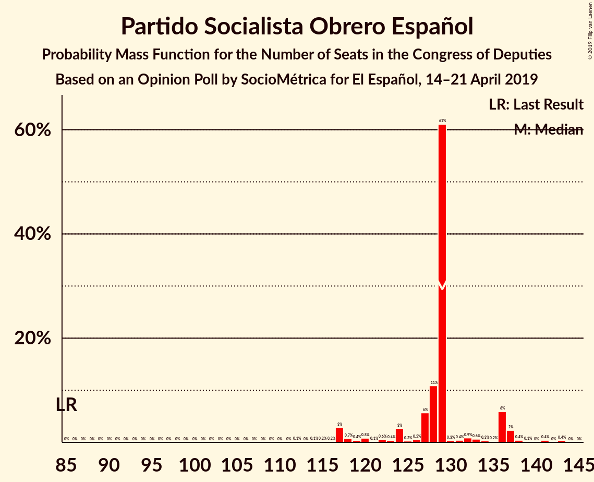
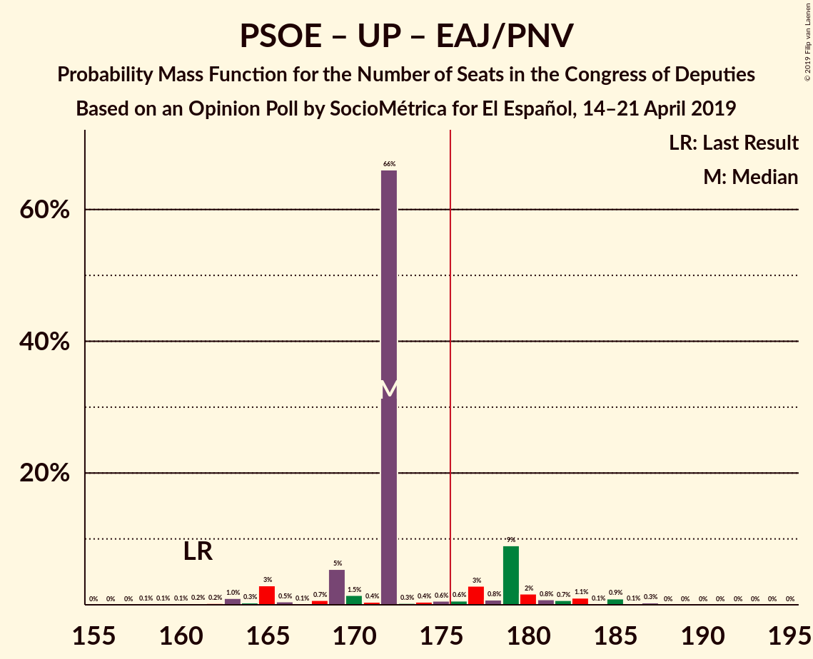
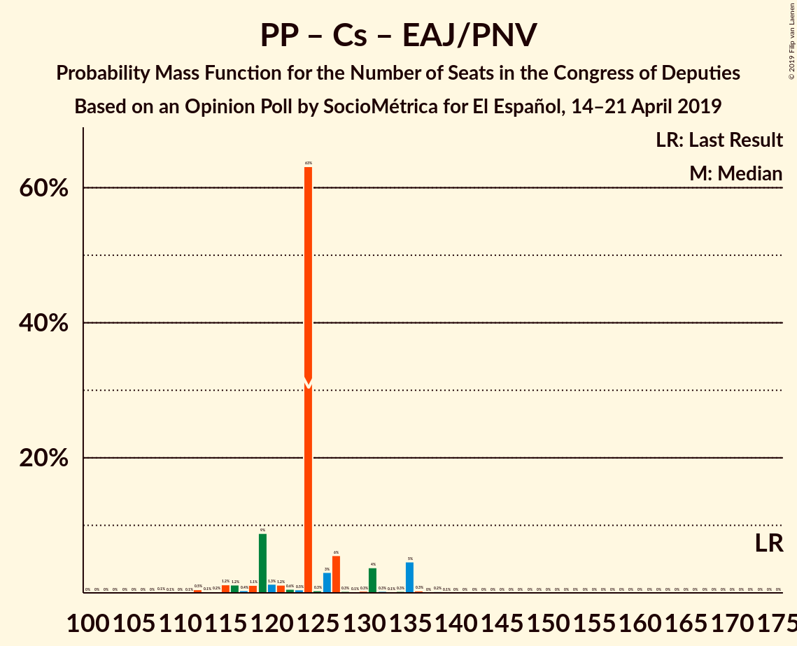

# Opinion Poll by SocioMétrica for El Español, 14–21 April 2019

<a href="#voting-intentions">Voting Intentions</a> | <a href="#seats">Seats</a> | <a href="#coalitions">Coalitions</a> | <a href="#technical-information">Technical Information</a>

## Voting Intentions

### Confidence Intervals

| Party | Last Result | Poll Result | 80% Confidence Interval | 90% Confidence Interval | 95% Confidence Interval | 99% Confidence Interval |
|:-----:|:-----------:|:-----------:|:-----------------------:|:-----------------------:|:-----------------------:|:-----------------------:|
| Partido Socialista Obrero Español | 22.6% | 29.5% | 28.1–30.9% |27.8–31.3% |27.4–31.7% |26.8–32.3% |
| Partido Popular | 33.0% | 18.2% | 17.1–19.4% |16.8–19.8% |16.5–20.1% |16.0–20.7% |
| Ciudadanos–Partido de la Ciudadanía | 13.1% | 15.1% | 14.1–16.2% |13.8–16.6% |13.5–16.8% |13.0–17.4% |
| Unidos Podemos | 21.2% | 14.7% | 13.7–15.9% |13.4–16.2% |13.2–16.4% |12.7–17.0% |
| Vox | 0.2% | 12.6% | 11.6–13.7% |11.4–14.0% |11.2–14.2% |10.7–14.8% |
| Esquerra Republicana de Catalunya–Catalunya Sí | 2.7% | 3.3% | 2.8–3.9% |2.7–4.1% |2.5–4.2% |2.3–4.5% |
| Partit Demòcrata Europeu Català | 2.0% | 1.3% | 1.0–1.7% |0.9–1.8% |0.9–1.9% |0.7–2.1% |
| Euzko Alderdi Jeltzalea/Partido Nacionalista Vasco | 1.2% | 1.1% | 0.9–1.5% |0.8–1.6% |0.7–1.7% |0.6–1.9% |
| Partido Animalista Contra el Maltrato Animal | 1.2% | 0.9% | 0.7–1.2% |0.6–1.4% |0.5–1.4% |0.5–1.6% |
| Euskal Herria Bildu | 0.8% | 0.9% | 0.7–1.2% |0.6–1.4% |0.5–1.4% |0.5–1.6% |
| Coalición Canaria–Partido Nacionalista Canario | 0.3% | 0.2% | 0.1–0.5% |0.1–0.5% |0.1–0.6% |0.0–0.7% |

*Note:* The poll result column reflects the actual value used in the calculations. Published results may vary slightly, and in addition be rounded to fewer digits.

## Seats

### Confidence Intervals

| Party | Last Result | Median | 80% Confidence Interval | 90% Confidence Interval | 95% Confidence Interval | 99% Confidence Interval |
|:-----:|:-----------:|:------:|:-----------------------:|:-----------------------:|:-----------------------:|:-----------------------:|
| <a href="#partido-socialista-obrero-español">Partido Socialista Obrero Español</a> | 85 | 129 | 127–129 |121–129 |117–136 |117–137 |
| <a href="#partido-popular">Partido Popular</a> | 137 | 68 | 68–71 |68–77 |65–77 |62–78 |
| <a href="#ciudadanos–partido-de-la-ciudadanía">Ciudadanos–Partido de la Ciudadanía</a> | 32 | 50 | 50 |47–52 |45–54 |40–57 |
| <a href="#unidos-podemos">Unidos Podemos</a> | 71 | 37 | 36–38 |36–41 |36–42 |35–46 |
| <a href="#vox">Vox</a> | 0 | 37 | 33–37 |32–37 |31–37 |27–44 |
| <a href="#esquerra-republicana-de-catalunya–catalunya-sí">Esquerra Republicana de Catalunya–Catalunya Sí</a> | 9 | 15 | 14–15 |14–15 |13–15 |11–17 |
| <a href="#partit-demòcrata-europeu-català">Partit Demòcrata Europeu Català</a> | 8 | 5 | 5–6 |4–6 |4–7 |3–8 |
| <a href="#euzko-alderdi-jeltzalea/partido-nacionalista-vasco">Euzko Alderdi Jeltzalea/Partido Nacionalista Vasco</a> | 5 | 6 | 6–7 |6–8 |6–8 |3–8 |
| <a href="#partido-animalista-contra-el-maltrato-animal">Partido Animalista Contra el Maltrato Animal</a> | 0 | 0 | 0 |0 |0 |0 |
| <a href="#euskal-herria-bildu">Euskal Herria Bildu</a> | 2 | 3 | 3–4 |1–5 |1–5 |1–6 |
| <a href="#coalición-canaria–partido-nacionalista-canario">Coalición Canaria–Partido Nacionalista Canario</a> | 1 | 0 | 0–1 |0–1 |0–1 |0–2 |

### Partido Socialista Obrero Español

*For a full overview of the results for this party, see the [Partido Socialista Obrero Español](party-partidosocialistaobreroespañol.html) page.*

| Number of Seats | Probability | Accumulated | Special Marks |
|:---------------:|:-----------:|:-----------:|:-------------:|
| 85 | 0% | 100% | Last Result |
| 86 | 0% | 100% |  |
| 87 | 0% | 100% |  |
| 88 | 0% | 100% |  |
| 89 | 0% | 100% |  |
| 90 | 0% | 100% |  |
| 91 | 0% | 100% |  |
| 92 | 0% | 100% |  |
| 93 | 0% | 100% |  |
| 94 | 0% | 100% |  |
| 95 | 0% | 100% |  |
| 96 | 0% | 100% |  |
| 97 | 0% | 100% |  |
| 98 | 0% | 100% |  |
| 99 | 0% | 100% |  |
| 100 | 0% | 100% |  |
| 101 | 0% | 100% |  |
| 102 | 0% | 100% |  |
| 103 | 0% | 100% |  |
| 104 | 0% | 100% |  |
| 105 | 0% | 100% |  |
| 106 | 0% | 100% |  |
| 107 | 0% | 100% |  |
| 108 | 0% | 100% |  |
| 109 | 0% | 100% |  |
| 110 | 0% | 100% |  |
| 111 | 0% | 100% |  |
| 112 | 0% | 100% |  |
| 113 | 0% | 100% |  |
| 114 | 0.1% | 100% |  |
| 115 | 0.1% | 99.9% |  |
| 116 | 0.2% | 99.8% |  |
| 117 | 3% | 99.6% |  |
| 118 | 0.4% | 96% |  |
| 119 | 0.3% | 96% |  |
| 120 | 0.4% | 95% |  |
| 121 | 0.1% | 95% |  |
| 122 | 0.1% | 95% |  |
| 123 | 0.2% | 95% |  |
| 124 | 0.3% | 95% |  |
| 125 | 0.2% | 94% |  |
| 126 | 0.4% | 94% |  |
| 127 | 7% | 94% |  |
| 128 | 6% | 87% |  |
| 129 | 76% | 81% | Median |
| 130 | 0.3% | 5% |  |
| 131 | 0.3% | 4% |  |
| 132 | 0.8% | 4% |  |
| 133 | 0.6% | 3% |  |
| 134 | 0.2% | 3% |  |
| 135 | 0.1% | 3% |  |
| 136 | 0.6% | 3% |  |
| 137 | 1.5% | 2% |  |
| 138 | 0.3% | 0.5% |  |
| 139 | 0.1% | 0.2% |  |
| 140 | 0% | 0.1% |  |
| 141 | 0% | 0.1% |  |
| 142 | 0% | 0.1% |  |
| 143 | 0.1% | 0.1% |  |
| 144 | 0% | 0% |  |

### Partido Popular

*For a full overview of the results for this party, see the [Partido Popular](party-partidopopular.html) page.*

| Number of Seats | Probability | Accumulated | Special Marks |
|:---------------:|:-----------:|:-----------:|:-------------:|
| 57 | 0% | 100% |  |
| 58 | 0.1% | 99.9% |  |
| 59 | 0% | 99.9% |  |
| 60 | 0.2% | 99.9% |  |
| 61 | 0.1% | 99.7% |  |
| 62 | 0.1% | 99.6% |  |
| 63 | 0.5% | 99.5% |  |
| 64 | 0.2% | 99.0% |  |
| 65 | 2% | 98.8% |  |
| 66 | 0.9% | 97% |  |
| 67 | 0.4% | 96% |  |
| 68 | 77% | 96% | Median |
| 69 | 0.3% | 19% |  |
| 70 | 4% | 19% |  |
| 71 | 6% | 15% |  |
| 72 | 0.1% | 9% |  |
| 73 | 0.8% | 9% |  |
| 74 | 0.2% | 8% |  |
| 75 | 0.6% | 8% |  |
| 76 | 0.9% | 7% |  |
| 77 | 5% | 6% |  |
| 78 | 0% | 0.5% |  |
| 79 | 0.2% | 0.5% |  |
| 80 | 0% | 0.3% |  |
| 81 | 0.2% | 0.3% |  |
| 82 | 0% | 0.1% |  |
| 83 | 0.1% | 0.1% |  |
| 84 | 0% | 0% |  |
| 85 | 0% | 0% |  |
| 86 | 0% | 0% |  |
| 87 | 0% | 0% |  |
| 88 | 0% | 0% |  |
| 89 | 0% | 0% |  |
| 90 | 0% | 0% |  |
| 91 | 0% | 0% |  |
| 92 | 0% | 0% |  |
| 93 | 0% | 0% |  |
| 94 | 0% | 0% |  |
| 95 | 0% | 0% |  |
| 96 | 0% | 0% |  |
| 97 | 0% | 0% |  |
| 98 | 0% | 0% |  |
| 99 | 0% | 0% |  |
| 100 | 0% | 0% |  |
| 101 | 0% | 0% |  |
| 102 | 0% | 0% |  |
| 103 | 0% | 0% |  |
| 104 | 0% | 0% |  |
| 105 | 0% | 0% |  |
| 106 | 0% | 0% |  |
| 107 | 0% | 0% |  |
| 108 | 0% | 0% |  |
| 109 | 0% | 0% |  |
| 110 | 0% | 0% |  |
| 111 | 0% | 0% |  |
| 112 | 0% | 0% |  |
| 113 | 0% | 0% |  |
| 114 | 0% | 0% |  |
| 115 | 0% | 0% |  |
| 116 | 0% | 0% |  |
| 117 | 0% | 0% |  |
| 118 | 0% | 0% |  |
| 119 | 0% | 0% |  |
| 120 | 0% | 0% |  |
| 121 | 0% | 0% |  |
| 122 | 0% | 0% |  |
| 123 | 0% | 0% |  |
| 124 | 0% | 0% |  |
| 125 | 0% | 0% |  |
| 126 | 0% | 0% |  |
| 127 | 0% | 0% |  |
| 128 | 0% | 0% |  |
| 129 | 0% | 0% |  |
| 130 | 0% | 0% |  |
| 131 | 0% | 0% |  |
| 132 | 0% | 0% |  |
| 133 | 0% | 0% |  |
| 134 | 0% | 0% |  |
| 135 | 0% | 0% |  |
| 136 | 0% | 0% |  |
| 137 | 0% | 0% | Last Result |

### Ciudadanos–Partido de la Ciudadanía

*For a full overview of the results for this party, see the [Ciudadanos–Partido de la Ciudadanía](party-ciudadanos–partidodelaciudadanía.html) page.*

| Number of Seats | Probability | Accumulated | Special Marks |
|:---------------:|:-----------:|:-----------:|:-------------:|
| 32 | 0% | 100% | Last Result |
| 33 | 0% | 100% |  |
| 34 | 0% | 100% |  |
| 35 | 0% | 100% |  |
| 36 | 0% | 100% |  |
| 37 | 0.1% | 99.9% |  |
| 38 | 0.1% | 99.9% |  |
| 39 | 0.2% | 99.8% |  |
| 40 | 0.2% | 99.6% |  |
| 41 | 0.1% | 99.4% |  |
| 42 | 0.4% | 99.3% |  |
| 43 | 0.1% | 98.9% |  |
| 44 | 0.9% | 98.8% |  |
| 45 | 0.7% | 98% |  |
| 46 | 2% | 97% |  |
| 47 | 0.7% | 96% |  |
| 48 | 0.9% | 95% |  |
| 49 | 0.6% | 94% |  |
| 50 | 88% | 93% | Median |
| 51 | 0.6% | 6% |  |
| 52 | 0.4% | 5% |  |
| 53 | 0.2% | 5% |  |
| 54 | 4% | 5% |  |
| 55 | 0.2% | 0.9% |  |
| 56 | 0.1% | 0.8% |  |
| 57 | 0.4% | 0.6% |  |
| 58 | 0% | 0.2% |  |
| 59 | 0% | 0.2% |  |
| 60 | 0.1% | 0.2% |  |
| 61 | 0% | 0.1% |  |
| 62 | 0% | 0.1% |  |
| 63 | 0% | 0.1% |  |
| 64 | 0% | 0% |  |

### Unidos Podemos

*For a full overview of the results for this party, see the [Unidos Podemos](party-unidospodemos.html) page.*

| Number of Seats | Probability | Accumulated | Special Marks |
|:---------------:|:-----------:|:-----------:|:-------------:|
| 31 | 0.1% | 100% |  |
| 32 | 0% | 99.9% |  |
| 33 | 0.2% | 99.8% |  |
| 34 | 0.1% | 99.7% |  |
| 35 | 0.1% | 99.6% |  |
| 36 | 12% | 99.4% |  |
| 37 | 77% | 87% | Median |
| 38 | 1.2% | 10% |  |
| 39 | 0.8% | 9% |  |
| 40 | 0.7% | 8% |  |
| 41 | 4% | 8% |  |
| 42 | 1.2% | 3% |  |
| 43 | 0.4% | 2% |  |
| 44 | 0.9% | 2% |  |
| 45 | 0.3% | 0.8% |  |
| 46 | 0.2% | 0.5% |  |
| 47 | 0.1% | 0.3% |  |
| 48 | 0.1% | 0.2% |  |
| 49 | 0% | 0.2% |  |
| 50 | 0% | 0.1% |  |
| 51 | 0% | 0.1% |  |
| 52 | 0% | 0.1% |  |
| 53 | 0% | 0.1% |  |
| 54 | 0% | 0% |  |
| 55 | 0% | 0% |  |
| 56 | 0% | 0% |  |
| 57 | 0% | 0% |  |
| 58 | 0% | 0% |  |
| 59 | 0% | 0% |  |
| 60 | 0% | 0% |  |
| 61 | 0% | 0% |  |
| 62 | 0% | 0% |  |
| 63 | 0% | 0% |  |
| 64 | 0% | 0% |  |
| 65 | 0% | 0% |  |
| 66 | 0% | 0% |  |
| 67 | 0% | 0% |  |
| 68 | 0% | 0% |  |
| 69 | 0% | 0% |  |
| 70 | 0% | 0% |  |
| 71 | 0% | 0% | Last Result |

### Vox

*For a full overview of the results for this party, see the [Vox](party-vox.html) page.*

| Number of Seats | Probability | Accumulated | Special Marks |
|:---------------:|:-----------:|:-----------:|:-------------:|
| 0 | 0% | 100% | Last Result |
| 1 | 0% | 100% |  |
| 2 | 0% | 100% |  |
| 3 | 0% | 100% |  |
| 4 | 0% | 100% |  |
| 5 | 0% | 100% |  |
| 6 | 0% | 100% |  |
| 7 | 0% | 100% |  |
| 8 | 0% | 100% |  |
| 9 | 0% | 100% |  |
| 10 | 0% | 100% |  |
| 11 | 0% | 100% |  |
| 12 | 0% | 100% |  |
| 13 | 0% | 100% |  |
| 14 | 0% | 100% |  |
| 15 | 0% | 100% |  |
| 16 | 0% | 100% |  |
| 17 | 0% | 100% |  |
| 18 | 0% | 100% |  |
| 19 | 0% | 100% |  |
| 20 | 0% | 100% |  |
| 21 | 0% | 100% |  |
| 22 | 0% | 100% |  |
| 23 | 0% | 100% |  |
| 24 | 0% | 100% |  |
| 25 | 0% | 100% |  |
| 26 | 0% | 100% |  |
| 27 | 0.5% | 99.9% |  |
| 28 | 0.5% | 99.4% |  |
| 29 | 0.9% | 98.9% |  |
| 30 | 0.3% | 98% |  |
| 31 | 1.0% | 98% |  |
| 32 | 6% | 97% |  |
| 33 | 7% | 91% |  |
| 34 | 0.8% | 84% |  |
| 35 | 1.3% | 83% |  |
| 36 | 4% | 82% |  |
| 37 | 76% | 78% | Median |
| 38 | 0.6% | 2% |  |
| 39 | 0.2% | 2% |  |
| 40 | 0.2% | 2% |  |
| 41 | 0.3% | 1.4% |  |
| 42 | 0.3% | 1.1% |  |
| 43 | 0.3% | 0.9% |  |
| 44 | 0.5% | 0.6% |  |
| 45 | 0% | 0.1% |  |
| 46 | 0% | 0.1% |  |
| 47 | 0% | 0% |  |

### Esquerra Republicana de Catalunya–Catalunya Sí

*For a full overview of the results for this party, see the [Esquerra Republicana de Catalunya–Catalunya Sí](party-esquerrarepublicanadecatalunya–catalunyasí.html) page.*

| Number of Seats | Probability | Accumulated | Special Marks |
|:---------------:|:-----------:|:-----------:|:-------------:|
| 9 | 0.1% | 100% | Last Result |
| 10 | 0.2% | 99.9% |  |
| 11 | 0.2% | 99.7% |  |
| 12 | 1.1% | 99.5% |  |
| 13 | 0.8% | 98% |  |
| 14 | 11% | 97% |  |
| 15 | 85% | 86% | Median |
| 16 | 0.7% | 1.5% |  |
| 17 | 0.5% | 0.8% |  |
| 18 | 0.2% | 0.3% |  |
| 19 | 0% | 0% |  |

### Partit Demòcrata Europeu Català

*For a full overview of the results for this party, see the [Partit Demòcrata Europeu Català](party-partitdemòcrataeuropeucatalà.html) page.*

| Number of Seats | Probability | Accumulated | Special Marks |
|:---------------:|:-----------:|:-----------:|:-------------:|
| 1 | 0.3% | 100% |  |
| 2 | 0% | 99.7% |  |
| 3 | 1.0% | 99.7% |  |
| 4 | 8% | 98.7% |  |
| 5 | 77% | 91% | Median |
| 6 | 12% | 14% |  |
| 7 | 0.5% | 3% |  |
| 8 | 2% | 2% | Last Result |
| 9 | 0.3% | 0.3% |  |
| 10 | 0% | 0% |  |

### Euzko Alderdi Jeltzalea/Partido Nacionalista Vasco

*For a full overview of the results for this party, see the [Euzko Alderdi Jeltzalea/Partido Nacionalista Vasco](party-euzkoalderdijeltzaleapartidonacionalistavasco.html) page.*

| Number of Seats | Probability | Accumulated | Special Marks |
|:---------------:|:-----------:|:-----------:|:-------------:|
| 2 | 0.1% | 100% |  |
| 3 | 1.0% | 99.9% |  |
| 4 | 0.5% | 98.9% |  |
| 5 | 0.3% | 98% | Last Result |
| 6 | 88% | 98% | Median |
| 7 | 5% | 10% |  |
| 8 | 6% | 6% |  |
| 9 | 0.1% | 0.2% |  |
| 10 | 0% | 0% |  |

### Partido Animalista Contra el Maltrato Animal

*For a full overview of the results for this party, see the [Partido Animalista Contra el Maltrato Animal](party-partidoanimalistacontraelmaltratoanimal.html) page.*

| Number of Seats | Probability | Accumulated | Special Marks |
|:---------------:|:-----------:|:-----------:|:-------------:|
| 0 | 100% | 100% | Last Result, Median |

### Euskal Herria Bildu

*For a full overview of the results for this party, see the [Euskal Herria Bildu](party-euskalherriabildu.html) page.*

| Number of Seats | Probability | Accumulated | Special Marks |
|:---------------:|:-----------:|:-----------:|:-------------:|
| 1 | 6% | 100% |  |
| 2 | 3% | 94% | Last Result |
| 3 | 76% | 91% | Median |
| 4 | 5% | 14% |  |
| 5 | 8% | 9% |  |
| 6 | 1.5% | 2% |  |
| 7 | 0.3% | 0.3% |  |
| 8 | 0% | 0% |  |

### Coalición Canaria–Partido Nacionalista Canario

*For a full overview of the results for this party, see the [Coalición Canaria–Partido Nacionalista Canario](party-coalicióncanaria–partidonacionalistacanario.html) page.*

| Number of Seats | Probability | Accumulated | Special Marks |
|:---------------:|:-----------:|:-----------:|:-------------:|
| 0 | 86% | 100% | Median |
| 1 | 14% | 14% | Last Result |
| 2 | 0.7% | 0.7% |  |
| 3 | 0% | 0% |  |

## Coalitions

### Confidence Intervals

| Coalition | Last Result | Median | Majority? | 80% Confidence Interval | 90% Confidence Interval | 95% Confidence Interval | 99% Confidence Interval |
|:---------:|:-----------:|:------:|:---------:|:-----------------------:|:-----------------------:|:-----------------------:|:-----------------------:|
| Partido Socialista Obrero Español – Partido Popular – Ciudadanos–Partido de la Ciudadanía | 254 | 247 | 100% | 247–248 | 241–255 | 241–255 | 236–256 |
| Partido Socialista Obrero Español – Ciudadanos–Partido de la Ciudadanía – Unidos Podemos | 188 | 216 | 100% | 213–216 | 212–217 | 211–221 | 204–229 |
| Partido Socialista Obrero Español – Partido Popular | 222 | 197 | 100% | 197–199 | 193–205 | 187–205 | 186–207 |
| Partido Socialista Obrero Español – Unidos Podemos – Esquerra Republicana de Catalunya–Catalunya Sí – Partit Demòcrata Europeu Català – Euzko Alderdi Jeltzalea/Partido Nacionalista Vasco – Euskal Herria Bildu | 180 | 195 | 100% | 191–195 | 190–199 | 189–204 | 185–206 |
| Partido Socialista Obrero Español – Unidos Podemos – Esquerra Republicana de Catalunya–Catalunya Sí – Partit Demòcrata Europeu Català | 173 | 186 | 99.7% | 182–186 | 180–190 | 178–194 | 177–197 |
| Partido Socialista Obrero Español – Unidos Podemos – Esquerra Republicana de Catalunya–Catalunya Sí – Euskal Herria Bildu | 167 | 184 | 99.2% | 179–184 | 179–188 | 176–191 | 175–196 |
| Partido Socialista Obrero Español – Unidos Podemos – Euzko Alderdi Jeltzalea/Partido Nacionalista Vasco – Euskal Herria Bildu | 163 | 175 | 7% | 173–175 | 170–179 | 169–183 | 166–187 |
| Partido Socialista Obrero Español – Ciudadanos–Partido de la Ciudadanía | 117 | 179 | 93% | 177–179 | 171–179 | 171–181 | 163–191 |
| Partido Socialista Obrero Español – Unidos Podemos – Euzko Alderdi Jeltzalea/Partido Nacionalista Vasco | 161 | 172 | 5% | 169–172 | 166–175 | 165–180 | 163–185 |
| Partido Socialista Obrero Español – Unidos Podemos | 156 | 166 | 2% | 163–166 | 161–169 | 158–174 | 157–179 |
| Partido Popular – Ciudadanos–Partido de la Ciudadanía – Vox | 169 | 155 | 0% | 154–159 | 150–159 | 145–160 | 144–164 |
| Partido Socialista Obrero Español | 85 | 129 | 0% | 127–129 | 121–129 | 117–136 | 117–137 |
| Partido Popular – Ciudadanos–Partido de la Ciudadanía – Euzko Alderdi Jeltzalea/Partido Nacionalista Vasco | 174 | 124 | 0% | 124–130 | 123–135 | 118–135 | 115–136 |
| Partido Popular – Ciudadanos–Partido de la Ciudadanía – Coalición Canaria–Partido Nacionalista Canario | 170 | 118 | 0% | 118–125 | 117–127 | 113–127 | 110–131 |
| Partido Popular – Ciudadanos–Partido de la Ciudadanía | 169 | 118 | 0% | 118–124 | 117–127 | 113–127 | 109–130 |
| Partido Popular – Vox | 137 | 105 | 0% | 104–106 | 102–109 | 99–109 | 92–115 |
| Partido Popular | 137 | 68 | 0% | 68–71 | 68–77 | 65–77 | 62–78 |

### Partido Socialista Obrero Español – Partido Popular – Ciudadanos–Partido de la Ciudadanía

| Number of Seats | Probability | Accumulated | Special Marks |
|:---------------:|:-----------:|:-----------:|:-------------:|
| 231 | 0% | 100% |  |
| 232 | 0% | 99.9% |  |
| 233 | 0.1% | 99.9% |  |
| 234 | 0.1% | 99.8% |  |
| 235 | 0% | 99.7% |  |
| 236 | 0.5% | 99.7% |  |
| 237 | 0.4% | 99.2% |  |
| 238 | 0.2% | 98.8% |  |
| 239 | 0.3% | 98.6% |  |
| 240 | 0.1% | 98% |  |
| 241 | 3% | 98% |  |
| 242 | 0.3% | 95% |  |
| 243 | 0.2% | 94% |  |
| 244 | 0.3% | 94% |  |
| 245 | 0.7% | 94% |  |
| 246 | 2% | 93% |  |
| 247 | 77% | 91% | Median |
| 248 | 6% | 15% |  |
| 249 | 0.4% | 9% |  |
| 250 | 0.7% | 8% |  |
| 251 | 0.4% | 8% |  |
| 252 | 0.5% | 7% |  |
| 253 | 0.4% | 7% |  |
| 254 | 0.2% | 6% | Last Result |
| 255 | 5% | 6% |  |
| 256 | 0.6% | 0.7% |  |
| 257 | 0% | 0.1% |  |
| 258 | 0% | 0.1% |  |
| 259 | 0% | 0.1% |  |
| 260 | 0% | 0.1% |  |
| 261 | 0% | 0% |  |

### Partido Socialista Obrero Español – Ciudadanos–Partido de la Ciudadanía – Unidos Podemos

| Number of Seats | Probability | Accumulated | Special Marks |
|:---------------:|:-----------:|:-----------:|:-------------:|
| 188 | 0% | 100% | Last Result |
| 189 | 0% | 100% |  |
| 190 | 0% | 100% |  |
| 191 | 0% | 100% |  |
| 192 | 0% | 100% |  |
| 193 | 0% | 100% |  |
| 194 | 0% | 100% |  |
| 195 | 0% | 100% |  |
| 196 | 0% | 100% |  |
| 197 | 0% | 100% |  |
| 198 | 0% | 100% |  |
| 199 | 0% | 100% |  |
| 200 | 0% | 100% |  |
| 201 | 0% | 100% |  |
| 202 | 0% | 99.9% |  |
| 203 | 0.1% | 99.9% |  |
| 204 | 0.6% | 99.9% |  |
| 205 | 0.3% | 99.2% |  |
| 206 | 0.2% | 98.9% |  |
| 207 | 0.2% | 98.7% |  |
| 208 | 0.2% | 98.6% |  |
| 209 | 0.1% | 98% |  |
| 210 | 0.1% | 98% |  |
| 211 | 0.7% | 98% |  |
| 212 | 3% | 97% |  |
| 213 | 6% | 94% |  |
| 214 | 6% | 88% |  |
| 215 | 0.2% | 82% |  |
| 216 | 76% | 82% | Median |
| 217 | 0.9% | 6% |  |
| 218 | 0.7% | 5% |  |
| 219 | 0.1% | 4% |  |
| 220 | 1.2% | 4% |  |
| 221 | 0.6% | 3% |  |
| 222 | 0.6% | 2% |  |
| 223 | 0.8% | 2% |  |
| 224 | 0.1% | 1.0% |  |
| 225 | 0.1% | 0.9% |  |
| 226 | 0% | 0.8% |  |
| 227 | 0.1% | 0.7% |  |
| 228 | 0% | 0.6% |  |
| 229 | 0.4% | 0.6% |  |
| 230 | 0.1% | 0.2% |  |
| 231 | 0% | 0.1% |  |
| 232 | 0% | 0.1% |  |
| 233 | 0% | 0.1% |  |
| 234 | 0% | 0.1% |  |
| 235 | 0% | 0.1% |  |
| 236 | 0% | 0% |  |

### Partido Socialista Obrero Español – Partido Popular

| Number of Seats | Probability | Accumulated | Special Marks |
|:---------------:|:-----------:|:-----------:|:-------------:|
| 182 | 0% | 100% |  |
| 183 | 0.1% | 99.9% |  |
| 184 | 0% | 99.9% |  |
| 185 | 0.2% | 99.8% |  |
| 186 | 0.2% | 99.6% |  |
| 187 | 3% | 99.4% |  |
| 188 | 0.1% | 96% |  |
| 189 | 0.1% | 96% |  |
| 190 | 0.1% | 96% |  |
| 191 | 0.7% | 96% |  |
| 192 | 0.2% | 95% |  |
| 193 | 0.3% | 95% |  |
| 194 | 0.5% | 95% |  |
| 195 | 0.7% | 94% |  |
| 196 | 0.4% | 94% |  |
| 197 | 76% | 93% | Median |
| 198 | 6% | 17% |  |
| 199 | 0.5% | 10% |  |
| 200 | 0.6% | 10% |  |
| 201 | 0.7% | 9% |  |
| 202 | 0.8% | 9% |  |
| 203 | 0.3% | 8% |  |
| 204 | 0.8% | 8% |  |
| 205 | 6% | 7% |  |
| 206 | 0.3% | 0.8% |  |
| 207 | 0.4% | 0.6% |  |
| 208 | 0.1% | 0.2% |  |
| 209 | 0% | 0.1% |  |
| 210 | 0.1% | 0.1% |  |
| 211 | 0% | 0.1% |  |
| 212 | 0% | 0.1% |  |
| 213 | 0% | 0% |  |
| 214 | 0% | 0% |  |
| 215 | 0% | 0% |  |
| 216 | 0% | 0% |  |
| 217 | 0% | 0% |  |
| 218 | 0% | 0% |  |
| 219 | 0% | 0% |  |
| 220 | 0% | 0% |  |
| 221 | 0% | 0% |  |
| 222 | 0% | 0% | Last Result |

### Partido Socialista Obrero Español – Unidos Podemos – Esquerra Republicana de Catalunya–Catalunya Sí – Partit Demòcrata Europeu Català – Euzko Alderdi Jeltzalea/Partido Nacionalista Vasco – Euskal Herria Bildu

| Number of Seats | Probability | Accumulated | Special Marks |
|:---------------:|:-----------:|:-----------:|:-------------:|
| 180 | 0% | 100% | Last Result |
| 181 | 0% | 99.9% |  |
| 182 | 0.1% | 99.9% |  |
| 183 | 0.1% | 99.9% |  |
| 184 | 0.1% | 99.8% |  |
| 185 | 0.3% | 99.8% |  |
| 186 | 0% | 99.4% |  |
| 187 | 0.2% | 99.4% |  |
| 188 | 0.6% | 99.2% |  |
| 189 | 3% | 98.5% |  |
| 190 | 0.6% | 95% |  |
| 191 | 5% | 95% |  |
| 192 | 0.2% | 89% |  |
| 193 | 0.2% | 89% |  |
| 194 | 0.2% | 89% |  |
| 195 | 82% | 89% | Median |
| 196 | 0.2% | 7% |  |
| 197 | 0.4% | 7% |  |
| 198 | 0.9% | 6% |  |
| 199 | 0.3% | 5% |  |
| 200 | 0.6% | 5% |  |
| 201 | 0.9% | 4% |  |
| 202 | 0.6% | 3% |  |
| 203 | 0.1% | 3% |  |
| 204 | 1.1% | 3% |  |
| 205 | 1.1% | 2% |  |
| 206 | 0.2% | 0.6% |  |
| 207 | 0.1% | 0.4% |  |
| 208 | 0.1% | 0.3% |  |
| 209 | 0% | 0.2% |  |
| 210 | 0% | 0.1% |  |
| 211 | 0% | 0.1% |  |
| 212 | 0% | 0.1% |  |
| 213 | 0% | 0.1% |  |
| 214 | 0% | 0.1% |  |
| 215 | 0% | 0% |  |

### Partido Socialista Obrero Español – Unidos Podemos – Esquerra Republicana de Catalunya–Catalunya Sí – Partit Demòcrata Europeu Català

| Number of Seats | Probability | Accumulated | Special Marks |
|:---------------:|:-----------:|:-----------:|:-------------:|
| 171 | 0% | 100% |  |
| 172 | 0.1% | 99.9% |  |
| 173 | 0.1% | 99.9% | Last Result |
| 174 | 0.1% | 99.8% |  |
| 175 | 0% | 99.7% |  |
| 176 | 0.1% | 99.7% | Majority |
| 177 | 0.3% | 99.5% |  |
| 178 | 3% | 99.3% |  |
| 179 | 0.5% | 96% |  |
| 180 | 0.8% | 96% |  |
| 181 | 0.1% | 95% |  |
| 182 | 6% | 95% |  |
| 183 | 0.3% | 89% |  |
| 184 | 6% | 89% |  |
| 185 | 0.1% | 83% |  |
| 186 | 76% | 83% | Median |
| 187 | 0.1% | 6% |  |
| 188 | 0.2% | 6% |  |
| 189 | 0.8% | 6% |  |
| 190 | 1.1% | 5% |  |
| 191 | 0.7% | 4% |  |
| 192 | 0.4% | 3% |  |
| 193 | 0.5% | 3% |  |
| 194 | 0.2% | 3% |  |
| 195 | 0.4% | 2% |  |
| 196 | 0.8% | 2% |  |
| 197 | 0.8% | 1.1% |  |
| 198 | 0.1% | 0.4% |  |
| 199 | 0.1% | 0.2% |  |
| 200 | 0% | 0.2% |  |
| 201 | 0% | 0.1% |  |
| 202 | 0% | 0.1% |  |
| 203 | 0% | 0.1% |  |
| 204 | 0% | 0.1% |  |
| 205 | 0% | 0% |  |

### Partido Socialista Obrero Español – Unidos Podemos – Esquerra Republicana de Catalunya–Catalunya Sí – Euskal Herria Bildu

| Number of Seats | Probability | Accumulated | Special Marks |
|:---------------:|:-----------:|:-----------:|:-------------:|
| 167 | 0% | 100% | Last Result |
| 168 | 0% | 100% |  |
| 169 | 0% | 100% |  |
| 170 | 0% | 99.9% |  |
| 171 | 0.1% | 99.9% |  |
| 172 | 0% | 99.9% |  |
| 173 | 0.3% | 99.8% |  |
| 174 | 0% | 99.6% |  |
| 175 | 0.3% | 99.5% |  |
| 176 | 4% | 99.2% | Majority |
| 177 | 0.3% | 96% |  |
| 178 | 0.3% | 95% |  |
| 179 | 6% | 95% |  |
| 180 | 0.4% | 90% |  |
| 181 | 0.2% | 89% |  |
| 182 | 0.1% | 89% |  |
| 183 | 6% | 89% |  |
| 184 | 76% | 82% | Median |
| 185 | 0.1% | 6% |  |
| 186 | 0.5% | 6% |  |
| 187 | 0.3% | 6% |  |
| 188 | 0.5% | 5% |  |
| 189 | 1.2% | 5% |  |
| 190 | 0.7% | 4% |  |
| 191 | 0.7% | 3% |  |
| 192 | 0.2% | 2% |  |
| 193 | 0.3% | 2% |  |
| 194 | 0% | 2% |  |
| 195 | 1.2% | 2% |  |
| 196 | 0.1% | 0.5% |  |
| 197 | 0.1% | 0.5% |  |
| 198 | 0.1% | 0.3% |  |
| 199 | 0% | 0.3% |  |
| 200 | 0% | 0.2% |  |
| 201 | 0.1% | 0.2% |  |
| 202 | 0% | 0.1% |  |
| 203 | 0% | 0.1% |  |
| 204 | 0% | 0.1% |  |
| 205 | 0% | 0.1% |  |
| 206 | 0% | 0% |  |

### Partido Socialista Obrero Español – Unidos Podemos – Euzko Alderdi Jeltzalea/Partido Nacionalista Vasco – Euskal Herria Bildu

| Number of Seats | Probability | Accumulated | Special Marks |
|:---------------:|:-----------:|:-----------:|:-------------:|
| 161 | 0.1% | 100% |  |
| 162 | 0% | 99.9% |  |
| 163 | 0.1% | 99.9% | Last Result |
| 164 | 0.1% | 99.8% |  |
| 165 | 0.2% | 99.7% |  |
| 166 | 0.3% | 99.5% |  |
| 167 | 0.5% | 99.2% |  |
| 168 | 0.1% | 98.7% |  |
| 169 | 3% | 98.6% |  |
| 170 | 0.3% | 95% |  |
| 171 | 0.2% | 95% |  |
| 172 | 0.2% | 95% |  |
| 173 | 6% | 95% |  |
| 174 | 6% | 89% |  |
| 175 | 76% | 83% | Median |
| 176 | 0.2% | 7% | Majority |
| 177 | 0.4% | 6% |  |
| 178 | 0.7% | 6% |  |
| 179 | 0.3% | 5% |  |
| 180 | 0.5% | 5% |  |
| 181 | 0.8% | 5% |  |
| 182 | 0.9% | 4% |  |
| 183 | 0.5% | 3% |  |
| 184 | 0.8% | 2% |  |
| 185 | 0.1% | 2% |  |
| 186 | 0% | 1.4% |  |
| 187 | 1.0% | 1.4% |  |
| 188 | 0.1% | 0.4% |  |
| 189 | 0.1% | 0.3% |  |
| 190 | 0% | 0.2% |  |
| 191 | 0.1% | 0.2% |  |
| 192 | 0% | 0.1% |  |
| 193 | 0% | 0.1% |  |
| 194 | 0% | 0.1% |  |
| 195 | 0% | 0.1% |  |
| 196 | 0% | 0.1% |  |
| 197 | 0% | 0% |  |

### Partido Socialista Obrero Español – Ciudadanos–Partido de la Ciudadanía

| Number of Seats | Probability | Accumulated | Special Marks |
|:---------------:|:-----------:|:-----------:|:-------------:|
| 117 | 0% | 100% | Last Result |
| 118 | 0% | 100% |  |
| 119 | 0% | 100% |  |
| 120 | 0% | 100% |  |
| 121 | 0% | 100% |  |
| 122 | 0% | 100% |  |
| 123 | 0% | 100% |  |
| 124 | 0% | 100% |  |
| 125 | 0% | 100% |  |
| 126 | 0% | 100% |  |
| 127 | 0% | 100% |  |
| 128 | 0% | 100% |  |
| 129 | 0% | 100% |  |
| 130 | 0% | 100% |  |
| 131 | 0% | 100% |  |
| 132 | 0% | 100% |  |
| 133 | 0% | 100% |  |
| 134 | 0% | 100% |  |
| 135 | 0% | 100% |  |
| 136 | 0% | 100% |  |
| 137 | 0% | 100% |  |
| 138 | 0% | 100% |  |
| 139 | 0% | 100% |  |
| 140 | 0% | 100% |  |
| 141 | 0% | 100% |  |
| 142 | 0% | 100% |  |
| 143 | 0% | 100% |  |
| 144 | 0% | 100% |  |
| 145 | 0% | 100% |  |
| 146 | 0% | 100% |  |
| 147 | 0% | 100% |  |
| 148 | 0% | 100% |  |
| 149 | 0% | 100% |  |
| 150 | 0% | 100% |  |
| 151 | 0% | 100% |  |
| 152 | 0% | 100% |  |
| 153 | 0% | 100% |  |
| 154 | 0% | 100% |  |
| 155 | 0% | 100% |  |
| 156 | 0% | 100% |  |
| 157 | 0% | 100% |  |
| 158 | 0% | 100% |  |
| 159 | 0% | 100% |  |
| 160 | 0% | 100% |  |
| 161 | 0.1% | 100% |  |
| 162 | 0% | 99.9% |  |
| 163 | 0.4% | 99.8% |  |
| 164 | 0.1% | 99.4% |  |
| 165 | 0.2% | 99.3% |  |
| 166 | 0.2% | 99.2% |  |
| 167 | 0.5% | 99.0% |  |
| 168 | 0% | 98.5% |  |
| 169 | 0.3% | 98.5% |  |
| 170 | 0.2% | 98% |  |
| 171 | 3% | 98% |  |
| 172 | 0.4% | 95% |  |
| 173 | 0.3% | 94% |  |
| 174 | 0.1% | 94% |  |
| 175 | 0.6% | 94% |  |
| 176 | 0.6% | 93% | Majority |
| 177 | 6% | 93% |  |
| 178 | 6% | 86% |  |
| 179 | 76% | 80% | Median |
| 180 | 0.4% | 4% |  |
| 181 | 1.3% | 3% |  |
| 182 | 0.2% | 2% |  |
| 183 | 0.6% | 2% |  |
| 184 | 0.3% | 1.1% |  |
| 185 | 0.1% | 0.9% |  |
| 186 | 0.1% | 0.8% |  |
| 187 | 0% | 0.7% |  |
| 188 | 0% | 0.6% |  |
| 189 | 0% | 0.6% |  |
| 190 | 0% | 0.6% |  |
| 191 | 0.1% | 0.5% |  |
| 192 | 0.1% | 0.5% |  |
| 193 | 0.4% | 0.4% |  |
| 194 | 0% | 0% |  |

### Partido Socialista Obrero Español – Unidos Podemos – Euzko Alderdi Jeltzalea/Partido Nacionalista Vasco

| Number of Seats | Probability | Accumulated | Special Marks |
|:---------------:|:-----------:|:-----------:|:-------------:|
| 157 | 0% | 100% |  |
| 158 | 0.1% | 99.9% |  |
| 159 | 0.1% | 99.8% |  |
| 160 | 0% | 99.8% |  |
| 161 | 0.1% | 99.8% | Last Result |
| 162 | 0.2% | 99.7% |  |
| 163 | 0.3% | 99.5% |  |
| 164 | 0.3% | 99.2% |  |
| 165 | 4% | 98.8% |  |
| 166 | 0.3% | 95% |  |
| 167 | 0% | 95% |  |
| 168 | 0.6% | 95% |  |
| 169 | 6% | 94% |  |
| 170 | 0.3% | 88% |  |
| 171 | 0% | 88% |  |
| 172 | 82% | 88% | Median |
| 173 | 0.2% | 6% |  |
| 174 | 0.5% | 6% |  |
| 175 | 0.5% | 5% |  |
| 176 | 0.6% | 5% | Majority |
| 177 | 0.3% | 4% |  |
| 178 | 0.9% | 4% |  |
| 179 | 0.4% | 3% |  |
| 180 | 0.4% | 3% |  |
| 181 | 0.5% | 2% |  |
| 182 | 0.1% | 2% |  |
| 183 | 0.6% | 2% |  |
| 184 | 0% | 1.0% |  |
| 185 | 0.8% | 1.0% |  |
| 186 | 0.1% | 0.2% |  |
| 187 | 0% | 0.2% |  |
| 188 | 0% | 0.1% |  |
| 189 | 0% | 0.1% |  |
| 190 | 0% | 0.1% |  |
| 191 | 0% | 0.1% |  |
| 192 | 0% | 0% |  |

### Partido Socialista Obrero Español – Unidos Podemos

| Number of Seats | Probability | Accumulated | Special Marks |
|:---------------:|:-----------:|:-----------:|:-------------:|
| 151 | 0% | 100% |  |
| 152 | 0.1% | 99.9% |  |
| 153 | 0.1% | 99.8% |  |
| 154 | 0% | 99.8% |  |
| 155 | 0.1% | 99.8% |  |
| 156 | 0.1% | 99.6% | Last Result |
| 157 | 0.3% | 99.5% |  |
| 158 | 3% | 99.2% |  |
| 159 | 0.6% | 96% |  |
| 160 | 0.2% | 95% |  |
| 161 | 0.2% | 95% |  |
| 162 | 0.3% | 95% |  |
| 163 | 6% | 95% |  |
| 164 | 6% | 89% |  |
| 165 | 0.4% | 83% |  |
| 166 | 76% | 82% | Median |
| 167 | 0.1% | 6% |  |
| 168 | 0.5% | 6% |  |
| 169 | 1.2% | 6% |  |
| 170 | 0.5% | 5% |  |
| 171 | 0.5% | 4% |  |
| 172 | 0.6% | 4% |  |
| 173 | 0.3% | 3% |  |
| 174 | 0.5% | 3% |  |
| 175 | 0.6% | 2% |  |
| 176 | 0.6% | 2% | Majority |
| 177 | 0% | 1.2% |  |
| 178 | 0% | 1.2% |  |
| 179 | 0.8% | 1.2% |  |
| 180 | 0.1% | 0.3% |  |
| 181 | 0% | 0.2% |  |
| 182 | 0% | 0.2% |  |
| 183 | 0% | 0.2% |  |
| 184 | 0% | 0.1% |  |
| 185 | 0% | 0.1% |  |
| 186 | 0% | 0.1% |  |
| 187 | 0% | 0.1% |  |
| 188 | 0% | 0% |  |

### Partido Popular – Ciudadanos–Partido de la Ciudadanía – Vox

| Number of Seats | Probability | Accumulated | Special Marks |
|:---------------:|:-----------:|:-----------:|:-------------:|
| 135 | 0% | 100% |  |
| 136 | 0% | 99.9% |  |
| 137 | 0% | 99.9% |  |
| 138 | 0% | 99.9% |  |
| 139 | 0% | 99.9% |  |
| 140 | 0.1% | 99.9% |  |
| 141 | 0.1% | 99.8% |  |
| 142 | 0.1% | 99.7% |  |
| 143 | 0.1% | 99.6% |  |
| 144 | 0.9% | 99.5% |  |
| 145 | 1.4% | 98.6% |  |
| 146 | 0.2% | 97% |  |
| 147 | 0.1% | 97% |  |
| 148 | 0.8% | 97% |  |
| 149 | 0.8% | 96% |  |
| 150 | 0.6% | 95% |  |
| 151 | 0.2% | 95% |  |
| 152 | 1.0% | 95% |  |
| 153 | 0.3% | 94% |  |
| 154 | 6% | 93% |  |
| 155 | 76% | 87% | Median |
| 156 | 0.2% | 11% |  |
| 157 | 0.2% | 11% |  |
| 158 | 0.1% | 11% |  |
| 159 | 6% | 11% |  |
| 160 | 3% | 5% |  |
| 161 | 0.2% | 2% |  |
| 162 | 0.8% | 1.4% |  |
| 163 | 0% | 0.6% |  |
| 164 | 0.3% | 0.6% |  |
| 165 | 0.1% | 0.3% |  |
| 166 | 0.1% | 0.2% |  |
| 167 | 0.1% | 0.1% |  |
| 168 | 0% | 0.1% |  |
| 169 | 0% | 0.1% | Last Result |
| 170 | 0% | 0% |  |

### Partido Socialista Obrero Español

| Number of Seats | Probability | Accumulated | Special Marks |
|:---------------:|:-----------:|:-----------:|:-------------:|
| 85 | 0% | 100% | Last Result |
| 86 | 0% | 100% |  |
| 87 | 0% | 100% |  |
| 88 | 0% | 100% |  |
| 89 | 0% | 100% |  |
| 90 | 0% | 100% |  |
| 91 | 0% | 100% |  |
| 92 | 0% | 100% |  |
| 93 | 0% | 100% |  |
| 94 | 0% | 100% |  |
| 95 | 0% | 100% |  |
| 96 | 0% | 100% |  |
| 97 | 0% | 100% |  |
| 98 | 0% | 100% |  |
| 99 | 0% | 100% |  |
| 100 | 0% | 100% |  |
| 101 | 0% | 100% |  |
| 102 | 0% | 100% |  |
| 103 | 0% | 100% |  |
| 104 | 0% | 100% |  |
| 105 | 0% | 100% |  |
| 106 | 0% | 100% |  |
| 107 | 0% | 100% |  |
| 108 | 0% | 100% |  |
| 109 | 0% | 100% |  |
| 110 | 0% | 100% |  |
| 111 | 0% | 100% |  |
| 112 | 0% | 100% |  |
| 113 | 0% | 100% |  |
| 114 | 0.1% | 100% |  |
| 115 | 0.1% | 99.9% |  |
| 116 | 0.2% | 99.8% |  |
| 117 | 3% | 99.6% |  |
| 118 | 0.4% | 96% |  |
| 119 | 0.3% | 96% |  |
| 120 | 0.4% | 95% |  |
| 121 | 0.1% | 95% |  |
| 122 | 0.1% | 95% |  |
| 123 | 0.2% | 95% |  |
| 124 | 0.3% | 95% |  |
| 125 | 0.2% | 94% |  |
| 126 | 0.4% | 94% |  |
| 127 | 7% | 94% |  |
| 128 | 6% | 87% |  |
| 129 | 76% | 81% | Median |
| 130 | 0.3% | 5% |  |
| 131 | 0.3% | 4% |  |
| 132 | 0.8% | 4% |  |
| 133 | 0.6% | 3% |  |
| 134 | 0.2% | 3% |  |
| 135 | 0.1% | 3% |  |
| 136 | 0.6% | 3% |  |
| 137 | 1.5% | 2% |  |
| 138 | 0.3% | 0.5% |  |
| 139 | 0.1% | 0.2% |  |
| 140 | 0% | 0.1% |  |
| 141 | 0% | 0.1% |  |
| 142 | 0% | 0.1% |  |
| 143 | 0.1% | 0.1% |  |
| 144 | 0% | 0% |  |

### Partido Popular – Ciudadanos–Partido de la Ciudadanía – Euzko Alderdi Jeltzalea/Partido Nacionalista Vasco

| Number of Seats | Probability | Accumulated | Special Marks |
|:---------------:|:-----------:|:-----------:|:-------------:|
| 105 | 0% | 100% |  |
| 106 | 0% | 99.9% |  |
| 107 | 0% | 99.9% |  |
| 108 | 0.1% | 99.9% |  |
| 109 | 0% | 99.9% |  |
| 110 | 0% | 99.8% |  |
| 111 | 0% | 99.8% |  |
| 112 | 0% | 99.8% |  |
| 113 | 0.1% | 99.7% |  |
| 114 | 0.2% | 99.7% |  |
| 115 | 0.9% | 99.5% |  |
| 116 | 0.4% | 98.6% |  |
| 117 | 0.2% | 98% |  |
| 118 | 0.7% | 98% |  |
| 119 | 0.3% | 97% |  |
| 120 | 0.9% | 97% |  |
| 121 | 0.6% | 96% |  |
| 122 | 0.5% | 96% |  |
| 123 | 0.3% | 95% |  |
| 124 | 77% | 95% | Median |
| 125 | 0.3% | 18% |  |
| 126 | 0.7% | 18% |  |
| 127 | 6% | 17% |  |
| 128 | 0.1% | 10% |  |
| 129 | 0.1% | 10% |  |
| 130 | 0.2% | 10% |  |
| 131 | 4% | 10% |  |
| 132 | 0.2% | 6% |  |
| 133 | 0.1% | 6% |  |
| 134 | 0.1% | 6% |  |
| 135 | 5% | 6% |  |
| 136 | 0.2% | 0.6% |  |
| 137 | 0% | 0.4% |  |
| 138 | 0.2% | 0.3% |  |
| 139 | 0.1% | 0.1% |  |
| 140 | 0% | 0% |  |
| 141 | 0% | 0% |  |
| 142 | 0% | 0% |  |
| 143 | 0% | 0% |  |
| 144 | 0% | 0% |  |
| 145 | 0% | 0% |  |
| 146 | 0% | 0% |  |
| 147 | 0% | 0% |  |
| 148 | 0% | 0% |  |
| 149 | 0% | 0% |  |
| 150 | 0% | 0% |  |
| 151 | 0% | 0% |  |
| 152 | 0% | 0% |  |
| 153 | 0% | 0% |  |
| 154 | 0% | 0% |  |
| 155 | 0% | 0% |  |
| 156 | 0% | 0% |  |
| 157 | 0% | 0% |  |
| 158 | 0% | 0% |  |
| 159 | 0% | 0% |  |
| 160 | 0% | 0% |  |
| 161 | 0% | 0% |  |
| 162 | 0% | 0% |  |
| 163 | 0% | 0% |  |
| 164 | 0% | 0% |  |
| 165 | 0% | 0% |  |
| 166 | 0% | 0% |  |
| 167 | 0% | 0% |  |
| 168 | 0% | 0% |  |
| 169 | 0% | 0% |  |
| 170 | 0% | 0% |  |
| 171 | 0% | 0% |  |
| 172 | 0% | 0% |  |
| 173 | 0% | 0% |  |
| 174 | 0% | 0% | Last Result |

### Partido Popular – Ciudadanos–Partido de la Ciudadanía – Coalición Canaria–Partido Nacionalista Canario

| Number of Seats | Probability | Accumulated | Special Marks |
|:---------------:|:-----------:|:-----------:|:-------------:|
| 101 | 0% | 100% |  |
| 102 | 0% | 99.9% |  |
| 103 | 0% | 99.9% |  |
| 104 | 0% | 99.9% |  |
| 105 | 0.1% | 99.9% |  |
| 106 | 0% | 99.8% |  |
| 107 | 0% | 99.8% |  |
| 108 | 0% | 99.8% |  |
| 109 | 0% | 99.7% |  |
| 110 | 1.0% | 99.7% |  |
| 111 | 0.2% | 98.7% |  |
| 112 | 0.5% | 98% |  |
| 113 | 0.5% | 98% |  |
| 114 | 0.5% | 97% |  |
| 115 | 1.1% | 97% |  |
| 116 | 0.5% | 96% |  |
| 117 | 0.6% | 95% |  |
| 118 | 77% | 95% | Median |
| 119 | 0.2% | 18% |  |
| 120 | 0.8% | 18% |  |
| 121 | 0.4% | 17% |  |
| 122 | 6% | 17% |  |
| 123 | 0.2% | 11% |  |
| 124 | 0.5% | 11% |  |
| 125 | 3% | 10% |  |
| 126 | 0.2% | 7% |  |
| 127 | 6% | 7% |  |
| 128 | 0% | 0.9% |  |
| 129 | 0.1% | 0.8% |  |
| 130 | 0% | 0.7% |  |
| 131 | 0.3% | 0.7% |  |
| 132 | 0.1% | 0.4% |  |
| 133 | 0.2% | 0.2% |  |
| 134 | 0% | 0.1% |  |
| 135 | 0% | 0% |  |
| 136 | 0% | 0% |  |
| 137 | 0% | 0% |  |
| 138 | 0% | 0% |  |
| 139 | 0% | 0% |  |
| 140 | 0% | 0% |  |
| 141 | 0% | 0% |  |
| 142 | 0% | 0% |  |
| 143 | 0% | 0% |  |
| 144 | 0% | 0% |  |
| 145 | 0% | 0% |  |
| 146 | 0% | 0% |  |
| 147 | 0% | 0% |  |
| 148 | 0% | 0% |  |
| 149 | 0% | 0% |  |
| 150 | 0% | 0% |  |
| 151 | 0% | 0% |  |
| 152 | 0% | 0% |  |
| 153 | 0% | 0% |  |
| 154 | 0% | 0% |  |
| 155 | 0% | 0% |  |
| 156 | 0% | 0% |  |
| 157 | 0% | 0% |  |
| 158 | 0% | 0% |  |
| 159 | 0% | 0% |  |
| 160 | 0% | 0% |  |
| 161 | 0% | 0% |  |
| 162 | 0% | 0% |  |
| 163 | 0% | 0% |  |
| 164 | 0% | 0% |  |
| 165 | 0% | 0% |  |
| 166 | 0% | 0% |  |
| 167 | 0% | 0% |  |
| 168 | 0% | 0% |  |
| 169 | 0% | 0% |  |
| 170 | 0% | 0% | Last Result |

### Partido Popular – Ciudadanos–Partido de la Ciudadanía

| Number of Seats | Probability | Accumulated | Special Marks |
|:---------------:|:-----------:|:-----------:|:-------------:|
| 100 | 0% | 100% |  |
| 101 | 0% | 99.9% |  |
| 102 | 0% | 99.9% |  |
| 103 | 0.1% | 99.9% |  |
| 104 | 0% | 99.8% |  |
| 105 | 0% | 99.8% |  |
| 106 | 0% | 99.8% |  |
| 107 | 0.1% | 99.8% |  |
| 108 | 0% | 99.7% |  |
| 109 | 0.8% | 99.6% |  |
| 110 | 0.5% | 98.9% |  |
| 111 | 0.2% | 98% |  |
| 112 | 0.6% | 98% |  |
| 113 | 0.4% | 98% |  |
| 114 | 1.2% | 97% |  |
| 115 | 0.3% | 96% |  |
| 116 | 0.7% | 96% |  |
| 117 | 0.5% | 95% |  |
| 118 | 77% | 95% | Median |
| 119 | 0.2% | 18% |  |
| 120 | 0.8% | 18% |  |
| 121 | 6% | 17% |  |
| 122 | 0.1% | 11% |  |
| 123 | 0.2% | 11% |  |
| 124 | 4% | 10% |  |
| 125 | 0.2% | 7% |  |
| 126 | 0.2% | 7% |  |
| 127 | 6% | 6% |  |
| 128 | 0.1% | 0.8% |  |
| 129 | 0.1% | 0.8% |  |
| 130 | 0.3% | 0.7% |  |
| 131 | 0.1% | 0.4% |  |
| 132 | 0.3% | 0.3% |  |
| 133 | 0% | 0.1% |  |
| 134 | 0% | 0% |  |
| 135 | 0% | 0% |  |
| 136 | 0% | 0% |  |
| 137 | 0% | 0% |  |
| 138 | 0% | 0% |  |
| 139 | 0% | 0% |  |
| 140 | 0% | 0% |  |
| 141 | 0% | 0% |  |
| 142 | 0% | 0% |  |
| 143 | 0% | 0% |  |
| 144 | 0% | 0% |  |
| 145 | 0% | 0% |  |
| 146 | 0% | 0% |  |
| 147 | 0% | 0% |  |
| 148 | 0% | 0% |  |
| 149 | 0% | 0% |  |
| 150 | 0% | 0% |  |
| 151 | 0% | 0% |  |
| 152 | 0% | 0% |  |
| 153 | 0% | 0% |  |
| 154 | 0% | 0% |  |
| 155 | 0% | 0% |  |
| 156 | 0% | 0% |  |
| 157 | 0% | 0% |  |
| 158 | 0% | 0% |  |
| 159 | 0% | 0% |  |
| 160 | 0% | 0% |  |
| 161 | 0% | 0% |  |
| 162 | 0% | 0% |  |
| 163 | 0% | 0% |  |
| 164 | 0% | 0% |  |
| 165 | 0% | 0% |  |
| 166 | 0% | 0% |  |
| 167 | 0% | 0% |  |
| 168 | 0% | 0% |  |
| 169 | 0% | 0% | Last Result |

### Partido Popular – Vox

| Number of Seats | Probability | Accumulated | Special Marks |
|:---------------:|:-----------:|:-----------:|:-------------:|
| 88 | 0% | 100% |  |
| 89 | 0% | 99.9% |  |
| 90 | 0% | 99.9% |  |
| 91 | 0% | 99.9% |  |
| 92 | 0.4% | 99.9% |  |
| 93 | 0.1% | 99.4% |  |
| 94 | 0.1% | 99.3% |  |
| 95 | 0.1% | 99.3% |  |
| 96 | 0.1% | 99.2% |  |
| 97 | 0.3% | 99.2% |  |
| 98 | 0.3% | 98.9% |  |
| 99 | 1.3% | 98.6% |  |
| 100 | 1.0% | 97% |  |
| 101 | 0.9% | 96% |  |
| 102 | 0.4% | 95% |  |
| 103 | 0.4% | 95% |  |
| 104 | 7% | 95% |  |
| 105 | 76% | 88% | Median |
| 106 | 3% | 12% |  |
| 107 | 0.2% | 9% |  |
| 108 | 0.7% | 8% |  |
| 109 | 6% | 8% |  |
| 110 | 0.5% | 2% |  |
| 111 | 0.2% | 2% |  |
| 112 | 0.1% | 1.4% |  |
| 113 | 0.4% | 1.2% |  |
| 114 | 0.1% | 0.8% |  |
| 115 | 0.2% | 0.7% |  |
| 116 | 0% | 0.5% |  |
| 117 | 0.4% | 0.5% |  |
| 118 | 0% | 0.1% |  |
| 119 | 0% | 0.1% |  |
| 120 | 0% | 0% |  |
| 121 | 0% | 0% |  |
| 122 | 0% | 0% |  |
| 123 | 0% | 0% |  |
| 124 | 0% | 0% |  |
| 125 | 0% | 0% |  |
| 126 | 0% | 0% |  |
| 127 | 0% | 0% |  |
| 128 | 0% | 0% |  |
| 129 | 0% | 0% |  |
| 130 | 0% | 0% |  |
| 131 | 0% | 0% |  |
| 132 | 0% | 0% |  |
| 133 | 0% | 0% |  |
| 134 | 0% | 0% |  |
| 135 | 0% | 0% |  |
| 136 | 0% | 0% |  |
| 137 | 0% | 0% | Last Result |

### Partido Popular

| Number of Seats | Probability | Accumulated | Special Marks |
|:---------------:|:-----------:|:-----------:|:-------------:|
| 57 | 0% | 100% |  |
| 58 | 0.1% | 99.9% |  |
| 59 | 0% | 99.9% |  |
| 60 | 0.2% | 99.9% |  |
| 61 | 0.1% | 99.7% |  |
| 62 | 0.1% | 99.6% |  |
| 63 | 0.5% | 99.5% |  |
| 64 | 0.2% | 99.0% |  |
| 65 | 2% | 98.8% |  |
| 66 | 0.9% | 97% |  |
| 67 | 0.4% | 96% |  |
| 68 | 77% | 96% | Median |
| 69 | 0.3% | 19% |  |
| 70 | 4% | 19% |  |
| 71 | 6% | 15% |  |
| 72 | 0.1% | 9% |  |
| 73 | 0.8% | 9% |  |
| 74 | 0.2% | 8% |  |
| 75 | 0.6% | 8% |  |
| 76 | 0.9% | 7% |  |
| 77 | 5% | 6% |  |
| 78 | 0% | 0.5% |  |
| 79 | 0.2% | 0.5% |  |
| 80 | 0% | 0.3% |  |
| 81 | 0.2% | 0.3% |  |
| 82 | 0% | 0.1% |  |
| 83 | 0.1% | 0.1% |  |
| 84 | 0% | 0% |  |
| 85 | 0% | 0% |  |
| 86 | 0% | 0% |  |
| 87 | 0% | 0% |  |
| 88 | 0% | 0% |  |
| 89 | 0% | 0% |  |
| 90 | 0% | 0% |  |
| 91 | 0% | 0% |  |
| 92 | 0% | 0% |  |
| 93 | 0% | 0% |  |
| 94 | 0% | 0% |  |
| 95 | 0% | 0% |  |
| 96 | 0% | 0% |  |
| 97 | 0% | 0% |  |
| 98 | 0% | 0% |  |
| 99 | 0% | 0% |  |
| 100 | 0% | 0% |  |
| 101 | 0% | 0% |  |
| 102 | 0% | 0% |  |
| 103 | 0% | 0% |  |
| 104 | 0% | 0% |  |
| 105 | 0% | 0% |  |
| 106 | 0% | 0% |  |
| 107 | 0% | 0% |  |
| 108 | 0% | 0% |  |
| 109 | 0% | 0% |  |
| 110 | 0% | 0% |  |
| 111 | 0% | 0% |  |
| 112 | 0% | 0% |  |
| 113 | 0% | 0% |  |
| 114 | 0% | 0% |  |
| 115 | 0% | 0% |  |
| 116 | 0% | 0% |  |
| 117 | 0% | 0% |  |
| 118 | 0% | 0% |  |
| 119 | 0% | 0% |  |
| 120 | 0% | 0% |  |
| 121 | 0% | 0% |  |
| 122 | 0% | 0% |  |
| 123 | 0% | 0% |  |
| 124 | 0% | 0% |  |
| 125 | 0% | 0% |  |
| 126 | 0% | 0% |  |
| 127 | 0% | 0% |  |
| 128 | 0% | 0% |  |
| 129 | 0% | 0% |  |
| 130 | 0% | 0% |  |
| 131 | 0% | 0% |  |
| 132 | 0% | 0% |  |
| 133 | 0% | 0% |  |
| 134 | 0% | 0% |  |
| 135 | 0% | 0% |  |
| 136 | 0% | 0% |  |
| 137 | 0% | 0% | Last Result |

## Technical Information

### Opinion Poll

+ **Polling firm:** SocioMétrica
+ **Commissioner(s):** El Español
+ **Fieldwork period:** 14–21 April 2019

### Calculations

+ **Sample size:** 1800
+ **Simulations done:** 524,288
+ **Error estimate:** 1.13%

