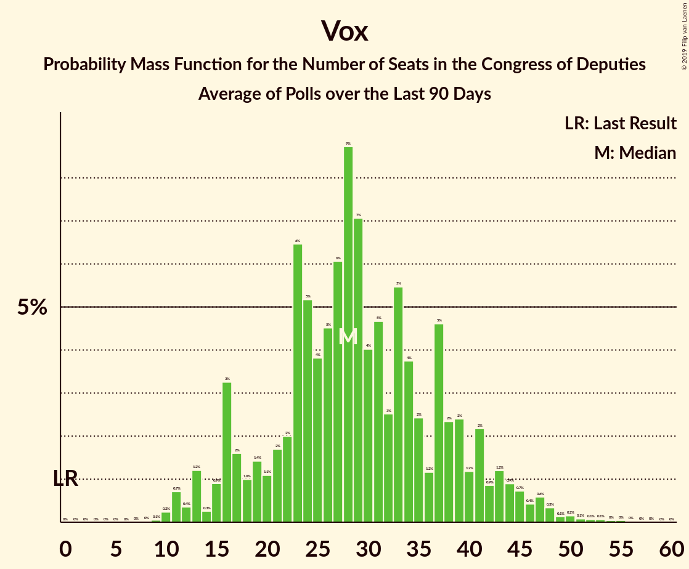

# Poll Average

<a href="#voting-intentions">Voting Intentions</a> | <a href="#seats">Seats</a> | <a href="#coalitions">Coalitions</a> | <a href="#technical-information">Technical Information</a>

## Summary

The table below lists the polls on which the average is based. They are the most recent polls (less than 90 days old) registered and analyzed so far.

| Period     | Polling firm/Commissioner(s) | PP | PSOE | UP | Cs | ERC | PDeCAT | EAJ/PNV | PACMA | EH Bildu | CC | Vox | BNG |
|:----------:|:----------------------------:|:--:|:--:|:--:|:--:|:--:|:--:|:--:|:--:|:--:|:--:|:--:|:--:|
| 26 June 2016 | General Election | 33.0%   137 | 22.6%   85 | 21.2%   71 | 13.1%   32 | 2.7%   9 | 2.0%   8 | 1.2%   5 | 1.2%   0 | 0.8%   2 | 0.3%   1 | 0.2%   0 | 0.2%   0 |
| N/A | Poll Average | 15–25%   60–104 | 24–32%   101–145 | 11–16%   25–47 | 13–19%   36–67 | 2–5%   8–20 | 1–2%   1–10 | 1–2%   3–10 | 1–2%   0–1 | 0–2%   1–7 | 0–1%   0–4 | 6–15%   12–47 | N/A   N/A |
| [22 February–31 March 2019](2019-03-31-electoPanel.html) | electoPanel   electomania.es | 19–21%   75–85 | 27–29%   120–126 | 12–14%   35–40 | 16–17%   53–64 | 2–3%   9–12 | 1–2%   4–6 | 1–2%   6–7 | 1%   0 | 1%   2–5 | 0%   0–1 | 10–11%   23–28 | N/A   N/A |
| [28–30 March 2019](2019-03-30-NCReport.html) | NC Report   La Razón | 19–28%   73–121 | 22–32%   87–137 | 9–16%   18–49 | 13–21%   35–72 | 2–6%   7–22 | 1–3%   1–13 | 1–3%   2–12 | N/A   N/A | 0–2%   0–10 | N/A   N/A | 7–14%   13–43 | N/A   N/A |
| [24–30 March 2019](2019-03-30-IMOP.html) | IMOP   El Confidencial | 20–24%   73–96 | 28–32%   115–140 | 12–16%   32–45 | 12–16%   33–53 | 3–5%   13–20 | 1–2%   1–6 | 1–2%   3–8 | 1–3%   0–1 | 1–2%   2–7 | N/A   N/A | 8–11%   16–29 | N/A   N/A |
| [25–29 March 2019](2019-03-29-SocioMétrica.html) | SocioMétrica   El Español | 17–21%   63–82 | 27–31%   116–139 | 12–15%   27–41 | 14–18%   46–62 | 2–4%   9–16 | 1–2%   3–8 | 1–2%   3–10 | 1–2%   0–1 | 1%   2–7 | 0–1%   0–2 | 10–14%   26–41 | N/A   N/A |
| [25–29 March 2019](2019-03-29-Invymark.html) | Invymark   laSexta | 18–22%   68–94 | 24–28%   96–123 | 11–15%   26–43 | 15–20%   50–68 | N/A   N/A | N/A   N/A | N/A   N/A | N/A   N/A | N/A   N/A | N/A   N/A | 11–15%   27–49 | N/A   N/A |
| [24–27 March 2019](2019-03-27-DemoscopiayServicios.html) | Demoscopia y Servicios   OKDIARIO | 19–23%   72–93 | 25–30%   104–129 | 13–17%   34–49 | 15–19%   48–66 | 1–3%   6–14 | 1–2%   3–9 | 1–2%   4–10 | N/A   N/A | 1–2%   1–7 | N/A   N/A | 10–13%   21–34 | N/A   N/A |
| [21–27 March 2019](2019-03-27-Celeste-Tel.html) | Celeste-Tel   eldiario.es | 21–25%   82–110 | 24–30%   97–129 | 12–16%   29–45 | 15–19%   49–66 | 2–4%   7–15 | 1–3%   4–10 | 1–2%   3–8 | 1–2%   0–1 | 0–1%   1–7 | 0–1%   0–2 | 8–11%   13–27 | N/A   N/A |
| [18–25 March 2019](2019-03-25-Metroscopia.html) | Metroscopia   Henneo | 18–21%   65–83 | 27–30%   115–136 | 13–15%   34–44 | 15–18%   48–61 | N/A   N/A | N/A   N/A | N/A   N/A | N/A   N/A | N/A   N/A | N/A   N/A | 11–13%   26–36 | N/A   N/A |
| [1–22 March 2019](2019-03-22-GAD3.html) | GAD3   ABC | 21–23%   84–95 | 30–32%   131–142 | 11–13%   25–34 | 12–14%   33–43 | 2–3%   10–14 | 1–2%   5–8 | 1%   5–8 | N/A   N/A | 1%   1–4 | 0%   0–1 | 11–12%   27–32 | N/A   N/A |
| [15–20 March 2019](2019-03-20-Sondaxe.html) | Sondaxe   La Voz de Galicia | 17–21%   65–88 | 24–30%   103–131 | 11–16%   28–44 | 12–16%   31–54 | 3–5%   13–21 | 1–3%   3–10 | 1–2%   3–8 | N/A   N/A | 0–2%   1–7 | 0–1%   1–4 | 12–16%   33–54 | N/A   N/A |
| [14–19 March 2019](2019-03-19-40dB.html) | 40dB   El País | 17–21%   68–89 | 25–29%   109–132 | 11–14%   26–40 | 16–20%   53–69 | N/A   N/A | N/A   N/A | N/A   N/A | N/A   N/A | N/A   N/A | N/A   N/A | 9–12%   20–32 | N/A   N/A |
| [4–13 March 2019](2019-03-13-SimpleLógica.html) | Simple Lógica | 15–19%   57–79 | 29–34%   128–155 | 11–14%   26–42 | 15–19%   49–68 | N/A   N/A | N/A   N/A | N/A   N/A | N/A   N/A | N/A   N/A | N/A   N/A | 7–10%   13–27 | N/A   N/A |
| [19–22 February 2019](2019-02-22-SigmaDos.html) | Sigma Dos   El Mundo | 17–21%   63–87 | 25–30%   105–131 | 13–17%   33–49 | 14–18%   43–63 | 2–4%   11–18 | 1–2%   1–8 | 1–2%   3–9 | N/A   N/A | N/A   N/A | N/A   N/A | 12–15%   28–50 | N/A   N/A |
| [13–15 February 2019](2019-02-15-GESOP.html) | GESOP   El Periódico | 18–22%   67–96 | 25–30%   104–135 | 12–16%   28–46 | 12–17%   35–56 | N/A   N/A | N/A   N/A | N/A   N/A | N/A   N/A | N/A   N/A | N/A   N/A | 11–15%   28–50 | N/A   N/A |
| [1–13 January 2019](2019-01-13-CIS.html) | CIS | 14–16%   53–65 | 28–32%   131–145 | 14–17%   40–54 | 16–19%   57–70 | 4–6%   16–21 | 1%   1–4 | 1–2%   4–7 | 1–2%   0–1 | 1–2%   2–7 | 0%   0–1 | 6–7%   8–15 | N/A   N/A |
| 26 June 2016 | General Election | 33.0%   137 | 22.6%   85 | 21.2%   71 | 13.1%   32 | 2.7%   9 | 2.0%   8 | 1.2%   5 | 1.2%   0 | 0.8%   2 | 0.3%   1 | 0.2%   0 | 0.2%   0 |

Only polls for which at least the sample size has been published are included in the table above.

**Legend:**
+ **Top half of each row:** Voting intentions (95% confidence interval)
+ **Bottom half of each row:** Seat projections for the Congress of Deputies (95% confidence interval)
+ **PP:** Partido Popular
+ **PSOE:** Partido Socialista Obrero Español
+ **UP:** Unidos Podemos
+ **Cs:** Ciudadanos–Partido de la Ciudadanía
+ **ERC:** Esquerra Republicana de Catalunya–Catalunya Sí
+ **PDeCAT:** Partit Demòcrata Europeu Català
+ **EAJ/PNV:** Euzko Alderdi Jeltzalea/Partido Nacionalista Vasco
+ **PACMA:** Partido Animalista Contra el Maltrato Animal
+ **EH Bildu:** Euskal Herria Bildu
+ **CC:** Coalición Canaria–Partido Nacionalista Canario
+ **Vox:** Vox
+ **BNG:** Bloque Nacionalista Galego–Nós Candidatura Galega
+ **N/A (single party):** Party not included the published results
+ **N/A (entire row):** Calculation for this opinion poll not started yet

## Voting Intentions

### Confidence Intervals

| Party | Last Result | Median | 80% Confidence Interval | 90% Confidence Interval | 95% Confidence Interval | 99% Confidence Interval |
|:-----:|:-----------:|:------:|:-----------------------:|:-----------------------:|:-----------------------:|:-----------------------:|
| <a href="#partido-popular">Partido Popular</a> | 33.0% | 19.9% | 16.9–22.7% |15.3–23.7% | 14.7–24.6% | 14.0–26.8% |
| <a href="#partido-socialista-obrero-español">Partido Socialista Obrero Español</a> | 22.6% | 28.1% | 25.7–31.0% |25.0–31.5% | 24.4–32.1% | 23.0–33.4% |
| <a href="#unidos-podemos">Unidos Podemos</a> | 21.2% | 13.5% | 11.7–15.3% |11.3–15.8% | 10.9–16.1% | 9.6–16.8% |
| <a href="#ciudadanos–partido-de-la-ciudadanía">Ciudadanos–Partido de la Ciudadanía</a> | 13.1% | 16.3% | 13.4–18.2% |12.9–18.7% | 12.7–19.2% | 12.0–20.4% |
| <a href="#esquerra-republicana-de-catalunya–catalunya-sí">Esquerra Republicana de Catalunya–Catalunya Sí</a> | 2.7% | 3.0% | 2.2–4.5% |2.0–4.9% | 1.8–5.1% | 1.5–5.6% |
| <a href="#partit-demòcrata-europeu-català">Partit Demòcrata Europeu Català</a> | 2.0% | 1.4% | 0.9–2.0% |0.8–2.2% | 0.7–2.5% | 0.6–3.1% |
| <a href="#euzko-alderdi-jeltzalea/partido-nacionalista-vasco">Euzko Alderdi Jeltzalea/Partido Nacionalista Vasco</a> | 1.2% | 1.3% | 0.9–1.8% |0.8–2.0% | 0.7–2.3% | 0.5–3.0% |
| <a href="#partido-animalista-contra-el-maltrato-animal">Partido Animalista Contra el Maltrato Animal</a> | 1.2% | 1.4% | 1.0–2.0% |0.9–2.2% | 0.9–2.4% | 0.7–2.7% |
| <a href="#euskal-herria-bildu">Euskal Herria Bildu</a> | 0.8% | 0.9% | 0.6–1.3% |0.5–1.5% | 0.4–1.7% | 0.3–2.2% |
| <a href="#coalición-canaria–partido-nacionalista-canario">Coalición Canaria–Partido Nacionalista Canario</a> | 0.3% | 0.3% | 0.2–0.6% |0.1–0.7% | 0.1–0.9% | 0.1–1.1% |
| <a href="#vox">Vox</a> | 0.2% | 11.2% | 8.1–13.7% |6.8–14.3% | 6.4–14.9% | 5.9–15.8% |
| <a href="#bloque-nacionalista-galego–nós-candidatura-galega">Bloque Nacionalista Galego–Nós Candidatura Galega</a> | 0.2% | N/A | N/A |N/A | N/A | N/A |

### Partido Popular

*For a full overview of the results for this party, see the [Partido Popular](party-partidopopular.html) page.*

| Voting Intentions | Probability | Accumulated | Special Marks |
|:-----------------:|:-----------:|:-----------:|:-------------:|
| 11.5–12.5% | 0% | 100% |  |
| 12.5–13.5% | 0.1% | 100% |  |
| 13.5–14.5% | 2% | 99.9% |  |
| 14.5–15.5% | 4% | 98% |  |
| 15.5–16.5% | 3% | 94% |  |
| 16.5–17.5% | 5% | 91% |  |
| 17.5–18.5% | 11% | 87% |  |
| 18.5–19.5% | 19% | 75% |  |
| 19.5–20.5% | 20% | 57% | Median |
| 20.5–21.5% | 13% | 37% |  |
| 21.5–22.5% | 13% | 24% |  |
| 22.5–23.5% | 6% | 11% |  |
| 23.5–24.5% | 3% | 5% |  |
| 24.5–25.5% | 1.4% | 3% |  |
| 25.5–26.5% | 0.7% | 1.2% |  |
| 26.5–27.5% | 0.3% | 0.6% |  |
| 27.5–28.5% | 0.2% | 0.3% |  |
| 28.5–29.5% | 0.1% | 0.1% |  |
| 29.5–30.5% | 0% | 0% |  |
| 30.5–31.5% | 0% | 0% |  |
| 31.5–32.5% | 0% | 0% |  |
| 32.5–33.5% | 0% | 0% | Last Result |

### Partido Socialista Obrero Español

*For a full overview of the results for this party, see the [Partido Socialista Obrero Español](party-partidosocialistaobreroespañol.html) page.*

| Voting Intentions | Probability | Accumulated | Special Marks |
|:-----------------:|:-----------:|:-----------:|:-------------:|
| 19.5–20.5% | 0% | 100% |  |
| 20.5–21.5% | 0.1% | 100% |  |
| 21.5–22.5% | 0.2% | 99.9% |  |
| 22.5–23.5% | 0.6% | 99.7% | Last Result |
| 23.5–24.5% | 2% | 99.1% |  |
| 24.5–25.5% | 6% | 97% |  |
| 25.5–26.5% | 11% | 92% |  |
| 26.5–27.5% | 18% | 80% |  |
| 27.5–28.5% | 20% | 62% | Median |
| 28.5–29.5% | 15% | 43% |  |
| 29.5–30.5% | 12% | 27% |  |
| 30.5–31.5% | 10% | 15% |  |
| 31.5–32.5% | 3% | 5% |  |
| 32.5–33.5% | 1.0% | 1.4% |  |
| 33.5–34.5% | 0.3% | 0.4% |  |
| 34.5–35.5% | 0.1% | 0.1% |  |
| 35.5–36.5% | 0% | 0% |  |

### Unidos Podemos

*For a full overview of the results for this party, see the [Unidos Podemos](party-unidospodemos.html) page.*

| Voting Intentions | Probability | Accumulated | Special Marks |
|:-----------------:|:-----------:|:-----------:|:-------------:|
| 6.5–7.5% | 0% | 100% |  |
| 7.5–8.5% | 0.1% | 100% |  |
| 8.5–9.5% | 0.4% | 99.9% |  |
| 9.5–10.5% | 1.1% | 99.5% |  |
| 10.5–11.5% | 6% | 98% |  |
| 11.5–12.5% | 18% | 93% |  |
| 12.5–13.5% | 28% | 75% | Median |
| 13.5–14.5% | 25% | 47% |  |
| 14.5–15.5% | 15% | 22% |  |
| 15.5–16.5% | 6% | 7% |  |
| 16.5–17.5% | 0.9% | 1.0% |  |
| 17.5–18.5% | 0.1% | 0.1% |  |
| 18.5–19.5% | 0% | 0% |  |
| 19.5–20.5% | 0% | 0% |  |
| 20.5–21.5% | 0% | 0% | Last Result |

### Ciudadanos–Partido de la Ciudadanía

*For a full overview of the results for this party, see the [Ciudadanos–Partido de la Ciudadanía](party-ciudadanos–partidodelaciudadanía.html) page.*

| Voting Intentions | Probability | Accumulated | Special Marks |
|:-----------------:|:-----------:|:-----------:|:-------------:|
| 9.5–10.5% | 0% | 100% |  |
| 10.5–11.5% | 0.1% | 100% |  |
| 11.5–12.5% | 2% | 99.9% |  |
| 12.5–13.5% | 10% | 98% | Last Result |
| 13.5–14.5% | 10% | 88% |  |
| 14.5–15.5% | 12% | 78% |  |
| 15.5–16.5% | 22% | 66% | Median |
| 16.5–17.5% | 24% | 44% |  |
| 17.5–18.5% | 14% | 20% |  |
| 18.5–19.5% | 5% | 6% |  |
| 19.5–20.5% | 1.1% | 1.5% |  |
| 20.5–21.5% | 0.3% | 0.4% |  |
| 21.5–22.5% | 0.1% | 0.1% |  |
| 22.5–23.5% | 0% | 0% |  |

### Esquerra Republicana de Catalunya–Catalunya Sí

*For a full overview of the results for this party, see the [Esquerra Republicana de Catalunya–Catalunya Sí](party-esquerrarepublicanadecatalunya–catalunyasí.html) page.*

| Voting Intentions | Probability | Accumulated | Special Marks |
|:-----------------:|:-----------:|:-----------:|:-------------:|
| 0.0–0.5% | 0% | 100% |  |
| 0.5–1.5% | 0.7% | 100% |  |
| 1.5–2.5% | 26% | 99.3% |  |
| 2.5–3.5% | 42% | 73% | Last Result, Median |
| 3.5–4.5% | 21% | 31% |  |
| 4.5–5.5% | 9% | 10% |  |
| 5.5–6.5% | 0.5% | 0.6% |  |
| 6.5–7.5% | 0% | 0% |  |
| 7.5–8.5% | 0% | 0% |  |

### Partit Demòcrata Europeu Català

*For a full overview of the results for this party, see the [Partit Demòcrata Europeu Català](party-partitdemòcrataeuropeucatalà.html) page.*

| Voting Intentions | Probability | Accumulated | Special Marks |
|:-----------------:|:-----------:|:-----------:|:-------------:|
| 0.0–0.5% | 0.4% | 100% |  |
| 0.5–1.5% | 68% | 99.6% | Median |
| 1.5–2.5% | 30% | 32% | Last Result |
| 2.5–3.5% | 2% | 2% |  |
| 3.5–4.5% | 0.2% | 0.2% |  |
| 4.5–5.5% | 0% | 0% |  |

### Euzko Alderdi Jeltzalea/Partido Nacionalista Vasco

*For a full overview of the results for this party, see the [Euzko Alderdi Jeltzalea/Partido Nacionalista Vasco](party-euzkoalderdijeltzaleapartidonacionalistavasco.html) page.*

| Voting Intentions | Probability | Accumulated | Special Marks |
|:-----------------:|:-----------:|:-----------:|:-------------:|
| 0.0–0.5% | 0.6% | 100% |  |
| 0.5–1.5% | 80% | 99.4% | Last Result, Median |
| 1.5–2.5% | 18% | 19% |  |
| 2.5–3.5% | 1.2% | 1.3% |  |
| 3.5–4.5% | 0.2% | 0.2% |  |
| 4.5–5.5% | 0% | 0% |  |

### Partido Animalista Contra el Maltrato Animal

*For a full overview of the results for this party, see the [Partido Animalista Contra el Maltrato Animal](party-partidoanimalistacontraelmaltratoanimal.html) page.*

| Voting Intentions | Probability | Accumulated | Special Marks |
|:-----------------:|:-----------:|:-----------:|:-------------:|
| 0.0–0.5% | 0% | 100% |  |
| 0.5–1.5% | 58% | 100% | Last Result, Median |
| 1.5–2.5% | 41% | 42% |  |
| 2.5–3.5% | 1.1% | 1.1% |  |
| 3.5–4.5% | 0% | 0% |  |

### Euskal Herria Bildu

*For a full overview of the results for this party, see the [Euskal Herria Bildu](party-euskalherriabildu.html) page.*

| Voting Intentions | Probability | Accumulated | Special Marks |
|:-----------------:|:-----------:|:-----------:|:-------------:|
| 0.0–0.5% | 6% | 100% |  |
| 0.5–1.5% | 90% | 94% | Last Result, Median |
| 1.5–2.5% | 4% | 4% |  |
| 2.5–3.5% | 0.2% | 0.2% |  |
| 3.5–4.5% | 0% | 0% |  |

### Coalición Canaria–Partido Nacionalista Canario

*For a full overview of the results for this party, see the [Coalición Canaria–Partido Nacionalista Canario](party-coalicióncanaria–partidonacionalistacanario.html) page.*

| Voting Intentions | Probability | Accumulated | Special Marks |
|:-----------------:|:-----------:|:-----------:|:-------------:|
| 0.0–0.5% | 87% | 100% | Last Result, Median |
| 0.5–1.5% | 13% | 13% |  |
| 1.5–2.5% | 0% | 0% |  |

### Vox

*For a full overview of the results for this party, see the [Vox](party-vox.html) page.*

| Voting Intentions | Probability | Accumulated | Special Marks |
|:-----------------:|:-----------:|:-----------:|:-------------:|
| 0.0–0.5% | 0% | 100% | Last Result |
| 0.5–1.5% | 0% | 100% |  |
| 1.5–2.5% | 0% | 100% |  |
| 2.5–3.5% | 0% | 100% |  |
| 3.5–4.5% | 0% | 100% |  |
| 4.5–5.5% | 0.1% | 100% |  |
| 5.5–6.5% | 4% | 99.9% |  |
| 6.5–7.5% | 4% | 96% |  |
| 7.5–8.5% | 5% | 92% |  |
| 8.5–9.5% | 11% | 87% |  |
| 9.5–10.5% | 14% | 76% |  |
| 10.5–11.5% | 21% | 63% | Median |
| 11.5–12.5% | 18% | 42% |  |
| 12.5–13.5% | 12% | 24% |  |
| 13.5–14.5% | 8% | 12% |  |
| 14.5–15.5% | 3% | 4% |  |
| 15.5–16.5% | 0.7% | 0.8% |  |
| 16.5–17.5% | 0.1% | 0.1% |  |
| 17.5–18.5% | 0% | 0% |  |

## Seats

### Confidence Intervals

| Party | Last Result | Median | 80% Confidence Interval | 90% Confidence Interval | 95% Confidence Interval | 99% Confidence Interval |
|:-----:|:-----------:|:------:|:-----------------------:|:-----------------------:|:-----------------------:|:-----------------------:|
| <a href="#partido-popular">Partido Popular</a> | 137 | 78 | 65–91 |64–96 | 60–104 | 54–114 |
| <a href="#partido-socialista-obrero-español">Partido Socialista Obrero Español</a> | 85 | 122 | 109–136 |104–141 | 101–145 | 92–152 |
| <a href="#unidos-podemos">Unidos Podemos</a> | 71 | 36 | 30–42 |28–44 | 25–47 | 21–53 |
| <a href="#ciudadanos–partido-de-la-ciudadanía">Ciudadanos–Partido de la Ciudadanía</a> | 32 | 55 | 39–64 |36–66 | 36–67 | 31–70 |
| <a href="#esquerra-republicana-de-catalunya–catalunya-sí">Esquerra Republicana de Catalunya–Catalunya Sí</a> | 9 | 14 | 9–20 |9–20 | 8–20 | 6–21 |
| <a href="#partit-demòcrata-europeu-català">Partit Demòcrata Europeu Català</a> | 8 | 5 | 3–8 |2–9 | 1–10 | 1–13 |
| <a href="#euzko-alderdi-jeltzalea/partido-nacionalista-vasco">Euzko Alderdi Jeltzalea/Partido Nacionalista Vasco</a> | 5 | 6 | 4–8 |3–9 | 3–10 | 2–11 |
| <a href="#partido-animalista-contra-el-maltrato-animal">Partido Animalista Contra el Maltrato Animal</a> | 0 | 0 | 0–1 |0–1 | 0–1 | 0–1 |
| <a href="#euskal-herria-bildu">Euskal Herria Bildu</a> | 2 | 4 | 2–6 |1–7 | 1–7 | 0–9 |
| <a href="#coalición-canaria–partido-nacionalista-canario">Coalición Canaria–Partido Nacionalista Canario</a> | 1 | 1 | 0–2 |0–3 | 0–4 | 0–4 |
| <a href="#vox">Vox</a> | 0 | 28 | 17–41 |12–45 | 12–47 | 9–52 |
| <a href="#bloque-nacionalista-galego–nós-candidatura-galega">Bloque Nacionalista Galego–Nós Candidatura Galega</a> | 0 | N/A | N/A |N/A | N/A | N/A |

### Partido Popular

*For a full overview of the results for this party, see the [Partido Popular](party-partidopopular.html) page.*

| Number of Seats | Probability | Accumulated | Special Marks |
|:---------------:|:-----------:|:-----------:|:-------------:|
| 51 | 0% | 100% |  |
| 52 | 0.1% | 99.9% |  |
| 53 | 0.2% | 99.9% |  |
| 54 | 0.4% | 99.7% |  |
| 55 | 0.1% | 99.2% |  |
| 56 | 0.4% | 99.1% |  |
| 57 | 0.2% | 98.7% |  |
| 58 | 0.4% | 98% |  |
| 59 | 0.4% | 98% |  |
| 60 | 0.5% | 98% |  |
| 61 | 0.3% | 97% |  |
| 62 | 0.8% | 97% |  |
| 63 | 0.6% | 96% |  |
| 64 | 0.8% | 95% |  |
| 65 | 5% | 95% |  |
| 66 | 1.1% | 89% |  |
| 67 | 2% | 88% |  |
| 68 | 2% | 87% |  |
| 69 | 3% | 85% |  |
| 70 | 2% | 82% |  |
| 71 | 3% | 80% |  |
| 72 | 2% | 77% |  |
| 73 | 5% | 75% |  |
| 74 | 4% | 70% |  |
| 75 | 5% | 67% |  |
| 76 | 4% | 61% |  |
| 77 | 3% | 57% |  |
| 78 | 6% | 54% | Median |
| 79 | 4% | 48% |  |
| 80 | 3% | 44% |  |
| 81 | 3% | 41% |  |
| 82 | 3% | 38% |  |
| 83 | 2% | 35% |  |
| 84 | 4% | 33% |  |
| 85 | 2% | 29% |  |
| 86 | 3% | 26% |  |
| 87 | 3% | 24% |  |
| 88 | 3% | 21% |  |
| 89 | 3% | 19% |  |
| 90 | 2% | 16% |  |
| 91 | 4% | 14% |  |
| 92 | 1.4% | 10% |  |
| 93 | 0.8% | 8% |  |
| 94 | 0.8% | 8% |  |
| 95 | 1.4% | 7% |  |
| 96 | 0.3% | 5% |  |
| 97 | 0.6% | 5% |  |
| 98 | 0.5% | 4% |  |
| 99 | 0.2% | 4% |  |
| 100 | 0.4% | 4% |  |
| 101 | 0.2% | 3% |  |
| 102 | 0.3% | 3% |  |
| 103 | 0.1% | 3% |  |
| 104 | 0.1% | 3% |  |
| 105 | 0.4% | 2% |  |
| 106 | 0.3% | 2% |  |
| 107 | 0.3% | 2% |  |
| 108 | 0.2% | 2% |  |
| 109 | 0.2% | 1.3% |  |
| 110 | 0.3% | 1.1% |  |
| 111 | 0.1% | 0.8% |  |
| 112 | 0.1% | 0.7% |  |
| 113 | 0.1% | 0.7% |  |
| 114 | 0.1% | 0.6% |  |
| 115 | 0.1% | 0.5% |  |
| 116 | 0% | 0.4% |  |
| 117 | 0% | 0.3% |  |
| 118 | 0% | 0.3% |  |
| 119 | 0% | 0.2% |  |
| 120 | 0% | 0.2% |  |
| 121 | 0% | 0.2% |  |
| 122 | 0% | 0.2% |  |
| 123 | 0% | 0.1% |  |
| 124 | 0% | 0.1% |  |
| 125 | 0% | 0.1% |  |
| 126 | 0% | 0.1% |  |
| 127 | 0% | 0.1% |  |
| 128 | 0% | 0% |  |
| 129 | 0% | 0% |  |
| 130 | 0% | 0% |  |
| 131 | 0% | 0% |  |
| 132 | 0% | 0% |  |
| 133 | 0% | 0% |  |
| 134 | 0% | 0% |  |
| 135 | 0% | 0% |  |
| 136 | 0% | 0% |  |
| 137 | 0% | 0% | Last Result |

### Partido Socialista Obrero Español

*For a full overview of the results for this party, see the [Partido Socialista Obrero Español](party-partidosocialistaobreroespañol.html) page.*

| Number of Seats | Probability | Accumulated | Special Marks |
|:---------------:|:-----------:|:-----------:|:-------------:|
| 83 | 0% | 100% |  |
| 84 | 0% | 99.9% |  |
| 85 | 0% | 99.9% | Last Result |
| 86 | 0% | 99.9% |  |
| 87 | 0% | 99.8% |  |
| 88 | 0% | 99.8% |  |
| 89 | 0.1% | 99.8% |  |
| 90 | 0% | 99.7% |  |
| 91 | 0.1% | 99.7% |  |
| 92 | 0.1% | 99.6% |  |
| 93 | 0.1% | 99.5% |  |
| 94 | 0.1% | 99.4% |  |
| 95 | 0.2% | 99.2% |  |
| 96 | 0.1% | 99.0% |  |
| 97 | 0.5% | 98.9% |  |
| 98 | 0.2% | 98% |  |
| 99 | 0.3% | 98% |  |
| 100 | 0.2% | 98% |  |
| 101 | 0.4% | 98% |  |
| 102 | 0.4% | 97% |  |
| 103 | 1.3% | 97% |  |
| 104 | 0.7% | 96% |  |
| 105 | 0.8% | 95% |  |
| 106 | 0.9% | 94% |  |
| 107 | 0.9% | 93% |  |
| 108 | 1.2% | 92% |  |
| 109 | 2% | 91% |  |
| 110 | 4% | 89% |  |
| 111 | 2% | 85% |  |
| 112 | 2% | 83% |  |
| 113 | 3% | 81% |  |
| 114 | 2% | 78% |  |
| 115 | 2% | 76% |  |
| 116 | 3% | 73% |  |
| 117 | 3% | 71% |  |
| 118 | 3% | 68% |  |
| 119 | 4% | 65% |  |
| 120 | 5% | 61% |  |
| 121 | 4% | 56% |  |
| 122 | 3% | 52% | Median |
| 123 | 3% | 48% |  |
| 124 | 2% | 45% |  |
| 125 | 6% | 43% |  |
| 126 | 2% | 38% |  |
| 127 | 4% | 35% |  |
| 128 | 1.3% | 31% |  |
| 129 | 2% | 30% |  |
| 130 | 2% | 28% |  |
| 131 | 3% | 26% |  |
| 132 | 2% | 24% |  |
| 133 | 1.3% | 22% |  |
| 134 | 2% | 21% |  |
| 135 | 6% | 19% |  |
| 136 | 2% | 12% |  |
| 137 | 1.0% | 10% |  |
| 138 | 2% | 9% |  |
| 139 | 1.1% | 7% |  |
| 140 | 0.8% | 6% |  |
| 141 | 0.7% | 5% |  |
| 142 | 0.7% | 5% |  |
| 143 | 0.5% | 4% |  |
| 144 | 0.4% | 3% |  |
| 145 | 0.6% | 3% |  |
| 146 | 0.3% | 2% |  |
| 147 | 0.4% | 2% |  |
| 148 | 0.4% | 2% |  |
| 149 | 0.3% | 1.2% |  |
| 150 | 0.2% | 0.9% |  |
| 151 | 0.2% | 0.7% |  |
| 152 | 0.1% | 0.6% |  |
| 153 | 0.1% | 0.4% |  |
| 154 | 0.1% | 0.3% |  |
| 155 | 0.1% | 0.2% |  |
| 156 | 0% | 0.2% |  |
| 157 | 0% | 0.1% |  |
| 158 | 0% | 0.1% |  |
| 159 | 0% | 0% |  |

### Unidos Podemos

*For a full overview of the results for this party, see the [Unidos Podemos](party-unidospodemos.html) page.*

| Number of Seats | Probability | Accumulated | Special Marks |
|:---------------:|:-----------:|:-----------:|:-------------:|
| 15 | 0% | 100% |  |
| 16 | 0% | 99.9% |  |
| 17 | 0% | 99.9% |  |
| 18 | 0.1% | 99.9% |  |
| 19 | 0.1% | 99.8% |  |
| 20 | 0.2% | 99.8% |  |
| 21 | 0.1% | 99.6% |  |
| 22 | 0.2% | 99.5% |  |
| 23 | 0.3% | 99.3% |  |
| 24 | 0.7% | 99.0% |  |
| 25 | 1.0% | 98% |  |
| 26 | 1.2% | 97% |  |
| 27 | 1.0% | 96% |  |
| 28 | 2% | 95% |  |
| 29 | 3% | 94% |  |
| 30 | 3% | 91% |  |
| 31 | 4% | 88% |  |
| 32 | 4% | 84% |  |
| 33 | 4% | 80% |  |
| 34 | 4% | 76% |  |
| 35 | 6% | 72% |  |
| 36 | 16% | 65% | Median |
| 37 | 8% | 49% |  |
| 38 | 8% | 41% |  |
| 39 | 8% | 33% |  |
| 40 | 9% | 25% |  |
| 41 | 4% | 16% |  |
| 42 | 3% | 12% |  |
| 43 | 3% | 10% |  |
| 44 | 2% | 7% |  |
| 45 | 1.0% | 5% |  |
| 46 | 1.2% | 4% |  |
| 47 | 0.5% | 3% |  |
| 48 | 0.5% | 2% |  |
| 49 | 0.4% | 2% |  |
| 50 | 0.4% | 1.3% |  |
| 51 | 0.2% | 0.9% |  |
| 52 | 0.2% | 0.8% |  |
| 53 | 0.2% | 0.6% |  |
| 54 | 0.1% | 0.4% |  |
| 55 | 0.1% | 0.3% |  |
| 56 | 0.1% | 0.2% |  |
| 57 | 0% | 0.1% |  |
| 58 | 0% | 0.1% |  |
| 59 | 0% | 0.1% |  |
| 60 | 0% | 0% |  |
| 61 | 0% | 0% |  |
| 62 | 0% | 0% |  |
| 63 | 0% | 0% |  |
| 64 | 0% | 0% |  |
| 65 | 0% | 0% |  |
| 66 | 0% | 0% |  |
| 67 | 0% | 0% |  |
| 68 | 0% | 0% |  |
| 69 | 0% | 0% |  |
| 70 | 0% | 0% |  |
| 71 | 0% | 0% | Last Result |

### Ciudadanos–Partido de la Ciudadanía

*For a full overview of the results for this party, see the [Ciudadanos–Partido de la Ciudadanía](party-ciudadanos–partidodelaciudadanía.html) page.*

| Number of Seats | Probability | Accumulated | Special Marks |
|:---------------:|:-----------:|:-----------:|:-------------:|
| 25 | 0% | 100% |  |
| 26 | 0% | 99.9% |  |
| 27 | 0% | 99.9% |  |
| 28 | 0% | 99.8% |  |
| 29 | 0.1% | 99.8% |  |
| 30 | 0.1% | 99.7% |  |
| 31 | 0.2% | 99.6% |  |
| 32 | 0.2% | 99.4% | Last Result |
| 33 | 0.5% | 99.2% |  |
| 34 | 0.3% | 98.7% |  |
| 35 | 0.8% | 98% |  |
| 36 | 3% | 98% |  |
| 37 | 2% | 95% |  |
| 38 | 2% | 93% |  |
| 39 | 1.3% | 91% |  |
| 40 | 2% | 89% |  |
| 41 | 1.4% | 88% |  |
| 42 | 1.1% | 86% |  |
| 43 | 1.0% | 85% |  |
| 44 | 2% | 84% |  |
| 45 | 2% | 82% |  |
| 46 | 2% | 80% |  |
| 47 | 2% | 78% |  |
| 48 | 2% | 77% |  |
| 49 | 3% | 75% |  |
| 50 | 6% | 72% |  |
| 51 | 4% | 66% |  |
| 52 | 3% | 62% |  |
| 53 | 4% | 59% |  |
| 54 | 4% | 55% |  |
| 55 | 5% | 51% | Median |
| 56 | 4% | 46% |  |
| 57 | 6% | 42% |  |
| 58 | 3% | 36% |  |
| 59 | 4% | 32% |  |
| 60 | 6% | 28% |  |
| 61 | 3% | 22% |  |
| 62 | 2% | 19% |  |
| 63 | 3% | 17% |  |
| 64 | 7% | 14% |  |
| 65 | 2% | 7% |  |
| 66 | 2% | 5% |  |
| 67 | 1.5% | 4% |  |
| 68 | 0.8% | 2% |  |
| 69 | 0.3% | 1.4% |  |
| 70 | 0.6% | 1.1% |  |
| 71 | 0.1% | 0.5% |  |
| 72 | 0.1% | 0.3% |  |
| 73 | 0.1% | 0.2% |  |
| 74 | 0% | 0.2% |  |
| 75 | 0% | 0.1% |  |
| 76 | 0% | 0.1% |  |
| 77 | 0% | 0.1% |  |
| 78 | 0% | 0.1% |  |
| 79 | 0% | 0.1% |  |
| 80 | 0% | 0% |  |

### Esquerra Republicana de Catalunya–Catalunya Sí

*For a full overview of the results for this party, see the [Esquerra Republicana de Catalunya–Catalunya Sí](party-esquerrarepublicanadecatalunya–catalunyasí.html) page.*

| Number of Seats | Probability | Accumulated | Special Marks |
|:---------------:|:-----------:|:-----------:|:-------------:|
| 5 | 0.1% | 100% |  |
| 6 | 0.4% | 99.9% |  |
| 7 | 2% | 99.5% |  |
| 8 | 2% | 98% |  |
| 9 | 7% | 96% | Last Result |
| 10 | 4% | 89% |  |
| 11 | 11% | 85% |  |
| 12 | 12% | 73% |  |
| 13 | 6% | 61% |  |
| 14 | 13% | 54% | Median |
| 15 | 17% | 41% |  |
| 16 | 4% | 24% |  |
| 17 | 4% | 21% |  |
| 18 | 3% | 17% |  |
| 19 | 3% | 14% |  |
| 20 | 9% | 11% |  |
| 21 | 1.2% | 2% |  |
| 22 | 0.2% | 0.4% |  |
| 23 | 0.1% | 0.2% |  |
| 24 | 0% | 0.1% |  |
| 25 | 0% | 0% |  |

### Partit Demòcrata Europeu Català

*For a full overview of the results for this party, see the [Partit Demòcrata Europeu Català](party-partitdemòcrataeuropeucatalà.html) page.*

| Number of Seats | Probability | Accumulated | Special Marks |
|:---------------:|:-----------:|:-----------:|:-------------:|
| 0 | 0.1% | 100% |  |
| 1 | 5% | 99.9% |  |
| 2 | 1.5% | 95% |  |
| 3 | 15% | 94% |  |
| 4 | 14% | 79% |  |
| 5 | 20% | 65% | Median |
| 6 | 18% | 45% |  |
| 7 | 5% | 26% |  |
| 8 | 16% | 21% | Last Result |
| 9 | 2% | 6% |  |
| 10 | 2% | 4% |  |
| 11 | 0.4% | 2% |  |
| 12 | 0.6% | 1.2% |  |
| 13 | 0.3% | 0.6% |  |
| 14 | 0.2% | 0.2% |  |
| 15 | 0% | 0.1% |  |
| 16 | 0% | 0% |  |

### Euzko Alderdi Jeltzalea/Partido Nacionalista Vasco

*For a full overview of the results for this party, see the [Euzko Alderdi Jeltzalea/Partido Nacionalista Vasco](party-euzkoalderdijeltzaleapartidonacionalistavasco.html) page.*

| Number of Seats | Probability | Accumulated | Special Marks |
|:---------------:|:-----------:|:-----------:|:-------------:|
| 0 | 0.1% | 100% |  |
| 1 | 0.2% | 99.9% |  |
| 2 | 0.7% | 99.8% |  |
| 3 | 6% | 99.1% |  |
| 4 | 5% | 93% |  |
| 5 | 4% | 87% | Last Result |
| 6 | 57% | 84% | Median |
| 7 | 13% | 26% |  |
| 8 | 8% | 13% |  |
| 9 | 1.5% | 5% |  |
| 10 | 3% | 4% |  |
| 11 | 0.5% | 0.8% |  |
| 12 | 0.3% | 0.3% |  |
| 13 | 0% | 0.1% |  |
| 14 | 0% | 0.1% |  |
| 15 | 0% | 0% |  |

### Partido Animalista Contra el Maltrato Animal

*For a full overview of the results for this party, see the [Partido Animalista Contra el Maltrato Animal](party-partidoanimalistacontraelmaltratoanimal.html) page.*

| Number of Seats | Probability | Accumulated | Special Marks |
|:---------------:|:-----------:|:-----------:|:-------------:|
| 0 | 87% | 100% | Last Result, Median |
| 1 | 13% | 13% |  |
| 2 | 0% | 0% |  |

### Euskal Herria Bildu

*For a full overview of the results for this party, see the [Euskal Herria Bildu](party-euskalherriabildu.html) page.*

| Number of Seats | Probability | Accumulated | Special Marks |
|:---------------:|:-----------:|:-----------:|:-------------:|
| 0 | 1.3% | 100% |  |
| 1 | 6% | 98.7% |  |
| 2 | 25% | 93% | Last Result |
| 3 | 10% | 68% |  |
| 4 | 21% | 58% | Median |
| 5 | 21% | 37% |  |
| 6 | 9% | 17% |  |
| 7 | 7% | 8% |  |
| 8 | 0.5% | 1.2% |  |
| 9 | 0.4% | 0.7% |  |
| 10 | 0.2% | 0.3% |  |
| 11 | 0.1% | 0.2% |  |
| 12 | 0.1% | 0.1% |  |
| 13 | 0% | 0% |  |

### Coalición Canaria–Partido Nacionalista Canario

*For a full overview of the results for this party, see the [Coalición Canaria–Partido Nacionalista Canario](party-coalicióncanaria–partidonacionalistacanario.html) page.*

| Number of Seats | Probability | Accumulated | Special Marks |
|:---------------:|:-----------:|:-----------:|:-------------:|
| 0 | 42% | 100% |  |
| 1 | 43% | 58% | Last Result, Median |
| 2 | 10% | 15% |  |
| 3 | 2% | 5% |  |
| 4 | 3% | 3% |  |
| 5 | 0.1% | 0.2% |  |
| 6 | 0% | 0% |  |

### Vox

*For a full overview of the results for this party, see the [Vox](party-vox.html) page.*

| Number of Seats | Probability | Accumulated | Special Marks |
|:---------------:|:-----------:|:-----------:|:-------------:|
| 0 | 0% | 100% | Last Result |
| 1 | 0% | 100% |  |
| 2 | 0% | 100% |  |
| 3 | 0% | 100% |  |
| 4 | 0% | 100% |  |
| 5 | 0% | 100% |  |
| 6 | 0% | 100% |  |
| 7 | 0% | 100% |  |
| 8 | 0.3% | 100% |  |
| 9 | 0.2% | 99.7% |  |
| 10 | 0.3% | 99.5% |  |
| 11 | 0.5% | 99.2% |  |
| 12 | 5% | 98.7% |  |
| 13 | 0.5% | 94% |  |
| 14 | 1.2% | 93% |  |
| 15 | 0.9% | 92% |  |
| 16 | 1.0% | 91% |  |
| 17 | 2% | 90% |  |
| 18 | 2% | 89% |  |
| 19 | 2% | 86% |  |
| 20 | 2% | 84% |  |
| 21 | 5% | 82% |  |
| 22 | 3% | 77% |  |
| 23 | 4% | 74% |  |
| 24 | 4% | 71% |  |
| 25 | 3% | 67% |  |
| 26 | 5% | 64% |  |
| 27 | 9% | 59% |  |
| 28 | 4% | 50% | Median |
| 29 | 4% | 46% |  |
| 30 | 6% | 42% |  |
| 31 | 3% | 36% |  |
| 32 | 4% | 33% |  |
| 33 | 4% | 29% |  |
| 34 | 4% | 25% |  |
| 35 | 2% | 21% |  |
| 36 | 2% | 20% |  |
| 37 | 1.5% | 18% |  |
| 38 | 1.2% | 17% |  |
| 39 | 1.5% | 15% |  |
| 40 | 3% | 14% |  |
| 41 | 1.5% | 11% |  |
| 42 | 1.3% | 10% |  |
| 43 | 1.1% | 8% |  |
| 44 | 2% | 7% |  |
| 45 | 1.4% | 6% |  |
| 46 | 1.3% | 4% |  |
| 47 | 0.7% | 3% |  |
| 48 | 0.3% | 2% |  |
| 49 | 0.3% | 2% |  |
| 50 | 0.6% | 2% |  |
| 51 | 0.4% | 1.0% |  |
| 52 | 0.2% | 0.6% |  |
| 53 | 0.1% | 0.4% |  |
| 54 | 0.2% | 0.3% |  |
| 55 | 0.1% | 0.2% |  |
| 56 | 0% | 0.1% |  |
| 57 | 0% | 0.1% |  |
| 58 | 0% | 0% |  |

## Coalitions

### Confidence Intervals

| Coalition | Last Result | Median | Majority? | 80% Confidence Interval | 90% Confidence Interval | 95% Confidence Interval | 99% Confidence Interval |
|:---------:|:-----------:|:------:|:---------:|:-----------------------:|:-----------------------:|:-----------------------:|:-----------------------:|
| Partido Popular – Partido Socialista Obrero Español – Ciudadanos–Partido de la Ciudadanía | 254 | 257 | 100% | 241–266 | 236–269 | 231–272 | 225–279 |
| Partido Socialista Obrero Español – Unidos Podemos – Ciudadanos–Partido de la Ciudadanía | 188 | 211 | 99.6% | 197–234 | 192–239 | 188–242 | 176–252 |
| Partido Popular – Partido Socialista Obrero Español | 222 | 200 | 99.6% | 189–217 | 185–224 | 183–226 | 176–231 |
| Partido Socialista Obrero Español – Unidos Podemos – Esquerra Republicana de Catalunya–Catalunya Sí – Partit Demòcrata Europeu Català – Euzko Alderdi Jeltzalea/Partido Nacionalista Vasco – Euskal Herria Bildu | 180 | 188 | 88% | 174–207 | 169–209 | 165–213 | 154–222 |
| Partido Socialista Obrero Español – Ciudadanos–Partido de la Ciudadanía | 117 | 175 | 47% | 161–198 | 157–199 | 153–204 | 143–209 |
| Partido Socialista Obrero Español – Unidos Podemos – Esquerra Republicana de Catalunya–Catalunya Sí – Partit Demòcrata Europeu Català | 173 | 178 | 60% | 165–197 | 159–198 | 153–203 | 144–211 |
| Partido Socialista Obrero Español – Unidos Podemos – Esquerra Republicana de Catalunya–Catalunya Sí – Euskal Herria Bildu | 167 | 175 | 49% | 161–194 | 155–200 | 150–202 | 141–213 |
| Partido Socialista Obrero Español – Unidos Podemos – Euzko Alderdi Jeltzalea/Partido Nacionalista Vasco – Euskal Herria Bildu | 163 | 169 | 25% | 155–186 | 149–189 | 144–193 | 135–200 |
| Partido Socialista Obrero Español – Unidos Podemos – Euzko Alderdi Jeltzalea/Partido Nacionalista Vasco | 161 | 165 | 18% | 152–181 | 146–185 | 140–189 | 130–196 |
| Partido Popular – Ciudadanos–Partido de la Ciudadanía – Vox | 169 | 162 | 9% | 142–175 | 141–180 | 137–184 | 127–195 |
| Partido Socialista Obrero Español – Unidos Podemos | 156 | 159 | 7% | 145–175 | 139–179 | 134–183 | 122–190 |
| Partido Popular – Ciudadanos–Partido de la Ciudadanía – Euzko Alderdi Jeltzalea/Partido Nacionalista Vasco | 174 | 137 | 0.6% | 124–156 | 121–159 | 118–167 | 112–177 |
| Partido Popular – Ciudadanos–Partido de la Ciudadanía – Coalición Canaria–Partido Nacionalista Canario | 170 | 132 | 0.3% | 120–150 | 117–154 | 114–161 | 108–171 |
| Partido Popular – Ciudadanos–Partido de la Ciudadanía | 169 | 131 | 0.3% | 119–149 | 115–153 | 112–160 | 107–170 |
| Partido Socialista Obrero Español | 85 | 122 | 0% | 109–136 | 104–141 | 101–145 | 92–152 |
| Partido Popular – Vox | 137 | 109 | 0% | 86–123 | 77–126 | 76–130 | 66–140 |
| Partido Popular | 137 | 78 | 0% | 65–91 | 64–96 | 60–104 | 54–114 |

### Partido Popular – Partido Socialista Obrero Español – Ciudadanos–Partido de la Ciudadanía

| Number of Seats | Probability | Accumulated | Special Marks |
|:---------------:|:-----------:|:-----------:|:-------------:|
| 218 | 0% | 100% |  |
| 219 | 0% | 99.9% |  |
| 220 | 0% | 99.9% |  |
| 221 | 0.1% | 99.9% |  |
| 222 | 0% | 99.8% |  |
| 223 | 0.1% | 99.7% |  |
| 224 | 0.1% | 99.6% |  |
| 225 | 0.3% | 99.6% |  |
| 226 | 0.1% | 99.3% |  |
| 227 | 0.1% | 99.2% |  |
| 228 | 0.2% | 99.1% |  |
| 229 | 0.9% | 98.9% |  |
| 230 | 0.4% | 98% |  |
| 231 | 0.3% | 98% |  |
| 232 | 0.4% | 97% |  |
| 233 | 0.3% | 97% |  |
| 234 | 0.6% | 97% |  |
| 235 | 1.0% | 96% |  |
| 236 | 0.6% | 95% |  |
| 237 | 0.5% | 94% |  |
| 238 | 1.0% | 94% |  |
| 239 | 1.4% | 93% |  |
| 240 | 1.2% | 92% |  |
| 241 | 2% | 90% |  |
| 242 | 1.2% | 89% |  |
| 243 | 1.0% | 88% |  |
| 244 | 2% | 87% |  |
| 245 | 2% | 85% |  |
| 246 | 2% | 83% |  |
| 247 | 1.5% | 81% |  |
| 248 | 2% | 80% |  |
| 249 | 3% | 78% |  |
| 250 | 4% | 75% |  |
| 251 | 3% | 71% |  |
| 252 | 3% | 68% |  |
| 253 | 3% | 65% |  |
| 254 | 3% | 63% | Last Result |
| 255 | 5% | 60% | Median |
| 256 | 4% | 55% |  |
| 257 | 4% | 51% |  |
| 258 | 3% | 48% |  |
| 259 | 5% | 45% |  |
| 260 | 7% | 40% |  |
| 261 | 7% | 33% |  |
| 262 | 4% | 27% |  |
| 263 | 3% | 23% |  |
| 264 | 7% | 20% |  |
| 265 | 2% | 13% |  |
| 266 | 2% | 11% |  |
| 267 | 2% | 9% |  |
| 268 | 1.2% | 7% |  |
| 269 | 1.2% | 6% |  |
| 270 | 0.8% | 5% |  |
| 271 | 0.9% | 4% |  |
| 272 | 0.7% | 3% |  |
| 273 | 0.6% | 2% |  |
| 274 | 0.4% | 2% |  |
| 275 | 0.3% | 1.3% |  |
| 276 | 0.2% | 1.1% |  |
| 277 | 0.2% | 0.9% |  |
| 278 | 0.2% | 0.7% |  |
| 279 | 0.1% | 0.5% |  |
| 280 | 0% | 0.4% |  |
| 281 | 0.1% | 0.4% |  |
| 282 | 0% | 0.3% |  |
| 283 | 0% | 0.3% |  |
| 284 | 0.1% | 0.2% |  |
| 285 | 0% | 0.2% |  |
| 286 | 0% | 0.1% |  |
| 287 | 0% | 0.1% |  |
| 288 | 0.1% | 0.1% |  |
| 289 | 0% | 0% |  |

### Partido Socialista Obrero Español – Unidos Podemos – Ciudadanos–Partido de la Ciudadanía

| Number of Seats | Probability | Accumulated | Special Marks |
|:---------------:|:-----------:|:-----------:|:-------------:|
| 162 | 0% | 100% |  |
| 163 | 0% | 99.9% |  |
| 164 | 0% | 99.9% |  |
| 165 | 0% | 99.9% |  |
| 166 | 0% | 99.9% |  |
| 167 | 0% | 99.9% |  |
| 168 | 0% | 99.9% |  |
| 169 | 0% | 99.9% |  |
| 170 | 0% | 99.8% |  |
| 171 | 0% | 99.8% |  |
| 172 | 0% | 99.8% |  |
| 173 | 0.1% | 99.8% |  |
| 174 | 0.1% | 99.7% |  |
| 175 | 0.1% | 99.6% |  |
| 176 | 0.1% | 99.6% | Majority |
| 177 | 0.1% | 99.4% |  |
| 178 | 0.1% | 99.4% |  |
| 179 | 0.1% | 99.3% |  |
| 180 | 0.1% | 99.2% |  |
| 181 | 0.1% | 99.1% |  |
| 182 | 0.2% | 99.0% |  |
| 183 | 0.1% | 98.8% |  |
| 184 | 0.1% | 98.7% |  |
| 185 | 0.2% | 98.6% |  |
| 186 | 0.6% | 98% |  |
| 187 | 0.2% | 98% |  |
| 188 | 0.3% | 98% | Last Result |
| 189 | 0.3% | 97% |  |
| 190 | 0.5% | 97% |  |
| 191 | 1.0% | 96% |  |
| 192 | 0.6% | 95% |  |
| 193 | 0.7% | 95% |  |
| 194 | 0.7% | 94% |  |
| 195 | 1.4% | 93% |  |
| 196 | 2% | 92% |  |
| 197 | 1.1% | 90% |  |
| 198 | 2% | 89% |  |
| 199 | 1.3% | 87% |  |
| 200 | 2% | 86% |  |
| 201 | 3% | 84% |  |
| 202 | 2% | 81% |  |
| 203 | 3% | 79% |  |
| 204 | 3% | 76% |  |
| 205 | 4% | 73% |  |
| 206 | 3% | 69% |  |
| 207 | 3% | 66% |  |
| 208 | 2% | 64% |  |
| 209 | 7% | 61% |  |
| 210 | 3% | 55% |  |
| 211 | 3% | 52% |  |
| 212 | 3% | 49% |  |
| 213 | 2% | 46% | Median |
| 214 | 4% | 44% |  |
| 215 | 3% | 40% |  |
| 216 | 3% | 37% |  |
| 217 | 3% | 34% |  |
| 218 | 5% | 31% |  |
| 219 | 2% | 26% |  |
| 220 | 5% | 24% |  |
| 221 | 2% | 19% |  |
| 222 | 0.9% | 17% |  |
| 223 | 0.8% | 16% |  |
| 224 | 0.8% | 16% |  |
| 225 | 0.7% | 15% |  |
| 226 | 0.5% | 14% |  |
| 227 | 0.4% | 14% |  |
| 228 | 0.4% | 13% |  |
| 229 | 0.4% | 13% |  |
| 230 | 0.5% | 12% |  |
| 231 | 0.4% | 12% |  |
| 232 | 0.4% | 11% |  |
| 233 | 0.6% | 11% |  |
| 234 | 0.6% | 11% |  |
| 235 | 0.5% | 10% |  |
| 236 | 0.6% | 9% |  |
| 237 | 0.4% | 9% |  |
| 238 | 0.4% | 8% |  |
| 239 | 5% | 8% |  |
| 240 | 0.5% | 3% |  |
| 241 | 0.3% | 3% |  |
| 242 | 0.3% | 3% |  |
| 243 | 0.2% | 2% |  |
| 244 | 0.2% | 2% |  |
| 245 | 0.1% | 2% |  |
| 246 | 0.1% | 2% |  |
| 247 | 0.2% | 2% |  |
| 248 | 0.2% | 2% |  |
| 249 | 0.2% | 1.4% |  |
| 250 | 0.3% | 1.2% |  |
| 251 | 0.2% | 0.9% |  |
| 252 | 0.4% | 0.7% |  |
| 253 | 0.1% | 0.3% |  |
| 254 | 0.1% | 0.2% |  |
| 255 | 0% | 0.1% |  |
| 256 | 0% | 0.1% |  |
| 257 | 0% | 0% |  |

### Partido Popular – Partido Socialista Obrero Español

| Number of Seats | Probability | Accumulated | Special Marks |
|:---------------:|:-----------:|:-----------:|:-------------:|
| 168 | 0% | 100% |  |
| 169 | 0% | 99.9% |  |
| 170 | 0% | 99.9% |  |
| 171 | 0% | 99.9% |  |
| 172 | 0% | 99.9% |  |
| 173 | 0.1% | 99.8% |  |
| 174 | 0.1% | 99.8% |  |
| 175 | 0.1% | 99.7% |  |
| 176 | 0.1% | 99.6% | Majority |
| 177 | 0.2% | 99.4% |  |
| 178 | 0.3% | 99.3% |  |
| 179 | 0.4% | 99.0% |  |
| 180 | 0.3% | 98.6% |  |
| 181 | 0.4% | 98% |  |
| 182 | 0.4% | 98% |  |
| 183 | 0.6% | 98% |  |
| 184 | 1.3% | 97% |  |
| 185 | 1.0% | 96% |  |
| 186 | 1.3% | 95% |  |
| 187 | 1.2% | 93% |  |
| 188 | 1.3% | 92% |  |
| 189 | 1.3% | 91% |  |
| 190 | 2% | 89% |  |
| 191 | 2% | 87% |  |
| 192 | 2% | 85% |  |
| 193 | 3% | 83% |  |
| 194 | 3% | 80% |  |
| 195 | 3% | 77% |  |
| 196 | 3% | 74% |  |
| 197 | 4% | 71% |  |
| 198 | 3% | 67% |  |
| 199 | 4% | 64% |  |
| 200 | 11% | 60% | Median |
| 201 | 6% | 49% |  |
| 202 | 3% | 43% |  |
| 203 | 6% | 40% |  |
| 204 | 4% | 34% |  |
| 205 | 2% | 30% |  |
| 206 | 2% | 28% |  |
| 207 | 2% | 26% |  |
| 208 | 1.4% | 24% |  |
| 209 | 2% | 23% |  |
| 210 | 2% | 21% |  |
| 211 | 2% | 19% |  |
| 212 | 2% | 17% |  |
| 213 | 1.4% | 15% |  |
| 214 | 0.9% | 14% |  |
| 215 | 1.1% | 13% |  |
| 216 | 1.1% | 12% |  |
| 217 | 0.8% | 11% |  |
| 218 | 0.9% | 10% |  |
| 219 | 0.5% | 9% |  |
| 220 | 0.9% | 8% |  |
| 221 | 0.4% | 8% |  |
| 222 | 0.4% | 7% | Last Result |
| 223 | 1.0% | 7% |  |
| 224 | 1.0% | 6% |  |
| 225 | 1.2% | 5% |  |
| 226 | 2% | 4% |  |
| 227 | 0.7% | 2% |  |
| 228 | 0.3% | 1.4% |  |
| 229 | 0.3% | 1.1% |  |
| 230 | 0.1% | 0.8% |  |
| 231 | 0.2% | 0.7% |  |
| 232 | 0% | 0.4% |  |
| 233 | 0.1% | 0.4% |  |
| 234 | 0.2% | 0.3% |  |
| 235 | 0% | 0.1% |  |
| 236 | 0% | 0.1% |  |
| 237 | 0% | 0.1% |  |
| 238 | 0% | 0.1% |  |
| 239 | 0% | 0.1% |  |
| 240 | 0% | 0.1% |  |
| 241 | 0% | 0% |  |

### Partido Socialista Obrero Español – Unidos Podemos – Esquerra Republicana de Catalunya–Catalunya Sí – Partit Demòcrata Europeu Català – Euzko Alderdi Jeltzalea/Partido Nacionalista Vasco – Euskal Herria Bildu

| Number of Seats | Probability | Accumulated | Special Marks |
|:---------------:|:-----------:|:-----------:|:-------------:|
| 143 | 0% | 100% |  |
| 144 | 0% | 99.9% |  |
| 145 | 0% | 99.9% |  |
| 146 | 0% | 99.9% |  |
| 147 | 0% | 99.9% |  |
| 148 | 0% | 99.9% |  |
| 149 | 0% | 99.8% |  |
| 150 | 0% | 99.8% |  |
| 151 | 0% | 99.8% |  |
| 152 | 0.1% | 99.8% |  |
| 153 | 0.1% | 99.7% |  |
| 154 | 0.2% | 99.6% |  |
| 155 | 0% | 99.5% |  |
| 156 | 0.2% | 99.4% |  |
| 157 | 0.1% | 99.2% |  |
| 158 | 0.1% | 99.1% |  |
| 159 | 0.1% | 99.0% |  |
| 160 | 0.4% | 99.0% |  |
| 161 | 0.3% | 98.6% |  |
| 162 | 0.4% | 98% |  |
| 163 | 0.3% | 98% |  |
| 164 | 0.2% | 98% |  |
| 165 | 0.3% | 98% |  |
| 166 | 0.7% | 97% |  |
| 167 | 0.5% | 97% |  |
| 168 | 0.7% | 96% |  |
| 169 | 0.4% | 95% |  |
| 170 | 0.6% | 95% |  |
| 171 | 1.1% | 94% |  |
| 172 | 1.0% | 93% |  |
| 173 | 0.9% | 92% |  |
| 174 | 1.2% | 91% |  |
| 175 | 2% | 90% |  |
| 176 | 2% | 88% | Majority |
| 177 | 2% | 87% |  |
| 178 | 5% | 85% |  |
| 179 | 3% | 80% |  |
| 180 | 3% | 77% | Last Result |
| 181 | 2% | 75% |  |
| 182 | 4% | 73% |  |
| 183 | 4% | 69% |  |
| 184 | 4% | 65% |  |
| 185 | 4% | 61% |  |
| 186 | 3% | 57% |  |
| 187 | 2% | 54% | Median |
| 188 | 7% | 52% |  |
| 189 | 5% | 45% |  |
| 190 | 3% | 41% |  |
| 191 | 3% | 38% |  |
| 192 | 5% | 35% |  |
| 193 | 2% | 29% |  |
| 194 | 3% | 27% |  |
| 195 | 2% | 24% |  |
| 196 | 2% | 23% |  |
| 197 | 2% | 20% |  |
| 198 | 1.3% | 19% |  |
| 199 | 2% | 18% |  |
| 200 | 1.2% | 16% |  |
| 201 | 1.0% | 15% |  |
| 202 | 1.1% | 14% |  |
| 203 | 0.7% | 13% |  |
| 204 | 0.7% | 12% |  |
| 205 | 0.6% | 11% |  |
| 206 | 0.6% | 11% |  |
| 207 | 0.7% | 10% |  |
| 208 | 0.5% | 9% |  |
| 209 | 5% | 9% |  |
| 210 | 0.5% | 4% |  |
| 211 | 0.7% | 4% |  |
| 212 | 0.5% | 3% |  |
| 213 | 0.3% | 3% |  |
| 214 | 0.3% | 2% |  |
| 215 | 0.3% | 2% |  |
| 216 | 0.1% | 2% |  |
| 217 | 0.3% | 1.5% |  |
| 218 | 0.3% | 1.2% |  |
| 219 | 0.1% | 0.9% |  |
| 220 | 0.1% | 0.7% |  |
| 221 | 0.1% | 0.6% |  |
| 222 | 0.2% | 0.5% |  |
| 223 | 0.1% | 0.4% |  |
| 224 | 0% | 0.2% |  |
| 225 | 0.1% | 0.2% |  |
| 226 | 0% | 0.1% |  |
| 227 | 0% | 0.1% |  |
| 228 | 0% | 0.1% |  |
| 229 | 0% | 0% |  |

### Partido Socialista Obrero Español – Ciudadanos–Partido de la Ciudadanía

| Number of Seats | Probability | Accumulated | Special Marks |
|:---------------:|:-----------:|:-----------:|:-------------:|
| 117 | 0% | 100% | Last Result |
| 118 | 0% | 100% |  |
| 119 | 0% | 100% |  |
| 120 | 0% | 100% |  |
| 121 | 0% | 100% |  |
| 122 | 0% | 100% |  |
| 123 | 0% | 100% |  |
| 124 | 0% | 100% |  |
| 125 | 0% | 100% |  |
| 126 | 0% | 100% |  |
| 127 | 0% | 100% |  |
| 128 | 0% | 100% |  |
| 129 | 0% | 100% |  |
| 130 | 0% | 100% |  |
| 131 | 0% | 100% |  |
| 132 | 0% | 100% |  |
| 133 | 0% | 100% |  |
| 134 | 0% | 99.9% |  |
| 135 | 0% | 99.9% |  |
| 136 | 0% | 99.9% |  |
| 137 | 0% | 99.9% |  |
| 138 | 0% | 99.8% |  |
| 139 | 0% | 99.8% |  |
| 140 | 0% | 99.8% |  |
| 141 | 0.1% | 99.7% |  |
| 142 | 0.1% | 99.7% |  |
| 143 | 0.1% | 99.5% |  |
| 144 | 0.1% | 99.4% |  |
| 145 | 0.2% | 99.3% |  |
| 146 | 0.1% | 99.1% |  |
| 147 | 0.2% | 99.1% |  |
| 148 | 0.2% | 98.9% |  |
| 149 | 0.3% | 98.7% |  |
| 150 | 0.2% | 98% |  |
| 151 | 0.3% | 98% |  |
| 152 | 0.4% | 98% |  |
| 153 | 0.7% | 98% |  |
| 154 | 0.7% | 97% |  |
| 155 | 0.4% | 96% |  |
| 156 | 0.6% | 96% |  |
| 157 | 0.8% | 95% |  |
| 158 | 1.4% | 94% |  |
| 159 | 1.0% | 93% |  |
| 160 | 1.3% | 92% |  |
| 161 | 1.1% | 91% |  |
| 162 | 2% | 90% |  |
| 163 | 2% | 88% |  |
| 164 | 2% | 86% |  |
| 165 | 2% | 84% |  |
| 166 | 2% | 82% |  |
| 167 | 3% | 80% |  |
| 168 | 3% | 76% |  |
| 169 | 2% | 74% |  |
| 170 | 6% | 71% |  |
| 171 | 4% | 66% |  |
| 172 | 3% | 62% |  |
| 173 | 5% | 59% |  |
| 174 | 4% | 54% |  |
| 175 | 4% | 50% |  |
| 176 | 3% | 47% | Majority |
| 177 | 4% | 44% | Median |
| 178 | 3% | 40% |  |
| 179 | 2% | 37% |  |
| 180 | 2% | 35% |  |
| 181 | 2% | 32% |  |
| 182 | 6% | 30% |  |
| 183 | 2% | 24% |  |
| 184 | 3% | 23% |  |
| 185 | 2% | 20% |  |
| 186 | 0.9% | 18% |  |
| 187 | 0.9% | 17% |  |
| 188 | 0.8% | 16% |  |
| 189 | 0.5% | 15% |  |
| 190 | 0.5% | 14% |  |
| 191 | 0.4% | 14% |  |
| 192 | 0.3% | 14% |  |
| 193 | 0.4% | 13% |  |
| 194 | 0.7% | 13% |  |
| 195 | 0.5% | 12% |  |
| 196 | 0.5% | 12% |  |
| 197 | 0.7% | 11% |  |
| 198 | 0.6% | 10% |  |
| 199 | 5% | 10% |  |
| 200 | 0.6% | 5% |  |
| 201 | 0.8% | 4% |  |
| 202 | 0.5% | 4% |  |
| 203 | 0.5% | 3% |  |
| 204 | 0.8% | 3% |  |
| 205 | 0.4% | 2% |  |
| 206 | 0.5% | 1.4% |  |
| 207 | 0.2% | 0.9% |  |
| 208 | 0.2% | 0.8% |  |
| 209 | 0.1% | 0.6% |  |
| 210 | 0.1% | 0.4% |  |
| 211 | 0.1% | 0.3% |  |
| 212 | 0.1% | 0.2% |  |
| 213 | 0% | 0.2% |  |
| 214 | 0% | 0.1% |  |
| 215 | 0% | 0.1% |  |
| 216 | 0% | 0% |  |

### Partido Socialista Obrero Español – Unidos Podemos – Esquerra Republicana de Catalunya–Catalunya Sí – Partit Demòcrata Europeu Català

| Number of Seats | Probability | Accumulated | Special Marks |
|:---------------:|:-----------:|:-----------:|:-------------:|
| 132 | 0% | 100% |  |
| 133 | 0% | 99.9% |  |
| 134 | 0% | 99.9% |  |
| 135 | 0% | 99.9% |  |
| 136 | 0% | 99.9% |  |
| 137 | 0% | 99.9% |  |
| 138 | 0% | 99.8% |  |
| 139 | 0% | 99.8% |  |
| 140 | 0.1% | 99.8% |  |
| 141 | 0% | 99.7% |  |
| 142 | 0.1% | 99.7% |  |
| 143 | 0.1% | 99.6% |  |
| 144 | 0.2% | 99.5% |  |
| 145 | 0.1% | 99.3% |  |
| 146 | 0.2% | 99.3% |  |
| 147 | 0.1% | 99.1% |  |
| 148 | 0.1% | 99.0% |  |
| 149 | 0.3% | 98.9% |  |
| 150 | 0.3% | 98.6% |  |
| 151 | 0.2% | 98% |  |
| 152 | 0.2% | 98% |  |
| 153 | 0.4% | 98% |  |
| 154 | 0.2% | 97% |  |
| 155 | 0.2% | 97% |  |
| 156 | 0.5% | 97% |  |
| 157 | 0.4% | 97% |  |
| 158 | 0.8% | 96% |  |
| 159 | 0.6% | 95% |  |
| 160 | 0.8% | 95% |  |
| 161 | 0.7% | 94% |  |
| 162 | 1.0% | 93% |  |
| 163 | 1.0% | 92% |  |
| 164 | 0.8% | 91% |  |
| 165 | 1.1% | 90% |  |
| 166 | 2% | 89% |  |
| 167 | 2% | 87% |  |
| 168 | 2% | 85% |  |
| 169 | 2% | 83% |  |
| 170 | 5% | 81% |  |
| 171 | 3% | 76% |  |
| 172 | 3% | 73% |  |
| 173 | 4% | 70% | Last Result |
| 174 | 4% | 66% |  |
| 175 | 3% | 62% |  |
| 176 | 3% | 60% | Majority |
| 177 | 3% | 57% | Median |
| 178 | 6% | 53% |  |
| 179 | 4% | 47% |  |
| 180 | 3% | 43% |  |
| 181 | 3% | 39% |  |
| 182 | 2% | 36% |  |
| 183 | 3% | 34% |  |
| 184 | 5% | 31% |  |
| 185 | 2% | 26% |  |
| 186 | 3% | 24% |  |
| 187 | 2% | 22% |  |
| 188 | 3% | 20% |  |
| 189 | 1.2% | 17% |  |
| 190 | 1.3% | 16% |  |
| 191 | 1.0% | 15% |  |
| 192 | 0.9% | 14% |  |
| 193 | 0.7% | 13% |  |
| 194 | 0.6% | 12% |  |
| 195 | 0.6% | 12% |  |
| 196 | 0.7% | 11% |  |
| 197 | 0.5% | 10% |  |
| 198 | 5% | 10% |  |
| 199 | 0.8% | 5% |  |
| 200 | 0.5% | 4% |  |
| 201 | 0.6% | 4% |  |
| 202 | 0.4% | 3% |  |
| 203 | 0.4% | 3% |  |
| 204 | 0.3% | 2% |  |
| 205 | 0.3% | 2% |  |
| 206 | 0.3% | 2% |  |
| 207 | 0.3% | 1.4% |  |
| 208 | 0.1% | 1.1% |  |
| 209 | 0.1% | 0.9% |  |
| 210 | 0.2% | 0.8% |  |
| 211 | 0.2% | 0.6% |  |
| 212 | 0.1% | 0.4% |  |
| 213 | 0% | 0.3% |  |
| 214 | 0.1% | 0.3% |  |
| 215 | 0% | 0.1% |  |
| 216 | 0% | 0.1% |  |
| 217 | 0.1% | 0.1% |  |
| 218 | 0% | 0% |  |

### Partido Socialista Obrero Español – Unidos Podemos – Esquerra Republicana de Catalunya–Catalunya Sí – Euskal Herria Bildu

| Number of Seats | Probability | Accumulated | Special Marks |
|:---------------:|:-----------:|:-----------:|:-------------:|
| 126 | 0% | 100% |  |
| 127 | 0% | 99.9% |  |
| 128 | 0% | 99.9% |  |
| 129 | 0% | 99.9% |  |
| 130 | 0% | 99.9% |  |
| 131 | 0% | 99.9% |  |
| 132 | 0% | 99.9% |  |
| 133 | 0% | 99.8% |  |
| 134 | 0% | 99.8% |  |
| 135 | 0% | 99.8% |  |
| 136 | 0.1% | 99.8% |  |
| 137 | 0.1% | 99.7% |  |
| 138 | 0% | 99.7% |  |
| 139 | 0% | 99.6% |  |
| 140 | 0.1% | 99.6% |  |
| 141 | 0.1% | 99.5% |  |
| 142 | 0.1% | 99.4% |  |
| 143 | 0.2% | 99.4% |  |
| 144 | 0.1% | 99.2% |  |
| 145 | 0.1% | 99.0% |  |
| 146 | 0.2% | 98.9% |  |
| 147 | 0.4% | 98.6% |  |
| 148 | 0.2% | 98% |  |
| 149 | 0.2% | 98% |  |
| 150 | 0.4% | 98% |  |
| 151 | 0.4% | 97% |  |
| 152 | 0.6% | 97% |  |
| 153 | 0.3% | 96% |  |
| 154 | 0.6% | 96% |  |
| 155 | 0.7% | 95% |  |
| 156 | 0.6% | 95% |  |
| 157 | 1.0% | 94% |  |
| 158 | 0.6% | 93% |  |
| 159 | 1.0% | 93% |  |
| 160 | 1.2% | 92% |  |
| 161 | 1.3% | 90% |  |
| 162 | 1.5% | 89% |  |
| 163 | 1.4% | 88% |  |
| 164 | 2% | 86% |  |
| 165 | 2% | 85% |  |
| 166 | 5% | 82% |  |
| 167 | 2% | 77% | Last Result |
| 168 | 3% | 75% |  |
| 169 | 3% | 72% |  |
| 170 | 2% | 69% |  |
| 171 | 4% | 67% |  |
| 172 | 3% | 63% |  |
| 173 | 3% | 60% |  |
| 174 | 4% | 57% |  |
| 175 | 4% | 53% |  |
| 176 | 3% | 49% | Median, Majority |
| 177 | 5% | 46% |  |
| 178 | 6% | 41% |  |
| 179 | 2% | 35% |  |
| 180 | 3% | 33% |  |
| 181 | 3% | 30% |  |
| 182 | 4% | 27% |  |
| 183 | 2% | 24% |  |
| 184 | 2% | 22% |  |
| 185 | 1.3% | 20% |  |
| 186 | 1.1% | 18% |  |
| 187 | 1.1% | 17% |  |
| 188 | 0.9% | 16% |  |
| 189 | 1.3% | 15% |  |
| 190 | 0.8% | 14% |  |
| 191 | 0.9% | 13% |  |
| 192 | 0.8% | 12% |  |
| 193 | 0.9% | 12% |  |
| 194 | 0.8% | 11% |  |
| 195 | 0.6% | 10% |  |
| 196 | 0.6% | 9% |  |
| 197 | 0.5% | 9% |  |
| 198 | 0.4% | 8% |  |
| 199 | 0.4% | 8% |  |
| 200 | 4% | 7% |  |
| 201 | 0.3% | 3% |  |
| 202 | 0.3% | 3% |  |
| 203 | 0.3% | 2% |  |
| 204 | 0.4% | 2% |  |
| 205 | 0.2% | 2% |  |
| 206 | 0.1% | 2% |  |
| 207 | 0.3% | 1.4% |  |
| 208 | 0.1% | 1.2% |  |
| 209 | 0.2% | 1.1% |  |
| 210 | 0.1% | 0.9% |  |
| 211 | 0% | 0.7% |  |
| 212 | 0.1% | 0.7% |  |
| 213 | 0.2% | 0.6% |  |
| 214 | 0.1% | 0.4% |  |
| 215 | 0% | 0.3% |  |
| 216 | 0.1% | 0.3% |  |
| 217 | 0% | 0.2% |  |
| 218 | 0.1% | 0.2% |  |
| 219 | 0% | 0.1% |  |
| 220 | 0% | 0% |  |

### Partido Socialista Obrero Español – Unidos Podemos – Euzko Alderdi Jeltzalea/Partido Nacionalista Vasco – Euskal Herria Bildu

| Number of Seats | Probability | Accumulated | Special Marks |
|:---------------:|:-----------:|:-----------:|:-------------:|
| 122 | 0% | 100% |  |
| 123 | 0% | 99.9% |  |
| 124 | 0% | 99.9% |  |
| 125 | 0% | 99.9% |  |
| 126 | 0% | 99.9% |  |
| 127 | 0% | 99.9% |  |
| 128 | 0% | 99.8% |  |
| 129 | 0% | 99.8% |  |
| 130 | 0% | 99.8% |  |
| 131 | 0.1% | 99.8% |  |
| 132 | 0% | 99.7% |  |
| 133 | 0% | 99.6% |  |
| 134 | 0.1% | 99.6% |  |
| 135 | 0.2% | 99.5% |  |
| 136 | 0.1% | 99.3% |  |
| 137 | 0.1% | 99.2% |  |
| 138 | 0.2% | 99.1% |  |
| 139 | 0.2% | 98.9% |  |
| 140 | 0.3% | 98.7% |  |
| 141 | 0.2% | 98% |  |
| 142 | 0.2% | 98% |  |
| 143 | 0.4% | 98% |  |
| 144 | 0.3% | 98% |  |
| 145 | 0.4% | 97% |  |
| 146 | 0.3% | 97% |  |
| 147 | 0.4% | 97% |  |
| 148 | 0.6% | 96% |  |
| 149 | 0.9% | 96% |  |
| 150 | 0.7% | 95% |  |
| 151 | 0.8% | 94% |  |
| 152 | 0.9% | 93% |  |
| 153 | 0.9% | 92% |  |
| 154 | 1.0% | 92% |  |
| 155 | 1.0% | 91% |  |
| 156 | 2% | 89% |  |
| 157 | 4% | 88% |  |
| 158 | 2% | 84% |  |
| 159 | 2% | 82% |  |
| 160 | 3% | 80% |  |
| 161 | 3% | 77% |  |
| 162 | 3% | 74% |  |
| 163 | 3% | 71% | Last Result |
| 164 | 4% | 68% |  |
| 165 | 4% | 64% |  |
| 166 | 3% | 61% |  |
| 167 | 4% | 58% |  |
| 168 | 3% | 54% | Median |
| 169 | 5% | 51% |  |
| 170 | 2% | 47% |  |
| 171 | 5% | 44% |  |
| 172 | 5% | 39% |  |
| 173 | 4% | 34% |  |
| 174 | 3% | 30% |  |
| 175 | 3% | 27% |  |
| 176 | 2% | 25% | Majority |
| 177 | 2% | 22% |  |
| 178 | 2% | 21% |  |
| 179 | 1.3% | 19% |  |
| 180 | 0.9% | 17% |  |
| 181 | 2% | 16% |  |
| 182 | 0.8% | 15% |  |
| 183 | 1.2% | 14% |  |
| 184 | 0.9% | 13% |  |
| 185 | 0.7% | 12% |  |
| 186 | 5% | 11% |  |
| 187 | 0.6% | 6% |  |
| 188 | 0.7% | 6% |  |
| 189 | 0.6% | 5% |  |
| 190 | 0.8% | 5% |  |
| 191 | 0.4% | 4% |  |
| 192 | 0.4% | 3% |  |
| 193 | 0.6% | 3% |  |
| 194 | 0.3% | 2% |  |
| 195 | 0.3% | 2% |  |
| 196 | 0.3% | 2% |  |
| 197 | 0.4% | 1.4% |  |
| 198 | 0.2% | 1.0% |  |
| 199 | 0.2% | 0.8% |  |
| 200 | 0.1% | 0.6% |  |
| 201 | 0.2% | 0.5% |  |
| 202 | 0.1% | 0.3% |  |
| 203 | 0.1% | 0.3% |  |
| 204 | 0% | 0.1% |  |
| 205 | 0% | 0.1% |  |
| 206 | 0.1% | 0.1% |  |
| 207 | 0% | 0% |  |

### Partido Socialista Obrero Español – Unidos Podemos – Euzko Alderdi Jeltzalea/Partido Nacionalista Vasco

| Number of Seats | Probability | Accumulated | Special Marks |
|:---------------:|:-----------:|:-----------:|:-------------:|
| 118 | 0% | 100% |  |
| 119 | 0% | 99.9% |  |
| 120 | 0% | 99.9% |  |
| 121 | 0.1% | 99.9% |  |
| 122 | 0% | 99.8% |  |
| 123 | 0% | 99.8% |  |
| 124 | 0% | 99.8% |  |
| 125 | 0.1% | 99.8% |  |
| 126 | 0% | 99.8% |  |
| 127 | 0.1% | 99.7% |  |
| 128 | 0% | 99.6% |  |
| 129 | 0% | 99.6% |  |
| 130 | 0.1% | 99.6% |  |
| 131 | 0.1% | 99.5% |  |
| 132 | 0.1% | 99.3% |  |
| 133 | 0.1% | 99.2% |  |
| 134 | 0.2% | 99.1% |  |
| 135 | 0.3% | 98.9% |  |
| 136 | 0.2% | 98.6% |  |
| 137 | 0.2% | 98% |  |
| 138 | 0.2% | 98% |  |
| 139 | 0.2% | 98% |  |
| 140 | 0.3% | 98% |  |
| 141 | 0.5% | 97% |  |
| 142 | 0.3% | 97% |  |
| 143 | 0.3% | 97% |  |
| 144 | 0.6% | 96% |  |
| 145 | 0.6% | 96% |  |
| 146 | 0.5% | 95% |  |
| 147 | 0.9% | 95% |  |
| 148 | 0.7% | 94% |  |
| 149 | 1.1% | 93% |  |
| 150 | 0.9% | 92% |  |
| 151 | 1.0% | 91% |  |
| 152 | 1.3% | 90% |  |
| 153 | 1.4% | 89% |  |
| 154 | 2% | 87% |  |
| 155 | 5% | 86% |  |
| 156 | 3% | 81% |  |
| 157 | 2% | 78% |  |
| 158 | 3% | 76% |  |
| 159 | 3% | 73% |  |
| 160 | 3% | 69% |  |
| 161 | 3% | 66% | Last Result |
| 162 | 4% | 63% |  |
| 163 | 3% | 60% |  |
| 164 | 3% | 56% | Median |
| 165 | 4% | 53% |  |
| 166 | 3% | 49% |  |
| 167 | 6% | 46% |  |
| 168 | 4% | 39% |  |
| 169 | 2% | 36% |  |
| 170 | 3% | 34% |  |
| 171 | 5% | 31% |  |
| 172 | 2% | 26% |  |
| 173 | 3% | 24% |  |
| 174 | 2% | 21% |  |
| 175 | 1.3% | 19% |  |
| 176 | 2% | 18% | Majority |
| 177 | 1.3% | 16% |  |
| 178 | 1.0% | 15% |  |
| 179 | 0.9% | 14% |  |
| 180 | 0.8% | 13% |  |
| 181 | 5% | 12% |  |
| 182 | 0.6% | 7% |  |
| 183 | 0.7% | 6% |  |
| 184 | 0.8% | 6% |  |
| 185 | 0.4% | 5% |  |
| 186 | 0.5% | 5% |  |
| 187 | 0.5% | 4% |  |
| 188 | 0.7% | 4% |  |
| 189 | 0.5% | 3% |  |
| 190 | 0.4% | 2% |  |
| 191 | 0.3% | 2% |  |
| 192 | 0.4% | 2% |  |
| 193 | 0.3% | 1.4% |  |
| 194 | 0.3% | 1.1% |  |
| 195 | 0.2% | 0.8% |  |
| 196 | 0.2% | 0.6% |  |
| 197 | 0.1% | 0.4% |  |
| 198 | 0.1% | 0.3% |  |
| 199 | 0% | 0.2% |  |
| 200 | 0% | 0.2% |  |
| 201 | 0.1% | 0.1% |  |
| 202 | 0% | 0.1% |  |
| 203 | 0% | 0% |  |

### Partido Popular – Ciudadanos–Partido de la Ciudadanía – Vox

| Number of Seats | Probability | Accumulated | Special Marks |
|:---------------:|:-----------:|:-----------:|:-------------:|
| 121 | 0.1% | 100% |  |
| 122 | 0% | 99.9% |  |
| 123 | 0% | 99.9% |  |
| 124 | 0.1% | 99.9% |  |
| 125 | 0% | 99.8% |  |
| 126 | 0.1% | 99.8% |  |
| 127 | 0.2% | 99.7% |  |
| 128 | 0.1% | 99.4% |  |
| 129 | 0.1% | 99.4% |  |
| 130 | 0.2% | 99.3% |  |
| 131 | 0.3% | 99.1% |  |
| 132 | 0.3% | 98.8% |  |
| 133 | 0.2% | 98.5% |  |
| 134 | 0.3% | 98% |  |
| 135 | 0.3% | 98% |  |
| 136 | 0.3% | 98% |  |
| 137 | 0.6% | 98% |  |
| 138 | 0.7% | 97% |  |
| 139 | 0.6% | 96% |  |
| 140 | 0.6% | 96% |  |
| 141 | 5% | 95% |  |
| 142 | 0.6% | 90% |  |
| 143 | 0.6% | 90% |  |
| 144 | 0.6% | 89% |  |
| 145 | 0.8% | 89% |  |
| 146 | 0.9% | 88% |  |
| 147 | 1.0% | 87% |  |
| 148 | 1.0% | 86% |  |
| 149 | 2% | 85% |  |
| 150 | 1.2% | 83% |  |
| 151 | 1.1% | 82% |  |
| 152 | 2% | 81% |  |
| 153 | 2% | 79% |  |
| 154 | 2% | 77% |  |
| 155 | 3% | 75% |  |
| 156 | 2% | 72% |  |
| 157 | 5% | 70% |  |
| 158 | 4% | 66% |  |
| 159 | 2% | 62% |  |
| 160 | 4% | 59% |  |
| 161 | 5% | 56% | Median |
| 162 | 6% | 51% |  |
| 163 | 3% | 45% |  |
| 164 | 4% | 42% |  |
| 165 | 3% | 38% |  |
| 166 | 4% | 35% |  |
| 167 | 4% | 32% |  |
| 168 | 3% | 28% |  |
| 169 | 2% | 25% | Last Result |
| 170 | 3% | 23% |  |
| 171 | 2% | 20% |  |
| 172 | 4% | 18% |  |
| 173 | 2% | 13% |  |
| 174 | 2% | 12% |  |
| 175 | 1.4% | 10% |  |
| 176 | 0.8% | 9% | Majority |
| 177 | 1.2% | 8% |  |
| 178 | 1.0% | 7% |  |
| 179 | 0.5% | 6% |  |
| 180 | 0.6% | 5% |  |
| 181 | 0.8% | 5% |  |
| 182 | 0.4% | 4% |  |
| 183 | 0.7% | 3% |  |
| 184 | 0.3% | 3% |  |
| 185 | 0.2% | 2% |  |
| 186 | 0.2% | 2% |  |
| 187 | 0.3% | 2% |  |
| 188 | 0.3% | 2% |  |
| 189 | 0.4% | 1.4% |  |
| 190 | 0.1% | 1.0% |  |
| 191 | 0.1% | 1.0% |  |
| 192 | 0.1% | 0.9% |  |
| 193 | 0.2% | 0.8% |  |
| 194 | 0% | 0.6% |  |
| 195 | 0.2% | 0.5% |  |
| 196 | 0.1% | 0.4% |  |
| 197 | 0.1% | 0.3% |  |
| 198 | 0% | 0.2% |  |
| 199 | 0% | 0.2% |  |
| 200 | 0% | 0.2% |  |
| 201 | 0% | 0.2% |  |
| 202 | 0% | 0.1% |  |
| 203 | 0% | 0.1% |  |
| 204 | 0% | 0.1% |  |
| 205 | 0% | 0.1% |  |
| 206 | 0% | 0.1% |  |
| 207 | 0% | 0% |  |

### Partido Socialista Obrero Español – Unidos Podemos

| Number of Seats | Probability | Accumulated | Special Marks |
|:---------------:|:-----------:|:-----------:|:-------------:|
| 111 | 0% | 100% |  |
| 112 | 0% | 99.9% |  |
| 113 | 0% | 99.9% |  |
| 114 | 0% | 99.9% |  |
| 115 | 0% | 99.9% |  |
| 116 | 0% | 99.9% |  |
| 117 | 0% | 99.8% |  |
| 118 | 0% | 99.8% |  |
| 119 | 0.1% | 99.8% |  |
| 120 | 0% | 99.7% |  |
| 121 | 0.1% | 99.7% |  |
| 122 | 0.1% | 99.6% |  |
| 123 | 0% | 99.5% |  |
| 124 | 0.1% | 99.4% |  |
| 125 | 0.1% | 99.4% |  |
| 126 | 0.1% | 99.3% |  |
| 127 | 0.4% | 99.2% |  |
| 128 | 0.2% | 98.8% |  |
| 129 | 0.1% | 98.6% |  |
| 130 | 0.2% | 98% |  |
| 131 | 0.1% | 98% |  |
| 132 | 0.2% | 98% |  |
| 133 | 0.2% | 98% |  |
| 134 | 0.3% | 98% |  |
| 135 | 0.6% | 97% |  |
| 136 | 0.3% | 97% |  |
| 137 | 0.6% | 97% |  |
| 138 | 0.5% | 96% |  |
| 139 | 0.7% | 96% |  |
| 140 | 0.7% | 95% |  |
| 141 | 0.7% | 94% |  |
| 142 | 0.8% | 93% |  |
| 143 | 0.7% | 93% |  |
| 144 | 0.8% | 92% |  |
| 145 | 1.3% | 91% |  |
| 146 | 1.3% | 90% |  |
| 147 | 1.4% | 89% |  |
| 148 | 2% | 87% |  |
| 149 | 5% | 85% |  |
| 150 | 2% | 80% |  |
| 151 | 3% | 78% |  |
| 152 | 3% | 75% |  |
| 153 | 3% | 72% |  |
| 154 | 3% | 69% |  |
| 155 | 4% | 66% |  |
| 156 | 3% | 62% | Last Result |
| 157 | 4% | 59% |  |
| 158 | 3% | 56% | Median |
| 159 | 3% | 52% |  |
| 160 | 4% | 49% |  |
| 161 | 6% | 45% |  |
| 162 | 2% | 39% |  |
| 163 | 2% | 37% |  |
| 164 | 4% | 35% |  |
| 165 | 4% | 31% |  |
| 166 | 2% | 26% |  |
| 167 | 2% | 24% |  |
| 168 | 2% | 22% |  |
| 169 | 1.5% | 20% |  |
| 170 | 2% | 18% |  |
| 171 | 1.3% | 16% |  |
| 172 | 1.3% | 15% |  |
| 173 | 0.9% | 14% |  |
| 174 | 0.8% | 13% |  |
| 175 | 5% | 12% |  |
| 176 | 0.6% | 7% | Majority |
| 177 | 0.8% | 6% |  |
| 178 | 0.7% | 6% |  |
| 179 | 0.5% | 5% |  |
| 180 | 0.5% | 5% |  |
| 181 | 0.5% | 4% |  |
| 182 | 0.7% | 4% |  |
| 183 | 0.5% | 3% |  |
| 184 | 0.4% | 2% |  |
| 185 | 0.4% | 2% |  |
| 186 | 0.4% | 2% |  |
| 187 | 0.2% | 1.3% |  |
| 188 | 0.3% | 1.1% |  |
| 189 | 0.2% | 0.8% |  |
| 190 | 0.2% | 0.6% |  |
| 191 | 0.1% | 0.4% |  |
| 192 | 0.1% | 0.3% |  |
| 193 | 0% | 0.2% |  |
| 194 | 0% | 0.2% |  |
| 195 | 0% | 0.1% |  |
| 196 | 0% | 0.1% |  |
| 197 | 0% | 0% |  |

### Partido Popular – Ciudadanos–Partido de la Ciudadanía – Euzko Alderdi Jeltzalea/Partido Nacionalista Vasco

| Number of Seats | Probability | Accumulated | Special Marks |
|:---------------:|:-----------:|:-----------:|:-------------:|
| 104 | 0% | 100% |  |
| 105 | 0% | 99.9% |  |
| 106 | 0% | 99.9% |  |
| 107 | 0.1% | 99.9% |  |
| 108 | 0% | 99.8% |  |
| 109 | 0.1% | 99.8% |  |
| 110 | 0.1% | 99.7% |  |
| 111 | 0.1% | 99.6% |  |
| 112 | 0% | 99.5% |  |
| 113 | 0.1% | 99.5% |  |
| 114 | 0.5% | 99.3% |  |
| 115 | 0.3% | 98.8% |  |
| 116 | 0.3% | 98.5% |  |
| 117 | 0.4% | 98% |  |
| 118 | 0.8% | 98% |  |
| 119 | 0.8% | 97% |  |
| 120 | 0.7% | 96% |  |
| 121 | 0.9% | 95% |  |
| 122 | 2% | 95% |  |
| 123 | 2% | 93% |  |
| 124 | 1.2% | 91% |  |
| 125 | 2% | 90% |  |
| 126 | 2% | 88% |  |
| 127 | 3% | 86% |  |
| 128 | 3% | 83% |  |
| 129 | 2% | 79% |  |
| 130 | 3% | 77% |  |
| 131 | 3% | 74% |  |
| 132 | 4% | 72% |  |
| 133 | 3% | 68% |  |
| 134 | 4% | 65% |  |
| 135 | 6% | 61% |  |
| 136 | 3% | 54% |  |
| 137 | 4% | 52% |  |
| 138 | 2% | 48% |  |
| 139 | 2% | 46% | Median |
| 140 | 3% | 43% |  |
| 141 | 5% | 40% |  |
| 142 | 2% | 35% |  |
| 143 | 2% | 33% |  |
| 144 | 3% | 31% |  |
| 145 | 2% | 28% |  |
| 146 | 2% | 26% |  |
| 147 | 3% | 24% |  |
| 148 | 2% | 22% |  |
| 149 | 2% | 20% |  |
| 150 | 2% | 18% |  |
| 151 | 2% | 17% |  |
| 152 | 2% | 15% |  |
| 153 | 0.8% | 13% |  |
| 154 | 0.9% | 12% |  |
| 155 | 1.1% | 11% |  |
| 156 | 0.6% | 10% |  |
| 157 | 3% | 10% |  |
| 158 | 0.8% | 6% |  |
| 159 | 0.5% | 5% |  |
| 160 | 0.6% | 5% |  |
| 161 | 0.6% | 4% |  |
| 162 | 0.3% | 4% |  |
| 163 | 0.5% | 3% |  |
| 164 | 0.1% | 3% |  |
| 165 | 0.1% | 3% |  |
| 166 | 0.1% | 3% |  |
| 167 | 0.4% | 3% |  |
| 168 | 0.3% | 2% |  |
| 169 | 0.4% | 2% |  |
| 170 | 0.1% | 2% |  |
| 171 | 0.3% | 2% |  |
| 172 | 0.3% | 1.3% |  |
| 173 | 0.1% | 1.0% |  |
| 174 | 0.1% | 1.0% | Last Result |
| 175 | 0.3% | 0.8% |  |
| 176 | 0.1% | 0.6% | Majority |
| 177 | 0.1% | 0.5% |  |
| 178 | 0% | 0.4% |  |
| 179 | 0% | 0.4% |  |
| 180 | 0% | 0.4% |  |
| 181 | 0% | 0.4% |  |
| 182 | 0% | 0.4% |  |
| 183 | 0% | 0.3% |  |
| 184 | 0% | 0.3% |  |
| 185 | 0.1% | 0.3% |  |
| 186 | 0% | 0.2% |  |
| 187 | 0% | 0.2% |  |
| 188 | 0.1% | 0.1% |  |
| 189 | 0% | 0.1% |  |
| 190 | 0% | 0.1% |  |
| 191 | 0% | 0.1% |  |
| 192 | 0% | 0.1% |  |
| 193 | 0% | 0% |  |

### Partido Popular – Ciudadanos–Partido de la Ciudadanía – Coalición Canaria–Partido Nacionalista Canario

| Number of Seats | Probability | Accumulated | Special Marks |
|:---------------:|:-----------:|:-----------:|:-------------:|
| 102 | 0% | 100% |  |
| 103 | 0% | 99.9% |  |
| 104 | 0.1% | 99.9% |  |
| 105 | 0.1% | 99.8% |  |
| 106 | 0.1% | 99.7% |  |
| 107 | 0.1% | 99.7% |  |
| 108 | 0.1% | 99.6% |  |
| 109 | 0.1% | 99.5% |  |
| 110 | 0.5% | 99.3% |  |
| 111 | 0.3% | 98.9% |  |
| 112 | 0.4% | 98.5% |  |
| 113 | 0.4% | 98% |  |
| 114 | 0.6% | 98% |  |
| 115 | 1.0% | 97% |  |
| 116 | 1.2% | 96% |  |
| 117 | 1.0% | 95% |  |
| 118 | 1.4% | 94% |  |
| 119 | 2% | 93% |  |
| 120 | 2% | 90% |  |
| 121 | 3% | 88% |  |
| 122 | 2% | 86% |  |
| 123 | 3% | 83% |  |
| 124 | 4% | 81% |  |
| 125 | 2% | 77% |  |
| 126 | 3% | 75% |  |
| 127 | 4% | 72% |  |
| 128 | 5% | 68% |  |
| 129 | 7% | 63% |  |
| 130 | 3% | 57% |  |
| 131 | 3% | 54% |  |
| 132 | 3% | 51% |  |
| 133 | 2% | 48% |  |
| 134 | 3% | 46% | Median |
| 135 | 5% | 42% |  |
| 136 | 2% | 37% |  |
| 137 | 2% | 35% |  |
| 138 | 3% | 33% |  |
| 139 | 2% | 30% |  |
| 140 | 2% | 27% |  |
| 141 | 2% | 25% |  |
| 142 | 2% | 23% |  |
| 143 | 2% | 21% |  |
| 144 | 2% | 19% |  |
| 145 | 1.4% | 18% |  |
| 146 | 2% | 16% |  |
| 147 | 2% | 14% |  |
| 148 | 1.0% | 13% |  |
| 149 | 0.9% | 12% |  |
| 150 | 0.9% | 11% |  |
| 151 | 3% | 10% |  |
| 152 | 0.6% | 7% |  |
| 153 | 0.6% | 6% |  |
| 154 | 0.6% | 5% |  |
| 155 | 0.8% | 5% |  |
| 156 | 0.2% | 4% |  |
| 157 | 0.5% | 4% |  |
| 158 | 0.3% | 3% |  |
| 159 | 0.1% | 3% |  |
| 160 | 0.3% | 3% |  |
| 161 | 0.3% | 3% |  |
| 162 | 0.4% | 2% |  |
| 163 | 0.2% | 2% |  |
| 164 | 0.1% | 2% |  |
| 165 | 0.4% | 2% |  |
| 166 | 0.3% | 1.3% |  |
| 167 | 0.3% | 1.0% |  |
| 168 | 0.1% | 0.8% |  |
| 169 | 0.1% | 0.7% |  |
| 170 | 0% | 0.6% | Last Result |
| 171 | 0.1% | 0.5% |  |
| 172 | 0% | 0.5% |  |
| 173 | 0% | 0.4% |  |
| 174 | 0% | 0.4% |  |
| 175 | 0% | 0.4% |  |
| 176 | 0% | 0.3% | Majority |
| 177 | 0.1% | 0.3% |  |
| 178 | 0% | 0.2% |  |
| 179 | 0% | 0.2% |  |
| 180 | 0% | 0.2% |  |
| 181 | 0% | 0.1% |  |
| 182 | 0% | 0.1% |  |
| 183 | 0.1% | 0.1% |  |
| 184 | 0% | 0.1% |  |
| 185 | 0% | 0% |  |

### Partido Popular – Ciudadanos–Partido de la Ciudadanía

| Number of Seats | Probability | Accumulated | Special Marks |
|:---------------:|:-----------:|:-----------:|:-------------:|
| 100 | 0% | 100% |  |
| 101 | 0.1% | 99.9% |  |
| 102 | 0% | 99.9% |  |
| 103 | 0% | 99.9% |  |
| 104 | 0.1% | 99.8% |  |
| 105 | 0.1% | 99.7% |  |
| 106 | 0.1% | 99.6% |  |
| 107 | 0.1% | 99.5% |  |
| 108 | 0.5% | 99.4% |  |
| 109 | 0.2% | 98.9% |  |
| 110 | 0.2% | 98.7% |  |
| 111 | 0.5% | 98% |  |
| 112 | 0.7% | 98% |  |
| 113 | 0.8% | 97% |  |
| 114 | 0.9% | 97% |  |
| 115 | 0.8% | 96% |  |
| 116 | 2% | 95% |  |
| 117 | 1.5% | 93% |  |
| 118 | 2% | 92% |  |
| 119 | 2% | 90% |  |
| 120 | 3% | 88% |  |
| 121 | 2% | 85% |  |
| 122 | 3% | 83% |  |
| 123 | 3% | 80% |  |
| 124 | 3% | 77% |  |
| 125 | 3% | 74% |  |
| 126 | 3% | 71% |  |
| 127 | 3% | 68% |  |
| 128 | 4% | 65% |  |
| 129 | 7% | 61% |  |
| 130 | 3% | 54% |  |
| 131 | 3% | 51% |  |
| 132 | 2% | 48% |  |
| 133 | 2% | 46% | Median |
| 134 | 4% | 43% |  |
| 135 | 5% | 40% |  |
| 136 | 2% | 35% |  |
| 137 | 3% | 33% |  |
| 138 | 3% | 30% |  |
| 139 | 2% | 27% |  |
| 140 | 2% | 25% |  |
| 141 | 2% | 24% |  |
| 142 | 2% | 21% |  |
| 143 | 2% | 20% |  |
| 144 | 1.3% | 18% |  |
| 145 | 2% | 16% |  |
| 146 | 2% | 15% |  |
| 147 | 1.0% | 12% |  |
| 148 | 1.0% | 12% |  |
| 149 | 0.8% | 11% |  |
| 150 | 0.7% | 10% |  |
| 151 | 3% | 9% |  |
| 152 | 0.7% | 6% |  |
| 153 | 0.6% | 5% |  |
| 154 | 0.8% | 5% |  |
| 155 | 0.2% | 4% |  |
| 156 | 0.2% | 4% |  |
| 157 | 0.5% | 4% |  |
| 158 | 0.1% | 3% |  |
| 159 | 0.3% | 3% |  |
| 160 | 0.3% | 3% |  |
| 161 | 0.3% | 2% |  |
| 162 | 0.3% | 2% |  |
| 163 | 0.2% | 2% |  |
| 164 | 0.3% | 2% |  |
| 165 | 0.3% | 1.3% |  |
| 166 | 0.3% | 1.0% |  |
| 167 | 0.1% | 0.8% |  |
| 168 | 0.1% | 0.7% |  |
| 169 | 0% | 0.6% | Last Result |
| 170 | 0.1% | 0.5% |  |
| 171 | 0% | 0.5% |  |
| 172 | 0% | 0.4% |  |
| 173 | 0% | 0.4% |  |
| 174 | 0% | 0.4% |  |
| 175 | 0% | 0.3% |  |
| 176 | 0.1% | 0.3% | Majority |
| 177 | 0% | 0.2% |  |
| 178 | 0% | 0.2% |  |
| 179 | 0% | 0.2% |  |
| 180 | 0% | 0.1% |  |
| 181 | 0% | 0.1% |  |
| 182 | 0.1% | 0.1% |  |
| 183 | 0% | 0.1% |  |
| 184 | 0% | 0% |  |

### Partido Socialista Obrero Español

| Number of Seats | Probability | Accumulated | Special Marks |
|:---------------:|:-----------:|:-----------:|:-------------:|
| 83 | 0% | 100% |  |
| 84 | 0% | 99.9% |  |
| 85 | 0% | 99.9% | Last Result |
| 86 | 0% | 99.9% |  |
| 87 | 0% | 99.8% |  |
| 88 | 0% | 99.8% |  |
| 89 | 0.1% | 99.8% |  |
| 90 | 0% | 99.7% |  |
| 91 | 0.1% | 99.7% |  |
| 92 | 0.1% | 99.6% |  |
| 93 | 0.1% | 99.5% |  |
| 94 | 0.1% | 99.4% |  |
| 95 | 0.2% | 99.2% |  |
| 96 | 0.1% | 99.0% |  |
| 97 | 0.5% | 98.9% |  |
| 98 | 0.2% | 98% |  |
| 99 | 0.3% | 98% |  |
| 100 | 0.2% | 98% |  |
| 101 | 0.4% | 98% |  |
| 102 | 0.4% | 97% |  |
| 103 | 1.3% | 97% |  |
| 104 | 0.7% | 96% |  |
| 105 | 0.8% | 95% |  |
| 106 | 0.9% | 94% |  |
| 107 | 0.9% | 93% |  |
| 108 | 1.2% | 92% |  |
| 109 | 2% | 91% |  |
| 110 | 4% | 89% |  |
| 111 | 2% | 85% |  |
| 112 | 2% | 83% |  |
| 113 | 3% | 81% |  |
| 114 | 2% | 78% |  |
| 115 | 2% | 76% |  |
| 116 | 3% | 73% |  |
| 117 | 3% | 71% |  |
| 118 | 3% | 68% |  |
| 119 | 4% | 65% |  |
| 120 | 5% | 61% |  |
| 121 | 4% | 56% |  |
| 122 | 3% | 52% | Median |
| 123 | 3% | 48% |  |
| 124 | 2% | 45% |  |
| 125 | 6% | 43% |  |
| 126 | 2% | 38% |  |
| 127 | 4% | 35% |  |
| 128 | 1.3% | 31% |  |
| 129 | 2% | 30% |  |
| 130 | 2% | 28% |  |
| 131 | 3% | 26% |  |
| 132 | 2% | 24% |  |
| 133 | 1.3% | 22% |  |
| 134 | 2% | 21% |  |
| 135 | 6% | 19% |  |
| 136 | 2% | 12% |  |
| 137 | 1.0% | 10% |  |
| 138 | 2% | 9% |  |
| 139 | 1.1% | 7% |  |
| 140 | 0.8% | 6% |  |
| 141 | 0.7% | 5% |  |
| 142 | 0.7% | 5% |  |
| 143 | 0.5% | 4% |  |
| 144 | 0.4% | 3% |  |
| 145 | 0.6% | 3% |  |
| 146 | 0.3% | 2% |  |
| 147 | 0.4% | 2% |  |
| 148 | 0.4% | 2% |  |
| 149 | 0.3% | 1.2% |  |
| 150 | 0.2% | 0.9% |  |
| 151 | 0.2% | 0.7% |  |
| 152 | 0.1% | 0.6% |  |
| 153 | 0.1% | 0.4% |  |
| 154 | 0.1% | 0.3% |  |
| 155 | 0.1% | 0.2% |  |
| 156 | 0% | 0.2% |  |
| 157 | 0% | 0.1% |  |
| 158 | 0% | 0.1% |  |
| 159 | 0% | 0% |  |

### Partido Popular – Vox

| Number of Seats | Probability | Accumulated | Special Marks |
|:---------------:|:-----------:|:-----------:|:-------------:|
| 62 | 0.1% | 100% |  |
| 63 | 0.1% | 99.9% |  |
| 64 | 0.1% | 99.8% |  |
| 65 | 0.2% | 99.7% |  |
| 66 | 0.4% | 99.5% |  |
| 67 | 0.4% | 99.1% |  |
| 68 | 0.1% | 98.8% |  |
| 69 | 0.1% | 98.7% |  |
| 70 | 0.2% | 98.6% |  |
| 71 | 0.1% | 98% |  |
| 72 | 0.2% | 98% |  |
| 73 | 0.1% | 98% |  |
| 74 | 0.1% | 98% |  |
| 75 | 0.1% | 98% |  |
| 76 | 0.4% | 98% |  |
| 77 | 4% | 97% |  |
| 78 | 0.2% | 93% |  |
| 79 | 0.2% | 93% |  |
| 80 | 0.2% | 93% |  |
| 81 | 0.2% | 93% |  |
| 82 | 0.4% | 92% |  |
| 83 | 0.4% | 92% |  |
| 84 | 0.5% | 92% |  |
| 85 | 0.7% | 91% |  |
| 86 | 0.6% | 90% |  |
| 87 | 0.7% | 90% |  |
| 88 | 0.4% | 89% |  |
| 89 | 0.4% | 89% |  |
| 90 | 0.5% | 88% |  |
| 91 | 0.3% | 88% |  |
| 92 | 0.4% | 87% |  |
| 93 | 0.5% | 87% |  |
| 94 | 0.5% | 87% |  |
| 95 | 0.5% | 86% |  |
| 96 | 0.6% | 86% |  |
| 97 | 0.9% | 85% |  |
| 98 | 1.4% | 84% |  |
| 99 | 1.1% | 83% |  |
| 100 | 1.0% | 81% |  |
| 101 | 2% | 81% |  |
| 102 | 4% | 79% |  |
| 103 | 4% | 75% |  |
| 104 | 3% | 71% |  |
| 105 | 5% | 68% |  |
| 106 | 3% | 63% | Median |
| 107 | 4% | 60% |  |
| 108 | 4% | 56% |  |
| 109 | 3% | 53% |  |
| 110 | 5% | 50% |  |
| 111 | 3% | 45% |  |
| 112 | 6% | 42% |  |
| 113 | 3% | 36% |  |
| 114 | 3% | 33% |  |
| 115 | 2% | 30% |  |
| 116 | 3% | 28% |  |
| 117 | 4% | 24% |  |
| 118 | 2% | 21% |  |
| 119 | 2% | 18% |  |
| 120 | 2% | 16% |  |
| 121 | 2% | 14% |  |
| 122 | 1.5% | 12% |  |
| 123 | 2% | 10% |  |
| 124 | 1.3% | 9% |  |
| 125 | 2% | 7% |  |
| 126 | 1.0% | 5% |  |
| 127 | 0.6% | 4% |  |
| 128 | 0.6% | 4% |  |
| 129 | 0.4% | 3% |  |
| 130 | 0.3% | 3% |  |
| 131 | 0.4% | 2% |  |
| 132 | 0.3% | 2% |  |
| 133 | 0.3% | 2% |  |
| 134 | 0.3% | 1.4% |  |
| 135 | 0.2% | 1.2% |  |
| 136 | 0.1% | 1.0% |  |
| 137 | 0.2% | 0.9% | Last Result |
| 138 | 0.1% | 0.7% |  |
| 139 | 0.1% | 0.6% |  |
| 140 | 0.1% | 0.5% |  |
| 141 | 0% | 0.4% |  |
| 142 | 0% | 0.4% |  |
| 143 | 0% | 0.4% |  |
| 144 | 0% | 0.3% |  |
| 145 | 0.1% | 0.3% |  |
| 146 | 0% | 0.2% |  |
| 147 | 0% | 0.2% |  |
| 148 | 0% | 0.1% |  |
| 149 | 0% | 0.1% |  |
| 150 | 0% | 0.1% |  |
| 151 | 0% | 0.1% |  |
| 152 | 0% | 0.1% |  |
| 153 | 0% | 0.1% |  |
| 154 | 0% | 0% |  |

### Partido Popular

| Number of Seats | Probability | Accumulated | Special Marks |
|:---------------:|:-----------:|:-----------:|:-------------:|
| 51 | 0% | 100% |  |
| 52 | 0.1% | 99.9% |  |
| 53 | 0.2% | 99.9% |  |
| 54 | 0.4% | 99.7% |  |
| 55 | 0.1% | 99.2% |  |
| 56 | 0.4% | 99.1% |  |
| 57 | 0.2% | 98.7% |  |
| 58 | 0.4% | 98% |  |
| 59 | 0.4% | 98% |  |
| 60 | 0.5% | 98% |  |
| 61 | 0.3% | 97% |  |
| 62 | 0.8% | 97% |  |
| 63 | 0.6% | 96% |  |
| 64 | 0.8% | 95% |  |
| 65 | 5% | 95% |  |
| 66 | 1.1% | 89% |  |
| 67 | 2% | 88% |  |
| 68 | 2% | 87% |  |
| 69 | 3% | 85% |  |
| 70 | 2% | 82% |  |
| 71 | 3% | 80% |  |
| 72 | 2% | 77% |  |
| 73 | 5% | 75% |  |
| 74 | 4% | 70% |  |
| 75 | 5% | 67% |  |
| 76 | 4% | 61% |  |
| 77 | 3% | 57% |  |
| 78 | 6% | 54% | Median |
| 79 | 4% | 48% |  |
| 80 | 3% | 44% |  |
| 81 | 3% | 41% |  |
| 82 | 3% | 38% |  |
| 83 | 2% | 35% |  |
| 84 | 4% | 33% |  |
| 85 | 2% | 29% |  |
| 86 | 3% | 26% |  |
| 87 | 3% | 24% |  |
| 88 | 3% | 21% |  |
| 89 | 3% | 19% |  |
| 90 | 2% | 16% |  |
| 91 | 4% | 14% |  |
| 92 | 1.4% | 10% |  |
| 93 | 0.8% | 8% |  |
| 94 | 0.8% | 8% |  |
| 95 | 1.4% | 7% |  |
| 96 | 0.3% | 5% |  |
| 97 | 0.6% | 5% |  |
| 98 | 0.5% | 4% |  |
| 99 | 0.2% | 4% |  |
| 100 | 0.4% | 4% |  |
| 101 | 0.2% | 3% |  |
| 102 | 0.3% | 3% |  |
| 103 | 0.1% | 3% |  |
| 104 | 0.1% | 3% |  |
| 105 | 0.4% | 2% |  |
| 106 | 0.3% | 2% |  |
| 107 | 0.3% | 2% |  |
| 108 | 0.2% | 2% |  |
| 109 | 0.2% | 1.3% |  |
| 110 | 0.3% | 1.1% |  |
| 111 | 0.1% | 0.8% |  |
| 112 | 0.1% | 0.7% |  |
| 113 | 0.1% | 0.7% |  |
| 114 | 0.1% | 0.6% |  |
| 115 | 0.1% | 0.5% |  |
| 116 | 0% | 0.4% |  |
| 117 | 0% | 0.3% |  |
| 118 | 0% | 0.3% |  |
| 119 | 0% | 0.2% |  |
| 120 | 0% | 0.2% |  |
| 121 | 0% | 0.2% |  |
| 122 | 0% | 0.2% |  |
| 123 | 0% | 0.1% |  |
| 124 | 0% | 0.1% |  |
| 125 | 0% | 0.1% |  |
| 126 | 0% | 0.1% |  |
| 127 | 0% | 0.1% |  |
| 128 | 0% | 0% |  |
| 129 | 0% | 0% |  |
| 130 | 0% | 0% |  |
| 131 | 0% | 0% |  |
| 132 | 0% | 0% |  |
| 133 | 0% | 0% |  |
| 134 | 0% | 0% |  |
| 135 | 0% | 0% |  |
| 136 | 0% | 0% |  |
| 137 | 0% | 0% | Last Result |

## Technical Information

+ **Number of polls included in this average:** 15
+ **Lowest number of simulations done in a poll included in this average:** 131,072
+ **Total number of simulations done in the polls included in this average:** 13,369,344
+ **Error estimate:** 3.87%
