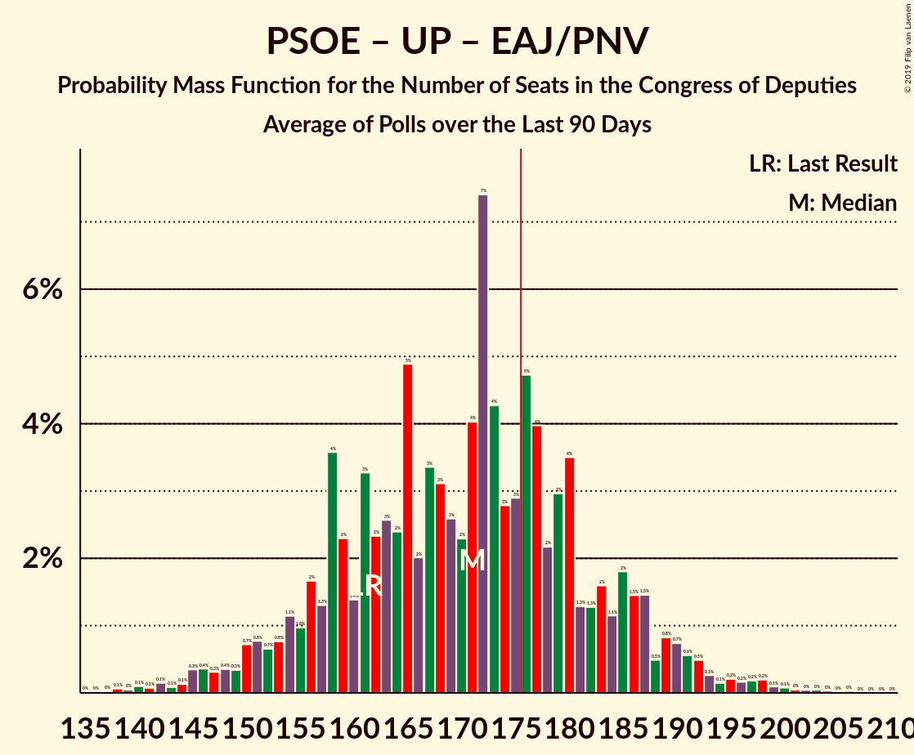

# Poll Average

<a href="#voting-intentions">Voting Intentions</a> | <a href="#seats">Seats</a> | <a href="#coalitions">Coalitions</a> | <a href="#technical-information">Technical Information</a>

## Summary

The table below lists the polls on which the average is based. They are the most recent polls (less than 90 days old) registered and analyzed so far.

| Period     | Polling firm/Commissioner(s) | PP | PSOE | UP | Cs | ERC | PDeCAT | EAJ/PNV | PACMA | EH Bildu | CC | Vox | BNG |
|:----------:|:----------------------------:|:--:|:--:|:--:|:--:|:--:|:--:|:--:|:--:|:--:|:--:|:--:|:--:|
| 26 June 2016 | General Election | 33.0%   137 | 22.6%   85 | 21.2%   71 | 13.1%   32 | 2.7%   9 | 2.0%   8 | 1.2%   5 | 1.2%   0 | 0.8%   2 | 0.3%   1 | 0.2%   0 | 0.2%   0 |
| N/A | Poll Average | 16–25%   60–105 | 25–33%   106–144 | 11–16%   26–46 | 12–19%   33–66 | 2–5%   9–20 | 1–2%   3–9 | 1–2%   3–8 | 1–3%   0–1 | 0–2%   1–7 | 0–1%   0–4 | 8–15%   17–47 | N/A   N/A |
| [22 February–18 April 2019](2019-04-18-electoPanel.html) | electoPanel   electomania.es | 20–21%   81 | 27–28%   120 | 13–14%   37 | 14–15%   41 | 2–3%   13 | 1–2%   6 | 1–2%   6 | 2–3%   1 | 1%   5 | 0%   0 | 12–13%   40 | N/A   N/A |
| [11–18 April 2019](2019-04-18-SocioMétrica.html) | SocioMétrica   El Español | 17–20%   61–72 | 29–33%   131–132 | 12–16%   40 | 14–17%   51–54 | 2–4%   14 | 1–2%   6 | 1–2%   6–8 | 1%   0 | 1–2%   2 | 0–1%   0–1 | 10–13%   25–35 | N/A   N/A |
| [11–17 April 2019](2019-04-17-Celeste-Tel.html) | Celeste-Tel   eldiario.es | N/A   N/A | N/A   N/A | N/A   N/A | N/A   N/A | N/A   N/A | N/A   N/A | N/A   N/A | N/A   N/A | N/A   N/A | N/A   N/A | N/A   N/A | N/A   N/A |
| [10–16 April 2019](2019-04-16-IMOP.html) | IMOP   El Confidencial | N/A   N/A | N/A   N/A | N/A   N/A | N/A   N/A | N/A   N/A | N/A   N/A | N/A   N/A | N/A   N/A | N/A   N/A | N/A   N/A | N/A   N/A | N/A   N/A |
| [13–15 April 2019](2019-04-15-TopPosition.html) | Top Position | N/A   N/A | N/A   N/A | N/A   N/A | N/A   N/A | N/A   N/A | N/A   N/A | N/A   N/A | N/A   N/A | N/A   N/A | N/A   N/A | N/A   N/A | N/A   N/A |
| [9–15 April 2019](2019-04-15-GAD3.html) | GAD3   ABC | 19–23%   73–94 | 29–33%   128–147 | 11–14%   25–38 | 12–15%   27–47 | N/A   N/A | N/A   N/A | N/A   N/A | N/A   N/A | N/A   N/A | N/A   N/A | 10–13%   26–38 | N/A   N/A |
| [12–15 April 2019](2019-04-15-DemoscopiayServicios.html) | Demoscopia y Servicios   OKDIARIO | N/A   N/A | N/A   N/A | N/A   N/A | N/A   N/A | N/A   N/A | N/A   N/A | N/A   N/A | N/A   N/A | N/A   N/A | N/A   N/A | N/A   N/A | N/A   N/A |
| [30 March–14 April 2019](2019-04-14-NCReport.html) | NC Report   La Razón | 22–27%   84–113 | 25–30%   100–128 | 12–16%   28–45 | 14–18%   36–62 | 2–4%   9–17 | 1–2%   1–8 | 1–2%   3–10 | N/A   N/A | 0–2%   1–7 | 0–1%   0–3 | 7–11%   13–27 | N/A   N/A |
| [8–11 April 2019](2019-04-11-Invymark.html) | Invymark   laSexta | 19–23%   71–97 | 25–30%   102–128 | 11–15%   26–43 | 14–19%   45–64 | N/A   N/A | N/A   N/A | N/A   N/A | N/A   N/A | N/A   N/A | N/A   N/A | 11–15%   26–45 | N/A   N/A |
| [1–5 April 2019](2019-04-05-SimpleLógica.html) | Simple Lógica | 15–19%   53–75 | 28–33%   124–151 | 12–17%   34–55 | 13–18%   42–62 | N/A   N/A | N/A   N/A | N/A   N/A | N/A   N/A | N/A   N/A | N/A   N/A | 8–12%   17–32 | N/A   N/A |
| [1–5 April 2019](2019-04-05-GESOP.html) | GESOP   El Periódico | 19–23%   73–98 | 28–32%   119–143 | 10–14%   24–37 | 13–16%   37–55 | N/A   N/A | N/A   N/A | N/A   N/A | N/A   N/A | N/A   N/A | N/A   N/A | 9–12%   21–33 | N/A   N/A |
| [18–25 March 2019](2019-03-25-Metroscopia.html) | Metroscopia   Henneo | 18–21%   65–83 | 27–30%   115–136 | 13–15%   34–44 | 15–18%   48–61 | N/A   N/A | N/A   N/A | N/A   N/A | N/A   N/A | N/A   N/A | N/A   N/A | 11–13%   26–36 | N/A   N/A |
| [15–20 March 2019](2019-03-20-Sondaxe.html) | Sondaxe   La Voz de Galicia | 17–21%   65–88 | 24–30%   103–131 | 11–16%   28–44 | 12–16%   31–54 | 3–5%   13–21 | 1–3%   3–10 | 1–2%   3–8 | N/A   N/A | 0–2%   1–7 | 0–1%   1–4 | 12–16%   33–54 | N/A   N/A |
| [14–19 March 2019](2019-03-19-40dB.html) | 40dB   El País | 17–21%   68–89 | 25–29%   109–132 | 11–14%   26–40 | 16–20%   53–69 | N/A   N/A | N/A   N/A | N/A   N/A | N/A   N/A | N/A   N/A | N/A   N/A | 9–12%   20–32 | N/A   N/A |
| 26 June 2016 | General Election | 33.0%   137 | 22.6%   85 | 21.2%   71 | 13.1%   32 | 2.7%   9 | 2.0%   8 | 1.2%   5 | 1.2%   0 | 0.8%   2 | 0.3%   1 | 0.2%   0 | 0.2%   0 |

Only polls for which at least the sample size has been published are included in the table above.

**Legend:**
+ **Top half of each row:** Voting intentions (95% confidence interval)
+ **Bottom half of each row:** Seat projections for the Congress of Deputies (95% confidence interval)
+ **PP:** Partido Popular
+ **PSOE:** Partido Socialista Obrero Español
+ **UP:** Unidos Podemos
+ **Cs:** Ciudadanos–Partido de la Ciudadanía
+ **ERC:** Esquerra Republicana de Catalunya–Catalunya Sí
+ **PDeCAT:** Partit Demòcrata Europeu Català
+ **EAJ/PNV:** Euzko Alderdi Jeltzalea/Partido Nacionalista Vasco
+ **PACMA:** Partido Animalista Contra el Maltrato Animal
+ **EH Bildu:** Euskal Herria Bildu
+ **CC:** Coalición Canaria–Partido Nacionalista Canario
+ **Vox:** Vox
+ **BNG:** Bloque Nacionalista Galego–Nós Candidatura Galega
+ **N/A (single party):** Party not included the published results
+ **N/A (entire row):** Calculation for this opinion poll not started yet

## Voting Intentions

### Confidence Intervals

| Party | Last Result | Median | 80% Confidence Interval | 90% Confidence Interval | 95% Confidence Interval | 99% Confidence Interval |
|:-----:|:-----------:|:------:|:-----------------------:|:-----------------------:|:-----------------------:|:-----------------------:|
| <a href="#partido-popular">Partido Popular</a> | 33.0% | 19.9% | 17.5–22.7% |16.6–24.2% | 16.0–25.0% | 14.9–26.4% |
| <a href="#partido-socialista-obrero-español">Partido Socialista Obrero Español</a> | 22.6% | 28.5% | 26.3–31.6% |25.7–32.2% | 25.2–32.6% | 24.3–33.5% |
| <a href="#unidos-podemos">Unidos Podemos</a> | 21.2% | 13.5% | 11.8–14.9% |11.4–15.3% | 11.1–15.7% | 10.5–16.5% |
| <a href="#ciudadanos–partido-de-la-ciudadanía">Ciudadanos–Partido de la Ciudadanía</a> | 13.1% | 15.3% | 13.3–17.5% |12.8–18.1% | 12.4–18.6% | 11.8–19.5% |
| <a href="#esquerra-republicana-de-catalunya–catalunya-sí">Esquerra Republicana de Catalunya–Catalunya Sí</a> | 2.7% | 3.1% | 2.6–4.2% |2.5–4.5% | 2.3–4.8% | 2.0–5.4% |
| <a href="#partit-demòcrata-europeu-català">Partit Demòcrata Europeu Català</a> | 2.0% | 1.4% | 1.1–2.0% |1.0–2.2% | 0.9–2.4% | 0.7–2.8% |
| <a href="#euzko-alderdi-jeltzalea/partido-nacionalista-vasco">Euzko Alderdi Jeltzalea/Partido Nacionalista Vasco</a> | 1.2% | 1.3% | 0.9–1.6% |0.8–1.8% | 0.7–1.9% | 0.5–2.3% |
| <a href="#partido-animalista-contra-el-maltrato-animal">Partido Animalista Contra el Maltrato Animal</a> | 1.2% | 1.9% | 0.8–2.4% |0.7–2.5% | 0.6–2.6% | 0.5–2.7% |
| <a href="#euskal-herria-bildu">Euskal Herria Bildu</a> | 0.8% | 0.9% | 0.6–1.3% |0.5–1.4% | 0.5–1.5% | 0.4–1.8% |
| <a href="#coalición-canaria–partido-nacionalista-canario">Coalición Canaria–Partido Nacionalista Canario</a> | 0.3% | 0.3% | 0.2–0.7% |0.1–0.8% | 0.1–1.0% | 0.1–1.2% |
| <a href="#vox">Vox</a> | 0.2% | 11.4% | 9.3–13.3% |8.8–14.2% | 8.4–14.8% | 7.7–15.8% |
| <a href="#bloque-nacionalista-galego–nós-candidatura-galega">Bloque Nacionalista Galego–Nós Candidatura Galega</a> | 0.2% | N/A | N/A |N/A | N/A | N/A |

### Partido Popular

*For a full overview of the results for this party, see the [Partido Popular](party-partidopopular.html) page.*

| Voting Intentions | Probability | Accumulated | Special Marks |
|:-----------------:|:-----------:|:-----------:|:-------------:|
| 12.5–13.5% | 0% | 100% |  |
| 13.5–14.5% | 0.2% | 100% |  |
| 14.5–15.5% | 1.2% | 99.8% |  |
| 15.5–16.5% | 3% | 98.5% |  |
| 16.5–17.5% | 6% | 95% |  |
| 17.5–18.5% | 12% | 89% |  |
| 18.5–19.5% | 19% | 77% |  |
| 19.5–20.5% | 24% | 58% | Median |
| 20.5–21.5% | 16% | 35% |  |
| 21.5–22.5% | 8% | 19% |  |
| 22.5–23.5% | 4% | 11% |  |
| 23.5–24.5% | 3% | 7% |  |
| 24.5–25.5% | 2% | 4% |  |
| 25.5–26.5% | 1.1% | 2% |  |
| 26.5–27.5% | 0.3% | 0.4% |  |
| 27.5–28.5% | 0.1% | 0.1% |  |
| 28.5–29.5% | 0% | 0% |  |
| 29.5–30.5% | 0% | 0% |  |
| 30.5–31.5% | 0% | 0% |  |
| 31.5–32.5% | 0% | 0% |  |
| 32.5–33.5% | 0% | 0% | Last Result |

### Partido Socialista Obrero Español

*For a full overview of the results for this party, see the [Partido Socialista Obrero Español](party-partidosocialistaobreroespañol.html) page.*

| Voting Intentions | Probability | Accumulated | Special Marks |
|:-----------------:|:-----------:|:-----------:|:-------------:|
| 21.5–22.5% | 0% | 100% |  |
| 22.5–23.5% | 0.1% | 100% | Last Result |
| 23.5–24.5% | 0.8% | 99.9% |  |
| 24.5–25.5% | 3% | 99.1% |  |
| 25.5–26.5% | 9% | 96% |  |
| 26.5–27.5% | 18% | 87% |  |
| 27.5–28.5% | 20% | 70% |  |
| 28.5–29.5% | 14% | 50% | Median |
| 29.5–30.5% | 13% | 35% |  |
| 30.5–31.5% | 12% | 22% |  |
| 31.5–32.5% | 7% | 10% |  |
| 32.5–33.5% | 2% | 3% |  |
| 33.5–34.5% | 0.4% | 0.5% |  |
| 34.5–35.5% | 0% | 0% |  |

### Unidos Podemos

*For a full overview of the results for this party, see the [Unidos Podemos](party-unidospodemos.html) page.*

| Voting Intentions | Probability | Accumulated | Special Marks |
|:-----------------:|:-----------:|:-----------:|:-------------:|
| 8.5–9.5% | 0% | 100% |  |
| 9.5–10.5% | 0.5% | 100% |  |
| 10.5–11.5% | 6% | 99.4% |  |
| 11.5–12.5% | 19% | 93% |  |
| 12.5–13.5% | 29% | 75% | Median |
| 13.5–14.5% | 31% | 46% |  |
| 14.5–15.5% | 12% | 15% |  |
| 15.5–16.5% | 3% | 3% |  |
| 16.5–17.5% | 0.4% | 0.5% |  |
| 17.5–18.5% | 0% | 0% |  |
| 18.5–19.5% | 0% | 0% |  |
| 19.5–20.5% | 0% | 0% |  |
| 20.5–21.5% | 0% | 0% | Last Result |

### Ciudadanos–Partido de la Ciudadanía

*For a full overview of the results for this party, see the [Ciudadanos–Partido de la Ciudadanía](party-ciudadanos–partidodelaciudadanía.html) page.*

| Voting Intentions | Probability | Accumulated | Special Marks |
|:-----------------:|:-----------:|:-----------:|:-------------:|
| 9.5–10.5% | 0% | 100% |  |
| 10.5–11.5% | 0.2% | 100% |  |
| 11.5–12.5% | 3% | 99.8% |  |
| 12.5–13.5% | 10% | 97% | Last Result |
| 13.5–14.5% | 22% | 87% |  |
| 14.5–15.5% | 21% | 66% | Median |
| 15.5–16.5% | 21% | 45% |  |
| 16.5–17.5% | 14% | 23% |  |
| 17.5–18.5% | 7% | 9% |  |
| 18.5–19.5% | 2% | 3% |  |
| 19.5–20.5% | 0.4% | 0.4% |  |
| 20.5–21.5% | 0% | 0% |  |

### Esquerra Republicana de Catalunya–Catalunya Sí

*For a full overview of the results for this party, see the [Esquerra Republicana de Catalunya–Catalunya Sí](party-esquerrarepublicanadecatalunya–catalunyasí.html) page.*

| Voting Intentions | Probability | Accumulated | Special Marks |
|:-----------------:|:-----------:|:-----------:|:-------------:|
| 0.5–1.5% | 0% | 100% |  |
| 1.5–2.5% | 7% | 100% |  |
| 2.5–3.5% | 64% | 93% | Last Result, Median |
| 3.5–4.5% | 24% | 29% |  |
| 4.5–5.5% | 4% | 5% |  |
| 5.5–6.5% | 0.3% | 0.3% |  |
| 6.5–7.5% | 0% | 0% |  |

### Partit Demòcrata Europeu Català

*For a full overview of the results for this party, see the [Partit Demòcrata Europeu Català](party-partitdemòcrataeuropeucatalà.html) page.*

| Voting Intentions | Probability | Accumulated | Special Marks |
|:-----------------:|:-----------:|:-----------:|:-------------:|
| 0.0–0.5% | 0% | 100% |  |
| 0.5–1.5% | 66% | 100% | Median |
| 1.5–2.5% | 33% | 34% | Last Result |
| 2.5–3.5% | 1.3% | 1.3% |  |
| 3.5–4.5% | 0% | 0% |  |

### Euzko Alderdi Jeltzalea/Partido Nacionalista Vasco

*For a full overview of the results for this party, see the [Euzko Alderdi Jeltzalea/Partido Nacionalista Vasco](party-euzkoalderdijeltzaleapartidonacionalistavasco.html) page.*

| Voting Intentions | Probability | Accumulated | Special Marks |
|:-----------------:|:-----------:|:-----------:|:-------------:|
| 0.0–0.5% | 0.7% | 100% |  |
| 0.5–1.5% | 85% | 99.3% | Last Result, Median |
| 1.5–2.5% | 14% | 14% |  |
| 2.5–3.5% | 0.1% | 0.1% |  |
| 3.5–4.5% | 0% | 0% |  |

### Partido Animalista Contra el Maltrato Animal

*For a full overview of the results for this party, see the [Partido Animalista Contra el Maltrato Animal](party-partidoanimalistacontraelmaltratoanimal.html) page.*

| Voting Intentions | Probability | Accumulated | Special Marks |
|:-----------------:|:-----------:|:-----------:|:-------------:|
| 0.0–0.5% | 1.2% | 100% |  |
| 0.5–1.5% | 48% | 98.8% | Last Result |
| 1.5–2.5% | 48% | 50% | Median |
| 2.5–3.5% | 3% | 3% |  |
| 3.5–4.5% | 0% | 0% |  |

### Euskal Herria Bildu

*For a full overview of the results for this party, see the [Euskal Herria Bildu](party-euskalherriabildu.html) page.*

| Voting Intentions | Probability | Accumulated | Special Marks |
|:-----------------:|:-----------:|:-----------:|:-------------:|
| 0.0–0.5% | 5% | 100% |  |
| 0.5–1.5% | 93% | 95% | Last Result, Median |
| 1.5–2.5% | 2% | 2% |  |
| 2.5–3.5% | 0% | 0% |  |

### Coalición Canaria–Partido Nacionalista Canario

*For a full overview of the results for this party, see the [Coalición Canaria–Partido Nacionalista Canario](party-coalicióncanaria–partidonacionalistacanario.html) page.*

| Voting Intentions | Probability | Accumulated | Special Marks |
|:-----------------:|:-----------:|:-----------:|:-------------:|
| 0.0–0.5% | 81% | 100% | Last Result, Median |
| 0.5–1.5% | 19% | 19% |  |
| 1.5–2.5% | 0% | 0% |  |
| 2.5–3.5% | 0% | 0% |  |

### Vox

*For a full overview of the results for this party, see the [Vox](party-vox.html) page.*

| Voting Intentions | Probability | Accumulated | Special Marks |
|:-----------------:|:-----------:|:-----------:|:-------------:|
| 0.0–0.5% | 0% | 100% | Last Result |
| 0.5–1.5% | 0% | 100% |  |
| 1.5–2.5% | 0% | 100% |  |
| 2.5–3.5% | 0% | 100% |  |
| 3.5–4.5% | 0% | 100% |  |
| 4.5–5.5% | 0% | 100% |  |
| 5.5–6.5% | 0% | 100% |  |
| 6.5–7.5% | 0.3% | 100% |  |
| 7.5–8.5% | 3% | 99.7% |  |
| 8.5–9.5% | 10% | 97% |  |
| 9.5–10.5% | 18% | 87% |  |
| 10.5–11.5% | 23% | 69% | Median |
| 11.5–12.5% | 25% | 46% |  |
| 12.5–13.5% | 12% | 21% |  |
| 13.5–14.5% | 5% | 9% |  |
| 14.5–15.5% | 2% | 3% |  |
| 15.5–16.5% | 0.7% | 0.8% |  |
| 16.5–17.5% | 0.1% | 0.1% |  |
| 17.5–18.5% | 0% | 0% |  |

## Seats

### Confidence Intervals

| Party | Last Result | Median | 80% Confidence Interval | 90% Confidence Interval | 95% Confidence Interval | 99% Confidence Interval |
|:-----:|:-----------:|:------:|:-----------------------:|:-----------------------:|:-----------------------:|:-----------------------:|
| <a href="#partido-popular">Partido Popular</a> | 137 | 80 | 61–93 |61–101 | 60–105 | 55–112 |
| <a href="#partido-socialista-obrero-español">Partido Socialista Obrero Español</a> | 85 | 124 | 111–139 |108–142 | 106–144 | 100–149 |
| <a href="#unidos-podemos">Unidos Podemos</a> | 71 | 37 | 30–41 |28–43 | 26–46 | 24–53 |
| <a href="#ciudadanos–partido-de-la-ciudadanía">Ciudadanos–Partido de la Ciudadanía</a> | 32 | 50 | 39–61 |36–64 | 33–66 | 29–68 |
| <a href="#esquerra-republicana-de-catalunya–catalunya-sí">Esquerra Republicana de Catalunya–Catalunya Sí</a> | 9 | 14 | 12–17 |10–19 | 9–20 | 9–21 |
| <a href="#partit-demòcrata-europeu-català">Partit Demòcrata Europeu Català</a> | 8 | 6 | 4–8 |3–8 | 3–9 | 1–10 |
| <a href="#euzko-alderdi-jeltzalea/partido-nacionalista-vasco">Euzko Alderdi Jeltzalea/Partido Nacionalista Vasco</a> | 5 | 6 | 5–8 |3–8 | 3–8 | 2–10 |
| <a href="#partido-animalista-contra-el-maltrato-animal">Partido Animalista Contra el Maltrato Animal</a> | 0 | 1 | 0–1 |0–1 | 0–1 | 0–1 |
| <a href="#euskal-herria-bildu">Euskal Herria Bildu</a> | 2 | 3 | 1–6 |1–7 | 1–7 | 1–7 |
| <a href="#coalición-canaria–partido-nacionalista-canario">Coalición Canaria–Partido Nacionalista Canario</a> | 1 | 1 | 0–2 |0–3 | 0–4 | 0–4 |
| <a href="#vox">Vox</a> | 0 | 30 | 21–40 |19–45 | 17–47 | 14–52 |
| <a href="#bloque-nacionalista-galego–nós-candidatura-galega">Bloque Nacionalista Galego–Nós Candidatura Galega</a> | 0 | N/A | N/A |N/A | N/A | N/A |

### Partido Popular

*For a full overview of the results for this party, see the [Partido Popular](party-partidopopular.html) page.*

| Number of Seats | Probability | Accumulated | Special Marks |
|:---------------:|:-----------:|:-----------:|:-------------:|
| 52 | 0.1% | 100% |  |
| 53 | 0.2% | 99.9% |  |
| 54 | 0.1% | 99.7% |  |
| 55 | 0.3% | 99.6% |  |
| 56 | 0.3% | 99.3% |  |
| 57 | 0.7% | 99.0% |  |
| 58 | 0.2% | 98% |  |
| 59 | 0.5% | 98% |  |
| 60 | 0.6% | 98% |  |
| 61 | 9% | 97% |  |
| 62 | 0.7% | 88% |  |
| 63 | 0.6% | 88% |  |
| 64 | 0.8% | 87% |  |
| 65 | 1.0% | 86% |  |
| 66 | 1.2% | 85% |  |
| 67 | 1.4% | 84% |  |
| 68 | 2% | 83% |  |
| 69 | 2% | 81% |  |
| 70 | 2% | 79% |  |
| 71 | 3% | 77% |  |
| 72 | 3% | 74% |  |
| 73 | 2% | 71% |  |
| 74 | 2% | 69% |  |
| 75 | 3% | 67% |  |
| 76 | 4% | 63% |  |
| 77 | 3% | 59% |  |
| 78 | 3% | 57% |  |
| 79 | 3% | 54% |  |
| 80 | 3% | 50% | Median |
| 81 | 13% | 48% |  |
| 82 | 3% | 35% |  |
| 83 | 3% | 31% |  |
| 84 | 3% | 28% |  |
| 85 | 3% | 25% |  |
| 86 | 3% | 22% |  |
| 87 | 2% | 19% |  |
| 88 | 2% | 17% |  |
| 89 | 2% | 15% |  |
| 90 | 1.3% | 14% |  |
| 91 | 1.0% | 12% |  |
| 92 | 0.9% | 11% |  |
| 93 | 1.3% | 10% |  |
| 94 | 0.5% | 9% |  |
| 95 | 0.5% | 9% |  |
| 96 | 0.9% | 8% |  |
| 97 | 0.3% | 7% |  |
| 98 | 0.5% | 7% |  |
| 99 | 0.8% | 6% |  |
| 100 | 0.2% | 5% |  |
| 101 | 0.3% | 5% |  |
| 102 | 0.1% | 5% |  |
| 103 | 0.4% | 5% |  |
| 104 | 0.5% | 4% |  |
| 105 | 2% | 4% |  |
| 106 | 0.1% | 2% |  |
| 107 | 0.3% | 2% |  |
| 108 | 0.6% | 2% |  |
| 109 | 0.1% | 1.0% |  |
| 110 | 0.2% | 0.9% |  |
| 111 | 0.2% | 0.7% |  |
| 112 | 0.2% | 0.5% |  |
| 113 | 0.1% | 0.3% |  |
| 114 | 0% | 0.2% |  |
| 115 | 0.1% | 0.2% |  |
| 116 | 0% | 0.1% |  |
| 117 | 0% | 0.1% |  |
| 118 | 0% | 0.1% |  |
| 119 | 0% | 0.1% |  |
| 120 | 0% | 0% |  |
| 121 | 0% | 0% |  |
| 122 | 0% | 0% |  |
| 123 | 0% | 0% |  |
| 124 | 0% | 0% |  |
| 125 | 0% | 0% |  |
| 126 | 0% | 0% |  |
| 127 | 0% | 0% |  |
| 128 | 0% | 0% |  |
| 129 | 0% | 0% |  |
| 130 | 0% | 0% |  |
| 131 | 0% | 0% |  |
| 132 | 0% | 0% |  |
| 133 | 0% | 0% |  |
| 134 | 0% | 0% |  |
| 135 | 0% | 0% |  |
| 136 | 0% | 0% |  |
| 137 | 0% | 0% | Last Result |

### Partido Socialista Obrero Español

*For a full overview of the results for this party, see the [Partido Socialista Obrero Español](party-partidosocialistaobreroespañol.html) page.*

| Number of Seats | Probability | Accumulated | Special Marks |
|:---------------:|:-----------:|:-----------:|:-------------:|
| 85 | 0% | 100% | Last Result |
| 86 | 0% | 100% |  |
| 87 | 0% | 100% |  |
| 88 | 0% | 100% |  |
| 89 | 0% | 100% |  |
| 90 | 0% | 100% |  |
| 91 | 0% | 100% |  |
| 92 | 0% | 100% |  |
| 93 | 0% | 100% |  |
| 94 | 0% | 100% |  |
| 95 | 0% | 99.9% |  |
| 96 | 0.1% | 99.9% |  |
| 97 | 0.1% | 99.8% |  |
| 98 | 0.1% | 99.7% |  |
| 99 | 0.1% | 99.7% |  |
| 100 | 0.2% | 99.6% |  |
| 101 | 0.1% | 99.4% |  |
| 102 | 0.2% | 99.3% |  |
| 103 | 0.4% | 99.1% |  |
| 104 | 0.5% | 98.7% |  |
| 105 | 0.4% | 98% |  |
| 106 | 0.7% | 98% |  |
| 107 | 0.8% | 97% |  |
| 108 | 2% | 96% |  |
| 109 | 0.9% | 95% |  |
| 110 | 2% | 94% |  |
| 111 | 3% | 91% |  |
| 112 | 1.4% | 89% |  |
| 113 | 3% | 87% |  |
| 114 | 1.4% | 85% |  |
| 115 | 2% | 83% |  |
| 116 | 2% | 81% |  |
| 117 | 3% | 79% |  |
| 118 | 3% | 76% |  |
| 119 | 2% | 73% |  |
| 120 | 13% | 71% |  |
| 121 | 3% | 58% |  |
| 122 | 2% | 55% |  |
| 123 | 2% | 52% |  |
| 124 | 2% | 51% | Median |
| 125 | 2% | 49% |  |
| 126 | 3% | 47% |  |
| 127 | 2% | 44% |  |
| 128 | 2% | 42% |  |
| 129 | 2% | 40% |  |
| 130 | 2% | 38% |  |
| 131 | 10% | 36% |  |
| 132 | 4% | 26% |  |
| 133 | 2% | 22% |  |
| 134 | 2% | 20% |  |
| 135 | 2% | 19% |  |
| 136 | 2% | 17% |  |
| 137 | 2% | 15% |  |
| 138 | 2% | 13% |  |
| 139 | 2% | 10% |  |
| 140 | 2% | 8% |  |
| 141 | 1.5% | 7% |  |
| 142 | 1.0% | 5% |  |
| 143 | 0.9% | 4% |  |
| 144 | 0.8% | 3% |  |
| 145 | 0.6% | 2% |  |
| 146 | 0.6% | 2% |  |
| 147 | 0.4% | 1.3% |  |
| 148 | 0.3% | 0.9% |  |
| 149 | 0.2% | 0.6% |  |
| 150 | 0.1% | 0.4% |  |
| 151 | 0.1% | 0.3% |  |
| 152 | 0.1% | 0.2% |  |
| 153 | 0% | 0.2% |  |
| 154 | 0% | 0.1% |  |
| 155 | 0% | 0.1% |  |
| 156 | 0% | 0.1% |  |
| 157 | 0% | 0% |  |

### Unidos Podemos

*For a full overview of the results for this party, see the [Unidos Podemos](party-unidospodemos.html) page.*

| Number of Seats | Probability | Accumulated | Special Marks |
|:---------------:|:-----------:|:-----------:|:-------------:|
| 23 | 0.1% | 100% |  |
| 24 | 0.8% | 99.8% |  |
| 25 | 1.2% | 99.0% |  |
| 26 | 1.1% | 98% |  |
| 27 | 1.4% | 97% |  |
| 28 | 2% | 95% |  |
| 29 | 2% | 93% |  |
| 30 | 3% | 91% |  |
| 31 | 3% | 88% |  |
| 32 | 4% | 85% |  |
| 33 | 5% | 81% |  |
| 34 | 5% | 76% |  |
| 35 | 7% | 70% |  |
| 36 | 11% | 64% |  |
| 37 | 16% | 53% | Median |
| 38 | 6% | 37% |  |
| 39 | 4% | 31% |  |
| 40 | 15% | 27% |  |
| 41 | 3% | 12% |  |
| 42 | 2% | 9% |  |
| 43 | 2% | 7% |  |
| 44 | 1.0% | 5% |  |
| 45 | 0.9% | 4% |  |
| 46 | 0.7% | 3% |  |
| 47 | 0.4% | 2% |  |
| 48 | 0.4% | 2% |  |
| 49 | 0.2% | 1.4% |  |
| 50 | 0.3% | 1.2% |  |
| 51 | 0.2% | 0.9% |  |
| 52 | 0.2% | 0.8% |  |
| 53 | 0.1% | 0.6% |  |
| 54 | 0.1% | 0.5% |  |
| 55 | 0.1% | 0.3% |  |
| 56 | 0.1% | 0.2% |  |
| 57 | 0.1% | 0.1% |  |
| 58 | 0% | 0.1% |  |
| 59 | 0% | 0.1% |  |
| 60 | 0% | 0% |  |
| 61 | 0% | 0% |  |
| 62 | 0% | 0% |  |
| 63 | 0% | 0% |  |
| 64 | 0% | 0% |  |
| 65 | 0% | 0% |  |
| 66 | 0% | 0% |  |
| 67 | 0% | 0% |  |
| 68 | 0% | 0% |  |
| 69 | 0% | 0% |  |
| 70 | 0% | 0% |  |
| 71 | 0% | 0% | Last Result |

### Ciudadanos–Partido de la Ciudadanía

*For a full overview of the results for this party, see the [Ciudadanos–Partido de la Ciudadanía](party-ciudadanos–partidodelaciudadanía.html) page.*

| Number of Seats | Probability | Accumulated | Special Marks |
|:---------------:|:-----------:|:-----------:|:-------------:|
| 22 | 0% | 100% |  |
| 23 | 0% | 99.9% |  |
| 24 | 0% | 99.9% |  |
| 25 | 0.1% | 99.9% |  |
| 26 | 0.1% | 99.8% |  |
| 27 | 0.1% | 99.7% |  |
| 28 | 0.1% | 99.6% |  |
| 29 | 0.2% | 99.5% |  |
| 30 | 0.2% | 99.4% |  |
| 31 | 0.3% | 99.2% |  |
| 32 | 0.4% | 98.8% | Last Result |
| 33 | 0.9% | 98% |  |
| 34 | 0.8% | 97% |  |
| 35 | 0.9% | 97% |  |
| 36 | 1.3% | 96% |  |
| 37 | 1.2% | 94% |  |
| 38 | 2% | 93% |  |
| 39 | 2% | 91% |  |
| 40 | 3% | 90% |  |
| 41 | 12% | 87% |  |
| 42 | 2% | 75% |  |
| 43 | 1.2% | 74% |  |
| 44 | 2% | 72% |  |
| 45 | 3% | 70% |  |
| 46 | 2% | 67% |  |
| 47 | 2% | 66% |  |
| 48 | 3% | 63% |  |
| 49 | 4% | 60% |  |
| 50 | 6% | 56% | Median |
| 51 | 7% | 50% |  |
| 52 | 4% | 43% |  |
| 53 | 4% | 39% |  |
| 54 | 12% | 35% |  |
| 55 | 3% | 24% |  |
| 56 | 2% | 20% |  |
| 57 | 2% | 18% |  |
| 58 | 2% | 16% |  |
| 59 | 2% | 15% |  |
| 60 | 2% | 12% |  |
| 61 | 2% | 11% |  |
| 62 | 2% | 9% |  |
| 63 | 1.3% | 7% |  |
| 64 | 1.3% | 6% |  |
| 65 | 1.5% | 4% |  |
| 66 | 0.9% | 3% |  |
| 67 | 1.1% | 2% |  |
| 68 | 0.5% | 1.0% |  |
| 69 | 0.2% | 0.4% |  |
| 70 | 0.1% | 0.2% |  |
| 71 | 0% | 0.1% |  |
| 72 | 0% | 0.1% |  |
| 73 | 0% | 0.1% |  |
| 74 | 0% | 0% |  |

### Esquerra Republicana de Catalunya–Catalunya Sí

*For a full overview of the results for this party, see the [Esquerra Republicana de Catalunya–Catalunya Sí](party-esquerrarepublicanadecatalunya–catalunyasí.html) page.*

| Number of Seats | Probability | Accumulated | Special Marks |
|:---------------:|:-----------:|:-----------:|:-------------:|
| 7 | 0.1% | 100% |  |
| 8 | 0.1% | 99.9% |  |
| 9 | 3% | 99.8% | Last Result |
| 10 | 2% | 97% |  |
| 11 | 5% | 95% |  |
| 12 | 3% | 90% |  |
| 13 | 29% | 87% |  |
| 14 | 31% | 58% | Median |
| 15 | 13% | 27% |  |
| 16 | 3% | 15% |  |
| 17 | 3% | 12% |  |
| 18 | 1.1% | 9% |  |
| 19 | 5% | 8% |  |
| 20 | 2% | 3% |  |
| 21 | 0.9% | 1.0% |  |
| 22 | 0.2% | 0.2% |  |
| 23 | 0% | 0% |  |

### Partit Demòcrata Europeu Català

*For a full overview of the results for this party, see the [Partit Demòcrata Europeu Català](party-partitdemòcrataeuropeucatalà.html) page.*

| Number of Seats | Probability | Accumulated | Special Marks |
|:---------------:|:-----------:|:-----------:|:-------------:|
| 1 | 0.7% | 100% |  |
| 2 | 0.2% | 99.3% |  |
| 3 | 6% | 99.1% |  |
| 4 | 7% | 93% |  |
| 5 | 11% | 86% |  |
| 6 | 59% | 76% | Median |
| 7 | 3% | 17% |  |
| 8 | 10% | 14% | Last Result |
| 9 | 3% | 4% |  |
| 10 | 1.0% | 1.2% |  |
| 11 | 0.2% | 0.3% |  |
| 12 | 0% | 0.1% |  |
| 13 | 0% | 0.1% |  |
| 14 | 0% | 0% |  |

### Euzko Alderdi Jeltzalea/Partido Nacionalista Vasco

*For a full overview of the results for this party, see the [Euzko Alderdi Jeltzalea/Partido Nacionalista Vasco](party-euzkoalderdijeltzaleapartidonacionalistavasco.html) page.*

| Number of Seats | Probability | Accumulated | Special Marks |
|:---------------:|:-----------:|:-----------:|:-------------:|
| 1 | 0.1% | 100% |  |
| 2 | 0.4% | 99.9% |  |
| 3 | 6% | 99.5% |  |
| 4 | 4% | 94% |  |
| 5 | 3% | 90% | Last Result |
| 6 | 66% | 87% | Median |
| 7 | 5% | 21% |  |
| 8 | 14% | 15% |  |
| 9 | 0.7% | 2% |  |
| 10 | 0.9% | 1.0% |  |
| 11 | 0.1% | 0.1% |  |
| 12 | 0% | 0% |  |

### Partido Animalista Contra el Maltrato Animal

*For a full overview of the results for this party, see the [Partido Animalista Contra el Maltrato Animal](party-partidoanimalistacontraelmaltratoanimal.html) page.*

| Number of Seats | Probability | Accumulated | Special Marks |
|:---------------:|:-----------:|:-----------:|:-------------:|
| 0 | 50% | 100% | Last Result |
| 1 | 50% | 50% | Median |
| 2 | 0% | 0% |  |

### Euskal Herria Bildu

*For a full overview of the results for this party, see the [Euskal Herria Bildu](party-euskalherriabildu.html) page.*

| Number of Seats | Probability | Accumulated | Special Marks |
|:---------------:|:-----------:|:-----------:|:-------------:|
| 0 | 0.4% | 100% |  |
| 1 | 11% | 99.6% |  |
| 2 | 37% | 89% | Last Result |
| 3 | 8% | 52% | Median |
| 4 | 7% | 44% |  |
| 5 | 27% | 37% |  |
| 6 | 4% | 10% |  |
| 7 | 6% | 6% |  |
| 8 | 0.1% | 0.2% |  |
| 9 | 0.1% | 0.1% |  |
| 10 | 0% | 0% |  |

### Coalición Canaria–Partido Nacionalista Canario

*For a full overview of the results for this party, see the [Coalición Canaria–Partido Nacionalista Canario](party-coalicióncanaria–partidonacionalistacanario.html) page.*

| Number of Seats | Probability | Accumulated | Special Marks |
|:---------------:|:-----------:|:-----------:|:-------------:|
| 0 | 33% | 100% |  |
| 1 | 49% | 67% | Last Result, Median |
| 2 | 11% | 19% |  |
| 3 | 4% | 8% |  |
| 4 | 4% | 4% |  |
| 5 | 0.2% | 0.3% |  |
| 6 | 0% | 0% |  |

### Vox

*For a full overview of the results for this party, see the [Vox](party-vox.html) page.*

| Number of Seats | Probability | Accumulated | Special Marks |
|:---------------:|:-----------:|:-----------:|:-------------:|
| 0 | 0% | 100% | Last Result |
| 1 | 0% | 100% |  |
| 2 | 0% | 100% |  |
| 3 | 0% | 100% |  |
| 4 | 0% | 100% |  |
| 5 | 0% | 100% |  |
| 6 | 0% | 100% |  |
| 7 | 0% | 100% |  |
| 8 | 0% | 100% |  |
| 9 | 0% | 100% |  |
| 10 | 0% | 100% |  |
| 11 | 0.1% | 100% |  |
| 12 | 0.1% | 99.9% |  |
| 13 | 0.2% | 99.8% |  |
| 14 | 0.3% | 99.6% |  |
| 15 | 0.6% | 99.4% |  |
| 16 | 1.0% | 98.8% |  |
| 17 | 0.7% | 98% |  |
| 18 | 2% | 97% |  |
| 19 | 3% | 95% |  |
| 20 | 2% | 93% |  |
| 21 | 2% | 91% |  |
| 22 | 4% | 89% |  |
| 23 | 4% | 85% |  |
| 24 | 3% | 81% |  |
| 25 | 5% | 78% |  |
| 26 | 5% | 73% |  |
| 27 | 6% | 68% |  |
| 28 | 5% | 62% |  |
| 29 | 4% | 57% |  |
| 30 | 4% | 53% | Median |
| 31 | 3% | 49% |  |
| 32 | 4% | 45% |  |
| 33 | 5% | 41% |  |
| 34 | 3% | 36% |  |
| 35 | 10% | 33% |  |
| 36 | 1.2% | 24% |  |
| 37 | 1.1% | 23% |  |
| 38 | 0.7% | 22% |  |
| 39 | 0.6% | 21% |  |
| 40 | 12% | 20% |  |
| 41 | 0.6% | 9% |  |
| 42 | 0.8% | 8% |  |
| 43 | 0.7% | 7% |  |
| 44 | 1.4% | 7% |  |
| 45 | 1.2% | 5% |  |
| 46 | 1.4% | 4% |  |
| 47 | 0.7% | 3% |  |
| 48 | 0.2% | 2% |  |
| 49 | 0.1% | 2% |  |
| 50 | 0.5% | 2% |  |
| 51 | 0.4% | 1.0% |  |
| 52 | 0.1% | 0.6% |  |
| 53 | 0.1% | 0.5% |  |
| 54 | 0.2% | 0.4% |  |
| 55 | 0.1% | 0.2% |  |
| 56 | 0% | 0.2% |  |
| 57 | 0.1% | 0.1% |  |
| 58 | 0.1% | 0.1% |  |
| 59 | 0% | 0% |  |

## Coalitions

### Confidence Intervals

| Coalition | Last Result | Median | Majority? | 80% Confidence Interval | 90% Confidence Interval | 95% Confidence Interval | 99% Confidence Interval |
|:---------:|:-----------:|:------:|:---------:|:-----------------------:|:-----------------------:|:-----------------------:|:-----------------------:|
| Partido Popular – Partido Socialista Obrero Español – Ciudadanos–Partido de la Ciudadanía | 254 | 255 | 100% | 242–265 | 235–268 | 229–270 | 224–274 |
| Partido Socialista Obrero Español – Unidos Podemos – Ciudadanos–Partido de la Ciudadanía | 188 | 209 | 99.9% | 198–225 | 194–233 | 190–238 | 184–244 |
| Partido Popular – Partido Socialista Obrero Español | 222 | 201 | 99.9% | 192–219 | 189–222 | 184–226 | 179–231 |
| Partido Socialista Obrero Español – Unidos Podemos – Esquerra Republicana de Catalunya–Catalunya Sí – Partit Demòcrata Europeu Català – Euzko Alderdi Jeltzalea/Partido Nacionalista Vasco – Euskal Herria Bildu | 180 | 188 | 92% | 176–203 | 173–208 | 170–213 | 164–219 |
| Partido Socialista Obrero Español – Unidos Podemos – Esquerra Republicana de Catalunya–Catalunya Sí – Partit Demòcrata Europeu Català | 173 | 179 | 70% | 167–194 | 164–200 | 160–205 | 155–211 |
| Partido Socialista Obrero Español – Unidos Podemos – Esquerra Republicana de Catalunya–Catalunya Sí – Euskal Herria Bildu | 167 | 175 | 47% | 164–189 | 160–195 | 157–199 | 150–205 |
| Partido Socialista Obrero Español – Ciudadanos–Partido de la Ciudadanía | 117 | 175 | 49% | 160–188 | 158–192 | 154–196 | 146–201 |
| Partido Socialista Obrero Español – Unidos Podemos – Euzko Alderdi Jeltzalea/Partido Nacionalista Vasco – Euskal Herria Bildu | 163 | 168 | 33% | 157–184 | 154–189 | 150–194 | 144–201 |
| Partido Socialista Obrero Español – Unidos Podemos – Euzko Alderdi Jeltzalea/Partido Nacionalista Vasco | 161 | 165 | 28% | 154–181 | 150–187 | 147–192 | 141–198 |
| Partido Socialista Obrero Español – Unidos Podemos | 156 | 158 | 9% | 148–175 | 144–181 | 141–186 | 135–192 |
| Partido Popular – Ciudadanos–Partido de la Ciudadanía – Vox | 169 | 161 | 5% | 146–173 | 141–176 | 136–179 | 130–185 |
| Partido Popular – Ciudadanos–Partido de la Ciudadanía – Euzko Alderdi Jeltzalea/Partido Nacionalista Vasco | 174 | 131 | 0.1% | 121–153 | 117–160 | 114–163 | 109–170 |
| Partido Popular – Ciudadanos–Partido de la Ciudadanía – Coalición Canaria–Partido Nacionalista Canario | 170 | 125 | 0% | 116–148 | 113–155 | 110–157 | 105–165 |
| Partido Popular – Ciudadanos–Partido de la Ciudadanía | 169 | 124 | 0% | 115–147 | 112–154 | 108–156 | 104–164 |
| Partido Socialista Obrero Español | 85 | 124 | 0% | 111–139 | 108–142 | 106–144 | 100–149 |
| Partido Popular – Vox | 137 | 111 | 0% | 95–122 | 88–125 | 84–128 | 78–135 |
| Partido Popular | 137 | 80 | 0% | 61–93 | 61–101 | 60–105 | 55–112 |

### Partido Popular – Partido Socialista Obrero Español – Ciudadanos–Partido de la Ciudadanía

| Number of Seats | Probability | Accumulated | Special Marks |
|:---------------:|:-----------:|:-----------:|:-------------:|
| 217 | 0% | 100% |  |
| 218 | 0% | 99.9% |  |
| 219 | 0.1% | 99.9% |  |
| 220 | 0% | 99.9% |  |
| 221 | 0.2% | 99.8% |  |
| 222 | 0.1% | 99.7% |  |
| 223 | 0.1% | 99.6% |  |
| 224 | 0.1% | 99.5% |  |
| 225 | 0.4% | 99.4% |  |
| 226 | 0.1% | 99.1% |  |
| 227 | 0.1% | 98.9% |  |
| 228 | 0.2% | 98.9% |  |
| 229 | 1.3% | 98.6% |  |
| 230 | 0.4% | 97% |  |
| 231 | 0.1% | 97% |  |
| 232 | 0.3% | 97% |  |
| 233 | 0.2% | 97% |  |
| 234 | 0.5% | 96% |  |
| 235 | 1.1% | 96% |  |
| 236 | 0.5% | 95% |  |
| 237 | 0.2% | 94% |  |
| 238 | 0.6% | 94% |  |
| 239 | 1.0% | 93% |  |
| 240 | 0.6% | 92% |  |
| 241 | 1.3% | 92% |  |
| 242 | 10% | 90% |  |
| 243 | 0.5% | 80% |  |
| 244 | 0.6% | 80% |  |
| 245 | 1.1% | 79% |  |
| 246 | 9% | 78% |  |
| 247 | 1.2% | 69% |  |
| 248 | 2% | 68% |  |
| 249 | 2% | 66% |  |
| 250 | 2% | 64% |  |
| 251 | 3% | 62% |  |
| 252 | 3% | 59% |  |
| 253 | 3% | 56% |  |
| 254 | 3% | 53% | Last Result, Median |
| 255 | 5% | 50% |  |
| 256 | 4% | 45% |  |
| 257 | 4% | 41% |  |
| 258 | 4% | 37% |  |
| 259 | 4% | 33% |  |
| 260 | 4% | 29% |  |
| 261 | 3% | 25% |  |
| 262 | 3% | 22% |  |
| 263 | 3% | 19% |  |
| 264 | 3% | 15% |  |
| 265 | 3% | 13% |  |
| 266 | 2% | 9% |  |
| 267 | 2% | 7% |  |
| 268 | 2% | 5% |  |
| 269 | 1.0% | 4% |  |
| 270 | 0.6% | 3% |  |
| 271 | 0.6% | 2% |  |
| 272 | 0.5% | 1.5% |  |
| 273 | 0.4% | 1.0% |  |
| 274 | 0.2% | 0.6% |  |
| 275 | 0.2% | 0.4% |  |
| 276 | 0.1% | 0.2% |  |
| 277 | 0% | 0.2% |  |
| 278 | 0% | 0.1% |  |
| 279 | 0% | 0.1% |  |
| 280 | 0% | 0.1% |  |
| 281 | 0.1% | 0.1% |  |
| 282 | 0% | 0% |  |

### Partido Socialista Obrero Español – Unidos Podemos – Ciudadanos–Partido de la Ciudadanía

| Number of Seats | Probability | Accumulated | Special Marks |
|:---------------:|:-----------:|:-----------:|:-------------:|
| 173 | 0% | 100% |  |
| 174 | 0% | 99.9% |  |
| 175 | 0% | 99.9% |  |
| 176 | 0% | 99.9% | Majority |
| 177 | 0% | 99.9% |  |
| 178 | 0.1% | 99.9% |  |
| 179 | 0% | 99.8% |  |
| 180 | 0% | 99.8% |  |
| 181 | 0% | 99.8% |  |
| 182 | 0.1% | 99.7% |  |
| 183 | 0% | 99.6% |  |
| 184 | 0.1% | 99.6% |  |
| 185 | 0.1% | 99.4% |  |
| 186 | 0.5% | 99.3% |  |
| 187 | 0.1% | 98.8% |  |
| 188 | 0.5% | 98.7% | Last Result |
| 189 | 0.4% | 98% |  |
| 190 | 0.6% | 98% |  |
| 191 | 0.7% | 97% |  |
| 192 | 0.5% | 96% |  |
| 193 | 0.5% | 96% |  |
| 194 | 0.9% | 95% |  |
| 195 | 1.2% | 95% |  |
| 196 | 1.1% | 93% |  |
| 197 | 0.9% | 92% |  |
| 198 | 13% | 91% |  |
| 199 | 1.0% | 79% |  |
| 200 | 3% | 78% |  |
| 201 | 3% | 74% |  |
| 202 | 2% | 71% |  |
| 203 | 2% | 70% |  |
| 204 | 3% | 67% |  |
| 205 | 3% | 64% |  |
| 206 | 3% | 61% |  |
| 207 | 3% | 58% |  |
| 208 | 3% | 55% |  |
| 209 | 3% | 53% |  |
| 210 | 3% | 50% |  |
| 211 | 3% | 47% | Median |
| 212 | 3% | 44% |  |
| 213 | 3% | 41% |  |
| 214 | 3% | 38% |  |
| 215 | 3% | 36% |  |
| 216 | 2% | 33% |  |
| 217 | 2% | 31% |  |
| 218 | 2% | 29% |  |
| 219 | 1.5% | 27% |  |
| 220 | 2% | 26% |  |
| 221 | 1.1% | 24% |  |
| 222 | 0.9% | 23% |  |
| 223 | 2% | 22% |  |
| 224 | 0.9% | 20% |  |
| 225 | 9% | 19% |  |
| 226 | 0.6% | 10% |  |
| 227 | 0.5% | 9% |  |
| 228 | 0.6% | 9% |  |
| 229 | 0.6% | 8% |  |
| 230 | 0.6% | 7% |  |
| 231 | 0.7% | 7% |  |
| 232 | 0.6% | 6% |  |
| 233 | 0.6% | 6% |  |
| 234 | 0.6% | 5% |  |
| 235 | 0.5% | 4% |  |
| 236 | 0.5% | 4% |  |
| 237 | 0.5% | 3% |  |
| 238 | 0.5% | 3% |  |
| 239 | 0.5% | 2% |  |
| 240 | 0.4% | 2% |  |
| 241 | 0.3% | 1.5% |  |
| 242 | 0.2% | 1.2% |  |
| 243 | 0.3% | 1.0% |  |
| 244 | 0.2% | 0.7% |  |
| 245 | 0.2% | 0.5% |  |
| 246 | 0.1% | 0.3% |  |
| 247 | 0.1% | 0.2% |  |
| 248 | 0.1% | 0.1% |  |
| 249 | 0% | 0.1% |  |
| 250 | 0% | 0% |  |

### Partido Popular – Partido Socialista Obrero Español

| Number of Seats | Probability | Accumulated | Special Marks |
|:---------------:|:-----------:|:-----------:|:-------------:|
| 173 | 0% | 100% |  |
| 174 | 0% | 99.9% |  |
| 175 | 0% | 99.9% |  |
| 176 | 0% | 99.9% | Majority |
| 177 | 0.1% | 99.8% |  |
| 178 | 0.1% | 99.7% |  |
| 179 | 0.2% | 99.7% |  |
| 180 | 0.1% | 99.4% |  |
| 181 | 0.2% | 99.4% |  |
| 182 | 0.1% | 99.2% |  |
| 183 | 0.2% | 99.0% |  |
| 184 | 1.4% | 98.8% |  |
| 185 | 0.3% | 97% |  |
| 186 | 0.7% | 97% |  |
| 187 | 0.5% | 96% |  |
| 188 | 0.7% | 96% |  |
| 189 | 0.8% | 95% |  |
| 190 | 1.3% | 94% |  |
| 191 | 1.3% | 93% |  |
| 192 | 9% | 92% |  |
| 193 | 2% | 82% |  |
| 194 | 3% | 81% |  |
| 195 | 3% | 78% |  |
| 196 | 3% | 75% |  |
| 197 | 3% | 72% |  |
| 198 | 3% | 69% |  |
| 199 | 3% | 66% |  |
| 200 | 3% | 63% |  |
| 201 | 13% | 60% |  |
| 202 | 3% | 47% |  |
| 203 | 2% | 44% |  |
| 204 | 5% | 42% | Median |
| 205 | 2% | 37% |  |
| 206 | 2% | 35% |  |
| 207 | 2% | 33% |  |
| 208 | 2% | 31% |  |
| 209 | 2% | 29% |  |
| 210 | 1.3% | 27% |  |
| 211 | 2% | 26% |  |
| 212 | 1.5% | 24% |  |
| 213 | 2% | 23% |  |
| 214 | 2% | 21% |  |
| 215 | 2% | 19% |  |
| 216 | 3% | 17% |  |
| 217 | 2% | 14% |  |
| 218 | 2% | 13% |  |
| 219 | 2% | 11% |  |
| 220 | 1.2% | 9% |  |
| 221 | 2% | 8% |  |
| 222 | 1.2% | 6% | Last Result |
| 223 | 1.0% | 5% |  |
| 224 | 0.8% | 4% |  |
| 225 | 0.6% | 3% |  |
| 226 | 0.5% | 3% |  |
| 227 | 0.4% | 2% |  |
| 228 | 0.5% | 2% |  |
| 229 | 0.3% | 1.2% |  |
| 230 | 0.3% | 0.9% |  |
| 231 | 0.2% | 0.6% |  |
| 232 | 0.1% | 0.4% |  |
| 233 | 0.1% | 0.3% |  |
| 234 | 0.1% | 0.2% |  |
| 235 | 0% | 0.1% |  |
| 236 | 0% | 0.1% |  |
| 237 | 0% | 0.1% |  |
| 238 | 0% | 0% |  |

### Partido Socialista Obrero Español – Unidos Podemos – Esquerra Republicana de Catalunya–Catalunya Sí – Partit Demòcrata Europeu Català – Euzko Alderdi Jeltzalea/Partido Nacionalista Vasco – Euskal Herria Bildu

| Number of Seats | Probability | Accumulated | Special Marks |
|:---------------:|:-----------:|:-----------:|:-------------:|
| 158 | 0% | 100% |  |
| 159 | 0% | 99.9% |  |
| 160 | 0.1% | 99.9% |  |
| 161 | 0% | 99.8% |  |
| 162 | 0.1% | 99.8% |  |
| 163 | 0.1% | 99.7% |  |
| 164 | 0.3% | 99.6% |  |
| 165 | 0.2% | 99.3% |  |
| 166 | 0.2% | 99.1% |  |
| 167 | 0.3% | 98.8% |  |
| 168 | 0.4% | 98.6% |  |
| 169 | 0.3% | 98% |  |
| 170 | 0.8% | 98% |  |
| 171 | 0.7% | 97% |  |
| 172 | 0.6% | 96% |  |
| 173 | 0.8% | 96% |  |
| 174 | 1.4% | 95% |  |
| 175 | 1.5% | 93% |  |
| 176 | 3% | 92% | Majority |
| 177 | 2% | 89% |  |
| 178 | 1.3% | 87% |  |
| 179 | 2% | 86% |  |
| 180 | 2% | 84% | Last Result |
| 181 | 3% | 82% |  |
| 182 | 3% | 79% |  |
| 183 | 3% | 76% |  |
| 184 | 3% | 73% |  |
| 185 | 4% | 70% |  |
| 186 | 2% | 66% |  |
| 187 | 13% | 64% |  |
| 188 | 2% | 51% |  |
| 189 | 3% | 49% |  |
| 190 | 2% | 45% | Median |
| 191 | 3% | 43% |  |
| 192 | 2% | 40% |  |
| 193 | 3% | 38% |  |
| 194 | 2% | 36% |  |
| 195 | 2% | 34% |  |
| 196 | 2% | 32% |  |
| 197 | 2% | 30% |  |
| 198 | 2% | 28% |  |
| 199 | 10% | 26% |  |
| 200 | 1.4% | 16% |  |
| 201 | 1.4% | 15% |  |
| 202 | 3% | 13% |  |
| 203 | 1.1% | 10% |  |
| 204 | 0.7% | 9% |  |
| 205 | 0.6% | 8% |  |
| 206 | 1.0% | 8% |  |
| 207 | 1.2% | 7% |  |
| 208 | 0.7% | 6% |  |
| 209 | 0.4% | 5% |  |
| 210 | 0.3% | 5% |  |
| 211 | 0.5% | 4% |  |
| 212 | 1.0% | 4% |  |
| 213 | 0.8% | 3% |  |
| 214 | 0.3% | 2% |  |
| 215 | 0.2% | 2% |  |
| 216 | 0.3% | 1.5% |  |
| 217 | 0.2% | 1.2% |  |
| 218 | 0.3% | 1.0% |  |
| 219 | 0.2% | 0.7% |  |
| 220 | 0.1% | 0.4% |  |
| 221 | 0.1% | 0.3% |  |
| 222 | 0.1% | 0.2% |  |
| 223 | 0.1% | 0.2% |  |
| 224 | 0% | 0.1% |  |
| 225 | 0% | 0.1% |  |
| 226 | 0% | 0% |  |

### Partido Socialista Obrero Español – Unidos Podemos – Esquerra Republicana de Catalunya–Catalunya Sí – Partit Demòcrata Europeu Català

| Number of Seats | Probability | Accumulated | Special Marks |
|:---------------:|:-----------:|:-----------:|:-------------:|
| 148 | 0% | 100% |  |
| 149 | 0% | 99.9% |  |
| 150 | 0% | 99.9% |  |
| 151 | 0.1% | 99.9% |  |
| 152 | 0.1% | 99.8% |  |
| 153 | 0.1% | 99.7% |  |
| 154 | 0.1% | 99.6% |  |
| 155 | 0.4% | 99.5% |  |
| 156 | 0.2% | 99.1% |  |
| 157 | 0.3% | 99.0% |  |
| 158 | 0.3% | 98.7% |  |
| 159 | 0.7% | 98% |  |
| 160 | 0.4% | 98% |  |
| 161 | 0.7% | 97% |  |
| 162 | 0.5% | 97% |  |
| 163 | 0.6% | 96% |  |
| 164 | 0.8% | 96% |  |
| 165 | 3% | 95% |  |
| 166 | 2% | 92% |  |
| 167 | 2% | 90% |  |
| 168 | 2% | 88% |  |
| 169 | 2% | 87% |  |
| 170 | 2% | 85% |  |
| 171 | 2% | 83% |  |
| 172 | 2% | 81% |  |
| 173 | 3% | 78% | Last Result |
| 174 | 3% | 75% |  |
| 175 | 2% | 72% |  |
| 176 | 13% | 70% | Majority |
| 177 | 3% | 57% |  |
| 178 | 2% | 54% |  |
| 179 | 2% | 51% |  |
| 180 | 4% | 49% |  |
| 181 | 2% | 45% | Median |
| 182 | 2% | 43% |  |
| 183 | 3% | 41% |  |
| 184 | 2% | 38% |  |
| 185 | 2% | 36% |  |
| 186 | 2% | 34% |  |
| 187 | 2% | 32% |  |
| 188 | 2% | 30% |  |
| 189 | 2% | 28% |  |
| 190 | 2% | 27% |  |
| 191 | 10% | 25% |  |
| 192 | 3% | 15% |  |
| 193 | 1.5% | 12% |  |
| 194 | 1.0% | 11% |  |
| 195 | 0.8% | 10% |  |
| 196 | 0.9% | 9% |  |
| 197 | 0.8% | 8% |  |
| 198 | 0.9% | 7% |  |
| 199 | 0.7% | 6% |  |
| 200 | 0.5% | 5% |  |
| 201 | 0.4% | 5% |  |
| 202 | 0.4% | 4% |  |
| 203 | 0.7% | 4% |  |
| 204 | 0.8% | 3% |  |
| 205 | 0.7% | 3% |  |
| 206 | 0.3% | 2% |  |
| 207 | 0.2% | 2% |  |
| 208 | 0.3% | 1.4% |  |
| 209 | 0.2% | 1.2% |  |
| 210 | 0.3% | 1.0% |  |
| 211 | 0.2% | 0.7% |  |
| 212 | 0.1% | 0.4% |  |
| 213 | 0.1% | 0.3% |  |
| 214 | 0.1% | 0.2% |  |
| 215 | 0% | 0.1% |  |
| 216 | 0% | 0.1% |  |
| 217 | 0% | 0.1% |  |
| 218 | 0% | 0% |  |

### Partido Socialista Obrero Español – Unidos Podemos – Esquerra Republicana de Catalunya–Catalunya Sí – Euskal Herria Bildu

| Number of Seats | Probability | Accumulated | Special Marks |
|:---------------:|:-----------:|:-----------:|:-------------:|
| 145 | 0% | 100% |  |
| 146 | 0.1% | 99.9% |  |
| 147 | 0% | 99.9% |  |
| 148 | 0.1% | 99.8% |  |
| 149 | 0.1% | 99.7% |  |
| 150 | 0.2% | 99.6% |  |
| 151 | 0.1% | 99.4% |  |
| 152 | 0.2% | 99.2% |  |
| 153 | 0.3% | 99.0% |  |
| 154 | 0.3% | 98.8% |  |
| 155 | 0.3% | 98% |  |
| 156 | 0.5% | 98% |  |
| 157 | 0.5% | 98% |  |
| 158 | 0.7% | 97% |  |
| 159 | 1.0% | 96% |  |
| 160 | 0.9% | 95% |  |
| 161 | 0.9% | 94% |  |
| 162 | 1.2% | 94% |  |
| 163 | 2% | 92% |  |
| 164 | 2% | 90% |  |
| 165 | 3% | 88% |  |
| 166 | 2% | 85% |  |
| 167 | 2% | 83% | Last Result |
| 168 | 3% | 81% |  |
| 169 | 3% | 78% |  |
| 170 | 3% | 75% |  |
| 171 | 3% | 72% |  |
| 172 | 3% | 69% |  |
| 173 | 4% | 66% |  |
| 174 | 3% | 62% |  |
| 175 | 12% | 59% |  |
| 176 | 3% | 47% | Majority |
| 177 | 2% | 44% |  |
| 178 | 3% | 42% | Median |
| 179 | 2% | 39% |  |
| 180 | 2% | 37% |  |
| 181 | 2% | 35% |  |
| 182 | 2% | 33% |  |
| 183 | 2% | 30% |  |
| 184 | 2% | 28% |  |
| 185 | 2% | 26% |  |
| 186 | 1.4% | 25% |  |
| 187 | 10% | 23% |  |
| 188 | 3% | 14% |  |
| 189 | 1.1% | 10% |  |
| 190 | 0.8% | 9% |  |
| 191 | 0.6% | 9% |  |
| 192 | 1.2% | 8% |  |
| 193 | 1.1% | 7% |  |
| 194 | 0.7% | 6% |  |
| 195 | 0.4% | 5% |  |
| 196 | 0.3% | 5% |  |
| 197 | 0.6% | 4% |  |
| 198 | 1.0% | 4% |  |
| 199 | 0.8% | 3% |  |
| 200 | 0.3% | 2% |  |
| 201 | 0.2% | 2% |  |
| 202 | 0.3% | 1.5% |  |
| 203 | 0.2% | 1.2% |  |
| 204 | 0.3% | 1.0% |  |
| 205 | 0.2% | 0.7% |  |
| 206 | 0.1% | 0.4% |  |
| 207 | 0.1% | 0.3% |  |
| 208 | 0.1% | 0.2% |  |
| 209 | 0.1% | 0.2% |  |
| 210 | 0% | 0.1% |  |
| 211 | 0% | 0.1% |  |
| 212 | 0% | 0% |  |

### Partido Socialista Obrero Español – Ciudadanos–Partido de la Ciudadanía

| Number of Seats | Probability | Accumulated | Special Marks |
|:---------------:|:-----------:|:-----------:|:-------------:|
| 117 | 0% | 100% | Last Result |
| 118 | 0% | 100% |  |
| 119 | 0% | 100% |  |
| 120 | 0% | 100% |  |
| 121 | 0% | 100% |  |
| 122 | 0% | 100% |  |
| 123 | 0% | 100% |  |
| 124 | 0% | 100% |  |
| 125 | 0% | 100% |  |
| 126 | 0% | 100% |  |
| 127 | 0% | 100% |  |
| 128 | 0% | 100% |  |
| 129 | 0% | 100% |  |
| 130 | 0% | 100% |  |
| 131 | 0% | 100% |  |
| 132 | 0% | 100% |  |
| 133 | 0% | 100% |  |
| 134 | 0% | 100% |  |
| 135 | 0% | 100% |  |
| 136 | 0% | 100% |  |
| 137 | 0% | 100% |  |
| 138 | 0% | 99.9% |  |
| 139 | 0% | 99.9% |  |
| 140 | 0% | 99.9% |  |
| 141 | 0% | 99.9% |  |
| 142 | 0.1% | 99.9% |  |
| 143 | 0% | 99.8% |  |
| 144 | 0% | 99.8% |  |
| 145 | 0.3% | 99.8% |  |
| 146 | 0.1% | 99.5% |  |
| 147 | 0.2% | 99.4% |  |
| 148 | 0.2% | 99.3% |  |
| 149 | 0.2% | 99.1% |  |
| 150 | 0.1% | 98.9% |  |
| 151 | 0.2% | 98.7% |  |
| 152 | 0.5% | 98.5% |  |
| 153 | 0.5% | 98% |  |
| 154 | 0.6% | 98% |  |
| 155 | 0.2% | 97% |  |
| 156 | 0.5% | 97% |  |
| 157 | 0.9% | 96% |  |
| 158 | 1.5% | 95% |  |
| 159 | 1.1% | 94% |  |
| 160 | 3% | 93% |  |
| 161 | 12% | 90% |  |
| 162 | 0.8% | 78% |  |
| 163 | 1.4% | 77% |  |
| 164 | 1.0% | 76% |  |
| 165 | 2% | 75% |  |
| 166 | 1.5% | 73% |  |
| 167 | 2% | 71% |  |
| 168 | 2% | 69% |  |
| 169 | 2% | 67% |  |
| 170 | 2% | 66% |  |
| 171 | 3% | 63% |  |
| 172 | 3% | 61% |  |
| 173 | 3% | 58% |  |
| 174 | 3% | 56% | Median |
| 175 | 3% | 53% |  |
| 176 | 3% | 49% | Majority |
| 177 | 3% | 46% |  |
| 178 | 3% | 43% |  |
| 179 | 3% | 40% |  |
| 180 | 3% | 37% |  |
| 181 | 3% | 35% |  |
| 182 | 3% | 32% |  |
| 183 | 4% | 30% |  |
| 184 | 2% | 25% |  |
| 185 | 10% | 24% |  |
| 186 | 2% | 13% |  |
| 187 | 1.4% | 12% |  |
| 188 | 1.2% | 10% |  |
| 189 | 1.3% | 9% |  |
| 190 | 0.9% | 8% |  |
| 191 | 0.8% | 7% |  |
| 192 | 0.9% | 6% |  |
| 193 | 0.9% | 5% |  |
| 194 | 0.8% | 4% |  |
| 195 | 0.6% | 3% |  |
| 196 | 0.6% | 3% |  |
| 197 | 0.5% | 2% |  |
| 198 | 0.4% | 2% |  |
| 199 | 0.3% | 1.2% |  |
| 200 | 0.2% | 0.9% |  |
| 201 | 0.2% | 0.6% |  |
| 202 | 0.1% | 0.4% |  |
| 203 | 0.1% | 0.3% |  |
| 204 | 0.1% | 0.2% |  |
| 205 | 0.1% | 0.2% |  |
| 206 | 0% | 0.1% |  |
| 207 | 0% | 0.1% |  |
| 208 | 0% | 0% |  |

### Partido Socialista Obrero Español – Unidos Podemos – Euzko Alderdi Jeltzalea/Partido Nacionalista Vasco – Euskal Herria Bildu

| Number of Seats | Probability | Accumulated | Special Marks |
|:---------------:|:-----------:|:-----------:|:-------------:|
| 139 | 0% | 100% |  |
| 140 | 0.1% | 99.9% |  |
| 141 | 0.1% | 99.9% |  |
| 142 | 0.1% | 99.8% |  |
| 143 | 0.1% | 99.7% |  |
| 144 | 0.3% | 99.6% |  |
| 145 | 0.1% | 99.3% |  |
| 146 | 0.2% | 99.2% |  |
| 147 | 0.4% | 99.0% |  |
| 148 | 0.2% | 98.6% |  |
| 149 | 0.4% | 98% |  |
| 150 | 0.5% | 98% |  |
| 151 | 0.6% | 97% |  |
| 152 | 0.6% | 97% |  |
| 153 | 0.9% | 96% |  |
| 154 | 1.3% | 95% |  |
| 155 | 1.5% | 94% |  |
| 156 | 2% | 93% |  |
| 157 | 2% | 91% |  |
| 158 | 2% | 89% |  |
| 159 | 2% | 88% |  |
| 160 | 3% | 86% |  |
| 161 | 4% | 83% |  |
| 162 | 4% | 79% |  |
| 163 | 3% | 75% | Last Result |
| 164 | 4% | 72% |  |
| 165 | 3% | 68% |  |
| 166 | 3% | 66% |  |
| 167 | 3% | 63% |  |
| 168 | 12% | 60% |  |
| 169 | 2% | 48% |  |
| 170 | 2% | 45% | Median |
| 171 | 2% | 43% |  |
| 172 | 2% | 41% |  |
| 173 | 2% | 39% |  |
| 174 | 2% | 37% |  |
| 175 | 2% | 35% |  |
| 176 | 2% | 33% | Majority |
| 177 | 2% | 31% |  |
| 178 | 2% | 29% |  |
| 179 | 10% | 27% |  |
| 180 | 2% | 17% |  |
| 181 | 1.5% | 16% |  |
| 182 | 3% | 14% |  |
| 183 | 1.5% | 11% |  |
| 184 | 1.0% | 10% |  |
| 185 | 0.7% | 9% |  |
| 186 | 0.5% | 8% |  |
| 187 | 1.0% | 8% |  |
| 188 | 1.1% | 7% |  |
| 189 | 0.7% | 6% |  |
| 190 | 0.4% | 5% |  |
| 191 | 0.3% | 5% |  |
| 192 | 0.5% | 4% |  |
| 193 | 0.9% | 4% |  |
| 194 | 0.7% | 3% |  |
| 195 | 0.3% | 2% |  |
| 196 | 0.2% | 2% |  |
| 197 | 0.3% | 2% |  |
| 198 | 0.2% | 1.2% |  |
| 199 | 0.3% | 1.0% |  |
| 200 | 0.2% | 0.8% |  |
| 201 | 0.2% | 0.5% |  |
| 202 | 0.1% | 0.4% |  |
| 203 | 0.1% | 0.3% |  |
| 204 | 0.1% | 0.2% |  |
| 205 | 0% | 0.1% |  |
| 206 | 0% | 0.1% |  |
| 207 | 0% | 0.1% |  |
| 208 | 0% | 0% |  |

### Partido Socialista Obrero Español – Unidos Podemos – Euzko Alderdi Jeltzalea/Partido Nacionalista Vasco

| Number of Seats | Probability | Accumulated | Special Marks |
|:---------------:|:-----------:|:-----------:|:-------------:|
| 133 | 0% | 100% |  |
| 134 | 0% | 99.9% |  |
| 135 | 0% | 99.9% |  |
| 136 | 0% | 99.9% |  |
| 137 | 0% | 99.9% |  |
| 138 | 0.1% | 99.8% |  |
| 139 | 0.1% | 99.8% |  |
| 140 | 0.1% | 99.7% |  |
| 141 | 0.3% | 99.6% |  |
| 142 | 0.3% | 99.3% |  |
| 143 | 0.2% | 99.0% |  |
| 144 | 0.2% | 98.8% |  |
| 145 | 0.3% | 98.5% |  |
| 146 | 0.5% | 98% |  |
| 147 | 0.4% | 98% |  |
| 148 | 0.7% | 97% |  |
| 149 | 0.7% | 97% |  |
| 150 | 1.3% | 96% |  |
| 151 | 1.0% | 95% |  |
| 152 | 1.1% | 94% |  |
| 153 | 2% | 93% |  |
| 154 | 2% | 91% |  |
| 155 | 2% | 88% |  |
| 156 | 2% | 86% |  |
| 157 | 2% | 84% |  |
| 158 | 3% | 82% |  |
| 159 | 5% | 79% |  |
| 160 | 3% | 74% |  |
| 161 | 2% | 71% | Last Result |
| 162 | 3% | 68% |  |
| 163 | 13% | 66% |  |
| 164 | 2% | 53% |  |
| 165 | 3% | 51% |  |
| 166 | 2% | 48% |  |
| 167 | 2% | 46% | Median |
| 168 | 2% | 43% |  |
| 169 | 2% | 42% |  |
| 170 | 2% | 39% |  |
| 171 | 2% | 37% |  |
| 172 | 2% | 35% |  |
| 173 | 2% | 33% |  |
| 174 | 2% | 31% |  |
| 175 | 2% | 29% |  |
| 176 | 2% | 28% | Majority |
| 177 | 10% | 26% |  |
| 178 | 1.3% | 16% |  |
| 179 | 2% | 15% |  |
| 180 | 3% | 13% |  |
| 181 | 1.0% | 10% |  |
| 182 | 0.8% | 9% |  |
| 183 | 0.8% | 9% |  |
| 184 | 0.9% | 8% |  |
| 185 | 0.8% | 7% |  |
| 186 | 0.7% | 6% |  |
| 187 | 0.5% | 5% |  |
| 188 | 0.4% | 5% |  |
| 189 | 0.4% | 4% |  |
| 190 | 0.6% | 4% |  |
| 191 | 0.8% | 3% |  |
| 192 | 0.6% | 3% |  |
| 193 | 0.3% | 2% |  |
| 194 | 0.2% | 2% |  |
| 195 | 0.3% | 2% |  |
| 196 | 0.2% | 1.2% |  |
| 197 | 0.3% | 1.0% |  |
| 198 | 0.2% | 0.7% |  |
| 199 | 0.1% | 0.5% |  |
| 200 | 0.1% | 0.3% |  |
| 201 | 0.1% | 0.3% |  |
| 202 | 0.1% | 0.2% |  |
| 203 | 0% | 0.1% |  |
| 204 | 0% | 0.1% |  |
| 205 | 0% | 0.1% |  |
| 206 | 0% | 0% |  |

### Partido Socialista Obrero Español – Unidos Podemos

| Number of Seats | Probability | Accumulated | Special Marks |
|:---------------:|:-----------:|:-----------:|:-------------:|
| 129 | 0% | 100% |  |
| 130 | 0.1% | 99.9% |  |
| 131 | 0% | 99.9% |  |
| 132 | 0.1% | 99.8% |  |
| 133 | 0.1% | 99.8% |  |
| 134 | 0.2% | 99.7% |  |
| 135 | 0.3% | 99.5% |  |
| 136 | 0.2% | 99.3% |  |
| 137 | 0.2% | 99.0% |  |
| 138 | 0.2% | 98.8% |  |
| 139 | 0.3% | 98.6% |  |
| 140 | 0.4% | 98% |  |
| 141 | 0.5% | 98% |  |
| 142 | 0.6% | 97% |  |
| 143 | 1.0% | 97% |  |
| 144 | 1.3% | 96% |  |
| 145 | 0.8% | 94% |  |
| 146 | 1.1% | 94% |  |
| 147 | 2% | 93% |  |
| 148 | 2% | 90% |  |
| 149 | 1.5% | 89% |  |
| 150 | 2% | 87% |  |
| 151 | 4% | 85% |  |
| 152 | 3% | 81% |  |
| 153 | 4% | 78% |  |
| 154 | 3% | 74% |  |
| 155 | 3% | 71% |  |
| 156 | 2% | 68% | Last Result |
| 157 | 13% | 66% |  |
| 158 | 3% | 53% |  |
| 159 | 2% | 50% |  |
| 160 | 2% | 48% |  |
| 161 | 2% | 46% | Median |
| 162 | 2% | 44% |  |
| 163 | 2% | 42% |  |
| 164 | 2% | 39% |  |
| 165 | 3% | 37% |  |
| 166 | 2% | 35% |  |
| 167 | 2% | 33% |  |
| 168 | 2% | 31% |  |
| 169 | 2% | 29% |  |
| 170 | 2% | 28% |  |
| 171 | 10% | 26% |  |
| 172 | 3% | 16% |  |
| 173 | 2% | 13% |  |
| 174 | 1.5% | 12% |  |
| 175 | 1.0% | 10% |  |
| 176 | 0.8% | 9% | Majority |
| 177 | 0.8% | 9% |  |
| 178 | 0.8% | 8% |  |
| 179 | 1.0% | 7% |  |
| 180 | 0.7% | 6% |  |
| 181 | 0.5% | 5% |  |
| 182 | 0.4% | 5% |  |
| 183 | 0.4% | 4% |  |
| 184 | 0.6% | 4% |  |
| 185 | 0.8% | 3% |  |
| 186 | 0.6% | 3% |  |
| 187 | 0.3% | 2% |  |
| 188 | 0.2% | 2% |  |
| 189 | 0.3% | 2% |  |
| 190 | 0.2% | 1.2% |  |
| 191 | 0.3% | 1.0% |  |
| 192 | 0.2% | 0.7% |  |
| 193 | 0.1% | 0.5% |  |
| 194 | 0.1% | 0.3% |  |
| 195 | 0.1% | 0.3% |  |
| 196 | 0.1% | 0.2% |  |
| 197 | 0% | 0.1% |  |
| 198 | 0% | 0.1% |  |
| 199 | 0% | 0.1% |  |
| 200 | 0% | 0% |  |

### Partido Popular – Ciudadanos–Partido de la Ciudadanía – Vox

| Number of Seats | Probability | Accumulated | Special Marks |
|:---------------:|:-----------:|:-----------:|:-------------:|
| 124 | 0% | 100% |  |
| 125 | 0% | 99.9% |  |
| 126 | 0.1% | 99.9% |  |
| 127 | 0.1% | 99.8% |  |
| 128 | 0.1% | 99.8% |  |
| 129 | 0.1% | 99.7% |  |
| 130 | 0.2% | 99.6% |  |
| 131 | 0.3% | 99.3% |  |
| 132 | 0.2% | 99.0% |  |
| 133 | 0.3% | 98.8% |  |
| 134 | 0.2% | 98.5% |  |
| 135 | 0.3% | 98% |  |
| 136 | 0.8% | 98% |  |
| 137 | 0.9% | 97% |  |
| 138 | 0.5% | 96% |  |
| 139 | 0.3% | 96% |  |
| 140 | 0.4% | 95% |  |
| 141 | 0.7% | 95% |  |
| 142 | 1.2% | 94% |  |
| 143 | 1.0% | 93% |  |
| 144 | 0.6% | 92% |  |
| 145 | 0.7% | 92% |  |
| 146 | 1.1% | 91% |  |
| 147 | 2% | 90% |  |
| 148 | 3% | 88% |  |
| 149 | 1.4% | 85% |  |
| 150 | 10% | 84% |  |
| 151 | 2% | 74% |  |
| 152 | 2% | 72% |  |
| 153 | 2% | 70% |  |
| 154 | 2% | 68% |  |
| 155 | 2% | 66% |  |
| 156 | 2% | 64% |  |
| 157 | 2% | 61% |  |
| 158 | 2% | 59% |  |
| 159 | 2% | 56% |  |
| 160 | 4% | 54% | Median |
| 161 | 2% | 51% |  |
| 162 | 14% | 49% |  |
| 163 | 2% | 35% |  |
| 164 | 3% | 33% |  |
| 165 | 3% | 30% |  |
| 166 | 3% | 27% |  |
| 167 | 3% | 23% |  |
| 168 | 3% | 21% |  |
| 169 | 2% | 18% | Last Result |
| 170 | 2% | 16% |  |
| 171 | 1.2% | 14% |  |
| 172 | 2% | 13% |  |
| 173 | 3% | 11% |  |
| 174 | 1.3% | 8% |  |
| 175 | 2% | 7% |  |
| 176 | 0.8% | 5% | Majority |
| 177 | 0.6% | 4% |  |
| 178 | 0.7% | 4% |  |
| 179 | 0.5% | 3% |  |
| 180 | 0.6% | 2% |  |
| 181 | 0.3% | 2% |  |
| 182 | 0.4% | 1.5% |  |
| 183 | 0.2% | 1.1% |  |
| 184 | 0.3% | 0.9% |  |
| 185 | 0.2% | 0.6% |  |
| 186 | 0.1% | 0.4% |  |
| 187 | 0.1% | 0.3% |  |
| 188 | 0% | 0.2% |  |
| 189 | 0.1% | 0.2% |  |
| 190 | 0% | 0.1% |  |
| 191 | 0% | 0.1% |  |
| 192 | 0% | 0% |  |

### Partido Popular – Ciudadanos–Partido de la Ciudadanía – Euzko Alderdi Jeltzalea/Partido Nacionalista Vasco

| Number of Seats | Probability | Accumulated | Special Marks |
|:---------------:|:-----------:|:-----------:|:-------------:|
| 103 | 0% | 100% |  |
| 104 | 0% | 99.9% |  |
| 105 | 0% | 99.9% |  |
| 106 | 0.1% | 99.9% |  |
| 107 | 0.2% | 99.8% |  |
| 108 | 0.1% | 99.6% |  |
| 109 | 0.1% | 99.6% |  |
| 110 | 0.2% | 99.4% |  |
| 111 | 0.3% | 99.2% |  |
| 112 | 0.2% | 98.9% |  |
| 113 | 0.4% | 98.6% |  |
| 114 | 1.0% | 98% |  |
| 115 | 0.7% | 97% |  |
| 116 | 0.7% | 97% |  |
| 117 | 1.0% | 96% |  |
| 118 | 1.2% | 95% |  |
| 119 | 1.5% | 94% |  |
| 120 | 2% | 92% |  |
| 121 | 10% | 91% |  |
| 122 | 3% | 81% |  |
| 123 | 3% | 79% |  |
| 124 | 2% | 76% |  |
| 125 | 2% | 74% |  |
| 126 | 2% | 72% |  |
| 127 | 2% | 70% |  |
| 128 | 13% | 68% |  |
| 129 | 2% | 55% |  |
| 130 | 2% | 53% |  |
| 131 | 4% | 51% |  |
| 132 | 2% | 48% |  |
| 133 | 2% | 45% |  |
| 134 | 2% | 44% |  |
| 135 | 2% | 41% |  |
| 136 | 2% | 39% | Median |
| 137 | 2% | 37% |  |
| 138 | 2% | 36% |  |
| 139 | 2% | 34% |  |
| 140 | 2% | 32% |  |
| 141 | 2% | 30% |  |
| 142 | 2% | 28% |  |
| 143 | 2% | 27% |  |
| 144 | 2% | 25% |  |
| 145 | 2% | 23% |  |
| 146 | 2% | 22% |  |
| 147 | 1.5% | 20% |  |
| 148 | 2% | 18% |  |
| 149 | 1.4% | 17% |  |
| 150 | 1.5% | 15% |  |
| 151 | 2% | 14% |  |
| 152 | 1.3% | 12% |  |
| 153 | 2% | 11% |  |
| 154 | 1.0% | 9% |  |
| 155 | 0.7% | 8% |  |
| 156 | 0.7% | 8% |  |
| 157 | 0.7% | 7% |  |
| 158 | 0.8% | 6% |  |
| 159 | 0.5% | 6% |  |
| 160 | 0.2% | 5% |  |
| 161 | 1.0% | 5% |  |
| 162 | 1.3% | 4% |  |
| 163 | 0.2% | 3% |  |
| 164 | 0.7% | 2% |  |
| 165 | 0.6% | 2% |  |
| 166 | 0.1% | 1.1% |  |
| 167 | 0.1% | 0.9% |  |
| 168 | 0.3% | 0.9% |  |
| 169 | 0% | 0.6% |  |
| 170 | 0% | 0.5% |  |
| 171 | 0.2% | 0.5% |  |
| 172 | 0.1% | 0.3% |  |
| 173 | 0% | 0.2% |  |
| 174 | 0% | 0.2% | Last Result |
| 175 | 0.1% | 0.1% |  |
| 176 | 0% | 0.1% | Majority |
| 177 | 0% | 0% |  |

### Partido Popular – Ciudadanos–Partido de la Ciudadanía – Coalición Canaria–Partido Nacionalista Canario

| Number of Seats | Probability | Accumulated | Special Marks |
|:---------------:|:-----------:|:-----------:|:-------------:|
| 100 | 0% | 100% |  |
| 101 | 0% | 99.9% |  |
| 102 | 0.1% | 99.9% |  |
| 103 | 0.1% | 99.8% |  |
| 104 | 0.2% | 99.7% |  |
| 105 | 0.3% | 99.6% |  |
| 106 | 0.2% | 99.3% |  |
| 107 | 0.3% | 99.1% |  |
| 108 | 0.3% | 98.8% |  |
| 109 | 0.4% | 98% |  |
| 110 | 1.0% | 98% |  |
| 111 | 0.8% | 97% |  |
| 112 | 0.8% | 96% |  |
| 113 | 0.7% | 96% |  |
| 114 | 1.2% | 95% |  |
| 115 | 2% | 94% |  |
| 116 | 10% | 92% |  |
| 117 | 2% | 81% |  |
| 118 | 2% | 80% |  |
| 119 | 3% | 78% |  |
| 120 | 3% | 75% |  |
| 121 | 3% | 72% |  |
| 122 | 12% | 70% |  |
| 123 | 4% | 58% |  |
| 124 | 2% | 54% |  |
| 125 | 2% | 52% |  |
| 126 | 2% | 50% |  |
| 127 | 2% | 48% |  |
| 128 | 2% | 46% |  |
| 129 | 2% | 43% |  |
| 130 | 2% | 41% |  |
| 131 | 2% | 40% | Median |
| 132 | 2% | 38% |  |
| 133 | 2% | 36% |  |
| 134 | 2% | 34% |  |
| 135 | 2% | 32% |  |
| 136 | 2% | 30% |  |
| 137 | 2% | 29% |  |
| 138 | 2% | 27% |  |
| 139 | 2% | 25% |  |
| 140 | 2% | 23% |  |
| 141 | 2% | 21% |  |
| 142 | 2% | 20% |  |
| 143 | 2% | 18% |  |
| 144 | 1.5% | 17% |  |
| 145 | 1.3% | 15% |  |
| 146 | 1.5% | 14% |  |
| 147 | 1.5% | 12% |  |
| 148 | 1.1% | 11% |  |
| 149 | 1.0% | 10% |  |
| 150 | 0.6% | 9% |  |
| 151 | 1.2% | 8% |  |
| 152 | 0.7% | 7% |  |
| 153 | 0.6% | 6% |  |
| 154 | 0.6% | 6% |  |
| 155 | 2% | 5% |  |
| 156 | 0.9% | 4% |  |
| 157 | 0.3% | 3% |  |
| 158 | 0.4% | 2% |  |
| 159 | 0.7% | 2% |  |
| 160 | 0.1% | 1.3% |  |
| 161 | 0.3% | 1.2% |  |
| 162 | 0.1% | 0.9% |  |
| 163 | 0.1% | 0.8% |  |
| 164 | 0.1% | 0.6% |  |
| 165 | 0.1% | 0.5% |  |
| 166 | 0% | 0.4% |  |
| 167 | 0.2% | 0.4% |  |
| 168 | 0% | 0.2% |  |
| 169 | 0% | 0.1% |  |
| 170 | 0% | 0.1% | Last Result |
| 171 | 0% | 0% |  |

### Partido Popular – Ciudadanos–Partido de la Ciudadanía

| Number of Seats | Probability | Accumulated | Special Marks |
|:---------------:|:-----------:|:-----------:|:-------------:|
| 98 | 0% | 100% |  |
| 99 | 0% | 99.9% |  |
| 100 | 0.1% | 99.9% |  |
| 101 | 0.1% | 99.8% |  |
| 102 | 0.1% | 99.7% |  |
| 103 | 0.1% | 99.6% |  |
| 104 | 0.3% | 99.5% |  |
| 105 | 0.2% | 99.2% |  |
| 106 | 0.3% | 99.0% |  |
| 107 | 0.3% | 98.7% |  |
| 108 | 1.0% | 98% |  |
| 109 | 0.6% | 97% |  |
| 110 | 0.6% | 97% |  |
| 111 | 1.0% | 96% |  |
| 112 | 1.1% | 95% |  |
| 113 | 1.4% | 94% |  |
| 114 | 2% | 93% |  |
| 115 | 10% | 91% |  |
| 116 | 2% | 81% |  |
| 117 | 2% | 79% |  |
| 118 | 2% | 77% |  |
| 119 | 3% | 75% |  |
| 120 | 3% | 72% |  |
| 121 | 2% | 69% |  |
| 122 | 12% | 67% |  |
| 123 | 4% | 55% |  |
| 124 | 2% | 52% |  |
| 125 | 2% | 50% |  |
| 126 | 2% | 48% |  |
| 127 | 2% | 45% |  |
| 128 | 2% | 43% |  |
| 129 | 2% | 41% |  |
| 130 | 2% | 40% | Median |
| 131 | 2% | 37% |  |
| 132 | 2% | 36% |  |
| 133 | 2% | 34% |  |
| 134 | 2% | 32% |  |
| 135 | 2% | 30% |  |
| 136 | 2% | 28% |  |
| 137 | 2% | 27% |  |
| 138 | 2% | 25% |  |
| 139 | 2% | 23% |  |
| 140 | 2% | 21% |  |
| 141 | 2% | 20% |  |
| 142 | 1.5% | 18% |  |
| 143 | 1.5% | 17% |  |
| 144 | 1.3% | 15% |  |
| 145 | 2% | 14% |  |
| 146 | 1.3% | 12% |  |
| 147 | 1.1% | 11% |  |
| 148 | 0.8% | 10% |  |
| 149 | 1.0% | 9% |  |
| 150 | 1.2% | 8% |  |
| 151 | 0.5% | 7% |  |
| 152 | 0.6% | 6% |  |
| 153 | 0.6% | 6% |  |
| 154 | 2% | 5% |  |
| 155 | 0.9% | 3% |  |
| 156 | 0.2% | 3% |  |
| 157 | 0.2% | 2% |  |
| 158 | 0.9% | 2% |  |
| 159 | 0.1% | 1.3% |  |
| 160 | 0.3% | 1.2% |  |
| 161 | 0.1% | 0.9% |  |
| 162 | 0.1% | 0.7% |  |
| 163 | 0.1% | 0.6% |  |
| 164 | 0.1% | 0.5% |  |
| 165 | 0.2% | 0.4% |  |
| 166 | 0% | 0.2% |  |
| 167 | 0% | 0.2% |  |
| 168 | 0% | 0.1% |  |
| 169 | 0% | 0.1% | Last Result |
| 170 | 0% | 0% |  |

### Partido Socialista Obrero Español

| Number of Seats | Probability | Accumulated | Special Marks |
|:---------------:|:-----------:|:-----------:|:-------------:|
| 85 | 0% | 100% | Last Result |
| 86 | 0% | 100% |  |
| 87 | 0% | 100% |  |
| 88 | 0% | 100% |  |
| 89 | 0% | 100% |  |
| 90 | 0% | 100% |  |
| 91 | 0% | 100% |  |
| 92 | 0% | 100% |  |
| 93 | 0% | 100% |  |
| 94 | 0% | 100% |  |
| 95 | 0% | 99.9% |  |
| 96 | 0.1% | 99.9% |  |
| 97 | 0.1% | 99.8% |  |
| 98 | 0.1% | 99.7% |  |
| 99 | 0.1% | 99.7% |  |
| 100 | 0.2% | 99.6% |  |
| 101 | 0.1% | 99.4% |  |
| 102 | 0.2% | 99.3% |  |
| 103 | 0.4% | 99.1% |  |
| 104 | 0.5% | 98.7% |  |
| 105 | 0.4% | 98% |  |
| 106 | 0.7% | 98% |  |
| 107 | 0.8% | 97% |  |
| 108 | 2% | 96% |  |
| 109 | 0.9% | 95% |  |
| 110 | 2% | 94% |  |
| 111 | 3% | 91% |  |
| 112 | 1.4% | 89% |  |
| 113 | 3% | 87% |  |
| 114 | 1.4% | 85% |  |
| 115 | 2% | 83% |  |
| 116 | 2% | 81% |  |
| 117 | 3% | 79% |  |
| 118 | 3% | 76% |  |
| 119 | 2% | 73% |  |
| 120 | 13% | 71% |  |
| 121 | 3% | 58% |  |
| 122 | 2% | 55% |  |
| 123 | 2% | 52% |  |
| 124 | 2% | 51% | Median |
| 125 | 2% | 49% |  |
| 126 | 3% | 47% |  |
| 127 | 2% | 44% |  |
| 128 | 2% | 42% |  |
| 129 | 2% | 40% |  |
| 130 | 2% | 38% |  |
| 131 | 10% | 36% |  |
| 132 | 4% | 26% |  |
| 133 | 2% | 22% |  |
| 134 | 2% | 20% |  |
| 135 | 2% | 19% |  |
| 136 | 2% | 17% |  |
| 137 | 2% | 15% |  |
| 138 | 2% | 13% |  |
| 139 | 2% | 10% |  |
| 140 | 2% | 8% |  |
| 141 | 1.5% | 7% |  |
| 142 | 1.0% | 5% |  |
| 143 | 0.9% | 4% |  |
| 144 | 0.8% | 3% |  |
| 145 | 0.6% | 2% |  |
| 146 | 0.6% | 2% |  |
| 147 | 0.4% | 1.3% |  |
| 148 | 0.3% | 0.9% |  |
| 149 | 0.2% | 0.6% |  |
| 150 | 0.1% | 0.4% |  |
| 151 | 0.1% | 0.3% |  |
| 152 | 0.1% | 0.2% |  |
| 153 | 0% | 0.2% |  |
| 154 | 0% | 0.1% |  |
| 155 | 0% | 0.1% |  |
| 156 | 0% | 0.1% |  |
| 157 | 0% | 0% |  |

### Partido Popular – Vox

| Number of Seats | Probability | Accumulated | Special Marks |
|:---------------:|:-----------:|:-----------:|:-------------:|
| 73 | 0% | 100% |  |
| 74 | 0% | 99.9% |  |
| 75 | 0.1% | 99.9% |  |
| 76 | 0.1% | 99.8% |  |
| 77 | 0.2% | 99.7% |  |
| 78 | 0.2% | 99.5% |  |
| 79 | 0.3% | 99.3% |  |
| 80 | 0.3% | 99.0% |  |
| 81 | 0.3% | 98.8% |  |
| 82 | 0.5% | 98% |  |
| 83 | 0.5% | 98% |  |
| 84 | 0.5% | 98% |  |
| 85 | 0.5% | 97% |  |
| 86 | 0.6% | 96% |  |
| 87 | 0.6% | 96% |  |
| 88 | 0.7% | 95% |  |
| 89 | 0.6% | 95% |  |
| 90 | 0.8% | 94% |  |
| 91 | 0.6% | 93% |  |
| 92 | 0.7% | 93% |  |
| 93 | 0.6% | 92% |  |
| 94 | 0.6% | 91% |  |
| 95 | 0.8% | 91% |  |
| 96 | 9% | 90% |  |
| 97 | 2% | 81% |  |
| 98 | 0.9% | 78% |  |
| 99 | 1.4% | 77% |  |
| 100 | 1.1% | 76% |  |
| 101 | 2% | 75% |  |
| 102 | 2% | 73% |  |
| 103 | 2% | 71% |  |
| 104 | 2% | 69% |  |
| 105 | 2% | 67% |  |
| 106 | 2% | 65% |  |
| 107 | 3% | 63% |  |
| 108 | 2% | 60% |  |
| 109 | 3% | 58% |  |
| 110 | 3% | 55% | Median |
| 111 | 3% | 52% |  |
| 112 | 4% | 49% |  |
| 113 | 3% | 45% |  |
| 114 | 2% | 42% |  |
| 115 | 3% | 40% |  |
| 116 | 4% | 37% |  |
| 117 | 3% | 32% |  |
| 118 | 2% | 29% |  |
| 119 | 2% | 27% |  |
| 120 | 2% | 25% |  |
| 121 | 12% | 24% |  |
| 122 | 2% | 11% |  |
| 123 | 1.3% | 10% |  |
| 124 | 3% | 8% |  |
| 125 | 0.7% | 5% |  |
| 126 | 1.0% | 5% |  |
| 127 | 0.8% | 4% |  |
| 128 | 0.7% | 3% |  |
| 129 | 0.3% | 2% |  |
| 130 | 0.4% | 2% |  |
| 131 | 0.5% | 2% |  |
| 132 | 0.2% | 1.1% |  |
| 133 | 0.3% | 0.9% |  |
| 134 | 0.1% | 0.7% |  |
| 135 | 0.1% | 0.5% |  |
| 136 | 0.1% | 0.5% |  |
| 137 | 0.2% | 0.4% | Last Result |
| 138 | 0% | 0.2% |  |
| 139 | 0.1% | 0.2% |  |
| 140 | 0% | 0.1% |  |
| 141 | 0% | 0.1% |  |
| 142 | 0% | 0% |  |

### Partido Popular

| Number of Seats | Probability | Accumulated | Special Marks |
|:---------------:|:-----------:|:-----------:|:-------------:|
| 52 | 0.1% | 100% |  |
| 53 | 0.2% | 99.9% |  |
| 54 | 0.1% | 99.7% |  |
| 55 | 0.3% | 99.6% |  |
| 56 | 0.3% | 99.3% |  |
| 57 | 0.7% | 99.0% |  |
| 58 | 0.2% | 98% |  |
| 59 | 0.5% | 98% |  |
| 60 | 0.6% | 98% |  |
| 61 | 9% | 97% |  |
| 62 | 0.7% | 88% |  |
| 63 | 0.6% | 88% |  |
| 64 | 0.8% | 87% |  |
| 65 | 1.0% | 86% |  |
| 66 | 1.2% | 85% |  |
| 67 | 1.4% | 84% |  |
| 68 | 2% | 83% |  |
| 69 | 2% | 81% |  |
| 70 | 2% | 79% |  |
| 71 | 3% | 77% |  |
| 72 | 3% | 74% |  |
| 73 | 2% | 71% |  |
| 74 | 2% | 69% |  |
| 75 | 3% | 67% |  |
| 76 | 4% | 63% |  |
| 77 | 3% | 59% |  |
| 78 | 3% | 57% |  |
| 79 | 3% | 54% |  |
| 80 | 3% | 50% | Median |
| 81 | 13% | 48% |  |
| 82 | 3% | 35% |  |
| 83 | 3% | 31% |  |
| 84 | 3% | 28% |  |
| 85 | 3% | 25% |  |
| 86 | 3% | 22% |  |
| 87 | 2% | 19% |  |
| 88 | 2% | 17% |  |
| 89 | 2% | 15% |  |
| 90 | 1.3% | 14% |  |
| 91 | 1.0% | 12% |  |
| 92 | 0.9% | 11% |  |
| 93 | 1.3% | 10% |  |
| 94 | 0.5% | 9% |  |
| 95 | 0.5% | 9% |  |
| 96 | 0.9% | 8% |  |
| 97 | 0.3% | 7% |  |
| 98 | 0.5% | 7% |  |
| 99 | 0.8% | 6% |  |
| 100 | 0.2% | 5% |  |
| 101 | 0.3% | 5% |  |
| 102 | 0.1% | 5% |  |
| 103 | 0.4% | 5% |  |
| 104 | 0.5% | 4% |  |
| 105 | 2% | 4% |  |
| 106 | 0.1% | 2% |  |
| 107 | 0.3% | 2% |  |
| 108 | 0.6% | 2% |  |
| 109 | 0.1% | 1.0% |  |
| 110 | 0.2% | 0.9% |  |
| 111 | 0.2% | 0.7% |  |
| 112 | 0.2% | 0.5% |  |
| 113 | 0.1% | 0.3% |  |
| 114 | 0% | 0.2% |  |
| 115 | 0.1% | 0.2% |  |
| 116 | 0% | 0.1% |  |
| 117 | 0% | 0.1% |  |
| 118 | 0% | 0.1% |  |
| 119 | 0% | 0.1% |  |
| 120 | 0% | 0% |  |
| 121 | 0% | 0% |  |
| 122 | 0% | 0% |  |
| 123 | 0% | 0% |  |
| 124 | 0% | 0% |  |
| 125 | 0% | 0% |  |
| 126 | 0% | 0% |  |
| 127 | 0% | 0% |  |
| 128 | 0% | 0% |  |
| 129 | 0% | 0% |  |
| 130 | 0% | 0% |  |
| 131 | 0% | 0% |  |
| 132 | 0% | 0% |  |
| 133 | 0% | 0% |  |
| 134 | 0% | 0% |  |
| 135 | 0% | 0% |  |
| 136 | 0% | 0% |  |
| 137 | 0% | 0% | Last Result |

## Technical Information

+ **Number of polls included in this average:** 14
+ **Lowest number of simulations done in a poll included in this average:** 0
+ **Total number of simulations done in the polls included in this average:** 8,390,656
+ **Error estimate:** 2.71%
