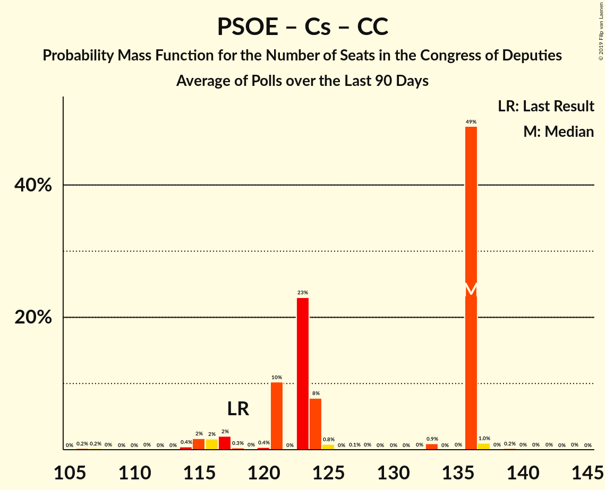
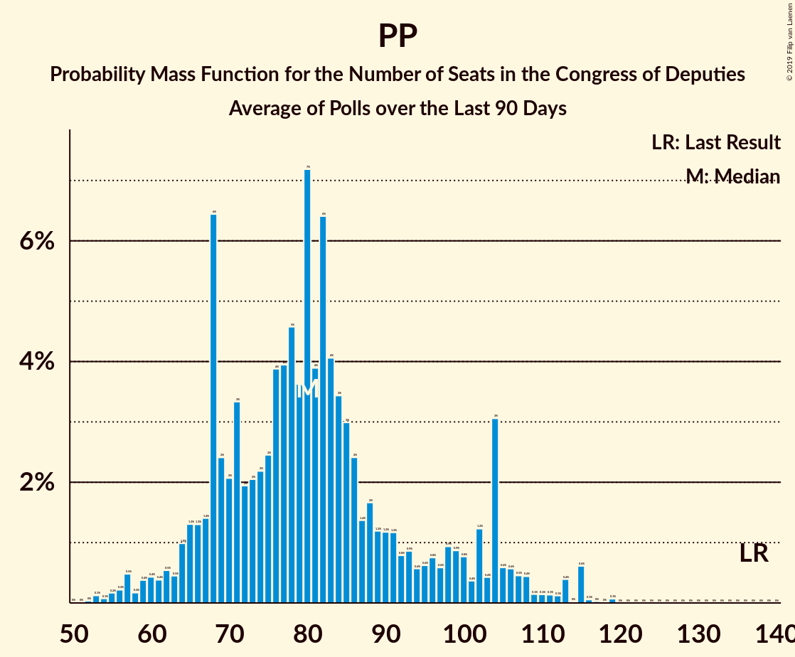

# Poll Average

<a href="#voting-intentions">Voting Intentions</a> | <a href="#seats">Seats</a> | <a href="#coalitions">Coalitions</a> | <a href="#technical-information">Technical Information</a>

## Summary

The table below lists the polls on which the average is based. They are the most recent polls (less than 90 days old) registered and analyzed so far.

| Period     | Polling firm/Commissioner(s) | PP | PSOE | UP | Cs | ERC | PDeCAT | EAJ/PNV | PACMA | EH Bildu | CC | Vox | BNG |
|:----------:|:----------------------------:|:--:|:--:|:--:|:--:|:--:|:--:|:--:|:--:|:--:|:--:|:--:|:--:|
| 26 June 2016 | General Election | 33.0%   137 | 22.6%   85 | 21.2%   71 | 13.1%   32 | 2.7%   9 | 2.0%   8 | 1.2%   5 | 1.2%   0 | 0.8%   2 | 0.3%   1 | 0.2%   0 | 0.2%   0 |
| N/A | Poll Average | 14–25%   41–74 | 21–30%   57–99 | 11–18%   19–42 | 16–24%   37–62 | 2–5%   0 | 1–2%   0 | 1–2%   3–6 | 1–2%   0–1 | 0–2%   0–7 | 0–1%   0 | 6–14%   8–36 | N/A   N/A |
| [1–8 February 2019](2019-02-08-SimpleLógica.html) | Simple Lógica | 16–20%   47–53 | 23–28%   69–84 | 12–16%   21–30 | 15–19%   40–53 | N/A   N/A | N/A   N/A | N/A   N/A | N/A   N/A | N/A   N/A | N/A   N/A | 10–14%   23–38 | N/A   N/A |
| [4–8 February 2019](2019-02-08-Celeste-Tel.html) | Celeste-Tel   eldiario.es | 21–26%   59–71 | 21–26%   66–68 | 14–18%   29–37 | 17–22%   40–49 | 2–4%   0 | 1–3%   0 | 1–2%   3–6 | 1–2%   0 | 0–2%   1–3 | 0–1%   0 | 7–11%   14–27 | N/A   N/A |
| [26–30 January 2019](2019-01-30-electoPanel.html) | electoPanel   electomania.es | 19–22%   55–60 | 22–25%   63–67 | 14–16%   26–34 | 18–21%   44–53 | N/A   N/A | N/A   N/A | N/A   N/A | N/A   N/A | N/A   N/A | N/A   N/A | 11–13%   27–33 | N/A   N/A |
| [21–25 January 2019](2019-01-25-NCReport.html) | NC Report   La Razón | 21–27%   74 | 22–27%   68 | 14–19%   30–35 | 16–21%   41–44 | 2–4%   0 | 1–2%   0 | 0–2%   3–4 | N/A   N/A | 0–1%   0–1 | N/A   N/A | 8–11%   16 | N/A   N/A |
| [14–24 January 2019](2019-01-24-GAD3.html) | GAD3   ABC | 21–25%   60–70 | 25–29%   67–87 | 10–13%   19–21 | 15–19%   36–50 | 2–4%   0 | 1–2%   0 | 1–2%   4–5 | N/A   N/A | 0–1%   0–3 | 0–1%   0 | 8–11%   16–28 | N/A   N/A |
| [9–15 January 2019](2019-01-15-Metroscopia.html) | Metroscopia   Henneo | 18–21%   47–58 | 22–25%   62–72 | 16–19%   32–39 | 16–19%   38–49 | N/A   N/A | N/A   N/A | N/A   N/A | N/A   N/A | N/A   N/A | N/A   N/A | 11–13%   27–35 | N/A   N/A |
| [1–13 January 2019](2019-01-13-CIS.html) | CIS | 14–16%   41 | 28–32%   99 | 14–17%   32 | 16–19%   47 | 4–6%   0 | 1%   0 | 1–2%   4 | 1–2%   1 | 1–2%   5 | 0%   0 | 6–7%   8 | N/A   N/A |
| [22 December 2018–5 January 2019](2019-01-05-SocioMétrica.html) | SocioMétrica   El Español | 17–20%   47–56 | 21–24%   57–70 | 16–19%   27–46 | 17–20%   43–46 | 3–4%   0 | 1–2%   0 | 1–2%   3–6 | N/A   N/A | 1%   2–4 | 0–1%   0 | 11–14%   25–35 | N/A   N/A |
| [21–27 December 2018](2018-12-27-SigmaDos.html) | Sigma Dos   El Mundo | 17–22%   46–66 | 20–25%   50–76 | 14–18%   20–37 | 16–21%   37–59 | 3–5%   0 | 1–2%   0 | 1–2%   2–8 | N/A   N/A | N/A   N/A | N/A   N/A | 11–15%   27–39 | N/A   N/A |
| [10–13 December 2018](2018-12-13-IMOP.html) | IMOP   El Confidencial | 17–22%   50–53 | 23–29%   72–74 | 13–18%   32–37 | 18–23%   49–62 | 2–4%   0 | 1–3%   0 | 1–2%   3–6 | 1–3%   0 | 0–2%   2–7 | N/A   N/A | 7–10%   10–16 | N/A   N/A |
| [3–7 December 2018](2018-12-07-Invymark.html) | Invymark   laSexta | 21–25%   58–79 | 21–26%   58–67 | 13–17%   21–31 | 21–25%   51–71 | N/A   N/A | N/A   N/A | N/A   N/A | N/A   N/A | N/A   N/A | N/A   N/A | 6–9%   8–15 | N/A   N/A |
| 26 June 2016 | General Election | 33.0%   137 | 22.6%   85 | 21.2%   71 | 13.1%   32 | 2.7%   9 | 2.0%   8 | 1.2%   5 | 1.2%   0 | 0.8%   2 | 0.3%   1 | 0.2%   0 | 0.2%   0 |

Only polls for which at least the sample size has been published are included in the table above.

**Legend:**
+ **Top half of each row:** Voting intentions (95% confidence interval)
+ **Bottom half of each row:** Seat projections for the Congress of Deputies (95% confidence interval)
+ **PP:** Partido Popular
+ **PSOE:** Partido Socialista Obrero Español
+ **UP:** Unidos Podemos
+ **Cs:** Ciudadanos–Partido de la Ciudadanía
+ **ERC:** Esquerra Republicana de Catalunya
+ **PDeCAT:** Partit Demòcrata Europeu Català
+ **EAJ/PNV:** Euzko Alderdi Jeltzalea/Partido Nacionalista Vasco
+ **PACMA:** Partido Animalista Contra el Maltrato Animal
+ **EH Bildu:** Euskal Herria Bildu
+ **CC:** Coalición Canaria–Partido Nacionalista Canario
+ **Vox:** Vox
+ **BNG:** Bloque Nacionalista Galego–Nós Candidatura Galega
+ **N/A (single party):** Party not included the published results
+ **N/A (entire row):** Calculation for this opinion poll not started yet

## Voting Intentions

### Confidence Intervals

| Party | Last Result | Median | 80% Confidence Interval | 90% Confidence Interval | 95% Confidence Interval | 99% Confidence Interval |
|:-----:|:-----------:|:------:|:-----------------------:|:-----------------------:|:-----------------------:|:-----------------------:|
| <a href="#partido-popular">Partido Popular</a> | 33.0% | 19.9% | 16.4–24.0% |15.0–24.7% | 14.5–25.3% | 13.9–26.4% |
| <a href="#partido-socialista-obrero-español">Partido Socialista Obrero Español</a> | 22.6% | 24.1% | 22.1–28.2% |21.6–29.8% | 21.1–30.4% | 20.3–31.3% |
| <a href="#unidos-podemos">Unidos Podemos</a> | 21.2% | 15.5% | 12.8–17.5% |11.7–17.9% | 11.2–18.3% | 10.5–19.0% |
| <a href="#ciudadanos–partido-de-la-ciudadanía">Ciudadanos–Partido de la Ciudadanía</a> | 13.1% | 18.6% | 16.8–21.7% |16.3–22.9% | 15.9–23.7% | 15.1–24.9% |
| <a href="#esquerra-republicana-de-catalunya">Esquerra Republicana de Catalunya</a> | 2.7% | 3.2% | 2.4–4.6% |2.3–4.9% | 2.1–5.1% | 1.9–5.5% |
| <a href="#partit-demòcrata-europeu-català">Partit Demòcrata Europeu Català</a> | 2.0% | 1.4% | 0.9–2.0% |0.8–2.2% | 0.7–2.4% | 0.6–2.7% |
| <a href="#euzko-alderdi-jeltzalea/partido-nacionalista-vasco">Euzko Alderdi Jeltzalea/Partido Nacionalista Vasco</a> | 1.2% | 1.2% | 0.8–1.6% |0.7–1.8% | 0.6–1.9% | 0.5–2.2% |
| <a href="#partido-animalista-contra-el-maltrato-animal">Partido Animalista Contra el Maltrato Animal</a> | 1.2% | 1.6% | 1.0–2.1% |0.8–2.2% | 0.7–2.4% | 0.6–2.7% |
| <a href="#euskal-herria-bildu">Euskal Herria Bildu</a> | 0.8% | 0.9% | 0.5–1.3% |0.5–1.4% | 0.4–1.5% | 0.3–1.7% |
| <a href="#coalición-canaria–partido-nacionalista-canario">Coalición Canaria–Partido Nacionalista Canario</a> | 0.3% | 0.3% | 0.1–0.5% |0.1–0.6% | 0.1–0.7% | 0.1–0.8% |
| <a href="#vox">Vox</a> | 0.2% | 10.2% | 6.9–12.9% |6.4–13.4% | 6.2–13.8% | 5.8–14.7% |
| <a href="#bloque-nacionalista-galego–nós-candidatura-galega">Bloque Nacionalista Galego–Nós Candidatura Galega</a> | 0.2% | N/A | N/A |N/A | N/A | N/A |

### Partido Popular

*For a full overview of the results for this party, see the [Partido Popular](party-partidopopular.html) page.*

| Voting Intentions | Probability | Accumulated | Special Marks |
|:-----------------:|:-----------:|:-----------:|:-------------:|
| 11.5–12.5% | 0% | 100% |  |
| 12.5–13.5% | 0.1% | 100% |  |
| 13.5–14.5% | 3% | 99.9% |  |
| 14.5–15.5% | 5% | 97% |  |
| 15.5–16.5% | 3% | 92% |  |
| 16.5–17.5% | 5% | 90% |  |
| 17.5–18.5% | 12% | 85% |  |
| 18.5–19.5% | 16% | 72% |  |
| 19.5–20.5% | 13% | 56% | Median |
| 20.5–21.5% | 8% | 43% |  |
| 21.5–22.5% | 9% | 35% |  |
| 22.5–23.5% | 11% | 26% |  |
| 23.5–24.5% | 9% | 15% |  |
| 24.5–25.5% | 4% | 6% |  |
| 25.5–26.5% | 1.4% | 2% |  |
| 26.5–27.5% | 0.3% | 0.4% |  |
| 27.5–28.5% | 0.1% | 0.1% |  |
| 28.5–29.5% | 0% | 0% |  |
| 29.5–30.5% | 0% | 0% |  |
| 30.5–31.5% | 0% | 0% |  |
| 31.5–32.5% | 0% | 0% |  |
| 32.5–33.5% | 0% | 0% | Last Result |

### Partido Socialista Obrero Español

*For a full overview of the results for this party, see the [Partido Socialista Obrero Español](party-partidosocialistaobreroespañol.html) page.*

| Voting Intentions | Probability | Accumulated | Special Marks |
|:-----------------:|:-----------:|:-----------:|:-------------:|
| 17.5–18.5% | 0% | 100% |  |
| 18.5–19.5% | 0.1% | 100% |  |
| 19.5–20.5% | 0.7% | 99.9% |  |
| 20.5–21.5% | 4% | 99.2% |  |
| 21.5–22.5% | 13% | 95% |  |
| 22.5–23.5% | 21% | 82% | Last Result |
| 23.5–24.5% | 19% | 61% | Median |
| 24.5–25.5% | 13% | 42% |  |
| 25.5–26.5% | 10% | 29% |  |
| 26.5–27.5% | 7% | 19% |  |
| 27.5–28.5% | 3% | 12% |  |
| 28.5–29.5% | 3% | 9% |  |
| 29.5–30.5% | 4% | 6% |  |
| 30.5–31.5% | 2% | 2% |  |
| 31.5–32.5% | 0.2% | 0.2% |  |
| 32.5–33.5% | 0% | 0% |  |

### Unidos Podemos

*For a full overview of the results for this party, see the [Unidos Podemos](party-unidospodemos.html) page.*

| Voting Intentions | Probability | Accumulated | Special Marks |
|:-----------------:|:-----------:|:-----------:|:-------------:|
| 8.5–9.5% | 0% | 100% |  |
| 9.5–10.5% | 0.6% | 100% |  |
| 10.5–11.5% | 4% | 99.4% |  |
| 11.5–12.5% | 5% | 96% |  |
| 12.5–13.5% | 5% | 91% |  |
| 13.5–14.5% | 13% | 86% |  |
| 14.5–15.5% | 24% | 73% |  |
| 15.5–16.5% | 23% | 49% | Median |
| 16.5–17.5% | 17% | 27% |  |
| 17.5–18.5% | 8% | 9% |  |
| 18.5–19.5% | 1.4% | 1.5% |  |
| 19.5–20.5% | 0.1% | 0.1% |  |
| 20.5–21.5% | 0% | 0% | Last Result |

### Ciudadanos–Partido de la Ciudadanía

*For a full overview of the results for this party, see the [Ciudadanos–Partido de la Ciudadanía](party-ciudadanos–partidodelaciudadanía.html) page.*

| Voting Intentions | Probability | Accumulated | Special Marks |
|:-----------------:|:-----------:|:-----------:|:-------------:|
| 12.5–13.5% | 0% | 100% | Last Result |
| 13.5–14.5% | 0.1% | 100% |  |
| 14.5–15.5% | 1.1% | 99.9% |  |
| 15.5–16.5% | 6% | 98.8% |  |
| 16.5–17.5% | 17% | 93% |  |
| 17.5–18.5% | 24% | 76% |  |
| 18.5–19.5% | 21% | 52% | Median |
| 19.5–20.5% | 14% | 31% |  |
| 20.5–21.5% | 7% | 17% |  |
| 21.5–22.5% | 4% | 11% |  |
| 22.5–23.5% | 3% | 6% |  |
| 23.5–24.5% | 2% | 3% |  |
| 24.5–25.5% | 0.7% | 0.9% |  |
| 25.5–26.5% | 0.1% | 0.2% |  |
| 26.5–27.5% | 0% | 0% |  |

### Esquerra Republicana de Catalunya

*For a full overview of the results for this party, see the [Esquerra Republicana de Catalunya](party-esquerrarepublicanadecatalunya.html) page.*

| Voting Intentions | Probability | Accumulated | Special Marks |
|:-----------------:|:-----------:|:-----------:|:-------------:|
| 0.5–1.5% | 0% | 100% |  |
| 1.5–2.5% | 14% | 100% |  |
| 2.5–3.5% | 55% | 86% | Last Result, Median |
| 3.5–4.5% | 21% | 32% |  |
| 4.5–5.5% | 10% | 11% |  |
| 5.5–6.5% | 0.3% | 0.3% |  |
| 6.5–7.5% | 0% | 0% |  |

### Partit Demòcrata Europeu Català

*For a full overview of the results for this party, see the [Partit Demòcrata Europeu Català](party-partitdemòcrataeuropeucatalà.html) page.*

| Voting Intentions | Probability | Accumulated | Special Marks |
|:-----------------:|:-----------:|:-----------:|:-------------:|
| 0.0–0.5% | 0.4% | 100% |  |
| 0.5–1.5% | 62% | 99.6% | Median |
| 1.5–2.5% | 37% | 38% | Last Result |
| 2.5–3.5% | 1.2% | 1.2% |  |
| 3.5–4.5% | 0% | 0% |  |

### Euzko Alderdi Jeltzalea/Partido Nacionalista Vasco

*For a full overview of the results for this party, see the [Euzko Alderdi Jeltzalea/Partido Nacionalista Vasco](party-euzkoalderdijeltzaleapartidonacionalistavasco.html) page.*

| Voting Intentions | Probability | Accumulated | Special Marks |
|:-----------------:|:-----------:|:-----------:|:-------------:|
| 0.0–0.5% | 1.0% | 100% |  |
| 0.5–1.5% | 84% | 99.0% | Last Result, Median |
| 1.5–2.5% | 15% | 15% |  |
| 2.5–3.5% | 0.1% | 0.1% |  |
| 3.5–4.5% | 0% | 0% |  |

### Partido Animalista Contra el Maltrato Animal

*For a full overview of the results for this party, see the [Partido Animalista Contra el Maltrato Animal](party-partidoanimalistacontraelmaltratoanimal.html) page.*

| Voting Intentions | Probability | Accumulated | Special Marks |
|:-----------------:|:-----------:|:-----------:|:-------------:|
| 0.0–0.5% | 0.3% | 100% |  |
| 0.5–1.5% | 48% | 99.7% | Last Result |
| 1.5–2.5% | 50% | 52% | Median |
| 2.5–3.5% | 1.2% | 1.2% |  |
| 3.5–4.5% | 0% | 0% |  |

### Euskal Herria Bildu

*For a full overview of the results for this party, see the [Euskal Herria Bildu](party-euskalherriabildu.html) page.*

| Voting Intentions | Probability | Accumulated | Special Marks |
|:-----------------:|:-----------:|:-----------:|:-------------:|
| 0.0–0.5% | 11% | 100% |  |
| 0.5–1.5% | 88% | 89% | Last Result, Median |
| 1.5–2.5% | 2% | 2% |  |
| 2.5–3.5% | 0% | 0% |  |

### Coalición Canaria–Partido Nacionalista Canario

*For a full overview of the results for this party, see the [Coalición Canaria–Partido Nacionalista Canario](party-coalicióncanaria–partidonacionalistacanario.html) page.*

| Voting Intentions | Probability | Accumulated | Special Marks |
|:-----------------:|:-----------:|:-----------:|:-------------:|
| 0.0–0.5% | 93% | 100% | Last Result, Median |
| 0.5–1.5% | 7% | 7% |  |
| 1.5–2.5% | 0% | 0% |  |

### Vox

*For a full overview of the results for this party, see the [Vox](party-vox.html) page.*

| Voting Intentions | Probability | Accumulated | Special Marks |
|:-----------------:|:-----------:|:-----------:|:-------------:|
| 0.0–0.5% | 0% | 100% | Last Result |
| 0.5–1.5% | 0% | 100% |  |
| 1.5–2.5% | 0% | 100% |  |
| 2.5–3.5% | 0% | 100% |  |
| 3.5–4.5% | 0% | 100% |  |
| 4.5–5.5% | 0.2% | 100% |  |
| 5.5–6.5% | 6% | 99.8% |  |
| 6.5–7.5% | 11% | 94% |  |
| 7.5–8.5% | 11% | 83% |  |
| 8.5–9.5% | 13% | 71% |  |
| 9.5–10.5% | 11% | 58% | Median |
| 10.5–11.5% | 10% | 47% |  |
| 11.5–12.5% | 20% | 37% |  |
| 12.5–13.5% | 13% | 17% |  |
| 13.5–14.5% | 3% | 4% |  |
| 14.5–15.5% | 0.6% | 0.7% |  |
| 15.5–16.5% | 0.1% | 0.1% |  |
| 16.5–17.5% | 0% | 0% |  |

## Seats

### Confidence Intervals

| Party | Last Result | Median | 80% Confidence Interval | 90% Confidence Interval | 95% Confidence Interval | 99% Confidence Interval |
|:-----:|:-----------:|:------:|:-----------------------:|:-----------------------:|:-----------------------:|:-----------------------:|
| <a href="#partido-popular">Partido Popular</a> | 137 | 55 | 46–71 |41–74 | 41–74 | 41–75 |
| <a href="#partido-socialista-obrero-español">Partido Socialista Obrero Español</a> | 85 | 68 | 59–87 |57–99 | 57–99 | 50–99 |
| <a href="#unidos-podemos">Unidos Podemos</a> | 71 | 30 | 21–38 |19–42 | 19–42 | 19–46 |
| <a href="#ciudadanos–partido-de-la-ciudadanía">Ciudadanos–Partido de la Ciudadanía</a> | 32 | 47 | 40–61 |38–62 | 37–62 | 36–62 |
| <a href="#esquerra-republicana-de-catalunya">Esquerra Republicana de Catalunya</a> | 9 | 0 | 0 |0 | 0 | 0 |
| <a href="#partit-demòcrata-europeu-català">Partit Demòcrata Europeu Català</a> | 8 | 0 | 0 |0 | 0 | 0 |
| <a href="#euzko-alderdi-jeltzalea/partido-nacionalista-vasco">Euzko Alderdi Jeltzalea/Partido Nacionalista Vasco</a> | 5 | 4 | 3–6 |3–6 | 3–6 | 2–7 |
| <a href="#partido-animalista-contra-el-maltrato-animal">Partido Animalista Contra el Maltrato Animal</a> | 0 | 0 | 0–1 |0–1 | 0–1 | 0–1 |
| <a href="#euskal-herria-bildu">Euskal Herria Bildu</a> | 2 | 3 | 0–7 |0–7 | 0–7 | 0–7 |
| <a href="#coalición-canaria–partido-nacionalista-canario">Coalición Canaria–Partido Nacionalista Canario</a> | 1 | 0 | 0 |0 | 0 | 0 |
| <a href="#vox">Vox</a> | 0 | 25 | 9–35 |8–36 | 8–36 | 8–38 |
| <a href="#bloque-nacionalista-galego–nós-candidatura-galega">Bloque Nacionalista Galego–Nós Candidatura Galega</a> | 0 | N/A | N/A |N/A | N/A | N/A |

### Partido Popular

*For a full overview of the results for this party, see the [Partido Popular](party-partidopopular.html) page.*

| Number of Seats | Probability | Accumulated | Special Marks |
|:---------------:|:-----------:|:-----------:|:-------------:|
| 41 | 9% | 100% |  |
| 42 | 0% | 91% |  |
| 43 | 0% | 91% |  |
| 44 | 0% | 91% |  |
| 45 | 0% | 91% |  |
| 46 | 1.3% | 91% |  |
| 47 | 5% | 90% |  |
| 48 | 2% | 85% |  |
| 49 | 6% | 83% |  |
| 50 | 15% | 77% |  |
| 51 | 2% | 62% |  |
| 52 | 1.4% | 60% |  |
| 53 | 0.6% | 59% |  |
| 54 | 5% | 58% |  |
| 55 | 8% | 53% | Median |
| 56 | 4% | 45% |  |
| 57 | 0.1% | 42% |  |
| 58 | 1.4% | 42% |  |
| 59 | 0.8% | 40% |  |
| 60 | 7% | 40% |  |
| 61 | 0.1% | 33% |  |
| 62 | 2% | 33% |  |
| 63 | 0% | 31% |  |
| 64 | 2% | 31% |  |
| 65 | 0.7% | 29% |  |
| 66 | 0.8% | 29% |  |
| 67 | 0.5% | 28% |  |
| 68 | 3% | 27% |  |
| 69 | 11% | 25% |  |
| 70 | 2% | 14% |  |
| 71 | 3% | 12% |  |
| 72 | 0% | 10% |  |
| 73 | 0% | 10% |  |
| 74 | 9% | 10% |  |
| 75 | 0.2% | 0.7% |  |
| 76 | 0% | 0.5% |  |
| 77 | 0% | 0.5% |  |
| 78 | 0.2% | 0.5% |  |
| 79 | 0.2% | 0.3% |  |
| 80 | 0% | 0.1% |  |
| 81 | 0.1% | 0.1% |  |
| 82 | 0% | 0% |  |
| 83 | 0% | 0% |  |
| 84 | 0% | 0% |  |
| 85 | 0% | 0% |  |
| 86 | 0% | 0% |  |
| 87 | 0% | 0% |  |
| 88 | 0% | 0% |  |
| 89 | 0% | 0% |  |
| 90 | 0% | 0% |  |
| 91 | 0% | 0% |  |
| 92 | 0% | 0% |  |
| 93 | 0% | 0% |  |
| 94 | 0% | 0% |  |
| 95 | 0% | 0% |  |
| 96 | 0% | 0% |  |
| 97 | 0% | 0% |  |
| 98 | 0% | 0% |  |
| 99 | 0% | 0% |  |
| 100 | 0% | 0% |  |
| 101 | 0% | 0% |  |
| 102 | 0% | 0% |  |
| 103 | 0% | 0% |  |
| 104 | 0% | 0% |  |
| 105 | 0% | 0% |  |
| 106 | 0% | 0% |  |
| 107 | 0% | 0% |  |
| 108 | 0% | 0% |  |
| 109 | 0% | 0% |  |
| 110 | 0% | 0% |  |
| 111 | 0% | 0% |  |
| 112 | 0% | 0% |  |
| 113 | 0% | 0% |  |
| 114 | 0% | 0% |  |
| 115 | 0% | 0% |  |
| 116 | 0% | 0% |  |
| 117 | 0% | 0% |  |
| 118 | 0% | 0% |  |
| 119 | 0% | 0% |  |
| 120 | 0% | 0% |  |
| 121 | 0% | 0% |  |
| 122 | 0% | 0% |  |
| 123 | 0% | 0% |  |
| 124 | 0% | 0% |  |
| 125 | 0% | 0% |  |
| 126 | 0% | 0% |  |
| 127 | 0% | 0% |  |
| 128 | 0% | 0% |  |
| 129 | 0% | 0% |  |
| 130 | 0% | 0% |  |
| 131 | 0% | 0% |  |
| 132 | 0% | 0% |  |
| 133 | 0% | 0% |  |
| 134 | 0% | 0% |  |
| 135 | 0% | 0% |  |
| 136 | 0% | 0% |  |
| 137 | 0% | 0% | Last Result |

### Partido Socialista Obrero Español

*For a full overview of the results for this party, see the [Partido Socialista Obrero Español](party-partidosocialistaobreroespañol.html) page.*

| Number of Seats | Probability | Accumulated | Special Marks |
|:---------------:|:-----------:|:-----------:|:-------------:|
| 50 | 0.7% | 100% |  |
| 51 | 0% | 99.3% |  |
| 52 | 0% | 99.3% |  |
| 53 | 0% | 99.3% |  |
| 54 | 0% | 99.3% |  |
| 55 | 0% | 99.3% |  |
| 56 | 0.3% | 99.3% |  |
| 57 | 6% | 99.0% |  |
| 58 | 0% | 93% |  |
| 59 | 3% | 93% |  |
| 60 | 0.7% | 89% |  |
| 61 | 3% | 89% |  |
| 62 | 4% | 85% |  |
| 63 | 3% | 81% |  |
| 64 | 5% | 78% |  |
| 65 | 2% | 74% |  |
| 66 | 7% | 71% |  |
| 67 | 8% | 64% |  |
| 68 | 12% | 57% | Median |
| 69 | 7% | 45% |  |
| 70 | 2% | 37% |  |
| 71 | 0.2% | 36% |  |
| 72 | 0.5% | 36% |  |
| 73 | 0.1% | 35% |  |
| 74 | 9% | 35% |  |
| 75 | 2% | 26% |  |
| 76 | 0.8% | 24% |  |
| 77 | 0% | 23% |  |
| 78 | 0.1% | 23% |  |
| 79 | 0.1% | 23% |  |
| 80 | 0.2% | 23% |  |
| 81 | 2% | 23% |  |
| 82 | 4% | 21% |  |
| 83 | 6% | 18% |  |
| 84 | 1.0% | 12% |  |
| 85 | 0% | 11% | Last Result |
| 86 | 0.1% | 11% |  |
| 87 | 2% | 11% |  |
| 88 | 0% | 9% |  |
| 89 | 0% | 9% |  |
| 90 | 0% | 9% |  |
| 91 | 0% | 9% |  |
| 92 | 0% | 9% |  |
| 93 | 0% | 9% |  |
| 94 | 0% | 9% |  |
| 95 | 0% | 9% |  |
| 96 | 0% | 9% |  |
| 97 | 0% | 9% |  |
| 98 | 0% | 9% |  |
| 99 | 9% | 9% |  |
| 100 | 0% | 0% |  |

### Unidos Podemos

*For a full overview of the results for this party, see the [Unidos Podemos](party-unidospodemos.html) page.*

| Number of Seats | Probability | Accumulated | Special Marks |
|:---------------:|:-----------:|:-----------:|:-------------:|
| 18 | 0.1% | 100% |  |
| 19 | 5% | 99.9% |  |
| 20 | 4% | 95% |  |
| 21 | 2% | 91% |  |
| 22 | 2% | 89% |  |
| 23 | 0.8% | 87% |  |
| 24 | 0.1% | 86% |  |
| 25 | 0.3% | 86% |  |
| 26 | 5% | 86% |  |
| 27 | 7% | 80% |  |
| 28 | 8% | 73% |  |
| 29 | 6% | 65% |  |
| 30 | 15% | 59% | Median |
| 31 | 0.5% | 44% |  |
| 32 | 18% | 44% |  |
| 33 | 2% | 25% |  |
| 34 | 0.7% | 23% |  |
| 35 | 2% | 23% |  |
| 36 | 2% | 20% |  |
| 37 | 8% | 19% |  |
| 38 | 2% | 11% |  |
| 39 | 0.7% | 9% |  |
| 40 | 0% | 9% |  |
| 41 | 0.2% | 8% |  |
| 42 | 6% | 8% |  |
| 43 | 0.2% | 2% |  |
| 44 | 0% | 2% |  |
| 45 | 0.1% | 2% |  |
| 46 | 2% | 2% |  |
| 47 | 0% | 0% |  |
| 48 | 0% | 0% |  |
| 49 | 0% | 0% |  |
| 50 | 0% | 0% |  |
| 51 | 0% | 0% |  |
| 52 | 0% | 0% |  |
| 53 | 0% | 0% |  |
| 54 | 0% | 0% |  |
| 55 | 0% | 0% |  |
| 56 | 0% | 0% |  |
| 57 | 0% | 0% |  |
| 58 | 0% | 0% |  |
| 59 | 0% | 0% |  |
| 60 | 0% | 0% |  |
| 61 | 0% | 0% |  |
| 62 | 0% | 0% |  |
| 63 | 0% | 0% |  |
| 64 | 0% | 0% |  |
| 65 | 0% | 0% |  |
| 66 | 0% | 0% |  |
| 67 | 0% | 0% |  |
| 68 | 0% | 0% |  |
| 69 | 0% | 0% |  |
| 70 | 0% | 0% |  |
| 71 | 0% | 0% | Last Result |

### Ciudadanos–Partido de la Ciudadanía

*For a full overview of the results for this party, see the [Ciudadanos–Partido de la Ciudadanía](party-ciudadanos–partidodelaciudadanía.html) page.*

| Number of Seats | Probability | Accumulated | Special Marks |
|:---------------:|:-----------:|:-----------:|:-------------:|
| 32 | 0% | 100% | Last Result |
| 33 | 0% | 100% |  |
| 34 | 0.1% | 100% |  |
| 35 | 0.1% | 99.9% |  |
| 36 | 2% | 99.8% |  |
| 37 | 0.8% | 98% |  |
| 38 | 6% | 97% |  |
| 39 | 0.1% | 91% |  |
| 40 | 3% | 91% |  |
| 41 | 9% | 88% |  |
| 42 | 1.3% | 80% |  |
| 43 | 9% | 78% |  |
| 44 | 10% | 69% |  |
| 45 | 3% | 60% |  |
| 46 | 7% | 57% |  |
| 47 | 9% | 50% | Median |
| 48 | 6% | 41% |  |
| 49 | 6% | 34% |  |
| 50 | 1.3% | 28% |  |
| 51 | 4% | 27% |  |
| 52 | 0.3% | 23% |  |
| 53 | 0.9% | 22% |  |
| 54 | 0.8% | 22% |  |
| 55 | 2% | 21% |  |
| 56 | 0.2% | 19% |  |
| 57 | 0.1% | 18% |  |
| 58 | 1.1% | 18% |  |
| 59 | 1.3% | 17% |  |
| 60 | 2% | 16% |  |
| 61 | 5% | 14% |  |
| 62 | 9% | 9% |  |
| 63 | 0% | 0.5% |  |
| 64 | 0% | 0.5% |  |
| 65 | 0% | 0.5% |  |
| 66 | 0% | 0.5% |  |
| 67 | 0% | 0.5% |  |
| 68 | 0% | 0.4% |  |
| 69 | 0% | 0.4% |  |
| 70 | 0% | 0.4% |  |
| 71 | 0.4% | 0.4% |  |
| 72 | 0% | 0% |  |

### Esquerra Republicana de Catalunya

*For a full overview of the results for this party, see the [Esquerra Republicana de Catalunya](party-esquerrarepublicanadecatalunya.html) page.*

| Number of Seats | Probability | Accumulated | Special Marks |
|:---------------:|:-----------:|:-----------:|:-------------:|
| 0 | 100% | 100% | Median |
| 1 | 0% | 0% |  |
| 2 | 0% | 0% |  |
| 3 | 0% | 0% |  |
| 4 | 0% | 0% |  |
| 5 | 0% | 0% |  |
| 6 | 0% | 0% |  |
| 7 | 0% | 0% |  |
| 8 | 0% | 0% |  |
| 9 | 0% | 0% | Last Result |

### Partit Demòcrata Europeu Català

*For a full overview of the results for this party, see the [Partit Demòcrata Europeu Català](party-partitdemòcrataeuropeucatalà.html) page.*

| Number of Seats | Probability | Accumulated | Special Marks |
|:---------------:|:-----------:|:-----------:|:-------------:|
| 0 | 100% | 100% | Median |
| 1 | 0% | 0% |  |
| 2 | 0% | 0% |  |
| 3 | 0% | 0% |  |
| 4 | 0% | 0% |  |
| 5 | 0% | 0% |  |
| 6 | 0% | 0% |  |
| 7 | 0% | 0% |  |
| 8 | 0% | 0% | Last Result |

### Euzko Alderdi Jeltzalea/Partido Nacionalista Vasco

*For a full overview of the results for this party, see the [Euzko Alderdi Jeltzalea/Partido Nacionalista Vasco](party-euzkoalderdijeltzaleapartidonacionalistavasco.html) page.*

| Number of Seats | Probability | Accumulated | Special Marks |
|:---------------:|:-----------:|:-----------:|:-------------:|
| 2 | 2% | 100% |  |
| 3 | 27% | 98% |  |
| 4 | 42% | 71% | Median |
| 5 | 12% | 29% | Last Result |
| 6 | 15% | 17% |  |
| 7 | 1.0% | 1.5% |  |
| 8 | 0.4% | 0.4% |  |
| 9 | 0% | 0.1% |  |
| 10 | 0.1% | 0.1% |  |
| 11 | 0% | 0% |  |

### Partido Animalista Contra el Maltrato Animal

*For a full overview of the results for this party, see the [Partido Animalista Contra el Maltrato Animal](party-partidoanimalistacontraelmaltratoanimal.html) page.*

| Number of Seats | Probability | Accumulated | Special Marks |
|:---------------:|:-----------:|:-----------:|:-------------:|
| 0 | 66% | 100% | Last Result, Median |
| 1 | 34% | 34% |  |
| 2 | 0% | 0% |  |

### Euskal Herria Bildu

*For a full overview of the results for this party, see the [Euskal Herria Bildu](party-euskalherriabildu.html) page.*

| Number of Seats | Probability | Accumulated | Special Marks |
|:---------------:|:-----------:|:-----------:|:-------------:|
| 0 | 19% | 100% |  |
| 1 | 2% | 81% |  |
| 2 | 17% | 79% | Last Result |
| 3 | 18% | 62% | Median |
| 4 | 11% | 44% |  |
| 5 | 17% | 33% |  |
| 6 | 0.1% | 16% |  |
| 7 | 16% | 16% |  |
| 8 | 0% | 0% |  |

### Coalición Canaria–Partido Nacionalista Canario

*For a full overview of the results for this party, see the [Coalición Canaria–Partido Nacionalista Canario](party-coalicióncanaria–partidonacionalistacanario.html) page.*

| Number of Seats | Probability | Accumulated | Special Marks |
|:---------------:|:-----------:|:-----------:|:-------------:|
| 0 | 100% | 100% | Median |
| 1 | 0% | 0% | Last Result |

### Vox

*For a full overview of the results for this party, see the [Vox](party-vox.html) page.*

| Number of Seats | Probability | Accumulated | Special Marks |
|:---------------:|:-----------:|:-----------:|:-------------:|
| 0 | 0% | 100% | Last Result |
| 1 | 0% | 100% |  |
| 2 | 0% | 100% |  |
| 3 | 0% | 100% |  |
| 4 | 0% | 100% |  |
| 5 | 0% | 100% |  |
| 6 | 0% | 100% |  |
| 7 | 0.2% | 100% |  |
| 8 | 10% | 99.8% |  |
| 9 | 5% | 90% |  |
| 10 | 9% | 85% |  |
| 11 | 2% | 76% |  |
| 12 | 0.1% | 74% |  |
| 13 | 0.2% | 74% |  |
| 14 | 3% | 74% |  |
| 15 | 7% | 71% |  |
| 16 | 10% | 65% |  |
| 17 | 0.2% | 55% |  |
| 18 | 2% | 55% |  |
| 19 | 0% | 53% |  |
| 20 | 0.1% | 53% |  |
| 21 | 0% | 53% |  |
| 22 | 0% | 52% |  |
| 23 | 0.3% | 52% |  |
| 24 | 0.9% | 52% |  |
| 25 | 10% | 51% | Median |
| 26 | 2% | 41% |  |
| 27 | 3% | 39% |  |
| 28 | 2% | 36% |  |
| 29 | 3% | 34% |  |
| 30 | 12% | 31% |  |
| 31 | 0.9% | 19% |  |
| 32 | 1.4% | 18% |  |
| 33 | 3% | 17% |  |
| 34 | 0.7% | 14% |  |
| 35 | 8% | 13% |  |
| 36 | 3% | 5% |  |
| 37 | 1.4% | 2% |  |
| 38 | 0.8% | 1.1% |  |
| 39 | 0.2% | 0.3% |  |
| 40 | 0.1% | 0.1% |  |
| 41 | 0% | 0% |  |

## Coalitions

### Confidence Intervals

| Coalition | Last Result | Median | Majority? | 80% Confidence Interval | 90% Confidence Interval | 95% Confidence Interval | 99% Confidence Interval |
|:---------:|:-----------:|:------:|:---------:|:-----------------------:|:-----------------------:|:-----------------------:|:-----------------------:|
| Partido Popular – Ciudadanos–Partido de la Ciudadanía – Vox | 169 | 130 | 0% | 115–139 | 96–141 | 96–147 | 96–155 |
| Partido Socialista Obrero Español – Ciudadanos–Partido de la Ciudadanía – Coalición Canaria–Partido Nacionalista Canario | 118 | 115 | 0% | 107–136 | 103–146 | 103–146 | 102–146 |
| Partido Socialista Obrero Español – Ciudadanos–Partido de la Ciudadanía | 117 | 115 | 0% | 107–136 | 103–146 | 103–146 | 102–146 |
| Partido Socialista Obrero Español – Unidos Podemos | 156 | 99 | 0% | 90–113 | 87–131 | 81–131 | 73–131 |
| Partido Popular – Ciudadanos–Partido de la Ciudadanía – Coalición Canaria–Partido Nacionalista Canario | 170 | 105 | 0% | 89–118 | 88–130 | 88–130 | 88–130 |
| Partido Popular – Ciudadanos–Partido de la Ciudadanía | 169 | 105 | 0% | 89–118 | 88–130 | 88–130 | 88–130 |
| Partido Socialista Obrero Español – Coalición Canaria–Partido Nacionalista Canario | 86 | 68 | 0% | 59–87 | 57–99 | 57–99 | 50–99 |
| Partido Socialista Obrero Español | 85 | 68 | 0% | 59–87 | 57–99 | 57–99 | 50–99 |
| Partido Popular – Vox | 137 | 84 | 0% | 60–90 | 49–92 | 49–92 | 49–101 |
| Partido Popular | 137 | 55 | 0% | 46–71 | 41–74 | 41–74 | 41–75 |

### Partido Popular – Ciudadanos–Partido de la Ciudadanía – Vox

| Number of Seats | Probability | Accumulated | Special Marks |
|:---------------:|:-----------:|:-----------:|:-------------:|
| 96 | 9% | 100% |  |
| 97 | 0% | 91% |  |
| 98 | 0% | 91% |  |
| 99 | 0% | 91% |  |
| 100 | 0% | 91% |  |
| 101 | 0% | 91% |  |
| 102 | 0% | 91% |  |
| 103 | 0% | 91% |  |
| 104 | 0% | 91% |  |
| 105 | 0% | 91% |  |
| 106 | 0% | 91% |  |
| 107 | 0% | 91% |  |
| 108 | 0% | 91% |  |
| 109 | 0% | 91% |  |
| 110 | 0% | 91% |  |
| 111 | 0% | 91% |  |
| 112 | 0% | 91% |  |
| 113 | 0.1% | 91% |  |
| 114 | 0.3% | 91% |  |
| 115 | 3% | 90% |  |
| 116 | 3% | 88% |  |
| 117 | 2% | 84% |  |
| 118 | 0.2% | 83% |  |
| 119 | 0.8% | 83% |  |
| 120 | 0.4% | 82% |  |
| 121 | 1.4% | 81% |  |
| 122 | 12% | 80% |  |
| 123 | 2% | 68% |  |
| 124 | 2% | 65% |  |
| 125 | 3% | 63% |  |
| 126 | 2% | 60% |  |
| 127 | 0.8% | 58% | Median |
| 128 | 5% | 57% |  |
| 129 | 0.2% | 52% |  |
| 130 | 7% | 51% |  |
| 131 | 0.8% | 45% |  |
| 132 | 2% | 44% |  |
| 133 | 10% | 41% |  |
| 134 | 11% | 31% |  |
| 135 | 0.4% | 20% |  |
| 136 | 3% | 20% |  |
| 137 | 3% | 17% |  |
| 138 | 2% | 14% |  |
| 139 | 7% | 13% |  |
| 140 | 0% | 5% |  |
| 141 | 1.0% | 5% |  |
| 142 | 1.5% | 4% |  |
| 143 | 0.1% | 3% |  |
| 144 | 0% | 3% |  |
| 145 | 0% | 3% |  |
| 146 | 0% | 3% |  |
| 147 | 2% | 3% |  |
| 148 | 0% | 0.8% |  |
| 149 | 0.1% | 0.8% |  |
| 150 | 0% | 0.7% |  |
| 151 | 0% | 0.7% |  |
| 152 | 0% | 0.7% |  |
| 153 | 0% | 0.7% |  |
| 154 | 0% | 0.7% |  |
| 155 | 0.7% | 0.7% |  |
| 156 | 0% | 0% |  |
| 157 | 0% | 0% |  |
| 158 | 0% | 0% |  |
| 159 | 0% | 0% |  |
| 160 | 0% | 0% |  |
| 161 | 0% | 0% |  |
| 162 | 0% | 0% |  |
| 163 | 0% | 0% |  |
| 164 | 0% | 0% |  |
| 165 | 0% | 0% |  |
| 166 | 0% | 0% |  |
| 167 | 0% | 0% |  |
| 168 | 0% | 0% |  |
| 169 | 0% | 0% | Last Result |

### Partido Socialista Obrero Español – Ciudadanos–Partido de la Ciudadanía – Coalición Canaria–Partido Nacionalista Canario

| Number of Seats | Probability | Accumulated | Special Marks |
|:---------------:|:-----------:|:-----------:|:-------------:|
| 94 | 0.2% | 100% |  |
| 95 | 0% | 99.8% |  |
| 96 | 0% | 99.8% |  |
| 97 | 0% | 99.8% |  |
| 98 | 0.2% | 99.8% |  |
| 99 | 0% | 99.6% |  |
| 100 | 0% | 99.6% |  |
| 101 | 0.1% | 99.6% |  |
| 102 | 0.1% | 99.5% |  |
| 103 | 6% | 99.4% |  |
| 104 | 0.9% | 93% |  |
| 105 | 0.9% | 92% |  |
| 106 | 1.5% | 91% |  |
| 107 | 7% | 90% |  |
| 108 | 3% | 83% |  |
| 109 | 0.4% | 80% |  |
| 110 | 2% | 79% |  |
| 111 | 0.6% | 77% |  |
| 112 | 11% | 76% |  |
| 113 | 0.7% | 66% |  |
| 114 | 4% | 65% |  |
| 115 | 14% | 61% | Median |
| 116 | 2% | 47% |  |
| 117 | 2% | 45% |  |
| 118 | 0.7% | 43% | Last Result |
| 119 | 0% | 42% |  |
| 120 | 0.2% | 42% |  |
| 121 | 2% | 42% |  |
| 122 | 2% | 40% |  |
| 123 | 10% | 38% |  |
| 124 | 3% | 28% |  |
| 125 | 0.5% | 25% |  |
| 126 | 6% | 24% |  |
| 127 | 0.1% | 19% |  |
| 128 | 0% | 18% |  |
| 129 | 0% | 18% |  |
| 130 | 0% | 18% |  |
| 131 | 0% | 18% |  |
| 132 | 0% | 18% |  |
| 133 | 0.2% | 18% |  |
| 134 | 0% | 18% |  |
| 135 | 0% | 18% |  |
| 136 | 9% | 18% |  |
| 137 | 0.2% | 9% |  |
| 138 | 0% | 9% |  |
| 139 | 0% | 9% |  |
| 140 | 0% | 9% |  |
| 141 | 0% | 9% |  |
| 142 | 0% | 9% |  |
| 143 | 0% | 9% |  |
| 144 | 0% | 9% |  |
| 145 | 0% | 9% |  |
| 146 | 9% | 9% |  |
| 147 | 0% | 0% |  |

### Partido Socialista Obrero Español – Ciudadanos–Partido de la Ciudadanía

| Number of Seats | Probability | Accumulated | Special Marks |
|:---------------:|:-----------:|:-----------:|:-------------:|
| 94 | 0.2% | 100% |  |
| 95 | 0% | 99.8% |  |
| 96 | 0% | 99.8% |  |
| 97 | 0% | 99.8% |  |
| 98 | 0.2% | 99.8% |  |
| 99 | 0% | 99.6% |  |
| 100 | 0% | 99.6% |  |
| 101 | 0.1% | 99.6% |  |
| 102 | 0.1% | 99.5% |  |
| 103 | 6% | 99.4% |  |
| 104 | 0.9% | 93% |  |
| 105 | 0.9% | 92% |  |
| 106 | 1.5% | 91% |  |
| 107 | 7% | 90% |  |
| 108 | 3% | 83% |  |
| 109 | 0.4% | 80% |  |
| 110 | 2% | 79% |  |
| 111 | 0.6% | 77% |  |
| 112 | 11% | 76% |  |
| 113 | 0.7% | 66% |  |
| 114 | 4% | 65% |  |
| 115 | 14% | 61% | Median |
| 116 | 2% | 47% |  |
| 117 | 2% | 45% | Last Result |
| 118 | 0.7% | 43% |  |
| 119 | 0% | 42% |  |
| 120 | 0.2% | 42% |  |
| 121 | 2% | 42% |  |
| 122 | 2% | 40% |  |
| 123 | 10% | 38% |  |
| 124 | 3% | 28% |  |
| 125 | 0.5% | 25% |  |
| 126 | 6% | 24% |  |
| 127 | 0.1% | 19% |  |
| 128 | 0% | 18% |  |
| 129 | 0% | 18% |  |
| 130 | 0% | 18% |  |
| 131 | 0% | 18% |  |
| 132 | 0% | 18% |  |
| 133 | 0.2% | 18% |  |
| 134 | 0% | 18% |  |
| 135 | 0% | 18% |  |
| 136 | 9% | 18% |  |
| 137 | 0.2% | 9% |  |
| 138 | 0% | 9% |  |
| 139 | 0% | 9% |  |
| 140 | 0% | 9% |  |
| 141 | 0% | 9% |  |
| 142 | 0% | 9% |  |
| 143 | 0% | 9% |  |
| 144 | 0% | 9% |  |
| 145 | 0% | 9% |  |
| 146 | 9% | 9% |  |
| 147 | 0% | 0% |  |

### Partido Socialista Obrero Español – Unidos Podemos

| Number of Seats | Probability | Accumulated | Special Marks |
|:---------------:|:-----------:|:-----------:|:-------------:|
| 73 | 0.7% | 100% |  |
| 74 | 0% | 99.3% |  |
| 75 | 0% | 99.3% |  |
| 76 | 0% | 99.3% |  |
| 77 | 0% | 99.3% |  |
| 78 | 0% | 99.3% |  |
| 79 | 0% | 99.3% |  |
| 80 | 0% | 99.3% |  |
| 81 | 2% | 99.3% |  |
| 82 | 0% | 97% |  |
| 83 | 0% | 97% |  |
| 84 | 0% | 97% |  |
| 85 | 0.1% | 97% |  |
| 86 | 0.8% | 97% |  |
| 87 | 1.5% | 96% |  |
| 88 | 0.6% | 95% |  |
| 89 | 3% | 94% |  |
| 90 | 5% | 91% |  |
| 91 | 5% | 86% |  |
| 92 | 0.1% | 81% |  |
| 93 | 0.4% | 81% |  |
| 94 | 5% | 80% |  |
| 95 | 6% | 76% |  |
| 96 | 3% | 69% |  |
| 97 | 0.8% | 66% |  |
| 98 | 9% | 65% | Median |
| 99 | 7% | 56% |  |
| 100 | 0.6% | 49% |  |
| 101 | 3% | 49% |  |
| 102 | 6% | 46% |  |
| 103 | 0.4% | 40% |  |
| 104 | 0.4% | 39% |  |
| 105 | 5% | 39% |  |
| 106 | 12% | 34% |  |
| 107 | 3% | 22% |  |
| 108 | 0.4% | 19% |  |
| 109 | 0.8% | 18% |  |
| 110 | 0.2% | 17% |  |
| 111 | 2% | 17% |  |
| 112 | 3% | 16% |  |
| 113 | 3% | 12% |  |
| 114 | 0.3% | 10% |  |
| 115 | 0% | 9% |  |
| 116 | 0% | 9% |  |
| 117 | 0% | 9% |  |
| 118 | 0% | 9% |  |
| 119 | 0% | 9% |  |
| 120 | 0% | 9% |  |
| 121 | 0.1% | 9% |  |
| 122 | 0% | 9% |  |
| 123 | 0% | 9% |  |
| 124 | 0% | 9% |  |
| 125 | 0% | 9% |  |
| 126 | 0% | 9% |  |
| 127 | 0% | 9% |  |
| 128 | 0% | 9% |  |
| 129 | 0% | 9% |  |
| 130 | 0% | 9% |  |
| 131 | 9% | 9% |  |
| 132 | 0% | 0% |  |
| 133 | 0% | 0% |  |
| 134 | 0% | 0% |  |
| 135 | 0% | 0% |  |
| 136 | 0% | 0% |  |
| 137 | 0% | 0% |  |
| 138 | 0% | 0% |  |
| 139 | 0% | 0% |  |
| 140 | 0% | 0% |  |
| 141 | 0% | 0% |  |
| 142 | 0% | 0% |  |
| 143 | 0% | 0% |  |
| 144 | 0% | 0% |  |
| 145 | 0% | 0% |  |
| 146 | 0% | 0% |  |
| 147 | 0% | 0% |  |
| 148 | 0% | 0% |  |
| 149 | 0% | 0% |  |
| 150 | 0% | 0% |  |
| 151 | 0% | 0% |  |
| 152 | 0% | 0% |  |
| 153 | 0% | 0% |  |
| 154 | 0% | 0% |  |
| 155 | 0% | 0% |  |
| 156 | 0% | 0% | Last Result |

### Partido Popular – Ciudadanos–Partido de la Ciudadanía – Coalición Canaria–Partido Nacionalista Canario

| Number of Seats | Probability | Accumulated | Special Marks |
|:---------------:|:-----------:|:-----------:|:-------------:|
| 87 | 0.3% | 100% |  |
| 88 | 10% | 99.7% |  |
| 89 | 2% | 90% |  |
| 90 | 5% | 88% |  |
| 91 | 6% | 83% |  |
| 92 | 5% | 77% |  |
| 93 | 0.1% | 72% |  |
| 94 | 0.2% | 72% |  |
| 95 | 6% | 72% |  |
| 96 | 0.6% | 66% |  |
| 97 | 0.5% | 65% |  |
| 98 | 0.2% | 64% |  |
| 99 | 1.3% | 64% |  |
| 100 | 0.6% | 63% |  |
| 101 | 0.4% | 62% |  |
| 102 | 1.3% | 62% | Median |
| 103 | 10% | 61% |  |
| 104 | 0.2% | 51% |  |
| 105 | 2% | 51% |  |
| 106 | 5% | 49% |  |
| 107 | 3% | 45% |  |
| 108 | 0.5% | 42% |  |
| 109 | 0.5% | 41% |  |
| 110 | 0.1% | 41% |  |
| 111 | 6% | 41% |  |
| 112 | 9% | 35% |  |
| 113 | 0.2% | 26% |  |
| 114 | 1.4% | 26% |  |
| 115 | 0% | 24% |  |
| 116 | 0% | 24% |  |
| 117 | 0% | 24% |  |
| 118 | 15% | 24% |  |
| 119 | 0% | 10% |  |
| 120 | 0.7% | 10% |  |
| 121 | 0% | 9% |  |
| 122 | 0% | 9% |  |
| 123 | 0% | 9% |  |
| 124 | 0% | 9% |  |
| 125 | 0% | 9% |  |
| 126 | 1.2% | 9% |  |
| 127 | 0.2% | 8% |  |
| 128 | 2% | 8% |  |
| 129 | 0.5% | 6% |  |
| 130 | 5% | 5% |  |
| 131 | 0% | 0% |  |
| 132 | 0% | 0% |  |
| 133 | 0% | 0% |  |
| 134 | 0% | 0% |  |
| 135 | 0% | 0% |  |
| 136 | 0% | 0% |  |
| 137 | 0% | 0% |  |
| 138 | 0% | 0% |  |
| 139 | 0% | 0% |  |
| 140 | 0% | 0% |  |
| 141 | 0% | 0% |  |
| 142 | 0% | 0% |  |
| 143 | 0% | 0% |  |
| 144 | 0% | 0% |  |
| 145 | 0% | 0% |  |
| 146 | 0% | 0% |  |
| 147 | 0% | 0% |  |
| 148 | 0% | 0% |  |
| 149 | 0% | 0% |  |
| 150 | 0% | 0% |  |
| 151 | 0% | 0% |  |
| 152 | 0% | 0% |  |
| 153 | 0% | 0% |  |
| 154 | 0% | 0% |  |
| 155 | 0% | 0% |  |
| 156 | 0% | 0% |  |
| 157 | 0% | 0% |  |
| 158 | 0% | 0% |  |
| 159 | 0% | 0% |  |
| 160 | 0% | 0% |  |
| 161 | 0% | 0% |  |
| 162 | 0% | 0% |  |
| 163 | 0% | 0% |  |
| 164 | 0% | 0% |  |
| 165 | 0% | 0% |  |
| 166 | 0% | 0% |  |
| 167 | 0% | 0% |  |
| 168 | 0% | 0% |  |
| 169 | 0% | 0% |  |
| 170 | 0% | 0% | Last Result |

### Partido Popular – Ciudadanos–Partido de la Ciudadanía

| Number of Seats | Probability | Accumulated | Special Marks |
|:---------------:|:-----------:|:-----------:|:-------------:|
| 87 | 0.3% | 100% |  |
| 88 | 10% | 99.7% |  |
| 89 | 2% | 90% |  |
| 90 | 5% | 88% |  |
| 91 | 6% | 83% |  |
| 92 | 5% | 77% |  |
| 93 | 0.1% | 72% |  |
| 94 | 0.2% | 72% |  |
| 95 | 6% | 72% |  |
| 96 | 0.6% | 66% |  |
| 97 | 0.5% | 65% |  |
| 98 | 0.2% | 64% |  |
| 99 | 1.3% | 64% |  |
| 100 | 0.6% | 63% |  |
| 101 | 0.4% | 62% |  |
| 102 | 1.3% | 62% | Median |
| 103 | 10% | 61% |  |
| 104 | 0.2% | 51% |  |
| 105 | 2% | 51% |  |
| 106 | 5% | 49% |  |
| 107 | 3% | 45% |  |
| 108 | 0.5% | 42% |  |
| 109 | 0.5% | 41% |  |
| 110 | 0.1% | 41% |  |
| 111 | 6% | 41% |  |
| 112 | 9% | 35% |  |
| 113 | 0.2% | 26% |  |
| 114 | 1.4% | 26% |  |
| 115 | 0% | 24% |  |
| 116 | 0% | 24% |  |
| 117 | 0% | 24% |  |
| 118 | 15% | 24% |  |
| 119 | 0% | 10% |  |
| 120 | 0.7% | 10% |  |
| 121 | 0% | 9% |  |
| 122 | 0% | 9% |  |
| 123 | 0% | 9% |  |
| 124 | 0% | 9% |  |
| 125 | 0% | 9% |  |
| 126 | 1.2% | 9% |  |
| 127 | 0.2% | 8% |  |
| 128 | 2% | 8% |  |
| 129 | 0.5% | 6% |  |
| 130 | 5% | 5% |  |
| 131 | 0% | 0% |  |
| 132 | 0% | 0% |  |
| 133 | 0% | 0% |  |
| 134 | 0% | 0% |  |
| 135 | 0% | 0% |  |
| 136 | 0% | 0% |  |
| 137 | 0% | 0% |  |
| 138 | 0% | 0% |  |
| 139 | 0% | 0% |  |
| 140 | 0% | 0% |  |
| 141 | 0% | 0% |  |
| 142 | 0% | 0% |  |
| 143 | 0% | 0% |  |
| 144 | 0% | 0% |  |
| 145 | 0% | 0% |  |
| 146 | 0% | 0% |  |
| 147 | 0% | 0% |  |
| 148 | 0% | 0% |  |
| 149 | 0% | 0% |  |
| 150 | 0% | 0% |  |
| 151 | 0% | 0% |  |
| 152 | 0% | 0% |  |
| 153 | 0% | 0% |  |
| 154 | 0% | 0% |  |
| 155 | 0% | 0% |  |
| 156 | 0% | 0% |  |
| 157 | 0% | 0% |  |
| 158 | 0% | 0% |  |
| 159 | 0% | 0% |  |
| 160 | 0% | 0% |  |
| 161 | 0% | 0% |  |
| 162 | 0% | 0% |  |
| 163 | 0% | 0% |  |
| 164 | 0% | 0% |  |
| 165 | 0% | 0% |  |
| 166 | 0% | 0% |  |
| 167 | 0% | 0% |  |
| 168 | 0% | 0% |  |
| 169 | 0% | 0% | Last Result |

### Partido Socialista Obrero Español – Coalición Canaria–Partido Nacionalista Canario

| Number of Seats | Probability | Accumulated | Special Marks |
|:---------------:|:-----------:|:-----------:|:-------------:|
| 50 | 0.7% | 100% |  |
| 51 | 0% | 99.3% |  |
| 52 | 0% | 99.3% |  |
| 53 | 0% | 99.3% |  |
| 54 | 0% | 99.3% |  |
| 55 | 0% | 99.3% |  |
| 56 | 0.3% | 99.3% |  |
| 57 | 6% | 99.0% |  |
| 58 | 0% | 93% |  |
| 59 | 3% | 93% |  |
| 60 | 0.7% | 89% |  |
| 61 | 3% | 89% |  |
| 62 | 4% | 85% |  |
| 63 | 3% | 81% |  |
| 64 | 5% | 78% |  |
| 65 | 2% | 74% |  |
| 66 | 7% | 71% |  |
| 67 | 8% | 64% |  |
| 68 | 12% | 57% | Median |
| 69 | 7% | 45% |  |
| 70 | 2% | 37% |  |
| 71 | 0.2% | 36% |  |
| 72 | 0.5% | 36% |  |
| 73 | 0.1% | 35% |  |
| 74 | 9% | 35% |  |
| 75 | 2% | 26% |  |
| 76 | 0.8% | 24% |  |
| 77 | 0% | 23% |  |
| 78 | 0.1% | 23% |  |
| 79 | 0.1% | 23% |  |
| 80 | 0.2% | 23% |  |
| 81 | 2% | 23% |  |
| 82 | 4% | 21% |  |
| 83 | 6% | 18% |  |
| 84 | 1.0% | 12% |  |
| 85 | 0% | 11% |  |
| 86 | 0.1% | 11% | Last Result |
| 87 | 2% | 11% |  |
| 88 | 0% | 9% |  |
| 89 | 0% | 9% |  |
| 90 | 0% | 9% |  |
| 91 | 0% | 9% |  |
| 92 | 0% | 9% |  |
| 93 | 0% | 9% |  |
| 94 | 0% | 9% |  |
| 95 | 0% | 9% |  |
| 96 | 0% | 9% |  |
| 97 | 0% | 9% |  |
| 98 | 0% | 9% |  |
| 99 | 9% | 9% |  |
| 100 | 0% | 0% |  |

### Partido Socialista Obrero Español

| Number of Seats | Probability | Accumulated | Special Marks |
|:---------------:|:-----------:|:-----------:|:-------------:|
| 50 | 0.7% | 100% |  |
| 51 | 0% | 99.3% |  |
| 52 | 0% | 99.3% |  |
| 53 | 0% | 99.3% |  |
| 54 | 0% | 99.3% |  |
| 55 | 0% | 99.3% |  |
| 56 | 0.3% | 99.3% |  |
| 57 | 6% | 99.0% |  |
| 58 | 0% | 93% |  |
| 59 | 3% | 93% |  |
| 60 | 0.7% | 89% |  |
| 61 | 3% | 89% |  |
| 62 | 4% | 85% |  |
| 63 | 3% | 81% |  |
| 64 | 5% | 78% |  |
| 65 | 2% | 74% |  |
| 66 | 7% | 71% |  |
| 67 | 8% | 64% |  |
| 68 | 12% | 57% | Median |
| 69 | 7% | 45% |  |
| 70 | 2% | 37% |  |
| 71 | 0.2% | 36% |  |
| 72 | 0.5% | 36% |  |
| 73 | 0.1% | 35% |  |
| 74 | 9% | 35% |  |
| 75 | 2% | 26% |  |
| 76 | 0.8% | 24% |  |
| 77 | 0% | 23% |  |
| 78 | 0.1% | 23% |  |
| 79 | 0.1% | 23% |  |
| 80 | 0.2% | 23% |  |
| 81 | 2% | 23% |  |
| 82 | 4% | 21% |  |
| 83 | 6% | 18% |  |
| 84 | 1.0% | 12% |  |
| 85 | 0% | 11% | Last Result |
| 86 | 0.1% | 11% |  |
| 87 | 2% | 11% |  |
| 88 | 0% | 9% |  |
| 89 | 0% | 9% |  |
| 90 | 0% | 9% |  |
| 91 | 0% | 9% |  |
| 92 | 0% | 9% |  |
| 93 | 0% | 9% |  |
| 94 | 0% | 9% |  |
| 95 | 0% | 9% |  |
| 96 | 0% | 9% |  |
| 97 | 0% | 9% |  |
| 98 | 0% | 9% |  |
| 99 | 9% | 9% |  |
| 100 | 0% | 0% |  |

### Partido Popular – Vox

| Number of Seats | Probability | Accumulated | Special Marks |
|:---------------:|:-----------:|:-----------:|:-------------:|
| 49 | 9% | 100% |  |
| 50 | 0% | 91% |  |
| 51 | 0% | 91% |  |
| 52 | 0% | 91% |  |
| 53 | 0% | 91% |  |
| 54 | 0% | 91% |  |
| 55 | 0% | 91% |  |
| 56 | 0% | 91% |  |
| 57 | 0% | 91% |  |
| 58 | 0% | 91% |  |
| 59 | 0% | 91% |  |
| 60 | 9% | 91% |  |
| 61 | 0% | 82% |  |
| 62 | 0% | 82% |  |
| 63 | 0.1% | 82% |  |
| 64 | 0% | 82% |  |
| 65 | 0.2% | 82% |  |
| 66 | 0.3% | 82% |  |
| 67 | 0% | 82% |  |
| 68 | 0% | 82% |  |
| 69 | 0% | 82% |  |
| 70 | 0% | 82% |  |
| 71 | 0% | 82% |  |
| 72 | 2% | 82% |  |
| 73 | 0.3% | 80% |  |
| 74 | 0.8% | 79% |  |
| 75 | 3% | 78% |  |
| 76 | 2% | 75% |  |
| 77 | 0.3% | 73% |  |
| 78 | 6% | 73% |  |
| 79 | 2% | 67% |  |
| 80 | 2% | 65% | Median |
| 81 | 2% | 63% |  |
| 82 | 0.2% | 61% |  |
| 83 | 3% | 61% |  |
| 84 | 18% | 58% |  |
| 85 | 17% | 40% |  |
| 86 | 2% | 23% |  |
| 87 | 1.4% | 21% |  |
| 88 | 2% | 19% |  |
| 89 | 2% | 17% |  |
| 90 | 10% | 15% |  |
| 91 | 0.2% | 5% |  |
| 92 | 4% | 5% |  |
| 93 | 0.4% | 2% |  |
| 94 | 0% | 1.1% |  |
| 95 | 0% | 1.0% |  |
| 96 | 0% | 1.0% |  |
| 97 | 0% | 1.0% |  |
| 98 | 0% | 1.0% |  |
| 99 | 0.2% | 1.0% |  |
| 100 | 0.1% | 0.8% |  |
| 101 | 0.7% | 0.7% |  |
| 102 | 0% | 0% |  |
| 103 | 0% | 0% |  |
| 104 | 0% | 0% |  |
| 105 | 0% | 0% |  |
| 106 | 0% | 0% |  |
| 107 | 0% | 0% |  |
| 108 | 0% | 0% |  |
| 109 | 0% | 0% |  |
| 110 | 0% | 0% |  |
| 111 | 0% | 0% |  |
| 112 | 0% | 0% |  |
| 113 | 0% | 0% |  |
| 114 | 0% | 0% |  |
| 115 | 0% | 0% |  |
| 116 | 0% | 0% |  |
| 117 | 0% | 0% |  |
| 118 | 0% | 0% |  |
| 119 | 0% | 0% |  |
| 120 | 0% | 0% |  |
| 121 | 0% | 0% |  |
| 122 | 0% | 0% |  |
| 123 | 0% | 0% |  |
| 124 | 0% | 0% |  |
| 125 | 0% | 0% |  |
| 126 | 0% | 0% |  |
| 127 | 0% | 0% |  |
| 128 | 0% | 0% |  |
| 129 | 0% | 0% |  |
| 130 | 0% | 0% |  |
| 131 | 0% | 0% |  |
| 132 | 0% | 0% |  |
| 133 | 0% | 0% |  |
| 134 | 0% | 0% |  |
| 135 | 0% | 0% |  |
| 136 | 0% | 0% |  |
| 137 | 0% | 0% | Last Result |

### Partido Popular

| Number of Seats | Probability | Accumulated | Special Marks |
|:---------------:|:-----------:|:-----------:|:-------------:|
| 41 | 9% | 100% |  |
| 42 | 0% | 91% |  |
| 43 | 0% | 91% |  |
| 44 | 0% | 91% |  |
| 45 | 0% | 91% |  |
| 46 | 1.3% | 91% |  |
| 47 | 5% | 90% |  |
| 48 | 2% | 85% |  |
| 49 | 6% | 83% |  |
| 50 | 15% | 77% |  |
| 51 | 2% | 62% |  |
| 52 | 1.4% | 60% |  |
| 53 | 0.6% | 59% |  |
| 54 | 5% | 58% |  |
| 55 | 8% | 53% | Median |
| 56 | 4% | 45% |  |
| 57 | 0.1% | 42% |  |
| 58 | 1.4% | 42% |  |
| 59 | 0.8% | 40% |  |
| 60 | 7% | 40% |  |
| 61 | 0.1% | 33% |  |
| 62 | 2% | 33% |  |
| 63 | 0% | 31% |  |
| 64 | 2% | 31% |  |
| 65 | 0.7% | 29% |  |
| 66 | 0.8% | 29% |  |
| 67 | 0.5% | 28% |  |
| 68 | 3% | 27% |  |
| 69 | 11% | 25% |  |
| 70 | 2% | 14% |  |
| 71 | 3% | 12% |  |
| 72 | 0% | 10% |  |
| 73 | 0% | 10% |  |
| 74 | 9% | 10% |  |
| 75 | 0.2% | 0.7% |  |
| 76 | 0% | 0.5% |  |
| 77 | 0% | 0.5% |  |
| 78 | 0.2% | 0.5% |  |
| 79 | 0.2% | 0.3% |  |
| 80 | 0% | 0.1% |  |
| 81 | 0.1% | 0.1% |  |
| 82 | 0% | 0% |  |
| 83 | 0% | 0% |  |
| 84 | 0% | 0% |  |
| 85 | 0% | 0% |  |
| 86 | 0% | 0% |  |
| 87 | 0% | 0% |  |
| 88 | 0% | 0% |  |
| 89 | 0% | 0% |  |
| 90 | 0% | 0% |  |
| 91 | 0% | 0% |  |
| 92 | 0% | 0% |  |
| 93 | 0% | 0% |  |
| 94 | 0% | 0% |  |
| 95 | 0% | 0% |  |
| 96 | 0% | 0% |  |
| 97 | 0% | 0% |  |
| 98 | 0% | 0% |  |
| 99 | 0% | 0% |  |
| 100 | 0% | 0% |  |
| 101 | 0% | 0% |  |
| 102 | 0% | 0% |  |
| 103 | 0% | 0% |  |
| 104 | 0% | 0% |  |
| 105 | 0% | 0% |  |
| 106 | 0% | 0% |  |
| 107 | 0% | 0% |  |
| 108 | 0% | 0% |  |
| 109 | 0% | 0% |  |
| 110 | 0% | 0% |  |
| 111 | 0% | 0% |  |
| 112 | 0% | 0% |  |
| 113 | 0% | 0% |  |
| 114 | 0% | 0% |  |
| 115 | 0% | 0% |  |
| 116 | 0% | 0% |  |
| 117 | 0% | 0% |  |
| 118 | 0% | 0% |  |
| 119 | 0% | 0% |  |
| 120 | 0% | 0% |  |
| 121 | 0% | 0% |  |
| 122 | 0% | 0% |  |
| 123 | 0% | 0% |  |
| 124 | 0% | 0% |  |
| 125 | 0% | 0% |  |
| 126 | 0% | 0% |  |
| 127 | 0% | 0% |  |
| 128 | 0% | 0% |  |
| 129 | 0% | 0% |  |
| 130 | 0% | 0% |  |
| 131 | 0% | 0% |  |
| 132 | 0% | 0% |  |
| 133 | 0% | 0% |  |
| 134 | 0% | 0% |  |
| 135 | 0% | 0% |  |
| 136 | 0% | 0% |  |
| 137 | 0% | 0% | Last Result |

## Technical Information

+ **Number of polls included in this average:** 11
+ **Lowest number of simulations done in a poll included in this average:** 1,024
+ **Total number of simulations done in the polls included in this average:** 11,264
+ **Error estimate:** 5.01%
