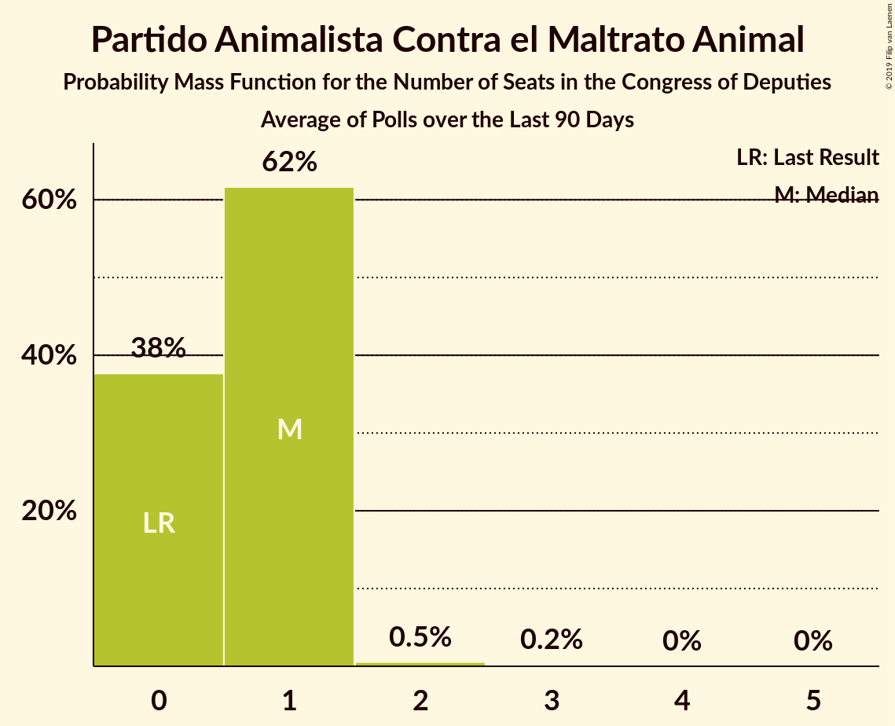

# Poll Average

<a href="#voting-intentions">Voting Intentions</a> | <a href="#seats">Seats</a> | <a href="#coalitions">Coalitions</a> | <a href="#technical-information">Technical Information</a>

## Summary

The table below lists the polls on which the average is based. They are the most recent polls (less than 90 days old) registered and analyzed so far.

| Period     | Polling firm/Commissioner(s) | PP | PSOE | UP | Cs | ERC | PDeCAT | EAJ/PNV | PACMA | EH Bildu | CC | Vox | BNG |
|:----------:|:----------------------------:|:--:|:--:|:--:|:--:|:--:|:--:|:--:|:--:|:--:|:--:|:--:|:--:|
| 26 June 2016 | General Election | 33.0%   137 | 22.6%   85 | 21.2%   71 | 13.1%   32 | 2.7%   9 | 2.0%   8 | 1.2%   5 | 1.2%   0 | 0.8%   2 | 0.3%   1 | 0.2%   0 | 0.2%   0 |
| N/A | Poll Average | 16–25%   61–103 | 25–32%   106–143 | 11–16%   26–46 | 13–19%   36–66 | 2–5%   8–20 | 1–2%   2–9 | 1–2%   3–9 | 1–2%   0–1 | 0–2%   1–7 | 0–1%   0–4 | 8–15%   13–47 | N/A   N/A |
| [4–10 April 2019](2019-04-10-Celeste-Tel.html) | Celeste-Tel   eldiario.es | 21–27%   103 | 25–30%   116 | 13–17%   35 | 14–18%   51 | 2–4%   13 | 1–3%   9 | 1–2%   8 | 1–2%   0 | 0–2%   2 | 0–1%   0 | 6–10%   13 | N/A   N/A |
| [3–9 April 2019](2019-04-09-IMOP.html) | IMOP   El Confidencial | 17–22%   66–86 | 29–33%   122–145 | 12–16%   32–43 | 14–18%   45–62 | 2–4%   10–16 | 1–2%   2–8 | 1–2%   4–9 | 1–2%   0–1 | 0–1%   1–6 | N/A   N/A | 8–11%   16–28 | N/A   N/A |
| [8–9 April 2019](2019-04-09-GAD3.html) | GAD3   ABC | 20–23%   76–98 | 29–33%   125–146 | 11–14%   24–37 | 12–15%   30–49 | N/A   N/A | N/A   N/A | N/A   N/A | N/A   N/A | N/A   N/A | N/A   N/A | 10–13%   23–35 | N/A   N/A |
| [22 February–7 April 2019](2019-04-07-electoPanel.html) | electoPanel   electomania.es | 19–21%   79–85 | 27–28%   118–126 | 13–14%   36–38 | 15–16%   51–58 | 2–3%   11–14 | 1–2%   4–6 | 1–2%   6–7 | 1%   0 | 1%   2–5 | 0%   1 | 10–11%   25–29 | N/A   N/A |
| [22 February–7 April 2019](2019-04-07-NCReport.html) | NC Report   La Razón | 21–27%   N/A | 24–30%   N/A | 12–16%   N/A | 14–19%   N/A | 2–4%   N/A | 1–2%   N/A | 1–2%   N/A | N/A   N/A | 0–2%   N/A | 0–1%   N/A | 8–11%   N/A | N/A   N/A |
| [1–5 April 2019](2019-04-05-SimpleLógica.html) | Simple Lógica | 15–19%   53–75 | 28–33%   123–150 | 12–17%   35–55 | 13–18%   42–63 | N/A   N/A | N/A   N/A | N/A   N/A | N/A   N/A | N/A   N/A | N/A   N/A | 8–12%   17–32 | N/A   N/A |
| [1–5 April 2019](2019-04-05-GESOP.html) | GESOP   El Periódico | 19–23%   73–98 | 28–32%   119–143 | 10–14%   24–37 | 13–16%   37–55 | N/A   N/A | N/A   N/A | N/A   N/A | N/A   N/A | N/A   N/A | N/A   N/A | 9–12%   21–33 | N/A   N/A |
| [25–29 March 2019](2019-03-29-SocioMétrica.html) | SocioMétrica   El Español | 17–21%   63–82 | 27–31%   116–139 | 12–15%   27–41 | 14–18%   46–62 | 2–4%   9–16 | 1–2%   3–8 | 1–2%   3–10 | 1–2%   0–1 | 1%   2–7 | 0–1%   0–2 | 10–14%   26–41 | N/A   N/A |
| [25–29 March 2019](2019-03-29-Invymark.html) | Invymark   laSexta | 18–22%   68–94 | 24–28%   96–122 | 11–15%   26–43 | 15–20%   50–68 | N/A   N/A | N/A   N/A | N/A   N/A | N/A   N/A | N/A   N/A | N/A   N/A | 11–15%   27–48 | N/A   N/A |
| [24–27 March 2019](2019-03-27-DemoscopiayServicios.html) | Demoscopia y Servicios   OKDIARIO | 19–23%   72–93 | 25–30%   104–129 | 13–17%   34–49 | 15–19%   48–66 | 1–3%   6–14 | 1–2%   3–9 | 1–2%   4–10 | N/A   N/A | 1–2%   1–7 | N/A   N/A | 10–13%   21–34 | N/A   N/A |
| [18–25 March 2019](2019-03-25-Metroscopia.html) | Metroscopia   Henneo | 18–21%   65–83 | 27–30%   115–136 | 13–15%   34–44 | 15–18%   48–61 | N/A   N/A | N/A   N/A | N/A   N/A | N/A   N/A | N/A   N/A | N/A   N/A | 11–13%   26–36 | N/A   N/A |
| [15–20 March 2019](2019-03-20-Sondaxe.html) | Sondaxe   La Voz de Galicia | 17–21%   65–88 | 24–30%   103–131 | 11–16%   28–44 | 12–16%   31–54 | 3–5%   13–21 | 1–3%   3–10 | 1–2%   3–8 | N/A   N/A | 0–2%   1–7 | 0–1%   1–4 | 12–16%   33–54 | N/A   N/A |
| [14–19 March 2019](2019-03-19-40dB.html) | 40dB   El País | 17–21%   68–89 | 25–29%   109–132 | 11–14%   26–40 | 16–20%   53–69 | N/A   N/A | N/A   N/A | N/A   N/A | N/A   N/A | N/A   N/A | N/A   N/A | 9–12%   20–32 | N/A   N/A |
| [1–18 March 2019](2019-03-18-CIS.html) | CIS | 17–18%   65–67 | 29–31%   133–138 | 13–14%   35–38 | 13–14%   41–46 | 4–5%   17–20 | 1%   3–4 | 1%   6 | 1–2%   0 | 1%   5 | 0–1%   1–2 | 11–12%   31–35 | N/A   N/A |
| [19–22 February 2019](2019-02-22-SigmaDos.html) | Sigma Dos   El Mundo | 17–21%   63–87 | 25–30%   105–131 | 13–17%   33–49 | 14–18%   43–63 | 2–4%   11–18 | 1–2%   1–8 | 1–2%   3–9 | N/A   N/A | N/A   N/A | N/A   N/A | 12–15%   28–50 | N/A   N/A |
| 26 June 2016 | General Election | 33.0%   137 | 22.6%   85 | 21.2%   71 | 13.1%   32 | 2.7%   9 | 2.0%   8 | 1.2%   5 | 1.2%   0 | 0.8%   2 | 0.3%   1 | 0.2%   0 | 0.2%   0 |

Only polls for which at least the sample size has been published are included in the table above.

**Legend:**
+ **Top half of each row:** Voting intentions (95% confidence interval)
+ **Bottom half of each row:** Seat projections for the Congress of Deputies (95% confidence interval)
+ **PP:** Partido Popular
+ **PSOE:** Partido Socialista Obrero Español
+ **UP:** Unidos Podemos
+ **Cs:** Ciudadanos–Partido de la Ciudadanía
+ **ERC:** Esquerra Republicana de Catalunya–Catalunya Sí
+ **PDeCAT:** Partit Demòcrata Europeu Català
+ **EAJ/PNV:** Euzko Alderdi Jeltzalea/Partido Nacionalista Vasco
+ **PACMA:** Partido Animalista Contra el Maltrato Animal
+ **EH Bildu:** Euskal Herria Bildu
+ **CC:** Coalición Canaria–Partido Nacionalista Canario
+ **Vox:** Vox
+ **BNG:** Bloque Nacionalista Galego–Nós Candidatura Galega
+ **N/A (single party):** Party not included the published results
+ **N/A (entire row):** Calculation for this opinion poll not started yet

## Voting Intentions

### Confidence Intervals

| Party | Last Result | Median | 80% Confidence Interval | 90% Confidence Interval | 95% Confidence Interval | 99% Confidence Interval |
|:-----:|:-----------:|:------:|:-----------------------:|:-----------------------:|:-----------------------:|:-----------------------:|
| <a href="#partido-popular">Partido Popular</a> | 33.0% | 19.8% | 17.3–23.3% |16.8–24.4% | 16.3–25.2% | 15.1–26.4% |
| <a href="#partido-socialista-obrero-español">Partido Socialista Obrero Español</a> | 22.6% | 28.3% | 25.9–31.0% |25.3–31.7% | 24.8–32.3% | 23.8–33.3% |
| <a href="#unidos-podemos">Unidos Podemos</a> | 21.2% | 13.6% | 11.9–15.2% |11.5–15.7% | 11.2–16.1% | 10.6–16.9% |
| <a href="#ciudadanos–partido-de-la-ciudadanía">Ciudadanos–Partido de la Ciudadanía</a> | 13.1% | 15.8% | 13.5–17.8% |13.2–18.3% | 12.8–18.8% | 12.1–19.7% |
| <a href="#esquerra-republicana-de-catalunya–catalunya-sí">Esquerra Republicana de Catalunya–Catalunya Sí</a> | 2.7% | 3.0% | 2.3–4.4% |2.0–4.6% | 1.8–4.7% | 1.5–5.1% |
| <a href="#partit-demòcrata-europeu-català">Partit Demòcrata Europeu Català</a> | 2.0% | 1.3% | 1.0–1.9% |0.9–2.1% | 0.8–2.3% | 0.7–2.7% |
| <a href="#euzko-alderdi-jeltzalea/partido-nacionalista-vasco">Euzko Alderdi Jeltzalea/Partido Nacionalista Vasco</a> | 1.2% | 1.3% | 0.9–1.7% |0.8–1.9% | 0.7–2.1% | 0.6–2.4% |
| <a href="#partido-animalista-contra-el-maltrato-animal">Partido Animalista Contra el Maltrato Animal</a> | 1.2% | 1.4% | 1.1–1.8% |1.0–2.0% | 0.9–2.2% | 0.8–2.5% |
| <a href="#euskal-herria-bildu">Euskal Herria Bildu</a> | 0.8% | 0.9% | 0.6–1.3% |0.5–1.4% | 0.5–1.5% | 0.4–1.8% |
| <a href="#coalición-canaria–partido-nacionalista-canario">Coalición Canaria–Partido Nacionalista Canario</a> | 0.3% | 0.4% | 0.2–0.6% |0.2–0.8% | 0.1–0.9% | 0.1–1.2% |
| <a href="#vox">Vox</a> | 0.2% | 11.1% | 8.9–13.5% |8.2–14.2% | 7.6–14.7% | 6.7–15.7% |
| <a href="#bloque-nacionalista-galego–nós-candidatura-galega">Bloque Nacionalista Galego–Nós Candidatura Galega</a> | 0.2% | N/A | N/A |N/A | N/A | N/A |

### Partido Popular

*For a full overview of the results for this party, see the [Partido Popular](party-partidopopular.html) page.*

| Voting Intentions | Probability | Accumulated | Special Marks |
|:-----------------:|:-----------:|:-----------:|:-------------:|
| 12.5–13.5% | 0% | 100% |  |
| 13.5–14.5% | 0.2% | 100% |  |
| 14.5–15.5% | 0.8% | 99.8% |  |
| 15.5–16.5% | 2% | 99.0% |  |
| 16.5–17.5% | 10% | 97% |  |
| 17.5–18.5% | 12% | 87% |  |
| 18.5–19.5% | 19% | 75% |  |
| 19.5–20.5% | 22% | 56% | Median |
| 20.5–21.5% | 13% | 35% |  |
| 21.5–22.5% | 8% | 21% |  |
| 22.5–23.5% | 5% | 14% |  |
| 23.5–24.5% | 4% | 9% |  |
| 24.5–25.5% | 3% | 4% |  |
| 25.5–26.5% | 1.2% | 2% |  |
| 26.5–27.5% | 0.3% | 0.4% |  |
| 27.5–28.5% | 0.1% | 0.1% |  |
| 28.5–29.5% | 0% | 0% |  |
| 29.5–30.5% | 0% | 0% |  |
| 30.5–31.5% | 0% | 0% |  |
| 31.5–32.5% | 0% | 0% |  |
| 32.5–33.5% | 0% | 0% | Last Result |

### Partido Socialista Obrero Español

*For a full overview of the results for this party, see the [Partido Socialista Obrero Español](party-partidosocialistaobreroespañol.html) page.*

| Voting Intentions | Probability | Accumulated | Special Marks |
|:-----------------:|:-----------:|:-----------:|:-------------:|
| 21.5–22.5% | 0% | 100% |  |
| 22.5–23.5% | 0.3% | 100% | Last Result |
| 23.5–24.5% | 1.5% | 99.7% |  |
| 24.5–25.5% | 5% | 98% |  |
| 25.5–26.5% | 11% | 93% |  |
| 26.5–27.5% | 19% | 83% |  |
| 27.5–28.5% | 18% | 64% | Median |
| 28.5–29.5% | 14% | 47% |  |
| 29.5–30.5% | 16% | 32% |  |
| 30.5–31.5% | 10% | 16% |  |
| 31.5–32.5% | 4% | 6% |  |
| 32.5–33.5% | 1.4% | 2% |  |
| 33.5–34.5% | 0.3% | 0.3% |  |
| 34.5–35.5% | 0% | 0% |  |

### Unidos Podemos

*For a full overview of the results for this party, see the [Unidos Podemos](party-unidospodemos.html) page.*

| Voting Intentions | Probability | Accumulated | Special Marks |
|:-----------------:|:-----------:|:-----------:|:-------------:|
| 8.5–9.5% | 0% | 100% |  |
| 9.5–10.5% | 0.5% | 100% |  |
| 10.5–11.5% | 5% | 99.5% |  |
| 11.5–12.5% | 15% | 94% |  |
| 12.5–13.5% | 27% | 80% |  |
| 13.5–14.5% | 32% | 53% | Median |
| 14.5–15.5% | 15% | 21% |  |
| 15.5–16.5% | 5% | 6% |  |
| 16.5–17.5% | 1.0% | 1.1% |  |
| 17.5–18.5% | 0.1% | 0.1% |  |
| 18.5–19.5% | 0% | 0% |  |
| 19.5–20.5% | 0% | 0% |  |
| 20.5–21.5% | 0% | 0% | Last Result |

### Ciudadanos–Partido de la Ciudadanía

*For a full overview of the results for this party, see the [Ciudadanos–Partido de la Ciudadanía](party-ciudadanos–partidodelaciudadanía.html) page.*

| Voting Intentions | Probability | Accumulated | Special Marks |
|:-----------------:|:-----------:|:-----------:|:-------------:|
| 9.5–10.5% | 0% | 100% |  |
| 10.5–11.5% | 0.1% | 100% |  |
| 11.5–12.5% | 1.3% | 99.9% |  |
| 12.5–13.5% | 9% | 98.5% | Last Result |
| 13.5–14.5% | 15% | 90% |  |
| 14.5–15.5% | 19% | 75% |  |
| 15.5–16.5% | 26% | 56% | Median |
| 16.5–17.5% | 18% | 30% |  |
| 17.5–18.5% | 9% | 13% |  |
| 18.5–19.5% | 3% | 4% |  |
| 19.5–20.5% | 0.6% | 0.6% |  |
| 20.5–21.5% | 0.1% | 0.1% |  |
| 21.5–22.5% | 0% | 0% |  |

### Esquerra Republicana de Catalunya–Catalunya Sí

*For a full overview of the results for this party, see the [Esquerra Republicana de Catalunya–Catalunya Sí](party-esquerrarepublicanadecatalunya–catalunyasí.html) page.*

| Voting Intentions | Probability | Accumulated | Special Marks |
|:-----------------:|:-----------:|:-----------:|:-------------:|
| 0.0–0.5% | 0% | 100% |  |
| 0.5–1.5% | 0.6% | 100% |  |
| 1.5–2.5% | 21% | 99.4% |  |
| 2.5–3.5% | 50% | 79% | Last Result, Median |
| 3.5–4.5% | 22% | 29% |  |
| 4.5–5.5% | 6% | 6% |  |
| 5.5–6.5% | 0.1% | 0.1% |  |
| 6.5–7.5% | 0% | 0% |  |

### Partit Demòcrata Europeu Català

*For a full overview of the results for this party, see the [Partit Demòcrata Europeu Català](party-partitdemòcrataeuropeucatalà.html) page.*

| Voting Intentions | Probability | Accumulated | Special Marks |
|:-----------------:|:-----------:|:-----------:|:-------------:|
| 0.0–0.5% | 0.1% | 100% |  |
| 0.5–1.5% | 71% | 99.9% | Median |
| 1.5–2.5% | 28% | 29% | Last Result |
| 2.5–3.5% | 1.0% | 1.0% |  |
| 3.5–4.5% | 0% | 0% |  |

### Euzko Alderdi Jeltzalea/Partido Nacionalista Vasco

*For a full overview of the results for this party, see the [Euzko Alderdi Jeltzalea/Partido Nacionalista Vasco](party-euzkoalderdijeltzaleapartidonacionalistavasco.html) page.*

| Voting Intentions | Probability | Accumulated | Special Marks |
|:-----------------:|:-----------:|:-----------:|:-------------:|
| 0.0–0.5% | 0.4% | 100% |  |
| 0.5–1.5% | 81% | 99.6% | Last Result, Median |
| 1.5–2.5% | 19% | 19% |  |
| 2.5–3.5% | 0.2% | 0.2% |  |
| 3.5–4.5% | 0% | 0% |  |

### Partido Animalista Contra el Maltrato Animal

*For a full overview of the results for this party, see the [Partido Animalista Contra el Maltrato Animal](party-partidoanimalistacontraelmaltratoanimal.html) page.*

| Voting Intentions | Probability | Accumulated | Special Marks |
|:-----------------:|:-----------:|:-----------:|:-------------:|
| 0.0–0.5% | 0% | 100% |  |
| 0.5–1.5% | 75% | 100% | Last Result, Median |
| 1.5–2.5% | 24% | 25% |  |
| 2.5–3.5% | 0.4% | 0.4% |  |
| 3.5–4.5% | 0% | 0% |  |

### Euskal Herria Bildu

*For a full overview of the results for this party, see the [Euskal Herria Bildu](party-euskalherriabildu.html) page.*

| Voting Intentions | Probability | Accumulated | Special Marks |
|:-----------------:|:-----------:|:-----------:|:-------------:|
| 0.0–0.5% | 5% | 100% |  |
| 0.5–1.5% | 92% | 95% | Last Result, Median |
| 1.5–2.5% | 2% | 2% |  |
| 2.5–3.5% | 0% | 0% |  |

### Coalición Canaria–Partido Nacionalista Canario

*For a full overview of the results for this party, see the [Coalición Canaria–Partido Nacionalista Canario](party-coalicióncanaria–partidonacionalistacanario.html) page.*

| Voting Intentions | Probability | Accumulated | Special Marks |
|:-----------------:|:-----------:|:-----------:|:-------------:|
| 0.0–0.5% | 83% | 100% | Last Result, Median |
| 0.5–1.5% | 17% | 17% |  |
| 1.5–2.5% | 0% | 0% |  |
| 2.5–3.5% | 0% | 0% |  |

### Vox

*For a full overview of the results for this party, see the [Vox](party-vox.html) page.*

| Voting Intentions | Probability | Accumulated | Special Marks |
|:-----------------:|:-----------:|:-----------:|:-------------:|
| 0.0–0.5% | 0% | 100% | Last Result |
| 0.5–1.5% | 0% | 100% |  |
| 1.5–2.5% | 0% | 100% |  |
| 2.5–3.5% | 0% | 100% |  |
| 3.5–4.5% | 0% | 100% |  |
| 4.5–5.5% | 0% | 100% |  |
| 5.5–6.5% | 0.3% | 100% |  |
| 6.5–7.5% | 2% | 99.7% |  |
| 7.5–8.5% | 5% | 98% |  |
| 8.5–9.5% | 10% | 93% |  |
| 9.5–10.5% | 19% | 83% |  |
| 10.5–11.5% | 23% | 64% | Median |
| 11.5–12.5% | 21% | 40% |  |
| 12.5–13.5% | 10% | 19% |  |
| 13.5–14.5% | 6% | 9% |  |
| 14.5–15.5% | 2% | 3% |  |
| 15.5–16.5% | 0.6% | 0.7% |  |
| 16.5–17.5% | 0.1% | 0.1% |  |
| 17.5–18.5% | 0% | 0% |  |

## Seats

### Confidence Intervals

| Party | Last Result | Median | 80% Confidence Interval | 90% Confidence Interval | 95% Confidence Interval | 99% Confidence Interval |
|:-----:|:-----------:|:------:|:-----------------------:|:-----------------------:|:-----------------------:|:-----------------------:|
| <a href="#partido-popular">Partido Popular</a> | 137 | 77 | 66–91 |65–103 | 61–103 | 56–103 |
| <a href="#partido-socialista-obrero-español">Partido Socialista Obrero Español</a> | 85 | 124 | 112–138 |109–141 | 106–143 | 98–148 |
| <a href="#unidos-podemos">Unidos Podemos</a> | 71 | 36 | 30–42 |28–44 | 26–46 | 24–52 |
| <a href="#ciudadanos–partido-de-la-ciudadanía">Ciudadanos–Partido de la Ciudadanía</a> | 32 | 51 | 42–61 |39–64 | 36–66 | 31–68 |
| <a href="#esquerra-republicana-de-catalunya–catalunya-sí">Esquerra Republicana de Catalunya–Catalunya Sí</a> | 9 | 14 | 10–19 |9–20 | 8–20 | 7–21 |
| <a href="#partit-demòcrata-europeu-català">Partit Demòcrata Europeu Català</a> | 8 | 5 | 3–9 |3–9 | 2–9 | 1–10 |
| <a href="#euzko-alderdi-jeltzalea/partido-nacionalista-vasco">Euzko Alderdi Jeltzalea/Partido Nacionalista Vasco</a> | 5 | 6 | 4–8 |4–8 | 3–9 | 3–10 |
| <a href="#partido-animalista-contra-el-maltrato-animal">Partido Animalista Contra el Maltrato Animal</a> | 0 | 0 | 0 |0 | 0–1 | 0–1 |
| <a href="#euskal-herria-bildu">Euskal Herria Bildu</a> | 2 | 4 | 2–5 |1–6 | 1–7 | 1–7 |
| <a href="#coalición-canaria–partido-nacionalista-canario">Coalición Canaria–Partido Nacionalista Canario</a> | 1 | 1 | 0–2 |0–3 | 0–4 | 0–4 |
| <a href="#vox">Vox</a> | 0 | 28 | 20–40 |13–44 | 13–47 | 13–52 |
| <a href="#bloque-nacionalista-galego–nós-candidatura-galega">Bloque Nacionalista Galego–Nós Candidatura Galega</a> | 0 | N/A | N/A |N/A | N/A | N/A |

### Partido Popular

*For a full overview of the results for this party, see the [Partido Popular](party-partidopopular.html) page.*

| Number of Seats | Probability | Accumulated | Special Marks |
|:---------------:|:-----------:|:-----------:|:-------------:|
| 52 | 0% | 100% |  |
| 53 | 0.2% | 99.9% |  |
| 54 | 0.1% | 99.8% |  |
| 55 | 0.2% | 99.7% |  |
| 56 | 0.2% | 99.5% |  |
| 57 | 0.5% | 99.3% |  |
| 58 | 0.2% | 98.7% |  |
| 59 | 0.3% | 98.5% |  |
| 60 | 0.5% | 98% |  |
| 61 | 0.3% | 98% |  |
| 62 | 0.5% | 97% |  |
| 63 | 0.5% | 97% |  |
| 64 | 1.0% | 96% |  |
| 65 | 3% | 95% |  |
| 66 | 6% | 92% |  |
| 67 | 2% | 86% |  |
| 68 | 2% | 84% |  |
| 69 | 3% | 82% |  |
| 70 | 3% | 79% |  |
| 71 | 3% | 77% |  |
| 72 | 5% | 74% |  |
| 73 | 5% | 69% |  |
| 74 | 4% | 65% |  |
| 75 | 4% | 61% |  |
| 76 | 4% | 57% |  |
| 77 | 3% | 53% | Median |
| 78 | 3% | 50% |  |
| 79 | 4% | 47% |  |
| 80 | 4% | 43% |  |
| 81 | 4% | 39% |  |
| 82 | 4% | 35% |  |
| 83 | 6% | 31% |  |
| 84 | 4% | 26% |  |
| 85 | 3% | 22% |  |
| 86 | 3% | 20% |  |
| 87 | 2% | 17% |  |
| 88 | 2% | 15% |  |
| 89 | 1.4% | 14% |  |
| 90 | 1.2% | 12% |  |
| 91 | 1.0% | 11% |  |
| 92 | 0.7% | 10% |  |
| 93 | 0.6% | 9% |  |
| 94 | 0.4% | 9% |  |
| 95 | 0.3% | 8% |  |
| 96 | 0.2% | 8% |  |
| 97 | 0.1% | 8% |  |
| 98 | 0.1% | 8% |  |
| 99 | 0.1% | 8% |  |
| 100 | 0.1% | 7% |  |
| 101 | 0.1% | 7% |  |
| 102 | 0% | 7% |  |
| 103 | 7% | 7% |  |
| 104 | 0% | 0.1% |  |
| 105 | 0% | 0% |  |
| 106 | 0% | 0% |  |
| 107 | 0% | 0% |  |
| 108 | 0% | 0% |  |
| 109 | 0% | 0% |  |
| 110 | 0% | 0% |  |
| 111 | 0% | 0% |  |
| 112 | 0% | 0% |  |
| 113 | 0% | 0% |  |
| 114 | 0% | 0% |  |
| 115 | 0% | 0% |  |
| 116 | 0% | 0% |  |
| 117 | 0% | 0% |  |
| 118 | 0% | 0% |  |
| 119 | 0% | 0% |  |
| 120 | 0% | 0% |  |
| 121 | 0% | 0% |  |
| 122 | 0% | 0% |  |
| 123 | 0% | 0% |  |
| 124 | 0% | 0% |  |
| 125 | 0% | 0% |  |
| 126 | 0% | 0% |  |
| 127 | 0% | 0% |  |
| 128 | 0% | 0% |  |
| 129 | 0% | 0% |  |
| 130 | 0% | 0% |  |
| 131 | 0% | 0% |  |
| 132 | 0% | 0% |  |
| 133 | 0% | 0% |  |
| 134 | 0% | 0% |  |
| 135 | 0% | 0% |  |
| 136 | 0% | 0% |  |
| 137 | 0% | 0% | Last Result |

### Partido Socialista Obrero Español

*For a full overview of the results for this party, see the [Partido Socialista Obrero Español](party-partidosocialistaobreroespañol.html) page.*

| Number of Seats | Probability | Accumulated | Special Marks |
|:---------------:|:-----------:|:-----------:|:-------------:|
| 85 | 0% | 100% | Last Result |
| 86 | 0% | 100% |  |
| 87 | 0% | 100% |  |
| 88 | 0% | 100% |  |
| 89 | 0% | 100% |  |
| 90 | 0% | 100% |  |
| 91 | 0% | 100% |  |
| 92 | 0% | 100% |  |
| 93 | 0% | 100% |  |
| 94 | 0% | 99.9% |  |
| 95 | 0.1% | 99.9% |  |
| 96 | 0.1% | 99.8% |  |
| 97 | 0.1% | 99.7% |  |
| 98 | 0.1% | 99.6% |  |
| 99 | 0.2% | 99.5% |  |
| 100 | 0.2% | 99.3% |  |
| 101 | 0.2% | 99.2% |  |
| 102 | 0.2% | 99.0% |  |
| 103 | 0.4% | 98.7% |  |
| 104 | 0.3% | 98% |  |
| 105 | 0.4% | 98% |  |
| 106 | 0.7% | 98% |  |
| 107 | 0.6% | 97% |  |
| 108 | 1.0% | 96% |  |
| 109 | 1.2% | 95% |  |
| 110 | 1.4% | 94% |  |
| 111 | 1.4% | 93% |  |
| 112 | 2% | 91% |  |
| 113 | 3% | 90% |  |
| 114 | 2% | 87% |  |
| 115 | 2% | 85% |  |
| 116 | 9% | 83% |  |
| 117 | 3% | 74% |  |
| 118 | 3% | 71% |  |
| 119 | 3% | 69% |  |
| 120 | 4% | 66% |  |
| 121 | 5% | 62% |  |
| 122 | 3% | 57% |  |
| 123 | 3% | 53% |  |
| 124 | 3% | 50% | Median |
| 125 | 2% | 47% |  |
| 126 | 2% | 45% |  |
| 127 | 4% | 43% |  |
| 128 | 2% | 39% |  |
| 129 | 2% | 37% |  |
| 130 | 2% | 35% |  |
| 131 | 2% | 33% |  |
| 132 | 2% | 31% |  |
| 133 | 2% | 29% |  |
| 134 | 3% | 27% |  |
| 135 | 3% | 25% |  |
| 136 | 4% | 22% |  |
| 137 | 7% | 18% |  |
| 138 | 2% | 11% |  |
| 139 | 2% | 9% |  |
| 140 | 2% | 7% |  |
| 141 | 1.4% | 5% |  |
| 142 | 0.7% | 4% |  |
| 143 | 0.8% | 3% |  |
| 144 | 0.6% | 2% |  |
| 145 | 0.7% | 2% |  |
| 146 | 0.3% | 1.1% |  |
| 147 | 0.2% | 0.7% |  |
| 148 | 0.1% | 0.5% |  |
| 149 | 0.1% | 0.4% |  |
| 150 | 0.1% | 0.3% |  |
| 151 | 0.1% | 0.2% |  |
| 152 | 0% | 0.1% |  |
| 153 | 0% | 0.1% |  |
| 154 | 0% | 0.1% |  |
| 155 | 0% | 0.1% |  |
| 156 | 0% | 0.1% |  |
| 157 | 0% | 0% |  |

### Unidos Podemos

*For a full overview of the results for this party, see the [Unidos Podemos](party-unidospodemos.html) page.*

| Number of Seats | Probability | Accumulated | Special Marks |
|:---------------:|:-----------:|:-----------:|:-------------:|
| 23 | 0.1% | 100% |  |
| 24 | 0.8% | 99.9% |  |
| 25 | 0.8% | 99.1% |  |
| 26 | 1.0% | 98% |  |
| 27 | 1.1% | 97% |  |
| 28 | 2% | 96% |  |
| 29 | 2% | 94% |  |
| 30 | 3% | 92% |  |
| 31 | 3% | 90% |  |
| 32 | 3% | 87% |  |
| 33 | 4% | 84% |  |
| 34 | 4% | 80% |  |
| 35 | 15% | 75% |  |
| 36 | 17% | 61% | Median |
| 37 | 8% | 44% |  |
| 38 | 13% | 36% |  |
| 39 | 4% | 22% |  |
| 40 | 4% | 19% |  |
| 41 | 3% | 14% |  |
| 42 | 3% | 11% |  |
| 43 | 2% | 9% |  |
| 44 | 2% | 6% |  |
| 45 | 1.2% | 4% |  |
| 46 | 1.0% | 3% |  |
| 47 | 0.6% | 2% |  |
| 48 | 0.3% | 2% |  |
| 49 | 0.3% | 1.3% |  |
| 50 | 0.2% | 1.0% |  |
| 51 | 0.1% | 0.8% |  |
| 52 | 0.2% | 0.6% |  |
| 53 | 0.1% | 0.5% |  |
| 54 | 0.1% | 0.4% |  |
| 55 | 0.1% | 0.3% |  |
| 56 | 0.1% | 0.2% |  |
| 57 | 0% | 0.1% |  |
| 58 | 0% | 0.1% |  |
| 59 | 0% | 0.1% |  |
| 60 | 0% | 0% |  |
| 61 | 0% | 0% |  |
| 62 | 0% | 0% |  |
| 63 | 0% | 0% |  |
| 64 | 0% | 0% |  |
| 65 | 0% | 0% |  |
| 66 | 0% | 0% |  |
| 67 | 0% | 0% |  |
| 68 | 0% | 0% |  |
| 69 | 0% | 0% |  |
| 70 | 0% | 0% |  |
| 71 | 0% | 0% | Last Result |

### Ciudadanos–Partido de la Ciudadanía

*For a full overview of the results for this party, see the [Ciudadanos–Partido de la Ciudadanía](party-ciudadanos–partidodelaciudadanía.html) page.*

| Number of Seats | Probability | Accumulated | Special Marks |
|:---------------:|:-----------:|:-----------:|:-------------:|
| 25 | 0% | 100% |  |
| 26 | 0% | 99.9% |  |
| 27 | 0% | 99.9% |  |
| 28 | 0% | 99.9% |  |
| 29 | 0.1% | 99.8% |  |
| 30 | 0.1% | 99.7% |  |
| 31 | 0.2% | 99.6% |  |
| 32 | 0.2% | 99.4% | Last Result |
| 33 | 0.4% | 99.2% |  |
| 34 | 0.3% | 98.8% |  |
| 35 | 0.5% | 98% |  |
| 36 | 0.7% | 98% |  |
| 37 | 0.6% | 97% |  |
| 38 | 1.3% | 97% |  |
| 39 | 1.3% | 95% |  |
| 40 | 2% | 94% |  |
| 41 | 2% | 93% |  |
| 42 | 5% | 91% |  |
| 43 | 1.1% | 85% |  |
| 44 | 3% | 84% |  |
| 45 | 2% | 81% |  |
| 46 | 4% | 79% |  |
| 47 | 2% | 75% |  |
| 48 | 2% | 73% |  |
| 49 | 3% | 71% |  |
| 50 | 8% | 69% |  |
| 51 | 13% | 60% | Median |
| 52 | 4% | 48% |  |
| 53 | 6% | 43% |  |
| 54 | 4% | 37% |  |
| 55 | 6% | 33% |  |
| 56 | 5% | 27% |  |
| 57 | 2% | 22% |  |
| 58 | 3% | 19% |  |
| 59 | 2% | 17% |  |
| 60 | 2% | 15% |  |
| 61 | 3% | 12% |  |
| 62 | 2% | 10% |  |
| 63 | 2% | 8% |  |
| 64 | 2% | 6% |  |
| 65 | 2% | 5% |  |
| 66 | 1.0% | 3% |  |
| 67 | 1.0% | 2% |  |
| 68 | 0.5% | 1.0% |  |
| 69 | 0.2% | 0.5% |  |
| 70 | 0.1% | 0.3% |  |
| 71 | 0.1% | 0.2% |  |
| 72 | 0% | 0.1% |  |
| 73 | 0% | 0.1% |  |
| 74 | 0% | 0% |  |

### Esquerra Republicana de Catalunya–Catalunya Sí

*For a full overview of the results for this party, see the [Esquerra Republicana de Catalunya–Catalunya Sí](party-esquerrarepublicanadecatalunya–catalunyasí.html) page.*

| Number of Seats | Probability | Accumulated | Special Marks |
|:---------------:|:-----------:|:-----------:|:-------------:|
| 6 | 0.4% | 100% |  |
| 7 | 0.9% | 99.6% |  |
| 8 | 2% | 98.7% |  |
| 9 | 6% | 97% | Last Result |
| 10 | 1.0% | 91% |  |
| 11 | 6% | 90% |  |
| 12 | 14% | 84% |  |
| 13 | 18% | 69% |  |
| 14 | 18% | 51% | Median |
| 15 | 11% | 33% |  |
| 16 | 3% | 22% |  |
| 17 | 5% | 19% |  |
| 18 | 1.1% | 15% |  |
| 19 | 4% | 13% |  |
| 20 | 9% | 9% |  |
| 21 | 0.5% | 0.6% |  |
| 22 | 0.1% | 0.1% |  |
| 23 | 0% | 0% |  |

### Partit Demòcrata Europeu Català

*For a full overview of the results for this party, see the [Partit Demòcrata Europeu Català](party-partitdemòcrataeuropeucatalà.html) page.*

| Number of Seats | Probability | Accumulated | Special Marks |
|:---------------:|:-----------:|:-----------:|:-------------:|
| 1 | 2% | 100% |  |
| 2 | 0.8% | 98% |  |
| 3 | 15% | 97% |  |
| 4 | 21% | 83% |  |
| 5 | 18% | 62% | Median |
| 6 | 16% | 44% |  |
| 7 | 4% | 28% |  |
| 8 | 9% | 24% | Last Result |
| 9 | 14% | 15% |  |
| 10 | 0.6% | 0.8% |  |
| 11 | 0.1% | 0.2% |  |
| 12 | 0% | 0.1% |  |
| 13 | 0% | 0% |  |

### Euzko Alderdi Jeltzalea/Partido Nacionalista Vasco

*For a full overview of the results for this party, see the [Euzko Alderdi Jeltzalea/Partido Nacionalista Vasco](party-euzkoalderdijeltzaleapartidonacionalistavasco.html) page.*

| Number of Seats | Probability | Accumulated | Special Marks |
|:---------------:|:-----------:|:-----------:|:-------------:|
| 1 | 0.1% | 100% |  |
| 2 | 0.3% | 99.9% |  |
| 3 | 4% | 99.7% |  |
| 4 | 5% | 95% |  |
| 5 | 2% | 90% | Last Result |
| 6 | 52% | 88% | Median |
| 7 | 14% | 37% |  |
| 8 | 20% | 23% |  |
| 9 | 1.2% | 3% |  |
| 10 | 2% | 2% |  |
| 11 | 0% | 0% |  |

### Partido Animalista Contra el Maltrato Animal

*For a full overview of the results for this party, see the [Partido Animalista Contra el Maltrato Animal](party-partidoanimalistacontraelmaltratoanimal.html) page.*

| Number of Seats | Probability | Accumulated | Special Marks |
|:---------------:|:-----------:|:-----------:|:-------------:|
| 0 | 97% | 100% | Last Result, Median |
| 1 | 3% | 3% |  |
| 2 | 0% | 0% |  |

### Euskal Herria Bildu

*For a full overview of the results for this party, see the [Euskal Herria Bildu](party-euskalherriabildu.html) page.*

| Number of Seats | Probability | Accumulated | Special Marks |
|:---------------:|:-----------:|:-----------:|:-------------:|
| 0 | 0.2% | 100% |  |
| 1 | 6% | 99.8% |  |
| 2 | 29% | 94% | Last Result |
| 3 | 6% | 64% |  |
| 4 | 21% | 59% | Median |
| 5 | 28% | 37% |  |
| 6 | 5% | 9% |  |
| 7 | 3% | 3% |  |
| 8 | 0.1% | 0.2% |  |
| 9 | 0.1% | 0.1% |  |
| 10 | 0% | 0% |  |

### Coalición Canaria–Partido Nacionalista Canario

*For a full overview of the results for this party, see the [Coalición Canaria–Partido Nacionalista Canario](party-coalicióncanaria–partidonacionalistacanario.html) page.*

| Number of Seats | Probability | Accumulated | Special Marks |
|:---------------:|:-----------:|:-----------:|:-------------:|
| 0 | 26% | 100% |  |
| 1 | 56% | 74% | Last Result, Median |
| 2 | 12% | 18% |  |
| 3 | 3% | 6% |  |
| 4 | 3% | 3% |  |
| 5 | 0.2% | 0.2% |  |
| 6 | 0% | 0% |  |

### Vox

*For a full overview of the results for this party, see the [Vox](party-vox.html) page.*

| Number of Seats | Probability | Accumulated | Special Marks |
|:---------------:|:-----------:|:-----------:|:-------------:|
| 0 | 0% | 100% | Last Result |
| 1 | 0% | 100% |  |
| 2 | 0% | 100% |  |
| 3 | 0% | 100% |  |
| 4 | 0% | 100% |  |
| 5 | 0% | 100% |  |
| 6 | 0% | 100% |  |
| 7 | 0% | 100% |  |
| 8 | 0% | 100% |  |
| 9 | 0% | 100% |  |
| 10 | 0% | 100% |  |
| 11 | 0% | 100% |  |
| 12 | 0% | 100% |  |
| 13 | 7% | 100% |  |
| 14 | 0.1% | 93% |  |
| 15 | 0.1% | 93% |  |
| 16 | 0.2% | 93% |  |
| 17 | 0.5% | 92% |  |
| 18 | 0.4% | 92% |  |
| 19 | 1.5% | 92% |  |
| 20 | 0.9% | 90% |  |
| 21 | 2% | 89% |  |
| 22 | 2% | 87% |  |
| 23 | 4% | 85% |  |
| 24 | 4% | 81% |  |
| 25 | 4% | 77% |  |
| 26 | 9% | 73% |  |
| 27 | 10% | 64% |  |
| 28 | 5% | 54% | Median |
| 29 | 5% | 49% |  |
| 30 | 6% | 45% |  |
| 31 | 5% | 39% |  |
| 32 | 8% | 34% |  |
| 33 | 4% | 26% |  |
| 34 | 4% | 22% |  |
| 35 | 2% | 18% |  |
| 36 | 1.2% | 16% |  |
| 37 | 1.2% | 15% |  |
| 38 | 0.9% | 14% |  |
| 39 | 1.1% | 13% |  |
| 40 | 2% | 12% |  |
| 41 | 1.1% | 9% |  |
| 42 | 1.1% | 8% |  |
| 43 | 0.9% | 7% |  |
| 44 | 1.5% | 6% |  |
| 45 | 1.2% | 5% |  |
| 46 | 1.2% | 4% |  |
| 47 | 0.6% | 3% |  |
| 48 | 0.3% | 2% |  |
| 49 | 0.2% | 2% |  |
| 50 | 0.5% | 1.4% |  |
| 51 | 0.4% | 0.9% |  |
| 52 | 0.2% | 0.5% |  |
| 53 | 0.1% | 0.4% |  |
| 54 | 0.1% | 0.3% |  |
| 55 | 0% | 0.2% |  |
| 56 | 0% | 0.1% |  |
| 57 | 0% | 0.1% |  |
| 58 | 0% | 0.1% |  |
| 59 | 0% | 0% |  |

## Coalitions

### Confidence Intervals

| Coalition | Last Result | Median | Majority? | 80% Confidence Interval | 90% Confidence Interval | 95% Confidence Interval | 99% Confidence Interval |
|:---------:|:-----------:|:------:|:---------:|:-----------------------:|:-----------------------:|:-----------------------:|:-----------------------:|
| Partido Popular – Partido Socialista Obrero Español – Ciudadanos–Partido de la Ciudadanía | 254 | 256 | 100% | 242–268 | 236–270 | 231–270 | 225–272 |
| Partido Socialista Obrero Español – Unidos Podemos – Ciudadanos–Partido de la Ciudadanía | 188 | 213 | 99.9% | 201–225 | 198–232 | 193–236 | 186–244 |
| Partido Popular – Partido Socialista Obrero Español | 222 | 203 | 99.6% | 190–219 | 185–221 | 183–224 | 177–231 |
| Partido Socialista Obrero Español – Unidos Podemos – Esquerra Republicana de Catalunya–Catalunya Sí – Partit Demòcrata Europeu Català – Euzko Alderdi Jeltzalea/Partido Nacionalista Vasco – Euskal Herria Bildu | 180 | 188 | 94% | 178–207 | 174–209 | 170–212 | 163–218 |
| Partido Socialista Obrero Español – Unidos Podemos – Esquerra Republicana de Catalunya–Catalunya Sí – Partit Demòcrata Europeu Català | 173 | 179 | 62% | 168–197 | 165–198 | 161–203 | 153–210 |
| Partido Socialista Obrero Español – Unidos Podemos – Esquerra Republicana de Catalunya–Catalunya Sí – Euskal Herria Bildu | 167 | 175 | 50% | 165–196 | 161–200 | 157–200 | 149–204 |
| Partido Socialista Obrero Español – Ciudadanos–Partido de la Ciudadanía | 117 | 177 | 57% | 165–188 | 160–193 | 157–196 | 148–200 |
| Partido Socialista Obrero Español – Unidos Podemos – Euzko Alderdi Jeltzalea/Partido Nacionalista Vasco – Euskal Herria Bildu | 163 | 169 | 30% | 159–186 | 155–188 | 151–193 | 143–199 |
| Partido Socialista Obrero Español – Unidos Podemos – Euzko Alderdi Jeltzalea/Partido Nacionalista Vasco | 161 | 166 | 25% | 155–181 | 151–185 | 147–190 | 139–197 |
| Partido Socialista Obrero Español – Unidos Podemos | 156 | 160 | 8% | 149–175 | 145–179 | 141–184 | 133–191 |
| Partido Popular – Ciudadanos–Partido de la Ciudadanía – Vox | 169 | 161 | 4% | 142–171 | 140–175 | 137–178 | 131–186 |
| Partido Popular – Ciudadanos–Partido de la Ciudadanía – Euzko Alderdi Jeltzalea/Partido Nacionalista Vasco | 174 | 136 | 0% | 118–154 | 114–162 | 114–162 | 110–162 |
| Partido Popular – Ciudadanos–Partido de la Ciudadanía – Coalición Canaria–Partido Nacionalista Canario | 170 | 131 | 0% | 113–149 | 109–154 | 109–154 | 106–154 |
| Partido Popular – Ciudadanos–Partido de la Ciudadanía | 169 | 130 | 0% | 112–148 | 108–154 | 108–154 | 104–154 |
| Partido Socialista Obrero Español | 85 | 124 | 0% | 112–138 | 109–141 | 106–143 | 98–148 |
| Partido Popular – Vox | 137 | 108 | 0% | 95–118 | 90–122 | 85–125 | 78–131 |
| Partido Popular | 137 | 77 | 0% | 66–91 | 65–103 | 61–103 | 56–103 |

### Partido Popular – Partido Socialista Obrero Español – Ciudadanos–Partido de la Ciudadanía

| Number of Seats | Probability | Accumulated | Special Marks |
|:---------------:|:-----------:|:-----------:|:-------------:|
| 218 | 0% | 100% |  |
| 219 | 0% | 99.9% |  |
| 220 | 0% | 99.9% |  |
| 221 | 0.1% | 99.9% |  |
| 222 | 0% | 99.7% |  |
| 223 | 0.1% | 99.7% |  |
| 224 | 0% | 99.6% |  |
| 225 | 0.3% | 99.6% |  |
| 226 | 0.1% | 99.3% |  |
| 227 | 0.1% | 99.2% |  |
| 228 | 0.2% | 99.1% |  |
| 229 | 1.0% | 98.9% |  |
| 230 | 0.3% | 98% |  |
| 231 | 0.2% | 98% |  |
| 232 | 0.3% | 97% |  |
| 233 | 0.3% | 97% |  |
| 234 | 0.5% | 97% |  |
| 235 | 0.9% | 96% |  |
| 236 | 0.5% | 95% |  |
| 237 | 0.3% | 95% |  |
| 238 | 0.8% | 95% |  |
| 239 | 1.2% | 94% |  |
| 240 | 0.9% | 93% |  |
| 241 | 2% | 92% |  |
| 242 | 0.9% | 90% |  |
| 243 | 0.8% | 89% |  |
| 244 | 2% | 88% |  |
| 245 | 6% | 87% |  |
| 246 | 2% | 81% |  |
| 247 | 2% | 79% |  |
| 248 | 3% | 77% |  |
| 249 | 3% | 74% |  |
| 250 | 4% | 71% |  |
| 251 | 2% | 67% |  |
| 252 | 2% | 65% | Median |
| 253 | 3% | 63% |  |
| 254 | 3% | 60% | Last Result |
| 255 | 5% | 57% |  |
| 256 | 3% | 52% |  |
| 257 | 5% | 49% |  |
| 258 | 7% | 44% |  |
| 259 | 4% | 36% |  |
| 260 | 6% | 32% |  |
| 261 | 3% | 27% |  |
| 262 | 3% | 23% |  |
| 263 | 3% | 20% |  |
| 264 | 2% | 18% |  |
| 265 | 2% | 15% |  |
| 266 | 2% | 14% |  |
| 267 | 1.0% | 12% |  |
| 268 | 1.2% | 11% |  |
| 269 | 0.6% | 9% |  |
| 270 | 8% | 9% |  |
| 271 | 0.3% | 0.8% |  |
| 272 | 0.2% | 0.5% |  |
| 273 | 0.2% | 0.3% |  |
| 274 | 0.1% | 0.2% |  |
| 275 | 0% | 0.1% |  |
| 276 | 0% | 0.1% |  |
| 277 | 0% | 0% |  |

### Partido Socialista Obrero Español – Unidos Podemos – Ciudadanos–Partido de la Ciudadanía

| Number of Seats | Probability | Accumulated | Special Marks |
|:---------------:|:-----------:|:-----------:|:-------------:|
| 174 | 0% | 100% |  |
| 175 | 0% | 99.9% |  |
| 176 | 0% | 99.9% | Majority |
| 177 | 0% | 99.9% |  |
| 178 | 0% | 99.9% |  |
| 179 | 0% | 99.9% |  |
| 180 | 0% | 99.9% |  |
| 181 | 0% | 99.8% |  |
| 182 | 0.1% | 99.8% |  |
| 183 | 0% | 99.8% |  |
| 184 | 0.1% | 99.8% |  |
| 185 | 0.1% | 99.7% |  |
| 186 | 0.3% | 99.6% |  |
| 187 | 0.1% | 99.3% |  |
| 188 | 0.2% | 99.3% | Last Result |
| 189 | 0.2% | 99.1% |  |
| 190 | 0.4% | 98.9% |  |
| 191 | 0.4% | 98.5% |  |
| 192 | 0.3% | 98% |  |
| 193 | 0.4% | 98% |  |
| 194 | 0.5% | 97% |  |
| 195 | 0.7% | 97% |  |
| 196 | 0.5% | 96% |  |
| 197 | 0.6% | 96% |  |
| 198 | 2% | 95% |  |
| 199 | 0.9% | 93% |  |
| 200 | 1.4% | 92% |  |
| 201 | 2% | 91% |  |
| 202 | 8% | 89% |  |
| 203 | 1.4% | 80% |  |
| 204 | 2% | 79% |  |
| 205 | 3% | 77% |  |
| 206 | 3% | 74% |  |
| 207 | 3% | 71% |  |
| 208 | 3% | 68% |  |
| 209 | 4% | 65% |  |
| 210 | 3% | 62% |  |
| 211 | 3% | 59% | Median |
| 212 | 3% | 56% |  |
| 213 | 7% | 53% |  |
| 214 | 4% | 46% |  |
| 215 | 4% | 42% |  |
| 216 | 4% | 39% |  |
| 217 | 7% | 35% |  |
| 218 | 3% | 27% |  |
| 219 | 3% | 25% |  |
| 220 | 3% | 22% |  |
| 221 | 5% | 19% |  |
| 222 | 1.0% | 14% |  |
| 223 | 1.0% | 13% |  |
| 224 | 1.1% | 12% |  |
| 225 | 1.0% | 11% |  |
| 226 | 0.6% | 10% |  |
| 227 | 0.8% | 9% |  |
| 228 | 0.9% | 8% |  |
| 229 | 0.4% | 7% |  |
| 230 | 1.2% | 7% |  |
| 231 | 0.5% | 6% |  |
| 232 | 0.7% | 5% |  |
| 233 | 0.4% | 4% |  |
| 234 | 0.7% | 4% |  |
| 235 | 0.4% | 3% |  |
| 236 | 0.5% | 3% |  |
| 237 | 0.4% | 2% |  |
| 238 | 0.4% | 2% |  |
| 239 | 0.2% | 2% |  |
| 240 | 0.4% | 1.4% |  |
| 241 | 0.2% | 1.0% |  |
| 242 | 0.1% | 0.8% |  |
| 243 | 0.1% | 0.7% |  |
| 244 | 0.2% | 0.6% |  |
| 245 | 0.2% | 0.4% |  |
| 246 | 0.1% | 0.2% |  |
| 247 | 0% | 0.1% |  |
| 248 | 0% | 0.1% |  |
| 249 | 0% | 0% |  |

### Partido Popular – Partido Socialista Obrero Español

| Number of Seats | Probability | Accumulated | Special Marks |
|:---------------:|:-----------:|:-----------:|:-------------:|
| 169 | 0% | 100% |  |
| 170 | 0% | 99.9% |  |
| 171 | 0% | 99.9% |  |
| 172 | 0% | 99.9% |  |
| 173 | 0.1% | 99.9% |  |
| 174 | 0.1% | 99.8% |  |
| 175 | 0.1% | 99.7% |  |
| 176 | 0.1% | 99.6% | Majority |
| 177 | 0.2% | 99.5% |  |
| 178 | 0.3% | 99.3% |  |
| 179 | 0.3% | 99.0% |  |
| 180 | 0.3% | 98.7% |  |
| 181 | 0.4% | 98% |  |
| 182 | 0.4% | 98% |  |
| 183 | 0.5% | 98% |  |
| 184 | 1.4% | 97% |  |
| 185 | 0.8% | 96% |  |
| 186 | 1.2% | 95% |  |
| 187 | 1.1% | 94% |  |
| 188 | 1.1% | 93% |  |
| 189 | 1.2% | 91% |  |
| 190 | 2% | 90% |  |
| 191 | 2% | 88% |  |
| 192 | 2% | 86% |  |
| 193 | 3% | 85% |  |
| 194 | 3% | 82% |  |
| 195 | 3% | 79% |  |
| 196 | 3% | 77% |  |
| 197 | 3% | 74% |  |
| 198 | 3% | 71% |  |
| 199 | 3% | 68% |  |
| 200 | 5% | 65% |  |
| 201 | 5% | 60% | Median |
| 202 | 4% | 55% |  |
| 203 | 9% | 51% |  |
| 204 | 5% | 43% |  |
| 205 | 4% | 37% |  |
| 206 | 2% | 34% |  |
| 207 | 3% | 32% |  |
| 208 | 3% | 29% |  |
| 209 | 1.1% | 26% |  |
| 210 | 2% | 25% |  |
| 211 | 0.8% | 23% |  |
| 212 | 0.9% | 22% |  |
| 213 | 1.2% | 21% |  |
| 214 | 0.8% | 20% |  |
| 215 | 2% | 19% |  |
| 216 | 1.1% | 18% |  |
| 217 | 1.0% | 17% |  |
| 218 | 1.4% | 16% |  |
| 219 | 8% | 14% |  |
| 220 | 1.0% | 6% |  |
| 221 | 0.9% | 5% |  |
| 222 | 0.7% | 4% | Last Result |
| 223 | 0.8% | 3% |  |
| 224 | 0.5% | 3% |  |
| 225 | 0.4% | 2% |  |
| 226 | 0.4% | 2% |  |
| 227 | 0.3% | 1.5% |  |
| 228 | 0.3% | 1.2% |  |
| 229 | 0.2% | 0.9% |  |
| 230 | 0.2% | 0.7% |  |
| 231 | 0.2% | 0.5% |  |
| 232 | 0.1% | 0.4% |  |
| 233 | 0.1% | 0.2% |  |
| 234 | 0.1% | 0.2% |  |
| 235 | 0% | 0.1% |  |
| 236 | 0% | 0.1% |  |
| 237 | 0% | 0% |  |

### Partido Socialista Obrero Español – Unidos Podemos – Esquerra Republicana de Catalunya–Catalunya Sí – Partit Demòcrata Europeu Català – Euzko Alderdi Jeltzalea/Partido Nacionalista Vasco – Euskal Herria Bildu

| Number of Seats | Probability | Accumulated | Special Marks |
|:---------------:|:-----------:|:-----------:|:-------------:|
| 156 | 0% | 100% |  |
| 157 | 0% | 99.9% |  |
| 158 | 0% | 99.9% |  |
| 159 | 0.1% | 99.9% |  |
| 160 | 0.1% | 99.8% |  |
| 161 | 0.1% | 99.7% |  |
| 162 | 0.1% | 99.7% |  |
| 163 | 0.1% | 99.5% |  |
| 164 | 0.2% | 99.4% |  |
| 165 | 0.2% | 99.2% |  |
| 166 | 0.2% | 99.0% |  |
| 167 | 0.2% | 98.8% |  |
| 168 | 0.3% | 98.5% |  |
| 169 | 0.3% | 98% |  |
| 170 | 0.4% | 98% |  |
| 171 | 0.4% | 97% |  |
| 172 | 0.7% | 97% |  |
| 173 | 0.8% | 96% |  |
| 174 | 1.0% | 96% |  |
| 175 | 1.0% | 95% |  |
| 176 | 1.3% | 94% | Majority |
| 177 | 2% | 92% |  |
| 178 | 2% | 91% |  |
| 179 | 2% | 89% |  |
| 180 | 2% | 87% | Last Result |
| 181 | 2% | 85% |  |
| 182 | 3% | 83% |  |
| 183 | 10% | 79% |  |
| 184 | 5% | 70% |  |
| 185 | 5% | 65% |  |
| 186 | 3% | 60% |  |
| 187 | 4% | 57% |  |
| 188 | 5% | 53% |  |
| 189 | 3% | 48% | Median |
| 190 | 3% | 45% |  |
| 191 | 3% | 42% |  |
| 192 | 5% | 39% |  |
| 193 | 2% | 34% |  |
| 194 | 2% | 32% |  |
| 195 | 2% | 31% |  |
| 196 | 2% | 29% |  |
| 197 | 2% | 27% |  |
| 198 | 2% | 26% |  |
| 199 | 2% | 24% |  |
| 200 | 3% | 22% |  |
| 201 | 0.9% | 18% |  |
| 202 | 2% | 17% |  |
| 203 | 2% | 16% |  |
| 204 | 0.9% | 14% |  |
| 205 | 0.7% | 13% |  |
| 206 | 2% | 13% |  |
| 207 | 2% | 11% |  |
| 208 | 0.9% | 9% |  |
| 209 | 5% | 8% |  |
| 210 | 0.2% | 3% |  |
| 211 | 0.4% | 3% |  |
| 212 | 0.6% | 3% |  |
| 213 | 0.6% | 2% |  |
| 214 | 0.2% | 1.5% |  |
| 215 | 0.1% | 1.2% |  |
| 216 | 0.1% | 1.1% |  |
| 217 | 0.2% | 0.9% |  |
| 218 | 0.3% | 0.7% |  |
| 219 | 0.2% | 0.4% |  |
| 220 | 0.1% | 0.3% |  |
| 221 | 0% | 0.2% |  |
| 222 | 0% | 0.1% |  |
| 223 | 0% | 0.1% |  |
| 224 | 0% | 0.1% |  |
| 225 | 0% | 0% |  |

### Partido Socialista Obrero Español – Unidos Podemos – Esquerra Republicana de Catalunya–Catalunya Sí – Partit Demòcrata Europeu Català

| Number of Seats | Probability | Accumulated | Special Marks |
|:---------------:|:-----------:|:-----------:|:-------------:|
| 147 | 0% | 100% |  |
| 148 | 0% | 99.9% |  |
| 149 | 0% | 99.9% |  |
| 150 | 0.1% | 99.8% |  |
| 151 | 0.1% | 99.8% |  |
| 152 | 0.1% | 99.7% |  |
| 153 | 0.1% | 99.6% |  |
| 154 | 0.1% | 99.5% |  |
| 155 | 0.2% | 99.3% |  |
| 156 | 0.2% | 99.1% |  |
| 157 | 0.2% | 98.9% |  |
| 158 | 0.3% | 98.7% |  |
| 159 | 0.3% | 98% |  |
| 160 | 0.4% | 98% |  |
| 161 | 0.6% | 98% |  |
| 162 | 0.6% | 97% |  |
| 163 | 0.7% | 97% |  |
| 164 | 0.7% | 96% |  |
| 165 | 1.0% | 95% |  |
| 166 | 1.1% | 94% |  |
| 167 | 2% | 93% |  |
| 168 | 2% | 91% |  |
| 169 | 2% | 89% |  |
| 170 | 2% | 87% |  |
| 171 | 2% | 85% |  |
| 172 | 3% | 83% |  |
| 173 | 10% | 81% | Last Result |
| 174 | 6% | 71% |  |
| 175 | 3% | 65% |  |
| 176 | 4% | 62% | Majority |
| 177 | 4% | 58% |  |
| 178 | 3% | 54% |  |
| 179 | 3% | 51% | Median |
| 180 | 4% | 47% |  |
| 181 | 2% | 44% |  |
| 182 | 2% | 42% |  |
| 183 | 3% | 40% |  |
| 184 | 5% | 37% |  |
| 185 | 2% | 32% |  |
| 186 | 2% | 31% |  |
| 187 | 2% | 29% |  |
| 188 | 3% | 27% |  |
| 189 | 4% | 24% |  |
| 190 | 1.3% | 21% |  |
| 191 | 1.0% | 19% |  |
| 192 | 2% | 18% |  |
| 193 | 1.2% | 16% |  |
| 194 | 0.8% | 15% |  |
| 195 | 2% | 14% |  |
| 196 | 2% | 13% |  |
| 197 | 1.2% | 10% |  |
| 198 | 5% | 9% |  |
| 199 | 0.7% | 5% |  |
| 200 | 0.5% | 4% |  |
| 201 | 0.2% | 3% |  |
| 202 | 0.3% | 3% |  |
| 203 | 0.4% | 3% |  |
| 204 | 0.5% | 2% |  |
| 205 | 0.5% | 2% |  |
| 206 | 0.2% | 1.4% |  |
| 207 | 0.1% | 1.2% |  |
| 208 | 0.2% | 1.1% |  |
| 209 | 0.1% | 0.9% |  |
| 210 | 0.3% | 0.7% |  |
| 211 | 0.1% | 0.4% |  |
| 212 | 0.1% | 0.3% |  |
| 213 | 0% | 0.2% |  |
| 214 | 0% | 0.1% |  |
| 215 | 0% | 0.1% |  |
| 216 | 0% | 0.1% |  |
| 217 | 0% | 0% |  |

### Partido Socialista Obrero Español – Unidos Podemos – Esquerra Republicana de Catalunya–Catalunya Sí – Euskal Herria Bildu

| Number of Seats | Probability | Accumulated | Special Marks |
|:---------------:|:-----------:|:-----------:|:-------------:|
| 142 | 0% | 100% |  |
| 143 | 0% | 99.9% |  |
| 144 | 0% | 99.9% |  |
| 145 | 0.1% | 99.9% |  |
| 146 | 0.1% | 99.8% |  |
| 147 | 0.1% | 99.8% |  |
| 148 | 0.1% | 99.7% |  |
| 149 | 0.1% | 99.6% |  |
| 150 | 0.1% | 99.4% |  |
| 151 | 0.2% | 99.3% |  |
| 152 | 0.2% | 99.1% |  |
| 153 | 0.2% | 98.8% |  |
| 154 | 0.3% | 98.6% |  |
| 155 | 0.3% | 98% |  |
| 156 | 0.4% | 98% |  |
| 157 | 0.5% | 98% |  |
| 158 | 0.5% | 97% |  |
| 159 | 0.6% | 97% |  |
| 160 | 0.7% | 96% |  |
| 161 | 1.0% | 95% |  |
| 162 | 1.1% | 94% |  |
| 163 | 1.0% | 93% |  |
| 164 | 1.2% | 92% |  |
| 165 | 2% | 91% |  |
| 166 | 10% | 89% |  |
| 167 | 2% | 79% | Last Result |
| 168 | 2% | 77% |  |
| 169 | 2% | 75% |  |
| 170 | 2% | 73% |  |
| 171 | 4% | 70% |  |
| 172 | 3% | 67% |  |
| 173 | 6% | 64% |  |
| 174 | 4% | 58% |  |
| 175 | 4% | 54% |  |
| 176 | 3% | 50% | Majority |
| 177 | 4% | 47% |  |
| 178 | 5% | 43% | Median |
| 179 | 2% | 39% |  |
| 180 | 2% | 36% |  |
| 181 | 2% | 34% |  |
| 182 | 3% | 32% |  |
| 183 | 2% | 29% |  |
| 184 | 2% | 27% |  |
| 185 | 2% | 25% |  |
| 186 | 1.2% | 23% |  |
| 187 | 1.0% | 22% |  |
| 188 | 1.3% | 21% |  |
| 189 | 2% | 20% |  |
| 190 | 3% | 18% |  |
| 191 | 0.8% | 15% |  |
| 192 | 1.2% | 15% |  |
| 193 | 1.5% | 13% |  |
| 194 | 1.0% | 12% |  |
| 195 | 0.4% | 11% |  |
| 196 | 0.5% | 10% |  |
| 197 | 2% | 10% |  |
| 198 | 1.2% | 8% |  |
| 199 | 0.9% | 6% |  |
| 200 | 4% | 6% |  |
| 201 | 0.2% | 1.3% |  |
| 202 | 0.2% | 1.1% |  |
| 203 | 0.2% | 1.0% |  |
| 204 | 0.3% | 0.8% |  |
| 205 | 0.2% | 0.5% |  |
| 206 | 0.1% | 0.3% |  |
| 207 | 0.1% | 0.2% |  |
| 208 | 0% | 0.1% |  |
| 209 | 0% | 0.1% |  |
| 210 | 0% | 0.1% |  |
| 211 | 0% | 0% |  |

### Partido Socialista Obrero Español – Ciudadanos–Partido de la Ciudadanía

| Number of Seats | Probability | Accumulated | Special Marks |
|:---------------:|:-----------:|:-----------:|:-------------:|
| 117 | 0% | 100% | Last Result |
| 118 | 0% | 100% |  |
| 119 | 0% | 100% |  |
| 120 | 0% | 100% |  |
| 121 | 0% | 100% |  |
| 122 | 0% | 100% |  |
| 123 | 0% | 100% |  |
| 124 | 0% | 100% |  |
| 125 | 0% | 100% |  |
| 126 | 0% | 100% |  |
| 127 | 0% | 100% |  |
| 128 | 0% | 100% |  |
| 129 | 0% | 100% |  |
| 130 | 0% | 100% |  |
| 131 | 0% | 100% |  |
| 132 | 0% | 100% |  |
| 133 | 0% | 100% |  |
| 134 | 0% | 100% |  |
| 135 | 0% | 100% |  |
| 136 | 0% | 100% |  |
| 137 | 0% | 100% |  |
| 138 | 0% | 100% |  |
| 139 | 0% | 100% |  |
| 140 | 0% | 99.9% |  |
| 141 | 0% | 99.9% |  |
| 142 | 0% | 99.9% |  |
| 143 | 0% | 99.9% |  |
| 144 | 0% | 99.9% |  |
| 145 | 0.2% | 99.9% |  |
| 146 | 0% | 99.7% |  |
| 147 | 0.1% | 99.7% |  |
| 148 | 0.1% | 99.6% |  |
| 149 | 0.2% | 99.5% |  |
| 150 | 0.1% | 99.3% |  |
| 151 | 0.1% | 99.3% |  |
| 152 | 0.3% | 99.2% |  |
| 153 | 0.3% | 98.9% |  |
| 154 | 0.4% | 98.6% |  |
| 155 | 0.1% | 98% |  |
| 156 | 0.3% | 98% |  |
| 157 | 0.5% | 98% |  |
| 158 | 1.2% | 97% |  |
| 159 | 0.7% | 96% |  |
| 160 | 0.9% | 95% |  |
| 161 | 0.7% | 95% |  |
| 162 | 0.8% | 94% |  |
| 163 | 1.2% | 93% |  |
| 164 | 1.2% | 92% |  |
| 165 | 2% | 91% |  |
| 166 | 1.4% | 89% |  |
| 167 | 9% | 88% |  |
| 168 | 1.5% | 79% |  |
| 169 | 2% | 78% |  |
| 170 | 2% | 76% |  |
| 171 | 3% | 73% |  |
| 172 | 3% | 70% |  |
| 173 | 4% | 67% |  |
| 174 | 3% | 64% |  |
| 175 | 5% | 61% | Median |
| 176 | 3% | 57% | Majority |
| 177 | 9% | 54% |  |
| 178 | 3% | 45% |  |
| 179 | 8% | 42% |  |
| 180 | 3% | 34% |  |
| 181 | 3% | 31% |  |
| 182 | 4% | 28% |  |
| 183 | 3% | 24% |  |
| 184 | 2% | 20% |  |
| 185 | 3% | 18% |  |
| 186 | 3% | 15% |  |
| 187 | 1.3% | 12% |  |
| 188 | 1.3% | 11% |  |
| 189 | 1.3% | 9% |  |
| 190 | 0.9% | 8% |  |
| 191 | 0.7% | 7% |  |
| 192 | 1.3% | 6% |  |
| 193 | 0.9% | 5% |  |
| 194 | 1.0% | 4% |  |
| 195 | 0.4% | 3% |  |
| 196 | 0.7% | 3% |  |
| 197 | 0.4% | 2% |  |
| 198 | 0.7% | 2% |  |
| 199 | 0.3% | 0.9% |  |
| 200 | 0.2% | 0.6% |  |
| 201 | 0.2% | 0.5% |  |
| 202 | 0.1% | 0.3% |  |
| 203 | 0.1% | 0.2% |  |
| 204 | 0% | 0.1% |  |
| 205 | 0% | 0.1% |  |
| 206 | 0% | 0.1% |  |
| 207 | 0% | 0% |  |

### Partido Socialista Obrero Español – Unidos Podemos – Euzko Alderdi Jeltzalea/Partido Nacionalista Vasco – Euskal Herria Bildu

| Number of Seats | Probability | Accumulated | Special Marks |
|:---------------:|:-----------:|:-----------:|:-------------:|
| 136 | 0% | 100% |  |
| 137 | 0% | 99.9% |  |
| 138 | 0% | 99.9% |  |
| 139 | 0.1% | 99.9% |  |
| 140 | 0.1% | 99.8% |  |
| 141 | 0.1% | 99.7% |  |
| 142 | 0.1% | 99.6% |  |
| 143 | 0.1% | 99.5% |  |
| 144 | 0.2% | 99.4% |  |
| 145 | 0.2% | 99.2% |  |
| 146 | 0.2% | 99.0% |  |
| 147 | 0.2% | 98.8% |  |
| 148 | 0.3% | 98.6% |  |
| 149 | 0.4% | 98% |  |
| 150 | 0.4% | 98% |  |
| 151 | 0.4% | 98% |  |
| 152 | 0.6% | 97% |  |
| 153 | 0.6% | 97% |  |
| 154 | 0.7% | 96% |  |
| 155 | 0.8% | 95% |  |
| 156 | 1.2% | 94% |  |
| 157 | 1.2% | 93% |  |
| 158 | 2% | 92% |  |
| 159 | 1.5% | 91% |  |
| 160 | 3% | 89% |  |
| 161 | 10% | 86% |  |
| 162 | 3% | 77% |  |
| 163 | 3% | 74% | Last Result |
| 164 | 3% | 71% |  |
| 165 | 3% | 68% |  |
| 166 | 3% | 65% |  |
| 167 | 5% | 62% |  |
| 168 | 4% | 57% |  |
| 169 | 4% | 53% |  |
| 170 | 3% | 49% | Median |
| 171 | 4% | 47% |  |
| 172 | 4% | 43% |  |
| 173 | 5% | 39% |  |
| 174 | 2% | 34% |  |
| 175 | 2% | 32% |  |
| 176 | 2% | 30% | Majority |
| 177 | 2% | 29% |  |
| 178 | 2% | 27% |  |
| 179 | 2% | 25% |  |
| 180 | 2% | 24% |  |
| 181 | 2% | 22% |  |
| 182 | 3% | 20% |  |
| 183 | 2% | 17% |  |
| 184 | 2% | 15% |  |
| 185 | 0.8% | 14% |  |
| 186 | 6% | 13% |  |
| 187 | 1.5% | 7% |  |
| 188 | 0.9% | 5% |  |
| 189 | 0.4% | 4% |  |
| 190 | 0.5% | 4% |  |
| 191 | 0.2% | 3% |  |
| 192 | 0.3% | 3% |  |
| 193 | 0.6% | 3% |  |
| 194 | 0.5% | 2% |  |
| 195 | 0.2% | 2% |  |
| 196 | 0.2% | 1.3% |  |
| 197 | 0.2% | 1.1% |  |
| 198 | 0.2% | 1.0% |  |
| 199 | 0.3% | 0.8% |  |
| 200 | 0.1% | 0.5% |  |
| 201 | 0.1% | 0.3% |  |
| 202 | 0.1% | 0.2% |  |
| 203 | 0% | 0.1% |  |
| 204 | 0% | 0.1% |  |
| 205 | 0% | 0.1% |  |
| 206 | 0% | 0% |  |

### Partido Socialista Obrero Español – Unidos Podemos – Euzko Alderdi Jeltzalea/Partido Nacionalista Vasco

| Number of Seats | Probability | Accumulated | Special Marks |
|:---------------:|:-----------:|:-----------:|:-------------:|
| 132 | 0% | 100% |  |
| 133 | 0% | 99.9% |  |
| 134 | 0% | 99.9% |  |
| 135 | 0.1% | 99.9% |  |
| 136 | 0.1% | 99.8% |  |
| 137 | 0.1% | 99.7% |  |
| 138 | 0.1% | 99.7% |  |
| 139 | 0.1% | 99.6% |  |
| 140 | 0.1% | 99.4% |  |
| 141 | 0.2% | 99.3% |  |
| 142 | 0.2% | 99.1% |  |
| 143 | 0.2% | 98.9% |  |
| 144 | 0.2% | 98.7% |  |
| 145 | 0.3% | 98% |  |
| 146 | 0.3% | 98% |  |
| 147 | 0.4% | 98% |  |
| 148 | 0.4% | 97% |  |
| 149 | 0.7% | 97% |  |
| 150 | 0.6% | 96% |  |
| 151 | 0.7% | 96% |  |
| 152 | 1.0% | 95% |  |
| 153 | 1.1% | 94% |  |
| 154 | 2% | 93% |  |
| 155 | 2% | 91% |  |
| 156 | 2% | 90% |  |
| 157 | 2% | 87% |  |
| 158 | 3% | 86% |  |
| 159 | 10% | 83% |  |
| 160 | 3% | 72% |  |
| 161 | 3% | 70% | Last Result |
| 162 | 3% | 67% |  |
| 163 | 4% | 64% |  |
| 164 | 4% | 60% |  |
| 165 | 5% | 56% |  |
| 166 | 4% | 51% | Median |
| 167 | 3% | 47% |  |
| 168 | 3% | 45% |  |
| 169 | 2% | 41% |  |
| 170 | 2% | 39% |  |
| 171 | 5% | 37% |  |
| 172 | 2% | 32% |  |
| 173 | 2% | 30% |  |
| 174 | 1.3% | 28% |  |
| 175 | 2% | 27% |  |
| 176 | 2% | 25% | Majority |
| 177 | 3% | 23% |  |
| 178 | 2% | 19% |  |
| 179 | 2% | 18% |  |
| 180 | 1.3% | 16% |  |
| 181 | 6% | 14% |  |
| 182 | 0.8% | 8% |  |
| 183 | 1.1% | 7% |  |
| 184 | 0.8% | 6% |  |
| 185 | 0.9% | 5% |  |
| 186 | 0.7% | 5% |  |
| 187 | 0.5% | 4% |  |
| 188 | 0.3% | 3% |  |
| 189 | 0.3% | 3% |  |
| 190 | 0.3% | 3% |  |
| 191 | 0.6% | 2% |  |
| 192 | 0.5% | 2% |  |
| 193 | 0.2% | 1.4% |  |
| 194 | 0.1% | 1.3% |  |
| 195 | 0.2% | 1.1% |  |
| 196 | 0.2% | 0.9% |  |
| 197 | 0.3% | 0.7% |  |
| 198 | 0.1% | 0.4% |  |
| 199 | 0.1% | 0.3% |  |
| 200 | 0.1% | 0.2% |  |
| 201 | 0% | 0.1% |  |
| 202 | 0% | 0.1% |  |
| 203 | 0% | 0.1% |  |
| 204 | 0% | 0% |  |

### Partido Socialista Obrero Español – Unidos Podemos

| Number of Seats | Probability | Accumulated | Special Marks |
|:---------------:|:-----------:|:-----------:|:-------------:|
| 126 | 0% | 100% |  |
| 127 | 0% | 99.9% |  |
| 128 | 0% | 99.9% |  |
| 129 | 0.1% | 99.9% |  |
| 130 | 0.1% | 99.8% |  |
| 131 | 0.1% | 99.8% |  |
| 132 | 0.1% | 99.7% |  |
| 133 | 0.1% | 99.6% |  |
| 134 | 0.1% | 99.5% |  |
| 135 | 0.2% | 99.3% |  |
| 136 | 0.2% | 99.1% |  |
| 137 | 0.2% | 98.9% |  |
| 138 | 0.2% | 98.7% |  |
| 139 | 0.3% | 98% |  |
| 140 | 0.3% | 98% |  |
| 141 | 0.4% | 98% |  |
| 142 | 0.5% | 97% |  |
| 143 | 0.5% | 97% |  |
| 144 | 0.7% | 96% |  |
| 145 | 0.8% | 96% |  |
| 146 | 1.1% | 95% |  |
| 147 | 1.1% | 94% |  |
| 148 | 2% | 93% |  |
| 149 | 2% | 91% |  |
| 150 | 2% | 89% |  |
| 151 | 9% | 87% |  |
| 152 | 2% | 78% |  |
| 153 | 3% | 75% |  |
| 154 | 3% | 72% |  |
| 155 | 3% | 69% |  |
| 156 | 2% | 66% | Last Result |
| 157 | 5% | 64% |  |
| 158 | 5% | 59% |  |
| 159 | 3% | 54% |  |
| 160 | 3% | 51% | Median |
| 161 | 3% | 47% |  |
| 162 | 2% | 45% |  |
| 163 | 3% | 43% |  |
| 164 | 4% | 40% |  |
| 165 | 4% | 36% |  |
| 166 | 2% | 32% |  |
| 167 | 2% | 30% |  |
| 168 | 1.5% | 28% |  |
| 169 | 2% | 27% |  |
| 170 | 3% | 25% |  |
| 171 | 3% | 22% |  |
| 172 | 1.1% | 19% |  |
| 173 | 2% | 18% |  |
| 174 | 1.3% | 15% |  |
| 175 | 6% | 14% |  |
| 176 | 0.9% | 8% | Majority |
| 177 | 0.8% | 7% |  |
| 178 | 0.9% | 7% |  |
| 179 | 1.1% | 6% |  |
| 180 | 0.7% | 5% |  |
| 181 | 0.5% | 4% |  |
| 182 | 0.3% | 3% |  |
| 183 | 0.3% | 3% |  |
| 184 | 0.3% | 3% |  |
| 185 | 0.5% | 2% |  |
| 186 | 0.5% | 2% |  |
| 187 | 0.2% | 1.4% |  |
| 188 | 0.1% | 1.2% |  |
| 189 | 0.2% | 1.1% |  |
| 190 | 0.2% | 0.9% |  |
| 191 | 0.3% | 0.7% |  |
| 192 | 0.1% | 0.4% |  |
| 193 | 0.1% | 0.3% |  |
| 194 | 0.1% | 0.2% |  |
| 195 | 0% | 0.1% |  |
| 196 | 0% | 0.1% |  |
| 197 | 0% | 0.1% |  |
| 198 | 0% | 0% |  |

### Partido Popular – Ciudadanos–Partido de la Ciudadanía – Vox

| Number of Seats | Probability | Accumulated | Special Marks |
|:---------------:|:-----------:|:-----------:|:-------------:|
| 125 | 0% | 100% |  |
| 126 | 0% | 99.9% |  |
| 127 | 0% | 99.9% |  |
| 128 | 0% | 99.9% |  |
| 129 | 0.1% | 99.8% |  |
| 130 | 0.2% | 99.7% |  |
| 131 | 0.3% | 99.6% |  |
| 132 | 0.2% | 99.3% |  |
| 133 | 0.1% | 99.1% |  |
| 134 | 0.1% | 98.9% |  |
| 135 | 0.2% | 98.8% |  |
| 136 | 0.6% | 98.5% |  |
| 137 | 0.6% | 98% |  |
| 138 | 0.3% | 97% |  |
| 139 | 0.3% | 97% |  |
| 140 | 5% | 97% |  |
| 141 | 0.6% | 92% |  |
| 142 | 2% | 91% |  |
| 143 | 2% | 89% |  |
| 144 | 0.8% | 87% |  |
| 145 | 1.0% | 87% |  |
| 146 | 1.5% | 86% |  |
| 147 | 2% | 84% |  |
| 148 | 1.0% | 82% |  |
| 149 | 4% | 81% |  |
| 150 | 2% | 78% |  |
| 151 | 2% | 76% |  |
| 152 | 2% | 74% |  |
| 153 | 2% | 72% |  |
| 154 | 2% | 71% |  |
| 155 | 2% | 69% |  |
| 156 | 2% | 67% | Median |
| 157 | 4% | 65% |  |
| 158 | 4% | 62% |  |
| 159 | 3% | 58% |  |
| 160 | 3% | 55% |  |
| 161 | 5% | 52% |  |
| 162 | 5% | 47% |  |
| 163 | 2% | 42% |  |
| 164 | 4% | 39% |  |
| 165 | 5% | 35% |  |
| 166 | 3% | 30% |  |
| 167 | 10% | 27% |  |
| 168 | 2% | 17% |  |
| 169 | 2% | 15% | Last Result |
| 170 | 2% | 13% |  |
| 171 | 2% | 11% |  |
| 172 | 2% | 9% |  |
| 173 | 1.3% | 8% |  |
| 174 | 1.0% | 6% |  |
| 175 | 1.0% | 5% |  |
| 176 | 0.7% | 4% | Majority |
| 177 | 0.7% | 4% |  |
| 178 | 0.4% | 3% |  |
| 179 | 0.4% | 2% |  |
| 180 | 0.3% | 2% |  |
| 181 | 0.3% | 2% |  |
| 182 | 0.3% | 1.5% |  |
| 183 | 0.2% | 1.2% |  |
| 184 | 0.2% | 1.0% |  |
| 185 | 0.2% | 0.8% |  |
| 186 | 0.1% | 0.6% |  |
| 187 | 0.1% | 0.5% |  |
| 188 | 0.1% | 0.3% |  |
| 189 | 0.1% | 0.2% |  |
| 190 | 0.1% | 0.2% |  |
| 191 | 0% | 0.1% |  |
| 192 | 0% | 0.1% |  |
| 193 | 0% | 0.1% |  |
| 194 | 0% | 0% |  |

### Partido Popular – Ciudadanos–Partido de la Ciudadanía – Euzko Alderdi Jeltzalea/Partido Nacionalista Vasco

| Number of Seats | Probability | Accumulated | Special Marks |
|:---------------:|:-----------:|:-----------:|:-------------:|
| 103 | 0% | 100% |  |
| 104 | 0% | 99.9% |  |
| 105 | 0% | 99.9% |  |
| 106 | 0% | 99.9% |  |
| 107 | 0.1% | 99.9% |  |
| 108 | 0.1% | 99.8% |  |
| 109 | 0.1% | 99.7% |  |
| 110 | 0.2% | 99.6% |  |
| 111 | 0.2% | 99.4% |  |
| 112 | 0.2% | 99.2% |  |
| 113 | 0.2% | 99.1% |  |
| 114 | 5% | 98.9% |  |
| 115 | 0.7% | 94% |  |
| 116 | 0.9% | 93% |  |
| 117 | 2% | 92% |  |
| 118 | 2% | 90% |  |
| 119 | 1.2% | 89% |  |
| 120 | 1.0% | 87% |  |
| 121 | 1.1% | 87% |  |
| 122 | 2% | 85% |  |
| 123 | 2% | 84% |  |
| 124 | 1.3% | 82% |  |
| 125 | 2% | 80% |  |
| 126 | 2% | 78% |  |
| 127 | 3% | 76% |  |
| 128 | 5% | 73% |  |
| 129 | 2% | 68% |  |
| 130 | 2% | 66% |  |
| 131 | 3% | 64% |  |
| 132 | 2% | 62% |  |
| 133 | 3% | 60% |  |
| 134 | 4% | 57% | Median |
| 135 | 2% | 53% |  |
| 136 | 2% | 51% |  |
| 137 | 3% | 48% |  |
| 138 | 2% | 45% |  |
| 139 | 3% | 43% |  |
| 140 | 4% | 40% |  |
| 141 | 2% | 36% |  |
| 142 | 3% | 34% |  |
| 143 | 3% | 31% |  |
| 144 | 3% | 29% |  |
| 145 | 4% | 26% |  |
| 146 | 2% | 22% |  |
| 147 | 2% | 20% |  |
| 148 | 1.5% | 18% |  |
| 149 | 2% | 16% |  |
| 150 | 1.2% | 15% |  |
| 151 | 1.2% | 14% |  |
| 152 | 1.3% | 13% |  |
| 153 | 0.8% | 11% |  |
| 154 | 0.9% | 10% |  |
| 155 | 0.6% | 10% |  |
| 156 | 0.4% | 9% |  |
| 157 | 0.5% | 9% |  |
| 158 | 0.3% | 8% |  |
| 159 | 0.2% | 8% |  |
| 160 | 0.1% | 8% |  |
| 161 | 0.1% | 7% |  |
| 162 | 7% | 7% |  |
| 163 | 0.1% | 0.2% |  |
| 164 | 0% | 0.1% |  |
| 165 | 0% | 0.1% |  |
| 166 | 0% | 0.1% |  |
| 167 | 0% | 0% |  |
| 168 | 0% | 0% |  |
| 169 | 0% | 0% |  |
| 170 | 0% | 0% |  |
| 171 | 0% | 0% |  |
| 172 | 0% | 0% |  |
| 173 | 0% | 0% |  |
| 174 | 0% | 0% | Last Result |

### Partido Popular – Ciudadanos–Partido de la Ciudadanía – Coalición Canaria–Partido Nacionalista Canario

| Number of Seats | Probability | Accumulated | Special Marks |
|:---------------:|:-----------:|:-----------:|:-------------:|
| 100 | 0% | 100% |  |
| 101 | 0% | 99.9% |  |
| 102 | 0.1% | 99.9% |  |
| 103 | 0% | 99.9% |  |
| 104 | 0.1% | 99.8% |  |
| 105 | 0.2% | 99.7% |  |
| 106 | 0.1% | 99.5% |  |
| 107 | 0.2% | 99.4% |  |
| 108 | 0.1% | 99.2% |  |
| 109 | 4% | 99.0% |  |
| 110 | 1.2% | 95% |  |
| 111 | 0.9% | 94% |  |
| 112 | 2% | 93% |  |
| 113 | 1.2% | 91% |  |
| 114 | 1.1% | 90% |  |
| 115 | 1.3% | 89% |  |
| 116 | 1.4% | 87% |  |
| 117 | 1.2% | 86% |  |
| 118 | 1.5% | 85% |  |
| 119 | 2% | 83% |  |
| 120 | 3% | 81% |  |
| 121 | 3% | 79% |  |
| 122 | 3% | 76% |  |
| 123 | 4% | 73% |  |
| 124 | 3% | 69% |  |
| 125 | 2% | 66% |  |
| 126 | 2% | 64% |  |
| 127 | 2% | 62% |  |
| 128 | 5% | 60% |  |
| 129 | 2% | 55% | Median |
| 130 | 2% | 53% |  |
| 131 | 3% | 50% |  |
| 132 | 2% | 48% |  |
| 133 | 3% | 45% |  |
| 134 | 2% | 42% |  |
| 135 | 3% | 40% |  |
| 136 | 2% | 36% |  |
| 137 | 4% | 34% |  |
| 138 | 2% | 30% |  |
| 139 | 2% | 27% |  |
| 140 | 4% | 25% |  |
| 141 | 2% | 21% |  |
| 142 | 2% | 19% |  |
| 143 | 1.4% | 17% |  |
| 144 | 1.4% | 16% |  |
| 145 | 1.3% | 15% |  |
| 146 | 1.2% | 13% |  |
| 147 | 1.2% | 12% |  |
| 148 | 0.9% | 11% |  |
| 149 | 0.8% | 10% |  |
| 150 | 0.6% | 9% |  |
| 151 | 0.5% | 9% |  |
| 152 | 0.3% | 8% |  |
| 153 | 0.2% | 8% |  |
| 154 | 7% | 8% |  |
| 155 | 0.1% | 0.4% |  |
| 156 | 0.1% | 0.3% |  |
| 157 | 0.1% | 0.2% |  |
| 158 | 0.1% | 0.2% |  |
| 159 | 0% | 0.1% |  |
| 160 | 0% | 0.1% |  |
| 161 | 0% | 0% |  |
| 162 | 0% | 0% |  |
| 163 | 0% | 0% |  |
| 164 | 0% | 0% |  |
| 165 | 0% | 0% |  |
| 166 | 0% | 0% |  |
| 167 | 0% | 0% |  |
| 168 | 0% | 0% |  |
| 169 | 0% | 0% |  |
| 170 | 0% | 0% | Last Result |

### Partido Popular – Ciudadanos–Partido de la Ciudadanía

| Number of Seats | Probability | Accumulated | Special Marks |
|:---------------:|:-----------:|:-----------:|:-------------:|
| 99 | 0% | 100% |  |
| 100 | 0.1% | 99.9% |  |
| 101 | 0.1% | 99.9% |  |
| 102 | 0% | 99.8% |  |
| 103 | 0.1% | 99.8% |  |
| 104 | 0.2% | 99.7% |  |
| 105 | 0.1% | 99.5% |  |
| 106 | 0.2% | 99.3% |  |
| 107 | 0.2% | 99.1% |  |
| 108 | 5% | 99.0% |  |
| 109 | 0.7% | 94% |  |
| 110 | 0.8% | 93% |  |
| 111 | 2% | 93% |  |
| 112 | 2% | 90% |  |
| 113 | 1.1% | 89% |  |
| 114 | 1.1% | 88% |  |
| 115 | 1.0% | 87% |  |
| 116 | 2% | 86% |  |
| 117 | 1.5% | 84% |  |
| 118 | 1.3% | 82% |  |
| 119 | 2% | 81% |  |
| 120 | 3% | 79% |  |
| 121 | 2% | 75% |  |
| 122 | 4% | 73% |  |
| 123 | 3% | 69% |  |
| 124 | 2% | 66% |  |
| 125 | 2% | 64% |  |
| 126 | 2% | 62% |  |
| 127 | 3% | 60% |  |
| 128 | 4% | 57% | Median |
| 129 | 2% | 53% |  |
| 130 | 3% | 50% |  |
| 131 | 2% | 47% |  |
| 132 | 3% | 45% |  |
| 133 | 2% | 42% |  |
| 134 | 3% | 40% |  |
| 135 | 2% | 36% |  |
| 136 | 4% | 34% |  |
| 137 | 2% | 30% |  |
| 138 | 2% | 27% |  |
| 139 | 4% | 25% |  |
| 140 | 2% | 21% |  |
| 141 | 2% | 19% |  |
| 142 | 1.4% | 17% |  |
| 143 | 1.4% | 16% |  |
| 144 | 1.3% | 15% |  |
| 145 | 1.2% | 13% |  |
| 146 | 1.2% | 12% |  |
| 147 | 0.9% | 11% |  |
| 148 | 0.8% | 10% |  |
| 149 | 0.6% | 9% |  |
| 150 | 0.5% | 9% |  |
| 151 | 0.3% | 8% |  |
| 152 | 0.2% | 8% |  |
| 153 | 0.2% | 8% |  |
| 154 | 7% | 8% |  |
| 155 | 0.1% | 0.3% |  |
| 156 | 0.1% | 0.2% |  |
| 157 | 0.1% | 0.2% |  |
| 158 | 0% | 0.1% |  |
| 159 | 0% | 0.1% |  |
| 160 | 0% | 0% |  |
| 161 | 0% | 0% |  |
| 162 | 0% | 0% |  |
| 163 | 0% | 0% |  |
| 164 | 0% | 0% |  |
| 165 | 0% | 0% |  |
| 166 | 0% | 0% |  |
| 167 | 0% | 0% |  |
| 168 | 0% | 0% |  |
| 169 | 0% | 0% | Last Result |

### Partido Socialista Obrero Español

| Number of Seats | Probability | Accumulated | Special Marks |
|:---------------:|:-----------:|:-----------:|:-------------:|
| 85 | 0% | 100% | Last Result |
| 86 | 0% | 100% |  |
| 87 | 0% | 100% |  |
| 88 | 0% | 100% |  |
| 89 | 0% | 100% |  |
| 90 | 0% | 100% |  |
| 91 | 0% | 100% |  |
| 92 | 0% | 100% |  |
| 93 | 0% | 100% |  |
| 94 | 0% | 99.9% |  |
| 95 | 0.1% | 99.9% |  |
| 96 | 0.1% | 99.8% |  |
| 97 | 0.1% | 99.7% |  |
| 98 | 0.1% | 99.6% |  |
| 99 | 0.2% | 99.5% |  |
| 100 | 0.2% | 99.3% |  |
| 101 | 0.2% | 99.2% |  |
| 102 | 0.2% | 99.0% |  |
| 103 | 0.4% | 98.7% |  |
| 104 | 0.3% | 98% |  |
| 105 | 0.4% | 98% |  |
| 106 | 0.7% | 98% |  |
| 107 | 0.6% | 97% |  |
| 108 | 1.0% | 96% |  |
| 109 | 1.2% | 95% |  |
| 110 | 1.4% | 94% |  |
| 111 | 1.4% | 93% |  |
| 112 | 2% | 91% |  |
| 113 | 3% | 90% |  |
| 114 | 2% | 87% |  |
| 115 | 2% | 85% |  |
| 116 | 9% | 83% |  |
| 117 | 3% | 74% |  |
| 118 | 3% | 71% |  |
| 119 | 3% | 69% |  |
| 120 | 4% | 66% |  |
| 121 | 5% | 62% |  |
| 122 | 3% | 57% |  |
| 123 | 3% | 53% |  |
| 124 | 3% | 50% | Median |
| 125 | 2% | 47% |  |
| 126 | 2% | 45% |  |
| 127 | 4% | 43% |  |
| 128 | 2% | 39% |  |
| 129 | 2% | 37% |  |
| 130 | 2% | 35% |  |
| 131 | 2% | 33% |  |
| 132 | 2% | 31% |  |
| 133 | 2% | 29% |  |
| 134 | 3% | 27% |  |
| 135 | 3% | 25% |  |
| 136 | 4% | 22% |  |
| 137 | 7% | 18% |  |
| 138 | 2% | 11% |  |
| 139 | 2% | 9% |  |
| 140 | 2% | 7% |  |
| 141 | 1.4% | 5% |  |
| 142 | 0.7% | 4% |  |
| 143 | 0.8% | 3% |  |
| 144 | 0.6% | 2% |  |
| 145 | 0.7% | 2% |  |
| 146 | 0.3% | 1.1% |  |
| 147 | 0.2% | 0.7% |  |
| 148 | 0.1% | 0.5% |  |
| 149 | 0.1% | 0.4% |  |
| 150 | 0.1% | 0.3% |  |
| 151 | 0.1% | 0.2% |  |
| 152 | 0% | 0.1% |  |
| 153 | 0% | 0.1% |  |
| 154 | 0% | 0.1% |  |
| 155 | 0% | 0.1% |  |
| 156 | 0% | 0.1% |  |
| 157 | 0% | 0% |  |

### Partido Popular – Vox

| Number of Seats | Probability | Accumulated | Special Marks |
|:---------------:|:-----------:|:-----------:|:-------------:|
| 74 | 0% | 100% |  |
| 75 | 0% | 99.9% |  |
| 76 | 0.1% | 99.9% |  |
| 77 | 0.2% | 99.8% |  |
| 78 | 0.2% | 99.6% |  |
| 79 | 0.1% | 99.4% |  |
| 80 | 0.2% | 99.3% |  |
| 81 | 0.3% | 99.1% |  |
| 82 | 0.3% | 98.8% |  |
| 83 | 0.2% | 98.5% |  |
| 84 | 0.4% | 98% |  |
| 85 | 0.6% | 98% |  |
| 86 | 0.5% | 97% |  |
| 87 | 0.4% | 97% |  |
| 88 | 0.4% | 96% |  |
| 89 | 0.7% | 96% |  |
| 90 | 0.9% | 95% |  |
| 91 | 0.6% | 94% |  |
| 92 | 1.1% | 94% |  |
| 93 | 1.1% | 93% |  |
| 94 | 0.7% | 92% |  |
| 95 | 1.0% | 91% |  |
| 96 | 2% | 90% |  |
| 97 | 2% | 88% |  |
| 98 | 5% | 86% |  |
| 99 | 4% | 80% |  |
| 100 | 1.4% | 76% |  |
| 101 | 2% | 75% |  |
| 102 | 2% | 73% |  |
| 103 | 4% | 70% |  |
| 104 | 2% | 67% |  |
| 105 | 2% | 64% | Median |
| 106 | 3% | 62% |  |
| 107 | 5% | 59% |  |
| 108 | 5% | 53% |  |
| 109 | 5% | 49% |  |
| 110 | 3% | 43% |  |
| 111 | 3% | 41% |  |
| 112 | 4% | 38% |  |
| 113 | 3% | 34% |  |
| 114 | 4% | 31% |  |
| 115 | 3% | 27% |  |
| 116 | 10% | 24% |  |
| 117 | 3% | 14% |  |
| 118 | 2% | 11% |  |
| 119 | 1.3% | 10% |  |
| 120 | 1.4% | 9% |  |
| 121 | 2% | 7% |  |
| 122 | 1.1% | 6% |  |
| 123 | 0.6% | 4% |  |
| 124 | 0.9% | 4% |  |
| 125 | 0.5% | 3% |  |
| 126 | 0.6% | 2% |  |
| 127 | 0.3% | 2% |  |
| 128 | 0.4% | 1.5% |  |
| 129 | 0.2% | 1.1% |  |
| 130 | 0.2% | 0.8% |  |
| 131 | 0.2% | 0.7% |  |
| 132 | 0.1% | 0.5% |  |
| 133 | 0.1% | 0.4% |  |
| 134 | 0.1% | 0.2% |  |
| 135 | 0% | 0.2% |  |
| 136 | 0% | 0.1% |  |
| 137 | 0% | 0.1% | Last Result |
| 138 | 0% | 0.1% |  |
| 139 | 0% | 0.1% |  |
| 140 | 0% | 0% |  |

### Partido Popular

| Number of Seats | Probability | Accumulated | Special Marks |
|:---------------:|:-----------:|:-----------:|:-------------:|
| 52 | 0% | 100% |  |
| 53 | 0.2% | 99.9% |  |
| 54 | 0.1% | 99.8% |  |
| 55 | 0.2% | 99.7% |  |
| 56 | 0.2% | 99.5% |  |
| 57 | 0.5% | 99.3% |  |
| 58 | 0.2% | 98.7% |  |
| 59 | 0.3% | 98.5% |  |
| 60 | 0.5% | 98% |  |
| 61 | 0.3% | 98% |  |
| 62 | 0.5% | 97% |  |
| 63 | 0.5% | 97% |  |
| 64 | 1.0% | 96% |  |
| 65 | 3% | 95% |  |
| 66 | 6% | 92% |  |
| 67 | 2% | 86% |  |
| 68 | 2% | 84% |  |
| 69 | 3% | 82% |  |
| 70 | 3% | 79% |  |
| 71 | 3% | 77% |  |
| 72 | 5% | 74% |  |
| 73 | 5% | 69% |  |
| 74 | 4% | 65% |  |
| 75 | 4% | 61% |  |
| 76 | 4% | 57% |  |
| 77 | 3% | 53% | Median |
| 78 | 3% | 50% |  |
| 79 | 4% | 47% |  |
| 80 | 4% | 43% |  |
| 81 | 4% | 39% |  |
| 82 | 4% | 35% |  |
| 83 | 6% | 31% |  |
| 84 | 4% | 26% |  |
| 85 | 3% | 22% |  |
| 86 | 3% | 20% |  |
| 87 | 2% | 17% |  |
| 88 | 2% | 15% |  |
| 89 | 1.4% | 14% |  |
| 90 | 1.2% | 12% |  |
| 91 | 1.0% | 11% |  |
| 92 | 0.7% | 10% |  |
| 93 | 0.6% | 9% |  |
| 94 | 0.4% | 9% |  |
| 95 | 0.3% | 8% |  |
| 96 | 0.2% | 8% |  |
| 97 | 0.1% | 8% |  |
| 98 | 0.1% | 8% |  |
| 99 | 0.1% | 8% |  |
| 100 | 0.1% | 7% |  |
| 101 | 0.1% | 7% |  |
| 102 | 0% | 7% |  |
| 103 | 7% | 7% |  |
| 104 | 0% | 0.1% |  |
| 105 | 0% | 0% |  |
| 106 | 0% | 0% |  |
| 107 | 0% | 0% |  |
| 108 | 0% | 0% |  |
| 109 | 0% | 0% |  |
| 110 | 0% | 0% |  |
| 111 | 0% | 0% |  |
| 112 | 0% | 0% |  |
| 113 | 0% | 0% |  |
| 114 | 0% | 0% |  |
| 115 | 0% | 0% |  |
| 116 | 0% | 0% |  |
| 117 | 0% | 0% |  |
| 118 | 0% | 0% |  |
| 119 | 0% | 0% |  |
| 120 | 0% | 0% |  |
| 121 | 0% | 0% |  |
| 122 | 0% | 0% |  |
| 123 | 0% | 0% |  |
| 124 | 0% | 0% |  |
| 125 | 0% | 0% |  |
| 126 | 0% | 0% |  |
| 127 | 0% | 0% |  |
| 128 | 0% | 0% |  |
| 129 | 0% | 0% |  |
| 130 | 0% | 0% |  |
| 131 | 0% | 0% |  |
| 132 | 0% | 0% |  |
| 133 | 0% | 0% |  |
| 134 | 0% | 0% |  |
| 135 | 0% | 0% |  |
| 136 | 0% | 0% |  |
| 137 | 0% | 0% | Last Result |

## Technical Information

+ **Number of polls included in this average:** 15
+ **Lowest number of simulations done in a poll included in this average:** 0
+ **Total number of simulations done in the polls included in this average:** 10,355,712
+ **Error estimate:** 1.98%
