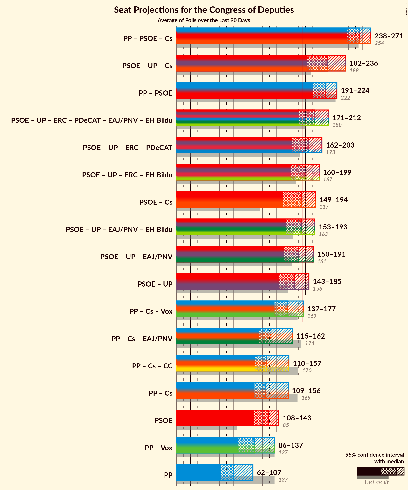

# Overview

The table below lists the most recent polls (less than 90 days old) registered and analyzed so far.

| Period     | Polling firm/Commissioner(s) | PP | PSOE | UP | Cs | ERC | PDeCAT | EAJ/PNV | PACMA | EH Bildu | CC | Vox | BNG |
|:----------:|:----------------------------:|:--:|:--:|:--:|:--:|:--:|:--:|:--:|:--:|:--:|:--:|:--:|:--:|
| 26 June 2016 | General Election | 33.0%   137 | 22.6%   85 | 21.2%   71 | 13.1%   32 | 2.7%   9 | 2.0%   8 | 1.2%   5 | 1.2%   0 | 0.8%   2 | 0.3%   1 | 0.2%   0 | 0.2%   0 |
| N/A | [Poll Average](average.html) | 16–25%   61–109 | 25–33%   104–143 | 11–16%   27–52 | 13–18%   37–65 | 2–5%   9–20 | 1–2%   3–10 | 1–2%   3–10 | 1–2%   0–1 | 0–2%   1–7 | 0–1%   0–4 | 8–15%   13–46 | N/A   N/A |
| [22 February–14 April 2019](2019-04-14-electoPanel.html) | electoPanel   electomania.es | 19–21%   72–85 | 27–29%   118–129 | 13–14%   36–40 | 15–16%   49–58 | 2–3%   12–14 | 1–2%   4–5 | 1–2%   6–8 | 2%   0–1 | 1%   2–6 | 0%   0–1 | 10–12%   24–27 | N/A   N/A |
| [30 March–14 April 2019](2019-04-14-NCReport.html) | NC Report   La Razón | 22–27%   84–118 | 25–30%   89–133 | 12–16%   29–52 | 14–18%   40–59 | 2–4%   8–17 | 1–2%   1–8 | 1–2%   3–10 | N/A   N/A | 0–2%   1–7 | 0–1%   0–4 | 7–11%   13–27 | N/A   N/A |
| [7–13 April 2019](2019-04-13-IMOP.html) | IMOP   El Confidencial | 17–21%   71–72 | 29–33%   133–136 | 13–16%   36–38 | 14–18%   48–50 | 3–4%   15–16 | 1–2%   4–8 | 1–2%   6–7 | 1–3%   1 | 0–1%   2–5 | 0–1%   0–1 | 8–11%   23–24 | N/A   N/A |
| [5–12 April 2019](2019-04-12-SocioMétrica.html) | SocioMétrica   El Español | 17–21%   65–78 | 28–32%   129–145 | 12–15%   30–40 | 14–17%   36–53 | 2–4%   9–16 | 1–2%   3–10 | 1–2%   5–8 | 1–2%   0–1 | 1–2%   1–8 | 0–1%   0–4 | 10–13%   26–41 | N/A   N/A |
| [8–11 April 2019](2019-04-11-Invymark.html) | Invymark   laSexta | 19–23%   70–88 | 25–30%   104–132 | 11–15%   26–45 | 14–19%   42–65 | N/A   N/A | N/A   N/A | N/A   N/A | N/A   N/A | N/A   N/A | N/A   N/A | 11–15%   28–45 | N/A   N/A |
| [9–11 April 2019](2019-04-11-GAD3.html) | GAD3   La Vanguardia | 18–24%   80 | 28–34%   126–127 | 10–14%   33 | 12–17%   50 | 3–5%   15 | 1–2%   4 | 1–2%   6 | 1–2%   0 | 0–2%   1–2 | 0–1%   2 | 9–14%   29–33 | N/A   N/A |
| [8–11 April 2019](2019-04-11-DemoscopiayServicios.html) | Demoscopia y Servicios   ESdiario | N/A   N/A | N/A   N/A | N/A   N/A | N/A   N/A | N/A   N/A | N/A   N/A | N/A   N/A | N/A   N/A | N/A   N/A | N/A   N/A | N/A   N/A | N/A   N/A |
| [4–10 April 2019](2019-04-10-Celeste-Tel.html) | Celeste-Tel   eldiario.es | 21–27%   85–120 | 25–30%   100–128 | 13–17%   33–53 | 14–18%   43–61 | 2–4%   9–15 | 1–3%   4–10 | 1–2%   3–8 | 1–2%   0–1 | 0–2%   1–7 | 0–1%   0–3 | 6–10%   10–22 | N/A   N/A |
| [1–5 April 2019](2019-04-05-SimpleLógica.html) | Simple Lógica | 15–19%   53–75 | 28–33%   124–151 | 12–17%   34–55 | 13–18%   42–62 | N/A   N/A | N/A   N/A | N/A   N/A | N/A   N/A | N/A   N/A | N/A   N/A | 8–12%   17–32 | N/A   N/A |
| [1–5 April 2019](2019-04-05-GESOP.html) | GESOP   El Periódico | 19–23%   73–98 | 28–32%   119–143 | 10–14%   24–37 | 13–16%   37–55 | N/A   N/A | N/A   N/A | N/A   N/A | N/A   N/A | N/A   N/A | N/A   N/A | 9–12%   21–33 | N/A   N/A |
| [18–25 March 2019](2019-03-25-Metroscopia.html) | Metroscopia   Henneo | 18–21%   65–83 | 27–30%   115–136 | 13–15%   34–44 | 15–18%   48–61 | N/A   N/A | N/A   N/A | N/A   N/A | N/A   N/A | N/A   N/A | N/A   N/A | 11–13%   26–36 | N/A   N/A |
| [15–20 March 2019](2019-03-20-Sondaxe.html) | Sondaxe   La Voz de Galicia | 17–21%   65–88 | 24–30%   103–131 | 11–16%   28–44 | 12–16%   31–54 | 3–5%   13–21 | 1–3%   3–10 | 1–2%   3–8 | N/A   N/A | 0–2%   1–7 | 0–1%   1–4 | 12–16%   33–54 | N/A   N/A |
| [14–19 March 2019](2019-03-19-40dB.html) | 40dB   El País | 17–21%   68–89 | 25–29%   109–132 | 11–14%   26–40 | 16–20%   53–69 | N/A   N/A | N/A   N/A | N/A   N/A | N/A   N/A | N/A   N/A | N/A   N/A | 9–12%   20–32 | N/A   N/A |
| [1–18 March 2019](2019-03-18-CIS.html) | CIS | 17–18%   65–67 | 29–31%   134–138 | 13–14%   35–39 | 13–14%   41–46 | 4–5%   16–20 | 1%   3–4 | 1%   6 | 1–2%   0 | 1%   5 | 0–1%   1–2 | 11–12%   31–34 | N/A   N/A |
| [19–22 February 2019](2019-02-22-SigmaDos.html) | Sigma Dos   El Mundo | 17–21%   63–87 | 25–30%   105–131 | 13–17%   33–49 | 14–18%   43–63 | 2–4%   11–18 | 1–2%   1–8 | 1–2%   3–9 | N/A   N/A | N/A   N/A | N/A   N/A | 12–15%   28–50 | N/A   N/A |
| 26 June 2016 | General Election | 33.0%   137 | 22.6%   85 | 21.2%   71 | 13.1%   32 | 2.7%   9 | 2.0%   8 | 1.2%   5 | 1.2%   0 | 0.8%   2 | 0.3%   1 | 0.2%   0 | 0.2%   0 |

Only polls for which at least the sample size has been published are included in the table above.

**Legend:**
+ **Top half of each row:** Voting intentions (95% confidence interval)
+ **Bottom half of each row:** Seat projections for the Congress of Deputies (95% confidence interval)
+ **PP:** Partido Popular
+ **PSOE:** Partido Socialista Obrero Español
+ **UP:** Unidos Podemos
+ **Cs:** Ciudadanos–Partido de la Ciudadanía
+ **ERC:** Esquerra Republicana de Catalunya–Catalunya Sí
+ **PDeCAT:** Partit Demòcrata Europeu Català
+ **EAJ/PNV:** Euzko Alderdi Jeltzalea/Partido Nacionalista Vasco
+ **PACMA:** Partido Animalista Contra el Maltrato Animal
+ **EH Bildu:** Euskal Herria Bildu
+ **CC:** Coalición Canaria–Partido Nacionalista Canario
+ **Vox:** Vox
+ **BNG:** Bloque Nacionalista Galego–Nós Candidatura Galega
+ **N/A (single party):** Party not included the published results
+ **N/A (entire row):** Calculation for this opinion poll not started yet

