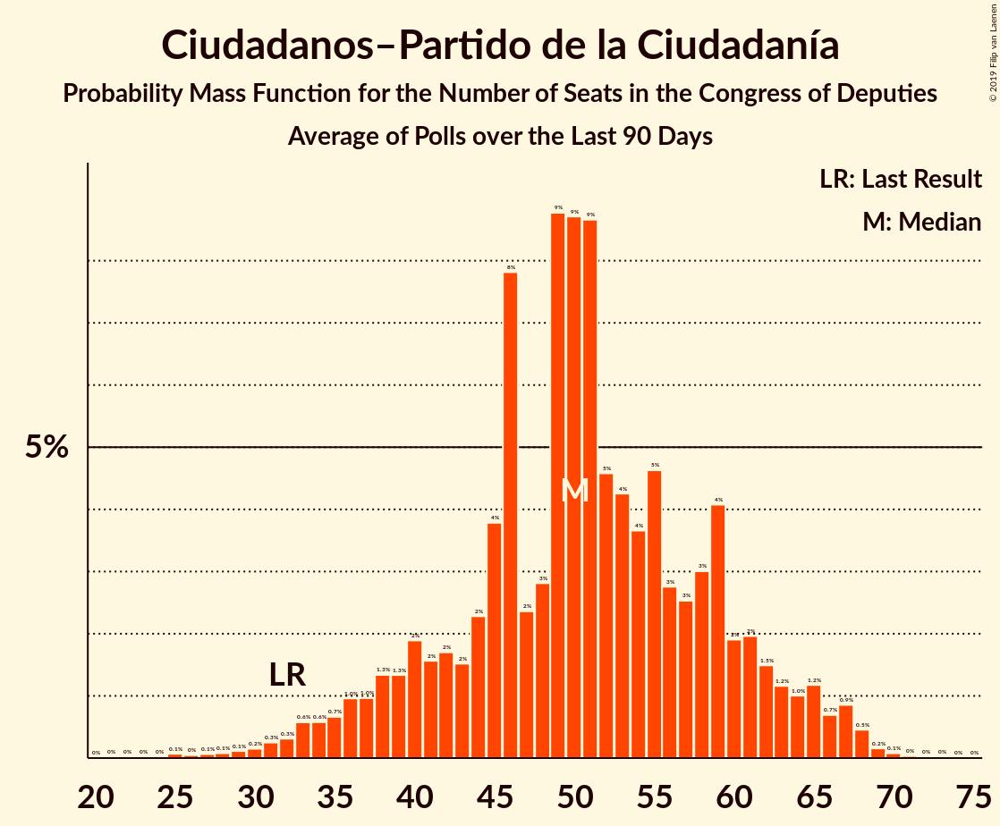

# Ciudadanos–Partido de la Ciudadanía

<a href="#voting-intentions">Voting Intentions</a> | <a href="#seats">Seats</a>

## Voting Intentions

Last result: **13.1%** (General Election of 26 June 2016)

### Confidence Intervals

| Period     | Polling firm/Commissioner(s) | Median | 80% Confidence Interval | 90% Confidence Interval | 95% Confidence Interval | 99% Confidence Interval |
|:----------:|:----------------:|:-----------:|:-----------------------:|:-----------------------:|:-----------------------:|:-----------------------:|
| N/A | [Poll Average](average.html) | 16.6% | 13.6–19.3% | 12.9–20.2% | 12.4–21.0% | 11.5–22.2% |
| [15–20 March 2019](2019-03-20-Sondaxe.html) | Sondaxe   La Voz de Galicia | 13.8% | 12.5–15.3% | 12.1–15.7% | 11.8–16.1% | 11.2–16.8% |
| [14–19 March 2019](2019-03-19-40dB.html) | 40dB   El País | 17.7% | 16.5–19.1% | 16.2–19.4% | 15.9–19.8% | 15.3–20.4% |
| [22 February–17 March 2019](2019-03-17-electoPanel.html) | electoPanel   electomania.es | 15.4% | 14.9–16.0% | 14.7–16.1% | 14.6–16.2% | 14.3–16.5% |
| [11–15 March 2019](2019-03-15-NCReport.html) | NC Report   La Razón | 17.8% | 16.3–19.4% | 15.9–19.9% | 15.5–20.3% | 14.9–21.1% |
| [4–13 March 2019](2019-03-13-SimpleLógica.html) | Simple Lógica | 16.7% | 15.3–18.2% | 14.9–18.6% | 14.6–19.0% | 13.9–19.8% |
| [8–11 March 2019](2019-03-11-Celeste-Tel.html) | Celeste-Tel   eldiario.es | 18.1% | 16.7–19.7% | 16.3–20.1% | 15.9–20.5% | 15.3–21.2% |
| [22 February–10 March 2019](2019-03-10-electoPanel.html) | electoPanel   electomania.es | 16.1% | 15.5–16.7% | 15.4–16.9% | 15.2–17.0% | 15.0–17.3% |
| [5–8 March 2019](2019-03-08-SocioMétrica.html) | SocioMétrica   El Español | 17.8% | 16.6–19.1% | 16.3–19.5% | 16.0–19.8% | 15.5–20.4% |
| [4–8 March 2019](2019-03-08-Invymark.html) | Invymark   laSexta | 20.3% | 18.9–21.9% | 18.5–22.3% | 18.2–22.7% | 17.5–23.5% |
| [4–8 March 2019](2019-03-08-GAD3.html) | GAD3   ABC | 13.2% | 11.9–14.7% | 11.6–15.1% | 11.2–15.5% | 10.7–16.2% |
| [22 February–3 March 2019](2019-03-03-electoPanel.html) | electoPanel   electomania.es | 16.2% | 15.5–16.9% | 15.4–17.1% | 15.2–17.2% | 14.9–17.6% |
| [19–22 February 2019](2019-02-22-SigmaDos.html) | Sigma Dos   El Mundo | 16.0% | 14.7–17.4% | 14.3–17.8% | 14.0–18.2% | 13.4–18.9% |
| [18–22 February 2019](2019-02-22-GAD3.html) | GAD3   ABC | 15.8% | 14.2–17.5% | 13.8–18.0% | 13.4–18.4% | 12.7–19.3% |
| [13–21 February 2019](2019-02-21-Sondaxe.html) | Sondaxe   La Voz de Galicia | 13.5% | 12.5–14.7% | 12.1–15.1% | 11.9–15.4% | 11.4–16.0% |
| [18–21 February 2019](2019-02-21-Invymark.html) | Invymark   laSexta | 20.2% | 18.7–21.7% | 18.3–22.2% | 18.0–22.5% | 17.3–23.3% |
| [13–15 February 2019](2019-02-15-SocioMétrica.html) | SocioMétrica   El Español | 18.7% | 17.2–20.4% | 16.8–20.8% | 16.4–21.2% | 15.7–22.1% |
| [11–15 February 2019](2019-02-15-NCReport.html) | NC Report   La Razón | 18.9% | 17.4–20.6% | 16.9–21.0% | 16.6–21.5% | 15.9–22.3% |
| [13–15 February 2019](2019-02-15-GESOP.html) | GESOP   El Periódico | 14.5% | 13.2–16.0% | 12.8–16.4% | 12.5–16.8% | 11.8–17.6% |
| [12–15 February 2019](2019-02-15-GAD3.html) | GAD3   La Vanguardia | 17.1% | 15.7–18.5% | 15.4–19.0% | 15.1–19.3% | 14.4–20.0% |
| [11–13 February 2019](2019-02-13-Metroscopia.html) | Metroscopia   Henneo | 15.4% | 14.4–16.5% | 14.1–16.8% | 13.9–17.0% | 13.4–17.6% |
| [1–8 February 2019](2019-02-08-SimpleLógica.html) | Simple Lógica | 17.0% | 15.6–18.6% | 15.2–19.1% | 14.8–19.4% | 14.2–20.2% |
| [4–8 February 2019](2019-02-08-Celeste-Tel.html) | Celeste-Tel   eldiario.es | 19.2% | 17.7–20.8% | 17.3–21.2% | 17.0–21.6% | 16.3–22.4% |
| [28 January–1 February 2019](2019-02-01-Invymark.html) | Invymark   laSexta | 20.9% | 19.5–22.5% | 19.1–22.9% | 18.7–23.3% | 18.0–24.1% |
| [26–30 January 2019](2019-01-30-electoPanel.html) | electoPanel   electomania.es | 19.6% | 18.7–20.6% | 18.4–20.8% | 18.2–21.1% | 17.7–21.6% |
| [21–25 January 2019](2019-01-25-NCReport.html) | NC Report   La Razón | 18.7% | 17.2–20.4% | 16.8–20.8% | 16.4–21.2% | 15.7–22.1% |
| [14–24 January 2019](2019-01-24-GAD3.html) | GAD3   ABC | 17.1% | 16.0–18.3% | 15.7–18.6% | 15.4–18.9% | 14.9–19.5% |
| [14–18 January 2019](2019-01-18-Invymark.html) | Invymark   laSexta | 23.0% | 21.5–24.6% | 21.1–25.1% | 20.7–25.5% | 20.0–26.3% |
| [9–15 January 2019](2019-01-15-Metroscopia.html) | Metroscopia   Henneo | 17.8% | 16.8–18.9% | 16.5–19.1% | 16.3–19.4% | 15.8–19.9% |
| [6–13 January 2019](2019-01-13-electoPanel.html) | electoPanel   electomania.es | 19.9% | 18.5–21.3% | 18.2–21.7% | 17.9–22.1% | 17.2–22.7% |
| [1–13 January 2019](2019-01-13-CIS.html) | CIS | 17.7% | 16.8–18.6% | 16.6–18.9% | 16.4–19.1% | 16.0–19.6% |
| [3–9 January 2019](2019-01-09-SimpleLógica.html) | Simple Lógica | 17.9% | 16.5–19.6% | 16.1–20.0% | 15.7–20.4% | 15.1–21.2% |
| [2–8 January 2019](2019-01-08-Celeste-Tel.html) | Celeste-Tel   eldiario.es | 19.6% | 18.2–21.2% | 17.7–21.7% | 17.4–22.1% | 16.7–22.9% |
| [22 December 2018–5 January 2019](2019-01-05-SocioMétrica.html) | SocioMétrica   El Español | 18.5% | 17.5–19.6% | 17.2–19.9% | 16.9–20.2% | 16.4–20.7% |
| [21–27 December 2018](2018-12-27-SigmaDos.html) | Sigma Dos   El Mundo | 18.8% | 17.3–20.5% | 16.9–20.9% | 16.5–21.4% | 15.8–22.2% |
| [17–21 December 2018](2018-12-21-Invymark.html) | Invymark   laSexta | 22.7% | 21.2–24.3% | 20.7–24.7% | 20.4–25.1% | 19.7–25.9% |
| [16 December 2018](2018-12-16-SigmaDos.html) | Sigma Dos   Antena 3 | 18.4% | 16.9–20.1% | 16.5–20.5% | 16.1–20.9% | 15.4–21.7% |
| [10–14 December 2018](2018-12-14-SocioMétrica.html) | SocioMétrica   El Español | 19.0% | 17.4–20.8% | 16.9–21.3% | 16.6–21.7% | 15.8–22.6% |
| [3–14 December 2018](2018-12-14-SimpleLógica.html) | Simple Lógica | 20.4% | 19.0–22.0% | 18.6–22.4% | 18.2–22.8% | 17.6–23.6% |
| [5–14 December 2018](2018-12-14-NCReport.html) | NC Report   La Razón | 18.0% | 16.5–19.6% | 16.1–20.1% | 15.7–20.5% | 15.0–21.3% |
| [10–14 December 2018](2018-12-14-GAD3.html) | GAD3   ABC | 20.7% | 19.1–22.4% | 18.7–22.9% | 18.3–23.3% | 17.6–24.2% |
| [10–13 December 2018](2018-12-13-IMOP.html) | IMOP   El Confidencial | 20.6% | 19.0–22.2% | 18.6–22.7% | 18.2–23.1% | 17.5–24.0% |
| [10–12 December 2018](2018-12-12-Metroscopia.html) | Metroscopia   Henneo | 20.5% | 19.3–21.7% | 19.0–22.1% | 18.7–22.4% | 18.2–23.0% |
| [3–11 December 2018](2018-12-11-Celeste-Tel.html) | Celeste-Tel   eldiario.es | 19.4% | 17.9–21.0% | 17.5–21.4% | 17.1–21.8% | 16.4–22.6% |
| [3–7 December 2018](2018-12-07-Invymark.html) | Invymark   laSexta | 22.9% | 21.4–24.5% | 21.0–25.0% | 20.6–25.4% | 19.9–26.2% |
| [5 December 2018](2018-12-05-SocioMétrica.html) | SocioMétrica   El Español | 18.8% | 17.2–20.5% | 16.7–21.0% | 16.4–21.5% | 15.6–22.3% |
| [3–4 December 2018](2018-12-04-electoPanel.html) | electoPanel   electomania.es | 21.4% | 20.1–22.8% | 19.7–23.2% | 19.4–23.5% | 18.8–24.2% |
| [2–14 November 2018](2018-11-14-SimpleLógica.html) | Simple Lógica | 22.4% | 20.8–24.1% | 20.3–24.6% | 19.9–25.0% | 19.2–25.9% |
| [5–9 November 2018](2018-11-09-NCReport.html) | NC Report   La Razón | 19.9% | 18.4–21.6% | 17.9–22.1% | 17.5–22.5% | 16.8–23.3% |
| [5–9 November 2018](2018-11-09-Invymark.html) | Invymark   laSexta | 22.7% | 21.2–24.3% | 20.7–24.7% | 20.4–25.1% | 19.7–25.9% |
| [5–9 November 2018](2018-11-09-Celeste-Tel.html) | Celeste-Tel   eldiario.es | 20.4% | 18.9–22.0% | 18.4–22.5% | 18.1–22.8% | 17.4–23.7% |
| [2–7 November 2018](2018-11-07-GAD3.html) | GAD3   La Vanguardia | 21.9% | 20.1–23.8% | 19.6–24.4% | 19.1–24.9% | 18.3–25.8% |
| [22–30 October 2018](2018-10-30-GESOP.html) | GESOP   El Periódico | 21.8% | 20.2–23.7% | 19.7–24.2% | 19.3–24.6% | 18.5–25.5% |
| [20–26 October 2018](2018-10-26-electoPanel.html) | electoPanel   electomania.es | 21.9% | 20.3–23.6% | 19.9–24.1% | 19.5–24.5% | 18.7–25.4% |
| [22–26 October 2018](2018-10-26-Invymark.html) | Invymark   laSexta | 22.0% | 20.5–23.6% | 20.1–24.1% | 19.7–24.4% | 19.1–25.2% |
| [16–18 October 2018](2018-10-18-Metroscopia.html) | Metroscopia   Henneo | 19.2% | 18.0–20.5% | 17.6–20.9% | 17.3–21.2% | 16.8–21.9% |
| [1–11 October 2018](2018-10-11-NCReport.html) | NC Report   La Razón | 19.5% | 18.0–21.2% | 17.5–21.7% | 17.2–22.1% | 16.4–22.9% |
| [1–9 October 2018](2018-10-09-CIS.html) | CIS | 21.0% | 20.0–22.0% | 19.8–22.3% | 19.6–22.5% | 19.1–23.0% |
| [30 September–5 October 2018](2018-10-05-electoPanel.html) | electoPanel   electomania.es | 22.2% | 20.6–23.9% | 20.1–24.4% | 19.8–24.8% | 19.0–25.7% |
| [1–5 October 2018](2018-10-05-SimpleLógica.html) | Simple Lógica | 21.6% | 20.0–23.3% | 19.6–23.8% | 19.2–24.2% | 18.5–25.0% |
| [1–5 October 2018](2018-10-05-Celeste-Tel.html) | Celeste-Tel   eldiario.es | 19.3% | 17.8–20.9% | 17.4–21.3% | 17.0–21.7% | 16.4–22.5% |
| [2 October 2018](2018-10-02-SimpleLógica.html) | Simple Lógica   eldebate.es | 23.1% | 21.4–24.9% | 21.0–25.4% | 20.6–25.8% | 19.8–26.7% |
| [24–28 September 2018](2018-09-28-Invymark.html) | Invymark   laSexta | 22.3% | 20.8–23.9% | 20.4–24.4% | 20.1–24.8% | 19.4–25.6% |
| [17–19 September 2018](2018-09-19-Metroscopia.html) | Metroscopia   Henneo | 20.8% | 19.3–22.5% | 18.9–22.9% | 18.5–23.3% | 17.8–24.1% |
| [17–19 September 2018](2018-09-19-InstitutoDYM.html) | Instituto DYM   El Independiente | 22.7% | 21.1–24.5% | 20.6–25.0% | 20.2–25.4% | 19.5–26.3% |
| [10–14 September 2018](2018-09-14-Invymark.html) | Invymark   laSexta | 22.1% | 20.6–23.7% | 20.2–24.1% | 19.8–24.5% | 19.1–25.3% |
| [6–11 September 2018](2018-09-11-IMOP.html) | IMOP   El Confidencial | 23.9% | 22.3–25.7% | 21.8–26.2% | 21.4–26.6% | 20.6–27.5% |
| [1–11 September 2018](2018-09-11-CIS.html) | CIS | 19.6% | 18.7–20.6% | 18.4–20.9% | 18.2–21.1% | 17.8–21.6% |
| [7–9 September 2018](2018-09-09-electoPanel.html) | electoPanel   electomania.es | 19.8% | 18.3–21.5% | 17.9–21.9% | 17.5–22.3% | 16.8–23.2% |
| [3–7 September 2018](2018-09-07-SimpleLógica.html) | Simple Lógica | 23.2% | 21.5–24.9% | 21.1–25.4% | 20.7–25.9% | 19.9–26.7% |
| [3–7 September 2018](2018-09-07-GAD3.html) | GAD3   ABC | 20.6% | 19.0–22.3% | 18.6–22.8% | 18.2–23.2% | 17.5–24.0% |
| [3–7 September 2018](2018-09-07-Celeste-Tel.html) | Celeste-Tel   eldiario.es | 18.7% | 17.3–20.3% | 16.9–20.8% | 16.5–21.2% | 15.9–21.9% |
| [27–31 August 2018](2018-08-31-NCReport.html) | NC Report   La Razón | 18.8% | 17.3–20.5% | 16.9–20.9% | 16.5–21.4% | 15.8–22.2% |
| [22–30 August 2018](2018-08-30-SocioMétrica.html) | SocioMétrica   El Español | 23.1% | 21.6–24.7% | 21.1–25.2% | 20.8–25.6% | 20.1–26.4% |
| [1–7 August 2018](2018-08-07-Celeste-Tel.html) | Celeste-Tel   eldiario.es | 19.4% | 17.9–21.0% | 17.5–21.4% | 17.1–21.8% | 16.4–22.6% |
| [27 July–3 August 2018](2018-08-03-electoPanel.html) | electoPanel   electomania.es | 21.2% | 19.7–22.8% | 19.2–23.3% | 18.9–23.7% | 18.2–24.5% |
| [1–3 August 2018](2018-08-03-SimpleLógica.html) | Simple Lógica | 23.4% | 21.8–25.2% | 21.3–25.7% | 20.9–26.1% | 20.2–27.0% |
| [23–27 July 2018](2018-07-27-NCReport.html) | NC Report   La Razón | 19.2% | 17.7–20.9% | 17.2–21.4% | 16.9–21.8% | 16.2–22.6% |
| [23–27 July 2018](2018-07-27-Invymark.html) | Invymark   laSexta | 21.1% | 19.6–22.7% | 19.2–23.1% | 18.9–23.5% | 18.2–24.3% |
| [24–26 July 2018](2018-07-26-GAD3.html) | GAD3   ABC | 19.7% | 17.9–21.6% | 17.5–22.1% | 17.0–22.5% | 16.3–23.5% |
| [16–25 July 2018](2018-07-25-Metroscopia.html) | Metroscopia   Henneo | 20.1% | 19.0–21.2% | 18.7–21.5% | 18.5–21.8% | 18.0–22.3% |
| [22–25 July 2018](2018-07-25-DemoscopiayServicios.html) | Demoscopia y Servicios   OKDIARIO | 20.8% | 19.3–22.5% | 18.9–23.0% | 18.5–23.4% | 17.8–24.2% |
| [17–22 July 2018](2018-07-22-electoPanel.html) | electoPanel   electomania.es | 20.8% | 19.8–21.8% | 19.6–22.1% | 19.3–22.3% | 18.9–22.8% |
| [9–13 July 2018](2018-07-13-Invymark.html) | Invymark   laSexta | 21.9% | 20.4–23.5% | 20.0–24.0% | 19.7–24.4% | 19.0–25.1% |
| [9–12 July 2018](2018-07-12-SigmaDos.html) | Sigma Dos   El Mundo | 24.2% | 22.5–26.0% | 22.1–26.5% | 21.6–27.0% | 20.9–27.8% |
| [1–10 July 2018](2018-07-10-CIS.html) | CIS | 20.4% | 19.4–21.5% | 19.1–21.8% | 18.9–22.0% | 18.4–22.6% |
| [2–6 July 2018](2018-07-06-SimpleLógica.html) | Simple Lógica | 26.0% | 24.3–27.8% | 23.8–28.3% | 23.4–28.7% | 22.6–29.6% |
| [2–6 July 2018](2018-07-06-Celeste-Tel.html) | Celeste-Tel   eldiario.es | 20.6% | 19.1–22.3% | 18.7–22.7% | 18.3–23.1% | 17.6–23.9% |
| [25–30 June 2018](2018-06-30-NCReport.html) | NC Report   La Razón | 20.6% | 19.0–22.3% | 18.6–22.8% | 18.2–23.2% | 17.5–24.1% |
| [19–22 June 2018](2018-06-22-SocioMétrica.html) | SocioMétrica   El Español | 25.3% | 23.6–27.1% | 23.1–27.6% | 22.7–28.1% | 21.9–29.0% |
| [18–22 June 2018](2018-06-22-Invymark.html) | Invymark   laSexta | 22.1% | 20.6–23.7% | 20.2–24.1% | 19.8–24.5% | 19.1–25.3% |
| [11–13 June 2018](2018-06-13-GESOP.html) | GESOP   El Periódico | 22.8% | 20.9–24.7% | 20.4–25.3% | 20.0–25.8% | 19.1–26.8% |
| [11–12 June 2018](2018-06-12-InstitutoDYM.html) | Instituto DYM   El Independiente | 20.6% | 19.1–22.3% | 18.6–22.8% | 18.2–23.2% | 17.5–24.0% |
| [1–9 June 2018](2018-06-09-NCReport.html) | NC Report   La Razón | 21.0% | 19.5–22.6% | 19.1–23.0% | 18.8–23.4% | 18.1–24.2% |
| [4–8 June 2018](2018-06-08-SimpleLógica.html) | Simple Lógica | 25.7% | 24.0–27.5% | 23.6–28.0% | 23.2–28.5% | 22.4–29.4% |
| [4–8 June 2018](2018-06-08-Invymark.html) | Invymark   laSexta | 22.2% | 20.7–23.8% | 20.3–24.2% | 19.9–24.6% | 19.2–25.4% |
| [7–8 June 2018](2018-06-08-GAD3.html) | GAD3   ABC | 21.1% | 19.4–23.1% | 18.9–23.6% | 18.4–24.1% | 17.6–25.1% |
| [4–8 June 2018](2018-06-08-Celeste-Tel.html) | Celeste-Tel   eldiario.es | 21.1% | 19.6–22.7% | 19.1–23.2% | 18.8–23.6% | 18.1–24.4% |
| [6–7 June 2018](2018-06-07-electoPanel.html) | electoPanel   electomania.es | 22.5% | 20.7–24.4% | 20.2–24.9% | 19.8–25.4% | 18.9–26.3% |
| [26 May–2 June 2018](2018-06-02-electoPanel.html) | electoPanel   electomania.es | 24.2% | 23.0–25.4% | 22.6–25.8% | 22.4–26.1% | 21.8–26.7% |
| [28–29 May 2018](2018-05-29-Invymark.html) | Invymark   laSexta | 26.4% | 24.8–28.1% | 24.4–28.6% | 24.0–29.0% | 23.2–29.8% |
| [26–28 May 2018](2018-05-28-electoPanel.html) | electoPanel   electomania.es | 24.0% | 22.6–25.5% | 22.2–25.9% | 21.8–26.3% | 21.2–27.0% |
| [23–28 May 2018](2018-05-28-IMOP.html) | IMOP   El Confidencial | 28.6% | 26.8–30.5% | 26.3–31.0% | 25.9–31.4% | 25.0–32.3% |
| [17–26 May 2018](2018-05-26-SocioMétrica.html) | SocioMétrica   El Español | 28.5% | 27.1–30.0% | 26.8–30.4% | 26.4–30.7% | 25.8–31.4% |
| [16–25 May 2018](2018-05-25-NCReport.html) | NC Report   La Razón | 24.4% | 22.7–26.2% | 22.2–26.7% | 21.8–27.2% | 21.0–28.0% |
| [3–10 May 2018](2018-05-10-SimpleLógica.html) | Simple Lógica | 29.6% | 27.9–31.5% | 27.4–32.0% | 26.9–32.4% | 26.1–33.3% |
| [7–9 May 2018](2018-05-09-Metroscopia.html) | Metroscopia   El País | 29.1% | 27.7–30.5% | 27.3–30.9% | 27.0–31.3% | 26.3–32.0% |
| [26–30 April 2018](2018-04-30-Celeste-Tel.html) | Celeste-Tel   PSOE | 19.7% | 18.2–21.4% | 17.7–21.9% | 17.3–22.3% | 16.6–23.1% |
| [12–18 April 2018](2018-04-18-GESOP.html) | GESOP   El Periódico | 28.5% | 26.7–30.4% | 26.2–30.9% | 25.8–31.4% | 25.0–32.3% |
| [9–13 April 2018](2018-04-13-NCReport.html) | NC Report   La Razón | 24.3% | 22.6–26.1% | 22.1–26.6% | 21.7–27.1% | 21.0–27.9% |
| [9–13 April 2018](2018-04-13-Invymark.html) | Invymark   laSexta | 25.2% | 23.6–26.8% | 23.2–27.3% | 22.8–27.7% | 22.1–28.5% |
| [1–10 April 2018](2018-04-10-CIS.html) | CIS | 22.4% | 21.3–23.5% | 21.0–23.8% | 20.8–24.1% | 20.3–24.6% |
| [2–9 April 2018](2018-04-09-SimpleLógica.html) | Simple Lógica | 29.9% | 28.2–31.8% | 27.7–32.3% | 27.3–32.8% | 26.4–33.7% |
| [2–6 April 2018](2018-04-06-Celeste-Tel.html) | Celeste-Tel   eldiario.es | 24.0% | 22.4–25.7% | 21.9–26.2% | 21.6–26.6% | 20.8–27.5% |
| [4–5 April 2018](2018-04-05-Metroscopia.html) | Metroscopia   El País | 28.7% | 27.1–30.4% | 26.7–30.8% | 26.3–31.3% | 25.5–32.1% |
| [19–29 March 2018](2018-03-29-SocioMétrica.html) | SocioMétrica   El Español | 27.4% | 25.6–29.3% | 25.1–29.8% | 24.7–30.3% | 23.9–31.2% |
| [23–27 March 2018](2018-03-27-SigmaDos.html) | Sigma Dos   El Mundo | 26.7% | 25.0–28.6% | 24.5–29.1% | 24.1–29.5% | 23.2–30.4% |
| [13–16 March 2018](2018-03-16-MyWord.html) | MyWord   Cadena SER | 23.8% | 22.1–25.5% | 21.6–26.0% | 21.2–26.5% | 20.4–27.4% |
| [12–16 March 2018](2018-03-16-Invymark.html) | Invymark   laSexta | 25.0% | 23.4–26.7% | 23.0–27.1% | 22.6–27.5% | 21.9–28.3% |
| [12–14 March 2018](2018-03-14-GAD3.html) | GAD3   La Vanguardia | 27.3% | 25.5–29.1% | 25.0–29.7% | 24.6–30.1% | 23.8–31.0% |
| [1–7 March 2018](2018-03-07-SimpleLógica.html) | Simple Lógica | 29.6% | 27.8–31.4% | 27.3–31.9% | 26.9–32.4% | 26.1–33.2% |
| [1–7 March 2018](2018-03-07-Celeste-Tel.html) | Celeste-Tel   eldiario.es | 23.5% | 22.0–25.3% | 21.5–25.7% | 21.1–26.2% | 20.4–27.0% |
| [2–5 March 2018](2018-03-05-Metroscopia.html) | Metroscopia   El País | 28.9% | 27.3–30.7% | 26.8–31.2% | 26.4–31.6% | 25.6–32.4% |
| [26 February–2 March 2018](2018-03-02-NCReport.html) | NC Report   La Razón | 22.1% | 20.5–23.9% | 20.0–24.4% | 19.6–24.8% | 18.9–25.6% |
| [26 February–2 March 2018](2018-03-02-Invymark.html) | Invymark   laSexta | 24.0% | 22.5–25.6% | 22.0–26.1% | 21.7–26.5% | 20.9–27.3% |
| [22–27 February 2018](2018-02-27-IMOP.html) | IMOP   El Confidencial | 28.5% | 27.0–30.1% | 26.6–30.6% | 26.2–31.0% | 25.5–31.7% |
| [12–16 February 2018](2018-02-16-Invymark.html) | Invymark   laSexta | 23.8% | 22.3–25.5% | 21.9–25.9% | 21.5–26.3% | 20.8–27.1% |
| [7–14 February 2018](2018-02-14-MyWord.html) | MyWord   Cadena SER | 22.1% | 20.5–23.9% | 20.0–24.4% | 19.6–24.8% | 18.9–25.6% |
| [5–9 February 2018](2018-02-09-Celeste-Tel.html) | Celeste-Tel   eldiario.es | 19.3% | 17.8–20.9% | 17.4–21.3% | 17.0–21.7% | 16.4–22.5% |
| [5–8 February 2018](2018-02-08-Metroscopia.html) | Metroscopia   El País | 28.3% | 26.8–29.9% | 26.3–30.4% | 25.9–30.8% | 25.2–31.6% |
| [1–7 February 2018](2018-02-07-SimpleLógica.html) | Simple Lógica | 28.7% | 27.0–30.6% | 26.5–31.1% | 26.1–31.5% | 25.3–32.4% |
| [31 January–7 February 2018](2018-02-07-GAD3.html) | GAD3   ABC | 25.6% | 23.9–27.5% | 23.5–28.0% | 23.0–28.5% | 22.2–29.3% |
| [22–26 January 2018](2018-01-26-Invymark.html) | Invymark   laSexta | 23.4% | 21.9–25.0% | 21.5–25.5% | 21.1–25.9% | 20.4–26.7% |
| [2–14 January 2018](2018-01-14-CIS.html) | CIS | 20.7% | 19.7–21.8% | 19.4–22.1% | 19.2–22.4% | 18.7–22.9% |
| [9–11 January 2018](2018-01-11-Metroscopia.html) | Metroscopia   El País | 27.1% | 25.6–28.7% | 25.1–29.2% | 24.8–29.6% | 24.1–30.3% |
| [8–11 January 2018](2018-01-11-GAD3.html) | GAD3   ABC | 26.2% | 24.3–28.3% | 23.8–28.9% | 23.3–29.4% | 22.4–30.4% |
| [2–8 January 2018](2018-01-08-SimpleLógica.html) | Simple Lógica | 24.1% | 22.5–25.8% | 22.0–26.3% | 21.6–26.7% | 20.9–27.6% |
| [2–5 January 2018](2018-01-05-Celeste-Tel.html) | Celeste-Tel   eldiario.es | 18.6% | 17.2–20.2% | 16.8–20.7% | 16.4–21.0% | 15.8–21.8% |

### Probability Mass Function

The following table shows the probability mass function per percentage block of voting intentions for the [poll average](average.html) for Ciudadanos–Partido de la Ciudadanía.

| Voting Intentions | Probability | Accumulated | Special Marks |
|:-----------------:|:-----------:|:-----------:|:-------------:|
| 9.5–10.5% | 0% | 100% |  |
| 10.5–11.5% | 0.5% | 100% |  |
| 11.5–12.5% | 3% | 99.5% |  |
| 12.5–13.5% | 6% | 97% | Last Result |
| 13.5–14.5% | 9% | 91% |  |
| 14.5–15.5% | 16% | 82% |  |
| 15.5–16.5% | 15% | 66% |  |
| 16.5–17.5% | 16% | 50% | Median |
| 17.5–18.5% | 17% | 34% |  |
| 18.5–19.5% | 9% | 17% |  |
| 19.5–20.5% | 4% | 8% |  |
| 20.5–21.5% | 2% | 4% |  |
| 21.5–22.5% | 1.0% | 1.2% |  |
| 22.5–23.5% | 0.2% | 0.3% |  |
| 23.5–24.5% | 0% | 0% |  |

## Seats

Last result: **32** seats (General Election of 26 June 2016)

### Confidence Intervals

| Period     | Polling firm/Commissioner(s) | Median | 80% Confidence Interval | 90% Confidence Interval | 95% Confidence Interval | 99% Confidence Interval |
|:----------:|:----------------:|:------:|:-----------------------:|:-----------------------:|:-----------------------:|:-----------------------:|
| N/A | [Poll Average](average.html) | 56 | 40–67 | 35–70 | 31–72 | 26–77 |
| [15–20 March 2019](2019-03-20-Sondaxe.html) | Sondaxe   La Voz de Galicia | 43 | 34–48 | 32–51 | 31–54 | 25–56 |
| [14–19 March 2019](2019-03-19-40dB.html) | 40dB   El País | 64 | 58–67 | 55–68 | 53–69 | 51–73 |
| [22 February–17 March 2019](2019-03-17-electoPanel.html) | electoPanel   electomania.es | 51 | 47–55 | 47–56 | 47–56 | 47–56 |
| [11–15 March 2019](2019-03-15-NCReport.html) | NC Report   La Razón | 60 | 53–65 | 51–67 | 50–69 | 46–72 |
| [4–13 March 2019](2019-03-13-SimpleLógica.html) | Simple Lógica | 57 | 52–65 | 50–66 | 49–68 | 47–71 |
| [8–11 March 2019](2019-03-11-Celeste-Tel.html) | Celeste-Tel   eldiario.es | 61 | 55–67 | 53–69 | 52–70 | 50–73 |
| [22 February–10 March 2019](2019-03-10-electoPanel.html) | electoPanel   electomania.es | 55 | 50–57 | 50–58 | 50–60 | 49–61 |
| [5–8 March 2019](2019-03-08-SocioMétrica.html) | SocioMétrica   El Español | 63 | 57–67 | 55–67 | 53–67 | 51–72 |
| [4–8 March 2019](2019-03-08-Invymark.html) | Invymark   laSexta | 70 | 64–76 | 63–78 | 61–80 | 57–86 |
| [4–8 March 2019](2019-03-08-GAD3.html) | GAD3   ABC | 35 | 28–46 | 25–49 | 23–50 | 21–53 |
| [22 February–3 March 2019](2019-03-03-electoPanel.html) | electoPanel   electomania.es | 55 | 51–59 | 50–60 | 50–61 | 49–63 |
| [19–22 February 2019](2019-02-22-SigmaDos.html) | Sigma Dos   El Mundo | 53 | 46–59 | 45–61 | 43–63 | 38–65 |
| [18–22 February 2019](2019-02-22-GAD3.html) | GAD3   ABC | 51 | 42–60 | 38–60 | 35–63 | 31–65 |
| [13–21 February 2019](2019-02-21-Sondaxe.html) | Sondaxe   La Voz de Galicia | 39 | 33–45 | 32–47 | 31–47 | 27–52 |
| [18–21 February 2019](2019-02-21-Invymark.html) | Invymark   laSexta | 69 | 64–75 | 62–77 | 60–79 | 56–85 |
| [13–15 February 2019](2019-02-15-SocioMétrica.html) | SocioMétrica   El Español | 64 | 56–71 | 54–72 | 54–73 | 52–78 |
| [11–15 February 2019](2019-02-15-NCReport.html) | NC Report   La Razón | 64 | 57–70 | 55–72 | 53–73 | 51–75 |
| [13–15 February 2019](2019-02-15-GESOP.html) | GESOP   El Periódico | 47 | 38–53 | 36–55 | 35–56 | 31–61 |
| [12–15 February 2019](2019-02-15-GAD3.html) | GAD3   La Vanguardia | 58 | 51–63 | 51–64 | 49–66 | 45–69 |
| [11–13 February 2019](2019-02-13-Metroscopia.html) | Metroscopia   Henneo | 50 | 45–54 | 43–55 | 42–56 | 39–60 |
| [1–8 February 2019](2019-02-08-SimpleLógica.html) | Simple Lógica | 61 | 54–67 | 52–68 | 50–69 | 47–73 |
| [4–8 February 2019](2019-02-08-Celeste-Tel.html) | Celeste-Tel   eldiario.es | 63 | 59–65 | 58–71 | 58–73 | 56–76 |
| [28 January–1 February 2019](2019-02-01-Invymark.html) | Invymark   laSexta | 71 | 67–79 | 65–82 | 63–85 | 60–90 |
| [26–30 January 2019](2019-01-30-electoPanel.html) | electoPanel   electomania.es | 68 | 65–71 | 63–73 | 62–74 | 60–76 |
| [21–25 January 2019](2019-01-25-NCReport.html) | NC Report   La Razón | 62 | 55–69 | 54–71 | 53–71 | 51–74 |
| [14–24 January 2019](2019-01-24-GAD3.html) | GAD3   ABC | 60 | 53–64 | 50–66 | 50–66 | 49–68 |
| [14–18 January 2019](2019-01-18-Invymark.html) | Invymark   laSexta | 82 | 73–93 | 71–95 | 70–98 | 69–101 |
| [9–15 January 2019](2019-01-15-Metroscopia.html) | Metroscopia   Henneo | 61 | 56–64 | 56–65 | 55–66 | 53–69 |
| [6–13 January 2019](2019-01-13-electoPanel.html) | electoPanel   electomania.es | 69 | 64–75 | 62–76 | 60–78 | 57–83 |
| [1–13 January 2019](2019-01-13-CIS.html) | CIS | 64 | 61–67 | 59–69 | 57–70 | 56–71 |
| [3–9 January 2019](2019-01-09-SimpleLógica.html) | Simple Lógica | 64 | 57–69 | 55–71 | 54–73 | 50–77 |
| [2–8 January 2019](2019-01-08-Celeste-Tel.html) | Celeste-Tel   eldiario.es | 65 | 61–71 | 59–74 | 59–77 | 55–79 |
| [22 December 2018–5 January 2019](2019-01-05-SocioMétrica.html) | SocioMétrica   El Español | 65 | 58–69 | 58–69 | 57–71 | 56–73 |
| [21–27 December 2018](2018-12-27-SigmaDos.html) | Sigma Dos   El Mundo | 65 | 57–71 | 55–74 | 55–75 | 53–80 |
| [17–21 December 2018](2018-12-21-Invymark.html) | Invymark   laSexta | 80 | 72–91 | 71–93 | 69–96 | 67–100 |
| [16 December 2018](2018-12-16-SigmaDos.html) | Sigma Dos   Antena 3 | 63 | 58–69 | 56–71 | 54–72 | 51–76 |
| [10–14 December 2018](2018-12-14-SocioMétrica.html) | SocioMétrica   El Español | 65 | 59–70 | 57–72 | 57–73 | 49–78 |
| [3–14 December 2018](2018-12-14-SimpleLógica.html) | Simple Lógica | 72 | 66–79 | 63–81 | 63–84 | 61–91 |
| [5–14 December 2018](2018-12-14-NCReport.html) | NC Report   La Razón | 60 | 54–64 | 52–67 | 51–68 | 45–73 |
| [10–14 December 2018](2018-12-14-GAD3.html) | GAD3   ABC | 71 | 68–87 | 67–89 | 67–89 | 63–89 |
| [10–13 December 2018](2018-12-13-IMOP.html) | IMOP   El Confidencial | 72 | 67–77 | 65–79 | 65–84 | 60–92 |
| [10–12 December 2018](2018-12-12-Metroscopia.html) | Metroscopia   Henneo | 72 | 66–77 | 65–79 | 63–80 | 62–84 |
| [3–11 December 2018](2018-12-11-Celeste-Tel.html) | Celeste-Tel   eldiario.es | 68 | 59–68 | 59–68 | 58–68 | 55–75 |
| [3–7 December 2018](2018-12-07-Invymark.html) | Invymark   laSexta | 81 | 73–91 | 71–93 | 70–96 | 67–100 |
| [5 December 2018](2018-12-05-SocioMétrica.html) | SocioMétrica   El Español | 67 | 61–69 | 59–69 | 53–72 | 49–72 |
| [3–4 December 2018](2018-12-04-electoPanel.html) | electoPanel   electomania.es | 82 | 73–87 | 70–87 | 68–89 | 67–89 |
| [2–14 November 2018](2018-11-14-SimpleLógica.html) | Simple Lógica | 81 | 73–92 | 72–96 | 71–98 | 69–102 |
| [5–9 November 2018](2018-11-09-NCReport.html) | NC Report   La Razón | 67 | 54–69 | 54–72 | 54–74 | 54–79 |
| [5–9 November 2018](2018-11-09-Invymark.html) | Invymark   laSexta | 76 | 72–85 | 70–88 | 69–90 | 66–94 |
| [5–9 November 2018](2018-11-09-Celeste-Tel.html) | Celeste-Tel   eldiario.es | 67 | 65–70 | 62–71 | 58–75 | 58–82 |
| [2–7 November 2018](2018-11-07-GAD3.html) | GAD3   La Vanguardia | 76 | 72–81 | 69–91 | 67–93 | 61–95 |
| [22–30 October 2018](2018-10-30-GESOP.html) | GESOP   El Periódico | 77 | 70–86 | 68–90 | 67–93 | 63–97 |
| [20–26 October 2018](2018-10-26-electoPanel.html) | electoPanel   electomania.es | 73 | 71–88 | 71–88 | 71–88 | 66–94 |
| [22–26 October 2018](2018-10-26-Invymark.html) | Invymark   laSexta | 73 | 69–81 | 68–84 | 67–86 | 63–91 |
| [16–18 October 2018](2018-10-18-Metroscopia.html) | Metroscopia   Henneo | 65 | 61–71 | 59–72 | 59–73 | 57–76 |
| [1–11 October 2018](2018-10-11-NCReport.html) | NC Report   La Razón | 61 | 57–67 | 57–67 | 56–69 | 53–73 |
| [1–9 October 2018](2018-10-09-CIS.html) | CIS | 68 | 67–73 | 67–73 | 67–76 | 65–76 |
| [30 September–5 October 2018](2018-10-05-electoPanel.html) | electoPanel   electomania.es | 82 | 68–83 | 68–84 | 68–84 | 68–91 |
| [1–5 October 2018](2018-10-05-SimpleLógica.html) | Simple Lógica | 72 | 67–81 | 66–86 | 65–88 | 61–93 |
| [1–5 October 2018](2018-10-05-Celeste-Tel.html) | Celeste-Tel   eldiario.es | 64 | 58–70 | 58–70 | 58–70 | 52–74 |
| [2 October 2018](2018-10-02-SimpleLógica.html) | Simple Lógica   eldebate.es | 81 | 74–94 | 73–97 | 71–98 | 69–103 |
| [24–28 September 2018](2018-09-28-Invymark.html) | Invymark   laSexta | 74 | 70–82 | 69–85 | 68–87 | 64–92 |
| [17–19 September 2018](2018-09-19-Metroscopia.html) | Metroscopia   Henneo | 72 | 67–79 | 66–82 | 65–84 | 61–89 |
| [17–19 September 2018](2018-09-19-InstitutoDYM.html) | Instituto DYM   El Independiente | 78 | 71–86 | 70–89 | 69–93 | 67–97 |
| [10–14 September 2018](2018-09-14-Invymark.html) | Invymark   laSexta | 73 | 70–79 | 68–82 | 67–84 | 63–89 |
| [6–11 September 2018](2018-09-11-IMOP.html) | IMOP   El Confidencial | 85 | 80–89 | 80–89 | 78–91 | 74–103 |
| [1–11 September 2018](2018-09-11-CIS.html) | CIS | 68 | 66–68 | 64–69 | 62–69 | 60–71 |
| [7–9 September 2018](2018-09-09-electoPanel.html) | electoPanel   electomania.es | 70 | 60–73 | 60–75 | 58–75 | 56–79 |
| [3–7 September 2018](2018-09-07-SimpleLógica.html) | Simple Lógica | 84 | 74–95 | 73–98 | 72–101 | 70–104 |
| [3–7 September 2018](2018-09-07-GAD3.html) | GAD3   ABC | 70 | 64–75 | 62–78 | 59–79 | 58–83 |
| [3–7 September 2018](2018-09-07-Celeste-Tel.html) | Celeste-Tel   eldiario.es | 60 | 58–67 | 56–67 | 56–67 | 51–68 |
| [27–31 August 2018](2018-08-31-NCReport.html) | NC Report   La Razón | 62 | 58–65 | 54–67 | 51–69 | 48–72 |
| [22–30 August 2018](2018-08-30-SocioMétrica.html) | SocioMétrica   El Español | 73 | 73–88 | 73–99 | 73–99 | 69–100 |
| [1–7 August 2018](2018-08-07-Celeste-Tel.html) | Celeste-Tel   eldiario.es | 66 | 62–71 | 59–71 | 55–72 | 55–72 |
| [27 July–3 August 2018](2018-08-03-electoPanel.html) | electoPanel   electomania.es | 70 | 67–75 | 63–79 | 63–81 | 63–85 |
| [1–3 August 2018](2018-08-03-SimpleLógica.html) | Simple Lógica | 83 | 73–92 | 72–94 | 70–95 | 68–100 |
| [23–27 July 2018](2018-07-27-NCReport.html) | NC Report   La Razón | 65 | 58–70 | 57–70 | 56–70 | 47–73 |
| [23–27 July 2018](2018-07-27-Invymark.html) | Invymark   laSexta | 72 | 66–75 | 63–77 | 61–79 | 59–83 |
| [24–26 July 2018](2018-07-26-GAD3.html) | GAD3   ABC | 65 | 59–72 | 57–74 | 57–81 | 52–84 |
| [16–25 July 2018](2018-07-25-Metroscopia.html) | Metroscopia   Henneo | 69 | 65–73 | 63–73 | 62–74 | 60–78 |
| [22–25 July 2018](2018-07-25-DemoscopiayServicios.html) | Demoscopia y Servicios   OKDIARIO | 66 | 62–72 | 62–73 | 61–76 | 59–80 |
| [17–22 July 2018](2018-07-22-electoPanel.html) | electoPanel   electomania.es | 72 | 69–74 | 69–76 | 69–76 | 67–80 |
| [9–13 July 2018](2018-07-13-Invymark.html) | Invymark   laSexta | 73 | 69–79 | 67–81 | 65–83 | 63–89 |
| [9–12 July 2018](2018-07-12-SigmaDos.html) | Sigma Dos   El Mundo | 85 | 75–95 | 74–98 | 72–101 | 71–105 |
| [1–10 July 2018](2018-07-10-CIS.html) | CIS | 70 | 67–73 | 67–76 | 66–76 | 64–78 |
| [2–6 July 2018](2018-07-06-SimpleLógica.html) | Simple Lógica | 95 | 85–105 | 82–107 | 80–109 | 75–112 |
| [2–6 July 2018](2018-07-06-Celeste-Tel.html) | Celeste-Tel   eldiario.es | 67 | 66–73 | 65–75 | 61–80 | 60–82 |
| [25–30 June 2018](2018-06-30-NCReport.html) | NC Report   La Razón | 69 | 60–74 | 59–81 | 59–82 | 58–88 |
| [19–22 June 2018](2018-06-22-SocioMétrica.html) | SocioMétrica   El Español | 93 | 86–102 | 85–103 | 83–106 | 83–115 |
| [18–22 June 2018](2018-06-22-Invymark.html) | Invymark   laSexta | 74 | 70–81 | 68–83 | 67–85 | 63–91 |
| [11–13 June 2018](2018-06-13-GESOP.html) | GESOP   El Periódico | 77 | 71–88 | 69–92 | 68–94 | 66–100 |
| [11–12 June 2018](2018-06-12-InstitutoDYM.html) | Instituto DYM   El Independiente | 71 | 65–77 | 62–80 | 61–82 | 58–87 |
| [1–9 June 2018](2018-06-09-NCReport.html) | NC Report   La Razón | 69 | 62–77 | 61–81 | 60–81 | 58–83 |
| [4–8 June 2018](2018-06-08-SimpleLógica.html) | Simple Lógica | 94 | 83–103 | 81–105 | 78–106 | 74–111 |
| [4–8 June 2018](2018-06-08-Invymark.html) | Invymark   laSexta | 74 | 71–83 | 69–86 | 68–88 | 65–93 |
| [7–8 June 2018](2018-06-08-GAD3.html) | GAD3   ABC | 70 | 63–78 | 62–83 | 61–85 | 58–91 |
| [4–8 June 2018](2018-06-08-Celeste-Tel.html) | Celeste-Tel   eldiario.es | 74 | 66–79 | 63–79 | 63–81 | 63–85 |
| [6–7 June 2018](2018-06-07-electoPanel.html) | electoPanel   electomania.es | 82 | 71–91 | 71–91 | 69–98 | 67–99 |
| [26 May–2 June 2018](2018-06-02-electoPanel.html) | electoPanel   electomania.es | 91 | 87–96 | 82–96 | 81–96 | 79–100 |
| [28–29 May 2018](2018-05-29-Invymark.html) | Invymark   laSexta | 94 | 85–105 | 83–108 | 81–110 | 76–114 |
| [26–28 May 2018](2018-05-28-electoPanel.html) | electoPanel   electomania.es | 90 | 81–93 | 81–94 | 81–99 | 77–102 |
| [23–28 May 2018](2018-05-28-IMOP.html) | IMOP   El Confidencial | 107 | 98–118 | 96–120 | 94–121 | 89–122 |
| [17–26 May 2018](2018-05-26-SocioMétrica.html) | SocioMétrica   El Español | 115 | 112–115 | 110–117 | 105–119 | 98–122 |
| [16–25 May 2018](2018-05-25-NCReport.html) | NC Report   La Razón | 90 | 75–96 | 75–96 | 73–97 | 70–103 |
| [3–10 May 2018](2018-05-10-SimpleLógica.html) | Simple Lógica | 114 | 106–122 | 104–124 | 102–126 | 97–131 |
| [7–9 May 2018](2018-05-09-Metroscopia.html) | Metroscopia   El País | 111 | 103–117 | 102–119 | 101–121 | 98–124 |
| [26–30 April 2018](2018-04-30-Celeste-Tel.html) | Celeste-Tel   PSOE | 65 | 60–71 | 60–73 | 58–74 | 55–77 |
| [12–18 April 2018](2018-04-18-GESOP.html) | GESOP   El Periódico | 107 | 99–115 | 96–119 | 94–121 | 89–125 |
| [9–13 April 2018](2018-04-13-NCReport.html) | NC Report   La Razón | 78 | 72–80 | 72–81 | 71–84 | 70–102 |
| [9–13 April 2018](2018-04-13-Invymark.html) | Invymark   laSexta | 89 | 79–97 | 77–100 | 75–103 | 73–108 |
| [1–10 April 2018](2018-04-10-CIS.html) | CIS | 75 | 73–80 | 73–81 | 73–82 | 69–85 |
| [2–9 April 2018](2018-04-09-SimpleLógica.html) | Simple Lógica | 116 | 109–125 | 106–128 | 104–130 | 100–135 |
| [2–6 April 2018](2018-04-06-Celeste-Tel.html) | Celeste-Tel   eldiario.es | 95 | 79–95 | 75–95 | 75–95 | 72–95 |
| [4–5 April 2018](2018-04-05-Metroscopia.html) | Metroscopia   El País | 111 | 103–119 | 101–121 | 100–123 | 96–127 |
| [19–29 March 2018](2018-03-29-SocioMétrica.html) | SocioMétrica   El Español | 104 | 95–113 | 89–119 | 86–120 | 86–123 |
| [23–27 March 2018](2018-03-27-SigmaDos.html) | Sigma Dos   El Mundo | 99 | 88–108 | 86–111 | 84–113 | 79–116 |
| [13–16 March 2018](2018-03-16-MyWord.html) | MyWord   Cadena SER | 88 | 77–97 | 75–100 | 73–102 | 72–108 |
| [12–16 March 2018](2018-03-16-Invymark.html) | Invymark   laSexta | 89 | 78–95 | 75–98 | 75–101 | 72–107 |
| [12–14 March 2018](2018-03-14-GAD3.html) | GAD3   La Vanguardia | 101 | 86–110 | 86–114 | 86–114 | 81–118 |
| [1–7 March 2018](2018-03-07-SimpleLógica.html) | Simple Lógica | 111 | 104–121 | 103–123 | 101–125 | 97–130 |
| [1–7 March 2018](2018-03-07-Celeste-Tel.html) | Celeste-Tel   eldiario.es | 78 | 74–90 | 72–93 | 70–93 | 66–98 |
| [2–5 March 2018](2018-03-05-Metroscopia.html) | Metroscopia   El País | 112 | 106–120 | 102–122 | 100–124 | 95–128 |
| [26 February–2 March 2018](2018-03-02-NCReport.html) | NC Report   La Razón | 74 | 70–78 | 66–79 | 65–81 | 62–88 |
| [26 February–2 March 2018](2018-03-02-Invymark.html) | Invymark   laSexta | 82 | 74–92 | 73–93 | 72–95 | 70–99 |
| [22–27 February 2018](2018-02-27-IMOP.html) | IMOP   El Confidencial | 110 | 104–113 | 102–114 | 97–118 | 90–121 |
| [12–16 February 2018](2018-02-16-Invymark.html) | Invymark   laSexta | 82 | 74–91 | 73–94 | 72–95 | 70–99 |
| [7–14 February 2018](2018-02-14-MyWord.html) | MyWord   Cadena SER | 77 | 72–89 | 71–90 | 69–93 | 66–97 |
| [5–9 February 2018](2018-02-09-Celeste-Tel.html) | Celeste-Tel   eldiario.es | 64 | 55–69 | 55–72 | 52–72 | 50–74 |
| [5–8 February 2018](2018-02-08-Metroscopia.html) | Metroscopia   El País | 110 | 102–117 | 99–119 | 96–121 | 91–123 |
| [1–7 February 2018](2018-02-07-SimpleLógica.html) | Simple Lógica | 109 | 100–116 | 96–118 | 94–120 | 89–123 |
| [31 January–7 February 2018](2018-02-07-GAD3.html) | GAD3   ABC | 90 | 80–100 | 79–102 | 77–102 | 72–111 |
| [22–26 January 2018](2018-01-26-Invymark.html) | Invymark   laSexta | 79 | 74–90 | 72–93 | 71–94 | 70–96 |
| [2–14 January 2018](2018-01-14-CIS.html) | CIS | 69 | 63–72 | 63–73 | 59–74 | 59–75 |
| [9–11 January 2018](2018-01-11-Metroscopia.html) | Metroscopia   El País | 104 | 95–113 | 93–114 | 91–115 | 88–118 |
| [8–11 January 2018](2018-01-11-GAD3.html) | GAD3   ABC | 96 | 88–106 | 84–106 | 80–112 | 75–116 |
| [2–8 January 2018](2018-01-08-SimpleLógica.html) | Simple Lógica | 86 | 77–98 | 75–100 | 74–102 | 72–106 |
| [2–5 January 2018](2018-01-05-Celeste-Tel.html) | Celeste-Tel   eldiario.es | 58 | 56–64 | 52–67 | 52–70 | 50–72 |

### Probability Mass Function

The following table shows the probability mass function per seat for the [poll average](average.html) for Ciudadanos–Partido de la Ciudadanía.

| Number of Seats | Probability | Accumulated | Special Marks |
|:---------------:|:-----------:|:-----------:|:-------------:|
| 21 | 0.1% | 100% |  |
| 22 | 0.1% | 99.9% |  |
| 23 | 0.1% | 99.9% |  |
| 24 | 0.1% | 99.8% |  |
| 25 | 0.1% | 99.7% |  |
| 26 | 0.3% | 99.5% |  |
| 27 | 0.1% | 99.2% |  |
| 28 | 0.1% | 99.2% |  |
| 29 | 1.2% | 99.1% |  |
| 30 | 0.2% | 98% |  |
| 31 | 0.2% | 98% |  |
| 32 | 0.4% | 97% | Last Result |
| 33 | 0.7% | 97% |  |
| 34 | 0.9% | 96% |  |
| 35 | 2% | 96% |  |
| 36 | 0.5% | 94% |  |
| 37 | 0.4% | 93% |  |
| 38 | 1.0% | 93% |  |
| 39 | 1.0% | 92% |  |
| 40 | 1.4% | 91% |  |
| 41 | 0.9% | 90% |  |
| 42 | 1.1% | 89% |  |
| 43 | 1.2% | 88% |  |
| 44 | 2% | 86% |  |
| 45 | 2% | 85% |  |
| 46 | 2% | 82% |  |
| 47 | 3% | 81% |  |
| 48 | 2% | 77% |  |
| 49 | 2% | 75% |  |
| 50 | 6% | 73% |  |
| 51 | 3% | 67% |  |
| 52 | 2% | 64% |  |
| 53 | 5% | 62% |  |
| 54 | 4% | 57% |  |
| 55 | 3% | 53% |  |
| 56 | 3% | 51% | Median |
| 57 | 3% | 48% |  |
| 58 | 3% | 45% |  |
| 59 | 2% | 42% |  |
| 60 | 3% | 40% |  |
| 61 | 3% | 37% |  |
| 62 | 5% | 34% |  |
| 63 | 4% | 29% |  |
| 64 | 8% | 25% |  |
| 65 | 3% | 17% |  |
| 66 | 2% | 14% |  |
| 67 | 3% | 11% |  |
| 68 | 2% | 8% |  |
| 69 | 1.4% | 7% |  |
| 70 | 1.3% | 5% |  |
| 71 | 1.3% | 4% |  |
| 72 | 0.6% | 3% |  |
| 73 | 0.5% | 2% |  |
| 74 | 0.4% | 2% |  |
| 75 | 0.3% | 1.3% |  |
| 76 | 0.3% | 1.0% |  |
| 77 | 0.2% | 0.6% |  |
| 78 | 0.1% | 0.4% |  |
| 79 | 0.1% | 0.4% |  |
| 80 | 0.1% | 0.3% |  |
| 81 | 0% | 0.2% |  |
| 82 | 0% | 0.1% |  |
| 83 | 0% | 0.1% |  |
| 84 | 0% | 0.1% |  |
| 85 | 0% | 0.1% |  |
| 86 | 0% | 0% |  |

