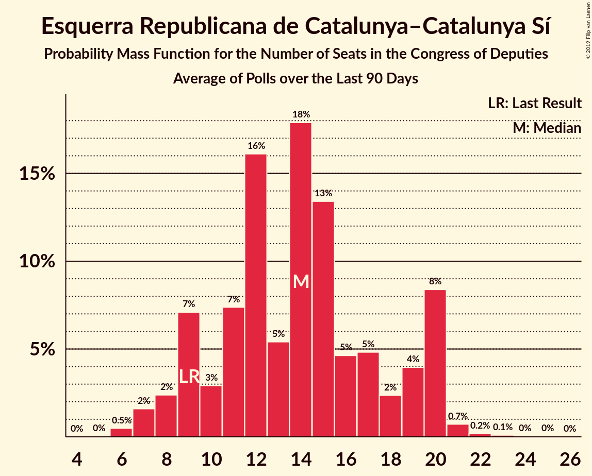

# Esquerra Republicana de Catalunya–Catalunya Sí

<a href="#voting-intentions">Voting Intentions</a> | <a href="#seats">Seats</a>

## Voting Intentions

Last result: **2.7%** (General Election of 26 June 2016)

### Confidence Intervals

| Period     | Polling firm/Commissioner(s) | Median | 80% Confidence Interval | 90% Confidence Interval | 95% Confidence Interval | 99% Confidence Interval |
|:----------:|:----------------:|:-----------:|:-----------------------:|:-----------------------:|:-----------------------:|:-----------------------:|
| N/A | [Poll Average](average.html) | 3.3% | 2.6–4.6% | 2.4–4.9% | 2.2–5.1% | 1.9–5.4% |
| [22 February–17 March 2019](2019-03-17-electoPanel.html) | electoPanel   electomania.es | 3.2% | 2.9–3.5% | 2.9–3.6% | 2.8–3.6% | 2.7–3.8% |
| [11–15 March 2019](2019-03-15-NCReport.html) | NC Report   La Razón | 2.8% | 2.2–3.6% | 2.1–3.8% | 1.9–4.0% | 1.7–4.4% |
| [4–13 March 2019](2019-03-13-SimpleLógica.html) | Simple Lógica | 0.0% | N/A | N/A | N/A | N/A |
| [8–11 March 2019](2019-03-11-Celeste-Tel.html) | Celeste-Tel   eldiario.es | 0.0% | N/A | N/A | N/A | N/A |
| [22 February–10 March 2019](2019-03-10-electoPanel.html) | electoPanel   electomania.es | 3.3% | 3.0–3.6% | 3.0–3.7% | 2.9–3.7% | 2.8–3.9% |
| [5–8 March 2019](2019-03-08-SocioMétrica.html) | SocioMétrica   El Español | 3.1% | 2.6–3.8% | 2.5–3.9% | 2.4–4.1% | 2.2–4.4% |
| [4–8 March 2019](2019-03-08-Invymark.html) | Invymark   laSexta | 0.0% | N/A | N/A | N/A | N/A |
| [4–8 March 2019](2019-03-08-GAD3.html) | GAD3   ABC | 2.8% | 2.2–3.6% | 2.1–3.8% | 1.9–4.0% | 1.7–4.4% |
| [22 February–3 March 2019](2019-03-03-electoPanel.html) | electoPanel   electomania.es | 3.3% | 3.0–3.7% | 2.9–3.7% | 2.9–3.8% | 2.7–4.0% |
| [19–22 February 2019](2019-02-22-SigmaDos.html) | Sigma Dos   El Mundo | 3.2% | 2.6–3.9% | 2.4–4.1% | 2.3–4.3% | 2.1–4.7% |
| [18–22 February 2019](2019-02-22-GAD3.html) | GAD3   ABC | 3.0% | 2.3–3.9% | 2.2–4.2% | 2.0–4.4% | 1.8–4.9% |
| [13–21 February 2019](2019-02-21-Sondaxe.html) | Sondaxe   La Voz de Galicia | 3.8% | 3.2–4.5% | 3.1–4.7% | 2.9–4.9% | 2.7–5.3% |
| [18–21 February 2019](2019-02-21-Invymark.html) | Invymark   laSexta | 0.0% | N/A | N/A | N/A | N/A |
| [13–15 February 2019](2019-02-15-SocioMétrica.html) | SocioMétrica   El Español | 3.3% | 2.7–4.1% | 2.5–4.4% | 2.4–4.6% | 2.1–5.0% |
| [11–15 February 2019](2019-02-15-NCReport.html) | NC Report   La Razón | 2.8% | 2.2–3.6% | 2.1–3.8% | 1.9–4.0% | 1.7–4.4% |
| [13–15 February 2019](2019-02-15-GESOP.html) | GESOP   El Periódico | 0.0% | N/A | N/A | N/A | N/A |
| [12–15 February 2019](2019-02-15-GAD3.html) | GAD3   La Vanguardia | 2.8% | 2.3–3.6% | 2.1–3.8% | 2.0–3.9% | 1.8–4.3% |
| [11–13 February 2019](2019-02-13-Metroscopia.html) | Metroscopia   Henneo | 0.0% | N/A | N/A | N/A | N/A |
| [1–8 February 2019](2019-02-08-SimpleLógica.html) | Simple Lógica | 0.0% | N/A | N/A | N/A | N/A |
| [4–8 February 2019](2019-02-08-Celeste-Tel.html) | Celeste-Tel   eldiario.es | 2.8% | 2.3–3.6% | 2.1–3.8% | 2.0–4.0% | 1.8–4.4% |
| [28 January–1 February 2019](2019-02-01-Invymark.html) | Invymark   laSexta | 0.0% | N/A | N/A | N/A | N/A |
| [26–30 January 2019](2019-01-30-electoPanel.html) | electoPanel   electomania.es | 0.0% | N/A | N/A | N/A | N/A |
| [21–25 January 2019](2019-01-25-NCReport.html) | NC Report   La Razón | 2.8% | 2.2–3.6% | 2.1–3.8% | 1.9–4.0% | 1.7–4.4% |
| [14–24 January 2019](2019-01-24-GAD3.html) | GAD3   ABC | 2.8% | 2.3–3.4% | 2.2–3.5% | 2.1–3.7% | 1.9–3.9% |
| [14–18 January 2019](2019-01-18-Invymark.html) | Invymark   laSexta | 0.0% | N/A | N/A | N/A | N/A |
| [9–15 January 2019](2019-01-15-Metroscopia.html) | Metroscopia   Henneo | 0.0% | N/A | N/A | N/A | N/A |
| [6–13 January 2019](2019-01-13-electoPanel.html) | electoPanel   electomania.es | 0.0% | N/A | N/A | N/A | N/A |
| [1–13 January 2019](2019-01-13-CIS.html) | CIS | 4.7% | 4.2–5.2% | 4.1–5.4% | 4.0–5.5% | 3.8–5.8% |
| [3–9 January 2019](2019-01-09-SimpleLógica.html) | Simple Lógica | 0.0% | N/A | N/A | N/A | N/A |
| [2–8 January 2019](2019-01-08-Celeste-Tel.html) | Celeste-Tel   eldiario.es | 2.8% | 2.3–3.6% | 2.1–3.8% | 2.0–4.0% | 1.8–4.4% |
| [22 December 2018–5 January 2019](2019-01-05-SocioMétrica.html) | SocioMétrica   El Español | 3.2% | 2.7–3.7% | 2.6–3.9% | 2.5–4.0% | 2.3–4.3% |
| [21–27 December 2018](2018-12-27-SigmaDos.html) | Sigma Dos   El Mundo | 3.6% | 2.9–4.5% | 2.8–4.7% | 2.6–5.0% | 2.3–5.4% |
| [17–21 December 2018](2018-12-21-Invymark.html) | Invymark   laSexta | 0.0% | N/A | N/A | N/A | N/A |
| [16 December 2018](2018-12-16-SigmaDos.html) | Sigma Dos   Antena 3 | 0.0% | N/A | N/A | N/A | N/A |
| [10–14 December 2018](2018-12-14-SocioMétrica.html) | SocioMétrica   El Español | 3.1% | 2.5–4.0% | 2.3–4.2% | 2.2–4.5% | 1.9–4.9% |
| [3–14 December 2018](2018-12-14-SimpleLógica.html) | Simple Lógica | 0.0% | N/A | N/A | N/A | N/A |
| [5–14 December 2018](2018-12-14-NCReport.html) | NC Report   La Razón | 2.8% | 2.2–3.6% | 2.1–3.8% | 1.9–4.0% | 1.7–4.4% |
| [10–14 December 2018](2018-12-14-GAD3.html) | GAD3   ABC | 2.8% | 2.2–3.6% | 2.1–3.8% | 1.9–4.0% | 1.7–4.4% |
| [10–13 December 2018](2018-12-13-IMOP.html) | IMOP   El Confidencial | 3.0% | 2.4–3.8% | 2.2–4.0% | 2.1–4.2% | 1.9–4.6% |
| [10–12 December 2018](2018-12-12-Metroscopia.html) | Metroscopia   Henneo | 0.0% | N/A | N/A | N/A | N/A |
| [3–11 December 2018](2018-12-11-Celeste-Tel.html) | Celeste-Tel   eldiario.es | 2.9% | 2.3–3.7% | 2.2–3.9% | 2.1–4.1% | 1.8–4.5% |
| [3–7 December 2018](2018-12-07-Invymark.html) | Invymark   laSexta | 0.0% | N/A | N/A | N/A | N/A |
| [5 December 2018](2018-12-05-SocioMétrica.html) | SocioMétrica   El Español | 3.1% | 2.5–4.0% | 2.3–4.2% | 2.2–4.5% | 1.9–4.9% |
| [3–4 December 2018](2018-12-04-electoPanel.html) | electoPanel   electomania.es | 3.1% | 2.6–3.7% | 2.4–3.9% | 2.3–4.1% | 2.1–4.4% |
| [2–14 November 2018](2018-11-14-SimpleLógica.html) | Simple Lógica | 0.0% | N/A | N/A | N/A | N/A |
| [5–9 November 2018](2018-11-09-NCReport.html) | NC Report   La Razón | 2.9% | 2.3–3.7% | 2.2–3.9% | 2.0–4.1% | 1.8–4.6% |
| [5–9 November 2018](2018-11-09-Invymark.html) | Invymark   laSexta | 0.0% | N/A | N/A | N/A | N/A |
| [5–9 November 2018](2018-11-09-Celeste-Tel.html) | Celeste-Tel   eldiario.es | 2.8% | 2.3–3.6% | 2.1–3.8% | 2.0–4.0% | 1.8–4.4% |
| [2–7 November 2018](2018-11-07-GAD3.html) | GAD3   La Vanguardia | 2.9% | 2.2–3.8% | 2.1–4.1% | 1.9–4.3% | 1.7–4.8% |
| [22–30 October 2018](2018-10-30-GESOP.html) | GESOP   El Periódico | 3.3% | 2.7–4.2% | 2.5–4.5% | 2.3–4.7% | 2.0–5.1% |
| [20–26 October 2018](2018-10-26-electoPanel.html) | electoPanel   electomania.es | 3.1% | 2.5–3.9% | 2.3–4.1% | 2.2–4.3% | 1.9–4.8% |
| [22–26 October 2018](2018-10-26-Invymark.html) | Invymark   laSexta | 0.0% | N/A | N/A | N/A | N/A |
| [16–18 October 2018](2018-10-18-Metroscopia.html) | Metroscopia   Henneo | 0.0% | N/A | N/A | N/A | N/A |
| [1–11 October 2018](2018-10-11-NCReport.html) | NC Report   La Razón | 3.0% | 2.4–3.8% | 2.2–4.1% | 2.1–4.3% | 1.9–4.7% |
| [1–9 October 2018](2018-10-09-CIS.html) | CIS | 4.3% | 3.9–4.8% | 3.7–5.0% | 3.6–5.1% | 3.4–5.4% |
| [30 September–5 October 2018](2018-10-05-electoPanel.html) | electoPanel   electomania.es | 3.1% | 2.5–3.9% | 2.3–4.1% | 2.2–4.3% | 1.9–4.8% |
| [1–5 October 2018](2018-10-05-SimpleLógica.html) | Simple Lógica | 0.0% | N/A | N/A | N/A | N/A |
| [1–5 October 2018](2018-10-05-Celeste-Tel.html) | Celeste-Tel   eldiario.es | 3.0% | 2.4–3.8% | 2.3–4.0% | 2.1–4.2% | 1.9–4.6% |
| [2 October 2018](2018-10-02-SimpleLógica.html) | Simple Lógica   eldebate.es | 0.0% | N/A | N/A | N/A | N/A |
| [24–28 September 2018](2018-09-28-Invymark.html) | Invymark   laSexta | 0.0% | N/A | N/A | N/A | N/A |
| [17–19 September 2018](2018-09-19-Metroscopia.html) | Metroscopia   Henneo | 0.0% | N/A | N/A | N/A | N/A |
| [17–19 September 2018](2018-09-19-InstitutoDYM.html) | Instituto DYM   El Independiente | 0.0% | N/A | N/A | N/A | N/A |
| [10–14 September 2018](2018-09-14-Invymark.html) | Invymark   laSexta | 0.0% | N/A | N/A | N/A | N/A |
| [6–11 September 2018](2018-09-11-IMOP.html) | IMOP   El Confidencial | 2.8% | 2.2–3.6% | 2.0–3.8% | 1.9–4.0% | 1.7–4.4% |
| [1–11 September 2018](2018-09-11-CIS.html) | CIS | 4.1% | 3.7–4.6% | 3.6–4.8% | 3.4–4.9% | 3.2–5.1% |
| [7–9 September 2018](2018-09-09-electoPanel.html) | electoPanel   electomania.es | 3.0% | 2.5–3.9% | 2.3–4.1% | 2.2–4.3% | 1.9–4.7% |
| [3–7 September 2018](2018-09-07-SimpleLógica.html) | Simple Lógica | 0.0% | N/A | N/A | N/A | N/A |
| [3–7 September 2018](2018-09-07-GAD3.html) | GAD3   ABC | 2.8% | 2.2–3.6% | 2.1–3.8% | 1.9–4.0% | 1.7–4.4% |
| [3–7 September 2018](2018-09-07-Celeste-Tel.html) | Celeste-Tel   eldiario.es | 3.0% | 2.4–3.8% | 2.3–4.0% | 2.1–4.2% | 1.9–4.6% |
| [27–31 August 2018](2018-08-31-NCReport.html) | NC Report   La Razón | 3.0% | 2.4–3.8% | 2.2–4.1% | 2.1–4.3% | 1.9–4.7% |
| [22–30 August 2018](2018-08-30-SocioMétrica.html) | SocioMétrica   El Español | 3.0% | 2.5–3.7% | 2.3–3.9% | 2.2–4.1% | 1.9–4.5% |
| [1–7 August 2018](2018-08-07-Celeste-Tel.html) | Celeste-Tel   eldiario.es | 3.0% | 2.4–3.8% | 2.3–4.0% | 2.1–4.2% | 1.9–4.6% |
| [27 July–3 August 2018](2018-08-03-electoPanel.html) | electoPanel   electomania.es | 3.3% | 2.7–4.1% | 2.5–4.3% | 2.4–4.5% | 2.1–4.9% |
| [1–3 August 2018](2018-08-03-SimpleLógica.html) | Simple Lógica | 0.0% | N/A | N/A | N/A | N/A |
| [23–27 July 2018](2018-07-27-NCReport.html) | NC Report   La Razón | 3.1% | 2.5–3.9% | 2.3–4.2% | 2.2–4.4% | 1.9–4.8% |
| [23–27 July 2018](2018-07-27-Invymark.html) | Invymark   laSexta | 0.0% | N/A | N/A | N/A | N/A |
| [24–26 July 2018](2018-07-26-GAD3.html) | GAD3   ABC | 3.0% | 2.3–3.9% | 2.2–4.2% | 2.0–4.4% | 1.7–4.9% |
| [16–25 July 2018](2018-07-25-Metroscopia.html) | Metroscopia   Henneo | 0.0% | N/A | N/A | N/A | N/A |
| [22–25 July 2018](2018-07-25-DemoscopiayServicios.html) | Demoscopia y Servicios   OKDIARIO | 2.5% | 2.0–3.2% | 1.8–3.4% | 1.7–3.6% | 1.5–4.0% |
| [17–22 July 2018](2018-07-22-electoPanel.html) | electoPanel   electomania.es | 3.1% | 2.7–3.6% | 2.6–3.7% | 2.5–3.8% | 2.3–4.0% |
| [9–13 July 2018](2018-07-13-Invymark.html) | Invymark   laSexta | 0.0% | N/A | N/A | N/A | N/A |
| [9–12 July 2018](2018-07-12-SigmaDos.html) | Sigma Dos   El Mundo | 3.2% | 2.6–4.0% | 2.4–4.3% | 2.3–4.5% | 2.0–4.9% |
| [1–10 July 2018](2018-07-10-CIS.html) | CIS | 3.9% | 3.4–4.5% | 3.3–4.6% | 3.2–4.7% | 3.0–5.0% |
| [2–6 July 2018](2018-07-06-SimpleLógica.html) | Simple Lógica | 0.0% | N/A | N/A | N/A | N/A |
| [2–6 July 2018](2018-07-06-Celeste-Tel.html) | Celeste-Tel   eldiario.es | 3.1% | 2.5–3.9% | 2.3–4.1% | 2.2–4.3% | 2.0–4.7% |
| [25–30 June 2018](2018-06-30-NCReport.html) | NC Report   La Razón | 3.1% | 2.5–3.9% | 2.3–4.2% | 2.2–4.4% | 1.9–4.8% |
| [19–22 June 2018](2018-06-22-SocioMétrica.html) | SocioMétrica   El Español | 2.9% | 2.3–3.7% | 2.2–3.9% | 2.0–4.1% | 1.8–4.6% |
| [18–22 June 2018](2018-06-22-Invymark.html) | Invymark   laSexta | 0.0% | N/A | N/A | N/A | N/A |
| [11–13 June 2018](2018-06-13-GESOP.html) | GESOP   El Periódico | 2.6% | 2.0–3.5% | 1.9–3.8% | 1.7–4.0% | 1.5–4.5% |
| [11–12 June 2018](2018-06-12-InstitutoDYM.html) | Instituto DYM   El Independiente | 0.0% | N/A | N/A | N/A | N/A |
| [1–9 June 2018](2018-06-09-NCReport.html) | NC Report   La Razón | 3.1% | 2.5–3.8% | 2.4–4.0% | 2.2–4.2% | 2.0–4.6% |
| [4–8 June 2018](2018-06-08-SimpleLógica.html) | Simple Lógica | 0.0% | N/A | N/A | N/A | N/A |
| [4–8 June 2018](2018-06-08-Invymark.html) | Invymark   laSexta | 0.0% | N/A | N/A | N/A | N/A |
| [7–8 June 2018](2018-06-08-GAD3.html) | GAD3   ABC | 3.2% | 2.6–4.2% | 2.4–4.5% | 2.2–4.7% | 1.9–5.2% |
| [4–8 June 2018](2018-06-08-Celeste-Tel.html) | Celeste-Tel   eldiario.es | 3.0% | 2.4–3.8% | 2.3–4.0% | 2.1–4.2% | 1.9–4.6% |
| [26 May–2 June 2018](2018-06-02-electoPanel.html) | electoPanel   electomania.es | 3.3% | 2.8–3.9% | 2.7–4.0% | 2.6–4.1% | 2.4–4.4% |
| [28–29 May 2018](2018-05-29-Invymark.html) | Invymark   laSexta | 0.0% | N/A | N/A | N/A | N/A |
| [26–28 May 2018](2018-05-28-electoPanel.html) | electoPanel   electomania.es | 3.0% | 2.5–3.7% | 2.4–3.9% | 2.2–4.1% | 2.0–4.4% |
| [23–28 May 2018](2018-05-28-IMOP.html) | IMOP   El Confidencial | 2.4% | 1.9–3.1% | 1.7–3.3% | 1.6–3.5% | 1.4–3.9% |
| [17–26 May 2018](2018-05-26-SocioMétrica.html) | SocioMétrica   El Español | 3.3% | 2.8–3.9% | 2.7–4.1% | 2.5–4.3% | 2.3–4.6% |
| [16–25 May 2018](2018-05-25-NCReport.html) | NC Report   La Razón | 2.9% | 2.3–3.7% | 2.2–3.9% | 2.0–4.1% | 1.8–4.6% |
| [3–10 May 2018](2018-05-10-SimpleLógica.html) | Simple Lógica | 0.0% | N/A | N/A | N/A | N/A |
| [7–9 May 2018](2018-05-09-Metroscopia.html) | Metroscopia   El País | 0.0% | N/A | N/A | N/A | N/A |
| [26–30 April 2018](2018-04-30-Celeste-Tel.html) | Celeste-Tel   PSOE | 3.6% | 2.9–4.5% | 2.8–4.7% | 2.6–5.0% | 2.3–5.4% |
| [12–18 April 2018](2018-04-18-GESOP.html) | GESOP   El Periódico | 3.0% | 2.4–3.8% | 2.2–4.1% | 2.1–4.3% | 1.9–4.7% |
| [9–13 April 2018](2018-04-13-NCReport.html) | NC Report   La Razón | 2.9% | 2.3–3.7% | 2.2–3.9% | 2.0–4.1% | 1.8–4.6% |
| [9–13 April 2018](2018-04-13-Invymark.html) | Invymark   laSexta | 0.0% | N/A | N/A | N/A | N/A |
| [1–10 April 2018](2018-04-10-CIS.html) | CIS | 3.0% | 2.6–3.5% | 2.5–3.6% | 2.4–3.8% | 2.2–4.0% |
| [2–9 April 2018](2018-04-09-SimpleLógica.html) | Simple Lógica | 0.0% | N/A | N/A | N/A | N/A |
| [2–6 April 2018](2018-04-06-Celeste-Tel.html) | Celeste-Tel   eldiario.es | 2.9% | 2.3–3.7% | 2.2–3.9% | 2.1–4.1% | 1.8–4.5% |
| [4–5 April 2018](2018-04-05-Metroscopia.html) | Metroscopia   El País | 0.0% | N/A | N/A | N/A | N/A |
| [19–29 March 2018](2018-03-29-SocioMétrica.html) | SocioMétrica   El Español | 4.0% | 3.3–4.9% | 3.1–5.2% | 2.9–5.4% | 2.7–5.9% |
| [23–27 March 2018](2018-03-27-SigmaDos.html) | Sigma Dos   El Mundo | 3.3% | 2.7–4.1% | 2.5–4.4% | 2.4–4.6% | 2.1–5.0% |
| [13–16 March 2018](2018-03-16-MyWord.html) | MyWord   Cadena SER | 0.0% | N/A | N/A | N/A | N/A |
| [12–16 March 2018](2018-03-16-Invymark.html) | Invymark   laSexta | 2.4% | 1.9–3.1% | 1.8–3.3% | 1.7–3.5% | 1.5–3.8% |
| [12–14 March 2018](2018-03-14-GAD3.html) | GAD3   La Vanguardia | 2.9% | 2.3–3.7% | 2.1–3.9% | 2.0–4.1% | 1.8–4.5% |
| [1–7 March 2018](2018-03-07-SimpleLógica.html) | Simple Lógica | 0.0% | N/A | N/A | N/A | N/A |
| [1–7 March 2018](2018-03-07-Celeste-Tel.html) | Celeste-Tel   eldiario.es | 2.6% | 2.1–3.4% | 2.0–3.6% | 1.8–3.8% | 1.6–4.1% |
| [2–5 March 2018](2018-03-05-Metroscopia.html) | Metroscopia   El País | 0.0% | N/A | N/A | N/A | N/A |
| [26 February–2 March 2018](2018-03-02-NCReport.html) | NC Report   La Razón | 2.8% | 2.2–3.6% | 2.1–3.8% | 1.9–4.0% | 1.7–4.4% |
| [26 February–2 March 2018](2018-03-02-Invymark.html) | Invymark   laSexta | 0.0% | N/A | N/A | N/A | N/A |
| [22–27 February 2018](2018-02-27-IMOP.html) | IMOP   El Confidencial | 3.0% | 2.5–3.7% | 2.3–3.9% | 2.2–4.0% | 2.0–4.4% |
| [12–16 February 2018](2018-02-16-Invymark.html) | Invymark   laSexta | 0.0% | N/A | N/A | N/A | N/A |
| [7–14 February 2018](2018-02-14-MyWord.html) | MyWord   Cadena SER | 0.0% | N/A | N/A | N/A | N/A |
| [5–9 February 2018](2018-02-09-Celeste-Tel.html) | Celeste-Tel   eldiario.es | 2.7% | 2.2–3.5% | 2.0–3.7% | 1.9–3.9% | 1.7–4.3% |
| [5–8 February 2018](2018-02-08-Metroscopia.html) | Metroscopia   El País | 0.0% | N/A | N/A | N/A | N/A |
| [1–7 February 2018](2018-02-07-SimpleLógica.html) | Simple Lógica | 0.0% | N/A | N/A | N/A | N/A |
| [31 January–7 February 2018](2018-02-07-GAD3.html) | GAD3   ABC | 2.9% | 2.3–3.7% | 2.1–3.9% | 2.0–4.1% | 1.8–4.6% |

### Probability Mass Function

The following table shows the probability mass function per percentage block of voting intentions for the [poll average](average.html) for Esquerra Republicana de Catalunya–Catalunya Sí.

| Voting Intentions | Probability | Accumulated | Special Marks |
|:-----------------:|:-----------:|:-----------:|:-------------:|
| 0.5–1.5% | 0% | 100% |  |
| 1.5–2.5% | 10% | 100% |  |
| 2.5–3.5% | 55% | 90% | Last Result, Median |
| 3.5–4.5% | 24% | 35% |  |
| 4.5–5.5% | 10% | 11% |  |
| 5.5–6.5% | 0.3% | 0.3% |  |
| 6.5–7.5% | 0% | 0% |  |

## Seats

Last result: **9** seats (General Election of 26 June 2016)

### Confidence Intervals

| Period     | Polling firm/Commissioner(s) | Median | 80% Confidence Interval | 90% Confidence Interval | 95% Confidence Interval | 99% Confidence Interval |
|:----------:|:----------------:|:------:|:-----------------------:|:-----------------------:|:-----------------------:|:-----------------------:|
| N/A | [Poll Average](average.html) | 14 | 11–20 | 10–20 | 9–20 | 8–21 |
| [22 February–17 March 2019](2019-03-17-electoPanel.html) | electoPanel   electomania.es | 15 | 14–15 | 14–15 | 14–15 | 14–16 |
| [11–15 March 2019](2019-03-15-NCReport.html) | NC Report   La Razón | 12 | 9–15 | 9–15 | 8–16 | 7–18 |
| [4–13 March 2019](2019-03-13-SimpleLógica.html) | Simple Lógica |  |  |  |  |  |
| [8–11 March 2019](2019-03-11-Celeste-Tel.html) | Celeste-Tel   eldiario.es |  |  |  |  |  |
| [22 February–10 March 2019](2019-03-10-electoPanel.html) | electoPanel   electomania.es | 15 | 14–15 | 14–15 | 14–16 | 14–18 |
| [5–8 March 2019](2019-03-08-SocioMétrica.html) | SocioMétrica   El Español | 14 | 12–16 | 11–16 | 9–17 | 9–17 |
| [4–8 March 2019](2019-03-08-Invymark.html) | Invymark   laSexta |  |  |  |  |  |
| [4–8 March 2019](2019-03-08-GAD3.html) | GAD3   ABC | 14 | 10–15 | 9–16 | 9–17 | 7–19 |
| [22 February–3 March 2019](2019-03-03-electoPanel.html) | electoPanel   electomania.es | 15 | 14–16 | 14–17 | 14–17 | 13–18 |
| [19–22 February 2019](2019-02-22-SigmaDos.html) | Sigma Dos   El Mundo | 14 | 12–16 | 11–18 | 11–18 | 9–20 |
| [18–22 February 2019](2019-02-22-GAD3.html) | GAD3   ABC | 13 | 9–16 | 9–17 | 9–19 | 7–20 |
| [13–21 February 2019](2019-02-21-Sondaxe.html) | Sondaxe   La Voz de Galicia | 15 | 14–18 | 13–18 | 13–19 | 12–21 |
| [18–21 February 2019](2019-02-21-Invymark.html) | Invymark   laSexta |  |  |  |  |  |
| [13–15 February 2019](2019-02-15-SocioMétrica.html) | SocioMétrica   El Español | 14 | 12–17 | 11–18 | 10–19 | 8–20 |
| [11–15 February 2019](2019-02-15-NCReport.html) | NC Report   La Razón | 13 | 9–15 | 8–15 | 7–16 | 7–17 |
| [13–15 February 2019](2019-02-15-GESOP.html) | GESOP   El Periódico |  |  |  |  |  |
| [12–15 February 2019](2019-02-15-GAD3.html) | GAD3   La Vanguardia | 12 | 9–15 | 9–15 | 9–16 | 7–18 |
| [11–13 February 2019](2019-02-13-Metroscopia.html) | Metroscopia   Henneo |  |  |  |  |  |
| [1–8 February 2019](2019-02-08-SimpleLógica.html) | Simple Lógica |  |  |  |  |  |
| [4–8 February 2019](2019-02-08-Celeste-Tel.html) | Celeste-Tel   eldiario.es | 13 | 9–13 | 9–14 | 7–15 | 7–17 |
| [28 January–1 February 2019](2019-02-01-Invymark.html) | Invymark   laSexta |  |  |  |  |  |
| [26–30 January 2019](2019-01-30-electoPanel.html) | electoPanel   electomania.es |  |  |  |  |  |
| [21–25 January 2019](2019-01-25-NCReport.html) | NC Report   La Razón | 12 | 9–14 | 9–15 | 8–15 | 7–18 |
| [14–24 January 2019](2019-01-24-GAD3.html) | GAD3   ABC | 11 | 10–15 | 9–15 | 9–15 | 9–16 |
| [14–18 January 2019](2019-01-18-Invymark.html) | Invymark   laSexta |  |  |  |  |  |
| [9–15 January 2019](2019-01-15-Metroscopia.html) | Metroscopia   Henneo |  |  |  |  |  |
| [6–13 January 2019](2019-01-13-electoPanel.html) | electoPanel   electomania.es |  |  |  |  |  |
| [1–13 January 2019](2019-01-13-CIS.html) | CIS | 20 | 18–20 | 16–21 | 16–21 | 15–21 |
| [3–9 January 2019](2019-01-09-SimpleLógica.html) | Simple Lógica |  |  |  |  |  |
| [2–8 January 2019](2019-01-08-Celeste-Tel.html) | Celeste-Tel   eldiario.es | 15 | 11–15 | 9–15 | 7–15 | 7–16 |
| [22 December 2018–5 January 2019](2019-01-05-SocioMétrica.html) | SocioMétrica   El Español | 13 | 12–16 | 11–18 | 11–18 | 9–18 |
| [21–27 December 2018](2018-12-27-SigmaDos.html) | Sigma Dos   El Mundo | 15 | 13–19 | 12–20 | 12–20 | 10–22 |
| [17–21 December 2018](2018-12-21-Invymark.html) | Invymark   laSexta |  |  |  |  |  |
| [16 December 2018](2018-12-16-SigmaDos.html) | Sigma Dos   Antena 3 |  |  |  |  |  |
| [10–14 December 2018](2018-12-14-SocioMétrica.html) | SocioMétrica   El Español | 14 | 11–15 | 9–16 | 9–19 | 7–19 |
| [3–14 December 2018](2018-12-14-SimpleLógica.html) | Simple Lógica |  |  |  |  |  |
| [5–14 December 2018](2018-12-14-NCReport.html) | NC Report   La Razón | 12 | 9–14 | 9–15 | 9–15 | 7–17 |
| [10–14 December 2018](2018-12-14-GAD3.html) | GAD3   ABC | 12 | 9–13 | 9–14 | 9–16 | 7–18 |
| [10–13 December 2018](2018-12-13-IMOP.html) | IMOP   El Confidencial | 12 | 10–15 | 9–15 | 9–16 | 7–18 |
| [10–12 December 2018](2018-12-12-Metroscopia.html) | Metroscopia   Henneo |  |  |  |  |  |
| [3–11 December 2018](2018-12-11-Celeste-Tel.html) | Celeste-Tel   eldiario.es | 10 | 9–13 | 9–13 | 9–15 | 8–15 |
| [3–7 December 2018](2018-12-07-Invymark.html) | Invymark   laSexta |  |  |  |  |  |
| [5 December 2018](2018-12-05-SocioMétrica.html) | SocioMétrica   El Español | 12 | 12–15 | 10–16 | 9–17 | 8–18 |
| [3–4 December 2018](2018-12-04-electoPanel.html) | electoPanel   electomania.es | 13 | 10–14 | 10–15 | 10–16 | 9–17 |
| [2–14 November 2018](2018-11-14-SimpleLógica.html) | Simple Lógica |  |  |  |  |  |
| [5–9 November 2018](2018-11-09-NCReport.html) | NC Report   La Razón | 10 | 9–13 | 8–14 | 8–15 | 7–17 |
| [5–9 November 2018](2018-11-09-Invymark.html) | Invymark   laSexta |  |  |  |  |  |
| [5–9 November 2018](2018-11-09-Celeste-Tel.html) | Celeste-Tel   eldiario.es | 13 | 9–14 | 7–14 | 7–14 | 7–15 |
| [2–7 November 2018](2018-11-07-GAD3.html) | GAD3   La Vanguardia | 13 | 9–13 | 9–15 | 8–16 | 6–16 |
| [22–30 October 2018](2018-10-30-GESOP.html) | GESOP   El Periódico | 13 | 11–16 | 9–17 | 9–18 | 7–19 |
| [20–26 October 2018](2018-10-26-electoPanel.html) | electoPanel   electomania.es | 11 | 11–13 | 11–13 | 11–15 | 11–15 |
| [22–26 October 2018](2018-10-26-Invymark.html) | Invymark   laSexta |  |  |  |  |  |
| [16–18 October 2018](2018-10-18-Metroscopia.html) | Metroscopia   Henneo |  |  |  |  |  |
| [1–11 October 2018](2018-10-11-NCReport.html) | NC Report   La Razón | 9 | 9–15 | 9–15 | 9–15 | 8–17 |
| [1–9 October 2018](2018-10-09-CIS.html) | CIS | 17 | 15–17 | 15–18 | 15–18 | 14–19 |
| [30 September–5 October 2018](2018-10-05-electoPanel.html) | electoPanel   electomania.es | 12 | 9–13 | 9–14 | 9–14 | 7–17 |
| [1–5 October 2018](2018-10-05-SimpleLógica.html) | Simple Lógica |  |  |  |  |  |
| [1–5 October 2018](2018-10-05-Celeste-Tel.html) | Celeste-Tel   eldiario.es | 9 | 9–14 | 8–14 | 8–15 | 7–15 |
| [2 October 2018](2018-10-02-SimpleLógica.html) | Simple Lógica   eldebate.es |  |  |  |  |  |
| [24–28 September 2018](2018-09-28-Invymark.html) | Invymark   laSexta |  |  |  |  |  |
| [17–19 September 2018](2018-09-19-Metroscopia.html) | Metroscopia   Henneo |  |  |  |  |  |
| [17–19 September 2018](2018-09-19-InstitutoDYM.html) | Instituto DYM   El Independiente |  |  |  |  |  |
| [10–14 September 2018](2018-09-14-Invymark.html) | Invymark   laSexta |  |  |  |  |  |
| [6–11 September 2018](2018-09-11-IMOP.html) | IMOP   El Confidencial | 12 | 9–12 | 9–14 | 8–14 | 7–17 |
| [1–11 September 2018](2018-09-11-CIS.html) | CIS | 15 | 14–16 | 13–16 | 13–16 | 12–18 |
| [7–9 September 2018](2018-09-09-electoPanel.html) | electoPanel   electomania.es | 12 | 11–15 | 9–15 | 9–16 | 8–18 |
| [3–7 September 2018](2018-09-07-SimpleLógica.html) | Simple Lógica |  |  |  |  |  |
| [3–7 September 2018](2018-09-07-GAD3.html) | GAD3   ABC | 10 | 7–14 | 7–14 | 7–15 | 7–15 |
| [3–7 September 2018](2018-09-07-Celeste-Tel.html) | Celeste-Tel   eldiario.es | 12 | 11–14 | 9–14 | 9–14 | 7–17 |
| [27–31 August 2018](2018-08-31-NCReport.html) | NC Report   La Razón | 12 | 9–14 | 9–14 | 9–15 | 6–17 |
| [22–30 August 2018](2018-08-30-SocioMétrica.html) | SocioMétrica   El Español | 13 | 7–13 | 7–14 | 7–16 | 7–18 |
| [1–7 August 2018](2018-08-07-Celeste-Tel.html) | Celeste-Tel   eldiario.es | 11 | 8–15 | 8–15 | 8–15 | 6–16 |
| [27 July–3 August 2018](2018-08-03-electoPanel.html) | electoPanel   electomania.es | 14 | 11–14 | 9–15 | 9–17 | 8–18 |
| [1–3 August 2018](2018-08-03-SimpleLógica.html) | Simple Lógica |  |  |  |  |  |
| [23–27 July 2018](2018-07-27-NCReport.html) | NC Report   La Razón | 13 | 11–15 | 9–15 | 9–17 | 7–18 |
| [23–27 July 2018](2018-07-27-Invymark.html) | Invymark   laSexta |  |  |  |  |  |
| [24–26 July 2018](2018-07-26-GAD3.html) | GAD3   ABC | 13 | 9–15 | 9–15 | 8–15 | 7–17 |
| [16–25 July 2018](2018-07-25-Metroscopia.html) | Metroscopia   Henneo |  |  |  |  |  |
| [22–25 July 2018](2018-07-25-DemoscopiayServicios.html) | Demoscopia y Servicios   OKDIARIO | 9 | 9–12 | 8–13 | 7–14 | 6–15 |
| [17–22 July 2018](2018-07-22-electoPanel.html) | electoPanel   electomania.es | 12 | 12–13 | 11–13 | 9–16 | 9–16 |
| [9–13 July 2018](2018-07-13-Invymark.html) | Invymark   laSexta |  |  |  |  |  |
| [9–12 July 2018](2018-07-12-SigmaDos.html) | Sigma Dos   El Mundo | 13 | 9–15 | 9–15 | 9–17 | 8–18 |
| [1–10 July 2018](2018-07-10-CIS.html) | CIS | 15 | 13–17 | 13–17 | 13–18 | 12–19 |
| [2–6 July 2018](2018-07-06-SimpleLógica.html) | Simple Lógica |  |  |  |  |  |
| [2–6 July 2018](2018-07-06-Celeste-Tel.html) | Celeste-Tel   eldiario.es | 9 | 8–14 | 8–15 | 8–18 | 7–19 |
| [25–30 June 2018](2018-06-30-NCReport.html) | NC Report   La Razón | 12 | 10–14 | 9–15 | 9–16 | 7–18 |
| [19–22 June 2018](2018-06-22-SocioMétrica.html) | SocioMétrica   El Español | 11 | 8–14 | 8–15 | 8–15 | 7–16 |
| [18–22 June 2018](2018-06-22-Invymark.html) | Invymark   laSexta |  |  |  |  |  |
| [11–13 June 2018](2018-06-13-GESOP.html) | GESOP   El Periódico | 10 | 7–13 | 7–14 | 6–15 | 6–16 |
| [11–12 June 2018](2018-06-12-InstitutoDYM.html) | Instituto DYM   El Independiente |  |  |  |  |  |
| [1–9 June 2018](2018-06-09-NCReport.html) | NC Report   La Razón | 13 | 11–15 | 10–17 | 9–17 | 8–18 |
| [4–8 June 2018](2018-06-08-SimpleLógica.html) | Simple Lógica |  |  |  |  |  |
| [4–8 June 2018](2018-06-08-Invymark.html) | Invymark   laSexta |  |  |  |  |  |
| [7–8 June 2018](2018-06-08-GAD3.html) | GAD3   ABC | 14 | 9–16 | 9–17 | 8–17 | 7–19 |
| [4–8 June 2018](2018-06-08-Celeste-Tel.html) | Celeste-Tel   eldiario.es | 12 | 11–14 | 9–16 | 9–18 | 8–18 |
| [26 May–2 June 2018](2018-06-02-electoPanel.html) | electoPanel   electomania.es | 9 | 9–12 | 8–14 | 7–14 | 7–15 |
| [28–29 May 2018](2018-05-29-Invymark.html) | Invymark   laSexta |  |  |  |  |  |
| [26–28 May 2018](2018-05-28-electoPanel.html) | electoPanel   electomania.es | 12 | 11–15 | 9–15 | 9–17 | 7–17 |
| [23–28 May 2018](2018-05-28-IMOP.html) | IMOP   El Confidencial | 9 | 7–12 | 6–12 | 6–13 | 5–14 |
| [17–26 May 2018](2018-05-26-SocioMétrica.html) | SocioMétrica   El Español | 14 | 10–15 | 9–15 | 9–15 | 9–15 |
| [16–25 May 2018](2018-05-25-NCReport.html) | NC Report   La Razón | 11 | 9–15 | 9–16 | 8–16 | 6–17 |
| [3–10 May 2018](2018-05-10-SimpleLógica.html) | Simple Lógica |  |  |  |  |  |
| [7–9 May 2018](2018-05-09-Metroscopia.html) | Metroscopia   El País |  |  |  |  |  |
| [26–30 April 2018](2018-04-30-Celeste-Tel.html) | Celeste-Tel   PSOE | 15 | 11–18 | 10–18 | 10–18 | 9–20 |
| [12–18 April 2018](2018-04-18-GESOP.html) | GESOP   El Periódico | 11 | 9–14 | 8–14 | 7–15 | 7–16 |
| [9–13 April 2018](2018-04-13-NCReport.html) | NC Report   La Razón | 12 | 8–14 | 8–15 | 8–16 | 7–17 |
| [9–13 April 2018](2018-04-13-Invymark.html) | Invymark   laSexta |  |  |  |  |  |
| [1–10 April 2018](2018-04-10-CIS.html) | CIS | 12 | 10–13 | 9–13 | 9–14 | 9–14 |
| [2–9 April 2018](2018-04-09-SimpleLógica.html) | Simple Lógica |  |  |  |  |  |
| [2–6 April 2018](2018-04-06-Celeste-Tel.html) | Celeste-Tel   eldiario.es | 9 | 9–11 | 9–13 | 8–13 | 8–16 |
| [4–5 April 2018](2018-04-05-Metroscopia.html) | Metroscopia   El País |  |  |  |  |  |
| [19–29 March 2018](2018-03-29-SocioMétrica.html) | SocioMétrica   El Español | 15 | 13–19 | 13–19 | 12–20 | 11–20 |
| [23–27 March 2018](2018-03-27-SigmaDos.html) | Sigma Dos   El Mundo | 13 | 10–15 | 9–16 | 9–17 | 8–18 |
| [13–16 March 2018](2018-03-16-MyWord.html) | MyWord   Cadena SER |  |  |  |  |  |
| [12–16 March 2018](2018-03-16-Invymark.html) | Invymark   laSexta | 8 | 7–12 | 7–12 | 6–13 | 6–13 |
| [12–14 March 2018](2018-03-14-GAD3.html) | GAD3   La Vanguardia | 12 | 9–13 | 9–14 | 8–14 | 6–16 |
| [1–7 March 2018](2018-03-07-SimpleLógica.html) | Simple Lógica |  |  |  |  |  |
| [1–7 March 2018](2018-03-07-Celeste-Tel.html) | Celeste-Tel   eldiario.es | 9 | 8–12 | 7–13 | 7–14 | 6–17 |
| [2–5 March 2018](2018-03-05-Metroscopia.html) | Metroscopia   El País |  |  |  |  |  |
| [26 February–2 March 2018](2018-03-02-NCReport.html) | NC Report   La Razón | 11 | 8–14 | 7–14 | 7–14 | 7–15 |
| [26 February–2 March 2018](2018-03-02-Invymark.html) | Invymark   laSexta |  |  |  |  |  |
| [22–27 February 2018](2018-02-27-IMOP.html) | IMOP   El Confidencial | 11 | 9–14 | 9–14 | 9–14 | 7–15 |
| [12–16 February 2018](2018-02-16-Invymark.html) | Invymark   laSexta |  |  |  |  |  |
| [7–14 February 2018](2018-02-14-MyWord.html) | MyWord   Cadena SER |  |  |  |  |  |
| [5–9 February 2018](2018-02-09-Celeste-Tel.html) | Celeste-Tel   eldiario.es | 11 | 8–15 | 7–15 | 7–15 | 7–15 |
| [5–8 February 2018](2018-02-08-Metroscopia.html) | Metroscopia   El País |  |  |  |  |  |
| [1–7 February 2018](2018-02-07-SimpleLógica.html) | Simple Lógica |  |  |  |  |  |
| [31 January–7 February 2018](2018-02-07-GAD3.html) | GAD3   ABC | 11 | 9–14 | 8–15 | 8–15 | 7–17 |

### Probability Mass Function

The following table shows the probability mass function per seat for the [poll average](average.html) for Esquerra Republicana de Catalunya–Catalunya Sí.

| Number of Seats | Probability | Accumulated | Special Marks |
|:---------------:|:-----------:|:-----------:|:-------------:|
| 7 | 0.2% | 100% |  |
| 8 | 0.5% | 99.8% |  |
| 9 | 3% | 99.3% | Last Result |
| 10 | 2% | 96% |  |
| 11 | 5% | 94% |  |
| 12 | 8% | 90% |  |
| 13 | 7% | 81% |  |
| 14 | 26% | 74% | Median |
| 15 | 23% | 48% |  |
| 16 | 6% | 25% |  |
| 17 | 3% | 19% |  |
| 18 | 3% | 16% |  |
| 19 | 0.9% | 13% |  |
| 20 | 11% | 12% |  |
| 21 | 0.9% | 1.0% |  |
| 22 | 0% | 0% |  |

