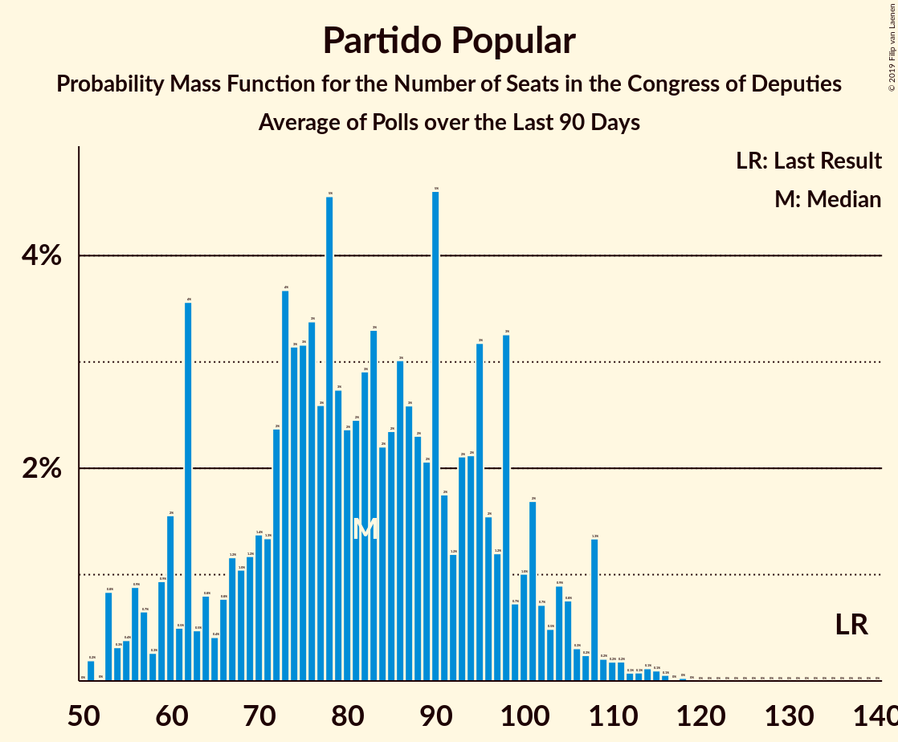

# Partido Popular

<a href="#voting-intentions">Voting Intentions</a> | <a href="#seats">Seats</a>

## Voting Intentions

Last result: **33.0%** (General Election of 26 June 2016)

### Confidence Intervals

| Period     | Polling firm/Commissioner(s) | Median | 80% Confidence Interval | 90% Confidence Interval | 95% Confidence Interval | 99% Confidence Interval |
|:----------:|:----------------:|:-----------:|:-----------------------:|:-----------------------:|:-----------------------:|:-----------------------:|
| N/A | [Poll Average](average.html) | 19.9% | 16.4–24.0% | 15.0–24.7% | 14.5–25.3% | 13.9–26.4% |
| [1–8 February 2019](2019-02-08-SimpleLógica.html) | Simple Lógica | 17.9% | 16.4–19.5% | 16.0–20.0% | 15.7–20.4% | 15.0–21.2% |
| [4–8 February 2019](2019-02-08-Celeste-Tel.html) | Celeste-Tel   eldiario.es | 23.1% | 21.5–24.8% | 21.1–25.3% | 20.7–25.7% | 20.0–26.5% |
| [26–30 January 2019](2019-01-30-electoPanel.html) | electoPanel   electomania.es | 20.1% | 19.2–21.1% | 18.9–21.4% | 18.7–21.6% | 18.2–22.1% |
| [21–25 January 2019](2019-01-25-NCReport.html) | NC Report   La Razón | 24.0% | 22.3–25.8% | 21.9–26.3% | 21.4–26.7% | 20.7–27.6% |
| [14–24 January 2019](2019-01-24-GAD3.html) | GAD3   ABC | 23.0% | 21.8–24.3% | 21.4–24.7% | 21.1–25.0% | 20.5–25.7% |
| [9–15 January 2019](2019-01-15-Metroscopia.html) | Metroscopia   Henneo | 19.1% | 18.1–20.2% | 17.7–20.5% | 17.5–20.8% | 17.1–21.3% |
| [6–13 January 2019](2019-01-13-electoPanel.html) | electoPanel   electomania.es | 19.1% | 17.8–20.5% | 17.4–20.9% | 17.1–21.2% | 16.5–21.9% |
| [1–13 January 2019](2019-01-13-CIS.html) | CIS | 14.9% | 14.1–15.8% | 13.8–16.0% | 13.7–16.2% | 13.3–16.6% |
| [3–9 January 2019](2019-01-09-SimpleLógica.html) | Simple Lógica | 18.2% | 16.8–19.8% | 16.4–20.3% | 16.0–20.7% | 15.3–21.5% |
| [2–8 January 2019](2019-01-08-Celeste-Tel.html) | Celeste-Tel   eldiario.es | 23.8% | 22.2–25.5% | 21.8–26.0% | 21.4–26.4% | 20.6–27.3% |
| [22 December 2018–5 January 2019](2019-01-05-SocioMétrica.html) | SocioMétrica   El Español | 18.3% | 17.3–19.4% | 17.0–19.7% | 16.8–20.0% | 16.3–20.5% |
| [21–27 December 2018](2018-12-27-SigmaDos.html) | Sigma Dos   El Mundo | 19.2% | 17.7–20.9% | 17.2–21.4% | 16.9–21.8% | 16.2–22.6% |
| [16 December 2018](2018-12-16-SigmaDos.html) | Sigma Dos   Antena 3 | 21.2% | 19.6–22.9% | 19.2–23.4% | 18.8–23.9% | 18.0–24.7% |
| [10–14 December 2018](2018-12-14-SocioMétrica.html) | SocioMétrica   El Español | 21.6% | 19.9–23.4% | 19.4–23.9% | 19.0–24.4% | 18.2–25.3% |
| [3–14 December 2018](2018-12-14-SimpleLógica.html) | Simple Lógica | 18.8% | 17.4–20.3% | 17.0–20.7% | 16.7–21.1% | 16.0–21.8% |
| [5–14 December 2018](2018-12-14-NCReport.html) | NC Report   La Razón | 24.4% | 22.7–26.2% | 22.2–26.7% | 21.8–27.2% | 21.0–28.0% |
| [10–14 December 2018](2018-12-14-GAD3.html) | GAD3   ABC | 20.5% | 18.9–22.2% | 18.5–22.7% | 18.1–23.1% | 17.4–23.9% |
| [10–13 December 2018](2018-12-13-IMOP.html) | IMOP   El Confidencial | 19.6% | 18.1–21.2% | 17.6–21.7% | 17.3–22.1% | 16.6–22.9% |
| [10–12 December 2018](2018-12-12-Metroscopia.html) | Metroscopia   Henneo | 18.0% | 16.9–19.2% | 16.6–19.5% | 16.3–19.8% | 15.8–20.4% |
| [3–11 December 2018](2018-12-11-Celeste-Tel.html) | Celeste-Tel   eldiario.es | 24.7% | 23.1–26.5% | 22.6–26.9% | 22.3–27.4% | 21.5–28.2% |
| [3–7 December 2018](2018-12-07-Invymark.html) | Invymark   laSexta | 22.9% | 21.4–24.5% | 21.0–25.0% | 20.6–25.4% | 19.9–26.2% |
| [3–4 December 2018](2018-12-04-electoPanel.html) | electoPanel   electomania.es | 19.1% | 17.8–20.4% | 17.5–20.8% | 17.2–21.1% | 16.6–21.8% |
| [2–14 November 2018](2018-11-14-SimpleLógica.html) | Simple Lógica | 19.6% | 18.1–21.3% | 17.7–21.8% | 17.3–22.2% | 16.6–23.0% |
| [5–9 November 2018](2018-11-09-NCReport.html) | NC Report   La Razón | 26.3% | 24.6–28.2% | 24.1–28.7% | 23.7–29.1% | 22.8–30.0% |
| [5–9 November 2018](2018-11-09-Celeste-Tel.html) | Celeste-Tel   eldiario.es | 25.8% | 24.2–27.6% | 23.7–28.1% | 23.3–28.5% | 22.5–29.3% |
| [22–30 October 2018](2018-10-30-GESOP.html) | GESOP   El Periódico | 21.3% | 19.6–23.1% | 19.2–23.6% | 18.7–24.1% | 18.0–25.0% |
| [20–26 October 2018](2018-10-26-electoPanel.html) | electoPanel   electomania.es | 23.1% | 21.5–24.9% | 21.1–25.4% | 20.7–25.8% | 19.9–26.7% |
| [16–18 October 2018](2018-10-18-Metroscopia.html) | Metroscopia   Henneo | 22.6% | 21.3–24.0% | 20.9–24.4% | 20.6–24.7% | 20.0–25.4% |
| [1–11 October 2018](2018-10-11-NCReport.html) | NC Report   La Razón | 26.7% | 25.0–28.6% | 24.5–29.1% | 24.1–29.5% | 23.2–30.4% |
| [1–9 October 2018](2018-10-09-CIS.html) | CIS | 18.2% | 17.3–19.1% | 17.1–19.4% | 16.8–19.6% | 16.4–20.1% |
| [1–5 October 2018](2018-10-05-SimpleLógica.html) | Simple Lógica | 23.8% | 22.2–25.5% | 21.7–26.0% | 21.3–26.5% | 20.6–27.3% |
| [1–5 October 2018](2018-10-05-Celeste-Tel.html) | Celeste-Tel   eldiario.es | 26.3% | 24.6–28.0% | 24.2–28.5% | 23.7–29.0% | 23.0–29.8% |
| [2 October 2018](2018-10-02-SimpleLógica.html) | Simple Lógica   eldebate.es | 21.2% | 19.6–22.9% | 19.2–23.4% | 18.8–23.9% | 18.0–24.7% |
| [17–19 September 2018](2018-09-19-Metroscopia.html) | Metroscopia   Henneo | 22.8% | 21.3–24.5% | 20.8–25.0% | 20.4–25.4% | 19.7–26.2% |
| [17–19 September 2018](2018-09-19-InstitutoDYM.html) | Instituto DYM   El Independiente | 23.4% | 21.8–25.2% | 21.3–25.7% | 20.9–26.1% | 20.1–27.0% |
| [6–11 September 2018](2018-09-11-IMOP.html) | IMOP   El Confidencial | 20.3% | 18.7–21.9% | 18.3–22.4% | 17.9–22.8% | 17.2–23.7% |
| [1–11 September 2018](2018-09-11-CIS.html) | CIS | 20.8% | 19.9–21.8% | 19.6–22.1% | 19.4–22.3% | 18.9–22.8% |
| [7–9 September 2018](2018-09-09-electoPanel.html) | electoPanel   electomania.es | 24.6% | 22.9–26.3% | 22.5–26.8% | 22.1–27.3% | 21.3–28.1% |
| [3–7 September 2018](2018-09-07-SimpleLógica.html) | Simple Lógica | 21.1% | 19.5–22.8% | 19.1–23.3% | 18.7–23.7% | 17.9–24.6% |
| [3–7 September 2018](2018-09-07-GAD3.html) | GAD3   ABC | 25.9% | 24.2–27.7% | 23.7–28.2% | 23.2–28.7% | 22.5–29.6% |
| [3–7 September 2018](2018-09-07-Celeste-Tel.html) | Celeste-Tel   eldiario.es | 26.4% | 24.7–28.1% | 24.2–28.6% | 23.8–29.1% | 23.1–29.9% |
| [27–31 August 2018](2018-08-31-NCReport.html) | NC Report   La Razón | 27.5% | 25.7–29.4% | 25.2–29.9% | 24.8–30.4% | 24.0–31.3% |
| [22–30 August 2018](2018-08-30-SocioMétrica.html) | SocioMétrica   El Español | 22.6% | 21.1–24.2% | 20.7–24.6% | 20.3–25.0% | 19.6–25.8% |
| [1–7 August 2018](2018-08-07-Celeste-Tel.html) | Celeste-Tel   eldiario.es | 25.5% | 23.9–27.3% | 23.4–27.8% | 23.0–28.2% | 22.3–29.1% |
| [27 July–3 August 2018](2018-08-03-electoPanel.html) | electoPanel   electomania.es | 22.9% | 21.3–24.6% | 20.9–25.1% | 20.5–25.5% | 19.8–26.3% |
| [1–3 August 2018](2018-08-03-SimpleLógica.html) | Simple Lógica | 24.4% | 22.7–26.2% | 22.3–26.7% | 21.9–27.1% | 21.1–28.0% |
| [23–27 July 2018](2018-07-27-NCReport.html) | NC Report   La Razón | 26.7% | 25.0–28.6% | 24.5–29.1% | 24.1–29.5% | 23.2–30.4% |
| [24–26 July 2018](2018-07-26-GAD3.html) | GAD3   ABC | 26.2% | 24.3–28.3% | 23.8–28.9% | 23.3–29.4% | 22.4–30.4% |
| [16–25 July 2018](2018-07-25-Metroscopia.html) | Metroscopia   Henneo | 24.4% | 23.2–25.6% | 22.9–25.9% | 22.6–26.2% | 22.1–26.8% |
| [22–25 July 2018](2018-07-25-DemoscopiayServicios.html) | Demoscopia y Servicios   OKDIARIO | 27.1% | 25.4–28.9% | 25.0–29.4% | 24.6–29.9% | 23.8–30.7% |
| [17–22 July 2018](2018-07-22-electoPanel.html) | electoPanel   electomania.es | 21.0% | 20.0–22.0% | 19.8–22.3% | 19.5–22.5% | 19.1–23.0% |
| [9–12 July 2018](2018-07-12-SigmaDos.html) | Sigma Dos   El Mundo | 22.3% | 20.7–24.1% | 20.2–24.6% | 19.8–25.0% | 19.1–25.8% |
| [1–10 July 2018](2018-07-10-CIS.html) | CIS | 20.4% | 19.4–21.5% | 19.1–21.8% | 18.9–22.0% | 18.4–22.6% |
| [2–6 July 2018](2018-07-06-SimpleLógica.html) | Simple Lógica | 18.7% | 17.2–20.3% | 16.8–20.8% | 16.4–21.2% | 15.8–22.0% |
| [2–6 July 2018](2018-07-06-Celeste-Tel.html) | Celeste-Tel   eldiario.es | 24.2% | 22.6–25.9% | 22.1–26.4% | 21.7–26.8% | 21.0–27.6% |
| [25–30 June 2018](2018-06-30-NCReport.html) | NC Report   La Razón | 25.2% | 23.5–27.0% | 23.0–27.5% | 22.6–28.0% | 21.8–28.9% |
| [19–22 June 2018](2018-06-22-SocioMétrica.html) | SocioMétrica   El Español | 19.5% | 18.0–21.2% | 17.5–21.7% | 17.2–22.1% | 16.4–22.9% |
| [11–13 June 2018](2018-06-13-GESOP.html) | GESOP   El Periódico | 21.0% | 19.2–22.9% | 18.7–23.5% | 18.3–24.0% | 17.5–24.9% |
| [11–12 June 2018](2018-06-12-InstitutoDYM.html) | Instituto DYM   El Independiente | 24.9% | 23.2–26.7% | 22.8–27.2% | 22.4–27.7% | 21.6–28.6% |
| [1–9 June 2018](2018-06-09-NCReport.html) | NC Report   La Razón | 25.5% | 23.9–27.2% | 23.5–27.6% | 23.1–28.0% | 22.4–28.9% |
| [4–8 June 2018](2018-06-08-SimpleLógica.html) | Simple Lógica | 20.6% | 19.0–22.3% | 18.6–22.8% | 18.2–23.2% | 17.5–24.0% |
| [7–8 June 2018](2018-06-08-GAD3.html) | GAD3   ABC | 25.6% | 23.7–27.7% | 23.2–28.3% | 22.7–28.8% | 21.8–29.8% |
| [4–8 June 2018](2018-06-08-Celeste-Tel.html) | Celeste-Tel   eldiario.es | 24.3% | 22.7–26.0% | 22.2–26.5% | 21.8–26.9% | 21.1–27.7% |
| [26 May–2 June 2018](2018-06-02-electoPanel.html) | electoPanel   electomania.es | 17.2% | 16.1–18.3% | 15.9–18.6% | 15.6–18.9% | 15.1–19.4% |
| [26–28 May 2018](2018-05-28-electoPanel.html) | electoPanel   electomania.es | 17.9% | 16.6–19.3% | 16.3–19.6% | 16.0–20.0% | 15.4–20.7% |
| [23–28 May 2018](2018-05-28-IMOP.html) | IMOP   El Confidencial | 19.6% | 18.1–21.3% | 17.6–21.7% | 17.3–22.2% | 16.6–23.0% |
| [17–26 May 2018](2018-05-26-SocioMétrica.html) | SocioMétrica   El Español | 16.8% | 15.7–18.0% | 15.4–18.4% | 15.1–18.7% | 14.6–19.3% |
| [16–25 May 2018](2018-05-25-NCReport.html) | NC Report   La Razón | 25.6% | 23.9–27.4% | 23.4–28.0% | 23.0–28.4% | 22.2–29.3% |
| [3–10 May 2018](2018-05-10-SimpleLógica.html) | Simple Lógica | 20.9% | 19.4–22.6% | 18.9–23.0% | 18.6–23.5% | 17.8–24.3% |
| [7–9 May 2018](2018-05-09-Metroscopia.html) | Metroscopia   El País | 19.5% | 18.3–20.8% | 18.0–21.2% | 17.7–21.5% | 17.2–22.1% |
| [26–30 April 2018](2018-04-30-Celeste-Tel.html) | Celeste-Tel   PSOE | 26.0% | 24.3–27.8% | 23.8–28.4% | 23.4–28.8% | 22.6–29.7% |
| [12–18 April 2018](2018-04-18-GESOP.html) | GESOP   El Periódico | 21.0% | 19.4–22.7% | 19.0–23.2% | 18.6–23.6% | 17.8–24.5% |
| [9–13 April 2018](2018-04-13-NCReport.html) | NC Report   La Razón | 26.3% | 24.6–28.2% | 24.1–28.7% | 23.7–29.1% | 22.8–30.0% |
| [1–10 April 2018](2018-04-10-CIS.html) | CIS | 24.0% | 22.9–25.1% | 22.6–25.5% | 22.4–25.7% | 21.8–26.3% |
| [2–9 April 2018](2018-04-09-SimpleLógica.html) | Simple Lógica | 19.0% | N/A | N/A | N/A | N/A |
| [2–6 April 2018](2018-04-06-Celeste-Tel.html) | Celeste-Tel   eldiario.es | 24.9% | N/A | N/A | N/A | N/A |
| [4–5 April 2018](2018-04-05-Metroscopia.html) | Metroscopia   El País | 20.4% | N/A | N/A | N/A | N/A |
| [19–29 March 2018](2018-03-29-SocioMétrica.html) | SocioMétrica   El Español | 21.9% | N/A | N/A | N/A | N/A |
| [23–27 March 2018](2018-03-27-SigmaDos.html) | Sigma Dos   El Mundo | 23.3% | N/A | N/A | N/A | N/A |
| [13–16 March 2018](2018-03-16-MyWord.html) | MyWord   Cadena SER | 24.7% | N/A | N/A | N/A | N/A |
| [12–14 March 2018](2018-03-14-GAD3.html) | GAD3   La Vanguardia | 23.8% | N/A | N/A | N/A | N/A |
| [1–7 March 2018](2018-03-07-SimpleLógica.html) | Simple Lógica | 20.0% | N/A | N/A | N/A | N/A |
| [1–7 March 2018](2018-03-07-Celeste-Tel.html) | Celeste-Tel   eldiario.es | 26.6% | N/A | N/A | N/A | N/A |
| [2–5 March 2018](2018-03-05-Metroscopia.html) | Metroscopia   El País | 21.5% | N/A | N/A | N/A | N/A |
| [26 February–2 March 2018](2018-03-02-NCReport.html) | NC Report   La Razón | 27.9% | N/A | N/A | N/A | N/A |
| [22–27 February 2018](2018-02-27-IMOP.html) | IMOP   El Confidencial | 21.4% | N/A | N/A | N/A | N/A |
| [7–14 February 2018](2018-02-14-MyWord.html) | MyWord   Cadena SER | 24.5% | N/A | N/A | N/A | N/A |
| [5–9 February 2018](2018-02-09-Celeste-Tel.html) | Celeste-Tel   eldiario.es | 28.9% | N/A | N/A | N/A | N/A |
| [5–8 February 2018](2018-02-08-Metroscopia.html) | Metroscopia   El País | 21.9% | N/A | N/A | N/A | N/A |
| [1–7 February 2018](2018-02-07-SimpleLógica.html) | Simple Lógica | 22.2% | N/A | N/A | N/A | N/A |
| [31 January–7 February 2018](2018-02-07-GAD3.html) | GAD3   ABC | 25.8% | N/A | N/A | N/A | N/A |

### Probability Mass Function

The following table shows the probability mass function per percentage block of voting intentions for the [poll average](average.html) for Partido Popular.

| Voting Intentions | Probability | Accumulated | Special Marks |
|:-----------------:|:-----------:|:-----------:|:-------------:|
| 11.5–12.5% | 0% | 100% |  |
| 12.5–13.5% | 0.1% | 100% |  |
| 13.5–14.5% | 3% | 99.9% |  |
| 14.5–15.5% | 5% | 97% |  |
| 15.5–16.5% | 3% | 92% |  |
| 16.5–17.5% | 5% | 90% |  |
| 17.5–18.5% | 12% | 85% |  |
| 18.5–19.5% | 16% | 72% |  |
| 19.5–20.5% | 13% | 56% | Median |
| 20.5–21.5% | 8% | 43% |  |
| 21.5–22.5% | 9% | 35% |  |
| 22.5–23.5% | 11% | 26% |  |
| 23.5–24.5% | 9% | 15% |  |
| 24.5–25.5% | 4% | 6% |  |
| 25.5–26.5% | 1.4% | 2% |  |
| 26.5–27.5% | 0.3% | 0.4% |  |
| 27.5–28.5% | 0.1% | 0.1% |  |
| 28.5–29.5% | 0% | 0% |  |
| 29.5–30.5% | 0% | 0% |  |
| 30.5–31.5% | 0% | 0% |  |
| 31.5–32.5% | 0% | 0% |  |
| 32.5–33.5% | 0% | 0% | Last Result |

## Seats

Last result: **137** seats (General Election of 26 June 2016)

### Confidence Intervals

| Period     | Polling firm/Commissioner(s) | Median | 80% Confidence Interval | 90% Confidence Interval | 95% Confidence Interval | 99% Confidence Interval |
|:----------:|:----------------:|:------:|:-----------------------:|:-----------------------:|:-----------------------:|:-----------------------:|
| N/A | [Poll Average](average.html) | 67 | 46–96 | 41–100 | 41–100 | 41–100 |
| [1–8 February 2019](2019-02-08-SimpleLógica.html) | Simple Lógica | 67 | 66–69 | 65–72 | 65–74 | 62–91 |
| [4–8 February 2019](2019-02-08-Celeste-Tel.html) | Celeste-Tel   eldiario.es | 92 | 92–96 | 85–96 | 85–96 | 85–96 |
| [26–30 January 2019](2019-01-30-electoPanel.html) | electoPanel   electomania.es | 79 | 76–89 | 76–90 | 76–90 | 75–90 |
| [21–25 January 2019](2019-01-25-NCReport.html) | NC Report   La Razón | 100 | 100 | 100 | 100 | 86–105 |
| [14–24 January 2019](2019-01-24-GAD3.html) | GAD3   ABC | 80 | 80–94 | 80–98 | 80–98 | 80–98 |
| [9–15 January 2019](2019-01-15-Metroscopia.html) | Metroscopia   Henneo | 54 | 47–55 | 47–58 | 47–58 | 47–59 |
| [6–13 January 2019](2019-01-13-electoPanel.html) | electoPanel   electomania.es | 54 | 54 | 54 | 52–57 | 52–62 |
| [1–13 January 2019](2019-01-13-CIS.html) | CIS | 41 | 41 | 41 | 41 | 41 |
| [3–9 January 2019](2019-01-09-SimpleLógica.html) | Simple Lógica | 59 | 43–61 | 43–61 | 42–63 | 42–63 |
| [2–8 January 2019](2019-01-08-Celeste-Tel.html) | Celeste-Tel   eldiario.es | 83 | 63–83 | 63–83 | 59–83 | 59–83 |
| [22 December 2018–5 January 2019](2019-01-05-SocioMétrica.html) | SocioMétrica   El Español | 49 | 47–51 | 47–51 | 47–56 | 47–58 |
| [21–27 December 2018](2018-12-27-SigmaDos.html) | Sigma Dos   El Mundo | 56 | 46–62 | 46–66 | 46–66 | 46–70 |
| [16 December 2018](2018-12-16-SigmaDos.html) | Sigma Dos   Antena 3 | 61 | 49–61 | 49–65 | 49–65 | 49–73 |
| [10–14 December 2018](2018-12-14-SocioMétrica.html) | SocioMétrica   El Español | 64 | 64 | 64 | 62–64 | 62–64 |
| [3–14 December 2018](2018-12-14-SimpleLógica.html) | Simple Lógica | 54 | 53–64 | 52–64 | 48–64 | 43–64 |
| [5–14 December 2018](2018-12-14-NCReport.html) | NC Report   La Razón | 65 | 65 | 65 | 65 | 65–67 |
| [10–14 December 2018](2018-12-14-GAD3.html) | GAD3   ABC | 54 | 54 | 54 | 54 | 54–58 |
| [10–13 December 2018](2018-12-13-IMOP.html) | IMOP   El Confidencial | 50 | 50 | 50 | 50–53 | 50–71 |
| [10–12 December 2018](2018-12-12-Metroscopia.html) | Metroscopia   Henneo | 53 | 51–54 | 50–54 | 50–54 | 42–58 |
| [3–11 December 2018](2018-12-11-Celeste-Tel.html) | Celeste-Tel   eldiario.es | 82 | 82 | 82 | 82 | 82 |
| [3–7 December 2018](2018-12-07-Invymark.html) | Invymark   laSexta | 69 | 68–69 | 62–78 | 58–79 | 58–81 |
| [3–4 December 2018](2018-12-04-electoPanel.html) | electoPanel   electomania.es | 51 | 51 | 51 | 49–55 | 45–64 |
| [2–14 November 2018](2018-11-14-SimpleLógica.html) | Simple Lógica | 60 | 58–61 | 58–66 | 57–69 | 48–70 |
| [5–9 November 2018](2018-11-09-NCReport.html) | NC Report   La Razón | 75 | 74–75 | 74–75 | 68–76 | 57–91 |
| [5–9 November 2018](2018-11-09-Celeste-Tel.html) | Celeste-Tel   eldiario.es | 68 | 68 | 66–68 | 65–68 | 65–87 |
| [22–30 October 2018](2018-10-30-GESOP.html) | GESOP   El Periódico | 62 | 54–62 | 54–62 | 54–62 | 53–69 |
| [20–26 October 2018](2018-10-26-electoPanel.html) | electoPanel   electomania.es | 57 | 57–73 | 57–73 | 56–73 | 51–90 |
| [16–18 October 2018](2018-10-18-Metroscopia.html) | Metroscopia   Henneo | 63 | 63 | 62–63 | 59–71 | 59–74 |
| [1–11 October 2018](2018-10-11-NCReport.html) | NC Report   La Razón | 63 | 63–72 | 63–86 | 63–86 | 63–86 |
| [1–9 October 2018](2018-10-09-CIS.html) | CIS | 53 | 51–53 | 51–57 | 50–57 | 50–57 |
| [1–5 October 2018](2018-10-05-SimpleLógica.html) | Simple Lógica | 68 | 63–80 | 63–85 | 62–85 | 62–85 |
| [1–5 October 2018](2018-10-05-Celeste-Tel.html) | Celeste-Tel   eldiario.es | 84 | 78–84 | 66–84 | 66–84 | 60–84 |
| [2 October 2018](2018-10-02-SimpleLógica.html) | Simple Lógica   eldebate.es | 68 | 58–76 | 58–76 | 58–77 | 47–77 |
| [17–19 September 2018](2018-09-19-Metroscopia.html) | Metroscopia   Henneo | 69 | 62–69 | 62–71 | 56–71 | 54–71 |
| [17–19 September 2018](2018-09-19-InstitutoDYM.html) | Instituto DYM   El Independiente | 69 | 60–76 | 59–76 | 59–76 | 59–84 |
| [6–11 September 2018](2018-09-11-IMOP.html) | IMOP   El Confidencial | 57 | 52–61 | 52–66 | 52–67 | 48–74 |
| [1–11 September 2018](2018-09-11-CIS.html) | CIS | 60 | 57–61 | 55–61 | 55–61 | 55–61 |
| [7–9 September 2018](2018-09-09-electoPanel.html) | electoPanel   electomania.es | 69 | 69 | 69 | 69 | 69–84 |
| [3–7 September 2018](2018-09-07-SimpleLógica.html) | Simple Lógica | 66 | 62–66 | 57–66 | 56–66 | 56–68 |
| [3–7 September 2018](2018-09-07-GAD3.html) | GAD3   ABC | 76 | 76–79 | 76–79 | 76–82 | 70–88 |
| [3–7 September 2018](2018-09-07-Celeste-Tel.html) | Celeste-Tel   eldiario.es | 70 | 63–70 | 63–72 | 63–72 | 63–78 |
| [27–31 August 2018](2018-08-31-NCReport.html) | NC Report   La Razón | 77 | 77–88 | 77–88 | 64–88 | 64–88 |
| [22–30 August 2018](2018-08-30-SocioMétrica.html) | SocioMétrica   El Español | 60 | 60–69 | 60–69 | 60–69 | 60–76 |
| [1–7 August 2018](2018-08-07-Celeste-Tel.html) | Celeste-Tel   eldiario.es | 68 | 68 | 68 | 68 | 61–68 |
| [27 July–3 August 2018](2018-08-03-electoPanel.html) | electoPanel   electomania.es | 69 | 69 | 69 | 54–69 | 54–70 |
| [1–3 August 2018](2018-08-03-SimpleLógica.html) | Simple Lógica | 71 | 69–82 | 69–82 | 68–82 | 59–82 |
| [23–27 July 2018](2018-07-27-NCReport.html) | NC Report   La Razón | 81 | 81 | 81–82 | 81–83 | 78–85 |
| [24–26 July 2018](2018-07-26-GAD3.html) | GAD3   ABC | 79 | 69–88 | 69–89 | 69–89 | 68–90 |
| [16–25 July 2018](2018-07-25-Metroscopia.html) | Metroscopia   Henneo | 77 | 65–85 | 62–85 | 62–86 | 62–86 |
| [22–25 July 2018](2018-07-25-DemoscopiayServicios.html) | Demoscopia y Servicios   OKDIARIO | 82 | 82 | 82–87 | 82–87 | 79–87 |
| [17–22 July 2018](2018-07-22-electoPanel.html) | electoPanel   electomania.es | 64 | 64 | 64 | 64 | 60–64 |
| [9–12 July 2018](2018-07-12-SigmaDos.html) | Sigma Dos   El Mundo | 72 | 60–72 | 60–72 | 59–72 | 57–72 |
| [1–10 July 2018](2018-07-10-CIS.html) | CIS | 56 | 56–58 | 56–58 | 56–58 | 56–62 |
| [2–6 July 2018](2018-07-06-SimpleLógica.html) | Simple Lógica | 50 | 49–60 | 49–60 | 44–60 | 41–60 |
| [2–6 July 2018](2018-07-06-Celeste-Tel.html) | Celeste-Tel   eldiario.es | 75 | 67–75 | 67–75 | 67–75 | 64–86 |
| [25–30 June 2018](2018-06-30-NCReport.html) | NC Report   La Razón | 71 | 71–86 | 71–86 | 63–89 | 61–89 |
| [19–22 June 2018](2018-06-22-SocioMétrica.html) | SocioMétrica   El Español | 72 | 52–72 | 52–72 | 52–72 | 40–72 |
| [11–13 June 2018](2018-06-13-GESOP.html) | GESOP   El Periódico | 65 | 59–65 | 54–66 | 53–73 | 46–76 |
| [11–12 June 2018](2018-06-12-InstitutoDYM.html) | Instituto DYM   El Independiente | 70 | 69–76 | 69–76 | 69–76 | 61–87 |
| [1–9 June 2018](2018-06-09-NCReport.html) | NC Report   La Razón | 83 | 72–83 | 72–83 | 72–83 | 72–83 |
| [4–8 June 2018](2018-06-08-SimpleLógica.html) | Simple Lógica | 62 | 55–65 | 54–65 | 51–67 | 48–67 |
| [7–8 June 2018](2018-06-08-GAD3.html) | GAD3   ABC | 72 | 63–92 | 63–92 | 63–92 | 63–92 |
| [4–8 June 2018](2018-06-08-Celeste-Tel.html) | Celeste-Tel   eldiario.es | 60 | 60–78 | 60–78 | 60–78 | 60–78 |
| [26 May–2 June 2018](2018-06-02-electoPanel.html) | electoPanel   electomania.es | 49 | 49 | 49–53 | 49–53 | 41–55 |
| [26–28 May 2018](2018-05-28-electoPanel.html) | electoPanel   electomania.es | 50 | 50 | 50 | 50 | 44–54 |
| [23–28 May 2018](2018-05-28-IMOP.html) | IMOP   El Confidencial | 54 | 54–59 | 52–59 | 52–59 | 52–59 |
| [17–26 May 2018](2018-05-26-SocioMétrica.html) | SocioMétrica   El Español | 47 | 47 | 44–55 | 39–55 | 34–55 |
| [16–25 May 2018](2018-05-25-NCReport.html) | NC Report   La Razón | 80 | 60–88 | 58–88 | 58–88 | 55–92 |
| [3–10 May 2018](2018-05-10-SimpleLógica.html) | Simple Lógica | 52 | 51–52 | 51–52 | 51–63 | 49–66 |
| [7–9 May 2018](2018-05-09-Metroscopia.html) | Metroscopia   El País | 54 | 50–58 | 50–58 | 49–62 | 46–65 |
| [26–30 April 2018](2018-04-30-Celeste-Tel.html) | Celeste-Tel   PSOE | 72 | 72 | 72 | 68–81 | 65–81 |
| [12–18 April 2018](2018-04-18-GESOP.html) | GESOP   El Periódico | 61 | 52–61 | 51–67 | 51–67 | 51–67 |
| [9–13 April 2018](2018-04-13-NCReport.html) | NC Report   La Razón | 76 | 76 | 76 | 65–76 | 65–88 |
| [1–10 April 2018](2018-04-10-CIS.html) | CIS |  |  |  |  |  |
| [2–9 April 2018](2018-04-09-SimpleLógica.html) | Simple Lógica |  |  |  |  |  |
| [2–6 April 2018](2018-04-06-Celeste-Tel.html) | Celeste-Tel   eldiario.es |  |  |  |  |  |
| [4–5 April 2018](2018-04-05-Metroscopia.html) | Metroscopia   El País |  |  |  |  |  |
| [19–29 March 2018](2018-03-29-SocioMétrica.html) | SocioMétrica   El Español |  |  |  |  |  |
| [23–27 March 2018](2018-03-27-SigmaDos.html) | Sigma Dos   El Mundo |  |  |  |  |  |
| [13–16 March 2018](2018-03-16-MyWord.html) | MyWord   Cadena SER |  |  |  |  |  |
| [12–14 March 2018](2018-03-14-GAD3.html) | GAD3   La Vanguardia |  |  |  |  |  |
| [1–7 March 2018](2018-03-07-SimpleLógica.html) | Simple Lógica |  |  |  |  |  |
| [1–7 March 2018](2018-03-07-Celeste-Tel.html) | Celeste-Tel   eldiario.es |  |  |  |  |  |
| [2–5 March 2018](2018-03-05-Metroscopia.html) | Metroscopia   El País |  |  |  |  |  |
| [26 February–2 March 2018](2018-03-02-NCReport.html) | NC Report   La Razón |  |  |  |  |  |
| [22–27 February 2018](2018-02-27-IMOP.html) | IMOP   El Confidencial |  |  |  |  |  |
| [7–14 February 2018](2018-02-14-MyWord.html) | MyWord   Cadena SER |  |  |  |  |  |
| [5–9 February 2018](2018-02-09-Celeste-Tel.html) | Celeste-Tel   eldiario.es |  |  |  |  |  |
| [5–8 February 2018](2018-02-08-Metroscopia.html) | Metroscopia   El País |  |  |  |  |  |
| [1–7 February 2018](2018-02-07-SimpleLógica.html) | Simple Lógica |  |  |  |  |  |
| [31 January–7 February 2018](2018-02-07-GAD3.html) | GAD3   ABC |  |  |  |  |  |

### Probability Mass Function

The following table shows the probability mass function per seat for the [poll average](average.html) for Partido Popular.

| Number of Seats | Probability | Accumulated | Special Marks |
|:---------------:|:-----------:|:-----------:|:-------------:|
| 41 | 9% | 100% |  |
| 42 | 0% | 91% |  |
| 43 | 0% | 91% |  |
| 44 | 0% | 91% |  |
| 45 | 0% | 91% |  |
| 46 | 1.3% | 91% |  |
| 47 | 4% | 90% |  |
| 48 | 0.2% | 86% |  |
| 49 | 6% | 86% |  |
| 50 | 9% | 79% |  |
| 51 | 2% | 71% |  |
| 52 | 1.3% | 69% |  |
| 53 | 0.4% | 67% |  |
| 54 | 5% | 67% |  |
| 55 | 0.1% | 62% |  |
| 56 | 3% | 62% |  |
| 57 | 0% | 58% |  |
| 58 | 1.1% | 58% |  |
| 59 | 0.1% | 57% |  |
| 60 | 0.7% | 57% |  |
| 61 | 0.1% | 57% |  |
| 62 | 2% | 56% |  |
| 63 | 0% | 55% |  |
| 64 | 0.2% | 55% |  |
| 65 | 0.7% | 55% |  |
| 66 | 2% | 54% |  |
| 67 | 3% | 52% | Median |
| 68 | 4% | 49% |  |
| 69 | 7% | 45% |  |
| 70 | 0.1% | 38% |  |
| 71 | 0.1% | 38% |  |
| 72 | 0.1% | 38% |  |
| 73 | 0% | 37% |  |
| 74 | 0.2% | 37% |  |
| 75 | 0.3% | 37% |  |
| 76 | 3% | 37% |  |
| 77 | 2% | 34% |  |
| 78 | 0.2% | 33% |  |
| 79 | 1.2% | 32% |  |
| 80 | 7% | 31% |  |
| 81 | 0.7% | 25% |  |
| 82 | 0.3% | 24% |  |
| 83 | 0% | 24% |  |
| 84 | 0% | 24% |  |
| 85 | 0.7% | 24% |  |
| 86 | 0.8% | 23% |  |
| 87 | 0.2% | 22% |  |
| 88 | 0% | 22% |  |
| 89 | 0.4% | 22% |  |
| 90 | 0.7% | 21% |  |
| 91 | 1.3% | 21% |  |
| 92 | 6% | 20% |  |
| 93 | 0% | 14% |  |
| 94 | 2% | 14% |  |
| 95 | 0% | 12% |  |
| 96 | 2% | 12% |  |
| 97 | 0% | 10% |  |
| 98 | 0.5% | 10% |  |
| 99 | 0.1% | 9% |  |
| 100 | 9% | 9% |  |
| 101 | 0% | 0.2% |  |
| 102 | 0% | 0.2% |  |
| 103 | 0% | 0.2% |  |
| 104 | 0% | 0.2% |  |
| 105 | 0.2% | 0.2% |  |
| 106 | 0% | 0% |  |
| 107 | 0% | 0% |  |
| 108 | 0% | 0% |  |
| 109 | 0% | 0% |  |
| 110 | 0% | 0% |  |
| 111 | 0% | 0% |  |
| 112 | 0% | 0% |  |
| 113 | 0% | 0% |  |
| 114 | 0% | 0% |  |
| 115 | 0% | 0% |  |
| 116 | 0% | 0% |  |
| 117 | 0% | 0% |  |
| 118 | 0% | 0% |  |
| 119 | 0% | 0% |  |
| 120 | 0% | 0% |  |
| 121 | 0% | 0% |  |
| 122 | 0% | 0% |  |
| 123 | 0% | 0% |  |
| 124 | 0% | 0% |  |
| 125 | 0% | 0% |  |
| 126 | 0% | 0% |  |
| 127 | 0% | 0% |  |
| 128 | 0% | 0% |  |
| 129 | 0% | 0% |  |
| 130 | 0% | 0% |  |
| 131 | 0% | 0% |  |
| 132 | 0% | 0% |  |
| 133 | 0% | 0% |  |
| 134 | 0% | 0% |  |
| 135 | 0% | 0% |  |
| 136 | 0% | 0% |  |
| 137 | 0% | 0% | Last Result |

