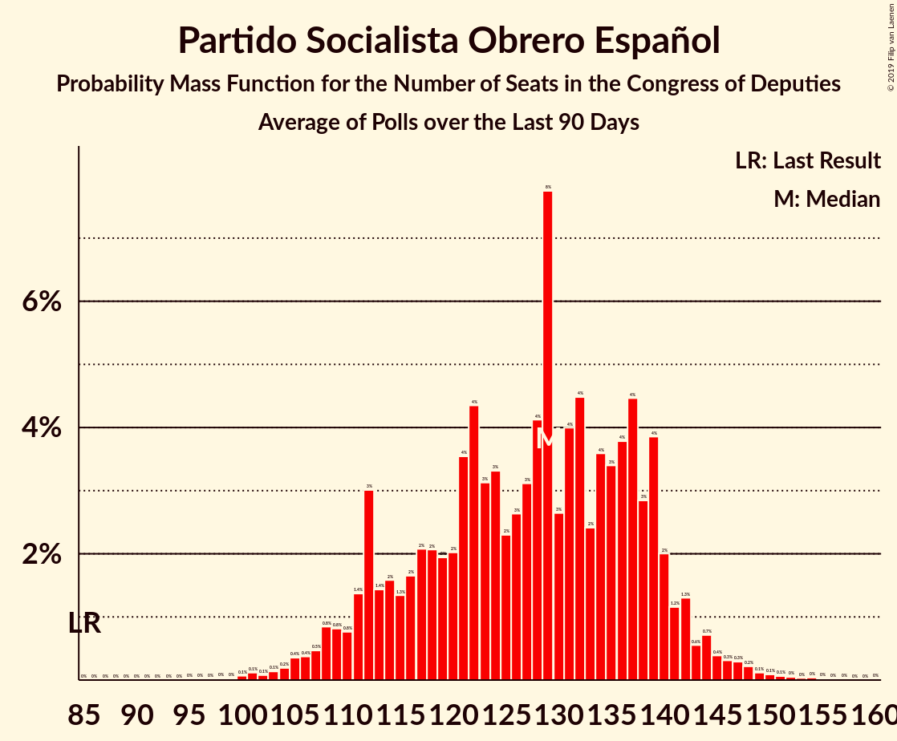

# Partido Socialista Obrero Español

<a href="#voting-intentions">Voting Intentions</a> | <a href="#seats">Seats</a>

## Voting Intentions

Last result: **22.6%** (General Election of 26 June 2016)

### Confidence Intervals

| Period     | Polling firm/Commissioner(s) | Median | 80% Confidence Interval | 90% Confidence Interval | 95% Confidence Interval | 99% Confidence Interval |
|:----------:|:----------------:|:-----------:|:-----------------------:|:-----------------------:|:-----------------------:|:-----------------------:|
| N/A | [Poll Average](average.html) | 26.1% | 23.0–29.5% | 22.5–30.2% | 22.1–30.7% | 21.3–31.7% |
| [19–22 February 2019](2019-02-22-SigmaDos.html) | Sigma Dos   El Mundo | 27.3% | 25.7–29.0% | 25.3–29.5% | 24.9–29.9% | 24.1–30.8% |
| [18–22 February 2019](2019-02-22-GAD3.html) | GAD3   ABC | 28.9% | 26.9–31.0% | 26.3–31.6% | 25.8–32.1% | 24.9–33.2% |
| [13–21 February 2019](2019-02-21-Sondaxe.html) | Sondaxe   La Voz de Galicia | 28.2% | 26.7–29.7% | 26.3–30.2% | 26.0–30.5% | 25.3–31.3% |
| [18–21 February 2019](2019-02-21-Invymark.html) | Invymark   laSexta | 24.3% | 22.8–26.0% | 22.4–26.4% | 22.0–26.9% | 21.3–27.6% |
| [13–15 February 2019](2019-02-15-SocioMétrica.html) | SocioMétrica   El Español | 24.3% | 22.6–26.1% | 22.1–26.6% | 21.7–27.1% | 21.0–27.9% |
| [11–15 February 2019](2019-02-15-NCReport.html) | NC Report   La Razón | 24.1% | 22.4–25.9% | 21.9–26.4% | 21.6–26.9% | 20.8–27.7% |
| [13–15 February 2019](2019-02-15-GESOP.html) | GESOP   El Periódico | 27.4% | 25.6–29.3% | 25.1–29.8% | 24.7–30.3% | 23.9–31.2% |
| [12–15 February 2019](2019-02-15-GAD3.html) | GAD3   La Vanguardia | 28.2% | 26.5–29.9% | 26.1–30.4% | 25.7–30.8% | 24.9–31.6% |
| [11–13 February 2019](2019-02-13-Metroscopia.html) | Metroscopia   Henneo | 27.6% | 26.4–28.9% | 26.0–29.3% | 25.7–29.6% | 25.1–30.3% |
| [1–8 February 2019](2019-02-08-SimpleLógica.html) | Simple Lógica | 25.4% | 23.7–27.2% | 23.2–27.7% | 22.8–28.1% | 22.0–29.0% |
| [4–8 February 2019](2019-02-08-Celeste-Tel.html) | Celeste-Tel   eldiario.es | 23.7% | 22.1–25.4% | 21.7–25.9% | 21.3–26.3% | 20.6–27.2% |
| [28 January–1 February 2019](2019-02-01-Invymark.html) | Invymark   laSexta | 23.9% | 22.4–25.6% | 21.9–26.0% | 21.6–26.4% | 20.9–27.2% |
| [26–30 January 2019](2019-01-30-electoPanel.html) | electoPanel   electomania.es | 23.1% | 22.1–24.1% | 21.8–24.4% | 21.6–24.7% | 21.1–25.2% |
| [21–25 January 2019](2019-01-25-NCReport.html) | NC Report   La Razón | 24.2% | 22.5–26.0% | 22.1–26.5% | 21.6–27.0% | 20.9–27.8% |
| [14–24 January 2019](2019-01-24-GAD3.html) | GAD3   ABC | 26.5% | 25.2–27.9% | 24.8–28.3% | 24.5–28.6% | 23.9–29.3% |
| [14–18 January 2019](2019-01-18-Invymark.html) | Invymark   laSexta | 23.2% | 21.7–24.8% | 21.2–25.2% | 20.9–25.7% | 20.1–26.4% |
| [9–15 January 2019](2019-01-15-Metroscopia.html) | Metroscopia   Henneo | 23.7% | 22.6–24.9% | 22.3–25.2% | 22.0–25.5% | 21.5–26.0% |
| [6–13 January 2019](2019-01-13-electoPanel.html) | electoPanel   electomania.es | 21.3% | 19.9–22.8% | 19.6–23.2% | 19.2–23.5% | 18.6–24.2% |
| [1–13 January 2019](2019-01-13-CIS.html) | CIS | 29.9% | 28.9–31.0% | 28.5–31.3% | 28.3–31.6% | 27.8–32.1% |
| [3–9 January 2019](2019-01-09-SimpleLógica.html) | Simple Lógica | 25.1% | 23.5–26.9% | 23.0–27.4% | 22.6–27.9% | 21.8–28.7% |
| [2–8 January 2019](2019-01-08-Celeste-Tel.html) | Celeste-Tel   eldiario.es | 24.1% | 22.5–25.8% | 22.0–26.3% | 21.6–26.7% | 20.9–27.6% |
| [22 December 2018–5 January 2019](2019-01-05-SocioMétrica.html) | SocioMétrica   El Español | 22.4% | 21.3–23.6% | 21.0–23.9% | 20.7–24.2% | 20.2–24.8% |
| [21–27 December 2018](2018-12-27-SigmaDos.html) | Sigma Dos   El Mundo | 22.6% | 21.0–24.4% | 20.5–24.9% | 20.1–25.3% | 19.3–26.2% |
| [17–21 December 2018](2018-12-21-Invymark.html) | Invymark   laSexta | 23.5% | 22.0–25.1% | 21.6–25.6% | 21.2–26.0% | 20.5–26.8% |
| [16 December 2018](2018-12-16-SigmaDos.html) | Sigma Dos   Antena 3 | 24.1% | 22.4–25.9% | 21.9–26.4% | 21.6–26.9% | 20.8–27.7% |
| [10–14 December 2018](2018-12-14-SocioMétrica.html) | SocioMétrica   El Español | 22.6% | 20.8–24.4% | 20.3–25.0% | 19.9–25.4% | 19.1–26.3% |
| [3–14 December 2018](2018-12-14-SimpleLógica.html) | Simple Lógica | 23.2% | 21.7–24.8% | 21.2–25.3% | 20.9–25.7% | 20.2–26.4% |
| [5–14 December 2018](2018-12-14-NCReport.html) | NC Report   La Razón | 24.8% | 23.1–26.6% | 22.6–27.1% | 22.2–27.6% | 21.4–28.5% |
| [10–14 December 2018](2018-12-14-GAD3.html) | GAD3   ABC | 24.2% | 22.5–26.0% | 22.0–26.5% | 21.6–26.9% | 20.9–27.8% |
| [10–13 December 2018](2018-12-13-IMOP.html) | IMOP   El Confidencial | 25.8% | 24.1–27.6% | 23.6–28.1% | 23.2–28.5% | 22.4–29.4% |
| [10–12 December 2018](2018-12-12-Metroscopia.html) | Metroscopia   Henneo | 22.2% | 21.0–23.5% | 20.7–23.8% | 20.4–24.2% | 19.8–24.8% |
| [3–11 December 2018](2018-12-11-Celeste-Tel.html) | Celeste-Tel   eldiario.es | 25.2% | 23.5–26.9% | 23.1–27.4% | 22.7–27.8% | 21.9–28.7% |
| [3–7 December 2018](2018-12-07-Invymark.html) | Invymark   laSexta | 23.2% | 21.7–24.8% | 21.2–25.2% | 20.9–25.7% | 20.1–26.4% |
| [5 December 2018](2018-12-05-SocioMétrica.html) | SocioMétrica   El Español | 25.0% | 23.2–26.9% | 22.7–27.5% | 22.3–27.9% | 21.4–28.9% |
| [3–4 December 2018](2018-12-04-electoPanel.html) | electoPanel   electomania.es | 19.3% | 18.0–20.6% | 17.7–21.0% | 17.4–21.3% | 16.8–22.0% |
| [2–14 November 2018](2018-11-14-SimpleLógica.html) | Simple Lógica | 24.1% | 22.5–25.9% | 22.0–26.4% | 21.6–26.9% | 20.8–27.7% |
| [5–9 November 2018](2018-11-09-NCReport.html) | NC Report   La Razón | 26.5% | 24.8–28.3% | 24.3–28.9% | 23.9–29.3% | 23.0–30.2% |
| [5–9 November 2018](2018-11-09-Invymark.html) | Invymark   laSexta | 25.4% | 23.9–27.1% | 23.4–27.6% | 23.0–28.0% | 22.3–28.8% |
| [5–9 November 2018](2018-11-09-Celeste-Tel.html) | Celeste-Tel   eldiario.es | 26.9% | 25.2–28.7% | 24.8–29.2% | 24.4–29.6% | 23.6–30.5% |
| [2–7 November 2018](2018-11-07-GAD3.html) | GAD3   La Vanguardia | 26.6% | 24.7–28.7% | 24.1–29.3% | 23.7–29.8% | 22.8–30.8% |
| [22–30 October 2018](2018-10-30-GESOP.html) | GESOP   El Periódico | 25.2% | 23.5–27.2% | 23.0–27.7% | 22.5–28.2% | 21.7–29.1% |
| [20–26 October 2018](2018-10-26-electoPanel.html) | electoPanel   electomania.es | 22.0% | 20.4–23.7% | 20.0–24.2% | 19.6–24.6% | 18.8–25.5% |
| [22–26 October 2018](2018-10-26-Invymark.html) | Invymark   laSexta | 25.7% | 24.1–27.3% | 23.7–27.8% | 23.3–28.2% | 22.5–29.0% |
| [16–18 October 2018](2018-10-18-Metroscopia.html) | Metroscopia   Henneo | 25.2% | 23.8–26.6% | 23.4–27.0% | 23.1–27.4% | 22.5–28.1% |
| [1–11 October 2018](2018-10-11-NCReport.html) | NC Report   La Razón | 26.8% | 25.1–28.7% | 24.6–29.2% | 24.1–29.6% | 23.3–30.5% |
| [1–9 October 2018](2018-10-09-CIS.html) | CIS | 31.6% | 30.5–32.7% | 30.2–33.0% | 29.9–33.3% | 29.4–33.8% |
| [30 September–5 October 2018](2018-10-05-electoPanel.html) | electoPanel   electomania.es | 22.4% | 20.8–24.1% | 20.3–24.6% | 19.9–25.0% | 19.2–25.9% |
| [1–5 October 2018](2018-10-05-SimpleLógica.html) | Simple Lógica | 25.2% | 23.5–27.0% | 23.1–27.5% | 22.7–27.9% | 21.9–28.8% |
| [1–5 October 2018](2018-10-05-Celeste-Tel.html) | Celeste-Tel   eldiario.es | 27.7% | 26.0–29.5% | 25.6–30.0% | 25.1–30.5% | 24.4–31.3% |
| [2 October 2018](2018-10-02-SimpleLógica.html) | Simple Lógica   eldebate.es | 25.3% | 23.6–27.1% | 23.1–27.6% | 22.7–28.1% | 21.9–29.0% |
| [24–28 September 2018](2018-09-28-Invymark.html) | Invymark   laSexta | 24.6% | 23.0–26.2% | 22.6–26.7% | 22.2–27.1% | 21.5–27.9% |
| [17–19 September 2018](2018-09-19-Metroscopia.html) | Metroscopia   Henneo | 27.7% | 26.0–29.5% | 25.5–30.0% | 25.1–30.4% | 24.3–31.3% |
| [17–19 September 2018](2018-09-19-InstitutoDYM.html) | Instituto DYM   El Independiente | 26.5% | 24.8–28.4% | 24.3–28.9% | 23.9–29.4% | 23.1–30.3% |
| [10–14 September 2018](2018-09-14-Invymark.html) | Invymark   laSexta | 25.0% | 23.4–26.7% | 23.0–27.1% | 22.6–27.5% | 21.9–28.3% |
| [6–11 September 2018](2018-09-11-IMOP.html) | IMOP   El Confidencial | 26.5% | 24.8–28.3% | 24.3–28.8% | 23.9–29.3% | 23.0–30.2% |
| [1–11 September 2018](2018-09-11-CIS.html) | CIS | 30.5% | 29.4–31.6% | 29.1–31.9% | 28.9–32.2% | 28.3–32.7% |
| [7–9 September 2018](2018-09-09-electoPanel.html) | electoPanel   electomania.es | 24.9% | 23.2–26.6% | 22.7–27.1% | 22.3–27.6% | 21.6–28.4% |
| [3–7 September 2018](2018-09-07-SimpleLógica.html) | Simple Lógica | 24.8% | 23.1–26.6% | 22.6–27.1% | 22.2–27.5% | 21.4–28.4% |
| [3–7 September 2018](2018-09-07-GAD3.html) | GAD3   ABC | 27.0% | 25.2–28.8% | 24.7–29.4% | 24.3–29.8% | 23.5–30.7% |
| [3–7 September 2018](2018-09-07-Celeste-Tel.html) | Celeste-Tel   eldiario.es | 28.2% | 26.5–30.0% | 26.0–30.5% | 25.6–30.9% | 24.8–31.8% |
| [27–31 August 2018](2018-08-31-NCReport.html) | NC Report   La Razón | 27.8% | 26.0–29.7% | 25.5–30.2% | 25.1–30.7% | 24.3–31.6% |
| [22–30 August 2018](2018-08-30-SocioMétrica.html) | SocioMétrica   El Español | 25.8% | 24.2–27.5% | 23.8–28.0% | 23.4–28.4% | 22.7–29.2% |
| [1–7 August 2018](2018-08-07-Celeste-Tel.html) | Celeste-Tel   eldiario.es | 28.0% | 26.3–29.8% | 25.8–30.3% | 25.4–30.7% | 24.6–31.6% |
| [27 July–3 August 2018](2018-08-03-electoPanel.html) | electoPanel   electomania.es | 24.7% | 23.1–26.5% | 22.6–26.9% | 22.3–27.4% | 21.5–28.2% |
| [1–3 August 2018](2018-08-03-SimpleLógica.html) | Simple Lógica | 25.5% | 23.8–27.3% | 23.3–27.8% | 22.9–28.2% | 22.1–29.1% |
| [23–27 July 2018](2018-07-27-NCReport.html) | NC Report   La Razón | 27.4% | 25.6–29.3% | 25.1–29.8% | 24.7–30.3% | 23.9–31.2% |
| [23–27 July 2018](2018-07-27-Invymark.html) | Invymark   laSexta | 26.0% | 24.4–27.7% | 24.0–28.2% | 23.6–28.6% | 22.8–29.4% |
| [24–26 July 2018](2018-07-26-GAD3.html) | GAD3   ABC | 27.9% | 25.9–30.0% | 25.3–30.5% | 24.9–31.1% | 23.9–32.1% |
| [16–25 July 2018](2018-07-25-Metroscopia.html) | Metroscopia   Henneo | 26.6% | 25.4–27.8% | 25.1–28.2% | 24.8–28.5% | 24.2–29.1% |
| [22–25 July 2018](2018-07-25-DemoscopiayServicios.html) | Demoscopia y Servicios   OKDIARIO | 25.3% | 23.6–27.0% | 23.2–27.5% | 22.8–28.0% | 22.0–28.8% |
| [17–22 July 2018](2018-07-22-electoPanel.html) | electoPanel   electomania.es | 26.1% | 25.0–27.2% | 24.8–27.5% | 24.5–27.7% | 24.0–28.3% |
| [9–13 July 2018](2018-07-13-Invymark.html) | Invymark   laSexta | 26.5% | 24.9–28.2% | 24.5–28.7% | 24.1–29.1% | 23.3–29.9% |
| [9–12 July 2018](2018-07-12-SigmaDos.html) | Sigma Dos   El Mundo | 26.3% | 24.6–28.2% | 24.1–28.7% | 23.7–29.1% | 22.8–30.0% |
| [1–10 July 2018](2018-07-10-CIS.html) | CIS | 29.9% | 28.7–31.1% | 28.4–31.4% | 28.1–31.7% | 27.6–32.3% |
| [2–6 July 2018](2018-07-06-SimpleLógica.html) | Simple Lógica | 27.2% | 25.5–29.0% | 25.0–29.5% | 24.6–30.0% | 23.8–30.9% |
| [2–6 July 2018](2018-07-06-Celeste-Tel.html) | Celeste-Tel   eldiario.es | 27.1% | 25.4–28.9% | 25.0–29.4% | 24.5–29.8% | 23.8–30.7% |
| [25–30 June 2018](2018-06-30-NCReport.html) | NC Report   La Razón | 26.3% | 24.6–28.2% | 24.1–28.7% | 23.7–29.1% | 22.8–30.0% |
| [19–22 June 2018](2018-06-22-SocioMétrica.html) | SocioMétrica   El Español | 23.9% | 22.2–25.7% | 21.8–26.2% | 21.4–26.6% | 20.6–27.5% |
| [18–22 June 2018](2018-06-22-Invymark.html) | Invymark   laSexta | 26.7% | 25.1–28.3% | 24.6–28.8% | 24.2–29.2% | 23.5–30.1% |
| [11–13 June 2018](2018-06-13-GESOP.html) | GESOP   El Periódico | 28.6% | 26.6–30.7% | 26.1–31.3% | 25.6–31.9% | 24.7–32.9% |
| [11–12 June 2018](2018-06-12-InstitutoDYM.html) | Instituto DYM   El Independiente | 27.1% | 25.3–28.9% | 24.9–29.4% | 24.4–29.9% | 23.6–30.8% |
| [1–9 June 2018](2018-06-09-NCReport.html) | NC Report   La Razón | 24.9% | 23.4–26.6% | 22.9–27.0% | 22.5–27.5% | 21.8–28.3% |
| [4–8 June 2018](2018-06-08-SimpleLógica.html) | Simple Lógica | 26.7% | 25.0–28.5% | 24.5–29.0% | 24.1–29.5% | 23.3–30.4% |
| [4–8 June 2018](2018-06-08-Invymark.html) | Invymark   laSexta | 25.1% | 23.5–26.7% | 23.1–27.2% | 22.7–27.6% | 22.0–28.4% |
| [7–8 June 2018](2018-06-08-GAD3.html) | GAD3   ABC | 28.8% | 26.8–30.9% | 26.2–31.5% | 25.7–32.0% | 24.8–33.0% |
| [4–8 June 2018](2018-06-08-Celeste-Tel.html) | Celeste-Tel   eldiario.es | 25.8% | 24.2–27.6% | 23.7–28.1% | 23.3–28.5% | 22.5–29.3% |
| [26 May–2 June 2018](2018-06-02-electoPanel.html) | electoPanel   electomania.es | 21.6% | 20.4–22.8% | 20.1–23.1% | 19.8–23.4% | 19.3–24.0% |
| [28–29 May 2018](2018-05-29-Invymark.html) | Invymark   laSexta | 22.6% | 21.1–24.2% | 20.7–24.6% | 20.3–25.0% | 19.6–25.8% |
| [26–28 May 2018](2018-05-28-electoPanel.html) | electoPanel   electomania.es | 23.0% | 21.6–24.5% | 21.2–24.9% | 20.9–25.3% | 20.3–26.0% |
| [23–28 May 2018](2018-05-28-IMOP.html) | IMOP   El Confidencial | 20.6% | 19.0–22.3% | 18.6–22.8% | 18.2–23.2% | 17.5–24.0% |
| [17–26 May 2018](2018-05-26-SocioMétrica.html) | SocioMétrica   El Español | 20.3% | 19.1–21.6% | 18.7–22.0% | 18.4–22.3% | 17.9–22.9% |
| [16–25 May 2018](2018-05-25-NCReport.html) | NC Report   La Razón | 23.6% | 21.9–25.4% | 21.5–25.9% | 21.1–26.3% | 20.3–27.2% |
| [3–10 May 2018](2018-05-10-SimpleLógica.html) | Simple Lógica | 20.1% | 18.5–21.7% | 18.1–22.2% | 17.8–22.6% | 17.1–23.4% |
| [7–9 May 2018](2018-05-09-Metroscopia.html) | Metroscopia   El País | 19.0% | 17.8–20.3% | 17.5–20.6% | 17.2–20.9% | 16.7–21.6% |
| [26–30 April 2018](2018-04-30-Celeste-Tel.html) | Celeste-Tel   PSOE | 24.9% | 23.2–26.7% | 22.7–27.2% | 22.3–27.7% | 21.5–28.6% |
| [12–18 April 2018](2018-04-18-GESOP.html) | GESOP   El Periódico | 20.5% | 18.9–22.2% | 18.5–22.7% | 18.1–23.1% | 17.4–24.0% |
| [9–13 April 2018](2018-04-13-NCReport.html) | NC Report   La Razón | 23.5% | 21.8–25.3% | 21.4–25.8% | 21.0–26.2% | 20.2–27.1% |
| [9–13 April 2018](2018-04-13-Invymark.html) | Invymark   laSexta | 22.3% | 20.8–23.9% | 20.4–24.4% | 20.1–24.8% | 19.4–25.6% |
| [1–10 April 2018](2018-04-10-CIS.html) | CIS | 22.0% | 21.0–23.1% | 20.7–23.4% | 20.4–23.7% | 19.9–24.2% |
| [2–9 April 2018](2018-04-09-SimpleLógica.html) | Simple Lógica | 20.2% | 18.7–21.9% | 18.3–22.4% | 17.9–22.8% | 17.2–23.6% |
| [2–6 April 2018](2018-04-06-Celeste-Tel.html) | Celeste-Tel   eldiario.es | 24.1% | 22.5–25.8% | 22.0–26.3% | 21.6–26.7% | 20.9–27.6% |
| [4–5 April 2018](2018-04-05-Metroscopia.html) | Metroscopia   El País | 19.1% | 17.7–20.6% | 17.4–21.0% | 17.0–21.4% | 16.4–22.1% |
| [19–29 March 2018](2018-03-29-SocioMétrica.html) | SocioMétrica   El Español | 19.4% | 17.9–21.1% | 17.4–21.6% | 17.1–22.0% | 16.4–22.8% |
| [23–27 March 2018](2018-03-27-SigmaDos.html) | Sigma Dos   El Mundo | 19.7% | 18.2–21.4% | 17.7–21.9% | 17.3–22.3% | 16.6–23.1% |
| [13–16 March 2018](2018-03-16-MyWord.html) | MyWord   Cadena SER | 20.4% | 18.8–22.1% | 18.4–22.6% | 18.0–23.0% | 17.3–23.8% |
| [12–16 March 2018](2018-03-16-Invymark.html) | Invymark   laSexta | 22.6% | 21.1–24.2% | 20.7–24.6% | 20.3–25.0% | 19.6–25.8% |
| [12–14 March 2018](2018-03-14-GAD3.html) | GAD3   La Vanguardia | 22.1% | 20.5–23.9% | 20.1–24.4% | 19.7–24.8% | 18.9–25.7% |
| [1–7 March 2018](2018-03-07-SimpleLógica.html) | Simple Lógica | 21.0% | 19.5–22.7% | 19.0–23.1% | 18.7–23.5% | 18.0–24.4% |
| [1–7 March 2018](2018-03-07-Celeste-Tel.html) | Celeste-Tel   eldiario.es | 24.3% | 22.7–26.0% | 22.2–26.5% | 21.8–26.9% | 21.1–27.7% |
| [2–5 March 2018](2018-03-05-Metroscopia.html) | Metroscopia   El País | 19.4% | 18.0–21.0% | 17.6–21.4% | 17.2–21.8% | 16.6–22.5% |
| [26 February–2 March 2018](2018-03-02-NCReport.html) | NC Report   La Razón | 24.0% | 22.3–25.8% | 21.9–26.3% | 21.4–26.7% | 20.7–27.6% |
| [26 February–2 March 2018](2018-03-02-Invymark.html) | Invymark   laSexta | 23.1% | 21.6–24.7% | 21.1–25.2% | 20.8–25.6% | 20.1–26.4% |
| [22–27 February 2018](2018-02-27-IMOP.html) | IMOP   El Confidencial | 21.5% | 20.1–22.9% | 19.7–23.4% | 19.4–23.7% | 18.8–24.4% |
| [12–16 February 2018](2018-02-16-Invymark.html) | Invymark   laSexta | 22.8% | 21.3–24.4% | 20.9–24.9% | 20.5–25.3% | 19.8–26.1% |
| [7–14 February 2018](2018-02-14-MyWord.html) | MyWord   Cadena SER | 21.3% | 19.7–23.0% | 19.3–23.5% | 18.9–24.0% | 18.1–24.8% |
| [5–9 February 2018](2018-02-09-Celeste-Tel.html) | Celeste-Tel   eldiario.es | 25.5% | 23.9–27.3% | 23.4–27.8% | 23.0–28.2% | 22.3–29.1% |
| [5–8 February 2018](2018-02-08-Metroscopia.html) | Metroscopia   El País | 20.1% | 18.8–21.6% | 18.4–22.0% | 18.1–22.4% | 17.4–23.1% |
| [1–7 February 2018](2018-02-07-SimpleLógica.html) | Simple Lógica | 21.4% | 19.9–23.1% | 19.4–23.6% | 19.0–24.0% | 18.3–24.8% |
| [31 January–7 February 2018](2018-02-07-GAD3.html) | GAD3   ABC | 23.7% | 22.0–25.4% | 21.5–26.0% | 21.1–26.4% | 20.3–27.3% |

### Probability Mass Function

The following table shows the probability mass function per percentage block of voting intentions for the [poll average](average.html) for Partido Socialista Obrero Español.

| Voting Intentions | Probability | Accumulated | Special Marks |
|:-----------------:|:-----------:|:-----------:|:-------------:|
| 18.5–19.5% | 0% | 100% |  |
| 19.5–20.5% | 0.1% | 100% |  |
| 20.5–21.5% | 0.8% | 99.9% |  |
| 21.5–22.5% | 5% | 99.1% |  |
| 22.5–23.5% | 11% | 95% | Last Result |
| 23.5–24.5% | 14% | 84% |  |
| 24.5–25.5% | 13% | 70% |  |
| 25.5–26.5% | 12% | 57% | Median |
| 26.5–27.5% | 13% | 45% |  |
| 27.5–28.5% | 12% | 32% |  |
| 28.5–29.5% | 10% | 20% |  |
| 29.5–30.5% | 7% | 10% |  |
| 30.5–31.5% | 3% | 3% |  |
| 31.5–32.5% | 0.5% | 0.7% |  |
| 32.5–33.5% | 0.1% | 0.1% |  |
| 33.5–34.5% | 0% | 0% |  |

## Seats

Last result: **85** seats (General Election of 26 June 2016)

### Confidence Intervals

| Period     | Polling firm/Commissioner(s) | Median | 80% Confidence Interval | 90% Confidence Interval | 95% Confidence Interval | 99% Confidence Interval |
|:----------:|:----------------:|:------:|:-----------------------:|:-----------------------:|:-----------------------:|:-----------------------:|
| N/A | [Poll Average](average.html) | 112 | 93–130 | 90–135 | 87–135 | 84–142 |
| [19–22 February 2019](2019-02-22-SigmaDos.html) | Sigma Dos   El Mundo | 116 | 109–125 | 108–130 | 104–131 | 100–136 |
| [18–22 February 2019](2019-02-22-GAD3.html) | GAD3   ABC | 122 | 109–131 | 106–136 | 104–137 | 100–142 |
| [13–21 February 2019](2019-02-21-Sondaxe.html) | Sondaxe   La Voz de Galicia | 122 | 114–129 | 112–132 | 109–133 | 105–137 |
| [18–21 February 2019](2019-02-21-Invymark.html) | Invymark   laSexta | 101 | 93–110 | 91–112 | 89–113 | 85–116 |
| [13–15 February 2019](2019-02-15-SocioMétrica.html) | SocioMétrica   El Español | 106 | 94–114 | 91–117 | 89–117 | 84–123 |
| [11–15 February 2019](2019-02-15-NCReport.html) | NC Report   La Razón | 94 | 87–105 | 85–107 | 84–110 | 82–114 |
| [13–15 February 2019](2019-02-15-GESOP.html) | GESOP   El Periódico | 120 | 109–130 | 106–132 | 104–135 | 99–139 |
| [12–15 February 2019](2019-02-15-GAD3.html) | GAD3   La Vanguardia | 119 | 111–126 | 108–127 | 106–131 | 102–136 |
| [11–13 February 2019](2019-02-13-Metroscopia.html) | Metroscopia   Henneo | 118 | 111–125 | 109–127 | 107–129 | 105–133 |
| [1–8 February 2019](2019-02-08-SimpleLógica.html) | Simple Lógica | 113 | 104–122 | 101–125 | 98–128 | 93–134 |
| [4–8 February 2019](2019-02-08-Celeste-Tel.html) | Celeste-Tel   eldiario.es | 98 | 87–103 | 87–106 | 84–108 | 82–111 |
| [28 January–1 February 2019](2019-02-01-Invymark.html) | Invymark   laSexta | 98 | 91–109 | 88–110 | 87–112 | 83–115 |
| [26–30 January 2019](2019-01-30-electoPanel.html) | electoPanel   electomania.es | 96 | 90–102 | 88–104 | 87–106 | 85–109 |
| [21–25 January 2019](2019-01-25-NCReport.html) | NC Report   La Razón | 94 | 86–103 | 84–108 | 84–111 | 81–113 |
| [14–24 January 2019](2019-01-24-GAD3.html) | GAD3   ABC | 120 | 109–120 | 108–120 | 106–120 | 101–124 |
| [14–18 January 2019](2019-01-18-Invymark.html) | Invymark   laSexta | 94 | 86–103 | 84–105 | 83–107 | 79–111 |
| [9–15 January 2019](2019-01-15-Metroscopia.html) | Metroscopia   Henneo | 99 | 95–100 | 94–104 | 90–109 | 88–109 |
| [6–13 January 2019](2019-01-13-electoPanel.html) | electoPanel   electomania.es | 91 | 91–93 | 84–102 | 83–102 | 79–103 |
| [1–13 January 2019](2019-01-13-CIS.html) | CIS | 135 | 132–140 | 132–143 | 131–145 | 128–148 |
| [3–9 January 2019](2019-01-09-SimpleLógica.html) | Simple Lógica | 111 | 102–118 | 98–121 | 96–123 | 91–130 |
| [2–8 January 2019](2019-01-08-Celeste-Tel.html) | Celeste-Tel   eldiario.es | 96 | 89–99 | 86–100 | 86–107 | 84–107 |
| [22 December 2018–5 January 2019](2019-01-05-SocioMétrica.html) | SocioMétrica   El Español | 89 | 87–95 | 84–99 | 82–100 | 80–106 |
| [21–27 December 2018](2018-12-27-SigmaDos.html) | Sigma Dos   El Mundo | 91 | 84–102 | 82–105 | 80–109 | 77–113 |
| [17–21 December 2018](2018-12-21-Invymark.html) | Invymark   laSexta | 96 | 87–105 | 85–107 | 84–108 | 81–115 |
| [16 December 2018](2018-12-16-SigmaDos.html) | Sigma Dos   Antena 3 | 99 | 90–108 | 88–112 | 86–114 | 83–117 |
| [10–14 December 2018](2018-12-14-SocioMétrica.html) | SocioMétrica   El Español | 95 | 84–98 | 82–100 | 81–101 | 76–116 |
| [3–14 December 2018](2018-12-14-SimpleLógica.html) | Simple Lógica | 96 | 88–105 | 86–109 | 84–111 | 81–115 |
| [5–14 December 2018](2018-12-14-NCReport.html) | NC Report   La Razón | 91 | 91–105 | 88–110 | 88–111 | 85–113 |
| [10–14 December 2018](2018-12-14-GAD3.html) | GAD3   ABC | 102 | 91–116 | 91–116 | 88–116 | 86–116 |
| [10–13 December 2018](2018-12-13-IMOP.html) | IMOP   El Confidencial | 109 | 103–116 | 99–117 | 95–121 | 91–126 |
| [10–12 December 2018](2018-12-12-Metroscopia.html) | Metroscopia   Henneo | 90 | 84–96 | 82–97 | 80–98 | 79–103 |
| [3–11 December 2018](2018-12-11-Celeste-Tel.html) | Celeste-Tel   eldiario.es | 93 | 93–97 | 93–101 | 93–101 | 86–108 |
| [3–7 December 2018](2018-12-07-Invymark.html) | Invymark   laSexta | 92 | 85–101 | 84–104 | 83–106 | 80–110 |
| [5 December 2018](2018-12-05-SocioMétrica.html) | SocioMétrica   El Español | 109 | 93–109 | 93–110 | 91–114 | 86–116 |
| [3–4 December 2018](2018-12-04-electoPanel.html) | electoPanel   electomania.es | 81 | 77–89 | 75–89 | 72–89 | 65–90 |
| [2–14 November 2018](2018-11-14-SimpleLógica.html) | Simple Lógica | 99 | 90–109 | 89–113 | 88–116 | 85–120 |
| [5–9 November 2018](2018-11-09-NCReport.html) | NC Report   La Razón | 95 | 93–95 | 91–95 | 91–103 | 89–107 |
| [5–9 November 2018](2018-11-09-Invymark.html) | Invymark   laSexta | 98 | 91–108 | 89–111 | 88–113 | 86–118 |
| [5–9 November 2018](2018-11-09-Celeste-Tel.html) | Celeste-Tel   eldiario.es | 99 | 99 | 93–99 | 93–103 | 93–113 |
| [2–7 November 2018](2018-11-07-GAD3.html) | GAD3   La Vanguardia | 115 | 103–115 | 100–115 | 94–117 | 92–127 |
| [22–30 October 2018](2018-10-30-GESOP.html) | GESOP   El Periódico | 106 | 92–115 | 91–117 | 90–120 | 86–126 |
| [20–26 October 2018](2018-10-26-electoPanel.html) | electoPanel   electomania.es | 87 | 83–87 | 83–87 | 79–87 | 77–94 |
| [22–26 October 2018](2018-10-26-Invymark.html) | Invymark   laSexta | 99 | 92–110 | 90–112 | 89–115 | 87–119 |
| [16–18 October 2018](2018-10-18-Metroscopia.html) | Metroscopia   Henneo | 100 | 94–109 | 93–112 | 92–115 | 89–118 |
| [1–11 October 2018](2018-10-11-NCReport.html) | NC Report   La Razón | 101 | 93–105 | 93–106 | 93–112 | 89–120 |
| [1–9 October 2018](2018-10-09-CIS.html) | CIS | 130 | 130–131 | 130–133 | 128–133 | 128–136 |
| [30 September–5 October 2018](2018-10-05-electoPanel.html) | electoPanel   electomania.es | 86 | 80–98 | 77–98 | 77–98 | 74–98 |
| [1–5 October 2018](2018-10-05-SimpleLógica.html) | Simple Lógica | 101 | 89–111 | 88–113 | 87–114 | 86–116 |
| [1–5 October 2018](2018-10-05-Celeste-Tel.html) | Celeste-Tel   eldiario.es | 103 | 95–119 | 94–121 | 93–121 | 92–129 |
| [2 October 2018](2018-10-02-SimpleLógica.html) | Simple Lógica   eldebate.es | 103 | 93–113 | 91–117 | 90–118 | 88–122 |
| [24–28 September 2018](2018-09-28-Invymark.html) | Invymark   laSexta | 94 | 88–102 | 87–105 | 86–108 | 84–112 |
| [17–19 September 2018](2018-09-19-Metroscopia.html) | Metroscopia   Henneo | 117 | 112–126 | 111–128 | 111–130 | 110–130 |
| [17–19 September 2018](2018-09-19-InstitutoDYM.html) | Instituto DYM   El Independiente | 105 | 96–116 | 94–119 | 92–122 | 89–125 |
| [10–14 September 2018](2018-09-14-Invymark.html) | Invymark   laSexta | 95 | 90–102 | 88–105 | 87–109 | 85–113 |
| [6–11 September 2018](2018-09-11-IMOP.html) | IMOP   El Confidencial | 111 | 105–121 | 105–121 | 102–121 | 90–124 |
| [1–11 September 2018](2018-09-11-CIS.html) | CIS | 131 | 127–133 | 123–133 | 123–133 | 123–133 |
| [7–9 September 2018](2018-09-09-electoPanel.html) | electoPanel   electomania.es | 94 | 86–98 | 86–107 | 86–107 | 85–112 |
| [3–7 September 2018](2018-09-07-SimpleLógica.html) | Simple Lógica | 100 | 92–112 | 90–115 | 89–117 | 86–121 |
| [3–7 September 2018](2018-09-07-GAD3.html) | GAD3   ABC | 103 | 96–112 | 93–116 | 92–121 | 90–125 |
| [3–7 September 2018](2018-09-07-Celeste-Tel.html) | Celeste-Tel   eldiario.es | 115 | 95–127 | 95–127 | 94–128 | 94–128 |
| [27–31 August 2018](2018-08-31-NCReport.html) | NC Report   La Razón | 110 | 94–120 | 94–120 | 94–120 | 93–125 |
| [22–30 August 2018](2018-08-30-SocioMétrica.html) | SocioMétrica   El Español | 104 | 96–112 | 96–112 | 93–112 | 89–120 |
| [1–7 August 2018](2018-08-07-Celeste-Tel.html) | Celeste-Tel   eldiario.es | 111 | 98–117 | 95–117 | 95–120 | 94–123 |
| [27 July–3 August 2018](2018-08-03-electoPanel.html) | electoPanel   electomania.es | 102 | 89–103 | 88–106 | 86–108 | 85–113 |
| [1–3 August 2018](2018-08-03-SimpleLógica.html) | Simple Lógica | 101 | 91–110 | 89–113 | 88–115 | 85–121 |
| [23–27 July 2018](2018-07-27-NCReport.html) | NC Report   La Razón | 107 | 97–113 | 95–119 | 94–120 | 92–125 |
| [23–27 July 2018](2018-07-27-Invymark.html) | Invymark   laSexta | 98 | 94–108 | 91–111 | 90–114 | 87–119 |
| [24–26 July 2018](2018-07-26-GAD3.html) | GAD3   ABC | 113 | 102–115 | 99–119 | 93–126 | 89–132 |
| [16–25 July 2018](2018-07-25-Metroscopia.html) | Metroscopia   Henneo | 107 | 97–113 | 97–115 | 97–116 | 95–118 |
| [22–25 July 2018](2018-07-25-DemoscopiayServicios.html) | Demoscopia y Servicios   OKDIARIO | 94 | 94–107 | 93–110 | 92–110 | 91–112 |
| [17–22 July 2018](2018-07-22-electoPanel.html) | electoPanel   electomania.es | 103 | 103 | 103 | 103 | 101–116 |
| [9–13 July 2018](2018-07-13-Invymark.html) | Invymark   laSexta | 101 | 95–112 | 93–116 | 91–118 | 89–122 |
| [9–12 July 2018](2018-07-12-SigmaDos.html) | Sigma Dos   El Mundo | 106 | 95–114 | 93–117 | 90–118 | 88–124 |
| [1–10 July 2018](2018-07-10-CIS.html) | CIS | 127 | 127–129 | 127–129 | 127–129 | 123–129 |
| [2–6 July 2018](2018-07-06-SimpleLógica.html) | Simple Lógica | 109 | 97–119 | 95–122 | 94–125 | 91–129 |
| [2–6 July 2018](2018-07-06-Celeste-Tel.html) | Celeste-Tel   eldiario.es | 116 | 102–118 | 95–118 | 91–119 | 88–123 |
| [25–30 June 2018](2018-06-30-NCReport.html) | NC Report   La Razón | 101 | 101–110 | 101–110 | 91–110 | 91–124 |
| [19–22 June 2018](2018-06-22-SocioMétrica.html) | SocioMétrica   El Español | 97 | 92–102 | 88–110 | 87–116 | 80–116 |
| [18–22 June 2018](2018-06-22-Invymark.html) | Invymark   laSexta | 103 | 95–115 | 95–118 | 93–120 | 90–123 |
| [11–13 June 2018](2018-06-13-GESOP.html) | GESOP   El Periódico | 116 | 104–128 | 101–130 | 99–132 | 95–136 |
| [11–12 June 2018](2018-06-12-InstitutoDYM.html) | Instituto DYM   El Independiente | 111 | 100–119 | 97–123 | 95–124 | 92–127 |
| [1–9 June 2018](2018-06-09-NCReport.html) | NC Report   La Razón | 102 | 92–109 | 90–111 | 87–113 | 86–114 |
| [4–8 June 2018](2018-06-08-SimpleLógica.html) | Simple Lógica | 103 | 99–120 | 97–120 | 95–122 | 91–131 |
| [4–8 June 2018](2018-06-08-Invymark.html) | Invymark   laSexta | 97 | 91–108 | 89–111 | 88–113 | 86–118 |
| [7–8 June 2018](2018-06-08-GAD3.html) | GAD3   ABC | 120 | 99–120 | 98–125 | 95–125 | 93–127 |
| [4–8 June 2018](2018-06-08-Celeste-Tel.html) | Celeste-Tel   eldiario.es | 97 | 92–110 | 91–114 | 91–116 | 89–122 |
| [26 May–2 June 2018](2018-06-02-electoPanel.html) | electoPanel   electomania.es | 91 | 87–93 | 86–95 | 85–95 | 79–101 |
| [28–29 May 2018](2018-05-29-Invymark.html) | Invymark   laSexta | 88 | 78–88 | 78–94 | 78–94 | 70–97 |
| [26–28 May 2018](2018-05-28-electoPanel.html) | electoPanel   electomania.es | 90 | 90–99 | 90–108 | 87–108 | 79–108 |
| [23–28 May 2018](2018-05-28-IMOP.html) | IMOP   El Confidencial | 78 | 70–85 | 69–88 | 66–89 | 63–90 |
| [17–26 May 2018](2018-05-26-SocioMétrica.html) | SocioMétrica   El Español | 82 | 81–85 | 76–86 | 74–88 | 66–90 |
| [16–25 May 2018](2018-05-25-NCReport.html) | NC Report   La Razón | 89 | 85–100 | 83–102 | 81–102 | 79–108 |
| [3–10 May 2018](2018-05-10-SimpleLógica.html) | Simple Lógica | 77 | 71–84 | 68–86 | 65–88 | 60–90 |
| [7–9 May 2018](2018-05-09-Metroscopia.html) | Metroscopia   El País | 74 | 71–78 | 69–78 | 65–80 | 64–85 |
| [26–30 April 2018](2018-04-30-Celeste-Tel.html) | Celeste-Tel   PSOE | 93 | 91–101 | 90–107 | 87–107 | 83–111 |
| [12–18 April 2018](2018-04-18-GESOP.html) | GESOP   El Periódico | 78 | 72–86 | 69–88 | 66–89 | 62–92 |
| [9–13 April 2018](2018-04-13-NCReport.html) | NC Report   La Razón | 94 | 94 | 90–94 | 89–94 | 84–94 |
| [9–13 April 2018](2018-04-13-Invymark.html) | Invymark   laSexta | 86 | 79–92 | 77–94 | 76–96 | 72–100 |
| [1–10 April 2018](2018-04-10-CIS.html) | CIS | 86 | 85–90 | 85–90 | 85–90 | 82–90 |
| [2–9 April 2018](2018-04-09-SimpleLógica.html) | Simple Lógica | 79 | 72–88 | 70–89 | 68–90 | 63–92 |
| [2–6 April 2018](2018-04-06-Celeste-Tel.html) | Celeste-Tel   eldiario.es | 94 | 90–94 | 90–94 | 90–94 | 90–94 |
| [4–5 April 2018](2018-04-05-Metroscopia.html) | Metroscopia   El País | 74 | 67–79 | 62–80 | 62–82 | 60–86 |
| [19–29 March 2018](2018-03-29-SocioMétrica.html) | SocioMétrica   El Español | 79 | 75–79 | 75–79 | 74–82 | 72–82 |
| [23–27 March 2018](2018-03-27-SigmaDos.html) | Sigma Dos   El Mundo | 76 | 64–76 | 60–76 | 59–76 | 59–85 |
| [13–16 March 2018](2018-03-16-MyWord.html) | MyWord   Cadena SER | 83 | 75–88 | 72–90 | 70–92 | 65–97 |
| [12–16 March 2018](2018-03-16-Invymark.html) | Invymark   laSexta | 86 | 82–92 | 79–95 | 77–98 | 74–101 |
| [12–14 March 2018](2018-03-14-GAD3.html) | GAD3   La Vanguardia | 88 | 78–93 | 76–93 | 75–94 | 68–97 |
| [1–7 March 2018](2018-03-07-SimpleLógica.html) | Simple Lógica | 81 | 78–87 | 78–88 | 78–88 | 75–89 |
| [1–7 March 2018](2018-03-07-Celeste-Tel.html) | Celeste-Tel   eldiario.es | 90 | 84–99 | 84–102 | 84–102 | 77–110 |
| [2–5 March 2018](2018-03-05-Metroscopia.html) | Metroscopia   El País | 75 | 67–81 | 65–84 | 61–86 | 59–88 |
| [26 February–2 March 2018](2018-03-02-NCReport.html) | NC Report   La Razón | 90 | 87–96 | 85–99 | 84–103 | 80–111 |
| [26 February–2 March 2018](2018-03-02-Invymark.html) | Invymark   laSexta | 88 | 84–94 | 81–97 | 78–100 | 76–104 |
| [22–27 February 2018](2018-02-27-IMOP.html) | IMOP   El Confidencial | 83 | 76–87 | 76–89 | 75–89 | 72–92 |
| [12–16 February 2018](2018-02-16-Invymark.html) | Invymark   laSexta | 87 | 83–94 | 80–96 | 78–99 | 76–103 |
| [7–14 February 2018](2018-02-14-MyWord.html) | MyWord   Cadena SER | 86 | 79–92 | 77–95 | 76–97 | 72–102 |
| [5–9 February 2018](2018-02-09-Celeste-Tel.html) | Celeste-Tel   eldiario.es | 96 | 85–106 | 85–111 | 85–111 | 85–111 |
| [5–8 February 2018](2018-02-08-Metroscopia.html) | Metroscopia   El País | 78 | 72–85 | 70–87 | 68–88 | 63–90 |
| [1–7 February 2018](2018-02-07-SimpleLógica.html) | Simple Lógica | 82 | 75–88 | 73–89 | 71–92 | 66–97 |
| [31 January–7 February 2018](2018-02-07-GAD3.html) | GAD3   ABC | 90 | 83–101 | 80–104 | 80–104 | 77–107 |

### Probability Mass Function

The following table shows the probability mass function per seat for the [poll average](average.html) for Partido Socialista Obrero Español.

| Number of Seats | Probability | Accumulated | Special Marks |
|:---------------:|:-----------:|:-----------:|:-------------:|
| 80 | 0% | 100% |  |
| 81 | 0.1% | 99.9% |  |
| 82 | 0.1% | 99.9% |  |
| 83 | 0.1% | 99.8% |  |
| 84 | 0.3% | 99.7% |  |
| 85 | 0.3% | 99.5% | Last Result |
| 86 | 0.4% | 99.2% |  |
| 87 | 2% | 98.8% |  |
| 88 | 1.2% | 97% |  |
| 89 | 1.0% | 96% |  |
| 90 | 0.8% | 95% |  |
| 91 | 2% | 94% |  |
| 92 | 2% | 93% |  |
| 93 | 1.4% | 91% |  |
| 94 | 2% | 90% |  |
| 95 | 2% | 88% |  |
| 96 | 2% | 86% |  |
| 97 | 2% | 84% |  |
| 98 | 4% | 81% |  |
| 99 | 2% | 77% |  |
| 100 | 2% | 76% |  |
| 101 | 1.3% | 74% |  |
| 102 | 1.4% | 72% |  |
| 103 | 2% | 71% |  |
| 104 | 2% | 69% |  |
| 105 | 2% | 67% |  |
| 106 | 2% | 65% |  |
| 107 | 4% | 64% |  |
| 108 | 2% | 60% |  |
| 109 | 2% | 58% |  |
| 110 | 2% | 56% |  |
| 111 | 2% | 53% |  |
| 112 | 2% | 51% | Median |
| 113 | 4% | 49% |  |
| 114 | 3% | 45% |  |
| 115 | 2% | 42% |  |
| 116 | 3% | 40% |  |
| 117 | 3% | 36% |  |
| 118 | 2% | 33% |  |
| 119 | 4% | 31% |  |
| 120 | 3% | 27% |  |
| 121 | 2% | 25% |  |
| 122 | 3% | 23% |  |
| 123 | 2% | 20% |  |
| 124 | 2% | 19% |  |
| 125 | 1.2% | 17% |  |
| 126 | 0.8% | 16% |  |
| 127 | 2% | 15% |  |
| 128 | 0.9% | 13% |  |
| 129 | 1.2% | 13% |  |
| 130 | 1.3% | 11% |  |
| 131 | 0.6% | 10% |  |
| 132 | 0.9% | 9% |  |
| 133 | 0.4% | 8% |  |
| 134 | 0.8% | 8% |  |
| 135 | 5% | 7% |  |
| 136 | 0.5% | 2% |  |
| 137 | 0.3% | 2% |  |
| 138 | 0.2% | 1.4% |  |
| 139 | 0.2% | 1.2% |  |
| 140 | 0.2% | 1.0% |  |
| 141 | 0.3% | 0.8% |  |
| 142 | 0.1% | 0.6% |  |
| 143 | 0.2% | 0.4% |  |
| 144 | 0% | 0.2% |  |
| 145 | 0.2% | 0.2% |  |
| 146 | 0% | 0.1% |  |
| 147 | 0% | 0.1% |  |
| 148 | 0% | 0.1% |  |
| 149 | 0% | 0% |  |

