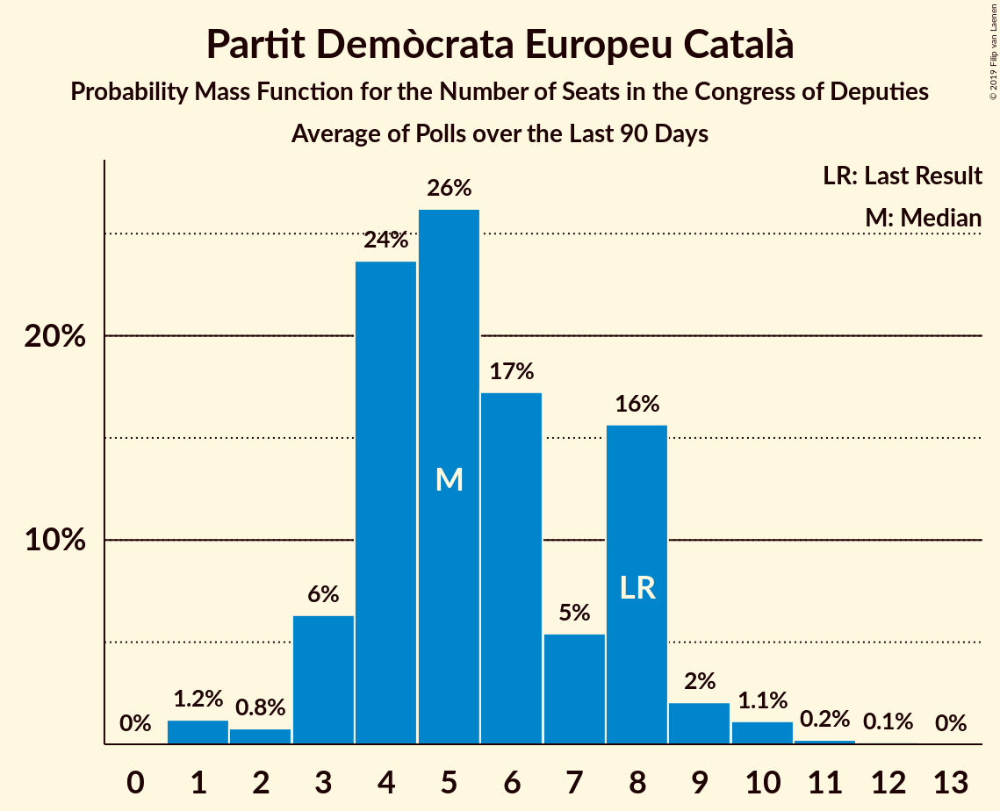

# Partit Demòcrata Europeu Català

<a href="#voting-intentions">Voting Intentions</a> | <a href="#seats">Seats</a>

## Voting Intentions

Last result: **2.0%** (General Election of 26 June 2016)

### Confidence Intervals

| Period     | Polling firm/Commissioner(s) | Median | 80% Confidence Interval | 90% Confidence Interval | 95% Confidence Interval | 99% Confidence Interval |
|:----------:|:----------------:|:-----------:|:-----------------------:|:-----------------------:|:-----------------------:|:-----------------------:|
| N/A | [Poll Average](average.html) | 1.4% | 1.1–2.0% | 1.0–2.2% | 0.9–2.3% | 0.7–2.6% |
| [14–21 April 2019](2019-04-21-SocioMétrica.html) | SocioMétrica   El Español | 1.3% | 1.0–1.7% | 0.9–1.8% | 0.9–1.9% | 0.7–2.1% |
| [22 February–20 April 2019](2019-04-20-electoPanel.html) | electoPanel   electomania.es | 1.3% | 1.2–1.4% | 1.1–1.5% | 1.1–1.5% | 1.0–1.6% |
| [13–20 April 2019](2019-04-20-SocioMétrica.html) | SocioMétrica   El Español | 1.4% | 1.1–1.8% | 1.0–1.9% | 0.9–2.0% | 0.8–2.3% |
| [14–20 April 2019](2019-04-20-IMOP.html) | IMOP   El Confidencial | 1.2% | 0.9–1.7% | 0.8–1.8% | 0.8–1.9% | 0.6–2.2% |
| [15–20 April 2019](2019-04-20-Celeste-Tel.html) | Celeste-Tel   eldiario.es | 1.5% | 1.2–2.1% | 1.1–2.3% | 1.0–2.5% | 0.8–2.8% |
| [22 February–19 April 2019](2019-04-19-electoPanel.html) | electoPanel   electomania.es | 1.3% | 1.2–1.5% | 1.1–1.5% | 1.1–1.5% | 1.0–1.6% |
| [12–19 April 2019](2019-04-19-SocioMétrica.html) | SocioMétrica   El Español | 1.5% | 1.2–2.0% | 1.1–2.1% | 1.0–2.2% | 0.9–2.4% |
| [15–19 April 2019](2019-04-19-NCReport.html) | NC Report   La Razón | 1.4% | 1.0–2.0% | 0.9–2.2% | 0.8–2.3% | 0.7–2.7% |
| [15–19 April 2019](2019-04-19-Invymark.html) | Invymark   laSexta | 1.3% | 1.0–1.9% | 0.9–2.0% | 0.8–2.2% | 0.7–2.5% |
| [1–19 April 2019](2019-04-19-GAD3.html) | GAD3   ABC | 1.2% | 1.1–1.4% | 1.0–1.4% | 1.0–1.4% | 0.9–1.5% |
| [22 February–18 April 2019](2019-04-18-electoPanel.html) | electoPanel   electomania.es | 1.3% | 1.2–1.5% | 1.1–1.5% | 1.1–1.5% | 1.0–1.6% |
| [11–18 April 2019](2019-04-18-Sondaxe.html) | Sondaxe   La Voz de Galicia | 1.5% | 1.1–2.1% | 1.0–2.3% | 0.9–2.5% | 0.7–2.8% |
| [11–18 April 2019](2019-04-18-SocioMétrica.html) | SocioMétrica   El Español | 1.4% | 1.1–1.8% | 1.0–1.9% | 0.9–2.0% | 0.8–2.3% |
| [15–18 April 2019](2019-04-18-DemoscopiayServicios.html) | Demoscopia y Servicios   ESdiario | 1.2% | 0.8–1.8% | 0.7–1.9% | 0.6–2.1% | 0.5–2.4% |
| [15–18 April 2019](2019-04-18-40dB.html) | 40dB   El País | 1.9% | 1.6–2.4% | 1.5–2.5% | 1.4–2.6% | 1.2–2.8% |
| [22 February–17 April 2019](2019-04-17-electoPanel.html) | electoPanel   electomania.es | 1.3% | 1.2–1.5% | 1.1–1.5% | 1.1–1.6% | 1.0–1.6% |
| [10–17 April 2019](2019-04-17-SocioMétrica.html) | SocioMétrica   El Español | 1.3% | 1.0–1.7% | 0.9–1.8% | 0.9–1.9% | 0.7–2.1% |
| [3–17 April 2019](2019-04-17-SigmaDos.html) | Sigma Dos   El Mundo | 1.3% | 1.1–1.5% | 1.1–1.5% | 1.1–1.6% | 1.0–1.7% |
| [15–17 April 2019](2019-04-17-InstitutoDYM.html) | Instituto DYM   El Independiente | 0.0% | N/A | N/A | N/A | N/A |
| [11–17 April 2019](2019-04-17-Celeste-Tel.html) | Celeste-Tel   eldiario.es | 1.4% | 1.0–1.9% | 0.9–2.1% | 0.8–2.2% | 0.7–2.5% |
| [22 February–16 April 2019](2019-04-16-electoPanel.html) | electoPanel   electomania.es | 1.3% | 1.2–1.5% | 1.1–1.5% | 1.1–1.6% | 1.0–1.6% |
| [9–16 April 2019](2019-04-16-SocioMétrica.html) | SocioMétrica   El Español | 1.3% | 1.0–1.7% | 0.9–1.8% | 0.9–1.9% | 0.7–2.1% |
| [11–16 April 2019](2019-04-16-Metroscopia.html) | Metroscopia   Henneo | 0.0% | N/A | N/A | N/A | N/A |
| [10–16 April 2019](2019-04-16-IMOP.html) | IMOP   El Confidencial | 1.4% | 1.1–1.9% | 1.0–2.1% | 0.9–2.2% | 0.8–2.5% |
| [22 February–15 April 2019](2019-04-15-electoPanel.html) | electoPanel   electomania.es | 1.3% | 1.2–1.5% | 1.1–1.5% | 1.1–1.5% | 1.0–1.6% |
| [13–15 April 2019](2019-04-15-TopPosition.html) | Top Position | 1.6% | 1.2–2.2% | 1.1–2.3% | 1.0–2.5% | 0.9–2.8% |
| [8–15 April 2019](2019-04-15-SocioMétrica.html) | SocioMétrica   El Español | 1.2% | 0.9–1.6% | 0.9–1.8% | 0.8–1.8% | 0.7–2.1% |
| [9–15 April 2019](2019-04-15-GAD3.html) | GAD3   ABC | 0.0% | N/A | N/A | N/A | N/A |
| [12–15 April 2019](2019-04-15-DemoscopiayServicios.html) | Demoscopia y Servicios   OKDIARIO | 1.3% | 0.9–1.9% | 0.8–2.1% | 0.7–2.3% | 0.6–2.6% |
| [22 February–14 April 2019](2019-04-14-electoPanel.html) | electoPanel   electomania.es | 1.3% | 1.2–1.5% | 1.1–1.5% | 1.1–1.6% | 1.0–1.6% |
| [30 March–14 April 2019](2019-04-14-NCReport.html) | NC Report   La Razón | 1.3% | 0.9–1.9% | 0.8–2.1% | 0.8–2.2% | 0.6–2.5% |
| [7–13 April 2019](2019-04-13-IMOP.html) | IMOP   El Confidencial | 1.3% | 1.0–1.8% | 0.9–1.9% | 0.8–2.0% | 0.7–2.3% |
| [5–12 April 2019](2019-04-12-SocioMétrica.html) | SocioMétrica   El Español | 1.4% | 1.1–1.8% | 1.0–1.9% | 0.9–2.0% | 0.8–2.3% |
| [8–11 April 2019](2019-04-11-Invymark.html) | Invymark   laSexta | 0.0% | N/A | N/A | N/A | N/A |
| [9–11 April 2019](2019-04-11-GAD3.html) | GAD3   La Vanguardia | 1.2% | 0.9–1.9% | 0.8–2.1% | 0.7–2.3% | 0.5–2.7% |
| [8–11 April 2019](2019-04-11-DemoscopiayServicios.html) | Demoscopia y Servicios   ESdiario | 1.2% | 0.8–1.8% | 0.7–2.0% | 0.7–2.1% | 0.5–2.5% |
| [4–10 April 2019](2019-04-10-Celeste-Tel.html) | Celeste-Tel   eldiario.es | 1.6% | 1.2–2.3% | 1.1–2.4% | 1.0–2.6% | 0.9–2.9% |
| [3–9 April 2019](2019-04-09-IMOP.html) | IMOP   El Confidencial | 1.3% | 1.0–1.8% | 0.9–1.9% | 0.8–2.0% | 0.7–2.3% |
| [8–9 April 2019](2019-04-09-GAD3.html) | GAD3   ABC | 0.0% | N/A | N/A | N/A | N/A |
| [22 February–7 April 2019](2019-04-07-electoPanel.html) | electoPanel   electomania.es | 1.3% | 1.2–1.5% | 1.1–1.5% | 1.1–1.6% | 1.0–1.6% |
| [22 February–7 April 2019](2019-04-07-NCReport.html) | NC Report   La Razón | 1.3% | 0.9–1.9% | 0.8–2.1% | 0.8–2.2% | 0.6–2.5% |
| [31 March–6 April 2019](2019-04-06-IMOP.html) | IMOP   El Confidencial | 1.2% | 0.9–1.6% | 0.8–1.8% | 0.7–1.9% | 0.6–2.1% |
| [1–5 April 2019](2019-04-05-SimpleLógica.html) | Simple Lógica | 0.0% | N/A | N/A | N/A | N/A |
| [1–5 April 2019](2019-04-05-GESOP.html) | GESOP   El Periódico | 0.0% | N/A | N/A | N/A | N/A |
| [26 March–4 April 2019](2019-04-04-GAD3.html) | GAD3   ABC | 0.0% | N/A | N/A | N/A | N/A |
| [26 March–3 April 2019](2019-04-03-Celeste-Tel.html) | Celeste-Tel   eldiario.es | 1.6% | 1.2–2.3% | 1.1–2.4% | 1.0–2.6% | 0.9–2.9% |
| [27 March–2 April 2019](2019-04-02-IMOP.html) | IMOP   El Confidencial | 1.1% | 0.8–1.6% | 0.7–1.7% | 0.7–1.8% | 0.6–2.1% |
| [22 February–31 March 2019](2019-03-31-electoPanel.html) | electoPanel   electomania.es | 1.3% | 1.1–1.5% | 1.1–1.5% | 1.1–1.6% | 1.0–1.6% |
| [28–30 March 2019](2019-03-30-NCReport.html) | NC Report   La Razón | 1.3% | 0.8–2.7% | 0.7–3.0% | 0.5–3.4% | 0.4–4.1% |
| [24–30 March 2019](2019-03-30-IMOP.html) | IMOP   El Confidencial | 1.1% | 0.8–1.6% | 0.8–1.7% | 0.7–1.8% | 0.6–2.1% |
| [25–29 March 2019](2019-03-29-SocioMétrica.html) | SocioMétrica   El Español | 1.3% | 1.0–1.8% | 0.9–1.9% | 0.9–2.0% | 0.7–2.2% |
| [25–29 March 2019](2019-03-29-Invymark.html) | Invymark   laSexta | 0.0% | N/A | N/A | N/A | N/A |
| [24–27 March 2019](2019-03-27-DemoscopiayServicios.html) | Demoscopia y Servicios   OKDIARIO | 1.4% | 1.0–1.9% | 0.9–2.1% | 0.8–2.2% | 0.7–2.5% |
| [21–27 March 2019](2019-03-27-Celeste-Tel.html) | Celeste-Tel   eldiario.es | 1.7% | 1.3–2.3% | 1.2–2.5% | 1.1–2.7% | 0.9–3.0% |
| [20–26 March 2019](2019-03-26-IMOP.html) | IMOP   El Confidencial | 1.3% | 1.0–1.8% | 0.9–1.9% | 0.8–2.0% | 0.7–2.3% |
| [18–25 March 2019](2019-03-25-Metroscopia.html) | Metroscopia   Henneo | 0.0% | N/A | N/A | N/A | N/A |
| [22 February–24 March 2019](2019-03-24-electoPanel.html) | electoPanel   electomania.es | 1.3% | 1.1–1.5% | 1.1–1.5% | 1.1–1.6% | 1.0–1.7% |
| [17–23 March 2019](2019-03-23-IMOP.html) | IMOP   El Confidencial | 1.3% | 1.0–1.8% | 0.9–1.9% | 0.8–2.0% | 0.7–2.3% |
| [18–22 March 2019](2019-03-22-NCReport.html) | NC Report   La Razón | 1.2% | 0.9–1.8% | 0.8–1.9% | 0.7–2.1% | 0.5–2.4% |
| [1–22 March 2019](2019-03-22-GAD3.html) | GAD3   ABC | 1.5% | 1.3–1.7% | 1.3–1.8% | 1.2–1.8% | 1.2–1.9% |
| [15–20 March 2019](2019-03-20-Sondaxe.html) | Sondaxe   La Voz de Galicia | 1.7% | 1.3–2.4% | 1.2–2.5% | 1.1–2.7% | 0.9–3.1% |
| [14–19 March 2019](2019-03-19-40dB.html) | 40dB   El País | 0.0% | N/A | N/A | N/A | N/A |
| [1–18 March 2019](2019-03-18-CIS.html) | CIS | 1.2% | 1.1–1.3% | 1.1–1.4% | 1.0–1.4% | 1.0–1.4% |
| [22 February–17 March 2019](2019-03-17-electoPanel.html) | electoPanel   electomania.es | 1.3% | 1.1–1.5% | 1.1–1.5% | 1.1–1.6% | 1.0–1.7% |
| [11–15 March 2019](2019-03-15-NCReport.html) | NC Report   La Razón | 1.2% | 0.9–1.8% | 0.8–1.9% | 0.7–2.1% | 0.5–2.4% |
| [4–13 March 2019](2019-03-13-SimpleLógica.html) | Simple Lógica | 0.0% | N/A | N/A | N/A | N/A |
| [8–11 March 2019](2019-03-11-Celeste-Tel.html) | Celeste-Tel   eldiario.es | 0.0% | N/A | N/A | N/A | N/A |
| [22 February–10 March 2019](2019-03-10-electoPanel.html) | electoPanel   electomania.es | 1.3% | 1.1–1.5% | 1.1–1.6% | 1.1–1.6% | 1.0–1.7% |
| [5–8 March 2019](2019-03-08-SocioMétrica.html) | SocioMétrica   El Español | 1.5% | 1.2–2.0% | 1.1–2.1% | 1.0–2.2% | 0.9–2.5% |
| [4–8 March 2019](2019-03-08-Invymark.html) | Invymark   laSexta | 0.0% | N/A | N/A | N/A | N/A |
| [4–8 March 2019](2019-03-08-GAD3.html) | GAD3   ABC | 1.5% | 1.1–2.1% | 1.0–2.3% | 0.9–2.5% | 0.7–2.8% |
| [22 February–3 March 2019](2019-03-03-electoPanel.html) | electoPanel   electomania.es | 1.3% | 1.1–1.5% | 1.1–1.6% | 1.0–1.7% | 0.9–1.8% |
| [19–22 February 2019](2019-02-22-SigmaDos.html) | Sigma Dos   El Mundo | 1.1% | 0.8–1.6% | 0.7–1.7% | 0.6–1.8% | 0.5–2.1% |
| [18–22 February 2019](2019-02-22-GAD3.html) | GAD3   ABC | 1.5% | 1.1–2.2% | 1.0–2.4% | 0.9–2.6% | 0.7–3.0% |
| [13–21 February 2019](2019-02-21-Sondaxe.html) | Sondaxe   La Voz de Galicia | 1.7% | 1.4–2.3% | 1.3–2.4% | 1.2–2.5% | 1.0–2.8% |
| [18–21 February 2019](2019-02-21-Invymark.html) | Invymark   laSexta | 0.0% | N/A | N/A | N/A | N/A |
| [13–15 February 2019](2019-02-15-SocioMétrica.html) | SocioMétrica   El Español | 1.3% | 0.9–1.9% | 0.8–2.1% | 0.8–2.2% | 0.6–2.5% |
| [11–15 February 2019](2019-02-15-NCReport.html) | NC Report   La Razón | 1.3% | 0.9–1.9% | 0.8–2.1% | 0.8–2.2% | 0.6–2.5% |
| [13–15 February 2019](2019-02-15-GESOP.html) | GESOP   El Periódico | 0.0% | N/A | N/A | N/A | N/A |
| [12–15 February 2019](2019-02-15-GAD3.html) | GAD3   La Vanguardia | 1.6% | 1.2–2.2% | 1.1–2.3% | 1.0–2.5% | 0.9–2.8% |
| [11–13 February 2019](2019-02-13-Metroscopia.html) | Metroscopia   Henneo | 0.0% | N/A | N/A | N/A | N/A |
| [1–8 February 2019](2019-02-08-SimpleLógica.html) | Simple Lógica | 0.0% | N/A | N/A | N/A | N/A |
| [4–8 February 2019](2019-02-08-Celeste-Tel.html) | Celeste-Tel   eldiario.es | 1.7% | 1.3–2.3% | 1.2–2.5% | 1.1–2.7% | 0.9–3.0% |
| [28 January–1 February 2019](2019-02-01-Invymark.html) | Invymark   laSexta | 0.0% | N/A | N/A | N/A | N/A |
| [26–30 January 2019](2019-01-30-electoPanel.html) | electoPanel   electomania.es | 0.0% | N/A | N/A | N/A | N/A |
| [21–25 January 2019](2019-01-25-NCReport.html) | NC Report   La Razón | 1.2% | 0.9–1.8% | 0.8–1.9% | 0.7–2.1% | 0.5–2.4% |
| [14–24 January 2019](2019-01-24-GAD3.html) | GAD3   ABC | 1.6% | 1.3–2.1% | 1.2–2.2% | 1.1–2.3% | 1.0–2.5% |
| [14–18 January 2019](2019-01-18-Invymark.html) | Invymark   laSexta | 0.0% | N/A | N/A | N/A | N/A |
| [9–15 January 2019](2019-01-15-Metroscopia.html) | Metroscopia   Henneo | 0.0% | N/A | N/A | N/A | N/A |
| [6–13 January 2019](2019-01-13-electoPanel.html) | electoPanel   electomania.es | 0.0% | N/A | N/A | N/A | N/A |
| [1–13 January 2019](2019-01-13-CIS.html) | CIS | 1.0% | 0.8–1.3% | 0.7–1.4% | 0.7–1.4% | 0.6–1.6% |
| [3–9 January 2019](2019-01-09-SimpleLógica.html) | Simple Lógica | 0.0% | N/A | N/A | N/A | N/A |
| [2–8 January 2019](2019-01-08-Celeste-Tel.html) | Celeste-Tel   eldiario.es | 1.5% | 1.2–2.1% | 1.1–2.3% | 1.0–2.5% | 0.8–2.8% |
| [22 December 2018–5 January 2019](2019-01-05-SocioMétrica.html) | SocioMétrica   El Español | 1.4% | 1.1–1.8% | 1.1–1.9% | 1.0–2.0% | 0.9–2.2% |
| [21–27 December 2018](2018-12-27-SigmaDos.html) | Sigma Dos   El Mundo | 1.0% | 0.7–1.5% | 0.6–1.7% | 0.5–1.8% | 0.4–2.1% |
| [17–21 December 2018](2018-12-21-Invymark.html) | Invymark   laSexta | 0.0% | N/A | N/A | N/A | N/A |
| [16 December 2018](2018-12-16-SigmaDos.html) | Sigma Dos   Antena 3 | 0.0% | N/A | N/A | N/A | N/A |
| [10–14 December 2018](2018-12-14-SocioMétrica.html) | SocioMétrica   El Español | 1.6% | 1.1–2.2% | 1.0–2.4% | 0.9–2.6% | 0.8–3.0% |
| [3–14 December 2018](2018-12-14-SimpleLógica.html) | Simple Lógica | 0.0% | N/A | N/A | N/A | N/A |
| [5–14 December 2018](2018-12-14-NCReport.html) | NC Report   La Razón | 1.2% | 0.9–1.8% | 0.8–1.9% | 0.7–2.1% | 0.5–2.4% |
| [10–14 December 2018](2018-12-14-GAD3.html) | GAD3   ABC | 1.8% | 1.4–2.5% | 1.2–2.7% | 1.1–2.8% | 1.0–3.2% |
| [10–13 December 2018](2018-12-13-IMOP.html) | IMOP   El Confidencial | 1.6% | 1.2–2.3% | 1.1–2.5% | 1.0–2.6% | 0.9–3.0% |
| [10–12 December 2018](2018-12-12-Metroscopia.html) | Metroscopia   Henneo | 0.0% | N/A | N/A | N/A | N/A |
| [3–11 December 2018](2018-12-11-Celeste-Tel.html) | Celeste-Tel   eldiario.es | 1.5% | 1.2–2.1% | 1.1–2.3% | 1.0–2.5% | 0.8–2.8% |
| [3–7 December 2018](2018-12-07-Invymark.html) | Invymark   laSexta | 0.0% | N/A | N/A | N/A | N/A |
| [5 December 2018](2018-12-05-SocioMétrica.html) | SocioMétrica   El Español | 1.6% | 1.1–2.2% | 1.0–2.4% | 0.9–2.6% | 0.8–3.0% |
| [3–4 December 2018](2018-12-04-electoPanel.html) | electoPanel   electomania.es | 1.6% | 1.2–2.1% | 1.1–2.2% | 1.1–2.3% | 0.9–2.6% |
| [2–14 November 2018](2018-11-14-SimpleLógica.html) | Simple Lógica | 0.0% | N/A | N/A | N/A | N/A |
| [5–9 November 2018](2018-11-09-NCReport.html) | NC Report   La Razón | 1.4% | 1.0–2.0% | 0.9–2.2% | 0.8–2.3% | 0.7–2.7% |
| [5–9 November 2018](2018-11-09-Invymark.html) | Invymark   laSexta | 0.0% | N/A | N/A | N/A | N/A |
| [5–9 November 2018](2018-11-09-Celeste-Tel.html) | Celeste-Tel   eldiario.es | 1.6% | 1.2–2.3% | 1.1–2.4% | 1.0–2.6% | 0.9–2.9% |
| [2–7 November 2018](2018-11-07-GAD3.html) | GAD3   La Vanguardia | 1.4% | 1.0–2.1% | 0.9–2.3% | 0.8–2.5% | 0.6–2.8% |
| [22–30 October 2018](2018-10-30-GESOP.html) | GESOP   El Periódico | 1.5% | 1.1–2.2% | 1.0–2.4% | 0.9–2.6% | 0.7–2.9% |
| [20–26 October 2018](2018-10-26-electoPanel.html) | electoPanel   electomania.es | 1.5% | 1.1–2.2% | 1.0–2.3% | 0.9–2.5% | 0.8–2.8% |
| [22–26 October 2018](2018-10-26-Invymark.html) | Invymark   laSexta | 0.0% | N/A | N/A | N/A | N/A |
| [16–18 October 2018](2018-10-18-Metroscopia.html) | Metroscopia   Henneo | 0.0% | N/A | N/A | N/A | N/A |
| [1–11 October 2018](2018-10-11-NCReport.html) | NC Report   La Razón | 1.4% | 1.0–2.0% | 0.9–2.2% | 0.8–2.3% | 0.7–2.7% |
| [1–9 October 2018](2018-10-09-CIS.html) | CIS | 1.4% | 1.2–1.7% | 1.1–1.8% | 1.0–1.9% | 0.9–2.1% |
| [30 September–5 October 2018](2018-10-05-electoPanel.html) | electoPanel   electomania.es | 1.5% | 1.1–2.2% | 1.0–2.3% | 0.9–2.5% | 0.8–2.8% |
| [1–5 October 2018](2018-10-05-SimpleLógica.html) | Simple Lógica | 0.0% | N/A | N/A | N/A | N/A |
| [1–5 October 2018](2018-10-05-Celeste-Tel.html) | Celeste-Tel   eldiario.es | 1.7% | 1.3–2.3% | 1.2–2.5% | 1.1–2.7% | 0.9–3.0% |
| [2 October 2018](2018-10-02-SimpleLógica.html) | Simple Lógica   eldebate.es | 0.0% | N/A | N/A | N/A | N/A |
| [24–28 September 2018](2018-09-28-Invymark.html) | Invymark   laSexta | 0.0% | N/A | N/A | N/A | N/A |
| [17–19 September 2018](2018-09-19-Metroscopia.html) | Metroscopia   Henneo | 0.0% | N/A | N/A | N/A | N/A |
| [17–19 September 2018](2018-09-19-InstitutoDYM.html) | Instituto DYM   El Independiente | 0.0% | N/A | N/A | N/A | N/A |
| [10–14 September 2018](2018-09-14-Invymark.html) | Invymark   laSexta | 0.0% | N/A | N/A | N/A | N/A |
| [6–11 September 2018](2018-09-11-IMOP.html) | IMOP   El Confidencial | 1.5% | 1.1–2.1% | 1.0–2.3% | 0.9–2.4% | 0.7–2.8% |
| [1–11 September 2018](2018-09-11-CIS.html) | CIS | 1.9% | 1.6–2.3% | 1.5–2.4% | 1.4–2.5% | 1.3–2.6% |
| [7–9 September 2018](2018-09-09-electoPanel.html) | electoPanel   electomania.es | 1.6% | 1.2–2.2% | 1.1–2.4% | 1.0–2.6% | 0.9–2.9% |
| [3–7 September 2018](2018-09-07-SimpleLógica.html) | Simple Lógica | 0.0% | N/A | N/A | N/A | N/A |
| [3–7 September 2018](2018-09-07-GAD3.html) | GAD3   ABC | 1.9% | 1.4–2.6% | 1.3–2.8% | 1.2–3.0% | 1.0–3.3% |
| [3–7 September 2018](2018-09-07-Celeste-Tel.html) | Celeste-Tel   eldiario.es | 1.7% | 1.3–2.3% | 1.2–2.5% | 1.1–2.7% | 0.9–3.0% |
| [27–31 August 2018](2018-08-31-NCReport.html) | NC Report   La Razón | 1.5% | 1.1–2.1% | 1.0–2.3% | 0.9–2.5% | 0.7–2.8% |
| [22–30 August 2018](2018-08-30-SocioMétrica.html) | SocioMétrica   El Español | 1.5% | 1.1–2.1% | 1.0–2.2% | 0.9–2.4% | 0.8–2.7% |
| [1–7 August 2018](2018-08-07-Celeste-Tel.html) | Celeste-Tel   eldiario.es | 1.6% | 1.2–2.3% | 1.1–2.4% | 1.0–2.6% | 0.9–2.9% |
| [27 July–3 August 2018](2018-08-03-electoPanel.html) | electoPanel   electomania.es | 1.4% | 1.0–1.9% | 0.9–2.1% | 0.8–2.2% | 0.7–2.5% |
| [1–3 August 2018](2018-08-03-SimpleLógica.html) | Simple Lógica | 0.0% | N/A | N/A | N/A | N/A |
| [23–27 July 2018](2018-07-27-NCReport.html) | NC Report   La Razón | 1.5% | 1.1–2.1% | 1.0–2.3% | 0.9–2.5% | 0.7–2.8% |
| [23–27 July 2018](2018-07-27-Invymark.html) | Invymark   laSexta | 0.0% | N/A | N/A | N/A | N/A |
| [24–26 July 2018](2018-07-26-GAD3.html) | GAD3   ABC | 1.9% | 1.4–2.6% | 1.2–2.9% | 1.1–3.1% | 0.9–3.5% |
| [16–25 July 2018](2018-07-25-Metroscopia.html) | Metroscopia   Henneo | 0.0% | N/A | N/A | N/A | N/A |
| [22–25 July 2018](2018-07-25-DemoscopiayServicios.html) | Demoscopia y Servicios   OKDIARIO | 1.8% | 1.3–2.4% | 1.2–2.6% | 1.1–2.7% | 1.0–3.1% |
| [17–22 July 2018](2018-07-22-electoPanel.html) | electoPanel   electomania.es | 1.4% | 1.2–1.7% | 1.1–1.8% | 1.0–1.9% | 0.9–2.1% |
| [9–13 July 2018](2018-07-13-Invymark.html) | Invymark   laSexta | 0.0% | N/A | N/A | N/A | N/A |
| [9–12 July 2018](2018-07-12-SigmaDos.html) | Sigma Dos   El Mundo | 1.2% | 0.9–1.8% | 0.8–1.9% | 0.7–2.1% | 0.5–2.4% |
| [1–10 July 2018](2018-07-10-CIS.html) | CIS | 1.3% | 1.0–1.6% | 1.0–1.7% | 0.9–1.8% | 0.8–2.0% |
| [2–6 July 2018](2018-07-06-SimpleLógica.html) | Simple Lógica | 0.0% | N/A | N/A | N/A | N/A |
| [2–6 July 2018](2018-07-06-Celeste-Tel.html) | Celeste-Tel   eldiario.es | 1.6% | 1.2–2.3% | 1.1–2.4% | 1.0–2.6% | 0.9–2.9% |
| [25–30 June 2018](2018-06-30-NCReport.html) | NC Report   La Razón | 1.4% | 1.0–2.0% | 0.9–2.2% | 0.8–2.3% | 0.7–2.7% |
| [19–22 June 2018](2018-06-22-SocioMétrica.html) | SocioMétrica   El Español | 1.3% | 0.9–1.9% | 0.8–2.1% | 0.8–2.2% | 0.6–2.5% |
| [18–22 June 2018](2018-06-22-Invymark.html) | Invymark   laSexta | 0.0% | N/A | N/A | N/A | N/A |
| [11–13 June 2018](2018-06-13-GESOP.html) | GESOP   El Periódico | 1.6% | 1.2–2.4% | 1.1–2.6% | 0.9–2.8% | 0.8–3.2% |
| [11–12 June 2018](2018-06-12-InstitutoDYM.html) | Instituto DYM   El Independiente | 0.0% | N/A | N/A | N/A | N/A |
| [1–9 June 2018](2018-06-09-NCReport.html) | NC Report   La Razón | 1.5% | 1.1–2.1% | 1.0–2.2% | 0.9–2.4% | 0.8–2.7% |
| [4–8 June 2018](2018-06-08-SimpleLógica.html) | Simple Lógica | 0.0% | N/A | N/A | N/A | N/A |
| [4–8 June 2018](2018-06-08-Invymark.html) | Invymark   laSexta | 0.0% | N/A | N/A | N/A | N/A |
| [7–8 June 2018](2018-06-08-GAD3.html) | GAD3   ABC | 1.6% | 1.2–2.4% | 1.1–2.6% | 0.9–2.8% | 0.8–3.2% |
| [4–8 June 2018](2018-06-08-Celeste-Tel.html) | Celeste-Tel   eldiario.es | 1.5% | 1.2–2.1% | 1.1–2.3% | 1.0–2.5% | 0.8–2.8% |
| [6–7 June 2018](2018-06-07-electoPanel.html) | electoPanel   electomania.es | 1.3% | 0.9–2.0% | 0.8–2.1% | 0.7–2.3% | 0.6–2.7% |
| [26 May–2 June 2018](2018-06-02-electoPanel.html) | electoPanel   electomania.es | 1.4% | 1.1–1.8% | 1.1–1.9% | 1.0–2.0% | 0.9–2.2% |
| [28–29 May 2018](2018-05-29-Invymark.html) | Invymark   laSexta | 0.0% | N/A | N/A | N/A | N/A |
| [26–28 May 2018](2018-05-28-electoPanel.html) | electoPanel   electomania.es | 1.7% | 1.3–2.2% | 1.2–2.4% | 1.1–2.5% | 1.0–2.8% |
| [23–28 May 2018](2018-05-28-IMOP.html) | IMOP   El Confidencial | 1.8% | 1.3–2.4% | 1.2–2.6% | 1.1–2.8% | 0.9–3.1% |
| [17–26 May 2018](2018-05-26-SocioMétrica.html) | SocioMétrica   El Español | 1.5% | 1.2–2.0% | 1.1–2.1% | 1.0–2.2% | 0.9–2.5% |
| [16–25 May 2018](2018-05-25-NCReport.html) | NC Report   La Razón | 1.4% | 1.0–2.0% | 0.9–2.2% | 0.8–2.3% | 0.7–2.7% |
| [3–10 May 2018](2018-05-10-SimpleLógica.html) | Simple Lógica | 0.0% | N/A | N/A | N/A | N/A |
| [7–9 May 2018](2018-05-09-Metroscopia.html) | Metroscopia   El País | 0.0% | N/A | N/A | N/A | N/A |
| [26–30 April 2018](2018-04-30-Celeste-Tel.html) | Celeste-Tel   PSOE | 1.5% | 1.1–2.1% | 1.0–2.3% | 0.9–2.5% | 0.7–2.8% |
| [12–18 April 2018](2018-04-18-GESOP.html) | GESOP   El Periódico | 2.0% | 1.5–2.7% | 1.4–2.9% | 1.3–3.1% | 1.1–3.4% |
| [9–13 April 2018](2018-04-13-NCReport.html) | NC Report   La Razón | 1.4% | 1.0–2.0% | 0.9–2.2% | 0.8–2.3% | 0.7–2.7% |
| [9–13 April 2018](2018-04-13-Invymark.html) | Invymark   laSexta | 0.0% | N/A | N/A | N/A | N/A |
| [1–10 April 2018](2018-04-10-CIS.html) | CIS | 1.7% | 1.4–2.1% | 1.3–2.2% | 1.2–2.3% | 1.1–2.5% |
| [2–9 April 2018](2018-04-09-SimpleLógica.html) | Simple Lógica | 0.0% | N/A | N/A | N/A | N/A |
| [2–6 April 2018](2018-04-06-Celeste-Tel.html) | Celeste-Tel   eldiario.es | 1.5% | 1.2–2.1% | 1.1–2.3% | 1.0–2.5% | 0.8–2.8% |
| [4–5 April 2018](2018-04-05-Metroscopia.html) | Metroscopia   El País | 0.0% | N/A | N/A | N/A | N/A |
| [19–29 March 2018](2018-03-29-SocioMétrica.html) | SocioMétrica   El Español | 1.5% | 1.1–2.1% | 1.0–2.3% | 0.9–2.5% | 0.7–2.8% |
| [23–27 March 2018](2018-03-27-SigmaDos.html) | Sigma Dos   El Mundo | 1.3% | 0.9–1.9% | 0.8–2.1% | 0.8–2.2% | 0.6–2.5% |
| [13–16 March 2018](2018-03-16-MyWord.html) | MyWord   Cadena SER | 0.0% | N/A | N/A | N/A | N/A |
| [12–16 March 2018](2018-03-16-Invymark.html) | Invymark   laSexta | 2.4% | 1.9–3.1% | 1.8–3.3% | 1.7–3.5% | 1.5–3.8% |
| [12–14 March 2018](2018-03-14-GAD3.html) | GAD3   La Vanguardia | 1.6% | 1.2–2.2% | 1.1–2.4% | 1.0–2.6% | 0.8–2.9% |
| [1–7 March 2018](2018-03-07-SimpleLógica.html) | Simple Lógica | 0.0% | N/A | N/A | N/A | N/A |
| [1–7 March 2018](2018-03-07-Celeste-Tel.html) | Celeste-Tel   eldiario.es | 1.6% | 1.2–2.3% | 1.1–2.4% | 1.0–2.6% | 0.9–2.9% |
| [2–5 March 2018](2018-03-05-Metroscopia.html) | Metroscopia   El País | 0.0% | N/A | N/A | N/A | N/A |
| [26 February–2 March 2018](2018-03-02-NCReport.html) | NC Report   La Razón | 1.5% | 1.1–2.1% | 1.0–2.3% | 0.9–2.5% | 0.7–2.8% |
| [26 February–2 March 2018](2018-03-02-Invymark.html) | Invymark   laSexta | 0.0% | N/A | N/A | N/A | N/A |
| [22–27 February 2018](2018-02-27-IMOP.html) | IMOP   El Confidencial | 1.7% | 1.3–2.3% | 1.2–2.4% | 1.1–2.5% | 1.0–2.8% |
| [12–16 February 2018](2018-02-16-Invymark.html) | Invymark   laSexta | 0.0% | N/A | N/A | N/A | N/A |
| [7–14 February 2018](2018-02-14-MyWord.html) | MyWord   Cadena SER | 0.0% | N/A | N/A | N/A | N/A |
| [5–9 February 2018](2018-02-09-Celeste-Tel.html) | Celeste-Tel   eldiario.es | 1.6% | 1.2–2.3% | 1.1–2.4% | 1.0–2.6% | 0.9–2.9% |
| [5–8 February 2018](2018-02-08-Metroscopia.html) | Metroscopia   El País | 0.0% | N/A | N/A | N/A | N/A |
| [1–7 February 2018](2018-02-07-SimpleLógica.html) | Simple Lógica | 0.0% | N/A | N/A | N/A | N/A |
| [31 January–7 February 2018](2018-02-07-GAD3.html) | GAD3   ABC | 1.8% | 1.4–2.5% | 1.2–2.7% | 1.1–2.8% | 1.0–3.2% |
| [22–26 January 2018](2018-01-26-Invymark.html) | Invymark   laSexta | 0.0% | N/A | N/A | N/A | N/A |
| [2–14 January 2018](2018-01-14-CIS.html) | CIS | 2.0% | 1.7–2.4% | 1.6–2.6% | 1.5–2.7% | 1.4–2.9% |
| [9–11 January 2018](2018-01-11-Metroscopia.html) | Metroscopia   El País | 0.0% | N/A | N/A | N/A | N/A |
| [8–11 January 2018](2018-01-11-GAD3.html) | GAD3   ABC | 1.9% | 1.4–2.7% | 1.2–2.9% | 1.1–3.1% | 0.9–3.5% |
| [2–8 January 2018](2018-01-08-SimpleLógica.html) | Simple Lógica | 0.0% | N/A | N/A | N/A | N/A |
| [2–5 January 2018](2018-01-05-Celeste-Tel.html) | Celeste-Tel   eldiario.es | 1.7% | 1.3–2.3% | 1.2–2.5% | 1.1–2.7% | 0.9–3.0% |

### Probability Mass Function

The following table shows the probability mass function per percentage block of voting intentions for the [poll average](average.html) for Partit Demòcrata Europeu Català.

| Voting Intentions | Probability | Accumulated | Special Marks |
|:-----------------:|:-----------:|:-----------:|:-------------:|
| 0.0–0.5% | 0.1% | 100% |  |
| 0.5–1.5% | 67% | 99.9% | Median |
| 1.5–2.5% | 32% | 33% | Last Result |
| 2.5–3.5% | 0.8% | 0.8% |  |
| 3.5–4.5% | 0% | 0% |  |

## Seats

Last result: **8** seats (General Election of 26 June 2016)

### Confidence Intervals

| Period     | Polling firm/Commissioner(s) | Median | 80% Confidence Interval | 90% Confidence Interval | 95% Confidence Interval | 99% Confidence Interval |
|:----------:|:----------------:|:------:|:-----------------------:|:-----------------------:|:-----------------------:|:-----------------------:|
| N/A | [Poll Average](average.html) | 5 | 4–8 | 3–8 | 3–9 | 1–10 |
| [14–21 April 2019](2019-04-21-SocioMétrica.html) | SocioMétrica   El Español | 5 | 5–6 | 4–6 | 4–7 | 3–8 |
| [22 February–20 April 2019](2019-04-20-electoPanel.html) | electoPanel   electomania.es | 5 | 4–6 | 4–6 | 4–6 | 4–6 |
| [13–20 April 2019](2019-04-20-SocioMétrica.html) | SocioMétrica   El Español | 5 | 3–7 | 3–8 | 3–8 | 2–8 |
| [14–20 April 2019](2019-04-20-IMOP.html) | IMOP   El Confidencial | 5 | 3–6 | 2–6 | 1–7 | 1–8 |
| [15–20 April 2019](2019-04-20-Celeste-Tel.html) | Celeste-Tel   eldiario.es | 5 | 4–8 | 4–10 | 3–10 | 2–10 |
| [22 February–19 April 2019](2019-04-19-electoPanel.html) | electoPanel   electomania.es | 5 | 4–6 | 4–6 | 4–6 | 4–6 |
| [12–19 April 2019](2019-04-19-SocioMétrica.html) | SocioMétrica   El Español | 5 | 3–8 | 3–8 | 3–8 | 3–10 |
| [15–19 April 2019](2019-04-19-NCReport.html) | NC Report   La Razón | 5 | 4–8 | 3–8 | 2–9 | 1–11 |
| [15–19 April 2019](2019-04-19-Invymark.html) | Invymark   laSexta | 5 | 3–8 | 3–8 | 3–8 | 1–9 |
| [1–19 April 2019](2019-04-19-GAD3.html) | GAD3   ABC | 4 | 4–5 | 4–5 | 4–5 | 3–5 |
| [22 February–18 April 2019](2019-04-18-electoPanel.html) | electoPanel   electomania.es | 5 | 4–6 | 4–6 | 4–6 | 4–7 |
| [11–18 April 2019](2019-04-18-Sondaxe.html) | Sondaxe   La Voz de Galicia | 7 | 4–8 | 4–10 | 3–10 | 1–11 |
| [11–18 April 2019](2019-04-18-SocioMétrica.html) | SocioMétrica   El Español | 4 | 4–6 | 4–6 | 4–8 | 3–9 |
| [15–18 April 2019](2019-04-18-DemoscopiayServicios.html) | Demoscopia y Servicios   ESdiario | 4 | 3–8 | 2–8 | 1–8 | 1–10 |
| [15–18 April 2019](2019-04-18-40dB.html) | 40dB   El País | 8 | 6–9 | 6–9 | 6–9 | 4–10 |
| [22 February–17 April 2019](2019-04-17-electoPanel.html) | electoPanel   electomania.es | 5 | 4–6 | 4–6 | 4–7 | 4–7 |
| [10–17 April 2019](2019-04-17-SocioMétrica.html) | SocioMétrica   El Español | 4 | 3–6 | 3–7 | 3–8 | 1–8 |
| [3–17 April 2019](2019-04-17-SigmaDos.html) | Sigma Dos   El Mundo | 5 | 4–5 | 4–5 | 3–6 | 3–6 |
| [15–17 April 2019](2019-04-17-InstitutoDYM.html) | Instituto DYM   El Independiente |  |  |  |  |  |
| [11–17 April 2019](2019-04-17-Celeste-Tel.html) | Celeste-Tel   eldiario.es | 5 | 3–8 | 3–8 | 1–8 | 1–10 |
| [22 February–16 April 2019](2019-04-16-electoPanel.html) | electoPanel   electomania.es | 4 | 4–5 | 4–6 | 4–6 | 4–6 |
| [9–16 April 2019](2019-04-16-SocioMétrica.html) | SocioMétrica   El Español | 5 | 4–8 | 3–8 | 3–8 | 1–9 |
| [11–16 April 2019](2019-04-16-Metroscopia.html) | Metroscopia   Henneo |  |  |  |  |  |
| [10–16 April 2019](2019-04-16-IMOP.html) | IMOP   El Confidencial | 4 | 4–8 | 3–8 | 3–8 | 2–9 |
| [22 February–15 April 2019](2019-04-15-electoPanel.html) | electoPanel   electomania.es | 4 | 4–6 | 4–6 | 4–6 | 4–7 |
| [13–15 April 2019](2019-04-15-TopPosition.html) | Top Position | 7 | 4–8 | 4–9 | 3–10 | 3–12 |
| [8–15 April 2019](2019-04-15-SocioMétrica.html) | SocioMétrica   El Español | 5 | 4–6 | 3–6 | 3–7 | 1–8 |
| [9–15 April 2019](2019-04-15-GAD3.html) | GAD3   ABC |  |  |  |  |  |
| [12–15 April 2019](2019-04-15-DemoscopiayServicios.html) | Demoscopia y Servicios   OKDIARIO | 5 | 4–8 | 3–9 | 2–10 | 1–11 |
| [22 February–14 April 2019](2019-04-14-electoPanel.html) | electoPanel   electomania.es | 4 | 4–6 | 4–6 | 4–6 | 4–7 |
| [30 March–14 April 2019](2019-04-14-NCReport.html) | NC Report   La Razón | 5 | 3–8 | 3–8 | 1–8 | 1–10 |
| [7–13 April 2019](2019-04-13-IMOP.html) | IMOP   El Confidencial | 4 | 3–7 | 3–8 | 3–8 | 1–8 |
| [5–12 April 2019](2019-04-12-SocioMétrica.html) | SocioMétrica   El Español | 6 | 4–7 | 3–8 | 3–8 | 3–8 |
| [8–11 April 2019](2019-04-11-Invymark.html) | Invymark   laSexta |  |  |  |  |  |
| [9–11 April 2019](2019-04-11-GAD3.html) | GAD3   La Vanguardia | 5 | 1–8 | 1–8 | 1–8 | 1–9 |
| [8–11 April 2019](2019-04-11-DemoscopiayServicios.html) | Demoscopia y Servicios   ESdiario | 4 | 2–8 | 1–8 | 1–9 | 1–10 |
| [4–10 April 2019](2019-04-10-Celeste-Tel.html) | Celeste-Tel   eldiario.es | 8 | 4–8 | 4–9 | 4–10 | 3–10 |
| [3–9 April 2019](2019-04-09-IMOP.html) | IMOP   El Confidencial | 4 | 3–6 | 3–7 | 2–8 | 1–9 |
| [8–9 April 2019](2019-04-09-GAD3.html) | GAD3   ABC |  |  |  |  |  |
| [22 February–7 April 2019](2019-04-07-electoPanel.html) | electoPanel   electomania.es | 5 | 4–6 | 4–6 | 4–6 | 4–6 |
| [22 February–7 April 2019](2019-04-07-NCReport.html) | NC Report   La Razón | 5 | 4–8 | 2–8 | 2–9 | 1–10 |
| [31 March–6 April 2019](2019-04-06-IMOP.html) | IMOP   El Confidencial | 4 | 2–6 | 1–8 | 1–8 | 1–8 |
| [1–5 April 2019](2019-04-05-SimpleLógica.html) | Simple Lógica |  |  |  |  |  |
| [1–5 April 2019](2019-04-05-GESOP.html) | GESOP   El Periódico |  |  |  |  |  |
| [26 March–4 April 2019](2019-04-04-GAD3.html) | GAD3   ABC |  |  |  |  |  |
| [26 March–3 April 2019](2019-04-03-Celeste-Tel.html) | Celeste-Tel   eldiario.es | 8 | 4–8 | 4–10 | 1–10 | 1–11 |
| [27 March–2 April 2019](2019-04-02-IMOP.html) | IMOP   El Confidencial | 4 | 1–6 | 1–6 | 1–7 | 1–8 |
| [22 February–31 March 2019](2019-03-31-electoPanel.html) | electoPanel   electomania.es | 5 | 5–6 | 5–6 | 4–6 | 4–6 |
| [28–30 March 2019](2019-03-30-NCReport.html) | NC Report   La Razón | 5 | 2–10 | 1–12 | 1–13 | 0–16 |
| [24–30 March 2019](2019-03-30-IMOP.html) | IMOP   El Confidencial | 4 | 1–6 | 1–6 | 1–6 | 1–8 |
| [25–29 March 2019](2019-03-29-SocioMétrica.html) | SocioMétrica   El Español | 6 | 4–8 | 4–8 | 3–8 | 1–10 |
| [25–29 March 2019](2019-03-29-Invymark.html) | Invymark   laSexta |  |  |  |  |  |
| [24–27 March 2019](2019-03-27-DemoscopiayServicios.html) | Demoscopia y Servicios   OKDIARIO | 6 | 4–8 | 3–9 | 3–9 | 1–10 |
| [21–27 March 2019](2019-03-27-Celeste-Tel.html) | Celeste-Tel   eldiario.es | 6 | 5–10 | 4–10 | 4–10 | 3–12 |
| [20–26 March 2019](2019-03-26-IMOP.html) | IMOP   El Confidencial | 5 | 4–7 | 3–8 | 2–8 | 1–9 |
| [18–25 March 2019](2019-03-25-Metroscopia.html) | Metroscopia   Henneo |  |  |  |  |  |
| [22 February–24 March 2019](2019-03-24-electoPanel.html) | electoPanel   electomania.es | 5 | 4–6 | 4–6 | 4–6 | 4–7 |
| [17–23 March 2019](2019-03-23-IMOP.html) | IMOP   El Confidencial | 4 | 3–6 | 2–8 | 1–8 | 1–9 |
| [18–22 March 2019](2019-03-22-NCReport.html) | NC Report   La Razón | 4 | 2–8 | 1–8 | 1–8 | 1–10 |
| [1–22 March 2019](2019-03-22-GAD3.html) | GAD3   ABC | 8 | 5–8 | 5–8 | 5–8 | 5–8 |
| [15–20 March 2019](2019-03-20-Sondaxe.html) | Sondaxe   La Voz de Galicia | 7 | 5–9 | 3–9 | 3–10 | 3–11 |
| [14–19 March 2019](2019-03-19-40dB.html) | 40dB   El País |  |  |  |  |  |
| [1–18 March 2019](2019-03-18-CIS.html) | CIS | 3 | 3–4 | 3–4 | 3–4 | 3–5 |
| [22 February–17 March 2019](2019-03-17-electoPanel.html) | electoPanel   electomania.es | 5 | 4–6 | 4–6 | 4–6 | 4–6 |
| [11–15 March 2019](2019-03-15-NCReport.html) | NC Report   La Razón | 4 | 1–7 | 1–8 | 1–8 | 1–10 |
| [4–13 March 2019](2019-03-13-SimpleLógica.html) | Simple Lógica |  |  |  |  |  |
| [8–11 March 2019](2019-03-11-Celeste-Tel.html) | Celeste-Tel   eldiario.es |  |  |  |  |  |
| [22 February–10 March 2019](2019-03-10-electoPanel.html) | electoPanel   electomania.es | 4 | 4–6 | 4–6 | 3–6 | 3–7 |
| [5–8 March 2019](2019-03-08-SocioMétrica.html) | SocioMétrica   El Español | 6 | 4–8 | 4–8 | 4–8 | 3–10 |
| [4–8 March 2019](2019-03-08-Invymark.html) | Invymark   laSexta |  |  |  |  |  |
| [4–8 March 2019](2019-03-08-GAD3.html) | GAD3   ABC | 6 | 5–8 | 4–10 | 3–10 | 2–12 |
| [22 February–3 March 2019](2019-03-03-electoPanel.html) | electoPanel   electomania.es | 5 | 4–6 | 4–6 | 4–7 | 4–7 |
| [19–22 February 2019](2019-02-22-SigmaDos.html) | Sigma Dos   El Mundo | 4 | 1–6 | 1–6 | 1–8 | 1–8 |
| [18–22 February 2019](2019-02-22-GAD3.html) | GAD3   ABC | 5 | 4–9 | 3–10 | 3–11 | 1–12 |
| [13–21 February 2019](2019-02-21-Sondaxe.html) | Sondaxe   La Voz de Galicia | 7 | 5–8 | 4–9 | 4–9 | 3–10 |
| [18–21 February 2019](2019-02-21-Invymark.html) | Invymark   laSexta |  |  |  |  |  |
| [13–15 February 2019](2019-02-15-SocioMétrica.html) | SocioMétrica   El Español | 5 | 1–8 | 1–8 | 1–10 | 1–10 |
| [11–15 February 2019](2019-02-15-NCReport.html) | NC Report   La Razón | 5 | 3–8 | 1–8 | 1–8 | 1–10 |
| [13–15 February 2019](2019-02-15-GESOP.html) | GESOP   El Periódico |  |  |  |  |  |
| [12–15 February 2019](2019-02-15-GAD3.html) | GAD3   La Vanguardia | 7 | 4–8 | 4–10 | 3–10 | 1–10 |
| [11–13 February 2019](2019-02-13-Metroscopia.html) | Metroscopia   Henneo |  |  |  |  |  |
| [1–8 February 2019](2019-02-08-SimpleLógica.html) | Simple Lógica |  |  |  |  |  |
| [4–8 February 2019](2019-02-08-Celeste-Tel.html) | Celeste-Tel   eldiario.es | 6 | 4–10 | 4–10 | 4–10 | 3–11 |
| [28 January–1 February 2019](2019-02-01-Invymark.html) | Invymark   laSexta |  |  |  |  |  |
| [26–30 January 2019](2019-01-30-electoPanel.html) | electoPanel   electomania.es |  |  |  |  |  |
| [21–25 January 2019](2019-01-25-NCReport.html) | NC Report   La Razón | 5 | 2–7 | 1–7 | 1–8 | 1–10 |
| [14–24 January 2019](2019-01-24-GAD3.html) | GAD3   ABC | 6 | 5–8 | 5–9 | 4–10 | 4–11 |
| [14–18 January 2019](2019-01-18-Invymark.html) | Invymark   laSexta |  |  |  |  |  |
| [9–15 January 2019](2019-01-15-Metroscopia.html) | Metroscopia   Henneo |  |  |  |  |  |
| [6–13 January 2019](2019-01-13-electoPanel.html) | electoPanel   electomania.es |  |  |  |  |  |
| [1–13 January 2019](2019-01-13-CIS.html) | CIS | 3 | 1–3 | 1–4 | 1–4 | 1–5 |
| [3–9 January 2019](2019-01-09-SimpleLógica.html) | Simple Lógica |  |  |  |  |  |
| [2–8 January 2019](2019-01-08-Celeste-Tel.html) | Celeste-Tel   eldiario.es | 5 | 4–8 | 3–9 | 3–10 | 1–10 |
| [22 December 2018–5 January 2019](2019-01-05-SocioMétrica.html) | SocioMétrica   El Español | 6 | 3–6 | 3–7 | 3–8 | 2–8 |
| [21–27 December 2018](2018-12-27-SigmaDos.html) | Sigma Dos   El Mundo | 3 | 1–6 | 1–6 | 1–7 | 0–8 |
| [17–21 December 2018](2018-12-21-Invymark.html) | Invymark   laSexta |  |  |  |  |  |
| [16 December 2018](2018-12-16-SigmaDos.html) | Sigma Dos   Antena 3 |  |  |  |  |  |
| [10–14 December 2018](2018-12-14-SocioMétrica.html) | SocioMétrica   El Español | 6 | 3–8 | 3–10 | 3–10 | 3–11 |
| [3–14 December 2018](2018-12-14-SimpleLógica.html) | Simple Lógica |  |  |  |  |  |
| [5–14 December 2018](2018-12-14-NCReport.html) | NC Report   La Razón | 4 | 2–8 | 2–8 | 2–8 | 1–9 |
| [10–14 December 2018](2018-12-14-GAD3.html) | GAD3   ABC | 7 | 4–11 | 4–11 | 4–11 | 4–11 |
| [10–13 December 2018](2018-12-13-IMOP.html) | IMOP   El Confidencial | 6 | 4–9 | 4–10 | 3–10 | 1–11 |
| [10–12 December 2018](2018-12-12-Metroscopia.html) | Metroscopia   Henneo |  |  |  |  |  |
| [3–11 December 2018](2018-12-11-Celeste-Tel.html) | Celeste-Tel   eldiario.es | 6 | 4–6 | 4–6 | 4–9 | 4–10 |
| [3–7 December 2018](2018-12-07-Invymark.html) | Invymark   laSexta |  |  |  |  |  |
| [5 December 2018](2018-12-05-SocioMétrica.html) | SocioMétrica   El Español | 3 | 3–7 | 3–9 | 3–9 | 1–11 |
| [3–4 December 2018](2018-12-04-electoPanel.html) | electoPanel   electomania.es | 6 | 4–8 | 4–8 | 4–8 | 4–10 |
| [2–14 November 2018](2018-11-14-SimpleLógica.html) | Simple Lógica |  |  |  |  |  |
| [5–9 November 2018](2018-11-09-NCReport.html) | NC Report   La Razón | 6 | 4–8 | 4–8 | 2–8 | 1–10 |
| [5–9 November 2018](2018-11-09-Invymark.html) | Invymark   laSexta |  |  |  |  |  |
| [5–9 November 2018](2018-11-09-Celeste-Tel.html) | Celeste-Tel   eldiario.es | 6 | 5–6 | 4–8 | 3–10 | 1–10 |
| [2–7 November 2018](2018-11-07-GAD3.html) | GAD3   La Vanguardia | 4 | 3–6 | 2–8 | 1–10 | 1–10 |
| [22–30 October 2018](2018-10-30-GESOP.html) | GESOP   El Periódico | 6 | 3–8 | 3–9 | 2–10 | 1–10 |
| [20–26 October 2018](2018-10-26-electoPanel.html) | electoPanel   electomania.es | 7 | 4–7 | 4–7 | 4–7 | 4–8 |
| [22–26 October 2018](2018-10-26-Invymark.html) | Invymark   laSexta |  |  |  |  |  |
| [16–18 October 2018](2018-10-18-Metroscopia.html) | Metroscopia   Henneo |  |  |  |  |  |
| [1–11 October 2018](2018-10-11-NCReport.html) | NC Report   La Razón | 6 | 3–8 | 3–8 | 3–8 | 1–8 |
| [1–9 October 2018](2018-10-09-CIS.html) | CIS | 4 | 1–4 | 1–5 | 1–6 | 1–6 |
| [30 September–5 October 2018](2018-10-05-electoPanel.html) | electoPanel   electomania.es | 8 | 3–8 | 3–8 | 3–10 | 3–10 |
| [1–5 October 2018](2018-10-05-SimpleLógica.html) | Simple Lógica |  |  |  |  |  |
| [1–5 October 2018](2018-10-05-Celeste-Tel.html) | Celeste-Tel   eldiario.es | 8 | 5–8 | 4–8 | 3–8 | 3–11 |
| [2 October 2018](2018-10-02-SimpleLógica.html) | Simple Lógica   eldebate.es |  |  |  |  |  |
| [24–28 September 2018](2018-09-28-Invymark.html) | Invymark   laSexta |  |  |  |  |  |
| [17–19 September 2018](2018-09-19-Metroscopia.html) | Metroscopia   Henneo |  |  |  |  |  |
| [17–19 September 2018](2018-09-19-InstitutoDYM.html) | Instituto DYM   El Independiente |  |  |  |  |  |
| [10–14 September 2018](2018-09-14-Invymark.html) | Invymark   laSexta |  |  |  |  |  |
| [6–11 September 2018](2018-09-11-IMOP.html) | IMOP   El Confidencial | 5 | 3–7 | 3–7 | 3–8 | 1–10 |
| [1–11 September 2018](2018-09-11-CIS.html) | CIS | 6 | 5–7 | 5–8 | 5–8 | 5–8 |
| [7–9 September 2018](2018-09-09-electoPanel.html) | electoPanel   electomania.es | 5 | 4–7 | 3–8 | 2–9 | 1–10 |
| [3–7 September 2018](2018-09-07-SimpleLógica.html) | Simple Lógica |  |  |  |  |  |
| [3–7 September 2018](2018-09-07-GAD3.html) | GAD3   ABC | 6 | 4–10 | 4–10 | 4–10 | 3–12 |
| [3–7 September 2018](2018-09-07-Celeste-Tel.html) | Celeste-Tel   eldiario.es | 5 | 5–7 | 5–8 | 4–8 | 3–10 |
| [27–31 August 2018](2018-08-31-NCReport.html) | NC Report   La Razón | 5 | 4–8 | 3–8 | 3–9 | 1–10 |
| [22–30 August 2018](2018-08-30-SocioMétrica.html) | SocioMétrica   El Español | 5 | 3–8 | 3–8 | 2–8 | 2–10 |
| [1–7 August 2018](2018-08-07-Celeste-Tel.html) | Celeste-Tel   eldiario.es | 5 | 4–10 | 3–10 | 3–10 | 1–10 |
| [27 July–3 August 2018](2018-08-03-electoPanel.html) | electoPanel   electomania.es | 3 | 3–7 | 2–7 | 2–7 | 1–9 |
| [1–3 August 2018](2018-08-03-SimpleLógica.html) | Simple Lógica |  |  |  |  |  |
| [23–27 July 2018](2018-07-27-NCReport.html) | NC Report   La Razón | 5 | 4–8 | 4–8 | 3–10 | 1–10 |
| [23–27 July 2018](2018-07-27-Invymark.html) | Invymark   laSexta |  |  |  |  |  |
| [24–26 July 2018](2018-07-26-GAD3.html) | GAD3   ABC | 6 | 4–9 | 4–10 | 4–10 | 2–12 |
| [16–25 July 2018](2018-07-25-Metroscopia.html) | Metroscopia   Henneo |  |  |  |  |  |
| [22–25 July 2018](2018-07-25-DemoscopiayServicios.html) | Demoscopia y Servicios   OKDIARIO | 6 | 4–8 | 4–8 | 4–10 | 3–10 |
| [17–22 July 2018](2018-07-22-electoPanel.html) | electoPanel   electomania.es | 5 | 3–6 | 3–6 | 3–6 | 2–7 |
| [9–13 July 2018](2018-07-13-Invymark.html) | Invymark   laSexta |  |  |  |  |  |
| [9–12 July 2018](2018-07-12-SigmaDos.html) | Sigma Dos   El Mundo | 4 | 1–6 | 1–6 | 1–7 | 1–8 |
| [1–10 July 2018](2018-07-10-CIS.html) | CIS | 4 | 3–6 | 3–6 | 1–6 | 1–7 |
| [2–6 July 2018](2018-07-06-SimpleLógica.html) | Simple Lógica |  |  |  |  |  |
| [2–6 July 2018](2018-07-06-Celeste-Tel.html) | Celeste-Tel   eldiario.es | 8 | 3–8 | 3–9 | 3–10 | 2–10 |
| [25–30 June 2018](2018-06-30-NCReport.html) | NC Report   La Razón | 5 | 3–8 | 2–8 | 1–10 | 1–10 |
| [19–22 June 2018](2018-06-22-SocioMétrica.html) | SocioMétrica   El Español | 5 | 3–6 | 1–7 | 1–10 | 1–10 |
| [18–22 June 2018](2018-06-22-Invymark.html) | Invymark   laSexta |  |  |  |  |  |
| [11–13 June 2018](2018-06-13-GESOP.html) | GESOP   El Periódico | 6 | 4–8 | 3–10 | 3–10 | 1–11 |
| [11–12 June 2018](2018-06-12-InstitutoDYM.html) | Instituto DYM   El Independiente |  |  |  |  |  |
| [1–9 June 2018](2018-06-09-NCReport.html) | NC Report   La Razón | 6 | 3–8 | 3–8 | 2–9 | 1–10 |
| [4–8 June 2018](2018-06-08-SimpleLógica.html) | Simple Lógica |  |  |  |  |  |
| [4–8 June 2018](2018-06-08-Invymark.html) | Invymark   laSexta |  |  |  |  |  |
| [7–8 June 2018](2018-06-08-GAD3.html) | GAD3   ABC | 5 | 4–8 | 4–10 | 3–10 | 1–11 |
| [4–8 June 2018](2018-06-08-Celeste-Tel.html) | Celeste-Tel   eldiario.es | 6 | 3–6 | 2–8 | 2–8 | 2–10 |
| [6–7 June 2018](2018-06-07-electoPanel.html) | electoPanel   electomania.es | 4 | 3–6 | 2–7 | 1–7 | 1–10 |
| [26 May–2 June 2018](2018-06-02-electoPanel.html) | electoPanel   electomania.es | 4 | 4–6 | 3–6 | 3–6 | 1–8 |
| [28–29 May 2018](2018-05-29-Invymark.html) | Invymark   laSexta |  |  |  |  |  |
| [26–28 May 2018](2018-05-28-electoPanel.html) | electoPanel   electomania.es | 5 | 3–8 | 3–8 | 2–8 | 2–10 |
| [23–28 May 2018](2018-05-28-IMOP.html) | IMOP   El Confidencial | 6 | 4–8 | 4–10 | 4–10 | 3–12 |
| [17–26 May 2018](2018-05-26-SocioMétrica.html) | SocioMétrica   El Español | 6 | 5–6 | 4–6 | 3–8 | 2–8 |
| [16–25 May 2018](2018-05-25-NCReport.html) | NC Report   La Razón | 5 | 3–7 | 2–7 | 2–8 | 1–10 |
| [3–10 May 2018](2018-05-10-SimpleLógica.html) | Simple Lógica |  |  |  |  |  |
| [7–9 May 2018](2018-05-09-Metroscopia.html) | Metroscopia   El País |  |  |  |  |  |
| [26–30 April 2018](2018-04-30-Celeste-Tel.html) | Celeste-Tel   PSOE | 4 | 4–8 | 3–8 | 3–10 | 1–10 |
| [12–18 April 2018](2018-04-18-GESOP.html) | GESOP   El Periódico | 8 | 5–10 | 4–10 | 4–10 | 3–12 |
| [9–13 April 2018](2018-04-13-NCReport.html) | NC Report   La Razón | 6 | 2–7 | 2–8 | 1–10 | 1–10 |
| [9–13 April 2018](2018-04-13-Invymark.html) | Invymark   laSexta |  |  |  |  |  |
| [1–10 April 2018](2018-04-10-CIS.html) | CIS | 6 | 5–8 | 5–8 | 4–8 | 4–8 |
| [2–9 April 2018](2018-04-09-SimpleLógica.html) | Simple Lógica |  |  |  |  |  |
| [2–6 April 2018](2018-04-06-Celeste-Tel.html) | Celeste-Tel   eldiario.es | 7 | 6–7 | 4–7 | 4–7 | 3–10 |
| [4–5 April 2018](2018-04-05-Metroscopia.html) | Metroscopia   El País |  |  |  |  |  |
| [19–29 March 2018](2018-03-29-SocioMétrica.html) | SocioMétrica   El Español | 4 | 1–6 | 1–7 | 1–8 | 1–10 |
| [23–27 March 2018](2018-03-27-SigmaDos.html) | Sigma Dos   El Mundo | 4 | 3–6 | 1–8 | 1–8 | 1–9 |
| [13–16 March 2018](2018-03-16-MyWord.html) | MyWord   Cadena SER |  |  |  |  |  |
| [12–16 March 2018](2018-03-16-Invymark.html) | Invymark   laSexta | 10 | 7–11 | 6–12 | 6–12 | 5–15 |
| [12–14 March 2018](2018-03-14-GAD3.html) | GAD3   La Vanguardia | 5 | 4–8 | 4–8 | 3–8 | 2–10 |
| [1–7 March 2018](2018-03-07-SimpleLógica.html) | Simple Lógica |  |  |  |  |  |
| [1–7 March 2018](2018-03-07-Celeste-Tel.html) | Celeste-Tel   eldiario.es | 5 | 4–8 | 3–10 | 3–10 | 3–10 |
| [2–5 March 2018](2018-03-05-Metroscopia.html) | Metroscopia   El País |  |  |  |  |  |
| [26 February–2 March 2018](2018-03-02-NCReport.html) | NC Report   La Razón | 4 | 4–8 | 3–9 | 2–10 | 1–10 |
| [26 February–2 March 2018](2018-03-02-Invymark.html) | Invymark   laSexta |  |  |  |  |  |
| [22–27 February 2018](2018-02-27-IMOP.html) | IMOP   El Confidencial | 6 | 4–8 | 4–8 | 4–8 | 3–10 |
| [12–16 February 2018](2018-02-16-Invymark.html) | Invymark   laSexta |  |  |  |  |  |
| [7–14 February 2018](2018-02-14-MyWord.html) | MyWord   Cadena SER |  |  |  |  |  |
| [5–9 February 2018](2018-02-09-Celeste-Tel.html) | Celeste-Tel   eldiario.es | 8 | 5–9 | 4–9 | 4–9 | 2–10 |
| [5–8 February 2018](2018-02-08-Metroscopia.html) | Metroscopia   El País |  |  |  |  |  |
| [1–7 February 2018](2018-02-07-SimpleLógica.html) | Simple Lógica |  |  |  |  |  |
| [31 January–7 February 2018](2018-02-07-GAD3.html) | GAD3   ABC | 7 | 4–10 | 4–10 | 4–10 | 3–12 |
| [22–26 January 2018](2018-01-26-Invymark.html) | Invymark   laSexta |  |  |  |  |  |
| [2–14 January 2018](2018-01-14-CIS.html) | CIS | 6 | 5–8 | 5–8 | 4–9 | 4–10 |
| [9–11 January 2018](2018-01-11-Metroscopia.html) | Metroscopia   El País |  |  |  |  |  |
| [8–11 January 2018](2018-01-11-GAD3.html) | GAD3   ABC | 7 | 5–10 | 4–10 | 4–10 | 2–12 |
| [2–8 January 2018](2018-01-08-SimpleLógica.html) | Simple Lógica |  |  |  |  |  |
| [2–5 January 2018](2018-01-05-Celeste-Tel.html) | Celeste-Tel   eldiario.es | 8 | 6–8 | 5–8 | 5–9 | 3–12 |

### Probability Mass Function

The following table shows the probability mass function per seat for the [poll average](average.html) for Partit Demòcrata Europeu Català.

| Number of Seats | Probability | Accumulated | Special Marks |
|:---------------:|:-----------:|:-----------:|:-------------:|
| 1 | 0.9% | 100% |  |
| 2 | 1.0% | 99.1% |  |
| 3 | 4% | 98% |  |
| 4 | 24% | 94% |  |
| 5 | 32% | 70% | Median |
| 6 | 15% | 38% |  |
| 7 | 5% | 24% |  |
| 8 | 15% | 19% | Last Result |
| 9 | 2% | 4% |  |
| 10 | 1.4% | 2% |  |
| 11 | 0.2% | 0.3% |  |
| 12 | 0.1% | 0.1% |  |
| 13 | 0% | 0% |  |

