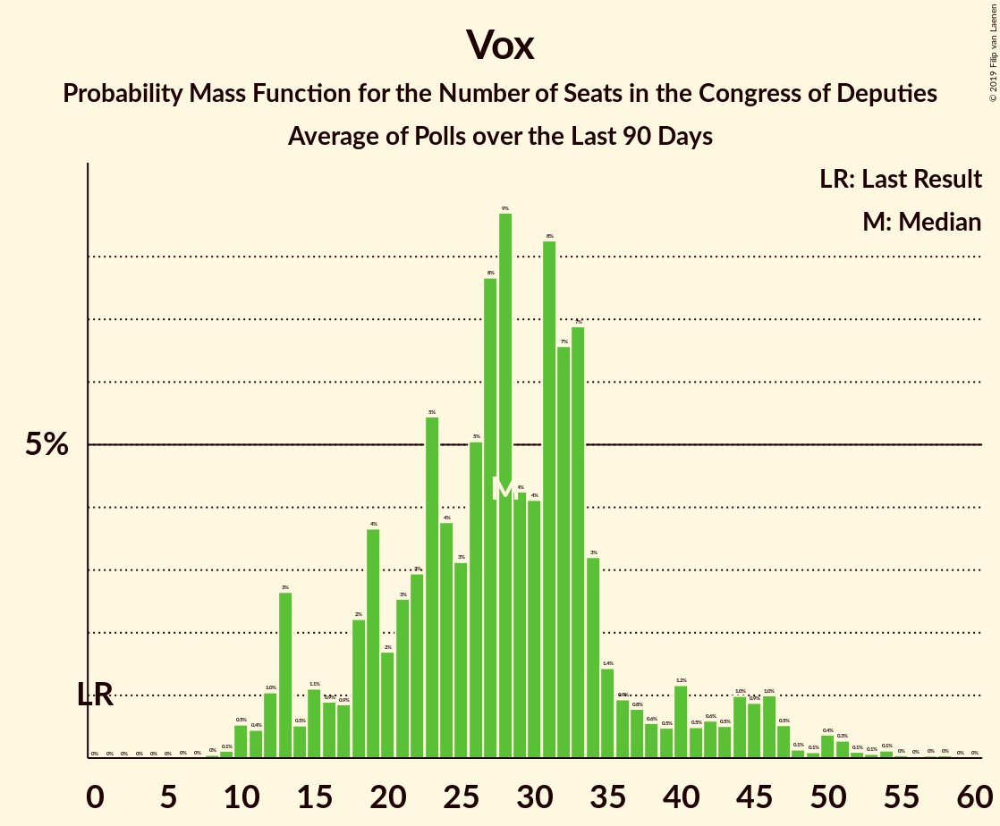

# Vox

<a href="#voting-intentions">Voting Intentions</a> | <a href="#seats">Seats</a>

## Voting Intentions

Last result: **0.2%** (General Election of 26 June 2016)

### Confidence Intervals

| Period     | Polling firm/Commissioner(s) | Median | 80% Confidence Interval | 90% Confidence Interval | 95% Confidence Interval | 99% Confidence Interval |
|:----------:|:----------------:|:-----------:|:-----------------------:|:-----------------------:|:-----------------------:|:-----------------------:|
| N/A | [Poll Average](average.html) | 10.7% | 6.9–13.3% | 6.5–13.8% | 6.2–14.2% | 5.8–15.1% |
| [13–15 February 2019](2019-02-15-SocioMétrica.html) | SocioMétrica   El Español | 11.8% | 10.6–13.2% | 10.2–13.6% | 9.9–14.0% | 9.4–14.7% |
| [11–15 February 2019](2019-02-15-NCReport.html) | NC Report   La Razón | 10.0% | 8.9–11.3% | 8.6–11.7% | 8.3–12.0% | 7.8–12.7% |
| [13–15 February 2019](2019-02-15-GESOP.html) | GESOP   El Periódico | 13.0% | 11.7–14.5% | 11.4–14.9% | 11.1–15.2% | 10.5–16.0% |
| [12–15 February 2019](2019-02-15-GAD3.html) | GAD3   La Vanguardia | 8.8% | 7.9–10.0% | 7.6–10.3% | 7.3–10.6% | 6.9–11.2% |
| [11–13 February 2019](2019-02-13-Metroscopia.html) | Metroscopia   Henneo | 12.7% | 11.8–13.7% | 11.5–14.0% | 11.3–14.2% | 10.9–14.7% |
| [1–8 February 2019](2019-02-08-SimpleLógica.html) | Simple Lógica | 11.7% | 10.5–13.1% | 10.2–13.5% | 9.9–13.8% | 9.3–14.5% |
| [4–8 February 2019](2019-02-08-Celeste-Tel.html) | Celeste-Tel   eldiario.es | 8.9% | 7.9–10.1% | 7.6–10.5% | 7.4–10.7% | 6.9–11.3% |
| [26–30 January 2019](2019-01-30-electoPanel.html) | electoPanel   electomania.es | 12.1% | 11.4–12.9% | 11.1–13.2% | 11.0–13.4% | 10.6–13.8% |
| [21–25 January 2019](2019-01-25-NCReport.html) | NC Report   La Razón | 9.4% | 8.3–10.7% | 8.0–11.1% | 7.7–11.4% | 7.2–12.0% |
| [14–24 January 2019](2019-01-24-GAD3.html) | GAD3   ABC | 9.8% | 8.9–10.7% | 8.7–11.0% | 8.5–11.2% | 8.1–11.7% |
| [9–15 January 2019](2019-01-15-Metroscopia.html) | Metroscopia   Henneo | 12.1% | 11.3–13.0% | 11.0–13.3% | 10.8–13.5% | 10.4–13.9% |
| [6–13 January 2019](2019-01-13-electoPanel.html) | electoPanel   electomania.es | 13.0% | 11.9–14.2% | 11.6–14.6% | 11.3–14.9% | 10.8–15.5% |
| [1–13 January 2019](2019-01-13-CIS.html) | CIS | 6.5% | 5.9–7.1% | 5.8–7.3% | 5.7–7.4% | 5.4–7.7% |
| [3–9 January 2019](2019-01-09-SimpleLógica.html) | Simple Lógica | 11.5% | 10.3–12.9% | 10.0–13.3% | 9.7–13.6% | 9.2–14.3% |
| [2–8 January 2019](2019-01-08-Celeste-Tel.html) | Celeste-Tel   eldiario.es | 8.1% | 7.1–9.3% | 6.8–9.6% | 6.6–9.9% | 6.2–10.4% |
| [22 December 2018–5 January 2019](2019-01-05-SocioMétrica.html) | SocioMétrica   El Español | 12.5% | 11.6–13.5% | 11.4–13.7% | 11.2–14.0% | 10.8–14.4% |
| [21–27 December 2018](2018-12-27-SigmaDos.html) | Sigma Dos   El Mundo | 12.9% | 11.6–14.4% | 11.3–14.8% | 11.0–15.1% | 10.4–15.9% |
| [16 December 2018](2018-12-16-SigmaDos.html) | Sigma Dos   Antena 3 | 9.2% | 8.1–10.5% | 7.8–10.8% | 7.6–11.2% | 7.1–11.8% |
| [10–14 December 2018](2018-12-14-SocioMétrica.html) | SocioMétrica   El Español | 8.6% | 7.5–9.9% | 7.1–10.2% | 6.9–10.6% | 6.4–11.2% |
| [3–14 December 2018](2018-12-14-SimpleLógica.html) | Simple Lógica | 8.7% | 7.8–9.9% | 7.5–10.2% | 7.3–10.5% | 6.8–11.0% |
| [5–14 December 2018](2018-12-14-NCReport.html) | NC Report   La Razón | 8.7% | 7.7–10.0% | 7.3–10.3% | 7.1–10.6% | 6.6–11.2% |
| [10–14 December 2018](2018-12-14-GAD3.html) | GAD3   ABC | 8.7% | 7.6–9.9% | 7.3–10.3% | 7.1–10.6% | 6.6–11.2% |
| [10–13 December 2018](2018-12-13-IMOP.html) | IMOP   El Confidencial | 8.0% | 7.0–9.2% | 6.7–9.5% | 6.5–9.8% | 6.1–10.4% |
| [10–12 December 2018](2018-12-12-Metroscopia.html) | Metroscopia   Henneo | 11.5% | 10.6–12.5% | 10.3–12.8% | 10.1–13.0% | 9.7–13.5% |
| [3–11 December 2018](2018-12-11-Celeste-Tel.html) | Celeste-Tel   eldiario.es | 6.8% | 5.9–7.9% | 5.7–8.2% | 5.5–8.5% | 5.1–9.0% |
| [3–7 December 2018](2018-12-07-Invymark.html) | Invymark   laSexta | 7.3% | 6.4–8.4% | 6.2–8.7% | 6.0–9.0% | 5.6–9.5% |
| [3–4 December 2018](2018-12-04-electoPanel.html) | electoPanel   electomania.es | 10.4% | 9.4–11.5% | 9.2–11.8% | 9.0–12.0% | 8.5–12.6% |
| [2–14 November 2018](2018-11-14-SimpleLógica.html) | Simple Lógica | 0.0% | N/A | N/A | N/A | N/A |
| [5–9 November 2018](2018-11-09-NCReport.html) | NC Report   La Razón | 2.1% | 1.6–2.8% | 1.5–3.0% | 1.4–3.2% | 1.2–3.6% |
| [5–9 November 2018](2018-11-09-Celeste-Tel.html) | Celeste-Tel   eldiario.es | 1.5% | 1.2–2.1% | 1.1–2.3% | 1.0–2.5% | 0.8–2.8% |
| [22–30 October 2018](2018-10-30-GESOP.html) | GESOP   El Periódico | 4.3% | 3.5–5.3% | 3.3–5.6% | 3.1–5.8% | 2.8–6.3% |
| [20–26 October 2018](2018-10-26-electoPanel.html) | electoPanel   electomania.es | 3.6% | 2.9–4.4% | 2.7–4.7% | 2.6–4.9% | 2.3–5.3% |
| [16–18 October 2018](2018-10-18-Metroscopia.html) | Metroscopia   Henneo | 5.1% | 4.5–5.9% | 4.3–6.1% | 4.1–6.3% | 3.8–6.7% |
| [1–11 October 2018](2018-10-11-NCReport.html) | NC Report   La Razón | 1.9% | 1.4–2.6% | 1.3–2.8% | 1.2–3.0% | 1.0–3.3% |
| [1–9 October 2018](2018-10-09-CIS.html) | CIS | 1.3% | 1.1–1.6% | 1.0–1.7% | 1.0–1.8% | 0.9–2.0% |
| [1–5 October 2018](2018-10-05-SimpleLógica.html) | Simple Lógica | 0.0% | N/A | N/A | N/A | N/A |
| [1–5 October 2018](2018-10-05-Celeste-Tel.html) | Celeste-Tel   eldiario.es | 1.0% | 0.7–1.5% | 0.6–1.7% | 0.6–1.8% | 0.4–2.1% |
| [2 October 2018](2018-10-02-SimpleLógica.html) | Simple Lógica   eldebate.es | 2.0% | 1.5–2.7% | 1.4–2.9% | 1.3–3.1% | 1.1–3.4% |
| [17–19 September 2018](2018-09-19-Metroscopia.html) | Metroscopia   Henneo | 0.0% | N/A | N/A | N/A | N/A |
| [17–19 September 2018](2018-09-19-InstitutoDYM.html) | Instituto DYM   El Independiente | 0.0% | N/A | N/A | N/A | N/A |
| [6–11 September 2018](2018-09-11-IMOP.html) | IMOP   El Confidencial | 3.0% | 2.4–3.8% | 2.2–4.0% | 2.1–4.2% | 1.8–4.6% |
| [1–11 September 2018](2018-09-11-CIS.html) | CIS | 1.4% | 1.2–1.7% | 1.1–1.8% | 1.0–1.9% | 0.9–2.1% |
| [7–9 September 2018](2018-09-09-electoPanel.html) | electoPanel   electomania.es | 1.6% | 1.2–2.2% | 1.1–2.4% | 1.0–2.6% | 0.9–2.9% |
| [3–7 September 2018](2018-09-07-SimpleLógica.html) | Simple Lógica | 0.0% | N/A | N/A | N/A | N/A |
| [3–7 September 2018](2018-09-07-GAD3.html) | GAD3   ABC | 1.5% | 1.1–2.1% | 1.0–2.3% | 0.9–2.5% | 0.7–2.8% |
| [3–7 September 2018](2018-09-07-Celeste-Tel.html) | Celeste-Tel   eldiario.es | 0.0% | N/A | N/A | N/A | N/A |
| [27–31 August 2018](2018-08-31-NCReport.html) | NC Report   La Razón | 0.0% | N/A | N/A | N/A | N/A |
| [22–30 August 2018](2018-08-30-SocioMétrica.html) | SocioMétrica   El Español | 1.8% | 1.4–2.4% | 1.3–2.6% | 1.2–2.8% | 1.0–3.1% |
| [1–7 August 2018](2018-08-07-Celeste-Tel.html) | Celeste-Tel   eldiario.es | 0.0% | N/A | N/A | N/A | N/A |
| [27 July–3 August 2018](2018-08-03-electoPanel.html) | electoPanel   electomania.es | 1.0% | 0.7–1.5% | 0.6–1.7% | 0.6–1.8% | 0.4–2.1% |
| [1–3 August 2018](2018-08-03-SimpleLógica.html) | Simple Lógica | 0.0% | N/A | N/A | N/A | N/A |
| [23–27 July 2018](2018-07-27-NCReport.html) | NC Report   La Razón | 0.0% | N/A | N/A | N/A | N/A |
| [24–26 July 2018](2018-07-26-GAD3.html) | GAD3   ABC | 0.0% | N/A | N/A | N/A | N/A |
| [16–25 July 2018](2018-07-25-Metroscopia.html) | Metroscopia   Henneo | 0.0% | N/A | N/A | N/A | N/A |
| [22–25 July 2018](2018-07-25-DemoscopiayServicios.html) | Demoscopia y Servicios   OKDIARIO | 0.0% | N/A | N/A | N/A | N/A |
| [17–22 July 2018](2018-07-22-electoPanel.html) | electoPanel   electomania.es | 1.7% | 1.4–2.0% | 1.3–2.1% | 1.3–2.2% | 1.1–2.4% |
| [9–12 July 2018](2018-07-12-SigmaDos.html) | Sigma Dos   El Mundo | 0.0% | N/A | N/A | N/A | N/A |
| [1–10 July 2018](2018-07-10-CIS.html) | CIS | 0.0% | N/A | N/A | N/A | N/A |
| [2–6 July 2018](2018-07-06-SimpleLógica.html) | Simple Lógica | 0.0% | N/A | N/A | N/A | N/A |
| [2–6 July 2018](2018-07-06-Celeste-Tel.html) | Celeste-Tel   eldiario.es | 0.0% | N/A | N/A | N/A | N/A |
| [25–30 June 2018](2018-06-30-NCReport.html) | NC Report   La Razón | 0.0% | N/A | N/A | N/A | N/A |
| [19–22 June 2018](2018-06-22-SocioMétrica.html) | SocioMétrica   El Español | 2.1% | 1.6–2.8% | 1.5–3.0% | 1.4–3.2% | 1.2–3.6% |
| [11–13 June 2018](2018-06-13-GESOP.html) | GESOP   El Periódico | 0.0% | N/A | N/A | N/A | N/A |
| [11–12 June 2018](2018-06-12-InstitutoDYM.html) | Instituto DYM   El Independiente | 0.0% | N/A | N/A | N/A | N/A |
| [1–9 June 2018](2018-06-09-NCReport.html) | NC Report   La Razón | 0.0% | N/A | N/A | N/A | N/A |
| [4–8 June 2018](2018-06-08-SimpleLógica.html) | Simple Lógica | 0.0% | N/A | N/A | N/A | N/A |
| [7–8 June 2018](2018-06-08-GAD3.html) | GAD3   ABC | 1.1% | 0.8–1.8% | 0.7–2.0% | 0.6–2.1% | 0.5–2.5% |
| [4–8 June 2018](2018-06-08-Celeste-Tel.html) | Celeste-Tel   eldiario.es | 0.0% | N/A | N/A | N/A | N/A |
| [26 May–2 June 2018](2018-06-02-electoPanel.html) | electoPanel   electomania.es | 4.6% | 4.1–5.3% | 3.9–5.4% | 3.8–5.6% | 3.5–5.9% |
| [26–28 May 2018](2018-05-28-electoPanel.html) | electoPanel   electomania.es | 3.1% | 2.6–3.8% | 2.4–4.0% | 2.3–4.1% | 2.1–4.5% |
| [23–28 May 2018](2018-05-28-IMOP.html) | IMOP   El Confidencial | 0.0% | N/A | N/A | N/A | N/A |
| [17–26 May 2018](2018-05-26-SocioMétrica.html) | SocioMétrica   El Español | 1.9% | 1.5–2.4% | 1.4–2.5% | 1.3–2.7% | 1.2–2.9% |
| [16–25 May 2018](2018-05-25-NCReport.html) | NC Report   La Razón | 0.0% | N/A | N/A | N/A | N/A |
| [3–10 May 2018](2018-05-10-SimpleLógica.html) | Simple Lógica | 0.0% | N/A | N/A | N/A | N/A |
| [7–9 May 2018](2018-05-09-Metroscopia.html) | Metroscopia   El País | 0.0% | N/A | N/A | N/A | N/A |
| [26–30 April 2018](2018-04-30-Celeste-Tel.html) | Celeste-Tel   PSOE | 0.0% | N/A | N/A | N/A | N/A |
| [12–18 April 2018](2018-04-18-GESOP.html) | GESOP   El Periódico | 0.0% | N/A | N/A | N/A | N/A |
| [9–13 April 2018](2018-04-13-NCReport.html) | NC Report   La Razón | 0.0% | N/A | N/A | N/A | N/A |
| [1–10 April 2018](2018-04-10-CIS.html) | CIS | 0.0% | N/A | N/A | N/A | N/A |
| [2–9 April 2018](2018-04-09-SimpleLógica.html) | Simple Lógica | 0.0% | N/A | N/A | N/A | N/A |
| [2–6 April 2018](2018-04-06-Celeste-Tel.html) | Celeste-Tel   eldiario.es | 0.0% | N/A | N/A | N/A | N/A |
| [4–5 April 2018](2018-04-05-Metroscopia.html) | Metroscopia   El País | 0.0% | N/A | N/A | N/A | N/A |
| [19–29 March 2018](2018-03-29-SocioMétrica.html) | SocioMétrica   El Español | 1.5% | 1.1–2.1% | 1.0–2.3% | 0.9–2.5% | 0.7–2.8% |
| [23–27 March 2018](2018-03-27-SigmaDos.html) | Sigma Dos   El Mundo | 0.0% | N/A | N/A | N/A | N/A |
| [13–16 March 2018](2018-03-16-MyWord.html) | MyWord   Cadena SER | 0.0% | N/A | N/A | N/A | N/A |
| [12–14 March 2018](2018-03-14-GAD3.html) | GAD3   La Vanguardia | 0.0% | N/A | N/A | N/A | N/A |
| [1–7 March 2018](2018-03-07-SimpleLógica.html) | Simple Lógica | 0.0% | N/A | N/A | N/A | N/A |
| [1–7 March 2018](2018-03-07-Celeste-Tel.html) | Celeste-Tel   eldiario.es | 0.0% | N/A | N/A | N/A | N/A |
| [2–5 March 2018](2018-03-05-Metroscopia.html) | Metroscopia   El País | 0.0% | N/A | N/A | N/A | N/A |
| [26 February–2 March 2018](2018-03-02-NCReport.html) | NC Report   La Razón | 0.0% | N/A | N/A | N/A | N/A |
| [22–27 February 2018](2018-02-27-IMOP.html) | IMOP   El Confidencial | 0.0% | N/A | N/A | N/A | N/A |
| [7–14 February 2018](2018-02-14-MyWord.html) | MyWord   Cadena SER | 0.0% | N/A | N/A | N/A | N/A |
| [5–9 February 2018](2018-02-09-Celeste-Tel.html) | Celeste-Tel   eldiario.es | 0.0% | N/A | N/A | N/A | N/A |
| [5–8 February 2018](2018-02-08-Metroscopia.html) | Metroscopia   El País | 0.0% | N/A | N/A | N/A | N/A |
| [1–7 February 2018](2018-02-07-SimpleLógica.html) | Simple Lógica | 0.0% | N/A | N/A | N/A | N/A |
| [31 January–7 February 2018](2018-02-07-GAD3.html) | GAD3   ABC | 0.0% | N/A | N/A | N/A | N/A |

### Probability Mass Function

The following table shows the probability mass function per percentage block of voting intentions for the [poll average](average.html) for Vox.

| Voting Intentions | Probability | Accumulated | Special Marks |
|:-----------------:|:-----------:|:-----------:|:-------------:|
| 0.0–0.5% | 0% | 100% | Last Result |
| 0.5–1.5% | 0% | 100% |  |
| 1.5–2.5% | 0% | 100% |  |
| 2.5–3.5% | 0% | 100% |  |
| 3.5–4.5% | 0% | 100% |  |
| 4.5–5.5% | 0.1% | 100% |  |
| 5.5–6.5% | 6% | 99.9% |  |
| 6.5–7.5% | 10% | 94% |  |
| 7.5–8.5% | 12% | 84% |  |
| 8.5–9.5% | 12% | 72% |  |
| 9.5–10.5% | 9% | 60% |  |
| 10.5–11.5% | 11% | 51% | Median |
| 11.5–12.5% | 19% | 41% |  |
| 12.5–13.5% | 15% | 22% |  |
| 13.5–14.5% | 6% | 7% |  |
| 14.5–15.5% | 1.3% | 1.5% |  |
| 15.5–16.5% | 0.2% | 0.2% |  |
| 16.5–17.5% | 0% | 0% |  |

## Seats

Last result: **0** seats (General Election of 26 June 2016)

### Confidence Intervals

| Period     | Polling firm/Commissioner(s) | Median | 80% Confidence Interval | 90% Confidence Interval | 95% Confidence Interval | 99% Confidence Interval |
|:----------:|:----------------:|:------:|:-----------------------:|:-----------------------:|:-----------------------:|:-----------------------:|
| N/A | [Poll Average](average.html) | 26 | 13–39 | 10–43 | 9–45 | 8–50 |
| [13–15 February 2019](2019-02-15-SocioMétrica.html) | SocioMétrica   El Español | 30 | 26–39 | 25–40 | 23–43 | 21–48 |
| [11–15 February 2019](2019-02-15-NCReport.html) | NC Report   La Razón | 23 | 18–27 | 17–28 | 16–28 | 14–31 |
| [13–15 February 2019](2019-02-15-GESOP.html) | GESOP   El Periódico | 37 | 31–45 | 29–48 | 28–50 | 26–54 |
| [12–15 February 2019](2019-02-15-GAD3.html) | GAD3   La Vanguardia | 19 | 14–21 | 13–23 | 13–25 | 12–27 |
| [11–13 February 2019](2019-02-13-Metroscopia.html) | Metroscopia   Henneo | 33 | 30–40 | 29–41 | 28–43 | 26–46 |
| [1–8 February 2019](2019-02-08-SimpleLógica.html) | Simple Lógica | 32 | 27–41 | 25–43 | 24–45 | 21–50 |
| [4–8 February 2019](2019-02-08-Celeste-Tel.html) | Celeste-Tel   eldiario.es | 21 | 17–21 | 16–24 | 15–24 | 13–27 |
| [26–30 January 2019](2019-01-30-electoPanel.html) | electoPanel   electomania.es | 31 | 27–36 | 26–38 | 26–40 | 25–42 |
| [21–25 January 2019](2019-01-25-NCReport.html) | NC Report   La Razón | 20 | 15–24 | 12–25 | 12–25 | 11–27 |
| [14–24 January 2019](2019-01-24-GAD3.html) | GAD3   ABC | 26 | 20–27 | 20–27 | 20–27 | 20–27 |
| [9–15 January 2019](2019-01-15-Metroscopia.html) | Metroscopia   Henneo | 29 | 27–34 | 27–38 | 26–40 | 25–43 |
| [6–13 January 2019](2019-01-13-electoPanel.html) | electoPanel   electomania.es | 38 | 27–38 | 27–44 | 27–47 | 25–49 |
| [1–13 January 2019](2019-01-13-CIS.html) | CIS | 12 | 9–14 | 8–16 | 8–16 | 8–18 |
| [3–9 January 2019](2019-01-09-SimpleLógica.html) | Simple Lógica | 30 | 26–39 | 24–41 | 22–43 | 21–47 |
| [2–8 January 2019](2019-01-08-Celeste-Tel.html) | Celeste-Tel   eldiario.es | 13 | 13–17 | 12–21 | 11–21 | 9–23 |
| [22 December 2018–5 January 2019](2019-01-05-SocioMétrica.html) | SocioMétrica   El Español | 41 | 28–41 | 28–44 | 28–44 | 28–44 |
| [21–27 December 2018](2018-12-27-SigmaDos.html) | Sigma Dos   El Mundo | 38 | 28–46 | 27–49 | 27–50 | 25–52 |
| [16 December 2018](2018-12-16-SigmaDos.html) | Sigma Dos   Antena 3 | 20 | 16–25 | 15–26 | 13–27 | 12–29 |
| [10–14 December 2018](2018-12-14-SocioMétrica.html) | SocioMétrica   El Español | 20 | 18–20 | 18–20 | 18–20 | 18–20 |
| [3–14 December 2018](2018-12-14-SimpleLógica.html) | Simple Lógica | 17 | 16–20 | 12–20 | 12–22 | 12–29 |
| [5–14 December 2018](2018-12-14-NCReport.html) | NC Report   La Razón | 14 | 14 | 14 | 14 | 14–18 |
| [10–14 December 2018](2018-12-14-GAD3.html) | GAD3   ABC | 14 | 14 | 14 | 14 | 14–19 |
| [10–13 December 2018](2018-12-13-IMOP.html) | IMOP   El Confidencial | 16 | 12–20 | 11–21 | 10–24 | 9–25 |
| [10–12 December 2018](2018-12-12-Metroscopia.html) | Metroscopia   Henneo | 28 | 28–32 | 28–33 | 28–34 | 22–37 |
| [3–11 December 2018](2018-12-11-Celeste-Tel.html) | Celeste-Tel   eldiario.es | 7 | 7 | 7 | 7 | 7 |
| [3–7 December 2018](2018-12-07-Invymark.html) | Invymark   laSexta | 12 | 9–17 | 9–18 | 7–18 | 6–20 |
| [3–4 December 2018](2018-12-04-electoPanel.html) | electoPanel   electomania.es | 27 | 27 | 27 | 26–27 | 24–35 |
| [2–14 November 2018](2018-11-14-SimpleLógica.html) | Simple Lógica |  |  |  |  |  |
| [5–9 November 2018](2018-11-09-NCReport.html) | NC Report   La Razón | 2 | 2–3 | 1–3 | 1–3 | 1–3 |
| [5–9 November 2018](2018-11-09-Celeste-Tel.html) | Celeste-Tel   eldiario.es | 2 | 2 | 1–2 | 1–2 | 0–3 |
| [22–30 October 2018](2018-10-30-GESOP.html) | GESOP   El Periódico | 4 | 4–6 | 4–6 | 3–6 | 3–6 |
| [20–26 October 2018](2018-10-26-electoPanel.html) | electoPanel   electomania.es | 6 | 2–6 | 2–6 | 2–6 | 2–6 |
| [16–18 October 2018](2018-10-18-Metroscopia.html) | Metroscopia   Henneo | 8 | 8 | 4–8 | 3–8 | 3–8 |
| [1–11 October 2018](2018-10-11-NCReport.html) | NC Report   La Razón | 1 | 1–2 | 1–2 | 0–2 | 0–3 |
| [1–9 October 2018](2018-10-09-CIS.html) | CIS | 1 | 1 | 1 | 0–1 | 0–1 |
| [1–5 October 2018](2018-10-05-SimpleLógica.html) | Simple Lógica |  |  |  |  |  |
| [1–5 October 2018](2018-10-05-Celeste-Tel.html) | Celeste-Tel   eldiario.es | 2 | 1–2 | 0–2 | 0–2 | 0–2 |
| [2 October 2018](2018-10-02-SimpleLógica.html) | Simple Lógica   eldebate.es | 2 | 2–3 | 1–3 | 1–3 | 0–3 |
| [17–19 September 2018](2018-09-19-Metroscopia.html) | Metroscopia   Henneo |  |  |  |  |  |
| [17–19 September 2018](2018-09-19-InstitutoDYM.html) | Instituto DYM   El Independiente |  |  |  |  |  |
| [6–11 September 2018](2018-09-11-IMOP.html) | IMOP   El Confidencial | 2 | 2–6 | 2–6 | 1–6 | 1–6 |
| [1–11 September 2018](2018-09-11-CIS.html) | CIS | 1 | 0–1 | 0–1 | 0–1 | 0–1 |
| [7–9 September 2018](2018-09-09-electoPanel.html) | electoPanel   electomania.es | 1 | 1 | 1 | 1–2 | 0–2 |
| [3–7 September 2018](2018-09-07-SimpleLógica.html) | Simple Lógica |  |  |  |  |  |
| [3–7 September 2018](2018-09-07-GAD3.html) | GAD3   ABC | 1 | 1 | 1 | 1 | 0–2 |
| [3–7 September 2018](2018-09-07-Celeste-Tel.html) | Celeste-Tel   eldiario.es |  |  |  |  |  |
| [27–31 August 2018](2018-08-31-NCReport.html) | NC Report   La Razón |  |  |  |  |  |
| [22–30 August 2018](2018-08-30-SocioMétrica.html) | SocioMétrica   El Español | 1 | 1–2 | 1–2 | 1–2 | 1–2 |
| [1–7 August 2018](2018-08-07-Celeste-Tel.html) | Celeste-Tel   eldiario.es |  |  |  |  |  |
| [27 July–3 August 2018](2018-08-03-electoPanel.html) | electoPanel   electomania.es | 1 | 0–1 | 0–1 | 0–1 | 0–1 |
| [1–3 August 2018](2018-08-03-SimpleLógica.html) | Simple Lógica |  |  |  |  |  |
| [23–27 July 2018](2018-07-27-NCReport.html) | NC Report   La Razón |  |  |  |  |  |
| [24–26 July 2018](2018-07-26-GAD3.html) | GAD3   ABC |  |  |  |  |  |
| [16–25 July 2018](2018-07-25-Metroscopia.html) | Metroscopia   Henneo |  |  |  |  |  |
| [22–25 July 2018](2018-07-25-DemoscopiayServicios.html) | Demoscopia y Servicios   OKDIARIO |  |  |  |  |  |
| [17–22 July 2018](2018-07-22-electoPanel.html) | electoPanel   electomania.es | 1 | 1 | 1 | 1 | 1–2 |
| [9–12 July 2018](2018-07-12-SigmaDos.html) | Sigma Dos   El Mundo |  |  |  |  |  |
| [1–10 July 2018](2018-07-10-CIS.html) | CIS |  |  |  |  |  |
| [2–6 July 2018](2018-07-06-SimpleLógica.html) | Simple Lógica |  |  |  |  |  |
| [2–6 July 2018](2018-07-06-Celeste-Tel.html) | Celeste-Tel   eldiario.es |  |  |  |  |  |
| [25–30 June 2018](2018-06-30-NCReport.html) | NC Report   La Razón |  |  |  |  |  |
| [19–22 June 2018](2018-06-22-SocioMétrica.html) | SocioMétrica   El Español | 2 | 1–3 | 1–3 | 1–3 | 0–3 |
| [11–13 June 2018](2018-06-13-GESOP.html) | GESOP   El Periódico |  |  |  |  |  |
| [11–12 June 2018](2018-06-12-InstitutoDYM.html) | Instituto DYM   El Independiente |  |  |  |  |  |
| [1–9 June 2018](2018-06-09-NCReport.html) | NC Report   La Razón |  |  |  |  |  |
| [4–8 June 2018](2018-06-08-SimpleLógica.html) | Simple Lógica |  |  |  |  |  |
| [7–8 June 2018](2018-06-08-GAD3.html) | GAD3   ABC | 0 | 0–1 | 0–1 | 0–1 | 0–1 |
| [4–8 June 2018](2018-06-08-Celeste-Tel.html) | Celeste-Tel   eldiario.es |  |  |  |  |  |
| [26 May–2 June 2018](2018-06-02-electoPanel.html) | electoPanel   electomania.es | 6 | 6 | 4–6 | 4–6 | 4–6 |
| [26–28 May 2018](2018-05-28-electoPanel.html) | electoPanel   electomania.es | 2 | 2 | 2 | 2 | 2–6 |
| [23–28 May 2018](2018-05-28-IMOP.html) | IMOP   El Confidencial |  |  |  |  |  |
| [17–26 May 2018](2018-05-26-SocioMétrica.html) | SocioMétrica   El Español | 1 | 1–2 | 1–2 | 1–2 | 0–2 |
| [16–25 May 2018](2018-05-25-NCReport.html) | NC Report   La Razón |  |  |  |  |  |
| [3–10 May 2018](2018-05-10-SimpleLógica.html) | Simple Lógica |  |  |  |  |  |
| [7–9 May 2018](2018-05-09-Metroscopia.html) | Metroscopia   El País |  |  |  |  |  |
| [26–30 April 2018](2018-04-30-Celeste-Tel.html) | Celeste-Tel   PSOE |  |  |  |  |  |
| [12–18 April 2018](2018-04-18-GESOP.html) | GESOP   El Periódico |  |  |  |  |  |
| [9–13 April 2018](2018-04-13-NCReport.html) | NC Report   La Razón |  |  |  |  |  |
| [1–10 April 2018](2018-04-10-CIS.html) | CIS |  |  |  |  |  |
| [2–9 April 2018](2018-04-09-SimpleLógica.html) | Simple Lógica |  |  |  |  |  |
| [2–6 April 2018](2018-04-06-Celeste-Tel.html) | Celeste-Tel   eldiario.es |  |  |  |  |  |
| [4–5 April 2018](2018-04-05-Metroscopia.html) | Metroscopia   El País |  |  |  |  |  |
| [19–29 March 2018](2018-03-29-SocioMétrica.html) | SocioMétrica   El Español | 2 | 2 | 1–2 | 1–2 | 1–2 |
| [23–27 March 2018](2018-03-27-SigmaDos.html) | Sigma Dos   El Mundo |  |  |  |  |  |
| [13–16 March 2018](2018-03-16-MyWord.html) | MyWord   Cadena SER |  |  |  |  |  |
| [12–14 March 2018](2018-03-14-GAD3.html) | GAD3   La Vanguardia |  |  |  |  |  |
| [1–7 March 2018](2018-03-07-SimpleLógica.html) | Simple Lógica |  |  |  |  |  |
| [1–7 March 2018](2018-03-07-Celeste-Tel.html) | Celeste-Tel   eldiario.es |  |  |  |  |  |
| [2–5 March 2018](2018-03-05-Metroscopia.html) | Metroscopia   El País |  |  |  |  |  |
| [26 February–2 March 2018](2018-03-02-NCReport.html) | NC Report   La Razón |  |  |  |  |  |
| [22–27 February 2018](2018-02-27-IMOP.html) | IMOP   El Confidencial |  |  |  |  |  |
| [7–14 February 2018](2018-02-14-MyWord.html) | MyWord   Cadena SER |  |  |  |  |  |
| [5–9 February 2018](2018-02-09-Celeste-Tel.html) | Celeste-Tel   eldiario.es |  |  |  |  |  |
| [5–8 February 2018](2018-02-08-Metroscopia.html) | Metroscopia   El País |  |  |  |  |  |
| [1–7 February 2018](2018-02-07-SimpleLógica.html) | Simple Lógica |  |  |  |  |  |
| [31 January–7 February 2018](2018-02-07-GAD3.html) | GAD3   ABC |  |  |  |  |  |

### Probability Mass Function

The following table shows the probability mass function per seat for the [poll average](average.html) for Vox.

| Number of Seats | Probability | Accumulated | Special Marks |
|:---------------:|:-----------:|:-----------:|:-------------:|
| 0 | 0% | 100% | Last Result |
| 1 | 0% | 100% |  |
| 2 | 0% | 100% |  |
| 3 | 0% | 100% |  |
| 4 | 0% | 100% |  |
| 5 | 0% | 100% |  |
| 6 | 0.1% | 100% |  |
| 7 | 0.1% | 99.9% |  |
| 8 | 0.7% | 99.8% |  |
| 9 | 2% | 99.0% |  |
| 10 | 3% | 97% |  |
| 11 | 1.2% | 94% |  |
| 12 | 3% | 93% |  |
| 13 | 3% | 90% |  |
| 14 | 5% | 87% |  |
| 15 | 2% | 82% |  |
| 16 | 3% | 80% |  |
| 17 | 2% | 77% |  |
| 18 | 5% | 75% |  |
| 19 | 6% | 71% |  |
| 20 | 1.4% | 65% |  |
| 21 | 7% | 63% |  |
| 22 | 2% | 57% |  |
| 23 | 2% | 55% |  |
| 24 | 2% | 53% |  |
| 25 | 1.4% | 51% |  |
| 26 | 1.5% | 50% | Median |
| 27 | 4% | 49% |  |
| 28 | 3% | 44% |  |
| 29 | 3% | 41% |  |
| 30 | 3% | 38% |  |
| 31 | 3% | 35% |  |
| 32 | 3% | 32% |  |
| 33 | 5% | 29% |  |
| 34 | 3% | 24% |  |
| 35 | 3% | 21% |  |
| 36 | 2% | 19% |  |
| 37 | 3% | 16% |  |
| 38 | 2% | 14% |  |
| 39 | 2% | 12% |  |
| 40 | 1.2% | 9% |  |
| 41 | 1.5% | 8% |  |
| 42 | 1.3% | 7% |  |
| 43 | 1.1% | 5% |  |
| 44 | 1.2% | 4% |  |
| 45 | 0.7% | 3% |  |
| 46 | 0.7% | 2% |  |
| 47 | 0.4% | 2% |  |
| 48 | 0.3% | 1.3% |  |
| 49 | 0.2% | 0.9% |  |
| 50 | 0.3% | 0.7% |  |
| 51 | 0.2% | 0.4% |  |
| 52 | 0.2% | 0.3% |  |
| 53 | 0.1% | 0.1% |  |
| 54 | 0% | 0.1% |  |
| 55 | 0% | 0% |  |

